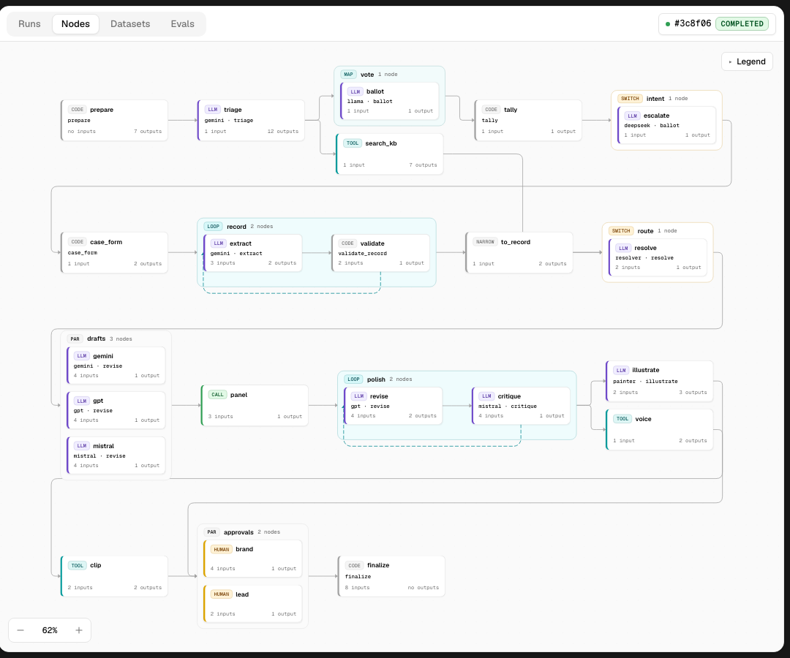
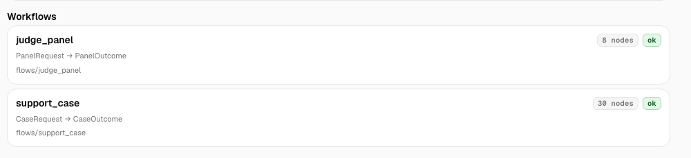
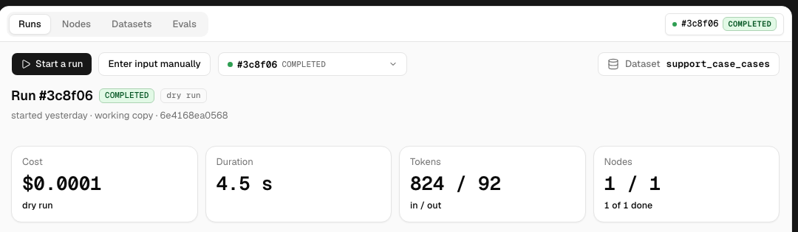
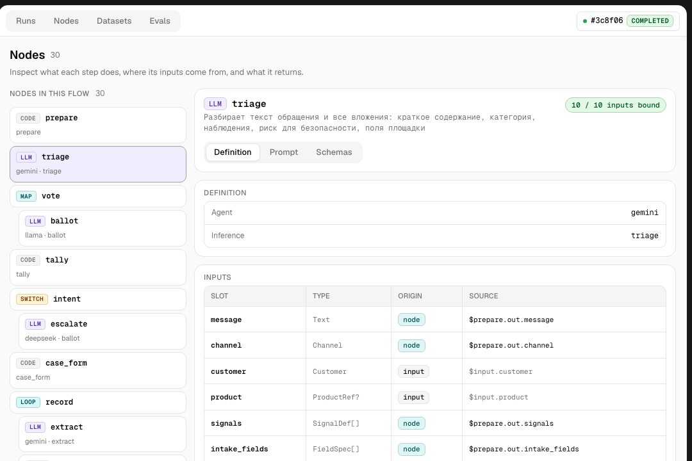
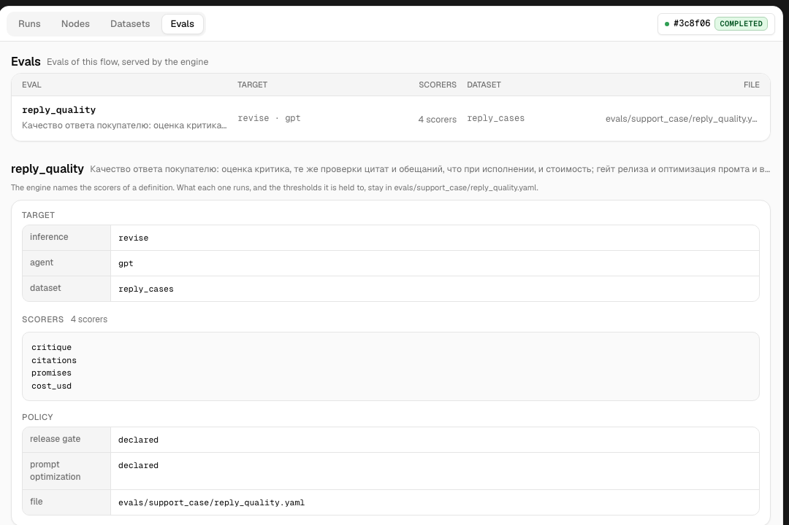

<div align="center">

# AQVEN

### AI workflows built for humans and coding agents.

Build your AI workflow, check it before it runs, and see exactly what it did.

[](LICENSE)
[](https://github.com/lastonoga/AQVEN/blob/main/packages/aqven/pyproject.toml)
[](https://aqvenstudio.com/reference/provider-catalog/)

**[Documentation](https://aqvenstudio.com)** · **[Quickstart](https://aqvenstudio.com/start/quickstart/)** · **[Studio guide](https://aqvenstudio.com/studio/)** · **[Reference](https://aqvenstudio.com/reference/)**

<br>



</div>

<br>

## AI workflows get hard to follow, fast.

The prompt is in one file. The model settings are in another. Routing lives in code. Tools are
somewhere else. Then your coding agent edits ten things at once, twice a week.

A month in, nobody on the team can say what actually happens — and it's not a demo. It runs
thousands of times before anyone notices something drifted.

> *"I don't recognize half of this."*
> *"Did it connect that output to the next step, or does it only look like it did?"*
> *"It reorganized three steps. What did it drop?"*
> *"It feels worse than last month. I can't prove it."*

It's live behind refunds, invoices, approvals, and customer records. AQVEN keeps that behavior as
something your team can read, check, and change with confidence — not something scattered across
prompts, glue code, and one person's memory.

<br>

## Quick start

```bash
uv tool install aqven
uv run aqven dev .
```

One command, pointed at the project you already have. It reads your project, checks it, and opens
Studio in the browser. No account, nothing to rewrite, nothing leaves your machine.

→ [Full quickstart](https://aqvenstudio.com/start/quickstart/)

<br>

## Your team can finally read the workflow

<table>
<tr>
<td width="50%" valign="top">

**See every step on one screen.**
What runs, what feeds what, where a person has to approve. Read from your files, not from a
diagram somebody drew six months ago.



</td>
<td width="50%" valign="top">

**Find where a bad result came from.**
Open the exact case and walk back to the first step that didn't do what it should.



</td>
</tr>
<tr>
<td width="50%" valign="top">

**Look inside any step.**
What went in, what came out, which model answered, what it cost. Raw values, not a summary.



</td>
<td width="50%" valign="top">

**See if quality is going up or down.**
Not one failure at a time. The direction, across every case you care about, after every change.



</td>
</tr>
</table>

**Check it before it runs.** Broken connections between steps, inputs that don't match, a prompt
pointing at something that isn't there. Caught before a customer finds it.

**Review a change like code.** A prompt edit shows up in your diff. Your teammate reviews the
logic in a pull request, the same as everything else you ship.

<br>

## Not a tracing tool. Not a drag-and-drop builder.

| | Tracing tools | Visual builders | AQVEN |
| --- | --- | --- | --- |
| Where the logic lives | Your code, scattered | Their platform | Files in your repo |
| Check before it runs | No | No | **Yes** |
| Your coding agent can edit it | No | No | **Yes** |
| Yours if they disappear | Yes | No | **Yes** |

Tracing shows you what happened, after it happened. Visual builders keep your logic on their
platform. AQVEN keeps the workflow as files in your repo — your team reads it, your agent edits
it, a command checks it.

<br>

## Your coding agent stops guessing

Claude Code and Cursor are already writing your AI workflows. Give them something to read.

- **It reads the whole workflow before it edits.** Steps, inputs, outputs, what connects to what.
- **It can't wire two steps together wrong.** Types don't match, the check fails — before
  production does.
- **It has to pass a check before it can say it's done.**
- **The docs are written for it,** not only for you — including a machine-readable
  [`llms.txt`](https://aqvenstudio.com/llms.txt).

<br>

## What's inside

Every part of an AI workflow, as files in your project.

| | |
| --- | --- |
| **Flows and nodes** | Ten node kinds — `llm`, `code`, `tool`, `human`, `switch`, `parallel`, `map`, `loop`, `call`, `narrow` — composed into a typed graph |
| **Types** | Records, enums, unions, IDs, values, and media, checked at every boundary — a model can't return a field that isn't declared |
| **Prompts** | Liquid templates, reusable fragments, and per-case variants — never a string inside YAML |
| **Providers** | 28 model providers through [Pydantic AI](https://ai.pydantic.dev/) — OpenAI, Anthropic, Google, OpenRouter, Mistral, DeepSeek, Groq, Together AI, and more |
| **Tools** | Python functions or MCP servers, with declared `read` / `write` / `external` effects |
| **Human review** | A workflow step that waits on a person, with a timeout and a default |
| **Datasets and evals** | Real cases, scored, so a change is proven before it ships |
| **Durable execution** | Built on [DBOS](https://www.dbos.dev/) — a run survives a crash and resumes where it left off |

→ [Full documentation](https://aqvenstudio.com)

<br>

## License

AQVEN is **source-available**, not open source, under the AQVEN License 1.0.0 — based on the
[PolyForm Shield License 1.0.0](https://polyformproject.org/licenses/shield/1.0.0), with one
addition.

You may use it for any purpose, including in production and in commercial products you build with
it: the AI workflows you create with AQVEN are yours, and selling them is explicitly permitted.

You may not use AQVEN — original or modified — to provide a product that competes with it. You may
redistribute copies of AQVEN itself only free of charge and for a non-commercial purpose. The
right to sell AQVEN itself stays with the licensor.

Copyright Kirill Burkhanov. Full terms: [LICENSE](LICENSE).

<div align="center">
<br>

**[Documentation](https://aqvenstudio.com)** · **[GitHub](https://github.com/lastonoga/AQVEN)**

</div>
