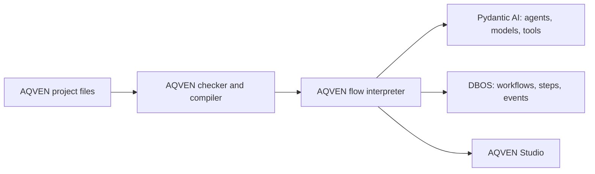

AQVEN builds on two Python libraries: [Pydantic AI](https://ai.pydantic.dev/) and [DBOS](https://docs.dbos.dev/python/). You use AQVEN's project and flow files to describe the system; the runtime uses primitives from both libraries.

| Layer | What it does in AQVEN |
| --- | --- |
| AQVEN | Loads YAML and Python definitions, checks contracts and references, compiles flow behavior, and exposes project, CLI, API, and Studio views. |
| Pydantic AI | Runs model-facing agents, model/provider adapters, typed outputs, tools, deferred tool requests, and model messages. |
| DBOS | Runs durable workflows and steps, records status and events, and supports waits, recovery, and resumption. |

For example, an AQVEN `llm` node is executed through a Pydantic AI `Agent`. AQVEN's runtime wraps node execution in DBOS steps; a flow run is a DBOS workflow. The flow's `switch`, `map`, `loop`, and `parallel` behavior comes from AQVEN's interpreter over those durable primitives. AQVEN is **not** a Pydantic Graph definition.

This split helps when debugging: a bad binding or prompt contract belongs to the AQVEN definition; a provider response belongs to the model call; an interrupted or waiting run belongs to the durable execution path. [Read a run in Studio](/studio/runs/).
