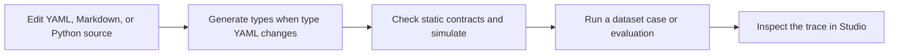

An AQVEN project is file-first. The files you commit describe the project; generated files and local runtime data are derived from them.

## Files you edit

| File or folder | Purpose |
| --- | --- |
| `aqven.yaml` | Project package, providers, policies, limits, and rename history. |
| `types/` | Type definitions used by flows, nodes, tools, and model output. |
| `flows/` | Flow contracts and node definitions. |
| `agents/` | Model-agent configuration. |
| `tools/` | Tool contracts and Python implementations. |
| `mcp/` | MCP server definitions available to model agents. |
| `datasets/` | Reusable run cases. |
| `evals/` | Evaluation definitions and their datasets. |
| Python files | Code nodes, tools, custom providers, policies, evaluators, and application entry points. |
| Markdown and Liquid files | Prompts, fragments, variants, and presentation templates. |

## Files AQVEN generates or owns

| File or folder | How it is created | What to do |
| --- | --- | --- |
| `types.py` | `{{CLI_COMMAND}} generate` | Import it; never edit it. |
| `.aqven/schema/` | `{{CLI_COMMAND}} schema` | Give it to a YAML-aware editor; regenerate after upgrades. |
| `.aqven/cache/` | `{{CLI_COMMAND}} check` simulation | Treat it as a disposable local cache. |
| Local runtime data | `{{CLI_COMMAND}} dev`, `serve`, or a run | Inspect it through Studio or the API; do not edit it as project source. |

## Change loop

Run `generate` whenever a type changes. Run `check` after every definition change. A successful check proves project wiring and offline simulation; it does not prove that a real model gives useful answers. Use [Datasets](/engineering/datasets/) and [Testing and Evaluation](/engineering/testing-and-evaluation/) for that evidence.

## Keep generated work out of reviews

If a change modifies generated `types.py`, review the corresponding type YAML first. If it modifies a runtime database or cache, review the source definition and the recorded run instead. This keeps code review focused on intent rather than artifacts.
