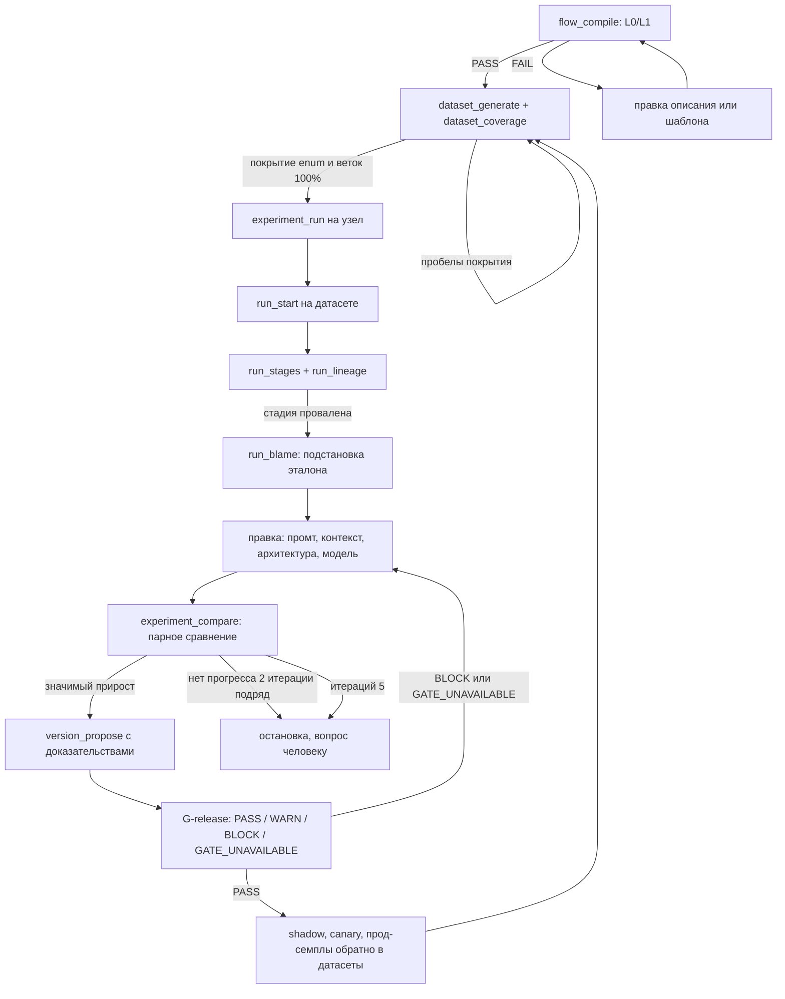

# 01. Продукт, требования и сквозной сценарий

> Статус: draft
> Зависит от: [02. Архитектура системы](02-architecture.md), [03. Ядро языка](03-core-language.md), [07. Компилятор](07-compiler.md), [14. MCP-контракт](14-mcp-contract.md), [23. API локальной студии](23-studio-api.md), [ADR-0025](adr/0025-python-engine.md), [ADR-0026](adr/0026-yaml-spec-and-code-refs.md), [ADR-0027](adr/0027-dynamic-io-shapes.md), [ADR-0028](adr/0028-studio-api-contract.md), [ADR-0029](adr/0029-trust-and-quality-python.md)
> Источники: спека §0, §1, §1.1, §2, §3, §12, §13.1–§13.3, §18, §20.5; [DECISIONS.md](DECISIONS.md); [research/py-stack-runtime.md](research/py-stack-runtime.md), [research/py-spec-as-code.md](research/py-spec-as-code.md), [research/py-quality-layer.md](research/py-quality-layer.md), [research/studio-api-inventory.md](research/studio-api-inventory.md)

## Зачем этот слой

Этот документ фиксирует предмет договора остального комплекта: что именно считается продуктом, какие
24 требования обязаны быть закрыты, в каком документе каждое реализуется и каким измеримым событием
оно считается закрытым. R23 в части VoltAgent и R21 в части экспорта отклонены решением владельца от
2026-09-16 ([ADR-0025](adr/0025-python-engine.md) §7); их строки сохранены с тем, что осталось в силе. Документ
переводит сквозной сценарий §1.1 в конкретную цепочку MCP-тулов и артефактов, чтобы этапы не расползались по
документам в разных формулировках. Из каталога §8 он закрывает нулевой пункт — «непонятно, что считать
готовым»: без общего списка требований с гейтами каждый слой доказывает готовность по-своему.

## Решения

| Решение | Что берём | Версия | Лицензия | Почему |
|---|---|---|---|---|
| Надёжное исполнение | dbos | 2.31.1 | MIT | R23 «не писать рантайм с нуля»: чекпоинт шага, восстановление, `fork_workflow`, ожидание сообщения с таймаутом; библиотека в процессе, SQLite локально, PostgreSQL 18 в проде ([ADR-0025](adr/0025-python-engine.md)) |
| Вызов моделей | pydantic-ai-slim[openai,anthropic,google] | 2.43.0 | MIT | типизированный выход с повтором, `WrapperModel` для гарантий, модель и инструкции на вызове (`Agent.run(model=..., instructions=...)`) |
| Модели данных и описания воркфлоу | pydantic | 2.13.5 | MIT | проверка на каждой границе, JSON Schema для редактора и провайдеров ([ADR-0026](adr/0026-yaml-spec-and-code-refs.md) §7) |
| Контракт для агентов | mcp, `MCPServer("aqven")` | 2.2.0 | MIT | R1 и R12: единый транспорт для Claude и любого MCP-клиента, на порту FastAPI ([ADR-0028](adr/0028-studio-api-contract.md)) |
| HTTP API и события | fastapi без extras + uvicorn | 0.141.1 / 0.53.0 | MIT / BSD-3-Clause | R2 и R10: API студии и вызов воркфлоу по HTTP, SSE, OpenAPI для типов студии ([23](23-studio-api.md)) |
| Трассы | opentelemetry-sdk + opentelemetry-exporter-otlp-proto-http, OTLP в Langfuse | 1.44.0 | Apache-2.0 | R7: провенанс прогонов; спаны вызовов — `InstrumentationSettings(version=5)` Pydantic AI ([ADR-0012](adr/0012-langfuse-as-store.md), ADR-0025 §8) |
| Прогонщик экспериментов и формат датасета | pydantic-evals | 2.43.0 | MIT | R9: эксперименты без своего раннера; гейт и статистика — наши ([ADR-0029](adr/0029-trust-and-quality-python.md) §9–§10) |
| Имена тулов | `snake_case` с префиксом группы | — | — | точки в именах тулов невалидны (ограничение Messages API); §13.1 спеки переименовывается целиком |
| Исходы гейта выпуска | PASS / WARN / BLOCK / GATE_UNAVAILABLE | — | — | недоступный гейт не равен пройденному; R9 и R11 опираются на различимость этих исходов |

Версии здесь — выдержка из `DECISIONS.md`; полная ось версий и лицензии там, дублирование в других
документах запрещено.

## 1. Что строим и главная идея

Платформа, в которой Claude или любой другой MCP-агент собирает, запускает, отлаживает и в цикле чинит
многошаговые LLM-воркфлоу (15+ шагов, параллелизм, дивергенция, конвергенция, циклы), а человек видит
то же самое визуально, настраивает модели и агентов и пишет evals.

Главная идея в одном предложении: **агент не пишет код оркестрации — он редактирует типизированную
спеку (IR) через операции, а гарантии живут в ядре доверия, а не в промтах.** Три следствия, которые
определяют весь комплект:

| Компонент ядра доверия | Что гарантирует | Где описан |
|---|---|---|
| Компилятор | типовая ошибка агента не доходит до прогона: правила L0/L1 отвергают спеку | [07. Компилятор](07-compiler.md) |
| Рантайм и исполнители узлов | формат вывода, провенанс каждого куска контекста, бюджеты и лимиты | [10. Рантайм](10-runtime.md) |
| Гейты | непроверенное изменение не выпускается: доказательство — эксперимент на датасете | [13. Evals и гейты](13-evals-and-gates.md) |

Разделение труда с готовыми библиотеками ([ADR-0025](adr/0025-python-engine.md) §3). Готовые: чекпоинт шага,
восстановление после падения, fork с шага, ожидание сообщения с таймаутом и очереди — DBOS 2.31.1; вызов модели
с типизированным выходом и повтором, модель и инструкции на вызове, бюджеты, спаны вызовов — Pydantic AI 2.43.0;
прогонщик экспериментов — pydantic-evals 2.43.0; MCP-сервер — mcp 2.2.0; HTTP API и SSE — FastAPI 0.141.1. Наше —
проекты (файлы определений и индекс в БД), описание воркфлоу YAML на Pydantic-моделях
([ADR-0026](adr/0026-yaml-spec-and-code-refs.md)), IR, реестры, компилятор, исполнитель IR (функция DBOS-workflow,
узел — DBOS-шаг), исполнители узлов с гарантиями, цепочка гарантий вызова модели
([ADR-0029](adr/0029-trust-and-quality-python.md) §1), MCP-контракт для агентов и Studio. Границу и список того, что
готовые библиотеки не дают (первое совпадение в `switch`, лимиты циклов, `quorum(k)`, `on_item_error`, связь шага
DBOS с адресом исполнения узла, ключи идемпотентности, узел `human` поверх примитивов DBOS, три исхода вызова,
кассеты и редакция PII), держит `DECISIONS.md` «Наш слой», механику — [02. Архитектура системы](02-architecture.md).

Ядро маленькое: примитивы и комбинаторы. Судьи, панели, циклы, каскады, агенты и архетипы — не
встроенные сущности, а компоненты, раскрываемые до примитивов (`component_expand`). Это и есть
проверяемая формулировка «свободы композиции» из R16.

## 2. Требования R1–R24

`K1…K15` — номера kill-критериев спеки §18; K14 и K15 отменены решением владельца от 2026-09-16
([ADR-0025](adr/0025-python-engine.md) §7), формулировка K13 без бандла — ADR-0025 ОВ 15. Гейты: `G-compile`
(`flow_compile`: правила L0/L1 отвергают спеку), `G-coverage` (отчёт покрытия датасета), `G-exp` (гейты
экспериментов §12: у каждого изменённого узла датасет не меньше минимального размера, нет регрессии на
детерминированных скорерах, прирост по LLM-метрикам значим, судья откалиброван), `G-release` (гейт выпуска с
четырьмя исходами PASS / WARN / BLOCK / GATE_UNAVAILABLE). `G-conformance` отменён вместе с конформансом против
воссозданной реализации (ADR-0025 §7). Каждое требование обязано иметь и документ, и проверку; строк без проверки
в таблице нет.

| ID | Требование | Где реализуется | Как проверяется |
|---|---|---|---|
| R1 | Подключение к Claude и любому MCP-агенту; агент сам собирает, запускает, отлаживает и чинит воркфлоу | [14. MCP-контракт](14-mcp-contract.md), [23. API локальной студии](23-studio-api.md) §13 | K2: Claude собирает эталонный 15-шаговый воркфлоу с нуля до чистой компиляции и зелёного прогона без ручной правки промта, ≤ N итераций |
| R2 | Визуальный граф — просмотр и правка; отладка прогона по узлам | [15. Studio](15-studio-frontend.md), [23. API локальной студии](23-studio-api.md) | K11: blame на подсаженной неисправности указывает на виновный узел ≥ 90% случаев, узел открывается в канвасе из отчёта |
| R3 | Настройка моделей: провайдеры, параметры, фолбэки, лимиты, стоимость | [11. Провайдеры и каталог моделей](11-providers.md) | K10: хотя бы для одного узла найдена модель или провайдер дешевле базовой на ≥ X% при качестве в пределах ε |
| R4 | Настройка агентов: тулы, память, саб-агенты, границы автономии | [06. Реестры](06-registries.md), [19. Безопасность и политики](19-security-and-policies.md) | `G-compile`: тул или агент вне реестра — ошибка L1; `agent_effective_config(node)` возвращает итоговую конфигурацию с происхождением каждого поля |
| R5 | Пайплайны 15+ шагов: параллелизм, дивергенция, конвергенция, циклы, подворкфлоу | [03. Ядро языка](03-core-language.md), [04. Формат IR](04-ir-schema.md) | K2 на эталонном 15-шаговом воркфлоу + K1 (мутанты комбинаторов) |
| R6 | Агент не может сломать промты, схемы вывода и привязку контекста | [07. Компилятор](07-compiler.md) | K1: ≥ 50 мутантов классов L0/L1, компилятор ловит 100% |
| R7 | Отладка: данные по узлам, отрисованный промт, происхождение каждого куска контекста, переигрывание | [12. Наблюдаемость и отладка](12-observability.md) | K5: прод-сбой воспроизводится через `run_replay_node` без расхождений |
| R8 | Типовые проблемы закрыты архитектурно (каталог §8) | [07. Компилятор](07-compiler.md), [10. Рантайм](10-runtime.md) | K1 по классам L0/L1; для L2–L4 — `G-exp` и `G-release` (каждая проблема каталога привязана к механизму и уровню гарантии) |
| R9 | Evals пишут и человек, и агент; цикл «тест → правка → проверка» | [13. Evals и гейты](13-evals-and-gates.md) | `G-exp` + K7: LLM-судья гейтит выпуск только при weighted kappa ≥ 0.7 и Krippendorff alpha ≥ 0.8 |
| R10 | Переиспользование: воркфлоу как тул (MCP/HTTP), подворкфлоу по версии | [14. MCP-контракт](14-mcp-contract.md), [ADR-0026](adr/0026-yaml-spec-and-code-refs.md) §10 | `G-compile`: подворкфлоу связывается только пином по хешу, плавающая ссылка — ошибка; вызов по HTTP и MCP — `aqven serve`, форма тула запуска — [ADR-0028](adr/0028-studio-api-contract.md) ОВ 7 |
| R11 | Прод: устойчивость к сбоям, ретраи, ожидание людей, версии и откат | [10. Рантайм](10-runtime.md), [17. Фоновые задачи и таймеры](17-jobs-and-scheduling.md), [ADR-0025](adr/0025-python-engine.md) §9 | K5 (replay прод-сбоя) + `G-release`: shadow и canary пройдены, GATE_UNAVAILABLE не считается PASS; ожидание человека — харнесс `ScriptedHuman` на восьми сценариях ADR-0025 §9, H8 |
| R12 | Агностичность: нет привязки к агенту, модели или провайдеру; рантайм заменяем за контрактом | [14. MCP-контракт](14-mcp-contract.md), [02. Архитектура системы](02-architecture.md) | K3: тот же сценарий из второго MCP-клиента даёт тот же результат без правок сервера; импорт SDK провайдеров вне `aqven_llm` — нарушение ruff TID251 ([ADR-0025](adr/0025-python-engine.md) §6) |
| R13 | Промты собираются программно из выходов шагов и данных БД/API, а не пишутся руками | [08. Промты](08-prompts.md) | `G-compile` по правилам R-T1…R-T12 + K1 (мутанты шаблонов: свободная строка вместо слота отвергается) |
| R14 | Изменение enum предсказуемо распространяется по всей системе | [05. Система типов](05-type-system.md) | K6: одна правка → полный список затронутых мест → после исправлений всё зелёное |
| R15 | Контекст первичен: для каждой задачи описано, какой контекст нужен, откуда берётся и от чего зависит | [09. Контекстная модель](09-context-model.md) | `G-compile` по правилам R-C1…R-C8: решение без потребностей и потребность без источника не компилируются |
| R16 | Библиотека архитектур через MCP и свободная композиция своих | [03. Ядро языка](03-core-language.md) | K12: архитектуру вне библиотеки Claude собирает из ядра и компонентов без изменений платформы |
| R17 | Судьи: правила, модели, панели из нескольких моделей, агрегация, разногласия | [13. Evals и гейты](13-evals-and-gates.md) | K7 + `G-compile` по правилам R-J1…R-J6 (панель без политики агрегации и разногласий не компилируется) |
| R18 | Циклы: генерация → проверка → доработка до закрытия задачи и другие паттерны | [03. Ядро языка](03-core-language.md) | `G-compile` по правилам R-L1…R-L6: цикл без `max_iter`, бюджета и условия стагнации отвергается (лимиты циклов — наш слой исполнителя IR, у DBOS модели графа нет) |
| R19 | Датасеты генерирует Claude; тест отдельной задачи и всего воркфлоу с поэтапными результатами | [13. Evals и гейты](13-evals-and-gates.md) | K9: датасет покрывает 100% значений enum на входах и 100% веток `switch` эталонного воркфлоу (`G-coverage`) |
| R20 | Провайдеры OpenRouter, Together AI и другие: каталог моделей и цен, полноценная интеграция | [11. Провайдеры и каталог моделей](11-providers.md) | K10 + `provider_probe`: заявленная возможность модели подтверждается пробой, непроверенная не участвует в `G-release` |
| R21 | Экспорт всего проекта для воссоздания 1:1 в любом фреймворке; готовый экспорт в VoltAgent; без lock-in | экспорт и воссоздание **отменены** решением владельца от 2026-09-16 ([ADR-0025](adr/0025-python-engine.md) §7); «без lock-in» остаётся — [ADR-0026](adr/0026-yaml-spec-and-code-refs.md) §9–§10, [18. Канонизация и хеш](18-export-and-conformance.md) | IR — единственный машинный артефакт: свежий клон после `aqven check` получает тот же `spec_hash`; wheel из `aqven build` содержит YAML, промты, `code/` и IR и запускается в чистом venv без сети ([ADR-0026](adr/0026-yaml-spec-and-code-refs.md) «Проверка»); K14 и K15 отменены, K13 — ADR-0025 ОВ 15 |
| R22 | Переопределение настроек агента (модель, параметры, тулы, память, лимиты) на каждом вызове | [06. Реестры](06-registries.md) | `G-compile` по правилам R-O1…R-O7 + сверка: `agent_effective_config(node)` совпадает с конфигурацией, записанной в трассе вызова (модель и инструкции передаются в `Agent.run(model=..., instructions=...)`, [ADR-0025](adr/0025-python-engine.md) §3) |
| R23 | Бэкенд на VoltAgent: не писать рантайм с нуля; продукт — БД, настройки проекта и сборка воркфлоу | VoltAgent **отклонён** решением владельца от 2026-09-16 ([ADR-0025](adr/0025-python-engine.md) §7); «не писать рантайм с нуля» остаётся — [02. Архитектура системы](02-architecture.md), DECISIONS «Что берём готовым» | бинарные проверки спайка ADR-0025 «Проверка» п. 5 и п. 7: восстановление после убийства процесса и fork с шага идут средствами DBOS на исполнителе IR; своего слоя чекпоинтов в «Наш слой» нет; пины `==` в одном `uv.lock`, пересмотр — ADR-0025 «Пересмотр» |
| R24 | Встроенные агенты внутри продукта — основа для продажи сервиса | [02. Архитектура системы](02-architecture.md) | K8: время от ТЗ до работающего воркфлоу меньше замеренной ручной базовой линии; встроенный архитектор проходит K2 тем же MCP-контрактом, что и внешний Claude |

## 3. Не-цели v1

| Не-цель | Почему | Что всё-таки делаем в v1, чтобы не закрыть дверь |
|---|---|---|
| 1000 интеграций уровня n8n | интеграции не создают ядро доверия; их стоимость линейна по числу сервисов, а ценность продукта — в гарантиях компилятора и гейтов | шаг `code` — функция проекта по ссылке `pkg.module:function` со сверкой сигнатуры против `in`/`out` ([ADR-0026](adr/0026-yaml-spec-and-code-refs.md) §5), эффекты — узел `tool` + реестр тулов: своя интеграция добавляется как тул, а не как правка платформы |
| No-code для нетехнических пользователей | требует прятать типы, схемы вывода и провенанс — ровно то, на чём держатся R6, R13 и R15 | Studio как вьюер + правка через операции; входная дверь для нетехнического описания процесса — скилл `agentic-process-spec` и `flow_import` |
| Мультитенантный SaaS | продажа, тарификация, самообслуживание и изоляция ключей — отдельный продукт поверх ядра; в v1 нет ни биллинга, ни self-serve онбординга | `tenant_id` во всех таблицах и RLS с первого дня (`DECISIONS.md`): модель данных к мультитенантности готова, продуктовая поверхность — нет. Это сознательное отклонение от буквальной формулировки спеки §1, переписывать схему потом дороже |

Не-цель не равна «нельзя»: она означает, что на этот пункт не тратится бюджет v1 и он не попадает в
kill-критерии.

## 4. Принципы-инварианты

Девять инвариантов спеки §3. Каждый — не лозунг, а ограничение, которое видно в коде и в гейтах.

| № | Инвариант | Последствие для реализации |
|---|---|---|
| 1 | Топология — данные, узлы — контракты | описание воркфлоу — YAML-файлы на Pydantic-моделях с закрытым набором ключей, IR и `spec_hash` — производные, БД — индекс ([ADR-0017](adr/0017-files-as-source-of-truth.md), [ADR-0026](adr/0026-yaml-spec-and-code-refs.md) §9); код допустим только в шаге `code` и в промте уровня 3 — функции по ссылке, которые дают значение, но не форму ([ADR-0019](adr/0019-escape-hatch-rules.md)). Любая попытка положить управление потоком в код узла — ошибка компилятора, а не стилистика |
| 2 | Нет проверки — нет степени свободы | новая возможность IR добавляется только вместе с правилом компилятора и мутантом в наборе K1. Поле без правила не публикуется агенту в схемах тулов |
| 3 | Ядро доверия маленькое и детерминированное | компилятор, интерпретатор, стражи и гейты не зовут LLM и не ходят в сеть; их зависимости — детерминированные библиотеки. Агент, модели и внешние данные — недоверенный вход, валидируемый на границе: Pydantic 2.13.5 с `extra="forbid"` на файлах описания, входе и выходе узлов, телах HTTP и аргументах MCP ([ADR-0026](adr/0026-yaml-spec-and-code-refs.md) §7) |
| 4 | Модель выбирает — код подставляет | LLM возвращает ID или индекс, текст факта подставляет платформа. Отсюда пороги allowed-set: ≤ 50 значений — enum в схеме, выше — индексный выбор из пронумерованного списка (потолок динамического allowed-set ≈ 416 значений UUID) |
| 5 | Всё воспроизводимо | каждый прогон пишется, каждый узел переигрывается `run_replay_node`; детерминизм реплея обеспечивает кассета `CassetteModel` в цепочке `WrapperModel` ([ADR-0029](adr/0029-trust-and-quality-python.md) §1): `DBOS.fork_workflow` заново исполняет шаги начиная с `start_step` ([ADR-0025](adr/0025-python-engine.md) «Проверка» п. 5), и без кассеты вызовы моделей в них идут живыми |
| 6 | Любое изменение — версия, доказательство и аппрув | агент не выпускает версии: он вызывает `version_propose(evidence)`; выпуск — действие человека после `G-exp`. Доказательство — эксперимент на датасете, а не рассуждение в чате |
| 7 | Агностичность через контракт | вся функциональность доступна через MCP-тулы и HTTP: одна операция каталога `Operation` публикуется маршрутом FastAPI и тулом `MCPServer` ([ADR-0028](adr/0028-studio-api-contract.md)); импорт `openai`, `anthropic`, `google.genai`, `pydantic_ai.providers` и `pydantic_ai.models.{openai,anthropic,google}` разрешён только модулю `aqven_llm` (ruff TID251, [ADR-0025](adr/0025-python-engine.md) §6); строковый идентификатор модели TID251 не видит — ADR-0025 ОВ 14 |
| 8 | Агент владеет текстом, платформа — данными | шаблон промта — текст агента; подстановку данных, представление, блок формата вывода и расшифровку enum генерирует платформа. Свободная интерполяция данных в текст запрещена правилами R-T |
| 9 | Маленькое ядро, всё остальное — композиция | судьи, панели, циклы, каскады и архетипы — компоненты над примитивами; `component_expand` раскрывает любой из них до примитивов, и UI показывает то же раскрытие. Новая архитектура не требует правки платформы (K12) |

## 5. Сквозной сценарий

Четырнадцать этапов спеки §1.1 в виде контракта: у этапа есть артефакт, проверка, которая его
пропускает дальше, и тул, которым агент его двигает. Имена тулов — `snake_case` (точки §13.1
невалидны как имена тулов), сервер называется `aqven`, полное имя тула `mcp__aqven__<tool>` не длиннее
128 символов ([ADR-0025](adr/0025-python-engine.md) §8).

| № | Этап | Артефакт | Проверка | Тулы, двигающие этап |
|---|---|---|---|---|
| 0 | Бриф | `Brief` | полнота: пробел, меняющий структуру, превращается в вопрос человеку и блокирует этап | `brief_submit`, `brief_get` |
| 1 | Архитектура | решение с обоснованием в журнале | совместимость с брифом по моделям, бюджету и латентности | `architecture_search`, `architecture_get`, `architecture_instantiate`, `journal_append` |
| 2 | Потребности в контексте | `ContextNeed[]` | R-C1: у каждого решения есть потребности | `context_plan` |
| 3 | Источники контекста | граф контекста | R-C2…R-C8: у каждой потребности есть источник и разрешённые зависимости | `context_bind`, `context_graph`, `kb_indexes` |
| 4 | Композиция воркфлоу | файлы описания (`flow.yaml`, `nodes/*.yaml`) и производный IR | `G-compile`: правила §8 уровня L1 зелёные | `flow_create`, `flow_patch`, `flow_compile` |
| 5 | Промты | промты узлов: `.prompt.md` уровней 1–2 поверх слотов, представлений и фрагментов или функция уровня 3 ([ADR-0026](adr/0026-yaml-spec-and-code-refs.md) §4) | R-T1…R-T12 | `flow_patch`, `flow_compile` |
| 6 | Судьи и циклы | конфигурации панелей и циклов | R-J1…R-J6, R-L1…R-L6 (лимит итераций, бюджет, стагнация — обязательны) | `component_define`, `component_expand`, `flow_patch`, `flow_compile` |
| 7 | Визуальный ревью | аппрув дизайна (по желанию) | статический отчёт по стоимости и лимитам без ошибок; граф управления, граф контекста и карта сборки промтов открыты по `ui_url` из конверта ответа | `flow_compile`, `flow_get` |
| 8 | Датасеты | датасеты со сплитами `train/dev/test` | `G-coverage`: 100% значений enum на входах и 100% веток `switch`; `test` недоступен оптимизатору | `dataset_generate`, `dataset_coverage`, `dataset_add_from_run` |
| 9 | Тест узла | эксперимент узла | скореры узла зелёные; матрица моделей даёт границу Парето по качеству, цене и латентности | `experiment_run`, `experiment_model_matrix` |
| 10 | Тест воркфлоу | эксперимент воркфлоу | `G-exp`; матрица «элементы × стадии» и blame подстановкой эталона указывают виновный узел | `run_start`, `run_stages`, `run_lineage`, `run_blame` |
| 11 | Улучшение | предложение версии | `G-exp` на парном сравнении; не больше 5 итераций, остановка после двух итераций без прогресса | `run_replay_node`, `run_fork`, `run_diff`, `experiment_compare`, `feedback_list` |
| 12 | Выпуск | версия в проде | `G-release`: shadow и canary, PASS / WARN / BLOCK / GATE_UNAVAILABLE; выпуск делает человек, агент только предлагает | `version_propose`, `version_status` |
| 13 | Экспорт | отменён решением владельца от 2026-09-16 ([ADR-0025](adr/0025-python-engine.md) §7); вместо него — wheel модуля из `aqven build` и вызов по HTTP и MCP через `aqven serve` ([ADR-0026](adr/0026-yaml-spec-and-code-refs.md) §10) | состав wheel и запуск в чистом venv без сети ([ADR-0026](adr/0026-yaml-spec-and-code-refs.md) «Проверка») | тулов нет, команды `aqven build`, `aqven serve`; нужен ли `project_export` в `agent_workflow_spec` — ADR-0025 ОВ 19 |

Порядок 2–3 перед 5 обязателен: сначала известно, какой контекст нужен решению и откуда он берётся,
и только потом пишется текст. Компилятор это и проверяет — шаблон, ссылающийся на слот без
привязанного источника, не компилируется.

Механика цикла улучшения (этапы 9–12) с точками остановки:

## 6. Роли и границы ответственности

Граница проходит по восьмому инварианту: **агент владеет текстом, платформа — данными**, а человек
владеет правом выпуска. Из этого — таблица владения; всё, чего нет в колонке «может», недоступно
технически, а не по соглашению.

| Роль | Владеет | Может | Не может (и чем это обеспечено) |
|---|---|---|---|
| Агент (Claude, любой MCP-клиент, встроенный архитектор) | текст шаблонов промтов, композиция черновика, свои компоненты внутри воркфлоу, датасеты и скореры, эксперименты | править черновики и тексты шаблонов, определять компоненты, компилировать, запускать, генерировать датасеты и скореры, запускать эксперименты, предлагать версии | выпускать версии, добавлять компоненты в общую библиотеку, менять реестры и политики без аппрува, читать секреты, использовать что-либо вне ядра, библиотеки и своих компонентов — схемы тулов не раскрывают этих операций, а фазовое раскрытие держит одновременно ≤ 20–25 тулов (механизм на `mcp` 2.2.0 — [ADR-0025](adr/0025-python-engine.md) ОВ 18) |
| Человек | бриф, аппрувы, реестры и политики, выпуск версии, разметка, ответы на ожидания узла `human` | ставить задачу, смотреть тот же `ui_url`, что видит агент, править что угодно в Studio, аппрувить заявки `registry_propose` и `version_propose`, размечать выборки, отвечать на ждущие прогоны (`run_resume`, [23](23-studio-api.md) §6.8) | ничего не запрещено, но правка мимо версии невозможна: любое изменение — новая версия с доказательством (инвариант 6) |
| Платформа | файлы описания как источник истины, производные IR и `spec_hash`, подстановка данных, формат вывода, провенанс, бюджеты, версии, трассы | компилировать и отвергать, подставлять факты по ID, генерировать блок формата вывода и расшифровку enum, считать бюджеты и лимиты, писать прогон и чекпоинты шагов, исполнять гейты | генерировать текст вместо агента и подменять решение человека: платформа не пишет содержание промта и не выпускает версию сама |

Встроенные агенты (архитектор и улучшатель, §20.5) — обычные клиенты этого же контракта: запись идёт через
операции с одобрением человека (одобрение вызова тула — отложенные тулы Pydantic AI `requires_approval=True`,
[ADR-0025](adr/0025-python-engine.md) §9, H6). Песочница Workspace VoltAgent снята вместе с VoltAgent, замена не
выбрана (открытый вопрос 10). Отсюда проверяемое свойство: если внешний Claude проходит K2, встроенный архитектор
проходит его тем же путём, без привилегированных операций.

## 7. Исходные активы и их переиспользование

| Актив | Что даёт | Как переиспользуется | Где живёт в комплекте |
|---|---|---|---|
| Опыт десятков собранных воркфлоу (VoltAgent, Pydantic AI) | знание точек отказа | наполняет каталог §8 и набор мутантов K1: каждая пережитая поломка — правило компилятора или мутант | [07. Компилятор](07-compiler.md) |
| Свой фреймворк валидации LLM-выхода: DynamicSchemaBuilder, стохастический консенсус, согласованность с ORM | готовая механика строгого вывода | становится рантайм-стражами: компиляция схемы под профиль провайдера, три исхода вызова `ok`/`refusal`/`truncated`, модель выхода, построенная при вызове для динамической формы, консенсус как компонент над примитивами | [08. Промты: формат вывода](08-prompts.md), [10. Рантайм](10-runtime.md), [ADR-0027](adr/0027-dynamic-io-shapes.md) |
| Скилл `agentic-process-spec` (девять вопросов на шаг, правила валидности) | входная дверь для сырого описания процесса | вопросы становятся полями брифа и `ContextNeed`, правила валидности — правилами компилятора; результат заходит через `flow_import` | [09. Контекстная модель](09-context-model.md), [07. Компилятор](07-compiler.md) |
| Скилл `architecture-implementation-loop` | образец цикла фикса с лимитом итераций | задаёт протокол этапа 11: ≤ 5 итераций, остановка после двух итераций без прогресса | [14. MCP-контракт](14-mcp-contract.md) |
| Урок OpenAI Agent Builder (закрытие 30.11.2026, экспорт не переносит граф) | требование к формату | источник правды — своя открытая спека: YAML на Pydantic-моделях и IR с хешем, а не формат вендора; бандл для воссоздания отменён ([ADR-0025](adr/0025-python-engine.md) §7) | [ADR-0026](adr/0026-yaml-spec-and-code-refs.md), [18. Канонизация и хеш](18-export-and-conformance.md) |
| Образцы рынка: n8n (нативный MCP строит и тестирует воркфлоу), Kestra (MCP отдаёт агенту схемы тасков), Mastra (JSON-воркфлоу с валидацией), Langfuse (трассы, датасеты, разметка, MCP) | проверенные образцы цикла и каталога | n8n и Kestra — образец «валидно с первой попытки» через серверную валидацию и схемы в тулах; Langfuse берём как хранилище трасс, датасетов и оценок ([ADR-0012](adr/0012-langfuse-as-store.md)), приём — OTLP/HTTP без SDK langfuse ([ADR-0025](adr/0025-python-engine.md) §8); Mastra — образец валидации JSON-воркфлоу, цель миграции для K14 отменена вместе с K14 | [14. MCP-контракт](14-mcp-contract.md), [13. Evals и гейты](13-evals-and-gates.md) |
| CaMeL (Google DeepMind): интерпретатор отслеживает происхождение переменных и соблюдает политики | доказанная модель провенанса | обоснование инварианта 1 и 4 и цена компромисса: выход для выразительности — типизированные `code`-узлы, метрика «доля логики вне архетипов» | [10. Рантайм](10-runtime.md) |
| Constrained decoding: strict-режимы провайдеров, XGrammar по умолчанию в vLLM и SGLang | основание для K4 | схема компилируется под профиль пары (IR-схема × провайдер); одной strict-схемы на всех провайдеров не существует | [08. Промты: формат вывода](08-prompts.md), [10. Рантайм](10-runtime.md) |

## Открытые вопросы

1. **Пороги kill-критериев не заданы числами.** N в K2 (сколько итераций допустимо), базовая линия K8
   (текущее ручное время), X% и ε в K10 в спеке оставлены как плейсхолдеры. *Закрыть:* замерить
   базовую линию на прошлом собранном вручную воркфлоу и зафиксировать все четыре числа в
   [21. Дорожная карта](21-roadmap.md) до начала спайка; kill-критерий с незафиксированным порогом
   не считается пройденным.
2. **Противоречие спеки и сквозных решений по мультитенантности.** Спека §1 объявляет мультитенантный
   SaaS не-целью v1, `DECISIONS.md` требует `tenant_id` во всех таблицах и RLS с первого дня. В
   разделе 3 принято разделение «модель данных мультитенантна, продуктовая поверхность нет».
   *Закрыть:* ADR, подтверждающий это разделение, и проверка в [16. Модель данных](16-data-model.md),
   что RLS включена без продуктовых сущностей тарификации.
3. **Привязка 87 проблем каталога §8 к требованиям не сведена.** R8 проверяется K1 только по классам
   L0/L1; для L2–L4 нужна явная матрица «проблема → механизм → уровень гарантии → требование».
   *Закрыть:* свести матрицу в [07. Компилятор](07-compiler.md) и убедиться, что у каждого из
   R1–R24 есть хотя бы одно правило или гейт из неё.
4. **Реестр имён тулов.** Единый список — [14. MCP-контракт](14-mcp-contract.md) §2, соответствие REST —
   [23. API локальной студии](23-studio-api.md) §13.2: 63 тула, имена `snake_case` без точек, `flow_patch` поглощает
   `add_node`/`bind`/`set`/`remove`, `registry_propose` — три заявки реестра; `project_import`,
   `project_conformance` и `project_verify_migration` отменены ([ADR-0025](adr/0025-python-engine.md) §7),
   `project_export` ждёт решения (ADR-0025 ОВ 19). Имена в этом документе приведены к нему.
   *Осталось:* держать §2 документа 14 единственным источником при добавлении тулов.
5. **Минимальный размер выборки для калибровки судьи.** K7 в спеке — «выше заданного порога»,
   `DECISIONS.md` даёт weighted kappa ≥ 0.7 и Krippendorff alpha ≥ 0.8 и минимум 200 элементов для
   блокирующего гейта, но не сказано, относится ли эти 200 к выборке калибровки судьи.
   *Закрыть:* зафиксировать размер калибровочной выборки в [13. Evals и гейты](13-evals-and-gates.md).
6. **Полномочия встроенного улучшателя.** Фоновый агент разбирает провалы и запускает эксперименты —
   не определено, может ли он тратить бюджет на модели без аппрува человека и какой у него лимит.
   *Закрыть:* политика бюджета и аппрува для фоновых агентов в
   [19. Безопасность и политики](19-security-and-policies.md).
7. **У R24 нет собственного технического kill-критерия.** K8 (скорость) и K2 (сборка агентом) — прокси
   через встроенного архитектора. *Закрыть:* либо принять эти два как достаточные, либо добавить
   продуктовый критерий в [21. Дорожная карта](21-roadmap.md).
8. **Момент закрытия R2.** Требование включает правку графа, а риск «Объём UI» (§19) переносит правку
   на после фазы 0, где Studio — только вьюер. *Закрыть:* указать в
   [21. Дорожная карта](21-roadmap.md) фазу, в которой R2 считается закрытым целиком, и что именно
   проверяется в фазе 0.
9. **Процедура при несовместимом обновлении DBOS или Pydantic AI.** Пины `==` в одном `uv.lock`, триггеры
   пересмотра (Pydantic AI 3.x, смена лицензии или несовместимые изменения DBOS) перечислены в
   [ADR-0025](adr/0025-python-engine.md) «Пересмотр»; конформанс-набор, которым раньше проверялось обновление
   VoltAgent, отменён (§7). Не описано, какой набор обязателен перед подъёмом пина и что делать при его провале.
   *Закрыть:* регламент обновления в [20. Репозиторий](20-repo-and-tooling.md): бинарные проверки ADR-0025
   «Проверка», харнесс `ScriptedHuman`, реплей кассет в `replay_strict`; при провале — откат пина или правка
   адаптера за портом.
10. **Песочница встроенных агентов.** Архитектор и улучшатель (§6) работали в песочнице Workspace VoltAgent с
    политиками тулов; VoltAgent снят ([ADR-0025](adr/0025-python-engine.md)), одобрение вызова тула есть
    (`requires_approval=True`, §9, H6), а изоляция исполнения их тулов и файлового доступа на Python-стеке не
    выбрана и не проверена. *Закрыть:* решить, нужна ли песочница сверх MCP-контракта с одобрением записи; если
    нужна — выбрать механизм, проверить его запуском и записать в
    [19. Безопасность и политики](19-security-and-policies.md) вместе с изоляцией шага `code` (F-71 в
    [99. Открытые вопросы](99-open-questions.md)).
