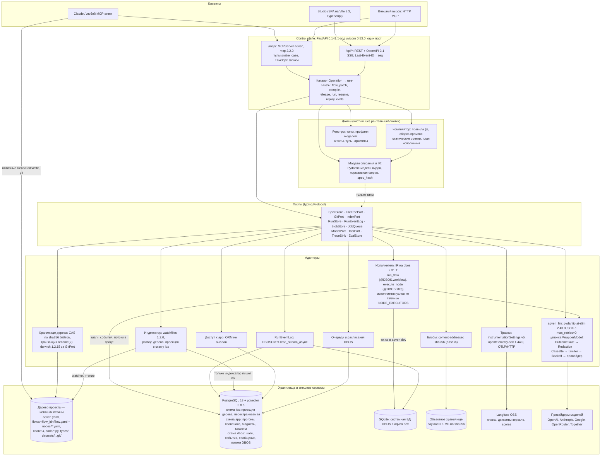
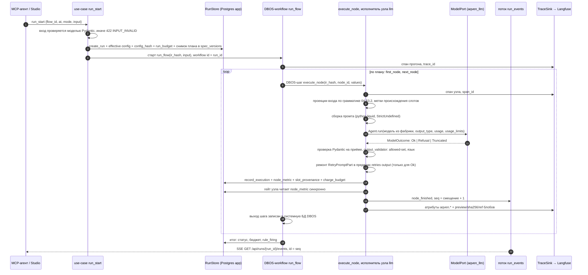
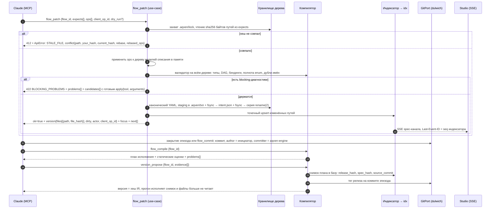

# 02. Архитектура системы

> Статус: draft
> Зависит от: [00. Исходная спека](00-source-spec.ru.md), [DECISIONS.md](DECISIONS.md), [ADR-0017](adr/0017-files-as-source-of-truth.md), [ADR-0024](adr/0024-studio-on-vite.md), [ADR-0025](adr/0025-python-engine.md), [ADR-0026](adr/0026-yaml-spec-and-code-refs.md), [ADR-0027](adr/0027-dynamic-io-shapes.md), [ADR-0028](adr/0028-studio-api-contract.md), [ADR-0029](adr/0029-trust-and-quality-python.md), [23. API локальной студии](23-studio-api.md)
> Источники: [research/py-stack-runtime.md](research/py-stack-runtime.md), [research/py-quality-layer.md](research/py-quality-layer.md),
> [research/py-spec-as-code.md](research/py-spec-as-code.md), [research/studio-api-inventory.md](research/studio-api-inventory.md);
> спека §4, §5, §8.6, §8.9, §8.11, §10, §20.

## Зачем этот слой

Архитектура отвечает на один вопрос: **где физически живёт каждая гарантия**. Спека §8.6
(надёжность исполнения), §8.9 (отладка и наблюдаемость) и §8.11 (версии и релизы) требуют,
чтобы провенанс, бюджеты, строгий вывод и воспроизведение были свойствами системы, а не
договорённостью авторов. Это достигается разделением на домен (модели описания, IR и компилятор, которые
ничего не знают про внешний мир) и адаптеры к DBOS, Pydantic AI и провайдерам моделей, Postgres и Langfuse.
Вторая задача слоя — зафиксировать границу «наше / чужое» так, чтобы отключение любого внешнего
сервиса (Langfuse, конкретный провайдер) не ломало поведение платформы. Движок — Python-процесс
([ADR-0025](adr/0025-python-engine.md)), студия — SPA на TypeScript ([ADR-0024](adr/0024-studio-on-vite.md)).

## Решения

| Решение | Что берём | Версия | Лицензия | Почему |
|---|---|---|---|---|
| Интерпретатор движка | CPython, `requires-python = ">=3.14,<3.15"` | 3.14 (проверено на 3.14.7) | PSF-2.0 | потолок `<3.15` задают `psycopg-binary` 3.3.5 и gepa 0.1.4 ([ADR-0025](adr/0025-python-engine.md) §1) |
| Надёжное исполнение | `dbos`: наш исполнитель IR — функция `@DBOS.workflow`, узел — `@DBOS.step` | 2.31.1 | MIT | чекпоинт шага, восстановление, `fork_workflow`, `recv`/`send`/`sleep`, потоки прогона — библиотекой в процессе; модели графа у DBOS нет, обход плана — наш ([ADR-0025](adr/0025-python-engine.md) §3) |
| Системная БД DBOS | SQLite в `aqven dev` и тестах; PostgreSQL 18, схема `dbos`, в проде | `sqlite3.sqlite_version` 3.53.1 в сборке CPython 3.14.7 / 18 | public domain / PostgreSQL License | локально без отдельного сервиса; прод на PostgreSQL 18 не запускался (ADR-0025 ОВ 9) |
| Вызов моделей | `pydantic-ai-slim[openai,anthropic,google]` | 2.43.0 | MIT | типизированный выход с повтором, `WrapperModel` для цепочки гарантий, модель и инструкции на вызове |
| SDK провайдеров | `openai` / `anthropic` / `google-genai` | 3.14.1 / 1.6.0 / 2.23.0 | Apache-2.0 / MIT / Apache-2.0 | импортирует только `aqven_llm`; клиенты с `max_retries=0` и `httpx2.AsyncClient`; OpenRouter и Together — `OpenRouterProvider`, `TogetherProvider` поверх `AsyncOpenAI` |
| HTTP-клиент | `httpx2` | 2.13.0 | BSD-3-Clause | решение владельца от 2026-09-16; encode `httpx` и `requests` наш код не импортирует ([ADR-0025](adr/0025-python-engine.md) §5) |
| Модели данных и контракт | `pydantic` | 2.13.5 | MIT | проверка на каждой границе: файлы описания, вход и выход узлов, тела HTTP, аргументы MCP |
| HTTP API, OpenAPI 3.1, SSE | `fastapi` без extras + `uvicorn` | 0.141.1 / 0.53.0 | MIT / BSD-3-Clause | REST, SSE и MCP одним процессом на одном порту ([ADR-0028](adr/0028-studio-api-contract.md)) |
| MCP | `mcp`, `MCPServer("aqven")`, streamable HTTP в `/mcp/` | 2.2.0 | MIT | тул и маршрут строятся из одной записи каталога `Operation` |
| Клиент API студии | `openapi-typescript` + `openapi-fetch` | 7.13.0 / 0.17.0 | MIT | типы из `/api/openapi.json` без рантайм-кодогена, дрейф контракта ловится в CI; peer `typescript@^5.x` при нашем 6.0.3 — ADR-0025 ОВ 13 |
| Хранилище | PostgreSQL 18 + pgvector 0.8.6 | образ `pgvector/pgvector:0.8.6-pg18` | PostgreSQL License | `uuidv7()` встроен; одна БД, схемы `app`, `idx`, `dbos` |
| ORM и миграции `app`, `idx` | не выбраны | — | — | drizzle снят; кандидаты sqlalchemy 2.0.54 и alembic 1.20.0 (MIT) против RLS и партиций не проверены — ADR-0025 ОВ 11 |
| Очереди и расписания | `Queue` и расписания DBOS | 2.31.1 | MIT | pg-boss снят; срок узла `human` исполняет сам workflow; очереди и расписания запуском не проверены — ADR-0025 ОВ 1 |
| Трассы | `InstrumentationSettings(version=5)` + `opentelemetry-sdk` + `opentelemetry-exporter-otlp-proto-http` | 2.43.0 / 1.44.0 / 1.44.0 | MIT / Apache-2.0 / Apache-2.0 | OTLP/HTTP в Langfuse без Python SDK langfuse ([ADR-0025](adr/0025-python-engine.md) §8) |
| Шаблоны промтов | `python-liquid` | 2.3.1 | MIT | `analyze()` без рендера ([ADR-0029](adr/0029-trust-and-quality-python.md) §8) |
| Офлайн-оценка | `pydantic-evals`; статистика гейта — `scipy` + `statsmodels` + `numpy` | 2.43.0; 1.18.1 / 0.15.0 / 2.5.3 | MIT; BSD / BSD-3-Clause / BSD-3-Clause AND 0BSD AND MIT AND Zlib AND CC0-1.0 | прогонщик и формат датасета берём, гейт наш ([ADR-0029](adr/0029-trust-and-quality-python.md) §9–§10) |
| YAML и канонизация | `ruamel.yaml`; `rfc8785` + `hashlib` | 0.19.1; 0.1.4 | MIT; Apache-2.0 | строгий проход и канонический писатель описаний; `spec_hash` и ключ кассеты по RFC 8785 |
| Git | `dulwich` за `GitPort` | 1.2.15 | Apache-2.0 OR GPL-2.0-or-later, берём Apache-2.0 | коммит без бинарника git |
| Наблюдение за файлами | `watchfiles` | 1.2.0 | MIT | `awatch` со своим фильтром `.aqven/` |
| Линт и типы движка | `ruff` (TID251); `pyright`, `typeCheckingMode = "strict"` | 0.16.7; 1.1.414 | MIT; MIT (обёртка на PyPI) | правило зависимостей §3 исполняется машинно |
| Studio | SPA: `vite` 8.3.0, `react` 19.3.0, `@tanstack/react-router` 1.170.36, `@xyflow/react` 12.11.6 | пин | MIT | канвас — готовый; статику отдаёт `aqven dev`, [ADR-0024](adr/0024-studio-on-vite.md) |
| Автораскладка | `elkjs` 0.12.0 | пин | EPL-2.0 OR GPL-3.0-or-later | копилефт-лицензия в студии, условия в [DECISIONS.md](DECISIONS.md) |

## 1. Карта системы

Три входа (MCP-агент, Studio, внешний вызов по HTTP или MCP) сходятся в один control plane —
приложение FastAPI в процессе `aqven dev` или `aqven serve`. Control plane — единственная реализация
операций: маршрут FastAPI и тул `MCPServer` строятся из одной записи каталога `Operation` и зовут один
use-case, второй реализации нет ([ADR-0028](adr/0028-studio-api-contract.md) §2). Домен (модели описания,
IR, компилятор, реестры) стоит за портами; DBOS, Pydantic AI с провайдерами, Postgres, объектное хранилище
и Langfuse — адаптеры.

Четвёртый вход — рабочее дерево проекта: Claude Code правит файлы нативными Read/Edit/Write
и git, минуя control plane. **Определения живут в файлах, база — перестраиваемый индекс**
([ADR-0017](adr/0017-files-as-source-of-truth.md)); схему `idx` наполняет индексатор, который
следит за деревом и никем, кроме себя, не пишется. Пятый путь — импорт модуля-wheel в Python-проект
(`await flows.resolve_refund.run(Order(...))`, [ADR-0026](adr/0026-yaml-spec-and-code-refs.md) §10): он минует
HTTP, а как при этом соблюдается правило одного исполнителя DBOS — открытый вопрос 16.



Инварианты карты:

1. **Стрелок из `domain` в `adapters` нет.** Домен зависит только от портов — классов `typing.Protocol` и
   моделей Pydantic, без рантайм-библиотек.
2. **`aqven_llm` — единственный модуль, импортирующий `openai`, `anthropic`, `google.genai`,
   `pydantic_ai.providers` и `pydantic_ai.models.{openai,anthropic,google}`.** Запрет остальных импортов —
   правилом TID251 ruff 0.16.7 ([ADR-0025](adr/0025-python-engine.md) §6); строковый идентификатор модели
   (`Agent("openai:...")`) TID251 не видит — ADR-0025 ОВ 14.
3. **Langfuse не читается на горячем пути.** Ни один гейт или ретрай не делает запрос в Langfuse;
   отключение трасс теряет только просмотр глазами.
4. **Схему `idx` пишет один процесс — индексатор.** `DROP SCHEMA idx CASCADE` с последующей
   переиндексацией не меняет ни одного ответа продукта; истина остаётся в дереве и в git.
5. **`DBOS.launch` — ровно один на системную БД.** На системной БД проекта его вызывает только `aqven dev` или
   `aqven serve`, тесты поднимают DBOS на своей временной БД; прочие процессы работают через `DBOSClient` ([ADR-0025](adr/0025-python-engine.md) §9, H2): второй `DBOS.launch` с
   тем же executor id перезапустил ждущие workflow (проверено запуском на SQLite).

## 2. Процессы и деплой

Движок — один Python-процесс с двумя режимами запуска: `aqven dev <путь>` и `aqven serve`
([ADR-0026](adr/0026-yaml-spec-and-code-refs.md) §10). Ролей `ROLE=api` и `ROLE=worker` больше нет: pg-boss снят,
срок ожидания человека исполняет сам workflow, восстановление после падения делает `DBOS.launch()`
([ADR-0025](adr/0025-python-engine.md) §4, §9). Studio — статический бандл Vite (`apps/studio/dist`) без
серверного рантайма ([ADR-0024](adr/0024-studio-on-vite.md)); локально его вместе с API и MCP с одного порта
отдаёт `aqven dev`, где бандл лежит для установленного движка — 23 ОВ 15. Кто отдаёт бандл в режиме `hosted` и
как туда доходит сессия человека — ОВ-18 в [15. Studio](15-studio-frontend.md).

| | `aqven dev <путь>` | `aqven serve` | `aqven fmt` / `check` / `plan` / `build`, тесты |
|---|---|---|---|
| Что поднимает | `uvicorn.Server` с FastAPI: `/api/*`, `/api/openapi.json`, `/mcp/`, статика студии; `watchfiles.awatch` и индексатор; пересборка IR на сохранение; `DBOS.launch()` | FastAPI и `MCPServer` на одном порту; `DBOS.launch()`; состав поверхности — [ADR-0028](adr/0028-studio-api-contract.md) ОВ 7 | компилятор и сборка без вызовов моделей и без `DBOS.launch`; pytest поднимает DBOS один раз на сессию на временном файле SQLite — это своя системная БД |
| Кто ходит | Studio, Claude Code по `/mcp/` | внешние HTTP- и MCP-клиенты, клиент из OpenAPI | — |
| Адрес | `127.0.0.1`, порт 5180 по умолчанию, `TrustedHostMiddleware`, без аутентификации ([23](23-studio-api.md) §1.1) | вне loopback авторизация и версия в пути не выбраны (ADR-0028 ОВ 7) | — |
| Системная БД DBOS | SQLite, `use_listen_notify = False` до первого создания БД | PostgreSQL 18, схема `dbos`, `run_migrations = False`, DDL — `dbos migrate` шагом деплоя (не запускалось, ADR-0025 ОВ 9) | — |
| Прогоны | workflow `run_flow` на прогон в этом процессе; события — поток `run_events`, SSE читает его через `DBOSClient` | то же | — |
| Масштабирование | один процесс на проект | один исполнитель на системную БД; горизонтальное масштабирование не решено — открытый вопрос 11 | — |

### Что стало с задачами `ROLE=worker`

| Задача pg-boss | Чем заменена | Проверено |
|---|---|---|
| `run.deadline` (`sendAfter` при `suspend`) | срок узла `human` — `DBOS.recv_async(topic, timeout_seconds)`, дедлайн — выход шага `DBOS.sleep`; политики `on_timeout: fail \| default \| escalate` — таблица обработчиков в workflow (Strategy, [ADR-0025](adr/0025-python-engine.md) §9, H1) | запуск на SQLite: после SIGKILL таймаут сработал через 0,028 с после исходного дедлайна |
| `run.deadline.reconcile` (cron-сверка) | не нужна: дедлайн — долговечный шаг, а не отложенный job | то же |
| `run.restart_active` (`restartAllActiveWorkflowRuns()` в одном экземпляре) | `DBOS.launch()` в единственном исполнителе восстанавливает незавершённые прогоны, завершённые шаги не повторяются | запуск на SQLite |
| `run.scheduled` (cron воркфлоу) | расписания DBOS | дока; ADR-0025 ОВ 1 |
| `evals.experiment` (`@voltagent/evals`) | `Dataset.evaluate` pydantic-evals с `max_concurrency` и гейт на scipy и statsmodels; где исполняется — открытый вопрос 17 | прогонщик — запуск на 3.12.4 ([ADR-0029](adr/0029-trust-and-quality-python.md) §9) |
| `export.bundle` | отменено решением владельца от 2026-09-16 ([ADR-0025](adr/0025-python-engine.md) §7) | — |
| `langfuse.dataset_sync` | очередь DBOS после изменения датасета | не проверено, ADR-0025 ОВ 1 |

### Как процессы делят БД

В проде одна база PostgreSQL 18, три схемы ([ADR-0011](adr/0011-two-schemas-and-tenancy.md) в редакции
[ADR-0025](adr/0025-python-engine.md) §8):

- **`app`** — наши таблицы событий и снимков; миграции forward-only, expand/contract, без `down`; инструмент
  не выбран (ADR-0025 ОВ 11).
- **`idx`** — проекция файлового дерева. Пишет в неё только роль `wf_indexer`; `DROP SCHEMA idx CASCADE` с
  переиндексацией не теряет ничего.
- **`dbos`** — системные таблицы DBOS: шаги, события, сообщения, потоки. Имя схемы — ключ
  `dbos_system_schema`; DDL делает `dbos migrate` отдельным шагом деплоя, рантайм работает с
  `run_migrations = False`. Мы их не трогаем и не мигрируем; читаем через API DBOS и `DBOSClient`. Состав и
  DDL не читали, на PostgreSQL 18 не запускалось — ADR-0025 ОВ 9.

Отдельного брокера нет: DBOS — библиотека в процессе, «no infrastructure required besides Postgres»
([ADR-0025](adr/0025-python-engine.md) «Альтернативы»). `tenant_id` присутствует во всех таблицах `app` с первого
дня, доступ ограничен RLS. Локально системная БД DBOS — SQLite; где в `aqven dev` живут `app` и `idx` —
открытый вопрос 12.

### Как процесс находит версию графа

Регистра воркфлоу нет. Вход DBOS-workflow — хеш IR и вход воркфлоу: одна функция `run_flow` исполняет любой
граф, версию несёт хеш ([ADR-0025](adr/0025-python-engine.md) §4, правило 1). `application_version` DBOS —
явная версия протокола исполнителя, от правки IR она не меняется (ADR-0025 §9, H2).

Отсюда правило: **что исполняет прогон, определяет снимок плана по хешу IR в `app.spec_versions`, а кэш
процесса — только кэш планов по неизменяемому ключу.** Снимок пишется до старта прогона
([23](23-studio-api.md) §6.4). Файлы в исполнении не участвуют: дерево читает компилятор при сборке, а не
исполнитель. Загрузка ленивая и идемпотентная:

```python
from typing import NewType, Protocol

IrHash = NewType("IrHash", str)
NodeId = NewType("NodeId", str)


class CompiledPlan(Protocol):
    def node(self, node_id: NodeId) -> CompiledNode: ...
    def first_node(self, values: JsonObject) -> NodeId | None: ...
    def next_node(self, node_id: NodeId, values: JsonObject) -> NodeId | None: ...


class PlanCatalog(Protocol):
    def plan_for(self, ir_hash: IrHash) -> CompiledPlan: ...
```

`CompiledNode` и `JsonObject` — типы пакета исполнителя, как в [ADR-0025](adr/0025-python-engine.md) §3.
`plan_for` при промахе кэша читает снимок из `app.spec_versions`. Выпуск новой версии не инвалидирует ничего:
версии неизменяемы, хеш новый. Снятие версии с публикации отклоняет новые прогоны этой версии в use-case
`run_start`; межпроцессная рассылка `LISTEN/NOTIFY flow_version_revoked` не нужна, потому что исполнитель на
системную БД один. Правка файлов даёт новый хеш, который исполняется без перезапуска процесса, а прогон под
старым хешем восстанавливается — бинарная проверка спайка (ADR-0025 «Проверка», п. 7); откуда брать IR
старого хеша при восстановлении и как переносить ждущие прогоны при смене `application_version` — ADR-0025
ОВ 6.

```mermaid
flowchart LR
  subgraph proc["aqven dev или aqven serve (один процесс)"]
    api["FastAPI: /api/* и SSE"]
    mcpsrv["MCPServer aqven: /mcp/"]
    ucs["use-case'ы каталога Operation"]
    execu["исполнитель IR: DBOS.launch,<br/>run_flow, execute_node"]
    plans["PlanCatalog: кэш планов по хешу IR"]
    client["DBOSClient: резюм, run_events, лента прогонов"]
  end

  other["другие процессы: только DBOSClient"]

  subgraph pgdb[("PostgreSQL 18")]
    appschema["схема app<br/>spec_versions: снимки планов по хешу IR,<br/>runs, run_nodes (provenance, rule_firings),<br/>blobs, cassettes"]
    idxschema["схема idx<br/>проекция дерева, пишет только индексатор"]
    dbosschema["схема dbos<br/>выходы шагов, событие human,<br/>сообщения send/recv, поток run_events"]
  end

  api --> ucs
  mcpsrv --> ucs
  ucs -->|"run_start: снимок плана"| appschema
  ucs -->|"старт run_flow(ir_hash, input)"| execu
  execu --> plans
  plans -->|"промах кэша: читает план"| appschema
  execu -->|"выходы шагов, set_event, recv, sleep,<br/>write_stream run_events"| dbosschema
  ucs --> client
  client -->|"send, get_event, read_stream, list_workflows"| dbosschema
  other --> dbosschema
```

Следствие для интерактивных прогонов: SSE-канал прогона не привязан к процессу, где идёт workflow. Workflow
дописывает события в поток DBOS `run_events` (запись exactly-once, `seq` = смещение + 1), а
`GET /api/runs/{run_id}/events` читает его через `DBOSClient` с возобновлением по `Last-Event-ID` = `seq`
([ADR-0025](adr/0025-python-engine.md) §9, H7; [23](23-studio-api.md) §11.4). Проба шла на SQLite с отдельным
процессом-воркером и API только на `DBOSClient`: sticky-сессия балансировщика не нужна. Задержку задаёт
интервал опроса: запись `node_suspended` → кадр SSE 896–948 мс при 1,0 с и 9–41 мс при 0,05 с; на PostgreSQL
с `use_listen_notify` не замерялось — ADR-0025 ОВ 23.

## 3. Границы слоёв и правило зависимостей

Применённый паттерн — **Ports and Adapters (гексагональная архитектура)**. Домен объявляет
интерфейсы (порты — `typing.Protocol`), инфраструктура их реализует (адаптеры), сборка происходит в
композиционном корне процесса: `create_app`, `build_catalog`, фабрика моделей `aqven_llm`, внедрение через
конструктор ([23](23-studio-api.md) §2, [ADR-0028](adr/0028-studio-api-contract.md) §2). Внутри адаптеров
дополнительно применяются **Adapter** (`ToolCall` над `MCPServer.add_tool`, `DbosAnswerSender` над
`DBOSClient`), **Interpreter** (`run_flow` обходит план IR), **Strategy** (таблица `NODE_EXECUTORS`, профили
схем, политики `on_timeout`), **Registry** (реестры типов, профилей, архетипов, `PROVIDER_MODELS`, каталог
`Operation`), **Decorator** и **Chain of Responsibility** (звенья `WrapperModel` цепочки гарантий, таблица
`FAILURE_BY_EXCEPTION`, проверки резюма `RESUME_GUARDS`) и **Builder** (фабрика `build_model`).

### Правило зависимостей

```
модели описания и IR  ←  компилятор  ←  use-case'ы  →  порты  ←  адаптеры
                                            ↑
                          каталог Operation (модели Pydantic контракта)
```

Имена дистрибутивов движка, кроме `aqven-llm` (модуль `aqven_llm`), не выбраны — [ADR-0026](adr/0026-yaml-spec-and-code-refs.md)
ОВ 1, [20](20-repo-and-tooling.md); ниже компоненты названы по роли.

| Компонент | Может импортировать | Категорически не может |
|---|---|---|
| Модели описания и IR | стандартную библиотеку, `pydantic`, `rfc8785` | всё остальное |
| Загрузчик и канонический писатель YAML | модели описания, `ruamel.yaml` | `yaml` (PyYAML), рантайм-библиотеки |
| Компилятор | модели описания и IR, порты (только типы), `python-liquid` | `dbos`, `pydantic_ai`, `fastapi`, `mcp`, `dulwich`, `watchfiles`, `opentelemetry`, ORM, SDK провайдеров |
| Реестры | модели описания и IR, порты | то же |
| Use-case'ы | домен + порты | конкретные адаптеры |
| Порты | модели описания и IR, `pydantic` | любую реализацию |
| Адаптеры | свою библиотеку + порты | другие адаптеры |
| `aqven_llm` | `openai`, `anthropic`, `google.genai`, `pydantic_ai.providers`, `pydantic_ai.models.{openai,anthropic,google}` | — (единственный такой модуль) |
| Модуль статистики гейта | `numpy`, `scipy`, `statsmodels` | `pydantic_ai`, `pydantic_evals` ([ADR-0029](adr/0029-trust-and-quality-python.md) §10) |
| Весь код движка | `httpx2` | `httpx`, `requests`, `yaml`, `pydantic_graph`, `pydantic_ai.retries`, `pydantic_ai.StructuredDict` ([ADR-0025](adr/0025-python-engine.md) §6) |

Токенизатор оценки размера промта для компилятора не выбран — [ADR-0029](adr/0029-trust-and-quality-python.md) ОВ 4.

Правило исполняется машинно, а не на честном слове: TID251 ruff 0.16.7 — корневая таблица `banned-api` и
вложенный `ruff.toml` пакета со своей таблицей. Вложенная таблица заменяет корневую, а не дополняется (видно
по запуску, в доке ruff не найдено), поэтому каждая повторяет общие запреты, синхронность держит фикстура CI
([ADR-0025](adr/0025-python-engine.md) §6). Запуском проверены таблицы `aqven_llm` и модуля статистики; фикстуры
на остальные строки таблицы заводятся в CI по образцу проверок 2–3 ADR-0025. Сверху — pyright 1.1.414 strict и
проверка `uv.lock` на транзитивные `httpx` и `requests` (ADR-0025 §5). Нарушение — красный билд.

Ключевое следствие для компилятора: **план исполнения — это данные, а не замыкания.** Рёбра IR
компилируются в проекции закрытой грамматики ([04](04-ir-schema.md) §3.2) и предикаты `switch`, а не в функции
Python; всё, что грамматикой не выражается, — шаг `code` по ссылке `pkg.module:function`, исполняемый в процессе
модуля ([ADR-0026](adr/0026-yaml-spec-and-code-refs.md) §5). Поэтому компилятор выдаёт сериализуемый план, а
исполнитель на DBOS обходит его как Interpreter; на границе шага — только JSON-совместимые значения
(`model_dump(mode="json")`, ADR-0025 §4, правило 3). Домен про DBOS по-прежнему ничего не знает. Codegen в
другие фреймворки отменён решением владельца от 2026-09-16 ([ADR-0025](adr/0025-python-engine.md) §7).

### Порты и их адаптеры

| Порт | Зачем | Адаптер | На чём |
|---|---|---|---|
| `SpecStore` | чтение и запись определений: `aqven.yaml`, воркфлоу, узлы, промты, типы, датасеты; истина — файлы, не строки БД | хранилище дерева | `FileSpecStore` поверх `FileTreePort` + `GitPort`; чтение — строгий проход ruamel.yaml 0.19.1 → Pydantic-модели видов ([ADR-0026](adr/0026-yaml-spec-and-code-refs.md) §1); поиск — через `IndexPort` |
| `FileTreePort` | атомарная запись N файлов: CAS по sha256 байтов, staging `.aqven/txn/<ulid>`, `rename(2)`, межпроцессный `.aqven/lock` | хранилище дерева | стандартная библиотека CPython 3.14; наблюдение — `watchfiles` 1.2.0 (`awatch`) за `FileWatcher` |
| `GitPort` | коммит на эпизод правки, лог по пути, checkout дерева, теги релиза | хранилище дерева | dulwich 1.2.15 (Apache-2.0): коммит объектами, CAS ссылки `refs.set_if_equals`, трейлеры; pygit2 1.20.1 (GPLv2 с linking exception) — возможная вторая реализация |
| `IndexPort` | проекция дерева в схему `idx` и запросы «где используется тип X», «что сломает правка» | индексатор | роль `wf_indexer` — единственная с `INSERT` в `idx`; ORM не выбран (ADR-0025 ОВ 11) |
| `RunStore` | прогоны, исполнения узлов по адресу, провенанс слотов, бюджеты, сработавшие правила | доступ к `app` | `app.runs`, `app.run_nodes` (помесячные партиции, BRIN по времени), `app.slot_provenance`, `app.run_budget`, `app.rule_firing`; адрес исполнения в DDL `run_nodes` не выражен — 23 ОВ 4 |
| `RunEventLog` | события прогона с `seq` для run-канала | DBOS | `DBOS.write_stream_async("run_events", ...)` в исполнителе, `DBOSClient.read_stream_async` в API ([23](23-studio-api.md) §11.4) |
| `WaitIndex`, `AnswerLog`, `AnswerSender` | ожидания человека, подтверждение и отправка резюма | DBOS | `DbosAnswerSender` на `DBOSClient.send_async`; индекс ожиданий — атрибуты workflow или своя таблица, ADR-0025 ОВ 21 ([23](23-studio-api.md) §6.8) |
| `BlobStore` | payload по правилу трёх зон: <8 КБ inline jsonb, 8 КБ–1 МБ отдельная таблица, >1 МБ объектное хранилище | блобы | content-addressed по sha256 (`hashlib`) |
| `JobQueue` | фоновые задачи вне прогона: синхронизация каталога, батчи evals, зеркало датасетов | DBOS | `Queue` и расписания dbos 2.31.1; не проверено — ADR-0025 ОВ 1 |
| `ModelPort` | вызов модели, строгий вывод, usage, стоимость, три исхода | `aqven_llm` | `Agent.run` pydantic-ai-slim 2.43.0 над моделью из фабрики `build_model`: цепочка `WrapperModel` ([ADR-0029](adr/0029-trust-and-quality-python.md) §1), кассета — звено `CassetteModel` |
| `ToolPort` | вызов инструмента, таймаут, одобрение | тулы | тулы Pydantic AI; одобрение — `requires_approval=True` → `DeferredToolRequests` → узел `human` ([ADR-0025](adr/0025-python-engine.md) §9, H6); побочный эффект — отдельным `@DBOS.step`; таймаут тула — наше декларативное поле; внешние MCP-серверы и кассеты тулов — открытый вопрос 18 |
| `TraceSink` | спаны, атрибуты `aqven.*`, ссылки на блобы | трассы | наш `TracerProvider` opentelemetry-sdk 1.44.0, `BatchSpanProcessor(OTLPSpanExporter)` на `<base>/api/public/otel/v1/traces`; `InstrumentationSettings(version=5)` Pydantic AI на том же провайдере |
| `EvalStore` | датасеты, эксперименты, scores, пороги гейтов | evals | pydantic-evals 2.43.0 (`Dataset`, `Case`, `Evaluator`, `evaluate`), гейт наш; зеркало в Langfuse |
| `DatasetStore` | датасеты, сплиты `train/dev/test`, элементы, покрытие | датасеты | истина — `datasets/<name>.yaml` (`kind: Dataset`, структура `Dataset` pydantic-evals); индекс — `app.datasets`, `app.dataset_items`; расхождение DDL — 23 ОВ 10 |
| `ScorerPort` | запуск скорера (детерминированного или судьи) над элементом | evals | `Evaluator` pydantic-evals; LLM-судья — наш тип оценщика с моделью из фабрики `aqven_llm` |
| `CassetteStore` | content-addressed кассеты вызовов модели для реплея | `aqven_llm` | хранилище `CassetteModel`: `app.cassettes`, `app.cassette_entries`; ключ `sha256("aqven.cassette.v1\0" + RFC 8785)` |
| `PromptOptimizerPort` | оптимизация шаблона на выборке evals | промты | `optimize(OptimizationRequest) -> OptimizationOutcome` над gepa 0.1.4: `TemplateUnitsAdapter`, `AdmissibleReflection` ([ADR-0029](adr/0029-trust-and-quality-python.md) §11) |

Сигнатуры портов — `typing.Protocol` под pyright strict, идентификаторы — `NewType`, без `Any`:

```python
from dataclasses import dataclass
from decimal import Decimal
from typing import NewType, Protocol

from pydantic import JsonValue

RunId = NewType("RunId", str)


@dataclass(frozen=True, slots=True)
class Usage:
    input_tokens: int
    output_tokens: int
    cost_usd: Decimal


@dataclass(frozen=True, slots=True)
class Ok:
    value: JsonValue
    usage: Usage


@dataclass(frozen=True, slots=True)
class Refusal:
    reason: str
    usage: Usage


@dataclass(frozen=True, slots=True)
class Truncated:
    max_tokens: int
    usage: Usage


type ModelOutcome = Ok | Refusal | Truncated


class ModelPort(Protocol):
    async def call(self, request: ModelRequest) -> ModelOutcome: ...


class TraceSink(Protocol):
    def start_node_span(self, node: NodeSpanInput) -> NodeSpan: ...
    def attach_blob(self, span: NodeSpan, key: str, payload: BlobAttachment) -> None: ...


class RunStore(Protocol):
    async def create_run(self, run: CreateRunInput) -> RunId: ...
    async def record_execution(self, execution: NodeExecution) -> None: ...
    async def read_node_metric(self, run_id: RunId, address: ExecutionAddress) -> NodeMetric: ...
    async def charge_budget(self, run_id: RunId, delta: BudgetDelta) -> BudgetState: ...
```

`ModelRequest`, `NodeSpanInput`, `NodeSpan`, `BlobAttachment`, `CreateRunInput`, `NodeExecution`, `NodeMetric`,
`BudgetDelta`, `BudgetState` — модели пакета портов, здесь не показаны; `ExecutionAddress` — модель адреса
исполнения из [23](23-studio-api.md) §2.

`ModelOutcome` — три исхода, а не два: обрезанный ответ не чинится ([ADR-0005](adr/0005-three-call-outcomes.md)).
Дефолты Pydantic AI этот инвариант нарушают: обрезанный tool call повторяется с тем же `max_tokens`, полный JSON
с `finish_reason=length` принимается как ok, отказ Anthropic с текстом повторяется
([ADR-0029](adr/0029-trust-and-quality-python.md) «Контекст», п. 2). Поэтому исход определяет звено
`OutcomeGateModel` по `finish_reason` и `provider_details` до разбора и до цикла `output`-ретраев, `TruncatedOutput`
и `RefusedOutput` переводятся в варианты union по таблице `FAILURE_BY_EXCEPTION` исполнителя (ADR-0029 §3), а
ремонт моделью (`RetryPromptPart`) применим только к `Ok`. JSON локально не чинится: финальный разбор —
`allow_partial="off"`. Это свойство порта, а не деталь реализации: домен различает три исхода на уровне типов.
Прочие исключения таблицы (`UsageLimitExceeded`, `CassetteMiss`, `ModelHTTPError`) — сбои узла с маршрутом по его
политике, а не исходы вызова.

## 4. Поток данных одного прогона

Вход — `run_start` (MCP-тул) или `POST /api/runs` (Studio, внешний вызов). Выход — завершённый
прогон, чьи шаги лежат в системной БД DBOS, провенанс и бюджет — в схеме `app`, события — в потоке
`run_events`, а дерево спанов — в Langfuse.

Диаграмма показывает узел `llm` одним DBOS-шагом с цепочкой гарантий внутри. Второй вариант — `agent.run()` под
capability `DBOSDurability` на уровне workflow, где запросы модели становятся DBOS-шагами; выбор — ADR-0025 ОВ 4.
Узлу с одобряемыми тулами первый вариант не подходит: `DBOS.recv` внутри шага бросает `DBOSException` (по исходнику `dbos/_dbos.py`, ADR-0025 ОВ 4).



### Что происходит на каждом шаге и где живёт гарантия

| Шаг | Механика | Гарантия и где она реализована |
|---|---|---|
| 1. `run_start` | вход проверяется моделью Pydantic до создания прогона; строка `app.runs`, эффективная конфигурация после мержа дефолтов и оверрайдов, `config_hash`, снимок плана в `app.spec_versions` ([23](23-studio-api.md) §6.4) | воспроизводимость: в трассу уходит только `config_hash`, полная конфигурация — в Postgres |
| 2. Версия графа | вход workflow — хеш IR; `PlanCatalog.plan_for(ir_hash)` читает снимок; `application_version` — версия протокола исполнителя | версия неизменяема; прогон привязан к хешу IR, а не к черновику ([ADR-0025](adr/0025-python-engine.md) §4, §9) |
| 3. Старт | workflow `run_flow` с id = `run_id` (`SetWorkflowID`, проверено на SQLite); состояние между шагами — локальные значения функции workflow (выходы узлов с метками происхождения, счётчики циклов, лучшие кандидаты), которые восстановление собирает из записанных выходов шагов | всё недетерминированное (время, случайность, сеть) — только внутри шагов: первый шаг узла `human` фиксирует время; сериализатор DBOS — ADR-0025 ОВ 7; восстановление общего `RunUsage` после падения — ADR-0029 ОВ 2 |
| 4. Рёбра | проекции закрытой грамматики [04](04-ir-schema.md) §3.2 и предикаты `switch` в плане; шаг `code` — функция `pkg.module:function`, выход проверяется моделью с `revalidate_instances="always"` | граф остаётся сериализуемым и инспектируемым; отладчик показывает ровно IR; провенанс значения из `code` пишем сами |
| 5. Сборка промта | шаблон python-liquid 2.3.1 (`StrictUndefined`) + значения слотов; уровень промта 1–3 определяется содержимым ([ADR-0026](adr/0026-yaml-spec-and-code-refs.md) §4); к каждому значению прикреплена метка происхождения | `slot_provenance` в Postgres — основа ответа «почему такое значение»; токенизатор оценки размера не выбран — ADR-0029 ОВ 4 |
| 6. Кассета | звено `CassetteModel` цепочки `WrapperModel`; ключ — `sha256("aqven.cassette.v1\0" + RFC 8785)` от нейтрального запроса: логическая ссылка модели, сообщения, настройки, схемы | `fork_workflow` копирует шаги до `start_step`, а шаги с него исполняются заново и зовут модель: детерминизм реплея даёт только кассета ([ADR-0029](adr/0029-trust-and-quality-python.md) §1) |
| 7. Вызов | нейтральная схема — `model_json_schema()` сгенерированной модели; профиль — `json_schema_transformer` в `ModelProfile`, его ставит фабрика; strict явно: `ToolOutput(M, strict=True)`; стиль: поля без default, `T \| None`, `extra="forbid"`, без рекурсии, порядок полей как в IR | одной strict-схемы на всех провайдеров не существует; профиль — свойство пары (IR-схема × провайдер) |
| 8. Исход | `OutcomeGateModel`: `finish_reason` + `provider_details` → `Ok` / `Refusal` / `Truncated` до разбора | обрезанный ответ не чинится; JSON локально не чинится, разбор `allow_partial="off"` |
| 9. Валидация | проверка Pydantic на приёме (держит всё, что трансформер профиля унёс в `description`), `output_validator` + `ModelRetry`: вхождение в allowed-set, межполевые проверки, язык | динамический allowed-set: ≤50 значений — enum в схеме, выше — индексный выбор из пронумерованного списка; лимиты провайдера проверяет наш код до вызова |
| 10. Ремонт | Chain of Responsibility: `RetryPromptPart` с ошибками валидации ≤ `retries["output"]` → фолбэк-профиль → консенсус → эскалация человеку; маршруты исключений — таблица `FAILURE_BY_EXCEPTION` ([ADR-0029](adr/0029-trust-and-quality-python.md) §3) | транспортный ретрай один — `BackoffModel` на tenacity 9.1.4 (экспонента, джиттер, `retry-after`); SDK с `max_retries=0`, шаг DBOS с `retries_allowed=False` |
| 11. Бюджет | один `RunUsage` на прогон в каждом `Agent.run(usage=...)`, `UsageLimits` на вызов узла; верхняя оценка вызова до `Agent.run` — наш код; `charge_budget` в `app` после узла | `request_limit` проверяется до запроса, токены и `cost_limit` — после ответа (перерасход не больше одного вызова); решение «остановить прогон» читает Postgres, не Langfuse; реплей из кассеты бесплатен |
| 12. Гейт узла | обёртка шага синхронно читает `node_metric` и решает fail / retry / fallback | готового синхронного гейта узла нет: онлайн-оценка pydantic-evals (`OnlineEvaluation`) не запускалась — ADR-0029 ОВ 19; гейт узла наш |
| 13. Чекпоинт | DBOS пишет выход шага в системную БД после его завершения | продолжение после падения — `DBOS.launch()` в процессе единственного исполнителя: завершённые шаги не повторяются, прерванный шаг выполняется заново целиком (проверено на SQLite) |
| 14. Приостановка | узел `human`: `DBOS.set_event("human", ...)`, индекс в атрибутах workflow, `recv_async(topic, timeout_seconds)`; дедлайн — выход шага `DBOS.sleep`; `on_timeout` — таблица обработчиков | внешнего планировщика нет; статус `suspended`, защиту резюма и проверку дедлайна и payload в API и в workflow пишем сами ([ADR-0025](adr/0025-python-engine.md) §9) |
| 15. Трасса | наш спан узла с атрибутами `aqven.*`; спаны `invoke_agent`, `chat`, `execute_tool` Pydantic AI (`InstrumentationSettings(version=5)`) на том же `TracerProvider`; атрибуты Langfuse пишет наша фабрика атрибутов | большие payload — по правилу preview + sha256 + size + ref + truncated, тело в BlobStore; `SpanLimits` OTel сверх лимита молча вытесняет самые старые атрибуты ([research/py-quality-layer.md](research/py-quality-layer.md) §2.2) |
| 16. Финал | workflow пишет статус, итоговый бюджет и `rule_firing`, в поток — `run_finished` | аудит решений |

### Связывание наших данных с трассами

Каждая строка в `app` несёт `trace_id` (32 hex) и `span_id` (16 hex) — те же, что у OTel-спана: их даёт
контекст активного спана нашего `TracerProvider` (opentelemetry-sdk 1.44.0). Обратно: метаданные агента на
спане `invoke_agent` несут `aqven.run_id` и `aqven.node_id` (атрибут `metadata`, проверено на `FunctionModel`,
[research/py-quality-layer.md](research/py-quality-layer.md) §2.1). Своей мапы идентификаторов нет, переход в обе
стороны однозначен, а миграция на другой бэкенд трасс не требует перекладывания ключей: спаны уходят простым
OTLP/HTTP.

### Идемпотентность

Прерванный падением шаг DBOS после восстановления исполняется **целиком заново** — это семантика DBOS
(проверено запуском), а не наш выбор. Поэтому каждый узел с внешним эффектом обязан объявить ключ
идемпотентности; ключ выводится из `run_id` и адреса исполнения `{node_id, branch_key, iteration, item_index}` и
хранится в `app`. Сам побочный эффект тула выносится в отдельный `@DBOS.step`: функции-тулы DBOS не оборачивает
([research/py-stack-runtime.md](research/py-stack-runtime.md) §5.5). Валидатор компилятора отклоняет узел с
эффектом, у которого ключ не выводится.

## 5. Поток данных одной правки спеки агентом

Истина — файлы рабочего дерева. Единица записи — один тул `flow_patch` с массивом операций,
применяемых атомарно к N файлам. Конкурентность решается compare-and-swap по sha256 **байтов**
каждого затрагиваемого файла; CRDT не берём — задача не в слиянии текста, а в валидации
типизированного графа перед сериализацией.

```python
from typing import Annotated

from pydantic import BaseModel, ConfigDict, Field


class ExpectedFile(BaseModel):
    model_config = ConfigDict(extra="forbid")
    path: str
    file_hash: str | None


class PatchInput(BaseModel):
    model_config = ConfigDict(extra="forbid")
    flow_id: str
    expects: Annotated[list[ExpectedFile], Field(min_length=1)]
    ops: Annotated[list[Op], Field(min_length=1, max_length=50)]
    client_op_id: str
    dry_run: bool = False
```

`Op` — дискриминированный union операций `add_node`, `remove`, `set`, `bind`; поля `intent`, `expect_lock`,
`exclusive` здесь опущены ([23](23-studio-api.md) §12.1).



### Что гарантирует каждая стадия

| Стадия | Инвариант | Механика |
|---|---|---|
| Блокировка | две записи не пересекаются | межпроцессный `.aqven/lock` (`O_EXCL`, pid + ttl 30 с + heartbeat) на всю транзакцию; занят — 423 `LOCK_BUSY` |
| CAS | чужая правка не затирается молча | `expects[{path, file_hash}]`, `file_hash: null` — «файла быть не должно»; отказы 412 `STALE_FILE`, `FILE_VANISHED`, `FILE_EXISTS` и 409 `TREE_DIRTY`; у REST тот же механизм и то же тело — `PATCH /api/flows/{flow_id}`, `If-Match` для многофайловой правки не используется ([ADR-0028](adr/0028-studio-api-contract.md) §6) |
| Атомарность | либо все файлы, либо ни одного | staging `.aqven/txn/<ulid>` с `fsync`, `intent.json` как точка невозврата, серия `rename(2)`; падение после неё доигрывается при следующем старте |
| Валидация | невалидное дерево не сериализуется | валидатор идёт **до** записи и на всём дереве в памяти: межфайловые инварианты одним файлом не проверить; `blocking` не пишется вовсе, `advisory` пишется с пометкой |
| Ответ агенту | агент всегда знает следующий шаг | единый конверт `Envelope`: `ok`, `op`, `version{files[{path, file_hash}], dirty, actor, client_op_id}`, `focus`, `problems[]`, `candidates[]` с готовым `apply{tool,arguments}`, `next[]`, `refs[]`, `ui_url`, `truncated` |
| Ретраи MCP | повтор не создаёт вторую правку | обязательный `client_op_id` (ULID) + `app.write_intents`: повтор возвращает первый результат |
| Предпросмотр | «покажи, что будет» без записи | `dry_run: true` — тот же конвейер до фазы CAS, диск не трогается ([23](23-studio-api.md) §12.1) |
| Конфликт | 412 не бывает голым | `conflict{path, your_hash, current_hash, ops_since[], rebase, rebased_ops[]}`; клиент перечитывает файл и переигрывает намерение, силовой перезаписи нет; операции над непересекающимися путями ребейзятся автоматически, ручное разрешение — только при пересечении путей |
| История | видно, кто правил и что | коммит на **эпизод правки**, а не на запись: эпизод закрывается ходом агента, затиханием правок человека или явным `flow_commit` (`POST /api/commits`); `git author` — инициатор, `git committer` — `aqven-engine`; откат всегда движением вперёд |
| Выпуск | версия неизменяема | снимок плана в базе + `release_hash`; авторитетен хеш содержимого (`spec_hash`), а не commit sha |
| Исполнение новой версии | без перезапуска процесса | вход workflow — хеш IR, план — из снимка по хешу; спайк — ADR-0025 «Проверка», п. 7 |
| Живой UI | Studio не опрашивает | watchfiles → индексатор → spec-канал SSE; инвалидация кэша студии по паре `path` + `file_hash` |
| Прямая правка файла | инвариант держит дисциплина, а не транзакция | хук `flow_check` на `PostToolUse` и в pre-commit, `aqven check` в CI; невалидное дерево закоммитить можно, релизнуть нельзя |

Организационный предохранитель, снимающий большую часть конфликтов до их возникновения:
advisory-lock `flow_lock({flow_id, ttl_s: 300})` (REST — `PUT /api/flows/{flow_id}/lock`, [23](23-studio-api.md)
§12.3). Studio показывает «Claude редактирует», человек может перехватить принудительно
(`POST /api/flows/{flow_id}/lock/takeover`, только человек).

## 6. Строим или берём

| Компонент | Строим или берём | Чем именно | Почему |
|---|---|---|---|
| IR воркфлоу | строим | модели Pydantic 2.13.5, нормальная форма 04 §1.3 | это и есть продукт: типизированные слоты, провенанс, политики; готового нет |
| Формат описания | строим | Pydantic-модели видов с `extra="forbid"`, ruamel.yaml 0.19.1 (строгий проход, канонический писатель), конвертеры `apiVersion` (Chain of Responsibility) | формат наш ([ADR-0026](adr/0026-yaml-spec-and-code-refs.md) §1) |
| Компилятор | строим | правила §9, сборка промтов, статические оценки, взаимоисключающие предикаты для `switch`, сверка сигнатур шага `code`, модальности | готового нет |
| Реестры типов, профилей, агентов, тулов, архетипов | строим | модели и экраны Studio | схемы наши, паттерн Registry |
| Исполнитель IR и исполнители узлов `llm`/`tool`/`human`/`code`/`narrow` | строим | `run_flow` (`@DBOS.workflow`, Interpreter), `execute_node` (`@DBOS.step`), таблица `NODE_EXECUTORS` (Strategy) | у DBOS нет модели графа, у pydantic-graph нет сохранения состояния; здесь живут строгий вывод, валидаторы, провенанс, бюджеты, политики |
| Чекпоинты, восстановление | берём | dbos 2.31.1: `@DBOS.workflow`, `@DBOS.step`, `DBOS.launch()` | выход шага пишется в системную БД; проверено на SQLite |
| Fork с шага и lineage | берём + строим | `DBOS.fork_workflow(workflow_id, start_step)`, связь — `WorkflowStatus.forked_from`; наша часть — кассета, REST/MCP-обёртка, перевод адреса в `start_step` | нового входа и номера шага форка у DBOS нет — ADR-0025 ОВ 8 |
| Лимит итераций цикла | строим | `max_iter`, бюджет, стагнация, best-of в исполнителе, условие генерирует компилятор | семантика языка, готового нет ([ADR-0025](adr/0025-python-engine.md) §3) |
| `switch` по enum (ровно одна ветка) | строим | взаимоисключающие предикаты + first-match | семантика языка |
| `quorum(k)`, `any`, `first_success`, политики ошибок веток | строим | обёртка ветки в `Result` + явные ключи + шаг сведения | параллельные шаги внутри DBOS-workflow не проверены — ADR-0025 ОВ 1 |
| `on_item_error` | строим | обёртка элемента в `Result` + фильтр по политике | семантика языка |
| Отмена проигравших в `race` | строим | механизм на DBOS не выбран | ADR-0025 ОВ 1, в реестре — B-22 |
| Backoff | строим | `BackoffModel` на tenacity 9.1.4: экспонента, джиттер, `retry-after` | единственный слой транспортного ретрая; `pydantic_ai.retries` тянет encode `httpx` |
| Ожидание человека и его срок | берём примитивы, строим политику | `set_event`, `recv_async(topic, timeout_seconds)`, `send`, дедлайн — шаг `DBOS.sleep`; наш — индекс `suspended`, защита резюма, проверка дедлайна и payload, таблица `on_timeout` | DBOS показывает ожидание как `PENDING` и молча буферизует лишние ответы ([ADR-0025](adr/0025-python-engine.md) §9) |
| Переопределение модели и инструкций на вызове | берём | `Agent.run(model=..., instructions=...)` | обход через динамические функции агента не нужен |
| Гейты качества на уровне узла | строим | обёртка шага, синхронное чтение `node_metric`, решение fail/retry/fallback | готового синхронного гейта узла нет |
| Единый клиент к моделям | берём | pydantic-ai-slim 2.43.0 + SDK openai 3.14.1, anthropic 1.6.0, google-genai 2.23.0; OpenRouter и Together — `OpenRouterProvider`, `TogetherProvider` поверх `AsyncOpenAI` | изолировано в `aqven_llm`, принуждение — TID251 |
| Цепочка гарантий вызова | строим | `OutcomeGateModel` → `RedactingModel` → `CassetteModel` → лимитер → `BackoffModel` → модель провайдера; собирает фабрика `aqven_llm` (Builder) | дефолты Pydantic AI нарушают три исхода, SDK ретраят сами ([ADR-0029](adr/0029-trust-and-quality-python.md) §1) |
| Строгий вывод | берём режимы, строим профили | `ToolOutput(M, strict=True)`, `json_schema_transformer` профиля, проверка Pydantic на приёме | strict-трансформеры уносят ограничения в `description`, у провайдеров разные наборы |
| PII и инъекции | строим | PII-режим — `RedactingModel` + редакция записи кассеты + `include_content=False` ([ADR-0029](adr/0029-trust-and-quality-python.md) §5); детектор PII и классификатор инъекций не выбраны (F-47, F-48); реестр политик и типизированный `PolicyViolation` вместо голого исключения — наши | гардрейлы VoltAgent сняты вместе с ним |
| Тулы | берём | тулы Pydantic AI, одобрение `requires_approval=True` → `DeferredToolRequests`; побочный эффект — `@DBOS.step` | таймаут тула как декларативное поле — наш; внешние MCP-серверы — открытый вопрос 18 |
| HTTP API | берём | FastAPI 0.141.1 + uvicorn 0.53.0; маршруты пишем | жизненный цикл прогона — наши маршруты [23](23-studio-api.md) §6 |
| Контракт API и клиент | берём | Pydantic → `app.openapi()` → openapi-typescript 7.13.0 → openapi-fetch 0.17.0 | одна запись `Operation` = маршруты с `x-aqven-operation` + тул; дрейф ловится в CI |
| Вызов воркфлоу по HTTP и MCP | берём | `aqven serve`: FastAPI и `MCPServer` на одном порту | подмножество каталога и авторизация не выбраны — ADR-0028 ОВ 7 |
| MCP-контракт авторства (`flow_*`, `run_*`, `experiment_*`) | строим | `mcp` 2.2.0 `MCPServer("aqven")`, каталог `Operation` → `ToolCall` | одновременно ≤20–25 тулов, ядро 8–10 всегда включено; механизм фаз на `mcp` 2.2.0 — ADR-0025 ОВ 18 |
| Аутентификация | строим | `aqven dev` — loopback без аутентификации, `TrustedHostMiddleware`; вне loopback — не выбрано | ADR-0028 ОВ 7 |
| Системные таблицы исполнения | берём | DBOS: SQLite локально, схема `dbos` PostgreSQL 18 в проде | DDL — `dbos migrate`, рантайм с `run_migrations = False` |
| Наши таблицы | строим | схема `app`, RLS по `tenant_id`; ORM и миграции не выбраны (ADR-0025 ОВ 11) | `run_nodes` партиционируется помесячно, BRIN по времени |
| Векторный поиск | берём | pgvector 0.8.6 HNSW в схеме `app` | свой ретривер поверх pgvector, модель эмбеддингов не выбрана (F-26) |
| Очередь и таймеры | берём | очереди и расписания DBOS; срок ожидания человека — внутри workflow | та же БД, второго брокера нет; очереди и расписания не проверены — ADR-0025 ОВ 1 |
| Трассы и просмотр глазами | берём | Langfuse OSS через OTLP/HTTP, `InstrumentationSettings` + opentelemetry-sdk 1.44.0 | продуктовый UI трасс, annotation queues, LLM-as-judge конфиги не пишем; Python SDK langfuse не берём |
| Node-level метрики для гейтов | строим | `app.run_nodes` (агрегаты по узлам) | гейт обязан читать их синхронно, внешний SaaS для этого не годится |
| Прайсинг и расчёт стоимости | строим | каталог в `app` + снимок genai-prices 0.1.7, пиненный на версию каталога | биллинг не может зависеть от чужой таблицы цен |
| Офлайн-evals и CI-гейт | берём прогонщик, строим гейт | pydantic-evals 2.43.0 (`Dataset`, `evaluate`); гейт — доменная политика | статистики, спаривания и seed-ов повторов в pydantic-evals нет |
| Статистика гейта | берём математику, строим политику | scipy 1.18.1 + statsmodels 0.15.0: парный бутстрап BCa (B=10000, фиксированный seed), McNemar, Wilcoxon, Holm/BH; Krippendorff alpha и ICC — свой код на numpy | четыре исхода гейта: PASS / WARN / BLOCK / GATE_UNAVAILABLE |
| Оптимизация промтов | берём цикл, строим адаптер | gepa 0.1.4 за `PromptOptimizerPort`, `TemplateUnitsAdapter`, `AdmissibleReflection` | GEPA не знает структуры Liquid-шаблона и правил R-T |
| Канонизация и хеш содержимого | берём + строим | `rfc8785` 0.1.4 (RFC 8785) + `hashlib` sha256 с доменной сепарацией, префикс `sha256-` | файл YAML — источник истины, JSONB — индекс; бандл (tar, Merkle-корень) отменён решением владельца от 2026-09-16 ([ADR-0025](adr/0025-python-engine.md) §7) |
| История определений и откат | берём | dulwich 1.2.15 за `GitPort`; pygit2 1.20.1 — возможная вторая реализация | нужны commit, log по пути, checkout, CAS ref и теги; rebase и merge спек нам не нужны по конструкции |
| Слежение за деревом проекта | берём | `watchfiles` 1.2.0 `awatch` со своим фильтром `.aqven/` за `FileWatcher` (Strategy) | изменения при выключенном процессе — открытый вопрос 15 |
| Транзакция на N файлов и CAS | строим | staging `.aqven/txn/<ulid>`, `intent.json`, `rename(2)`, `.aqven/lock` | готовой библиотеки «атомарно применить набор файлов с compare-and-swap по хешу» нет |
| Индексатор дерева в Postgres | строим | инкрементальный разбор, полная пересборка, роль `wf_indexer`; IR ревизий строится из файлов | проекция знает наш IR; ничего общего с поисковыми движками |
| Сборка модуля | берём | uv 0.12.15 + uv_build: `aqven build` → wheel с YAML, промтами, `code/` и IR | [ADR-0026](adr/0026-yaml-spec-and-code-refs.md) §10 |
| Codegen в другие фреймворки | — | отменено решением владельца от 2026-09-16 ([ADR-0025](adr/0025-python-engine.md) §7) | — |
| Канвас и раскладка | берём | `@xyflow/react` 12.11.6 + `elkjs` 0.12.0 | отладчик и экраны реестров — наши |

## 7. Ключевые архитектурные развилки

### 7.1. Вариант C: свой исполнитель IR поверх DBOS

Спека §4 предлагает три варианта. Итог: **вариант C** — свои IR, компилятор и семантика, готовые
кирпичи снизу. Требование спеки §20 «бэкенд на VoltAgent» отклонено решением владельца от 2026-09-16
([ADR-0025](adr/0025-python-engine.md) §7, [DECISIONS.md](DECISIONS.md) «Отклонения от исходной спеки»): язык
движка выбирает проект-хозяин, шаг `code` — функция проекта в том же процессе.

| Вариант | Отклонён потому что |
|---|---|
| A: n8n + Langfuse + BAML | последовательные ветки ломают дивергенцию, нет типизированных слотов и провенанса, гарантии держатся на договорённостях, лицензия допускает только внутреннее использование |
| B: тонкий слой поверх Mastra | две семантики исполнения; join-политики, провенанс и видимость становятся обёртками; Studio показывает граф Mastra, а не наш IR |
| C: своё ядро на готовых кирпичах | выбран |

Почему при варианте C обход графа — наш Interpreter над планом IR, а надёжность — у DBOS. У DBOS нет модели
графа, у pydantic-graph нет сохранения состояния в builder API, а граф уже задан IR с хешем
([ADR-0022](adr/0022-hash-as-version.md)). Компиляция IR в чужой граф (LangGraph 1.2.11) повторила бы схему
ADR-0001 с тем же набором своих пробелов. Наш компилятор остаётся компилятором, исполнитель — одной функцией
`@DBOS.workflow`, узел — `@DBOS.step`. DBOS отдаёт готовыми вещи, которые пришлось бы писать самим: чекпоинт
результата шага и восстановление после падения, `fork_workflow` со связью `forked_from`, ожидание сообщения с
долговечным таймаутом (`recv`, `sleep`), события и потоки прогона — библиотекой в процессе, без отдельного
сервиса, который нужен Temporal, и локально на SQLite ([ADR-0025](adr/0025-python-engine.md) «Альтернативы»).

Периметр «ядра доверия» при этом не размывается, потому что он очерчен ровно тем, чего DBOS и Pydantic AI
не делают: семантика языка (`switch` first-match, `quorum(k)`, лимиты циклов, `on_item_error`, отмена
проигравших в `race`), цепочка гарантий вызова (три исхода, кассеты, редакция PII, единственный слой
ретраев), слой узла `human` (индекс `suspended`, защита резюма, проверка дедлайна) — плюс IR, компилятор,
реестры и MCP-контракт.

### 7.2. Изоляция провайдеров: модуль `aqven_llm`

Прежняя развилка «`ai@6` или `ai@7`» снята вместе с TS-движком: [ADR-0025](adr/0025-python-engine.md) заменяет
[ADR-0002](adr/0002-ai-sdk-v6-axis.md), пакеты Pydantic AI выходят одной версией 2.43.0, peer-оси нет. Изоляция
остаётся: `openai`, `anthropic`, `google.genai`, `pydantic_ai.providers` и `pydantic_ai.models.{openai,anthropic,google}`
импортирует только `aqven_llm`, остальной код получает `Model` из его фабрики (Factory + таблица провайдеров
`PROVIDER_MODELS`, Strategy). SDK создаются с `max_retries=0` и `httpx2.AsyncClient`: по умолчанию openai 3.14.1 и
anthropic 1.6.0 ретраят сами (429 → 3 HTTP-вызова), а транспортный ретрай должен быть один — `BackoffModel`.
Ретраи google-genai 2.23.0 при `retry_options=None` не проверены — ADR-0025 ОВ 5. Цена решения — дисциплина
фабрики: обход строковым идентификатором модели TID251 не ловит (ADR-0025 ОВ 14).

### 7.3. REST + OpenAPI, а не tRPC и не GraphQL

Источник контракта — модели Pydantic: FastAPI 0.141.1 публикует маршруты в OpenAPI 3.1 (`app.openapi()`),
`MCPServer("aqven")` на том же порту — тул с `inputSchema` и `outputSchema` из тех же моделей, openapi-typescript
7.13.0 — типы `apps/studio` ([ADR-0028](adr/0028-studio-api-contract.md)). Второму потребителю — MCP-агенту — нужна
JSON Schema на операцию, и REST+OpenAPI даёт её из той же модели. tRPC отклонён: требует сервер на TypeScript и
не даёт машиночитаемой схемы для тула. GraphQL отклонён: операции командные (`flow_patch`, `run_start`), а
GraphQL-схема — второй язык схем. TS control plane на Hono перед Python-движком отклонён: второй серверный
процесс и Node у каждого, кто запускает модуль, контракт описывается дважды. Server Actions после
[ADR-0024](adr/0024-studio-on-vite.md) нет вовсе: чисто UI-мутации (позиция узла на канве, состояние вкладки),
которые в MCP-контракт не входят, идут маршрутами того же API с пометкой `x-aqven-rest-only`.

### 7.4. SSE для прогона, WebSocket — нет

Все каналы событий — SSE на `GET`: run-канал `GET /api/runs/{run_id}/events` и spec-канал
([23](23-studio-api.md) §11). Кадр — `ServerSentEvent(data=model, event=model.type, id=str(model.seq))`,
возобновление — `Last-Event-ID` = `seq`, который браузерный `EventSource` при переподключении шлёт сам; канала
`POST` с телом больше нет, поэтому довод против нативного `EventSource` отпал
([ADR-0028](adr/0028-studio-api-contract.md) §4). WebSocket отклонён: каналы однонаправленные, запись идёт REST,
WebSocket-маршрут в OpenAPI не попадает, а возобновление пришлось бы строить своим протоколом. Типы событий
публикует реестр `GET /api/schemas/events`: openapi-typescript 7.13.0 превращает поток в `unknown`.

### 7.5. Граница «наш Postgres / бэкенд трасс»

В Postgres лежит всё, от чего зависит **поведение** системы: выходы шагов DBOS (в проде — схема `dbos` той же
базы), провенанс слотов, эффективная конфигурация, node-метрики гейтов, бюджеты, сработавшие правила, кассеты,
прайсинг. В Langfuse — всё, что нужно **человеку посмотреть глазами**: дерево спанов, waterfall, sessions,
annotation queues, LLM-as-judge конфиги. Датасеты — источник файлы `datasets/<name>.yaml`, индекс в Postgres,
зеркало в Langfuse. Scores — Langfuse источник, но агрегаты, управляющие гейтами, зеркалятся к нам.
Отключение Langfuse не ломает ни одну функцию платформы.

### 7.6. Server-authoritative вместо CRDT

Правило «не изобретать велосипед» здесь работает в обратную сторону: yjs — живая библиотека, но
решает не нашу задачу. Наша задача — транзакционная валидация типизированного графа с линейной
историей версий; готовое решение для неё — валидатор перед записью и одна дверь записи файла.
С CRDT пришлось бы поверх него всё равно строить серверную валидацию и линеаризацию. Авторитетен
сервер, а истина — файл: противоречия нет, пока запись идёт одной дверью, а прямую правку
догоняет хук `flow_check`. CRDT
остаётся кандидатом точечно: свободный текст промта внутри одного узла и позиции узлов на канве.

### 7.7. Одна БД, три схемы

`app` и `idx` мигрируются нашим инструментом (не выбран, ADR-0025 ОВ 11), `dbos` — командой `dbos migrate`
отдельным шагом деплоя, рантайм работает с `run_migrations = False`. `idx` отделена от `app` не для красоты: её
сносят и пересобирают целиком, а `app` — никогда. Отдельная база под системные таблицы DBOS в проде после
ADR-0025 заново не рассматривалась: прежний довод против неё — транзакционность связки «чекпоинт узла +
node_metric + бюджет», на которой стоит гейт уровня узла, — на DBOS не проверен, а в `aqven dev` системная БД
DBOS и так отдельная (SQLite) — открытый вопрос 14.

## Открытые вопросы

1. **Мультитенантность в одном процессе движка.** Процессный синглтон `WorkflowRegistry` снят вместе с
   VoltAgent ([ADR-0025](adr/0025-python-engine.md)). Изоляция тенантов в одном процессе DBOS 2.31.1 (один
   исполнитель на системную БД, общий кэш планов) против процесса или системной БД на тенанта не проверялась.
   В реестре — B-07.
   *Что сделать:* прототип «два тенанта в одном процессе» на DBOS (SQLite) и тест изоляции в pytest; модель
   процессов — ADR.
2. **Контекст авторизации и тенанта в MCP.** Фильтры `@voltagent/mcp-server` сняты. Доходит ли контекст
   авторизации и тенанта до набора тулов `MCPServer` в `mcp` 2.2.0 (`token_verifier`, `auth: AuthSettings`), не
   проверено. В реестре — F-34, [ADR-0028](adr/0028-studio-api-contract.md) ОВ 7.
   *Что сделать:* интеграционный тест «два тенанта, один процесс» на `/mcp/`.
3. **Возобновление SSE после перезагрузки вкладки.** Закрыт [ADR-0028](adr/0028-studio-api-contract.md) §4: SSE на
   `GET` с `id` = `seq` и `Last-Event-ID`, хранилище run-канала — поток DBOS `run_events`.
   *Что сделать:* довести проверку ADR-0028 «Проверка», п. 4 (б), (в) — на журнале прогона и в Playwright.
4. **Двойной учёт usage в двух бэкендах трасс.** Закрыт [ADR-0025](adr/0025-python-engine.md) §8: VoltOps нет,
   спаны уходят одним экспортом OTLP/HTTP в Langfuse.
   *Что сделать:* сверка стоимости (оценка, снимок genai-prices, пересчёт по каталогу) против строки `run_budget`
   остаётся за [11](11-providers.md) §8.
5. **Автоматический rebase операций `flow_patch`.** Нужна формальная таблица коммутативности:
   какие пары операций независимы. Библиотека property-тестов для Python-движка не выбрана. В реестре — F-38.
   *Что сделать:* спроектировать таблицу вместе с валидатором инвариантов компилятора; до тех пор
   любой конфликт по пересекающимся путям возвращается агенту как 412 с `rebase: "manual"`.
6. **`dry_run` — решено в пользу флага `flow_patch`.** Отдельного тула `flow_validate` нет
   ([14. MCP-контракт](14-mcp-contract.md) §2.3): `dry_run: true` заменяет его и не тратит бюджет
   числа тулов (≤20–25 одновременно). Порог и размер определений тулов не измерены — F-37.
7. **Цена записи шага DBOS.** `checkpointInterval` снят вместе с VoltAgent: каждое исполнение узла — DBOS-шаг с
   записью результата, и для цепочек из дешёвых узлов цена записи может быть выше пользы. В реестре — F-45.
   *Что сделать:* замер на 100 дешёвых шагах на SQLite и PostgreSQL 18; граница инлайна компонента или узла
   `call` при приостановке на нижнем уровне.
8. **Публичные GET-эндпоинты истории исполнений.** Закрыт [ADR-0028](adr/0028-studio-api-contract.md) §3:
   `@voltagent/server-hono` снят, FastAPI слушает `127.0.0.1` с `TrustedHostMiddleware`, неизвестный `/api/*` →
   404 `ApiError`. Авторизация вне loopback — вопрос 2 и F-34.
9. **Изоляция шага `code`.** `Workspace` и `@voltagent/cli` сняты; шаг `code` исполняется в процессе модуля.
   *Что сделать:* выбрать проверку `determinism: pure` — белый список импортов по `ast` или аудит-хуки
   ([ADR-0026](adr/0026-yaml-spec-and-code-refs.md) ОВ 6, в реестре — F-71).
10. **Интерактивный прогон при нескольких процессах.** Закрыт решением владельца от 2026-09-16
    ([ADR-0025](adr/0025-python-engine.md) §9, H7): run-канал читает поток `run_events` через `DBOSClient` из
    любого процесса, sticky-сессия не нужна (проба на SQLite с отдельным процессом-воркером).
    *Что сделать:* замер задержки на PostgreSQL с `use_listen_notify` — ADR-0025 ОВ 23, F-91.
11. **Горизонтальное масштабирование при одном исполнителе DBOS на системную БД.** H2 закрепляет ровно один
    `DBOS.launch` на системную БД; вторая копия `aqven serve` с тем же executor id на той же базе перезапустила
    бы ждущие workflow (проверено запуском). Несколько исполнителей с разными идентификаторами на одной системной
    БД, распределение восстановления между ними и роль DBOS Conductor (ADR-0025 ОВ 16, F-92) не проверялись.
    *Что сделать:* спайк на PostgreSQL 18 — два процесса с разными идентификаторами исполнителя на одной
    системной БД, SIGKILL одного, проверить, кто и сколько раз восстанавливает его прогоны и ожидания; до закрытия
    в проде одна копия `aqven serve` на системную БД; модель процессов — ADR.
12. **Хранилище `app` и `idx` в `aqven dev`.** Системная БД DBOS локально — SQLite
    ([ADR-0025](adr/0025-python-engine.md) §4), а схемы `app` и `idx` спроектированы на PostgreSQL 18 (RLS,
    партиции, pgvector). Нужен ли `aqven dev` локальный PostgreSQL или локальный режим хранит `app` и `idx` иначе,
    не решено; связано с выбором ORM (ADR-0025 ОВ 11) и отдачей блобов вне файловой системы (F-95).
    *Что сделать:* решить в ADR о доступе к данным; проверить запуск `aqven dev` на выбранном хранилище или
    зафиксировать требование отдельного сервиса.
13. **Старт прогона из API.** Прогон — workflow `run_flow` с id = `run_id` (`SetWorkflowID` проверен на SQLite),
    но запуск в процессе исполнителя (`DBOS.start_workflow_async`) и запуск из процесса, где есть только
    `DBOSClient`, не проверялись, а адаптеры резюма и событий уже работают на `DBOSClient`
    ([23](23-studio-api.md) §6.8, §11.4).
    *Что сделать:* проба обоих путей на SQLite: `POST /api/runs` → workflow с заданным id, повтор с тем же
    `run_id` не создаёт второй прогон, SIGKILL сразу после старта; выбранный путь — в [10](10-runtime.md).
14. **Атомарность выхода шага DBOS и записей в `app`.** Узел пишет `node_metric`, `slot_provenance` и бюджет в
    `app`, а DBOS — выход шага в системную БД. Одна ли это транзакция в проде (схемы `app` и `dbos` одной базы),
    не проверено, а в `aqven dev` системная БД — отдельный SQLite. Падение между записью в `app` и фиксацией шага
    повторит шаг целиком.
    *Что сделать:* найти в dbos 2.31.1 механизм транзакционного шага над нашей базой и проверить его; спайк с
    SIGKILL между записью и завершением шага; до закрытия записи узла в `app` идемпотентны по адресу исполнения и
    попытке.
15. **Изменения дерева, пока процесс выключен.** Прежний механизм — `writeSnapshot`/`getEventsSince`
    `@parcel/watcher`; у `watchfiles` 1.2.0 проверен только `awatch` в живом процессе
    ([research/py-stack-runtime.md](research/py-stack-runtime.md) §9.6). Как `aqven dev` после старта узнаёт о
    `git pull` или правках при выключенном процессе, не решено. Связан с дрейфом индекса — F-65.
    *Что сделать:* сверка хешей файлов дерева с `idx` при старте с инкрементальной или полной переиндексацией по
    расхождению; проба: правка и `git checkout` при выключенном процессе → после старта `idx` совпадает с
    переиндексацией с нуля.
16. **Импорт модуля в Python-проект и правило одного исполнителя.** [ADR-0026](adr/0026-yaml-spec-and-code-refs.md)
    §10 даёт вызов `await flows.resolve_refund.run(Order(...))` из чужого проекта, а `DBOS.launch` разрешён только
    `aqven dev` и `aqven serve` ([ADR-0025](adr/0025-python-engine.md) §9, H2). Кто в процессе хозяина запускает
    исполнитель, какую системную БД он берёт и что происходит, если хозяин сам использует DBOS, не решено.
    *Что сделать:* решение владельца о режиме встраивания (свой `DBOS.launch` в процессе хозяина со своей
    системной БД или вызов через `aqven serve`); проба импорта wheel в чистый проект с прогоном и SIGKILL.
17. **Где исполняются эксперименты и гейт.** [ADR-0029](adr/0029-trust-and-quality-python.md) §10 считает
    статистику «в процессе eval-воркера», а исполнитель DBOS на системную БД один: отдельный процесс по правилу H2
    работает только через `DBOSClient`, а очередь DBOS внутри `aqven serve` делит процесс и лимиты провайдеров с
    интерактивными прогонами.
    *Что сделать:* решить размещение (очередь DBOS с лимитом конкурентности в процессе исполнителя, отдельная
    системная БД под эксперименты или прогон вне DBOS) и проверить `Queue` на батче `Dataset.evaluate`
    (ADR-0025 ОВ 1).
18. **`ToolPort` на Python-стеке: внешние MCP-серверы и кассеты тулов.** `MCPConfiguration` и `createTool`
    VoltAgent сняты; тулы — Pydantic AI, одобрение проверено на одном вызове с `FunctionModel` (F-111). Подключение
    внешних MCP-серверов как тулов узла и запись вызовов тулов для реплея не исследовались: `CassetteModel` — звено
    модели и пишет только её вызовы ([ADR-0029](adr/0029-trust-and-quality-python.md) §1).
    *Что сделать:* найти и проверить механизм MCP-клиента в pydantic-ai-slim 2.43.0 или `mcp` 2.2.0 с `httpx2`;
    решить, чем воспроизводятся выходы тулов при fork (выход шага DBOS или своя кассета); итог — в
    [06](06-registries.md) и [10](10-runtime.md).

### Расхождения между источниками, зафиксированные как разрешённые

| Расхождение | Позиция A | Позиция B | Как разрешено |
|---|---|---|---|
| Код конфликта CAS | прежняя редакция этого документа: 409 с `current_hash` | [ADR-0028](adr/0028-studio-api-contract.md) §6, [23](23-studio-api.md) §12.5: 412 `STALE_FILE`, `FILE_VANISHED`, `FILE_EXISTS` | 412; 409 остаётся за противоречием состоянию проекта (`TREE_DIRTY`) |
| Ключ идемпотентности записи | прежняя редакция: необязательный `idempotency_key` у `flow_patch` | ADR-0028 §6: обязательный `client_op_id` (ULID) | `client_op_id` |
| Коммит при `flow_patch` | прежняя редакция: коммит эпизода внутри `flow_patch` | [23](23-studio-api.md) §12.1: коммита нет, фиксация — `POST /api/commits`; [files-first/history.md](files-first/history.md): коммит на эпизод правки | запись и фиксация эпизода — разные операции, коммит на эпизод сохраняется |
| Нужен ли свой replay-кэш | прежняя опора: `timeTravel` VoltAgent переисполняет вызовы моделей | `fork_workflow` DBOS копирует шаги до `start_step`, шаги с него исполняются заново (проверено) | кассета `CassetteModel` нужна при любом рантайме ([ADR-0029](adr/0029-trust-and-quality-python.md) §1) |
| Lineage форка | postgres-адаптер VoltAgent терял `replayedFromExecutionId` | DBOS 2.31.1 хранит `WorkflowStatus.forked_from` (проверено) | берём `forked_from`; своя таблица со шагом и правками — ADR-0025 ОВ 8 |
