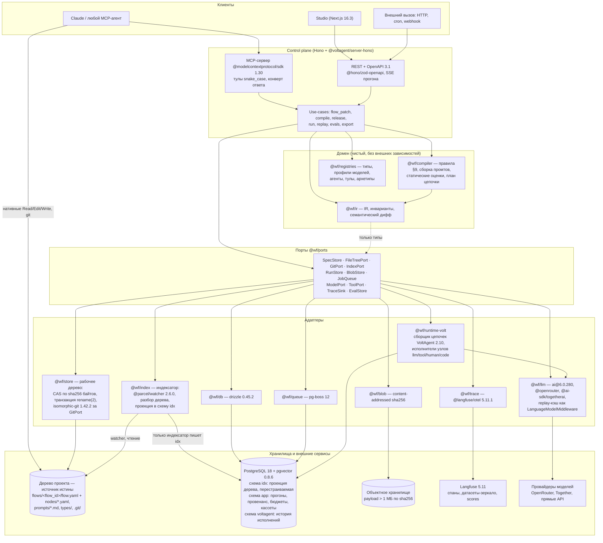
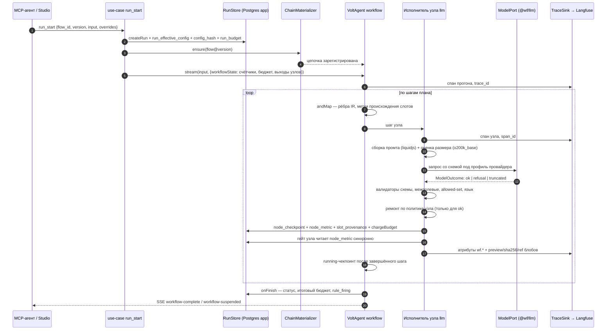
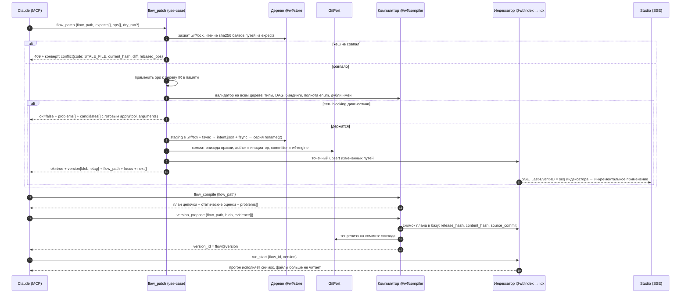

# 02. Архитектура системы

> Статус: draft
> Зависит от: [00. Исходная спека](00-source-spec.ru.md)
> Источники: `scratchpad/DECISIONS.md`, `research/00-verified-by-lead.md`,
> `research/volt-primitives.md`, `research/volt-durability.md`, `research/volt-integrations.md`,
> `research/api-layer.md`, `research/observability.md`, `research/mcp-server.md`;
> спека §4, §5, §8.6, §8.9, §8.11, §10, §20.

## Зачем этот слой

Архитектура отвечает на один вопрос: **где физически живёт каждая гарантия**. Спека §8.6
(надёжность исполнения), §8.9 (отладка и наблюдаемость) и §8.11 (версии и релизы) требуют,
чтобы провенанс, бюджеты, строгий вывод и воспроизведение были свойствами системы, а не
договорённостью авторов. Это достигается разделением на домен (IR и компилятор, которые ничего
не знают про внешний мир) и адаптеры к VoltAgent, провайдерам, Postgres и Langfuse. Вторая
задача слоя — зафиксировать границу «наше / чужое» так, чтобы отключение любого внешнего
сервиса (Langfuse, VoltOps, конкретный провайдер) не ломало поведение платформы.

## Решения

| Решение | Что берём | Версия | Лицензия | Почему |
|---|---|---|---|---|
| Рантайм воркфлоу | `@voltagent/core` | 2.10.0 | MIT | чекпоинты, suspend/resume, `timeTravel`, горячая регистрация — готовое (`research/00-verified-by-lead.md`) |
| HTTP-слой | `@voltagent/server-hono` | 2.0.14 | MIT | полный жизненный цикл воркфлоу из коробки + `configureApp` под свои роуты |
| Контракт API | `@hono/zod-openapi` | 1.6.3 | MIT | server-hono уже вендорит его внутри; один `createRoute` = одна строка OpenAPI = один MCP-тул |
| Клиент API | `openapi-typescript` 7.13.0 + `openapi-fetch` | — | MIT | типы без рантайм-кодогена, дрейф контракта ловится в CI |
| MCP | `@modelcontextprotocol/sdk` | 1.30.0 | MIT | единственный вход агента |
| Публикация воркфлоу как тулов | `@voltagent/mcp-server` | 2.2.0 | MIT | авто-пара `workflow_{id}` / `workflow_{id}_resume` |
| LLM SDK | `ai` | 6.0.280 | Apache-2.0 | `@voltagent/core@2.10.0` объявляет peer `ai: ^6.0.0`; установка с `ai@7` падает по ERESOLVE |
| Хранилище | PostgreSQL 18 + pgvector 0.8.6 | образ `pgvector/pgvector:0.8.6-pg18` | — | `uuidv7()` встроен; одна БД, три схемы |
| ORM и миграции | `drizzle-orm` 0.45.2 + `drizzle-kit` 0.31.10, `pg` 8.23.0 | пин | Apache-2.0 / MIT | forward-only, expand/contract |
| История исполнений VoltAgent | `@voltagent/postgres` | 2.1.3 | MIT | та же БД, схема `voltagent`, 6 таблиц создаются в рантайме |
| Очередь и таймеры | `pg-boss` | 12.x | MIT | дедлайны suspended-прогонов и cron в той же БД, без второй инфраструктуры |
| Трассы | `@langfuse/tracing` + `@langfuse/otel` + `@langfuse/client` | 5.11.1 | MIT | OTel-линия; `VoltAgentObservability({spanProcessors:[...]})` принимает массив |
| Офлайн-оценка | `@voltagent/evals` 2.0.5 + `@voltagent/scorers` 2.1.0 | пин | MIT | CI-гейт `volt eval run` с ненулевым exit code |
| Studio | `next` 16.3.4, `react` 19.3.0, `@xyflow/react` 12.11.6 | пин | MIT | канвас — готовый |
| Автораскладка | `elkjs` 0.12.0 | пин | EPL-2.0 OR GPL-3.0-or-later | единственная не-MIT зависимость, условия в [DECISIONS.md](DECISIONS.md) |

## 1. Карта системы

Три входа (MCP-агент, Studio, внешний вызов) сходятся в один control plane. Control plane —
единственная реализация операций: MCP-тул и HTTP-роут зовут один и тот же use-case, второй
реализации нет. Домен (IR, компилятор, реестры) стоит за портами; VoltAgent, провайдеры,
Postgres, объектное хранилище и Langfuse — адаптеры.

Четвёртый вход — рабочее дерево проекта: Claude Code правит файлы нативными Read/Edit/Write
и git, минуя control plane. **Определения живут в файлах, база — перестраиваемый индекс**
([ADR-0017](adr/0017-files-as-source-of-truth.md)); схему `idx` наполняет индексатор, который
следит за деревом и никем, кроме себя, не пишется.



Три инварианта карты:

1. **Стрелок из `domain` в `adapters` нет.** Домен зависит только от `@wf/ports` — это интерфейсы
   и типы, без рантайм-зависимостей.
2. **`@wf/llm` — единственный пакет, импортирующий `ai`, `@ai-sdk/*`, `@openrouter/*`.** Запрет
   остальных импортов — правилом `no-restricted-imports` (Biome 2.5.13).
3. **Langfuse не читается на горячем пути.** Ни один гейт, ретрай или экспорт не делает запрос в
   Langfuse; отключение трасс теряет только просмотр глазами.
4. **Схему `idx` пишет один процесс — индексатор.** `DROP SCHEMA idx CASCADE` с последующей
   переиндексацией не меняет ни одного ответа продукта; истина остаётся в дереве и в git.

## 2. Процессы и деплой

Один образ, одна кодовая база, две роли, выбираемые переменной `ROLE`. Третьего процесса нет:
Studio — это статика Next.js плюс тонкий Route Handler-прокси, который добавляет заголовок
`Authorization` и не содержит бизнес-логики.

| | `ROLE=api` | `ROLE=worker` |
|---|---|---|
| Что поднимает | `@voltagent/server-hono` 2.0.14, MCP-сервер, OpenAPI-док | обработчики `pg-boss` 12 и cron-расписания |
| Кто ходит | Studio, MCP-агенты, внешние вызовы | никто снаружи, порта не слушает |
| Прогоны | интерактивные: `workflow.stream()` → SSE `POST /workflows/:id/stream` | фоновые, по расписанию, длинные: `workflow.run()` внутри job |
| Записи в `app` | транзакционные: `flow_patch`, выпуск версии, создание прогона | чекпоинт-производные, метрики, результаты evals |
| Масштабирование | горизонтально, без состояния кроме живых SSE | горизонтально; задачи с `singletonKey` — в одном экземпляре |
| Обязательные env | `DATABASE_URL`, `LANGFUSE_*`, ключи провайдеров | то же + `WORKER_QUEUES` |

### Что именно делает `ROLE=worker`

| Задача pg-boss | Триггер | Почему не в `api` |
|---|---|---|
| `run.deadline` | `sendAfter(deadline)` при `suspend` | VoltAgent сам по таймауту не возобновляет — планировщик наш |
| `run.deadline.reconcile` | cron, раз в минуту | сверка: suspended-прогоны, чей `sendAfter` потерялся при падении |
| `run.restart_active` | старт процесса, `singletonKey: "restart"` | `restartAllActiveWorkflowRuns()` обязан выполниться ровно один раз, иначе два процесса поднимут один `executionId` |
| `run.scheduled` | cron воркфлоу | долгий прогон не должен держать HTTP-соединение |
| `evals.experiment` | из `experiment_run` | `@voltagent/evals` гоняет датасет минутами |
| `export.bundle` | из `project_export` | детерминированный tar и Merkle-корень — CPU-bound |
| `langfuse.dataset_sync` | после изменения датасета | наш Postgres — источник, Langfuse — зеркало |

### Как процессы делят БД

Одна база, три схемы:

- **`app`** — наши таблицы событий и снимков, миграции `drizzle-kit`, forward-only, expand/contract, без `down`.
- **`idx`** — проекция файлового дерева. Мигрируется тем же `drizzle-kit`, но пишет в неё только
  роль `wf_indexer`; `DROP SCHEMA idx CASCADE` с переиндексацией не теряет ничего.
- **`voltagent`** — 6 таблиц адаптера `@voltagent/postgres@2.1.3`, создаются им в рантайме через
  `CREATE TABLE IF NOT EXISTS`. Мы их не трогаем и не мигрируем; читаем только через API адаптера.

`pg-boss` держит свои таблицы в собственной схеме в той же базе — отдельного брокера нет.
`tenant_id` присутствует во всех таблицах `app` с первого дня, доступ ограничен RLS.

### Как процессы делят регистр воркфлоу

Проверенный факт: `WorkflowRegistry` — **процессный синглтон** (`globalThis.___voltagent_workflow_registry`).
Значит общего регистра между процессами не существует, и «зарегистрировать версию» — это не
глобальное событие, а локальное действие каждого процесса.

Отсюда правило: **что исполняет процесс, определяет снимок выпущенной версии в `app.spec_versions`,
а регистр VoltAgent — процессный кэш скомпилированных цепочек.** Файлы в этой цепочке не участвуют:
дерево читает компилятор при материализации, а не материализатор цепочек. Материализация ленивая
и идемпотентная:

```ts
type ChainId = `${FlowId}@${Version}`;

interface ChainMaterializer {
  ensure(chainId: ChainId): Promise<RegisteredWorkflow>;
  evict(chainId: ChainId): void;
}
```

`ensure` проверяет `WorkflowRegistry.getInstance().getWorkflow(chainId)`, при промахе читает план
из `app.spec_versions`, собирает цепочку и зовёт `registerWorkflow`. Выпуск новой версии не
инвалидирует ничего: версии неизменяемы, `chainId` новый. Снятие версии с публикации рассылается
через `LISTEN/NOTIFY` на канал `flow_version_revoked`, каждый процесс вызывает
`unregisterWorkflow` у себя. Перезапуск процессов не нужен — горячая регистрация подтверждена.

```mermaid
flowchart LR
  subgraph api["ROLE=api (N реплик)"]
    hono["server-hono: REST + SSE"]
    mcpsrv["MCP-сервер"]
    reg1["WorkflowRegistry (синглтон процесса)"]
    mat1["ChainMaterializer"]
  end

  subgraph worker["ROLE=worker (M реплик)"]
    boss["pg-boss workers + cron"]
    reg2["WorkflowRegistry (синглтон процесса)"]
    mat2["ChainMaterializer"]
  end

  subgraph pgdb[("PostgreSQL 18")]
    appschema["схема app<br/>снимки планов выпущенных версий,<br/>runs, run_nodes (provenance, rule_firings),<br/>blobs, cassettes"]
    idxschema["схема idx<br/>проекция дерева, пишет только индексатор"]
    vaschema["схема voltagent<br/>история исполнений,<br/>__voltagent_restart_checkpoint"]
    bossschema["схема pgboss<br/>очередь, sendAfter, cron"]
  end

  hono --> mat1
  mcpsrv --> mat1
  mat1 -->|"промах кэша: читает план"| appschema
  mat1 --> reg1
  boss --> mat2
  mat2 -->|"промах кэша: читает план"| appschema
  mat2 --> reg2
  reg1 -->|"чекпоинты, state"| vaschema
  reg2 -->|"чекпоинты, state"| vaschema
  hono -->|"enqueue фоновых"| bossschema
  bossschema --> boss
  appschema -->|"NOTIFY flow_version_revoked"| mat1
  appschema -->|"NOTIFY flow_version_revoked"| mat2
```

Следствие для интерактивных прогонов: SSE-поток живёт в той реплике `api`, где стартовал прогон.
Балансировщик обязан держать сессию на этой реплике до конца потока либо мы переводим Studio на
возобновляемый поток (`@voltagent/resumable-streams` уже зависимость `server-hono`; точный API
не проверен — см. «Открытые вопросы»). Fallback, работающий всегда: `startAsync()` →
`executionId` → REST-поллинг истории исполнений.

## 3. Границы слоёв и правило зависимостей

Применённый паттерн — **Ports and Adapters (гексагональная архитектура)**. Домен объявляет
интерфейсы (порты), инфраструктура их реализует (адаптеры), сборка происходит в композиционном
корне процесса. Внутри адаптеров дополнительно применяются **Adapter** (обёртка чужого API в наш
интерфейс), **Strategy** (таблица эмиттеров и исполнителей узлов), **Registry** (реестры типов,
профилей, архетипов) и **Chain of Responsibility** (конвейер ремонта структурированного вывода).

### Правило зависимостей

```
@wf/ir  ←  @wf/compiler  ←  @wf/usecases  →  @wf/ports  ←  адаптеры
                                    ↑
                          @wf/contracts (zod-схемы границы)
```

| Пакет | Может импортировать | Категорически не может |
|---|---|---|
| `@wf/ir` | `zod` | всё остальное |
| `@wf/compiler` | `@wf/ir`, `@wf/ports` (только типы), `liquidjs`, `gpt-tokenizer` | `@voltagent/*`, `ai`, `drizzle-orm`, `@langfuse/*`, `pg` |
| `@wf/registries` | `@wf/ir`, `@wf/ports` | то же |
| `@wf/usecases` | домен + `@wf/ports` | конкретные адаптеры |
| `@wf/ports` | `@wf/ir`, `zod` | любую реализацию |
| адаптеры | свою библиотеку + `@wf/ports` | другие адаптеры |
| `@wf/llm` | `ai`, `@ai-sdk/*`, `@openrouter/*` | — (единственный такой пакет) |

Правило исполняется машинно, а не на честном слове: `no-restricted-imports` в Biome 2.5.13 по
каждой строке таблицы плюс граф зависимостей turborepo 2.10.12. Нарушение — красный билд.

Ключевое следствие для компилятора: **план цепочки — это данные, а не замыкания.** Рёбра IR
компилируются в декларативные мапперы `andMap` (`{source: "value"|"data"|"input"|"context"|"step"|"fn", path|key|stepId}`),
а не в JS-функции. Поэтому `@wf/compiler` выдаёт сериализуемый план, который `@wf/runtime-volt`
превращает в цепочку VoltAgent, а эмиттер codegen — в читаемый TS-проект. Домен про VoltAgent
по-прежнему ничего не знает.

### Порты и их адаптеры

| Порт | Зачем | Адаптер | На чём |
|---|---|---|---|
| `SpecStore` | чтение и запись определений: спеки, узлы, промты; истина — файлы, не строки БД | `@wf/store` | `FileSpecStore` поверх `FileTreePort` + `GitPort`; чтение идёт через дерево, поиск — через `IndexPort` |
| `FileTreePort` | атомарная запись N файлов: CAS по sha256 байтов, staging `.wf/txn/<ulid>`, `rename(2)`, межпроцессный `.wf/lock` | `@wf/store` | `node:fs/promises` + `@parcel/watcher` 2.6.0 (MIT) за `FileWatcher`, `chokidar` 5.0.0 запасной |
| `GitPort` | коммит на эпизод правки, лог по пути, checkout дерева, теги релиза | `@wf/store` | `isomorphic-git` 1.42.2 (MIT); `simple-git` 3.36.0 второй реализацией для тяжёлых операций |
| `IndexPort` | проекция дерева в схему `idx` и запросы «где используется тип X», «что сломает правка» | `@wf/index` | drizzle 0.45.2 под ролью `wf_indexer` — единственной с `INSERT` в `idx` |
| `RunStore` | прогоны, узлы, провенанс слотов, бюджеты, сработавшие правила | `@wf/db` | `app.runs`, `app.run_nodes` (помесячные партиции, BRIN по времени), `app.slot_provenance`, `app.run_budget`, `app.rule_firing` |
| `BlobStore` | payload по правилу трёх зон: <8 КБ inline jsonb, 8 КБ–1 МБ отдельная таблица, >1 МБ объектное хранилище | `@wf/blob` | content-addressed по sha256 (`@noble/hashes`) |
| `JobQueue` | отложенные задачи, дедлайны, cron, идемпотентность | `@wf/queue` | pg-boss 12 (`sendAfter`, `singletonKey`) |
| `ModelPort` | вызов модели, строгий вывод, usage, стоимость | `@wf/llm` | `ai@6.0.280` + провайдеры; replay-кэш встроен как `LanguageModelMiddleware` через `wrapLanguageModel` |
| `ToolPort` | вызов инструмента, таймаут, одобрение | `@wf/tools` | `createTool` + `outputSchema` + `needsApproval` + `ToolHooks`; внешние серверы — `MCPConfiguration` |
| `TraceSink` | спаны, атрибуты `wf.*`, ссылки на блобы | `@wf/trace` | OTel + `@langfuse/otel` 5.11.1 как элемент `spanProcessors` |
| `EvalStore` | датасеты, эксперименты, scores, пороги гейтов | `@wf/evals` | `@voltagent/evals` 2.0.5 + `@voltagent/scorers` 2.1.0, зеркало датасетов в Langfuse |
| `DatasetStore` | датасеты, сплиты `train/dev/test`, элементы, покрытие | `@wf/datasets` | drizzle 0.45.2 → `app.datasets`, `app.dataset_items` |
| `ScorerPort` | запуск скорера (детерминированного или судьи) над элементом | `@wf/scorers` | `@voltagent/scorers` + наши реализации |
| `CassetteStore` | content-addressed кассеты вызовов модели и тулов для `replay` | `@wf/llm` | drizzle 0.45.2 → `app.cassettes`, `app.cassette_entries` |
| `PromptOptimizerPort` | внешний оптимизатор шаблона на выборке evals | `@wf/prompts` | реализация появляется вместе с оптимизатором ([13](13-evals-and-gates.md)) |

Сигнатуры портов — строгий TypeScript с branded-типами идентификаторов, без `any`:

```ts
type Brand<T, B extends string> = T & { readonly __brand: B };
export type RunId = Brand<string, "RunId">;
export type NodeId = Brand<string, "NodeId">;
export type BlobRef = Brand<string, "BlobRef">;

export interface ModelPort {
  generate(request: ModelRequest): Promise<ModelOutcome>;
  stream(request: ModelRequest): AsyncIterable<ModelStreamPart>;
}

export type ModelOutcome =
  | { kind: "ok"; value: unknown; usage: Usage; cost: Cost }
  | { kind: "refusal"; reason: string; usage: Usage; cost: Cost }
  | { kind: "truncated"; partial: string; usage: Usage; cost: Cost };

export interface TraceSink {
  startNodeSpan(input: NodeSpanInput): NodeSpan;
  attachBlob(span: NodeSpan, key: string, payload: BlobAttachment): void;
}

export interface RunStore {
  createRun(input: CreateRunInput): Promise<RunId>;
  appendNodeCheckpoint(input: NodeCheckpoint): Promise<void>;
  readNodeMetrics(runId: RunId, nodeId: NodeId): Promise<NodeMetric>;
  chargeBudget(runId: RunId, delta: BudgetDelta): Promise<BudgetState>;
}
```

`ModelOutcome` — три исхода, а не два: `jsonrepair` молча фальсифицирует обрезанные ответы
(проверено запуском), поэтому ремонт применим только к ветке `ok`, а `truncated` чинить запрещено.
Это свойство порта, а не деталь реализации: домен обязан различать три исхода на уровне типов.

## 4. Поток данных одного прогона

Вход — `run_start` (MCP-тул) или `POST /api/runs` (Studio, внешний вызов). Выход — завершённый
прогон, чьи чекпоинты, провенанс и бюджет лежат в Postgres, а дерево спанов — в Langfuse.



### Что происходит на каждом шаге и где живёт гарантия

| Шаг | Механика | Гарантия и где она реализована |
|---|---|---|
| 1. `run_start` | создаётся строка `app.runs`, эффективная конфигурация после мержа дефолтов и оверрайдов, `config_hash` | воспроизводимость: в трассу уходит только `config_hash`, полная конфигурация — в Postgres |
| 2. Материализация | `ChainMaterializer.ensure(flow@version)` | версия неизменяема; прогон всегда привязан к конкретному `flow@version`, а не к черновику |
| 3. Старт | `workflow.run/stream(input, { workflowState })` — счётчики циклов, остаток бюджета, лучшие кандидаты, выходы узлов с метками происхождения | `workflowState` кладётся в чекпоинт приостановки и восстанавливается при resume |
| 4. Рёбра | `andMap` с декларативным источником; `source:"fn"` — аварийный люк, провенанс для него пишем сами | граф остаётся сериализуемым и инспектируемым; отладчик показывает ровно IR |
| 5. Сборка промта | скомпилированный шаблон liquidjs + значения слотов; к каждому значению прикреплена метка происхождения | `slot_provenance` в Postgres — основа ответа «почему такое значение» |
| 6. Replay-кэш | `LanguageModelMiddleware` через `wrapLanguageModel`, ключ — хеш промта, модели, параметров и seed | `timeTravel` переисполняет вызовы моделей, детерминизм реплея даёт только наш кэш |
| 7. Вызов | схема компилируется под профиль пары (IR-схема × провайдер): все поля required, опциональность через `null`, `additionalProperties:false`, без рекурсии, порядок полей как в IR | одной strict-схемы на всех провайдеров не существует; профиль — свойство пары |
| 8. Исход | `ok` / `refusal` / `truncated` | обрезанный ответ не чинится: `jsonrepair` молча фальсифицирует его |
| 9. Валидация | схема (zod 4.6.2 на горячем пути), межполевые проверки, allowed-set, язык | динамический allowed-set: ≤50 значений — enum в схеме, выше — индексный выбор из пронумерованного списка |
| 10. Ремонт | Chain of Responsibility: ретрай с текстом ошибки ≤ k раз → фолбэк-профиль → консенсус → эскалация человеку | backoff с джиттером — наш: в `WorkflowRetryConfig` только фиксированная задержка |
| 11. Бюджет | `chargeBudget` после каждого узла; usage из `state.usage` для `andAgent`, ручной учёт для `streamText` | решение «остановить прогон» читает Postgres, не Langfuse |
| 12. Гейт узла | обёртка шага синхронно читает `node_metric` и решает fail / retry / fallback | live-скореры VoltAgent работают только на агенте и только асинхронно — гейт узла наш |
| 13. Чекпоинт | running-чекпоинт пишется после каждого завершённого шага в `metadata.__voltagent_restart_checkpoint` | продолжение после падения — `restart(executionId)` из `ROLE=worker` |
| 14. Приостановка | `suspend(reason, suspendData)` + `suspendSchema`/`resumeSchema` на шаге | дедлайн ставится задачей `run.deadline` в pg-boss: VoltAgent сам по таймауту не просыпается |
| 15. Трасса | спан с атрибутами `wf.*`, `gen_ai.*` дополнительно, `langfuse.*` для отрисовки | большие payload — по правилу preview + sha256 + size + ref + truncated, тело в BlobStore |
| 16. Финал | хук `onFinish` пишет статус, итоговый бюджет и `rule_firing` | аудит решений и вход для экспорта |

### Связывание наших данных с трассами

Каждая строка в `app` несёт `trace_id` (32 hex) и `span_id` (16 hex) — те же, что у OTel-спана
(`getActiveTraceId()` / `getActiveSpanId()` из `@langfuse/tracing`). Обратно:
`langfuse.observation.metadata` несёт `wf.run_id` и `wf.node_id`. Своей мапы идентификаторов нет,
переход в обе стороны однозначен, а миграция на другой бэкенд трасс не требует перекладывания
ключей.

### Идемпотентность

Шаг после `resume` или `restart` исполняется **целиком заново** — это семантика VoltAgent, а не
наш выбор. Поэтому каждый узел с внешним эффектом обязан объявить ключ идемпотентности; ключ
выводится из `run_id + node_id + iteration` и хранится в `app`. Валидатор компилятора отклоняет
узел с эффектом, у которого ключ не выводится.

## 5. Поток данных одной правки спеки агентом

Истина — файлы рабочего дерева. Единица записи — один тул `flow_patch` с массивом операций,
применяемых атомарно к N файлам. Конкурентность решается compare-and-swap по sha256 **байтов**
каждого затрагиваемого файла; CRDT не берём — задача не в слиянии текста, а в валидации
типизированного графа перед сериализацией.

```ts
const PatchInput = z.object({
  flow_path: z.string(),
  expects: z.array(z.object({ path: z.string(), file_hash: z.string().nullable() })).min(1),
  ops: z.array(Op).min(1).max(50),
  idempotency_key: z.string().optional(),
  dry_run: z.boolean().default(false)
});
```



### Что гарантирует каждая стадия

| Стадия | Инвариант | Механика |
|---|---|---|
| Блокировка | две записи не пересекаются | межпроцессный `.wf/lock` (`O_EXCL`, pid + ttl 30 с + heartbeat) на всю транзакцию; занят — `LOCK_BUSY` |
| CAS | чужая правка не затирается молча | `expects[{path, file_hash}]`, `file_hash: null` — «файла быть не должно»; отказы `STALE_FILE`, `FILE_VANISHED`, `FILE_EXISTS`, `TREE_DIRTY`; у REST тот же механизм — `If-Match: "<blob_sha256>"`, 412 |
| Атомарность | либо все файлы, либо ни одного | staging `.wf/txn/<ulid>` с `fsync`, `intent.json` как точка невозврата, серия `rename(2)`; падение после неё доигрывается при следующем старте |
| Валидация | невалидное дерево не сериализуется | валидатор идёт **до** записи и на всём дереве в памяти: межфайловые инварианты одним файлом не проверить; `blocking` не пишется вовсе, `advisory` пишется с пометкой |
| Ответ агенту | агент всегда знает следующий шаг | единый конверт: `ok`, `version{blob, etag}`, `flow_path`, `focus`, `problems[]`, `candidates[]` с готовым `apply{tool,arguments}`, `next[]`, `refs[]`, `ui_url`, `truncated` |
| Ретраи MCP | повтор не создаёт вторую правку | `idempotency_key` + `app.write_intents` с TTL, дедуп по `client_op_id` |
| Предпросмотр | «покажи, что будет» без записи | `dry_run: true` — всё то же самое, кроме staging, коммита и индексации |
| Конфликт | 409 не бывает голым | возвращаются текущий `file_hash` и дифф; операции над непересекающимися путями ребейзятся автоматически, ручное разрешение — только при пересечении путей |
| История | видно, кто правил и что | коммит на **эпизод правки**, а не на запись; `git author` — инициатор, `git committer` — `wf-engine`; откат всегда движением вперёд |
| Выпуск | версия неизменяема | снимок плана в базе + `release_hash`; авторитетен хеш содержимого, а не commit sha |
| Регистрация | без перезапуска процессов | `WorkflowRegistry.registerWorkflow` в рантайме (проверено); отзыв версии — `NOTIFY flow_version_revoked` → `unregisterWorkflow` в каждом процессе |
| Живой UI | Studio не опрашивает | watcher → индексатор → SSE; TanStack Query инвалидируется по `etag`, а не по счётчику |
| Прямая правка файла | инвариант держит дисциплина, а не транзакция | хук `flow_check` на `PostToolUse` и в pre-commit, `wf check` в CI; невалидное дерево закоммитить можно, релизнуть нельзя |

Организационный предохранитель, снимающий большую часть конфликтов до их возникновения:
advisory-lock `flow_lock({spec_id, ttl_s: 300})`. Studio показывает «Claude редактирует», человек
может перехватить принудительно.

## 6. Строим или берём

| Компонент | Строим или берём | Чем именно | Почему |
|---|---|---|---|
| IR воркфлоу | строим | `@wf/ir`, zod 4.6.2 | это и есть продукт: типизированные слоты, провенанс, политики; готового нет |
| Компилятор | строим | `@wf/compiler` | правила §9, сборка промтов, статические оценки, взаимоисключающие предикаты для `switch` |
| Реестры типов, профилей, агентов, тулов, архетипов | строим | `@wf/registries` + экраны Studio | схемы наши, паттерн Registry |
| Исполнители узлов `llm`/`tool`/`human`/`code` | строим | шаги VoltAgent с нашим кодом внутри | здесь живут строгий вывод, валидаторы, провенанс, бюджеты, политики, replay-кэш |
| Цепочки, чекпоинты, restart, suspend/resume | берём | `@voltagent/core` 2.10.0 | `andThen/andMap/andAll/andForEach/andBranch/andWhen/andRace/andDoWhile/andWorkflow`, running-чекпоинт после каждого шага |
| Детерминированный replay и fork | берём | `workflow.timeTravel({executionId, stepId, inputData, resumeData, workflowStateOverride})` | штатное API; наша часть — replay-кэш моделей и REST/MCP-обёртка |
| Lineage форков | строим | своя таблица + чтение из `metadata` | top-level `replayedFromExecutionId` на postgres-адаптере всегда `undefined`, GIN-индекса по `metadata` в пакете нет |
| Лимит итераций цикла | строим | счётчики в `workflowState`, условие генерирует компилятор | у `andDoWhile`/`andDoUntil` лимита нет |
| `switch` по enum (ровно одна ветка) | строим | взаимоисключающие предикаты + шаг сведения | `andBranch` запускает **все** истинные ветки, first-match и else отсутствуют |
| `quorum(k)`, `any`, политики ошибок веток | строим | обёртка ветки в `Result` + явные ключи + шаг сведения | `andAll` падает целиком и сливает результаты в один объект |
| `on_item_error` | строим | обёртка элемента в `Result` + фильтр по политике | у `andForEach` политики нет |
| Отмена проигравших в `race` | строим | свой `AbortController`, проброшенный в узлы | `state.signal` — про suspension, не про гонку |
| Backoff | строим | экспонента + джиттер | в `WorkflowRetryConfig` только фиксированный `delayMs` |
| Таймауты приостановки | строим | pg-boss `sendAfter` + cron-сверка | VoltAgent сам по таймауту не возобновляет |
| Переопределение модели и инструкций на вызове | строим | динамические функции агента, читающие эффективную конфигурацию из контекста вызова | `model` и `instructions` отсутствуют в `BaseGenerationOptions` |
| Гейты качества на уровне узла | строим | обёртка шага, синхронный `runLocalScorers`, решение fail/retry/fallback | live-скореры VoltAgent только на агенте и только async |
| Единый клиент к моделям | берём | `ai` 6.0.280 + `@openrouter/ai-sdk-provider` 2.10.0 + `@ai-sdk/togetherai` 2.0.81 | изолировано в `@wf/llm`; `ai@7` несовместим с peer VoltAgent |
| Строгий вывод | строим слой, берём режимы | пост-обработка после `z.toJSONSchema` под профиль провайдера | Zod 4 из коробки даёт невалидный для OpenAI strict вывод (проверено на `z.discriminatedUnion`) |
| PII и инъекции | берём | `createPIIInputGuardrail`, `createDefaultPIIGuardrails`, `createPromptInjectionGuardrail` + `andGuardrail` как узел IR | свой regex-зоопарк не пишем; наша часть — реестр политик и типизированный `PolicyViolation` вместо голого throw |
| Тулы и внешние MCP-серверы | берём | `createTool` + `outputSchema` + `needsApproval` + `ToolHooks`; `MCPConfiguration` | таймаут тула как декларативное поле — наш (в `ToolOptions` его нет) |
| HTTP жизненный цикл воркфлоу | берём | `@voltagent/server-hono` 2.0.14: execute/stream/suspend/resume/cancel + `configureApp` | свои роуты вешаются на тот же `OpenAPIHono` |
| Контракт API и клиент | берём | `@hono/zod-openapi` → `openapi-typescript` 7.13.0 → `openapi-fetch` | один `createRoute` = одна операция OpenAPI = один MCP-тул; дрейф ловится в CI |
| Публикация воркфлоу как MCP-тулов | берём | `@voltagent/mcp-server` 2.2.0 | авто `workflow_{id}` и `workflow_{id}_resume` |
| MCP-контракт авторства (`flow_*`, `run_*`, `experiment_*`) | строим | `@modelcontextprotocol/sdk` 1.30.0, фазовое раскрытие через `enable()/disable()` | одновременно ≤20–25 тулов, ядро 8–10 всегда включено |
| Аутентификация | берём | `AuthProvider` VoltAgent + `authNext` | один токен, два входа: UI и MCP-агент |
| История исполнений VoltAgent | берём | `@voltagent/postgres` 2.1.3 | 6 таблиц в схеме `voltagent`, создаются в рантайме |
| Наши таблицы | строим | drizzle 0.45.2, схема `app`, RLS по `tenant_id` | `run_nodes` партиционируется помесячно, BRIN по времени |
| Векторный поиск | берём | pgvector 0.8.6 HNSW в схеме `app` | встроенное векторное хранилище `@voltagent/postgres` не использует pgvector (BYTEA + полный перебор) |
| Очередь и таймеры | берём | pg-boss 12 | та же БД, второго брокера нет |
| Трассы и просмотр глазами | берём | Langfuse 5.11.1 через `spanProcessors` | продуктовый UI трасс, annotation queues, LLM-as-judge конфиги не пишем |
| Node-level метрики для гейтов | строим | `app.run_nodes` (агрегаты по узлам) | гейт обязан читать их синхронно и транзакционно, внешний SaaS для этого не годится |
| Прайсинг и расчёт стоимости | строим | `app` + `costDetails` в трассу | биллинг не может зависеть от чужой таблицы цен |
| Офлайн-evals и CI-гейт | берём | `@voltagent/evals` 2.0.5 + `@voltagent/scorers` 2.1.0, `volt eval run` | exit code 1 при провале критериев |
| Статистика гейта | строим | парный бутстрап BCa (B=10000, фиксированный seed), McNemar, Wilcoxon, Holm/BH | четыре исхода гейта: PASS / WARN / BLOCK / GATE_UNAVAILABLE |
| Экспорт 1:1 | строим | `canonicalize@5.0.0` (RFC 8785), `@noble/hashes` sha256 с доменной сепарацией, детерминированный `tar-stream`, Merkle-корень | файл YAML — источник истины, JSONB — индекс; каталоги определений копируются в бандл байт-в-байт |
| История определений и откат | берём | `isomorphic-git` 1.42.2 (MIT) за портом `GitPort`, `simple-git` 3.36.0 (MIT) второй реализацией | нужны commit, log по пути, checkout, CAS ref и теги — всё есть; rebase и merge спек нам не нужны по конструкции |
| Слежение за деревом проекта | берём | `@parcel/watcher` 2.6.0 (MIT), `chokidar` 5.0.0 (MIT) запасной, оба за `FileWatcher` (Strategy) | только у parcel есть `writeSnapshot`/`getEventsSince` — единственный механизм для «процесс был выключен, человек сделал pull» |
| Транзакция на N файлов и CAS | строим | `@wf/store`: staging `.wf/txn/<ulid>`, `intent.json`, `rename(2)`, `.wf/lock` | готовой библиотеки «атомарно применить набор файлов с compare-and-swap по хешу» нет |
| Индексатор дерева в Postgres | строим | `@wf/index`: инкрементальный разбор, полная пересборка, роль `wf_indexer` | проекция знает наш IR; ничего общего с поисковыми движками |
| Codegen | строим | шаблонные строки + prettier, `Record<kind, Emitter>` (Strategy) | тот же план цепочки, другой эмиттер |
| Канвас и раскладка | берём | `@xyflow/react` 12.11.6 + `elkjs` 0.12.0 | отладчик и экраны реестров — наши |

## 7. Ключевые архитектурные развилки

### 7.1. Вариант C, но исполнение — у VoltAgent

Спека §4 предлагает три варианта. Итог: **вариант C** — свои IR, компилятор и семантика, готовые
кирпичи снизу.

| Вариант | Отклонён потому что |
|---|---|
| A: n8n + Langfuse + BAML | последовательные ветки ломают дивергенцию, нет типизированных слотов и провенанса, гарантии держатся на договорённостях, лицензия допускает только внутреннее использование |
| B: тонкий слой поверх Mastra | две семантики исполнения; join-политики, провенанс и видимость становятся обёртками; Studio показывает граф Mastra, а не наш IR |
| C: своё ядро на готовых кирпичах | выбран |

Почему при варианте C исполнение всё равно берём у VoltAgent, а не пишем интерпретатор:
`andMap` плюс `getStepData`/`getStepResult` снимают нужду в собственном раннере графа. Рёбра IR
компилируются в декларативные мапперы, узлы — в шаги, доступ к чужим выходам — по `stepId`. Наш
компилятор остаётся компилятором, а не интерпретатором. Сверх этого VoltAgent отдаёт готовыми
четыре вещи, которые в варианте C пришлось бы писать самим и которые стоят месяцы: чекпоинты и
`restart`, `suspend`/`resume` с типизированными схемами, `timeTravel` для детерминированного
replay и горячую регистрацию версий без перезапуска процесса.

Периметр «ядра доверия» при этом не размывается, потому что он очерчен ровно тем, чего VoltAgent
не делает и делать не будет: backoff-политики, отмена проигравших в `race`, лимиты итераций
цикла, таймауты приостановки — плюс IR, компилятор, реестры и MCP-контракт.

### 7.2. `ai@6`, а не `ai@7`

`@voltagent/core@2.10.0` объявляет peer `ai: ^6.0.0`; `npm i @voltagent/core@2.10.0 ai@7` падает с
ERESOLVE. Берём `ai@6.0.280` и линию `@openrouter/ai-sdk-provider@2.10.0` (peer `ai: ^6`);
конфликт был только с `@openrouter/ai-sdk-provider@3.x` (peer `ai: ^7`). Цена решения снижена
изоляцией: `ai` импортирует ровно один пакет `@wf/llm`, миграция на `ai@7` — один коммит после
выхода `@voltagent/core` с peer `ai: ^7`.

### 7.3. REST + OpenAPI, а не tRPC и не Server Actions

`@voltagent/server-hono@2.0.14` уже построен на `@hono/zod-openapi` (вендорнутые символы
`OpenAPIHono`, `createRoute`, `extendZodWithOpenApi` в `dist/index.d.ts`), уже отдаёт OpenAPI-док и
Swagger UI. Выбирая REST+OpenAPI, мы ложимся на существующий контракт control plane, а не строим
второй транспорт рядом. tRPC отклонён потому, что даёт TypeScript-типы по проводу, а не
машиночитаемую схему: второму потребителю — MCP-агенту — нужен JSON Schema для `inputSchema`
каждого тула, и доставать его из tRPC пришлось бы сторонним мостом. Server Actions остаются на
чисто UI-мутации (позиция узла на канве, состояние вкладки), которые в MCP-контракт не входят.

### 7.4. SSE для прогона, WebSocket — не наружу

Прогон в Studio идёт по SSE `POST /workflows/:id/stream`: нужен POST с телом (EventSource его не
умеет), поток однонаправленный, авторизуется обычным заголовком. Встроенные `/ws/*` VoltAgent
**не аутентифицированы** — в прод наружу не выставляются; живые логи для отладчика в v1 берём из
тех же SSE-событий шагов плюс REST-поллинг, свой WS-прокси с проверкой сессии — в v1.5.

### 7.5. Граница «наш Postgres / бэкенд трасс»

В Postgres лежит всё, от чего зависит **поведение** системы: чекпоинты, провенанс слотов,
эффективная конфигурация, node-метрики гейтов, бюджеты, сработавшие правила, кассеты, артефакты
экспорта, прайсинг. В Langfuse — всё, что нужно **человеку посмотреть глазами**: дерево спанов,
waterfall, sessions, annotation queues, LLM-as-judge конфиги. Датасеты — наш Postgres источник,
Langfuse зеркало. Scores — Langfuse источник, но агрегаты, управляющие гейтами, зеркалятся к нам.
Отключение Langfuse не ломает ни одну функцию платформы.

### 7.6. Server-authoritative вместо CRDT

Правило «не изобретать велосипед» здесь работает в обратную сторону: yjs — живая библиотека, но
решает не нашу задачу. Наша задача — транзакционная валидация типизированного графа с линейной
историей версий; готовое решение для неё — валидатор перед записью и одна дверь записи файла.
С CRDT пришлось бы поверх него всё равно строить серверную валидацию и линеаризацию. Авторитетен
сервер, а истина — файл: противоречия нет, пока запись идёт одной дверью, а прямую правку
догоняет хук `flow_check`. CRDT
остаётся кандидатом точечно: свободный текст промта внутри одного узла и позиции узлов на канве.

### 7.7. Одна БД, три схемы

`app` и `idx` мигрируются `drizzle-kit`, `voltagent` создаётся адаптером в рантайме. `idx` отделена
от `app` не для красоты: её сносят и пересобирают целиком, а `app` — никогда. Альтернатива с
отдельной базой под историю исполнений отклонена: она ломает транзакционность связки
«чекпоинт узла + node_metric + бюджет», на которой стоит гейт уровня узла.

## Открытые вопросы

1. **Мультитенантность при процессном синглтоне `WorkflowRegistry`.** Регистр живёт в
   `globalThis.___voltagent_workflow_registry`, то есть один на процесс, а не на тенанта.
   *Что сделать:* решить, изолируем ли тенантов префиксом в `chainId` (`tenant/flow@version`) или
   отдельным пулом процессов на тенанта; проверить, что `activeExecutions` не утекает между
   тенантами; зафиксировать процедуру сброса регистра в тестах (`reset()`).
2. **Как auth-контекст доезжает до `filterWorkflows`/`filterTools` MCP-сервера.** Без этого
   MCP-агент одного тенанта потенциально видит воркфлоу другого.
   *Что сделать:* прочитать реализацию фильтров в `@voltagent/mcp-server@2.2.0` и написать
   интеграционный тест «два тенанта, один процесс».
3. **API `@voltagent/resumable-streams`.** Пакет уже зависимость `server-hono`, README в
   `node_modules` пуст — возобновление SSE по `Last-Event-ID` после перезагрузки вкладки не
   подтверждено.
   *Что сделать:* прочитать `dist/*.d.ts`, поставить спайк «перезагрузка вкладки на середине
   прогона». До закрытия вопроса действует fallback: `startAsync()` + REST-поллинг.
4. **Двойной учёт usage при одновременном экспорте в VoltOps и Langfuse.** Оба получают одни и те
   же спаны через `spanProcessors`.
   *Что сделать:* прогнать один воркфлоу с двумя процессорами и сверить суммарный `usage` и
   стоимость в обоих бэкендах с нашей строкой `run_budget`.
5. **Автоматический rebase операций `flow_patch`.** Нужна формальная таблица коммутативности:
   какие пары операций независимы.
   *Что сделать:* спроектировать таблицу вместе с валидатором инвариантов компилятора; до тех пор
   любой конфликт по пересекающимся путям возвращается агенту как `rebase: "manual"`.
6. **`dry_run` — решено в пользу флага `flow_patch`.** Отдельного тула `flow_validate` нет
   ([14. MCP-контракт](14-mcp-contract.md) §2.3): `dry_run: true` заменяет его и не тратит бюджет
   числа тулов (≤20–25 одновременно).
7. **Политика `checkpointInterval` по классу воркфлоу.** Running-чекпоинт после каждого шага
   имеет цену; для цепочек из дешёвых шагов она может быть выше пользы.
   *Что сделать:* измерить стоимость записи чекпоинта на реальной цепочке и завести два-три
   класса воркфлоу с разным интервалом.
8. **Auth на публичные по умолчанию GET-эндпоинты истории исполнений.** `@voltagent/server-hono`
   отдаёт их без проверки.
   *Что сделать:* закрыть их своим middleware в `configureApp` и зафиксировать тестом, что
   неавторизованный запрос к истории возвращает 401.
9. **Работает ли `Workspace` (EXPERIMENTAL) для шага воркфлоу без агента**, и версия с лицензией
   `@voltagent/cli`.
   *Что сделать:* спайк; до закрытия `Workspace` в архитектуру v1 не входит.
10. **Где исполняется интерактивный прогон при нескольких репликах `ROLE=api`.** Сейчас решение —
    sticky-сессия балансировщика на время SSE.
    *Что сделать:* проверить поведение при рестарте реплики в середине прогона; связано с п. 3.

### Расхождения между источниками, зафиксированные как разрешённые

| Расхождение | Позиция A | Позиция B | Как разрешено |
|---|---|---|---|
| Версия OpenRouter-провайдера | `research/00-verified-by-lead.md`: `@openrouter/ai-sdk-provider@3.0.0`, peer `ai: ^7` — несовместим с VoltAgent | `DECISIONS.md`: линия 2.10.0, peer `ai: ^6` — совместима | берём 2.10.0; несовместима именно ветка 3.x, а не пакет |
| Кэширует ли `timeTravel` ответы моделей | `research/volt-primitives.md`: помечено `UNVERIFIED` | `DECISIONS.md`: `timeTravel` переисполняет вызовы, нужен наш replay-кэш | действует позиция `DECISIONS.md`; детерминизм реплея обеспечивает только наш `LanguageModelMiddleware` |
| Переживает ли lineage форка перезапуск | `research/volt-durability.md` §5: postgres-адаптер теряет lineage | там же ниже: lineage переживает через `metadata` | top-level `replayedFromExecutionId` не использовать; читать из `metadata`, свой GIN-индекс — наш |
