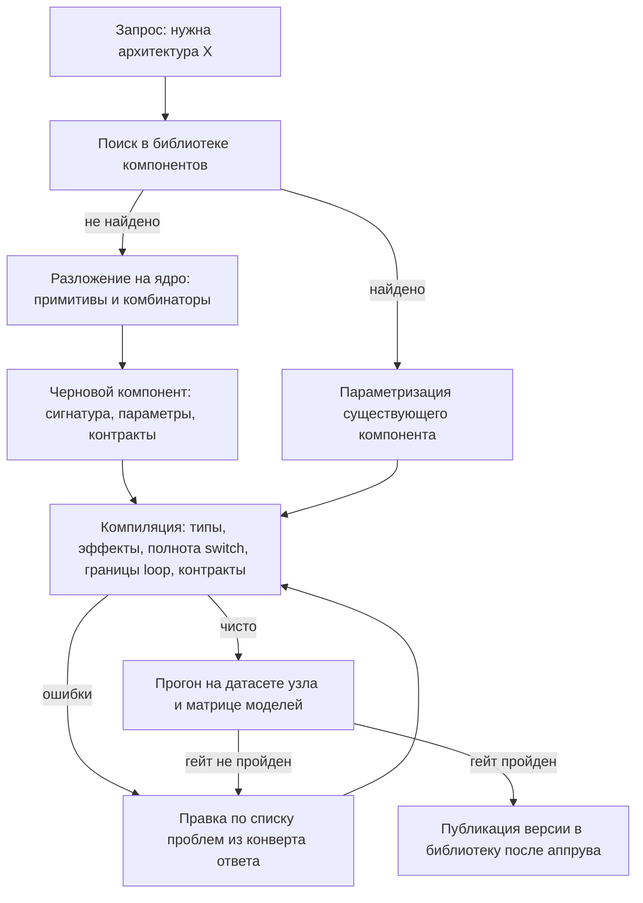

# 03. Ядро языка: примитивы, комбинаторы, компоненты

> Статус: draft
> Зависит от: [04. Формат IR](04-ir-schema.md), [07. Компилятор](07-compiler.md), [10. Рантайм](10-runtime.md), [05. Система типов](05-type-system.md)
> Источники: research/volt-primitives.md, research/structured-output.md, research/00-verified-by-lead.md, спека §6.0–6.5, §6.8, §6.9, §18 п.12, §20.1

## Зачем этот слой

Ядро закрывает §8.5 (управление потоком и параллелизм) и §8.1 (авторство) одним ходом: вместо каталога
типов узлов, который растёт на каждую новую идею, фиксируется язык из пяти примитивов и девяти
комбинаторов. Всё остальное — судьи, панели, циклы, каскады, агенты — компоненты стандартной
библиотеки, раскрываемые до примитивов. Компилятор проверяет общие правила ядра один раз для любой
композиции; специфичные защиты живут в контрактах компонентов, а не в коде платформы. Это же условие
kill-критерия 12: новая архитектура собирается без правок платформы.

## Решения

| Решение | Что берём | Версия | Лицензия | Почему |
|---|---|---|---|---|
| Исполнение узлов и комбинаторов | @voltagent/core | 2.10.0 | MIT | шаги, чекпоинты после каждого шага, suspend/resume, timeTravel — своего раннера не пишем |
| Схемы типов примитивов | zod | 4.6.2 | MIT | peer-диапазон core `^3.25.0 \|\| ^4.0.0`, горячий путь данных |
| Валидация IR-документов компонентов | ajv | по [05](05-type-system.md) | MIT | граница ввода, не горячий путь |
| Шаблоны узла `llm` | liquidjs | 10.29.0 | MIT | встроенный статический анализ шаблона и типизированный AST, свой парсер не пишем |
| Оценка размера промта | gpt-tokenizer (o200k_base) | — | MIT | бюджеты на узел до вызова |
| IR, компилятор, контракты компонентов, реестр версий | своё | — | — | готового нет: ядро доверия по §16 спеки |

Периметр «своего» по заметке volt-primitives фиксирован четырьмя пунктами: backoff-политики, реальная
отмена проигравших в `race`, лимиты итераций цикла, таймауты приостановки. Остальное — обёртки над
штатными шагами VoltAgent.

## 1. Почему язык с маленьким ядром, а не набор сущностей

Набор сущностей растёт линейно по числу идей и квадратично по числу их сочетаний: «панель судей»,
«панель судей с каскадом», «панель судей с каскадом и эскалацией человеку» — три сущности вместо одной
композиции. Каждая сущность тянет свою валидацию, свой рендер на канвасе, свою строку в промте для
Claude и свою ветку в компиляторе. Язык с маленьким ядром меняет это на постоянную стоимость:
компилятор знает 5 примитивов и 9 комбинаторов, а число архитектур не ограничено.

| Понятие языка | В платформе | Где живёт |
|---|---|---|
| Типы | Реестр типов: записи, enum, union, списки, optional, ID с разрешённым множеством, `Component<In, Out>` | [04. Формат IR](04-ir-schema.md) |
| Ввод-вывод и эффекты | Примитивы `llm`, `tool`, `human` | §2 этого документа |
| Чистые функции | Примитив `code` | §2 |
| Константы и версионированные фрагменты | Примитив `const` | §2 |
| Управляющие конструкции | Комбинаторы `seq`, `parallel`, `map`, `reduce`, `switch`, `loop`, `race`, `gate`, `try` | §3 |
| Функции и модули | Компоненты: сигнатура, параметры, дженерики, контракты, тело, версия | §4 |
| Параметрический полиморфизм | `type_params` компонента, например `verify_fix<T>` | §4 |
| Функции высшего порядка | Параметры типа `Component<In, Out>` | §4 |
| Стандартная библиотека | `judge`, `judge_panel`, `diverge`, `aggregate`, `verify_fix`, `critic_loop`, `consensus`, `cascade`, `bounded_agent` | §6 |
| Система типов и проверки | Компилятор: типы, эффекты, полнота `switch`, ограниченность `loop`, провенанс, бюджеты | [07. Компилятор](07-compiler.md) |
| Интерпретатор | Рантайм: компиляция IR в цепочку VoltAgent | [10. Рантайм](10-runtime.md) |
| Отладчик | Studio: канвас, таймлайн, раскрытие компонента до примитивов | [15. Studio: фронтенд](15-studio-frontend.md) |
| Тесты | Evals: датасеты, матрица моделей, гейты выпуска | [13. Evals и гейты](13-evals-and-gates.md) |
| Пакетный менеджер | Версии компонентов в библиотеке, пин по `name@vN` | §4 |

Три следствия, которые определяют реализацию:

1. **Компилятор маленький.** Правила ядра не знают слова «судья». `judge_panel` проверяется не
   компилятором, а своими контрактами (R-J1..R-J6), которые компилятор лишь вычисляет.
2. **Прозрачность обязательна.** Любой компонент раскрывается до примитивов на канвасе и в экспорте,
   иначе он неотличим от встроенной сущности и kill-критерий 12 не проверяем.
3. **Отказ вместо догадки.** Всё, чего нет в ядре, в библиотеке или в собственных компонентах
   воркфлоу, — ошибка компиляции, а не «вероятно, имелось в виду».

## 2. Примитивы

Пять примитивов, ниже — не сокращаемые. Всё, что выглядит как шестой, разбирается на эти пять:
`load` и `retrieve` — это `tool` с эффектом `read` и TTL; `subflow` — вызов компонента по версии;
`agent` — компонент `bounded_agent` (§6).

### 2.1. Решётка эффектов

Эффект — статическое свойство узла, вычисляемое снизу вверх. Комбинатор наследует объединение
эффектов своих детей, компонент — объединение эффектов тела.

| Эффект | Порождается | Что запрещает |
|---|---|---|
| `pure` | `code`, `const` | — |
| `read` | `tool` с `effect: read` | нельзя внутри `code` |
| `llm` | `llm` | узел недетерминирован: обязателен бюджет на объемлющий `loop` |
| `write` | `tool` с `effect: write` | запрещён внутри `race`-ветки и внутри тела `loop` без ключа идемпотентности |
| `external` | `tool` с `effect: external` | то же, что `write`, плюс обязательный таймаут |
| `human` | `human`, `gate` с ожиданием человека | запрещён внутри `map` с `concurrency > 1` без явной политики очереди |

Проверка `pure(code)` — не декларация, а статический анализ тела: запрещены импорты вне списка
разрешённых чистых модулей, обращения к `globalThis`, `Date.now`, `Math.random`, `process`, `fetch`
и любые `await` на не-разрешённых портах. Источник недетерминизма в `code` выдаётся как ошибка
компиляции с путём до узла.

### 2.2. `llm`

| Поле | Тип | Обязательность |
|---|---|---|
| `template` | `TemplateRef` — имя шаблона Liquid + версия | обязательно |
| `model_role` | `ModelRole` — роль из реестра, не имя модели | обязательно |
| `slots` | `Record<SlotName, Binding>` | обязательно, все слоты шаблона покрыты |
| `out` | `TypeRef` — тип выхода из реестра типов | обязательно |
| `on_invalid` | `fail \| repair(k) \| escalate_human` | обязательно |
| `overrides` | подмножество `{ temperature, top_p, seed, max_output_tokens, provider_options }` | опционально |
| `budget` | `{ usd?, tokens?, ms? }` | опционально на узле, обязательно на объемлющем `loop` (R-L1) |

Эффект: `llm`. Компилируется в `andAgent(task, agent, { schema }, map)` либо, когда нужен поток
токенов в UI, в `andThen` + прямой вызов агента + `ctx.writer.pipeFrom`: `andAgent` стриминг не
поддерживает. Четвёртый аргумент `map` генерируется **всегда** — без него выход агента замещает
данные шага целиком.

Что проверяет компилятор:

1. Шаблон разбирается liquidjs, по типизированному AST собирается множество переменных; каждая
   обязана иметь привязку в `slots`, каждый слот — быть использован. Неиспользуемый слот — ошибка,
   а не предупреждение.
2. Тип каждой привязки совместим с типом слота по реестру типов; преобразования допускаются только
   через `code` или встроенные проекции `pick`, `omit`, `map`, `flatten` (спека §6.4).
3. `out` компилируется в профиль схемы под провайдера роли: `openai-strict`, `anthropic-strict`,
   `permissive`. Единой strict-схемы на всех провайдеров не существует, профиль — свойство пары
   (IR-схема × провайдер).
4. Порядок полей `out` сохраняется как в IR и не сортируется: поле обоснования обязано стоять перед
   полем решения (это же R-J3 для судей).
5. Бюджет схемы для полей с динамическим allowed-set: ≤50 значений — enum в схеме, выше — индексный
   выбор из пронумерованного списка. Потолок enum для UUID — около 416 значений; превышение ловится
   до вызова модели.
6. Исходов вызова три: `ok`, `refusal`, `truncated`. `repair(k)` применим только к `ok`; ремонт
   обрезанного ответа запрещён на уровне компилятора и рантайма.
7. Уровень доверия входов: значение с меткой `untrusted` попадает в шаблон только в позицию данных,
   никогда в позицию инструкции; ветвление по нему допустимо лишь через типизированный enum
   экстрактора (принцип CaMeL, спека §6.5).
8. Метки `pii` в типах входов сверяются с allowlist провайдеров роли.

### 2.3. `tool`

| Поле | Тип | Обязательность |
|---|---|---|
| `tool_ref` | `ToolRef` — имя и пин версии схемы | обязательно |
| `in` / `out` | `TypeRef` | обязательно |
| `effect` | `read \| write \| external` | обязательно |
| `timeout_ms` | `number` | обязательно |
| `idempotency_key` | выражение над входом | обязательно при `effect: write \| external` |
| `retry` | `{ attempts, backoff: exponential(base, cap), jitter }` | опционально |
| `ttl_ms` | `number` | только при `effect: read` |

Компилируется в `andThen` вокруг `createTool`; внешние MCP-тулы подключаются через `MCPConfiguration`
с пином схемы. Ретраи с экспоненциальным backoff и джиттером **не выражаются** штатным механизмом:
в `WorkflowRetryConfig` только `attempts` и фиксированный `delayMs`. Поэтому backoff реализуется
внутри `execute` (а не через `retries`), чтобы попытки не плодили шаги в таймлайне.

Компилятор проверяет: наличие `idempotency_key` для эффектов `write` и `external`; что ключ —
чистое выражение над входом узла, а не значение из выхода `llm`; что при использовании внутри `loop`
или `map` ключ включает индекс итерации; что схема MCP-тула запинена по хешу, а не по имени.
Дополнительно: шаг после резюма исполняется заново с начала, поэтому узел с эффектом `write` в одном
шаге с `suspend` — ошибка компиляции.

### 2.4. `code`

| Поле | Тип | Обязательность |
|---|---|---|
| `fn` | `CodeRef` — имя чистой функции в реестре | обязательно |
| `in` / `out` | `TypeRef` | обязательно |
| `tests` | ссылка на набор тестов | обязательно |

Эффект `pure`. Компилируется в `andThen` без обёрток. Компилятор проверяет: статическую чистоту
(§2.1); что сигнатура TS выведена из `in`/`out`, а не объявлена вручную; что набор тестов не пуст и
покрывает все варианты входного enum, если вход содержит enum; что функция тотальна — либо возвращает
`out`, либо возвращает `Result<out, E>` с типизированным `E`, попадающим в `try`.

### 2.5. `human`

| Поле | Тип | Обязательность |
|---|---|---|
| `form` | `TypeRef` — тип задачи, из него генерируется форма | обязательно |
| `resume` | `TypeRef` — тип ответа человека | обязательно |
| `timeout` | длительность | обязательно |
| `on_timeout` | `fail \| default(value) \| escalate(role)` | обязательно |
| `assignee` | роль или очередь | обязательно |

Эффект `human`. Компилируется в шаг с `suspend(reason, suspendData)` и парой схем **на самом шаге**:
шаговые `suspendSchema`/`resumeSchema` перекрывают воркфлоу-уровневые, и только шаговая пара
описывает MCP-клиенту и UI, что именно прислать на резюм. Воркфлоу-уровневая пара ставится как
последний рубеж и никогда не используется как основная.

Таймаут — целиком наш слой: VoltAgent сам по таймауту не возобновляет. На `suspend` планировщик
ставит отложенную задачу pg-boss `sendAfter`, сверяющий cron добирает потерянные.

### 2.6. `const`

| Поле | Тип | Обязательность |
|---|---|---|
| `value` или `fragment_ref` | значение либо ссылка на версионированный фрагмент | обязательно |
| `type` | `TypeRef` | обязательно |
| `version` | `vN` | обязательно при `fragment_ref` |

Эффект `pure`. Компилируется в литерал внутри `andMap` (`source: "value"`). Компилятор проверяет
соответствие значения типу и существование версии фрагмента; неприкреплённая версия — ошибка, потому
что иначе бандл перестаёт быть воспроизводимым.

## 3. Комбинаторы

Девять конструкций. Колонка «VoltAgent» — во что компилируется, колонка «наш слой» — что обязан
дописать компилятор и рантайм; обе взяты из зафиксированных решений, не из догадок.

| Комбинатор | Обязательные параметры | VoltAgent 2.10 | Что дописывает наш слой |
|---|---|---|---|
| `seq` | — | цепочка `.andThen`, рёбра — `.andMap` | генерация id узлов и деклара­тивных мапперов; провенанс значений |
| `parallel` | `join: all \| any \| quorum(k) \| first_success`, `on_branch_error: fail \| skip \| default` | `.andAll({ steps })` | обёртка каждой ветки в `Result<T,E>`, явные ключи веток, шаг сведения по `join` |
| `map` | `over`, `concurrency`, `on_item_error` | `.andForEach({ step, items, map, concurrency })` | `on_item_error`, лимит на размер коллекции, частичные результаты |
| `reduce` | `init`, `step` | `.andThen` над результатом `map` | сахар: разворачивается в `map` + `code`/`aggregate` до компиляции |
| `switch` | `on: <enum>`, полный набор `cases` | `.andBranch({ branches })` | взаимоисключающие предикаты, проверка полноты enum, шаг сведения к одному значению |
| `loop` | `until`, `max_iter`, `carry`, `select: last \| best(score)`, `budget` | `.andDoUntil` / `.andDoWhile` | счётчики итераций, бюджет, детект стагнации, хранение лучшего кандидата, генерация условия |
| `race` | `timeout` | `.andRace({ steps })` | реальная отмена проигравших через свой `AbortController`, дискриминатор источника, учёт стоимости всех веток |
| `gate` | `timeout`, `on_timeout` | `.andWhen` + `suspend` внутри шага, либо `.andSleep`/`.andSleepUntil` | планировщик таймаутов (pg-boss), политика по таймауту, типизированная задача для UI |
| `try` | тип ошибки, запасная ветка того же типа | прямого аналога нет: `try/catch` внутри `execute` + `retries` на шаге | типизированные ошибки, `Result`-возврат, экспоненциальный backoff с джиттером, `finally` через `andTap` или `onFinish` |

### 3.1. `parallel`

Ветки получают **один и тот же** вход. `andAll` сливает результаты веток в один объект и падает
целиком, если упала любая ветка, — поэтому компилятор делает две вещи: присваивает каждой ветке
уникальный ключ (иначе поля затирают друг друга) и оборачивает тело ветки так, что исключение
превращается в `Result.err`. Политика реализуется шагом сведения, а не фреймворком.

| `join` | Успех, если | Результат |
|---|---|---|
| `all` | все ветки `ok` | запись `{ [branchKey]: T }` в порядке объявления веток |
| `any` | хотя бы одна `ok` | первая `ok` в порядке объявления, не по времени |
| `quorum(k)` | `ok` не меньше `k` | список `ok`-результатов в порядке объявления |
| `first_success` | хотя бы одна `ok` | та же семантика, что `any`, но ветки стартуют одновременно и остальные отменяются |

`on_branch_error: default` требует значения по умолчанию того же типа, что ветка; компилятор проверяет
это статически. Компилятор проверяет также: `1 <= k <= branches.length` для `quorum(k)`; отсутствие
эффекта `write` без ключа идемпотентности внутри веток; что `join: all` совместим с типом сведения.

### 3.2. `map`

Порядок результатов сохраняется — это гарантия `andForEach`, на неё опираемся. `items` — селектор
массива, `map` — решейп элемента с сохранением родительского контекста.

| `on_item_error` | Поведение | Тип выхода |
|---|---|---|
| `fail` | первая ошибка валит весь `map` | `T[]` |
| `skip` | ошибочные элементы выбрасываются, порядок остальных сохраняется | `T[]` |
| `collect` | ошибки собираются рядом с успехами | `{ ok: T[], failed: ItemError[] }` |

Компилятор проверяет: задан `concurrency` (числом или выражением), задан `on_item_error`, тип
элемента совместим с входом шага, есть верхняя граница длины коллекции — безграничный `map` над
выходом `llm` запрещён, потому что это неограниченный бюджет.

### 3.3. `switch`

`andBranch` вычисляет условия независимо, first-match и else в нём нет, все истинные ветки идут
параллельно, результаты возвращаются массивом в порядке объявления веток, несработавшие дают
`undefined`. Отсюда схема компиляции: по enum-дискриминатору генерируются попарно
взаимоисключающие предикаты `on === "case_i"`, затем шаг сведения берёт единственный не-`undefined`
элемент массива и падает, если их ноль или больше одного (это защита от расхождения IR и
сгенерированного кода, а не ожидаемый путь).

Компилятор проверяет: `on` — enum из реестра типов, а не строка; покрыты все варианты enum;
`default` допустим только с непустым полем обоснования, которое попадает в бандл и в ревью;
все ветки возвращают один тип; изменение enum в реестре даёт список всех затронутых `switch`
(kill-критерий 6).

### 3.4. `loop`

Тело выполняется минимум один раз — это семантика `andDoWhile`/`andDoUntil`, и IR обязан ей
соответствовать: «ноль итераций» выражается объемлющим `switch`, а не циклом. Лимита итераций у
комбинаторов нет, поэтому условие остановки целиком генерируется компилятором как конъюнкция:

```
stop = user_predicate(state)
     OR iteration >= max_iter
     OR spent.usd >= budget.usd
     OR spent.ms >= budget.ms
     OR stagnation(window, min_delta)
     OR seen_hashes.has(hash(candidate))
```

Состояние цикла живёт в `workflowState` (он переживает suspend/resume и попадает в чекпоинт):
счётчик итераций, накопленные траты, лучший кандидат со своим score, скользящее окно оценок,
множество хешей кандидатов. `select: best(score)` читает лучшего оттуда, а не из последней итерации.
Правила R-L1..R-L6 — в §7.

### 3.5. `race`

`andRace` работает по семантике `Promise.any`, а не `Promise.race`: провал быстрой ветки не валит
гонку, побеждает следующая финишировавшая; гонка падает, только когда отклонились все ветки.
Тип результата — union веток, поэтому дискриминатор источника (`source: "cache" | "model"`)
обязан быть в типе выхода — компилятор его добавляет, если автор не объявил.

Важная поправка к спеке: «остальные ветки отменяются» фреймворком **не** обеспечивается. Результат
проигравшей ветки игнорируется, но её вызовы физически продолжаются, токены тратятся, эффекты
происходят. Поэтому наш слой прокидывает собственный `AbortController` в каждый узел ветки и дергает
`abort()` из обёртки победителя, а учёт стоимости ведётся по **всем** веткам, не только по
победившей. Компилятор запрещает эффекты `write` и `external` без ключа идемпотентности внутри
веток `race` по этой же причине.

### 3.6. `gate`

Два режима. Ожидание человека компилируется в `andWhen` с `suspend` внутри вложенного шага и
собственной парой схем на этом шаге. Ожидание времени — `andSleep`/`andSleepUntil` только для
коротких пауз внутри процесса; ожидание часами и днями компилируется в `suspend` + внешний
планировщик, потому что удерживать процесс ради таймера нельзя.

`on_timeout` — обязательное поле с тремя значениями: `fail`, `default(value)`, `escalate(role)`.
Компилятор проверяет, что тип `default(value)` совпадает с типом выхода гейта, а `escalate(role)`
ссылается на существующую роль.

### 3.7. `try`

Прямого аналога нет. `try` компилируется в `try/catch` внутри `execute` с возвратом
`Result<T, E>` и последующим `switch` по тегу ошибки; `finally` — в `andTap` (он не может уронить
прогон, поскольку ошибки внутри него ловятся и логируются) либо в хук `onFinish`. Обратная сторона
`andTap` — молчаливое проглатывание: наш код внутри tap ловит сам и поднимает флаг в `workflowState`,
иначе потеря телеметрии будет невидимой.

Ретраи складываются в трёх местах: `retries` на шаге, `maxRetries` у `andAgent` (уровень модели) и
`maxMiddlewareRetries`. Это даёт мультипликативный взрыв попыток, поэтому правило компилятора:
**LLM-ретраи разрешены ровно на одном уровне**, остальные два зануляются. Полное число попыток шага —
`retries + 1`, номер текущей доступен как `ctx.retryCount` и считается с нуля.

## 4. Компоненты

Компонент — именованная, типизированная, версионированная композиция. Шесть частей: сигнатура,
параметры (в том числе компоненты), дженерики, контракты, тело, версия.

```yaml
component: verify_fix
version: v3
type_params: [T]
params:
  generator: Component<{ task: Task, feedback: Issue[] }, T>
  verifier:  Component<{ candidate: T }, Issue[]>
  score:     Component<{ candidate: T }, Score>
  max_iter:  Int
  budget:    Budget
in:  { task: Task }
out: { candidate: T, issues: Issue[], iterations: Int }
requires:
  - bounded(max_iter, 1, 10)
  - budget.usd > 0
  - effect_of(verifier) in { pure, read }  or  disjoint(families(verifier), families(generator))
ensures:
  - len($out.issues) == 0  or  $out.iterations == max_iter
  - trust_level($out.candidate) == trust_level($in.task)
body: ...
```

### 4.1. Сигнатура и параметры

- `in` и `out` — типы из реестра; структурная совместимость проверяется по реестру, не по имени.
- Параметры делятся на три класса: значения (`Int`, `Budget`, `Rubric`), ссылки на реестры
  (`ModelRole`, `ToolRef`, `TemplateRef`) и **компоненты** — `Component<In, Out>` и
  `Component<In, Out>[]`. Третий класс даёт высший порядок: `judge_panel` принимает список судей и
  агрегатор, `verify_fix` — генератор и верификатор.
- Параметр-компонент вызывается в теле через `call: $param`; компилятор подставляет тело параметра
  на этапе раскрытия и проверяет совместимость `In`/`Out` в точке вызова.
- Значения по умолчанию допустимы только для значений и ссылок, не для параметров-компонентов:
  дефолтный судья скрывал бы решение, которое обязано быть явным.

### 4.2. Дженерики

`type_params` объявляет переменные типа. Подстановка выводится из фактических аргументов в точке
использования: `verify_fix<Pitch>` выводится из типа `generator`. Ограничения записываются как
предикаты в `requires` (`has_field(T, "text")`), отдельного синтаксиса ограничений нет — одна
маленькая система вместо двух. Рекурсивных типов нет: это же условие профиля схем структурированного
вывода, где рекурсия запрещена.

### 4.3. Язык контрактов

Контракты — предикаты над **статическими** свойствами. Набор закрыт: нельзя вызвать произвольную
функцию, нет кванторов кроме ограниченных, нет вычислений над данными прогона.

| Домен | Предикаты и функции |
|---|---|
| Типы | `type_of(x)`, `subtype(A, B)`, `has_field(T, name)`, `is_enum(T)`, `enum_values(T)`, `field_before(T, a, b)`, `nullable(T, field)` |
| Семейства моделей | `family_of(role)`, `families(x)`, `distinct(xs)`, `disjoint(xs, ys)`, `provider_of(role)` |
| Кардинальность | `len(xs)`, `count(xs)`, `bounded(n, lo, hi)`, операторы `== != < <= > >=` |
| Происхождение и доверие | `provenance_nodes(v)`, `provenance_families(v)`, `trust_level(v) in { trusted, untrusted }`, `pii(T)`, `visibility(a, b) == blind` |
| Эффекты | `effect_of(x) in { pure, read, llm, write, external, human }`, `pure(x)` |
| Бюджеты и границы | `budget.usd`, `budget.tokens`, `budget.ms`, `max_iter`, `has_budget(x)`, `has_stop_condition(x)` |
| Логика и множества | `and`, `or`, `not`, `in`, `subset`, `all(xs, pred)`, `any(xs, pred)` |

Правила вычисления:

1. `requires` вычисляется **в каждой точке использования**, после подстановки фактических параметров.
   Предикат, не разрешимый статически, — ошибка компиляции: контракт обязан быть проверяем до прогона.
2. `ensures` вычисляется статически, когда возможно. Если предикат зависит от значений прогона
   (`len($out.issues) == 0`), компилятор вставляет после тела компонента проверочный узел `code`,
   а нарушение превращается в типизированную ошибку `ContractViolation`, ловимую через `try`.
3. Невыполненный `requires` — ошибка компиляции с путём до точки использования и текстом предиката.
   Нарушенный runtime-`ensures` останавливает прогон с сохранённым состоянием, как превышение бюджета.

### 4.4. Тело и версия

Тело — композиция примитивов, комбинаторов и вызовов компонентов. Компилируется в `andWorkflow`
(вложенный воркфлоу как обычный шаг, `stepType: "workflow"`) либо инлайнится в цепочку родителя.
Правило выбора: компонент с эффектом `human` или собственным бюджетом компилируется в отдельный
вложенный воркфлоу, чтобы иметь свои чекпоинт и границу приостановки; остальные инлайнятся ради
плоского таймлайна.

Версия — `name@vN`, ссылка на компонент всегда с пином. Правила изменения:

| Изменение | Версия |
|---|---|
| `in`, `out`, набор или типы параметров, `type_params` | новая мажорная `vN+1` |
| Ужесточение `requires` или ослабление `ensures` | новая мажорная `vN+1` |
| Ослабление `requires`, ужесточение `ensures`, изменение тела при сохранении сигнатуры и контрактов | ревизия внутри `vN` |
| Изменение документации и тестов | ревизия внутри `vN` |

Каждая ревизия получает хеш по канонизированному (RFC 8785) IR с префиксом `sha256-`; бандл
ссылается и на версию, и на хеш, иначе round-trip (kill-критерий 13) не воспроизводим.
Документация и набор тестов по умолчанию — обязательные части компонента: компонент без тестов не
публикуется в библиотеку.

## 5. Рамки ядра

Четыре ограничения. Для каждого — что именно проверяет компилятор и почему без этого ломается
что-то конкретное, а не «так чище».

| Рамка | Проверка компилятора | Что ломается без неё |
|---|---|---|
| Без рекурсии компонентов | граф вызовов компонентов строится при раскрытии; ищется цикл обходом в глубину; найденный цикл печатается как путь `a@v1 → b@v2 → a@v1` | нет статической границы стоимости прогона; бюджет и `max_iter` перестают быть верхней оценкой |
| Без замыканий над изменяемым состоянием | рёбра — только декларативные привязки (`$input.*`, `<node>.out.*`, `const`, `run.context.*`), компилируемые в `andMap` с `source: value \| data \| input \| context \| step`; `source: "fn"` запрещён в IR и остаётся аварийным люком рантайма | граф перестаёт быть сериализуемым и инспектируемым; провенанс и replay теряют опору |
| `code` — чистые функции | статический анализ тела (§2.1): запрет недетерминированных API, сети, времени, глобалов; обязательные типы из реестра; непустой набор тестов | реплей перестаёт быть детерминированным, мутационный тест ядра (kill-критерий 1) теряет смысл |
| Маленький язык контрактов | парсер допускает только предикаты из таблицы §4.3; неизвестный идентификатор — ошибка; предикат, не разрешимый статически, — ошибка в `requires` | контракты превращаются во второй язык, который нужно исполнять и отлаживать |

Три следствия, которые надо явно держать в голове при реализации:

1. **Итерация выражается только через `loop`.** Компонент, который «вызывает себя ещё раз при
   неудаче», — это `verify_fix`, а не рекурсия. Ограниченность цикла (R-L1) — единственный источник
   конечности прогона.
2. **Состояние цикла — не замыкание, а `workflowState`.** Счётчики, лучший кандидат и хеши живут
   в состоянии воркфлоу, которое переживает suspend/resume и попадает в чекпоинт, а не в переменной
   JS, которую не увидит ни реплей, ни отладчик.
3. **Порядок полей — часть семантики.** Компилятор не сортирует ключи типов ни в IR, ни при
   компиляции схемы: порядок генерации задаёт порядок «рассуждения» модели.

## 6. Стандартная библиотека

Ни один компонент библиотеки не является встроенной сущностью: всё собрано из §2 и §3 и раскрывается
на канвасе до примитивов. Ниже — сигнатуры и состав; три компонента раскрыты полностью.

| Компонент | Сигнатура | Ключевые параметры | Контракты | Из чего собран |
|---|---|---|---|---|
| `judge` | `<C>(candidate: C, rubric: Rubric) -> Verdict` | `mode: pointwise \| pairwise \| ranking`, `model_role`, `swap_positions` | R-J1, R-J2, R-J3, R-J4 | `llm` + `code` (усреднение перестановок для pairwise) |
| `judge_panel` | `<C>(candidate: C, rubric: Rubric) -> PanelVerdict` | `judges: Component[]`, `aggregate`, `on_disagreement`, `threshold` | R-J1..R-J5 | `map` + `code` + `switch` |
| `diverge` | `<T>(task: Task) -> T[]` | `n`, `vary: temperature \| seed \| persona \| model \| prompt_variant` | источник разнообразия задан; ветки слепы друг к другу | `parallel` (или `map` по списку переопределений) + `llm` |
| `aggregate` | `<T>(items: T[]) -> T` или `-> Agg<T>` | `strategy: vote \| rank \| merge(key) \| best_of(score)`, `dedup_key` | стратегия задана; при `merge(key)` ключ существует в типе | `code` (для `best_of` — `map` по скореру + `code`) |
| `verify_fix` | `<T>(task: Task) -> { candidate: T, issues: Issue[] }` | `generator`, `verifier`, `score`, `max_iter`, `budget`, `carry`, `stagnation` | R-L1..R-L6 | `loop` + вызовы параметров-компонентов |
| `critic_loop` | `<T>(task: Task) -> { candidate: T, score: Score }` | `generator`, `critic`, `reviser`, `max_iter`, `stop_when`, `select: best` | R-L1..R-L6, R-J2 для критика | `loop` + `llm` ×3 |
| `consensus` | `<T>(input: Doc) -> { value: T, agreement: Agreement }` | `extractor`, `n`, `critical_fields`, `on_conflict` | `n >= 3`, поля согласования объявлены | `map` (N прогонов экстрактора) + `code` (пофайловое согласование) |
| `cascade` | `<T>(task: Task) -> { value: T, tier: Tier }` | `tiers: Component[]`, `confidence`, `escalate_below` | тиры упорядочены по стоимости; порог задан; последний тир без эскалации | `loop` по тирам либо цепочка `switch` |
| `bounded_agent` | `<T>(task: Task) -> { result: T, steps: Step[] }` | `tools`, `max_steps`, `budget`, `stop_when`, `out` | R-L1, R-L3, R-L4; типизированный итог обязателен | `loop` над `llm` + `switch` по решению + `tool` |

### 6.1. `judge_panel`, раскрытый до примитивов

Панель — единственное место, где одновременно встречаются высший порядок, `map`, `switch` и
контракты. Ниже полное тело; `judge` внутри неё тоже раскрыт.

```yaml
component: judge_panel
version: v2
type_params: [C]
params:
  judges:          Component<{ candidate: C, rubric: Rubric }, Verdict>[]
  aggregate:       Component<Verdict[], PanelVerdict>
  on_disagreement: Component<Verdict[], PanelVerdict>
  threshold:       Float
in:  { candidate: C, rubric: Rubric }
out: PanelVerdict
requires:
  - len(judges) >= 2
  - distinct(families(judges)) >= 2
  - disjoint(families(judges), provenance_families($in.candidate))
  - all(judges, field_before(out_type(judge), "rationale", "score"))
  - visibility($in.candidate, judges) == blind
ensures:
  - subtype(type_of($out), PanelVerdict)
body:
  verdicts:
    kind: map
    over: $judges
    concurrency: all
    on_item_error: skip
    do: { call: $item, in: { candidate: $in.candidate, rubric: $in.rubric } }
  spread:
    kind: code
    fn: verdict_spread
    in: { verdicts: $verdicts, threshold: $threshold }
    out: { level: SpreadLevel }
  result:
    kind: switch
    on: $spread.level
    cases:
      low:  { call: $aggregate,       in: $verdicts }
      high: { call: $on_disagreement, in: $verdicts }
  return: $result
```

Компиляция этого тела: `map` → `andForEach` с обёрткой элемента в `Result` и фильтром по
`on_item_error: skip`; `code` → `andThen`; `switch` → `andBranch` с двумя взаимоисключающими
предикатами `level === "low"` и `level === "high"` плюс шаг сведения, берущий единственный
не-`undefined` элемент массива результатов.

Параметр `judges` заполняется компонентами `judge`, каждый из которых раскрывается так:

```yaml
component: judge
version: v2
type_params: [C]
params:
  model_role:     ModelRole
  mode:           JudgeMode
  swap_positions: Bool
in:  { candidate: C, rubric: Rubric }
out: Verdict
requires:
  - is_enum(type_of($in.rubric.criteria[*].scale)) or bounded(len($in.rubric.criteria), 1, 12)
  - field_before(Verdict, "rationale", "score")
  - mode == pairwise => swap_positions
ensures:
  - subtype(type_of($out), Verdict)
body:
  blinded:
    kind: code
    fn: strip_provenance_labels
    in: { candidate: $in.candidate }
    out: { candidate: C }
  direct:
    kind: llm
    template: judge_pointwise@v4
    model_role: $model_role
    slots: { candidate: $blinded.candidate, rubric: $in.rubric }
    out: Verdict
    on_invalid: repair(1)
  swapped:
    kind: switch
    on: $swap_positions
    cases:
      false: { const: null, type: Verdict? }
      true:
        kind: llm
        template: judge_pointwise_swapped@v4
        model_role: $model_role
        slots: { candidate: $blinded.candidate, rubric: $in.rubric }
        out: Verdict
        on_invalid: repair(1)
  merged:
    kind: code
    fn: average_positions
    in: { a: $direct, b: $swapped }
    out: Verdict
  return: $merged
```

Здесь видно, почему `judge` — компонент, а не примитив: снятие меток происхождения (`blind_labels`),
перестановка позиций и усреднение — это `code` и `switch`, а не поведение платформы.

### 6.2. `diverge`, раскрытый до примитивов

```yaml
component: diverge
version: v2
type_params: [T]
params:
  generator: Component<{ task: Task, overrides: CallOverrides }, T>
  vary:      VarySpec
  n:         Int
in:  { task: Task }
out: T[]
requires:
  - bounded(n, 2, 12)
  - len(expand(vary)) == n
  - visibility(siblings, siblings) == blind
ensures:
  - len($out) <= n
body:
  variants:
    kind: code
    fn: expand_vary_spec
    in: { vary: $vary, n: $n }
    out: CallOverrides[]
  candidates:
    kind: map
    over: $variants
    concurrency: $n
    on_item_error: skip
    do: { call: $generator, in: { task: $in.task, overrides: $item } }
  return: $candidates
```

`vary` в краткой форме `{ temperature: [0.4, 0.8, 1.1] }` разворачивается `code`-функцией в список
переопределений вызова; ветки не видят друг друга, потому что каждая получает только `task` и свои
переопределения. Важное ограничение рантайма: `model` и `instructions` нельзя передать в опциях
вызова — их нет в опциях генерации. Поэтому `vary: model | persona` реализуется динамическими
функциями агента, читающими эффективную конфигурацию из контекста вызова, а не подменой поля.

### 6.3. `verify_fix`, раскрытый до примитивов

```yaml
component: verify_fix
version: v3
type_params: [T]
params:
  generator: Component<{ task: Task, feedback: Issue[] }, T>
  verifier:  Component<{ candidate: T }, Issue[]>
  score:     Component<{ candidate: T }, Score>
  max_iter:  Int
  budget:    Budget
  carry:     CarrySpec
in:  { task: Task }
out: { candidate: T, issues: Issue[], iterations: Int }
requires:
  - bounded(max_iter, 1, 10)
  - has_budget(budget)
  - effect_of(verifier) in { pure, read } or disjoint(families(verifier), families(generator))
  - subtype(out_type(verifier), Issue[])
ensures:
  - len($out.issues) == 0 or $out.iterations == max_iter
body:
  fix:
    kind: loop
    max_iter: $max_iter
    budget: $budget
    carry: $carry
    stagnation: { window: 2, min_delta: 0 }
    select: best($score)
    until: len($step.issues) == 0
    step:
      candidate:
        call: $generator
        in: { task: $in.task, feedback: $loop.prev.issues }
      issues:
        call: $verifier
        in: { candidate: $candidate }
      return: { candidate: $candidate, issues: $issues }
  return: { candidate: $fix.best.candidate, issues: $fix.best.issues, iterations: $fix.iterations }
```

Компиляция: `loop` → `andDoUntil`, условие которого генерируется как дизъюнкция из §3.4; счётчик,
траты, окно оценок, лучший кандидат и множество хешей кандидатов кладутся в `workflowState` и
читаются через `$fix.*`. `carry: { history: last_2 }` ограничивает переносимую историю — без него
контекст растёт линейно по итерациям (R-L4).

## 7. Циклы как компоненты поверх `loop`

В ядре один примитив цикла. Пять типов — это компоненты библиотеки с разными верификатором и
условием остановки, и ничем больше.

| Компонент | Схема тела | Верификатор | Остановка | Что выбирается |
|---|---|---|---|---|
| `verify_fix` | генерация → проверка → доработка | детерминированный (`code`, схема, тесты) либо судья | `len(issues) == 0` / `max_iter` / стагнация | `best(score)` |
| `critique_revise` | генерация → критика → ревизия | судья-критик (`llm` другого семейства) | `score >= threshold` / `max_iter` | `best(score)` |
| `retry_with_feedback` | вызов → валидация → повтор с текстом ошибки | валидаторы схемы и межполевые проверки | `valid` / `k` попыток | последний валидный |
| `task_completion` | работа до закрытия чеклиста | проверка пунктов чеклиста (`code`) | все пункты закрыты / бюджет | последнее состояние чеклиста |
| `search` | расширение кандидатов → оценка → top-k | скорер (`code` или `llm`) | бюджет / глубина | top-k по скореру |

### 7.1. Типизированная обратная связь

Обратная связь между итерациями — не текст исключения, а список `Issue`:

```ts
type Severity = "assert" | "check";

interface Issue {
  path: (string | number)[];
  code: string;
  message: string;
  severity: Severity;
  expected?: string;
  observed?: unknown;
  repairHint?: string;
}
```

В промт следующей итерации уходят только элементы с `severity: "assert"`; `check` копятся в провенанс
и не тратят попытку. Поле `observed` обязательно: без «что ты вернул» модель повторяет ту же ошибку.
Одинаковый набор `Issue[]` два раза подряд означает, что ремонт не сходится — цикл прерывается досрочно,
не дожигая бюджет. Число попыток и поведение при исчерпании (`fail`, `best_effort`, `escalate_human`) —
поля IR узла, а не константы в коде.

### 7.2. Правила R-L1..R-L6

| Код | Правило | Как проверяется |
|---|---|---|
| R-L1 | Заданы `max_iter` и бюджет | статически: оба поля непусты, `bounded(max_iter, 1, 10)`, `budget.usd > 0` или `budget.tokens > 0` |
| R-L2 | Выход верификатора типизирован и привязан к слоту обратной связи генератора | статически: `subtype(out_type(verifier), Issue[])` и существование слота `feedback` у генератора |
| R-L3 | Условие остановки — типизированный предикат | статически: `until` разбирается в предикат над типом тела цикла; строка или произвольный JS запрещены |
| R-L4 | Переносимая история ограничена | статически: `carry` задан и конечен (`last_k`, `summary`, `none`); отсутствие `carry` — ошибка |
| R-L5 | LLM-верификатор из другого семейства, чем генератор; детерминированный предпочтительнее | статически: `effect_of(verifier) in { pure, read }` либо `disjoint(families(verifier), families(generator))`; если проверку можно выразить кодом, а выбран `llm`, компилятор выдаёт предупреждение с требованием обоснования |
| R-L6 | Выбирается лучший вариант, включена защита от стагнации и зацикливания | статически: `select: best(score)` и непустой `stagnation`; в рантайме — множество хешей кандидатов в `workflowState`, совпадение хеша останавливает цикл |

R-L1..R-L4 — правила ядра для примитива `loop`: нарушение ловится на любом цикле, включая написанный
Claude с нуля. R-L5 и R-L6 — контракты компонента `verify_fix` и его родственников: они живут в
`requires` компонента, а не в компиляторе.

### 7.3. Что даёт рантайм

Счётчик итераций, накопленные траты, окно последних оценок, лучший кандидат и множество хешей —
записи `workflowState`, поэтому таймлайн цикла в отладчике строится без отдельной шины событий:
на каждой итерации в поток пишется событие с `nodeId`, номером итерации, оценкой и списком проблем.
Корреляцию вложенности рантайм проставляет сам — в штатном событии потока нет ни `parentStepId`,
ни индекса ветки.

## 8. Как Claude собирает архитектуру, которой нет в библиотеке

Kill-критерий 12: «дивергентный судья с каскадом» должен собираться из ядра и библиотеки без правок
платформы. Протокол — шесть шагов, каждый опирается на существующий MCP-тул.



1. **Поиск.** Сначала поиск по библиотеке архитектур и компонентов по признакам задачи. Собственная
   композиция — только когда поиск пуст: иначе библиотека не растёт, а дублируется.
2. **Разложение.** Архитектура записывается как композиция уже существующих компонентов и
   комбинаторов. Для дивергентного судьи с каскадом: `diverge` → `map` по кандидатам →
   `cascade(tiers: [judge@cheap, judge_panel@strong])` → `aggregate(strategy: best_of(score))`.
   Ни одной новой сущности — только параметризация и комбинаторы.
3. **Оформление компонента.** Композиция получает имя, сигнатуру, параметры (в том числе
   параметры-компоненты, чтобы судьи и тиры подставлялись снаружи), `type_params` и контракты.
   Контракты берутся из правил, применимых к содержимому: панель внутри — значит R-J2 и R-J5
   поднимаются в `requires` нового компонента.
4. **Компиляция.** Компилятор проверяет ядро (типы, эффекты, полнота `switch`, ограниченность
   `loop`, провенанс, бюджеты) и контракты в каждой точке использования. Ответ приходит одним
   конвертом с `problems[]` и готовыми `candidates[]` с `apply{tool, arguments}` — Claude правит по
   списку, а не угадывает.
5. **Проверка.** Сгенерированный датасет обязан покрыть 100% значений enum на входах и 100% веток
   `switch`; узел прогоняется по матрице моделей. Пока гейт не зелёный, компонент остаётся локальным.
6. **Публикация.** После аппрува компонент получает `name@v1`, хеш канонизированного IR и уходит в
   библиотеку — с этого момента он доступен поиску на шаге 1 и его можно форкнуть.

Что делает этот протокол проверяемым: на шаге 3 ни одна конструкция не может появиться вне списков
§2 и §3, потому что любой неизвестный `kind` — ошибка компиляции. Если для новой архитектуры
потребовалась правка платформы, это сигнал, что в ядре чего-то не хватает, и обсуждается как
изменение ядра, а не обходится частным случаем.

## Открытые вопросы

1. **`concurrency: all` в `map`.** В примерах спеки у `map` стоит `concurrency: all`, а у
   `andForEach` параметр `concurrency` описан как число. Неизвестно, принимает ли он функцию от
   контекста. *Закрыть:* посмотреть тип `concurrency` в `dist/index.d.ts` @voltagent/core@2.10.0;
   если только число — компилятор обязан выводить `all` в длину коллекции на рантайме, что требует
   отдельного шага вычисления длины перед `andForEach`.
2. **Отмена проигравших в `race`.** Спека §6.2 утверждает «остальные ветки отменяются»; по заметке
   исследования `andRace` их не отменяет, а `ctx.state.signal` описан узко — как сигнал проверки
   приостановки. *Закрыть:* прогнать пробу с двумя ветками и длинным `fetch`, убедиться, что наш
   `AbortController`, прокинутый в узлы, действительно прерывает вызов, и зафиксировать, кто
   агрегирует стоимость проигравших.
3. **Тип агрегированной ошибки `andRace` при провале всех веток.** В документации пакета не сказано,
   `AggregateError` это или первая ошибка. От этого зависит, как `try` типизирует ошибку гонки.
   *Закрыть:* пробный прогон с тремя падающими ветками.
4. **Детерминизм `timeTravel` для узлов `llm`.** Не подтверждено, переисполняются ли вызовы моделей
   для шагов до `stepId` или берутся из истории. От этого зависит, обязателен ли replay-кэш на
   каждом узле или только на границе реплея. *Закрыть:* прогон реплея с логированием вызовов
   провайдера.
5. **`reduce` в списке комбинаторов.** Спека §6.0 перечисляет комбинаторы без `reduce`, §6.2
   включает его и помечает как сахар. В этом документе `reduce` оставлен в таблице §3 как сахар,
   разворачиваемый до компиляции. *Закрыть:* решить, остаётся ли `reduce` поверхностным синтаксисом
   (тогда его нет в IR) или самостоятельным узлом IR; от этого зависит, видит ли его канвас.
6. **Порог калибровки судьи.** Спека §6.8 задаёт `min_agreement: 0.8` одним числом, сквозные решения
   требуют weighted kappa ≥ 0.7 и Krippendorff alpha ≥ 0.8. *Закрыть:* зафиксировать в контракте
   R-J6 обе метрики и убрать однопараметрическую форму из схемы компонента.
7. **Источник `confidence` для `cascade`.** Порог эскалации задан, но откуда берётся уверенность
   дешёвого тира — в источниках не определено; logprobs доступны не у всех провайдеров.
   *Закрыть:* выбрать между полем уверенности в типе выхода (модель называет её сама),
   детерминированным скорером и отдельным судьёй, и записать выбор в контракт компонента.
8. **`bounded_agent` и внутренний цикл агента.** У вызова агента есть собственный лимит шагов, и он
   пересекается с нашим `loop` по вызовам `llm` и `tool`. *Закрыть:* решить, компилируется ли
   `bounded_agent` в один агентский шаг с лимитом шагов или в явный `loop` из примитивов; второе
   даёт прозрачность и провенанс, первое дешевле по накладным расходам.
9. **Конвертация схем компонентов в JSON Schema для MCP.** В экспортах core есть кандидат
   `zodSchemaToJsonUI`, но его сигнатура и совместимость выхода с Draft-7 не проверены.
   *Закрыть:* прогнать конвертер на схемах `judge_panel` и `verify_fix` и сравнить с нашим
   профильным компилятором схем.
10. **Асинхронные предикаты `requires`.** Часть контрактов хочется проверять по внешним данным
    (существование ID в реестре). В Zod 4.6.2 поведение асинхронного `superRefine` не проверено.
    *Закрыть:* либо запретить такие предикаты в `requires` (оставив их только в `ensures` как
    runtime-проверку), либо проверить асинхронный путь и зафиксировать его в §4.3.
11. **Обоснование `default` в `switch`.** Правило требует обоснования, но не определено, где оно
    хранится и кто его принимает. *Закрыть:* завести поле `default_rationale` в узле IR и решить,
    блокирует ли его отсутствие компиляцию или только публикацию версии.
12. **Граница инлайна компонента.** Правило §4.4 («компонент с эффектом `human` или собственным
    бюджетом — отдельный вложенный воркфлоу») не проверено на глубине вложенности: неизвестно, как
    ведут себя чекпоинты и `getStepResult` для шагов внутри вложенного воркфлоу.
    *Закрыть:* пробный прогон трёхуровневой вложенности с приостановкой на нижнем уровне.
