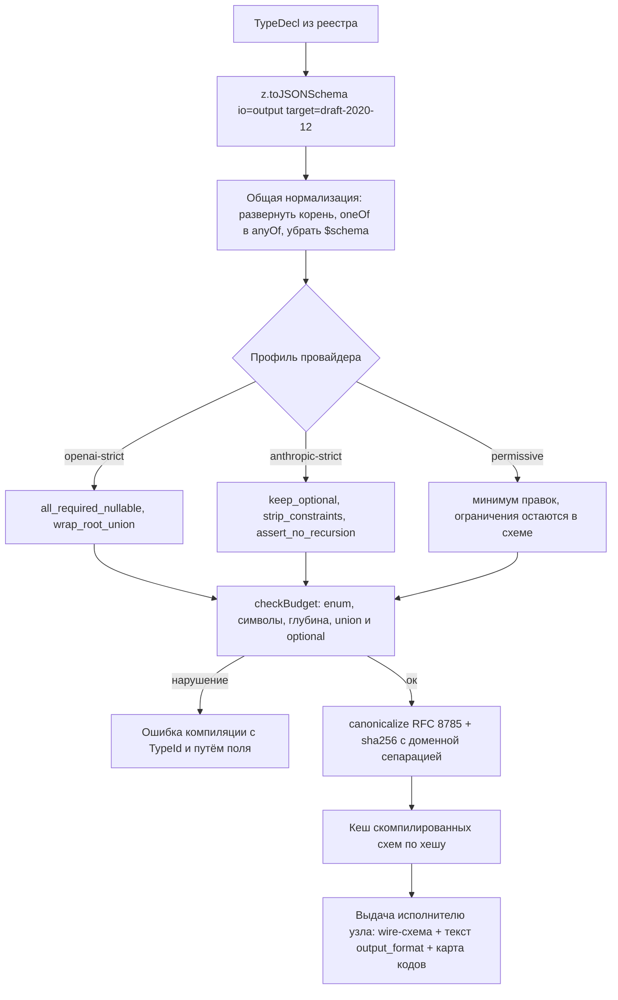

# 05. Система типов и реестр типов

> Статус: draft
> Зависит от: [07. Компилятор](07-compiler.md) (проверка правил и бюджетов схем), документ о движке промтов (`{{ output_format }}`, правила R-T1…R-T12), документ об исполнителе LLM-узла (три исхода вызова, цикл ремонта).
> Источники: `research/structured-output.md`, `research/templating.md`, `research/00-verified-by-lead.md`, спека §7.1, §7.6, §8 (строки 1, 9, 21, 23, 31, 41), требование R14, `DECISIONS.md`.

## Зачем этот слой

Реестр типов — единственный источник истины о форме данных, которые ходят между узлами и попадают в модель. Он закрывает из каталога §8: строку 23 (значения enum без расшифровки — описания обязательны и попадают в промт автоматически), строку 31 (выдуманные enum и ID — разрешённое множество живёт в схеме вызова), строку 21 (разные форматы чисел, валют и дат — value-типы с каноническим форматом), строку 9 (не тот источник в слоте — тип включает идентичность enum и сущности), строку 1 (данные литералами в тексте — только типизированные слоты и представления) и строку 41 (невычерпывающий роутинг — полнота `switch` проверяется по enum реестра). Всё это работает только если тип имеет ровно одно описание, из которого механически выводятся: TypeScript-тип, рантайм-валидатор, JSON Schema под конкретного провайдера и текстовый блок для промта.

## Решения

| Решение | Что берём | Версия | Лицензия | Почему |
|---|---|---|---|---|
| Описание типов | `zod` | 4.6.2 | MIT | Один объект даёт TS-тип (`z.infer`), рантайм-валидатор и JSON Schema. Второго источника истины по типам в системе нет. |
| Эмиттер JSON Schema | `z.toJSONSchema` (в составе zod) | 4.6.2 | MIT | Свой эмиттер не пишем: обход, `$defs`, циклы и targets уже есть. |
| Профили схем под провайдера | наш код поверх опции `override` | — | — | Zod 4 из коробки даёт невалидный для OpenAI strict вывод (проверено запуском), готового слоя нет. |
| Валидация IR-документов реестра и внешних JSON Schema | `ajv` (`ajv/dist/2020.js`) + `ajv-formats` | 8.20.0 | MIT | Схема IR живёт как JSON, а не как Zod. На горячем пути данных ajv не используется. |
| Синтаксический ремонт ответа | `jsonrepair` | 3.15.0 | ISC | Чистый JS, 40 КБ. Применяется только к ветке `ok`. |
| Форматирование ошибок валидации | `z.prettifyError` / `z.treeifyError` | 4.6.2 | MIT | Готовый текст для промта ремонта и готовое дерево для фронта. Свой форматтер не пишем. |
| Рендер представлений в текст | `liquidjs` | 10.29.0 | MIT | Движок промтов уже на нём; представление — это шаблон-фрагмент, а не отдельный рендерер. |
| Оценка размера блока типа в промте | `gpt-tokenizer` (o200k_base) | — | MIT | Общая для платформы оценка, с поправочным коэффициентом профиля. |
| Хеш схемы и реестра | `canonicalize` + `@noble/hashes` | 5.0.0 / — | — | RFC 8785 + sha256 с доменной сепарацией; хеш схемы — ключ кассет и кеша грамматики. |
| Schema-Aligned Parsing (BAML) | **не берём как зависимость**, только идеи | `@boundaryml/baml` 0.226.2 | MIT | Это язык и кодогенератор — второй источник истины рядом с IR. Забираем различие `@assert`/`@check`. |

## 1. Модель типов

Тип объявляется один раз декларацией реестра. Декларация — не Zod-схема напрямую: Zod внутри, но снаружи структура, которая несёт обязательные описания, представления и происхождение. Это позволяет одному объявлению питать четыре потребителя: TypeScript, рантайм-валидатор, компилятор JSON Schema и генератор текста промта.

```ts
export type TypeId = string & { readonly __typeId: unique symbol };
export type ViewName = string & { readonly __viewName: unique symbol };

export type TypeKind = "record" | "enum" | "union" | "list" | "id" | "value" | "component";

export interface FieldDecl {
  readonly type: TypeRef;
  readonly description: string;
  readonly nullable: boolean;
}

export interface TypeDecl<T = unknown> {
  readonly id: TypeId;
  readonly kind: TypeKind;
  readonly description: string;
  readonly schema: z.ZodType<T>;
  readonly fields?: ReadonlyArray<readonly [string, FieldDecl]>;
  readonly valueDescriptions?: Readonly<Record<string, string>>;
  readonly views?: Readonly<Record<ViewName, ReadonlyArray<string>>>;
}
```

`fields` — массив пар, а не объект: порядок полей значим (§6) и не должен зависеть от порядка обхода ключей.

Пример объявления, эквивалентный YAML из спеки §7.1:

```ts
export const BeachEntry = defineEnum({
  id: "BeachEntry",
  description: "Тип входа в море",
  values: {
    sand: "Песчаный вход",
    pontoon: "Понтон",
    rocks: "Камни или риф",
  },
});

export const HotelId = defineId({
  id: "HotelId",
  description: "Идентификатор отеля",
  source: "db.hotels",
  allowedSet: "dynamic",
  codeFormat: "prefixed_ordinal",
});

export const Hotel = defineRecord({
  id: "Hotel",
  description: "Отель-кандидат подборки",
  identity: HotelId,
  fields: [
    ["name", field(z.string(), "Название отеля")],
    ["beach_entry", ref(BeachEntry, "Тип входа в море")],
    ["pool_heated", field(z.boolean(), "Подогрев бассейна")],
    ["internal_score", hidden(z.number(), "Внутренний скор ранжирования")],
  ],
  views: { brief: ["name", "beach_entry", "pool_heated"] },
});
```

`hidden` — то же поле, но без права попасть в любое представление; компилятор запрещает включать его в `views` и в слоты промта.

### 1.1. Таблица соответствий

| Конструкция типа | Представление в реестре | JSON Schema (профиль `openai-strict`) | Как попадает в промт |
|---|---|---|---|
| Запись | `defineRecord`, `fields` — упорядоченный массив пар | `type:"object"`, все ключи в `required`, `additionalProperties:false`, порядок `properties` = порядок `fields` | через `view` — рендер значений; структура выхода — в блоке `{{ output_format }}` |
| Enum | `defineEnum`, `values: Record<value, description>`; описание обязательно | `{"type":"string","enum":[...]}`; описания значений в схему **не** идут (провайдеры не имеют для них места) | расшифровка «значение — описание» в `{{ output_format }}`; в тексте разрешено только через `` |
| Union | `defineUnion` с обязательным дискриминантом → `z.discriminatedUnion` | Zod даёт `oneOf` → профиль переписывает в `anyOf`; union в корне запрещён → обёртка `{ result: … }` | перечень вариантов с указанием поля-дискриминанта и его enum |
| Список | `z.array(...)` | `{"type":"array","items":…}`; `minItems`/`maxItems` — только `openai-strict`, для `anthropic-strict` вырезаются в `description` | «список из N элементов, каждый — …» |
| Optional | `nullable(...)`; `.optional()` в реестре **запрещён** | поле остаётся в `required`, тип становится `["T","null"]` | явная фраза «`null`, если …»; без неё поле читается моделью как обязательное |
| ID с `allowed_set` | `defineId({ source, allowedSet, codeFormat })` | ≤50 значений — `enum` коротких осмысленных кодов; >50 — `{"type":"integer"}` и нумерованный список в тексте (§4) | таблица «код → значение» или нумерованный список кандидатов, генерируется платформой |
| Value `Money` | `defineValue`: `z.object({ currency: z.enum(ISO_4217_USED), amount_minor: z.int() })` | object из enum и целого; границы суммы — в `description` | канонический формат рендера задан в реестре один раз |
| Value `Date` | `z.iso.date()`, `z.iso.datetime()` | `{"type":"string","format":"date"}` / `"date-time"` — оба формата есть и у OpenAI, и у Anthropic | ISO-строка; часовой пояс и локаль — системный контекст, не поле типа |
| `Component<In,Out>` | `defineComponentType({ in, out })` — только сигнатура | **никогда не компилируется в JSON Schema**: это тип этапа компиляции, а не данных на проводе | не попадает в промт вообще |
| Дженерик `T` | фабрика `(t: TypeDecl) => TypeDecl`, `typeParams` в объявлении компонента | мономорфизация до компиляции схемы: переменная типа не доживает до JSON Schema | в промт уходит уже разрешённый тип-аргумент |

### 1.2. Запрещено в реестре

| Конструкция | Почему | Чем заменяем |
|---|---|---|
| `z.date()`, `z.bigint()`, `z.custom()` | `z.toJSONSchema` с дефолтным `unrepresentable: "throw"` бросает «Date cannot be represented in JSON Schema»; с `"any"` даёт `{}`, а пустую схему без `type` strict-режим отклоняет | `z.iso.datetime()`, строка с `pattern`, явный value-тип |
| `.optional()` | в JSON Schema поле просто исчезает из `required`, а не становится nullable — прямое нарушение правила OpenAI «все поля required» | `nullable(...)` |
| Рекурсия (геттер, `$ref` на себя) | Anthropic strict рекурсивные схемы **не поддерживает** (OpenAI и Gemini — поддерживают), значит рекурсия ломает переносимость | плоская модель с ID-ссылками и явным списком уровней |
| `z.record()`, `.catchall()` | открытый набор ключей несовместим с `additionalProperties:false` | массив пар `{ key, value }` с enum ключей |
| Числовые и строковые ограничения на горячей схеме | `minimum`/`maximum`/`minLength`/`maxLength` не поддерживаются Anthropic и fine-tuned-моделями OpenAI | ограничение вырезается в `description` и проверяется Zod на приёме (§5.3, §7) |

Компилятор обязан отвергать такое объявление на этапе регистрации типа, с указанием `TypeId` и пути к полю, а не ловить 400 от провайдера.

## 2. Обязательность описаний

Описание обязательно у каждого поля записи и у каждого значения enum. Это не стилистическое требование, а следствие двух измеренных фактов. Первый: грамматика гарантирует, что значение взято из множества, и ничего не говорит о том, что оно правильное — «модель выбирает валидное значение enum, семантически неверное для входа» — это отдельный класс отказа, который constrained decoding не ловит. Второй: схема идёт и в грамматику, и в текст промта; грамматика отвечает за форму, текст — за смысл. Enum без расшифровки оставляет смысл незаданным, и модель домысливает его из имени значения.

Описания вводятся в типе декларации, а не в комментарии: `defineEnum` принимает `values: Record<string, string>`, где значение — описание; `field()` принимает описание вторым позиционным аргументом. Объявление без описания не компилируется на уровне TypeScript, а пустая строка отвергается при регистрации в реестре.

| Куда попадает описание | Механизм | Проверено |
|---|---|---|
| JSON Schema, `description` поля | `.describe()` в Zod → ключ `description` в выводе `z.toJSONSchema` | да, реальный вывод: `{"type":"string","description":"Stable node id","examples":["n1"]}` |
| JSON Schema, `title`/`examples` | `.meta({ title, examples })` выливается в схему как есть | да |
| Текст промта, блок `{{ output_format }}` | генератор платформы обходит выходной тип и печатает поля с описаниями в порядке объявления, затем расшифровку каждого enum-значения, затем разрешённые множества ID | — |
| Текст промта, рендер входных данных | представление (§3) подписывает поля описаниями из реестра | — |

Описаниям enum-значений в JSON Schema места нет: ни OpenAI, ни Anthropic не имеют поля для описания отдельного значения enum. Поэтому расшифровка живёт только в тексте промта, и это единственная причина, по которой блок `{{ output_format }}` обязателен и генерируется платформой, а не пишется агентом.

```ts
export interface OutputFormatBlock {
  readonly text: string;
  readonly enumGlossary: ReadonlyArray<{ path: string; value: string; description: string }>;
  readonly allowedSets: ReadonlyArray<{ path: string; strategy: AllowedSetStrategy; size: number }>;
  readonly estimatedTokens: number;
}

export function renderOutputFormat(decl: TypeDecl, profile: SchemaProfileName, ctx: CallContext): OutputFormatBlock;
```

Связанные правила шаблонов: `{{ output_format }}` встречается ровно один раз и ручное описание формата или JSON-примеры в статическом тексте запрещены (R-T6); значения enum, упомянутые в статическом тексте, сверяются с реестром — `revise` в тексте при `needs_revision` в реестре есть ошибка (R-T7); литералы справочных данных в статическом тексте запрещены (R-T8). Все три правила проверяются по текстовым узлам AST liquidjs, а источником истины для сверки служит реестр типов.

## 3. Представления (views)

Представление — это ответ на вопрос «как сущность показывается модели»: какие поля, в каком порядке, с какими подписями. Оно задаётся в реестре один раз, поэтому `Hotel` выглядит одинаково во всех промтах, а скрытые поля — внутренние ID, оценки других веток, служебные счётчики — в текст не попадают.

Ключевое решение: **представление — самостоятельный тип, производный от записи, а не режим рендера**. Слот промта объявляется как `Hotel.view(brief)`, и значение, которое доезжает до движка шаблонов, физически не содержит скрытых полей — проекция выполняется при связывании слота, до рендера. Поэтому утечка невозможна даже при ошибке в шаблоне: в области видимости рендера нет поля, которое можно напечатать.

```ts
export function view(decl: TypeDecl, name: ViewName): TypeDecl;

export interface ViewDecl {
  readonly fields: ReadonlyArray<string>;
  readonly labels?: Readonly<Record<string, string>>;
  readonly fragment?: FragmentRef;
}
```

| Свойство представления | Как задаётся | Что гарантирует |
|---|---|---|
| Набор полей | `views: { brief: ["name", "beach_entry", "pool_heated"] } ` | поле, не перечисленное в представлении, отсутствует в производном типе — обращение `hotel.internal_score` падает по R-T1 как несуществующее поле, а не как нарушение политики |
| Порядок | порядок элементов массива `fields` | стабильный текст между прогонами → стабильный префикс промта → попадание в кеш промта |
| Подписи | `labels`, по умолчанию `description` поля из реестра | одна формулировка поля во всех промтах; правка описания меняет все промты сразу |
| Формат значений | value-типы (`Money`, `Date`) рендерятся каноническим форматом реестра | закрывает §8 строку 21 |
| Рендер | фрагмент liquidjs `view:<TypeId>/<view>`, версионируется как обычный фрагмент | изменение фрагмента перекомпилирует все шаблоны, где представление используется |
| Поля с пометкой `hidden` | объявляются через `hidden(...)` | компилятор отвергает их включение в любое представление на этапе регистрации типа |

Проверка R-T10 (политики видимости) выполняется не по синтаксису шаблона, а сверкой: для каждого слота промта берётся объявленный тип; если это представление — сверяются его поля с политикой видимости узла; если это запись целиком — узел обязан иметь явное разрешение на полный объект. По умолчанию полная запись в слот промта не допускается: слот принимает либо представление, либо скалярный тип.

Отдельный случай — недоверенные данные. Сущность, помеченная классом происхождения `untrusted`, обязана иметь представление, и такое представление не может участвовать в ветвлении: влиять на маршрут она вправе только через типизированный enum узла-экстрактора (§8 строка 19, принцип CaMeL). Проверка — на уровне типов: результат представления `untrusted`-сущности не является enum-типом и потому не проходит в `switch` по построению.

## 4. Идентификаторы и allowed_set

ID — отдельный вид типа, а не строка. Объявление несёт источник значений и вид множества:

```ts
export type AllowedSet = "static" | "dynamic";
export type CodeFormat = "identity" | "prefixed_ordinal";

export interface IdDecl extends TypeDecl<string> {
  readonly source: SourceRef;
  readonly allowedSet: AllowedSet;
  readonly codeFormat: CodeFormat;
}
```

| Вид множества | Когда известно | Где живёт | Следствие |
|---|---|---|---|
| `static` | на компиляции | множество запечено в схему, хеш схемы стабилен | грамматика компилируется провайдером один раз: у OpenAI дополнительная латентность только на первом запросе, у Anthropic схема кешируется до 24 часов |
| `dynamic` | на вызове | множество подставляется в схему вызова | хеш схемы меняется каждый прогон → кеш грамматики промахивается **всегда**; значения из пользовательских данных попадают в кеш схем провайдера (у Anthropic — вне ZDR/HIPAA) |

Это второй по важности аргумент против «просто засунуть весь набор в enum» — первый чисто арифметический.

### 4.1. Арифметический потолок

Два лимита OpenAI действуют одновременно: **1000 значений enum на всю схему** и **15 000 символов суммарно для одного строкового enum, если значений больше 250**. Отсюда эффективная ёмкость зависит от формата ID:

| Формат ID | Длина | Влезает по лимиту 15 000 символов | Эффективный потолок |
|---|---|---|---|
| UUID v4 | 36 | 416 | **416** |
| cuid2 | 24 | 625 | 625 |
| nanoid | 21 | 714 | 714 |
| короткий код base32 | 6 | 2500 | 1000 (упирается в лимит числа значений) |
| числовой индекс | 3 | 5000 | 1000 (упирается в лимит числа значений) |

Потолок динамического allowed-set — **около 416 значений UUID, а не 1000**. Лимит 120 000 символов действует на все имена свойств, имена определений, enum- и const-значения схемы вместе, поэтому несколько больших множеств в одной схеме съедают общий бюджет. У Anthropic явного лимита на enum в документации нет, но есть внутренние ограничения размера скомпилированной грамматики и ошибка «Schema is too complex for compilation.» — порог непредсказуем, полагаться на него нельзя.

### 4.2. Пороги (закон, `DECISIONS.md`)

| Размер множества | Что делает компилятор |
|---|---|
| ≤ 50 | `enum` в схеме, значениями идут короткие осмысленные коды (`doc_invoice_07`, не `x7`) |
| > 50 | **индексный выбор**: кандидаты уходят в текст промта нумерованным списком, в схеме остаётся целое число |
| > 416 при формате ID = UUID | честный enum из UUID невозможен в принципе; индексный выбор обязателен и обязательно сопровождается сужением множества до вызова |
| > 1000 | `enum` **запрещён**: только сужение до вызова (иерархия или ретривер), аварийно — свободная строка с проверкой вхождения на приёме |

Индексный выбор в схеме: `{"type":"integer","minimum":1,"maximum":N}` для профиля `openai-strict`; для `anthropic-strict` остаётся `{"type":"integer"}`, потому что `minimum`/`maximum` там не поддерживаются, а границу проверяет Zod на приёме. Индекс вне диапазона — это `WorkflowIssue`, а не отказ грамматики.

### 4.3. Что делаем при превышении

Бюджет схемы считается **на компиляции**, до запроса к провайдеру. Падение с внятной ошибкой лучше, чем 400 от API, и обязательно для динамических множеств, где превышение зависит от данных прогона.

```ts
export interface SchemaBudget {
  readonly enumValuesTotal: number;
  readonly maxSingleEnumChars: number;
  readonly allNamesAndValuesChars: number;
  readonly propertiesTotal: number;
  readonly maxDepth: number;
  readonly unionTypedParams: number;
  readonly optionalParams: number;
}

export interface BudgetLimits extends SchemaBudget {
  readonly profile: SchemaProfileName;
}

export function checkBudget(schema: JsonSchema, limits: BudgetLimits): ReadonlyArray<BudgetViolation>;
```

| Лимит | `openai-strict` | `anthropic-strict` |
|---|---|---|
| Значений enum на схему | 1000 | не документирован (консервативно 250) |
| Символов в одном enum при >250 значений | 15 000 | — |
| Символов на все имена и значения | 120 000 | — |
| Свойств объекта на схему | 5000 | — |
| Глубина вложенности | 10 | — |
| Параметров с union-типом (`anyOf` и `["T","null"]`) | не ограничено | **16** |
| Необязательных параметров | недопустимы вовсе | **24** |
| Strict-инструментов на запрос | — | **20** |

Порядок действий при нарушении бюджета: (1) короткие коды вместо ID — включены всегда, дают рост ёмкости в 5-6 раз и упрощают автомат грамматики; (2) сужение множества до вызова — двухэтапный выбор (фасет из статичного enum на 10-30 значений, затем ID из суженного набора) или ретривер top-k; оба выражаются как два узла IR, а не как логика внутри одного узла, и потому видны в провенансе; (3) аварийный путь — свободная строка в схеме, множество в промте, проверка вхождения через `superRefine` с `params.rule = "allowed_set"` и fuzzy-подсказкой трёх ближайших кандидатов в промте ремонта; без fuzzy-подсказки цикл не сходится.

### 4.4. Влияние на дизайн типов

1. **Формат ID определяет ёмкость.** UUID в хранилище — да (PostgreSQL 18, `uuidv7()`); UUID на проводе к модели — нет. На провод уходит короткий осмысленный код, таблица `код ↔ реальный ID` живёт время одного вызова и пишется в провенанс, иначе реплей не восстановит соответствие.
2. **Коды обязаны нести семантику.** Бессмысленный код усиливает галлюцинацию enum: модель теряет семантическую опору и попадает в «похожий, но не тот» идентификатор.
3. **Сравнение ID — регистронезависимое с нормализацией к каноническому значению.** Anthropic прямо документирует, что регистр строковых `enum` и `const` не гарантирован, и возвращает значение, отличающееся регистром, без ошибки и без специального `stop_reason`. Поэтому коды в одном множестве обязаны быть уникальны без учёта регистра (проверка при компиляции), а на приёме стоит шаг нормализации **до** валидации Zod. Наивная проверка `enum` даст здесь ложный отказ.
4. **Множества >50 — это два узла, а не один.** Порог из §4.2 надо закладывать в дизайн типа: если справочник заведомо больше, в IR сразу появляются `retrieve`/`classify` + `select`, и качество узла честно зависит от recall сужения, а не прячется внутри одного вызова.

## 5. Компиляция типа в JSON Schema

### 5.1. Вызов z.toJSONSchema

```ts
const raw = z.toJSONSchema(decl.schema, {
  target: "draft-2020-12",
  io: "output",
  unrepresentable: "throw",
  cycles: "throw",
  reused: "inline",
  override: profile.override,
});
```

| Опция | Значение | Почему именно так |
|---|---|---|
| `target` | `draft-2020-12` (дефолт) | `openapi-3.0` даёт `nullable: true` вместо `type:["T","null"]`; strict-режим OpenAI понимает union-тип и не понимает `nullable` |
| `io` | `output` (дефолт) | в `io:"output"` Zod сам ставит `additionalProperties:false` и кладёт поля с `.default()` в `required`; в `io:"input"` нет ни того, ни другого, и модель получает право опустить поле |
| `unrepresentable` | `throw` (дефолт) | `{}` от `z.date()`/`z.custom()` — пустая схема без `type`, strict её отклоняет; лучше падать на компиляции с именем типа |
| `cycles` | `throw` | рекурсия запрещена стилем схем (§6) и не поддерживается Anthropic |
| `reused` | `inline` (дефолт) | переиспользуемый тип без `.meta({id})` инлайнится; `$defs` заводим осознанно, а не по случайности |
| `override` | функция профиля | единственная точка расширения: обход уже сделан Zod, мы правим узлы |

Схемы для моделей компилируются с `io: "output"`; схемы наших HTTP- и MCP-границ — с `io: "input"`. Это разные артефакты одного типа, и путать их нельзя.

### 5.2. Что именно ломается без пост-обработки

Zod 4 из коробки даёт вывод, невалидный для OpenAI strict. Три поломки — воспроизводимые, подтверждены запуском на `zod@4.6.2`.

**Поломка 1: `z.discriminatedUnion` даёт `oneOf`.** Реальный вывод:

```json
{ "oneOf": [
  { "type":"object","properties":{"kind":{"type":"string","const":"llm"},"model":{"type":"string"}},
    "required":["kind","model"],"additionalProperties":false },
  { "type":"object","properties":{"kind":{"type":"string","const":"tool"},"toolName":{"type":"string"}},
    "required":["kind","toolName"],"additionalProperties":false } ] }
```

В списке поддерживаемых OpenAI ключевых слов `oneOf` **отсутствует**, есть только `anyOf`. Плюс корень схемы обязан быть объектом и не `anyOf` — документация OpenAI прямо называет этот случай «A pattern that appears in Zod … is using a discriminated union, which produces an `anyOf` at the top level … Invalid JSON Schema for Structured Outputs». Две правки: `oneOf → anyOf` и обёртка корня.

**Поломка 2: `.optional()` исчезает из `required` вместо того, чтобы стать nullable.** Реальный вывод для схемы с полем `tags: z.array(z.string()).optional()`: ключ `tags` есть в `properties`, но нет в `required`, и `null` в типе не появляется. OpenAI strict требует, чтобы в `required` были **все** ключи. Правка: `optional → required + type:["T","null"]`.

**Поломка 3: `.meta({ id })` уносит схему в `$defs`, а корень превращает в `$ref`.** Реальный вывод: `{"$schema":…, "$ref":"#/$defs/Node", "$defs":{ "Node": {…} }}`. Корневой `$ref` формально допустим, но лишает нас контроля над формой корня, от которой зависит правка №1. Правка: разворачивать корень.

Схема после пост-обработки для того же типа:

```json
{ "type": "object",
  "properties": {
    "id":   { "type": "string", "description": "Stable node id" },
    "kind": { "type": "string", "enum": ["llm","tool","gate"] },
    "temp": { "type": "number", "description": "0..2" },
    "tags": { "type": ["array","null"], "items": { "type": "string" } },
    "note": { "type": ["string","null"] } },
  "required": ["id","kind","temp","tags","note"],
  "additionalProperties": false }
```

Обратите внимание: `minimum`/`maximum` у `temp` исчезли из схемы и переехали в `description` — это правило профиля, а не потеря (§5.3).

### 5.3. Профили как Strategy

Профиль схемы — свойство пары (IR-схема × провайдер), а не свойство IR. Единой универсальной strict-схемы не существует: приём, который делает схему валидной для OpenAI (всё `required` + `["T","null"]`), у Anthropic съедает лимит 16 параметров с union-типами, а необязательные поля — лимит 24.

```ts
export type SchemaProfileName = "openai-strict" | "anthropic-strict" | "permissive";

export interface SchemaTransform {
  readonly id: string;
  apply(node: JsonSchemaNode, ctx: TransformCtx): void;
}

export interface SchemaProfile {
  readonly name: SchemaProfileName;
  readonly limits: BudgetLimits;
  readonly transforms: ReadonlyArray<SchemaTransform>;
}

export const PROFILES: Readonly<Record<SchemaProfileName, SchemaProfile>> = { ... };
```

Реестр профилей — таблица `Record<SchemaProfileName, SchemaProfile>` (Registry), сами правки — независимые Strategy-объекты, применяемые списком. Ветвлений по провайдеру внутри трансформаций нет: разница выражена составом списка.

| Трансформация | `openai-strict` | `anthropic-strict` | `permissive` | Что делает |
|---|---|---|---|---|
| `one_of_to_any_of` | да | да | да | переписывает ключ `oneOf` в `anyOf` |
| `unwrap_root_ref` | да | да | да | разворачивает корневой `$ref` из `$defs` |
| `wrap_root_union` | да | нет | нет | оборачивает union-корень в `{ result: … }` |
| `all_required_nullable` | да | нет | нет | `optional → required + ["T","null"]` |
| `keep_optional` | нет | да | да | оставляет `optional`, считает бюджеты 24/16 |
| `strip_numeric_constraints` | только для fine-tuned | да | нет | `minimum`, `maximum`, `multipleOf` → в `description` |
| `strip_string_constraints` | только для fine-tuned | да | нет | `minLength`, `maxLength` → в `description` |
| `clamp_min_items` | нет | да | нет | `minItems` допустим только 0 и 1, остальное → в `description` |
| `drop_schema_keyword` | да | да | да | убирает `$schema` из тела запроса |
| `assert_no_empty_schema` | да | да | да | падает на `{}` без `type` |
| `assert_no_recursion` | нет | да | нет | Anthropic рекурсию не поддерживает |

Приём «вырезать ограничение из wire-схемы, дописать его в `description`, проверить на приёме» скопирован у SDK Anthropic, который так и делает: «Remove unsupported constraints … adding constraints to field descriptions».

### 5.4. Конвейер



Хеш скомпилированной схемы — это одновременно ключ кеша, ключ кассеты и идентификатор в провенансе. Для статических типов он стабилен между прогонами, для динамических allowed-set меняется каждый вызов, и это видно в трассе.

### 5.5. Self-check компилятора

Каждый тип реестра обязан нести примеры в `.meta({ examples: [...] })`. На сборке пакета выполняется дешёвая регрессия профилей: скомпилировали Zod → JSON Schema профиля → проверили примеры через ajv.

```ts
import Ajv2020 from "ajv/dist/2020.js";
import addFormats from "ajv-formats";

const ajv = new Ajv2020({ allErrors: true, strict: false });
addFormats(ajv);
```

`strict: false` обязателен, иначе ajv ругается на неизвестные ключевые слова провайдерских схем; `allErrors: true` нужен, чтобы получить все ошибки сразу. Это единственное место на пути типов, где применяется ajv: на горячем пути данных валидатором служит только Zod.

## 6. Стиль схем по умолчанию

| Правило | Формулировка | Почему |
|---|---|---|
| Корень — объект | union никогда не стоит в корне; при необходимости оборачивается в `{ result: … }` | OpenAI: «the root level object of a schema must be an object, and not use `anyOf`» |
| Все поля `required` | необязательных полей в wire-схеме нет | требование OpenAI; и одновременно это единственный способ получить одинаковый порядок ключей у обоих провайдеров: Anthropic печатает сначала `required`, затем optional, OpenAI — строго в порядке схемы |
| Опциональность через `null` | `type: ["T","null"]`, enum при этом остаётся без `null` в списке | штатный приём OpenAI; у Anthropic стоит бюджета (16 union-типов), поэтому в `anthropic-strict` профиль оставляет `optional` |
| `additionalProperties: false` | на каждом объекте | обязателен у обоих провайдеров; Zod в `io:"output"` ставит его сам |
| Без рекурсии | `cycles: "throw"` | OpenAI и Gemini рекурсию поддерживают, Anthropic — нет; рекурсивный тип непереносим |
| Порядок полей сохраняется | компилятор не сортирует ключи ни при компиляции, ни при сериализации | «outputs will be produced in the same order as the ordering of keys in the schema» — порядок полей есть порядок генерации, то есть порядок рассуждения модели |
| Обоснование перед решением | поле `rationale`/`reasoning` объявляется в записи **до** поля-решения | прямое следствие предыдущего пункта; это документируемое свойство IR, а не деталь реализации |
| Без числовых и строковых ограничений | `minimum`, `maximum`, `multipleOf`, `minLength`, `maxLength` в wire-схему не идут | общий знаменатель трёх провайдеров; ограничение переезжает в `description` и проверяется Zod |
| Схема идёт и в грамматику, и в текст | одна и та же структура компилируется в JSON Schema и в блок `{{ output_format }}` | грамматика гарантирует форму, текст — смысл; расшифровка enum выразима только в тексте |

Итоговое общее подмножество, проходящее везде: объекты, строки, числа, bool, enum строк, массивы, `anyOf` не в корне, всё `required`, `additionalProperties:false`, без рекурсии, без числовых и строковых ограничений.

## 7. Межполевые семантические проверки

BAML различает `@assert` (нарушение — ошибка разбора, значение не возвращается) и `@check` (нарушение — метка на значении, значение возвращается со списком невыполненных проверок). Мы забираем это различие и выражаем его одной механикой Zod 4: `superRefine` + `ctx.addIssue`, а `assert`/`check` кладём в `params.severity`. Проверено запуском на `zod@4.6.2`: `params` доезжает до `error.issues` без изменений, `path` сохраняется как массив сегментов вместе с числовыми индексами массивов, `code: "custom"` — обычная строка.

Проверки объявляются декларативно (Specification), а не пишутся руками внутри `superRefine`:

```ts
export type Severity = "assert" | "check";

export interface SemanticCheck<T> {
  readonly id: string;
  readonly severity: Severity;
  readonly holds: (value: T) => boolean;
  readonly path: (value: T) => ReadonlyArray<string | number>;
  readonly message: (value: T) => string;
  readonly expected?: (value: T) => string;
  readonly repairHint?: string;
}

export function withChecks<T>(base: z.ZodType<T>, checks: ReadonlyArray<SemanticCheck<T>>): z.ZodType<T> {
  return base.superRefine((value, ctx) => {
    checks
      .filter((check) => !check.holds(value))
      .forEach((check) =>
        ctx.addIssue({
          code: "custom",
          message: check.message(value),
          path: [...check.path(value)],
          params: {
            rule: check.id,
            severity: check.severity,
            expected: check.expected?.(value),
            repairHint: check.repairHint,
          },
        }),
      );
  });
}
```

Реальный `error.issues` для двух нарушений (диапазон и префикс ссылки):

```json
[ { "code": "custom", "message": "end must be > start", "path": ["end"],
    "params": { "rule": "range", "expected": "> 5" } },
  { "code": "custom", "message": "ref must start with n_", "path": ["items", 0, "ref"],
    "params": { "rule": "prefix" } } ]
```

Преобразование в типизированный контракт цикла ремонта:

```ts
export interface WorkflowIssue {
  readonly path: ReadonlyArray<string | number>;
  readonly code: string;
  readonly message: string;
  readonly severity: Severity;
  readonly expected?: string;
  readonly observed?: unknown;
  readonly repairHint?: string;
}

const DEFAULT_SEVERITY: Severity = "assert";

export function toWorkflowIssues(error: z.ZodError, raw: unknown): ReadonlyArray<WorkflowIssue> {
  return error.issues.map((issue) => ({
    path: issue.path,
    code: param(issue, "rule") ?? issue.code,
    message: issue.message,
    severity: param(issue, "severity") ?? DEFAULT_SEVERITY,
    expected: param(issue, "expected"),
    observed: pickByPath(raw, issue.path),
    repairHint: param(issue, "repairHint"),
  }));
}
```

| Потребитель одной ошибки | Форма | Чем получаем |
|---|---|---|
| Промт ремонта | текст | `z.prettifyError(err)` — даёт готовые строки вида `✖ end must be > start` и `→ at items[0].ref` |
| Фронт Studio | дерево по форме данных | `z.treeifyError(err)` |
| Провенанс и лог | сырой массив | `error.issues` плюс `WorkflowIssue[]` |

Свой форматтер ошибок не пишем.

### 7.1. Правила цикла ремонта

1. Разветвление по исходу вызова выполняется **до** любого разбора: `ok` / `refusal` / `truncated`. Ремонт применим только к `ok`.
2. `jsonrepair` вызывается только в ветке `ok` и ровно один раз. На обрезанном ответе он не бросает исключение, а молча достраивает `null` и закрывает скобки: вход `{"id":"x","items":[{"a":1},{"a":` даёт `{"id":"x","items":[{"a":1},{"a":null}]}`. Правдоподобный, но ложный объект отравляет провенанс — поэтому `finish_reason`/`stop_reason` проверяется раньше.
3. В промт ремонта уходят только `severity: "assert"`; `check` копятся в провенанс и не тратят попытку.
4. `observed` обязателен: без «что ты вернул» модель повторяет ту же ошибку.
5. Число попыток и поведение при исчерпании (`fail` / `best_effort` / `escalate`) — поле узла IR, не константа в коде.
6. Одинаковый набор `WorkflowIssue[]` два раза подряд означает, что ремонт не сходится: цикл прерывается досрочно, бюджет не дожигается.
7. `superRefine` выполняется только если базовый разбор объекта прошёл, поэтому ошибки типов и межполевые проверки не приходят в одном проходе — минимум две попытки ремонта. Если нужны все сразу, тип компилируется во вторую, «мягкую» схему (все поля nullable) и валидируется вторым проходом.

### 7.2. Что где проверяется

| Где | Что |
|---|---|
| Грамматика провайдера | форма, обязательность, enum, типы |
| Zod на приёме | всё межполевое, все числовые и строковые границы, вырезанные из wire-схемы, вхождение в allowed-set при стратегиях индексного выбора и свободной строки, нормализация регистра enum |
| ajv | IR-документы реестра, внешние JSON Schema инструментов MCP, self-check профилей в тестах |

## 8. Эволюция типов: изменение enum (R14)

Требование R14 — «изменение enum предсказуемо распространяется по всей системе». Предсказуемость обеспечивается индексом использования, который компилятор строит при каждой компиляции проекта и хранит рядом с IR.

```ts
export type UsageKind =
  | "record_field" | "view_field" | "slot" | "switch_branch" | "template_case"
  | "template_text" | "node_in" | "node_out" | "judge_rubric" | "dataset_row" | "assertion";

export interface TypeUsage {
  readonly typeId: TypeId;
  readonly value?: string;
  readonly kind: UsageKind;
  readonly ref: { flowId: string; flowRev: number; path: string };
}

export interface UsageIndex {
  usagesOf(typeId: TypeId): ReadonlyArray<TypeUsage>;
  usagesOfValue(typeId: TypeId, value: string): ReadonlyArray<TypeUsage>;
}
```

### 8.1. Что происходит по операциям

| Операция | Класс | Что ломается немедленно | Что делает компилятор |
|---|---|---|---|
| Добавить значение | breaking для маршрутизации | все `switch` по этому enum перестают быть полными (§8 строка 41); все `` в шаблонах перестают быть полными (R-T4); датасеты теряют покрытие 100% значений enum на входах | BLOCK: перечисляет каждый неполный `switch` и каждый шаблон с путём; предлагает кандидатов-патчей с готовым `apply` |
| Удалить значение | breaking для истории | ветки `switch`, ссылающиеся на значение; строки датасетов; правила судей; записи прогонов в истории содержат удалённое значение | BLOCK до тех пор, пока `usagesOfValue` не пуст; для чтения истории требует запись в таблице алиасов |
| Переименовать значение | breaking | то же, что удаление + добавление; плюс статический текст шаблонов с упоминанием старого имени (R-T7) | BLOCK; патч генерируется механически по индексу использования, алиас старое→новое обязателен |
| Изменить описание значения | совместимо по форме, **не совместимо по смыслу** | ничего не падает, но меняется текст `{{ output_format }}` во всех промтах, где enum встречается в выходном типе | WARN + обязательный прогон eval-гейта: описание — часть промта, значит изменение поведения модели |
| Изменить порядок значений | совместимо | ничего | порядок enum в схеме стабилен, изменение меняет хеш схемы |

Во всех случаях меняется хеш скомпилированной схемы, а значит: промахивается кеш грамматики провайдера, инвалидируются кассеты, привязанные к этому хешу, и меняется кэшируемый префикс промта, если блок формата входит в префикс.

### 8.2. Процедура миграции (forward-only, expand/contract)

1. **Предложение.** Изменение подаётся как заявка (`TypeChangeRequest`), а не прямая правка файла реестра. Заявка содержит операцию, значение, описание и обоснование.
2. **Анализ влияния.** По `UsageIndex` строится отчёт: список затронутых воркфлоу и ревизий, неполные `switch`, шаблоны с неполным ``, шаблоны со статическим упоминанием значения, покрытие датасетов, правила судей, число записей истории с этим значением.
3. **Expand.** Новое значение и алиасы добавляются; старые значения остаются валидными. Патчи ветвлений и шаблонов применяются из кандидатов отчёта.
4. **Датасеты.** Покрытие восстанавливается до 100% значений enum на входах и 100% веток `switch`; недостающие строки генерируются и помечаются происхождением.
5. **Гейт.** Прогон eval-гейта с четырьмя исходами PASS / WARN / BLOCK / GATE_UNAVAILABLE; для блокирующего сравнения — минимум 200 элементов, парный бутстрап и обязательный A/A-прогон.
6. **Публикация.** Новая ревизия реестра, changelog, запись в провенанс; воркфлоу перерегистрируются в рантайме через `WorkflowRegistry.registerWorkflow`/`unregisterWorkflow` — перезапуск процесса не нужен.
7. **Contract.** Удаление старого значения — отдельная заявка, допустимая только когда `usagesOfValue` пуст в активных ревизиях, а чтение истории закрыто алиасом. Down-миграций нет.

Таблица алиасов — часть реестра, а не миграция БД: она нужна на чтении провенанса и старых датасетов вечно, а не однократно.

## 9. Реестр типов как пакет

Реестр разделён на две вещи, которые часто путают: **движок** (код, один на платформу) и **содержимое** (типы конкретного проекта, данные). Движок — пакет `@wf/types`. Содержимое — IR-документы: источник истины JSONB в схеме `app`, YAML только транспорт, экспорт детерминирован (RFC 8785 + sha256 с префиксом `sha256-`).

```
packages/types/
  src/decl/        defineRecord, defineEnum, defineUnion, defineId, defineValue, field, hidden, ref
  src/registry/    TypeRegistry, resolve, UsageIndex
  src/profiles/    PROFILES, трансформации, checkBudget
  src/compile/     toWireSchema, hash, кеш скомпилированных схем
  src/checks/      SemanticCheck, withChecks, toWorkflowIssues
  src/render/      renderOutputFormat, фрагменты представлений
  src/export/      bundle через z.registry()
  src/validate/    ajv-валидация IR-документов реестра и внешних JSON Schema
```

Сборка — `tsdown 0.23.0`. Импорт `ai`, `@ai-sdk/*`, `@openrouter/*` в пакете запрещён правилом `no-restricted-imports`: пакет типов ничего не знает о провайдерах, он знает только имена профилей.

```ts
export interface TypeRegistry {
  get(id: TypeId): TypeDecl | undefined;
  resolve(ref: TypeRef): TypeDecl;
  view(id: TypeId, view: ViewName): TypeDecl;
  compile(id: TypeId, profile: SchemaProfileName, ctx: CallContext): CompiledSchema;
  outputFormat(id: TypeId, profile: SchemaProfileName, ctx: CallContext): OutputFormatBlock;
  usages(): UsageIndex;
  bundle(uri: (id: string) => string): SchemaBundle;
  readonly rev: number;
  readonly hash: string;
}

export interface CompiledSchema {
  readonly wire: JsonSchema;
  readonly hash: string;
  readonly budget: SchemaBudget;
  readonly codeMap: ReadonlyMap<string, string>;
}
```

Реестр **иммутабелен**: новая ревизия — новый экземпляр, глобального изменяемого синглтона нет. Это осознанное отличие от `WorkflowRegistry` VoltAgent, который живёт в `globalThis` и потому требует осторожности в тестах и при мультитенантности; тип-реестр привязан к `tenant_id` и ревизии, а не к процессу.

Экспорт каталога схем — одним бандлом через `z.registry()`: `z.toJSONSchema(reg, { uri: (id) => ... })` даёт `{ "schemas": { "<id>": { "$id": "...", ... } } }`, где кросс-ссылки становятся абсолютными URI. Один и тот же бандл потребляют MCP-клиент и фронт Studio.

### 9.1. Аппрув изменений

Требование R6 — агент не может сломать промты, схемы вывода и привязку контекста. Механика: запись в реестр закрыта, открыта только подача заявки.

| Класс изменения | Примеры | Кто подтверждает |
|---|---|---|
| Аддитивное без семантики | новое поле `nullable`, новое представление, новый пример в `.meta({examples})` | автоматически при PASS гейта |
| Аддитивное с семантикой | новое значение enum, изменение описания поля или значения | человек, после отчёта о влиянии и прогона гейта |
| Ломающее | удаление или переименование значения, смена типа поля, смена `allowed_set` со `static` на `dynamic` | человек, двумя шагами expand → contract |
| Запрещённое | `z.date()`, `.optional()`, рекурсия, `z.record()` | отвергается компилятором, аппрув невозможен |

Ответ на заявку идёт в общем конверте MCP: `ok`, `version{rev,etag}`, `problems[]`, `candidates[]` с готовым `apply{tool,arguments}`, `next[]`, `refs[]`, `ui_url`. Имена тулов — `snake_case` с префиксом группы (`type_*`), точки в именах запрещены.

## 10. Открытые вопросы

1. **Противоречие по порогу 50–416.** `DECISIONS.md` («Структурированный вывод», п. 4) предписывает: ≤50 — enum в схеме, выше — индексный выбор. Заметки `research/structured-output.md` §4.5 дают другую градацию: 50–400 — честный enum из коротких кодов, а индексный выбор при N > ~50 без дополнительной структуры вреден из-за позиционного смещения. В документе действует `DECISIONS.md`. Закрыть: замер на своём датасете (точность выбора enum коротких кодов против индексного выбора при N = 60, 150, 400) и ADR по результату.
2. **Лимиты Gemini.** Google не публикует цифры глубины, числа свойств и enum; неизвестно, действует ли `propertyOrdering` в новом `response_format`. Профиль `gemini` не реализован. Закрыть: эмпирический замер лимитов и решение, брать ли `target: "openapi-3.0"` как стартовый профиль.
3. **`minLength`/`maxLength` у OpenAI для базовых моделей.** В списке поддерживаемых ключевых слов для строк они не названы явно, а в списке неподдерживаемых фигурируют только для fine-tuned моделей. Сейчас профиль вырезает их всегда. Закрыть: пробный запрос со strict-схемой, содержащей `maxLength`.
4. **Асинхронный `superRefine` в zod@4.6.2.** Нужен для проверок по внешним данным (существование ID в БД) через `safeParseAsync`. Поведение не проверено. Закрыть: прогон probe-скрипта до того, как такие проверки появятся в реестре.
5. **Канонический формат `Money`.** Ни спека, ни заметки не задают список валют и правило рендера (минорные единицы, разделители, позиция кода валюты). Закрыть: решение владельца продукта, затем фиксация в `defineValue` и в фрагменте представления.
6. **Классы видимости полей.** `hidden` введён как бинарный признак; спека упоминает «политики видимости» (R-T10) без перечня классов. Закрыть: согласовать с документом о контексте и происхождении, где определяются классы доверия и видимости.
7. **Нормализация регистра enum.** Anthropic не гарантирует регистр строковых `enum` и `const`. Введено требование case-insensitive-уникальности кодов и шага нормализации до валидации. Не проверено, распространяется ли эффект на `const` дискриминанта union. Закрыть: пробный запрос с union по `const`.
8. **Мультитенантность реестра.** Решено хранить типы по `tenant_id` и ревизии, но взаимодействие с глобальным синглтоном `WorkflowRegistry` VoltAgent при одновременной работе нескольких тенантов в одном процессе не проработано. Закрыть: документ о рантайме, раздел изоляции тенантов.
9. **Имена MCP-тулов реестра.** В документе использован префикс `type_*` (`type_list`, `type_get`, `type_usages`, `type_propose_change`). Закрыть: сверить с документом о MCP-контракте и фазовым раскрытием (≤20–25 включённых тулов одновременно).
10. **Дженерики.** Спека задаёт рамку «без рекурсии и изменяемых замыканий» и мономорфизацию до примитивов, но алгоритм проверки ограничений на тип-параметры (`requires`/`ensures` компонентов) не описан. Закрыть: документ о компиляторе, раздел контрактов компонентов.
11. **Слот `examples` (`Example<In, Out>[]`).** Спека требует валидировать каждый пример, но не определяет, по какой схеме — входной и выходной тип узла или отдельный тип примера. Закрыть: решение в документе о промтах, затем builder `defineExampleType` в `@wf/types`.
12. **Стриминг частичных объектов.** Частичный объект не должен попадать в workflow state, только в канал UI. Точное имя экспорта частичного стриминга в `ai@6.0.280` не проверено. Закрыть: сверка `node_modules/ai/dist/index.d.ts` до реализации UI-канала.
