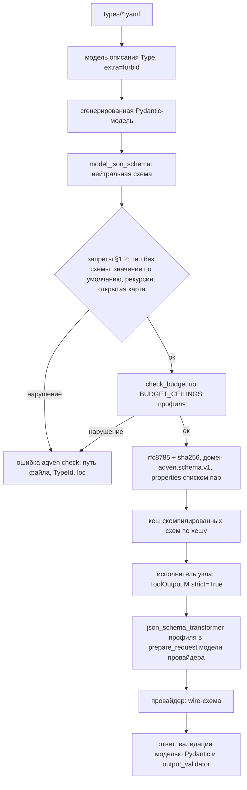

# 05. Система типов и реестр типов

> Статус: draft
> Зависит от: [07. Компилятор](07-compiler.md) (проверка правил и бюджетов схем), [08. Промты](08-prompts.md) (блок формата вывода, правила R-T1…R-T13), [10. Рантайм](10-runtime.md) (три исхода вызова, цикл ремонта), [04. Формат IR](04-ir-schema.md) (`type_ref`), [ADR-0025](adr/0025-python-engine.md), [ADR-0026](adr/0026-yaml-spec-and-code-refs.md), [ADR-0027](adr/0027-dynamic-io-shapes.md), [ADR-0028](adr/0028-studio-api-contract.md), [ADR-0029](adr/0029-trust-and-quality-python.md), [23. API локальной студии](23-studio-api.md) §4.1
> Источники: `research/structured-output.md`, `research/templating.md`, `research/py-spec-as-code.md` §11–§13, `research/py-quality-layer.md` §1.7, §3, `research/py-stack-runtime.md` §3.4–§3.5, `research/00-verified-by-lead.md`, спека §7.1, §7.6, §8 (строки 1, 9, 21, 23, 31, 41), требование R14, `DECISIONS.md`, [ADR-0004](adr/0004-schema-profiles.md) и [ADR-0006](adr/0006-dynamic-allowed-sets.md) в редакции ADR-0027 и ADR-0029

## Зачем этот слой

Реестр типов — единственный источник истины о форме данных, которые ходят между узлами и попадают в модель. Он закрывает из каталога §8: строку 23 (значения enum без расшифровки — описания обязательны и попадают в промт автоматически), строку 31 (выдуманные enum и ID — разрешённое множество живёт в схеме вызова), строку 21 (разные форматы чисел, валют и дат — value-типы с каноническим форматом), строку 9 (не тот источник в слоте — тип включает идентичность enum и сущности), строку 1 (данные литералами в тексте — только типизированные слоты и представления) и строку 41 (невычерпывающий роутинг — полнота `switch` проверяется по enum реестра). Всё это работает только если тип имеет ровно одно описание — файл `types/<name>.yaml` ([ADR-0026](adr/0026-yaml-spec-and-code-refs.md) §1), — из которого механически выводятся: сгенерированная Pydantic-модель (аннотация для pyright strict и валидатор на каждой границе), нейтральная JSON Schema, wire-схема под конкретного провайдера и текстовый блок для промта.

## Решения

| Решение | Что берём | Версия | Лицензия | Почему |
|---|---|---|---|---|
| Описание типов | файл `types/<name>.yaml` (`kind: Type`), модель описания на pydantic с `extra="forbid"` | pydantic 2.13.5 | MIT | один источник формата: закрытый набор ключей, все ошибки файла за раз, JSON Schema для редактора ([ADR-0026](adr/0026-yaml-spec-and-code-refs.md) §1) |
| Тип для кода и валидатор | сгенерированная Pydantic-модель типа реестра | pydantic 2.13.5 | MIT | одна модель даёт аннотацию для pyright strict, проверку на приёме и JSON Schema; генератор и место моделей — ADR-0026 ОВ 2 |
| Эмиттер JSON Schema | `BaseModel.model_json_schema()`, `TypeAdapter(...).json_schema()` | pydantic 2.13.5 | MIT | нейтральная схема ([ADR-0029](adr/0029-trust-and-quality-python.md) §6); свой эмиттер не пишем |
| Профили схем под провайдера | `json_schema_transformer` в `ModelProfile`: встроенные трансформеры OpenAI и Anthropic, свой для `anthropic-strict` | pydantic-ai-slim 2.43.0 | MIT | ADR-0029 §6; слой пост-обработки после Zod удалён |
| Strict на проводе | `ToolOutput(M, strict=True)`, `NativeOutput(M, strict=True)` | pydantic-ai-slim 2.43.0 | MIT | при `strict=None` флаг зависит от содержимого схемы ([ADR-0027](adr/0027-dynamic-io-shapes.md) «Strict включается явно») |
| Регистр кодов и межполевые проверки на приёме | `BeforeValidator` перед `Literal`, `model_validator(mode="after")`, `@agent.output_validator` + `ModelRetry` | pydantic 2.13.5 / pydantic-ai-slim 2.43.0 | MIT | ADR-0027, ADR-0029 §7 |
| Валидатор внешних JSON Schema (тулы MCP) и проверка примеров против wire-схемы | не выбран | — | — | ajv снят вместе с TS-стеком (открытый вопрос 16) |
| Синтаксический ремонт ответа | не берём | — | — | jsonrepair удалён (ADR-0029 §7): финальный разбор `allow_partial="off"`, битый JSON стоит повтора модели |
| Ошибки валидации | `ValidationError.errors()` → `WorkflowIssue`; промт ремонта — `RetryPromptPart` Pydantic AI | pydantic 2.13.5 / pydantic-ai-slim 2.43.0 | MIT | готовые `type`, `loc`, `msg`, `input`, `ctx`; свой текст — только у межполевых проверок (§7) |
| Рендер представлений в текст | `python-liquid` | 2.3.1 | MIT | движок промтов ([ADR-0029](adr/0029-trust-and-quality-python.md) §8); представление — шаблон-фрагмент, а не отдельный рендерер |
| Оценка размера блока типа в промте | не выбран | — | — | токенизатор оценки — ADR-0029 ОВ 4 (кандидат tiktoken 0.14.0, MIT, BPE-файл скачивается из сети) |
| Хеш схемы и реестра | `rfc8785` + `hashlib` sha256 с доменной сепарацией | 0.1.4 / CPython 3.14 | Apache-2.0 / stdlib | хеш нейтральной схемы — домен `aqven.schema.v1`, `properties` списком пар ([ADR-0027](adr/0027-dynamic-io-shapes.md) «След») |
| Schema-Aligned Parsing (BAML) | **не берём как зависимость**, только идеи | baml-py 0.226.2 | MIT по метаданным, Apache-2.0 по LICENSE ([ADR-0025](adr/0025-python-engine.md) «Контекст») | Это язык и кодогенератор — второй источник истины рядом с IR. Забираем различие `@assert`/`@check`. |

## 1. Модель типов

Тип объявляется один раз — файлом `types/<name>.yaml` с `kind: Type` ([ADR-0026](adr/0026-yaml-spec-and-code-refs.md) §1). TypeId — PascalCase из имени файла (`types/beach_entry.yaml` → `BeachEntry`), поля `id` в файле нет. Файл — экземпляр модели описания: подвид задаёт ключ `type` (`record | enum | union | id | value`), дискриминированный union по нему — Registry моделей, и новый подвид — ещё одна модель без `if/else` в загрузчике. Из модели описания компилятор генерирует модель данных типа (§5.1), и одно объявление питает четыре потребителя: код проекта под pyright strict, проверку на приёме, компилятор JSON Schema и генератор текста промта.

Набросок моделей описания ниже. Ключи, которые фиксирует ADR-0026 §1 (`apiVersion`, `kind`, `type`, `description`, `fields` со списком `{name, type, description, <ограничения>}`), и ключи из примеров [ADR-0027](adr/0027-dynamic-io-shapes.md) (`source`, `allowed_set`, `code_format` у `id`; `discriminator`, `variants` у `union`) взяты как в ADR. Ключи `values`, `identity`, `views`, `hidden` — предложение этого документа, моделями описания не утверждены (открытый вопрос 15). Ограничения поля в наброске сокращены до `maxLength` и `maxItems`; `minimum`, `maximum`, `pattern`, `enum` задаются так же, через `alias`. Набросок прошёл pyright 1.1.414 strict, `ruff check` и `ruff format`; три файла примера ниже загружаются через `TypeAdapter(TypeDecl)` без ошибок, а пустое `description` даёт `string_too_short` с `loc` `record.fields.0.description` (проба вне репозитория 2026-09-16: CPython 3.14.7, pydantic 2.13.5, ruamel.yaml 0.19.1).

```python
from typing import Annotated, Literal, NewType

from pydantic import BaseModel, ConfigDict, Field

TypeId = NewType("TypeId", str)
ViewName = NewType("ViewName", str)
FieldName = NewType("FieldName", str)

type Description = Annotated[str, Field(min_length=1)]
type TypeRef = Annotated[str, Field(pattern=r"^[A-Z][A-Za-z0-9_]{0,62}(\[\])?\??$")]


class SpecModel(BaseModel):
    model_config = ConfigDict(extra="forbid", frozen=True)


class FieldDecl(SpecModel):
    name: FieldName
    type: TypeRef
    description: Description
    max_length: Annotated[int | None, Field(ge=1, alias="maxLength")] = None
    max_items: Annotated[int | None, Field(ge=1, alias="maxItems")] = None
    hidden: bool = False


class EnumValue(SpecModel):
    value: str
    description: Description


class ViewDecl(SpecModel):
    name: ViewName
    fields: list[FieldName]


class VariantDecl(SpecModel):
    name: FieldName
    description: Description
    fields: list[FieldDecl]


class TypeHeader(SpecModel):
    api_version: Annotated[Literal["aqven/v1"], Field(alias="apiVersion")]
    kind: Literal["Type"]


class RecordType(TypeHeader):
    type: Literal["record"]
    description: Description
    identity: TypeId | None = None
    fields: list[FieldDecl]
    views: list[ViewDecl] = []


class EnumType(TypeHeader):
    type: Literal["enum"]
    description: Description
    values: list[EnumValue]


class UnionType(TypeHeader):
    type: Literal["union"]
    description: Description
    discriminator: FieldName
    variants: list[VariantDecl]


class IdType(TypeHeader):
    type: Literal["id"]
    description: Description
    source: str
    allowed_set: Literal["static", "dynamic"]
    code_format: Literal["identity", "prefixed_ordinal"]


class ValueType(TypeHeader):
    type: Literal["value"]
    description: Description
    fields: list[FieldDecl]


type TypeDecl = Annotated[RecordType | EnumType | UnionType | IdType | ValueType, Field(discriminator="type")]
```

Порядок полей модели — порядок ключей канонического YAML (ADR-0026 §1): `apiVersion`, `kind`, `type`, `description` идут первыми, поля со значением по умолчанию не пишутся. `fields`, `values` и `variants` — списки, а не отображения: порядок полей значим (§6) и не должен зависеть от порядка обхода ключей. Регулярка `TypeRef` — грамматика `type-ref` ADR-0026 §1 (`T`, `T[]`, `T?`, `T[]?`).

Пример, эквивалентный YAML из спеки §7.1, в каноническом виде `aqven fmt`.

`types/beach_entry.yaml`:

```yaml
apiVersion: "aqven/v1"
kind: "Type"
type: "enum"
description: "Тип входа в море"
values:
- value: "sand"
  description: "Песчаный вход"
- value: "pontoon"
  description: "Понтон"
- value: "rocks"
  description: "Камни или риф"
```

`types/hotel_id.yaml`:

```yaml
apiVersion: "aqven/v1"
kind: "Type"
type: "id"
description: "Идентификатор отеля"
source: "db.hotels"
allowed_set: "dynamic"
code_format: "prefixed_ordinal"
```

`types/hotel.yaml`:

```yaml
apiVersion: "aqven/v1"
kind: "Type"
type: "record"
description: "Отель-кандидат подборки"
identity: "HotelId"
fields:
- name: "name"
  type: "Text"
  description: "Название отеля"
  maxLength: 200
- name: "beach_entry"
  type: "BeachEntry"
  description: "Тип входа в море"
- name: "pool_heated"
  type: "Bool"
  description: "Подогрев бассейна"
- name: "internal_score"
  type: "Float"
  description: "Внутренний скор ранжирования"
  hidden: true
views:
- name: "brief"
  fields:
  - "name"
  - "beach_entry"
  - "pool_heated"
```

`hidden: true` — то же поле, но без права попасть в любое представление; компилятор запрещает включать его в `views` и в слоты промта.

### 1.1. Таблица соответствий

Столбец «JSON Schema» — нейтральная схема `model_json_schema()` и то, что с ней делает трансформер профиля (§5.3). Факты о нейтральной схеме проверены запуском на pydantic 2.13.5 (§5.1), о трансформерах — перехватом запросов ([ADR-0027](adr/0027-dynamic-io-shapes.md) таблица фактов, [ADR-0029](adr/0029-trust-and-quality-python.md) §6).

| Конструкция типа | Представление в реестре | JSON Schema | Как попадает в промт |
|---|---|---|---|
| Запись | `type: "record"`, `fields` — список `{name, type, description, <ограничения>}`; модель — `BaseModel` с `extra="forbid"`, поля без значения по умолчанию | `type: "object"`, `additionalProperties: false`, все поля в `required`, порядок `properties` = порядок `fields`; `title` Pydantic ставит сам, трансформер OpenAI его удаляет | через `view` — рендер значений; структура выхода — в блоке формата вывода (§2) |
| Enum | `type: "enum"`, `values` — список `{value, description}`; описание обязательно; модель — `Literal[...]` | `{"type": "string", "enum": [...]}`; описания значений в схему **не** идут (провайдеры не имеют для них места) | расшифровка «значение — описание» в блоке формата вывода; в тексте разрешено только через `` |
| Union | `type: "union"`, `discriminator`, `variants` — список `{name, description, fields}` ([ADR-0027](adr/0027-dynamic-io-shapes.md) случай 2); модель — `Annotated[A \| B, Field(discriminator=...)]` | Pydantic даёт `oneOf` + `discriminator.mapping`, тег варианта — `const`; трансформер OpenAI переписывает `oneOf` в `anyOf` и удаляет `discriminator`, Anthropic тоже переписывает в `anyOf`. Выход узла `llm` — анонимная запись (ADR-0026 §3), поэтому union стоит в поле, а не в корне | перечень вариантов с указанием поля-дискриминанта и его значений |
| Список | `T[]` + обязательный `maxItems` (R-42); модель — `list[T]` с `Field(max_length=n)` | `{"type": "array", "items": …, "maxItems": n}`; `openai-strict` оставляет `minItems`/`maxItems` на проводе, `anthropic-strict` оставляет `minItems` только 0 или 1 и переносит `maxItems` в `description` | «список не длиннее N элементов, каждый — …» |
| Optional | `T?`; модель — `T \| None` **без** значения по умолчанию; значение по умолчанию у поля запрещено (§1.2) | поле остаётся в `required`, схема — `anyOf` из `T` и `{"type": "null"}`; у Anthropic каждое такое поле — параметр с union-типом в бюджете 16 (§4.3) | явная фраза «`null`, если …»; без неё поле читается моделью как обязательное |
| ID с `allowed_set` | `type: "id"`, `source`, `allowed_set`, `code_format` ([ADR-0027](adr/0027-dynamic-io-shapes.md) случай 1) | ≤50 значений — `Literal` коротких осмысленных кодов → `enum`; >50 — `int` с `Field(ge=0, le=n - 1)` → `integer` с `minimum`/`maximum` (Anthropic переносит их в `description`) и нумерованный список в тексте (§4) | таблица «код → описание» или нумерованный список кандидатов, генерируется платформой |
| Value `Money` | `type: "value"`, `fields`: `currency` (enum валют реестра) и `amount_minor: Int`; формат рендера — открытый вопрос 5 | object из enum и целого; границы суммы — ограничениями поля, у Anthropic они уходят в `description` | канонический формат рендера задан в реестре один раз |
| Value `Date`, `DateTime` | встроенные `Date`, `DateTime`; модель — `datetime.date`, `datetime.datetime` | `{"type": "string", "format": "date"}` / `"date-time"`; оба формата есть и у OpenAI, и у Anthropic, у Anthropic — в белом списке `format` трансформера | ISO-строка; часовой пояс и локаль — контекст прогона (`TimeZone`, `Locale`), не поле типа |
| Медиа | встроенные `Image`, `Audio`, `Video`, `Document` (ADR-0026 §6) | в схему выхода не компилируются; `Image` на выходе — только `output_type=BinaryImage` у профиля генерации изображений, `Audio` и `Video` на выходе `llm` не компилируются никогда | в текст не рендерятся ни на одном уровне промта: адаптер передаёт медиа частью `user_prompt`, в шаблоне оно доступно только в условии |
| `Dynamic` | поле `type: "Dynamic"` со `schema_from` и `limits` ([ADR-0027](adr/0027-dynamic-io-shapes.md) случаи 4–5) | модель выхода строится при вызове: `create_model(..., extra="forbid")` из `FieldSpec[]`; хеш схемы меняется на каждом прогоне | слот целиком: адаптер отрисовывает значение вместе со схемой; обращение к полям — только после шага `narrow` |
| `FieldSpec` | встроенный тип; источник `schema_from` — `FieldSpec[]` с `maxItems` (R-D3, предложено) | запись `{name, type, description, <ограничения>, enum, fields}` без `$ref`, рекурсии, `oneOf`/`anyOf`, открытых карт и значений по умолчанию | сам тип в промт не попадает — попадает построенная из него схема |
| `Component<In,Out>` | только сигнатура компонента; вид и файл компонента — ADR-0026 ОВ 9 | **никогда не компилируется в JSON Schema**: это тип этапа компиляции, а не данных на проводе | не попадает в промт вообще |
| Дженерик `T` | параметр типа компонента; нотация `type_ref` ADR-0026 §1 параметров не выражает (открытый вопрос 10) | мономорфизация до построения модели: переменная типа не доживает до JSON Schema | в промт уходит уже разрешённый тип-аргумент |

### 1.2. Запрещено в реестре

| Конструкция | Почему | Чем заменяем |
|---|---|---|
| Тип без представления в JSON Schema: имя вне нотации ADR-0026 §1; в билдере и коде проекта — произвольный класс (`arbitrary_types_allowed`), `Any`, `object` | `model_json_schema()` на произвольном классе бросает `PydanticInvalidForJsonSchema`, `Any` даёт схему без `type` (проверено запуском на pydantic 2.13.5); пустую схему strict-режим отклоняет | встроенный или value-тип реестра, `Text` с `pattern` |
| Значение по умолчанию у поля данных | поле выпадает из `required` и получает `default` (проверено запуском); OpenAI strict требует все поля в `required`, встроенный трансформер Anthropic такие поля из `required` исключает | `T?`, в модели — `T \| None` без значения по умолчанию |
| Рекурсия (тип ссылается на себя прямо или через цикл) | Anthropic strict рекурсивные схемы **не поддерживает** (OpenAI и Gemini — поддерживают), значит рекурсия ломает переносимость; у Pydantic рекурсивная модель уносит корень схемы в `$ref` на `$defs` (проверено запуском) | плоская модель с ID-ссылками и явным списком уровней |
| Открытая карта: `dict[str, T]`, `extra="allow"` в билдере или коде | `dict[str, T]` даёт `additionalProperties` со схемой значения (проверено запуском) — несовместимо с `additionalProperties: false`; у Anthropic в strict модель вынуждена вернуть `{}` ([ADR-0027](adr/0027-dynamic-io-shapes.md) таблица фактов) | массив пар `{key, value}` с allowed-set на `key` ([ADR-0027](adr/0027-dynamic-io-shapes.md) случай 3) |

Ограничения полей (`maxLength`, `maxItems`, `minimum`, `maximum`, `pattern`) в реестре **не запрещены**: у `Text` и `T[]` границы обязательны (R-42). Прежнее правило «числовых и строковых ограничений на горячей схеме нет» [ADR-0029](adr/0029-trust-and-quality-python.md) §6 отменил как общее: что из ограничений остаётся на проводе, решает трансформер профиля (§5.3), а держит их всегда проверка Pydantic на приёме (§7.2).

`aqven check` обязан отвергать такое объявление при загрузке файла или построении модели — с путём файла, TypeId и `loc` поля, — а не ловить 400 от провайдера.

## 2. Обязательность описаний

Описание обязательно у каждого поля записи и у каждого значения enum. Это не стилистическое требование, а следствие двух измеренных фактов. Первый: грамматика гарантирует, что значение взято из множества, и ничего не говорит о том, что оно правильное — «модель выбирает валидное значение enum, семантически неверное для входа» — это отдельный класс отказа, который constrained decoding не ловит. Второй: схема идёт и в грамматику, и в текст промта; грамматика отвечает за форму, текст — за смысл. Enum без расшифровки оставляет смысл незаданным, и модель домысливает его из имени значения.

`description` — обязательный ключ модели описания ([ADR-0026](adr/0026-yaml-spec-and-code-refs.md) §1): у каждого поля `fields`, у каждого значения `values`, у каждого варианта `variants` и у самого `Type`. Отсутствие ключа — ошибка загрузки файла (`missing`), пустая строка — `string_too_short` (`Field(min_length=1)`, как у `FieldSpec.description` в [ADR-0027](adr/0027-dynamic-io-shapes.md)). Инлайн `enum` у поля `Text` (форма ADR-0026 §1, пример — `RefundApproval.verdict` в ADR-0026 §13) описаний значений не несёт и с этим правилом расходится — открытый вопрос 13.

| Куда попадает описание | Механизм | Проверено |
|---|---|---|
| JSON Schema, `description` поля | `Field(description=...)` сгенерированной модели → ключ `description` в `model_json_schema()` | да, запуск на pydantic 2.13.5: `{"description": "Stable node id", "examples": ["n1"], "title": "Id", "type": "string"}` |
| JSON Schema, `title`/`examples` | `title` Pydantic ставит сам, `Field(examples=[...])` выливается в `examples`; трансформер OpenAI удаляет `title` | да |
| Текст промта, блок формата вывода | генератор платформы обходит выходной тип и печатает поля с описаниями в порядке объявления, затем расшифровку каждого enum-значения, затем разрешённые множества ID. На уровне 1 блок дописывает адаптер, на уровне 2 — `{{ output_format }}` в шаблоне ([ADR-0026](adr/0026-yaml-spec-and-code-refs.md) §4); для `Dynamic` блок строится при вызове ([ADR-0027](adr/0027-dynamic-io-shapes.md)) | — |
| Текст промта, рендер входных данных | представление (§3) подписывает поля описаниями из реестра | — |

Описаниям enum-значений в JSON Schema места нет: ни OpenAI, ни Anthropic не имеют поля для описания отдельного значения enum. Поэтому расшифровка живёт только в тексте промта, и это единственная причина, по которой блок формата вывода обязателен и генерируется платформой, а не пишется агентом.

```python
from dataclasses import dataclass
from typing import Protocol


@dataclass(frozen=True)
class EnumGlossaryEntry:
    path: str
    value: str
    description: str


@dataclass(frozen=True)
class AllowedSetEntry:
    path: str
    strategy: AllowedSetStrategy
    size: int


@dataclass(frozen=True)
class OutputFormatBlock:
    text: str
    enum_glossary: tuple[EnumGlossaryEntry, ...]
    allowed_sets: tuple[AllowedSetEntry, ...]
    estimated_tokens: int


class OutputFormatRenderer(Protocol):
    def render(self, decl: TypeDecl, profile: SchemaProfileName, ctx: CallContext) -> OutputFormatBlock: ...
```

`AllowedSetStrategy` — стратегии §4.2, `SchemaProfileName` — §5.3, `CallContext` — контекст вызова узла. Код прошёл pyright 1.1.414 strict.

Связанные правила шаблонов: `{{ output_format }}` встречается ровно один раз и ручное описание формата или JSON-примеры в статическом тексте запрещены (R-T6); значения enum, упомянутые в статическом тексте, сверяются с реестром — `revise` в тексте при `needs_revision` в реестре есть ошибка (R-T7); литералы справочных данных в статическом тексте запрещены (R-T8). Все три правила проверяются по литеральным `ContentNode` python-liquid 2.3.1 ([ADR-0029](adr/0029-trust-and-quality-python.md) §8), а источником истины для сверки служит реестр типов. На уровне 3 (промт собран функцией `pkg.mod:function`) текстовые правила неприменимы: компилятор видит только типы `in`/`out` ([ADR-0026](adr/0026-yaml-spec-and-code-refs.md) §4).

## 3. Представления (views)

Представление — это ответ на вопрос «как сущность показывается модели»: какие поля, в каком порядке, с какими подписями. Оно задаётся в реестре один раз, поэтому `Hotel` выглядит одинаково во всех промтах, а скрытые поля — внутренние ID, оценки других веток, служебные счётчики — в текст не попадают.

Ключевое решение: **представление — самостоятельный тип, производный от записи, а не режим рендера**. Слот промта объявляется типом представления `brief` записи `Hotel`, и значение, которое доезжает до движка шаблонов, физически не содержит скрытых полей — проекция выполняется при связывании слота, до рендера, и проверяется моделью представления с `extra="forbid"`. Поэтому утечка невозможна даже при ошибке в шаблоне: в области видимости рендера нет поля, которое можно напечатать. Форма ссылки на представление в `type_ref` не зафиксирована: нотация ADR-0026 §1 допускает только TypeId с суффиксами `[]` и `?` (открытый вопрос 14).

```python
from pydantic import JsonValue

type JsonObject = dict[str, JsonValue]


def project(value: JsonObject, view: ViewDecl) -> JsonObject:
    return {name: value[name] for name in view.fields}
```

| Свойство представления | Как задаётся | Что гарантирует |
|---|---|---|
| Набор полей | `views` — список `{name, fields}` у записи | поле, не перечисленное в представлении, отсутствует в производном типе — обращение `hotel.internal_score` падает по R-T1 как несуществующее поле, а не как нарушение политики |
| Порядок | порядок элементов списка `fields` | стабильный текст между прогонами → стабильный префикс промта → попадание в кеш промта |
| Подписи | по умолчанию `description` поля из реестра; форма переопределения подписи — открытый вопрос 15 | одна формулировка поля во всех промтах; правка описания меняет все промты сразу |
| Формат значений | value-типы (`Money`, `Date`) рендерятся каноническим форматом реестра | закрывает §8 строку 21 |
| Рендер | фрагмент python-liquid `view:<TypeId>/<view>` через loader реестра (`Environment(loader=...)`, [ADR-0029](adr/0029-trust-and-quality-python.md) §8), версионируется как обычный фрагмент | изменение фрагмента перекомпилирует все шаблоны, где представление используется |
| Поля с пометкой `hidden` | `hidden: true` у поля | компилятор отвергает их включение в любое представление при загрузке типа |

Проверка R-T10 (политики видимости) выполняется не по синтаксису шаблона, а сверкой: для каждого слота промта берётся объявленный тип; если это представление — сверяются его поля с политикой видимости узла; если это запись целиком — узел обязан иметь явное разрешение на полный объект. По умолчанию полная запись в слот промта не допускается: слот принимает либо представление, либо скалярный тип.

Отдельный случай — недоверенные данные. Сущность, помеченная классом происхождения `untrusted`, обязана иметь представление, и такое представление не может участвовать в ветвлении: влиять на маршрут она вправе только через типизированный enum узла-экстрактора (§8 строка 19, принцип CaMeL). Проверка — на уровне типов: результат представления `untrusted`-сущности не является enum-типом и потому не проходит в `switch` по построению.

## 4. Идентификаторы и allowed_set

ID — отдельный вид типа (`type: "id"`), а не строка. Объявление несёт источник значений (`source`), вид множества (`allowed_set: static | dynamic`) и формат кода на проводе (`code_format: identity | prefixed_ordinal`) — пример `types/hotel_id.yaml` в §1, механика на Python — [ADR-0027](adr/0027-dynamic-io-shapes.md) случай 1 и [ADR-0029](adr/0029-trust-and-quality-python.md) §7.

| Вид множества | Когда известно | Где живёт | Следствие |
|---|---|---|---|
| `static` | на компиляции | множество запечено в схему, хеш схемы стабилен | грамматика компилируется провайдером один раз: у OpenAI дополнительная латентность только на первом запросе, у Anthropic схема кешируется до 24 часов |
| `dynamic` | на вызове | множество подставляется в модель выхода вызова (`Literal[...]` поля) | хеш схемы меняется каждый прогон → кеш грамматики промахивается **всегда**; значения из пользовательских данных попадают в кеш схем провайдера (у Anthropic — вне ZDR/HIPAA) |

Это второй по важности аргумент против «просто засунуть весь набор в enum» — первый чисто арифметический.

### 4.1. Арифметический потолок

Два лимита OpenAI действуют одновременно: **1000 значений enum на всю схему** и **15 000 символов суммарно для одного строкового enum, если значений больше 250**. Отсюда эффективная ёмкость зависит от формата ID:

| Формат ID | Длина | Влезает по лимиту 15 000 символов | Эффективный потолок |
|---|---|---|---|
| UUID v4 | 36 | 416 | **416** |
| cuid2 | 24 | 625 | 625 |
| nanoid | 21 | 714 | 714 |
| короткий код base32 | 6 | 2500 | 1000 (упирается в лимит числа значений) |
| числовой индекс | 3 | 5000 | 1000 (упирается в лимит числа значений) |

Потолок динамического allowed-set — **около 416 значений UUID, а не 1000**. Лимит 120 000 символов действует на все имена свойств, имена определений, enum- и const-значения схемы вместе, поэтому несколько больших множеств в одной схеме съедают общий бюджет. У Anthropic явного лимита на enum в документации нет, но есть внутренние ограничения размера скомпилированной грамматики и ошибка «Schema is too complex for compilation.» — порог непредсказуем, полагаться на него нельзя. Клиент Pydantic AI 2.43.0 размер набора не ограничивает: enum из 450 UUID доходит до провайдера без изменений ([ADR-0027](adr/0027-dynamic-io-shapes.md) таблица фактов), поэтому потолок проверяет наш код до вызова (§4.3).

### 4.2. Пороги (закон, `DECISIONS.md`)

| Размер множества | Что делает компилятор |
|---|---|
| ≤ 50 | `enum` в схеме, значениями идут короткие осмысленные коды (`doc_invoice_07`, не `x7`) |
| > 50 | **индексный выбор**: кандидаты уходят в текст промта нумерованным списком, в схеме остаётся целое число |
| > 416 при формате ID = UUID | честный enum из UUID невозможен в принципе; индексный выбор обязателен и обязательно сопровождается сужением множества до вызова |
| > 1000 | `enum` **запрещён**: только сужение до вызова (иерархия или ретривер), аварийно — свободная строка с проверкой вхождения на приёме |

Индексный выбор в модели выхода — поле `int` с `Field(ge=0, le=n - 1)` ([ADR-0029](adr/0029-trust-and-quality-python.md) §7); номера в списке промта совпадают с этим диапазоном. `openai-strict` оставляет `minimum`/`maximum` на проводе, `anthropic-strict` переносит их в `description`, поэтому граница всегда проверяется Pydantic на приёме. Индекс вне диапазона — ошибка валидации и повтор модели в пределах `retries["output"]`, а не отказ грамматики; подстановку реального ID делает `output_validator` по таблице «индекс → ID» из `deps`.

### 4.3. Что делаем при превышении

Бюджет схемы считается **до сетевого вызова**: для статических типов — на компиляции, для динамических множеств и `Dynamic` — при вызове по фактическому набору. Падение с внятной ошибкой лучше, чем 400 от API, и обязательно для динамических множеств, где превышение зависит от данных прогона.

```python
from collections.abc import Mapping
from dataclasses import dataclass
from enum import StrEnum


class BudgetMetric(StrEnum):
    ENUM_VALUES_TOTAL = "enum_values_total"
    MAX_SINGLE_ENUM_CHARS = "max_single_enum_chars"
    ALL_NAMES_AND_VALUES_CHARS = "all_names_and_values_chars"
    PROPERTIES_TOTAL = "properties_total"
    MAX_DEPTH = "max_depth"
    UNION_TYPED_PARAMS = "union_typed_params"
    OPTIONAL_PARAMS = "optional_params"
    STRICT_TOOLS = "strict_tools"


type SchemaBudget = Mapping[BudgetMetric, int]


@dataclass(frozen=True)
class BudgetViolation:
    metric: BudgetMetric
    actual: int
    ceiling: int


def check_budget(budget: SchemaBudget, ceilings: SchemaBudget) -> list[BudgetViolation]:
    return [
        BudgetViolation(metric, budget[metric], ceiling)
        for metric, ceiling in ceilings.items()
        if budget[metric] > ceiling
    ]
```

`SchemaBudget` фактической схемы считает Visitor по нейтральной схеме с разворотом `$ref` из `$defs`; метрика `max_single_enum_chars` считается только по enum длиннее 250 значений. Потолки профиля — таблица `BUDGET_CEILINGS` (§5.3); метрики без потолка в ней отсутствуют. Код прошёл pyright 1.1.414 strict.

| Лимит | `openai-strict` | `anthropic-strict` |
|---|---|---|
| Значений enum на схему | 1000 | не документирован (консервативно 250) |
| Символов в одном enum при >250 значений | 15 000 | — |
| Символов на все имена и значения | 120 000 | — |
| Свойств объекта на схему | 5000 | — |
| Глубина вложенности | 10 | — |
| Параметров с union-типом (`anyOf`, в том числе `T \| None`) | не ограничено | **16** |
| Необязательных параметров | недопустимы вовсе | **24** |
| Strict-инструментов на запрос | — | **20** |

Порядок действий при нарушении бюджета: (1) короткие коды вместо ID — включены всегда, дают рост ёмкости в 5-6 раз и упрощают автомат грамматики; (2) сужение множества до вызова — двухэтапный выбор (фасет из статичного enum на 10-30 значений, затем ID из суженного набора) или ретривер top-k; оба выражаются как два узла IR, а не как логика внутри одного узла, и потому видны в провенансе; (3) аварийный путь — свободная строка в схеме, множество в промте, проверка вхождения в `@agent.output_validator` с `ModelRetry` и подсказкой трёх ближайших кандидатов ([ADR-0029](adr/0029-trust-and-quality-python.md) §7); без подсказки цикл не сходится.

### 4.4. Влияние на дизайн типов

1. **Формат ID определяет ёмкость.** UUID в хранилище — да (PostgreSQL 18, `uuidv7()`); UUID на проводе к модели — нет. На провод уходит короткий осмысленный код, таблица `код ↔ реальный ID` живёт время одного вызова (приходит через `deps`) и пишется в провенанс, иначе реплей не восстановит соответствие.
2. **Коды обязаны нести семантику.** Бессмысленный код усиливает галлюцинацию enum: модель теряет семантическую опору и попадает в «похожий, но не тот» идентификатор.
3. **Сравнение ID — регистронезависимое с нормализацией к каноническому значению.** Anthropic прямо документирует, что регистр строковых `enum` и `const` не гарантирован, и возвращает значение, отличающееся регистром, без ошибки и без специального `stop_reason`. Поэтому коды в одном множестве обязаны быть уникальны без учёта регистра (проверка при компиляции), а на приёме стоит `BeforeValidator` перед `Literal`: `enum` остаётся в схеме, `COLOR` принимается как `color` (проверено запуском на CPython 3.14.7, [ADR-0027](adr/0027-dynamic-io-shapes.md)). Наивная проверка `enum` дала бы здесь ложный отказ.
4. **Множества >50 — это два узла, а не один.** Порог из §4.2 надо закладывать в дизайн типа: если справочник заведомо больше, в IR сразу появляются `retrieve`/`classify` + `select`, и качество узла честно зависит от recall сужения, а не прячется внутри одного вызова.

## 5. Компиляция типа в JSON Schema

### 5.1. Нейтральная схема: `model_json_schema()`

Нейтральная схема типа — `model_json_schema()` сгенерированной Pydantic-модели ([ADR-0029](adr/0029-trust-and-quality-python.md) §6). Опций, которые надо выставлять руками, как у прежнего эмиттера, нет: нужные свойства дают сама модель и запреты §1.2. Проверено запуском вне репозитория 2026-09-16 (CPython 3.14.7, pydantic 2.13.5):

| Свойство модели | Что в схеме | Зачем |
|---|---|---|
| `extra="forbid"` | `additionalProperties: false` | обязателен у обоих провайдеров |
| поле без значения по умолчанию | ключ в `required` | модель не вправе опустить поле |
| `T \| None` без значения по умолчанию | ключ в `required`, `anyOf` из `T` и `{"type": "null"}` | опциональность через `null` (§6) |
| порядок объявления полей | порядок `properties` | порядок генерации = порядок рассуждения (§6) |
| вложенная модель | `$defs` + `$ref`, корень остаётся объектом | корень — объект; бюджет считается по развёрнутым `$ref` |
| рекурсивная модель | корень — `$ref` на `$defs` | ловится запретом рекурсии до профиля (§1.2) |
| `Field(description=..., examples=...)` | `description`, `examples`; `title` Pydantic ставит сам | описание идёт в грамматику и в текст (§2) |

Схема для модели и схемы наших HTTP- и MCP-границ — разные артефакты одного типа, и путать их нельзя. Выход узла `llm` уходит провайдеру через `ToolOutput(M, strict=True)` или `NativeOutput(M, strict=True)` и трансформер профиля (§5.3). Схемы маршрутов FastAPI и `inputSchema` тулов MCP строит Pydantic в режиме validation из моделей входа операций ([ADR-0028](adr/0028-studio-api-contract.md) §2, правило 7).

### 5.2. Что ломается без явного strict и проверки на приёме

Поломки прежнего эмиттера (`oneOf` у union, исчезающий из `required` optional, корневой `$ref`) к Pydantic-модели не относятся: слой пост-обработки удалён ([ADR-0029](adr/0029-trust-and-quality-python.md) §6). Ломается другое, и всё подтверждено перехватом запросов через `httpx2.MockTransport` ([ADR-0027](adr/0027-dynamic-io-shapes.md) таблица фактов, `research/py-spec-as-code.md` §13).

**Поломка 1: strict зависит от содержимого схемы.** При `strict=None` (умолчание `ToolOutput` и `NativeOutput`) флаг равен `is_strict_compatible` трансформера профиля: OpenAI получает `strict: true` только без strict-несовместимых ключей — схема с `maxLength` ушла в Chat без `strict`, в Responses со `strict: false`; Anthropic и Bedrock без явного `True` strict не получают. Правка: `strict=True` явно на каждом `ToolOutput` и `NativeOutput`, объекты со `strict=None` фабрика вывода не создаёт.

**Поломка 2: ограничения уходят в `description`.** Трансформер OpenAI переносит `minLength`, `maxLength`, `pattern` с lookaround и прочие несовместимые ключи; Anthropic — ещё `maxItems`, `minimum`, `maximum`, любой `pattern`. Грамматика держит форму, границы держит только проверка на приёме. Правка: валидация моделью выхода на каждом ответе, включая модель, построенную при вызове.

**Поломка 3: strict теряется молча.** Для `claude-3-7-sonnet-20250219` `ToolOutput(M, strict=True)` уходит без `strict` и без предупреждения, а `NativeOutput` даёт `UserError` на клиенте. Правка: компилятор сверяет модель с профилем (R-D5, предложено), трасса пишет фактическое значение `strict` из тела запроса.

Нейтральная схема для модели с полями прежнего примера:

```python
from typing import Annotated, Literal

from pydantic import BaseModel, ConfigDict, Field


class Node(BaseModel):
    model_config = ConfigDict(extra="forbid")
    id: Annotated[str, Field(description="Stable node id")]
    kind: Literal["llm", "tool", "gate"]
    temp: Annotated[float, Field(ge=0, le=2)]
    tags: Annotated[list[str], Field(max_length=10)] | None
    note: Annotated[str, Field(max_length=200)] | None
```

Реальный вывод `Node.model_json_schema()` (pydantic 2.13.5):

```json
{ "additionalProperties": false,
  "properties": {
    "id":   { "description": "Stable node id", "title": "Id", "type": "string" },
    "kind": { "enum": ["llm", "tool", "gate"], "title": "Kind", "type": "string" },
    "temp": { "maximum": 2, "minimum": 0, "title": "Temp", "type": "number" },
    "tags": { "anyOf": [ { "items": { "type": "string" }, "maxItems": 10, "type": "array" }, { "type": "null" } ], "title": "Tags" },
    "note": { "anyOf": [ { "maxLength": 200, "type": "string" }, { "type": "null" } ], "title": "Note" } },
  "required": ["id", "kind", "temp", "tags", "note"],
  "title": "Node",
  "type": "object" }
```

`minimum`/`maximum` у `temp` и `maxItems` у `tags` в нейтральной схеме остаются; у `openai-strict` они остаются и на проводе, у `anthropic-strict` уходят в `description`, а `maxLength` у `note` уходит в `description` у обоих (§5.3). Wire-схему по каждому профилю фиксируют golden-снимки, снятые перехватом запроса, а не вызовом трансформера напрямую ([ADR-0029](adr/0029-trust-and-quality-python.md) §6).

### 5.3. Профили как Strategy

Профиль схемы — свойство пары (IR-схема × провайдер), а не свойство IR ([ADR-0004](adr/0004-schema-profiles.md) в редакции ADR-0029 §6). Единой универсальной strict-схемы не существует: приём, который делает схему валидной для OpenAI (все поля `required` + `null` у опциональных), у Anthropic съедает лимит 16 параметров с union-типами, а необязательные поля — лимит 24.

Профиль — `json_schema_transformer` в `ModelProfile` Pydantic AI (Strategy). Фабрика `aqven_llm` ставит `profile=SCHEMA_PROFILES[entry.schema_profile]` из записи каталога (Registry, [ADR-0029](adr/0029-trust-and-quality-python.md) §1). Трансформеры провайдеров импортируются только в `aqven_llm` ([ADR-0025](adr/0025-python-engine.md) §6), поэтому пакет типов знает только имена профилей и потолки бюджета:

```python
from collections.abc import Mapping
from enum import StrEnum


class SchemaProfileName(StrEnum):
    OPENAI_STRICT = "openai-strict"
    ANTHROPIC_STRICT = "anthropic-strict"
    PERMISSIVE = "permissive"


BUDGET_CEILINGS: Mapping[SchemaProfileName, SchemaBudget] = {
    SchemaProfileName.OPENAI_STRICT: {
        BudgetMetric.ENUM_VALUES_TOTAL: 1000,
        BudgetMetric.MAX_SINGLE_ENUM_CHARS: 15_000,
        BudgetMetric.ALL_NAMES_AND_VALUES_CHARS: 120_000,
        BudgetMetric.PROPERTIES_TOTAL: 5000,
        BudgetMetric.MAX_DEPTH: 10,
        BudgetMetric.OPTIONAL_PARAMS: 0,
    },
    SchemaProfileName.ANTHROPIC_STRICT: {
        BudgetMetric.ENUM_VALUES_TOTAL: 250,
        BudgetMetric.UNION_TYPED_PARAMS: 16,
        BudgetMetric.OPTIONAL_PARAMS: 24,
        BudgetMetric.STRICT_TOOLS: 20,
    },
    SchemaProfileName.PERMISSIVE: {},
}
```

Ветвлений по провайдеру внутри правок нет: разница выражена выбором трансформера и строкой таблицы потолков. Код прошёл pyright 1.1.414 strict.

| Правка | `openai-strict` | `anthropic-strict` | `permissive` | Кто делает |
|---|---|---|---|---|
| `oneOf` → `anyOf` | да | да | открытый вопрос 17 | встроенные трансформеры |
| удалить `title`, `$schema`, `discriminator`, `default` | да | оставить только ключи белого списка | открытый вопрос 17 | `OpenAIJsonSchemaTransformer`; `transform_schema` из anthropic 1.6.0 |
| `additionalProperties: false` на каждом объекте | да | да | открытый вопрос 17 | трансформеры и `extra="forbid"` модели |
| все поля в `required`, `null` у опциональных | да | да | открытый вопрос 17 | встроенный трансформер OpenAI; для Anthropic — наш трансформер профиля, потому что встроенный исключает необязательные поля из `required` |
| `minLength`, `maxLength`, `pattern` с lookaround → `description` | да | да, и любой `pattern` | открытый вопрос 17 | трансформеры |
| `minimum`, `maximum`, `maxItems` → `description` | нет, остаются на проводе; fine-tuned модели — ADR-0029 ОВ 22 | да | открытый вопрос 17 | трансформеры |
| `minItems` только 0 или 1 | нет | да | открытый вопрос 17 | `transform_schema` |
| `format` вне белого списка → `description` | да | да (белый список: `date-time`, `time`, `date`, `duration`, `email`, `hostname`, `uri`, `ipv4`, `ipv6`, `uuid`) | открытый вопрос 17 | трансформеры |
| отказ на схеме без `type`, рекурсии, открытой карте, значении по умолчанию | да | да | да | компилятор (§1.2) |
| `strict: true` в запросе | `ToolOutput`/`NativeOutput` со `strict=True` | то же; модель без strict в профиле — ошибка компиляции (R-D5, предложено) | параметра нет: `PromptedOutput` | фабрика вывода ([ADR-0027](adr/0027-dynamic-io-shapes.md)) |
| бюджет | `BUDGET_CEILINGS` | `BUDGET_CEILINGS` | потолков нет | компилятор (§4.3) |

Приём «вырезать ограничение из wire-схемы, дописать его в `description`, проверить на приёме» делают сами трансформеры — так и SDK Anthropic: «Remove unsupported constraints … adding constraints to field descriptions». Проверка на приёме — всегда наша модель Pydantic. Kill-критерий [ADR-0004](adr/0004-schema-profiles.md): ограничения ушли в `description` больше чем у половины полей схемы.

### 5.4. Конвейер



Хеш нейтральной схемы — идентификатор схемы в трассе и провенансе; рядом пишутся wire-схема и фактическое значение `strict` из тела запроса (как снимать их в рантайме — [ADR-0027](adr/0027-dynamic-io-shapes.md) ОВ 5). Ключ кассеты считается не от хеша схемы, а от нейтрального запроса, в который входят схемы output-тулов и `output_object` со `strict` ([ADR-0029](adr/0029-trust-and-quality-python.md) §1): профиль в ключ не входит, и запись одного провайдера проигрывается на другом. Для статических типов хеш стабилен между прогонами, для динамических allowed-set и `Dynamic` меняется каждый вызов, и это видно в трассе.

### 5.5. Self-check компилятора

Каждый тип реестра обязан нести примеры (ключ файла — открытый вопрос 15). На сборке выполняется дешёвая регрессия: каждый пример проходит `model_validate` сгенерированной модели, а wire-схема каждого профиля сверяется с golden-снимком, снятым перехватом запроса через `httpx2.MockTransport`; диф снимка без записи в ADR — красный CI ([ADR-0029](adr/0029-trust-and-quality-python.md) §6, «Проверка»). Проверка примеров против самой wire-схемы требует валидатора JSON Schema, он не выбран (открытый вопрос 16). На горячем пути данных валидатором служит только Pydantic.

## 6. Стиль схем по умолчанию

| Правило | Формулировка | Почему |
|---|---|---|
| Корень — объект | выход узла `llm` — анонимная запись ([ADR-0026](adr/0026-yaml-spec-and-code-refs.md) §3), union стоит в поле | OpenAI: «the root level object of a schema must be an object, and not use `anyOf`» |
| Все поля `required` | в модели нет полей со значением по умолчанию; трансформер `openai-strict` и наш `anthropic-strict` держат все поля в `required` | требование OpenAI; и одновременно это единственный способ получить одинаковый порядок ключей у обоих провайдеров: Anthropic печатает сначала `required`, затем optional, OpenAI — строго в порядке схемы |
| Опциональность через `null` | `T?` → `T \| None`; у `Literal \| None` значение `null` в список `enum` не попадает, оно — отдельная ветка `anyOf` | штатный приём OpenAI; у Anthropic стоит бюджета: каждое такое поле — параметр с union-типом из 16, это считает компилятор (§4.3) |
| `additionalProperties: false` | на каждом объекте | обязателен у обоих провайдеров; модель даёт его через `extra="forbid"`, трансформеры ставят сами |
| Без рекурсии | запрет §1.2 | OpenAI и Gemini рекурсию поддерживают, Anthropic — нет; рекурсивный тип непереносим |
| Порядок полей сохраняется | порядок `properties` = порядок объявления полей; компилятор не сортирует ключи ни при компиляции, ни при сериализации, в хеше `properties` — список пар | «outputs will be produced in the same order as the ordering of keys in the schema» — порядок полей есть порядок генерации, то есть порядок рассуждения модели |
| Обоснование перед решением | поле `rationale`/`reasoning` объявляется в записи **до** поля-решения | прямое следствие предыдущего пункта; это документируемое свойство IR, а не деталь реализации |
| Ограничения — по профилю | `openai-strict` оставляет на проводе `minimum`, `maximum`, `minItems`, `maxItems` и переносит `minLength`/`maxLength` в `description`; `anthropic-strict` переносит всё, кроме `minItems` 0 или 1 | правило «ограничений в wire-схеме нет» перестало быть общим ([ADR-0029](adr/0029-trust-and-quality-python.md) §6); проверка Pydantic на приёме держит границы у всех профилей |
| Схема идёт и в грамматику, и в текст | одна и та же модель даёт JSON Schema и блок формата вывода; для `Dynamic` оба строятся при вызове | грамматика гарантирует форму, текст — смысл; расшифровка enum выразима только в тексте |

Итоговое общее подмножество, проходящее везде: объекты, строки, числа, bool, enum строк, массивы, `anyOf` не в корне, всё `required`, `additionalProperties: false`, без рекурсии; ограничения допустимы, но у части профилей держатся только проверкой на приёме.

## 7. Межполевые семантические проверки

BAML различает `@assert` (нарушение — ошибка разбора, значение не возвращается) и `@check` (нарушение — метка на значении, значение возвращается со списком невыполненных проверок). Мы забираем это различие и выражаем его двумя механизмами Pydantic.

- **Инвариант типа** (уникальность ключей в `AttributeValue[]`, обязательные ключи) — `model_validator(mode="after")` сгенерированной модели ([ADR-0027](adr/0027-dynamic-io-shapes.md) случай 3). Нарушение — ошибка валидации; Pydantic AI возвращает её модели как `RetryPromptPart` в пределах `retries["output"]`.
- **Семантическая проверка узла** с `severity` — декларативный список (Specification), который исполнитель узла вызывает из `@agent.output_validator` (шаг 5 конвейера разбора [ADR-0029](adr/0029-trust-and-quality-python.md) §7): `assert` → `ModelRetry` с текстом нарушений и тем же `output`-бюджетом, `check` → запись в провенанс, значение возвращается.

Факты pydantic 2.13.5, проверенные запуском вне репозитория 2026-09-16 на CPython 3.14.7: `model_validator(mode="after")` не выполняется, если не прошла проверка полей; `PydanticCustomError("range", "end must be > start", {"expected": "> 5"})` из него даёт элемент `errors()` с `type: "range"`, `loc: ()` и `ctx: {"expected": "> 5"}`; `loc` ошибки поля — кортеж сегментов пути.

```python
[{"type": "range", "loc": (), "msg": "end must be > start", "input": {"start": 5, "end": 3, "items": ["a"]}, "ctx": {"expected": "> 5"}}]
[{"type": "int_parsing", "loc": ("start",), "msg": "Input should be a valid integer, unable to parse string as an integer", "input": "x"},
 {"type": "too_long", "loc": ("items",), "msg": "List should have at most 2 items after validation, not 3", "input": ["a", "b", "c"], "ctx": {"field_type": "List", "max_length": 2, "actual_length": 3}}]
```

Выше — вывод `errors()` для нарушения межполевой проверки и для двух ошибок полей; ключ `url` опущен.

Проверки объявляются декларативно, контракт цикла ремонта — `WorkflowIssue`:

```python
from collections.abc import Callable, Sequence
from dataclasses import dataclass
from typing import Literal

from pydantic import JsonValue, ValidationError

type Severity = Literal["assert", "check"]
type IssuePath = tuple[str | int, ...]


@dataclass(frozen=True)
class SemanticCheck[T]:
    id: str
    severity: Severity
    holds: Callable[[T], bool]
    path: Callable[[T], IssuePath]
    message: Callable[[T], str]
    observed: Callable[[T], JsonValue]
    repair_hint: str | None = None


@dataclass(frozen=True)
class WorkflowIssue:
    path: IssuePath
    code: str
    message: str
    severity: Severity
    observed: JsonValue
    repair_hint: str | None = None


def failed_checks[T](value: T, checks: Sequence[SemanticCheck[T]]) -> list[WorkflowIssue]:
    return [
        WorkflowIssue(
            path=check.path(value),
            code=check.id,
            message=check.message(value),
            severity=check.severity,
            observed=check.observed(value),
            repair_hint=check.repair_hint,
        )
        for check in checks
        if not check.holds(value)
    ]


def validation_issues(error: ValidationError) -> list[WorkflowIssue]:
    return [
        WorkflowIssue(
            path=detail["loc"], code=detail["type"], message=detail["msg"], severity="assert", observed=detail["input"]
        )
        for detail in error.errors()
    ]
```

Исполнитель узла вызывает проверки из `output_validator`:

```python
from collections.abc import Callable, Sequence

from pydantic_ai import ModelRetry


def repair_text(issues: Sequence[WorkflowIssue]) -> str:
    return "\n".join(
        f"{'.'.join(map(str, issue.path))}: {issue.message}; observed: {issue.observed!r}" for issue in issues
    )


def enforce_checks[T](
    value: T, checks: Sequence[SemanticCheck[T]], record: Callable[[Sequence[WorkflowIssue]], None]
) -> T:
    issues = failed_checks(value, checks)
    record(issues)
    blocking = [issue for issue in issues if issue.severity == "assert"]
    if blocking:
        raise ModelRetry(repair_text(blocking))
    return value
```

`SemanticCheck`, `WorkflowIssue`, `failed_checks`, `validation_issues` живут в пакете типов и `pydantic_ai` не импортируют; `enforce_checks` — в исполнителе узла. Оба фрагмента прошли pyright 1.1.414 strict, `ruff check` и `ruff format`; `failed_checks` и `validation_issues` запущены на примере `Range` и дали `WorkflowIssue` с `path=("end",)`, `observed=3` и с `path=("start",)`, `code="int_parsing"`, `observed="x"`.

| Потребитель одной ошибки | Форма | Чем получаем |
|---|---|---|
| Промт ремонта | текст | ошибки валидации — `RetryPromptPart` Pydantic AI: JSON-список ошибок без `ctx`, у output-тула со значением `input` (исходник `messages.py`, `RetryPromptPart.model_response`, pydantic-ai-slim 2.43.0); семантические проверки — текст `ModelRetry` из `repair_text` |
| Фронт Studio | дерево по форме данных | `problems[]` с `path`, `code`, `message` ([23. API локальной студии](23-studio-api.md) §12); дерево студия строит по `path` |
| Провенанс и лог | сырой массив | `WorkflowIssue[]` |

Форматтер ошибок валидации не пишем: его даёт Pydantic AI. Своё — одна строка на семантическую проверку.

### 7.1. Правила цикла ремонта

1. Разветвление по исходу вызова выполняется **до** любого разбора: `ok` / `refusal` / `truncated` — `OutcomeGateModel` по `finish_reason` и `provider_details` ([ADR-0029](adr/0029-trust-and-quality-python.md) §1). Ремонт применим только к `ok`.
2. JSON локально не чиним: jsonrepair удалён (ADR-0029 §7), финальный разбор — `pydantic_core.from_json(allow_partial="off")`, синтаксически битый ответ даёт `json_invalid` и повтор модели. Довод против локальной починки в силе: на обрезанном ответе она молча достраивает `null` и закрывает скобки (вход `{"id":"x","items":[{"a":1},{"a":` превращался в `{"id":"x","items":[{"a":1},{"a":null}]}`), а правдоподобный, но ложный объект отравляет провенанс. Обрезанный ответ до разбора не доходит: гейт превращает его в `TruncatedOutput`.
3. В промт ремонта уходят только `severity: "assert"`; `check` копятся в провенанс и не тратят попытку.
4. `observed` обязателен: без «что ты вернул» модель повторяет ту же ошибку. У ошибок валидации output-тула его несёт поле `input` в `RetryPromptPart`, у семантических проверок — `SemanticCheck.observed`.
5. Число попыток — `retries={"output": k}` из IR узла ([ADR-0029](adr/0029-trust-and-quality-python.md) §2), поведение при исчерпании (`fail` / `best_effort` / `escalate`) — поле узла IR, не константа в коде; исчерпание даёт `UnexpectedModelBehavior` → `NodeQualityFailure` (ADR-0029 §3).
6. Одинаковый набор `WorkflowIssue[]` два раза подряд означает, что ремонт не сходится: цикл прерывается досрочно, бюджет не дожигается. Механизма досрочного обрыва в разборе Pydantic AI не найдено — ADR-0029 ОВ 8.
7. `model_validator(mode="after")` и `output_validator` выполняются только если прошла проверка полей, поэтому ошибки типов и межполевые проверки не приходят в одном проходе — минимум две попытки ремонта. Если нужны все сразу, тип компилируется во вторую, «мягкую» модель (все поля `T | None`) и валидируется вторым проходом.

### 7.2. Что где проверяется

| Где | Что |
|---|---|
| Грамматика провайдера | форма, обязательность, enum, типы; у `openai-strict` ещё `minimum`, `maximum`, `minItems`, `maxItems` |
| Pydantic на приёме | модель выхода: все границы, в том числе унесённые трансформером в `description`; `BeforeValidator` — нормализация регистра enum; `model_validator(mode="after")` — инварианты типа; `output_validator` — вхождение в allowed-set при индексном выборе и свободной строке, подстановка реального ID, семантические проверки узла |
| Модели описания | файлы типов, узлов и воркфлоу при загрузке ([ADR-0026](adr/0026-yaml-spec-and-code-refs.md) §7) |
| Тесты профилей | golden-снимки wire-схем через `httpx2.MockTransport` ([ADR-0029](adr/0029-trust-and-quality-python.md) §6) |
| Внешние JSON Schema тулов MCP | валидатор не выбран — открытый вопрос 16 |

## 8. Эволюция типов: изменение enum (R14)

Требование R14 — «изменение enum предсказуемо распространяется по всей системе». Предсказуемость обеспечивается индексом использования, который компилятор строит при каждой компиляции проекта, а индексатор кладёт в `idx.refs` ([files-first/index.md](files-first/index.md)); наружу его отдают `type_usages` и `type_impact` ([23. API локальной студии](23-studio-api.md) §4.1).

```python
from collections.abc import Sequence
from dataclasses import dataclass
from enum import StrEnum
from typing import Protocol


class UsageKind(StrEnum):
    RECORD_FIELD = "record_field"
    VIEW_FIELD = "view_field"
    SLOT = "slot"
    SWITCH_BRANCH = "switch_branch"
    TEMPLATE_CASE = "template_case"
    TEMPLATE_TEXT = "template_text"
    NODE_IN = "node_in"
    NODE_OUT = "node_out"
    JUDGE_RUBRIC = "judge_rubric"
    DATASET_ROW = "dataset_row"
    ASSERTION = "assertion"


@dataclass(frozen=True)
class UsageRef:
    flow_id: FlowId
    spec_hash: ContentHash
    path: str


@dataclass(frozen=True)
class TypeUsage:
    type_id: TypeId
    value: str | None
    kind: UsageKind
    ref: UsageRef


class UsageIndex(Protocol):
    def usages_of(self, type_id: TypeId) -> Sequence[TypeUsage]: ...

    def usages_of_value(self, type_id: TypeId, value: str) -> Sequence[TypeUsage]: ...
```

`FlowId` и `ContentHash` — `NewType` над `str`. Ревизия воркфлоу в ссылке — `spec_hash`, а не номер: поля `version` в исходнике нет ([ADR-0022](adr/0022-hash-as-version.md)). Код прошёл pyright 1.1.414 strict.

### 8.1. Что происходит по операциям

| Операция | Класс | Что ломается немедленно | Что делает компилятор |
|---|---|---|---|
| Добавить значение | breaking для маршрутизации | все `switch` по этому enum перестают быть полными (§8 строка 41); все `` в шаблонах перестают быть полными (R-T4); датасеты теряют покрытие 100% значений enum на входах | BLOCK: перечисляет каждый неполный `switch` и каждый шаблон с путём; предлагает кандидатов-патчей с готовым `apply` |
| Удалить значение | breaking для истории | ветки `switch`, ссылающиеся на значение; строки датасетов; правила судей; записи прогонов в истории содержат удалённое значение | BLOCK до тех пор, пока `usages_of_value` не пуст; для чтения истории требует запись в таблице алиасов |
| Переименовать значение | breaking | то же, что удаление + добавление; плюс статический текст шаблонов с упоминанием старого имени (R-T7) | BLOCK; патч генерируется механически по индексу использования, алиас старое→новое обязателен |
| Изменить описание значения | совместимо по форме, **не совместимо по смыслу** | ничего не падает, но меняется текст блока формата вывода во всех промтах, где enum встречается в выходном типе | WARN + обязательный прогон eval-гейта: описание — часть промта, значит изменение поведения модели |
| Изменить порядок значений | совместимо | ничего | порядок enum в схеме стабилен, изменение меняет хеш схемы |

Во всех случаях меняется хеш нейтральной схемы, а вместе с ней — нейтральный запрос модели, а значит: промахивается кеш грамматики провайдера, прежние записи кассет перестают совпадать по ключу, и меняется кэшируемый префикс промта, если блок формата входит в префикс.

### 8.2. Процедура миграции (forward-only, expand/contract)

1. **Предложение.** Изменение подаётся как заявка `registry_propose` с `kind: 'type'` ([14. MCP-контракт](14-mcp-contract.md) §2.7, [23](23-studio-api.md) §8), а не прямая правка файла реестра. Заявка содержит операцию, значение, описание и обоснование.
2. **Анализ влияния.** По `UsageIndex` строится отчёт: список затронутых воркфлоу и их `spec_hash`, неполные `switch`, шаблоны с неполным ``, шаблоны со статическим упоминанием значения, покрытие датасетов, правила судей, число записей истории с этим значением.
3. **Expand.** Новое значение и алиасы добавляются; старые значения остаются валидными. Патчи ветвлений и шаблонов применяются из кандидатов отчёта.
4. **Датасеты.** Покрытие восстанавливается до 100% значений enum на входах и 100% веток `switch`; недостающие строки генерируются и помечаются происхождением.
5. **Гейт.** Прогон eval-гейта с четырьмя исходами PASS / WARN / BLOCK / GATE_UNAVAILABLE; для блокирующего сравнения — минимум 200 элементов, парный бутстрап и обязательный A/A-прогон.
6. **Публикация.** Новое содержимое реестра, changelog, запись в провенанс; затронутые воркфлоу получают новый `spec_hash`. Прогон идёт под хешем IR — это вход DBOS-workflow ([ADR-0025](adr/0025-python-engine.md) §4), поэтому перезапуск процесса не нужен; исполнение под новым хешем без перезапуска и восстановление прогонов под старым не проверены — ADR-0025 ОВ 6.
7. **Contract.** Удаление старого значения — отдельная заявка, допустимая только когда `usages_of_value` пуст в активных ревизиях, а чтение истории закрыто алиасом. Down-миграций нет.

Таблица алиасов — часть реестра, а не миграция БД: она нужна на чтении провенанса и старых датасетов вечно, а не однократно.

## 9. Реестр типов как пакет

Реестр разделён на две вещи, которые часто путают: **движок** (код, один на платформу) и **содержимое** (типы конкретного проекта, данные). Движок — Python-пакет в uv workspace движка; имя дистрибутива и модулей не выбрано ([ADR-0026](adr/0026-yaml-spec-and-code-refs.md) ОВ 1), ниже условно `aqven/types/`, по аналогии с `aqven.spec` в ADR-0026 §8. Содержимое — файлы `types/<name>.yaml` проекта ([ADR-0017](adr/0017-files-as-source-of-truth.md), ADR-0026 §1); база — перестраиваемый индекс `idx`; хеш — `rfc8785` + sha256 с префиксом `sha256-`.

```
aqven/types/
  decl/        модели описания Type: RecordType, EnumType, UnionType, IdType, ValueType
  models/      генерация Pydantic-моделей данных из описаний
  registry/    TypeRegistry, resolve, UsageIndex
  profiles/    SchemaProfileName, BudgetMetric, BUDGET_CEILINGS, check_budget
  compile/     нейтральная схема, хеш aqven.schema.v1, кеш скомпилированных схем
  checks/      SemanticCheck, WorkflowIssue, failed_checks, validation_issues
  render/      OutputFormatRenderer, фрагменты представлений
```

Сборка — `uv_build` 0.12.15 в общем `uv.lock` ([ADR-0025](adr/0025-python-engine.md) §1). Импорт `openai`, `anthropic`, `google.genai`, `pydantic_ai.providers` и `pydantic_ai.models.{openai,anthropic,google}` в пакете запрещён ruff TID251 ([ADR-0025](adr/0025-python-engine.md) §6): пакет типов ничего не знает о провайдерах, он знает только имена профилей и потолки бюджета, трансформеры профилей ставит фабрика `aqven_llm`.

```python
from collections.abc import Mapping
from dataclasses import dataclass
from typing import Protocol

from pydantic import BaseModel, JsonValue


@dataclass(frozen=True)
class CompiledSchema:
    model: type[BaseModel]
    neutral: dict[str, JsonValue]
    schema_hash: ContentHash
    budget: SchemaBudget
    code_map: Mapping[str, str]


class TypeRegistry(Protocol):
    @property
    def tree_hash(self) -> ContentHash: ...

    def get(self, type_id: TypeId) -> TypeDecl | None: ...

    def resolve(self, ref: TypeRef) -> TypeDecl: ...

    def view(self, type_id: TypeId, view: ViewName) -> TypeDecl: ...

    def compile(self, type_id: TypeId, profile: SchemaProfileName, ctx: CallContext) -> CompiledSchema: ...

    def output_format(self, type_id: TypeId, profile: SchemaProfileName, ctx: CallContext) -> OutputFormatBlock: ...

    def usages(self) -> UsageIndex: ...
```

Wire-схемы в `CompiledSchema` нет: её строит трансформер профиля в момент запроса, в трассу её пишет исполнитель (§5.4). Класс `model` не пересекает границу DBOS-шага: между шагами переносятся JSON-значения ([ADR-0025](adr/0025-python-engine.md) §4, правило 3). Код прошёл pyright 1.1.414 strict.

Реестр **иммутабелен**: снимок дерева — новый экземпляр с `tree_hash`, глобального изменяемого синглтона нет; реестр привязан к `tenant_id` и хешу дерева, а не к процессу (изоляция тенантов в одном процессе — открытый вопрос 8).

Схемы типов наружу отдаёт API: `GET /api/types/{type_id}` → `json_schema` и `enum_values[{value, description}]`, `catalog_get(kind='type')` в MCP ([23](23-studio-api.md) §4.1); модели Pydantic попадают в OpenAPI компонентами ([ADR-0028](adr/0028-studio-api-contract.md)). Отдельного бандла каталога схем нет: экспорт отменён решением владельца от 2026-09-16 ([ADR-0025](adr/0025-python-engine.md) §7).

### 9.1. Аппрув изменений

Требование R6 — агент не может сломать промты, схемы вывода и привязку контекста. Механика: запись в реестр закрыта, открыта только подача заявки.

| Класс изменения | Примеры | Кто подтверждает |
|---|---|---|
| Аддитивное без семантики | новое поле `T?`, новое представление, новый пример типа | автоматически при PASS гейта |
| Аддитивное с семантикой | новое значение enum, изменение описания поля или значения | человек, после отчёта о влиянии и прогона гейта |
| Ломающее | удаление или переименование значения, смена типа поля, смена `allowed_set` со `static` на `dynamic` | человек, двумя шагами expand → contract |
| Запрещённое | тип без представления в JSON Schema, значение по умолчанию у поля, рекурсия, открытая карта (§1.2) | отвергается компилятором, аппрув невозможен |

Новая заявка отдаёт свой ресурс `{proposal_id, status: pending_approval, gate | null}` ([23](23-studio-api.md) §8), а не конверт: так [23](23-studio-api.md) §1.2 отвечает на запись вне файлов проекта, и это расходится с правилом «запись в обоих каналах — `Envelope`» [ADR-0028](adr/0028-studio-api-contract.md) §2 (23 ОВ 22). Правка файлов типа после аппрува отвечает `Envelope`: `ok`, `op`, `version{files[{path, file_hash}], dirty, actor, client_op_id}`, `focus`, `problems[]`, `candidates[]` с готовым `apply{tool,arguments}`, `next[]`, `refs[]`, `ui_url`, `truncated`. Имена тулов — `snake_case` с префиксом группы, точки в именах запрещены: заявка — `registry_propose`, чтение — `catalog_list(kind='type')`, `catalog_get(kind='type')`, `type_usages`, `type_impact` (открытый вопрос 9).

## 10. Открытые вопросы

1. **Противоречие по порогу 50–416.** `DECISIONS.md` («Структурированный вывод», п. 5) предписывает: ≤50 — enum в схеме, выше — индексный выбор. Заметки `research/structured-output.md` §4.5 дают другую градацию: 50–400 — честный enum из коротких кодов, а индексный выбор при N > ~50 без дополнительной структуры вреден из-за позиционного смещения. В документе действует `DECISIONS.md`. Закрыть: замер на своём датасете (точность выбора enum коротких кодов против индексного выбора при N = 60, 150, 400) и ADR по результату (99 L-04).
2. **Лимиты Gemini.** Google не публикует цифры глубины, числа свойств и enum; неизвестно, действует ли `propertyOrdering` в новом `response_format`. У Pydantic AI 2.43.0 флага `strict` для Google нет, tool output уходит в режиме `ANY`, а что гарантируют `ANY` и `VALIDATED`, не проверено ([ADR-0027](adr/0027-dynamic-io-shapes.md) ОВ 3). Профиль `gemini` не определён. Закрыть: эмпирический замер лимитов, живые вызовы по ADR-0027 ОВ 3 и решение, нужен ли свой `json_schema_transformer` и строка `BUDGET_CEILINGS` для Google.
3. **`minLength`/`maxLength` у OpenAI для базовых моделей.** Закрыт [ADR-0027](adr/0027-dynamic-io-shapes.md) (таблица фактов, «Strict включается явно»): strict-трансформер OpenAI (`profiles/openai.py`, `_STRICT_INCOMPATIBLE_KEYS`) переносит их в `description`, границы держит проверка Pydantic на приёме (99 F-13).
4. **Асинхронные проверки по внешним данным.** Проверка существования ID в БД синхронным `model_validator` не выражается. Кандидат — асинхронный `@agent.output_validator`: Pydantic AI 2.43.0 принимает и sync, и async функции (докстринг `Agent.output_validator`), но поведение с `ModelRetry`, кассетой и реплеем не проверено; сюда же язык асинхронных предикатов контрактов (99 F-08). Закрыть: проба на `FunctionModel` — async-валидатор с запросом к SQLite, `ModelRetry`, повтор, затем реплей из кассеты без обращения к БД или с ним, и решение, что допустимо.
5. **Канонический формат `Money`.** Ни спека, ни заметки не задают список валют и правило рендера (минорные единицы, разделители, позиция кода валюты). Закрыть: решение владельца продукта, затем фиксация в `types/money.yaml` и в фрагменте представления (99 F-61).
6. **Классы видимости полей.** `hidden: true` введён как бинарный признак; спека упоминает «политики видимости» (R-T10) без перечня классов. Закрыть: согласовать с документом о контексте и происхождении, где определяются классы доверия и видимости (99 F-22).
7. **Нормализация регистра enum.** Anthropic не гарантирует регистр строковых `enum` и `const`. Введено требование case-insensitive-уникальности кодов и `BeforeValidator` перед `Literal`. Не проверено, распространяется ли эффект на `const` дискриминанта union (у Pydantic тег варианта — `const`, §1.1). Закрыть: пробный запрос с union по `const` (99 L-05); если распространяется — решить, как нормализовать тег до выбора варианта.
8. **Мультитенантность реестра.** Решено хранить типы по `tenant_id` и хешу дерева; изоляция тенантов в одном процессе движка на DBOS 2.31.1 не проверялась. Закрыть: прототип «два тенанта в одном процессе» (99 B-07) и раздел изоляции тенантов в [10. Рантайм](10-runtime.md).
9. **Имена MCP-тулов реестра типов.** По [23](23-studio-api.md) §4.1, §8: `catalog_list(kind='type')`, `catalog_get(kind='type')`, `type_usages`, `type_impact`, заявка — `registry_propose`. `type_usages` и `type_impact` нет в реестре тулов [14](14-mcp-contract.md) (99 F-03). Закрыть: внести их в 14 с фазовым раскрытием (≤20–25 включённых тулов одновременно).
10. **Дженерики.** Спека задаёт рамку «без рекурсии и изменяемых замыканий» и мономорфизацию до примитивов, но алгоритм проверки ограничений на тип-параметры (`requires`/`ensures` компонентов) не описан (99 F-08). Нотация `type_ref` ADR-0026 §1 параметров типа не выражает, форма `typeParams` в файле компонента не зафиксирована (ADR-0026 ОВ 9). Закрыть: документ о компиляторе, раздел контрактов компонентов, и грамматика параметров в модели описания компонента.
11. **Слот `examples` (`Example<In, Out>[]`).** Спека требует валидировать каждый пример, но не определяет, по какой схеме — входной и выходной тип узла или отдельный тип примера. Закрыть: решение в документе о промтах, затем тип примера в реестре (99 L-06).
12. **Стриминг частичных объектов.** Частичный объект не должен попадать в workflow state, только в канал UI. Частичный разбор (`allow_partial="trailing-strings"`) допускается только для стриминга ([ADR-0029](adr/0029-trust-and-quality-python.md) §7); запись потока в кассету и гейт исходов по финальному `finish_reason` потока не проверены. Закрыть: по ADR-0029 ОВ 9 (99 F-84).
13. **Инлайн `enum` против обязательных описаний значений.** ADR-0026 §1 допускает ограничение `enum` у поля `Text` (пример `RefundApproval.verdict`), а §2 этого документа требует описание у каждого значения enum. Варианты: запретить инлайн `enum` в `out` узла `llm` и в `form` узла `human` (только тип реестра с `values`) либо добавить описания значений в форму поля. Закрыть: решение владельца по ADR-0026 ОВ 8 (99 F-68), затем правка моделей описания и R-T7.
14. **TypeId из имени файла, подкаталоги `types/` и ссылка на представление.** `x_1.yaml` и `x1.yaml` дают один TypeId `X1` (ADR-0026 ОВ 10); files-first/layout.md §1 раскладывает типы по `enums/`, `entities/`, `views/`, а TypeId подкаталог не учитывает (ADR-0026 ОВ 16); `type_ref` не выражает ссылку на представление записи (§3). Закрыть: решение при чистке layout.md (99 F-68) — `E_BAD_NAME` на `__` и `_` перед цифрой или иное хранение TypeId; плоский `types/` или пространство имён; форма ссылки на представление в `type_ref` с правкой регулярки ADR-0026 §1 через ADR.
15. **Ключи файла `Type` вне ADR-0026 и ADR-0027.** Набросок §1 вводит `values` у `enum`, `identity` и `views` у `record`, `hidden` у поля; не определены ключ примеров типа (§5.5), переопределение подписи поля в представлении (§3) и форма `value`-типа сверх `fields`. Ключи из примеров ADR-0027 (`source`, `allowed_set`, `code_format`, `discriminator`, `variants`) тоже не внесены в модели описания (ADR-0027 ОВ 2, 99 F-67). Закрыть: утвердить ключи в моделях описания ADR-0026, сгенерировать `.aqven/schema/type.schema.json` и прогнать через `aqven check` примеры §1 и ADR-0027.
16. **Валидатор внешних JSON Schema.** ajv снят вместе с TS-стеком, замена не выбрана. Нужен для двух мест: схемы тулов внешних MCP-серверов ([06. Реестры](06-registries.md) §5.3) и проверка примеров типа против wire-схемы профиля (§5.5). `jsonschema` 4.26.0 (MIT) уже приходит транзитивно от mcp 2.2.0 (`jsonschema>=4.20.0`, `research/py-stack-runtime.md` §7), но прямой зависимостью оси ADR-0025 не является. Закрыть: решить, нужны ли обе проверки (альтернатива — Pydantic-модель, построенная из схемы тула, как `create_model` в ADR-0027); если нужны — проверить `jsonschema` по PyPI (версия, лицензия, свежесть), внести в DECISIONS и [98](98-version-audit.md) через ADR.
17. **Профиль `permissive` на Pydantic AI.** Для self-hosted моделей без constrained decoding ADR-0029 §6 трансформер не выбирает, `PromptedOutput` параметра `strict` не имеет, режим `grammar` и `choice` vLLM не сопоставлены (ADR-0027 ОВ 4). Закрыть: перехват запроса к `OpenAIChatModel` с кастомным `base_url` через `httpx2.MockTransport` для `PromptedOutput` и `extra_body`, решение о трансформере и golden-снимок профиля.
