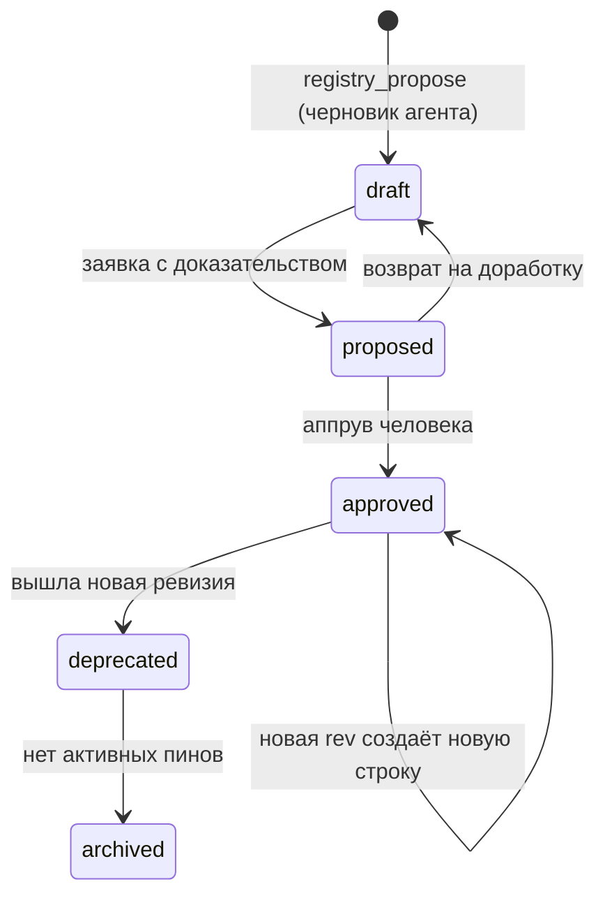
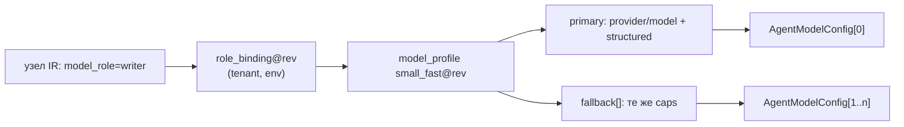
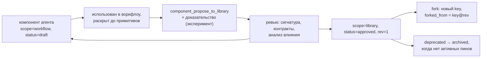

# 06. Реестры: профили моделей, агенты, тулы, архетипы, компоненты

> Статус: draft
> Зависит от: [08. Промты](08-prompts.md), [07. Компилятор](07-compiler.md), [10. Рантайм](10-runtime.md), [16. Модель данных](16-data-model.md)
> Источники: research/volt-agents.md, research/provider-catalog.md, research/volt-integrations.md,
> research/00-verified-by-lead.md; спека §7.1–§7.5, §6.1–§6.2, §8 (строки 2 и 5), §13.1

## Зачем этот слой

Реестры — единственный источник именованных сущностей, на которые ссылается IR: типы, роли моделей,
агенты, тулы, архетипы, компоненты. Они закрывают два дефекта из §8: «агент дублирует или выдумывает
типы» (всё, чего нет в реестре, — ошибка компиляции) и «правка в одном месте ломает другое» (обратный
индекс использования + анализ влияния до аппрува). Второй смысл слоя — превратить шесть уровней
переопределений §7.3 в одну вычислимую эффективную конфигурацию с происхождением каждого поля,
потому что VoltAgent не даёт per-call подмены `model` и `instructions`, и этот разрыв закрывает наш код.

## Решения

| Решение | Что берём | Версия | Лицензия | Почему |
|---|---|---|---|---|
| Хранение записей | PostgreSQL 18 + drizzle-orm | 18 / 0.45.2 | — / Apache-2.0 | `uuidv7()` как PK, jsonb-тело записи, RLS по `tenant_id` |
| Валидация тела записи | ajv | по [16](16-data-model.md) | MIT | реестр — конфиг, а не горячий путь данных (DECISIONS) |
| Схемы входа/выхода тулов | zod | 4.6.2 | MIT | горячий путь, `createTool({parameters, outputSchema})` принимает Zod |
| Хеш записи и пин схемы | canonicalize + @noble/hashes | 5.0.0 | Apache-2.0 / MIT | RFC 8785 + sha256 с доменной сепарацией, префикс `sha256-` |
| Тулы | `createTool` из @voltagent/core | 2.10.0 | MIT | есть `outputSchema`, `needsApproval`, `ToolHooks`, `ToolDeniedError` — свой слой не пишем |
| Внешние MCP-серверы | `MCPConfiguration` из @voltagent/core | 2.10.0 | MIT | 4 транспорта, `getRawToolsets()` для пина хэша схемы, `can()` для авторизации |
| Фолбэки моделей | `AgentModelConfig[]` | 2.10.0 | MIT | IR-список моделей мапится 1:1, политику ретраев не пишем |
| Per-call подмена model/instructions | dynamic-функции агента от `context` | 2.10.0 | MIT | полей `model`/`instructions` нет в `BaseGenerationOptions` — единственный путь |
| Таймаут тула | наш адаптер поверх `AbortController` | — | — | в `ToolOptions` нет `timeoutMs` |
| Словарь возможностей моделей | `supported_parameters` OpenRouter | дамп 443 моделей | — | закрытый enum из 26 значений, из них 4 гейтовых |

## 1. Общая модель реестра

### 1.1. Запись

Все шесть реестров — один тип записи с разным `kind` и телом. Паттерн — Registry поверх Repository;
разбор тела, диффы и проверки — таблицы стратегий `Record<RegistryKind, ...>`, не ветвления.

| Поле | Тип | Смысл |
|---|---|---|
| `id` | `uuid` (uuidv7) | суррогатный ключ строки-ревизии |
| `tenant_id` | `uuid` | мультитенантность + RLS с первого дня |
| `kind` | `registry_kind` | `type` \| `model_profile` \| `agent` \| `tool` \| `archetype` \| `component` |
| `key` | `text` | человеко-читаемый идентификатор внутри тенанта и вида: `writer`, `small_fast`, `kb_search` |
| `rev` | `integer` | монотонная ревизия, начинается с 1, растёт на аппруве |
| `status` | `registry_status` | `draft` \| `proposed` \| `approved` \| `deprecated` \| `archived` |
| `body` | `jsonb` | тело записи по схеме вида (§2–§7) |
| `content_hash` | `text` | `sha256-` от RFC 8785 канонизации `body` с доменной сепарацией `wf.registry.<kind>` |
| `signature_hash` | `text` | хеш только тех полей тела, которые образуют внешний контракт (§1.4) |
| `supersedes_rev` | `integer \| null` | предыдущая ревизия того же `(tenant, kind, key)` |
| `created_by`, `approved_by` | `text \| null` | автор предложения и аппрувер |
| `evidence_ref` | `text \| null` | ссылка на эксперимент-доказательство (гейт выпуска, DECISIONS «Качество») |

Ключи: `UNIQUE (tenant_id, kind, key, rev)`, частичный `UNIQUE (tenant_id, kind, key) WHERE status = 'approved'`.
Ревизии иммутабельны: правка = новая строка. `down`-миграций нет, реестр forward-only.

```ts
type RegistryKind = "type" | "model_profile" | "agent" | "tool" | "archetype" | "component";

type RegistryRef<K extends RegistryKind> = {
  readonly kind: K;
  readonly key: RegistryKey<K>;
  readonly rev: number | "latest";
};

type RegistryEntry<K extends RegistryKind, B> = {
  readonly ref: RegistryRef<K>;
  readonly status: RegistryStatus;
  readonly body: B;
  readonly contentHash: `sha256-${string}`;
  readonly signatureHash: `sha256-${string}`;
};
```

`rev: "latest"` разрешён только в черновике воркфлоу. Компиляция пинит все ссылки: в скомпилированном
плане `rev` — всегда число. Это условие того, что план воспроизводим, а анализ влияния разрешим.

### 1.2. Жизненный цикл и аппрув



Claude не выпускает ревизии сам (спека §13: «не может … менять реестры и политики без аппрува»).
MCP-тулы по конвенции имён из DECISIONS (точки §13.1 запрещены):
`registry_propose_type`, `registry_propose_profile`, `registry_propose_agent`, `registry_get`,
`registry_usages`, `registry_impact`, `component_propose_to_library`.
Ответ — общий конверт (`ok`, `version{rev,etag}`, `problems[]`, `candidates[]` с готовым `apply`).

`deprecated` компилируется с предупреждением и попадает в алерт; `archived` — ошибка компиляции.
Переход `deprecated → archived` разрешён только когда `registry_usages` по ревизии пуст.

### 1.3. Поиск использования

Обратный индекс строится компилятором, а не поиском по тексту: каждый раз, когда резолвер пинит
ссылку, он пишет ребро. Паттерн — Visitor по IR, собирающий рёбра в один проход.

```sql
CREATE TABLE app.registry_usages (
  tenant_id   uuid NOT NULL,
  from_kind   app.registry_kind NOT NULL,
  from_key    text NOT NULL,
  from_rev    integer NOT NULL,
  to_kind     app.registry_kind NOT NULL,
  to_key      text NOT NULL,
  to_rev      integer NOT NULL,
  path        text NOT NULL,
  PRIMARY KEY (tenant_id, from_kind, from_key, from_rev, path)
);
CREATE INDEX registry_usages_reverse
  ON app.registry_usages (tenant_id, to_kind, to_key, to_rev);
```

`path` — JSON Pointer места ссылки в IR (`/nodes/pitches/do/agent`, `/nodes/score/output/$ref`).
Этого хватает и для ответа «где используется тип `BeachEntry`» (§7.1), и для подсветки в Studio.

### 1.4. Анализ влияния

Классификация изменения — по `signatureHash`, а не по всему телу. Сигнатура вида задаётся таблицей:

| Вид | Что входит в сигнатуру | Что не входит |
|---|---|---|
| `type` | имена полей, типы, enum-значения, `allowed_set` | описания, `views` |
| `model_profile` | `caps`, `structured`, наличие и порядок фолбэков, `policy` | `cost`, `limits`, `params` |
| `agent` | `model_role`, схема выхода, allowlist тулов, `locked`, `limits` | `params`, текст шаблона |
| `tool` | схемы входа/выхода, `effect`, `idempotency_key` | `timeout_ms`, `tags` |
| `archetype` | контракты, требования к профилю, тип выхода | текст скелета |
| `component` | сигнатура входа/выхода, список параметров, контракты | внутренняя композиция |

```ts
type ImpactVerdict = "compatible" | "breaking";

const classify = (previous: RegistryEntry<K, B>, next: RegistryEntry<K, B>): ImpactVerdict =>
  previous.signatureHash === next.signatureHash ? "compatible" : "breaking";
```

`registry_impact(ref)` идёт по обратному индексу транзитивно (компонент → компонент → воркфлоу) и
возвращает список затронутых узлов с указанием `path`, вердикт по каждому и требуемое действие:
`compatible` — перепин ссылки без ревью, `breaking` — обязательный эксперимент-доказательство и
повторный прогон правил R-O1…R-O7 и контрактов на всех затронутых узлах. Транзитивный обход
ограничен: цикл невозможен, потому что рекурсия компонентов запрещена (спека §6.0).

## 2. Профили моделей (§7.2)

### 2.1. Структура записи

```ts
type ModelProfileBody = {
  readonly roles: readonly ModelRoleId[];
  readonly primary: ModelBinding;
  readonly fallback: readonly ModelBinding[];
  readonly params: SamplingParams;
  readonly limits: { readonly rpm?: number; readonly tpm?: number; readonly concurrency: number };
  readonly cost: CostEntry;
  readonly caps: CapabilitySet;
  readonly routing?: Routing;
  readonly policy?: { readonly family_differs_from?: readonly ModelRoleId[] };
};

type ModelBinding = {
  readonly provider: ProviderId;
  readonly model: ModelSlug;
  readonly structured: "strict" | "grammar" | "json_object" | "tool" | "none";
  readonly pin: { readonly catalog_rev: number; readonly model_version: string };
};

type CostEntry = {
  readonly in_per_mtok: number;
  readonly out_per_mtok: number;
  readonly cached_in_per_mtok: number | null;
  readonly source: "openrouter" | "models_dev" | "manual";
  readonly synced_at: string;
};
```

`structured` — не свойство модели, а выбранный способ добиться схемы на этой паре (модель × провайдер);
профиль схемы компилируется под провайдера (DECISIONS, опровержение 1). `pin.catalog_rev` фиксирует
ревизию синка каталога, из которой взяты `cost` и `caps`: цена в OpenRouter не константа
(`pricing.overrides`), поэтому «цена, по которой считали план» и «цена на момент прогона» — разные
величины, и обе хранятся.

### 2.2. Словарь возможностей

`CapabilityFlag` — закрытый enum из 26 значений `supported_parameters` OpenRouter (дамп 443 моделей):
`max_tokens`, `response_format`, `tools`, `tool_choice`, `structured_outputs`, `temperature`, `seed`,
`top_p`, `reasoning`, `include_reasoning`, `stop`, `frequency_penalty`, `presence_penalty`, `top_k`,
`reasoning_effort`, `repetition_penalty`, `logprobs`, `top_logprobs`, `logit_bias`, `min_p`,
`max_completion_tokens`, `verbosity`, `web_search_options`, `top_a`, `prediction`, `parallel_tool_calls`.

Гейтовые флаги, на которых стоит валидация IR, — четыре:

| Флаг | Покрытие | Что гейтит |
|---|---:|---|
| `structured_outputs` | 81% | строгий JSON-выход узла |
| `tools` | 85% | любой узел с тулами и `bounded_agent` |
| `seed` | 76% | воспроизводимость, кассеты, A/A-прогон |
| `logprobs` | 35% | confidence-метрики, self-consistency |

Ловушки, зафиксированные в исследовании: `structured_outputs` — объявление OpenRouter, а не гарантия
соблюдения схемы; `parallel_tool_calls` заявлен у 9 моделей из 443, поэтому планировщик обязан уметь
деградировать до последовательных тулколов; список per-model, а у конкретного эндпоинта провайдера
набор уже — поэтому `routing.require_parameters` компилятор ставит `true` автоматически, как только
узел требует хотя бы один гейтовый флаг (иначе — тихая деградация типизации).

Сверх `supported_parameters` в `caps` лежат `context_tokens`, `max_output_tokens`, `modalities`
(из `architecture` каталога) и `token_correction` — поправочный коэффициент к оценке gpt-tokenizer
для этой модели (DECISIONS, «Промты»).

### 2.3. Роли вместо моделей

Узел ссылается на `model_role`, конкретную модель не называет никогда — кроме уровня L6 (переопределение
прогона, §4). Разрешение роли: `(tenant, role, environment) → model_profile@rev`. Профиль объявляет,
какие роли он реализует (`roles`), связка ролей и профилей — отдельная запись `type` вида
`role_binding`, чтобы смена модели была правкой одной записи плюс eval-гейт.



### 2.4. Проверка «узел требует — профиль умеет»

Компилятор выводит из узла вектор требований и сверяет его с `caps` профиля и **каждого** фолбэка:
фолбэк, не покрывающий требования, — ошибка компиляции, а не деградация в рантайме (§7.2).

```ts
type NodeNeeds = {
  readonly strictJson: boolean;
  readonly tools: boolean;
  readonly seed: boolean;
  readonly logprobs: boolean;
  readonly promptTokens: number;
  readonly maxOutputTokens: number;
};

type CapabilityCheck = {
  readonly id: `R-CAP-${string}`;
  readonly severity: "error" | "warning";
  readonly holds: (needs: NodeNeeds, caps: CapabilitySet) => boolean;
};

const capabilityChecks: readonly CapabilityCheck[] = [
  { id: "R-CAP-JSON", severity: "error", holds: (n, c) => !n.strictJson || c.flags.has("structured_outputs") },
  { id: "R-CAP-TOOLS", severity: "error", holds: (n, c) => !n.tools || (c.flags.has("tools") && c.flags.has("tool_choice")) },
  { id: "R-CAP-SEED", severity: "error", holds: (n, c) => !n.seed || c.flags.has("seed") },
  { id: "R-CAP-LOGPROBS", severity: "error", holds: (n, c) => !n.logprobs || c.flags.has("logprobs") },
  { id: "R-CAP-WINDOW", severity: "error", holds: (n, c) => n.promptTokens + n.maxOutputTokens + WINDOW_RESERVE <= c.contextTokens },
  { id: "R-CAP-OUTPUT", severity: "error", holds: (n, c) => n.maxOutputTokens <= c.maxOutputTokens },
];

const checkBinding = (needs: NodeNeeds, caps: CapabilitySet): readonly string[] =>
  capabilityChecks.filter((check) => !check.holds(needs, caps)).map((check) => check.id);
```

`promptTokens` — оценка сборки шаблона (gpt-tokenizer o200k_base × `caps.token_correction`), взятая
из статического анализа шаблона ([08. Промты](08-prompts.md)). `WINDOW_RESERVE` — конфигурируемый
запас реестра на системные добавки и историю памяти.

### 2.5. Политики параметров по архетипу

Проверки живут в записи архетипа (§6) и применяются к эффективной конфигурации, а не к телу профиля.

| Правило | Условие | Вердикт |
|---|---|---|
| `R-CAP-TEMP` | архетип из группы «детерминированные» (`extractor`, `classifier`, `router`, `consensus_extractor`) и `temperature > extractor_temp_max` | warning |
| `R-CAP-DIVERGE` | `diverge` без источника разнообразия (нет `vary`, нет различий в `seed`/`temperature`/`model_role` между ветками) | error |
| `R-CAP-JUDGE-FAMILY` | `policy.family_differs_from` нарушено эффективным профилем судьи | error (см. R-O6) |

Пороговые значения — конфигурация реестра платформы, не константы кода; дефолт `extractor_temp_max`
в спеке не задан числом (открытый вопрос 6).

### 2.6. Компиляция профиля в VoltAgent

`primary` и `fallback` мапятся 1:1 в `AgentModelConfig[]`: `{ id, model, maxRetries?, enabled? }`;
первый `enabled` — primary, порядок обхода — порядок массива. Своя политика ретраев не пишется:
`maxRetries` — число повторов (`total attempts = maxRetries + 1`), приоритет
per-call > per-model > agent > дефолт 3, бэкофф 1s/2s/4s/8s (max 10s) зафиксирован в доке VoltAgent.

Что наш слой обязан добавить сверх этого:

| Разрыв | Наше решение |
|---|---|
| fallback не срабатывает на abort, блокировках guardrail и ошибках тулов | эти исходы обрабатывает исполнитель узла, а не список моделей |
| в стриминге ретрай и fallback работают только до первого чанка | для стриминговых узлов — наш retry с перезапуском шага целиком |
| «ответ пришёл, но не прошёл схему» | output-middleware с `abort("reason", { retry: true })`, лимит `maxMiddlewareRetries`; только non-stream |
| «какая модель реально ответила» | хук `onFallback` (`fromModel`, `fromModelIndex`, `stage`, `nextModel`) и `onRetry` (`source: "llm" \| "middleware"`) пишут в ленту узла и в трассу |
| бюджет и стоимость | наш счётчик поверх `cost` профиля и usage прогона |
| все модели выключены | `MODEL_LIST_EMPTY` перехватывается и превращается в проблему компиляции окружения, а не в ошибку прогона |

## 3. Агенты (§7.3)

### 3.1. Структура записи

```ts
type AgentBody = {
  readonly model_role: ModelRoleId;
  readonly params: SamplingParams;
  readonly tools: readonly ToolRef[];
  readonly memory: { readonly scope: MemoryScope; readonly window: number } | false;
  readonly limits: { readonly max_steps: number; readonly usd: number; readonly timeout_ms: number };
  readonly template: RegistryRef<"type"> | PromptRef;
  readonly output: SchemaRef;
  readonly strict_output: boolean;
  readonly guardrails: { readonly input: readonly GuardrailRef[]; readonly output: readonly GuardrailRef[] };
  readonly fallback_depth: number;
  readonly locked: readonly FieldPath[];
};

type MemoryScope = "run" | "user" | "tenant";
```

Условия компиляции (§7.3, «Общие требования»): запись без `output`, без `limits` и без allowlist
`tools` не компилируется — это проверяется схемой записи в ajv, до всякой компиляции воркфлоу.
`memory: false` — обязательное явное значение для чистых узлов: у VoltAgent память включена по
умолчанию (in-memory), и «забыли выключить» даёт скрытое состояние между вызовами.

`locked` — массив JSON Pointer путей внутри тела (`/memory/scope`). Сверх него действует неизменяемый
список платформы `PLATFORM_LOCKED`: видимость, класс доверия, политики PII, `policy.family_differs_from`
профиля. Переопределения их не касаются ни на одном уровне (R-O2).

`fallback_depth` — длина цепочки моделей, под которую строится инстанс агента (§3.3).

### 3.2. Критично: `model` и `instructions` не переопределяются на вызове

Проверено по `@voltagent/core@2.10.0`, `dist/index.d.ts:9411-9492`: `BaseGenerationOptions extends
Partial<CallSettings>` не содержит ни `model`, ни `instructions`; в `CallSettings` из `ai@6.0.280` их
тоже нет. Все четыре метода (`generateText`, `streamText`, `generateObject`, `streamObject`) принимают
этот же набор опций. Значит уровни L3–L6 переопределений §7.3 для модели и промпта нереализуемы
через опции вызова.

Остаются ровно два пути: (1) пересоздавать `Agent` на каждый узел и каждую ветку `vary` — отбрасываем,
потому что это ломает кэш инстансов и делает регистрацию агентов динамической; (2) объявить
`instructions` и элементы `model` **динамическими функциями**, читающими эффективную конфигурацию из
`context` вызова. Берём (2).

Типы механизма (`dist/index.d.ts:2051-2062, 8051-8086`):

```ts
interface DynamicValueOptions {
  context: Map<string | symbol, unknown>;
  headers?: Record<string, string>;
  prompts: PromptHelper;
}
type DynamicValue<T> = (options: DynamicValueOptions) => Promise<T> | T;
type AgentModelConfig = {
  id?: string;
  model: ModelDynamicValue<AgentModelReference>;
  maxRetries?: number;
  enabled?: boolean;
};
```

### 3.3. Механизм: слот эффективной конфигурации в контексте

Ключ слота — модульный `Symbol`, а не строка. Это не косметика: `context` приезжает и по REST
(`POST /agents/:name/text` с `options.context` как JSON-объект), а JSON не может создать symbol —
значит слот недостижим извне процесса и не подменяется запросом. Дока VoltAgent отдельно предупреждает,
что значения из `context` — внешний ввод и для security-чувствительных полей нужен allowlist; symbol-ключ
снимает этот класс атак целиком.

Второе ограничение доки: «Dynamic functions are called on every operation, so keep them synchronous or
fast». Поэтому в функциях нет ни БД, ни HTTP, ни разбора схем: всё вычислено компилятором, функция
делает `Map.get` и читает поле.

```ts
import { Agent } from "@voltagent/core";
import type { AgentModelConfig, DynamicValueOptions } from "@voltagent/core";

export const EFFECTIVE_SLOT: unique symbol = Symbol.for("wf.effective");

type EffectiveCall = {
  readonly nodeId: NodeId;
  readonly callId: CallId;
  readonly instructions: string;
  readonly chain: readonly ModelBinding[];
  readonly effectiveHash: `sha256-${string}`;
};

const isEffectiveCall = (value: unknown): value is EffectiveCall =>
  typeof value === "object" && value !== null && "effectiveHash" in value && "chain" in value;

const readSlot = ({ context }: DynamicValueOptions): EffectiveCall => {
  const slot = context.get(EFFECTIVE_SLOT);
  if (!isEffectiveCall(slot)) throw new MissingEffectiveConfigError(context.get("wf.nodeId"));
  return slot;
};

const modelSlot = (index: number): AgentModelConfig => ({
  id: `slot-${index}`,
  model: (options: DynamicValueOptions) => {
    const chain = readSlot(options).chain;
    const binding = chain[index] ?? chain[chain.length - 1];
    return toModelReference(binding);
  },
});

export const buildAgent = (entry: RegistryEntry<"agent", AgentBody>): Agent =>
  new Agent({
    name: `${entry.ref.key}@${entry.ref.rev}`,
    instructions: (options: DynamicValueOptions) => readSlot(options).instructions,
    model: Array.from({ length: entry.body.fallback_depth }, (_, index) => modelSlot(index)),
    memory: toMemory(entry.body.memory),
    maxSteps: entry.body.limits.max_steps,
    summarization: false,
  });
```

Длина массива `model` статична: `enabled` — обычный boolean, динамически выключить слот нельзя.
Поэтому ключ кэша инстансов — `${tenantId}:${key}@${rev}:d${fallback_depth}`, и эффективная конфигурация
обязана поставлять цепочку ровно такой длины; более короткая цепочка запрещена компилятором, а не
дополняется повтором последней модели (иначе получим лишний круг ретраев на той же модели).

Вызов узла — эффективная конфигурация одновременно в слоте и в прямых опциях:

```ts
const invoke = async (agent: Agent, effective: EffectiveCall, node: CompiledLlmNode) =>
  agent.generateText(node.input, {
    context: new Map<string | symbol, unknown>([
      [EFFECTIVE_SLOT, effective],
      ["wf.nodeId", effective.nodeId],
    ]),
    temperature: node.params.temperature,
    maxOutputTokens: node.params.maxOutputTokens,
    topP: node.params.topP,
    seed: node.params.seed,
    maxRetries: node.params.maxRetries,
    maxSteps: node.limits.maxSteps,
    tools: node.tools,
    toolChoice: node.toolChoice,
    output: node.output,
    abortSignal: node.signal,
    memory: node.memoryEnvelope,
    hooks: { onFallback: recordFallback, onRetry: recordRetry },
  });
```

Разделение ответственности фиксируем как контракт компилятора:

| Поле эффективной конфигурации | Куда попадает |
|---|---|
| `model` / цепочка фолбэков | слот в `context`, читается динамическими функциями `AgentModelConfig[].model` |
| `instructions` (собранный шаблон) | слот в `context`, читается динамической функцией `instructions` |
| `temperature`, `maxOutputTokens`, `topP`, `topK`, `seed`, `stopSequences`, `maxRetries`, `timeout` | прямые опции вызова |
| `tools`, `toolChoice`, `maxSteps`, `stopWhen`, `providerOptions`, `output` | прямые опции вызова |
| guardrails, middlewares, hooks, memory-envelope | прямые опции вызова |
| `userId` / `conversationId` | только через `memory.userId` / `memory.conversationId` (корневые поля deprecated) |

`generateObject`/`streamObject` не используем: они помечены deprecated, единый путь —
`generateText`/`streamText` с `output`. Суммаризация агента выключена явно (`summarization: false`):
это дополнительный недетерминированный вызов модели, не видимый в графе; контекст режем явным
`memory.options.contextLimit`.

## 4. Эффективная конфигурация

### 4.1. Шесть уровней

| № | Уровень | Где лежит источник | Кто пишет | Когда применяется |
|---|---|---|---|---|
| L1 | умолчания платформы | запись реестра `type:platform_defaults@rev` | платформа | компиляция |
| L2 | определение агента | `agent:<key>@rev` | аппрув реестра | компиляция |
| L3 | умолчания компонента | `component:<key>@rev`, блок `defaults` | аппрув библиотеки | компиляция |
| L4 | переопределения воркфлоу | IR, блок `overrides` документа | автор воркфлоу | компиляция |
| L5 | переопределение на вызове, включая `vary[i]` | IR, узел: `override`, `vary` | автор воркфлоу | компиляция, отдельно на каждую ветку |
| L6 | переопределение прогона | запись прогона: эксперимент, матрица моделей, окружение | запуск | старт прогона |

L1–L5 сворачиваются при компиляции: на каждый вызов (узел × индекс ветки `vary`) план содержит готовую
эффективную конфигурацию. L6 применяется к уже скомпилированному плану при старте прогона и порождает
**прогонную ревизию плана** со своим `effective_hash`; исходный план не мутируется, сравнение прогонов
идёт по паре хешей.

### 4.2. Свёртка

Слияние — таблица стратегий на поле (Strategy), без ветвлений по уровню: уровень влияет только на
порядок и на то, что записывается в происхождение.

```ts
type MergeStrategy = "replace" | "shallow" | "tool_ops" | "tighten";

const mergeTable: Readonly<Record<FieldPath, MergeStrategy>> = {
  "/model_role": "replace",
  "/params": "shallow",
  "/tools": "tool_ops",
  "/memory": "replace",
  "/limits": "tighten",
  "/template": "replace",
  "/fallback": "replace",
  "/routing": "replace",
};

type OverrideLayer = {
  readonly level: 1 | 2 | 3 | 4 | 5 | 6;
  readonly source: string;
  readonly patch: Readonly<Record<FieldPath, JsonValue>>;
};

type Provenance = {
  readonly field: FieldPath;
  readonly level: OverrideLayer["level"];
  readonly source: string;
  readonly note: string | null;
};

type EffectiveConfig = {
  readonly value: AgentBody;
  readonly provenance: readonly Provenance[];
  readonly hash: `sha256-${string}`;
};
```

- `shallow` — поверхностное слияние ключей `params`, происхождение пишется на каждый ключ отдельно
  (`/params/temperature`, не `/params`).
- `tool_ops` — операции `{ set } | { add } | { remove } | { replace }` применяются по порядку уровней;
  каждая операция добавляет строку происхождения с `note` вида `минус kb_search на вызове`.
- `tighten` — монотонное ужесточение: `min` для `usd`, `timeout_ms`, `max_steps`. Попытка ослабить
  на L6 — ошибка R-O7; на L4/L5 — разрешена только если поле не входит в бюджет прогона.
- `replace` — полная замена значения.

`hash` — `sha256-` от RFC 8785 канонизации `value` с доменной сепарацией `wf.effective`. Именно этот
хеш попадает в кассету, в ключ replay-кэша и в атрибут спана, поэтому порядок ключей в `value`
нормализуется каноникализатором, а не порядком применения патчей.

### 4.3. Где хранится и как показывается

| Место | Что лежит |
|---|---|
| `app.plan_nodes.effective_config jsonb` | `value` + `hash` на каждый вызов (узел × `vary`-индекс) |
| `app.plan_nodes.provenance jsonb` | массив `Provenance` |
| `app.runs.effective_override jsonb` | патч L6 и полученный прогонный `effective_hash` |
| трасса (OTel/Langfuse) | атрибуты `wf.effective_hash`, `wf.model.requested`, `wf.model.resolved` (из `onFallback`), `wf.node_id` |
| Studio, панель узла | таблица «поле — значение — уровень — источник», подсветка полей уровней L4–L6 |
| MCP | `registry_get` и ответ компиляции: `focus` на узле, `refs[]` на записи реестра, `problems[]` с кодами R-O* |

Формулировка происхождения в UI и в MCP одна и та же строка:
`temperature = 0.9 ← L5 vary[1] узла pitches`, `tools = [] ← L2 writer, минус kb_search на L5`.

### 4.4. Правила R-O1…R-O7

Все семь проверяются над **эффективной** конфигурацией после свёртки, на каждый вызов отдельно.
Проверка возвращает `problems[]`; ни одно из правил не имеет severity ниже `error`, кроме явно указанных.

| Код | Формулировка проверки | Как реализована |
|---|---|---|
| R-O1 | для каждого пути `p` из объединения патчей L3–L6: `p` разрешается в схеме `AgentBody` и значение валидно по схеме поля | JSON Pointer резолв по скомпилированной ajv-схеме записи агента; неизвестный путь и несовпадение типа — две разные проблемы |
| R-O2 | ни один путь `p` не равен и не является потомком пути из `locked(entry) ∪ PLATFORM_LOCKED` | префиксное сравнение сегментов Pointer: `p === l ∨ p.startsWith(l + "/")` |
| R-O3 | вектор требований узла выполняется на эффективном профиле и на **каждом** элементе цепочки фолбэков | повторный прогон `capabilityChecks` (§2.4) с `promptTokens`, пересчитанными по эффективному варианту шаблона и эффективному `maxOutputTokens` |
| R-O4 | `toolsReferenced(template) ∪ toolsReferenced(contracts) ⊆ toolsEffective` | множества имён тулов после применения `tool_ops`; для каждого недостающего — путь операции, которая его убрала |
| R-O5 | `rank(effective.memory.scope) ≤ rank(agent.memory.scope)`, где `rank: run=0, user=1, tenant=2`; при `>` требуется активная политика аппрува на записи прогона | сравнение рангов + проверка `approval_ref`; без аппрува — error, с аппрувом — warning в ленту прогона |
| R-O6 | все контракты узла перевычисляются на эффективной конфигурации; в частности `family(judge.profile) ∉ family(generator.profile)` при `policy.family_differs_from` | контракты — предикаты над статическими свойствами (спека §6.0), поэтому вычислимы на плане; семейство берётся из каталога |
| R-O7 | патч L6 содержит только пути из `{/model_role, /model, /params/*, /limits/*}`, и для `/limits/usd`, `/limits/timeout_ms`, `/limits/max_steps` выполняется `new ≤ old` | allowlist путей + сравнение на монотонность; любое иное поле в L6 — error с указанием пути |

```ts
const overrideRules: readonly OverrideRule[] = [ruleO1, ruleO2, ruleO3, ruleO4, ruleO5, ruleO6, ruleO7];

const validateEffective = (call: CompiledCall): readonly Problem[] =>
  overrideRules.flatMap((rule) => rule.check(call));
```

Порядок не имеет значения: правила независимы и возвращают полный список проблем за один проход —
Claude получает сразу все, а не по одной на итерацию.

## 5. Тулы (§7.4)

### 5.1. Контракт записи

```ts
type ToolBody = {
  readonly name: SnakeCaseName;
  readonly input: SchemaRef;
  readonly output: SchemaRef;
  readonly effect: "read" | "write" | "external";
  readonly timeout_ms: number;
  readonly idempotency_key: LiquidTemplate | null;
  readonly needs_approval: boolean | "by_args";
  readonly secrets: readonly SecretRef[];
  readonly tags: readonly string[];
  readonly source:
    | { readonly kind: "builtin"; readonly handler: HandlerId }
    | { readonly kind: "mcp"; readonly server: McpServerId; readonly schema_hash: `sha256-${string}` };
};
```

Правила компиляции:

| Правило | Условие | Вердикт |
|---|---|---|
| `R-TOOL-EFFECT` | `effect ∈ {write, external}` и (нет `idempotency_key`, и узел не обёрнут `gate`) | error (§7.3, «Общие требования») |
| `R-TOOL-SECRET` | в `input`, шаблоне или значениях по умолчанию встречается литерал, похожий на секрет | error: секреты только как `SecretRef` |
| `R-TOOL-TIMEOUT` | `timeout_ms` отсутствует | error: поля с таким смыслом нет в `ToolOptions`, значение обязано прийти из реестра |
| `R-TOOL-SCHEMA` | `source.kind === "mcp"` и хэш схемы сервера ≠ `schema_hash` | error компиляции, не рантайма (§7.4) |

Ключ идемпотентности — рендер `idempotency_key` (Liquid по полям входа) и затем
`sha256-` от канонизации кортежа `(tenant_id, tool_key@rev, rendered_key)`. Уникальный индекс по этому
ключу в `app.tool_calls` даёт дедупликацию на ретраях, на `timeTravel`-реплее и на повторном резюме
после suspend: повтор возвращает сохранённый выход вместо нового внешнего вызова.

### 5.2. Компиляция в `createTool`

Сигнатура (`@voltagent/core@2.10.0`, `dist/index.d.ts:645`): `createTool<T, O>(options: ToolOptions<T, O>)`.
Используем готовые поля: `parameters` (Zod), `outputSchema` (валидация выхода из коробки),
`needsApproval` (human-in-the-loop, допускает функцию от аргументов), `tags` (по ним работают политики
в хуках), `hooks: { onStart, onEnd }` (`onEnd` может подменить `output` — там же маскирование PII),
`toModelOutput` (мультимодальный возврат), `providerOptions` (например, кэш-контроль Anthropic).
`ToolExecutionResult<T> = PromiseLike<T> | AsyncIterable<T> | T` — долгий тул может стримить прогресс,
финальное значение — последнее.

Своего в этом слое ровно два куска: таймаут (в `ToolOptions` его нет) и идемпотентность.

```ts
import { createTool } from "@voltagent/core";

const withDeadline = <A, R>(run: (args: A, options: ToolExecuteOptions) => Promise<R>, timeoutMs: number) =>
  async (args: A, options: ToolExecuteOptions): Promise<R> => {
    const controller = new AbortController();
    const timer = setTimeout(() => controller.abort(new ToolTimeoutError(timeoutMs)), timeoutMs);
    options.abortSignal?.addEventListener("abort", () => controller.abort(options.abortSignal?.reason));
    return run(args, { ...options, abortSignal: controller.signal }).finally(() => clearTimeout(timer));
  };

export const compileTool = (entry: RegistryEntry<"tool", ToolBody>, handler: ToolHandler) =>
  createTool({
    name: entry.body.name,
    description: descriptionOf(entry),
    parameters: schemaOf(entry.body.input),
    outputSchema: schemaOf(entry.body.output),
    tags: [...entry.body.tags, `effect:${entry.body.effect}`],
    needsApproval: approvalOf(entry.body.needs_approval),
    execute: withDeadline(idempotent(entry, handler), entry.body.timeout_ms),
    hooks: { onStart: enforcePolicy(entry), onEnd: redact(entry) },
  });
```

Ошибки и политики берём штатные: `ToolErrorInfo` (`{ toolCallId, toolName, toolExecutionError, toolArguments }`)
внутри `VoltAgentError.toolError` различает «упал тул» и «упала модель» без наших обёрток;
`ToolDeniedError` с кодами `TOOL_ERROR | TOOL_FORBIDDEN | TOOL_PLAN_REQUIRED | TOOL_QUOTA_EXCEEDED`
бросается из `onToolStart` и останавливает операцию агента — это наш механизм «тул запрещён в этом
окружении», распознаётся `isToolDeniedError(err)`.

Напоминание из §2.2: `parallel_tool_calls` объявляют 9 моделей из 443 — узел, которому нужны
параллельные тулколы, обязан иметь последовательную деградацию, иначе R-CAP-TOOLS отсечёт почти все профили.

### 5.3. Внешние MCP-серверы и пин хэша схемы

Клиент — `MCPConfiguration` (`dist/index.d.ts:14306`). Конфигурация сервера — один из четырёх видов:
`{ type: "http", url, requestInit?, eventSourceInit?, timeout? }` (пробует streamable HTTP,
автофоллбэк на SSE), `{ type: "sse", ... }`, `{ type: "streamable-http", url, sessionId?, timeout? }`
(без фоллбэка), `{ type: "stdio", command, args?, env?, cwd?, timeout? }`.

Пин делается по сырым описаниям тулов, а не по нашему представлению:

```ts
const schemaHashOf = (raw: AnyToolConfig): `sha256-${string}` =>
  domainHash("wf.mcp.tool", canonicalize({ name: raw.name, parameters: raw.parameters, outputSchema: raw.outputSchema }));

export const verifyPins = async (config: MCPConfiguration<string>, pins: ReadonlyMap<string, string>) => {
  const toolsets = await config.getRawToolsets();
  const actual = new Map(Object.entries(toolsets).flatMap(([server, tools]) =>
    Object.entries(tools).map(([name, raw]) => [`${server}/${name}`, schemaHashOf(raw)])));
  return [...pins].filter(([key, pinned]) => actual.get(key) !== pinned).map(([key]) => key);
};
```

Непустой результат `verifyPins` — ошибка компиляции со списком тулов, у которых схема разъехалась;
починка — предложение новой ревизии записи тула с новым `schema_hash` через аппрув, где анализ влияния
(§1.4) покажет все затронутые узлы. Проверка запускается при компиляции и по расписанию синка, а не
на горячем пути.

Авторизация тулов чужого сервера — встроенная: `MCPAuthorizationConfig.can(params: MCPCanParams)`,
фильтрация внутри `getTools(authContext)`, отказ — `MCPAuthorizationError`. Свой фильтр не пишем.
Секреты в `requestInit`/`env` подставляет резолвер `SecretRef` на старте процесса; в теле записи,
в IR и в трассе лежат только ссылки.

## 6. Архетипы узлов (§7.5)

Архетип — запись реестра вида `archetype`, то есть частный случай компонента: скелет IR + типы +
контракты + требования к профилю + политики параметров. Механику формата вывода и защиты даёт ядро;
текст шаблона агент переписывает целиком по правилам §7.6, скелет — форкает.

```ts
type ArchetypeBody = {
  readonly skeleton: IrSubgraph;
  readonly parameters: readonly ParameterSpec[];
  readonly needs: NodeNeeds;
  readonly contracts: readonly ContractRef[];
  readonly param_policies: readonly ParamPolicyRef[];
};
```

| Архетип | Зашито в скелет | Проверки по умолчанию | Примитивы ядра | Требует от профиля |
|---|---|---|---|---|
| `extractor` | запрет домыслов, значение «нет данных», формат из типа | схема, обязательные поля, опора на цитату из входа | `llm` | `structured_outputs`; `R-CAP-TEMP` |
| `classifier` | описания значений enum из реестра §7.1 | принадлежность enum | `llm` | `structured_outputs`; `R-CAP-TEMP` |
| `scorer` | шкала, порядок «обоснование → оценка» | диапазон, заполненность обоснования | `llm` | `structured_outputs`; `logprobs` — только если включён confidence |
| `generator` | структура, формат | схема, язык, длина | `llm` | `structured_outputs` при объектном выходе |
| `judge` | перестановка позиций кандидатов, модель другого семейства | согласованность при перестановке | `map` над перестановками + `llm` + `code` сведения | `structured_outputs`; `policy.family_differs_from` (R-O6) |
| `aggregator` | стратегия слияния | потери и дубли элементов | `reduce` над `code` | вызова модели нет, профиль не требуется |
| `critic_reviser` | лимит итераций, выбор лучшего | рост оценки по итерациям | `loop` (`llm` критик + `llm` правка), `select: best(score)` | `structured_outputs`; счётчик итераций в workflow state |
| `summarizer` | запрет новых фактов | факты выхода ⊆ факты входа | `llm` | окно ≥ оценка входа + `max_output_tokens` (R-CAP-WINDOW) |
| `planner` | выход — список задач типа | покрытие, отсутствие циклов | `llm` | `structured_outputs` |
| `router` | полнота вариантов enum | принадлежность enum | `llm` + `switch` | `structured_outputs` |
| `bounded_agent` | лимиты, типизированный итог | лимиты, итог по схеме | `loop` над `llm` и `tool` | `tools` + `tool_choice` + `structured_outputs` |
| `consensus_extractor` | правило согласования полей | согласие, доля эскалаций | `map` над `llm` + `reduce` согласования + `switch` эскалации | `structured_outputs` + `seed` (N вызовов различаются сидом) |

Два места, где скелет опирается на наш слой, а не на VoltAgent:

1. **Лимит итераций** у `critic_reviser`, `bounded_agent` и любого `loop`: у `andDoWhile`/`andDoUntil`
   лимита нет, поэтому `max_iter`, бюджет, стагнация и `best(score)` живут счётчиками в workflow state,
   а условие генерирует компилятор.
2. **`switch` у `router` и `consensus_extractor`**: `andBranch` запускает все истинные ветки и не знает
   first-match, поэтому компилятор генерирует взаимоисключающие предикаты и шаг сведения, берущий
   единственный не-`undefined` элемент массива результатов; полнота enum — забота компилятора.
3. **Гейты качества на уровне узла** (все «проверки по умолчанию» из таблицы): у VoltAgent live-скореры
   есть только на агенте и только асинхронные, поэтому проверка — наша обёртка шага, синхронно решающая
   `pass | retry | fallback | fail`.

## 7. Библиотека компонентов

### 7.1. Жизненный цикл



Компонент, собранный Claude для одного воркфлоу, живёт в области видимости этого воркфлоу и никем
больше не виден. Продвижение в общую библиотеку — только через аппрув человека: Claude «не может
добавлять компоненты в общую библиотеку» (спека §13). Доказательство — эксперимент на датасете с
исходами гейта `PASS | WARN | BLOCK | GATE_UNAVAILABLE`.

### 7.2. Версионирование

Версия компонента — та же целочисленная `rev` записи реестра (§1.1). Совместимость определяется
`signatureHash` по сигнатуре: вход, выход, список параметров, контракты. Внутренняя перестройка
композиции при неизменной сигнатуре — `compatible`, всё остальное — `breaking` с обязательным
прогоном правил и контрактов на затронутых узлах.

Ссылки из воркфлоу всегда пиненые: `component:judge_panel@7`. `latest` допускается только в черновике.
Рекурсия компонентов запрещена (спека §6.0), поэтому граф зависимостей ацикличен и транзитивный анализ
влияния завершается.

### 7.3. Раскрытие до примитивов

`component_expand(ref, depth)` возвращает IR-подграф, собранный только из примитивов §6.1 и
комбинаторов §6.2, с сохранением границ компонента как меток (`origin: judge_panel@7/map/judge`).
Три следствия, которые обязаны выполняться:

- поведение библиотеки не надо угадывать: экспорт воркфлоу содержит и модульную версию, и версию,
  развёрнутую до примитивов;
- форк — это `expand` + новый `key` + `forked_from`, а не копипаста текста;
- метки происхождения переживают компиляцию и попадают в трассу, поэтому узел развёрнутого графа
  всегда сопоставим с узлом модульного.

Набор MCP-тулов библиотеки (имена по конвенции DECISIONS, точки §13.1 переименованы):
`component_list`, `component_get`, `component_define`, `component_expand`, `component_propose_to_library`.
Стандартная библиотека v0 на ядре: `extractor`, `classifier`, `scorer`, `generator`, `judge`,
`judge_panel`, `diverge`, `aggregate`, `verify_fix`.

## Открытые вопросы

1. **Подмена тулов на вызове: противоречие в заметках.** research/volt-agents.md §1 утверждает, что
   `tools` подменяются только через `context` и dynamic-функцию, а §2 перечисляет
   `tools?: (Tool | Toolkit)[]` прямо в составе `BaseGenerationOptions`. Документ исходит из второго
   (поле перечислено в вычитанном интерфейсе) и передаёт тулы прямыми опциями.
   *Закрыть:* прогнать минимальный сценарий на `@voltagent/core@2.10.0` — агент с базовым набором и
   вызов с `options.tools`, сверить, что модель видит именно переданный набор; при провале перенести
   `tools` в слот `EFFECTIVE_SLOT` рядом с `instructions`.
2. **Capability probe.** `structured_outputs` в `supported_parameters` — объявление OpenRouter, а не
   гарантия соблюдения схемы (раздел §7 заметок по каталогу остался TODO).
   *Закрыть:* написать пробу — фиксированная схема-ловушка (discriminated union + nullable + вложенный
   enum) на каждую пару (модель × провайдер), результат писать в `caps` профиля отдельным флагом
   `strict_json_verified` и не пускать в `R-CAP-JSON` непроверенные пары в блокирующем режиме.
3. **Каталог Together.** Дамп `GET /v1/models` не состоялся, схема описана, но данные не сняты.
   *Закрыть:* снять дамп, сверить поля цены и лимитов с нашим `CostEntry`, решить, нужен ли отдельный
   адаптер каталога помимо OpenRouter и models.dev.
4. **Учёт фактической стоимости.** Раздел про usage у OpenAI/Anthropic/OpenRouter в заметках — TODO,
   поэтому в `CostEntry` описана только плановая цена.
   *Закрыть:* определить, какие поля usage приходят через `ai@6` на каждом провайдере (включая
   кэшированные токены и reasoning-токены), и завести таблицу фактической стоимости прогона.
5. **Модель данных каталога.** Раздел §6 заметок по каталогу — TODO: ревизии синка, хранение
   `pricing.overrides` (цена не константа), политика для 22 `:free`-моделей.
   *Закрыть:* описать таблицы каталога и правило, по которому `pin.catalog_rev` становится основанием
   для алерта «цена изменилась с момента компиляции»; до тех пор единственный предохранитель —
   `routing.max_price`.
6. **Пороги политик параметров.** Спека требует предупреждение для «экстрактора с температурой выше
   порога», но числа не даёт; `extractor_temp_max` в §2.5 объявлен как конфигурация без дефолта.
   *Закрыть:* подобрать дефолт на датасете экстракторов и зафиксировать его в записи
   `type:platform_defaults`, а не в коде.
7. **Определение «семейства модели» для R-O6.** Ни в заметках, ни в спеке не сказано, какое поле
   каталога задаёт семейство (автор слуга, `architecture`, отдельный справочник).
   *Закрыть:* выбрать источник (кандидат — префикс автора в слуге OpenRouter плюс ручной справочник
   исключений) и вынести его в запись реестра, иначе R-O6 не вычислим.
8. **Мультитенантность MCP-фасада.** Не проверено, как auth-контекст доезжает до `filterWorkflows`
   и `filterTools` `@voltagent/mcp-server`; от этого зависит, можно ли отдавать реестры тенанта через
   один MCP-сервер.
   *Закрыть:* прочитать реализацию `@voltagent/mcp-server@2.2.0` и прогнать сценарий с двумя тенантами.
9. **Workspace для шага воркфлоу без агента.** По типам не видно, применим ли `Workspace` и его
   `toolConfig` (`needsApproval`, `enabled: false`, `requireReadBeforeWrite`, `operationTimeoutMs`)
   к тулу, вызываемому шагом воркфлоу напрямую; API объявлен экспериментальным.
   *Закрыть:* прототип; до этого политики тулов держим в наших хуках `onStart` и `ToolDeniedError`,
   а Workspace — за тонким фасадом.
10. **Изоляция памяти по тенанту.** Штатная семантика памяти фильтрует по `{ userId, conversationId }`
    и вторым рубежом по `getMessagesByIds`, но фильтрация исполняется внутри `VectorAdapter` — это
    контракт, а не гарантия; кросс-тредового поиска по пользователю нет вовсе.
    *Закрыть:* решить, покрывает ли `memory.scope: tenant` из §7.3 наш кейс на штатной памяти или
    нужен свой `retriever` поверх pgvector; от ответа зависит формулировка R-O5 при `scope = tenant`.
