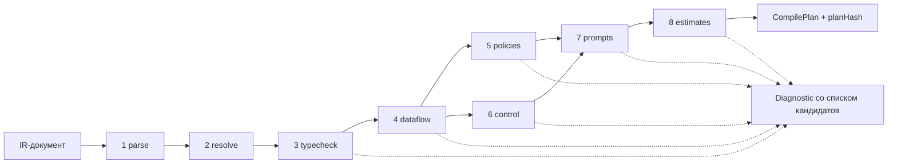
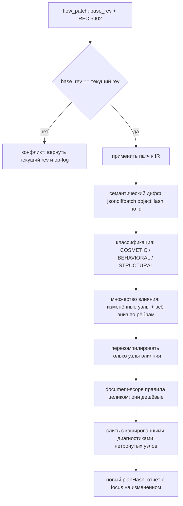

# 07. Компилятор

> Статус: draft
> Зависит от: [03. Язык ядра](03-core-language.md), [08. Промты](08-prompts.md), [05. Система типов](05-type-system.md), [10. Рантайм](10-runtime.md), [18. Экспорт и конформанс](18-export-and-conformance.md), [13. Evals и гейты](13-evals-and-gates.md)
> Источники: research/structured-output.md, research/templating.md, research/monorepo-quality.md, research/determinism-export.md, research/graph-canvas.md (§5), research/00-verified-by-lead.md; спека §6.7–6.9, §7.3, §7.6, §8, §9, §18.1

## Зачем этот слой

Компилятор — единственное место, где ошибка автора (человека или Claude) превращается из «узнаем в проде»
в «не запустится». Он закрывает все строки каталога §8 с уровнем L1: непривязанные слоты, чтение из
невыполненной ветки, невычерпывающий `switch`, цикл без бюджета, схему, которую strict-профиль провайдера
не примет, переполнение окна, взрыв стоимости. Он же — источник кандидатов на исправление: диагностика без
готового `apply{tool,arguments}` считается багом компилятора, а не сообщением пользователю. Выход
компилятора — детерминированный план, из которого строится цепочка VoltAgent, генерируется код для
экспорта и берётся lineage в трассе.

## Решения

| Решение | Что берём | Версия | Лицензия | Почему |
|---|---|---|---|---|
| Валидация IR-документа на границе | ajv (draft 2020-12) | по [04](04-ir-schema.md) | MIT | Схемы IR и конфигов — граница ввода; zod на горячем пути данных (DECISIONS) |
| Доменные типы и проверки | zod | 4.6.2 | MIT | Единый слой схем; `z.toJSONSchema` — вход для профилей |
| Парс шаблонов | liquidjs | 10.29.0 | MIT | Типизированный AST, встроенный статический анализ, позиции токенов; свой парсер не пишем |
| Токенизация для оценок | gpt-tokenizer, энкодинг `o200k_base` | 4.0.0 | MIT | Идентичен js-tiktoken по числам, в ~23 раза быстрее (126 мс против 2923 мс на 2.4 МБ) |
| Топосорт, детект цикла, `willCreateCycle` | graphology + graphology-dag | 0.26.0 / 0.4.1 | MIT | Готовое, без зависимостей; помечаем «unmaintained-but-stable» |
| Обход достижимости | graphology-traversal | 0.3.1 | MIT | `bfsFromNode`; для массовых запросов — свои битсеты |
| Доминаторы | своё, Cooper–Harvey–Kennedy | ~40 строк | — | Пакет `dominators@1.1.2` от 2022-04 не тащим в ядро доверия |
| Критический путь | своё поверх топосорта | ~25 строк | — | Готового пакета под взвешенный DAG на npm нет |
| Канонизация плана и спеки | canonicalize (RFC 8785) | 5.0.0 | Apache-2.0 | Байтовая воспроизводимость `specHash`/`planHash` |
| Хеши | @noble/hashes sha256, доменная сепарация, префикс `sha256-` | 2.4.0 | MIT | Единый формат с бандлом экспорта |
| Семантический дифф для инкрементальности | jsondiffpatch (`objectHash: o => o.id`) | 0.7.6 | MIT | Без `objectHash` дифф даёт ложные «изменились 4 узла» вместо 2 полей |
| Wire-формат патчей | rfc6902 | 5.3.0 | MIT | Стандартный JSON Patch для `flow_patch` |
| Доверие к компилятору | свой доменный IR-мутатор | — | — | Stryker мутирует наш код, а не данные; kill-критерий §18.1 требует второго |
| Гигиена тест-сьюта компилятора | Stryker + vitest-runner | 10.0.0 | Apache-2.0 | Nightly, только `packages/compiler` и `packages/ir`, `pool: "threads"` |
| Property-based инварианты | fast-check | по [20](20-repo-and-tooling.md) | MIT | Детерминизм `planHash`, непустота кандидатов |

Компилятор — чистая функция `compile(spec, registries) → CompileResult`. Никаких обращений к сети:
токенизация локальная, схемы провайдеров описаны профилями, цены — из закреплённой версии каталога моделей.
Это условие воспроизводимости `planHash` и условие работы мутационного прогона в CI.

## 1. Этапы компиляции

Восемь этапов §9 реализованы как Chain of Responsibility: список объектов `Stage`, каждый со своим входом,
выходом и набором привязанных правил. Этап ничего не знает о соседях — только о своём входном факте-типе.

```ts
type StageId =
  | "parse" | "resolve" | "typecheck" | "dataflow"
  | "policies" | "control" | "prompts" | "estimates";

interface Stage<TIn, TOut> {
  readonly id: StageId;
  readonly halting: boolean;
  run(input: TIn, ctx: CompileContext): StageResult<TOut>;
}

type StageResult<T> =
  | { readonly kind: "ok"; readonly value: T; readonly diagnostics: readonly Diagnostic[] }
  | { readonly kind: "halt"; readonly diagnostics: readonly Diagnostic[] };
```

| # | Этап | Вход | Выход | Halting |
|---|---|---|---|---|
| 1 | `parse` | Транспортный документ (YAML или JSON), `tenant_id` | `IrDocument` с branded-идентификаторами, `specHash = sha256("spec/v1" ‖ canonicalize(ir))` | да |
| 2 | `resolve` | `IrDocument` + снимок реестров | `ResolvedGraph`: каждая ссылка заменена на закреплённую версию (тип, view, профиль модели, агент, тул + хэш схемы, подворкфлоу, фрагмент промта) | да |
| 3 | `typecheck` | `ResolvedGraph` | `TypedGraph`: у каждой привязки известны тип источника, тип слота, кардинальность, результат унификации дженериков | нет |
| 4 | `dataflow` | `TypedGraph` | `DataflowFacts`: топопорядок, битсеты достижимости, дерево доминаторов, непривязанные и неиспользуемые слоты, классы происхождения и метки доверия/PII | нет |
| 5 | `policies` | `TypedGraph` + `DataflowFacts` | `PolicyFacts`: решения по видимости, доверию, PII, семействам моделей, scope памяти | нет |
| 6 | `control` | `TypedGraph` + `DataflowFacts` | `ControlFacts`: полнота `switch`, взаимоисключающие предикаты веток, лимиты циклов, наличие `join`, таймауты, достижимость | нет |
| 7 | `prompts` | `TypedGraph` + `PolicyFacts` + профили моделей | `CompiledPrompt[]` (массив сообщений с точками кэширования) и `WireSchema[]` (схема выхода под профиль провайдера) | нет |
| 8 | `estimates` | Всё выше | `Estimates`: max-промт, число вызовов, стоимость, критический путь, ширина параллелизма | нет |

**Halting против накопления.** Этапы 1–2 фейл-фаст: без разобранного документа и разрешённых ссылок
дальнейшие проверки дают мусорные каскады. Этапы 3–8 накопительные — один вызов компилятора обязан
вернуть агенту все проблемы сразу, иначе цикл «исправил — перекомпилировал» растягивается на десятки
итераций. Каскады гасятся отравлением: узел, получивший `severity: "error"` на этапе 3, помечается
`poisoned` и на этапах 4–8 пропускается. Правило «одна причина — одна диагностика».

```ts
const PIPELINE = [
  parseStage, resolveStage, typecheckStage, dataflowStage,
  policiesStage, controlStage, promptsStage, estimatesStage,
] as const;
```

Сквозной контекст этапов — иммутабельный `CompileContext`: снимок реестров, профили моделей,
кэши (см. §9), сид для стабильной сортировки кандидатов, флаг `strictness` окружения.



## 2. Три слоя правил

| Слой | Что проверяет | Где живут коды | Когда срабатывает |
|---|---|---|---|
| **Ядро** | Инварианты, верные для любой композиции | `R-<номер строки §8>` с уровнем L1, `R-T1..R-T13`, `R-C1..R-C8`, `R-L1..R-L4`, `R-O1..R-O7` | На каждом узле, привязке, шаблоне и переопределении |
| **Контракты компонентов** | `requires`/`ensures` конкретного компонента библиотеки | `R-J1..R-J6` у `judge_panel`, `R-L5..R-L6` у `verify_fix`, далее по компоненту | На каждом использовании компонента, **с эффективной конфигурацией**, а не с определением |
| **Типизация композиции** | Дженерики, типы компонентов-параметров, эффекты | `R-G1..R-G4` (префикс закреплён в `CONVENTIONS.md`, реестр — §3.7) | На этапе 3 при унификации типов |

**Ядро** — Registry правил: плоская таблица `Record<RuleCode, Rule>` вместо лестницы условий. Правило —
объект, а не ветка в `if`: добавление правила не трогает движок (открыт для расширения, закрыт для
изменения).

```ts
type RuleScope =
  | "document" | "node" | "binding" | "slot"
  | "template" | "component_use" | "override" | "edge";

interface Rule<S extends RuleScope> {
  readonly code: RuleCode;
  readonly level: GuaranteeLevel;
  readonly stage: StageId;
  readonly scope: S;
  readonly docs: DocRef;
  check(target: ScopeTarget<S>, facts: CompileFacts): readonly Diagnostic[];
}

type RuleRegistry = { readonly [K in RuleCode]: Rule<RuleScope> };
```

Движок — Visitor: один обход `TypedGraph`, на каждом объекте вызываются только правила своего scope,
отсортированные по коду для стабильного порядка диагностик. Правило не имеет доступа к другим правилам
и не умеет писать в IR — только возвращать диагностики.

**Контракты компонентов.** Компонент библиотеки (`judge_panel`, `verify_fix`, `diverge`, `bounded_agent`)
объявляет `requires` (предусловия на входные типы, параметры и эффективную конфигурацию) и `ensures`
(постусловия на выход, которые компилятор вправе использовать как факты дальше по графу). Контракт —
это тот же `Rule` со `scope: "component_use"`, но привязанный к идентификатору компонента и версии.
Ключевой момент из §7.3: контракты перепроверяются **после** применения всех шести уровней
переопределений (R-O6), поэтому этап 3 вычисляет эффективную конфигурацию до запуска контрактов.

**Типизация композиции.** Три отдельные вещи:

1. *Дженерики.* Компоненты параметризованы типами: `map<T, U>`, `select_best<T>`, `judge_panel<C>`.
   На использовании переменные типа связываются унификацией против типов привязанных источников.
   Несвязанная переменная типа или конфликт связывания — ошибка, а не вывод `unknown`.
2. *Компоненты-параметры.* Судья, верификатор, генератор передаются в компонент как значения типа
   `Component<In, Out, E>`. Проверка — контрвариантность по входу, ковариантность по выходу; эффект `E`
   компонента-параметра должен лежать в допустимом множестве, объявленном принимающим компонентом.
3. *Эффекты.* Решётка `pure < read < write < external`. Эффект композиции — супремум эффектов детей.
   Так проверяются «тул с побочным эффектом требует `gate`» (R-64) и «верификатор цикла детерминирован»
   (R-L5): детерминированность выражается как `effect ≤ read`.

Совместное применение слоёв: ядро даёт нижнюю границу качества любой композиции, контракты — верхнюю
границу свободы конкретного компонента, типизация — связность между ними.

## 3. Реестр правил

Колонка «Уровень» — уровень гарантии из §8 (L0–L4). Там, где стоит пара («L1/L2»), компилятор закрывает
статическую часть, а рантайм-страж — динамическую; в таблице описана именно статическая часть.
Колонка «Сообщение» — шаблон текста, плейсхолдеры `{node}`, `{slot}`, `{type}` подставляются движком.
Колонка «Кандидаты» — что компилятор обязан предложить; каждый кандидат едет с готовым
`apply{tool, arguments}` (§4).

### 3.1. Ядро: авторство, данные и контекст (§8.1–8.2)

| Код | Что проверяет | Уровень | Сообщение | Кандидаты |
|---|---|---|---|---|
| R-03 | Каждый узел, тул, параметр и архетип существует в реестре закреплённой версии; имена параметров совпадают со схемой | L1 | `Неизвестный {kind} «{name}». В реестре {registry}@{version} такого нет` | Ближайшие по расстоянию Левенштейна имена из реестра (top-3); `registry_propose` для нового элемента с аппрувом |
| R-05 | Анализ влияния: изменение узла, типа или фрагмента перечисляет все зависящие узлы; ни один затронутый узел не остался нескомпилированным | L1 | `Изменение {ref} затрагивает узлы: {nodes}. Перекомпиляция обязательна` | Перекомпилировать затронутое подмножество; открыть дифф влияния; закрепить старую версию ссылки |
| R-09 | Слот привязан к источнику совместимого типа: тип, идентичность enum и сущности, представление (view) | L1 | `Слот {node}.{slot}: ожидается {expected}, источник {source} даёт {actual}` | Выходы того же типа из доминирующих узлов (top-5); вставить узел-проекцию; расширить view источника |
| R-10 | Все обязательные слоты привязаны; архетип получил весь объявленный им контекст | L1 | `Слот {node}.{slot} обязателен и не привязан` | Совместимые по типу выходы доминирующих узлов; объявить `context_needs` с источником; пометить слот необязательным, если архетип это допускает |
| R-11 | Слотов сверх объявленных нет; привязанный, но не потребляемый шаблоном слот — ошибка | L0/L1 | `Слот {node}.{slot} привязан, но не используется ни в шаблоне, ни в теле узла` | Удалить привязку; пометить `unused: причина`; использовать слот в шаблоне |
| R-12 | Верхняя оценка размера промта узла ≤ окно профиля минус резерв на выход (см. §5.1) | L1/L2 | `Узел {node}: верхняя оценка промта {tokens} токенов при окне {window}; запас на выход {reserve}` | Сузить view источника; включить `chunk`/map-reduce; перейти на профиль с большим окном; задать стратегию сжатия |
| R-13 | У источника вида `data` объявлен TTL; компилятор проверяет наличие и формат, рантайм — истечение | L2 | `Источник {source} вида data не объявляет ttl` | Проставить `ttl` по умолчанию из реестра тулов; сменить вид источника на `static` с версией |
| R-14 | Кардинальность привязки: элемент против массива, `map`/`reduce` только явные | L1 | `Слот {node}.{slot} ожидает {expectedCard}, источник даёт {actualCard}` | Обернуть в `map`; вставить `reduce`/`select_best`; взять элемент явным индексом |
| R-15 | Читаемый узел доминирует читающий: `dominates(source, consumer)` в графе управления | L1 | `Узел {node} читает {source}, который выполняется не всегда: он лежит внутри ветки {branch}` | Перенести чтение под узел сведения ветки; привязаться к выходу `join`; объявить значение по умолчанию через политику |
| R-17 | Политики видимости: сосед-дивергент не виден дивергенту, метаданные кандидата (модель, ветка, метка) не видны судье | L1 | `Узел {node} видит {leak}, запрещённый политикой видимости {policy}` | Убрать поле из view; вставить проекцию-обезличивание; перевести панель в слепой режим (`blind_labels`) |
| R-18 | Поле с меткой `pii` не попадает в профиль провайдера вне allowlist и не попадает в трассируемые поля без маскирования | L1/L2 | `PII-поле {field} уходит в профиль {profile}, которого нет в allowlist` | Сменить профиль на разрешённый; замаскировать поле в view; вынести узел в self-hosted профиль |
| R-19 | Значение с меткой `untrusted` не влияет на ветвление напрямую: между ним и предикатом обязателен узел-экстрактор с enum-выходом | L1/L2 | `Предикат ветки {node} зависит от untrusted-значения {source} без экстрактора` | Вставить экстрактор с типизированным enum; пометить источник доверенным через политику с аппрувом |
| R-20 | Дата, часовой пояс и локаль приходят из `run.context` и объявлены обязательными слотами архетипа | L1 | `Архетип {archetype} требует {slot} из run.context; слот не объявлен` | Добавить слот из `run.context`; использовать значение по умолчанию окружения |
| R-C1 | У каждого решения (`switch`, `judge`, роутер) объявлены `context_needs`, и каждая привязана к источнику | L1 | `Решение {node} не объявляет потребность в контексте` или `Потребность {need} без источника` | Сгенерировать `context_needs` из входных слотов узла; привязать к существующему выходу |
| R-C2 | У источника указан вид (`static`/`data`/`knowledge`/`generated`/`human`/`run`), тип источника совпадает с типом потребности | L1 | `Потребность {need}: тип {expected}, источник {source} вида {kind} даёт {actual}` | Сменить источник; сменить тип потребности; вставить проекцию |
| R-C3 | Генеративный контекст проходит валидацию или верификацию до узла, принимающего на нём решение | L1 | `Решение {node} опирается на генеративный контекст {need} без валидации` | Вставить `verify`-узел; добавить `verify: [schema, completeness]`; привязать решение к выходу существующего валидатора |
| R-C4 | Источники `knowledge` возвращают фрагменты с ID источника; архетипы с опорой на вход требуют цитат | L1 | `Источник {need} вида knowledge не отдаёт source_id` / `Архетип {archetype} требует цитат` | Сменить тип на `Passage[]` с `source_id`; включить требование цитат в архетипе |
| R-C5 | У `data` задан TTL, у `static` — версия фрагмента | L1 | `Потребность {need}: у источника вида {kind} нет {missing}` | Проставить TTL по умолчанию; закрепить версию фрагмента |
| R-C6 | Граф зависимостей контекста ацикличен; цикл допустим только внутри `loop` | L1 | `Цикл в графе контекста: {cycle}` | Разорвать ребро; обернуть участок в `loop` с `max_iter` и бюджетом |
| R-C7 | Суммарный размер контекста узла ≤ окно профиля; стратегия сжатия задана явно, если оценка превышает порог | L1 | `Контекст узла {node}: {tokens} токенов при окне {window}, стратегия сжатия не задана` | Задать `compress: {strategy}`; сузить view; поднять профиль |
| R-C8 | Потребность без потребителя и потребитель без объявленной потребности — ошибки | L1 | `Потребность {need} не используется` / `Узел {node} читает {source} без объявленной потребности` | Удалить потребность; объявить потребность у потребителя; привязать к другому узлу |

### 3.2. Ядро: промты и шаблоны (§8.3, §7.6)

Механика обхода — визитор по AST liquidjs 10.29.0 (детали разбора и типы узлов AST — в
[08. Промты](08-prompts.md)).

| Код | Что проверяет | Уровень | Сообщение | Кандидаты |
|---|---|---|---|---|
| R-24 | Каждый few-shot валидируется типом выхода (`Example<In, Out>[]`); устаревшие примеры ловятся по хэшу версии типа | L1 | `Пример #{i} промта {prompt} не проходит схему {type}: {issue}` | Удалить пример; починить поле по подсказке Zod; перегенерировать примеры из датасета |
| R-25 | Скелет инструкции соблюдён (иерархия блоков), длина инструкции ≤ лимита профиля, нет запрещённых конструкций из lint-списка | L1 | `Промт {prompt}: {violation}` | Перенести блок в нужную секцию скелета; сократить до лимита; удалить запрещённую формулировку |
| R-26 | У изменённого промта обновлён snapshot отрисовки на фикстурах; расхождение хэша без обновления снапшота блокирует компиляцию в режиме гейта | L3 | `Промт {prompt} изменён, snapshot {hash} устарел` | Обновить snapshot; открыть дифф отрисовки; запустить golden-тесты узла |
| R-27 | Шаблон объявляет язык вывода, и он согласован с локалью из `run.context` | L1/L2 | `Промт {prompt} не объявляет lang` / `lang={a} расходится с локалью {b}` | Проставить `lang` из локали; добавить слот локали; включить валидатор языка на приёме |
| R-28 | Промт собран под каждый профиль, на котором узел может исполниться (основной + фолбэки); смена профиля без eval-гейта блокируется | L3 | `Промт {prompt} не собирается под профиль {profile}: {reason}` | Добавить вариант шаблона для профиля; убрать профиль из цепочки фолбэков; запустить eval-гейт |
| R-T1 | Плейсхолдер ссылается на объявленный слот; поле существует; тип совместим | L1 | `{{ {path} }} в промте {prompt}: слот {root} не объявлен` / `у типа {type} нет поля {field}` | Объявить слот; ближайшие имена полей view (top-3); сменить view на содержащий поле |
| R-T2 | Каждый объявленный слот использован в тексте или помечен `unused` с причиной | L1 | `Слот {slot} объявлен, но не встречается в теле шаблона` | Использовать слот; удалить слот; добавить `unused: причина` |
| R-T3 | Условия только по bool, optional и enum; сравнение с enum — только со значениями из реестра; белый список операторов | L1 | `Условие в {prompt}:{line}: {reason}` | Сравнить с существующим значением enum (top-3); заменить выражение на bool-поле; вынести вычисление в узел-предикат |
| R-T4 | `` полон по enum, `` отсутствует | L1 | `case по {enum} не покрывает значения: {missing}` | Добавить ветки для недостающих значений (заготовка текста); сузить тип enum в реестре |
| R-T5 | `` только по массивам; внутри тела поля резолвятся к типу элемента | L1 | `for по {path}: тип {type} не массив` | Обернуть источник в `map`; сменить путь на массивное поле (top-3) |
| R-T6 | `output_format` встречается ровно один раз; ручного описания формата и JSON-примеров в тексте нет | L1 | `output_format встречается {n} раз` / `в тексте {prompt}:{line} ручное описание формата` | Удалить лишнее вхождение; вставить `{{ output_format }}`; удалить ручной JSON-блок |
| R-T7 | Упомянутые в статическом тексте значения enum совпадают с реестром | L1 | `В тексте {prompt}:{line} значение «{word}», в реестре enum {enum} такого нет` | Заменить на значение из реестра (top-3); добавить значение в реестр через `registry_propose` |
| R-T8 | В статическом тексте нет данных-литералов: названий, цен, ID из справочников | L1 | `В тексте {prompt}:{line} литерал из справочника {registry}: «{literal}»` | Вынести в слот; вынести во фрагмент `static` с версией |
| R-T9 | Верхняя оценка отрисовки ≤ окно профиля (алгоритм — §5.1) | L1 | `Промт {prompt}: верхняя оценка {tokens} при окне {window}` | Сузить view; ограничить `maxItems` источника; поднять профиль; включить сжатие |
| R-T10 | Политики видимости соблюдены на уровне шаблона: судье не видны ветка и модель кандидата, дивергенту — соседи | L1 | `Шаблон {prompt} обращается к {path}, закрытому политикой {policy}` | Убрать обращение; использовать обезличенный view; включить `blind_labels` |
| R-T11 | Шаблон объявляет язык вывода полем `lang` в заголовке, а не фразой в тексте | L1 | `Промт {prompt} не объявляет lang` | Проставить `lang`; удалить фразу о языке из текста |
| R-T12 | В архетипах с опорой на вход нет инструкций «используй свои знания», «придумай, если данных нет» | L1 | `Промт {prompt}:{line}: стоп-фраза «{phrase}» запрещена для архетипа {archetype}` | Удалить фразу; сменить архетип на допускающий свободную генерацию |
| R-T13 | Внутри `MessageTag` с меткой `cache` нет `Output` с системным слотом (`run.date`, `locale`, `tz`): иначе кэшируемый префикс перестаёт быть побайтово стабильным | L1 | `R-T13: системный слот {path} в сообщении {role} с меткой cache ломает стабильность префикса` | `remove` слота из кэшируемого сообщения и `insert` в первое сообщение `user`; снять метку `cache` с сообщения |

### 3.3. Ядро: структурированный вывод (§8.4)

Профиль схемы — свойство пары (IR-схема × провайдер), а не свойство IR (DECISIONS). Правила ниже
проверяются отдельно для каждого профиля из цепочки «основной + фолбэки».

| Код | Что проверяет | Уровень | Сообщение | Кандидаты |
|---|---|---|---|---|
| R-34 | `max_tokens` вызова ≥ верхней оценки размера выхода по типу плюс запас профиля | L1/L2 | `Узел {node}: оценка выхода {tokens}, max_tokens={limit}` | Поднять `max_tokens` до расчётного; сузить тип выхода (убрать поля, ограничить `maxItems`); разбить узел на два |
| R-35 | Поле обоснования стоит перед полем решения; порядок полей IR не сортируется | L1 | `В типе {type} поле {reason} стоит после {verdict}` | Переставить поля в реестре типов; исключить поле из выхода |
| R-36 | Глубина вложенности схемы ≤ 3 уровней (жёстче лимита OpenAI в 10 уровней) | L1 | `Схема {type}: глубина {depth} при лимите 3` | Вынести поддерево в отдельный тип и плоскую ссылку; свернуть уровень в массив пар |
| R-37 | Схема совместима с strict-профилем: корень — `object` и не `anyOf`; все поля required; `additionalProperties: false`; нет `oneOf`; запрещённые ключевые слова вырезаны в `description`; бюджет схемы не превышен (≤5000 свойств, ≤10 уровней, ≤120 000 символов имён и значений, ≤1000 enum-значений, ≤15 000 символов для enum >250 значений) | L1 | `Тип {type} несовместим с профилем {profile}: {violations}` | Применить трансформацию `optional → required + type:[T,"null"]`; развернуть union-корень в объект `{result: ...}`; перенести `minimum`/`pattern` в `description` с проверкой Zod на приёме; сменить профиль на `permissive`/self-hosted |
| R-37a | Динамический allowed-set укладывается в пороги `DECISIONS.md`: ≤50 значений — `enum` в схеме короткими кодами; >50 — индексный выбор из пронумерованного списка; потолок enum по совместному действию лимитов OpenAI — около 416 значений UUID, выше него сужение множества до вызова обязательно | L1 | `Allowed-set слота {slot}: {n} значений, стратегия «{strategy}» недопустима` | Перейти на индексный выбор из пронумерованного списка; сузить множество фильтром до вызова; заменить UUID короткими кодами |

`R-37a` — подправило `R-37`, отдельный код нужен потому, что бюджет allowed-set считается по данным
прогона, а не по статике типа; в отчёте оно выводится вместе с `R-37`.

### 3.4. Ядро: управление потоком (§8.5)

| Код | Что проверяет | Уровень | Сообщение | Кандидаты |
|---|---|---|---|---|
| R-38 | У каждой дивергенции есть узел сведения с явной политикой (`join`); у `andAll`-веток заданы явные ключи результата | L1 | `Параллель {node} не имеет узла сведения` / `Ветки {node} пишут в один ключ {key}` | Вставить `join` с политикой (`all`/`quorum(k)`/`any`/`first_success`); задать ключи веток |
| R-39 | У `map`/`foreach` объявлен `on_item_error`, у параллели — `on_branch_error`; политика деградации отражена в типе результата | L1/L2 | `У {node} не задана политика {policy}` | Проставить `fail_fast`; проставить `collect` с типом `Result<T, Issue>`; проставить `skip` с порогом |
| R-40 | У цикла заданы `max_iter` и бюджет; выбирается лучший вариант, а не последний | L1 | `Цикл {node}: не задан {missing}` / `select={last}, требуется best` | Проставить `max_iter` по умолчанию архетипа; задать бюджет из бюджета воркфлоу; `select: best` со скорером |
| R-41 | `switch` по enum полон; предикаты веток взаимоисключающие; все ветки возвращают один тип | L1 | `switch {node} не покрывает значения {missing}` / `предикаты веток {a} и {b} пересекаются` / `ветки возвращают {types}` | Добавить недостающие ветки; добавить `default`, если архетип допускает; сделать предикаты взаимоисключающими (готовая переписка условий); привести типы веток к общему |
| R-44 | Нет недостижимых узлов от входа; нет рёбер на несуществующие узлы; нет циклов вне `loop` | L1 | `Узел {node} недостижим от входа` / `Ребро {from}→{to}: узла {to} нет` / `Цикл: {cycle}` | Удалить узел; связать с достижимым предком; починить ссылку ребра (top-3 по имени); обернуть цикл в `loop` |
| R-45 | Подворкфлоу вызывается по закреплённой версии; смена версии перекомпилирует всех родителей, и их компиляция обязана быть зелёной | L1 | `Подворкфлоу {flow}@{version} изменилось: родители {parents} требуют перекомпиляции` / `Вызов {flow} без версии` | Закрепить версию; перекомпилировать родителей; откатить на прежнюю версию |
| R-46 | У веера объявлены `concurrency` и размер батча; `maxItems` источника известен и укладывается в лимит фан-аута | L1/L2 | `Веер {node}: {items} элементов при лимите {limit}, concurrency не задан` | Проставить `concurrency` из профиля; включить батчи; ограничить `maxItems` источника |
| R-47 | Профиль модели, на который ссылается узел, объявляет лимитер (RPM, TPM, concurrency); ширина параллелизма плана не превышает лимит | L2 | `Профиль {profile} без лимитера` / `ширина {width} превышает concurrency={limit}` | Проставить лимиты из каталога моделей; снизить `concurrency` узла; распределить нагрузку по двум профилям |
| R-48 | На каждом узле задан таймаут (собственный или унаследованный от архетипа); сумма таймаутов критического пути ≤ таймаута воркфлоу | L1/L2 | `У узла {node} нет таймаута` / `сумма таймаутов пути {sum} > таймаута воркфлоу {limit}` | Проставить таймаут архетипа; поднять таймаут воркфлоу; сократить критический путь |
| R-49 | Тул класса `write`/`external` объявляет шаблон ключа идемпотентности, и все поля шаблона доступны в точке вызова | L1/L2 | `Тул {tool} с эффектом {effect} без ключа идемпотентности` / `поле {field} ключа недоступно в {node}` | Сгенерировать шаблон ключа из входных слотов; привязать недостающее поле; снять ретраи с узла |
| R-52 | Неявных значений по умолчанию нет: у каждого фолбэка объявлен статус `degraded`, каждое значение по умолчанию объявлено явно и типизировано | L1/L2 | `Фолбэк {node}→{fallback} не помечает результат degraded` / `неявный default у {slot}` | Проставить `degraded: true`; объявить значение по умолчанию явно; перевести узел на ошибку вместо дефолта |
| R-L1 | У `loop` заданы `max_iter` и бюджет | L1 | `Цикл {node}: не заданы {missing}` | Проставить `max_iter`; задать `budget.usd` из бюджета воркфлоу |
| R-L2 | Выход верификатора типизирован и привязан к слоту обратной связи генератора | L1 | `Выход верификатора {node} не привязан к слоту обратной связи {slot}` | Привязать `verifier.out` к слоту; объявить тип `Issue[]`; добавить слот обратной связи в шаблон генератора |
| R-L3 | Условие остановки — типизированный предикат, а не строка | L1 | `stop_when у {node} задан строкой` | Заменить на типизированный предикат по полю выхода; использовать `issues.length == 0` из типа |
| R-L4 | Объём истории, переносимой между итерациями, ограничен явно (`carry`) | L1 | `Цикл {node}: carry не ограничен` | Проставить `carry: {history: last_k}`; сводить историю в резюме; отключить перенос |
| R-L5 | LLM-верификатор — из другого семейства, чем генератор; при наличии кодовой проверки предпочитается детерминированный верификатор (`effect ≤ read`) | L1 | `Верификатор и генератор из одного семейства {family}` | Сменить роль верификатора на другое семейство (top-3 из каталога); заменить на кодовый верификатор |
| R-L6 | Выбирается лучший вариант, включена защита от стагнации, повторяющиеся кандидаты детектируются по хэшу | L1 | `Цикл {node}: select={mode}, stagnation не задан` | `select: best` + скорер; `stagnation: {window, min_delta}`; включить дедупликацию по хэшу кандидата |

### 3.5. Ядро: модели, агенты, переопределения (§8.6–8.8, §7.3)

| Код | Что проверяет | Уровень | Сообщение | Кандидаты |
|---|---|---|---|---|
| R-55 | Требования узла ⊆ возможностей профиля: strict-вывод, окно против оценки промта, тулы, мультимодальность, длина выхода | L1 | `Узел {node} требует {caps}, профиль {profile} не умеет {missing}` | Профили с нужными возможностями (top-3 из каталога); снять требование (например, перейти на `permissive` с валидацией на приёме); разбить узел |
| R-56 | Параметры вызова соответствуют политике архетипа (экстрактор — низкая температура, дивергенты — различающиеся источники разнообразия) | L1/L4 | `Архетип {archetype}: параметр {param}={value} вне политики {range}` / `ветки diverge неразличимы` | Привести параметр к политике; задать `vary` с различающимися параметрами или ролями; сменить архетип |
| R-57 | Верхняя оценка стоимости прогона ≤ объявленного бюджета воркфлоу (алгоритм — §5.3) | L1/L2 | `Верхняя оценка стоимости {usd} при бюджете {budget}; вклад узлов: {top}` | Снизить `max_iter`/`n` у топ-вкладчиков; сменить профиль на дешёвый; поднять бюджет явным решением |
| R-58 | Критический путь посчитан; в отчёт выдаются узлы пути, не связанные зависимостями, — кандидаты на распараллеливание | L1 | `Критический путь {total} мс: {path}. Узлы {a} и {b} независимы и могут идти параллельно` | Обернуть независимые узлы в `parallel`; поднять `concurrency` у веера; вынести узел за пределы цикла |
| R-62 | У памяти агента объявлен scope (`run`/`user`/`tenant`); scope не шире разрешённого политикой узла | L1 | `Агент {agent}: scope памяти не задан` / `scope={scope} шире разрешённого {max}` | Проставить `scope: run`; сузить scope; запросить аппрув расширения |
| R-63 | Граф делегирования саб-агентов ацикличен либо ограничен объявленной глубиной | L1 | `Цикл делегирования: {cycle}` / `глубина делегирования {depth} > лимита {limit}` | Разорвать делегирование; проставить `max_depth`; заменить делегирование прямым вызовом |
| R-64 | Тул с эффектом `write`/`external` защищён `gate` либо явной политикой эффекта | L1 | `Тул {tool} с эффектом {effect} вызывается из {node} без gate` | Вставить узел `gate` перед вызовом; объявить политику эффекта с аппрувом; заменить на read-тул |
| R-74 | Отложенная выборка датасета недоступна оптимизатору промтов: пересечение обучающей и отложенной выборок пусто, оптимизатор не имеет ссылки на holdout | L1/L3 | `Оптимизатор {opt} имеет доступ к holdout {dataset}` / `пересечение выборок: {n} элементов` | Перегенерировать split с фиксированным seed; убрать holdout из области видимости оптимизатора |
| R-80 | В спеке, промтах и конфигах нет значений секретов — только ссылки на хранилище | L1 | `{path}: похоже на секрет («{pattern}»), допустима только ссылка на хранилище` | Заменить на ссылку `secret://{name}`; вынести в переменные окружения; удалить значение и отозвать ключ |
| R-82 | Хэш схемы MCP-тула совпадает с закреплённым в спеке | L1 | `Схема тула {tool} изменилась: закреплено {pinned}, сервер отдаёт {actual}. Дифф: {diff}` | Принять новую схему с обновлением привязок; закрепить прежнюю версию сервера; отключить тул |
| R-85 | После применения всех уровней переопределений эффективная конфигурация по-прежнему проходит R-55, R-O3, R-O4 и контракты компонента | L1 | `Переопределение в {origin} ломает {rule} у {node}: {reason}` | Откатить конкретное поле переопределения (указывается origin); подобрать совместимый профиль; снять требование узла |
| R-O1 | Переопределение соответствует схеме, все поля существуют | L1 | `Переопределение {path}: поля {field} нет в схеме {schema}` | Ближайшие имена полей (top-3); удалить поле |
| R-O2 | Поля из `locked` не переопределяются | L1 | `Поле {field} заблокировано агентом {agent} (locked)` | Удалить переопределение; снять поле из `locked` в определении агента (требует аппрува) |
| R-O3 | После переопределения модель умеет всё, что требует вызов: strict JSON, окно против оценки промта, тулы | L1 | `После переопределения профиль {profile} не умеет {missing}` | Вернуть исходный профиль; выбрать профиль с нужными возможностями; снять требование |
| R-O4 | Тулы, на которые ссылаются шаблон и контракты компонента, остаются доступны после `remove`/`replace` | L1 | `Переопределение убирает тул {tool}, который требуется {refs}` | Вернуть тул в список; убрать ссылку из шаблона; заменить тул совместимым |
| R-O5 | Scope памяти не расширяется (`run → user → tenant`) без политики аппрува | L1 | `Расширение scope памяти {from}→{to} без аппрува` | Оставить прежний scope; приложить аппрув политики |
| R-O6 | Контракты компонентов перепроверены с эффективной конфигурацией (в частности R-J2, R-L5) | L1 | `После переопределения нарушен контракт {contract} компонента {component}` | Откатить поле переопределения; сменить роль модели; сменить компонент |
| R-O7 | Переопределение прогона меняет только модель, параметры и лимиты; бюджеты — только в сторону ужесточения | L1 | `Переопределение прогона меняет {field}, что запрещено` / `бюджет ослаблен: {from}→{to}` | Убрать поле из переопределения прогона; ужесточить бюджет вместо ослабления; изменить спеку версией |

### 3.6. Контракты компонента `judge_panel` (§6.8)

| Код | Что проверяет | Уровень | Сообщение | Кандидаты |
|---|---|---|---|---|
| R-J1 | Рубрика типизирована: критерии, веса, шкалы, описания уровней; сумма весов равна 1 | L1 | `Рубрика {panel}: {issue}` | Добавить описания уровней; нормировать веса; взять рубрику-шаблон из библиотеки |
| R-J2 | Семейство модели судьи отличается от семейства генератора; в панели минимум два семейства | L1 | `Судья {judge} из семейства {family}, совпадающего с генератором {gen}` / `в панели одно семейство` | Роли судей из других семейств (top-3 из каталога); добавить третьего судью другого семейства |
| R-J3 | В типе вердикта поле обоснования стоит перед оценкой | L1 | `Тип {type}: поле {score} стоит перед {reason}` | Переставить поля в реестре типов |
| R-J4 | Для `pairwise` включены перестановка позиций и слепые метки кандидатов | L1 | `Панель {panel} в режиме pairwise без {missing}` | Включить `swap_positions`; включить `blind_labels`; включить `shuffle` |
| R-J5 | Задана политика разногласий: тай-брейк или эскалация, с порогом метрики | L1 | `Панель {panel}: disagreement без {missing}` | Задать `on_exceed: tie_break(judge_strong)`; задать эскалацию на `human`; задать порог `spread` |
| R-J6 | Судья участвует в гейтинге выпуска только после калибровки с согласием не ниже порога (weighted kappa ≥ 0.7, Krippendorff alpha ≥ 0.8) | L1 | `Панель {panel} гейтит выпуск, калибровка отсутствует или ниже порога ({value} < {threshold})` | Запустить калибровку на датасете разметки; снять панель с гейтинга (оставить наблюдательной); поднять порог согласия |

### 3.7. Типизация композиции: дженерики, компоненты-параметры, эффекты

| Код | Что проверяет | Уровень | Сообщение | Кандидаты |
|---|---|---|---|---|
| R-G1 | Все переменные типа компонента связаны унификацией; конфликтов связывания нет | L1 | `Компонент {component}: переменная {T} связана и с {a}, и с {b}` | Привести источники к одному типу; вставить проекцию; параметризовать компонент явно |
| R-G2 | Компонент-параметр соответствует объявленной сигнатуре: контрвариантность по входу, ковариантность по выходу | L1 | `Компонент-параметр {arg} имеет тип {actual}, ожидается {expected}` | Обернуть в адаптер; сменить компонент; расширить объявленную сигнатуру |
| R-G3 | Эффект композиции ⊆ допустимого множества принимающего компонента | L1 | `Эффект {effect} не допускается в позиции {slot} компонента {component}` | Заменить на компонент с меньшим эффектом; вынести эффект наружу под `gate` |
| R-G4 | Ограничения переменной типа (границы дженерика) выполнены на использовании | L1 | `Тип {actual} не удовлетворяет границе {bound}` | Типы, удовлетворяющие границе (top-3); ослабить границу в объявлении компонента |

Префикс `R-G*` закреплён в `CONVENTIONS.md` наравне с `R-T*`, `R-C*`, `R-L*`, `R-O*` и `R-J*`; в каталоге
спеки §9 слой назван, но кодов не имеет, поэтому нормативный источник для `R-G1..R-G4` — эта таблица.

## 4. Формат ошибки компилятора

Схема §9 — минимум; к нему добавлены поля, без которых агент не может применить исправление одним
вызовом, а Studio — показать место ошибки.

```ts
type Severity = "error" | "warning" | "info";

interface SourceLoc {
  readonly path: JsonPointer;
  readonly line: number | null;
  readonly column: number | null;
}

interface Candidate {
  readonly label: string;
  readonly apply: { readonly tool: McpToolName; readonly arguments: JsonObject };
  readonly confidence: number;
  readonly rationale: string;
}

interface Diagnostic {
  readonly rule: RuleCode;
  readonly severity: Severity;
  readonly node: NodeId | null;
  readonly slot: SlotName | null;
  readonly loc: SourceLoc;
  readonly message: string;
  readonly candidates: readonly Candidate[];
  readonly docs: DocRef;
  readonly specHash: Sha256;
}
```

| Поле | Обязательность | Смысл |
|---|---|---|
| `rule` | всегда | Код из §3. Один код — одна причина; каскады не порождают новых диагностик |
| `severity` | всегда | `error` блокирует план, `warning` попадает в отчёт и в гейт, `info` — подсказка (например, кандидаты на распараллеливание от R-58) |
| `node` | `null` только для document-scope правил | Идентификатор узла IR, он же `stepId` в трассе VoltAgent |
| `slot` | `null`, если правило не про слот | Имя слота или порта |
| `loc.path` | всегда | JSON Pointer в IR-документ — точка применения патча |
| `loc.line/column` | для правил шаблонов | Позиции берутся из токенов liquidjs |
| `message` | всегда | Готовый русский текст без кодов внутри; шаблон из §3 |
| `candidates` | ≥1 при `severity: "error"` | Кандидаты отсортированы по `confidence` убыванием, при равенстве — лексикографически по `label`, чтобы отчёт был детерминированным |
| `docs` | всегда | Ссылка на раздел документации правила — `docs://rules/R-41` |
| `specHash` | всегда | Хэш спеки, на которой получена диагностика; устаревшая диагностика отбрасывается клиентом |

**Правило «ошибка без кандидатов — баг компилятора»** проведено тремя способами, чтобы его нельзя было
обойти по невнимательности:

1. *Типом.* Ошибочная диагностика — отдельный тип с непустым кортежем кандидатов; собрать `error` без
   кандидатов нельзя, компилятор TypeScript не даст.

```ts
type ErrorDiagnostic = Omit<Diagnostic, "severity" | "candidates"> & {
  readonly severity: "error";
  readonly candidates: readonly [Candidate, ...Candidate[]];
};
```

2. *Единой фабрикой.* Диагностики создаются только через `emit()` — Factory, единственная точка, где
   проставляются `docs`, `specHash` и сортировка кандидатов. Прямой литерал `Diagnostic` в коде правил
   запрещён правилом Biome `no-restricted-syntax`.
3. *Прогоном мутанта.* Раннер мутатора (§8) считает мутанта **выжившим**, если он пойман правилом с
   пустым `candidates`, даже когда компиляция формально упала.

Если правило физически не может предложить исправление (например, не нашлось ни одного совместимого
источника), оно обязано выдать кандидата-эскалацию: «объявить недостающий узел/тип через
`registry_propose`» или «открыть вопрос к автору». Пустой список не является допустимым значением ни в
одном сценарии.

**Отчёт компилятора** — конверт, совместимый с MCP-контрактом (DECISIONS): `ok`, `version{rev,etag}`,
`focus`, `problems[]` (те же `Diagnostic`), `candidates[]` (кандидаты верхнего уровня, собранные из
диагностик по убыванию `confidence`), `next[]`, `refs[]`, `ui_url`, `truncated`. Ограничение размера —
`truncated: true` с сохранением полного отчёта по `ui_url`; порядок урезания: сначала `info`,
затем `warning`, `error` не урезаются никогда.

## 5. Статические оценки

Все пять оценок — один обход плана. Каждая оценка реализована как Strategy с интерфейсом алгебры над
структурой плана; обход `foldPlan` вызывает все стратегии за один проход, поэтому добавление шестой
оценки не трогает обход.

```ts
interface Estimator<T> {
  readonly id: EstimateId;
  leaf(step: PlanStep, facts: CompileFacts): T;
  seq(parts: readonly T[]): T;
  par(parts: readonly T[]): T;
  choice(parts: readonly T[]): T;
  repeat(body: T, times: number): T;
}
```

| Оценка | `seq` | `par` | `choice` | `repeat` |
|---|---|---|---|---|
| Размер промта | max | max | max | max |
| Число вызовов | сумма | сумма | max | body × times |
| Стоимость | сумма | сумма | max | body × times |
| Критический путь | сумма | max | max | body × times |
| Ширина параллелизма | max | сумма | max | body |

`choice` — взаимоисключающие ветки `switch`; `par` — `andAll`, `andRace`, `diverge`, панель судей;
`repeat` — `loop` с `times = max_iter` и `foreach` с `times = maxItems`.

### 5.1. Максимальный размер промта (R-12, R-T9, R-C7)

Считается по AST шаблона, не по отрисовке: отрисовать все комбинации данных невозможно.

```
maxTokens(HTML)     = tokenize(static_text)                       кэшируется по sha256 текста
maxTokens(Output)   = maxTokens(type(path))
maxTokens(IfTag)    = max(ветви ∪ {else})
maxTokens(CaseTag)  = max(branches)
maxTokens(ForTag)   = maxItems(array) × maxTokens(body)
maxTokens(Include)  = maxTokens(fragment@version)
maxTokens(type)     = enum       → самое длинное значение
                    | string     → maxLength / средняя длина токена
                    | view(E)    → сумма maxTokens полей view + разметка
                    | T[]        → maxItems × maxTokens(T)
```

Токенизация — `gpt-tokenizer` с энкодингом `o200k_base` (импортировать только нужный энкодинг:
`gpt-tokenizer/encoding/o200k_base`, иначе тянется весь пакет на 27 МБ). Для не-OpenAI моделей число
приблизительное, поэтому оценка двухуровневая:

1. **Компилятор (offline):** `upper = tokens(o200k_base) × token_ratio(профиль)`, где `token_ratio` по
   умолчанию 1.15 для латиницы и 1.3 для кириллицы и CJK. Плюс фиксированный резерв на `output_format`,
   схемы тулов и `max_tokens` выхода. Порог: `upper ≤ context_window × 0.9`.
2. **Рантайм (точно):** фактический `usage.inputTokens` пишется в трассу; систематическое превышение
   оценки калибрует `token_ratio` профиля. Это самонастройка, а не ручная константа.

Эвристика `chars/4` не используется: на русском она занижает (75 против 86 фактических токенов на
тестовом фрагменте), то есть как верхняя оценка непригодна. `@anthropic-ai/tokenizer@0.0.4` тоже не
используется для расчётов: на русском завышает почти вдвое (161 против 86) — это токенизатор Claude 2.

Отсюда жёсткое требование к реестру типов: **у каждой строки объявлен `maxLength`, у каждого массива —
`maxItems`.** Без этого `R-T9` недоказуемо, и компилятор обязан отказать на этапе 2 с указанием
конкретного типа.

### 5.2. Число вызовов в худшем случае (R-46, R-57)

Оценка по DAG в топологическом порядке с мемоизацией по `(componentId, version)`:

```
calls(llm)        = (1 + max_retries) × (1 + |fallback_chain|)
calls(tool)       = (1 + max_retries)
calls(agent)      = max_steps × (1 + max_retries)
calls(seq)        = Σ calls(children)
calls(all|race)   = Σ calls(branches)
calls(switch)     = max calls(branches)
calls(foreach)    = maxItems(items) × calls(body)
calls(loop)       = max_iter × calls(body)
calls(diverge n)  = n × calls(body)
calls(panel)      = |judges| × calls(judge) + calls(tie_break)
calls(subflow)    = calls(plan(flowId, version))
```

`andRace` считается по сумме, а не по максимуму: все ветки стартуют, отменённая ветка уже потратила
вызов. Рекурсия подворкфлоу запрещена (R-C6 и R-44), поэтому мемоизация всегда завершается.

### 5.3. Верхняя оценка стоимости (R-57)

```
cost(site) = calls(site) × ( promptMax(site) × price_in(profile)
                           + outputMax(site) × price_out(profile) )
cost(plan) = Σ cost(site)   по всем узлам с профилем модели
```

Цены берутся из закреплённой версии каталога моделей — компилятор в сеть не ходит. Скидка на
кэшированный префикс **не учитывается**: это верхняя оценка, а кэш может не сработать. Для узлов с
цепочкой фолбэков берётся самый дорогой профиль цепочки. Отчёт содержит разложение по узлам,
отсортированное по убыванию вклада — на этом строятся кандидаты R-57.

### 5.4. Критический путь (R-58)

Взвешенный длиннейший путь по DAG, вес узла — оценка латентности. Готового пакета под взвешенный DAG на
npm нет, пишем сами поверх топосорта (~25 строк):

```ts
function criticalPath(order: readonly NodeId[], preds: ReadonlyMap<NodeId, readonly NodeId[]>, dur: ReadonlyMap<NodeId, number>) {
  const end = new Map<NodeId, number>();
  const from = new Map<NodeId, NodeId | null>();
  for (const n of order) {
    let best = 0;
    let bestPrev: NodeId | null = null;
    for (const p of preds.get(n) ?? []) {
      const e = end.get(p) ?? 0;
      if (e <= best) continue;
      best = e;
      bestPrev = p;
    }
    end.set(n, best + (dur.get(n) ?? 0));
    from.set(n, bestPrev);
  }
  const tail = [...end.entries()].reduce((a, b) => (b[1] > a[1] ? b : a))[0];
  const path: NodeId[] = [];
  for (let x: NodeId | null = tail; x !== null; x = from.get(x) ?? null) path.unshift(x);
  return { path, total: end.get(tail) ?? 0 };
}
```

Веса: для оценки — p50 латентности профиля из истории прогонов (при отсутствии истории — норматив
профиля из каталога); для узла-цикла вес умножается на `max_iter`; для веера вес равен
`ceil(maxItems / concurrency) × латентность элемента`; для параллели берётся максимум ветвей. На реальном
прогоне те же 25 строк считают путь по фактической длительности спанов — это тот же код, другой `dur`.

Подсказки распараллеливания: берутся пары узлов критического пути `(a, b)`, между которыми **нет** пути
в графе зависимостей (проверка по битсетам достижимости, §6), и выдаются диагностикой `severity: "info"`.

### 5.5. Ширина параллелизма (R-46, R-47)

Ширина — не максимальная антицепь графа, а максимум одновременно активных вызовов, который даёт
структура плана:

```
width(leaf)      = 1
width(seq)       = max width(children)
width(all|race)  = Σ width(branches)
width(diverge n) = n × width(body)
width(foreach)   = min(concurrency, maxItems) × width(body)
width(switch)    = max width(branches)
width(loop)      = width(body)
```

Ширина считается отдельно **по профилям моделей**: `width(profile)` сравнивается с лимитом concurrency
профиля (R-47), а общая ширина — с лимитом фан-аута окружения (R-46). Оба числа попадают в план и в
отчёт: планировщик очереди использует их для резервирования конкурентности.

## 6. Анализ потока данных

Этап 4 строит два разных графа из одного IR, и это принципиально:

- **граф зависимостей данных** — рёбра «источник → слот», по нему считаются достижимость, неиспользуемые
  и непривязанные слоты, распространение меток;
- **граф управления** — рёбра ветвления и сведения, у `switch` — по ребру на ветку, у `join` — несколько
  предшественников. Доминирование считается **только** по нему: узел внутри ветки не доминирует узел
  сведения, и именно это отвечает на вопрос «гарантированно ли выполнен».

| Задача | Чем делаем | Свой код |
|---|---|---|
| Топологический порядок | `graphology-dag@0.4.1` `topologicalSort` | 0 |
| Детект цикла | `graphology-dag` `hasCycle`; сам цикл — обход по стеку DFS | ~20 строк |
| «Не создаст ли ребро цикл» (для Studio и `flow_patch`) | `graphology-dag` `willCreateCycle`, O(V+E) | 0 |
| Достижимость, единичный запрос | `graphology-traversal@0.3.1` `bfsFromNode` | 0 |
| Достижимость, массовые запросы | Битсеты `Uint32Array` в обратном топопорядке: `reach[n] = {n} ∪ ⋃ reach[succ]` | ~15 строк |
| Доминаторы | Итеративный Cooper–Harvey–Kennedy по обратному постпорядку до неподвижной точки | ~40 строк |
| «B гарантированно выполнен до A» | Подъём по дереву доминаторов; с предпосчитанными глубинами — O(1) | ~20 строк |
| Критический путь | Своё поверх топосорта (§5.4) | ~25 строк |

Пакет `dominators@1.1.2` существует и проверен запуском, но последний релиз 2022-04: в ядро доверия
четырёхлетнюю зависимость ради 40 строк не берём. `graphology`/`graphology-dag`/`graphology-traversal`
помечаются в реестре зависимостей как «unmaintained-but-stable» (релизы 2025-01, 2023-12 и 2022-05
соответственно): API заморожен, кода мало, в худшем случае вендорим.

Всё графовое — один изоморфный пакет `@wf/graph-algos`, используемый и компилятором, и Studio: подсветка
критического пути и проверка `isValidConnection` на канвасе обязаны отвечать ровно то же, что компилятор.

### 6.1. Доминирование (R-15)

```ts
const dominates = (b: NodeIndex, a: NodeIndex, idom: readonly (NodeIndex | null)[]): boolean => {
  for (let x: NodeIndex | null = a; x !== null; x = idom[x]) if (x === b) return true;
  return false;
};
```

`idom[i]` — непосредственный доминатор узла `i`. Проверка R-15: для каждой привязки слота
`consumer.slot ← source.port` требуется `dominates(source, consumer)`. Контрпример, который правило
обязано ловить: `start → a`, `start → b`, `a → c`, `b → join`, `c → join` — `idom[join] = start`, а не `a`
и не `b`, поэтому чтение выхода `a` из узла после `join` без сведения — ошибка.

Исключения из R-15 ровно два, оба объявляются явно: слот помечен необязательным с типизированным
значением по умолчанию, либо чтение идёт через узел сведения, объявляющий политику отсутствия ветки.

Обратные рёбра распознаются через доминирование: ребро `u → v` — обратное тогда и только тогда, когда
`v` доминирует `u`. Обратное ребро вне конструкции `loop` — ошибка R-44 (граф) или R-C6 (граф контекста).

### 6.2. Непривязанные и неиспользуемые слоты

| Ситуация | Определение | Правило |
|---|---|---|
| Непривязанный обязательный слот | `required(slot) ∧ ¬∃ binding` | R-10 |
| Привязанный не тем | `∃ binding ∧ ¬compatible(type(source), type(slot))` | R-09 |
| Неиспользуемый выход узла | порт без единого потребителя и без пометки `exported` | R-11, `warning` |
| Слот привязан, но не потреблён телом узла | слот ∉ переменные шаблона и не читается кодом узла | R-11 / R-T2 |
| Потребность без потребителя | `context_need.for = ∅` | R-C8 |
| Потребитель без потребности | узел читает источник, не объявленный в `context_needs` | R-C8 |

Множество переменных шаблона берётся из встроенного анализа liquidjs (`globalFullVariablesSync`), а не
из регулярных выражений; разность множеств в обе стороны и даёт R-T1 и R-T2.

### 6.3. Распространение меток

Метки происхождения (`static`, `data`, `knowledge`, `generated`, `human`, `run`), доверия
(`trusted`/`untrusted`) и `pii` — монотонный анализ потока данных по решётке. Граф ацикличен, поэтому
одного прохода в топологическом порядке достаточно; внутри `loop` проход повторяется до неподвижной
точки, но не более `|body|` итераций (решётка конечной высоты).

```
label(slot)   = ⊔ label(source_i)
label(output) = transfer(node, label(inputs))
```

`transfer` — таблица по архетипу, а не лестница условий: экстрактор с типизированным enum-выходом
снимает `untrusted` (единственный легальный способ, R-19); маскирующая проекция снимает `pii` (R-18);
все остальные архетипы метки сохраняют. Политики видимости (R-17, R-T10) проверяются как достижимость:
если существует путь данных от метаданных кандидата до слота судьи, правило падает и указывает
конкретный путь в сообщении.

## 7. План компиляции

План — чистые данные (JSON, без функций и замыканий). Это позволяет: канонизировать и хешировать,
положить в бандл экспорта, сравнить два плана диффом, скормить кодогенератору и построить из него цепочку
VoltAgent без повторной компиляции.

```ts
interface CompilePlan {
  readonly planHash: Sha256;
  readonly spec: { readonly flowId: FlowId; readonly version: number; readonly specHash: Sha256 };
  readonly registries: readonly PinnedRegistryRef[];
  readonly steps: readonly PlanStep[];
  readonly estimates: Estimates;
  readonly dataflow: DataflowFacts;
  readonly capabilities: RequiredCapabilities;
  readonly diagnostics: readonly Diagnostic[];
}
```

`planHash = sha256("plan/v1" ‖ canonicalize(plan без planHash))`, канонизация — `canonicalize@5.0.0`
(RFC 8785), префикс `sha256-` как в бандле экспорта. Два вызова компилятора на одном входе обязаны дать
байт-идентичный план — это property-based инвариант в тестах.

### 7.1. Шаг плана

`PlanStep` — размеченное объединение, каждый вариант ложится на конкретный комбинатор VoltAgent 2.10:

| `kind` | Комбинатор VoltAgent | Что добавляет компилятор сверх |
|---|---|---|
| `func` | `andThen` | — |
| `llm` | `andThen` с обёрткой узла | Отрисованный промт, wire-схема профиля, гейты качества, политика фолбэков |
| `agent` | `andAgent` | Лимиты шагов и бюджета, allowlist тулов, типизированный итог |
| `branch` | `andBranch` + шаг сведения | Взаимоисключающие предикаты и выбор единственного не-`undefined` элемента массива результатов |
| `all` | `andAll` + шаг сведения | Обёртка каждой ветки в `Result`, явные ключи веток, политика `quorum(k)`/`any`/`first_success` |
| `race` | `andRace` | Учёт всех стартовавших веток в бюджете |
| `foreach` | `andForEach` | Обёртка элемента в `Result` и фильтр по `on_item_error` |
| `loop` | `andDoWhile` / `andDoUntil` | Счётчики итераций, бюджета и стагнации в `workflowState`; сгенерированное условие остановки; выбор лучшего кандидата |
| `suspend` | `suspend()` + `suspendSchema`/`resumeSchema` | Форма по типу, таймаут через pg-boss `sendAfter` |

Ни один из перечисленных «сверх» не является изобретением: это ровно те пробелы VoltAgent, которые
зафиксированы в DECISIONS («Что VoltAgent НЕ даёт — наш слой»).

Общие поля шага:

```ts
interface PlanStepBase {
  readonly id: NodeId;
  readonly kind: PlanStepKind;
  readonly inputs: readonly BoundSlot[];
  readonly effectiveConfig: EffectiveConfig;
  readonly timeout: Millis;
  readonly retry: RetryPolicy;
  readonly fallbacks: readonly ProfileId[];
  readonly budget: BudgetSlice;
  readonly effect: Effect;
  readonly idempotencyKey: string | null;
  readonly estimates: StepEstimates;
  readonly lineage: { readonly archetype: ArchetypeId; readonly componentRef: ComponentRef | null };
}
```

`BoundSlot` несёт провенанс: `{ slot, sourceNode, sourcePort, path, originClass, trust, pii }` — это то,
что в отладчике превращается в «клик по куску контекста ведёт к источнику» без доступа к IR.

### 7.2. Эффективная конфигурация с происхождением

Шесть уровней §7.3 сводятся при компиляции, каждое поле сохраняет источник:

```ts
interface ResolvedField<T> {
  readonly value: T;
  readonly origin: ConfigOrigin;
}

type ConfigOrigin = {
  readonly layer: "platform" | "agent" | "component" | "flow" | "call" | "vary" | "run";
  readonly ref: string;
};

interface EffectiveConfig {
  readonly profile: ResolvedField<ProfileId>;
  readonly params: { readonly [K in ParamName]: ResolvedField<ParamValue> };
  readonly tools: ResolvedField<readonly ToolId[]>;
  readonly memory: ResolvedField<MemoryConfig>;
  readonly limits: ResolvedField<Limits>;
  readonly template: ResolvedField<PromptRef>;
}
```

Это закрывает §8 строку 86 на уровне L0: «какие настройки реально применились» читается из плана и из
трассы, а не реконструируется. Пример строки отчёта: `temperature = 0.9 ← vary[1] узла pitches`.

### 7.3. Собранный промт

```ts
interface CompiledPrompt {
  readonly node: NodeId;
  readonly profile: ProfileId;
  readonly messages: readonly PromptMessage[];
  readonly cachePoints: readonly number[];
  readonly wireSchema: JsonObject;
  readonly schemaProfile: "openai-strict" | "anthropic-strict" | "permissive";
  readonly renderHash: Sha256;
  readonly maxPromptTokens: number;
  readonly maxOutputTokens: number;
}
```

Один шаблон компилируется в массив сообщений по ролям (кастомный блочный тег ``), точка
кэширования — граница поддерева без динамических тегов. `wireSchema` — результат пост-обработки
`z.toJSONSchema` под конкретный профиль провайдера: `oneOf → anyOf`, `optional → required + type:[T,"null"]`,
разворачивание union-корня в объект, вырезание неподдерживаемых ограничений в `description` с проверкой
Zod на приёме. Поэтому у одного узла в плане столько `CompiledPrompt`, сколько профилей в цепочке
«основной + фолбэки».

### 7.4. Что делают с планом дальше

| Потребитель | Что берёт |
|---|---|
| Построитель рантайма (Builder) | `steps` → цепочка VoltAgent; регистрация через `WorkflowRegistry.registerWorkflow` без перезапуска процесса |
| Кодогенератор экспорта | `steps` → TS через таблицу эмиттеров `Record<PlanStep["kind"], Emitter>` (Strategy) + prettier |
| Трасса | `planHash`, `lineage`, `effectiveConfig` в атрибутах спана каждого узла |
| Планировщик очереди | `estimates.width` и `estimates.calls` для резервирования конкурентности |
| Бандл экспорта | план целиком как артефакт с хэшем в `manifest.json` |
| Studio | `dataflow` для подсветки доминирования, критического пути и провенанса |

## 8. Доверие к компилятору

Kill-критерий §18.1 требует мутировать **данные**, а не исходники: «корректные воркфлоу автоматически
портятся типовыми ошибками агента, и компилятор обязан поймать 100% мутантов своих классов». Stryker
этого не умеет в принципе — он не знает про наш IR. Поэтому инструментов два, и путать их нельзя:

| Инструмент | Что мутирует | Что меряет | Где гоняем |
|---|---|---|---|
| Свой IR-мутатор (`packages/conformance/src/mutator`) | Валидный IR | Полноту правил `R-*` | PR-гейт, блокирующий |
| Stryker 10.0.0 + `@stryker-mutator/vitest-runner` | Наш TypeScript | Качество тест-сьюта | Nightly, только `packages/compiler` и `packages/ir` |

### 8.1. Мутатор

Чистая функция над данными: `structuredClone` плюс точечная правка по JSON-пути.

```ts
export type MutationClass =
  | "unbound-slot" | "type-mismatch" | "unknown-node" | "unknown-tool"
  | "invented-enum-value" | "dangling-edge" | "cycle" | "duplicate-id"
  | "missing-loop-budget" | "untyped-stop-condition" | "unbound-feedback-slot"
  | "converge-without-diverge" | "branch-without-guard" | "non-exhaustive-branch"
  | "prompt-raw-interpolation" | "duplicate-type" | "version-drift"
  | "dropped-context" | "stale-component-version" | "schema-widening" | "drop-node";

export interface Mutant {
  readonly id: string;
  readonly class: MutationClass;
  readonly level: "L0" | "L1";
  readonly expectRule: RuleCode;
  readonly ir: Ir;
  readonly origin: { readonly fixture: string; readonly path: JsonPointer };
}

export type Mutate = (ir: Ir, rng: Rng) => readonly Mutant[];
```

Классы и ожидаемые правила:

| Группа | Класс мутации | Что портит | `expectRule` |
|---|---|---|---|
| Структурные | `dangling-edge` | Ребро на несуществующий `nodeId` | R-44 |
| | `duplicate-id` | Дублирует id узла | R-03 |
| | `cycle` | Добавляет обратное ребро вне `loop` | R-44 |
| | `converge-without-diverge` | Узел сведения без дивергенции | R-38 |
| | `drop-node` | Удаляет узел, на который есть ссылки | R-44 |
| Контрактные | `unbound-slot` | Снимает привязку обязательного слота | R-10 |
| | `type-mismatch` | Привязывает слот к несовместимому выходу | R-09 |
| | `schema-widening` | Заменяет конкретный тип на `string` | R-09 |
| | `invented-enum-value` | Подставляет значение enum не из реестра | R-T7 |
| | `unknown-node` / `unknown-tool` | Ссылается на отсутствующее в каталоге | R-03 |
| | `duplicate-type` | Объявляет дубль существующего типа | R-03 |
| | `dropped-context` | Убирает потребность в контексте у решения | R-C1 |
| Управляющие | `branch-without-guard` | Убирает типизированный предикат ветки | R-41 |
| | `non-exhaustive-branch` | Удаляет ветку `switch` по enum | R-41 |
| | `missing-loop-budget` | Сносит `max_iter`/бюджет | R-L1 |
| | `untyped-stop-condition` | Заменяет предикат строкой | R-L3 |
| | `unbound-feedback-slot` | Отвязывает верификатор от слота обратной связи | R-L2 |
| Промтовые | `prompt-raw-interpolation` | Данные в текст мимо слота | невыразимо (L0) |
| Версионные | `stale-component-version` | Старая версия компонента | R-45 |
| | `version-drift` | Расхождение версии бандла и формата | R-82 |

`prompt-raw-interpolation` — особый случай: мутант обязан быть **невыразим**, тест проверяет, что
`Ir.parse` падает на этапе 1, а не что компилятор выдал диагностику.

### 8.2. Прогон

```ts
for (const fixture of goldenFixtures) {
  for (const mutant of mutate(fixture.ir, seededRng(SEED))) {
    const outcome = compile(mutant.ir, registries);
    expect(outcome.ok, `survivor ${mutant.id} (${mutant.class})`).toBe(false);
    const hit = outcome.diagnostics.find((d) => d.rule === mutant.expectRule);
    expect(hit, `wrong rule for ${mutant.id}`).toBeDefined();
    expect(hit!.candidates.length, `no candidates for ${mutant.id}`).toBeGreaterThan(0);
  }
}
```

Три проверки, а не одна. Мутант считается **выжившим** в трёх случаях:

1. компиляция прошла;
2. компиляция упала, но другим правилом — значит правило поймало «случайно», и при первом же изменении
   фикстуры поймает мимо;
3. правило сработало, но `candidates` пуст — по §9 это баг компилятора.

`rng` — детерминированный с фиксированным сидом: набор мутантов воспроизводим между запусками CI, иначе
«флаки» неотличимы от регрессий.

**Критерий 100%:** `survivors.length === 0 && total >= 50`, ровно формулировка §18.1. Отчёт
`conformance-report.json`: `{ total, killed, survivors: [{ id, class, level, fixture, path }], byClass }`.
Каждый выживший печатается в CI аннотацией с готовым шаблоном issue: либо новое правило, либо баг
существующего. Покрытие по классам тоже гейтится: класс мутаций без единого мутанта в прогоне —
такая же красная сборка, как выживший.

Мутатор — не только тест: тот же пакет отдаётся в Studio как «проверь устойчивость своего воркфлоу» и в
генерацию датасетов как источник негативных примеров.

### 8.3. Инварианты компилятора (property-based, fast-check)

| Инвариант | Формулировка |
|---|---|
| Детерминизм | `compile(x).planHash === compile(x).planHash` при любом порядке ключей на входе |
| Чистота | Два вызова на одном входе дают байт-идентичный `canonicalize(plan)` |
| Непустота кандидатов | `∀ d ∈ diagnostics: d.severity === "error" ⇒ d.candidates.length ≥ 1` |
| Применимость кандидата | Применение любого кандидата к IR даёт документ, проходящий этап 1 |
| Отсутствие каскадов | Одна внесённая ошибка даёт ровно одну диагностику с `severity: "error"` |
| Полнота отчёта | Число диагностик не зависит от порядка узлов в документе |
| Согласованность с рантаймом | План, прошедший компиляцию, строится в цепочку VoltAgent без исключений |

### 8.4. Stryker — узко и не в PR-гейте

`packages/compiler/stryker.config.json`: `testRunner: "vitest"`, `checkers: ["typescript"]`,
`incremental: true` с `reports/stryker-incremental.json` в кэше Actions, `thresholds.break: 75`.
Ограничения, которые надо учесть: поддерживается только `pool: "threads"` (дефолт Vitest 5 — `forks`,
надо выставлять явно), browser mode не поддерживается, `coverageAnalysis` всегда `perTest`,
`vitest.related: true` гоняет только тесты, импортирующие мутированный файл. Время ≈ (число мутантов) ×
(время релевантных тестов), поэтому только ядро и только nightly.

## 9. Производительность и инкрементальность

Компилятор работает в интерактивном цикле: Claude вызывает `flow_patch`, и следующий ответ должен
содержать свежие диагностики. Полная компиляция на каждый патч недопустима, потому что дорогие этапы —
токенизация статического текста и сборка схем под профили.

### 9.1. Кэши

Все кэши — content-addressed, ключ содержит всё, от чего зависит значение; инвалидация не нужна, потому
что ключ меняется вместе с входом.

| Кэш | Ключ | Что хранит | Живёт |
|---|---|---|---|
| AST шаблона | `sha256("tpl/v1" ‖ text)` | Разобранный liquidjs AST + факты визитора | Процесс + Postgres |
| Токенизация | `sha256("tok/v1" ‖ text ‖ encoding)` | Число токенов статического фрагмента | Процесс + Postgres |
| Компиляция узла | `sha256("node/v1" ‖ canonicalize(nodeSpec) ‖ resolvedRefsHash ‖ profileHash)` | `PlanStep` + локальные диагностики | Postgres |
| Wire-схема | `sha256("schema/v1" ‖ irSchemaHash ‖ profileId)` | JSON Schema под профиль + бюджет схемы | Postgres |
| Факты графа | `sha256("graph/v1" ‖ nodes ‖ edges)` | Топопорядок, битсеты, дерево доминаторов | Процесс |
| План | `planHash` | Готовый `CompilePlan` | Postgres, он же артефакт версии |

Токенизация — самое дорогое место: `gpt-tokenizer` даёт 126 мс на 2.4 МБ текста, но статический текст
промтов между патчами не меняется, поэтому кэш по хэшу фрагмента снимает почти всю стоимость.
Импортируется только энкодинг `o200k_base`, иначе в бандл тянется 27 МБ.

### 9.2. Путь `flow_patch`



Классы влияния определяют объём пересчёта:

| Класс | Примеры | Что пересчитываем |
|---|---|---|
| `COSMETIC` | Описания, позиции на канвасе, метки UI | Ничего: `planHash` не меняется, кэш узлов остаётся |
| `BEHAVIORAL` | Текст промта, модель, параметры, лимиты | Узел + все узлы вниз по течению; факты графа не трогаем |
| `STRUCTURAL` | Узлы, рёбра, привязки слотов, версии компонентов | Факты графа заново (топосорт, доминаторы, битсеты) + узлы влияния |

Семантический дифф обязателен именно с `objectHash: o => o.id`: без него перестановка узла в массиве даёт
ложные «изменились 4 узла» вместо реальных «2 поля и один переезд», и множество влияния раздувается до
всего графа. Для длинных промтов `textDiff` выключается порогом `MAX_SAFE_INTEGER` — иначе дельта
перестаёт быть JSON-совместимой.

Переименование узла (`id` изменился) детектируется отдельно: узел `A` удалён, `B` добавлен,
`sha256("node-body/v1" ‖ canonicalize(omit(A,"id"))) === sha256(... omit(B,"id"))`, множества входящих и
исходящих рёбер совпадают ⇒ это RENAME, и компилятор предлагает кандидатом автопочинку всех биндингов,
а не удаление плюс добавление.

### 9.3. Границы

- Этапы 1–2 всегда полные: они дешёвые и определяют `specHash`, от которого зависят все ключи кэша.
- Document-scope правила (R-44, R-57, R-58, R-74, R-80) всегда полные: они смотрят на весь граф, но
  работают на предпосчитанных фактах.
- Кэш узла хранится в Postgres рядом с версией спеки, поэтому холодный старт процесса не требует
  перекомпиляции всего.
- Параллелизм: этап 7 (сборка промтов и схем) независим по узлам и распараллеливается пулом воркеров;
  этапы 4–6 последовательны по природе (нужны общие факты графа).

Целевые бюджеты интерактивного ответа (проектные, не измеренные — см. «Открытые вопросы»): `flow_patch`
класса `BEHAVIORAL` на графе в 100 узлов — ответ компилятора за время, не заметное в цикле агента;
холодная полная компиляция того же графа — заметно дольше, но всё ещё в пределах одного вызова тула.
Числа фиксируются после первого бенчмарка на реальной фикстуре.

## Открытые вопросы

1. **Код правила для непривязанного слота: R-09 или R-10?** Пример формата ошибки в §9 использует
   `R-09` с текстом «Слот не привязан», но в каталоге §8 строка 9 — «не тот источник в слоте», а строка 10 —
   «недостающий контекст: все обязательные слоты должны быть привязаны». В этом документе принято:
   `R-10` — обязательный слот не привязан, `R-09` — привязан источник неверного типа или идентичности.
   *Закрыть:* решение ведущего; если принято иное, поправить §3.1, таблицу мутанта `unbound-slot` (§8.1)
   и пример в §9 спеки одним ADR.
2. **Уровни части правил из задания не L1.** R-13, R-46, R-47 в §8 помечены L2; R-26, R-28 — L3;
   R-74 — L1/L3. В §3 они описаны как статическая часть (компилятор проверяет наличие и формат
   деклараций, а не поведение). *Закрыть:* подтвердить, что «декларация обязана существовать» — это
   действительно L1-часть этих строк, и зафиксировать формулировку в §8 спеки.
3. **Подправило `R-37a` (бюджет allowed-set).** Пороги `≤50` / `>50` и потолок ≈416 значений UUID взяты
   из `DECISIONS.md` и согласованы с [05. Система типов](05-type-system.md) §4, но отдельного кода в спеке нет. *Закрыть:* либо утвердить `R-37a`, либо вносить эти
   диагностики под `R-37` с полем `subrule`.
4. **Обязательность `maxLength` и `maxItems` в реестре типов.** Без них верхняя оценка размера промта
   (R-T9, R-12, R-C7) недоказуема, но это правило **реестра**, а не шаблонов, и кода у него нет.
   *Закрыть:* завести правило реестра типов в [06. Реестры](06-registries.md) и сослаться на него отсюда.
5. **Коэффициенты `token_ratio` (1.15 латиница / 1.3 кириллица и CJK) — из замера на трёх фрагментах,
   а не из калибровки.** *Закрыть:* набрать факт `usage.inputTokens` по ≥1000 реальных вызовов на профиль
   и пересчитать коэффициент как квантиль 0.99 отношения факт/оценка.
6. **Точный счёт токенов для Claude.** Локального токенизатора нет; эндпоинт Anthropic
   `/v1/messages/count_tokens` в заметках помечен как непроверенный и в любом случае сетевой — в
   компиляторе неприменим. *Закрыть:* проверить сигнатуру и лимиты эндпоинта, решить, использовать ли его
   в отдельном оффлайн-калибраторе профилей.
7. **Лимиты схем Gemini не опубликованы** (глубина, число свойств, enum) — профиль `gemini-strict`
   пока нельзя проверять статически так же строго, как `openai-strict`. *Закрыть:* эмпирический замер
   границ и внесение цифр в профиль провайдера.
8. **Свежесть графовых пакетов.** `graphology-dag@0.4.1` (2023-12) и `graphology-traversal@0.3.1`
   (2022-05) в ядре доверия. *Закрыть:* решить на старте — вендорить сразу (~300 строк) или держать как
   зависимости с пометкой «unmaintained-but-stable» и тестами-характеризациями.
9. **Целевые бюджеты времени компиляции не измерены.** В §9.3 они сформулированы качественно.
   *Закрыть:* бенчмарк на фикстуре в 100 узлов и 30 промтов, зафиксировать пороги в CI как регрессионный
   гейт.
10. **Набор MCP-тулов в кандидатах.** В §3 кандидаты описаны по смыслу, а `apply.tool` почти везде —
    `flow_patch`. *Закрыть:* сверить с итоговым списком тулов в [14. MCP-контракт](14-mcp-contract.md) и
    проставить точные имена и формы аргументов для каждого класса кандидата.
11. **Где живёт анализ влияния R-05.** Он требует обратного индекса «ссылка → потребители» по всем
    воркфлоу тенанта, то есть выходит за границы компиляции одного документа. *Закрыть:* определить,
    это сервис реестров или отдельный индекс, и описать контракт в [06. Реестры](06-registries.md).
12. **Доступ компилятора к факту «оптимизатор видел holdout» (R-74).** Компилятор может проверить
    непересечение выборок, но не факт доступа оптимизатора. *Закрыть:* контракт на декларацию областей
    видимости датасетов в [13. Evals и гейты](13-evals-and-gates.md).
13. **Источник цен для верхней оценки стоимости.** Компилятор берёт цены из закреплённой версии каталога
    моделей и не ходит в сеть; процедура обновления каталога и её влияние на `planHash` не описаны.
    *Закрыть:* правило версионирования каталога в [11. Провайдеры и каталог моделей](11-providers.md).
