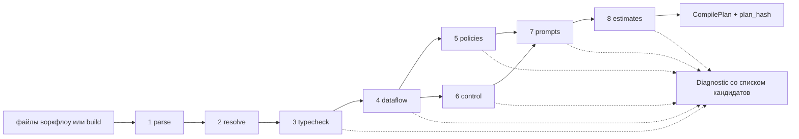
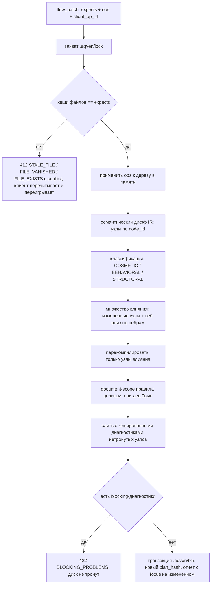

# 07. Компилятор

> Статус: draft
> Зависит от: [03. Язык ядра](03-core-language.md), [04. Формат IR](04-ir-schema.md), [08. Промты](08-prompts.md), [05. Система типов](05-type-system.md), [10. Рантайм](10-runtime.md), [13. Evals и гейты](13-evals-and-gates.md), [23. API локальной студии](23-studio-api.md), [ADR-0025](adr/0025-python-engine.md), [ADR-0026](adr/0026-yaml-spec-and-code-refs.md), [ADR-0027](adr/0027-dynamic-io-shapes.md), [ADR-0028](adr/0028-studio-api-contract.md), [ADR-0029](adr/0029-trust-and-quality-python.md)
> Источники: research/py-spec-as-code.md (§10–§13), research/py-quality-layer.md (§1.3, §1.7, §3, §8.5–§8.6), research/py-stack-runtime.md (§3, §5), research/studio-api-inventory.md (строка `@aqven/graph-algos`), research/structured-output.md, research/templating.md, research/determinism-export.md, research/graph-canvas.md (§5), research/00-verified-by-lead.md; спека §6.7–6.9, §7.3, §7.6, §8, §9, §18.1

## Зачем этот слой

Компилятор — единственное место, где ошибка автора (человека или Claude) превращается из «узнаем в проде»
в «не запустится». Он закрывает все строки каталога §8 с уровнем L1: непривязанные слоты, чтение из
невыполненной ветки, невычерпывающий `switch`, цикл без бюджета, схему, которую strict-профиль провайдера
не примет, переполнение окна, взрыв стоимости. Он же — источник кандидатов на исправление: диагностика без
готового `apply{tool,arguments}` считается багом компилятора, а не сообщением пользователю. Вызывают его
`aqven check` и `aqven build` ([ADR-0026](adr/0026-yaml-spec-and-code-refs.md) §10), валидатор `flow_patch`
до записи, хук `flow_check` после правки файла агентом и `aqven dev` на сохранение. Выход компилятора —
детерминированный план, который обходит исполнитель IR на DBOS ([ADR-0025](adr/0025-python-engine.md) §3) и из
которого берётся lineage в трассе.

## Решения

| Решение | Что берём | Версия | Лицензия | Почему |
|---|---|---|---|---|
| Чтение файлов описания | ruamel.yaml, строгий предпроход по событиям и токенам | 0.19.1 | MIT | Комментарии, якоря, теги, директивы и блочные скаляры ловятся до загрузки ([ADR-0026](adr/0026-yaml-spec-and-code-refs.md) §1) |
| Валидация файлов и IR на границе | pydantic, модели описания с `extra="forbid"` | 2.13.5 | MIT | Файл — экземпляр модели своего вида: закрытый набор ключей, все ошибки файла за раз ([ADR-0026](adr/0026-yaml-spec-and-code-refs.md) §1) |
| Доменные типы и нейтральная схема | pydantic, `model_json_schema()` сгенерированной модели | 2.13.5 | MIT | Вход для профилей схем ([ADR-0029](adr/0029-trust-and-quality-python.md) §6); слоя пост-обработки после Zod нет |
| Wire-схема под профиль | `json_schema_transformer` в `ModelProfile` из pydantic-ai-slim, фабрика `aqven_llm` | 2.43.0 | MIT | Профиль — свойство пары (схема × провайдер); импорт трансформеров провайдеров разрешён только `aqven_llm` ([ADR-0025](adr/0025-python-engine.md) §6); способ вызова на компиляции — открытый вопрос 17 |
| Резолв ссылок `module:function`, сверка сигнатур | `pkgutil.resolve_name`, `inspect`, `ast` из stdlib; `TypeAdapter` из pydantic | CPython 3.14 / 2.13.5 | PSF-2.0 / MIT | Схема функции строится из аннотаций, свой разбор не пишем ([ADR-0026](adr/0026-yaml-spec-and-code-refs.md) §5) |
| Тайпчек кода проекта | pyright, `typeCheckingMode = "strict"` по `code/` | 1.1.414 | MIT | Шаг `aqven check` после генерации моделей, вне `compile_flow` (§1) |
| Парс и анализ шаблонов | python-liquid | 2.3.1 | MIT | `analyze()`, `global_variable_paths()` без рендера, `ContentNode`, свой тег через `Environment.add_tag`; свой парсер не пишем ([ADR-0029](adr/0029-trust-and-quality-python.md) §8) |
| Токенизация для оценок | не выбрана | — | — | gpt-tokenizer снят вместе с TS-движком; кандидат tiktoken 0.14.0 (MIT) скачивает BPE-файл из сети — [ADR-0029](adr/0029-trust-and-quality-python.md) ОВ 4, открытый вопрос 14 |
| Топосорт, детект цикла, «не создаст ли ребро цикл» | не выбрано | — | — | graphology и graphology-dag (npm) сняты с TS-движком; кандидаты — открытый вопрос 8 |
| Обход достижимости | своё: BFS и битсеты на `int` | ~25 строк | — | Массовые запросы — битсеты, единичные — BFS |
| Доминаторы | своё, Cooper–Harvey–Kennedy | ~40 строк | — | Ядро доверия; готовый пакет на Python не проверялся (открытый вопрос 8) |
| Критический путь | своё поверх топосорта | ~25 строк | — | Взвешенный длиннейший путь по DAG (§5.4) |
| Канонизация плана и спеки | rfc8785 | 0.1.4 | Apache-2.0 | Байтовая воспроизводимость `spec_hash`/`plan_hash`; 0 расхождений с `canonicalize@5.0.0` (research/py-quality-layer.md §3.1) |
| Хеши | `hashlib` sha256 из stdlib, доменная сепарация, префикс `sha256-` | CPython 3.14 | PSF-2.0 | Единый формат с `spec_hash` ([04](04-ir-schema.md) §4.2) и ключом кассеты ([ADR-0029](adr/0029-trust-and-quality-python.md) §1) |
| Семантический дифф для инкрементальности | не выбран | — | — | jsondiffpatch (npm) снят; узлы сопоставляются по `node_id`, а не по позиции (§9.2) — открытый вопрос 15 |
| Формат записи | `flow_patch`: `expects[{path, file_hash}]` + `ops` + `client_op_id` | — | — | Контракт записи [23](23-studio-api.md) §12.1 и [ADR-0028](adr/0028-studio-api-contract.md) §6; RFC 6902 в контракте нет |
| Доверие к компилятору | свой доменный IR-мутатор | — | — | Мутационное тестирование кода мутирует наш код, а не данные; kill-критерий §18.1 требует второго ([ADR-0014](adr/0014-ir-mutation-testing.md)) |
| Гигиена тест-сьюта компилятора | инструмент мутации Python-кода не выбран | — | — | Кандидаты mutmut 3.8.0 (BSD-3-Clause) и cosmic-ray 8.7.0 (MIT) на 3.14 не запускались — [ADR-0025](adr/0025-python-engine.md) ОВ 12 |
| Property-based инварианты | не выбрана | — | — | fast-check (npm) снят; библиотека для pytest 9.1.1 — открытый вопрос 16 |

Компилятор — чистая функция `compile_flow(spec, registries) -> CompileResult`. Никаких обращений к сети:
токенизация локальная, схемы провайдеров описаны профилями, цены — из закреплённой версии каталога моделей.
Импорт модулей проекта для ссылок `run` и промтов уровня 3 идёт через порт `CodeResolver` (§1). В тестах
компилятора и в прогоне мутатора `pydantic_ai.models.ALLOW_MODEL_REQUESTS = False` ([ADR-0025](adr/0025-python-engine.md),
обязательство 6). Это условие воспроизводимости `plan_hash` и условие работы мутационного прогона в CI.

## 1. Этапы компиляции

Восемь этапов §9 реализованы как Chain of Responsibility: список объектов-этапов, каждый со своим входом,
выходом и набором привязанных правил. Этап ничего не знает о соседях — только о своём входном факте-типе.
Остановка выражена типом: останавливающий этап возвращает `StageOk | StageHalt`, накопительный — только
`StageOk`.

```python
from dataclasses import dataclass
from typing import Literal, Protocol

type StageId = Literal["parse", "resolve", "typecheck", "dataflow", "policies", "control", "prompts", "estimates"]


@dataclass(frozen=True, slots=True)
class StageOk[T]:
    value: T
    diagnostics: tuple[Diagnostic, ...]


@dataclass(frozen=True, slots=True)
class StageHalt:
    diagnostics: tuple[Diagnostic, ...]


class HaltingStage[InT, OutT](Protocol):
    def run(self, stage_input: InT, context: CompileContext) -> StageOk[OutT] | StageHalt: ...


class AccumulatingStage[InT, OutT](Protocol):
    def run(self, stage_input: InT, context: CompileContext) -> StageOk[OutT]: ...
```

| # | Этап | Вход | Выход | Halting |
|---|---|---|---|---|
| 1 | `parse` | Файлы воркфлоу (`flow.yaml`, `nodes/*.yaml`, типы, промты) или модели описания из `build()` билдера `flow.py`; `tenant_id` | IR нормальной формы (04 §1.3) с `NewType`-идентификаторами; `spec_hash` по 04 §4.2 | да |
| 2 | `resolve` | IR + снимок реестров | `ResolvedGraph`: каждая ссылка заменена на закреплённую версию (тип, view, профиль модели, агент, тул + хэш схемы, подворкфлоу, фрагмент промта); ссылки `run` и `prompt` уровня 3 резолвлены | да |
| 3 | `typecheck` | `ResolvedGraph` | `TypedGraph`: у каждой привязки известны тип источника, тип слота, кардинальность, результат унификации дженериков; сигнатуры `code` сверены, медиатипы сверены с профилем | нет |
| 4 | `dataflow` | `TypedGraph` | `DataflowFacts`: топопорядок, битсеты достижимости, дерево доминаторов, непривязанные и неиспользуемые слоты, классы происхождения и метки доверия/PII | нет |
| 5 | `policies` | `TypedGraph` + `DataflowFacts` | `PolicyFacts`: решения по видимости, доверию, PII, семействам моделей, scope памяти | нет |
| 6 | `control` | `TypedGraph` + `DataflowFacts` | `ControlFacts`: полнота `switch`, взаимоисключающие предикаты веток, лимиты циклов, наличие `join`, таймауты, достижимость | нет |
| 7 | `prompts` | `TypedGraph` + `PolicyFacts` + профили моделей | `CompiledPrompt[]` (массив сообщений с точками кэширования) и wire-схемы выхода под профили провайдеров | нет |
| 8 | `estimates` | Всё выше | `Estimates`: max-промт, число вызовов, стоимость, критический путь, ширина параллелизма | нет |

**Halting против накопления.** Этапы 1–2 фейл-фаст: без разобранного документа и разрешённых ссылок
дальнейшие проверки дают мусорные каскады. Этапы 3–8 накопительные — один вызов компилятора обязан
вернуть агенту все проблемы сразу, иначе цикл «исправил — перекомпилировал» растягивается на десятки
итераций. Каскады гасятся отравлением: узел, получивший `severity: "error"` на этапе 3, помечается
`poisoned` и на этапах 4–8 пропускается. Правило «одна причина — одна диагностика».

```python
@dataclass(frozen=True, slots=True)
class Compiler:
    parse: HaltingStage[FlowSource, IrDocument]
    resolve: HaltingStage[IrDocument, ResolvedGraph]

    def compile_flow(self, source: FlowSource, context: CompileContext) -> CompileResult:
        parsed = self.parse.run(source, context)
        if isinstance(parsed, StageHalt):
            return halted(parsed.diagnostics)
        resolved = self.resolve.run(parsed.value, context)
        if isinstance(resolved, StageHalt):
            return halted(parsed.diagnostics + resolved.diagnostics)
        return accumulate(resolved.value, parsed.diagnostics + resolved.diagnostics, context)
```

`accumulate` прогоняет этапы 3–8 (`AccumulatingStage`) и собирает план; `FlowSource`, `IrDocument`,
`ResolvedGraph`, `CompileResult`, `halted` — из пакета компилятора (имя пакета — ADR-0026 ОВ 1).

Сквозной контекст этапов — иммутабельный `CompileContext`: снимок реестров, профили моделей,
кэши (см. §9), сид для стабильной сортировки кандидатов, флаг `strictness` окружения, порт `CodeResolver`.
Резолв `pkgutil.resolve_name` импортирует модуль проекта — единственное место, где компиляция исполняет код
проекта; поэтому он стоит за портом (Port/Adapter), а в тестах компилятора и прогоне мутатора порт — подделка по
таблице ссылок. Принуждение чистоты модулей и билдера без изолята — ADR-0026 ОВ 5.

**Проверки сборки [ADR-0026](adr/0026-yaml-spec-and-code-refs.md) на этапах.** Конвейер `aqven check` (ADR-0026 §10)
раскладывается по тем же восьми этапам; pyright — единственная проверка вне `compile_flow`: он сверяет код проекта со
сгенерированными моделями, а модели генерируются из результата компиляции.

| Проверка | Этап | Механизм | Диагностика |
|---|---|---|---|
| Строгий YAML: комментарии, якоря, теги, директивы, блочные скаляры | 1 `parse` | предпроход ruamel.yaml 0.19.1 по событиям и токенам | код не назначен — открытый вопрос 19 |
| Ключи, `apiVersion`, `kind` и путь файла | 1 `parse` | модель описания вида, `extra="forbid"` | `E_UNKNOWN_KEY`, `E_API_VERSION`, `E_KIND_PATH_MISMATCH` (§3.8) |
| Билдер `flow.py` | 1 `parse` | `build()` один раз в изолированном чистом шаге → те же модели описания (ADR-0026 §8) | две сборки с разным `PYTHONHASHSEED` дают один IR (§8.3) |
| Ссылки `run` и `prompt` уровня 3 | 2 `resolve` | `pkgutil.resolve_name` за портом `CodeResolver` | `E_CODE_REF_UNRESOLVED` |
| Сигнатуры шагов `code`, docstring | 3 `typecheck` | `inspect.signature`, `TypeAdapter(fn).json_schema()`, `ast.get_docstring` | `E_CODE_SIGNATURE_MISMATCH`, `E_DOCSTRING` |
| Медиатипы против профиля роли | 3 `typecheck` | возможности профиля из каталога (ADR-0026 §6) | `E_MODALITY_UNSUPPORTED` |
| `on_timeout.default.value` узла `human` | 3 `typecheck` | модель типа `form` (ADR-0026 §13) | код не назначен — открытый вопрос 19 |
| Динамическая форма | 3 `typecheck`, 5 `policies` | `schema_from`, `limits`, `narrow` ([ADR-0027](adr/0027-dynamic-io-shapes.md)) | `R-D1..R-D6` на этапе 3, `R-D7` на этапе 5 — предложено (§3.9) |
| Промты уровня 2 | 7 `prompts` | python-liquid 2.3.1 `analyze()` и визитор | `R-T1..R-T13` (§3.2) |
| Типы кода проекта | после `compile_flow`, шаг `aqven check` | pyright 1.1.414 strict по `code/` против сгенерированных моделей | код не назначен — открытый вопрос 19 |



## 2. Три слоя правил

| Слой | Что проверяет | Где живут коды | Когда срабатывает |
|---|---|---|---|
| **Ядро** | Инварианты, верные для любой композиции | `R-<номер строки §8>` с уровнем L1, `R-T1..R-T13`, `R-C1..R-C8`, `R-L1..R-L4`, `R-O1..R-O7`; диагностики сборки `E_*` (§3.8); предложенные `R-D1..R-D7` (§3.9) | На каждом узле, привязке, шаблоне и переопределении |
| **Контракты компонентов** | `requires`/`ensures` конкретного компонента библиотеки | `R-J1..R-J6` у `judge_panel`, `R-L5..R-L6` у `verify_fix`, далее по компоненту | На каждом использовании компонента, **с эффективной конфигурацией**, а не с определением |
| **Типизация композиции** | Дженерики, типы компонентов-параметров, эффекты | `R-G1..R-G4` (префикс закреплён в `CONVENTIONS.md`, реестр — §3.7) | На этапе 3 при унификации типов |

**Ядро** — Registry правил: запись `RuleRegistry` с кортежем правил на каждый scope вместо лестницы условий.
Правило — объект, а не ветка в `if`: добавление правила не трогает движок (открыт для расширения, закрыт для
изменения). Scope — имя поля реестра, поэтому тип цели правила выводится без приведения типов; код правила
уникален во всём реестре, это проверяет тест.

```python
from collections.abc import Callable, Sequence
from dataclasses import dataclass


@dataclass(frozen=True, slots=True)
class Rule[TargetT]:
    code: RuleCode
    level: GuaranteeLevel
    stage: StageId
    docs: DocRef
    check: Callable[[TargetT, CompileFacts], Sequence[Diagnostic]]


@dataclass(frozen=True, slots=True)
class RuleRegistry:
    document: tuple[Rule[IrDocument], ...]
    node: tuple[Rule[TypedNode], ...]
    binding: tuple[Rule[Binding], ...]
    slot: tuple[Rule[Slot], ...]
    template: tuple[Rule[TemplateFacts], ...]
    component_use: tuple[Rule[ComponentUse], ...]
    override: tuple[Rule[Override], ...]
    edge: tuple[Rule[Edge], ...]
```

Движок — Visitor: один обход `TypedGraph`, на каждом объекте вызываются только правила своего scope,
отсортированные по коду для стабильного порядка диагностик. Правило не имеет доступа к другим правилам
и не умеет писать в IR — модели IR заморожены (`frozen=True`), правило только возвращает диагностики.

**Контракты компонентов.** Компонент библиотеки (`judge_panel`, `verify_fix`, `diverge`, `bounded_agent`)
объявляет `requires` (предусловия на входные типы, параметры и эффективную конфигурацию) и `ensures`
(постусловия на выход, которые компилятор вправе использовать как факты дальше по графу). Контракт —
это тот же `Rule` со scope `component_use`, но привязанный к идентификатору компонента и его хешу
([ADR-0022](adr/0022-hash-as-version.md)). Ключевой момент из §7.3: контракты перепроверяются **после**
применения всех шести уровней переопределений (R-O6), поэтому этап 3 вычисляет эффективную конфигурацию до
запуска контрактов.

**Типизация композиции.** Три отдельные вещи:

1. *Дженерики.* Компоненты параметризованы типами: `map<T, U>`, `select_best<T>`, `judge_panel<C>`.
   На использовании переменные типа связываются унификацией против типов привязанных источников.
   Несвязанная переменная типа или конфликт связывания — ошибка, а не вывод «любой тип».
2. *Компоненты-параметры.* Судья, верификатор, генератор передаются в компонент как значения типа
   `Component<In, Out, E>`. Проверка — контрвариантность по входу, ковариантность по выходу; эффект `E`
   компонента-параметра должен лежать в допустимом множестве, объявленном принимающим компонентом.
3. *Эффекты.* Решётка `pure < read < write < external`. Эффект композиции — супремум эффектов детей.
   Так проверяются «тул с побочным эффектом требует `gate`» (R-64) и «верификатор цикла детерминирован»
   (R-L5): детерминированность выражается как `effect ≤ read`.

Совместное применение слоёв: ядро даёт нижнюю границу качества любой композиции, контракты — верхнюю
границу свободы конкретного компонента, типизация — связность между ними.

## 3. Реестр правил

Колонка «Уровень» — уровень гарантии из §8 (L0–L4). Там, где стоит пара («L1/L2»), компилятор закрывает
статическую часть, а рантайм-страж — динамическую; в таблице описана именно статическая часть.
Колонка «Сообщение» — шаблон текста, плейсхолдеры `{node}`, `{slot}`, `{type}` подставляются движком.
Колонка «Кандидаты» — что компилятор обязан предложить; каждый кандидат едет с готовым
`apply{tool, arguments}` (§4). Диагностики сборки ADR-0026 — §3.8, предложенные правила динамической формы
ADR-0027 — §3.9.

### 3.1. Ядро: авторство, данные и контекст (§8.1–8.2)

| Код | Что проверяет | Уровень | Сообщение | Кандидаты |
|---|---|---|---|---|
| R-03 | Каждый узел, тул, параметр и архетип существует в реестре закреплённой версии; имена параметров совпадают со схемой | L1 | `Неизвестный {kind} «{name}». В реестре {registry}@{version} такого нет` | Ближайшие по расстоянию Левенштейна имена из реестра (top-3); `registry_propose` для нового элемента с аппрувом |
| R-05 | Анализ влияния: изменение узла, типа или фрагмента перечисляет все зависящие узлы; ни один затронутый узел не остался нескомпилированным | L1 | `Изменение {ref} затрагивает узлы: {nodes}. Перекомпиляция обязательна` | Перекомпилировать затронутое подмножество; открыть дифф влияния; закрепить старую версию ссылки |
| R-09 | Слот привязан к источнику совместимого типа: тип, идентичность enum и сущности, представление (view) | L1 | `Слот {node}.{slot}: ожидается {expected}, источник {source} даёт {actual}` | Выходы того же типа из доминирующих узлов (top-5); вставить узел-проекцию; расширить view источника |
| R-10 | Все обязательные слоты привязаны; архетип получил весь объявленный им контекст | L1 | `Слот {node}.{slot} обязателен и не привязан` | Совместимые по типу выходы доминирующих узлов; объявить `context_needs` с источником; пометить слот необязательным, если архетип это допускает |
| R-11 | Слотов сверх объявленных нет; привязанный, но не потребляемый шаблоном слот — ошибка | L0/L1 | `Слот {node}.{slot} привязан, но не используется ни в шаблоне, ни в теле узла` | Удалить привязку; пометить `unused: причина`; использовать слот в шаблоне |
| R-12 | Верхняя оценка размера промта узла ≤ окно профиля минус резерв на выход (см. §5.1) | L1/L2 | `Узел {node}: верхняя оценка промта {tokens} токенов при окне {window}; запас на выход {reserve}` | Сузить view источника; включить `chunk`/map-reduce; перейти на профиль с большим окном; задать стратегию сжатия |
| R-13 | У источника вида `data` объявлен TTL; компилятор проверяет наличие и формат, рантайм — истечение | L2 | `Источник {source} вида data не объявляет ttl` | Проставить `ttl` по умолчанию из реестра тулов; сменить вид источника на `static` с версией |
| R-14 | Кардинальность привязки: элемент против массива, `map`/`reduce` только явные | L1 | `Слот {node}.{slot} ожидает {expectedCard}, источник даёт {actualCard}` | Обернуть в `map`; вставить `reduce`/`select_best`; взять элемент явным индексом |
| R-15 | Читаемый узел доминирует читающий: `dominates(source, consumer)` в графе управления | L1 | `Узел {node} читает {source}, который выполняется не всегда: он лежит внутри ветки {branch}` | Перенести чтение под узел сведения ветки; привязаться к выходу `join`; объявить значение по умолчанию через политику |
| R-17 | Политики видимости: сосед-дивергент не виден дивергенту, метаданные кандидата (модель, ветка, метка) не видны судье | L1 | `Узел {node} видит {leak}, запрещённый политикой видимости {policy}` | Убрать поле из view; вставить проекцию-обезличивание; перевести панель в слепой режим (`blind_labels`) |
| R-18 | Поле с меткой `pii` не попадает в профиль провайдера вне allowlist и не попадает в трассируемые поля без маскирования | L1/L2 | `PII-поле {field} уходит в профиль {profile}, которого нет в allowlist` | Сменить профиль на разрешённый; замаскировать поле в view; вынести узел в self-hosted профиль |
| R-19 | Значение с меткой `untrusted` не влияет на ветвление напрямую: между ним и предикатом обязателен узел-экстрактор с enum-выходом | L1/L2 | `Предикат ветки {node} зависит от untrusted-значения {source} без экстрактора` | Вставить экстрактор с типизированным enum; пометить источник доверенным через политику с аппрувом |
| R-20 | Дата, часовой пояс и локаль приходят из `run.context` и объявлены обязательными слотами архетипа | L1 | `Архетип {archetype} требует {slot} из run.context; слот не объявлен` | Добавить слот из `run.context`; использовать значение по умолчанию окружения |
| R-C1 | У каждого решения (`switch`, `judge`, роутер) объявлены `context_needs`, и каждая привязана к источнику | L1 | `Решение {node} не объявляет потребность в контексте` или `Потребность {need} без источника` | Сгенерировать `context_needs` из входных слотов узла; привязать к существующему выходу |
| R-C2 | У источника указан вид (`static`/`data`/`knowledge`/`generated`/`human`/`run`), тип источника совпадает с типом потребности | L1 | `Потребность {need}: тип {expected}, источник {source} вида {kind} даёт {actual}` | Сменить источник; сменить тип потребности; вставить проекцию |
| R-C3 | Генеративный контекст проходит валидацию или верификацию до узла, принимающего на нём решение | L1 | `Решение {node} опирается на генеративный контекст {need} без валидации` | Вставить `verify`-узел; добавить `verify: [schema, completeness]`; привязать решение к выходу существующего валидатора |
| R-C4 | Источники `knowledge` возвращают фрагменты с ID источника; архетипы с опорой на вход требуют цитат | L1 | `Источник {need} вида knowledge не отдаёт source_id` / `Архетип {archetype} требует цитат` | Сменить тип на `Passage[]` с `source_id`; включить требование цитат в архетипе |
| R-C5 | У `data` задан TTL, у `static` — версия фрагмента | L1 | `Потребность {need}: у источника вида {kind} нет {missing}` | Проставить TTL по умолчанию; закрепить версию фрагмента |
| R-C6 | Граф зависимостей контекста ацикличен; цикл допустим только внутри `loop` | L1 | `Цикл в графе контекста: {cycle}` | Разорвать ребро; обернуть участок в `loop` с `max_iter` и бюджетом |
| R-C7 | Суммарный размер контекста узла ≤ окно профиля; стратегия сжатия задана явно, если оценка превышает порог | L1 | `Контекст узла {node}: {tokens} токенов при окне {window}, стратегия сжатия не задана` | Задать `compress: {strategy}`; сузить view; поднять профиль |
| R-C8 | Потребность без потребителя и потребитель без объявленной потребности — ошибки | L1 | `Потребность {need} не используется` / `Узел {node} читает {source} без объявленной потребности` | Удалить потребность; объявить потребность у потребителя; привязать к другому узлу |

### 3.2. Ядро: промты и шаблоны (§8.3, §7.6)

Механика обхода — визитор по узлам python-liquid 2.3.1: таблица правил по типу узла (`ContentNode`, `OutputNode`,
`IfNode`, `CaseNode`, `ForNode`, свой `MessageNode`), обход от `BoundTemplate.nodes` через `node.children(...)`
([ADR-0029](adr/0029-trust-and-quality-python.md) §8; детали разбора — в [08. Промты](08-prompts.md)).
Правила R-T применяются к промтам уровня 2 ([ADR-0026](adr/0026-yaml-spec-and-code-refs.md) §4). У уровня 1
`analyze()` пуст, входы, выходы и блок формата дописывает адаптер, поэтому R-T6 к нему не применяется; у уровня 3
компилятор видит только типы `in`/`out` и сигнатуру функции (R-T9 для него — ADR-0026 ОВ 7). Медиазначение в
выводе `{{ }}` — ошибка R-T1: оно доступно шаблону только в условии. Те же R-T1..R-T13 проверяют мутанты GEPA
до вызова модели задачи (`AdmissibleReflection`, ADR-0029 §11).

| Код | Что проверяет | Уровень | Сообщение | Кандидаты |
|---|---|---|---|---|
| R-24 | Каждый few-shot валидируется типом выхода (список `Example[In, Out]`); устаревшие примеры ловятся по хэшу версии типа | L1 | `Пример #{i} промта {prompt} не проходит схему {type}: {issue}` | Удалить пример; починить поле по ошибке валидации Pydantic (`loc`, `type`); перегенерировать примеры из датасета |
| R-25 | Скелет инструкции соблюдён (иерархия блоков), длина инструкции ≤ лимита профиля, нет запрещённых конструкций из lint-списка | L1 | `Промт {prompt}: {violation}` | Перенести блок в нужную секцию скелета; сократить до лимита; удалить запрещённую формулировку |
| R-26 | У изменённого промта обновлён snapshot отрисовки на фикстурах; расхождение хэша без обновления снапшота блокирует компиляцию в режиме гейта | L3 | `Промт {prompt} изменён, snapshot {hash} устарел` | Обновить snapshot; открыть дифф отрисовки; запустить golden-тесты узла |
| R-27 | Шаблон объявляет язык вывода, и он согласован с локалью из `run.context` | L1/L2 | `Промт {prompt} не объявляет lang` / `lang={a} расходится с локалью {b}` | Проставить `lang` из локали; добавить слот локали; включить валидатор языка на приёме |
| R-28 | Промт собран под каждый профиль, на котором узел может исполниться (основной + фолбэки); смена профиля без eval-гейта блокируется | L3 | `Промт {prompt} не собирается под профиль {profile}: {reason}` | Добавить вариант шаблона для профиля; убрать профиль из цепочки фолбэков; запустить eval-гейт |
| R-T1 | Плейсхолдер ссылается на объявленный слот; поле существует; тип совместим | L1 | `{{ {path} }} в промте {prompt}: слот {root} не объявлен` / `у типа {type} нет поля {field}` | Объявить слот; ближайшие имена полей view (top-3); сменить view на содержащий поле |
| R-T2 | Каждый объявленный слот использован в тексте или помечен `unused` с причиной | L1 | `Слот {slot} объявлен, но не встречается в теле шаблона` | Использовать слот; удалить слот; добавить `unused: причина` |
| R-T3 | Условия только по bool, optional и enum; сравнение с enum — только со значениями из реестра; белый список операторов | L1 | `Условие в {prompt}:{line}: {reason}` | Сравнить с существующим значением enum (top-3); заменить выражение на bool-поле; вынести вычисление в узел-предикат |
| R-T4 | `` полон по enum, `` отсутствует | L1 | `case по {enum} не покрывает значения: {missing}` | Добавить ветки для недостающих значений (заготовка текста); сузить тип enum в реестре |
| R-T5 | `` только по массивам; внутри тела поля резолвятся к типу элемента | L1 | `for по {path}: тип {type} не массив` | Обернуть источник в `map`; сменить путь на массивное поле (top-3) |
| R-T6 | `output_format` встречается ровно один раз; ручного описания формата и JSON-примеров в тексте нет | L1 | `output_format встречается {n} раз` / `в тексте {prompt}:{line} ручное описание формата` | Удалить лишнее вхождение; вставить `{{ output_format }}`; удалить ручной JSON-блок |
| R-T7 | Упомянутые в статическом тексте значения enum совпадают с реестром | L1 | `В тексте {prompt}:{line} значение «{word}», в реестре enum {enum} такого нет` | Заменить на значение из реестра (top-3); добавить значение в реестр через `registry_propose` |
| R-T8 | В статическом тексте нет данных-литералов: названий, цен, ID из справочников | L1 | `В тексте {prompt}:{line} литерал из справочника {registry}: «{literal}»` | Вынести в слот; вынести во фрагмент `static` с версией |
| R-T9 | Верхняя оценка отрисовки ≤ окно профиля (алгоритм — §5.1) | L1 | `Промт {prompt}: верхняя оценка {tokens} при окне {window}` | Сузить view; ограничить `maxItems` источника; поднять профиль; включить сжатие |
| R-T10 | Политики видимости соблюдены на уровне шаблона: судье не видны ветка и модель кандидата, дивергенту — соседи | L1 | `Шаблон {prompt} обращается к {path}, закрытому политикой {policy}` | Убрать обращение; использовать обезличенный view; включить `blind_labels` |
| R-T11 | Шаблон объявляет язык вывода полем `lang` в заголовке, а не фразой в тексте | L1 | `Промт {prompt} не объявляет lang` | Проставить `lang`; удалить фразу о языке из текста |
| R-T12 | В архетипах с опорой на вход нет инструкций «используй свои знания», «придумай, если данных нет» | L1 | `Промт {prompt}:{line}: стоп-фраза «{phrase}» запрещена для архетипа {archetype}` | Удалить фразу; сменить архетип на допускающий свободную генерацию |
| R-T13 | Внутри `MessageNode` с меткой `cache` нет `OutputNode` с системным слотом (`run.date`, `locale`, `tz`): иначе кэшируемый префикс перестаёт быть побайтово стабильным | L1 | `R-T13: системный слот {path} в сообщении {role} с меткой cache ломает стабильность префикса` | `remove` слота из кэшируемого сообщения и `insert` в первое сообщение `user`; снять метку `cache` с сообщения |

### 3.3. Ядро: структурированный вывод (§8.4)

Профиль схемы — свойство пары (IR-схема × провайдер), а не свойство IR (DECISIONS): `json_schema_transformer` в
`ModelProfile`, его ставит фабрика `aqven_llm` из записи каталога ([ADR-0029](adr/0029-trust-and-quality-python.md) §6).
Нейтральная схема — `model_json_schema()` сгенерированной модели; strict задаётся явно: `output_contract.mode:
"strict"` компилируется в `ToolOutput(M, strict=True)` или `NativeOutput(M, strict=True)`
([ADR-0027](adr/0027-dynamic-io-shapes.md) «Strict включается явно»). Трансформер профиля переносит несовместимые
ключи в `description`, поэтому границы держит только валидация Pydantic на приёме. Правила ниже проверяются
отдельно для каждого профиля из цепочки «основной + фолбэки».

| Код | Что проверяет | Уровень | Сообщение | Кандидаты |
|---|---|---|---|---|
| R-34 | `max_tokens` вызова ≥ верхней оценки размера выхода по типу плюс запас профиля | L1/L2 | `Узел {node}: оценка выхода {tokens}, max_tokens={limit}` | Поднять `max_tokens` до расчётного; сузить тип выхода (убрать поля, ограничить `maxItems`); разбить узел на два |
| R-35 | Поле обоснования стоит перед полем решения; порядок полей IR не сортируется | L1 | `В типе {type} поле {reason} стоит после {verdict}` | Переставить поля в реестре типов; исключить поле из выхода |
| R-36 | Глубина вложенности схемы ≤ 3 уровней (жёстче лимита OpenAI в 10 уровней) | L1 | `Схема {type}: глубина {depth} при лимите 3` | Вынести поддерево в отдельный тип и плоскую ссылку; свернуть уровень в массив пар |
| R-37 | Нейтральная схема совместима со strict-профилем: корень — `object`, а не union; все поля required (опциональность — `T?`, в модели `T \| None` без default); `additionalProperties: false` (`extra="forbid"`); без рекурсии; бюджет схемы не превышен (≤5000 свойств, ≤10 уровней, ≤120 000 символов имён и значений, ≤1000 enum-значений, ≤15 000 символов для enum >250 значений). `oneOf` дискриминированного union и несовместимые ключи переписывает трансформер профиля (ADR-0029 §6) | L1 | `Тип {type} несовместим с профилем {profile}: {violations}` | Объявить поле как `T?` вместо необязательного; развернуть union-корень в объект `{result: ...}`; оставить ограничение — трансформер перенесёт его в `description`, границу держит валидация Pydantic на приёме; сменить профиль на `permissive`/self-hosted |
| R-37a | Динамический allowed-set укладывается в пороги `DECISIONS.md`: ≤50 значений — `enum` в схеме короткими кодами; >50 — индексный выбор из пронумерованного списка; потолок enum по совместному действию лимитов OpenAI — около 416 значений UUID, выше него сужение множества до вызова обязательно. Клиент Pydantic AI размер набора не ограничивает (450 UUID доходят до провайдера), поэтому бюджет держат компилятор и проверка до вызова (ADR-0027, случай 1) | L1 | `Allowed-set слота {slot}: {n} значений, стратегия «{strategy}» недопустима` | Перейти на индексный выбор из пронумерованного списка; сузить множество фильтром до вызова; заменить UUID короткими кодами |

`R-37a` — подправило `R-37`, отдельный код нужен потому, что бюджет allowed-set считается по данным
прогона, а не по статике типа; в отчёте оно выводится вместе с `R-37`.

### 3.4. Ядро: управление потоком (§8.5)

| Код | Что проверяет | Уровень | Сообщение | Кандидаты |
|---|---|---|---|---|
| R-38 | У каждой дивергенции есть узел сведения с явной политикой (`join`); у веток `parallel` заданы явные ключи результата | L1 | `Параллель {node} не имеет узла сведения` / `Ветки {node} пишут в один ключ {key}` | Вставить `join` с политикой (`all`/`quorum(k)`/`any`/`first_success`); задать ключи веток |
| R-39 | У `map`/`foreach` объявлен `on_item_error`, у параллели — `on_branch_error`; политика деградации отражена в типе результата | L1/L2 | `У {node} не задана политика {policy}` | Проставить `fail_fast`; проставить `collect` с типом `Result<T, Issue>`; проставить `skip` с порогом |
| R-40 | У цикла заданы `max_iter` и бюджет; выбирается лучший вариант, а не последний | L1 | `Цикл {node}: не задан {missing}` / `select={last}, требуется best` | Проставить `max_iter` по умолчанию архетипа; задать бюджет из бюджета воркфлоу; `select: best` со скорером |
| R-41 | `switch` по enum полон; предикаты веток взаимоисключающие; все ветки возвращают один тип | L1 | `switch {node} не покрывает значения {missing}` / `предикаты веток {a} и {b} пересекаются` / `ветки возвращают {types}` | Добавить недостающие ветки; добавить `default`, если архетип допускает; сделать предикаты взаимоисключающими (готовая переписка условий); привести типы веток к общему |
| R-44 | Нет недостижимых узлов от входа; нет рёбер на несуществующие узлы; нет циклов вне `loop` | L1 | `Узел {node} недостижим от входа` / `Ребро {from}→{to}: узла {to} нет` / `Цикл: {cycle}` | Удалить узел; связать с достижимым предком; починить ссылку ребра (top-3 по имени); обернуть цикл в `loop` |
| R-45 | Подворкфлоу вызывается по закреплённой версии; смена версии перекомпилирует всех родителей, и их компиляция обязана быть зелёной | L1 | `Подворкфлоу {flow}@{version} изменилось: родители {parents} требуют перекомпиляции` / `Вызов {flow} без версии` | Закрепить версию; перекомпилировать родителей; откатить на прежнюю версию |
| R-46 | У веера объявлены `concurrency` и размер батча; `maxItems` источника известен и укладывается в лимит фан-аута | L1/L2 | `Веер {node}: {items} элементов при лимите {limit}, concurrency не задан` | Проставить `concurrency` из профиля; включить батчи; ограничить `maxItems` источника |
| R-47 | Профиль модели, на который ссылается узел, объявляет лимитер (RPM, TPM, concurrency); ширина параллелизма плана не превышает лимит | L2 | `Профиль {profile} без лимитера` / `ширина {width} превышает concurrency={limit}` | Проставить лимиты из каталога моделей; снизить `concurrency` узла; распределить нагрузку по двум профилям |
| R-48 | На каждом узле задан таймаут (собственный или унаследованный от архетипа), у узла `human` — `timeout_seconds` и `on_timeout` (ADR-0026 §13); сумма таймаутов критического пути ≤ таймаута воркфлоу | L1/L2 | `У узла {node} нет таймаута` / `сумма таймаутов пути {sum} > таймаута воркфлоу {limit}` | Проставить таймаут архетипа; поднять таймаут воркфлоу; сократить критический путь |
| R-49 | Тул класса `write`/`external` объявляет шаблон ключа идемпотентности, и все поля шаблона доступны в точке вызова: прерванный падением шаг DBOS выполняется заново целиком (ADR-0025 §3) | L1/L2 | `Тул {tool} с эффектом {effect} без ключа идемпотентности` / `поле {field} ключа недоступно в {node}` | Сгенерировать шаблон ключа из входных слотов; привязать недостающее поле; снять ретраи с узла |
| R-52 | Неявных значений по умолчанию нет: у каждого фолбэка объявлен статус `degraded`, каждое значение по умолчанию объявлено явно и типизировано | L1/L2 | `Фолбэк {node}→{fallback} не помечает результат degraded` / `неявный default у {slot}` | Проставить `degraded: true`; объявить значение по умолчанию явно; перевести узел на ошибку вместо дефолта |
| R-L1 | У `loop` заданы `max_iter` и бюджет | L1 | `Цикл {node}: не заданы {missing}` | Проставить `max_iter`; задать `budget.usd` из бюджета воркфлоу |
| R-L2 | Выход верификатора типизирован и привязан к слоту обратной связи генератора | L1 | `Выход верификатора {node} не привязан к слоту обратной связи {slot}` | Привязать `verifier.out` к слоту; объявить тип `Issue[]`; добавить слот обратной связи в шаблон генератора |
| R-L3 | Условие остановки — типизированный предикат, а не строка | L1 | `stop_when у {node} задан строкой` | Заменить на типизированный предикат по полю выхода; использовать предикат «`issues` пуст» по полю типа |
| R-L4 | Объём истории, переносимой между итерациями, ограничен явно (`carry`) | L1 | `Цикл {node}: carry не ограничен` | Проставить `carry: {history: last_k}`; сводить историю в резюме; отключить перенос |
| R-L5 | LLM-верификатор — из другого семейства, чем генератор; при наличии кодовой проверки предпочитается детерминированный верификатор (`effect ≤ read`) | L1 | `Верификатор и генератор из одного семейства {family}` | Сменить роль верификатора на другое семейство (top-3 из каталога); заменить на кодовый верификатор |
| R-L6 | Выбирается лучший вариант, включена защита от стагнации, повторяющиеся кандидаты детектируются по хэшу | L1 | `Цикл {node}: select={mode}, stagnation не задан` | `select: best` + скорер; `stagnation: {window, min_delta}`; включить дедупликацию по хэшу кандидата |

### 3.5. Ядро: модели, агенты, переопределения (§8.6–8.8, §7.3)

| Код | Что проверяет | Уровень | Сообщение | Кандидаты |
|---|---|---|---|---|
| R-55 | Требования узла ⊆ возможностей профиля: strict-вывод, окно против оценки промта, тулы, мультимодальность, длина выхода | L1 | `Узел {node} требует {caps}, профиль {profile} не умеет {missing}` | Профили с нужными возможностями (top-3 из каталога); снять требование (например, перейти на `permissive` с валидацией на приёме); разбить узел |
| R-56 | Параметры вызова соответствуют политике архетипа (экстрактор — низкая температура, дивергенты — различающиеся источники разнообразия) | L1/L4 | `Архетип {archetype}: параметр {param}={value} вне политики {range}` / `ветки diverge неразличимы` | Привести параметр к политике; задать `vary` с различающимися параметрами или ролями; сменить архетип |
| R-57 | Верхняя оценка стоимости прогона ≤ объявленного бюджета воркфлоу (алгоритм — §5.3) | L1/L2 | `Верхняя оценка стоимости {usd} при бюджете {budget}; вклад узлов: {top}` | Снизить `max_iter`/`n` у топ-вкладчиков; сменить профиль на дешёвый; поднять бюджет явным решением |
| R-58 | Критический путь посчитан; в отчёт выдаются узлы пути, не связанные зависимостями, — кандидаты на распараллеливание | L1 | `Критический путь {total} мс: {path}. Узлы {a} и {b} независимы и могут идти параллельно` | Обернуть независимые узлы в `parallel`; поднять `concurrency` у веера; вынести узел за пределы цикла |
| R-62 | У памяти агента объявлен scope (`run`/`user`/`tenant`); scope не шире разрешённого политикой узла | L1 | `Агент {agent}: scope памяти не задан` / `scope={scope} шире разрешённого {max}` | Проставить `scope: run`; сузить scope; запросить аппрув расширения |
| R-63 | Граф делегирования саб-агентов ацикличен либо ограничен объявленной глубиной | L1 | `Цикл делегирования: {cycle}` / `глубина делегирования {depth} > лимита {limit}` | Разорвать делегирование; проставить `max_depth`; заменить делегирование прямым вызовом |
| R-64 | Тул с эффектом `write`/`external` защищён `gate` либо явной политикой эффекта | L1 | `Тул {tool} с эффектом {effect} вызывается из {node} без gate` | Вставить узел `gate` перед вызовом; объявить политику эффекта с аппрувом; заменить на read-тул |
| R-74 | Отложенная выборка датасета недоступна оптимизатору промтов: пересечение обучающей и отложенной выборок пусто, оптимизатор не имеет ссылки на holdout | L1/L3 | `Оптимизатор {opt} имеет доступ к holdout {dataset}` / `пересечение выборок: {n} элементов` | Перегенерировать split с фиксированным seed; убрать holdout из области видимости оптимизатора |
| R-80 | В спеке, промтах и конфигах нет значений секретов — только ссылки на хранилище | L1 | `{path}: похоже на секрет («{pattern}»), допустима только ссылка на хранилище` | Заменить на ссылку `secret://{name}`; вынести в переменные окружения; удалить значение и отозвать ключ |
| R-82 | Хэш схемы MCP-тула совпадает с закреплённым в спеке | L1 | `Схема тула {tool} изменилась: закреплено {pinned}, сервер отдаёт {actual}. Дифф: {diff}` | Принять новую схему с обновлением привязок; закрепить прежнюю версию сервера; отключить тул |
| R-85 | После применения всех уровней переопределений эффективная конфигурация по-прежнему проходит R-55, R-O3, R-O4 и контракты компонента | L1 | `Переопределение в {origin} ломает {rule} у {node}: {reason}` | Откатить конкретное поле переопределения (указывается origin); подобрать совместимый профиль; снять требование узла |
| R-O1 | Переопределение соответствует схеме, все поля существуют | L1 | `Переопределение {path}: поля {field} нет в схеме {schema}` | Ближайшие имена полей (top-3); удалить поле |
| R-O2 | Поля из `locked` не переопределяются | L1 | `Поле {field} заблокировано агентом {agent} (locked)` | Удалить переопределение; снять поле из `locked` в определении агента (требует аппрува) |
| R-O3 | После переопределения модель умеет всё, что требует вызов: strict JSON, окно против оценки промта, тулы | L1 | `После переопределения профиль {profile} не умеет {missing}` | Вернуть исходный профиль; выбрать профиль с нужными возможностями; снять требование |
| R-O4 | Тулы, на которые ссылаются шаблон и контракты компонента, остаются доступны после `remove`/`replace` | L1 | `Переопределение убирает тул {tool}, который требуется {refs}` | Вернуть тул в список; убрать ссылку из шаблона; заменить тул совместимым |
| R-O5 | Scope памяти не расширяется (`run → user → tenant`) без политики аппрува | L1 | `Расширение scope памяти {from}→{to} без аппрува` | Оставить прежний scope; приложить аппрув политики |
| R-O6 | Контракты компонентов перепроверены с эффективной конфигурацией (в частности R-J2, R-L5) | L1 | `После переопределения нарушен контракт {contract} компонента {component}` | Откатить поле переопределения; сменить роль модели; сменить компонент |
| R-O7 | Переопределение прогона меняет только модель, параметры и лимиты; бюджеты — только в сторону ужесточения | L1 | `Переопределение прогона меняет {field}, что запрещено` / `бюджет ослаблен: {from}→{to}` | Убрать поле из переопределения прогона; ужесточить бюджет вместо ослабления; изменить спеку версией |

### 3.6. Контракты компонента `judge_panel` (§6.8)

| Код | Что проверяет | Уровень | Сообщение | Кандидаты |
|---|---|---|---|---|
| R-J1 | Рубрика типизирована: критерии, веса, шкалы, описания уровней; сумма весов равна 1 | L1 | `Рубрика {panel}: {issue}` | Добавить описания уровней; нормировать веса; взять рубрику-шаблон из библиотеки |
| R-J2 | Семейство модели судьи отличается от семейства генератора; в панели минимум два семейства | L1 | `Судья {judge} из семейства {family}, совпадающего с генератором {gen}` / `в панели одно семейство` | Роли судей из других семейств (top-3 из каталога); добавить третьего судью другого семейства |
| R-J3 | В типе вердикта поле обоснования стоит перед оценкой | L1 | `Тип {type}: поле {score} стоит перед {reason}` | Переставить поля в реестре типов |
| R-J4 | Для `pairwise` включены перестановка позиций и слепые метки кандидатов | L1 | `Панель {panel} в режиме pairwise без {missing}` | Включить `swap_positions`; включить `blind_labels`; включить `shuffle` |
| R-J5 | Задана политика разногласий: тай-брейк или эскалация, с порогом метрики | L1 | `Панель {panel}: disagreement без {missing}` | Задать `on_exceed: tie_break(judge_strong)`; задать эскалацию на `human`; задать порог `spread` |
| R-J6 | Судья участвует в гейтинге выпуска только после калибровки с согласием не ниже порога (weighted kappa ≥ 0.7, Krippendorff alpha ≥ 0.8) | L1 | `Панель {panel} гейтит выпуск, калибровка отсутствует или ниже порога ({value} < {threshold})` | Запустить калибровку на датасете разметки; снять панель с гейтинга (оставить наблюдательной); поднять порог согласия |

### 3.7. Типизация композиции: дженерики, компоненты-параметры, эффекты

| Код | Что проверяет | Уровень | Сообщение | Кандидаты |
|---|---|---|---|---|
| R-G1 | Все переменные типа компонента связаны унификацией; конфликтов связывания нет | L1 | `Компонент {component}: переменная {T} связана и с {a}, и с {b}` | Привести источники к одному типу; вставить проекцию; параметризовать компонент явно |
| R-G2 | Компонент-параметр соответствует объявленной сигнатуре: контрвариантность по входу, ковариантность по выходу | L1 | `Компонент-параметр {arg} имеет тип {actual}, ожидается {expected}` | Обернуть в адаптер; сменить компонент; расширить объявленную сигнатуру |
| R-G3 | Эффект композиции ⊆ допустимого множества принимающего компонента | L1 | `Эффект {effect} не допускается в позиции {slot} компонента {component}` | Заменить на компонент с меньшим эффектом; вынести эффект наружу под `gate` |
| R-G4 | Ограничения переменной типа (границы дженерика) выполнены на использовании | L1 | `Тип {actual} не удовлетворяет границе {bound}` | Типы, удовлетворяющие границе (top-3); ослабить границу в объявлении компонента |

Префикс `R-G*` закреплён в `CONVENTIONS.md` наравне с `R-T*`, `R-C*`, `R-L*`, `R-O*` и `R-J*`; в каталоге
спеки §9 слой назван, но кодов не имеет, поэтому нормативный источник для `R-G1..R-G4` — эта таблица.

### 3.8. Диагностики сборки ([ADR-0026](adr/0026-yaml-spec-and-code-refs.md))

Коды заданы ADR-0026 §1, §5, §6. Уровень гарантии, текст и кандидаты — предложение этого документа до решения
по ADR-0026 ОВ 14 (открытый вопрос 19). Кандидаты, которые правят код проекта, — эскалации автору: `flow_patch`
правит YAML, а не `.py`.

| Код | Что проверяет | Этап | Уровень | Сообщение | Кандидаты |
|---|---|---|---|---|---|
| `E_UNKNOWN_KEY` | Ключ файла вне модели описания вида (`extra_forbidden`); все ошибки файла за раз | `parse` | L1 | `{file}: ключ «{key}» не входит в {kind} ({loc})` | Ближайшие ключи модели (top-3); удалить ключ |
| `E_API_VERSION` | `apiVersion` входит в множество версий формата, читаемых движком | `parse` | L1 | `{file}: apiVersion «{version}» не читается; читаемые: {served}` | Заменить на версию хранения `{storage}` и перепроверить ключи; эскалация «обновить движок до версии, читающей формат» |
| `E_KIND_PATH_MISMATCH` | `kind` файла совпадает с видом по пути (таблица ADR-0026 §1) | `parse` | L1 | `{file}: kind «{kind}», по пути ожидается «{expected}»` | Исправить `kind`; перенести файл по пути вида через `flow_patch` с переименованием |
| `E_CODE_REF_UNRESOLVED` | Ссылка `run` или `prompt` уровня 3 (`pkg.mod:function`) резолвится | `resolve` | L1 | `Узел {node}: ссылка «{ref}» не найдена: {reason}` | Ближайшие имена функций модуля (top-3); эскалация «создать функцию с сигнатурой из `in`/`out`» |
| `E_CODE_SIGNATURE_MISMATCH` | Имена параметров = имена `in`; схема параметров и возврата (`TypeAdapter`, без `title`) совместима с `in`/`out` | `typecheck` | L1 | `Узел {node}: сигнатура {ref} расходится с in/out: {schema_diff}` | Привести типы `in`/`out` к схеме функции через `flow_patch`; эскалация «поправить аннотации функции»; правило совместимости — открытый вопрос 25 |
| `E_MODALITY_UNSUPPORTED` | Медиатип `in`/`out` узла `llm` поддержан профилем роли; `Audio` и `Video` на выходе `llm` не компилируются никогда | `typecheck` | L1 | `Узел {node}: {media} на {direction} не поддерживается профилем {profile}` | Профили роли с нужной модальностью (top-3 из каталога); вынести генерацию в шаг `tool` или `code`; снять медиавход |
| `E_DOCSTRING` | У функции шага `code`, промта уровня 3 и `Signature` билдера нет docstring (`ast.get_docstring`) | `typecheck` | L1 | `{ref}: docstring запрещён — инструкция живёт в .prompt.md` | Эскалация «удалить docstring»; перенести текст в `.prompt.md` узла |

### 3.9. Динамическая форма ([ADR-0027](adr/0027-dynamic-io-shapes.md)): предложено, не утверждено

Коды `R-D1..R-D7` предложены ADR-0027 ОВ 1 и в каталог не приняты: до решения они не входят в CONVENTIONS и в
гейт мутатора (открытый вопрос 20). Формулировки — из ADR-0027; уровень, текст и кандидаты — предложение.

| Код | Что проверяет | Уровень | Сообщение | Кандидаты |
|---|---|---|---|---|
| R-D1 (предложено) | Непрозрачное значение `Dynamic` не привязано к типизированному слоту, проекции, `switch` и не читается по полю в шаблоне без `narrow` | L1 | `Узел {node} читает {path} у непрозрачного значения {source} без narrow` | Вставить `narrow` к типу `{type}` (типы реестра, совместимые с `FieldSpec[]`, top-3); передать значение шагу `code` со входом `Dynamic`; привязать слот шаблона целиком |
| R-D2 (предложено) | У `Dynamic` есть `schema_from` и все ключи `limits` (`max_fields`, `max_depth`, `max_text_length`, `max_items`); `max_depth` ≤ 3 | L1 | `Поле {slot} типа Dynamic: нет {missing}` / `max_depth={depth} > 3` | Проставить недостающие ключи `limits`; снизить `max_depth` до 3 (R-36) |
| R-D3 (предложено) | Тип источника `schema_from` — `FieldSpec[]` с `maxItems` ≤ `limits.max_fields` | L1 | `schema_from {source}: тип {actual}, ожидается FieldSpec[] с maxItems ≤ {max_fields}` | Привязать к выходу типа `FieldSpec[]`; проставить `maxItems` источника; поднять `limits.max_fields` |
| R-D4 (предложено) | Худший случай по `limits` укладывается в бюджет схемы профиля (ADR-0004), R-12 и R-34 | L1 | `Поле {slot}: худший случай limits превышает {budget} профиля {profile}` | Снизить `limits`; сменить профиль; перейти к меньшему номеру случая ADR-0027 |
| R-D5 (предложено) | `output_contract.mode: "strict"` стоит только на модели, профиль которой поддерживает strict | L1 | `Узел {node}: mode strict, профиль {profile} strict не поддерживает` | Профили роли со strict (top-3 из каталога); `mode: "json"` с валидацией на приёме |
| R-D6 (предложено, warning) | Лишняя динамика: `schema_from` из константы или конфига проекта без данных прогона; `Dynamic` с плоскими однотипными скалярами | L1 | `Поле {slot}: динамика не нужна — {reason}` | Заменить на статический тип (случаи 1–2); развернуть в `AttributeValue[]` (случай 3) |
| R-D7 (предложено) | Источник `allowed_sets.from` или `schema_from` с меткой `pii` не уходит в схему вызова провайдера вне allowlist (расширение R-18 и R-S12 из [19](19-security-and-policies.md)) | L1 | `PII-источник {source} уходит в схему вызова профиля {profile} вне allowlist` | Коды вместо значений; сменить профиль на разрешённый; маскирующая проекция источника |

## 4. Формат ошибки компилятора

Схема §9 — минимум; к нему добавлены поля, без которых агент не может применить исправление одним
вызовом, а Studio — показать место ошибки. Диагностика — модель Pydantic: те же модели уходят в `problems[]`
REST и MCP без второго описания ([ADR-0028](adr/0028-studio-api-contract.md) §2). `Diagnostic` —
дискриминированный union по `severity`.

```python
from typing import Annotated, Literal

from pydantic import BaseModel, ConfigDict, Field

FROZEN = ConfigDict(frozen=True, extra="forbid")


class SourceLoc(BaseModel):
    model_config = FROZEN
    file: ProjectPath | None
    path: JsonPointer
    line: int | None
    column: int | None


class CandidateApply(BaseModel):
    model_config = FROZEN
    tool: McpToolName
    arguments: JsonObject


class Candidate(BaseModel):
    model_config = FROZEN
    label: str
    apply: CandidateApply
    confidence: Annotated[float, Field(ge=0, le=1)]
    rationale: str


class DiagnosticBody(BaseModel):
    model_config = FROZEN
    rule: RuleCode
    node: NodeId | None
    slot: SlotName | None
    loc: SourceLoc
    message: str
    docs: DocRef
    spec_hash: Sha256


class ErrorDiagnostic(DiagnosticBody):
    severity: Literal["error"]
    candidates: Annotated[tuple[Candidate, ...], Field(min_length=1)]


class AdvisoryDiagnostic(DiagnosticBody):
    severity: Literal["warning", "info"]
    candidates: tuple[Candidate, ...]


type Diagnostic = Annotated[ErrorDiagnostic | AdvisoryDiagnostic, Field(discriminator="severity")]
```

`ProjectPath`, `JsonPointer`, `McpToolName`, `RuleCode`, `NodeId`, `SlotName`, `DocRef`, `Sha256` —
`typing.NewType` над `str`; `JsonObject` — `dict[str, JsonValue]`.

| Поле | Обязательность | Смысл |
|---|---|---|
| `rule` | всегда | Код из §3. Один код — одна причина; каскады не порождают новых диагностик |
| `severity` | всегда | `error` блокирует план, `warning` попадает в отчёт и в гейт, `info` — подсказка (например, кандидаты на распараллеливание от R-58) |
| `node` | `None` только для document-scope правил | Идентификатор узла IR, он же `node_id` адреса исполнения ([23](23-studio-api.md) §6.2) и атрибут `aqven.node_id` спана узла |
| `slot` | `None`, если правило не про слот | Имя слота или порта |
| `loc.file` | для диагностик, привязанных к файлу | Путь файла проекта (`flows/<flow_id>/nodes/<node_id>.yaml`, промт, `code/*.py`) — тот же, что в `expects[].path` исправляющего `flow_patch` |
| `loc.path` | всегда | JSON Pointer в IR — точка применения исправления |
| `loc.line/column` | для правил шаблонов; для YAML — открытый вопрос 22 | В шаблоне — из `Token.start_index` и `Variable.span.index` python-liquid, строку и колонку считает наш код (ADR-0029 §8) |
| `message` | всегда | Готовый русский текст без кодов внутри; шаблон из §3 |
| `candidates` | ≥1 при `severity: "error"` | Кандидаты отсортированы по `confidence` убыванием, при равенстве — лексикографически по `label`, чтобы отчёт был детерминированным |
| `docs` | всегда | Ссылка на раздел документации правила — `docs://rules/R-41` |
| `spec_hash` | всегда | Хэш спеки, на которой получена диагностика; устаревшая диагностика отбрасывается клиентом |

**Правило «ошибка без кандидатов — баг компилятора»** проведено тремя способами, чтобы его нельзя было
обойти по невнимательности:

1. *Типом.* Ошибочную диагностику строит только фабрика, у которой первый кандидат — обязательный позиционный
   параметр: вызов без кандидата pyright strict отвергает. Pydantic держит ту же границу при разборе:
   `min_length=1` даёт `too_short` и `minItems: 1` в JSON Schema. Кортеж `tuple[Candidate, *tuple[Candidate, ...]]`
   в поле модели не годится: Pydantic 2.13.5 не строит для него схему. Все три факта — проба при чистке этого
   документа (CPython 3.14.7, pydantic 2.13.5, pyright 1.1.414 strict), в research не записана.

```python
def candidate_rank(candidate: Candidate) -> tuple[float, str]:
    return -candidate.confidence, candidate.label


def emit_error(finding: Finding, context: EmitContext, first: Candidate, *rest: Candidate) -> ErrorDiagnostic:
    return ErrorDiagnostic(
        rule=finding.rule,
        node=finding.node,
        slot=finding.slot,
        loc=finding.loc,
        message=finding.message,
        docs=context.docs_for(finding.rule),
        spec_hash=context.spec_hash,
        severity="error",
        candidates=tuple(sorted((first, *rest), key=candidate_rank)),
    )
```

2. *Единой фабрикой.* Диагностики создаются только через `emit_error` и `emit_advisory` — Factory, единственная
   точка, где проставляются `docs`, `spec_hash` и сортировка кандидатов. Прямое создание `ErrorDiagnostic` и
   `AdvisoryDiagnostic` в пакете правил запрещено ruff TID251 во вложенном `ruff.toml` пакета: тот же механизм,
   что запрет `pydantic_ai.StructuredDict` ([ADR-0027](adr/0027-dynamic-io-shapes.md)), ловит и импорт класса, и
   обращение через модуль. Вложенная таблица `banned-api` заменяет корневую, поэтому повторяет общие запреты
   ([ADR-0025](adr/0025-python-engine.md) §6).
3. *Прогоном мутанта.* Раннер мутатора (§8) считает мутанта **выжившим**, если он пойман правилом с
   пустым `candidates`, даже когда компиляция формально упала.

Если правило физически не может предложить исправление (например, не нашлось ни одного совместимого
источника), оно обязано выдать кандидата-эскалацию: «объявить недостающий узел/тип через
`registry_propose`» или «открыть вопрос к автору». Пустой список не является допустимым значением ни в
одном сценарии.

**Отчёт компилятора.** В ответе записи (`flow_patch`) — `Envelope` MCP-контракта (DECISIONS «MCP-контракт»): `ok`,
`op`, `version{files[{path, file_hash}], dirty, actor, client_op_id}`, `focus`, `problems[]` (те же `Diagnostic`),
`candidates[]` (кандидаты верхнего уровня, собранные из диагностик по убыванию `confidence`), `next[]`, `refs[]`,
`ui_url`, `truncated`. Чтение — `GET /api/flows/{flow_id}/diagnostics` и `POST /api/flows/{flow_id}/compile`
([23](23-studio-api.md) §4.1), тул `flow_compile`. Ограничение размера — `truncated` с сохранением полного отчёта по
`ui_url`; порядок урезания: сначала `info`, затем `warning`, `error` не урезаются никогда. Расхождение полей
`Diagnostic` с `Problem` и `Candidate` из [14](14-mcp-contract.md) §3.1 — открытый вопрос 23.

## 5. Статические оценки

Все пять оценок — один обход плана. Каждая оценка реализована как Strategy с интерфейсом алгебры над
структурой плана; обход `fold_plan` вызывает все стратегии за один проход, поэтому добавление шестой
оценки не трогает обход.

```python
from collections.abc import Sequence
from typing import Protocol


class Estimator[T](Protocol):
    @property
    def estimate_id(self) -> EstimateId: ...

    def leaf(self, step: PlanStep, facts: CompileFacts) -> T: ...

    def seq(self, parts: Sequence[T]) -> T: ...

    def par(self, parts: Sequence[T]) -> T: ...

    def choice(self, parts: Sequence[T]) -> T: ...

    def repeat(self, body: T, times: int) -> T: ...
```

| Оценка | `seq` | `par` | `choice` | `repeat` |
|---|---|---|---|---|
| Размер промта | max | max | max | max |
| Число вызовов | сумма | сумма | max | body × times |
| Стоимость | сумма | сумма | max | body × times |
| Критический путь | сумма | max | max | body × times |
| Ширина параллелизма | max | сумма | max | body |

`choice` — взаимоисключающие ветки `switch`; `par` — `parallel`, `race`, `diverge`, панель судей;
`repeat` — `loop` с `times = max_iter` и `map` с `times = maxItems`.

### 5.1. Максимальный размер промта (R-12, R-T9, R-C7)

Считается по дереву узлов шаблона, не по отрисовке: отрисовать все комбинации данных невозможно.

```
max_tokens(ContentNode) = tokenize(text)                        кэшируется по хешу текста
max_tokens(OutputNode)  = max_tokens(type(path))
max_tokens(IfNode)      = max(ветви ∪ {default})
max_tokens(CaseNode)    = max(блоки when)
max_tokens(ForNode)     = maxItems(array) × max_tokens(block)
max_tokens(include)     = max_tokens(fragment@version)
max_tokens(type)        = enum     → самое длинное значение
                        | Text     → maxLength / средняя длина токена
                        | view(E)  → сумма max_tokens полей view + разметка
                        | T[]      → maxItems × max_tokens(T)
                        | T?       → max_tokens(T)
                        | Dynamic  → худший случай по limits (R-D4, предложено)
```

Уровень 1: оценивается текст, который собирает адаптер (входы с описаниями, выходы, блок формата вывода,
[ADR-0020](adr/0020-llm-function-and-adapters.md)). Уровень 3: статическая оценка недоступна — ADR-0026 ОВ 7.
Медиазначения в текст не рендерятся (ADR-0026 §4), а токены медиачасти сообщения в оценке не учтены — открытый
вопрос 26.

Токенизатор оценки не выбран — [ADR-0029](adr/0029-trust-and-quality-python.md) ОВ 4: кандидат tiktoken 0.14.0 (MIT) с
энкодингом `o200k_base` приходит с extra `openai`, но BPE-файл скачивается из сети, а работа с вендоренным
`TIKTOKEN_CACHE_DIR` без сети не проверена; компилятор в сеть не ходит. Для не-OpenAI моделей число приблизительное
при любом выборе, поэтому оценка двухуровневая:

1. **Компилятор (offline):** `upper = tokens(энкодинг оценки) × token_ratio(профиль)`, где `token_ratio` по
   умолчанию 1.15 для латиницы и 1.3 для кириллицы и CJK. Плюс фиксированный резерв на `output_format`,
   схемы тулов и `max_tokens` выхода. Порог: `upper ≤ context_window × 0.9`.
2. **Рантайм (точно):** фактический `input_tokens` из `RunUsage` пишется в трассу (`gen_ai.usage.input_tokens`
   спана `chat`); систематическое превышение оценки калибрует `token_ratio` профиля. Это самонастройка, а не
   ручная константа.

Эвристика `chars/4` не используется: на русском она занижает (75 против 86 фактических токенов на
тестовом фрагменте), то есть как верхняя оценка непригодна. Токенизатор чужой модели тоже: локальный
токенизатор Claude 2 (`@anthropic-ai/tokenizer@0.0.4`, замер TS-этапа) на русском завышал почти вдвое (161 против 86).
Предварительный `count_tokens` провайдера (`count_tokens_before_request`: OpenAI Responses, Anthropic, Google, Bedrock
Converse) — сетевой вызов, в компиляторе неприменим ([ADR-0029](adr/0029-trust-and-quality-python.md) §4).

Отсюда жёсткое требование к реестру типов: **у каждой строки объявлен `maxLength`, у каждого массива —
`maxItems`.** Без этого `R-T9` недоказуемо, и компилятор обязан отказать на этапе 2 с указанием
конкретного типа.

### 5.2. Число вызовов в худшем случае (R-46, R-57)

Оценка по DAG в топологическом порядке с мемоизацией по `(component_id, hash)`:

```
calls(llm)            = (1 + retries.output + ступени_обрезки) × (1 + |fallback_chain|)
calls(tool)           = (1 + max_retries)
calls(agent)          = max_steps × (1 + max_retries)
calls(seq)            = Σ calls(children)
calls(parallel|race)  = Σ calls(branches)
calls(switch)         = max calls(branches)
calls(map)            = maxItems(items) × calls(body)
calls(loop)           = max_iter × calls(body)
calls(diverge n)      = n × calls(body)
calls(panel)          = |judges| × calls(judge) + calls(tie_break)
calls(call)           = calls(plan(flow_id, spec_hash))
```

`retries.output` — `retries={"output": k}` узла; ступени обрезки — ступени увеличения `max_tokens` при исходе
`truncated` ([ADR-0029](adr/0029-trust-and-quality-python.md) §3–§4). Транспортные повторы `BackoffModel` продолжают
тот же логический вызов (ADR-0029 §1) и в `calls` не входят.

`race` считается по сумме, а не по максимуму: все ветки стартуют, отменённая ветка уже потратила
вызов. Рекурсия подворкфлоу запрещена (R-C6 и R-44), поэтому мемоизация всегда завершается.

### 5.3. Верхняя оценка стоимости (R-57)

```
cost(site) = calls(site) × ( promptMax(site) × price_in(profile)
                           + outputMax(site) × price_out(profile) )
cost(plan) = Σ cost(site)   по всем узлам с профилем модели
```

`outputMax` — по `max_tokens` последней ступени обрезки (ADR-0029 §4). Цены берутся из закреплённой версии
каталога моделей — компилятор в сеть не ходит. Рантайм считает стоимость в `RunUsage` по снимку genai-prices 0.1.7,
запиненному на ту же версию каталога (ADR-0029 §4); сверка оценки, снимка и пересчёта по каталогу — [11](11-providers.md) §8.
Скидка на кэшированный префикс **не учитывается**: это верхняя оценка, а кэш может не сработать. Для узлов с
цепочкой фолбэков берётся самый дорогой профиль цепочки. Отчёт содержит разложение по узлам,
отсортированное по убыванию вклада — на этом строятся кандидаты R-57.

### 5.4. Критический путь (R-58)

Взвешенный длиннейший путь по DAG, вес узла — оценка латентности. Пишем сами поверх топосорта (~25 строк):

```python
from collections.abc import Mapping, Sequence
from typing import NamedTuple


class CriticalPath(NamedTuple):
    path: tuple[NodeId, ...]
    total_ms: float


def critical_path(
    order: Sequence[NodeId], preds: Mapping[NodeId, Sequence[NodeId]], duration_ms: Mapping[NodeId, float]
) -> CriticalPath:
    if not order:
        return CriticalPath((), 0.0)
    finish: dict[NodeId, float] = {}
    previous: dict[NodeId, NodeId | None] = {}
    for node in order:
        best = max(preds.get(node, ()), key=finish.__getitem__, default=None)
        finish[node] = (0.0 if best is None else finish[best]) + duration_ms.get(node, 0.0)
        previous[node] = best
    tail = max(finish, key=finish.__getitem__)
    path: list[NodeId] = []
    cursor: NodeId | None = tail
    while cursor is not None:
        path.append(cursor)
        cursor = previous[cursor]
    return CriticalPath(tuple(reversed(path)), finish[tail])
```

Веса: для оценки — p50 латентности профиля из истории прогонов (при отсутствии истории — норматив
профиля из каталога); для узла-цикла вес умножается на `max_iter`; для веера вес равен
`ceil(maxItems / concurrency) × латентность элемента`; для параллели берётся максимум ветвей. На реальном
прогоне та же функция считает путь по фактической длительности спанов — это тот же код, другой `duration_ms`.

Подсказки распараллеливания: берутся пары узлов критического пути `(a, b)`, между которыми **нет** пути
в графе зависимостей (проверка по битсетам достижимости, §6), и выдаются диагностикой `severity: "info"`.

### 5.5. Ширина параллелизма (R-46, R-47)

Ширина — не максимальная антицепь графа, а максимум одновременно активных вызовов, который даёт
структура плана:

```
width(leaf)           = 1
width(seq)            = max width(children)
width(parallel|race)  = Σ width(branches)
width(diverge n)      = n × width(body)
width(map)            = min(concurrency, maxItems) × width(body)
width(switch)         = max width(branches)
width(loop)           = width(body)
```

Ширина считается отдельно **по профилям моделей**: `width(profile)` сравнивается с лимитом concurrency
профиля (R-47, лимитер цепочки — `ConcurrencyLimitedModel` или RPM/TPM-бакет, ADR-0029 §1), а общая ширина — с
лимитом фан-аута окружения (R-46). Оба числа попадают в план и в отчёт: очереди DBOS с лимитом конкурентности
используют их для резервирования; параллельные шаги и `Queue` внутри workflow не проверены — ADR-0025 ОВ 1.

## 6. Анализ потока данных

Этап 4 строит два разных графа из одного IR, и это принципиально:

- **граф зависимостей данных** — рёбра «источник → слот», по нему считаются достижимость, неиспользуемые
  и непривязанные слоты, распространение меток;
- **граф управления** — рёбра ветвления и сведения, у `switch` — по ребру на ветку, у `join` — несколько
  предшественников. Доминирование считается **только** по нему: узел внутри ветки не доминирует узел
  сведения, и именно это отвечает на вопрос «гарантированно ли выполнен».

| Задача | Чем делаем | Свой код |
|---|---|---|
| Топологический порядок | не выбрано — открытый вопрос 8 | 0 или ~20 строк |
| Детект цикла | не выбрано — открытый вопрос 8; сам цикл — обход по стеку DFS | ~20 строк |
| «Не создаст ли ребро цикл» (для `flow_patch` и ответа студии) | достижимость `to → from` до вставки ребра, O(V+E) | ~10 строк |
| Достижимость, единичный запрос | BFS на `collections.deque` | ~10 строк |
| Достижимость, массовые запросы | Битсеты на `int` в обратном топопорядке: `reach[n] = {n} ∪ ⋃ reach[succ]` | ~15 строк |
| Доминаторы | Итеративный Cooper–Harvey–Kennedy по обратному постпорядку до неподвижной точки | ~40 строк |
| «B гарантированно выполнен до A» | Подъём по дереву доминаторов; с предпосчитанными глубинами — O(1) | ~20 строк |
| Критический путь | Своё поверх топосорта (§5.4) | ~25 строк |

Графовые npm-пакеты TS-этапа (graphology, graphology-dag, graphology-traversal, dominators) сняты вместе с
TS-движком; на Python графовая библиотека не выбрана (открытый вопрос 8). Алгоритмы ядра доверия — около
150 строк своего кода с тестами-характеризациями.

Графовые факты считает только сервер: общей библиотеки с TS-студией больше нет, а подсветка критического пути и
проверка соединения на канвасе обязаны отвечать ровно то же, что компилятор. Рёбра и топологический порядок
отдаёт `GET /api/flows/{flow_id}/graph` ([23](23-studio-api.md) §4.1); отдаёт ли он доминирование и карту
совместимости портов — [23](23-studio-api.md) ОВ 16.

### 6.1. Доминирование (R-15)

```python
from collections.abc import Sequence


def dominates(dominator: NodeIndex, node: NodeIndex, idom: Sequence[NodeIndex | None]) -> bool:
    cursor: NodeIndex | None = node
    while cursor is not None:
        if cursor == dominator:
            return True
        cursor = idom[cursor]
    return False
```

`idom[i]` — непосредственный доминатор узла `i`, `NodeIndex` — `typing.NewType` над `int`. Проверка R-15: для
каждой привязки слота `consumer.slot ← source.port` требуется `dominates(source, consumer)`. Контрпример, который
правило обязано ловить: `start → a`, `start → b`, `a → c`, `b → join`, `c → join` — `idom[join] = start`, а не `a`
и не `b`, поэтому чтение выхода `a` из узла после `join` без сведения — ошибка.

Исключения из R-15 ровно два, оба объявляются явно: слот помечен необязательным с типизированным
значением по умолчанию, либо чтение идёт через узел сведения, объявляющий политику отсутствия ветки.

Обратные рёбра распознаются через доминирование: ребро `u → v` — обратное тогда и только тогда, когда
`v` доминирует `u`. Обратное ребро вне конструкции `loop` — ошибка R-44 (граф) или R-C6 (граф контекста).

### 6.2. Непривязанные и неиспользуемые слоты

| Ситуация | Определение | Правило |
|---|---|---|
| Непривязанный обязательный слот | `required(slot) ∧ ¬∃ binding` | R-10 |
| Привязанный не тем | `∃ binding ∧ ¬compatible(type(source), type(slot))` | R-09 |
| Неиспользуемый выход узла | порт без единого потребителя и без пометки `exported` | R-11, `warning` |
| Слот привязан, но не потреблён телом узла | слот ∉ переменные шаблона и не параметр функции `run` | R-11 / R-T2 |
| Потребность без потребителя | `context_need.for = ∅` | R-C8 |
| Потребитель без потребности | узел читает источник, не объявленный в `context_needs` | R-C8 |

Множество переменных шаблона берётся из встроенного анализа python-liquid 2.3.1 (`analyze()`,
`global_variable_paths()`; переменная цикла в globals не попадает, ADR-0029 §8), а не из регулярных выражений;
разность множеств в обе стороны и даёт R-T1 и R-T2. У шага `code` параметры функции совпадают с именами `in`
(`E_CODE_SIGNATURE_MISMATCH`, §3.8).

### 6.3. Распространение меток

Метки происхождения (`static`, `data`, `knowledge`, `generated`, `human`, `run`), доверия
(`trusted`/`untrusted`) и `pii` — монотонный анализ потока данных по решётке. Граф ацикличен, поэтому
одного прохода в топологическом порядке достаточно; внутри `loop` проход повторяется до неподвижной
точки, но не более `|body|` итераций (решётка конечной высоты).

```
label(slot)   = ⊔ label(source_i)
label(output) = transfer(node, label(inputs))
```

`transfer` — таблица по архетипу, а не лестница условий: экстрактор с типизированным enum-выходом
снимает `untrusted` (единственный легальный способ, R-19); маскирующая проекция снимает `pii` (R-18);
все остальные архетипы метки сохраняют. Политики видимости (R-17, R-T10) проверяются как достижимость:
если существует путь данных от метаданных кандидата до слота судьи, правило падает и указывает
конкретный путь в сообщении.

## 7. План компиляции

План — чистые данные (JSON, без функций и замыканий). Это позволяет: канонизировать и хешировать, сравнить два
плана диффом, передать исполнителю IR без повторной компиляции и перенести через границу DBOS-шага
JSON-значением ([ADR-0025](adr/0025-python-engine.md) §4 п. 3).

```python
class SpecRef(BaseModel):
    model_config = FROZEN
    flow_id: FlowId
    spec_hash: Sha256


class CompilePlan(BaseModel):
    model_config = FROZEN
    plan_hash: Sha256
    spec: SpecRef
    registries: tuple[PinnedRegistryRef, ...]
    steps: tuple[PlanStep, ...]
    estimates: Estimates
    dataflow: DataflowFacts
    capabilities: RequiredCapabilities
    diagnostics: tuple[Diagnostic, ...]
```

Номера версии в `SpecRef` нет: идентичность — хеш ([ADR-0022](adr/0022-hash-as-version.md)).
`plan_hash = hash_of("plan/v1", план без plan_hash)`: sha256 от домена, байта `0x00` и `rfc8785.dumps` (rfc8785 0.1.4,
`hashlib`), префикс `sha256-`, как у `spec_hash` (04 §4.2) и ключа кассеты (ADR-0029 §1). RFC 8785 сортирует ключи
объектов, а порядок полей схемы — семантика (R-35), поэтому каждый объект `properties` в схемах плана перед
канонизацией становится списком пар, как в ключе кассеты. `-0.0` отклоняется до канонизации: `rfc8785` молча
превращает его в `0` (research/py-quality-layer.md §3.1). Два вызова компилятора на одном входе обязаны дать
байт-идентичный план — это property-based инвариант в тестах.

### 7.1. Шаг плана

`PlanStep` — размеченное объединение по `kind` узла IR (таблица видов ADR-0026 §1 и `narrow` ADR-0027). Исполнитель IR
обходит план (Interpreter) внутри одной функции `@DBOS.workflow`, исполнение узла — `@DBOS.step(retries_allowed=False)`,
исполнитель узла выбирается таблицей `NODE_EXECUTORS` по `kind` (Strategy, [ADR-0025](adr/0025-python-engine.md) §3):

| `kind` | Исполнитель | Что добавляет компилятор сверх | Статус механики |
|---|---|---|---|
| `llm` | `Agent.run(model=..., instructions=..., output_type=..., usage=..., usage_limits=...)` на модели из фабрики `aqven_llm` с цепочкой гарантий ADR-0029 §1 | Собранный промт на каждый профиль цепочки, `output_type` из `output_contract.mode` (ADR-0027), `retries["output"]`, ступени `max_tokens`, политика фолбэков, `UsageLimits` узла | `Agent.run` проверен запуском; один DBOS-шаг на узел или `DBOSDurability` — ADR-0025 ОВ 4 |
| `code` | функция по ссылке `run`, выход через модель с `revalidate_instances="always"` | Резолвленная ссылка и сверенная сигнатура (§1), класс `determinism` | ADR-0026 §5, §7 |
| `tool` | вызов тула | Шаблон ключа идемпотентности (R-49), эффект, allowlist, хэш схемы MCP-тула (R-82) | ключи идемпотентности — наш слой (ADR-0025 §3) |
| `human` | исполнитель поверх `DBOS.set_event`, `recv_async(topic, timeout_seconds)` и `DBOS.sleep` | `form_schema` из модели типа `form`, `timeout_seconds`, таблица `on_timeout` (`fail`/`default`/`escalate`) | проба ADR-0025 §9 |
| `switch` | first-match по предикатам | Взаимоисключающие предикаты, полнота по enum (R-41), общий тип веток | наш слой (ADR-0025 §3) |
| `parallel` | ветки + шаг сведения | Обёртка каждой ветки в `Result`, явные ключи веток, политика `all`/`quorum(k)`/`any`/`first_success` | параллельные шаги в DBOS-workflow не проверены — ADR-0025 ОВ 1 |
| `race` | ветки, первый успех | Учёт всех стартовавших веток в бюджете | ADR-0025 ОВ 1 |
| `map` | элемент — своё исполнение с `item_index` | Обёртка элемента в `Result`, фильтр по `on_item_error`, `concurrency` | ADR-0025 ОВ 1 |
| `loop` | проход — своё исполнение с `iteration`, итог узла — `iteration: null` ([ADR-0028](adr/0028-studio-api-contract.md) §5) | Счётчики итераций, бюджета и стагнации; типизированное условие остановки; выбор лучшего кандидата | наш слой (ADR-0025 §3) |
| `narrow` | валидация Pydantic до типа `to` | Несовпадение — `WorkflowIssue` с `severity: "assert"`, без повтора модели | ADR-0027 |
| `seq`, `const`, `gate`, `try`, `call` | порядок, значение, аппрув, перехват ошибки, подворкфлоу по хешу | семантика — [03](03-core-language.md) §2–§3, исполнение — [10](10-runtime.md) | — |

Ни один из перечисленных «сверх» не является изобретением: это ровно раздел «Наш слой» DECISIONS — у DBOS нет модели
графа, у pydantic-graph нет сохранения состояния (ADR-0025 §3). Компоненты стандартной библиотеки (`judge_panel`,
`diverge`, `verify_fix`, `bounded_agent`) попадают в план раскрытыми до примитивов (03 §6); вид файла агента —
ADR-0026 ОВ 9.

Общие поля шага:

```python
class StepLineage(BaseModel):
    model_config = FROZEN
    archetype: ArchetypeId
    component_ref: ComponentRef | None


class PlanStepBase(BaseModel):
    model_config = FROZEN
    node_id: NodeId
    kind: NodeKind
    inputs: tuple[BoundSlot, ...]
    effective_config: EffectiveConfig
    timeout_ms: Millis
    retry: RetryPolicy
    fallbacks: tuple[ProfileId, ...]
    budget: BudgetSlice
    effect: Effect
    idempotency_key: str | None
    estimates: StepEstimates
    lineage: StepLineage
```

`BoundSlot` несёт провенанс: `{slot, source_node, source_port, path, origin_class, trust, pii}` — это то,
что в отладчике превращается в «клик по куску контекста ведёт к источнику» без доступа к IR.

### 7.2. Эффективная конфигурация с происхождением

Шесть уровней §7.3 сводятся при компиляции, каждое поле сохраняет источник:

```python
type ConfigLayer = Literal["platform", "agent", "component", "flow", "call", "vary", "run"]


class ConfigOrigin(BaseModel):
    model_config = FROZEN
    layer: ConfigLayer
    ref: str


class ResolvedField[T](BaseModel):
    model_config = FROZEN
    value: T
    origin: ConfigOrigin


class EffectiveConfig(BaseModel):
    model_config = FROZEN
    profile: ResolvedField[ProfileId]
    params: dict[ParamName, ResolvedField[ParamValue]]
    tools: ResolvedField[tuple[ToolId, ...]]
    memory: ResolvedField[MemoryConfig]
    limits: ResolvedField[Limits]
    prompt: ResolvedField[PromptRef]
```

Это закрывает §8 строку 86 на уровне L0: «какие настройки реально применились» читается из плана и из
трассы, а не реконструируется. Пример строки отчёта: `temperature = 0.9 ← vary[1] узла pitches`. Модель и
инструкции эффективной конфигурации применяются на вызове `Agent.run(model=..., instructions=...)` без обхода через
динамические функции агента (ADR-0025 §3; бинарная проверка спайка — ADR-0025 «Проверка», п. 7).

### 7.3. Собранный промт

```python
type SchemaProfileId = Literal["openai-strict", "anthropic-strict", "permissive"]
type OutputMode = Literal["strict", "json", "text", "grammar"]


class CompiledPrompt(BaseModel):
    model_config = FROZEN
    node_id: NodeId
    profile: ProfileId
    prompt_level: Literal[1, 2, 3]
    messages: tuple[PromptMessage, ...]
    cache_points: tuple[int, ...]
    neutral_schema: JsonObject
    wire_schema: JsonObject | None
    schema_profile: SchemaProfileId
    output_mode: OutputMode
    render_hash: Sha256 | None
    max_prompt_tokens: int | None
    max_output_tokens: int
```

Шаблон уровня 2 компилируется в массив сообщений по ролям (свой блочный тег `` через
`Environment.add_tag`), точка кэширования — граница поддерева без динамических тегов; отображение ролей в сообщения
Pydantic AI не проверено — ADR-0029 ОВ 18. У уровня 1 сообщения собирает адаптер, у уровня 3 — функция проекта при
вызове: `messages` пуст, `render_hash` и `max_prompt_tokens` — `None`. `neutral_schema` — `model_json_schema()`
сгенерированной модели выхода. `wire_schema` — результат `json_schema_transformer` профиля: у `openai-strict` —
встроенный `OpenAIJsonSchemaTransformer` (несовместимые ключи в `description`, `oneOf → anyOf`,
`additionalProperties: false`, все свойства в `required`), у `anthropic-strict` — свой трансформер, который держит все
поля в `required` с `null` у опциональных (ADR-0029 §6); как компилятор получает её без сети — открытый вопрос 17.
Union-корень заворачивается в поле. У выхода с `Dynamic` схема строится при вызове (ADR-0027), `wire_schema` —
`None`, а компилятор проверяет худший случай по `limits`. `output_mode` — `output_contract.mode` узла; `grammar` на
Pydantic AI не сопоставлен — ADR-0027 ОВ 4. Границы, унесённые трансформером в `description`, держит валидация
Pydantic на приёме. Поэтому у одного узла в плане столько `CompiledPrompt`, сколько профилей в цепочке
«основной + фолбэки».

### 7.4. Что делают с планом дальше

| Потребитель | Что берёт |
|---|---|
| Исполнитель IR (Interpreter) | `steps` → `run_flow` (`@DBOS.workflow`) обходит план, узел — `execute_node` (`@DBOS.step(retries_allowed=False)`), исполнитель — `NODE_EXECUTORS[kind]`; вход workflow — хеш IR, план — `plan_for(ir_hash)` (ADR-0025 §3–§4); исполнение нового хеша без перезапуска процесса — ADR-0025 ОВ 6 |
| Трасса | `plan_hash`, `lineage`, `effective_config` в атрибутах спана каждого узла |
| Очереди DBOS | `estimates.width` и `estimates.calls` для резервирования конкурентности; механизм не проверен — ADR-0025 ОВ 1 |
| Сборка модуля (`aqven build`) | IR в wheel (ADR-0026 §2, ОВ 19); кладётся ли туда план — открытый вопрос 18 |
| Studio и API | `dataflow` для подсветки доминирования, критического пути и провенанса через `GET /api/flows/{flow_id}/graph`; `diagnostics` — через `GET .../diagnostics` ([23](23-studio-api.md) §4.1) |
| Кодогенератор и бандл экспорта | отменено решением владельца от 2026-09-16 ([ADR-0025](adr/0025-python-engine.md) §7) |

## 8. Доверие к компилятору

Kill-критерий §18.1 требует мутировать **данные**, а не исходники: «корректные воркфлоу автоматически
портятся типовыми ошибками агента, и компилятор обязан поймать 100% мутантов своих классов». Мутационное
тестирование кода этого не умеет в принципе — оно не знает про наш IR. Поэтому инструментов два, и путать их нельзя:

| Инструмент | Что мутирует | Что меряет | Где гоняем |
|---|---|---|---|
| Свой IR-мутатор (пакет — [20](20-repo-and-tooling.md), имя — ADR-0026 ОВ 1) | Валидный IR | Полноту правил `R-*` | PR-гейт, блокирующий |
| Мутация Python-кода: инструмент не выбран — ADR-0025 ОВ 12 | Наш Python | Качество тест-сьюта | Nightly, только пакеты компилятора и IR |

### 8.1. Мутатор

Чистая функция над данными: копия IR плюс точечная правка по JSON Pointer.

```python
import random
from collections.abc import Callable, Sequence
from dataclasses import dataclass
from typing import Literal

type MutationClass = Literal[
    "unbound-slot", "type-mismatch", "unknown-node", "unknown-tool",
    "invented-enum-value", "dangling-edge", "cycle", "duplicate-id",
    "missing-loop-budget", "untyped-stop-condition", "unbound-feedback-slot",
    "converge-without-diverge", "branch-without-guard", "non-exhaustive-branch",
    "prompt-raw-interpolation", "duplicate-type", "version-drift",
    "dropped-context", "stale-component-version", "schema-widening", "drop-node",
]


@dataclass(frozen=True, slots=True)
class MutationOrigin:
    fixture: str
    path: JsonPointer


@dataclass(frozen=True, slots=True)
class Mutant:
    mutant_id: str
    mutation_class: MutationClass
    level: Literal["L0", "L1"]
    expect_rule: RuleCode
    ir: JsonObject
    origin: MutationOrigin


type Mutate = Callable[[JsonObject, random.Random], Sequence[Mutant]]
```

Классы и ожидаемые правила:

| Группа | Класс мутации | Что портит | `expect_rule` |
|---|---|---|---|
| Структурные | `dangling-edge` | Ребро на несуществующий `node_id` | R-44 |
| | `duplicate-id` | Дублирует id узла | R-03 |
| | `cycle` | Добавляет обратное ребро вне `loop` | R-44 |
| | `converge-without-diverge` | Узел сведения без дивергенции | R-38 |
| | `drop-node` | Удаляет узел, на который есть ссылки | R-44 |
| Контрактные | `unbound-slot` | Снимает привязку обязательного слота | R-10 |
| | `type-mismatch` | Привязывает слот к несовместимому выходу | R-09 |
| | `schema-widening` | Заменяет конкретный тип на `Text` | R-09 |
| | `invented-enum-value` | Подставляет значение enum не из реестра | R-T7 |
| | `unknown-node` / `unknown-tool` | Ссылается на отсутствующее в каталоге | R-03 |
| | `duplicate-type` | Объявляет дубль существующего типа | R-03 |
| | `dropped-context` | Убирает потребность в контексте у решения | R-C1 |
| Управляющие | `branch-without-guard` | Убирает типизированный предикат ветки | R-41 |
| | `non-exhaustive-branch` | Удаляет ветку `switch` по enum | R-41 |
| | `missing-loop-budget` | Сносит `max_iter`/бюджет | R-L1 |
| | `untyped-stop-condition` | Заменяет предикат строкой | R-L3 |
| | `unbound-feedback-slot` | Отвязывает верификатор от слота обратной связи | R-L2 |
| Промтовые | `prompt-raw-interpolation` | Данные в текст мимо слота | невыразимо (L0) |
| Версионные | `stale-component-version` | Старая версия компонента | R-45 |
| | `version-drift` | `apiVersion` файла вне читаемых движком версий формата (бандл, через который класс определён в ADR-0014, отменён) | `E_API_VERSION` |

`prompt-raw-interpolation` — особый случай: мутант обязан быть **невыразим**, тест проверяет, что
этап 1 `parse` (модели описания) отклоняет мутант, а не что компилятор выдал диагностику. Классы для новых
диагностик §3.8–§3.9 — открытый вопрос 21.

### 8.2. Прогон

```python
import pytest


@pytest.mark.parametrize("mutant", mutant_corpus(GOLDEN_FIXTURES, SEED), ids=lambda mutant: mutant.mutant_id)
def test_compiler_kills_mutant(mutant: Mutant) -> None:
    outcome = compile_ir(mutant.ir)
    hit = next((found for found in outcome.diagnostics if found.rule == mutant.expect_rule), None)
    assert not outcome.ok, f"survivor {mutant.mutant_id} ({mutant.mutation_class})"
    assert hit is not None, f"wrong rule for {mutant.mutant_id}"
    assert hit.candidates, f"no candidates for {mutant.mutant_id}"
```

Три проверки, а не одна. Мутант считается **выжившим** в трёх случаях:

1. компиляция прошла;
2. компиляция упала, но другим правилом — значит правило поймало «случайно», и при первом же изменении
   фикстуры поймает мимо;
3. правило сработало, но `candidates` пуст — по §4 это баг компилятора.

Генератор случайных чисел — `random.Random(SEED)` с фиксированным сидом: набор мутантов воспроизводим между
запусками CI, иначе «флаки» неотличимы от регрессий. Прогон идёт без сети: порт `CodeResolver` — подделка,
`ALLOW_MODEL_REQUESTS = False`.

**Критерий 100%:** `len(survivors) == 0 and total >= 50`, ровно формулировка §18.1. Отчёт
`conformance-report.json`: `{total, killed, survivors: [{id, class, level, fixture, path}], by_class}`.
Каждый выживший печатается в CI аннотацией с готовым шаблоном issue: либо новое правило, либо баг
существующего. Покрытие по классам тоже гейтится: класс мутаций без единого мутанта в прогоне —
такая же красная сборка, как выживший.

Мутатор — не только тест: тот же пакет отдаётся в Studio как «проверь устойчивость своего воркфлоу» и в
генерацию датасетов как источник негативных примеров.

### 8.3. Инварианты компилятора (property-based)

Библиотека property-based тестирования для pytest не выбрана — открытый вопрос 16.

| Инвариант | Формулировка |
|---|---|
| Детерминизм | `compile_flow(x).plan_hash == compile_flow(x).plan_hash` при любом порядке ключей на входе |
| Чистота | Два вызова на одном входе дают байт-идентичный `rfc8785.dumps(plan)` |
| Непустота кандидатов | `∀ d ∈ diagnostics: d.severity == "error" ⇒ len(d.candidates) ≥ 1` |
| Применимость кандидата | Применение любого кандидата к IR даёт документ, проходящий этап 1 |
| Отсутствие каскадов | Одна внесённая ошибка даёт ровно одну диагностику с `severity: "error"` |
| Полнота отчёта | Число диагностик не зависит от порядка узлов в документе |
| Детерминизм билдера | Две сборки `flow.py` в разных процессах с разным `PYTHONHASHSEED` дают идентичный IR (ADR-0026 §8) |
| Согласованность с рантаймом | План, прошедший компиляцию, принимает исполнитель IR: у каждого шага есть исполнитель в `NODE_EXECUTORS`, `plan_for(ir_hash)` строится без исключений |

### 8.4. Мутационное тестирование кода — узко и не в PR-гейте

Инструмент для Python-кода не выбран — [ADR-0025](adr/0025-python-engine.md) ОВ 12: mutmut 3.8.0 (BSD-3-Clause) и
cosmic-ray 8.7.0 (MIT) на CPython 3.14 не запускались. Принцип остаётся: только пакеты компилятора и IR, только
nightly, инкрементальный режим с кэшем результатов в CI и порог, ниже которого сборка красная. Время ≈ (число
мутантов) × (время релевантных тестов), поэтому только ядро и только nightly. Конфигурация — после выбора
инструмента, в [20](20-repo-and-tooling.md).

## 9. Производительность и инкрементальность

Компилятор работает в интерактивном цикле: Claude вызывает `flow_patch` или правит файл нативными
инструментами (хук `flow_check` на `PostToolUse`), `aqven dev` пересобирает на сохранение, и следующий ответ
должен содержать свежие диагностики. Полная компиляция на каждую правку недопустима, потому что дорогие этапы —
токенизация статического текста и сборка схем под профили.

### 9.1. Кэши

Все кэши — content-addressed, ключ содержит всё, от чего зависит значение; инвалидация не нужна, потому
что ключ меняется вместе с входом. `hash_of(domain, value)` — хеш §7.

| Кэш | Ключ | Что хранит | Живёт |
|---|---|---|---|
| Разбор шаблона | `hash_of("tpl/v1", text)` | Разобранный `BoundTemplate` python-liquid + факты визитора | `BoundTemplate` — процесс; факты визитора — процесс + постоянный кэш |
| Токенизация | `hash_of("tok/v1", [text, encoding])` | Число токенов статического фрагмента | Процесс + постоянный кэш |
| Компиляция узла | `hash_of("node/v1", [node_spec, resolved_refs_hash, profile_hash])` | `PlanStep` + локальные диагностики | Постоянный кэш |
| Wire-схема | `hash_of("schema/v1", [neutral_schema_hash, profile_id])` | Wire-схема под профиль + бюджет схемы | Постоянный кэш |
| Факты графа | `hash_of("graph/v1", [nodes, edges])` | Топопорядок, битсеты, дерево доминаторов | Процесс |
| План | `plan_hash` | Готовый `CompilePlan` | `.aqven/cache/` ([ADR-0026](adr/0026-yaml-spec-and-code-refs.md) §2); снимок на прогон — в базе (DECISIONS «Хранение определений») |

`neutral_schema_hash` — хеш нейтральной схемы в домене `aqven.schema.v1` ([ADR-0027](adr/0027-dynamic-io-shapes.md)
«След»). Постоянный кэш — `.aqven/cache/` в `aqven dev` или база в развёрнутом режиме: выбор не сделан (открытый
вопрос 18). Токенизатор оценки не выбран, и замеров скорости токенизации и сборки схем на Python нет (открытые
вопросы 9 и 14); статический текст промтов между правками не меняется, поэтому кэш по хешу фрагмента снимает
стоимость повторной токенизации при любом выборе.

### 9.2. Путь `flow_patch`



Конвейер записи вокруг компилятора — [23](23-studio-api.md) §12.1 и [files-first/write-model.md](files-first/write-model.md)
§3–4: валидатор стоит до сериализации и работает на всём дереве в памяти. Правка файла нативными инструментами
агента идёт тем же путём от шага «семантический дифф», без CAS: изменённые пути даёт хук `flow_check` или
наблюдатель `watchfiles` в `aqven dev`.

Классы влияния определяют объём пересчёта:

| Класс | Примеры | Что пересчитываем |
|---|---|---|
| `COSMETIC` | `description`, не попадающий в промт узла (`behavior_hash` узла не изменился, 04 §4.3–§4.4); раскладка канваса в спеку не входит вовсе — это ui-канал | Ничего: кэш узлов остаётся; `spec_hash` меняется, `behavior_hash` — нет |
| `BEHAVIORAL` | Текст промта, описания полей у промта уровня 1 (их дописывает адаптер), модель, параметры, лимиты | Узел + все узлы вниз по течению; факты графа не трогаем |
| `STRUCTURAL` | Узлы, рёбра, привязки слотов, версии компонентов | Факты графа заново (топосорт, доминаторы, битсеты) + узлы влияния |

Семантический дифф обязан сопоставлять узлы по `node_id` (ключ — путь файла, [ADR-0017](adr/0017-files-as-source-of-truth.md)),
а не по позиции: позиционный дифф массивов даёт ложные «изменились 4 узла» вместо реальных «2 поля и один переезд»,
и множество влияния раздувается до всего графа (замер — 04 §7). Библиотека или своё сравнение по хешам 04 §4.3 —
открытый вопрос 15.

Переименование узла через `flow_patch` видно из журнала `renames` в `aqven.yaml`, который операция дописывает:
компилятор переносит кэш узла и биндинги по журналу. Файл узла, переименованный мимо `flow_patch` (журнала нет),
детектируется эвристикой: узел `a` удалён, `b` добавлен, `hash_of("node-body/v1", A) == hash_of("node-body/v1", B)`
(поля `id` в теле узла нет — идентичность в пути, 04 §4.1), множества входящих и исходящих рёбер совпадают ⇒ это
RENAME. Кандидат — `flow_patch` с переименованием, который допишет журнал и починит все биндинги, а не удаление
плюс добавление.

### 9.3. Границы

- Этапы 1–2 всегда полные: они дешёвые и определяют `spec_hash`, от которого зависят все ключи кэша.
- Document-scope правила (R-44, R-57, R-58, R-74, R-80) всегда полные: они смотрят на весь граф, но
  работают на предпосчитанных фактах.
- Кэш узла переживает холодный старт процесса, поэтому рестарт `aqven dev` не требует перекомпиляции всего; где
  он хранится — открытый вопрос 18.
- Параллелизм: этап 7 (сборка промтов и схем) независим по узлам и распараллеливается; пул процессов или потоков
  выбирается по бенчмарку открытого вопроса 9. Этапы 4–6 последовательны по природе (нужны общие факты графа).

Целевые бюджеты интерактивного ответа (проектные, не измеренные — см. «Открытые вопросы»): `flow_patch`
класса `BEHAVIORAL` на графе в 100 узлов — ответ компилятора за время, не заметное в цикле агента;
холодная полная компиляция того же графа — заметно дольше, но всё ещё в пределах одного вызова тула.
Числа фиксируются после первого бенчмарка на реальной фикстуре.

## Открытые вопросы

1. **Код правила для непривязанного слота: R-09 или R-10?** Пример формата ошибки в §9 использует
   `R-09` с текстом «Слот не привязан», но в каталоге §8 строка 9 — «не тот источник в слоте», а строка 10 —
   «недостающий контекст: все обязательные слоты должны быть привязаны». В этом документе принято:
   `R-10` — обязательный слот не привязан, `R-09` — привязан источник неверного типа или идентичности.
   *Закрыть:* решение ведущего; если принято иное, поправить §3.1, таблицу мутанта `unbound-slot` (§8.1)
   и пример в §9 спеки одним ADR.
2. **Уровни части правил из задания не L1.** R-13, R-46, R-47 в §8 помечены L2; R-26, R-28 — L3;
   R-74 — L1/L3. В §3 они описаны как статическая часть (компилятор проверяет наличие и формат
   деклараций, а не поведение). *Закрыть:* подтвердить, что «декларация обязана существовать» — это
   действительно L1-часть этих строк, и зафиксировать формулировку в §8 спеки.
3. **Подправило `R-37a` (бюджет allowed-set).** Пороги `≤50` / `>50` и потолок ≈416 значений UUID взяты
   из `DECISIONS.md` и согласованы с [05. Система типов](05-type-system.md) §4, но отдельного кода в спеке нет. *Закрыть:* либо утвердить `R-37a`, либо вносить эти
   диагностики под `R-37` с полем `subrule`.
4. **Обязательность `maxLength` и `maxItems` в реестре типов.** Без них верхняя оценка размера промта
   (R-T9, R-12, R-C7) недоказуема, но это правило **реестра**, а не шаблонов, и кода у него нет.
   *Закрыть:* завести правило реестра типов в [06. Реестры](06-registries.md) и сослаться на него отсюда.
5. **Коэффициенты `token_ratio` (1.15 латиница / 1.3 кириллица и CJK) — из замера на трёх фрагментах,
   а не из калибровки.** *Закрыть:* набрать факт `input_tokens` из `RunUsage` по ≥1000 реальных вызовов на профиль
   и пересчитать коэффициент как квантиль 0.99 отношения факт/оценка.
6. **Точный счёт токенов для Claude.** Локального токенизатора нет; `count_tokens_before_request` у `AnthropicModel`
   вызывает `POST /v1/messages/count_tokens` (проверено моком, research/py-quality-layer.md §1.3), против реального
   сервиса не вызывался и в любом случае сетевой — в компиляторе неприменим. *Закрыть:* по ADR-0029 ОВ 4 проверить
   эндпоинт на реальном сервисе и решить, использовать ли его в отдельном оффлайн-калибраторе профилей.
7. **Лимиты схем Gemini не опубликованы** (глубина, число свойств, enum) — профиль `gemini-strict`
   пока нельзя проверять статически так же строго, как `openai-strict`; что гарантируют режимы `ANY` и `VALIDATED`,
   тоже не проверено (ADR-0027 ОВ 3). *Закрыть:* эмпирический замер границ и внесение цифр в профиль провайдера.
8. **Графовые алгоритмы на Python.** graphology, graphology-dag, graphology-traversal и dominators (npm) сняты вместе с
   TS-движком. Кандидаты: `graphlib.TopologicalSorter` и `graphlib.CycleError` из stdlib (CPython 3.14, PSF-2.0) для
   топосорта и детекта цикла плюс свой код для достижимости, доминаторов и критического пути, либо графовая
   библиотека с PyPI; ни один вариант не проверялся. *Закрыть:* проба на CPython 3.14.7 — топосорт и цикл в
   исключении на фикстурах §6.1, сверка доминаторов с эталоном, время на графе в 100 узлов; выбор записать в
   «Решения» и [98](98-version-audit.md). Нужна ли копия алгоритмов в студии — [23](23-studio-api.md) ОВ 16.
9. **Целевые бюджеты времени компиляции не измерены.** В §9.3 они сформулированы качественно; какой этап дороже на
   Python — токенизация или сборка схем — тоже не измерено. *Закрыть:* бенчмарк на фикстуре в 100 узлов и 30
   промтов на CPython 3.14.7, зафиксировать пороги в CI как регрессионный гейт и выбрать пул для этапа 7.
10. **Набор MCP-тулов в кандидатах.** В §3 кандидаты описаны по смыслу, а `apply.tool` почти везде —
    `flow_patch` с аргументами `expects`, `ops`, `client_op_id` ([23](23-studio-api.md) §12.1). *Закрыть:* сверить с
    итоговым списком тулов в [14. MCP-контракт](14-mcp-contract.md) и проставить точные имена и формы аргументов для
    каждого класса кандидата.
11. **Где живёт анализ влияния R-05.** Обратный индекс «ссылка → потребители» по всем воркфлоу тенанта строит
    индексатор в схеме `idx` ([ADR-0017](adr/0017-files-as-source-of-truth.md); ресурсы `type_usages`, `type_impact` —
    [23](23-studio-api.md) §4.1). *Закрыть:* описать контракт чтения индекса компилятором и инвалидацию при
    правке мимо `flow_patch` в [06. Реестры](06-registries.md).
12. **Доступ компилятора к факту «оптимизатор видел holdout» (R-74).** Компилятор может проверить
    непересечение выборок, но не факт доступа оптимизатора. *Закрыть:* контракт на декларацию областей
    видимости датасетов в [13. Evals и гейты](13-evals-and-gates.md).
13. **Источник цен для верхней оценки стоимости.** Компилятор берёт цены из закреплённой версии каталога
    моделей и не ходит в сеть; рантайм считает стоимость по снимку genai-prices 0.1.7, запиненному на версию каталога
    (ADR-0029 §4). Процедура обновления каталога, её влияние на `plan_hash` и сборка `DataSnapshot` из каталога
    (ADR-0029 ОВ 12) не описаны. *Закрыть:* правило версионирования каталога в [11. Провайдеры и каталог моделей](11-providers.md).
14. **Токенизатор оценки не выбран** (ADR-0029 ОВ 4). Без него R-12, R-T9, R-C7 и R-34 считаются только по
    `token_ratio` без базового числа токенов. *Закрыть:* прогон tiktoken 0.14.0 с вендоренным `TIKTOKEN_CACHE_DIR` без
    сети на CPython 3.14.7, сравнение оценки с `input_tokens` на кассетах; выбор записать в «Решения», §5.1 и §9.1.
15. **Семантический дифф IR на Python.** jsondiffpatch 0.7.6 (npm) снят; нужна идентичность узлов по `node_id` и
    классификация `COSMETIC`/`BEHAVIORAL`/`STRUCTURAL`. Варианты: библиотека структурного диффа с PyPI или своё
    сравнение по ключу `node_id` и хешам `body_hash`/`behavior_hash` (04 §4.3). *Закрыть:* на пробе 04 §7 (перестановка
    двух узлов, две правки полей, вставка узла) получить «2 поля и один переезд», выбрать вариант, записать в 04 §7 и §9.2.
16. **Библиотека property-based тестирования.** fast-check (npm) снят, инварианты §8.3 и таблица коммутативности
    `flow_patch` (99 F-38) остались без инструмента. *Закрыть:* выбрать библиотеку для pytest 9.1.1 на CPython 3.14.7
    (версия, лицензия, свежесть по PyPI), перенести на неё инварианты §8.3, записать в [20](20-repo-and-tooling.md) и 98.
17. **Wire-схема на компиляции без сети.** Трансформеры провайдеров (`OpenAIJsonSchemaTransformer`,
    `AnthropicJsonSchemaTransformer`) импортируются только в `aqven_llm` (ADR-0025 §6), а golden-снимки ADR-0029 §6
    снимаются перехватом запроса через `httpx2.MockTransport`. Не решено, как R-37 и кэш §9.1 получают wire-схему:
    фасад `aqven_llm`, вызывающий `json_schema_transformer` профиля, или перехват запроса модели провайдера на
    `MockTransport`. *Закрыть:* спайк обоих вариантов, сверка с golden-снимками ADR-0029 §6; связано с ADR-0027 ОВ 5.
18. **Где живут постоянный кэш и план.** ADR-0026 §2 кладёт IR и план в `.aqven/cache/`, прогон берёт снимок плана в
    базе, а `aqven dev` работает без PostgreSQL (DBOS на SQLite). Не решено: постоянный кэш узлов и схем —
    `.aqven/cache/`, база или оба по режиму; кладёт ли `aqven build` план в wheel рядом с IR или модуль компилирует план
    при загрузке (нужен снимок каталога и профилей). *Закрыть:* решить вместе с ADR-0026 ОВ 13 и ОВ 19, проверить
    `unzip -l` wheel и холодный старт `aqven dev` без перекомпиляции.
19. **Каталог диагностик сборки.** Уровни, тексты и кандидаты `E_*` в §3.8 — предложение, решения по ADR-0026 ОВ 14
    нет (99 F-02). Кода нет у трёх проверок `aqven check`: нарушение строгого YAML (комментарий, якорь, тег,
    директива, блочный скаляр), `on_timeout.default.value`, не проходящий модель `form`, и ошибки pyright strict по
    `code/` (ADR-0026 §5); как вывод pyright становится `Diagnostic` с кандидатом, не проверено. *Закрыть:* решение
    владельца по §3.8 и кодам трёх проверок; проба разбора `pyright --outputjson` в `Diagnostic` с `loc.file` и строкой.
20. **Предложенные коды R-D и коды допустимости GEPA.** `R-D1..R-D7` (§3.9) предложены ADR-0027 ОВ 1;
    research/py-quality-layer.md ОВ 21 предлагает для `AdmissibleReflection` коды `R-SYNTAX`, `R-FROZEN`, `R-TAGS`
    (синтаксис шаблона, неизменность структурных токенов, набор тегов и фильтров). *Закрыть:* принять или слить с
    существующими (`R-T*`, `R-37`, `R-18`); при принятии — строка в CONVENTIONS «Ссылки» и классы мутаций.
21. **Классы мутаций для новых диагностик.** Классы §8.1 не покрывают `E_*` и `R-D*`, а `version-drift` в
    [ADR-0014](adr/0014-ir-mutation-testing.md) определён через отменённый бандл (здесь переопределён на
    `E_API_VERSION`). *Закрыть:* добавить по классу на каждую принятую диагностику (например, неизвестный ключ,
    дрейф сигнатуры `code`, `Dynamic` без `narrow`), зафиксировать новое определение `version-drift` в ADR-0014 при
    его пересмотре.
22. **Позиции диагностик в YAML-файлах.** Pydantic даёт `loc` ошибки как путь ключей, ruamel.yaml 0.19.1 — события и
    токены с позициями; сопоставление `loc` со строкой и колонкой ключа в файле не проверено. *Закрыть:* проба на
    `E_UNKNOWN_KEY` и ошибке типа значения — строка и колонка ключа из строгого прохода, запись в 04 §6.
23. **Единая модель диагностики.** `Diagnostic` §4 (`rule`, `loc`, кандидаты внутри диагностики) расходится с
    `Problem{code, severity, at{node_id, path, line}, message, evidence}` и `Candidate{id, title, confidence,
    rationale, risk, affects, apply}` из [14](14-mcp-contract.md) §3.1, а по [ADR-0028](adr/0028-studio-api-contract.md)
    модели Pydantic — единственный источник контракта. *Закрыть:* одна модель проблемы и кандидата в движке для
    компилятора, `Envelope` и `ApiError`; выровнять 14 §3.1, [23](23-studio-api.md) §12.4 и §4 этого документа.
24. **Именование доменов хеша.** Здесь домены `plan/v1`, `node/v1`, `tpl/v1`, `tok/v1`, `schema/v1`, `graph/v1`,
    `node-body/v1`; в 04 §4.2 — `aqven/flow-spec/v1`, `aqven/node-body/v1`; в ADR-0027 и ADR-0029 — `aqven.schema.v1`,
    `aqven.cassette.v1`. Домен `schema/v1` (кэш wire-схемы) легко спутать с `aqven.schema.v1` (нейтральная схема).
    *Закрыть:* один реестр доменов `HashDomain` в 04 §4.2 с единым форматом имени, переименовать домены этого документа.
25. **Правило совместимости схем при сверке `code`** (ADR-0026 ОВ 3, 99 F-70). Равенство JSON Schema без `title` или
    совместимость с вариантностью (функция принимает шире, возвращает уже); сравнение `$defs` с разными именами.
    *Закрыть:* описать правило в §3.8 и покрыть тестами дрейфа: `int`/`str`, лишний параметр, другой порядок полей.
26. **Токены медиавходов в верхней оценке.** `Image`, `Audio`, `Video`, `Document` в текст промта не рендерятся
    (ADR-0026 §4) и идут частью сообщения, а §5.1 их не считает: R-12 и R-57 для мультимодальных узлов занижены.
    *Закрыть:* решить, чем ограничивать размер медиавхода в типе (разрешение, длительность, число страниц) и как
    переводить его в токены по профилю; проверить на `usage` кассет мультимодальных вызовов.
