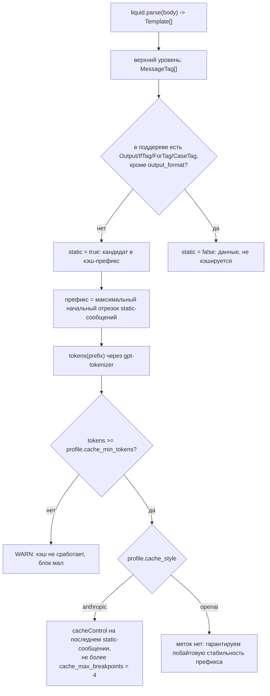

# 08. Промты: шаблоны, слоты, формат вывода

> Статус: draft
> Зависит от: [07. Компилятор](07-compiler.md)
> Источники: research/templating.md, research/structured-output.md, research/00-verified-by-lead.md, спека §7.5, §7.6

## Зачем этот слой

Спека §7.6 требует, чтобы агент мог переписать текст промта целиком, но физически не мог подставить
данные мимо слотов, описать формат вывода руками или сослаться на то, чего нет в контракте. Это
требование к движку, а не к дисциплине: нужен шаблонизатор с публичным AST, где текстовые узлы,
плейсхолдеры и теги различимы, с возможностью выключить произвольные выражения и добавить свои теги.
Слой закрывает правила R-T1..R-T13, сборку массива сообщений с кэшируемым префиксом и оценку размера
отрисовки до запроса к провайдеру.

## Решения

| Решение | Что берём | Версия | Лицензия | Почему |
|---|---|---|---|---|
| Движок шаблонов | `liquidjs` | 10.29.0 | MIT | единственный из проверенных, у кого есть и публичный AST с позициями, и регистрация своих тегов, и встроенный статический анализ переменных; живой релизный цикл (2026-08-11) |
| Парсер шаблонов | не пишем | — | — | свой парсер оценён в 1.5–2.5 тыс. строк с вечным сопровождением; наш код — визитор ~400–600 строк поверх AST liquidjs |
| `switch` по enum | встроенный `/` liquidjs | 10.29.0 | MIT | кастомный тег не нужен, `CaseTag.branches[].values[]` даёт значения ветвей напрямую |
| Роли сообщений | свой блочный тег `` | — | — | `registerTag(name, TagClass)` проверен запуском; выход — `PromptContent{type:'chat'}` VoltAgent 2.10.0 |
| Токенизатор | `gpt-tokenizer`, импорт `gpt-tokenizer/encoding/o200k_base` | 4.0.0 | MIT | те же числа, что у `js-tiktoken`, при скорости в ~23× выше (126 мс против 2923 мс на 2.4 МБ) |
| Оптимизация текста (фаза 2) | `@ax-llm/ax` (`AxGEPA`) как оффлайн-CLI | 24.0.18, пин без `^` | Apache-2.0 | живой пакет (221 583 загрузки/мес), но в рантайм не тащим: он конкурирует с нашим ядром доверия и тянет свой стек провайдеров |
| Отвергнуто | `eta` 4.6.0 | — | MIT | `parse()` возвращает плоский список с сырым JS в `val` — анализировать нечего, произвольный JS противоречит §7.6 |
| Отвергнуто | `nunjucks` 3.2.4 | — | BSD-2 | `time.modified` 2023-04-13 (3 года без релизов) + широкий язык выражений, который пришлось бы урезать чёрным списком |
| Отвергнуто | `@huggingface/jinja` 0.5.10 | — | MIT | чистый AST, но API регистрации своих тегов нет — `` и `` не выразить |
| Отвергнуто | `handlebars` 4.7.9 | — | MIT | лучший AST (`loc` у каждого узла), но синтаксис `{{#if}}` вместо `` и любая конструкция — «хелпер», неотличимый в AST от вызова функции |
| Отвергнуто | `gepa-ts` 1.0.0 | — | — | одна публикация, 136 загрузок/мес, `repository.url` с плейсхолдером `yourusername`, зависит от `@ax-llm/ax@^14` при живом мажоре 24 |

## 1. Граница ответственности

Спека §7.6 делит владение так: агент владеет текстом, платформа — данными, типами и форматом. Ниже —
как это обеспечено механикой, а не соглашением. Каждая строка таблицы — конкретная настройка движка
или конкретная проверка визитора, отказ происходит на компиляции или на парсе, а не в рантайме модели.

| Что агент не может | Механизм запрета | Что он получает при попытке |
|---|---|---|
| Подставить данные мимо слотов | контекст рендера собирается Builder'ом только из `in:`; `new Liquid({ strictVariables: true })` | `UndefinedVariableError: undefined variable: nope, line:1, col:4` (проверено запуском) |
| Вызвать функцию или написать выражение | Liquid — не язык выражений; арифметика и вызовы отсутствуют как синтаксис | ParseError на этапе `liquid.parse()` |
| Применить произвольный фильтр | `strictFilters: true` + `liquid.unregisterFilter(name)` для всех 88 встроенных, кроме белого списка; плюс проверка `Output.value.filters[].name` в визиторе | `ParseError: undefined filter: nofilter, line:1, col:1` (проверено запуском) |
| Объявить переменную, накопить строку, вести счётчик | из `liquid.tags` удалены `assign`, `capture`, `increment`, `decrement`, `cycle`, `echo`, `liquid`, `raw`, `render`, `tablerow`, `layout`, `block`; визитор ловит остаток | ошибка неизвестного тега на парсе |
| Описать формат вывода руками, вставить JSON-пример | R-T6: подсчёт `Output` с путём `output_format` по всему дереву + эвристики по `HTML`-узлам | диагностика компилятора с `row/col` и кандидатом «заменить блок на `{{ output_format }}`» |
| Увидеть скрытое поле сущности | слот ссылается на `view` из реестра типов, а не на сущность; полей вне view в контексте рендера нет | R-T1: путь не резолвится → ошибка со списком доступных полей view |
| Сослаться на значение enum, которого нет в реестре | R-T7 по текстовым `HTML`-узлам | диагностика с ближайшим значением реестра как кандидатом |
| Обратиться к чужому контексту (ветка кандидата в промте судьи) | R-T10: сверка `in:`-слотов с политикой видимости узла | ошибка компиляции узла, не шаблона |
| Сделать число сообщений зависимым от данных | `MessageTag` разрешён только на верхнем уровне AST | ошибка «`` внутри ``/``» |

Что остаётся агенту целиком: текст `HTML`-узлов, структура условий и циклов в пределах типов, состав
фрагментов, разбиение на сообщения и порядок изложения. Именно этот и только этот слой оптимизирует
GEPA (§10).

## 2. Движок: liquidjs и его статический анализ

### 2.1. Что даёт AST

`liquid.parse(src)` возвращает `Template[]`; узлы различимы по `constructor.name`, у каждого токена
есть `begin`, `end`, `input` — реальный вывод парса на шаблоне из спеки §7.6:

```
HTML begin=0
Output content="date" begin=29
Output content="request" begin=41
IfTag name=if args="request.with_kids" content="if request.with_kids" begin=55
  branch cond -> HTML begin=81
ForTag name=for args="h in hotels" content="for h in hotels" begin=122
  HTML begin=143 | Output content="h.name" | Output content="h.price | round" filters=['round']
IncludeTag name=include args="'tone@3'" begin=195
Output content="output_format" begin=218
```

Соответствие узлов и правил: `HTML` → R-T7/R-T8/R-T12, `Output` → R-T1/R-T6, `IfTag` → R-T3,
`CaseTag` → R-T4, `ForTag` → R-T5, `IncludeTag` → версии фрагментов, всё дерево → R-T9.

### 2.2. Встроенный статический анализ

Сигнатуры из `node_modules/liquidjs/dist/liquid.d.ts` и `dist/template/analysis.d.ts`:

```ts
analyzeSync(template: Template[], options?: StaticAnalysisOptions): StaticAnalysis;
parseAndAnalyzeSync(html: string, filename?: string, options?: StaticAnalysisOptions): StaticAnalysis;
fullVariablesSync(t: string | Template[], o?: StaticAnalysisOptions): string[];
variableSegmentsSync(t: string | Template[], o?: StaticAnalysisOptions): SegmentArray[];
globalFullVariablesSync(t: string | Template[], o?: StaticAnalysisOptions): string[];

interface StaticAnalysis { variables: Variables; globals: Variables; locals: Variables }
type Variables = { [rootName: string]: Variable[] };
class Variable { segments: Array<string | number | Variable>; location: { row: number; col: number; file?: string } }
```

Реальный вывод на том же шаблоне:

```
globals: date@1:12 | request@1:24,2:7 | hotels@3:13 | output_format@4:4
fullVariables:       ['date','request','request.with_kids','hotels','h.name','h.price','output_format']
globalFullVariables: ['date','request','request.with_kids','hotels','output_format']
```

Отсюда R-T1 и R-T2 получаются вычитанием множеств, а `Variable.location` даёт `row/col` для
диагностики без собственного пересчёта offset → line:col. Переменная цикла `h` попадает в `locals`
и из `globals` исключается автоматически — scope-tracking для простых случаев писать не нужно.

`StaticAnalysisOptions.partials` по умолчанию `true`, и анализ проходит внутрь ``,
подгружая файлы через `fs`-loader. Мы подставляем свой loader (`LiquidOptions.fs`), который резолвит
`fragment@version` из реестра фрагментов, и получаем сквозной анализ «шаблон + фрагменты» одним вызовом.

### 2.3. Типизированные токены условий (RPN)

`IfTag.branches[i]` — это `{ value: Value, templates: Template[] }` (ключ называется `value`, не `cond`).
`value.initial.postfix` — обратная польская запись из типизированных токенов. Реальный вывод для
``:

```
PropertyAccessToken text='a.b' props=['a','b']
QuotedToken         text='"x"' content='x'
OperatorToken       text='=='
PropertyAccessToken text='c.d' props=['c','d']
NumberToken         text='3'   content=3
OperatorToken       text='>'
```

Поэтому R-T3 — это линейная проверка списка токенов: белый список `OperatorToken`, запрет
`NumberToken` и арифметики, резолв `PropertyAccessToken.props` по типам реестра, проверка
`QuotedToken.content` против значений enum. Собственный парсер выражений не нужен.

### 2.4. `case/when` — это и есть `switch` из спеки

Тип из `dist/tags/case.d.ts`:

```ts
export default class extends Tag {
  value: Value;
  branches: { values: (ValueToken | FilteredValueToken)[]; templates: Template[] }[];
  elseTemplates: Template[];
}
```

Реальный вывод показывает, что одна ветка `` может нести несколько значений
(`[{content:'needs_revision'},{content:'minor'}]`). **`` из спеки §7.6 писать не надо** —
это встроенный `/`, а R-T4 сводится к сравнению объединения значений ветвей с
полным набором enum и к запрету `` внутри `case`.

### 2.5. Ужесточение движка

```ts
const liquid = new Liquid({
  strictVariables: true,
  strictFilters: true,
  ownPropertyOnly: true,
  jsTruthy: false,
});
```

Белый список фильтров (наше решение, расширение — только через ADR): `join`, `size`, `strip`,
`upcase`, `downcase`, `capitalize`, `truncate`, `escape`. Всё, что меняет смысл данных —
форматирование чисел и дат, `sort`, `where`, `map`, `default`, `json` — живёт во view реестра типов,
а не в шаблоне: иначе одна и та же сущность выглядит по-разному в разных промтах, и ломается R-T8.
Защита двойная: `unregisterFilter` на старте плюс проверка `Output.value.filters[].name` в визиторе.

### 2.6. Объём нашего кода и подводные камни

Наш код — визитор ~400–600 строк (обход + таблица правил, паттерн Visitor с реестром
`Record<NodeKind, RuleSet>`), плюс `fs`-loader фрагментов, плюс `MessageTag`. Всё остальное — liquidjs.

| Камень | Что делать |
|---|---|
| `liquid.parser` помечен `@deprecated` | в кастомных тегах брать `parser` из аргумента конструктора |
| Ветка `IfTag` — `{ value, templates }`, а не `{ cond, ... }` | не верить старым статьям |
| `Output.value.initial.postfix` — итератор | копировать через `[...]` перед анализом |
| `unless`, `` (инлайн-режим), `` | явно запретить: иначе обход проходит мимо правил |
| Анализ partials лезет в файловую систему | задать свой `fs`-loader либо `{ partials: false }` и обходить `IncludeTag` самим |

## 3. Шаблон как типизированная функция

Запись промта — YAML-документ в реестре (источник истины — JSONB в БД, YAML только транспорт).
Заголовок задаёт сигнатуру, `body` — единственное поле, которым владеет агент.

```yaml
prompt: score_hotel
version: 4
lang: ru
archetype: scorer
in:
  hotel:   Hotel.view(brief)
  request: TourRequest.view(scoring)
  date:    run.date
unused:
  date: "оставлен для сезонных правил, включается в v5"
out: HotelScore
cache: system
body: |
  
  
  
  {{ output_format }}
  
  
  Сегодня {{ date }}.
  Запрос клиента:
  {{ request }}
  
  Отдельно оцени детскую инфраструктуру.
  
  Отель:
  {{ hotel }}
  
```

Типы записи и результата компиляции:

```ts
type PromptId = string & { readonly __brand: 'PromptId' };
type FragmentRef = string & { readonly __brand: 'FragmentRef' };
type SlotName = string & { readonly __brand: 'SlotName' };

interface PromptTemplate {
  prompt: PromptId;
  version: number;
  lang: 'ru' | 'en';
  archetype: ArchetypeId;
  in: Record<SlotName, TypeViewRef>;
  unused: Record<SlotName, string>;
  out: TypeRef;
  cache: 'none' | 'system' | 'system+examples';
  body: string;
}

interface CompiledPrompt {
  prompt: PromptId;
  version: number;
  ast: Template[];
  analysis: StaticAnalysis;
  messages: MessagePlan[];
  fragments: ReadonlyArray<FragmentRef>;
  upperBound: TokenBudget;
  diagnostics: ReadonlyArray<Diagnostic>;
}

interface MessagePlan {
  role: 'system' | 'user' | 'assistant';
  index: number;
  static: boolean;
  cacheRequested: boolean;
  templates: Template[];
}
```

Рендер — порт с одной операцией, реализация возвращает готовый `PromptContent` VoltAgent 2.10.0
(`dist/index.d.ts:2949`), поэтому связь трейса с версией шаблона получается бесплатно через
`metadata`:

```ts
interface PromptRenderer {
  render(compiled: CompiledPrompt, slots: SlotValues, profile: ModelProfile): PromptContent;
}

interface PromptContent {
  type: 'text' | 'chat';
  messages?: ChatMessage[];
  metadata?: { name?: string; version?: string; prompt_id?: string; prompt_version_id?: string };
}
```

Ключевое свойство записи: `in` и `out` ссылаются на реестр типов, а не на JSON Schema. Профиль
провайдера выбирается на рендере, один и тот же `CompiledPrompt` отрисовывается под `openai-strict`,
`anthropic-strict` и `permissive` по-разному — различаются блок `output_format` (§6) и раскладка
кэш-меток (§5), но не текст агента.

## 4. Разрешённая динамика

| Конструкция | Для чего | Ограничение, проверяемое на AST |
|---|---|---|
| `` / `` / `` | условный блок | левый операнд — `bool`, `optional` или enum-поле; операторы только `==`, `!=`, `and`, `or`; `NumberToken` и арифметика запрещены (R-T3) |
| `` / `` | вариант текста по значению enum | субъект — enum-поле; объединение значений ветвей == полный enum реестра; `` внутри `case` запрещён (R-T4). Отдельного `` не существует и писать его не надо |
| `` | перечисление кандидатов, фактов, пунктов | `items` — массив с обязательным `maxItems` в реестре; внутри тела доступны только поля элемента; вложенность циклов ограничена 1 (R-T5, R-T9) |
| `` | тон, доменные определения, правила | версия обязательна в имени; резолв через свой `fs`-loader реестра фрагментов; изменение фрагмента перекомпилирует все шаблоны, где он включён |
| слот `examples` | динамические few-shot от узла-ретривера | тип `Example<In, Out>[]`; каждый пример валидируется схемой `in`/`out` до рендера; при `cache: system+examples` набор обязан быть статичен в пределах версии |
| метки кандидатов | `A / B / C` для судьи | шаблон читает только `c.label` и `c.text`; порядок и раздачу меток делает платформа (перестановка с фиксированным seed прогона), шаблон не может ни задать метку, ни узнать происхождение кандидата (R-T10) |
| `` | разбиение на сообщения и кэш-префикс | только верхний уровень AST; роли `system`/`user`/`assistant` (§5) |
| ``, `` | заметки автора | в отрисовку не попадают, в текстовые правила не участвуют |

Запрещено синтаксически: `assign`, `capture`, `increment`, `decrement`, `cycle`, `echo`, `raw`,
`render`, `tablerow`, `layout`, `block`, инлайн-режим ``, `unless`. Фильтры — только
белый список §2.5.

## 5. Роли сообщений и кэширование

### 5.1. Тег ``

Реализация проверена запуском; сигнатура конструктора из `dist/template/tag.d.ts` —
`new (token: TagToken, tokens: TopLevelToken[], liquid: Liquid, parser: Parser): Tag`.

```ts
class MessageTag extends Tag {
  readonly role: MessageRole;
  readonly cacheRequested: boolean;
  readonly templates: Template[] = [];

  constructor(token: TagToken, remainTokens: TopLevelToken[], liquid: Liquid, parser: Parser) {
    super(token, remainTokens, liquid);
    const args = token.args.trim().split(/\s+/);
    this.role = parseRole(args[0]);
    this.cacheRequested = args.includes('cache');
    const stream = parser
      .parseStream(remainTokens)
      .on('tag:endmessage', () => stream.stop())
      .on('template', (tpl: Template) => this.templates.push(tpl))
      .on('end', () => { throw new Error(' not found'); });
    stream.start();
  }

  *render(ctx: Context, emitter: Emitter) {
    yield this.liquid.renderer.renderTemplates(this.templates, ctx, emitter);
  }
}

liquid.registerTag('message', MessageTag);
```

Рендерер обходит верхний уровень AST и отрисовывает каждый `MessageTag` в отдельный буфер, складывая
результат в `messages[]` с его ролью. Текст верхнего уровня вне `` трактуется как неявное
`system` — так простые шаблоны из §7.6 спеки работают без изменений.

Правила поверх тега:
- роли только `system | user | assistant`; порядок `system*` → (`user` | `assistant`)*;
- у одношотового узла последним сообщением обязан быть `user`;
- `` встречается только на верхнем уровне: иначе число сообщений зависит от данных и
  кэш-префиксы разъезжаются между прогонами;
- `{{ output_format }}` обязан быть либо в `system`, либо в последнем сообщении.

### 5.2. Как определяется кэшируемый префикс

Инвариант: кэшируемый префикс — всё, что не зависит от входных данных. AST даёт это напрямую:
поддерево `MessageTag` статично, если в нём нет ни одного `Output`, `IfTag`, `ForTag`, `CaseTag`.
Исключение ровно одно — `{{ output_format }}`: он детерминирован типом выхода и профилем, а не данными,
и его байты стабильны (§6).



Порядок сборки он же порядок кэш-выгоды: (1) `system` — роль, тон, доменные фрагменты,
`output_format`; (2) few-shot `examples`, если ретривер не динамический; (3) `user` с данными.
Кнопка в записи промта одна: `cache: none | system | system+examples`. Компилятор проверяет, что
помеченный блок действительно статичен, и оценивает его размер.

### 5.3. Как это ложится на провайдеров

| | Anthropic | OpenAI |
|---|---|---|
| Модель кэша | явная: `providerOptions.anthropic.cacheControl` | автоматическая по префиксу, управлять нечем |
| Что ставим | `{ type: 'ephemeral', ttl: '5m' \| '1h' }` — оба TTL доступны в AI SDK v6 (`@ai-sdk/anthropic/dist/index.d.ts:237`) | ничего; `prompt_cache_key` — только учёт и шардирование, на кэш не влияет |
| Число точек | не более **4** breakpoint'ов на запрос | — |
| Порог префикса | зависит от модели: 512 (Fable 5.1 / Mythos 5.1 / Opus 5 / Fable 5 / Mythos 5), 1024 (Sonnet 5 / 4.6 / 4.5, Opus 4.8), 2048 (Mythos Preview, Opus 4.7, Haiku 3.5), 4096 (Opus 4.6 / 4.5, Haiku 4.5) | 1024 видимых входных токена для GPT-5.6+; у более ранних зависит от наличия tools/images/schema/reasoning effort, учёт округляется вниз до кратного 128 |
| Цена | запись 5m — 1.25× input, запись 1h — 2.0×, чтение — 0.1× (у Fable 5.1 / Mythos 5.1 чтение 0.025×) | чтение 0.1×, запись 1.25× для GPT-5.6+ |
| Удержание | по TTL | минимум 30 минут через `prompt_cache_options.ttl`; у ранних моделей «обычно ~30 мин» |

Поля профиля модели, которые из этого следуют: `cache_min_tokens` (512…4096, не константа),
`cache_max_breakpoints: 4`, `cache_style: 'anthropic' | 'openai' | 'none'`.

Для OpenAI единственный рычаг — побайтовая стабильность префикса. Отсюда три обязательства платформы:
детерминированная сериализация views с фиксированным порядком полей, стабильный порядок фрагментов,
и запрет системных слотов (`run.date`, `locale`, `tz`) внутри сообщений, помеченных `cache`. Последнее
оформляется отдельным правилом **R-T13** (§7; относительно каталога спеки §7.6 правило новое, диапазон
семьи расширен до `R-T1..R-T13` решением ведущего): `Output` с путём из множества системных слотов внутри
`MessageTag` с `cache` — ошибка компиляции.

## 6. Генерация блока формата вывода и расшифровки enum

`{{ output_format }}` — не переменная контекста, а вычисляемый платформой блок. Он зависит от тройки
(тип выхода из реестра, профиль провайдера, язык шаблона) и не зависит от данных прогона — поэтому
попадает в кэшируемый префикс (§5.2). Схема при этом идёт **и в грамматику, и в текст**: грамматика
провайдера гарантирует форму, текст — смысл полей.

### 6.1. Алгоритм

1. Резолвим `out:` в тип реестра и его выходной view; порядок полей берётся из IR и **не сортируется**
   (порядок ключей = порядок генерации = порядок «рассуждения» модели; поле обоснования обязано стоять
   перед полем решения).
2. Компилируем JSON Schema под профиль (слой профилей описан в документе по структурированному выводу):
   все поля `required`, опциональность через `type: [T, "null"]`, `additionalProperties: false`,
   корень — `object`, не `anyOf`.
3. Собираем список ограничений, которые профиль выбросил из схемы (длины, диапазоны, `pattern`,
   `maxItems`), — они обязаны быть проговорены текстом, иначе требование нигде не выражено.
4. Для каждого enum-поля берём из реестра пары «значение → однострочная расшифровка». Расшифровка
   живёт в реестре типов (`.describe()`/`.meta()` Zod 4 выливаются в `description` JSON Schema),
   а не в тексте промта, — иначе ломается R-T7.
5. Считаем бюджет allowed-set и выбираем форму: ≤ 50 значений — enum прямо в схеме и в тексте;
   больше — пронумерованный список в тексте и индексный выбор в схеме. Практический потолок enum для
   UUID — около 416 значений (лимиты OpenAI «1000 значений» и «120 000 символов» действуют
   одновременно), поэтому «честный enum из ID» не рассматривается как вариант вовсе.
6. Рендерим текст детерминированно, кэшируем по ключу `sha256(typeRef, typeRev, profileId, lang)`.

```ts
interface OutputFormatEmitter {
  emit(type: ResolvedOutType, lang: Lang): string;
}

const emitters: Record<ProfileId, OutputFormatEmitter> = {
  'openai-strict': new StrictEmitter(),
  'anthropic-strict': new StrictEmitter(),
  permissive: new SchemaInlineEmitter(),
};

function renderOutputFormat(type: ResolvedOutType, profile: ModelProfile, lang: Lang): string {
  return emitters[profile.id].emit(type, lang);
}
```

Таблица эмиттеров — паттерн Strategy; ветвлений по профилю в теле рендера нет.

### 6.2. Что именно попадает в текст

| Попадает | Не попадает |
|---|---|
| перечень полей в порядке IR с типами и однострочной подписью из реестра | `$schema`, `$defs`, служебные ключи JSON Schema при strict-профилях (форму гарантирует грамматика) |
| значения enum с расшифровкой | синонимы значений, пересказ enum своими словами |
| смысл `null` для optional-полей («нет данных», а не «ноль») | «поле можно опустить» — опустить нельзя, все поля обязательны |
| ограничения, выброшенные из схемы профилем (длины, диапазоны, `pattern`) | ограничения, которые схема и так выражает |
| язык строковых полей (из `lang` записи промта, R-T11) | примеры с правдоподобными данными: это литералы, запрещены R-T8 |
| при allowed-set > 50 — пронумерованный список кандидатов и требование вернуть индекс | сырые ID в тексте |
| для профиля `permissive` (self-hosted, grammar через `guided_json`) — сама JSON Schema целиком | — |

### 6.3. Пример отрисовки

Для `out: HotelScore` с полями `rationale: string`, `verdict: enum`, `score: int 0..10`,
`blocking_issue: string | null` блок выглядит так (профиль `openai-strict`, `lang: ru`):

```
Ответ — один JSON-объект. Все поля обязательны, порядок полей фиксирован, отвечай по-русски.
1. rationale (строка) — краткое обоснование оценки. Заполняется первым, до verdict и score.
2. verdict (одно значение из списка):
   - approved — отель подходит под запрос без оговорок;
   - needs_revision — подходит частично, требуется уточнение у клиента;
   - rejected — не подходит.
3. score (целое число от 0 до 10 включительно).
4. blocking_issue (строка или null) — null означает «блокирующих проблем нет».
Ограничения, не выраженные схемой: rationale не длиннее 600 символов.
```

Строка «Ограничения, не выраженные схемой» появляется только тогда, когда п. 3 алгоритма нашёл
выброшенные ограничения; пустой строки-заглушки нет, иначе байты префикса перестают быть стабильными
между типами.

## 7. Правила R-T1..R-T13

Диагностика единообразна и несёт позицию и готовый кандидат правки; кандидат сериализуется в
`candidates[]` конверта MCP-ответа.

```ts
interface Diagnostic {
  rule: RuleCode;
  severity: 'error' | 'warn';
  at: { row: number; col: number; file?: string };
  message: string;
  fix?: { op: 'replace' | 'insert' | 'remove'; range: [number, number]; text: string };
}

type NodeKind = 'HTML' | 'Output' | 'IfTag' | 'CaseTag' | 'ForTag' | 'IncludeTag' | 'MessageTag';

const rules: Record<NodeKind, ReadonlyArray<NodeRule>> = {
  HTML: [enumMentionRule, dataLiteralRule, knowledgeAppealRule, manualFormatRule],
  Output: [slotExistsRule, outputFormatCountRule, filterWhitelistRule, systemSlotInCacheRule],
  IfTag: [conditionTokenRule],
  CaseTag: [enumExhaustiveRule, caseElseForbiddenRule],
  ForTag: [arrayOnlyRule, loopScopeRule, loopDepthRule],
  IncludeTag: [fragmentVersionRule],
  MessageTag: [topLevelOnlyRule, roleOrderRule, cacheStaticRule],
};
```

Обход — Visitor с явным стеком типов (`typeEnv`), который push'ится на входе в `ForTag` и pop'ится на
выходе; ветвлений по виду узла в теле обхода нет, есть выбор набора правил по ключу таблицы.

| Правило | Узел AST и условие | Пример ошибки | Кандидат исправления |
|---|---|---|---|
| **R-T1** | `globalFullVariablesSync(ast)` ∖ множество путей, выводимых из `in:` и view реестра. Тип поля резолвится по сегментам `Variable.segments` | `{{ hotel.stars }}` при view `Hotel.view(brief)` без поля `stars` | список полей view в сообщении + `replace` на ближайшее по расстоянию Левенштейна поле; альтернатива — правка `in:` на другой view |
| **R-T2** | объявленные слоты ∖ `globalFullVariablesSync(ast)`; строки из `unused:` исключаются | слот `date` объявлен, в тексте не встречается, в `unused:` не отмечен | `insert` в `unused:` заготовки `date: "<причина>"` либо `remove` слота из `in:` |
| **R-T3** | `IfTag.branches[].value.initial.postfix`: `OperatorToken.text` ∈ {`==`,`!=`,`and`,`or`}; `NumberToken` запрещён; тип `PropertyAccessToken.props` ∈ {bool, optional, enum}; `QuotedToken.content` ∈ значений enum | `` | перенести порог в производное bool-поле view (`request.is_premium`) и `replace` условия на него |
| **R-T4** | `union(CaseTag.branches[].values[].content)` == полный enum типа субъекта; `CaseTag.elseTemplates.length === 0` | `case status` покрывает `approved`, `rejected`, пропущен `needs_revision` | `insert` ветки `` с пустым телом-заготовкой перед `` |
| **R-T5** | `ForTag.token.args` → `x in items`; тип `items` — массив с `maxItems`; внутри тела `x.*` резолвится по типу элемента (стек `typeEnv`); глубина вложенных `ForTag` ≤ 1 | `` по объекту, а не массиву | `replace` на `hotel.rooms`, если в view есть массив; иначе — снять цикл |
| **R-T6** | число `Output` с путём `output_format` по всему дереву, включая ветви `IfTag`/`CaseTag`, ровно 1; плюс сканирование `HTML` регулярками по тройной кавычке с json, `"type":`, `Верни JSON`, `{ "` | в тексте расписан JSON-объект руками, `{{ output_format }}` отсутствует | `remove` ручного блока + `insert` `{{ output_format }}` на его место |
| **R-T7** | только `HTML`-узлы (`token.input.slice(token.begin, token.end)`): слова, похожие на значения enum типов из `in`/`out`, сверяются с реестром | в тексте «верни `revise`», в реестре значение `needs_revision` | `replace` на значение реестра; если значения нет — правка типа отдельной операцией |
| **R-T8** | `HTML`-узлы: литералы из справочников (названия, цены, ID, даты) по словарю реестра и по регуляркам чисел с валютой/UUID | «например, отель Riviera Palace, 240 EUR» в статическом тексте | `remove` литерала + `insert` слота: либо поле view, либо слот `examples` |
| **R-T9** | рекурсивная max-оценка по всему AST (§8) против окна профиля | верхняя граница 142 тыс. токенов при окне 128 тыс. | уменьшить `maxItems` в схеме массива, вынести фрагмент, сузить view |
| **R-T10** | не синтаксис: `in:`-слоты и поля view сверяются с политикой видимости узла (промт судьи не видит ветку и модель кандидата, дивергент не видит соседей) | в промте судьи слот `candidate.model_id` | `remove` слота; при необходимости — новый view без запрещённых полей |
| **R-T11** | поле `lang` в заголовке записи, не в тексте; отсутствие — ошибка; блок `output_format` проговаривает язык строковых полей (§6.2) | `lang` не объявлен | `insert` `lang: ru` в заголовок |
| **R-T12** | `HTML`-узлы: стоп-фразы («используй свои знания», «придумай, если данных нет», «предположи») для архетипов с опорой на вход | в `extractor` фраза «если в тексте нет — додумай» | `replace` на явную ветку отказа: `null`-поле в выходе плюс правило в `output_format` |
| **R-T13** | `Output` с системным слотом (`run.date`, `locale`, `tz`) внутри `MessageTag` с меткой `cache` | `{{ date }}` в кэшируемом `system` | `remove` из `system` + `insert` в первое `user`-сообщение |

Четыре группы правил стоят особняком по механике:

- **R-T1/R-T2 бесплатны.** Это разность множеств, которую даёт сам liquidjs
  (`globalFullVariablesSync`), плюс `Variable.location` для `row/col`. Переменные цикла в множество
  не попадают — они в `locals`.
- **R-T3 не требует парсера выражений.** Проверяется линейный список RPN-токенов; тип узла
  (`PropertyAccessToken`, `QuotedToken`, `NumberToken`, `OperatorToken`) уже известен.
- **R-T7/R-T8/R-T12 работают только по `HTML`-узлам.** Сканировать отрисованный текст нельзя: там уже
  есть подставленные данные и они законно содержат и литералы, и значения enum. Единственный источник
  истины для текстовых правил — статические узлы AST.
- **R-T13 проверяется по положению узла, а не по тексту.** Правило смотрит на `MessageTag` с меткой
  `cache` и ищет внутри него `Output` с путём из множества системных слотов; сообщение —
  `R-T13: системный слот {path} в сообщении {role} с меткой cache ломает стабильность префикса`.
  Уровень гарантии L1, реестр — [07. Компилятор](07-compiler.md) §3.2.

Правила исполняются как Chain of Responsibility по узлу: первая ошибка не прерывает обход, диагностики
копятся; компиляция падает при наличии хотя бы одной `severity: 'error'`.

## 8. Оценка размера отрисовки (R-T9)

### 8.1. Токенизатор

Берём `gpt-tokenizer@4.0.0` с импортом только нужного энкодинга — `gpt-tokenizer/encoding/o200k_base`,
иначе в бандл тянется весь набор энкодингов (27.2 МБ распакованных). Замер на node 20:

| Текст | символов | gpt-tokenizer o200k | js-tiktoken o200k | @anthropic-ai/tokenizer | эвристика chars/4 |
|---|---|---|---|---|---|
| RU | 297 | 86 | 86 | 161 | 75 |
| EN | 77 | 15 | 15 | 15 | 20 |
| JSON-подобный | 78 | 29 | 29 | 28 | 20 |
| 2.4 МБ, время | — | **126 мс** | 2923 мс | 816 мс | — |

Выводы, на которых стоит расчёт: `gpt-tokenizer` и `js-tiktoken` дают на o200k_base идентичные числа,
но первый быстрее в ~23 раза; `@anthropic-ai/tokenizer@0.0.4` — старый Claude-2 BPE и завышает русский
почти вдвое (161 против 86), считать по нему нельзя; эвристика `chars/4` на русском **занижает**
(75 против 86), то есть как верхняя граница не годится вообще.

### 8.2. Поправочные коэффициенты профилей

o200k_base точен для OpenAI и приблизителен для Claude, Gemini и open-weight моделей. Поэтому в
профиле модели есть поле `token_ratio`, а верхняя граница считается с запасом:

```
upper_bound = ceil(ast_tokens * profile.token_ratio) + reserve_output_format
            + reserve_tool_schemas + profile.max_output_tokens
R-T9 выполняется, если upper_bound <= profile.context_window * 0.9
```

Значения `token_ratio` по умолчанию: **1.15** для латиницы, **1.3** для кириллицы и CJK. Это не
константа навсегда: фактический `usage.inputTokens` из ответа модели пишется в трейс, и если факт
превысил оффлайн-оценку, `token_ratio` профиля калибруется вверх. Оценка самонастраивается, ручной
подгонки коэффициентов нет.

### 8.3. Верхняя граница по AST, а не по отрисовке

Считаем не «сколько вышло», а «сколько может выйти при худших данных». Обход — та же таблица по виду
узла, что и в §7:

```ts
type Estimator = (node: Template, env: TypeEnv) => number;

const estimators: Record<NodeKind, Estimator> = {
  HTML: (n) => staticTokens(n),
  Output: (n, env) => maxTokensOfType(resolvePath(n, env)),
  IfTag: (n, env) => Math.max(...branchTokens(n, env), elseTokens(n, env)),
  CaseTag: (n, env) => Math.max(...branchTokens(n, env)),
  ForTag: (n, env) => maxItemsOf(n, env) * bodyTokens(n, pushLoopScope(n, env)),
  IncludeTag: (n, env) => fragmentTokens(resolveFragment(n), env),
  MessageTag: (n, env) => bodyTokens(n, env) + MESSAGE_ENVELOPE_TOKENS,
};
```

Правила оценки по типам:

| Узел | Оценка |
|---|---|
| `HTML` | токенизируется один раз, результат кэшируется по хэшу текста узла |
| `Output` скаляр | enum — самое длинное значение; строка — по `maxLength` из схемы; число — по разрядности |
| `Output` view сущности | сумма полей view плюс разделители сериализации |
| `IfTag` / `CaseTag` | **максимум** по ветвям, не сумма; `else` учитывается как ветвь |
| `ForTag` | `maxItems` массива × оценка тела |
| `IncludeTag` | рекурсия во фрагмент точной версии `@v` |
| `{{ output_format }}` | точное число: блок детерминирован (§6), токенизируется как есть |

Отсюда жёсткое требование к реестру типов, без которого R-T9 недоказуем: **у каждой строки —
`maxLength`, у каждого массива — `maxItems`**. Это правило реестра, а не шаблонов; отсутствие границы
даёт диагностику в реестре типов, а не в промте.

## 9. Тестирование промтов

Свободным после L0–L1 остаётся только качество формулировок; его ловят три механизма.

**Snapshot отрисовки на фикстурах.** Для каждой пары (`prompt@version`, профиль) держим набор
фикстур — значения слотов в JSON. Тест (vitest 5.0.0) рендерит `PromptContent` и снимает снапшот
целиком: массив сообщений с ролями, метки кэша, метаданные версии и посчитанную верхнюю границу.
Снапшот хранится рядом с шаблоном, поэтому правка текста промта физически не может пройти ревью
без диффа отрисовки.

Три инварианта, которые проверяются не глазами, а утверждениями:

| Инвариант | Проверка |
|---|---|
| детерминизм | рендер одной фикстуры дважды даёт побайтово равный результат |
| стабильность префикса | рендер двух разных фикстур даёт побайтово равный отрезок до кэш-точки (это и есть условие работы автокэша OpenAI, §5.3) |
| статичность кэш-блока | сообщения с `cache` не содержат ни одного `Output` с данными (R-T13 в статике, тест — в динамике) |

**Дифф отрисовки в ревью.** В MCP-ответе на правку промта отдаём не только новый текст, но и дифф
отрисованного результата на основной фикстуре: агент и человек видят, что именно изменилось в том,
что увидит модель, а не в исходнике шаблона.

**Golden-тесты узла.** Прогон узла на зафиксированных кассетах (content-addressed формат на уровне
порта модели) проверяет, что вывод парсится, валидируется схемой и совпадает с эталоном по ключевым
полям. Кассета снимает недетерминизм провайдера: тест меряет промт, а не модель.

**Мутационная проверка самих правил.** Правила R-T1..R-T12 покрываются доменным мутатором: из AST
шаблона механически удаляется ветка ``, дублируется `{{ output_format }}`, значение enum в
тексте заменяется на отсутствующее в реестре, слот меняется на несуществующий. Каждый такой мутант
обязан быть пойман компиляцией; непойманный мутант — дыра в правиле, а не в тесте.

## 10. Оптимизация промтов (GEPA)

### 10.1. Что берём и что откладываем

| Компонент | Решение |
|---|---|
| `gepa-ts@1.0.0` | не берём: одна публикация за год, 136 загрузок/мес, `repository.url` = плейсхолдер `yourusername`, зависимость `@ax-llm/ax@^14` при живом мажоре 24 |
| `@ax-llm/ax@24.0.18` (`AxGEPA`, `AxBootstrapFewShot`) | берём как **оффлайн-CLI фазы 2**, пин точной версии без `^` (мажор 24 при возрасте проекта ~2 года — ломающие релизы частые) |
| `ax` в рантайме | не берём: это DSPy-подобный фреймворк со своим слоем провайдеров и своей генерацией промтов — он конкурирует с ядром доверия и забирает у платформы формат вывода, что прямо противоречит §7.6 |
| метрика и цикл | наши: `@voltagent/evals@2.0.5` плюс golden-тесты узла (§9) |
| единица оптимизации | текстовые `HTML`-узлы AST шаблона, ничего больше |

Изоляция в отдельном процессе решает и конфликт зависимостей: рантайм прибит к `ai@6.0.280` из-за
peer-требования `@voltagent/core@2.10.0`, а `ax` тянет свой стек.

### 10.2. Адаптер к слоту инструкции

Оптимизатор не видит ни шаблона, ни типов — он видит плоский список текстовых единиц и обратную связь.
Порт с двумя реализациями (Adapter): `AxGepaAdapter` поверх `AxGEPA` и `LocalGepaAdapter` на случай,
если `AxGEPA` не подойдёт (сам алгоритм — reflective mutation плюс Парето-фронт по метрикам — ложится
поверх нашего IR примерно в 300–500 строк, потому что дорогая часть — метрики, прогон, кассеты,
трейсы — у нас уже есть).

```ts
interface TextUnit {
  nodeId: NodeId;
  role: MessageRole;
  text: string;
}

interface PromptOptimizerPort {
  propose(units: ReadonlyArray<TextUnit>, feedback: ReadonlyArray<RunFeedback>): Promise<TextUnit[][]>;
}

async function optimize(compiled: CompiledPrompt, sample: EvalSample, port: PromptOptimizerPort) {
  const units = extractHtmlUnits(compiled.ast);
  const variants = await port.propose(units, sample.feedback);
  const admissible = variants.filter((v) => compile(applyUnits(compiled, v)).diagnostics.length === 0);
  return scoreOnSample(admissible, sample);
}
```

Ключевая строка — `admissible`: мутант, нарушивший R-T1..R-T12, отбраковывается **статически, до
единого запроса к модели**. Слоты, ``, ``, `{{ output_format }}` и типы для
оптимизатора неприкосновенны — он физически не может их изменить, потому что в `TextUnit` их нет.
Это и есть преимущество перед ax и DSPy, где промт целиком отдан оптимизатору.

Возврат кандидатов идёт не в обход платформы: победивший вариант входит обычной операцией правки
промта — новая `version`, дифф текста, дифф отрисовки (§9), перекомпиляция шаблонов, где включён
затронутый фрагмент.

### 10.3. Отложенная выборка

Выборка не собирается вручную и не запускается сразу: она накапливается из трасс и кассет боевых
прогонов узла, размечается офлайн и делится на train/val. Запуск оптимизации отложен до выполнения
условий: набор ≥ 200 элементов (минимум для блокирующего гейта), пройденный A/A-прогон и стабильная
метрика узла. До этого момента слот инструкции остаётся под ручным авторством агента — оптимизировать
по 20 примерам значит подогнать текст под шум.

## Открытые вопросы

1. **Белый список фильтров не зафиксирован исследованием.** В заметках только оценка «≈8-10»;
   список в §2.5 — наше предложение. *Закрыть:* прогнать список по реальным шаблонам архетипов §7.5 и
   утвердить ADR; расширение — только через ADR.
2. **`unless` и оператор `contains` в условиях.** Заметки оставляют решение открытым («`unless`(?)»,
   «`contains`? — решаем»). *Закрыть:* решить одним ADR вместе с п. 1; по умолчанию — запрет обоих,
   так как оба выразимы через `if` и `==`.
3. **Где обязан стоять `{{ output_format }}`** — в `system` или в последнем сообщении. Сейчас §5.1
   допускает оба, но это решение должно быть одно для всех архетипов, иначе R-T6 проходит, а модель
   формат игнорирует. *Закрыть:* замер на golden-наборе двух вариантов на двух провайдерах.
4. **Точный подсчёт токенов для Claude.** Эндпоинт `/v1/messages/count_tokens` в заметках помечен
   `UNVERIFIED` (сигнатура и лимиты не подтверждены). *Закрыть:* проверить по официальной документации
   и решить, гоняем ли его на публикации версии промта (не на каждой правке).
5. **Лимиты Gemini** (глубина, число свойств, число enum) Google не публикует — бюджет блока
   `output_format` для этого профиля посчитать нечем. *Закрыть:* эмпирический замер с фиксацией чисел
   в профиле.
6. **Имя MCP-тула для применения кандидата правки промта.** Конверт требует `apply{tool,arguments}`,
   а в закреплённом списке имён (`flow_create`, `run_replay_node`, `experiment_compare`) операции над
   промтами нет. *Закрыть:* согласовать имя с документом MCP-контракта.
7. **Источник политик видимости для R-T10.** Правило проверяется не по шаблону, а по политике узла;
   формат политики в этом документе не определён. *Закрыть:* ссылка на документ по типам и политикам
   после его готовности.
8. **Реестр фрагментов и fan-out перекомпиляции.** `fs`-loader для `fragment@v` описан, хранение
   версий фрагментов и стоимость перекомпиляции всех зависимых шаблонов — нет. *Закрыть:* определить
   таблицу фрагментов и индекс обратных зависимостей в документе по данным.
9. **Противоречие внутри заметок по ``.** Раздел 0 заметки `templating.md` утверждает,
   что `` — наш кастомный тег, раздел 3.2 той же заметки показывает запуском, что это
   встроенный `/`. Документ следует DECISIONS и разделу 3.2. *Закрыть:* поправить
   заметку, чтобы противоречие не всплыло в другом документе.
