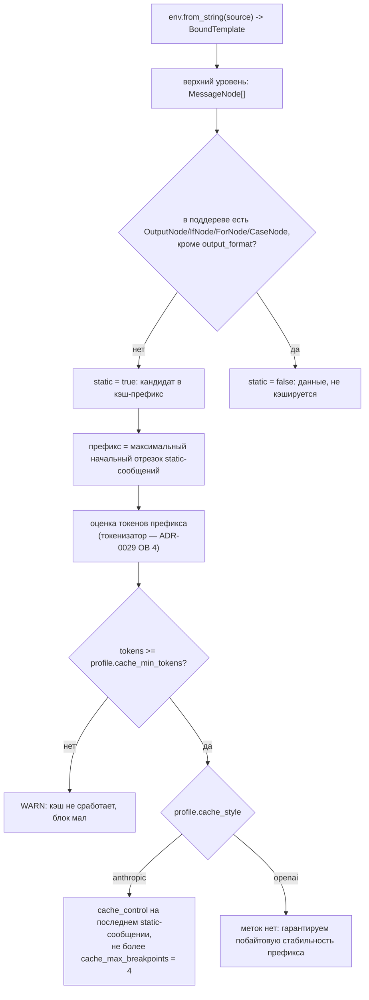

# 08. Промты: шаблоны, слоты, формат вывода

> Статус: draft
> Зависит от: [07. Компилятор](07-compiler.md), [ADR-0020](adr/0020-llm-function-and-adapters.md), [ADR-0025](adr/0025-python-engine.md), [ADR-0026](adr/0026-yaml-spec-and-code-refs.md), [ADR-0027](adr/0027-dynamic-io-shapes.md), [ADR-0029](adr/0029-trust-and-quality-python.md), [23. API локальной студии](23-studio-api.md)
> Источники: research/py-quality-layer.md (§1.3, §8), research/py-spec-as-code.md (§6, §7, §10), research/templating.md, research/structured-output.md, research/00-verified-by-lead.md, спека §7.5, §7.6

## Зачем этот слой

Спека §7.6 требует, чтобы агент мог переписать текст промта целиком, но физически не мог подставить
данные мимо слотов, описать формат вывода руками или сослаться на то, чего нет в контракте. Это
требование к движку, а не к дисциплине: нужен шаблонизатор со статическим анализом без рендера, где
литеральный текст, вывод переменных и теги различимы, с возможностью убрать лишние теги и добавить свои.
Промт никогда не строка в YAML: он бывает текстом, который дополняет адаптер, Liquid-шаблоном или функцией
проекта ([ADR-0026](adr/0026-yaml-spec-and-code-refs.md) §4). Слой закрывает правила R-T1..R-T13, сборку
массива сообщений с кэшируемым префиксом и оценку размера отрисовки до запроса к провайдеру.

## Решения

| Решение | Что берём | Версия | Лицензия | Почему |
|---|---|---|---|---|
| Движок шаблонов | `python-liquid` | 2.3.1 | MIT | статический анализ без рендера (`analyze()`, `global_variable_paths()`), литеральный текст — `ContentNode`, свой блочный тег через `Environment.add_tag` (проверено запуском, [ADR-0029](adr/0029-trust-and-quality-python.md) §8); релиз 2026-08-08 |
| Парсер шаблонов | не пишем | — | — | наш код — Visitor и таблица правил по типу узла python-liquid, loader фрагментов и тег `` |
| `switch` по enum | встроенный `/` | python-liquid 2.3.1 | MIT | кастомный тег не нужен: ветки `when` — `MultiExpressionBlockNode`, `else` — `BlockNode` среди `CaseNode.blocks` (проверено) |
| Роли сообщений | свой блочный тег `` | — | — | `Environment.add_tag(MessageTag)`, узел виден в `analyze().tags` и в обходе `children()` (проверено запуском); отображение в сообщения Pydantic AI не проверено — ADR-0029 ОВ 18 |
| Уровни промта | три стратегии сборки текста (Strategy) | — | — | уровень определяется содержимым ключа `prompt`, а не флагом ([ADR-0026](adr/0026-yaml-spec-and-code-refs.md) §4) |
| Форма файла промта | `.prompt.md` по образцу dotprompt, без Handlebars | `dotpromptz` 0.1.5 — только образец | Apache-2.0 | заимствуем форму файла, не пакет (research/py-spec-as-code.md §6–§7); frontmatter — ОВ 10 |
| Токенизатор оценки | не выбран | — | — | ADR-0029 ОВ 4: `tiktoken` 0.14.0 (MIT) приходит с extra `openai`, но BPE-файл `o200k_base` скачивается из сети (§8.1) |
| Оптимизация текста (фаза 2) | `gepa` библиотекой в процессе за `PromptOptimizerPort` | 0.1.4 | MIT | обязательных зависимостей нет; цикл, Парето-фронт и lineage ведёт сам; адаптер и reflection подменяемы (ADR-0029 §11) |
| Оценка кандидатов при оптимизации | `pydantic-evals`, `Dataset.evaluate_sync` | 2.43.0 | MIT | тот же прогонщик, что у гейтов выпуска ([13](13-evals-and-gates.md)) |
| Отвергнуто | оптимизаторы DSPy (MIPROv2, SIMBA, BootstrapFewShot) | dspy 3.3.1 | MIT | работают только над программой `dspy.Module`; наш рантайм с Liquid-шаблоном ими не оптимизируется; `dspy.GEPA` — адаптер над тем же gepa 0.1.4 |
| Отвергнуто | reflection через litellm (строковый `reflection_lm` gepa) | — | — | вызовы идут мимо кассеты, бюджета, редакции и выключателя сети; без установленного litellm прогон молча не улучшает текст |
| Отвергнуто | `poml` | 0.0.8 | MIT | релизов больше года нет |

## 1. Граница ответственности

Спека §7.6 делит владение так: агент владеет текстом, платформа — данными, типами и форматом. Ниже —
как это обеспечено механикой, а не соглашением. Каждая строка таблицы — конкретная настройка движка
или конкретная проверка визитора, отказ происходит на компиляции или на разборе, а не в рантайме модели.

| Что агент не может | Механизм запрета | Что он получает при попытке |
|---|---|---|
| Подставить данные мимо слотов | контекст рендера собирается адаптером только из `in` узла; R-T1 статически по `global_variable_paths()`; `Environment(undefined=StrictUndefined)` | диагностика R-T1 на компиляции; на рендере — `UndefinedError` |
| Вызвать функцию или написать арифметику | Liquid — не язык выражений: вызовов нет как синтаксиса; сравнения в условиях разбор принимает, их ограничивает R-T3 | диагностика R-T3; отказ разбора на арифметике для python-liquid 2.3.1 не проверялся (ADR-0029 ОВ 17) |
| Применить произвольный фильтр | белый список проверяется статически по `analyze().filters`; `strict_filters=True` (значение по умолчанию) | диагностика компилятора с именем фильтра; на рендере — `UnknownFilterError` |
| Объявить переменную, накопить строку, вести счётчик | из `env.tags` удалено всё вне белого списка тегов §2.5 | `LiquidSyntaxError: unexpected tag` при разборе |
| Описать формат вывода руками, вставить JSON-пример | R-T6: подсчёт `OutputNode` с путём `output_format` по всему дереву + эвристики по `ContentNode` | диагностика компилятора с позицией и кандидатом «заменить блок на `{{ output_format }}`» |
| Увидеть скрытое поле сущности | слот типизирован типом реестра (представлением сущности), а не сущностью; полей вне типа в контексте рендера нет | R-T1: путь не резолвится → ошибка со списком доступных полей |
| Сослаться на значение enum, которого нет в реестре | R-T7 по `ContentNode` | диагностика с ближайшим значением реестра как кандидатом |
| Обратиться к чужому контексту (ветка кандидата в промте судьи) | R-T10: сверка `in` узла с политикой видимости узла | ошибка компиляции узла, не шаблона |
| Сделать число сообщений зависимым от данных | `MessageNode` разрешён только на верхнем уровне шаблона | ошибка «`` внутри ``/``» |

Что остаётся агенту целиком: литеральный текст (`ContentNode`), структура условий и циклов в пределах типов,
состав фрагментов, разбиение на сообщения и порядок изложения. Именно этот и только этот слой оптимизирует
GEPA (§10).

## 2. Движок: python-liquid и его статический анализ

### 2.1. Что даёт AST

`env.from_string(source)` возвращает `BoundTemplate`. Узлы верхнего уровня — `template.nodes`, дети —
`node.children(RenderContext(template), include_partials=False)`: `IfNode` отдаёт consequence, alternatives и
default, `CaseNode` — `MultiExpressionBlockNode` → `BlockNode`, `ForNode` — block и default. Литеральный текст —
`ContentNode` (слот `text`), вывод — `OutputNode`. Токен — `(kind, value, start_index, source)`
(research/py-quality-layer.md §8.5). Обход без рекурсии:

```python
def iter_nodes(template: BoundTemplate) -> Iterator[Node]:
    context = RenderContext(template)
    stack: list[Node] = list(reversed(template.nodes))
    while stack:
        node = stack.pop()
        yield node
        stack.extend(reversed(list(node.children(context, include_partials=False))))
```

Соответствие узлов и правил: `ContentNode` → R-T7/R-T8/R-T12, `OutputNode` → R-T1/R-T6/R-T13, `IfNode` → R-T3,
`CaseNode` → R-T4, `ForNode` → R-T5, `` → ссылки на фрагменты (ОВ 8), `MessageNode` → §5,
всё дерево → R-T9.

Позиции — смещения в символах: `Variable.span.index` у переменной, `Token.start_index` у токена. Строку и
колонку считает наш код; синтаксические ошибки python-liquid уже содержат `строка:колонка`. `str(template)`
исходник не воспроизводит, поэтому всё, что меняет текст (кандидат правки, сборка мутанта GEPA), режет
исходник по смещениям.

### 2.2. Встроенный статический анализ

`BoundTemplate.analyze()` отдаёт без рендера переменные (`variables`, `globals`), фильтры (`filters`) и теги
(`tags`); `global_variable_paths()` — пути глобальных переменных. Реальный вывод на шаблоне research
§8.5 (текст, `{{ ticket.text | strip }}`, ``, `…{{ h.summary }}`,
``):

```
global_variable_paths: ['customer.vip', 'history', 'ticket.channel', 'ticket.text']
tags:                  ['case', 'for', 'if']
filters:               ['strip']
```

Отсюда R-T1 и R-T2 получаются вычитанием множеств без рендера. Переменная цикла в `globals` не попадает
(проверено: `{{ d.id }}` даёт только `docs`) — scope-tracking для простых случаев писать не
нужно.

`analyze(include_partials=True)` проходит внутрь `` через loader окружения (проверено на
`DictLoader`). Мы подставляем свой `RegistryLoader`, который резолвит фрагмент из `prompts/` по пину, и получаем
сквозной анализ «шаблон + фрагменты» одним вызовом.

### 2.3. Условия: структура выражений

R-T3 требует от условия ``: операторы только `==`, `!=`, `and`, `or`; числовые литералы и арифметика
запрещены; путь резолвится по типам реестра; строковый литерал сверяется со значениями enum. На прежнем движке
это была линейная проверка списка типизированных токенов. У python-liquid 2.3.1 выражение `IfNode` — объекты
`liquid.builtin.expressions`, и их структура для белого списка операторов не разобрана
([ADR-0029](adr/0029-trust-and-quality-python.md) ОВ 17). Собственный парсер выражений не пишем: правило
обходит объекты выражений библиотеки. Разбор условие вида `` принимает, поэтому
запрет держит только R-T3.

### 2.4. `case/when` — это и есть `switch` из спеки

Ветки `when` в python-liquid 2.3.1 — `MultiExpressionBlockNode`, `else` — `BlockNode` среди `CaseNode.blocks`
(проверено, ADR-0029 §8). Одна ветка несёт несколько значений (``).
**`` из спеки §7.6 писать не надо** — это встроенный `/`, а R-T4 сводится к
сравнению объединения значений веток с полным набором enum и к запрету ветки `else` внутри `case`. Извлечение
значений из выражений ветки проверяется вместе с ADR-0029 ОВ 17.

### 2.5. Ужесточение движка

```python
ALLOWED_TAGS: frozenset[str] = frozenset({"if", "case", "for", "include", "comment", "#", "message"})
SERVICE_TAGS: frozenset[str] = frozenset({"content", "output", "illegal"})
ALLOWED_FILTERS: frozenset[str] = frozenset(
    {"join", "size", "strip", "upcase", "downcase", "capitalize", "truncate", "escape"}
)


def build_environment(loader: RegistryLoader) -> Environment:
    environment = Environment(undefined=StrictUndefined, loader=loader)
    environment.add_tag(MessageTag)
    for name in set(environment.tags) - ALLOWED_TAGS - SERVICE_TAGS:
        del environment.tags[name]
    return environment


def forbidden_filters(template: BoundTemplate) -> frozenset[str]:
    return frozenset(template.analyze().filters) - ALLOWED_FILTERS
```

Теги вне белого списка удаляются из `env.tags`, и разбор шаблона с ними падает `LiquidSyntaxError`. С фильтрами
так нельзя: удаление из `env.filters` разбор не роняет, а рендер падает `UnknownFilterError` уже на данных,
поэтому белый список фильтров проверяется статически по `analyze().filters`. `strict_filters=True` — значение по
умолчанию. Встроенных фильтров в 2.3.1 — 62.

Белый список фильтров (наше решение, расширение — только через ADR): `join`, `size`, `strip`,
`upcase`, `downcase`, `capitalize`, `truncate`, `escape`. Всё, что меняет смысл данных —
форматирование чисел и дат, `sort`, `where`, `map`, `default`, `json` — живёт в типе реестра,
а не в шаблоне: иначе одна и та же сущность выглядит по-разному в разных промтах, и ломается R-T8.

### 2.6. Объём нашего кода и подводные камни

Наш код — Visitor с таблицей правил `RULES_BY_NODE` (§7), `RegistryLoader` фрагментов и `MessageTag` (§5.1).
Всё остальное — python-liquid.

| Камень | Что делать |
|---|---|
| `str(template)` не воспроизводит исходник | любая правка текста режет исходник по смещениям |
| управление пробелами `` обрезает значение `ContentNode` | позиция узла — `source.find(node.text, node.token.start_index)` |
| хвостовой перевод строки — отдельный токен content | смежные диапазоны текста сливаются |
| удаление из `env.filters` не роняет разбор | белый список фильтров — статически по `analyze().filters` |
| в `env.tags` лежат служебные `content`, `output`, `illegal` | тест равенства белому списку учитывает их отдельно |
| сверх списка прежнего движка в 2.3.1 есть `ifchanged`, `doc`, `break`, `continue` | удалены вместе с остальными тегами вне белого списка до отдельного решения |
| `IfNode`, `CaseNode`, `ForNode` — внутренняя структура библиотеки | пин точной версии; тест набора и порядка узлов на эталонном шаблоне ловит ломающий апгрейд |

## 3. Шаблон как типизированная функция

Промт — не запись в реестре и не строка в YAML. Источник истины — файлы проекта
([ADR-0017](adr/0017-files-as-source-of-truth.md)): сигнатура узла `llm` — вход, выход и ссылка на промт — живёт
в файле узла, текст — в отдельном файле ([ADR-0026](adr/0026-yaml-spec-and-code-refs.md) §3–§4). Номера версии у
промта нет: идентичность — хеш содержимого ([ADR-0022](adr/0022-hash-as-version.md)). Ключ `prompt` принимает три
лексические формы: `./<node_id>.prompt.md` рядом с файлом узла, `<key>` общего промта из `prompts/` (пин в
`aqven.lock.yaml`) и `pkg.mod:function`. Уровень определяется содержимым (Strategy):

| Уровень | Что в `prompt` | Кто собирает текст | Компилятор видит | Правила | GEPA | Студия |
|---|---|---|---|---|---|---|
| 1 | `.prompt.md` без переменных и тегов (`analyze()` пуст) | адаптер ([ADR-0020](adr/0020-llm-function-and-adapters.md)) дописывает входы с описаниями, выходы и блок формата вывода, как `ChatAdapter` DSPy | всё: поля, типы, описания, инструкцию | текстовые R-T7, R-T8, R-T12 по всему тексту; ручной формат вывода запрещён (R-T6), блок дописывает адаптер | весь текст — одна единица | обычный узел |
| 2 | `.prompt.md` — Liquid-шаблон со слотами, ``, `` | автор; `{{ output_format }}` ровно один раз (R-T6) | переменные, ветки, фильтры; каждая переменная — объявленный вход, неиспользуемый вход — ошибка | R-T1..R-T13 | единицы `ContentNode` | обычный узел |
| 3 | `pkg.mod:function` | функция проекта от типизированных входов; возвращает нейтральный отрисованный промт (ADR-0020) и не может добавить или убрать вход или выход ([ADR-0019](adr/0019-escape-hatch-rules.md)) | только типы `in`/`out` и сигнатуру функции | правила по `in` узла (R-T10); статическая оценка R-T9 недоступна (ОВ 11) | не оптимизируется | метка «промт собран кодом»; черновика и сохранения нет (`PROMPT_IS_CODE`, [23](23-studio-api.md) §12.2) |

Медиазначение (`Image`, `Audio`, `Video`, `Document`) в текст не рендерится ни на одном уровне: адаптер передаёт
его частью `user_prompt` (в Pydantic AI 2.43.0 медиа принимается только там), в шаблоне уровня 2 оно доступно
только в условии, а `{{ order.receipt }}` — ошибка компиляции.

Пример уровня 2. `flows/hotel_pitch/nodes/score_hotel.yaml`:

```yaml
apiVersion: "aqven/v1"
kind: "Node"
node: "llm"
description: "Оценка отеля под запрос клиента"
model_role: "scorer"
prompt: "./score_hotel.prompt.md"
in:
- name: "hotel"
  type: "HotelBrief"
  description: "Карточка отеля в представлении для оценки"
  from: "$input.hotel"
- name: "request"
  type: "TourRequestScoring"
  description: "Запрос клиента в представлении для оценки"
  from: "$input.request"
- name: "date"
  type: "Date"
  description: "Дата прогона для сезонных правил"
  from: "$run.context.date"
out:
- name: "rationale"
  type: "Text"
  description: "Краткое обоснование оценки, заполняется до вердикта"
  maxLength: 600
- name: "verdict"
  type: "HotelVerdict"
  description: "Итог оценки отеля"
- name: "score"
  type: "Int"
  description: "Оценка от 0 до 10"
  minimum: 0
  maximum: 10
- name: "blocking_issue"
  type: "Text?"
  description: "Блокирующая проблема; null — проблем нет"
  maxLength: 300
```

`flows/hotel_pitch/nodes/score_hotel.prompt.md`:

```liquid



{{ output_format }}


Сегодня {{ date }}.
Запрос клиента:
{{ request }}

Отдельно оцени детскую инфраструктуру.

Отель:
{{ hotel }}

```

`HotelBrief` и `TourRequestScoring` — представления сущностей; как представление записывается в `types/` —
ADR-0026 ОВ 16. Прежняя запись промта несла ещё ключи `lang` (R-T11), `unused` (R-T2) и `cache` (§5.2); в формате
ADR-0026 места у них нет — ОВ 10, примеры до решения без них. Форма ссылки на фрагмент (`@3` в тексте) — ОВ 8.

Результат компиляции:

```python
PromptRef = NewType("PromptRef", str)
FragmentRef = NewType("FragmentRef", str)


class PromptLevel(IntEnum):
    ADAPTER = 1
    TEMPLATE = 2
    CODE = 3


@dataclass(frozen=True, slots=True)
class MessagePlan:
    role: MessageRole
    index: int
    static: bool
    cache_requested: bool
    node: MessageNode


@dataclass(frozen=True, slots=True)
class CompiledPrompt:
    node_id: NodeId
    level: PromptLevel
    prompt: PromptRef
    template_sha256: str
    template: BoundTemplate | None
    messages: tuple[MessagePlan, ...]
    fragments: tuple[FragmentRef, ...]
    upper_bound: TokenBudget | None
    diagnostics: tuple[Diagnostic, ...]
```

`template` пуст у уровня 3, `upper_bound` — у уровня 3 до решения ОВ 11. Рендер — порт с одной операцией
(Port/Adapter); запись каталога несёт профиль схемы и поля кэша (§5.3):

```python
class PromptRenderer(Protocol):
    def render(self, compiled: CompiledPrompt, slots: SlotValues, entry: CatalogEntry) -> RenderedPrompt: ...
```

`RenderedPrompt` — форма [23](23-studio-api.md) §5: `messages[{role, parts[]}]`, `slot_ranges[]`,
`cache_prefix_end`, `output_format`, `output_schema_sent`, `token_estimate`, `template_sha256`, `rendered_sha256`,
`provenance`. Рендер только на сервере, тем же кодом, что в рантайме. Связь трассы с текстом шаблона — атрибуты
`aqven.prompt.template_sha256` и `aqven.prompt.rendered_sha256` ([09](09-context-model.md) §7.3). Отображение
`RenderedPrompt` в `instructions`, `user_prompt` и `message_history` Pydantic AI не проверено — ADR-0029 ОВ 18.

Ключевое свойство: `in` и `out` ссылаются на реестр типов (`types/*.yaml` → Pydantic-модели), а не на JSON Schema.
Профиль схемы берётся на рендере из записи каталога, и один `CompiledPrompt` отрисовывается под `openai-strict`,
`anthropic-strict` и `permissive` по-разному — различаются блок `output_format` (§6) и раскладка кэш-меток (§5),
но не текст автора.

## 4. Разрешённая динамика

| Конструкция | Для чего | Ограничение, проверяемое на AST |
|---|---|---|
| `` / `` / `` | условный блок | левый операнд — `bool`, optional (`T?`) или enum-поле; операторы только `==`, `!=`, `and`, `or`; числовые литералы и арифметика запрещены (R-T3) |
| `` / `` | вариант текста по значению enum | субъект — enum-поле; объединение значений веток == полный enum реестра; `` внутри `case` запрещён (R-T4). Отдельного `` не существует и писать его не надо |
| `` | перечисление кандидатов, фактов, пунктов | `items` — массив с обязательным `maxItems` в реестре; внутри тела доступны только поля элемента; вложенность циклов ограничена 1 (R-T5, R-T9) |
| `` | тон, доменные определения, правила | фрагмент из `prompts/`, резолв через `RegistryLoader`; изменение фрагмента перекомпилирует все шаблоны, где он включён (обратный индекс — `idx.refs`, [files-first/index.md](files-first/index.md)); форма версии в ссылке — ОВ 8 |
| слот `examples` | динамические few-shot от узла-ретривера | список примеров `in`/`out`; каждый пример проверяется моделями `in`/`out` узла до рендера; при `cache: system+examples` набор обязан быть статичен в пределах хеша промта |
| метки кандидатов | `A / B / C` для судьи | шаблон читает только `c.label` и `c.text`; порядок и раздачу меток делает платформа (перестановка с фиксированным seed прогона), шаблон не может ни задать метку, ни узнать происхождение кандидата (R-T10) |
| `` | разбиение на сообщения и кэш-префикс | только верхний уровень шаблона; роли `system`/`user`/`assistant` (§5) |
| ``, `` | заметки автора | в отрисовку не попадают, в текстовые правила не участвуют |
| слот `Dynamic` | вход — выход динамического шага ([ADR-0027](adr/0027-dynamic-io-shapes.md)) | только `{{ slot }}` целиком: адаптер отрисовывает значение вместе с его схемой; обращение к полям, условие и цикл по нему — ошибка компиляции (R-D1, предложено); после `narrow` — обычный слот статического типа; верхняя оценка — по `limits` |
| список атрибутов `AttributeValue[]` | набор атрибутов, неизвестный заранее | один вход с `maxItems`, запись `{key, value}`; вывод через `` (R-T5) или фильтр из белого списка — ОВ 1 |
| медиаслот `Image`, `Audio`, `Video`, `Document` | учесть наличие вложения | только в условии ``; `{{ }}` по медиаслоту — ошибка компиляции (ADR-0026 §4) |

Запрещено синтаксически всё вне белого списка тегов §2.5, в том числе `assign`, `capture`, `increment`,
`decrement`, `cycle`, `echo`, `render`, `tablerow`, инлайн-режим ``, `unless`, `ifchanged`, `doc`,
`break`, `continue`. Фильтры — только белый список §2.5.

## 5. Роли сообщений и кэширование

### 5.1. Тег ``

ADR-0029 §8 фиксирует регистрацию тега через `Environment.add_tag`. Код ниже запущен на python-liquid 2.3.1 и
прошёл pyright 1.1.414 strict на CPython 3.14.7 при чистке документа 2026-09-16; в research его нет.

```python
class MessageRole(StrEnum):
    SYSTEM = "system"
    USER = "user"
    ASSISTANT = "assistant"


ROLES: Mapping[str, MessageRole] = {role.value: role for role in MessageRole}
END_MESSAGE = "endmessage"
END_MESSAGE_BLOCK = frozenset((END_MESSAGE, TOKEN_EOF))


class MessageNode(Node):
    __slots__ = ("role", "cache_requested", "block")

    def __init__(self, token: Token, role: MessageRole, cache_requested: bool, block: BlockNode) -> None:
        super().__init__(token)
        self.role = role
        self.cache_requested = cache_requested
        self.block = block

    def render_to_output(self, context: RenderContext, buffer: TextIO) -> int:
        return self.block.render(context, buffer)

    async def render_to_output_async(self, context: RenderContext, buffer: TextIO) -> int:
        return await self.block.render_async(context, buffer)

    def children(self, static_context: RenderContext, *, include_partials: bool = True) -> Iterable[Node]:
        yield self.block


def parse_words(env: Environment, arguments: TokenStream) -> list[str]:
    words: list[str] = []
    while arguments.current.kind != TOKEN_EOF:
        words.append(str(parse_identifier(env, arguments)))
    return words


class MessageTag(Tag):
    name = "message"
    end = END_MESSAGE

    def parse(self, stream: TokenStream) -> MessageNode:
        token = stream.eat(TOKEN_TAG)
        words = parse_words(self.env, stream.into_inner(tag=token))
        role = ROLES.get(words[0]) if words else None
        if role is None:
            raise LiquidSyntaxError("expected message role system, user or assistant", token=token)
        block = get_parser(self.env).parse_block(stream, END_MESSAGE_BLOCK)
        stream.expect(TOKEN_TAG, value=END_MESSAGE)
        return MessageNode(token, role, "cache" in words[1:], block)
```

Неизвестная роль и тег без аргументов падают `LiquidSyntaxError` с позицией, незакрытый блок — `expected tag
endmessage`. Рендерер обходит `template.nodes` и отрисовывает каждый `MessageNode` в отдельный буфер, складывая
результат в `messages[]` с его ролью. Текст верхнего уровня вне `` трактуется как неявное
`system` — так простые шаблоны из §7.6 спеки работают без изменений.

Правила поверх тега:
- роли только `system | user | assistant`; порядок `system*` → (`user` | `assistant`)*;
- у одношотового узла последним сообщением обязан быть `user`;
- `` встречается только на верхнем уровне: иначе число сообщений зависит от данных и
  кэш-префиксы разъезжаются между прогонами. Разбор принимает `` внутри ``, запрет держит
  правило `top_level_only_rule`;
- `{{ output_format }}` обязан быть либо в `system`, либо в последнем сообщении.

### 5.2. Как определяется кэшируемый префикс

Инвариант: кэшируемый префикс — всё, что не зависит от входных данных. AST даёт это напрямую:
поддерево `MessageNode` статично, если в нём нет ни одного `OutputNode`, `IfNode`, `ForNode`, `CaseNode`.
Исключение ровно одно — `{{ output_format }}` статического типа выхода: он детерминирован типом и профилем, а не
данными, и его байты стабильны (§6).



Порядок сборки он же порядок кэш-выгоды: (1) `system` — роль, тон, доменные фрагменты,
`output_format`; (2) few-shot `examples`, если ретривер не динамический; (3) `user` с данными.
Кнопка одна: `cache: none | system | system+examples` (место ключа — ОВ 10). Компилятор проверяет, что
помеченный блок действительно статичен, и оценивает его размер.

### 5.3. Как это ложится на провайдеров

| | Anthropic | OpenAI |
|---|---|---|
| Модель кэша | явная: `cache_control` на блоке запроса | автоматическая по префиксу, управлять нечем |
| Что ставим | `cache_control: {type: "ephemeral", ttl: "5m" \| "1h"}` (research/templating.md); как Pydantic AI 2.43.0 выставляет метку (`CachePoint` входит в `UserContent`, `messages.py:991`) и доходит ли она до `system` — не проверено, ADR-0029 ОВ 18 | ничего; `prompt_cache_key` — только учёт и шардирование, на кэш не влияет |
| Число точек | не более **4** breakpoint'ов на запрос | — |
| Порог префикса | зависит от модели: 512 (Fable 5.1 / Mythos 5.1 / Opus 5 / Fable 5 / Mythos 5), 1024 (Sonnet 5 / 4.6 / 4.5, Opus 4.8), 2048 (Mythos Preview, Opus 4.7, Haiku 3.5), 4096 (Opus 4.6 / 4.5, Haiku 4.5) | 1024 видимых входных токена для GPT-5.6+; у более ранних зависит от наличия tools/images/schema/reasoning effort, учёт округляется вниз до кратного 128 |
| Цена | запись 5m — 1.25× input, запись 1h — 2.0×, чтение — 0.1× (у Fable 5.1 / Mythos 5.1 чтение 0.025×) | чтение 0.1×, запись 1.25× для GPT-5.6+ |
| Удержание | по TTL | минимум 30 минут через `prompt_cache_options.ttl`; у ранних моделей «обычно ~30 мин» |

Поля профиля модели, которые из этого следуют: `cache_min_tokens` (512…4096, не константа),
`cache_max_breakpoints: 4`, `cache_style: anthropic | openai | none`.

Для OpenAI единственный рычаг — побайтовая стабильность префикса. Отсюда три обязательства платформы:
детерминированная сериализация значений с фиксированным порядком полей, стабильный порядок фрагментов,
и запрет системных слотов (привязанных к `$run.context.date`, `$run.context.time_zone`, `$run.context.locale`)
внутри сообщений, помеченных `cache`. Последнее оформляется отдельным правилом **R-T13** (§7; относительно
каталога спеки §7.6 правило новое, диапазон семьи расширен до `R-T1..R-T13` решением ведущего): `OutputNode` с
системным слотом внутри `MessageNode` с `cache` — ошибка компиляции.

## 6. Генерация блока формата вывода и расшифровки enum

`{{ output_format }}` — не переменная контекста, а вычисляемый платформой блок. Для статического типа выхода он
зависит от тройки (тип выхода из реестра, профиль схемы, язык шаблона) и не зависит от данных прогона — поэтому
попадает в кэшируемый префикс (§5.2). Схема при этом идёт **и в грамматику, и в текст**: грамматика
провайдера гарантирует форму, текст — смысл полей. На уровне 1 блок дописывает адаптер, на уровне 2 его место
задаёт автор.

### 6.1. Алгоритм

1. Резолвим `out` узла в поля и типы реестра; порядок полей берётся из IR и **не сортируется**
   (порядок ключей = порядок генерации = порядок «рассуждения» модели; поле обоснования обязано стоять
   перед полем решения).
2. Нейтральная схема — `model_json_schema()` сгенерированной модели выхода; wire-схему под профиль строит
   `json_schema_transformer` профиля (DECISIONS «Структурированный вывод — опровержения спеки» п. 1–3), strict
   задаётся явно на профиле ([ADR-0027](adr/0027-dynamic-io-shapes.md)). Стиль: все поля required,
   опциональность через `null` (`T | None`), `additionalProperties: false` (`extra="forbid"`), корень — объект,
   не `anyOf`.
3. Собираем ограничения, которые трансформер профиля унёс из грамматики в `description` (у OpenAI —
   `minLength`, `maxLength` и прочие strict-несовместимые ключи; у Anthropic — ещё `maxItems`, `minimum`,
   `maximum`, `pattern`), — они обязаны быть проговорены текстом блока. Держит их всегда проверка Pydantic на
   приёме.
4. Для каждого enum-поля берём из реестра пары «значение → однострочная расшифровка». Расшифровка
   живёт в файле типа (`description` обязателен у типа и поля, ADR-0026 §1) и выливается в `description`
   JSON Schema модели, а не в текст промта, — иначе ломается R-T7. Форма описаний значений enum — ADR-0026 ОВ 8.
5. Считаем бюджет allowed-set и выбираем форму: ≤ 50 значений — enum прямо в схеме и в тексте;
   больше — пронумерованный список в тексте и индексный выбор в схеме. Практический потолок enum для
   UUID — около 416 значений (лимиты OpenAI «1000 значений» и «120 000 символов» действуют
   одновременно), поэтому «честный enum из ID» не рассматривается как вариант вовсе.
6. Рендерим текст детерминированно, кэшируем по хешу от (TypeId, хеш содержимого типа, id профиля, язык).

```python
class OutputFormatEmitter(Protocol):
    def emit(self, output_type: ResolvedOutType, lang: Lang) -> str: ...


OUTPUT_FORMAT_EMITTERS: Mapping[SchemaProfileId, OutputFormatEmitter] = {
    SchemaProfileId.OPENAI_STRICT: StrictEmitter(),
    SchemaProfileId.ANTHROPIC_STRICT: StrictEmitter(),
    SchemaProfileId.PERMISSIVE: SchemaInlineEmitter(),
}


def render_output_format(output_type: ResolvedOutType, profile: SchemaProfileId, lang: Lang) -> str:
    return OUTPUT_FORMAT_EMITTERS[profile].emit(output_type, lang)
```

Таблица эмиттеров — паттерн Strategy; ветвлений по профилю в теле рендера нет.

Для выхода типа `Dynamic` ([ADR-0027](adr/0027-dynamic-io-shapes.md)) блок строится при вызове по фактической
`FieldSpec[]`, а не на компиляции. Он зависит от данных прогона, поэтому исключение §5.2 на него не
распространяется и в кэшируемый префикс он не входит; верхняя оценка его размера — по `limits`.

### 6.2. Что именно попадает в текст

| Попадает | Не попадает |
|---|---|
| перечень полей в порядке IR с типами и однострочной подписью из реестра | `$schema`, `$defs`, служебные ключи JSON Schema при strict-профилях (форму гарантирует грамматика) |
| значения enum с расшифровкой | синонимы значений, пересказ enum своими словами |
| смысл `null` для optional-полей («нет данных», а не «ноль») | «поле можно опустить» — опустить нельзя, все поля обязательны |
| ограничения, унесённые из грамматики профилем (длины, диапазоны, `pattern`) | ограничения, которые грамматика и так выражает |
| язык строковых полей (из `lang`, R-T11) | примеры с правдоподобными данными: это литералы, запрещены R-T8 |
| при allowed-set > 50 — пронумерованный список кандидатов и требование вернуть индекс | сырые ID в тексте |
| для профиля `permissive` (self-hosted, grammar через `guided_json`) — сама JSON Schema целиком | — |

### 6.3. Пример отрисовки

Для выхода узла `score_hotel` из §3 (`rationale: Text`, `verdict: HotelVerdict`, `score: Int 0..10`,
`blocking_issue: Text?`) блок выглядит так (профиль `openai-strict`, язык `ru`):

```
Ответ — один JSON-объект. Все поля обязательны, порядок полей фиксирован, отвечай по-русски.
1. rationale (строка) — краткое обоснование оценки. Заполняется первым, до verdict и score.
2. verdict (одно значение из списка):
   - approved — отель подходит под запрос без оговорок;
   - needs_revision — подходит частично, требуется уточнение у клиента;
   - rejected — не подходит.
3. score (целое число от 0 до 10 включительно).
4. blocking_issue (строка или null) — null означает «блокирующих проблем нет».
Ограничения, не выраженные схемой: rationale не длиннее 600 символов, blocking_issue — не длиннее 300.
```

Строка «Ограничения, не выраженные схемой» появляется только тогда, когда п. 3 алгоритма нашёл
унесённые ограничения; пустой строки-заглушки нет, иначе байты префикса перестают быть стабильными
между типами.

## 7. Правила R-T1..R-T13

Диагностика единообразна и несёт позицию и готовый кандидат правки; кандидат сериализуется в
`candidates[]` конверта `Envelope` ([ADR-0028](adr/0028-studio-api-contract.md)). Формат `at` в API пока расходится
с `Problem.at` [14](14-mcp-contract.md) §3.1 — [23](23-studio-api.md) ОВ 11.

```python
class Severity(StrEnum):
    ERROR = "error"
    WARN = "warn"


class FixOp(StrEnum):
    REPLACE = "replace"
    INSERT = "insert"
    REMOVE = "remove"


@dataclass(frozen=True, slots=True)
class SourcePosition:
    file: str
    offset: int
    row: int
    col: int


@dataclass(frozen=True, slots=True)
class TextFix:
    op: FixOp
    start: int
    end: int
    text: str


@dataclass(frozen=True, slots=True)
class Diagnostic:
    rule: RuleCode
    severity: Severity
    at: SourcePosition
    message: str
    fix: TextFix | None


type NodeRule = Callable[[Node, TypeEnv], Sequence[Diagnostic]]

RULES_BY_NODE: Mapping[type[Node], tuple[NodeRule, ...]] = {
    ContentNode: (enum_mention_rule, data_literal_rule, knowledge_appeal_rule, manual_format_rule),
    OutputNode: (slot_exists_rule, output_format_count_rule, filter_whitelist_rule, system_slot_in_cache_rule),
    IfNode: (condition_rule,),
    CaseNode: (enum_exhaustive_rule, case_else_forbidden_rule),
    ForNode: (array_only_rule, loop_scope_rule, loop_depth_rule),
    IncludeNode: (fragment_reference_rule,),
    MessageNode: (top_level_only_rule, role_order_rule, cache_static_rule),
}


def diagnose_node(node: Node, env: TypeEnv) -> tuple[Diagnostic, ...]:
    rules = RULES_BY_NODE.get(type(node), ())
    return tuple(diagnostic for rule in rules for diagnostic in rule(node, env))
```

Таблица совпадает с ADR-0029 §8, кроме строки `IncludeNode`: в ADR её нет, правило ссылок на фрагменты
определяется вместе с ОВ 8. Обход — Visitor с явным стеком типов (`TypeEnv`), который растёт на входе в
`ForNode` и сокращается на выходе; ветвлений по виду узла в теле обхода нет, набор правил выбирается по
`type(node)`.

| Правило | Узел AST и условие | Пример ошибки | Кандидат исправления |
|---|---|---|---|
| **R-T1** | `global_variable_paths()` ∖ множество путей, выводимых из `in` узла и типов реестра. Тип поля резолвится по сегментам пути | `{{ hotel.stars }}` при типе `HotelBrief` без поля `stars` | список полей типа в сообщении + `replace` на ближайшее по расстоянию Левенштейна поле; альтернатива — правка `in` на другой тип |
| **R-T2** | объявленные входы ∖ корни `global_variable_paths()`; входы из `unused` исключаются (место ключа — ОВ 10) | вход `date` объявлен, в тексте не встречается, в `unused` не отмечен | `insert` в `unused` заготовки `date: "<причина>"` либо `remove` входа из `in` |
| **R-T3** | выражения условий `IfNode`: операторы ∈ {`==`,`!=`,`and`,`or`}; числовые литералы запрещены; тип пути ∈ {bool, optional, enum}; строковый литерал ∈ значений enum (разбор выражений — ADR-0029 ОВ 17) | `` | перенести порог в производное bool-поле типа (`request.is_premium`) и `replace` условия на него |
| **R-T4** | объединение значений веток `when` (`MultiExpressionBlockNode`) == полный enum типа субъекта; ветки `else` (`BlockNode` в `CaseNode.blocks`) нет | `case status` покрывает `approved`, `rejected`, пропущен `needs_revision` | `insert` ветки `` с пустым телом-заготовкой перед `` |
| **R-T5** | `ForNode`: `x in items`; тип `items` — массив с `maxItems`; внутри тела `x.*` резолвится по типу элемента (стек `TypeEnv`); глубина вложенных `ForNode` ≤ 1 | `` по объекту, а не массиву | `replace` на `hotel.rooms`, если в типе есть массив; иначе — снять цикл |
| **R-T6** | уровень 2: число `OutputNode` с путём `output_format` по всему дереву, включая ветви `IfNode`/`CaseNode`, ровно 1; уровни 1 и 2: сканирование `ContentNode` регулярками по тройной кавычке с json, `"type":`, `Верни JSON`, `{ "` | в тексте расписан JSON-объект руками, `{{ output_format }}` отсутствует | `remove` ручного блока + `insert` `{{ output_format }}` на его место |
| **R-T7** | только `ContentNode` (`node.text`, позиция — `source.find(node.text, node.token.start_index)`): слова, похожие на значения enum типов из `in`/`out`, сверяются с реестром | в тексте «верни `revise`», в реестре значение `needs_revision` | `replace` на значение реестра; если значения нет — правка типа отдельной операцией |
| **R-T8** | `ContentNode`: литералы из справочников (названия, цены, ID, даты) по словарю реестра и по регуляркам чисел с валютой/UUID | «например, отель Riviera Palace, 240 EUR» в статическом тексте | `remove` литерала + `insert` слота: либо поле типа, либо слот `examples` |
| **R-T9** | рекурсивная max-оценка по всему AST (§8) против окна профиля | верхняя граница 142 тыс. токенов при окне 128 тыс. | уменьшить `maxItems` в типе массива, вынести фрагмент, сузить тип |
| **R-T10** | не синтаксис: `in` узла и поля типов сверяются с политикой видимости узла (промт судьи не видит ветку и модель кандидата, дивергент не видит соседей) | в промте судьи слот `candidate.model_id` | `remove` слота; при необходимости — новое представление без запрещённых полей |
| **R-T11** | ключ `lang` (место — ОВ 10), не текст; отсутствие — ошибка; блок `output_format` проговаривает язык строковых полей (§6.2) | `lang` не объявлен | `insert` `lang: "ru"` |
| **R-T12** | `ContentNode`: стоп-фразы («используй свои знания», «придумай, если данных нет», «предположи») для архетипов с опорой на вход | в `extractor` фраза «если в тексте нет — додумай» | `replace` на явную ветку отказа: `null`-поле в выходе плюс правило в `output_format` |
| **R-T13** | `OutputNode` со слотом, привязанным к `$run.context.date`, `$run.context.time_zone` или `$run.context.locale`, внутри `MessageNode` с меткой `cache` | `{{ date }}` в кэшируемом `system` | `remove` из `system` + `insert` в первое `user`-сообщение |

Четыре группы правил стоят особняком по механике:

- **R-T1/R-T2 бесплатны.** Это разность множеств, которую даёт сам python-liquid
  (`global_variable_paths()`), плюс `Variable.span.index` для позиции. Переменные цикла в множество
  не попадают.
- **R-T3 не требует своего парсера выражений.** Проверяются объекты выражений `IfNode` библиотеки; их
  структура для белого списка операторов ещё не разобрана (ADR-0029 ОВ 17).
- **R-T7/R-T8/R-T12 работают только по `ContentNode`.** Сканировать отрисованный текст нельзя: там уже
  есть подставленные данные и они законно содержат и литералы, и значения enum. Единственный источник
  истины для текстовых правил — литеральные узлы AST.
- **R-T13 проверяется по положению узла, а не по тексту.** Правило смотрит на `MessageNode` с меткой
  `cache` и ищет внутри него `OutputNode` со слотом, привязанным к контексту прогона; сообщение —
  `R-T13: системный слот {path} в сообщении {role} с меткой cache ломает стабильность префикса`.
  Уровень гарантии L1, реестр — [07. Компилятор](07-compiler.md) §3.2.

Правила исполняются как Chain of Responsibility по узлу: первая ошибка не прерывает обход, диагностики
копятся; компиляция падает при наличии хотя бы одной `Severity.ERROR`.

## 8. Оценка размера отрисовки (R-T9)

### 8.1. Токенизатор

Токенизатор оценки не выбран ([ADR-0029](adr/0029-trust-and-quality-python.md) ОВ 4). Что известно о кандидатах
(research/py-quality-layer.md §1.3):

| Кандидат | Известно | Не проверено |
|---|---|---|
| `tiktoken` 0.14.0 (MIT), энкодинг `o200k_base` | приходит с extra `openai` pydantic-ai-slim; Pydantic AI использует его только в `OpenAIEmbeddingModel`; BPE-файл скачивается с `openaipublic.blob.core.windows.net` в `TIKTOKEN_CACHE_DIR` | работа без сети с вендоренным файлом; скорость на больших шаблонах |
| `count_tokens` модели Pydantic AI 2.43.0 | `OpenAIResponsesModel` — `POST /v1/responses/input_tokens`, `AnthropicModel` — `POST /v1/messages/count_tokens` (проверено моком); `GoogleModel` — переопределение есть, не вызывалось; `OpenAIChatModel`, `FunctionModel` — `NotImplementedError`; `CassetteModel` перехватывает вызов, на реплее 0 HTTP | ответы реальных сервисов; это сетевой вызов, поэтому годится для публикации промта, а не для каждой правки |

Из прежних замеров npm-токенизаторов (research/templating.md) без привязки к библиотеке остаётся один вывод:
эвристика `chars/4` на русском **занижает** (75 против 86 токенов `o200k_base` на тексте из 297 символов), то есть
как верхняя граница не годится вообще. Числа выбранного токенизатора — повторить замер при закрытии ADR-0029 ОВ 4.

### 8.2. Поправочные коэффициенты профилей

Энкодинг OpenAI точен для OpenAI и приблизителен для Claude, Gemini и open-weight моделей. Поэтому в
профиле модели есть поле `token_ratio`, а верхняя граница считается с запасом:

```
upper_bound = ceil(ast_tokens * profile.token_ratio) + reserve_output_format
            + reserve_tool_schemas + profile.max_output_tokens
R-T9 выполняется, если upper_bound <= profile.context_window * 0.9
```

Значения `token_ratio` по умолчанию: **1.15** для латиницы, **1.3** для кириллицы и CJK. Это не
константа навсегда: фактическое число входных токенов из `usage` ответа модели пишется в трассу, и если факт
превысил оффлайн-оценку, `token_ratio` профиля калибруется вверх. На реплее кассеты `usage` в ответе обнулён,
записанный лежит в metadata ответа (ADR-0029 §4): калибровка читает записанный. Оценка самонастраивается,
ручной подгонки коэффициентов нет.

### 8.3. Верхняя граница по AST, а не по отрисовке

Считаем не «сколько вышло», а «сколько может выйти при худших данных». Обход — та же таблица по типу
узла, что и в §7:

```python
type Estimator = Callable[[Node, TypeEnv], int]

ESTIMATORS: Mapping[type[Node], Estimator] = {
    ContentNode: lambda node, env: static_tokens(node),
    OutputNode: lambda node, env: max_tokens_of_type(resolve_path(node, env)),
    IfNode: lambda node, env: max(branch_tokens(node, env)),
    CaseNode: lambda node, env: max(branch_tokens(node, env)),
    ForNode: lambda node, env: max_items_of(node, env) * body_tokens(node, push_loop_scope(node, env)),
    IncludeNode: lambda node, env: fragment_tokens(resolve_fragment(node), env),
    MessageNode: lambda node, env: body_tokens(node, env) + MESSAGE_ENVELOPE_TOKENS,
}
```

`branch_tokens` возвращает оценки всех ветвей, включая `else` и default.

| Узел | Оценка |
|---|---|
| `ContentNode` | токенизируется один раз, результат кэшируется по хешу текста узла |
| `OutputNode` скаляр | enum — самое длинное значение; строка — по `maxLength` из типа; число — по разрядности |
| `OutputNode` сущность | сумма полей типа плюс разделители сериализации |
| `OutputNode` `Dynamic` | худший случай по `limits` ([ADR-0027](adr/0027-dynamic-io-shapes.md)) |
| `IfNode` / `CaseNode` | **максимум** по ветвям, не сумма; `else` учитывается как ветвь |
| `ForNode` | `maxItems` массива × оценка тела |
| `IncludeNode` | рекурсия во фрагмент по пину |
| `{{ output_format }}` статического типа | точное число: блок детерминирован (§6), токенизируется как есть |

Отсюда жёсткое требование к реестру типов, без которого R-T9 недоказуем: **у каждой строки —
`maxLength`, у каждого массива — `maxItems`**. Это правило реестра (R-42), а не шаблонов; отсутствие границы
даёт диагностику в реестре типов, а не в промте. Для уровня 3 статическая оценка недоступна — ОВ 11.

## 9. Тестирование промтов

Свободным после L0–L1 остаётся только качество формулировок; его ловят три механизма.

**Snapshot отрисовки на фикстурах.** Для каждой пары (промт, профиль) держим набор фикстур — значения слотов
в JSON. Тест (pytest 9.1.1) рендерит `RenderedPrompt` и снимает снапшот целиком: сообщения с ролями, метки кэша,
`template_sha256` и посчитанную верхнюю границу. Снапшот хранится рядом с шаблоном, поэтому правка текста
промта физически не может пройти ревью без диффа отрисовки. Библиотека снапшотов не выбрана — ОВ 13.

Три инварианта, которые проверяются не глазами, а утверждениями:

| Инвариант | Проверка |
|---|---|
| детерминизм | рендер одной фикстуры дважды даёт побайтово равный результат |
| стабильность префикса | рендер двух разных фикстур даёт побайтово равный отрезок до кэш-точки (это и есть условие работы автокэша OpenAI, §5.3) |
| статичность кэш-блока | сообщения с `cache` не содержат ни одного `OutputNode` с данными (R-T13 в статике, тест — в динамике) |

**Дифф отрисовки в ревью.** Студия показывает дифф отрисованного результата на основной фикстуре: рендер
черновика и диска (`POST .../prompt/render` с `source: draft|disk`, [23](23-studio-api.md) §5) до сохранения
промта (§12.2 там же). Человек видит, что изменилось в том, что увидит модель, а не в исходнике шаблона.
Агент правит `.prompt.md` нативными инструментами без черновика; как он получает дифф отрисовки — ОВ 6.

**Golden-тесты узла.** Прогон узла на кассетах `CassetteModel` в режиме `replay_strict`
([ADR-0029](adr/0029-trust-and-quality-python.md) §1) при `ALLOW_MODEL_REQUESTS = False` проверяет, что вывод
проходит модель выхода и совпадает с эталоном по ключевым полям. Кассета снимает недетерминизм провайдера: тест
меряет промт, а не модель; исход `ok`/`refusal`/`truncated` гейт выводит из записанного ответа на каждом реплее.

**Мутационная проверка самих правил.** Правила R-T1..R-T13 покрываются доменным мутатором: из AST
шаблона механически удаляется ветка ``, дублируется `{{ output_format }}`, значение enum в
тексте заменяется на отсутствующее в реестре, слот меняется на несуществующий. Каждый такой мутант
обязан быть пойман компиляцией; непойманный мутант — дыра в правиле, а не в тесте. На каждое правило есть
шаблон-нарушитель (ADR-0029 «Проверка»).

## 10. Оптимизация промтов (GEPA)

### 10.1. Что берём и что не берём

| Компонент | Решение |
|---|---|
| `gepa` 0.1.4 (MIT) | берём библиотекой в процессе, без litellm; цикл — выбор родителя, минибатч, приёмка, Парето-фронт — ведёт сам |
| reflection-модель | только агент Pydantic AI из фабрики `aqven_llm`: `AgentReflectionLM(agent, ledger, limits)` — callable `(str \| list[dict]) -> str`, вызывает `agent.run_sync(..., usage=ledger, usage_limits=limits)`; вызовы проходят кассету, бюджет, редакцию и `ALLOW_MODEL_REQUESTS`. Строковый `reflection_lm` запрещён |
| оценка кандидата | `TemplateUnitsAdapter.evaluate` рендерит кандидат, передаёт его агенту как `instructions=` на прогон и оценивает батч через `Dataset.evaluate_sync` pydantic-evals 2.43.0. `Agent.override` не берём: он заменяет инструкции и capabilities агента, `instructions=` добавляет их на прогон и безопасен при параллельной оценке |
| оптимизаторы DSPy 3.3.1, `dspy.GEPA` | не берём: работают над `dspy.Module`; `dspy.GEPA` — адаптер над тем же gepa 0.1.4 |
| единица оптимизации | уровень 1 — весь текст одной единицей (не запускалось); уровень 2 — литеральные `ContentNode`; уровень 3 оптимизации не подлежит |
| хранение | результат (кандидаты, lineage родителей, оценки, Парето-фронт) храним сами в Postgres (граница данных ADR-0012); носитель — JSON `GEPAResult.to_dict()` и события `on_pareto_front_updated`; `run_dir` с `gepa_state.bin` — локальный черновик для resume, pickle читается только из доверенного каталога |
| события | `callbacks=[...]` GEPA (`on_candidate_accepted`, `on_pareto_front_updated`, `on_budget_updated` и др.) — Observer: в трассу и в прогресс студии |

### 10.2. Порт и фильтр допустимости

GEPA сам ведёт цикл, поэтому порт — одна операция (Port/Adapter), а не `propose → filter → score`: фильтр живёт
внутри рефлексии, чтобы недопустимый мутант не тратил вызовов модели задачи.

```python
UnitId = NewType("UnitId", str)


@dataclass(frozen=True, slots=True)
class TextUnit:
    unit_id: UnitId
    start: int
    end: int
    text: str


@dataclass(frozen=True, slots=True)
class OptimizationBudget:
    max_metric_calls: int
    score_threshold: float | None = None
    max_repairs: int = 1


@dataclass(frozen=True, slots=True)
class OptimizationRequest:
    compiler: PromptTemplateCompiler
    train: Sequence[EvalCase]
    dev: Sequence[EvalCase]
    budget: OptimizationBudget


@dataclass(frozen=True, slots=True)
class OptimizationOutcome:
    seed_units: Mapping[UnitId, str]
    best_units: Mapping[UnitId, str]
    val_scores: Sequence[float]
    parents: Sequence[Sequence[int | None]]
    metric_calls: int
    rejected: Sequence[RejectedMutant]
    result_json: Mapping[str, object]


class PromptOptimizerPort(Protocol):
    def optimize(self, request: OptimizationRequest) -> OptimizationOutcome: ...
```

Реализация порта `GepaPromptOptimizer` прогнана — research/py-quality-layer.md §8.8. Соответствие
`TemplateUnitsAdapter` протоколу `GEPAAdapter` и `AdmissibleReflection` протоколу `ReflectionLM` под pyright
strict не проверено (ADR-0029 ОВ 5).

| Элемент | Решение |
|---|---|
| `TextUnit` | литеральный `ContentNode`: отрезок исходника, края обрезаны от пробелов, пустые отрезки исключены, соседние склеены. Кандидат GEPA — `dict[unit_id, text]`; сборка обратно — по смещениям, байты тегов и слотов неизменны (проверено). Порядковые id `text_00` сдвигаются при ручной правке шаблона, а метку вроде `Ticket:` перед слотом GEPA мутировал — ADR-0029 ОВ 7 |
| `TemplateUnitsAdapter` | Adapter над `GEPAAdapter`: `evaluate` и `make_reflective_dataset` (записи `{Inputs, Generated Outputs, Feedback}` из `ReportCase`, редакция PII); атрибут `propose_new_texts = None` обязателен — без него GEPA глотает `AttributeError` и тратит бюджет впустую; на одном кейсе исключений не бросает |
| `AdmissibleReflection` | Decorator над `ReflectionLM`, передаётся как `reflection_strategy`. Мутант проверяется `PromptTemplateCompiler.diagnose` (Facade): синтаксис (`LiquidError`), R-T1..R-T13, неизменность последовательности структурных токенов `env.tokenizer()`, неизменность набора тегов и фильтров. Недопустимый мутант — пустой `ReflectionProposal`, GEPA его не оценивает; отклонения декоратор пишет сам. Повтор объявленного слота ловит только проверка структуры, R-T1 его пропускает (проверено) |
| цикл починки | диагностики возвращаются reflection-модели записью `Feedback` (`max_repairs`, по умолчанию 1); на игрушечной задаче лучший кандидат найден за 12 вызовов метрики вместо 27 |
| бюджет | `max_metric_calls` проверяется между итерациями и перелетает (40 → 42); `ScoreThresholdStopper` из `stop_callbacks` сокращает прогон; вызовы метрики идут через общий `RunUsage` оптимизации |
| сплиты | `trainset` — train, `valset` — dev, test в GEPA не передаётся никогда; до запуска порт проверяет пройденный A/A и минимум размера (§10.3) |
| победитель | входит обычной правкой промта: черновик в `.aqven/drafts/`, дифф текста и отрисовки (§9), перекомпиляция шаблонов, где включён затронутый фрагмент; гейт выпуска — на test-сплите |

Ключевое свойство — фильтр до вызова модели: мутант, нарушивший R-T1..R-T13 или структуру тегов и слотов,
отбраковывается статически. Слоты, ``, ``, `{{ output_format }}` и типы для оптимизатора
неприкосновенны — в кандидате GEPA их нет. Разница с оптимизаторами DSPy уже, чем может показаться: DSPy тоже
меняет только инструкции и demos предикторов, а структуру полей и формат вывода держит его адаптер. Реальная
разница — у DSPy инструкция один текст без слотов и ветвлений, у нас оптимизируются куски шаблона между ними
(research/py-quality-layer.md §9, п. 9). Коды `R-SYNTAX`, `R-FROZEN`, `R-TAGS` фильтра — ОВ 12.

### 10.3. Отложенная выборка

Выборка не собирается вручную и не запускается сразу: она накапливается из трасс и кассет боевых
прогонов узла, размечается офлайн и делится на train/dev/test; test в оптимизацию не попадает. Запуск
оптимизации отложен до выполнения условий: набор ≥ 200 элементов (минимум для блокирующего гейта), пройденный
A/A-прогон и стабильная метрика узла. Считается ли минимум по всему набору или по test-сплиту, как в
[13](13-evals-and-gates.md) §7.10 (при полосах 70/15/15 это ~1334 элемента всего), — ADR-0029 ОВ 16. До этого
момента текст промта остаётся под ручным авторством агента — оптимизировать по 20 примерам значит подогнать
текст под шум.

## Открытые вопросы

1. **Белый список фильтров не зафиксирован исследованием.** В заметках только оценка «≈8-10»;
   список в §2.5 — наше предложение, из 62 встроенных фильтров python-liquid 2.3.1 он не сверялся. Отдельно:
   фильтр вывода `AttributeValue[]` в шаблоне ([ADR-0027](adr/0027-dynamic-io-shapes.md) ОВ 8) не определён.
   *Закрыть:* прогнать список по реальным шаблонам архетипов §7.5 и утвердить ADR; для `AttributeValue[]` —
   определить фильтр или ограничиться ``; расширение — только через ADR.
2. **Оператор `contains` в условиях.** Заметки оставляли решение открытым («`contains`? — решаем»). `unless`
   закрыт: белый список тегов ADR-0029 §8 его не содержит, тег удаляется из окружения. *Закрыть:* решить одним ADR
   вместе с п. 1 после разбора выражений `IfNode` (ADR-0029 ОВ 17); по умолчанию — запрет, так как `contains`
   выразим через enum-поле и `==`.
3. **Где обязан стоять `{{ output_format }}`** — в `system` или в последнем сообщении. Сейчас §5.1
   допускает оба, но это решение должно быть одно для всех архетипов, иначе R-T6 проходит, а модель
   формат игнорирует. *Закрыть:* замер на golden-наборе двух вариантов на двух провайдерах.
4. **Точный подсчёт токенов для Claude.** `AnthropicModel.count_tokens` Pydantic AI 2.43.0 вызывает
   `POST /v1/messages/count_tokens`; проверено только моком, реальный сервис и его лимиты не вызывались
   (ADR-0029 ОВ 4). *Закрыть:* прогон против реального API на кассете, решение, включать ли подсчёт на публикации
   промта (не на каждой правке).
5. **Лимиты Gemini** (глубина, число свойств, число enum) Google не публикует — бюджет блока
   `output_format` для этого профиля посчитать нечем. *Закрыть:* эмпирический замер с фиксацией чисел
   в профиле.
6. **Кандидаты правки промта и дифф отрисовки для агента.** Конверт требует `apply{tool,arguments}`, но
   MCP-тула для сохранения промта нет: в [23](23-studio-api.md) §5 черновик и сохранение — «только человек», агент
   правит `.prompt.md` нативными инструментами, а `template_render` в реестре [14](14-mcp-contract.md) отсутствует.
   *Закрыть:* решить в 14, чем выражается кандидат R-T для агента (правка файла без `apply` или тул) и как агент
   получает дифф отрисовки после правки (ответ хука `flow_check` или тул рендера).
7. **Источник политик видимости для R-T10.** Правило проверяется не по шаблону, а по политике узла;
   формат политики в этом документе не определён. *Закрыть:* ссылка на документ по типам и политикам
   после его готовности.
8. **Ссылки на фрагменты: версия в тексте или пин.** ADR-0029 §8 сохраняет из ADR-0013 форму `fragment@version`,
   которую резолвит loader, а [files-first/layout.md](files-first/layout.md) §2 и
   [ADR-0022](adr/0022-hash-as-version.md) требуют `` без `@v` в тексте с пином в
   `aqven.lock.yaml`. Правила для узла `` (в 2.3.1 это `IncludeNode`) в таблице ADR-0029 §8 нет;
   обратный индекс для перекомпиляции — `idx.refs` ([files-first/index.md](files-first/index.md)). *Закрыть:*
   решение владельца о форме ссылки, затем `fragment_reference_rule` и `RegistryLoader` под неё; пример §3 и
   источник `static` в [09](09-context-model.md) §3 выровнять.
9. **Противоречие внутри заметок по ``.** Раздел 0 заметки `templating.md` утверждает,
   что `` — наш кастомный тег, раздел 3.2 той же заметки показывает запуском, что это
   встроенный `/`. Документ следует DECISIONS и разделу 3.2. *Закрыть:* поправить
   заметку, чтобы противоречие не всплыло в другом документе.
10. **Место ключей `lang`, `unused` и `cache`.** R-T11 требует `lang`, R-T2 — список `unused`, §5.2 — кнопку
    `cache`; прежде они жили в заголовке записи промта. ADR-0026 §3–§4 их не упоминает: в файле узла `llm`
    ключей нет, frontmatter у `.prompt.md` не решён (research/py-spec-as-code.md ОВ 4). *Закрыть:* решить при
    чистке — ключи модели описания узла `llm` или frontmatter `.prompt.md` (для уровня 3 — только узел);
    внести в модель описания и в пример §3.
11. **R-T9 для промта уровня 3.** Статическая оценка размера функции проекта недоступна
    ([ADR-0026](adr/0026-yaml-spec-and-code-refs.md) ОВ 7). *Закрыть:* выбрать между обязательным `budget.tokens`
    узла и оценкой на фикстурах датасета, записать в §8.3.
12. **Коды правил фильтра допустимости GEPA.** `R-SYNTAX`, `R-FROZEN`, `R-TAGS` из пробы
    (research/py-quality-layer.md §8.6, ОВ 21) в каталоге кодов нет. *Закрыть:* согласовать коды с
    [07. Компилятор](07-compiler.md) §3 и [CONVENTIONS.md](CONVENTIONS.md) «Ссылки».
13. **Снапшоты отрисовки в pytest.** Библиотека снапшотов для pytest 9.1.1 не выбрана и не проверялась.
    *Закрыть:* сравнить готовые библиотеки по версии, лицензии и свежести (или golden-файлы рядом с шаблоном со
    своим сравнением байтов), записать выбор в [20](20-repo-and-tooling.md).
