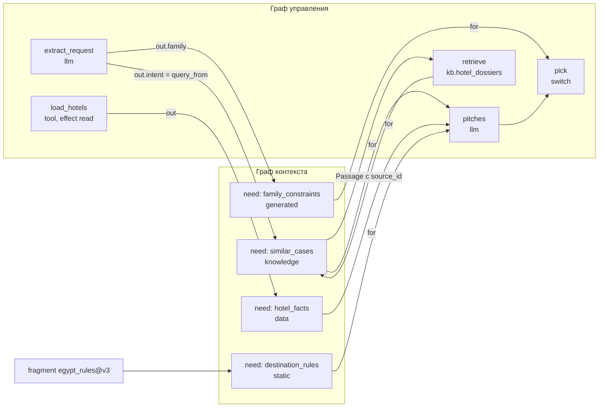

# 09. Контекстная модель

> Статус: draft
> Зависит от: [04. Формат IR](04-ir-schema.md), [07. Компилятор](07-compiler.md), [08. Промты](08-prompts.md), [10. Рантайм](10-runtime.md), [16. Модель данных](16-data-model.md), [12. Наблюдаемость и отладка](12-observability.md), [ADR-0019](adr/0019-escape-hatch-rules.md), [ADR-0025](adr/0025-python-engine.md), [ADR-0026](adr/0026-yaml-spec-and-code-refs.md), [ADR-0027](adr/0027-dynamic-io-shapes.md), [ADR-0028](adr/0028-studio-api-contract.md), [ADR-0029](adr/0029-trust-and-quality-python.md), [23. API локальной студии](23-studio-api.md)
> Источники: research/persistence.md (§3 блобы, §4 pgvector, §5 мультитенантность), research/observability.md (§6 граница данных, §7 схема спан-атрибутов), research/py-stack-runtime.md (§3, §5.5), research/py-quality-layer.md (§1.3, §2, §3), спека §6.4, §6.7, §8.2, §11, §16

## Зачем этот слой

Закрывает четыре класса провалов из §8.2: недостающий контекст (#10), лишний шумный контекст (#11),
переполнение окна и молчаливую обрезку (#12) и «непонятно, откуда кусок контекста» (#66). Механика —
одна: каждый вход узла обязан иметь объявленную потребность с типом и контрактом происхождения,
компилятор проверяет привязку до прогона, рантайм несёт метку происхождения вместе со значением.
Без этого слоя провенанс и гейты качества становятся обёртками, а отладчик не может ответить на
вопрос «почему тут такое значение».

## Решения

| Решение | Что берём | Версия | Лицензия | Почему |
|---|---|---|---|---|
| Хранение потребностей и источников | файлы дерева определений; IR с потребностями — производный | — | — | источник истины — файлы, база — перестраиваемый индекс `idx` ([ADR-0017](adr/0017-files-as-source-of-truth.md), [ADR-0026](adr/0026-yaml-spec-and-code-refs.md) §9); `kind` и форма файла — ОВ 15 |
| Проверка документа `ContextNeed` | модель описания Pydantic с `extra="forbid"` | pydantic 2.13.5 | MIT | Pydantic — на каждой границе (DECISIONS «Структурированный вывод — опровержения спеки», п. 7) |
| Типы значений | сгенерированные Pydantic-модели типов реестра (`types/*.yaml`) | pydantic 2.13.5 | MIT | один язык типов с моделями описания и выходами узлов |
| Индекс `knowledge` | PostgreSQL 18 + pgvector HNSW в схеме `app` | pgvector 0.8.6, образ `pgvector/pgvector:0.8.6-pg18` | PostgreSQL License | DECISIONS «Данные» |
| ORM и миграции для колонок векторов | не выбраны | — | — | ADR-0025 ОВ 11 (кандидаты sqlalchemy 2.0.54 и alembic 1.20.0); DDL §6.2 записан на SQL; поддержка типов pgvector — ОВ 16 |
| Эмбеддинг запроса и фрагментов | модель эмбеддингов, собранная фабрикой `aqven_llm` | pydantic-ai-slim 2.43.0 | MIT | импорт провайдеров разрешён только `aqven_llm` (ADR-0025 §6); API эмбеддингов не проверен — ОВ 3 |
| Носитель провенанса в прогоне | выход DBOS-шага исполнения узла: значения вместе с метками | dbos 2.31.1 | MIT | результат шага переживает падение процесса и берётся из записи (ADR-0025 §3–§4); сериализатор — ADR-0025 ОВ 7 |
| Источник истины по провенансу | наш Postgres `app.slot_provenance` | — | — | Провенанс — ядро доверия, нельзя ставить в зависимость от внешнего SaaS (observability §6) |
| Отображение провенанса в трассе | атрибуты `aqven.slot.*` на спанах OpenTelemetry, OTLP/HTTP в Langfuse | opentelemetry-sdk 1.44.0 | Apache-2.0 | Дубль-превью для просмотра глазами ([ADR-0012](adr/0012-langfuse-as-store.md)) |
| Хеш значения `value_sha256` | `rfc8785` + `hashlib` | 0.1.4 | Apache-2.0 | DECISIONS «Экспорт: остались канонизация и хеш» |
| Оценка размера контекста | токенизатор × коэффициент профиля | не выбран | — | ADR-0029 ОВ 4 |
| Таймаут на `human`-потребности | ожидание `DBOS.recv_async(topic, timeout_seconds)`, дедлайн — выход шага `DBOS.sleep`, политика `on_timeout` узла | dbos 2.31.1 | MIT | решение владельца, ADR-0025 §9: таймаут исполняет сам workflow, внешнего планировщика нет |
| Метрики качества поиска | pydantic-evals — прогонщик; scipy и statsmodels — статистика | 2.43.0 / 1.18.1 / 0.15.0 | MIT / BSD / BSD-3-Clause | DECISIONS «Качество» |

## 1. Тезис: потребность в контексте — это тип плюс контракт происхождения

Потребность в контексте не является «настройкой промта». Формально это тройка, привязанная к
конкретному входу конкретного узла:

```
need(node, slot) = (Type, OriginContract, Verification)
OriginContract   = (kind, locator, freshness, trust)
```

`Type` берётся из типа реестра, `OriginContract` описывает, откуда значение обязано прийти и
насколько ему можно верить, `Verification` — что должно быть проверено до того, как значение попадёт
в решение. Привязка слота (`from` из спеки §6.4) — это реализация контракта, а не замена ему:
одному слоту соответствует ровно один источник, и компилятор сверяет вид источника с объявленным
контрактом.

Проектирование начинается с контекста, а не с промтов, по трём причинам, каждая из которых
проверяема компилятором:

1. **Промт — функция от уже решённого контекста.** Шаблон не может сослаться на слот, которого нет
   в `context_needs`: непривязанный слот — ошибка R-C8, лишний слот — ошибка §8.2 #11. Значит,
   множество переменных шаблона фиксируется раньше текста.
2. **Верхняя оценка размера промта считается по границам типов, а не по тексту** (R-T9, R-C7).
   Пока нет типов и источников, оценка невозможна, и выбор модели не обоснован.
3. **Класс происхождения определяет допустимые операции.** Значение класса `untrusted` влияет на
   ветвление только через типизированный enum экстрактора, инструкции из него не исполняются
   (принцип CaMeL, спека §6.5). Это свойство источника, а не формулировки промта — переписать промт
   и сделать источник безопасным невозможно.

Практическое следствие для порядка работы Claude в Studio: этапы 2–3 маршрута (§4 спеки) —
потребности и источники — идут до этапа 5 (промты). Шаблон, который использует слот без потребности, не
проходит `aqven check`: у агента, правящего `.prompt.md` нативными инструментами, это ловит хук `flow_check`
после записи, у `flow_patch` и сохранения промта в студии — валидатор до записи.

## 2. Виды контекста

Шесть видов. Вид определяет обязательные свойства источника, способ получения значения в рантайме,
уровень доверия по умолчанию и то, какая проверка обязательна перед использованием в решении.

| Вид | Способ получения | Обязательные свойства | Доверие по умолчанию | Проверка перед решением | Чем реализован |
|---|---|---|---|---|---|
| `static` | Фрагмент или константа из дерева определений | `fragment` + `version` или `const` | `trusted` | — | файл фрагмента в `prompts/`, входит в `spec_hash`; форма ссылки на фрагмент — [08](08-prompts.md) ОВ 8 |
| `data` | Типизированная загрузка из БД или API на каждый прогон | `ttl_seconds`, схема (модель типа реестра), `trust` явно | `untrusted` для внешних API, `trusted` для своей БД | схема | узел `load` — сахар над `tool` с `effect: read` ([04](04-ir-schema.md) §2.5), исполнитель узла по таблице видов (ADR-0025 §3) |
| `knowledge` | Узел `retrieve`: запрос, индекс, фильтры, `top_k`, `rerank` | `source_id` у каждого фрагмента; цитаты там, где архетип требует опоры | `untrusted` | наличие `source_id`, покрытие цитат | pgvector 0.8.6 HNSW поверх `app.embeddings` |
| `generated` | Выход предыдущего LLM-узла | валидация до использования в решении, пометка уверенности | `untrusted` | модель выхода узла + объявленные `verify` | значение узла-производителя, записанное выходом его DBOS-шага |
| `human` | Узел `human` | тип `form`, `timeout_seconds`, `on_timeout` — ключи узла ([ADR-0026](adr/0026-yaml-spec-and-code-refs.md) §13) | `trusted` | модель типа `form`: в API до `send` и в workflow при получении | `DBOS.set_event` + `DBOS.recv_async` с таймаутом, дедлайн — выход шага `DBOS.sleep`, политики `fail`, `default`, `escalate` (ADR-0025 §9) |
| `run` | Контекст прогона | — | `trusted` | — | `$run.context.*` (`date`, `time_zone`, `locale`, `tenant_id`, [04](04-ir-schema.md) §3.1); как контекст попадает в DBOS-workflow — ОВ 17 |

Три уточнения, которых нет в спеке и которые фиксируем здесь:

- **`data` по умолчанию `untrusted`.** Спека требует у `data` «уровень доверия» как обязательное
  свойство, но не задаёт дефолт. Дефолт `untrusted` безопаснее: забытое поле не открывает дыру, а
  вызывает ошибку R-C2 при попытке подать значение в `switch` напрямую.
- **`knowledge` всегда `untrusted`.** Индекс наполняется документами, которые платформа не
  контролирует; фрагмент может содержать инструкции. Влияние на ветвление — только через экстрактор.
- **`static` — единственный вид, у которого значение участвует в хеше.** Смена фрагмента меняет
  `spec_hash` и тем самым делает два прогона формально разными версиями; смена `data` или `knowledge` —
  не меняет.

## 3. Сущность `ContextNeed`

`ContextNeed` — узел IR, а не поле узла графа. Он живёт в разделе `context/` дерева определений (§16 спеки,
раскладка — [files-first/layout.md](files-first/layout.md) §1), имеет собственный стабильный `id` и переживает
переименование потребителей через журнал `renames` в `aqven.yaml`. Значение `kind`, путь файла и то, как
называется идентификатор потребности внутри файла, — ОВ 15.

### 3.1 Схема

```python
NeedId = NewType("NeedId", str)
NodeId = NewType("NodeId", str)
IndexId = NewType("IndexId", str)
TypeRef = Annotated[str, Field(pattern=r"^[A-Z][A-Za-z0-9_]{0,62}(\[\])?\??$")]
BindingRef = Annotated[str, Field(pattern=r"^\$")]


class TrustLevel(StrEnum):
    TRUSTED = "trusted"
    UNTRUSTED = "untrusted"


class VerifyKind(StrEnum):
    SCHEMA = "schema"
    COMPLETENESS = "completeness"
    CITATIONS = "citations"
    FRESHNESS = "freshness"
    ENUM_CLOSED = "enum_closed"
    JUDGE = "judge"


class SpecModel(BaseModel):
    model_config = ConfigDict(extra="forbid", frozen=True)


class StaticFragmentSource(SpecModel):
    kind: Literal["static"]
    fragment: str
    version: int


class StaticConstSource(SpecModel):
    kind: Literal["static"]
    const: JsonValue


class DataSource(SpecModel):
    kind: Literal["data"]
    from_: BindingRef = Field(alias="from")
    ttl_seconds: Annotated[int, Field(ge=1)]
    trust: TrustLevel


class GeneratedSource(SpecModel):
    kind: Literal["generated"]
    from_: BindingRef = Field(alias="from")
    confidence_from: BindingRef | None = None


class HumanSource(SpecModel):
    kind: Literal["human"]
    node: NodeId


class RunSource(SpecModel):
    kind: Literal["run"]
    path: BindingRef


class KnowledgeSource(SpecModel):
    kind: Literal["knowledge"]
    index: IndexId
    query_from: BindingRef
    filters: Mapping[str, str | int | float | bool] = Field(default_factory=dict[str, str | int | float | bool])
    top_k: Annotated[int, Field(ge=1)]
    rerank: bool
    min_score: float | None = None


def source_kind(value: object) -> str | None:
    match value:
        case {"kind": str() as kind}:
            return kind
        case (
            StaticFragmentSource() | StaticConstSource() | DataSource() | KnowledgeSource()
            | GeneratedSource() | HumanSource() | RunSource()
        ):
            return value.kind
        case _:
            return None


StaticSource = StaticFragmentSource | StaticConstSource

ContextSource = Annotated[
    Annotated[StaticSource, Tag("static")]
    | Annotated[DataSource, Tag("data")]
    | Annotated[KnowledgeSource, Tag("knowledge")]
    | Annotated[GeneratedSource, Tag("generated")]
    | Annotated[HumanSource, Tag("human")]
    | Annotated[RunSource, Tag("run")],
    Discriminator(source_kind),
]


class ContextNeed(SpecModel):
    id: NeedId
    for_: tuple[NodeId, ...] = Field(alias="for")
    description: str
    type: TypeRef
    required: bool
    source: ContextSource
    verify: tuple[VerifyKind, ...] = ()
    compression: CompressionStrategy | None = None
```

`ContextNeed` — модель описания, поэтому на каждой границе (загрузка файла, `flow_patch`, аргументы тула
`context_bind`) документ проверяется ею с `extra="forbid"`: неизвестный ключ — `E_UNKNOWN_KEY`, все ошибки
файла за раз. Значение, которое потребность описывает, проверяется другой моделью: `type` резолвится в
сгенерированную Pydantic-модель типа реестра. Это прямое следствие DECISIONS «Структурированный вывод —
опровержения спеки», п. 7: Pydantic на каждой границе. `from` и `for` — зарезервированные слова Python, в модели
это поля `from_` и `for_` с алиасами. У `static` две формы с одним значением `kind`, поэтому дискриминатор —
функция: под тегом `static` Pydantic выбирает форму по набору ключей.

Источник `human` ссылается только на узел: тип ответа `form`, срок `timeout_seconds` и политика `on_timeout` —
ключи самого узла `human` ([ADR-0026](adr/0026-yaml-spec-and-code-refs.md) §13), второй копии в потребности нет;
R-C2 сверяет `need.type` с `form` узла. Длительность `ttl_seconds` — целые секунды, как `ttl_seconds` у `tool` в
[04](04-ir-schema.md) §2.5.

Код §3.1–§8.2 прошёл pyright 1.1.414 strict и загрузку примера §3.2 на pydantic 2.13.5 и ruamel.yaml 0.19.1
(CPython 3.14.7) при чистке документа 2026-09-16; порты `ContextGraph`, `NodeRunContext` и `Ir` в пробе были
заглушками.

Дискриминатор `kind` даёт типизированный Registry стратегий — по одному `SourceResolver` на вид в
`SourceResolvers` — и одну точку выбора с проверкой исчерпываемости `assert_never`: новый вид источника без
резолвера не проходит pyright strict, а вложенных условий нет.

```python
class SourceResolver[S](Protocol):
    def static_checks(self, need: ContextNeed, source: S, graph: ContextGraph) -> tuple[Problem, ...]: ...

    async def resolve(self, source: S, context: NodeRunContext) -> ResolvedValue: ...


@dataclass(frozen=True, slots=True)
class SourceResolvers:
    static: SourceResolver[StaticSource]
    data: SourceResolver[DataSource]
    knowledge: SourceResolver[KnowledgeSource]
    generated: SourceResolver[GeneratedSource]
    human: SourceResolver[HumanSource]
    run: SourceResolver[RunSource]


async def resolve_source(source: ContextSource, context: NodeRunContext, resolvers: SourceResolvers) -> ResolvedValue:
    match source:
        case StaticFragmentSource() | StaticConstSource():
            return await resolvers.static.resolve(source, context)
        case DataSource():
            return await resolvers.data.resolve(source, context)
        case KnowledgeSource():
            return await resolvers.knowledge.resolve(source, context)
        case GeneratedSource():
            return await resolvers.generated.resolve(source, context)
        case HumanSource():
            return await resolvers.human.resolve(source, context)
        case RunSource():
            return await resolvers.run.resolve(source, context)
        case _:
            assert_never(source)
```

После резолва всех источников узла и до рендера шаблона значения проходят хук `context_rewrite(needs, ctx)`
([ADR-0019](adr/0019-escape-hatch-rules.md)): политики видимости, доверия и PII меняют значения или блокируют
узел, но не добавляют, не удаляют и не переименовывают слоты. Результат проверяется по объявленным слотам,
лишний или пропавший ключ — `WorkflowIssue` ([ADR-0027](adr/0027-dynamic-io-shapes.md) «Динамический вход»).

### 3.2 Примеры всех видов источников

Фрагмент со списком потребностей в каноническом виде `aqven fmt` (блочный стиль, строки в двойных кавычках,
ключи в порядке полей модели, поля со значением по умолчанию не пишутся); заголовок `apiVersion`/`kind` и путь
файла — ОВ 15.

```yaml
context_needs:
- id: "family_constraints"
  for:
  - "pick"
  description: "Возраст детей, нужен ли детский клуб и пологий вход в море"
  type: "FamilyConstraints"
  required: true
  source:
    kind: "generated"
    from: "$extract_request.out.family"
    confidence_from: "$extract_request.out.confidence"
  verify:
  - "schema"
  - "completeness"
- id: "hotel_facts"
  for:
  - "score_hotels"
  - "render"
  description: "Карточки отелей по подобранному списку"
  type: "HotelBrief[]"
  required: true
  source:
    kind: "data"
    from: "$load_hotels.out"
    ttl_seconds: 3600
    trust: "trusted"
  verify:
  - "schema"
  - "freshness"
- id: "destination_rules"
  for:
  - "pitches"
  description: "Правила направления, действующие на момент сборки"
  type: "PolicyText"
  required: true
  source:
    kind: "static"
    fragment: "egypt_rules"
    version: 3
- id: "similar_cases"
  for:
  - "pitches"
  description: "Фрагменты досье отелей, близкие к намерению клиента"
  type: "Passage[]"
  required: false
  source:
    kind: "knowledge"
    index: "kb.hotel_dossiers"
    query_from: "$extract_request.out.intent"
    filters:
      destination: "egypt"
      lang: "ru"
    top_k: 5
    rerank: true
    min_score: 0.25
  verify:
  - "citations"
  compression:
    strategy: "map_reduce"
    unit: "passage"
    target_tokens: 3000
- id: "manager_correction"
  for:
  - "finalize"
  description: "Правка менеджера по итоговой подборке"
  type: "PitchCorrection"
  required: false
  source:
    kind: "human"
    node: "review_pitches"
  verify:
  - "schema"
- id: "run_locale"
  for:
  - "render"
  description: "Локаль прогона"
  type: "Locale"
  required: true
  source:
    kind: "run"
    path: "$run.context.locale"
```

`query_from: "$extract_request.out.intent"` — ключевой случай: запрос к базе знаний сам зависит от
генеративного контекста. Компилятор обязан увидеть эту зависимость как ребро графа контекста, иначе
`retrieve` может быть запланирован раньше экстрактора.

## 4. Граф контекста

### 4.1 Как строится

Граф контекста строится компилятором из раздела `context/` и привязок слотов, за один проход, до
построения плана исполнения.

Вершины трёх типов: `need` (потребность), `producer` (узел графа управления, чей выход служит
источником), `external` (фрагмент, индекс, загрузчик, узел `human`, поле контекста прогона).
Рёбра направлены «источник → потребность → потребитель»:

| Ребро | Откуда берётся | Что означает |
|---|---|---|
| `producer → need` | `source.from`, `source.query_from`, `source.node` | значение потребности не существует, пока producer не завершён |
| `external → need` | `source.fragment`, `source.index`, `source.path` | значение берётся вне графа управления |
| `need → consumer` | `need.for` | потребитель не может стартовать без удовлетворённой потребности |
| `need → need` | `query_from` внутри `knowledge`, `confidence_from` внутри `generated` | одна потребность параметризует добычу другой |

Алгоритм: разобрать ссылки грамматики [04](04-ir-schema.md) §3.1 (`$<node>.out.path`, `$input.path`,
`$run.context.*`, `{const, type}`) в пары `(vertexKind, vertexId)`; добавить рёбра; отсортировать
топологически (Kahn); на неуспехе сортировки выдать R-C6 с найденным циклом.

### 4.2 Что показывает

- **на чём держится каждое решение** — множество входящих рёбер вершины `switch`/`judge`/router;
- **где контекст генеративный, а где статичный** — окраска вершин по `source.kind` (шесть цветов,
  §16 спеки, пункт 8);
- **цепочки зависимостей** — путь «извлечённое намерение → запрос к базе знаний → найденные кейсы →
  генерация» виден как путь в графе, а не выводится человеком из чтения YAML;
- **радиус поражения правки** — потомки вершины показывают, какие решения меняются при смене
  источника; это же множество идёт в `problems[]` конверта `Envelope` при `flow_patch`.



### 4.3 Связь с графом управления

Граф контекста — не параллельная структура, а окрашенная проекция потока данных на тот же набор
узлов. Инвариант связи проверяется компилятором:

1. **Порядок.** Для каждого ребра `producer → need → consumer` в графе управления обязан
   существовать путь `producer ⇒ consumer`. Нарушение = ошибка планирования, не рантайм-ошибка:
   исполнитель IR — Interpreter, одна функция `@DBOS.workflow` — обходит план скомпилированного IR и узлы не
   переставляет ([ADR-0025](adr/0025-python-engine.md) §3).
2. **Видимость.** Ребро `need → consumer` в дивергентной ветке не даёт консьюмеру доступ к выходам
   соседних ветвей: политика видимости (§6.5 спеки) режет рёбра между ветками `parallel`, `race` и `switch`,
   и компилятор отвергает привязку к узлу чужой ветки.
3. **Циклы.** Ребро, замыкающее цикл, допустимо, только если обе вершины лежат в теле одного `loop`
   и цикл ограничен (`max_iter`, бюджет, стагнация — наш слой, DECISIONS «Наш слой»). Любой другой цикл — R-C6.
4. **Носитель.** Рёбра графа контекста материализуются в рантайме как явные чтения значений прогона по
   ссылкам 04 §3.1. Значение узла — выход его DBOS-шага, записанный по адресу исполнения
   `{node_id, branch_key, iteration, item_index}`; автослияния данных между шагами нет.

## 5. Правила R-C1..R-C8

Каждое правило — отдельный объект-визитор над графом контекста, зарегистрированный в таблице правил
компилятора (Registry + Visitor). Никаких вложенных условий: правило возвращает кортеж `Problem`,
пустой кортеж означает «прошло».

```python
class ContextRuleCode(StrEnum):
    R_C1 = "R-C1"
    R_C2 = "R-C2"
    R_C3 = "R-C3"
    R_C4 = "R-C4"
    R_C5 = "R-C5"
    R_C6 = "R-C6"
    R_C7 = "R-C7"
    R_C8 = "R-C8"


class RuleSeverity(StrEnum):
    BLOCK = "block"
    WARN = "warn"


@dataclass(frozen=True, slots=True)
class Focus:
    need_id: NeedId | None
    node_id: NodeId | None
    path: str | None


@dataclass(frozen=True, slots=True)
class ToolCall:
    tool: Literal["flow_patch"]
    arguments: Mapping[str, JsonValue]


@dataclass(frozen=True, slots=True)
class Candidate:
    title: str
    apply: ToolCall


@dataclass(frozen=True, slots=True)
class Problem:
    code: ContextRuleCode
    severity: RuleSeverity
    focus: Focus
    message: str
    candidates: tuple[Candidate, ...]


class ContextRule(Protocol):
    @property
    def code(self) -> ContextRuleCode: ...

    @property
    def severity(self) -> RuleSeverity: ...

    def check(self, graph: ContextGraph, ir: Ir) -> tuple[Problem, ...]: ...
```

`Problem` и `Candidate` сериализуются в `problems[]` и `candidates[]` конверта `Envelope`
([ADR-0028](adr/0028-studio-api-contract.md)); расхождения форм `Problem` между [14](14-mcp-contract.md) и
[23](23-studio-api.md) — 23 ОВ 11.

Все восемь проверок статические и выполняются на IR до построения плана исполнения, кроме рантайм-частей R-C3 и
R-C4, отмеченных ниже отдельно.

| Код | Точная проверка | Сев. | Сообщение об ошибке | Кандидат исправления (`apply`) |
|---|---|---|---|---|
| **R-C1** | Для каждого узла с видом ∈ {`switch`, judge, router}: множество входящих рёбер `need → node` непусто, и у каждой потребности `source` определён | block | `R-C1: решение «{nodeId}» принимается без объявленных потребностей` / `…потребность «{needId}» без источника` | `flow_patch` с `op: add_context_need` на каждый несвязанный слот решения, `source` — пустой шаблон нужного вида |
| **R-C2** | `source.kind` присутствует и входит в шесть допустимых; `typeOf(source) ≡ need.type` по структурной эквивалентности JSON Schema сгенерированных моделей после резолва типа (правила совместимости схем — ADR-0026 ОВ 3); для `data` заполнен `trust`; для `human` `need.type` совпадает с `form` узла | block | `R-C2: тип источника «{from}» = {actual}, потребность «{needId}» требует {expected}` | `flow_patch` со вставкой проекции `via` (`pick`/`map`, 04 §3.2) или шага `code` между источником и потребностью, либо смена `need.type` |
| **R-C3** | Для каждой потребности с `source.kind = generated`, входящей в узел-решение: `verify` содержит как минимум `schema`; если тип решения — enum, требуется `enum_closed`. Рантайм: исполнитель узла отказывается подать значение в решение, если проверка не отмечена как пройденная в метке провенанса | block | `R-C3: генеративный контекст «{needId}» подаётся в решение «{nodeId}» без валидации` | `flow_patch`, добавляющий `verify: ["schema"]` и, для enum, генерируемый экстрактор с закрытым списком значений |
| **R-C4** | Тип `knowledge`-источника разворачивается в `Passage[]`, где `Passage` обязан содержать `source_id`, `doc_version`, `chunk_id`. Если архетип потребителя объявляет `grounding: required` (например `retrieve_ground_answer`), выход потребителя обязан содержать `citations: Citation[]`. Рантайм: каждая цитата ссылается на `source_id` из фактически выданного множества фрагментов, иначе узел падает с `error_kind = guard` | block | `R-C4: фрагменты индекса «{index}» не несут source_id` / `R-C4: архетип «{archetype}» требует цитат, в выходе «{nodeId}» нет поля citations` | `flow_patch`, расширяющий `out` узла полем `citations` и включающий проверку опоры |
| **R-C5** | `source.kind = data` → `ttl_seconds` задан и положителен; `source.kind = static` → задан `version` (целое) либо `const`. Ссылка `fragment` без версии не резолвится (форма ссылки — [08](08-prompts.md) ОВ 8) | block | `R-C5: у источника «{needId}» вида data не задан ttl_seconds` / `…вида static не зафиксирована версия фрагмента «{fragment}»` | `flow_patch` с `ttl_seconds` по умолчанию профиля проекта либо с пином фрагмента на текущую версию |
| **R-C6** | Топологическая сортировка графа контекста завершается успешно; при неуспехе все рёбра найденного цикла обязаны принадлежать телу одного `loop` с объявленным ограничением итераций | block | `R-C6: цикл в зависимостях контекста: {needA} → {needB} → {needA}` | `flow_patch`, оборачивающий участок в `loop` с `max_iter`, либо разрыв ребра `query_from` |
| **R-C7** | `estimate(node) = static_template_tokens + Σ upper_bound(slot) + output_reserve ≤ window(profile) × context_safety_ratio`; если оценка превышает порог, у каждой потребности с неограниченной кардинальностью обязана быть задана `compression` | block | `R-C7: верхняя оценка контекста узла «{nodeId}» = {estimate} токенов при окне {window}; стратегия сжатия не задана для «{needId}»` | `flow_patch` с `compression: {strategy: "map_reduce"}` для самой крупной потребности, либо смена профиля модели на больший `window` |
| **R-C8** | Двунаправленная проверка: множество `need.for` покрывает всех потребителей, ссылающихся на этот `need`; каждый слот узла имеет ровно одну потребность. Потребность с пустым `for` или без входящих привязок — мёртвая | block (обе стороны) | `R-C8: потребность «{needId}» не используется ни одним узлом` / `R-C8: слот «{nodeId}.{slot}» не объявлен ни одной потребностью` | `flow_patch`: удалить мёртвую потребность либо добавить недостающую с выводом типа из `in` узла |

Дисциплина сообщений: текст всегда называет `needId` или пару `nodeId.slot`, никогда не «в
конфигурации есть ошибка». Конверт ответа на `flow_patch` несёт эти `problems[]` вместе с готовыми
`candidates[].apply` — Claude применяет исправление одним вызовом, без чтения всего проекта
(DECISIONS «MCP-контракт»).

`context_safety_ratio` — параметр профиля модели (см. §8), а не константа в коде правила.

## 6. Источники `knowledge`

### 6.1 Узел `retrieve`

Потребность вида `knowledge` компилируется в отдельный узел графа управления — `retrieve` (в IR это `tool` с
`effect: read`, [04](04-ir-schema.md) §2.5). Он не встроен в LLM-узел: у него свой спан, своя стоимость и свой
шаг исполнения, иначе поиск невозможно переиграть отдельно от генерации. Как для реплея записываются эмбеддинг
запроса и результат поиска, — ОВ 3.

```python
class RetrieveConfig(SpecModel):
    index: IndexId
    query_from: BindingRef
    filters: Mapping[str, str | int | float | bool]
    top_k: Annotated[int, Field(ge=1)]
    rerank: bool
    min_score: float | None
    ef_search: Annotated[int, Field(ge=1)]


class Passage(SpecModel):
    source_id: str
    doc_version: int
    chunk_id: str
    text: str
    score: float
    retrieved_at: datetime
```

`source_id`, `doc_version`, `chunk_id` — обязательные поля, а не рекомендация: на них держится R-C4,
проверка опоры и кнопка «откуда это» в отладчике. Фрагмент без `source_id` не может быть возвращён —
это ошибка индексации, а не пустой результат.

Порядок операций в исполнителе: резолв запроса из `query_from` → эмбеддинг запроса → ANN-поиск с
фильтрами → отсечение по `min_score` → опциональный rerank → усечение до `top_k` → сборка `Passage[]`
с метками провенанса. Каждый шаг пишет свой тайминг в `aqven.timing.*`.

### 6.2 Хранилище

pgvector 0.8.6 (образ `pgvector/pgvector:0.8.6-pg18`) в схеме `app`, индекс HNSW.

Таблица не своя: `knowledge` живёт в общей `app.embeddings`, канонический DDL которой — в
[16. Модель данных](16-data-model.md) §5 (LIST-партиционирование по `tenant_id`, функция
`app.ensure_tenant_embeddings` заводит партицию тенанта вместе с локальным HNSW и RLS). Фрагменты
попадают туда пишущей стороной оттуда же — одна транзакция на документ: нормализация текста, нарезка
на чанки, `content_hash`, полное удаление прежних строк документа, эмбеддинги пачкой через модель из фабрики
`aqven_llm` (ОВ 3) и один многострочный `INSERT`; строки базы знаний отличаются от остальных значением
`kind = 'knowledge'`. Адресуется фрагмент документом и порядковым номером чанка внутри него плюс `source_uri`;
именно эта тройка и отдаётся наружу как `source_id`, `doc_version`, `chunk_id` в `Passage` (§6.1) — то, на чём
держатся R-C4 и цитаты.

```sql
CREATE EXTENSION IF NOT EXISTS vector;

CREATE TABLE app.embeddings (
  id          uuid NOT NULL DEFAULT uuidv7(),
  tenant_id   uuid NOT NULL,
  project_id  uuid NOT NULL,
  index_id    text NOT NULL,
  source_id   text NOT NULL,
  doc_version integer NOT NULL,
  chunk_id    text NOT NULL,
  content     text NOT NULL,
  attrs       jsonb NOT NULL DEFAULT '{}'::jsonb,
  embedding   vector(1536) NOT NULL,
  created_at  timestamptz NOT NULL DEFAULT now(),
  PRIMARY KEY (tenant_id, id)
) PARTITION BY LIST (tenant_id);

CREATE INDEX embeddings_hnsw ON app.embeddings
  USING hnsw (embedding vector_cosine_ops) WITH (m = 16, ef_construction = 64);
CREATE INDEX embeddings_scope ON app.embeddings (project_id, index_id);
CREATE INDEX embeddings_attrs ON app.embeddings USING gin (attrs jsonb_path_ops);
```

ORM и миграции схемы `app` не выбраны ([ADR-0025](adr/0025-python-engine.md) ОВ 11): drizzle-kit снят, кандидаты
sqlalchemy 2.0.54 и alembic 1.20.0 против RLS, партиций и ролей не проверены. Поддержка типов `vector` и `halfvec`,
HNSW-индекса с opclass и создание расширения в первой миграции выбранным инструментом — ОВ 16; до выбора DDL
выше — источник для миграции.

Параметры: старт `m = 16, ef_construction = 64`, на запросе `SET hnsw.ef_search = 40..100`, значение
крутится по recall (§6.4). HNSW, а не IVFFlat: данные дописываются непрерывно, а IVFFlat требует
«сначала загрузи, потом индексируй» и деградирует при дозаписи.

**Подводный камень фильтрации.** Запрос `WHERE project_id = $1 AND index_id = $2 ORDER BY embedding <=> $3 LIMIT 10`
при обычном HNSW сначала берёт top-k по вектору и только потом фильтрует, поэтому может вернуть
меньше `top_k` строк или мусор. Лечим двумя мерами сразу: партиционирование `app.embeddings` по
`tenant_id` (оно же нужно под RLS) и итеративные сканы индекса (`hnsw.iterative_scan`, появились в
pgvector 0.8.0). Исполнитель `retrieve` обязан проверять фактическое число возвращённых фрагментов и
помечать результат `underfilled: true`, если их меньше `top_k` при непустом индексе.

Критерий выхода из pgvector зафиксирован заранее: **> 5 млн векторов на инстанс или p95 поиска
> 150 мс при корректно настроенном HNSW** — тогда выделенный ANN. Ориентир масштаба: 10k компонентов
× 10 чанков = 100k векторов, это заведомо территория pgvector.

### 6.3 Обязательность цитат

Архетипы с опорой на вход (`retrieve_ground_answer` и производные) объявляют `grounding: required`.
Для них компилятор расширяет выход узла полем `citations: Citation[]`, а исполнитель
выполняет проверку опоры после проверки выхода моделью:

```python
@dataclass(frozen=True, slots=True)
class GroundingPassed:
    pass


@dataclass(frozen=True, slots=True)
class GroundingBlocked:
    detail: Literal["citation_out_of_scope", "no_citations"]
    unknown: tuple[str, ...]
    error_kind: Literal["guard"] = "guard"


type GroundingResult = GroundingPassed | GroundingBlocked


def check_grounding(output: GroundedOutput, passages: Sequence[Passage]) -> GroundingResult:
    allowed = {passage.source_id for passage in passages}
    unknown = tuple(citation.source_id for citation in output.citations if citation.source_id not in allowed)
    if unknown:
        return GroundingBlocked("citation_out_of_scope", unknown)
    if not output.citations:
        return GroundingBlocked("no_citations", ())
    return GroundingPassed()
```

Провал — не исключение процесса, а `aqven.result.status = "blocked"` с `aqven.rules.fired = ["R-C4"]`;
дальше работает объявленная политика узла (retry с сужением, фолбэк, отказ).

### 6.4 Как меряется качество поиска

Качество `knowledge` меряется отдельно от качества генерации, на собственном датасете запросов с
эталонными документами: файл `datasets/<name>.yaml` в структуре `Dataset` pydantic-evals
([ADR-0029](adr/0029-trust-and-quality-python.md) §9), проекция — `app.datasets` ([16](16-data-model.md)).
Элемент датасета: `{query, relevant_source_ids}`.

| Метрика | Определение | Для чего |
|---|---|---|
| `recall@k` | доля элементов датасета, у которых хотя бы один `relevant_source_id` попал в top-k | основная, фиксируется в гейте |
| `recall@k_full` | средняя доля эталонных документов, попавших в top-k | ловит потерю части опоры при `top_k` > 1 |
| `underfilled_rate` | доля запросов, где фактических фрагментов меньше `top_k` | детектор проблемы «фильтр + ANN» |
| `p95_latency_ms` | 95-й перцентиль времени поиска | критерий выхода из pgvector |

Прогон метрик — офлайн, через pydantic-evals 2.43.0 (`Dataset`, `Evaluator`, `evaluate`) теми же средствами, что и
остальные evals. Сравнение двух конфигураций поиска (`top_k`, `ef_search`, `rerank`) идёт через
общий статистический аппарат: парный бутстрап BCa (`scipy.stats.bootstrap(..., method="BCa")` по массиву разниц,
B = 10000, фиксированный seed), минимум 200 элементов для блокирующего гейта, обязательный A/A-прогон до сравнения
A/B (DECISIONS «Качество»). Абсолютный порог `recall@k` задаётся на проекте при заведении индекса и хранится
рядом с описанием индекса — общего числа для всех проектов не назначаем.

## 7. Провенанс значения в рантайме

### 7.1 Что несёт метка

Спека §6.4 требует, чтобы значение несло узел, путь, версию и уровень доверия. Добавляем класс
происхождения и поля, без которых нельзя ни отладить, ни воспроизвести:

```python
class SourceKind(StrEnum):
    STATIC = "static"
    DATA = "data"
    KNOWLEDGE = "knowledge"
    GENERATED = "generated"
    HUMAN = "human"
    RUN = "run"


class ProvenanceTag(SpecModel):
    need_id: NeedId | None
    origin_class: SourceKind
    node_id: NodeId | None
    path: str
    version: str | None
    trust: TrustLevel
    confidence: float | None
    verified: tuple[VerifyKind, ...]
    value_sha256: str
    origin_span_id: str
    produced_at: datetime
    expires_at: datetime | None
```

| Поле | Заполняется | Зачем |
|---|---|---|
| `need_id` | компилятором | связь значения с объявленным контрактом; `None` только у системных значений |
| `origin_class` | по `source.kind` | окраска в UI, политика доверия, фильтр в трассах |
| `node_id` + `path` | резолвером ссылки | клик «откуда это» ведёт в конкретный выход конкретного узла |
| `version` | версия фрагмента, `doc_version`, хеш схемы загрузчика | ответ на «поменялась спека или данные» |
| `trust` | из вида и `source.trust` | гейт CaMeL: `untrusted` в ветвление только через экстрактор |
| `confidence` | `confidence_from` у `generated`, `score` у `knowledge` | пометка уверенности, требуемая спекой для `generated` |
| `verified` | исполнителем после каждой проверки | R-C3 в рантайме: решение видит, что именно проверено |
| `value_sha256` | канонизация `rfc8785` 0.1.4 + sha256 `hashlib` с доменной сепарацией, префикс `sha256-` | дифф прогонов, дедуп блобов, кассеты |
| `origin_span_id` | id текущего спана OpenTelemetry: `trace.get_current_span().get_span_context().span_id`, строкой через `trace.format_span_id` | переход «строка в БД → спан в трассе» без своей мапы id |
| `expires_at` | `produced_at + ttl_seconds` у `data` | проверка `freshness`, honest-ошибка вместо тихого протухания |

### 7.2 Как передаётся по графу

Носитель — выход DBOS-шага: исполнение узла — `@DBOS.step`, его выход (значения узла вместе с метками)
записывается в системную БД DBOS и после падения процесса берётся из записи, а не вычисляется заново
([ADR-0025](adr/0025-python-engine.md) §3–§4). На границе шага значения JSON-совместимы
(`model_dump(mode="json")`); выбор сериализатора DBOS — ADR-0025 ОВ 7. Автослияние данных между шагами не
используется — привязки читают значения прогона явно.

Правило распространения по преобразованиям — таблица стратегий, одна на вид проекции:

| Преобразование | Что делает с меткой |
|---|---|
| `pick` / `omit` | метка наследуется целиком, `path` дописывается |
| `map` | метка элемента наследуется от элемента источника, не от массива |
| `flatten` | множество меток сохраняется поэлементно, дедуп по `value_sha256` |
| `const` | новая метка `origin_class = static`, `trust = trusted` |
| слияние нескольких источников в один слот | `merge_tags` по решётке ниже |
| выход LLM-узла | новая метка `origin_class = generated`; входные метки сохраняются в `derived_from` |

```python
@dataclass(frozen=True, slots=True)
class MergedTag:
    trust: TrustLevel
    verified: frozenset[VerifyKind]
    origin_classes: tuple[SourceKind, ...]
    derived_from: tuple[str, ...]


TRUST_ORDER: Mapping[TrustLevel, int] = {TrustLevel.UNTRUSTED: 0, TrustLevel.TRUSTED: 1}
EMPTY_MERGE = MergedTag(TrustLevel.TRUSTED, frozenset(), (), ())


def merge_tags(tags: Sequence[ProvenanceTag]) -> MergedTag:
    if not tags:
        return EMPTY_MERGE
    trust = min((tag.trust for tag in tags), key=TRUST_ORDER.__getitem__)
    verified = frozenset(tags[0].verified).intersection(*(tag.verified for tag in tags[1:]))
    origin_classes = tuple(dict.fromkeys(tag.origin_class for tag in tags))
    return MergedTag(trust, verified, origin_classes, tuple(tag.value_sha256 for tag in tags))
```

Решётка доверия одноуровневая: `untrusted` поглощает. Множество `verified` при слиянии — пересечение,
а не объединение: значение считается проверенным только по тем проверкам, которые прошли все его
составляющие. Это и есть рантайм-часть R-C3.

### 7.3 Где это лежит

Граница ровно та же, что для остальных данных отладчика: в Postgres — всё, от чего зависит поведение,
в бэкенде трасс — всё, что нужно посмотреть глазами. Провенанс слотов — источник истины в нашем
Postgres (`app.slot_provenance`), в трассы уходит компактный дубль.

| Артефакт | Источник истины | Дубль в трассе |
|---|---|---|
| Метки слотов узла | `app.slot_provenance` (партиционируется вместе с `run_nodes` помесячно) | `aqven.slot.names[]`, `aqven.slot.sources[]`, `aqven.slot.origin_span_ids[]`, `aqven.slot.confidences[]`, `aqven.slot.value_sha256[]`, `aqven.slot.required[]`, `aqven.slot.missing[]`, `aqven.slot.count` |
| Значение слота | правило трёх зон: < 8 КБ — `jsonb` в строке; 8 КБ – 1 МБ — `app.blobs`; > 1 МБ — объектное хранилище по sha256 | только `preview` + `ref` (`blob://sha256/<hash>`) |
| Отрисованный промт с подсветкой слотов | `app.blobs` | `aqven.prompt.rendered_preview` + `aqven.prompt.rendered_sha256` + `aqven.prompt.template_sha256` |
| Фрагменты `knowledge` | `app.blobs` + ссылки на `app.embeddings` | `preview` + `source_id[]` |

Атрибуты слотов пишутся параллельными массивами, а не вложенным объектом: OTel не поддерживает
вложенность, а по массивам бэкенды трасс умеют фильтровать. Ограничение — лимит числа атрибутов на спан
в SDK OpenTelemetry (≈ 128 по умолчанию; для opentelemetry-sdk 1.44.0 проверить — ОВ 9); при большом числе слотов
исполнитель переключается на `aqven.slot.provenance_json` + блоб. Единственное место формирования атрибутов —
`build_node_span_attributes(ctx) -> Attributes`; россыпь `span.set_attribute` по коду запрещена.

### 7.4 Как показывается в отладчике

- **Инспектор узла:** список слотов, у каждого значок класса происхождения, `trust`, `confidence` и
  ссылка; клик по слоту ведёт к производящему узлу (`node_id` + `path`) или к фрагменту
  в `prompts/`, для `knowledge` — к документу по `source_id` и `chunk_id`.
- **Отрисованный промт** с подсветкой слотов: подсветка красится тем же классом происхождения, что и
  в графе контекста; наведение показывает метку целиком.
- **Панель «почему»:** какие правила и гварды сработали (`aqven.rules.fired`), включая `R-C3`/`R-C4`.
- **Lineage значения:** обход `derived_from` по `value_sha256` даёт цепочку «как значение
  преобразовывалось по стадиям и в каких промтах использовалось» без отдельного хранилища связей.
- **Дифф двух прогонов:** сравнение по `value_sha256` слотов отвечает, разошлись данные или
  конфигурация (`aqven.config.hash`), до сравнения текстов.

## 8. Управление размером контекста

### 8.1 Оценка

Оценка верхняя и статическая — по границам типов, а не по фактическому тексту. Это условие R-C7 и
R-T9: проверка обязана срабатывать на компиляции, до первого прогона.

```
estimate(node) = static_template_tokens
               + Σ upper_bound(slot_i)
               + output_reserve
порог:           estimate(node) ≤ window(profile) × context_safety_ratio
```

| Величина | Как считается |
|---|---|
| `static_template_tokens` | токенизация литеральных участков шаблона python-liquid (`ContentNode` вне динамических тегов — они же точки кэширования, [08](08-prompts.md) §5.2) |
| `upper_bound(string)` | `maxLength` типа ÷ средняя длина токена профиля; тип без `maxLength` считается неограниченным |
| `upper_bound(array)` | `maxItems × upper_bound(item)`; для `knowledge` это `top_k × max_chunk_tokens` — поэтому `knowledge` всегда ограничен по построению |
| `upper_bound(enum)` | длина самого длинного значения |
| `upper_bound(Dynamic)` | худший случай по `limits` ([ADR-0027](adr/0027-dynamic-io-shapes.md)) |
| `output_reserve` | `max_tokens` эффективной конфигурации узла |
| токенизатор | не выбран ([ADR-0029](adr/0029-trust-and-quality-python.md) ОВ 4), результат умножается на поправочный коэффициент профиля модели |

Неограниченный тип в слоте — это не «оценка неизвестна», а прямой запрет: компилятор требует либо
границу в типе, либо объявленную `compression`. Молчаливой оценки «по среднему» нет.

### 8.2 Стратегии сжатия

```python
class NoCompression(SpecModel):
    strategy: Literal["none"]


class DropOptional(SpecModel):
    strategy: Literal["drop_optional"]
    order: tuple[NeedId, ...]


class TopKCut(SpecModel):
    strategy: Literal["top_k_cut"]
    min_k: Annotated[int, Field(ge=1)]


class Summarize(SpecModel):
    strategy: Literal["summarize"]
    via: NodeId
    target_tokens: Annotated[int, Field(ge=1)]


class MapReduce(SpecModel):
    strategy: Literal["map_reduce"]
    unit: Literal["item", "passage", "chunk"]
    target_tokens: Annotated[int, Field(ge=1)]


class Chunk(SpecModel):
    strategy: Literal["chunk"]
    unit_tokens: Annotated[int, Field(ge=1)]
    overlap_tokens: Annotated[int, Field(ge=1)]


CompressionStrategy = Annotated[
    NoCompression | DropOptional | TopKCut | Summarize | MapReduce | Chunk,
    Field(discriminator="strategy"),
]
```

| Стратегия | Когда применима | Где применяется | Что меняет |
|---|---|---|---|
| `none` | тип ограничен и оценка укладывается | — | ничего; при превышении — ошибка компиляции |
| `drop_optional` | есть потребности с `required: false` | рантайм, до вызова провайдера | выбрасывает необязательные потребности в объявленном порядке, метка отсутствия попадает в `aqven.slot.missing` |
| `top_k_cut` | источник `knowledge` | рантайм | снижает `top_k` до `min_k`; ниже `min_k` не опускается, вместо этого эскалация |
| `summarize` | крупный `data` или `generated` | компиляция: вставляется узел `llm` | результат — новая потребность вида `generated` со своим `verify`; сжатие не отменяет R-C3 |
| `map_reduce` | коллекция однородных элементов | компиляция: узел `map` + шаг сведения | обрабатывает элементы по одному, окно не переполняется по построению |
| `chunk` | один крупный документ | компиляция: разбиение входа + сведение | перекрытие `overlap_tokens` обязательно, иначе теряются границы |

Разделение принципиальное: `map_reduce`, `chunk` и `summarize` меняют топологию графа, поэтому
раскрываются **компилятором** и видны в графе управления; в рантайме их «включить» нельзя. Рантайм
располагает только двумя ограниченными рычагами — `drop_optional` и `top_k_cut`, оба объявлены
заранее и оба оставляют след в трассе.

### 8.3 Что делаем при переполнении

Обрезка текста запрещена во всех режимах: обрезанный вход даёт правдоподобный и неверный ответ, а
это ровно тот класс провала, который платформа обязана ловить (§8.2 #12), и он же зеркалит правило
«обрезанный ответ чинить запрещено» из DECISIONS.

Порядок на компиляции:

1. `estimate ≤ порог` — узел компилируется.
2. `estimate > порог`, `compression.strategy = none` — **BLOCK** R-C7 с двумя кандидатами: включить
   `map_reduce`/`chunk` либо взять профиль с большим окном.
3. `estimate > порог`, стратегия объявлена — компилятор раскрывает её и **пересчитывает оценку для
   получившейся топологии**; если и она не укладывается, это снова BLOCK. Рекурсия ограничена одним
   раскрытием: вложенное авто-раскрытие запрещено.

Порядок в рантайме, перед каждым вызовом провайдера (проверка живёт в исполнителе LLM-узла, до
отправки запроса):

1. Пересчитать фактический размер отрисованного промта тем же токенизатором.
2. Фактический размер ≤ порога — вызывать.
3. Превышение — применить объявленные рантайм-рычаги в порядке `drop_optional` → `top_k_cut`, каждый
   раз пересчитывая размер и записывая шаг в `aqven.rules.fired`.
4. Рычаги исчерпаны — узел завершается с `aqven.result.status = "blocked"`,
   `aqven.result.error_kind = "guard"`, состояние прогона сохранено в записях шагов DBOS. Прогон
   останавливается штатно; тихой отправки урезанного промта не происходит никогда. Продолжение — fork
   (`DBOS.fork_workflow`); fork с изменённым IR или входом не проверен — ADR-0025 ОВ 8.

Фактическое превышение при корректной статической оценке — сигнал о неверном коэффициенте профиля
токенизатора; исполнитель пишет пару `(estimate, actual)` в спан, по накопленной статистике
коэффициенты калибруются.

## Открытые вопросы

1. **Значение `context_safety_ratio`.** Ни спека, ни исследование не дают числа. Рабочее
   предположение — 0.9, но оно не обосновано. *Закрыть:* прогнать 20 типовых узлов на трёх профилях,
   измерить разброс `actual / estimate`, взять `ratio = 1 − 3σ`, зафиксировать ADR.
2. **Поправочные коэффициенты токенизатора по профилям моделей.** Токенизатор оценки не выбран
   ([ADR-0029](adr/0029-trust-and-quality-python.md) ОВ 4), таблицы коэффициентов нет. *Закрыть:* после выбора
   токенизатора снять записанный в кассетах `usage` провайдера против локальной оценки на 200 запросах на модель,
   завести колонку коэффициента в каталоге моделей.
3. **Эмбеддинги в Pydantic AI 2.43.0.** В research известен только `OpenAIEmbeddingModel`
   (`embeddings/openai.py`, использует tiktoken); сигнатура вызова, пакетная отправка, место построения в фабрике
   `aqven_llm`, прохождение цепочки гарантий и запись в кассету для реплея `retrieve` не проверены — цепочка
   ADR-0029 §1 построена на `WrapperModel` для моделей чата. *Закрыть:* прочитать исходник
   `pydantic_ai/embeddings/`, проба с `httpx2.MockTransport` (пачка текстов, 429, число HTTP-вызовов, реплей),
   зафиксировать API и способ записи в [11. Провайдеры](11-providers.md).
4. **Интерфейс ретривера в `@voltagent/core@2.10.0`.** Закрыт снятием VoltAgent ([ADR-0025](adr/0025-python-engine.md)):
   `retrieve` — только узел графа управления (§6.1).
5. **`hnsw.iterative_scan` на pgvector 0.8.6.** Поведение взято из описания релиза 0.8.0, руками не
   воспроизводилось. *Закрыть:* интеграционный тест под pytest 9.1.1 на PostgreSQL 18 + pgvector 0.8.6 (образ
   `pgvector/pgvector:0.8.6-pg18`; способ поднять контейнер в тестах не выбран): 100k векторов, селективный
   фильтр 1 %, сравнить число возвращённых строк при `strict_order` / `relaxed_order` / выключенном режиме.
6. **HNSW-индекс на партиционированной таблице.** DDL в §6.2 создаёт индекс на партиционированной
   `app.embeddings` (LIST по `tenant_id`), что даёт индекс на каждую партицию. Стоимость построения и
   потребление RAM при десятках тенантов не оценены. *Закрыть:* замер на 20 партициях × 50k векторов.
7. **Rerank.** В спеке только флаг `rerank: true`; ни модель, ни провайдер, ни бюджет на rerank не
   выбраны. *Закрыть:* сравнить два кандидата на датасете retrieval по `recall@k_full` и латентности,
   внести выбор в DECISIONS.
8. **Модель эмбеддингов и размерность.** `vector(1536)` взято из наброска DDL, а не из решения; не
   рассмотрен `halfvec` (вдвое меньше памяти под HNSW). *Закрыть:* выбрать модель эмбеддингов, затем
   решить `vector` vs `halfvec` замером recall.
9. **Форма провенанса в спане.** Исследование оставляет развилку явно: параллельные массивы
   `aqven.slot.*` (фильтруемы в бэкенде трасс) против одной JSON-строки `aqven.slot.provenance_json`
   (не упирается в лимит атрибутов). *Закрыть:* прототип на узле с 40 слотами, проверить
   фильтрацию в Langfuse при экспорте OTLP/HTTP ([ADR-0012](adr/0012-langfuse-as-store.md)) и фактический лимит и
   усечение атрибутов в opentelemetry-sdk 1.44.0.
10. **Противоречие в заметках по `app.embeddings`.** Набросок DDL в research/persistence.md §4 не
    содержит `tenant_id` и не партиционирован, тогда как §5 тех же заметок и DECISIONS требуют
    `tenant_id` во всех таблицах + RLS, а §4 в тексте рекомендует партиционирование по
    `project_id`/`tenant_id`. В документе принята версия с `tenant_id` и LIST-партиционированием.
    Отдельно: набор колонок в §6.2 (`index_id`, `source_id`, `doc_version`, `chunk_id`, `attrs`) —
    проекция под `knowledge`-поиск, а канонический набор в [16](16-data-model.md) §5 другой
    (`kind`, `ref_id`, `ref_key`, `chunk_index`, `source_uri`). *Закрыть:* подтвердить выбор ключа
    партиционирования (`tenant_id` против `project_id`) на ожидаемом профиле нагрузки, свести два
    набора колонок в один и починить набросок DDL.
11. **Противоречие внутри спеки §6.7.** Таблица видов требует у `data` три обязательных свойства
    (TTL, схема, уровень доверия), а правило R-C5 проверяет только TTL. В документе проверка `trust`
    отнесена к R-C2. *Закрыть:* зафиксировать распределение проверок между R-C2 и R-C5 в каталоге
    правил компилятора.
12. **Порог `recall@k` для гейта.** Общего числа не назначаем, порог задаётся при заведении индекса —
    но не определено, кто его утверждает и что происходит при отсутствии значения. *Закрыть:* описать
    дефолтное поведение гейта (`GATE_UNAVAILABLE` против WARN) в документе по гейтам выпуска.
13. **`verify: ["judge"]` как вид проверки генеративного контекста.** Пересекается с правилами судей
    `R-J1..R-J6`; граница «когда проверка контекста, а когда судья качества» не проведена.
    *Закрыть:* согласовать с документом по судьям, при необходимости убрать `judge` из `VerifyKind`.
14. **Ретенция цепочек `derived_from`.** Длинные прогоны с циклами дают рост числа связей;
    политика хранения и обрезки lineage не определена. *Закрыть:* оценить объём на прогоне с
    `max_iter = 10` и задать ретенцию вместе с партициями `run_nodes`.
15. **Файл потребностей контекста.** [files-first/layout.md](files-first/layout.md) §1 кладёт потребности в
    `context/<flow_id>.yaml`, а в `flow.yaml` есть ключ `context`; значения `kind` для `context/` в
    [ADR-0026](adr/0026-yaml-spec-and-code-refs.md) нет (ОВ 9 там). Идентичность в дереве — путь, поля `id`
    внутри файлов нет ([ADR-0017](adr/0017-files-as-source-of-truth.md)), а элементы списков в формате ADR-0026
    называются ключом `name`; пример §3.2 пока несёт `id`. *Закрыть:* при чистке 03, 06 и layout.md выбрать
    `kind`, путь (отдельный файл или ключ `flow.yaml`) и ключ имени потребности, внести модель описания и
    переписать пример §3.2 полным файлом с заголовком `apiVersion`/`kind`.
16. **Типы pgvector в ORM схемы `app`.** Drizzle снят, ORM и миграции не выбраны
    ([ADR-0025](adr/0025-python-engine.md) ОВ 11). *Закрыть:* в спайке миграции ОВ 11 проверить колонку `vector` и
    `halfvec`, HNSW-индекс с `vector_cosine_ops` и параметрами `WITH (...)`, создание расширения в первой миграции и
    партицию тенанта через `app.ensure_tenant_embeddings`; итог записать в §6.2 и [16](16-data-model.md) §5.
17. **Контекст прогона в DBOS-workflow.** Вход DBOS-workflow — хеш IR и вход воркфлоу (ADR-0025 §4, п. 1), а
    `$run.context.date`, `time_zone`, `locale`, `tenant_id` (04 §3.1) должны фиксироваться при старте и
    одинаково читаться после восстановления и в форке. Носитель — третий аргумент workflow, событие или запись
    в нашем индексе прогонов — не решён. *Закрыть:* решить в [10. Рантайм](10-runtime.md) вместе с ADR-0025 ОВ 8;
    проба на SQLite: старт с контекстом, SIGKILL, восстановление, `fork_workflow`, сверка значений `run`-источника.
