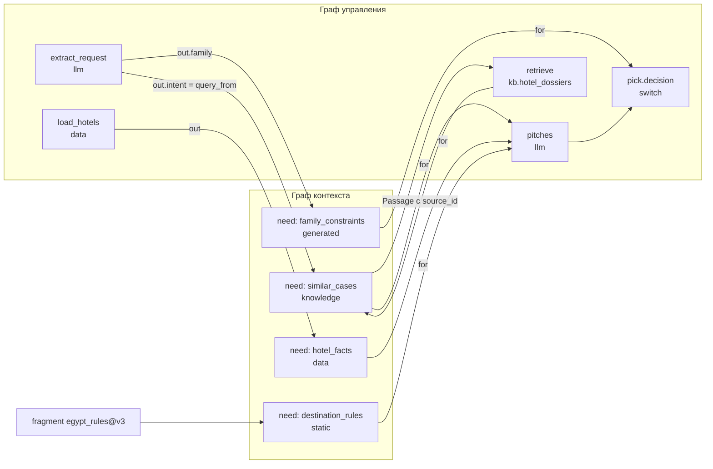

# 09. Контекстная модель

> Статус: draft
> Зависит от: [04. Формат IR](04-ir-schema.md), [07. Компилятор](07-compiler.md), [08. Промты](08-prompts.md), [10. Рантайм](10-runtime.md), [16. Модель данных](16-data-model.md), [12. Наблюдаемость и отладка](12-observability.md)
> Источники: research/persistence.md (§3 блобы, §4 pgvector, §5 мультитенантность), research/observability.md (§6 граница данных, §7 схема спан-атрибутов), спека §6.4, §6.7, §8.2, §11, §16

## Зачем этот слой

Закрывает четыре класса провалов из §8.2: недостающий контекст (#10), лишний шумный контекст (#11),
переполнение окна и молчаливую обрезку (#12) и «непонятно, откуда кусок контекста» (#66). Механика —
одна: каждый вход узла обязан иметь объявленную потребность с типом и контрактом происхождения,
компилятор проверяет привязку до прогона, рантайм несёт метку происхождения вместе со значением.
Без этого слоя провенанс и гейты качества становятся обёртками, а отладчик не может ответить на
вопрос «почему тут такое значение».

## Решения

| Решение | Что берём | Версия | Лицензия | Почему |
|---|---|---|---|---|
| Хранение потребностей и источников | JSONB в `app.spec_versions` (content-addressed), наш IR | — | — | Источник истины — БД, YAML только транспорт (DECISIONS «Экспорт») |
| Валидация IR-документа `ContextNeed` | ajv на границе ввода | — | MIT | На границах ajv, на горячем пути zod (DECISIONS «Структурированный вывод», п. 6) |
| Типы значений на горячем пути | zod | 4.6.2 | MIT | Один язык типов с IR-схемами |
| Индекс `knowledge` | PostgreSQL 18 + pgvector HNSW в схеме `app` | pgvector 0.8.6, образ `pgvector/pgvector:0.8.6-pg18` | — | Встроенное векторное хранилище `@voltagent/postgres` — BYTEA + полный перебор без ANN, не берём (DECISIONS «Данные») |
| Колонки векторов в ORM | drizzle-orm `vector`/`halfvec` + `.using('hnsw', ...)` | 0.45.2 | Apache-2.0 | Типы pgvector 0.7+ подтверждены в `pg-core/columns/vector_extension/` |
| Носитель провенанса в прогоне | VoltAgent `workflowState` + `setWorkflowState` | @voltagent/core 2.10.0 | MIT | Переживает suspend/resume и восстанавливается из чекпоинта |
| Источник истины по провенансу | наш Postgres `app.slot_provenance` | — | — | Провенанс — ядро доверия, нельзя ставить в зависимость от внешнего SaaS (observability §6) |
| Отображение провенанса в трассе | атрибуты `wf.slot.*` + Langfuse | @langfuse/tracing 5.11.1 | MIT | Дубль-превью для просмотра глазами |
| Оценка размера контекста | gpt-tokenizer (o200k_base) × коэффициент профиля | — | MIT | DECISIONS «Промты» |
| Таймаут на `human`-потребности | pg-boss `sendAfter` + сверяющий cron | 12.x | MIT | VoltAgent сам по таймауту не возобновляет (DECISIONS) |

## 1. Тезис: потребность в контексте — это тип плюс контракт происхождения

Потребность в контексте не является «настройкой промта». Формально это тройка, привязанная к
конкретному входу конкретного узла:

```
need(node, slot) = (Type, OriginContract, Verification)
OriginContract   = (kind, locator, freshness, trust)
```

`Type` берётся из IR-схемы компонента, `OriginContract` описывает, откуда значение обязано прийти и
насколько ему можно верить, `Verification` — что должно быть проверено до того, как значение попадёт
в решение. Привязка слота (`from:` из спеки §6.4) — это реализация контракта, а не замена ему:
одному слоту соответствует ровно один источник, и компилятор сверяет вид источника с объявленным
контрактом.

Проектирование начинается с контекста, а не с промтов, по трём причинам, каждая из которых
проверяема компилятором:

1. **Промт — функция от уже решённого контекста.** Шаблон не может сослаться на слот, которого нет
   в `context_needs`: непривязанный слот — ошибка R-C8, лишний слот — ошибка §8.2 #11. Значит,
   множество переменных шаблона фиксируется раньше текста.
2. **Верхняя оценка размера промта считается по границам типов, а не по тексту** (R-T9, R-C7).
   Пока нет типов и источников, оценка невозможна, и выбор модели не обоснован.
3. **Класс происхождения определяет допустимые операции.** Значение класса `untrusted` влияет на
   ветвление только через типизированный enum экстрактора, инструкции из него не исполняются
   (принцип CaMeL, спека §6.5). Это свойство источника, а не формулировки промта — переписать промт
   и сделать источник безопасным невозможно.

Практическое следствие для порядка работы Claude в Studio: этапы 2–3 маршрута (§4 спеки) —
потребности и источники — идут до этапа 5 (промты), и `flow_patch` с телом шаблона отклоняется
компилятором, если для использованных слотов нет потребностей.

## 2. Виды контекста

Шесть видов. Вид определяет обязательные свойства источника, способ получения значения в рантайме,
уровень доверия по умолчанию и то, какая проверка обязательна перед использованием в решении.

| Вид | Способ получения | Обязательные свойства | Доверие по умолчанию | Проверка перед решением | Чем реализован |
|---|---|---|---|---|---|
| `static` | Фрагмент или константа из версионированной спеки | `fragment@version` или `const` | `trusted` | — | `app.spec_versions`, content-addressed по sha256 |
| `data` | Типизированный `load` из БД или API на каждый прогон | `ttl`, схема (zod), `trust` явно | `untrusted` для внешних API, `trusted` для своей БД | схема | узел `load`, исполнитель `@wf/nodes` |
| `knowledge` | Узел `retrieve`: запрос, индекс, фильтры, `top_k`, `rerank` | `source_id` у каждого фрагмента; цитаты там, где архетип требует опоры | `untrusted` | наличие `source_id`, покрытие цитат | pgvector 0.8.6 HNSW поверх `app.embeddings` |
| `generated` | Выход предыдущего LLM-узла | валидация до использования в решении, пометка уверенности | `untrusted` | zod-схема + объявленные `verify` | `getStepResult<T>(stepId)` VoltAgent |
| `human` | Узел `human` | форма по типу, `timeout` | `trusted` | схема формы (`resumeSchema`) | `suspend()` + `resumeSchema` на шаге; таймаут — pg-boss `sendAfter` |
| `run` | Контекст прогона | — | `trusted` | — | `run.context.*`, инициализируется в `workflow.run(input, { workflowState })` |

Три уточнения, которых нет в спеке и которые фиксируем здесь:

- **`data` по умолчанию `untrusted`.** Спека требует у `data` «уровень доверия» как обязательное
  свойство, но не задаёт дефолт. Дефолт `untrusted` безопаснее: забытое поле не открывает дыру, а
  вызывает ошибку R-C2 при попытке подать значение в `switch` напрямую.
- **`knowledge` всегда `untrusted`.** Индекс наполняется документами, которые платформа не
  контролирует; фрагмент может содержать инструкции. Влияние на ветвление — только через экстрактор.
- **`static` — единственный вид, у которого значение участвует в хеше версии спеки.** Смена
  `fragment@version` меняет `spec_version.sha256` и тем самым делает два прогона формально разными
  версиями; смена `data` или `knowledge` — не меняет.

## 3. Сущность `ContextNeed`

`ContextNeed` — узел IR, а не поле узла графа. Он живёт в разделе `context/` спеки (§16 спеки),
имеет собственный стабильный `id` и переживает переименование потребителей.

### 3.1 Схема

```ts
type NeedId = string & { readonly __brand: 'NeedId' };
type NodeId = string & { readonly __brand: 'NodeId' };
type TypeRef = string & { readonly __brand: 'TypeRef' };
type IndexId = string & { readonly __brand: 'IndexId' };

type TrustLevel = 'trusted' | 'untrusted';
type VerifyKind = 'schema' | 'completeness' | 'citations' | 'freshness' | 'enum_closed' | 'judge';

type ContextSource =
  | { kind: 'static'; fragment: string; version: number }
  | { kind: 'static'; const: unknown }
  | { kind: 'data'; from: string; ttl: string; trust: TrustLevel }
  | { kind: 'generated'; from: string; confidence_from?: string }
  | { kind: 'human'; node: NodeId; form: TypeRef; timeout: string; on_timeout: 'fail' | 'default' | 'escalate' }
  | { kind: 'run'; path: string }
  | {
      kind: 'knowledge';
      index: IndexId;
      query_from: string;
      filters?: Record<string, string | number | boolean>;
      top_k: number;
      rerank: boolean;
      min_score?: number;
    };

interface ContextNeed {
  id: NeedId;
  for: readonly NodeId[];
  description: string;
  type: TypeRef;
  required: boolean;
  source: ContextSource;
  verify: readonly VerifyKind[];
  compression?: CompressionStrategy;
}
```

`ContextNeed` — документ IR, поэтому на границе (импорт YAML, `flow_patch`, экспорт бандла) он
валидируется **ajv** по JSON Schema, сгенерированной из этого типа. zod применяется к значению,
которое потребность описывает, а не к самой потребности: `type: TypeRef` резолвится в zod-схему из
реестра типов проекта. Это прямое следствие DECISIONS «zod — на горячем пути, ajv — на границах».

Дискриминатор `kind` даёт таблицу обработчиков вместо разбора вложенными условиями. Резолвер —
Registry, заполняемый при старте, по одному Strategy на вид:

```ts
interface SourceResolver<S extends ContextSource> {
  readonly kind: S['kind'];
  staticChecks(need: ContextNeed, source: S, graph: ContextGraph): readonly Problem[];
  resolve(source: S, ctx: NodeRunContext): Promise<ResolvedValue>;
}

const sourceResolvers: Record<ContextSource['kind'], SourceResolver<ContextSource>> = {
  static: staticResolver,
  data: dataResolver,
  knowledge: knowledgeResolver,
  generated: generatedResolver,
  human: humanResolver,
  run: runResolver,
};

function resolveSource(source: ContextSource, ctx: NodeRunContext): Promise<ResolvedValue> {
  const resolver = sourceResolvers[source.kind];
  if (!resolver) throw new UnknownSourceKindError(source.kind);
  return resolver.resolve(source, ctx);
}
```

### 3.2 Примеры всех видов источников

```yaml
context_needs:
  - id: family_constraints
    for: [pick.decision]
    description: Возраст детей, нужен ли детский клуб и пологий вход в море
    type: FamilyConstraints
    required: true
    source: { kind: generated, from: extract_request.out.family, confidence_from: extract_request.out.confidence }
    verify: [schema, completeness]

  - id: hotel_facts
    for: [score_hotels, render]
    description: Карточки отелей по подобранному списку
    type: Hotel.view(brief)
    required: true
    source: { kind: data, from: load_hotels.out, ttl: 1h, trust: trusted }
    verify: [schema, freshness]

  - id: destination_rules
    for: [pitches]
    description: Правила направления, действующие на момент версии спеки
    type: PolicyText
    required: true
    source: { kind: static, fragment: egypt_rules, version: 3 }
    verify: []

  - id: similar_cases
    for: [pitches]
    description: Фрагменты досье отелей, близкие к намерению клиента
    type: Passage[]
    required: false
    source:
      kind: knowledge
      index: kb.hotel_dossiers
      query_from: extract_request.out.intent
      filters: { destination: egypt, lang: ru }
      top_k: 5
      rerank: true
      min_score: 0.25
    verify: [citations]
    compression: { strategy: map_reduce, unit: passage, target_tokens: 3000 }

  - id: manager_correction
    for: [finalize]
    description: Правка менеджера по итоговой подборке
    type: PitchCorrection
    required: false
    source: { kind: human, node: review_pitches, form: PitchCorrection, timeout: 24h, on_timeout: default }
    verify: [schema]

  - id: run_locale
    for: [render]
    description: Локаль и часовой пояс прогона
    type: RunLocale
    required: true
    source: { kind: run, path: run.context.locale }
    verify: []
```

`query_from: extract_request.out.intent` — ключевой случай: запрос к базе знаний сам зависит от
генеративного контекста. Компилятор обязан увидеть эту зависимость как ребро графа контекста, иначе
`retrieve` может быть запланирован раньше экстрактора.

## 4. Граф контекста

### 4.1 Как строится

Граф контекста строится компилятором из раздела `context/` и привязок слотов, за один проход, до
генерации кода воркфлоу.

Вершины трёх типов: `need` (потребность), `producer` (узел графа управления, чей выход служит
источником), `external` (фрагмент спеки, индекс, загрузчик, форма человека, поле контекста прогона).
Рёбра направлены «источник → потребность → потребитель»:

| Ребро | Откуда берётся | Что означает |
|---|---|---|
| `producer → need` | `source.from`, `source.query_from` | значение потребности не существует, пока producer не завершён |
| `external → need` | `source.fragment`, `source.index`, `source.path` | значение берётся вне графа управления |
| `need → consumer` | `need.for[]` | потребитель не может стартовать без удовлетворённой потребности |
| `need → need` | `query_from` внутри `knowledge`, `confidence_from` внутри `generated` | одна потребность параметризует добычу другой |

Алгоритм: разобрать локаторы (`<node>.out.path`, `$input.path`, `run.context.*`, `const`) в пары
`(vertexKind, vertexId)`; добавить рёбра; отсортировать топологически (Kahn); на неуспехе сортировки
выдать R-C6 с найденным циклом.

### 4.2 Что показывает

- **на чём держится каждое решение** — множество входящих рёбер вершины `switch`/`judge`/router;
- **где контекст генеративный, а где статичный** — окраска вершин по `source.kind` (шесть цветов,
  §16 спеки, пункт 8);
- **цепочки зависимостей** — путь «извлечённое намерение → запрос к базе знаний → найденные кейсы →
  генерация» виден как путь в графе, а не выводится человеком из чтения YAML;
- **радиус поражения правки** — потомки вершины показывают, какие решения меняются при смене
  источника; это же множество идёт в `problems[]` ответа MCP при `flow_patch`.



### 4.3 Связь с графом управления

Граф контекста — не параллельная структура, а окрашенная проекция потока данных на тот же набор
узлов. Инвариант связи проверяется компилятором:

1. **Порядок.** Для каждого ребра `producer → need → consumer` в графе управления обязан
   существовать путь `producer ⇒ consumer`. Нарушение = ошибка планирования, не рантайм-ошибка:
   VoltAgent исполняет цепочку `createWorkflowChain` в объявленном порядке и не переставит шаги.
2. **Видимость.** Ребро `need → consumer` в дивергентной ветке не даёт консьюмеру доступ к выходам
   соседних ветвей: политика видимости (§6.5 спеки) режет рёбра между сиблингами `andAll`/`andBranch`,
   и компилятор отвергает привязку к узлу чужой ветки.
3. **Циклы.** Ребро, замыкающее цикл, допустимо, только если обе вершины лежат в теле одного `loop`
   и цикл ограничен (`max_iter`, бюджет, стагнация — счётчики в workflow state, DECISIONS «Что
   VoltAgent НЕ даёт»). Любой другой цикл — R-C6.
4. **Носитель.** Рёбра графа контекста материализуются в рантайме как чтения из `workflowState` по
   `getStepData(stepId)` / `getStepResult<T>(stepId)`, а не как автослияние данных между шагами.

## 5. Правила R-C1..R-C8

Каждое правило — отдельный объект-визитор над графом контекста, зарегистрированный в таблице правил
компилятора (Registry + Visitor). Никаких вложенных условий: правило возвращает список `Problem`,
пустой список означает «прошло».

```ts
interface ContextRule {
  readonly code: 'R-C1' | 'R-C2' | 'R-C3' | 'R-C4' | 'R-C5' | 'R-C6' | 'R-C7' | 'R-C8';
  readonly severity: 'block' | 'warn';
  check(graph: ContextGraph, ir: Ir): readonly Problem[];
}

interface Problem {
  code: ContextRule['code'];
  severity: 'block' | 'warn';
  focus: { needId?: NeedId; nodeId?: NodeId; path?: string };
  message: string;
  candidates: readonly { title: string; apply: { tool: 'flow_patch'; arguments: unknown } }[];
}
```

Все восемь проверок статические и выполняются на IR до генерации кода, кроме рантайм-частей R-C3 и
R-C4, отмеченных ниже отдельно.

| Код | Точная проверка | Сев. | Сообщение об ошибке | Кандидат исправления (`apply`) |
|---|---|---|---|---|
| **R-C1** | Для каждого узла с `node_type ∈ {switch, judge, router}`: множество входящих рёбер `need → node` непусто, и у каждой потребности `source` определён | block | `R-C1: решение «{nodeId}» принимается без объявленных потребностей` / `…потребность «{needId}» без источника` | `flow_patch` с `op: add_context_need` на каждый несвязанный слот решения, `source` — пустой шаблон нужного вида |
| **R-C2** | `source.kind` присутствует и входит в шесть допустимых; `typeOf(source) ≡ need.type` по структурной эквивалентности zod-схем после резолва `TypeRef`; для `data` заполнен `trust` | block | `R-C2: тип источника «{from}» = {actual}, потребность «{needId}» требует {expected}` | `flow_patch` с вставкой `code`-узла проекции (`pick`/`map`) между источником и потребностью, либо смена `need.type` |
| **R-C3** | Для каждой потребности с `source.kind = generated`, входящей в узел-решение: `verify` содержит как минимум `schema`; если тип решения — enum, требуется `enum_closed`. Рантайм: исполнитель узла отказывается подать значение в решение, если проверка не отмечена как пройденная в метке провенанса | block | `R-C3: генеративный контекст «{needId}» подаётся в решение «{nodeId}» без валидации` | `flow_patch`, добавляющий `verify: [schema]` и, для enum, генерируемый экстрактор с закрытым списком значений |
| **R-C4** | Тип `knowledge`-источника разворачивается в `Passage[]`, где `Passage` обязан содержать `source_id`, `doc_version`, `chunk_id`. Если архетип потребителя объявляет `grounding: required` (например `retrieve_ground_answer`), выход потребителя обязан содержать `citations: Citation[]`. Рантайм: каждая цитата ссылается на `source_id` из фактически выданного множества фрагментов, иначе узел падает с `error_kind = guard` | block | `R-C4: фрагменты индекса «{index}» не несут source_id` / `R-C4: архетип «{archetype}» требует цитат, в выходной схеме «{nodeId}» нет поля citations` | `flow_patch`, расширяющий выходную схему узла полем `citations` и включающий проверку опоры |
| **R-C5** | `source.kind = data` → `ttl` задан и парсится как длительность; `source.kind = static` → задан `version` (целое) либо `const`. Ссылка `fragment` без `@version` не резолвится | block | `R-C5: у источника «{needId}» вида data не задан ttl` / `…вида static не зафиксирована версия фрагмента «{fragment}»` | `flow_patch` с `ttl` по умолчанию профиля проекта либо с пином фрагмента на текущую версию |
| **R-C6** | Топологическая сортировка графа контекста завершается успешно; при неуспехе все рёбра найденного цикла обязаны принадлежать телу одного `loop` с объявленным ограничением итераций | block | `R-C6: цикл в зависимостях контекста: {needA} → {needB} → {needA}` | `flow_patch`, оборачивающий участок в `loop` с `max_iter`, либо разрыв ребра `query_from` |
| **R-C7** | `estimate(node) = static_template_tokens + Σ upper_bound(slot) + output_reserve ≤ window(profile) × context_safety_ratio`; если оценка превышает порог, у каждой потребности с неограниченной кардинальностью обязана быть задана `compression` | block | `R-C7: верхняя оценка контекста узла «{nodeId}» = {estimate} токенов при окне {window}; стратегия сжатия не задана для «{needId}»` | `flow_patch` с `compression: { strategy: map_reduce }` для самой крупной потребности, либо смена профиля модели на больший `window` |
| **R-C8** | Двунаправленная проверка: множество `need.for[]` покрывает всех потребителей, ссылающихся на этот `need`; каждый слот узла имеет ровно одну потребность. Потребность с пустым `for` или без входящих привязок — мёртвая | block (обе стороны) | `R-C8: потребность «{needId}» не используется ни одним узлом` / `R-C8: слот «{nodeId}.{slot}» не объявлен ни одной потребностью` | `flow_patch`: удалить мёртвую потребность либо добавить недостающую с выводом типа из схемы слота |

Дисциплина сообщений: текст всегда называет `needId` или пару `nodeId.slot`, никогда не «в
конфигурации есть ошибка». Ответ MCP на `flow_patch` несёт эти `problems[]` вместе с готовыми
`candidates[].apply` — Claude применяет исправление одним вызовом, без чтения всего проекта
(DECISIONS «MCP-контракт»).

`context_safety_ratio` — параметр профиля модели (см. §8), а не константа в коде правила.

## 6. Источники `knowledge`

### 6.1 Узел `retrieve`

Потребность вида `knowledge` компилируется в отдельный узел графа управления — `retrieve`. Он не
встроен в LLM-узел: у него свой спан, своя стоимость, свой чекпоинт и своя запись в кассету, иначе
поиск невозможно переиграть отдельно от генерации.

```ts
interface RetrieveConfig {
  index: IndexId;
  query_from: string;
  filters: Record<string, string | number | boolean>;
  top_k: number;
  rerank: boolean;
  min_score?: number;
  ef_search: number;
}

interface Passage {
  source_id: string;
  doc_version: number;
  chunk_id: string;
  text: string;
  score: number;
  retrieved_at: string;
}
```

`source_id`, `doc_version`, `chunk_id` — обязательные поля, а не рекомендация: на них держится R-C4,
проверка опоры и кнопка «откуда это» в отладчике. Фрагмент без `source_id` не может быть возвращён —
это ошибка индексации, а не пустой результат.

Порядок операций в исполнителе: резолв запроса из `query_from` → эмбеддинг запроса → ANN-поиск с
фильтрами → отсечение по `min_score` → опциональный rerank → усечение до `top_k` → сборка `Passage[]`
с метками провенанса. Каждый шаг пишет свой тайминг в `wf.timing.*`.

### 6.2 Хранилище

pgvector 0.8.6 (образ `pgvector/pgvector:0.8.6-pg18`) в схеме `app`, индекс HNSW. Встроенное
векторное хранилище `@voltagent/postgres` 2.1.3 не используется: там `BYTEA` + полный перебор с
`cosineSimilarity` в JS, ANN отсутствует (DECISIONS «Данные»). Для памяти агента оно приемлемо, для
`knowledge` — нет.

Таблица не своя: `knowledge` живёт в общей `app.embeddings`, канонический DDL которой — в
[16. Модель данных](16-data-model.md) §5 (LIST-партиционирование по `tenant_id`, функция
`app.ensure_tenant_embeddings` заводит партицию тенанта вместе с локальным HNSW и RLS). Фрагменты
попадают туда пишущей стороной оттуда же — одна транзакция на документ: нормализация текста, нарезка
на чанки, `content_hash`, полное удаление прежних строк документа, `embedMany` пачкой и один
многострочный `INSERT`; строки базы знаний отличаются от остальных значением `kind = 'knowledge'`.
Адресуется фрагмент документом и порядковым номером чанка внутри него плюс `source_uri`; именно эта
тройка и отдаётся наружу как `source_id`, `doc_version`, `chunk_id` в `Passage` (§6.1) — то, на чём
держатся R-C4 и цитаты.

```sql
CREATE EXTENSION IF NOT EXISTS vector;

CREATE TABLE app.embeddings (
  id          uuid NOT NULL DEFAULT uuidv7(),
  tenant_id   uuid NOT NULL,
  project_id  uuid NOT NULL,
  index_id    text NOT NULL,
  source_id   text NOT NULL,
  doc_version integer NOT NULL,
  chunk_id    text NOT NULL,
  content     text NOT NULL,
  attrs       jsonb NOT NULL DEFAULT '{}'::jsonb,
  embedding   vector(1536) NOT NULL,
  created_at  timestamptz NOT NULL DEFAULT now(),
  PRIMARY KEY (tenant_id, id)
) PARTITION BY LIST (tenant_id);

CREATE INDEX embeddings_hnsw ON app.embeddings
  USING hnsw (embedding vector_cosine_ops) WITH (m = 16, ef_construction = 64);
CREATE INDEX embeddings_scope ON app.embeddings (project_id, index_id);
CREATE INDEX embeddings_attrs ON app.embeddings USING gin (attrs jsonb_path_ops);
```

В Drizzle 0.45.2 это `vector({ dimensions: 1536 })` и
`index('embeddings_hnsw').using('hnsw', t.embedding.op('vector_cosine_ops')).with({ m: 16, ef_construction: 64 })`;
типы `vector`, `halfvec`, `sparsevec`, `bit` и opclass'ы подтверждены в
`drizzle-orm/pg-core/columns/vector_extension/` и `pg-core/indexes.d.ts`. `CREATE EXTENSION`
пишется руками в первой миграции (`drizzle-kit generate --custom`), drizzle-kit расширения не создаёт.

Параметры: старт `m = 16, ef_construction = 64`, на запросе `SET hnsw.ef_search = 40..100`, значение
крутится по recall (§6.4). HNSW, а не IVFFlat: данные дописываются непрерывно, а IVFFlat требует
«сначала загрузи, потом индексируй» и деградирует при дозаписи.

**Подводный камень фильтрации.** Запрос `WHERE project_id = $1 AND index_id = $2 ORDER BY embedding <=> $3 LIMIT 10`
при обычном HNSW сначала берёт top-k по вектору и только потом фильтрует, поэтому может вернуть
меньше `top_k` строк или мусор. Лечим двумя мерами сразу: партиционирование `app.embeddings` по
`tenant_id` (оно же нужно под RLS) и итеративные сканы индекса (`hnsw.iterative_scan`, появились в
pgvector 0.8.0). Исполнитель `retrieve` обязан проверять фактическое число возвращённых фрагментов и
помечать результат `underfilled: true`, если их меньше `top_k` при непустом индексе.

Критерий выхода из pgvector зафиксирован заранее: **> 5 млн векторов на инстанс или p95 поиска
> 150 мс при корректно настроенном HNSW** — тогда выделенный ANN. Ориентир масштаба: 10k компонентов
× 10 чанков = 100k векторов, это заведомо территория pgvector.

### 6.3 Обязательность цитат

Архетипы с опорой на вход (`retrieve_ground_answer` и производные) объявляют `grounding: required`.
Для них компилятор расширяет выходную схему узла полем `citations: Citation[]`, а исполнитель
выполняет проверку опоры после валидации схемы:

```ts
function checkGrounding(output: GroundedOutput, passages: readonly Passage[]): GuardResult {
  const allowed = new Set(passages.map((p) => p.source_id));
  const unknown = output.citations.filter((c) => !allowed.has(c.source_id));
  if (unknown.length > 0) return { ok: false, kind: 'guard', detail: 'citation_out_of_scope', unknown };
  if (output.citations.length === 0) return { ok: false, kind: 'guard', detail: 'no_citations' };
  return { ok: true };
}
```

Провал — не исключение процесса, а `wf.result.status = "blocked"` с `wf.rules.fired = ["R-C4"]`;
дальше работает объявленная политика узла (retry с сужением, фолбэк, отказ).

### 6.4 Как меряется качество поиска

Качество `knowledge` меряется отдельно от качества генерации, на собственном датасете запросов с
эталонными документами (`app.datasets`, `kind = 'retrieval'`). Элемент датасета:
`{ query: string, relevant_source_ids: string[] }`.

| Метрика | Определение | Для чего |
|---|---|---|
| `recall@k` | доля элементов датасета, у которых хотя бы один `relevant_source_id` попал в top-k | основная, фиксируется в гейте |
| `recall@k_full` | средняя доля эталонных документов, попавших в top-k | ловит потерю части опоры при `top_k` > 1 |
| `underfilled_rate` | доля запросов, где фактических фрагментов меньше `top_k` | детектор проблемы «фильтр + ANN» |
| `p95_latency_ms` | 95-й перцентиль времени поиска | критерий выхода из pgvector |

Прогон метрик — офлайн, через `@voltagent/evals` + `@voltagent/scorers`, теми же средствами, что и
остальные evals. Сравнение двух конфигураций поиска (`top_k`, `ef_search`, `rerank`) идёт через
общий статистический аппарат: парный бутстрап BCa (B = 10000, фиксированный seed), минимум
200 элементов для блокирующего гейта, обязательный A/A-прогон до сравнения A/B (DECISIONS
«Качество»). Абсолютный порог `recall@k` задаётся на проекте при заведении индекса и хранится
рядом с описанием индекса — общего числа для всех проектов не назначаем.

## 7. Провенанс значения в рантайме

### 7.1 Что несёт метка

Спека §6.4 требует, чтобы значение несло узел, путь, версию и уровень доверия. Добавляем класс
происхождения и поля, без которых нельзя ни отладить, ни воспроизвести:

```ts
interface ProvenanceTag {
  need_id: NeedId | null;
  origin_class: ContextSource['kind'];
  node_id: NodeId | null;
  path: string;
  version: string | null;
  trust: TrustLevel;
  confidence: number | null;
  verified: readonly VerifyKind[];
  value_sha256: string;
  origin_span_id: string;
  produced_at: string;
  expires_at: string | null;
}
```

| Поле | Заполняется | Зачем |
|---|---|---|
| `need_id` | компилятором | связь значения с объявленным контрактом; `null` только у системных значений |
| `origin_class` | по `source.kind` | окраска в UI, политика доверия, фильтр в трассах |
| `node_id` + `path` | резолвером локатора | клик «откуда это» ведёт в конкретный выход конкретного узла |
| `version` | `fragment@version`, `doc_version`, версия схемы загрузчика | ответ на «поменялась спека или данные» |
| `trust` | из вида и `source.trust` | гейт CaMeL: `untrusted` в ветвление только через экстрактор |
| `confidence` | `confidence_from` у `generated`, `score` у `knowledge` | пометка уверенности, требуемая спекой для `generated` |
| `verified` | исполнителем после каждой проверки | R-C3 в рантайме: решение видит, что именно проверено |
| `value_sha256` | канонизация (`canonicalize` RFC 8785) + sha256 с доменной сепарацией | дифф прогонов, дедуп блобов, кассеты |
| `origin_span_id` | `getActiveSpanId()` из `@langfuse/tracing` | переход «строка в БД → спан в трассе» без своей мапы id |
| `expires_at` | `produced_at + ttl` у `data` | проверка `freshness`, honest-ошибка вместо тихого протухания |

### 7.2 Как передаётся по графу

Носитель — `workflowState` VoltAgent: выходы узлов лежат в нём по ID узла вместе с метками, и это
состояние сохраняется в чекпоинтах приостановки и восстанавливается на resume. Автослияние данных
между шагами не используется — привязки читают из состояния явно.

Правило распространения по преобразованиям — таблица стратегий, одна на вид проекции:

| Преобразование | Что делает с меткой |
|---|---|
| `pick` / `omit` | метка наследуется целиком, `path` дописывается |
| `map` | метка элемента наследуется от элемента источника, не от массива |
| `flatten` | множество меток сохраняется поэлементно, дедуп по `value_sha256` |
| `const` | новая метка `origin_class = static`, `trust = trusted` |
| слияние нескольких источников в один слот | `merge` по решётке ниже |
| выход LLM-узла | новая метка `origin_class = generated`; входные метки сохраняются в `derived_from[]` |

```ts
const trustOrder: Record<TrustLevel, number> = { untrusted: 0, trusted: 1 };

function mergeTags(tags: readonly ProvenanceTag[]): MergedTag {
  const trust = tags.reduce((acc, t) => (trustOrder[t.trust] < trustOrder[acc] ? t.trust : acc), 'trusted' as TrustLevel);
  const verified = tags.reduce<readonly VerifyKind[]>((acc, t) => acc.filter((v) => t.verified.includes(v)), tags[0]?.verified ?? []);
  const classes = [...new Set(tags.map((t) => t.origin_class))];
  return { trust, verified, origin_classes: classes, derived_from: tags.map((t) => t.value_sha256) };
}
```

Решётка доверия одноуровневая: `untrusted` поглощает. Множество `verified` при слиянии — пересечение,
а не объединение: значение считается проверенным только по тем проверкам, которые прошли все его
составляющие. Это и есть рантайм-часть R-C3.

### 7.3 Где это лежит

Граница ровно та же, что для остальных данных отладчика: в Postgres — всё, от чего зависит поведение,
в бэкенде трасс — всё, что нужно посмотреть глазами. Провенанс слотов — источник истины в нашем
Postgres (`app.slot_provenance`), в трассы уходит компактный дубль.

| Артефакт | Источник истины | Дубль в трассе |
|---|---|---|
| Метки слотов узла | `app.slot_provenance` (партиционируется вместе с `run_nodes` помесячно) | `wf.slot.names[]`, `wf.slot.sources[]`, `wf.slot.origin_span_ids[]`, `wf.slot.confidences[]`, `wf.slot.value_sha256[]`, `wf.slot.required[]`, `wf.slot.missing[]`, `wf.slot.count` |
| Значение слота | правило трёх зон: < 8 КБ — `jsonb` в строке; 8 КБ – 1 МБ — `app.blobs`; > 1 МБ — объектное хранилище по sha256 | только `preview` + `ref` (`blob://sha256/<hash>`) |
| Отрисованный промт с подсветкой слотов | `app.blobs` | `wf.prompt.rendered_preview` + `wf.prompt.rendered_sha256` + `wf.prompt.template_sha256` |
| Фрагменты `knowledge` | `app.blobs` + ссылки на `app.embeddings` | `preview` + `source_id[]` |

Атрибуты слотов пишутся параллельными массивами, а не вложенным объектом: OTel не поддерживает
вложенность, а по массивам бэкенды трасс умеют фильтровать. Ограничение — дефолтный
`attributeCountLimit` ≈ 128 атрибутов на спан; при большом числе слотов исполнитель переключается на
`wf.slot.provenance_json` + блоб. Единственное место формирования атрибутов —
`buildNodeSpanAttributes(ctx): Attributes`; россыпь `span.setAttribute` по коду запрещена.

### 7.4 Как показывается в отладчике

- **Инспектор узла:** список слотов, у каждого значок класса происхождения, `trust`, `confidence` и
  ссылка; клик по слоту ведёт к производящему узлу (`node_id` + `path`) или к фрагменту спеки
  (`fragment@version`), для `knowledge` — к документу по `source_id` и `chunk_id`.
- **Отрисованный промт** с подсветкой слотов: подсветка красится тем же классом происхождения, что и
  в графе контекста; наведение показывает метку целиком.
- **Панель «почему»:** какие правила и гварды сработали (`wf.rules.fired`), включая `R-C3`/`R-C4`.
- **Lineage значения:** обход `derived_from[]` по `value_sha256` даёт цепочку «как значение
  преобразовывалось по стадиям и в каких промтах использовалось» без отдельного хранилища связей.
- **Дифф двух прогонов:** сравнение по `value_sha256` слотов отвечает, разошлись данные или
  конфигурация (`wf.config.hash`), до сравнения текстов.

## 8. Управление размером контекста

### 8.1 Оценка

Оценка верхняя и статическая — по границам типов, а не по фактическому тексту. Это условие R-C7 и
R-T9: проверка обязана срабатывать на компиляции, до первого прогона.

```
estimate(node) = static_template_tokens
               + Σ upper_bound(slot_i)
               + output_reserve
порог:           estimate(node) ≤ window(profile) × context_safety_ratio
```

| Величина | Как считается |
|---|---|
| `static_template_tokens` | токенизация статических участков скомпилированного liquid-шаблона (поддеревья без динамических тегов — они же точки кэширования) |
| `upper_bound(string)` | `maxLength` типа ÷ средняя длина токена профиля; тип без `maxLength` считается неограниченным |
| `upper_bound(array)` | `maxItems × upper_bound(item)`; для `knowledge` это `top_k × max_chunk_tokens` — поэтому `knowledge` всегда ограничен по построению |
| `upper_bound(enum)` | длина самого длинного значения |
| `output_reserve` | `max_tokens` эффективной конфигурации узла |
| токенизатор | gpt-tokenizer, `o200k_base`, результат умножается на поправочный коэффициент профиля модели |

Неограниченный тип в слоте — это не «оценка неизвестна», а прямой запрет: компилятор требует либо
границу в типе, либо объявленную `compression`. Молчаливой оценки «по среднему» нет.

### 8.2 Стратегии сжатия

```ts
type CompressionStrategy =
  | { strategy: 'none' }
  | { strategy: 'drop_optional'; order: readonly NeedId[] }
  | { strategy: 'top_k_cut'; min_k: number }
  | { strategy: 'summarize'; via: NodeId; target_tokens: number }
  | { strategy: 'map_reduce'; unit: 'item' | 'passage' | 'chunk'; target_tokens: number }
  | { strategy: 'chunk'; unit_tokens: number; overlap_tokens: number };
```

| Стратегия | Когда применима | Где применяется | Что меняет |
|---|---|---|---|
| `none` | тип ограничен и оценка укладывается | — | ничего; при превышении — ошибка компиляции |
| `drop_optional` | есть потребности с `required: false` | рантайм, до вызова провайдера | выбрасывает необязательные потребности в объявленном порядке, метка отсутствия попадает в `wf.slot.missing` |
| `top_k_cut` | источник `knowledge` | рантайм | снижает `top_k` до `min_k`; ниже `min_k` не опускается, вместо этого эскалация |
| `summarize` | крупный `data` или `generated` | компиляция: вставляется LLM-узел | результат — новая потребность вида `generated` со своим `verify`; сжатие не отменяет R-C3 |
| `map_reduce` | коллекция однородных элементов | компиляция: `andForEach` + шаг сведения | обрабатывает элементы по одному, окно не переполняется по построению |
| `chunk` | один крупный документ | компиляция: разбиение входа + сведение | перекрытие `overlap_tokens` обязательно, иначе теряются границы |

Разделение принципиальное: `map_reduce`, `chunk` и `summarize` меняют топологию графа, поэтому
раскрываются **компилятором** и видны в графе управления; в рантайме их «включить» нельзя. Рантайм
располагает только двумя ограниченными рычагами — `drop_optional` и `top_k_cut`, оба объявлены
заранее и оба оставляют след в трассе.

### 8.3 Что делаем при переполнении

Обрезка текста запрещена во всех режимах: обрезанный вход даёт правдоподобный и неверный ответ, а
это ровно тот класс провала, который платформа обязана ловить (§8.2 #12), и он же зеркалит правило
«обрезанный ответ чинить запрещено» из DECISIONS.

Порядок на компиляции:

1. `estimate ≤ порог` — узел компилируется.
2. `estimate > порог`, `compression.strategy = none` — **BLOCK** R-C7 с двумя кандидатами: включить
   `map_reduce`/`chunk` либо взять профиль с большим окном.
3. `estimate > порог`, стратегия объявлена — компилятор раскрывает её и **пересчитывает оценку для
   получившейся топологии**; если и она не укладывается, это снова BLOCK. Рекурсия ограничена одним
   раскрытием: вложенное авто-раскрытие запрещено.

Порядок в рантайме, перед каждым вызовом провайдера (проверка живёт в исполнителе LLM-узла, до
отправки запроса):

1. Пересчитать фактический размер отрисованного промта тем же токенизатором.
2. Фактический размер ≤ порога — вызывать.
3. Превышение — применить объявленные рантайм-рычаги в порядке `drop_optional` → `top_k_cut`, каждый
   раз пересчитывая размер и записывая шаг в `wf.rules.fired`.
4. Рычаги исчерпаны — узел завершается с `wf.result.status = "blocked"`,
   `wf.result.error_kind = "guard"`, состояние прогона сохранено. Прогон останавливается штатно и
   доступен для fork после правки спеки; тихой отправки урезанного промта не происходит никогда.

Фактическое превышение при корректной статической оценке — сигнал о неверном коэффициенте профиля
токенизатора; исполнитель пишет пару `(estimate, actual)` в спан, по накопленной статистике
коэффициенты калибруются.

## Открытые вопросы

1. **Значение `context_safety_ratio`.** Ни спека, ни исследование не дают числа. Рабочее
   предположение — 0.9, но оно не обосновано. *Закрыть:* прогнать 20 типовых узлов на трёх профилях,
   измерить разброс `actual / estimate`, взять `ratio = 1 − 3σ`, зафиксировать ADR.
2. **Поправочные коэффициенты токенизатора по профилям моделей.** DECISIONS фиксирует
   «gpt-tokenizer (o200k_base) × поправочный коэффициент профиля», самой таблицы коэффициентов нет.
   *Закрыть:* снять `usage.input_tokens` провайдера против локальной оценки на 200 запросах на модель,
   завести колонку коэффициента в каталоге моделей.
3. **Сигнатуры `embed` / `embedMany` в `ai@6.0.280`.** В заметках помечено как непроверенное.
   *Закрыть:* прочитать `node_modules/ai/dist/index.d.ts` в пробнике, зафиксировать сигнатуру и
   поведение при батчах в документе `@wf/llm`.
4. **Интерфейс ретривера в `@voltagent/core@2.10.0`.** Не проверено, есть ли `BaseRetriever` и как
   подключается свой ретривер; от этого зависит, остаётся ли `retrieve` только нашим узлом графа или
   дополнительно регистрируется как retriever агента. *Закрыть:* грепнуть `Retriever` в
   `dist/index.d.ts`.
5. **`hnsw.iterative_scan` на pgvector 0.8.6.** Поведение взято из описания релиза 0.8.0, руками не
   воспроизводилось. *Закрыть:* интеграционный тест на testcontainers 12.1: 100k векторов,
   селективный фильтр 1 %, сравнить число возвращённых строк при `strict_order` / `relaxed_order` /
   выключенном режиме.
6. **HNSW-индекс на партиционированной таблице.** DDL в §6.2 создаёт индекс на партиционированной
   `app.embeddings` (LIST по `tenant_id`), что даёт индекс на каждую партицию. Стоимость построения и
   потребление RAM при десятках тенантов не оценены. *Закрыть:* замер на 20 партициях × 50k векторов.
7. **Rerank.** В спеке только флаг `rerank: true`; ни модель, ни провайдер, ни бюджет на rerank не
   выбраны. *Закрыть:* сравнить два кандидата на датасете retrieval по `recall@k_full` и латентности,
   внести выбор в DECISIONS.
8. **Модель эмбеддингов и размерность.** `vector(1536)` взято из наброска DDL, а не из решения; не
   рассмотрен `halfvec` (вдвое меньше памяти под HNSW). *Закрыть:* выбрать модель эмбеддингов, затем
   решить `vector` vs `halfvec` замером recall.
9. **Форма провенанса в спане.** Исследование оставляет развилку явно: параллельные массивы
   `wf.slot.*` (фильтруемы в бэкенде трасс) против одной JSON-строки `wf.slot.provenance_json`
   (не упирается в лимит 128 атрибутов). *Закрыть:* прототип на узле с 40 слотами, проверить
   фильтрацию в Langfuse 5.11.1 и фактическое усечение.
10. **Противоречие в заметках по `app.embeddings`.** Набросок DDL в research/persistence.md §4 не
    содержит `tenant_id` и не партиционирован, тогда как §5 тех же заметок и DECISIONS требуют
    `tenant_id` во всех таблицах + RLS, а §4 в тексте рекомендует партиционирование по
    `project_id`/`tenant_id`. В документе принята версия с `tenant_id` и LIST-партиционированием.
    Отдельно: набор колонок ниже (`index_id`, `source_id`, `doc_version`, `chunk_id`, `attrs`) —
    проекция под `knowledge`-поиск, а канонический набор в [16](16-data-model.md) §5 другой
    (`kind`, `ref_id`, `ref_key`, `chunk_index`, `source_uri`). *Закрыть:* подтвердить выбор ключа
    партиционирования (`tenant_id` против `project_id`) на ожидаемом профиле нагрузки, свести два
    набора колонок в один и починить набросок DDL.
11. **Противоречие внутри спеки §6.7.** Таблица видов требует у `data` три обязательных свойства
    (TTL, схема, уровень доверия), а правило R-C5 проверяет только TTL. В документе проверка `trust`
    отнесена к R-C2. *Закрыть:* зафиксировать распределение проверок между R-C2 и R-C5 в каталоге
    правил компилятора.
12. **Порог `recall@k` для гейта.** Общего числа не назначаем, порог задаётся при заведении индекса —
    но не определено, кто его утверждает и что происходит при отсутствии значения. *Закрыть:* описать
    дефолтное поведение гейта (`GATE_UNAVAILABLE` против WARN) в документе по гейтам выпуска.
13. **`verify: [judge]` как вид проверки генеративного контекста.** Пересекается с правилами судей
    `R-J1..R-J6`; граница «когда проверка контекста, а когда судья качества» не проведена.
    *Закрыть:* согласовать с документом по судьям, при необходимости убрать `judge` из `VerifyKind`.
14. **Ретенция цепочек `derived_from[]`.** Длинные прогоны с циклами дают рост числа связей;
    политика хранения и обрезки lineage не определена. *Закрыть:* оценить объём на прогоне с
    `max_iter = 10` и задать ретенцию вместе с партициями `run_nodes`.
