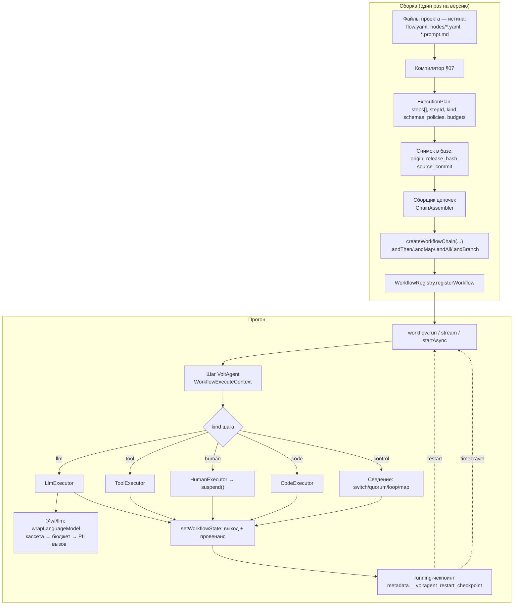
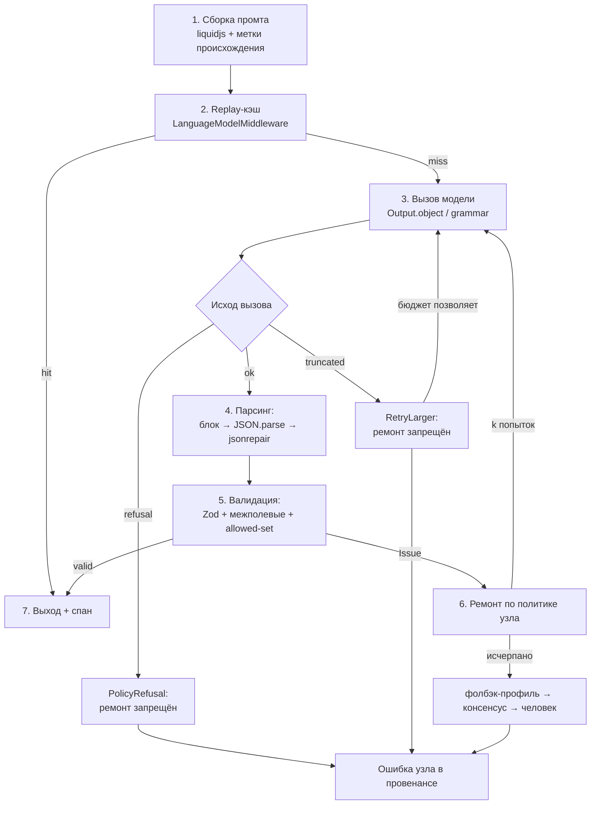

# 10. Рантайм: сборщик цепочек, исполнители узлов, состояние

> Статус: draft
> Зависит от: [07. Компилятор](07-compiler.md), [06. Реестры](06-registries.md), [05. Система типов](05-type-system.md), [16. Модель данных](16-data-model.md), [12. Наблюдаемость](12-observability.md)
> Источники: research/volt-primitives.md, research/volt-durability.md, research/volt-agents.md, research/volt-integrations.md, research/structured-output.md, research/00-verified-by-lead.md, research/ai-sdk-decision.md, спека §10, §20.1–§20.4, §6.5, §7.2, §8.5, §8.6, §8.12

## Зачем этот слой

Компилятор доказывает свойства графа до запуска, но ничего не гарантирует во время запуска. Рантайм закрывает §8.5 (управление потоком: `switch` без first-match, циклы без лимита, кворумы, `on_item_error`), §8.6 (надёжность: чекпоинты, рестарт, детерминированный реплей), §8.12 (люди в цикле: таймауты приостановок) и бюджетную часть §8.7/§8.11 (rate limits провайдера, взрыв стоимости). VoltAgent даёт исполнение шагов, чекпоинты, suspend/resume и time travel; наш слой добавляет ровно то, чего у него нет, и ни строкой больше.

## Решения

| Решение | Что берём | Версия | Лицензия | Почему |
|---|---|---|---|---|
| Исполнение цепочки шагов | `createWorkflowChain` из `@voltagent/core` | 2.10.0 | MIT | готовые чекпоинты, suspend/resume, time travel, поток событий |
| Горячая (пере)регистрация версий | `WorkflowRegistry.registerWorkflow/unregisterWorkflow`, `VoltAgent.registerWorkflows` | 2.10.0 | MIT | выпуск версии без рестарта процесса (проверено в `dist/index.d.ts`) |
| Долговечность прогона | running-чекпоинты VoltAgent + `restart` / `restartAllActiveWorkflowRuns` | 2.10.0 | MIT | crash-recovery без своего журнала |
| Реплей и форк | `workflow.timeTravel` / `timeTravelStream` | 2.10.0 | MIT | новое исполнение из исторического состояния, с переопределениями |
| Хранилище исполнений | `@voltagent/postgres` (схема `voltagent`) | 2.1.3 | MIT | один Postgres на всё; наши таблицы — схема `app` |
| Вызов моделей и врезка гарантий | `ai` + `wrapLanguageModel({ model, middleware })` | 6.0.280 | Apache-2.0 | кассеты, бюджеты, PII работают и для вызовов мимо нашего фасада |
| Структурированный вывод | `Output.object({ schema })` из `ai`, прокинутый через `agent.generateText` | 6.0.280 | Apache-2.0 | `generateObject`/`streamObject` в VoltAgent 2.x депрекейтнуты; `output` сохраняет tool-calling |
| Схемы шагов и узлов | `zod` | 4.6.2 | MIT | peer VoltAgent `^3.25 \|\| ^4`; горячий путь валидации |
| Синтаксический ремонт JSON | `jsonrepair` | по 09 | MIT | только ветка `ok`, одна попытка |
| Таймеры приостановок | `pg-boss` (`sendAfter` + сверяющий cron) | 12.x | MIT | VoltAgent сам по таймауту не возобновляет |
| Гардрейлы PII и инъекций | `createPIIInputGuardrail`, `createDefaultPIIGuardrails`, `createPromptInjectionGuardrail` | 2.10.0 | MIT | свой regex-зоопарк не пишем |
| Отмена узла | штатный `AbortController` + `isAbortError` | 2.10.0 | MIT | сигнал уходит в провайдера, в тулы и в сабагентов |
| Отмена прогона | `createSuspendController()` + `WorkflowRegistry.activeExecutions` | 2.10.0 | MIT | отмена любого живого исполнения по `executionId` |

Пишем сами (в исследованиях явно «нет готового»): сборщик цепочек, исполнители узлов `llm`/`tool`/`human`/`code`, кворумы и политики ошибок веток, лимиты итераций циклов, `on_item_error`, replay-кэш, бюджеты, лимитер профиля, планировщик таймаутов.

## 1. Схема исполнения

План компилятора (`ExecutionPlan`) — сериализуемый список шагов в топологическом порядке, без замыканий. Он собирается из файлов проекта один раз и материализуется снимком в базе (§2.4); **исполнение файлов не читает вовсе**. Сборщик превращает снимок в объект `Workflow` и кладёт в реестр. Дальше всё идёт внутри VoltAgent, а наш код живёт в `execute` каждого шага.



Правило разделения: **VoltAgent отвечает за «когда исполнить шаг», наш исполнитель — за «что считается успехом шага»**. Ни один узел ядра не превращается в несколько шагов VoltAgent без нужды: лишние шаги — это лишние UPSERT'ы строки исполнения (§7).

## 2. Сборщик цепочек

### 2.1. Контракт

```ts
type FlowId = string & { readonly __brand: "FlowId" };
type FlowVersion = string & { readonly __brand: "FlowVersion" };
type StepId = string & { readonly __brand: "StepId" };
type WorkflowKey = `${FlowId}@${FlowVersion}`;

interface ExecutionPlan {
  readonly flowId: FlowId;
  readonly version: FlowVersion;
  readonly planHash: string;
  readonly input: z.ZodType;
  readonly result: z.ZodType;
  readonly steps: readonly PlanStep[];
  readonly budgets: RunBudgetSpec;
  readonly checkpointInterval: number;
}

interface ChainAssembler {
  assemble(plan: ExecutionPlan): Workflow<z.ZodType, z.ZodType>;
}

interface StepEmitter<S extends PlanStep = PlanStep> {
  readonly kind: S["kind"];
  emit(chain: WorkflowChain, step: S, ctx: EmitContext): WorkflowChain;
}
```

Сборщик — Strategy поверх таблицы эмиттеров `Record<PlanStep["kind"], StepEmitter>`. Никаких `switch`-лестниц: `kind` шага — ключ словаря, неизвестный `kind` — отказ сборки, а не ветка по умолчанию.

```ts
const emitters: Record<PlanStep["kind"], StepEmitter> = {
  llm: llmEmitter, tool: toolEmitter, human: humanEmitter, code: codeEmitter,
  map: mapEmitter, parallel: parallelEmitter, switch: switchEmitter, loop: loopEmitter,
  wire: wireEmitter, guard: guardEmitter, component: componentEmitter,
};

function assemble(plan: ExecutionPlan): Workflow<z.ZodType, z.ZodType> {
  const base = createWorkflowChain({
    id: workflowKey(plan),
    name: plan.flowId,
    input: plan.input,
    result: plan.result,
    checkpointInterval: plan.checkpointInterval,
    retryConfig: { attempts: 0, delayMs: 0 },
    hooks: buildHooks(plan),
  });
  const ctx = createEmitContext(plan);
  return plan.steps.reduce((chain, step) => emitters[step.kind].emit(chain, step, ctx), base).toWorkflow();
}
```

`retryConfig: { attempts: 0 }` задан явно: ретраи VoltAgent триггерятся только выброшенным исключением и не умеют backoff (только фиксированный `delayMs`). Наши ретраи — внутри `execute`, с экспонентой и джиттером, чтобы не плодить шаги в таймлайне и не получать мультипликативный взрыв попыток `retries × maxRetries × maxMiddlewareRetries`.

### 2.2. Идентификаторы шагов

`stepId` — единственный ключ, по которому узел достаёт чужой выход (`getStepData(stepId)`, `getStepResult<T>(stepId)`), по которому делается `timeTravel({ stepId })` и по которому склеиваются спаны. Поэтому он детерминирован и стабилен между сборками одной версии.

| Конструкция | Шаблон `stepId` | Пример |
|---|---|---|
| Узел ядра | `n:<nodeId>` | `n:extract_intent` |
| Ребро-маппер | `w:<fromNodeId>-><toNodeId>` | `w:extract_intent->route` |
| Ветвление | `c:<nodeId>:branch`, сведение — `c:<nodeId>:join` | `c:route:branch` |
| Параллель | `p:<nodeId>:all`, ветка — `p:<nodeId>:b<i>:<branchNodeId>` | `p:panel:b0:judge_a` |
| Цикл | `l:<nodeId>:body`, страж — `l:<nodeId>:guard` | `l:refine:body` |
| Map | `m:<nodeId>:each`, сведение — `m:<nodeId>:collect` | `m:score:each` |
| Компонент | `k:<componentId>@<componentVersion>:<innerStepId>` | `k:rag@2:n:retrieve` |

Правила: `nodeId` берётся из IR и валиден как идентификатор (компилятор это уже проверил); коллизия `stepId` — ошибка сборки; переименование узла в IR — новая версия воркфлоу, потому что оно ломает адресацию форков и кассет.

### 2.3. Регистрация версии

Ключ воркфлоу — `flow@version`, ровно как в спеке §20.3. Регистрация и снятие идут через глобальный синглтон `WorkflowRegistry.getInstance()` (`globalThis.___voltagent_workflow_registry`), поэтому реестр обязан быть обёрнут нашим фасадом: тесты и тенанты иначе видят друг друга.

```ts
interface WorkflowSupplier {
  ensure(key: WorkflowKey): Promise<Workflow<z.ZodType, z.ZodType>>;
  release(key: WorkflowKey): void;
}
```

`ensure` — ленивая компиляция по требованию (паттерн Registry + Lazy Initialization):

1. `cache.get(key)` → есть, вернуть.
2. Нет — загрузить `ExecutionPlan` из снимка в `app` по `key` (§2.4); в файловое дерево `ensure` не ходит.
3. `assemble(plan)` → `WorkflowRegistry.getInstance().registerWorkflow(workflow)` → положить в LRU.
4. Вытеснение из LRU вызывает `unregisterWorkflow(id)` только при нулевом числе живых исполнений этой версии (`WorkflowRegistry.activeExecutions` даёт срез живых `executionId`).

Триггеры сборки: первый запуск версии после старта процесса, выпуск новой версии, тестовый прогон черновика (`flow@draft-<content_hash:7>`, материализуется из рабочей копии тем же путём и снимается по TTL). Рестарт процесса ничего не ломает: `restartAllActiveWorkflowRuns({ workflowId })` вызывается **после** `ensure` для каждой версии, у которой есть незавершённые прогоны — иначе восстанавливать будет некуда.

Инвариант версии: `planHash` хранится в `metadata` исполнения. Несовпадение `planHash` прогона и текущего плана при `restart`/`timeTravel` — отказ с типизированной ошибкой `PlanDrift`, а не молчаливое исполнение другого графа.

### 2.4. Материализация плана

Определения живут файлами ([ADR-0017](adr/0017-files-as-source-of-truth.md)), но **прогон файлов не читает** — ни при старте, ни в процессе. Компилятор материализует план один раз и кладёт снимок в базу; дальше исполняется снимок. Та же конструкция, что `status.storedWorkflowSpec` у Argo и `created_dag_version_id` у Airflow 3.

| Поле прогона | Значение | Роль |
|---|---|---|
| `origin` | `release \| working_copy` | откуда материализован план: тег релиза или рабочее дерево; из рабочей копии стартуем только при валидном дереве, из релиза — всегда |
| `release_hash` | `hash(spec_hash, prompt_pins, model_profile_pins, component_lock, env_overlay_hash)` | **авторитетная идентичность исполненного**: по ней сравнивают и воспроизводят прогоны |
| `spec_version_id` | строка со снимком IR и `ExecutionPlan` | физическое тело плана; читается вечно и не зависит от состояния репозитория |
| `source_commit` | sha коммита эпизода, nullable | провенанс: blame, дифф двух прогонов в git |
| `source_ref` | `refs/heads/main` или `wf/agent/<session>` | откуда пришло: прогон с ветки агента видно сразу |
| `source_dirty` | `true`, если эпизод ещё не закоммичен | честный признак «запуск из-под руки»; воспроизводимость не страдает, снимок уже в базе |

Авторитетен **хеш содержимого, а не commit sha**: sha меняется от косметики (переезд файла, правка соседнего воркфлоу в том же коммите) и исчезает при пересоздании репозитория, а прогоны живут дольше репозитория. Пишем оба: хеш для равенства, sha для истории.

| Событие во время прогона | Что происходит |
|---|---|
| Файл узла изменён, промт переписан, определение откачено, переключена ветка | прогон идёт на снимке; изменение подхватит следующий запуск, в карточке — отметка «определение изменилось после старта» |
| Индекс отстал или снесён (`DROP SCHEMA idx CASCADE`) | прогон не затронут: `ExecutionPlan` лежит в `app`, а не в `idx` |
| `restart`, `timeTravel`, форк | берут тот же снимок по `spec_version_id`; расхождение `planHash` — `PlanDrift` (§2.3), а не молчаливое исполнение другого графа |

## 3. Компиляция конструкций ядра в шаги VoltAgent

| Конструкция ядра | Примитив VoltAgent | Что даёт фреймворк | Что дописывает наш слой |
|---|---|---|---|
| `seq` | `.andThen({ id, execute })` | типы по цепи, `getStepData`/`getStepResult`, чекпоинт после шага | ничего сверх генерации `stepId` |
| ребро / выражение | `.andMap({ id, map })` с `source: "value" \| "data" \| "input" \| "context" \| "step" \| "fn"` | чтение по dot-пути из входа, данных, контекста, выхода шага | граф остаётся сериализуемым; `source: "fn"` — аварийный люк, провенанс для него пишем сами |
| `switch` (ровно одна ветка) | `.andBranch({ id, branches })` + `.andThen` сведения | параллельный запуск **всех** истинных условий, результат — массив по порядку веток с `undefined` у несработавших | взаимоисключающие предикаты, `default` как отрицание объединения, шаг сведения «единственный не-`undefined`» |
| `if` | `.andWhen({ id, condition, step })` | true → шаг, false → данные проходят насквозь | `else` — второй `andWhen` с отрицанием |
| `parallel` | `.andAll({ id, steps })` + сведение | параллельный запуск на одном входе, merge результатов в один объект | ветки в `Result<T,E>` под явными ключами (merge затирает одинаковые поля), политики `all/quorum(k)/any/first_success`; голый `andAll` падает целиком при провале любой ветки |
| `race` | `.andRace({ id, steps })` | `Promise.any`-семантика: провал быстрого не валит гонку | реальная отмена проигравших своим `AbortController`, дискриминатор источника в схеме, учёт стоимости всех веток |
| `map` | `.andForEach({ id, step, items, map, concurrency })` | порядок результатов сохраняется, лимит параллелизма | `on_item_error` (`fail_fast \| skip \| collect`), лимит размера коллекции, батчи |
| `loop` | `.andDoWhile` / `.andDoUntil({ id, step\|steps, condition })` | тело выполняется минимум один раз, условие может быть async | **лимита итераций нет**: `max_iter`, бюджет, стагнация, best-of — счётчики в `workflowState`, условие генерирует компилятор |
| `gate` (страж качества) | `.andGuardrail({ id, inputGuardrails, outputGuardrails })` | цепочка проверок с `pass/action: "modify"`, наблюдаемость гардрейлов | перевод блокировки в типизированный `PolicyViolation` вместо голого throw |
| `human` | `suspend(reason, suspendData)` + `resumeData`, `suspendSchema`/`resumeSchema` **на шаге** | чекпоинт с `workflowState`, REST-резюм, событие `workflow-suspended` | таймаут приостановки (§8), идемпотентность повторного входа в шаг |
| `component` | `.andWorkflow(workflow)` | вложенный воркфлоу как шаг (`stepType: "workflow"`) | версионирование компонента и проверка схем на границе |
| `llm` (без стрима) | `.andThen` + `agent.generateText({ output: Output.object({ schema }) })` | tools продолжают работать вместе со строгим выводом | весь конвейер §4 |
| `llm` (со стримом) | `.andThen` + `agent.streamText` + `ctx.writer.pipeFrom(fullStream, { prefix, agentId, filter })` | маппинг частей стрима в события воркфлоу, `part.usage → metadata.usage` | ручной учёт usage: `state.usage` накапливается только для `andAgent` |
| ранний выход | `ctx.bail(result)` | успешное завершение воркфлоу с результатом | политика «достаточно хорошо» и её провенанс |
| аварийный выход | `ctx.abort()` / throw | прерывание | типизированная ошибка узла в `{ code, message, details }` |

`andAgent` не используем для узлов `llm`: он не стримит, а его выход без четвёртого аргумента `map` затирает данные шага. Узел `llm` — всегда `andThen` с явным исполнителем.

### 3.1. `switch`: взаимоисключающие предикаты + сведение

`andBranch` вычисляет условия независимо и запускает все истинные ветки параллельно; first-match и else отсутствуют. Компилятор эмитит предикаты вида «дискриминант равен значению ветки», а `default` — отрицание объединения; полнота enum проверена до сборки.

```ts
const switchEmitter: StepEmitter<SwitchStep> = {
  kind: "switch",
  emit: (chain, step, ctx) =>
    chain
      .andBranch({
        id: `c:${step.nodeId}:branch`,
        branches: step.cases.map((c) => ({
          condition: ({ data }) => readDiscriminant(data, step.discriminantPath) === c.value,
          step: ctx.emitSubgraph(c.body),
        })),
      })
      .andThen({
        id: `c:${step.nodeId}:join`,
        outputSchema: step.outputSchema,
        execute: async ({ data }) => selectSingleBranch(data as readonly unknown[], step.nodeId),
      }),
};

function selectSingleBranch(results: readonly unknown[], nodeId: string): unknown {
  const taken = results.filter((r) => r !== undefined);
  if (taken.length === 1) return taken[0];
  throw new SwitchArityError(nodeId, taken.length);
}
```

`SwitchArityError` — не «не должно случиться», а контролируемый отказ: ноль веток означает дыру в полноте enum, больше одной — сломанную взаимоисключаемость. Оба случая идут в провенанс как ошибка узла, а не как пустой выход.

### 3.2. `loop` с `max_iter`: страж из `workflowState`

Счётчик, бюджет, стагнация и лучший кандидат живут в `workflowState` под ключом узла. Условие цикла — чистая функция от этого счётчика, собранная из таблицы предикатов остановки (Chain of Responsibility: первый сработавший стоп решает).

```ts
interface LoopCounter {
  readonly iteration: number;
  readonly bestScore: number | null;
  readonly bestStepId: string | null;
  readonly noImprovementStreak: number;
  readonly spentTokens: number;
}

type StopRule = (c: LoopCounter, spec: LoopSpec, budget: BudgetSnapshot) => LoopStopReason | null;

const stopRules: readonly StopRule[] = [
  (c, s) => (c.iteration >= s.maxIter ? "max_iter" : null),
  (c, s) => (s.targetScore !== null && c.bestScore !== null && c.bestScore >= s.targetScore ? "target_reached" : null),
  (c, s) => (c.noImprovementStreak >= s.stagnationLimit ? "stagnation" : null),
  (_, __, b) => (b.remainingTokens <= 0 || b.remainingCostUsd <= 0 ? "budget_exhausted" : null),
  (_, __, b) => (b.remainingMs <= 0 ? "deadline" : null),
];

const firstStop = (c: LoopCounter, s: LoopSpec, b: BudgetSnapshot): LoopStopReason | null =>
  stopRules.reduce<LoopStopReason | null>((found, rule) => found ?? rule(c, s, b), null);

const loopEmitter: StepEmitter<LoopStep> = {
  kind: "loop",
  emit: (chain, step, ctx) =>
    chain
      .andDoUntil({
        id: `l:${step.nodeId}:body`,
        steps: [ctx.emitSubgraph(step.body), makeLoopBookkeeping(step)],
        condition: ({ workflowState }) =>
          firstStop(readCounter(workflowState, step.nodeId), step.spec, readBudget(workflowState)) !== null,
      })
      .andThen({
        id: `l:${step.nodeId}:guard`,
        outputSchema: step.outputSchema,
        execute: async ({ workflowState, getStepResult }) =>
          finalizeLoop(readCounter(workflowState, step.nodeId), step, getStepResult),
      }),
};
```

`makeLoopBookkeeping` — шаг, который обновляет счётчик через `setWorkflowState(prev => next)` и запоминает лучший кандидат по `stepId`, а не сам объект: в состоянии лежит ссылка, тело достаётся через `getStepResult`. `finalizeLoop` возвращает лучший кандидат и причину остановки; исход `max_iter`/`stagnation`/`budget_exhausted` без достижения `targetScore` — это выход с пометкой качества, а не тихий успех.

### 3.3. `parallel` с `quorum(k)`

Каждая ветка оборачивается в `Result` внутри собственного шага и пишется под уникальным ключом — `andAll` мержит результаты веток в один объект, одинаковые ключи затирают друг друга. Обёртка гасит исключение ветки: иначе падение одной ветки валит весь `andAll`.

```ts
type Result<T> = { ok: true; value: T } | { ok: false; error: NodeError };

const branchStep = (branch: PlanBranch, index: number, nodeId: string) => ({
  id: `p:${nodeId}:b${index}:${branch.nodeId}`,
  execute: async (c: WorkflowExecuteContext): Promise<Record<string, Result<unknown>>> => {
    const value = await runBranch(branch, c).catch(toNodeError);
    return { [`b${index}`]: isNodeError(value) ? { ok: false, error: value } : { ok: true, value } };
  },
});

const quorumPolicies: Record<JoinPolicy, (r: readonly Result<unknown>[], k: number) => JoinOutcome> = {
  all: (r) => (r.every((x) => x.ok) ? accept(r) : reject(r, "all")),
  quorum: (r, k) => (r.filter((x) => x.ok).length >= k ? accept(r) : reject(r, "quorum")),
  any: (r) => (r.some((x) => x.ok) ? accept(r) : reject(r, "any")),
  first_success: (r) => {
    const hit = r.find((x) => x.ok);
    return hit ? accept([hit]) : reject(r, "first_success");
  },
};

const parallelEmitter: StepEmitter<ParallelStep> = {
  kind: "parallel",
  emit: (chain, step, ctx) =>
    chain
      .andAll({ id: `p:${step.nodeId}:all`, steps: step.branches.map((b, i) => branchStep(b, i, step.nodeId)) })
      .andThen({
        id: `p:${step.nodeId}:join`,
        outputSchema: step.outputSchema,
        execute: async ({ data }) =>
          quorumPolicies[step.join.policy](orderedResults(data, step.branches.length), step.join.k ?? step.branches.length),
      }),
};
```

Стоимость считается по **всем** веткам, включая отвергнутые кворумом: в провенанс шага сведения идут `usage` и цена каждой ветки, а не только принятых.

### 3.4. `map` с `on_item_error`

`andForEach` сохраняет порядок результатов и умеет `concurrency`, но политики ошибки элемента у него нет. Элемент оборачивается в `Result`, политика применяется в шаге сведения.

```ts
type ItemErrorPolicy = "fail_fast" | "skip" | "collect";

const itemPolicies: Record<ItemErrorPolicy, (rs: readonly Result<unknown>[]) => MapOutcome> = {
  fail_fast: (rs) => {
    const failed = rs.findIndex((r) => !r.ok);
    if (failed >= 0) throw new MapItemError(failed, (rs[failed] as { error: NodeError }).error);
    return { items: rs.map(unwrap), failures: [] };
  },
  skip: (rs) => ({ items: rs.filter((r) => r.ok).map(unwrap), failures: failuresOf(rs) }),
  collect: (rs) => ({ items: rs.map((r) => (r.ok ? r.value : null)), failures: failuresOf(rs) }),
};

const mapEmitter: StepEmitter<MapStep> = {
  kind: "map",
  emit: (chain, step, ctx) =>
    chain
      .andForEach({
        id: `m:${step.nodeId}:each`,
        items: ({ data }) => readItems(data, step.overPath, step.maxItems),
        concurrency: resolveConcurrency(step),
        step: {
          id: `m:${step.nodeId}:item`,
          execute: async (c) => toResult(() => runItem(step.body, c)),
        },
      })
      .andThen({
        id: `m:${step.nodeId}:collect`,
        outputSchema: step.outputSchema,
        execute: async ({ data }) => itemPolicies[step.onItemError](data as readonly Result<unknown>[]),
      }),
};
```

`fail_fast` бросает уже в шаге сведения, а не в элементе: иначе теряются результаты успевших элементов и их стоимость. `readItems` обрезает коллекцию по `maxItems` из IR и поднимает `FanOutTooLarge`, если вход больше порога, — веер на тысячи элементов идёт батчами (§9).

## 4. Конвейер узла `llm`

Один шаг `andThen` = один узел `llm` = одна транзакция гарантий. Внутри — семь стадий (спека §10), каждая со своим отказом. Ремонт стоит после валидации и только для одного из трёх исходов вызова.



### 4.1. Стадии

| № | Стадия | Чем реализовано | Что при неуспехе |
|---|---|---|---|
| 1 | Сборка промта | `liquidjs` 10.29.0, скомпилированный шаблон из реестра; значения слотов приходят из `getStepResult(stepId)` / `getInitData()`; каждому значению приписывается `Provenance{ sourceStepId, trust, pii, renderedAt }` | нехватка слота или `untrusted`-значение в запрещённой позиции — `TemplateBindingError` до вызова модели |
| 2 | Replay-кэш | наш `LanguageModelMiddleware` через `wrapLanguageModel`; ключ — sha256 по (`promptHash`, `modelRef`, `params`, `schemaHash`, `seed`, `toolsetHash`) | miss в режиме `replay_strict` — `CassetteMiss`, прогон останавливается; в режиме `record` — обычный вызов и запись кассеты |
| 3 | Вызов модели | `agent.generateText(task, { output: Output.object({ schema }), abortSignal, temperature, maxOutputTokens, providerOptions })`; для vLLM/SGLang — грамматика через `providerOptions`; схема собрана под профиль провайдера (§09) | сетевая ошибка → наш backoff внутри `execute`; отмена → `isAbortError` → `NodeTimeout`/`Cancelled` |
| 4 | Классификация исхода | `finish_reason`/`stop_reason` + поле `refusal` читаются **до** любого парсинга | ветвление, см. §4.2 |
| 5 | Парсинг | снятие ```json-ограждения → первый сбалансированный объект → `JSON.parse` → при синтаксической ошибке **одна** попытка `jsonrepair` | не распарсилось — `Issue[]` с кодом `parse`, дальше стадия ремонта |
| 6 | Валидация | `zod@4.6.2` `safeParse` + `superRefine` для межполевых правил + проверка динамических allowed-set и языка; ошибки нормализуются в наш `Issue[]` | `Issue[]` → стадия ремонта |
| 7 | Ремонт по политике | ретрай с `Issue[]` в промте (не с сырым текстом ошибки), не больше `k` раз → фолбэк-профиль → консенсус или эскалация человеку | исчерпание политики — `NodeQualityFailure` с полным провенансом попыток |
| 8 | Выход | `setWorkflowState` (ссылка + провенанс), спан со стадиями, `ctx.writer.write` для UI | — |

`ajv` на этом пути не появляется: Zod — единственный источник истины по типам на горячем пути, `ajv` работает на границах (IR-документы, чужие JSON Schema из MCP, self-check компилятора).

### 4.2. Три исхода вызова

```ts
type CallOutcome =
  | { kind: "ok"; text: string; usage: Usage }
  | { kind: "refusal"; reason: string; usage: Usage }
  | { kind: "truncated"; text: string; usage: Usage };

const outcomeHandlers: Record<CallOutcome["kind"], OutcomeHandler> = {
  ok: parseThenValidate,
  refusal: (o, node) => failNode(node, "policy_refusal", o.reason),
  truncated: (o, node) => retryWithLargerLimit(node, o),
};
```

`refusal` — отдельный канал API, а не нарушение схемы: ответ может вообще не следовать `response_format`. Ремонт запрещён, узел падает типизированной ошибкой политики.

`truncated` (`finish_reason: "length"`) — запрет на ремонт **жёсткий**. `jsonrepair` на обрезанном JSON не бросает исключение: вход `{"id":"x","items":[{"a":1},{"a":` он молча превращает в `{"id":"x","items":[{"a":1},{"a":null}]}` — правдоподобный, но ложный объект, который пройдёт Zod и отравит провенанс. Обработка одна: повтор с бо́льшим `maxOutputTokens` (не более двух раз, каждый — против бюджета узла) либо декомпозиция ответа; при исчерпании — ошибка узла.

Слияние `refusal` и `truncated` в «невалидный JSON» — дефект реализации, который ловится конформанс-тестом исполнителя.

### 4.3. Что уходит в провенанс шага

Спан узла несёт: отрисованный промт (или его хэш в PII-режиме), метки происхождения каждого слота, `modelRef` и эффективные параметры, `cassetteKey` и `hit|miss`, исход вызова, число попыток ремонта с `Issue[]` каждой, сырой ответ, распарсенный выход, `usage`, расчётную стоимость и латентность по стадиям. Частичный объект из стриминга **никогда** не попадает в состояние как результат узла — только в канал UI.

## 5. Где живут наши гарантии в терминах VoltAgent

Три точки врезки, и они не взаимозаменяемы.

| Гарантия | Точка врезки | Почему именно она |
|---|---|---|
| Кассеты record/replay | `LanguageModelMiddleware` в `wrapLanguageModel` | работает и для вызовов, которые делает сам VoltAgent мимо нашего фасада (агенты, сабагенты, тулы) |
| Бюджет токенов и денег | тот же middleware (`wrapGenerate`/`wrapStream`) | видит запрос уже нормализованным и ответ уже разобранным, включая tool-calls |
| Лимитер профиля (RPM/TPM/concurrency) | тот же middleware | единственное место, через которое физически проходят все вызовы модели |
| Редакция PII в промте | `createPIIInputGuardrail` + наш `createInputGuardrail` для доменных типов | гардрейл возвращает `{ pass: true, action: "modify", modifiedInput }` — маскирование поддержано архитектурно |
| Редакция PII в ответе | `createDefaultPIIGuardrails()` (output) и `streamHandler` для стрима | редакция по стриму без ожидания полного ответа |
| Фильтр инъекций | `createPromptInjectionGuardrail({ phrases })` + наш классификатор | штатный гардрейл — список фраз, не классификатор; контракт и точка подключения берутся готовые |
| Провенанс шага | хуки воркфлоу `onStepStart`/`onStepEnd`/`onSuspend`/`onError`/`onFinish` | `state.executionId`, `state.stepId`, `state.data` доступны без прокидывания через узлы |
| Политики узла и гейты качества | `andGuardrail` для узла-гейта, наш код в `execute` для узловых порогов | гейтов на уровне узла у фреймворка нет |
| Корреляция вложенности в UI | `ctx.writer.write({ type, metadata: { nodeId, parentNodeId, branchIndex } })` | в `WorkflowStreamEvent` нет `parentStepId`/`parallelIndex`, вложенность `andAll`/`andForEach` по стриму не восстанавливается |
| Переопределение модели и инструкций на узле | динамические функции агента, читающие `context` по ключам `wf.model`, `wf.instructions`, `wf.toolset` | в `BaseGenerationOptions` нет `model` и нет `instructions`; sampling-параметры (`temperature`, `maxOutputTokens`, `providerOptions`) передаются прямо в опциях вызова |

```ts
const modelMiddleware: LanguageModelMiddleware[] = [
  cassetteMiddleware(cassetteStore),
  budgetMiddleware(budgetLedger),
  rateLimitMiddleware(profileLimiter),
  piiRedactionMiddleware(piiPolicy),
];

const model = wrapLanguageModel({ model: registry.languageModel(modelRef), middleware: modelMiddleware });
```

Порядок middleware значим: кассета стоит первой, чтобы попадание не тратило бюджет и не занимало слот лимитера; редакция PII — последней перед провайдером, чтобы в кассету и в трассу попадал уже отредактированный запрос.

Уровни ретраев обязаны быть ровно один. Фреймворк предлагает три независимых — `retries` на шаге (total attempts = `retries + 1`), `maxRetries` агента (уровень модели), `maxMiddlewareRetries` (перезапуск всего attempt через `abort(reason, { retry: true })`). Наше соглашение: `retries: 0` на всех шагах, `maxRetries: 0` у агентов, ретраи модели — только в нашем middleware, ремонтные ретраи — только в исполнителе узла.

## 6. Состояние прогона

### 6.1. Два хранилища, разные роли

`getStepData(stepId)` возвращает `{ input, output, status, error }` — вход и выход **каждого** шага, и переживает restart/resume (в чекпоинте есть поле `stepData`, оно там именно «required by `getStepData()` after restart»). Значит выходы узлов дублировать в `workflowState` не нужно. В `workflowState` идёт только то, чего в `stepData` нет.

| Что | Где лежит | Кто пишет |
|---|---|---|
| Вход и выход узла | `stepData` (`getStepData`/`getStepResult`) | VoltAgent |
| Провенанс выхода (метки происхождения, trust, pii, cassetteKey) | `workflowState.prov[stepId]` | наш исполнитель |
| Счётчики циклов, лучший кандидат (`stepId`, не тело) | `workflowState.loops[nodeId]` | шаг bookkeeping |
| Остаток бюджета прогона | `workflowState.budget` | middleware бюджета через шаговый коммит |
| Идентичность прогона: `tenantId`, `actorId`, `planHash`, `runMode` | `state.context` (Map) и `metadata` | сборщик при запуске |
| Накопленный usage агентных шагов | `state.usage` | VoltAgent (**только** для `andAgent`) |

Так как узлы `llm` компилируются в `andThen`, `state.usage` их не видит — usage дописывает наш middleware в `workflowState.budget`.

```ts
interface RunState {
  readonly prov: Record<StepId, NodeProvenance>;
  readonly loops: Record<string, LoopCounter>;
  readonly budget: BudgetSnapshot;
  readonly blobs: Record<StepId, BlobRef>;
}
```

Обновление — только функциональное: `setWorkflowState(prev => ({ ...prev, budget: next }))`. Замена состояния объектом целиком в параллельных ветках теряет чужие записи.

### 6.2. Ограничения сериализации (жёсткие)

Все пути персиста идут через `safeStringify` — обычный `JSON.stringify` плюс защита от циклов. Обратного ревайвера нет.

| Тип в state / step data | Что уходит в БД | Что вернётся после resume/restart |
|---|---|---|
| `Date` | ISO-строка | **строка**, не `Date` |
| `Map` / `Set` | `{}` | пустой объект, данные потеряны молча |
| `undefined` в объекте | ключ выброшен | ключа нет |
| `undefined` в массиве | `null` | `null` |
| `BigInt` | `JSON.stringify` бросает → строка `SAFE_STRINGIFY_ERROR: …` | порча значения, невалидный JSON в JSONB-колонке |
| функция / `Symbol` | выброшено | отсутствует |
| instance класса | plain object | методы потеряны |
| `Error` | `{}` | пустой объект |

Правила, которые проверяет компилятор, а не рантайм:

1. Схемы узлов — строго JSON-сериализуемый подтип: без `z.date()` без `.transform(String)`, без `z.map()`/`z.set()`, без `bigint`.
2. Даты — ISO-строки на границе узла.
3. Ошибки узлов сериализуем сами в `{ code, message, details }`; `Error` в состояние не кладём.
4. Ключи `context` — только строки: symbol-ключи не переживают JSON.
5. Наши ключи в `metadata` исполнения не пересекаются с зарезервированным `__voltagent_restart_checkpoint`, и `metadata` только мержится, никогда не перезаписывается целиком.
6. Крупные артефакты в состояние не кладём: правило трёх зон из [16. Модель данных](16-data-model.md) — в `workflowState` идёт `BlobRef`, а тело в отдельную таблицу или объектное хранилище. Причина не в аккуратности: строка исполнения переписывается **целиком** (включая весь `events` JSONB) при каждом обновлении.

## 7. Долговечность: чекпоинты, restart, time travel, replay-кэш

### 7.1. Running-чекпоинты

Чекпоинт пишется по ходу обычного `running`, а не только при suspend:

```
if (disableCheckpointing) return;
if ((lastCompletedStepIndex + 1) % checkpointInterval !== 0) return;
```

`checkpointInterval` по умолчанию `1` — то есть после **каждого** завершённого шага, один `updateWorkflowState`. Задаётся и на воркфлоу (`WorkflowConfig`), и на прогон (`WorkflowRunOptions`); резолв — `options.checkpointInterval ?? workflowCheckpointInterval ?? 1`, нормализация `Math.max(1, Math.floor(...))`.

Состав `WorkflowRestartCheckpoint`: `resumeStepIndex`, `lastCompletedStepIndex`, `stepExecutionState`, `completedStepsData[]`, `workflowState`, `stepData` (снимок по `stepId`), `usage`, `eventSequence`, `checkpointedAt`. Лежит в `metadata.__voltagent_restart_checkpoint`, то есть в колонке `metadata JSONB` таблицы `voltagent_memory_workflow_states`.

Цена: каждый шаг — один `INSERT … ON CONFLICT DO UPDATE` всей строки исполнения. Наши значения:

| Класс прогона | `checkpointInterval` | Обоснование |
|---|---|---|
| Прод, есть узлы с внешними эффектами | 1 | повтор шага стоит дороже записи |
| Прод, длинный цикл (десятки-сотни итераций) | 1 на узел вне цикла, тело цикла — один составной шаг | уменьшаем число шагов, а не частоту чекпоинтов |
| Eval-прогон по датасету | 5 | идемпотентно, крах дешёвый |
| Дешёвый идемпотентный прогон в песочнице | `disableCheckpointing: true` | crash-recovery не нужен |

Задирать `checkpointInterval` бесплатно нельзя: `timeTravel` берёт вход целевого шага каскадом `inputData ?? sourceTargetStepInput ?? previousStepOutput ?? (index === 0 ? sourceWorkflowInput : checkpointInputFallback)` и при промахе бросает `Cannot time travel from step '<stepId>': missing historical input data (provide inputData override)`. Чем реже чекпоинты, тем меньше шагов доступно для форка.

### 7.2. Restart после падения процесса

```ts
await workflow.restart(executionId);
await workflow.restartAllActive();
await WorkflowRegistry.getInstance().restartAllActiveWorkflowRuns({ workflowId });
```

Восстанавливаются данные чекпоинта, `workflowState`, `context` и `usage`. Применимо к прогонам в статусе `running`. Гранулярность — граница шага, поэтому **шаги обязаны быть идемпотентны**: внешний эффект мог уже произойти до краха.

Наш инвариант: узел с классом эффекта `write` или `external` несёт ключ идемпотентности, детерминированно выведенный из `(executionId, stepId, iteration)`. Это тот же ключ, что требует IR у `tool` (спека §6.1), и тот же, что защищает от повторного входа после resume.

Порядок bootstrap процесса: поднять реестры → `ensure(key)` для каждой версии с незавершёнными прогонами → `restartAllActiveWorkflowRuns({ workflowId })` по каждой → только потом открыть приём HTTP.

### 7.3. Time travel

```ts
interface WorkflowTimeTravelOptions {
  executionId: string;
  stepId: string;
  inputData?: unknown;
  resumeData?: unknown;
  workflowStateOverride?: Record<string, unknown>;
  memory?: Memory;
}
```

Отличие от `restart` точное: `restart(executionId)` продолжает `running`-исполнение, `timeTravel({ executionId, stepId })` создаёт **новое** исполнение с новым `executionId` из исторического состояния и применимо к `completed | suspended | cancelled | error`. `timeTravelStream` — то же со стримом событий.

Shared state форка берётся как `workflowStateOverride ?? sourceCheckpoint.workflowState ?? sourceState.workflowState ?? {}` — то есть из чекпоинта источника, а не из его финального состояния. Наш MCP-тул `run_replay_node` кладёт причину форка в `workflowStateOverride`. Опция `memory` позволяет читать источник из продовой памяти, а писать реплей в песочницу.

### 7.4. Replay-кэш: детерминизм там, где его нет

`timeTravel` переисполняет шаги, а значит и вызовы моделей. Детерминизм даёт наш кассетный middleware, а не фреймворк.

| Режим прогона | Поведение middleware | Когда используется |
|---|---|---|
| `record` | вызов провайдера, запись ответа в content-addressed store | обычный прод-прогон |
| `replay_strict` | только кассета; miss → `CassetteMiss`, прогон останавливается | воспроизведение инцидента, конформанс-тесты, экспорт |
| `replay_lenient` | кассета, при промахе — живой вызов с пометкой `mixed` в провенансе | отладка форка с правкой промта |
| `off` | вызов без записи | локальные эксперименты |

Ключ кассеты — sha256 по канонизированному запросу (RFC 8785) с доменной сепарацией: `promptHash`, `modelRef`, эффективные параметры, `schemaHash`, `seed`, `toolsetHash`. Форк с правкой промта меняет `promptHash`, поэтому промахивается мимо кассеты сознательно — это ожидаемое поведение, а не деградация. Кассеты хранятся на уровне порта модели и тула, а не как HTTP-моки.

### 7.5. Lineage форков

Core при `timeTravel` пишет lineage и в типизированные поля `WorkflowStateEntry`, и в `metadata` (`replayedFromExecutionId`, `replayFromStepId`, `replayedAt`). Но `@voltagent/postgres@2.1.3` эти поля не знает: в DDL колонок нет, в `INSERT` их нет. Поэтому top-level `state.replayedFromExecutionId` после рестарта процесса вернёт `undefined`.

Наше решение по [DECISIONS](DECISIONS.md): дерево форков живёт в **нашей** таблице `app.run_lineage` (`tenant_id`, `child_execution_id`, `parent_execution_id`, `from_step_id`, `reason`, `plan_hash`, `created_at`) — она источник истины для UI и MCP, потому что несёт причину форка и tenant, которых во фреймворке нет в принципе. Запись делает наш код в момент вызова `timeTravel`. `metadata.replayedFromExecutionId` при этом сохраняется адаптером и используется как сверяющий канал: расхождение нашей таблицы и `metadata` — повод для алерта, а не для молчания.

Реплей наследует `metadata` источника (минус ключ чекпоинта), поэтому по цепочке форков тащатся устаревшие пользовательские ключи — наш код перед `timeTravel` чистит собственный префикс `wf.*` и проставляет его заново.

## 8. Человек в цикле и таймауты

### 8.1. Шаг `human`

`suspendSchema` и `resumeSchema` задаются **на каждом human-шаге**, а не только на воркфлоу: шаговая схема перекрывает воркфлоу-уровневую, и только так задача и ответ типизированы под конкретный узел.

```ts
const humanEmitter: StepEmitter<HumanStep> = {
  kind: "human",
  emit: (chain, step) =>
    chain.andThen({
      id: `n:${step.nodeId}`,
      suspendSchema: step.taskSchema,
      resumeSchema: step.answerSchema,
      outputSchema: step.outputSchema,
      execute: async ({ data, state, resumeData, suspend, workflowState }) => {
        if (resumeData) return finishHumanTask(step, resumeData, workflowState);
        const task = buildHumanTask(step, data, state);
        await enqueueDeadline(step, state.executionId, task);
        return suspend(step.reason, task);
      },
    }),
};
```

Порядок в `execute` обязателен: ранний возврат по `resumeData` первым. После резюма шаг исполняется **заново с начала**, поэтому всё, что до `suspend`, должно быть идемпотентно, а `enqueueDeadline` — иметь ключ `(executionId, stepId, attempt)`.

`suspend(reason, suspendData)` возвращает `Promise<never>`: код после него не исполняется. Приостановка по умолчанию `graceful` (`suspensionMode: "immediate" | "graceful"` в run-опциях) — текущий шаг досчитывается.

### 8.2. Планировщик дедлайнов

VoltAgent сам по таймауту не возобновляет. Дедлайн — задание `pg-boss` 12.x:

| Механизм | Роль |
|---|---|
| `sendAfter(deadlineAt)` на очередь `human.deadline` | основной таймер, payload — `{ tenantId, workflowId, executionId, stepId, attempt, policy }` |
| cron `*/1 * * * *` на сверку | подбирает просроченные задачи, потерянные при падении воркера или при сдвиге времени; источник — наша таблица `app.human_tasks`, а не только очередь |
| `WorkflowRegistry.getInstance().getSuspendedWorkflows()` | сверка «наши записи против реальных приостановок» раз в N минут |

Обработчик дедлайна применяет политику узла:

```ts
const deadlinePolicies: Record<TimeoutPolicy, DeadlineHandler> = {
  default_value: (t) => resume(t, { kind: "timeout", value: t.policy.value }),
  escalate: (t) => reassignAndExtend(t),
  fail: (t) => cancelRun(t, "human_timeout"),
  continue_without: (t) => resume(t, { kind: "timeout", value: null }),
};
```

Резюм делается через `WorkflowRegistry.getInstance().resumeSuspendedWorkflow(workflowId, executionId, resumeData, resumeStepId)`, то есть тем же API, что и человеческий ответ. Payload таймаута валиден по `resumeSchema` шага — у таймаута обязан быть дискриминатор (`kind: "timeout"`), иначе узел не отличит его от настоящего ответа.

### 8.3. Гонка «ответил на дедлайне»

Ответ человека и срабатывание таймера могут прийти одновременно. Арбитраж — в БД, не в памяти процесса:

1. Таблица `app.human_tasks` со статусом и колонкой `resolution` (`answered | timed_out | cancelled`) и уникальным индексом по `(execution_id, step_id, attempt)`.
2. Обе стороны начинают с `UPDATE app.human_tasks SET resolution = $1, resolved_at = now() WHERE id = $2 AND resolution IS NULL RETURNING id`.
3. Пустой `RETURNING` — значит гонку проиграли: сторона завершается без вызова `resume`.
4. `resume` вызывается только победителем, внутри той же логической операции.
5. Повторный `resume` по уже возобновлённому исполнению — идемпотентный no-op на нашей стороне: проверяем актуальный статус через `getSuspendedWorkflows()` перед вызовом.

Отмена дедлайна при человеческом ответе — best-effort: `pg-boss` может уже взять задание в работу, поэтому корректность держится на шаге 2, а не на отмене задания.

### 8.4. Долгие ожидания

`andSleep` / `andSleepUntil` держат ожидание в процессе — годятся только для секунд и минут. Ожидания часов и дней — всегда `suspend` + планировщик, иначе рестарт процесса съедает таймер.

## 9. Бюджеты и лимиты

### 9.1. Три измерения, два уровня

Бюджет — токены, деньги и время, на узел и на прогон (спека §6.5). Переопределение прогона может бюджет только ужесточать (R-O7).

```ts
interface BudgetSpec {
  readonly tokens: number | null;
  readonly costUsd: number | null;
  readonly wallClockMs: number | null;
}

interface BudgetSnapshot {
  readonly remainingTokens: number;
  readonly remainingCostUsd: number;
  readonly remainingMs: number;
  readonly deadlineAt: string;
}
```

Учёт ведёт middleware бюджета: он видит `usage` каждого вызова модели (включая вызовы внутри агентного цикла и тулов) и вычитает из снимка прогона. Цена считается по профилю модели (`cost.in_per_mtok` / `out_per_mtok` из §7.2 спеки), оценка размера промта до вызова — `gpt-tokenizer` (o200k_base) с поправочным коэффициентом профиля.

| Событие | Поведение |
|---|---|
| Оценка промта превышает остаток бюджета узла | вызов не делается, узел падает `BudgetExceeded(node)` до траты денег |
| Фактический `usage` превысил бюджет узла | узел падает после ответа, ответ и его стоимость всё равно уходят в провенанс |
| Остаток бюджета прогона ≤ 0 | прогон останавливается с сохранённым состоянием: `ctx.abort()` в текущем шаге, статус `error`, причина `budget_exhausted`; чекпоинт уже записан, форк с правкой бюджета возможен |
| Дедлайн прогона истёк | то же, причина `deadline` |
| Бюджет исчерпан внутри цикла | правило остановки `budget_exhausted` (§3.2) отдаёт лучший кандидат, а не роняет прогон |

Остановка по бюджету — именно остановка с сохранением, а не отмена: состояние должно позволять поднять лимит и продолжить форком.

### 9.2. Лимитер на профиль модели

Лимиты объявлены на профиле (`limits: { rpm, tpm, concurrency }`), а не на узле: узлы ссылаются на роль, роль резолвится в профиль.

```ts
interface ProfileLimiter {
  acquire(profileId: ProfileId, estimatedTokens: number, signal: AbortSignal): Promise<Lease>;
}
```

Реализация — token bucket на RPM и на TPM плюс семафор на `concurrency`, ключ `(tenantId, profileId)`. Состояние лимитера процессное; общая на кластер квота — открытый вопрос 4. `acquire` уважает `AbortSignal` узла: истёкший таймаут узла снимает его из очереди, а не держит слот.

Поведение при 429 от провайдера: middleware читает `Retry-After`, сдвигает бакет профиля целиком (не только текущий вызов) и ретраит с экспонентой и полным джиттером, потолок — оставшееся время дедлайна узла. Исчерпание попыток — фолбэк-профиль по политике узла, затем ошибка узла.

### 9.3. Backpressure на больших веерах

`concurrency` у `andForEach` — это не защита от веера: он ограничивает одновременность, но весь массив уже материализован в памяти и весь уйдёт в чекпоинт.

| Размер веера | Режим |
|---|---|
| ≤ `fanout.inlineMax` (порог из IR, по умолчанию 200) | обычный `andForEach` с `concurrency = min(spec, profile.concurrency)` |
| больше порога | батчи: `andForEach` по батчам, элементы батча — внутренний веер; результаты батча сбрасываются в `BlobRef`, в состоянии остаётся ссылка |
| больше `fanout.hardMax` | отказ `FanOutTooLarge` ещё на стадии `readItems` |

Эффективная конкурентность узла — минимум из трёх: `concurrency` узла, `concurrency` профиля, свободный остаток лимитера. Backpressure получается естественно: `acquire` не отдаёт лизу, элементы веера ждут, очередь не растёт бесконечно, потому что число одновременно живых элементов ограничено `andForEach`.

## 10. Отмена

Механизма два, у них разные источники и разная семантика. Путать их нельзя.

| | Таймаут / отмена узла | Управляющая отмена прогона |
|---|---|---|
| Инструмент | `AbortController` + `setTimeout` в исполнителе узла | `createSuspendController()` |
| Что отменяет | текущий вызов модели, тулы, сабагентов | всё исполнение воркфлоу |
| Как передаётся | `abortSignal` в опциях `generateText`/`streamText`; в тулы — `context.abortController.signal` | `workflow.stream(input, { suspendController })`, `execution.cancel(reason)`, `controller.cancel(reason)` |
| Распознавание | `isAbortError(error)`; в `fullStream` — `event.type === "error"` с `isAbortError(event.error)` и `event.context` | статус исполнения `cancelled` |
| Результат | ошибка узла `NodeTimeout`, политика узла решает: фолбэк, ретрай, провал | прогон завершается, состояние сохранено |
| REST | — | `POST /workflows/:id/executions/:executionId/cancel`, тело `{ "reason": "..." }` |

```ts
async function withNodeTimeout<T>(ms: number, run: (signal: AbortSignal) => Promise<T>): Promise<T> {
  const controller = new AbortController();
  const timer = setTimeout(() => controller.abort(`node timeout after ${ms}ms`), ms);
  try {
    return await run(controller.signal);
  } finally {
    clearTimeout(timer);
  }
}
```

Параметр `signal` у агента депрекейтнут — передаём `abortController`. `ctx.state.signal` существует, но это сигнал приостановки («AbortSignal for checking suspension during step execution») и он опционален: как таймаут узла он не годится, а как признак «прогон просят остановить» — годится, и исполнитель обязан его проверять между стадиями конвейера §4.

Отмена проигравших в `race` — целиком наш код: `andRace` победителя объявляет, а проигравшие продолжают жечь токены. Эмиттер `race` создаёт общий `AbortController` на узел, прокидывает его сигнал в каждую ветку и вызывает `abort` в шаге сведения; стоимость всех веток при этом уходит в провенанс.

Отменить любое живое исполнение по `executionId` можно без хранения контроллера: `WorkflowRegistry.getInstance().activeExecutions` — это `Map<string, WorkflowSuspendController>`. На этом строится MCP-тул `run_cancel` и кнопка в Studio. Так как реестр — глобальный синглтон, проверка принадлежности прогона тенанту делается нашим фасадом до обращения к карте.

## Открытые вопросы

1. **Строгий режим провайдера под `Output.object`.** Не подтверждено, использует ли `Output.object` из `ai@6` json_schema `strict: true` у OpenAI или tool-based выдачу, и какими ключами `providerOptions.openai` это переключается. Что сделать: прогнать узел `llm` против OpenAI и Anthropic с записью сырого запроса через middleware, зафиксировать ключи в [05. Система типов](05-type-system.md). До закрытия исполнитель обязан валидировать выход сам, не полагаясь на провайдерский strict.
2. **Кэширование моделей внутри `timeTravel`.** Не проверено, переисполняются ли вызовы моделей для шагов **до** `stepId` при реплее. Что сделать: прогон с `replay_strict` и счётчиком вызовов в middleware; если шаги до точки не переисполняются, часть кассетной логики упрощается.
3. **Стоимость чекпоинта на длинных прогонах.** Строка исполнения переписывается целиком, включая `events`. Не измерено, при каком числе шагов и объёме `events` это становится узким местом. Что сделать: нагрузочный прогон 500 шагов с телом узла ~50 КБ, замер размера строки и времени `UPDATE`; по результату зафиксировать `checkpointInterval` по классам прогонов и решить, выносить ли `events` в наш телеметрический канал.
4. **Кластерный лимитер.** Token bucket процессный, при нескольких воркерах суммарный RPM/TPM превысит лимит профиля. Что сделать: выбрать между шардированием квоты по числу воркеров (просто, теряет точность) и общим счётчиком в Postgres/Redis (точно, добавляет зависимость); решение оформить ADR.
5. **Противоречие по lineage форков.** DECISIONS требует собственную таблицу, потому что `@voltagent/postgres@2.1.3` не пишет типизированные lineage-поля; заметка `volt-durability.md` показывает, что core дублирует lineage в `metadata`, и делает вывод «собственная таблица не обязательна». В документе принята версия DECISIONS (таблица `app.run_lineage` как источник истины, `metadata` — сверяющий канал). Что сделать: ADR, фиксирующий, что таблица нужна не ради lineage, а ради `tenant_id`, причины форка и `plan_hash`.
6. **GIN-индекс по `metadata`.** В `@voltagent/postgres` его нет, а запросы «все форки прогона» и наши фильтры по `metadata` без него идут полным перебором. Что сделать: добавить в наши миграции `CREATE INDEX CONCURRENTLY IF NOT EXISTS idx_vm_ws_metadata ON voltagent_memory_workflow_states USING GIN (metadata jsonb_path_ops)` и проверить, что адаптер не конфликтует со своим `CREATE TABLE IF NOT EXISTS` на старте (схема `voltagent` — чужая территория).
7. **Стриминг частичных объектов.** Точное имя экспорта для `partialObjectStream` в `ai@6.0.280` не подтверждено, а `agent.streamText` отдаёт `stream.partialOutputStream ?? []`. Что сделать: проверить экспорты в `node_modules/ai/dist/index.d.ts` и зафиксировать единственный путь для UI-канала; отдельный парсер частичного JSON не вводить.
8. **Изоляция глобального реестра воркфлоу.** `WorkflowRegistry` — синглтон на `globalThis`, в нём нет понятия тенанта. Что сделать: определить, достаточно ли префикса `tenantId` в ключе воркфлоу и проверки в фасаде, или нужен воркер на тенанта; отдельно описать протокол `reset()` в тестах, чтобы параллельные vitest-воркеры не делили реестр.
9. **Семантика `bail` в составных шагах.** Не проверено, как `ctx.bail(result)` ведёт себя внутри `andForEach`, `andAll` и тела `andDoUntil` — завершает ли он весь воркфлоу или только вложенное исполнение. Что сделать: прогон-проба на каждый из трёх случаев; до этого ранний выход из веера и цикла реализуем через `Result` и правило остановки, а не через `bail`.
