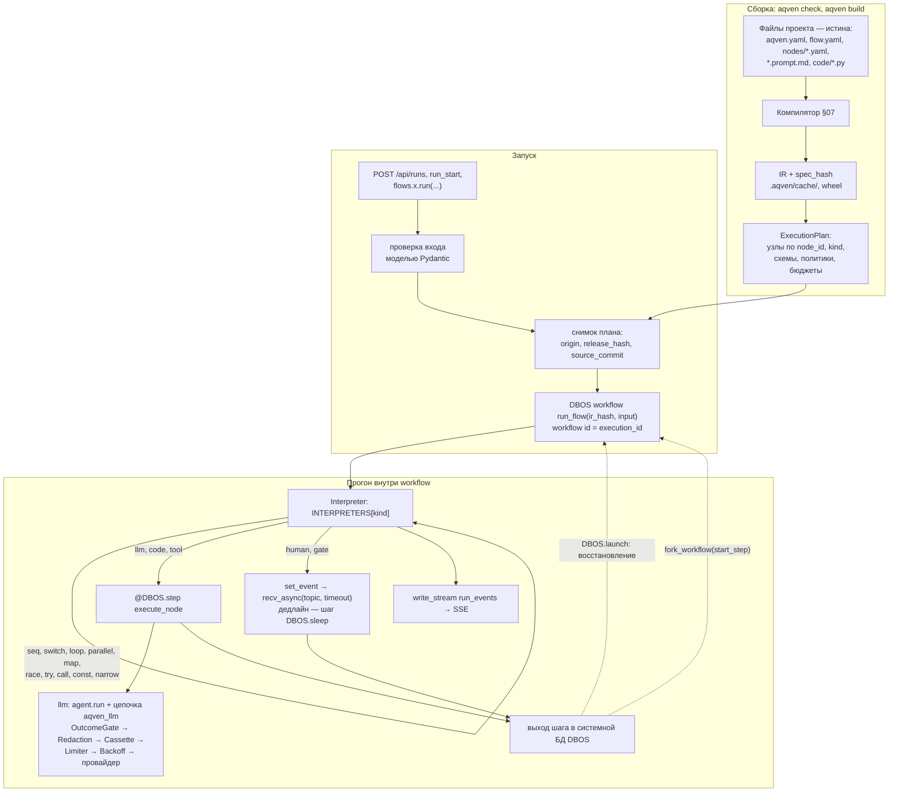
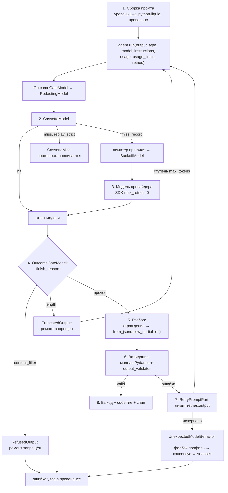

# 10. Рантайм: исполнитель IR, исполнители узлов, состояние

> Статус: draft
> Зависит от: [07. Компилятор](07-compiler.md), [06. Реестры](06-registries.md), [05. Система типов](05-type-system.md), [03. Ядро языка](03-core-language.md), [04. Формат IR](04-ir-schema.md), [16. Модель данных](16-data-model.md), [12. Наблюдаемость](12-observability.md), [23. API локальной студии](23-studio-api.md), [ADR-0025](adr/0025-python-engine.md), [ADR-0026](adr/0026-yaml-spec-and-code-refs.md), [ADR-0027](adr/0027-dynamic-io-shapes.md), [ADR-0028](adr/0028-studio-api-contract.md), [ADR-0029](adr/0029-trust-and-quality-python.md)
> Источники: [research/py-stack-runtime.md](research/py-stack-runtime.md) §3, §4, §5, §10; [research/py-quality-layer.md](research/py-quality-layer.md) §1; спека §10, §6.5, §7.2, §8.5, §8.6, §8.12; спека §20.1–§20.4 заменена [ADR-0025](adr/0025-python-engine.md) §7

## Зачем этот слой

Компилятор доказывает свойства графа до запуска, но ничего не гарантирует во время запуска. Рантайм закрывает §8.5
(управление потоком: `switch` без first-match, циклы без лимита, кворумы, `on_item_error`), §8.6 (надёжность:
чекпоинты, рестарт, детерминированный реплей), §8.12 (люди в цикле: таймауты ожиданий) и бюджетную часть §8.7/§8.11
(rate limits провайдера, взрыв стоимости). DBOS 2.31.1 даёт чекпоинт результата шага, восстановление после падения,
fork с шага, ожидание сообщения с долговечным таймаутом и поток событий прогона; Pydantic AI 2.43.0 — вызов модели с
типизированным выходом и повтором, бюджеты и точку врезки `WrapperModel`. Модели графа нет ни у того, ни у другого:
исполнитель IR, семантика конструкций и гарантии узлов — наш слой, и ни строкой больше
([ADR-0025](adr/0025-python-engine.md) §3).

## Решения

| Решение | Что берём | Версия | Лицензия | Почему |
|---|---|---|---|---|
| Исполнение плана | наша функция `@DBOS.workflow()` — Interpreter над планом скомпилированного IR | dbos 2.31.1 | MIT | чекпоинт шага, восстановление, fork и история шагов готовы; модели графа у DBOS нет, у pydantic-graph нет сохранения состояния ([ADR-0025](adr/0025-python-engine.md) §3) |
| Исполнение узла с вводом-выводом | `@DBOS.step(retries_allowed=False)` | dbos 2.31.1 | MIT | выход шага пишется в системную БД и после падения не повторяется (запуск 3.14.7, [research/py-stack-runtime.md](research/py-stack-runtime.md) §5.1) |
| Узел `llm` внутри DBOS | один `DBOS.step` на узел или `agent.run()` под capability `DBOSDurability` в функции workflow | dbos 2.31.1, pydantic-ai-slim 2.43.0 | MIT | выбор — [ADR-0025](adr/0025-python-engine.md) ОВ 4; одобрение тула возможно только во втором варианте (§8.6) |
| Системная БД DBOS | SQLite локально с `use_listen_notify = False`, PostgreSQL 18 в проде (схема `dbos`) | `sqlite3.sqlite_version` 3.53.1 / 18 | public domain / PostgreSQL License | `aqven dev` без отдельного сервиса ([ADR-0025](adr/0025-python-engine.md) §4) |
| Восстановление после падения | `DBOS.launch()` | dbos 2.31.1 | MIT | незавершённые прогоны продолжаются без повтора завершённых шагов |
| Реплей и форк | `DBOS.fork_workflow(workflow_id, start_step, ...)`, `WorkflowStatus.forked_from` | dbos 2.31.1 | MIT | новый прогон с копией шагов до выбранного, связь с исходным хранит DBOS |
| Вызов модели | `Agent.run(output_type=..., model=..., instructions=..., usage=..., usage_limits=..., retries=...)` | pydantic-ai-slim 2.43.0 | MIT | типизированный выход с повтором, модель и инструкции на вызове |
| Гарантии на каждом вызове модели | цепочка `WrapperModel` из фабрики `aqven_llm` | pydantic-ai-slim 2.43.0 | MIT | исход, редакция, кассета, лимитер и ретрай для любого вызова, включая судей и reflection ([ADR-0029](adr/0029-trust-and-quality-python.md) §1) |
| Транспортный ретрай | `BackoffModel` на tenacity; SDK провайдеров с `max_retries=0` | 9.1.4 | Apache-2.0 | единственный слой транспортного ретрая |
| Бюджеты | `UsageLimits` + общий `RunUsage` на прогон; цены — снимок genai-prices | pydantic-ai-slim 2.43.0 / genai-prices 0.1.7 | MIT | журнал общий для всех агентов прогона ([ADR-0029](adr/0029-trust-and-quality-python.md) §4) |
| Проверка значений на границах | pydantic | 2.13.5 | MIT | вход и выход узла и воркфлоу, ответ человека ([ADR-0026](adr/0026-yaml-spec-and-code-refs.md) §7) |
| Шаблоны промтов | python-liquid | 2.3.1 | MIT | `StrictUndefined`, статический анализ ([ADR-0029](adr/0029-trust-and-quality-python.md) §8) |
| Ожидание человека и дедлайн | `DBOS.set_event`, `DBOS.recv_async(topic, timeout_seconds)`, `DBOS.send`; дедлайн — выход шага `DBOS.sleep` | dbos 2.31.1 | MIT | внешнего планировщика нет, дедлайн переживает SIGKILL ([ADR-0025](adr/0025-python-engine.md) §9) |
| События прогона | `DBOS.write_stream_async("run_events", ...)` | dbos 2.31.1 | MIT | запись exactly-once, `seq` = смещение + 1, своей outbox-таблицы нет ([23](23-studio-api.md) §11.4) |
| Строки адреса для DBOS, ключи идемпотентности | `rfc8785` + `hashlib` | 0.1.4 | Apache-2.0 | один кодировщик адреса ([ADR-0025](adr/0025-python-engine.md) §9) |
| Сериализация шагов | по умолчанию pickle (`py_pickle`), кандидат — `portable_json` | dbos 2.31.1 | MIT | выбор — [ADR-0025](adr/0025-python-engine.md) ОВ 7; на границе шага в любом случае только JSON-совместимые значения (§6.2) |
| Отмена прогона | `DBOS.cancel_workflow` | dbos 2.31.1 | MIT | по доке, запуском не проверено — открытый вопрос 2 |
| Фильтр инъекций на входе | не выбран | — | — | открытый вопрос 8 |

Пишем сами (у DBOS и Pydantic AI этого нет): исполнитель IR и таблицы интерпретаторов, исполнители узлов `llm`,
`tool`, `code`, `human`, `narrow`, `switch`, сведение веток `all`/`any`/`quorum(k)`/`first_success`, лимиты циклов,
`on_item_error`, связь шагов DBOS с адресом исполнения, ключи идемпотентности, слой узла `human` поверх примитивов
DBOS, исполнитель исходов вызова, расчёт лимитов вызова, RPM/TPM-бакет профиля. jsonrepair и pg-boss в рантайме нет
([ADR-0029](adr/0029-trust-and-quality-python.md) §7, [ADR-0025](adr/0025-python-engine.md) §4).

## 1. Схема исполнения

Компилятор (`aqven check`, `aqven build`) собирает YAML, промты и `code/*.py` в IR со `spec_hash`; IR — производный
артефакт в `.aqven/cache/` и в wheel, в git не коммитится ([ADR-0026](adr/0026-yaml-spec-and-code-refs.md) §9). План
исполнения (`ExecutionPlan`) — сериализуемое представление IR без замыканий: узлы по `node_id`, виды, схемы, политики,
бюджеты. При запуске план материализуется снимком в хранилище прогонов до старта workflow (§2.4); **исполнение файлов
не читает вовсе**. Прогон — один DBOS-workflow `run_flow(ir_hash, flow_input)`, идентификатор workflow равен
`execution_id`; внутри него интерпретатор обходит план.



Правило разделения: **DBOS отвечает за «что уже записано и что повторить после падения», интерпретатор — за «что
исполнить следующим и что считается успехом узла»**. Исполнение узла с вводом-выводом — ровно один DBOS-шаг,
конструкции без ввода-вывода шагов не создают: каждый шаг — запись в системную БД (§7.1) и копия при форке (§7.3).

Функция workflow детерминирована. Время, случайность, сеть и вызовы моделей — только внутри шагов; чтение
неизменяемого снимка плана по хешу допустимо. После восстановления DBOS заново исполняет функцию workflow, завершённые
шаги возвращают записанные выходы ([research/py-stack-runtime.md](research/py-stack-runtime.md) §5.1), и интерпретатор
приходит в то же состояние; конкурентные шаги дока DBOS допускает при детерминированном порядке старта (там же §5.5).

## 2. Исполнитель плана

### 2.1. Контракт

```python
from collections.abc import Awaitable, Callable, Mapping
from dataclasses import dataclass
from enum import StrEnum
from typing import NewType, Protocol

from dbos import DBOS
from pydantic import JsonValue

FlowId = NewType("FlowId", str)
IrHash = NewType("IrHash", str)
NodeId = NewType("NodeId", str)
ExecutionId = NewType("ExecutionId", str)

type JsonObject = dict[str, JsonValue]


class NodeKind(StrEnum):
    LLM = "llm"
    CODE = "code"
    TOOL = "tool"
    HUMAN = "human"
    CONST = "const"
    NARROW = "narrow"
    SEQ = "seq"
    PARALLEL = "parallel"
    MAP = "map"
    SWITCH = "switch"
    LOOP = "loop"
    RACE = "race"
    GATE = "gate"
    TRY = "try"
    CALL = "call"


@dataclass(frozen=True, slots=True)
class CompiledNode:
    node_id: NodeId
    kind: NodeKind
    spec: NodeSpec


def spec_of[S: NodeSpec](node: CompiledNode, expected: type[S]) -> S:
    if isinstance(node.spec, expected):
        return node.spec
    raise PlanCorrupted(node.node_id, node.kind)


class ExecutionPlan(Protocol):
    @property
    def ir_hash(self) -> IrHash: ...
    @property
    def root(self) -> NodeId: ...
    def node(self, node_id: NodeId) -> CompiledNode: ...


class RunContext(Protocol):
    @property
    def ir_hash(self) -> IrHash: ...
    def bind_inputs(self, node: CompiledNode, address: ExecutionAddress) -> JsonObject: ...
    async def interpret(self, node_id: NodeId, address: ExecutionAddress) -> JsonValue: ...


type StepExecutor = Callable[[CompiledNode, JsonObject], Awaitable[JsonValue]]
type Interpretation = Callable[[RunContext, CompiledNode, ExecutionAddress], Awaitable[JsonValue]]

STEP_EXECUTORS: Mapping[NodeKind, StepExecutor] = {
    NodeKind.LLM: execute_llm,
    NodeKind.CODE: execute_code,
    NodeKind.TOOL: execute_tool,
}


@DBOS.step(retries_allowed=False)
async def execute_node(ir_hash: IrHash, node_id: NodeId, address: JsonObject, inputs: JsonObject) -> JsonValue:
    node = plan_for(ir_hash).node(node_id)
    return await STEP_EXECUTORS[node.kind](node, inputs)


async def run_as_step(run: RunContext, node: CompiledNode, address: ExecutionAddress) -> JsonValue:
    inputs = run.bind_inputs(node, address)
    return await execute_node(run.ir_hash, node.node_id, address.model_dump(mode="json"), inputs)


INTERPRETERS: Mapping[NodeKind, Interpretation] = {
    **{kind: run_as_step for kind in STEP_EXECUTORS},
    NodeKind.CONST: interpret_const,
    NodeKind.NARROW: interpret_narrow,
    NodeKind.HUMAN: wait_for_human,
    NodeKind.SEQ: interpret_seq,
    NodeKind.PARALLEL: interpret_parallel,
    NodeKind.MAP: interpret_map,
    NodeKind.SWITCH: interpret_switch,
    NodeKind.LOOP: interpret_loop,
    NodeKind.RACE: interpret_race,
    NodeKind.GATE: interpret_gate,
    NodeKind.TRY: interpret_try,
    NodeKind.CALL: interpret_call,
}


@DBOS.workflow()
async def run_flow(ir_hash: IrHash, flow_input: JsonObject) -> JsonValue:
    plan = plan_for(ir_hash)
    run = start_run(plan, flow_input)
    root = ExecutionAddress(node_id=plan.root, branch_key=None, iteration=None, item_index=None)
    return await run.interpret(plan.root, root)
```

Исполнитель — Interpreter над планом, вид узла выбирается таблицей (Strategy). `STEP_EXECUTORS` — узлы с вводом-выводом,
они исполняются DBOS-шагом `execute_node`. Остальные строки `INTERPRETERS` исполняются в самой функции workflow:
конструкции без ввода-вывода и узел `human`, потому что `DBOS.recv` внутри шага бросает `DBOSException`
([ADR-0025](adr/0025-python-engine.md) ОВ 4). Полноту таблицы держит тест: множество ключей
`INTERPRETERS` равно `NodeKind`, ветки по умолчанию нет. `spec_of` — guard clause: расхождение вида узла и его
спецификации — `PlanCorrupted`, а не молчаливое приведение.

`ExecutionAddress` — модель [23](23-studio-api.md) §2, §6.2. `start_run` строит `WorkflowRun` — реализацию `RunContext`
(не показана): хранит выходы исполнений по адресу, резолвит привязки по грамматике [04](04-ir-schema.md) §3.1–§3.2,
пишет события `node_started` и `node_finished` в поток `run_events` (Observer) и вызывает `INTERPRETERS[node.kind]`.
Остальные члены `RunContext` (`read_text`, `read_items`, `budget_snapshot`, `now`, `scheduler`) появляются в
разделах, где нужны. В `execute_node` адрес уходит JSON-значением, а `node_id` — отдельно: на границе шага только
JSON-совместимые значения (§6.2). В сниппете узел `llm` исполняется шагом; форма `DBOSDurability` переносит его в
интерпретаторы уровня workflow, выбор — [ADR-0025](adr/0025-python-engine.md) ОВ 4.

Сниппеты разделов 2–10 прошли pyright 1.1.414 strict на CPython 3.14.7 (dbos 2.31.1, pydantic-ai-slim 2.43.0,
pydantic 2.13.5) вместе с заглушками типов, которых в тексте нет (проба при переписывании документа 2026-09-16);
исполнением не проверялись. Проверенная запуском форма исполнителя — [ADR-0025](adr/0025-python-engine.md) §3.

### 2.2. Адрес исполнения и шаги DBOS

Адрес исполнения — единственный ключ, по которому интерпретатор достаёт чужой выход, студия запрашивает исполнение,
API переводит форк в шаг DBOS, а события и спаны склеиваются. Он детерминирован для одного плана и одного входа.

| Конструкция | Адрес исполнения |
|---|---|
| Узел верхнего уровня | `node_id`, остальные поля `null` |
| Ветка `parallel`, ячейка `switch` | `branch_key` — ключ ветки или значение дискриминанта |
| Проход тела `loop` | `iteration` 0..n; итог узла-цикла — отдельное исполнение с `iteration: null` |
| Элемент `map` | `item_index` 0..n |
| Узел тела компонента `call`, вложенные конструкции | не определён — открытый вопрос 1 |
| Попытка | не часть адреса: список `attempts[]` внутри исполнения ([23](23-studio-api.md) §6.3) |

Правила:

- `node_id` берётся из IR и уже проверен компилятором. Адрес — структура: строковые ключи (`n:<nodeId>`,
  `nodeId#branch`, `nodeId@iteration`) запрещены в API, событиях и хранилище ([ADR-0028](adr/0028-studio-api-contract.md) §5).
- Строки, которых требует DBOS, — топик ожидания и id дочернего workflow — выводит один кодировщик: `address_key` —
  JSON адреса по RFC 8785; строки живут только внутри адаптера DBOS и обратно не разбираются
  ([ADR-0025](adr/0025-python-engine.md) §9).
- Переименование узла меняет IR и `spec_hash`: адреса прогонов прежней версии на новую не переносятся, резолверы lineage
  читают журнал `renames` в `aqven.yaml`.
- DBOS знает шаги по `function_id` и имени функции (`execute_node`, `DBOS.recv`, `DBOS.sleep`,
  `<имя агента>__model.request`), а не по адресу. Связь «адрес → `function_id` первого шага исполнения» записывает
  исполнитель; форма записи — [ADR-0025](adr/0025-python-engine.md) ОВ 8, [23](23-studio-api.md) ОВ 28.

### 2.3. Версия плана и версия исполнителя

Реестра версий воркфлоу нет: DBOS регистрирует одну функцию `run_flow`, а граф приходит входом прогона. Оси версий
разведены ([ADR-0025](adr/0025-python-engine.md) §4, §9):

| Ось | Что несёт | Когда меняется |
|---|---|---|
| `ir_hash` во входе workflow | граф, промты, схемы, политики — снимок плана (§2.4) | каждая правка определения; новый прогон берёт новый хеш, процесс не перезапускается |
| `application_version` в `DBOSConfig` | протокол исполнителя: форма `run_flow`, таблицы интерпретаторов, порядок шагов | только несовместимая правка исполнителя. По умолчанию DBOS считает версию по исходникам функций workflow, и правка кода оставила ждущие прогоны без восстановления (проверено) |

`plan_for(ir_hash)` — ленивая загрузка (Registry + Lazy Initialization):

1. Кэш процесса по `ir_hash` → есть, вернуть.
2. Нет — загрузить снимок плана из хранилища прогонов (§2.4); в файловое дерево и в `.aqven/cache/` `plan_for` не ходит.
3. Снимка нет — `PlanMissing`: прогон падает типизированной ошибкой, а не исполняет другой граф.

План по хешу неизменяем, поэтому кэш — LRU, вытеснение безопасно в любой момент. Тестовый прогон рабочей копии
(`at: working`, [23](23-studio-api.md) §6.4) материализуется тем же путём.

Инвариант версии: у восстановленного и у форкнутого прогона тот же `ir_hash`, что у исходного, — DBOS копирует вход
workflow. Сменить граф у живого прогона нельзя, только новым прогоном. Горячая загрузка новой версии и восстановление
прогона под старым хешем после правки файлов запуском не проверены, перенос ждущих прогонов на новую
`application_version` через `fork_workflow(application_version=...)` не запускался — [ADR-0025](adr/0025-python-engine.md) ОВ 6.

### 2.4. Материализация плана

Определения живут файлами ([ADR-0017](adr/0017-files-as-source-of-truth.md)), но **прогон файлов не читает** — ни при
старте, ни в процессе. План материализуется из IR один раз и кладётся снимком в базу до старта workflow
([23](23-studio-api.md) §6.4); дальше исполняется снимок. Та же конструкция, что `status.storedWorkflowSpec` у Argo и
`created_dag_version_id` у Airflow 3.

| Поле прогона | Значение | Роль |
|---|---|---|
| `origin` | `release \| working_copy` | откуда материализован план: тег релиза или рабочее дерево; из рабочей копии стартуем только при валидном дереве, из релиза — всегда |
| `release_hash` | `hash(spec_hash, prompt_pins, model_profile_pins, component_lock, env_overlay_hash)` | **авторитетная идентичность исполненного**: по ней сравнивают и воспроизводят прогоны |
| `spec_version_id` | строка со снимком IR и `ExecutionPlan` | физическое тело плана; читается вечно и не зависит от состояния репозитория |
| `source_commit` | sha коммита эпизода, nullable | провенанс: blame, дифф двух прогонов в git |
| `source_ref` | `refs/heads/main` или `aqven/agent/<session>` | откуда пришло: прогон с ветки агента видно сразу |
| `source_dirty` | `true`, если эпизод ещё не закоммичен | честный признак «запуск из-под руки»; воспроизводимость не страдает, снимок уже в базе |

Авторитетен **хеш содержимого, а не commit sha**: sha меняется от косметики (переезд файла, правка соседнего
воркфлоу в том же коммите) и исчезает при пересоздании репозитория, а прогоны живут дольше репозитория. Пишем оба:
хеш для равенства, sha для истории.

| Событие во время прогона | Что происходит |
|---|---|
| Файл узла изменён, промт переписан, определение откачено, переключена ветка | прогон идёт на снимке; изменение подхватит следующий запуск, в карточке — отметка «определение изменилось после старта» (`definition_changed`) |
| Индекс отстал или снесён (`DROP SCHEMA idx CASCADE`), удалён `.aqven/cache/` | прогон не затронут: `ExecutionPlan` лежит в `app`, а не в `idx` и не в кэше сборки |
| Восстановление после падения, форк | берут тот же снимок по `ir_hash` из входа workflow; снимка нет — `PlanMissing` (§2.3), а не молчаливое исполнение другого графа |

## 3. Интерпретация конструкций ядра на DBOS

| Конструкция ядра | Где исполняется | Что даёт DBOS или Pydantic AI | Что дописывает наш слой |
|---|---|---|---|
| `seq` | функция workflow, по порядку `steps` | выход каждого шага записан и после падения не повторяется | порядок, привязки, события `node_started`/`node_finished` |
| привязка, проекция | функция workflow, закрытая грамматика [04](04-ir-schema.md) §3.2 | — | провенанс значения; вычисление детерминировано, шага нет |
| `switch` (ровно одна ветка) | функция workflow, выбор ячейки по значению дискриминанта (§3.1) | — | `default` только с `default_reason`, `SwitchArityError`, `branch_key` в адресе |
| `parallel` | функция workflow, ветки через `BranchScheduler` (§3.3) | дочерние workflow (`DBOS.start_workflow_async`) проверены для веток с человеком ([ADR-0025](adr/0025-python-engine.md) §9, H5); конкурентные шаги при детерминированном порядке старта — по доке | сведение `all`/`any`/`quorum(k)`/`first_success`, `on_branch_error`, стоимость всех веток; форма для веток без человека — [ADR-0025](adr/0025-python-engine.md) ОВ 1 |
| `race` | как `parallel` | — | отмена проигравших, дискриминатор источника, стоимость всех веток; механизм отмены — открытый вопрос 2 |
| `map` | функция workflow, элементы через `BranchScheduler` с лимитом `concurrency` (§3.4) | `Queue` с лимитом конкурентности — по доке, не проверено | `on_item_error`, `max_items`, `item_index` в адресе; одновременность — `concurrency` узла и пул воркеров (§9.3); форма — [ADR-0025](adr/0025-python-engine.md) ОВ 1 |
| `loop` | функция workflow, цикл интерпретатора (§3.2) | проходы тела — записанные шаги | `max_iter`, бюджет, стагнация, `dedup`, `select: last \| best`; `iteration` в адресе |
| `try` | функция workflow, `try`/`except` вокруг интерпретации `body` по таблице `catch` | как записываются исключения шага и повторяет ли их восстановление — не проверено ([ADR-0025](adr/0025-python-engine.md) ОВ 3) | типизированные ошибки узлов; `finally` — отдельный узел |
| `gate` | функция workflow | `recv_async` с таймаутом | `waits_for: human` — исполнитель §8; `waits_for: event` — открытый вопрос 5 |
| `call` | функция workflow, тело компонента из плана по пину | — | проверка схем на границе компонента; адреса узлов тела — открытый вопрос 1 |
| `const` | функция workflow | — | значение из IR |
| `narrow` | функция workflow | проверка Pydantic до типа реестра | несовпадение — `WorkflowIssue` с `severity: "assert"` без повтора модели ([ADR-0027](adr/0027-dynamic-io-shapes.md)) |
| `human` | функция workflow (§8) | `set_event`, `recv_async`, `send`, шаг `DBOS.sleep` | индекс `suspended`, защита резюма, проверка срока и payload, политики `on_timeout` |
| `code` | шаг `execute_node` | запись выхода | вызов функции проекта `module:function` в процессе модуля, проверка выхода моделью с `revalidate_instances="always"` ([ADR-0026](adr/0026-yaml-spec-and-code-refs.md) §5, §7) |
| `tool` | шаг `execute_node` | запись выхода | ключ идемпотентности при `effect: write \| external` (§7.2) |
| `llm` | шаг `execute_node` или `agent.run()` под `DBOSDurability` в функции workflow | повтор выхода через `RetryPromptPart`, `UsageLimits`, цепочка `WrapperModel` | конвейер §4; выбор формы — [ADR-0025](adr/0025-python-engine.md) ОВ 4 |
| ранний выход | функция workflow возвращает результат | — | политика «достаточно хорошо» и её провенанс |
| аварийный выход | типизированное исключение узла | прогон завершается ошибкой | ошибка узла `{code, message, details}` |

### 3.1. `switch`: выбор ячейки и арность

Компилятор проверяет полноту enum и взаимоисключаемость ячеек (R-41), `default` допустим только с `default_reason`
([04](04-ir-schema.md) §2.5). Интерпретатор выбирает ячейку поиском по таблице `cases`; first-match по значению
дискриминанта тривиален, потому что ключи уникальны. Ячейка со значением (`{value: Binding}`) представлена в плане
узлом `const`.

```python
@dataclass(frozen=True, slots=True)
class SwitchSpec:
    on: Projection
    cases: Mapping[str, NodeId]
    default: NodeId | None


class SwitchArityError(Exception):
    def __init__(self, node_id: NodeId, value: str) -> None:
        super().__init__(f"switch {node_id}: no case for {value!r}")
        self.node_id = node_id
        self.value = value


def select_case(node: CompiledNode, spec: SwitchSpec, value: str) -> NodeId:
    chosen = spec.cases.get(value, spec.default)
    if chosen is None:
        raise SwitchArityError(node.node_id, value)
    return chosen


async def interpret_switch(run: RunContext, node: CompiledNode, address: ExecutionAddress) -> JsonValue:
    spec = spec_of(node, SwitchSpec)
    value = run.read_text(spec.on, address)
    chosen = select_case(node, spec, value)
    return await run.interpret(chosen, address.model_copy(update={"node_id": chosen, "branch_key": value}))
```

`SwitchArityError` — не «не должно случиться», а контролируемый отказ: значение вне `cases` без `default` означает
расхождение плана и данных (дыра в полноте enum или значение из непроверенного источника). Отказ идёт в провенанс
как ошибка узла, а не как пустой выход.

### 3.2. `loop` с `max_iter`: правила остановки

Тело выполняется минимум один раз ([03](03-core-language.md) §3.4). Счётчик, лучший кандидат и стагнация — локальное
состояние интерпретатора: после восстановления проходы тела возвращают записанные выходы, и счётчик приходит в то же
значение (§1). Условие остановки собрано из таблицы правил (Chain of Responsibility): первое сработавшее правило решает.

```python
type LoopStopReason = Literal["stop_when", "max_iter", "stagnation", "duplicate", "budget_exhausted", "deadline"]


@dataclass(frozen=True, slots=True)
class LoopCounter:
    iteration: int
    stop_when_met: bool
    duplicate: bool
    best_score: float | None
    best_iteration: int | None
    no_improvement_streak: int


type StopRule = Callable[[LoopCounter, LoopSpec, BudgetSnapshot], LoopStopReason | None]


def stop_when_met(counter: LoopCounter, spec: LoopSpec, budget: BudgetSnapshot) -> LoopStopReason | None:
    return "stop_when" if counter.stop_when_met else None


def max_iter_reached(counter: LoopCounter, spec: LoopSpec, budget: BudgetSnapshot) -> LoopStopReason | None:
    return "max_iter" if counter.iteration >= spec.max_iter else None


def stagnated(counter: LoopCounter, spec: LoopSpec, budget: BudgetSnapshot) -> LoopStopReason | None:
    return "stagnation" if counter.no_improvement_streak >= spec.stagnation.window else None


STOP_RULES: tuple[StopRule, ...] = (
    stop_when_met,
    max_iter_reached,
    stagnated,
    duplicated,
    budget_exhausted,
    deadline_passed,
)


def first_stop(counter: LoopCounter, spec: LoopSpec, budget: BudgetSnapshot) -> LoopStopReason | None:
    for rule in STOP_RULES:
        reason = rule(counter, spec, budget)
        if reason is not None:
            return reason
    return None


async def interpret_loop(run: RunContext, node: CompiledNode, address: ExecutionAddress) -> JsonValue:
    spec = spec_of(node, LoopSpec)
    counter = initial_counter()
    outputs: list[JsonValue] = []
    stop: LoopStopReason | None = None
    while stop is None:
        body = address.model_copy(update={"node_id": spec.body, "iteration": counter.iteration})
        outputs.append(await run.interpret(spec.body, body))
        counter = counter.advance(outputs[-1], spec)
        stop = first_stop(counter, spec, await run.budget_snapshot())
        await emit_loop_iteration(address, counter, stop)
    return finalize_loop(node, counter, outputs, stop)
```

`LoopCounter.advance` (метод не показан, как и `initial_counter`, `emit_loop_iteration` и остальные правила) обновляет
счётчик по выходу прохода: структурный предикат `stop_when` ([04](04-ir-schema.md) §2.4),
лучший кандидат по `score` — индекс итерации, а не копия значения (значение уже записано выходом шага), серия без
улучшения больше `stagnation.min_delta`, хеш кандидата для `dedup`. `finalize_loop` возвращает кандидата по `select` и
причину остановки; остановка по `max_iter`, `stagnation`, `budget_exhausted` или `deadline` без выполненного `stop_when` —
выход с пометкой качества, а не тихий успех. Каждый проход пишет `loop_iteration_finished`, выход из цикла —
`loop_exited` с `selected_iteration` ([23](23-studio-api.md) §11.2). `budget_snapshot()` асинхронный: текущее время для
правила `deadline` берётся из шага, иначе функция workflow перестаёт быть детерминированной.

### 3.3. `parallel` с `quorum(k)`

Ветки получают один вход. Исключение `NodeFailure` ветки превращается в `BranchFailed` в обёртке ветки: иначе падение
одной ветки роняет узел до сведения. Каждая ветка несёт свой `branch_key` в адресе, результаты не сливаются в общий
объект — сведение делает таблица политик (Strategy).

```python
@dataclass(frozen=True, slots=True)
class BranchOk:
    branch_key: str
    value: JsonValue


@dataclass(frozen=True, slots=True)
class BranchFailed:
    branch_key: str
    error: NodeError


@dataclass(frozen=True, slots=True)
class JoinAccepted:
    value: JsonValue


@dataclass(frozen=True, slots=True)
class JoinRejected:
    policy: JoinPolicy
    failures: tuple[BranchFailed, ...]


type BranchOutcome = BranchOk | BranchFailed
type JoinPolicy = Literal["all", "any", "quorum", "first_success"]
type JoinOutcome = JoinAccepted | JoinRejected
type JoinRule = Callable[[Sequence[BranchOutcome], int], JoinOutcome]


def accepted(outcomes: Sequence[BranchOutcome]) -> list[BranchOk]:
    return [outcome for outcome in outcomes if isinstance(outcome, BranchOk)]


def join_all(outcomes: Sequence[BranchOutcome], k: int) -> JoinOutcome:
    ok = accepted(outcomes)
    if len(ok) < len(outcomes):
        return JoinRejected("all", failures(outcomes))
    return JoinAccepted({branch.branch_key: branch.value for branch in ok})


def join_any(outcomes: Sequence[BranchOutcome], k: int) -> JoinOutcome:
    ok = accepted(outcomes)
    if not ok:
        return JoinRejected("any", failures(outcomes))
    return JoinAccepted(ok[0].value)


def join_quorum(outcomes: Sequence[BranchOutcome], k: int) -> JoinOutcome:
    ok = accepted(outcomes)
    if len(ok) < k:
        return JoinRejected("quorum", failures(outcomes))
    return JoinAccepted([branch.value for branch in ok])


JOIN_RULES: Mapping[JoinPolicy, JoinRule] = {
    "all": join_all,
    "any": join_any,
    "quorum": join_quorum,
    "first_success": join_any,
}


def unwrap_join(node: CompiledNode, joined: JoinOutcome) -> JsonValue:
    match joined:
        case JoinAccepted(value=value):
            return value
        case JoinRejected():
            raise JoinFailure(node.node_id, joined)
        case _:
            assert_never(joined)


async def run_branch(run: RunContext, branch_key: str, node_id: NodeId, address: ExecutionAddress) -> BranchOutcome:
    branch = address.model_copy(update={"node_id": node_id, "branch_key": branch_key})
    try:
        value = await run.interpret(node_id, branch)
    except NodeFailure as failure:
        return BranchFailed(branch_key, failure.error)
    return BranchOk(branch_key, value)


class BranchScheduler(Protocol):
    async def run_branches(
        self, run: RunContext, address: ExecutionAddress, branches: Mapping[str, NodeId]
    ) -> list[BranchOutcome]: ...

    async def run_items(
        self, run: RunContext, address: ExecutionAddress, body: NodeId, items: Sequence[JsonValue]
    ) -> list[ItemOutcome]: ...


async def interpret_parallel(run: RunContext, node: CompiledNode, address: ExecutionAddress) -> JsonValue:
    spec = spec_of(node, ParallelSpec)
    outcomes = await run.scheduler.run_branches(run, address, spec.branches)
    joined = JOIN_RULES[spec.join](outcomes, spec.quorum_k or len(spec.branches))
    return unwrap_join(node, joined)
```

Семантика политик — [03](03-core-language.md) §3.1: результаты в порядке объявления веток, а не завершения; `all` —
запись по ключам веток, `any` — первая `ok` в порядке объявления, `quorum(k)` — список `ok`. `first_success` сводится
как `any`, но стартует ветки одновременно и отменяет остальные после первой `ok` — механизм отмены открыт (вопрос 2).
`on_branch_error: skip | default` применяется до сведения: `skip` убирает `BranchFailed`, `default` заменяет его на
`BranchOk` со значением того же типа. `match` с `assert_never` держит исчерпываемость исхода сведения.

`BranchScheduler` — Strategy транспорта веток. Кандидаты: `InWorkflowGather` — `asyncio.gather` интерпретаций веток,
стартующих в порядке объявления в самой функции workflow; `ChildWorkflowPerBranch` — дочерний workflow на ветку с id
`parent_run_id + "::" + address_key` через `DBOS.start_workflow_async`, как у веток с человеком. Дока DBOS велит
запускать конкурентные последовательности дочерними workflow и допускает конкурентные шаги при детерминированном
порядке старта ([research/py-stack-runtime.md](research/py-stack-runtime.md) §5.5). Нумерация шагов, восстановление и
форк внутри параллельной секции ни в одной форме не проверены — [ADR-0025](adr/0025-python-engine.md) ОВ 1, до спайка
форма не выбирается. События дочерних workflow в run-канале родителя — [23](23-studio-api.md) ОВ 29.

Стоимость считается по **всем** веткам, включая отвергнутые кворумом: `node_finished` каждой ветки несёт `cost_usd` и
токены, в провенанс сведения идут все ветки, а не только принятые.

### 3.4. `map` с `on_item_error`

Элемент получает своё исполнение с `item_index` ([23](23-studio-api.md) §6.2), ошибка элемента — `ItemFailed`, политика
применяется после завершения элементов. Имена политик — из IR ([04](04-ir-schema.md) §2.3): `fail | skip | collect`.

```python
type ItemErrorPolicy = Literal["fail", "skip", "collect"]


@dataclass(frozen=True, slots=True)
class ItemOk:
    item_index: int
    value: JsonValue


@dataclass(frozen=True, slots=True)
class ItemFailed:
    item_index: int
    error: NodeError

    def as_json(self) -> JsonObject:
        return {"item_index": self.item_index, **self.error.model_dump(mode="json")}


type ItemOutcome = ItemOk | ItemFailed
type ItemPolicy = Callable[[CompiledNode, Sequence[ItemOutcome]], JsonValue]


def succeeded(outcomes: Sequence[ItemOutcome]) -> list[JsonValue]:
    return [outcome.value for outcome in outcomes if isinstance(outcome, ItemOk)]


def fail_on_error(node: CompiledNode, outcomes: Sequence[ItemOutcome]) -> JsonValue:
    first = next((outcome for outcome in outcomes if isinstance(outcome, ItemFailed)), None)
    if first is not None:
        raise MapItemError(node.node_id, first)
    return succeeded(outcomes)


def skip_failed(node: CompiledNode, outcomes: Sequence[ItemOutcome]) -> JsonValue:
    return succeeded(outcomes)


def collect_failed(node: CompiledNode, outcomes: Sequence[ItemOutcome]) -> JsonValue:
    failed: list[JsonValue] = [outcome.as_json() for outcome in outcomes if isinstance(outcome, ItemFailed)]
    return {"ok": succeeded(outcomes), "failed": failed}


ITEM_POLICIES: Mapping[ItemErrorPolicy, ItemPolicy] = {
    "fail": fail_on_error,
    "skip": skip_failed,
    "collect": collect_failed,
}


async def interpret_map(run: RunContext, node: CompiledNode, address: ExecutionAddress) -> JsonValue:
    spec = spec_of(node, MapSpec)
    items = run.read_items(spec.over, address, spec.max_items)
    outcomes = await run.scheduler.run_items(run, address, spec.body, items)
    return ITEM_POLICIES[spec.on_item_error](node, outcomes)
```

`fail` бросает после завершения запущенных элементов, а не в элементе: иначе теряются выходы и стоимость успевших.
`read_items` поднимает `FanOutTooLarge`, если коллекция больше `max_items` из IR, — до старта элементов; веер больше
порога идёт батчами (§9.3). Порядок результатов — порядок элементов, а не завершения. Форма конкурентности
(`BranchScheduler.run_items` на семафоре в функции workflow или `Queue` DBOS) — [ADR-0025](adr/0025-python-engine.md) ОВ 1.

## 4. Конвейер узла `llm`

Одно исполнение узла `llm` = одна транзакция гарантий. Внутри — стадии спеки §10, у каждой свой отказ. Гарантии вызова
стоят в цепочке `WrapperModel` ([ADR-0029](adr/0029-trust-and-quality-python.md) §1), ремонт применим только к исходу
`ok` и стоит после валидации. В форме «один `DBOS.step` на узел» все стадии идут внутри шага `execute_node`, в форме
`DBOSDurability` запросы модели — отдельные шаги `<имя агента>__model.request` ([ADR-0025](adr/0025-python-engine.md) ОВ 4).



### 4.1. Стадии

| № | Стадия | Чем реализовано | Что при неуспехе |
|---|---|---|---|
| 1 | Сборка промта | уровень по содержимому `prompt` (Strategy, [ADR-0026](adr/0026-yaml-spec-and-code-refs.md) §4): 1 — адаптер дописывает входы с описаниями, выходы и блок формата вывода; 2 — шаблон python-liquid 2.3.1 из реестра, `Environment(undefined=StrictUndefined, loader=RegistryLoader(...))`; 3 — функция проекта `pkg.mod:function`. Значения слотов — выходы исполнений по привязкам; каждому значению приписывается `Provenance{source_address, trust, pii, rendered_at}`. Медиазначения идут частями `user_prompt` (`BinaryContent`, `ImageUrl` и др.), в текст не рендерятся | нехватка слота (`UndefinedError`) или `untrusted`-значение в запрещённой позиции — `TemplateBindingError` до вызова модели |
| 2 | Replay-кэш | `CassetteModel`, звено 3 цепочки; ключ `sha256("aqven.cassette.v1\0" + канонический JSON)` от нейтрального запроса: логическая ссылка модели из каталога, сообщения без меток времени и id, слитые настройки, `output_mode`, схемы выхода и тулов со `strict` | miss в `replay_strict` — `CassetteMiss`, прогон останавливается и никогда не деградирует в живой вызов; в `record` — вызов ниже по цепочке и запись отредактированного ответа |
| 3 | Вызов модели | `agent.run(user_prompt, output_type=..., model=<цепочка из aqven_llm>, instructions=..., model_settings=..., usage=<журнал прогона>, usage_limits=..., retries={"output": k})`; `output_type` из `output_contract.mode`: `strict` → `ToolOutput(M, strict=True)` или `NativeOutput(M, strict=True)`, `json` → `PromptedOutput(M)` ([ADR-0029](adr/0029-trust-and-quality-python.md) §2, [ADR-0027](adr/0027-dynamic-io-shapes.md)); режим `grammar` для self-hosted профилей — [ADR-0027](adr/0027-dynamic-io-shapes.md) ОВ 4 | 429 и 5xx — `BackoffModel` (§9.2), исчерпание — `ModelHTTPError` → `ProviderFailure`; истёк таймаут узла — `NodeTimeout` (§10) |
| 4 | Классификация исхода | `OutcomeGateModel`, звено 1: таблица `OUTCOME_GATES` по `finish_reason` и `provider_details` сразу после ответа, до разбора и до цикла `output`-ретраев | `length` → `TruncatedOutput`, `content_filter` → `RefusedOutput` (§4.2); `error` и `pause_turn` не классифицированы — [ADR-0029](adr/0029-trust-and-quality-python.md) ОВ 23 |
| 5 | Разбор | Pydantic AI: снятие markdown-ограждения, `pydantic_core.from_json(allow_partial="off")`; локального ремонта JSON нет | синтаксически битый полный ответ — ошибка `json_invalid`, дальше стадия 7 ценой вызова модели |
| 6 | Валидация | модель выхода Pydantic (сгенерированная; для `Dynamic` — `create_model` с `extra="forbid"`, [ADR-0027](adr/0027-dynamic-io-shapes.md)) + `@agent.output_validator`: вхождение в allowed-set с подсказкой трёх ближайших кандидатов, подстановка кода в ID, межполевые правила, язык ответа; регистр нормализует `BeforeValidator` | ошибки валидации или `ModelRetry` → стадия 7 |
| 7 | Ремонт по политике | `RetryPromptPart` со всеми ошибками валидации, не больше `retries["output"]` из IR; `ToolOutput(max_retries=...)` не задаётся | исчерпание — `UnexpectedModelBehavior` → `NodeQualityFailure` → фолбэк-профиль → консенсус или эскалация человеку; досрочный обрыв при повторе того же набора ошибок — [ADR-0029](adr/0029-trust-and-quality-python.md) ОВ 8 |
| 8 | Выход | выход шага — `model_dump(mode="json")`, провенанс, событие `node_finished` в `run_events`, атрибуты `aqven.*` на спане ([12](12-observability.md)) | — |

Проверка на горячем пути одна — Pydantic на каждой границе ([ADR-0026](adr/0026-yaml-spec-and-code-refs.md) §7): Zod и
ajv ушли вместе с TS-движком. Всё, что трансформер профиля унёс из wire-схемы в `description`, держит только эта
проверка ([ADR-0029](adr/0029-trust-and-quality-python.md) §6).

### 4.2. Три исхода вызова

Исход определяет `OutcomeGateModel` до разбора. Исполнитель узла переводит исключение в исход таблицей
`FAILURE_BY_EXCEPTION` (Registry), которая просматривается по `type(error).__mro__` (Chain of Responsibility): подкласс
(`IncompleteToolCall`, `ContentFilterError`) побеждает общий `UnexpectedModelBehavior`, исключение вне таблицы
пробрасывается ([ADR-0029](adr/0029-trust-and-quality-python.md) §3).

```python
type FailureHandler = Callable[[LlmNodeRun, Exception], Awaitable[NodeResolution]]

FAILURE_BY_EXCEPTION: Mapping[type[Exception], FailureHandler] = {
    TruncatedOutput: retry_with_larger_limit,
    RefusedOutput: fail_with_refusal,
    IncompleteToolCall: retry_with_larger_limit,
    ContentFilterError: fail_with_refusal,
    UnexpectedModelBehavior: fail_quality,
    UsageLimitExceeded: stop_on_budget,
    CassetteMiss: stop_run,
    ModelHTTPError: fall_back_provider,
    ModelAPIError: fall_back_provider,
}


def handler_for(error: Exception) -> FailureHandler | None:
    handlers = (FAILURE_BY_EXCEPTION.get(kind) for kind in type(error).__mro__)
    return next((handler for handler in handlers if handler is not None), None)


async def resolve_failure(run: LlmNodeRun, error: Exception) -> NodeResolution:
    handler = handler_for(error)
    if handler is None:
        raise error
    return await handler(run, error)
```

`refusal` — отдельный канал API, а не нарушение схемы: ответ может вообще не следовать схеме. Ремонт и повтор того же
промта запрещены; маршрут — фолбэк-профиль или эскалация, причина — из `provider_details` (`refusal`,
`refusal_category` у Anthropic).

`truncated` — запрет на ремонт **жёсткий**. Pydantic AI по умолчанию повторяет обрезанный tool call с тем же
`max_tokens`, а полный JSON с `finish_reason=length` принимает как `ok`
([research/py-quality-layer.md](research/py-quality-layer.md) §1.4, случаи A и B); гейт превращает оба в
`TruncatedOutput` за один вызов. Маршрут: одна ступень увеличения `max_tokens` из IR (новый ключ кассеты), затем
фолбэк-профиль с бо́льшим окном, затем эскалация; `model_context_window_exceeded` — сразу на фолбэк-профиль. Каждая
ступень идёт против бюджета узла.

`IncompleteToolCall` и `ContentFilterError` появляются, только если гейт обойдён: маршрут тот же, а появление — дефект
сборки цепочки, он пишется в трассу. Слияние `refusal` и `truncated` в «невалидный JSON» — дефект реализации; его ловят
фикстуры случаев A–E [ADR-0029](adr/0029-trust-and-quality-python.md) «Проверка».

### 4.3. Что уходит в провенанс исполнения

Спан узла и `ExecutionDetail` ([23](23-studio-api.md) §6.3) несут: уровень промта, отрисованный промт (или его хэш в
PII-режиме, где спаны пишутся с `include_content=False`), метки происхождения каждого слота, `model` и `profile`,
эффективные параметры, ключ кассеты и `hit|miss` (атрибуты `aqven.cassette.key`, `aqven.cassette.hit`), исход вызова,
попытки с причиной и `schema_errors` каждой (`Attempt`), сырой ответ, разобранный выход, `usage`, расчётную стоимость и
латентность. Как снимать отправленную wire-схему и фактический `strict` — [ADR-0027](adr/0027-dynamic-io-shapes.md) ОВ 5.
Частичный объект из стриминга **никогда** не попадает в выход узла — только в канал UI (открытый вопрос 6).

## 5. Где живут наши гарантии

Точки врезки разные и не взаимозаменяемы.

| Гарантия | Точка врезки | Почему именно она |
|---|---|---|
| Исход вызова `ok`/`refusal`/`truncated` | `OutcomeGateModel`, звено 1 | выше кассеты: исход выводится из записанного ответа на каждом реплее; выше цикла повторов: граф агента не получает обрезанный или отказной ответ как материал для повтора |
| Редакция PII в запросе | `RedactingModel`, звено 2; в PII-режиме `InstrumentationSettings(include_content=False)` | ключ кассеты и провод не видят сырых PII; capability `Instrumentation` пишет сообщения до обёртки, поэтому спаны закрывает только `include_content=False` |
| Редакция PII в ответе | тот же `RedactingModel`: в PII-режиме наверх и в кассету уходит отредактированная копия | запись и реплей дают одинаковый выход; плейсхолдеры в выходе узла — [ADR-0029](adr/0029-trust-and-quality-python.md) ОВ 21 |
| Кассеты record/replay | `CassetteModel`, звено 3 | через фабрику `aqven_llm` проходят все вызовы модели: узлы, судьи pydantic-evals, reflection GEPA |
| Лимитер профиля (RPM/TPM/concurrency) | `ConcurrencyLimitedModel` и наш бакет, звено 4 (§9.2) | ниже кассеты: реплей не занимает слот и не тратит токены бакета |
| Транспортный ретрай | `BackoffModel`, звено 5; SDK с `max_retries=0` | ниже кассеты: N попыток дают одну запись; единственный слой ретрая |
| Бюджет токенов и денег | `UsageLimits` + общий `RunUsage`; оценка до вызова — исполнитель узла (§9.1) | не звено цепочки: счётчик запросов растёт и на реплее, стоимость реплея нулевая, поэтому отказ по `request_limit` одинаков в live и replay |
| Фильтр инъекций | не выбран | открытый вопрос 8 |
| Провенанс исполнения | события интерпретатора в `run_events` (Observer), спаны | адрес и выход доступны интерпретатору без прокидывания через узлы |
| Политики узла и пороги качества | код исполнителя узла | гейтов на уровне узла у Pydantic AI нет |
| Корреляция вложенности в UI | `address` в каждом событии ([23](23-studio-api.md) §11.2) | структура адреса несёт ветку, итерацию и элемент |
| Модель и инструкции на узле | `Agent.run(model=..., instructions=...)` | переопределение на вызове есть, обход через динамические функции агента не нужен |

Порядок звеньев снаружи внутрь фиксирован [ADR-0029](adr/0029-trust-and-quality-python.md) §1: capability
`Instrumentation` (самый внешний спан) → `OutcomeGateModel` → `RedactingModel` → `CassetteModel` → лимитер →
`BackoffModel` → модель провайдера. Цепочку собирает только фабрика `aqven_llm` (Builder), канонический код —
`build_model` в ADR-0029 §1; порядок проверяется тестом с маркерами звеньев. Прежний порядок этого раздела («кассета →
бюджет → лимитер → PII») снят: бюджет не звено, а редакция PII стоит выше кассеты, иначе ключ и файл кассеты видят
сырые PII ([research/py-quality-layer.md](research/py-quality-layer.md) §1.6, §1.8).

Уровень повтора каждого вида ровно один:

| Вид повтора | Где | Что выключено |
|---|---|---|
| транспорт: 429, 5xx, `ModelAPIError` без статуса | `BackoffModel` | ретраи SDK (`max_retries=0`), `pydantic_ai.retries` (запрещён TID251) |
| ремонт выхода | `retries={"output": k}` агента | `ToolOutput(max_retries=...)` |
| шаг DBOS | — | `retries_allowed=False` у шагов с вызовом модели |
| шаги модели под `DBOSDurability` | не выбрано | `model_step_config` с `retries_allowed` и `max_attempts` — [ADR-0025](adr/0025-python-engine.md) ОВ 3 |
| ступени `truncated`, фолбэк-профиль | исполнитель узла (§4.2) | — |

Верхнюю оценку числа вызовов узла считает компилятор ([ADR-0029](adr/0029-trust-and-quality-python.md) §4):
`calls(llm) = (1 + retries.output + ступени_обрезки) × (1 + |fallback_chain|)`; попытки `BackoffModel` в неё не
входят, они держат один логический вызов.

## 6. Состояние прогона

### 6.1. Где лежит состояние

Отдельного объекта общего состояния прогона нет. Источник истины — записи DBOS; всё остальное интерпретатор выводит из
них заново при восстановлении.

| Что | Где лежит | Кто пишет |
|---|---|---|
| Вход прогона: `ir_hash`, вход воркфлоу | вход workflow в системной БД DBOS | запуск |
| Выход исполнения узла с вводом-выводом | выход шага `execute_node` (`list_workflow_steps(load_output=True)`) | DBOS |
| Выходы конструкций, значения привязок | локальное состояние интерпретатора; при восстановлении выводится из выходов шагов | интерпретатор |
| Счётчики циклов, лучший кандидат (индекс итерации, не тело) | то же | интерпретатор |
| Ответ человека и дедлайн | выходы шагов `DBOS.recv` и `DBOS.sleep` | DBOS |
| Открытое ожидание | событие `human` (`set_event`); индекс ждущих — атрибуты workflow или своя таблица ([ADR-0025](adr/0025-python-engine.md) ОВ 21) | исполнитель `human` |
| События прогона и провенанс | поток `run_events`; `ExecutionDetail` собирается из него и выходов шагов | интерпретатор |
| Журнал usage и остаток бюджета | `RunUsage` в памяти процесса; итог узла — в `node_finished` | Pydantic AI, исполнитель |
| Идентичность: `tenant_id`, `actor_id`, `run_mode`, `execution_id` | запись прогона в `app` ([16](16-data-model.md) §2.7), id workflow | API запуска |
| Строки исполнений для отладчика | `app.run_nodes` ([16](16-data-model.md) §2.8); DDL не выражает адрес — [23](23-studio-api.md) ОВ 4 | наш код по событиям |

`RunUsage` живёт в памяти: после падения процесса журнал надо собрать заново из записанного `usage`, иначе бюджет
прогона «забывает» потраченное ([ADR-0029](adr/0029-trust-and-quality-python.md) ОВ 2); одновременные `agent.run` на
одном журнале при параллельных ветках не проверены (ADR-0029 ОВ 13).

Параллельные ветки не пишут в общее состояние: ветка возвращает значение, сведение делает интерпретатор (§3.3). Выходы
неизменяемы, свёртка — над результатами в порядке объявления.

### 6.2. Ограничения сериализации (жёсткие)

DBOS по умолчанию пишет входы и выходы шагов, сообщения и события через pickle (`DefaultSerializer`, `py_pickle`); есть
`DBOSPortableJSONSerializer` (`portable_json`) и ключ `serializer` в `DBOSConfig`. Pickle привязывает записи к классам
Python и нечитаем вне Python ([ADR-0025](adr/0025-python-engine.md) §4, ОВ 7). Поэтому при любом сериализаторе на
границе шага, сообщения и события — только JSON-совместимые значения, а обратно их восстанавливает проверка Pydantic.

| Значение | На границе шага, события, сообщения | Обратно |
|---|---|---|
| модель Pydantic | `model_dump(mode="json")` | проверка той же моделью |
| `Date`, `DateTime` | ISO-строка | проверка модели |
| стоимость | строка десятичной записи, как `cost_usd` в событиях ([23](23-studio-api.md) §11.2) | проверка модели |
| медиа `Image`, `Audio`, `Video`, `Document` | `blob_id` вида `sha256-<hex>` ([23](23-studio-api.md) §7) | загрузка блоба |
| класс из `create_model` | не пересекает границу: JSON-значение, `FieldSpec[]` и хеш схемы ([ADR-0027](adr/0027-dynamic-io-shapes.md)) | модель строится заново |
| исключение | `{code, message, details}` | модель ошибки узла |

Правила 1–3 проверяет компилятор, 4–5 — код исполнителя:

1. Модели входов и выходов узлов — JSON-сериализуемый подтип: без байтов inline, множеств и произвольных классов;
   валидатор JSON-сериализуемости выходов работает при компиляции ([ADR-0025](adr/0025-python-engine.md), обязательство 7).
2. Даты — ISO-строки на границе узла.
3. Ошибки узлов сериализуются в `{code, message, details}`; исключение в выход шага и в событие не кладётся.
4. Атрибуты workflow пишутся только полным набором: каждое обновление заменяет все атрибуты
   ([ADR-0025](adr/0025-python-engine.md) ОВ 21).
5. Крупные артефакты в выход шага не кладутся: правило трёх зон [16](16-data-model.md) — в выходе `BlobRef`, тело
   отдельно. Причина не в аккуратности: выход каждого шага пишется в системную БД, а форк копирует все шаги до точки
   форка ([research/py-stack-runtime.md](research/py-stack-runtime.md) §5.5).

Выбор сериализатора и проба `portable_json` на наших значениях (даты, стоимость, ссылки на медиа, конверт ответа,
событие `human`, поток `run_events`) — [ADR-0025](adr/0025-python-engine.md) ОВ 7 и [23](23-studio-api.md) ОВ 26; итог
записывается в этот раздел.

## 7. Долговечность: шаги, восстановление, форк, replay-кэш

### 7.1. Чекпоинт шага

DBOS пишет в системную БД вход workflow и выход каждого шага по мере завершения. Интервала чекпоинтов нет:
гранулярность задаёт число шагов, и каждый шаг — запись.

| Запись | Когда | Роль |
|---|---|---|
| вход workflow (`ir_hash`, вход воркфлоу) | старт | восстановление и форк берут тот же вход |
| выход шага `execute_node` | завершение узла `llm`, `code`, `tool` | не повторяется после падения; `list_workflow_steps` |
| шаги `DBOS.setEvent`, `DBOS.updateWorkflowAttributes`, `DBOS.recv`, `DBOS.sleep` | ожидание человека | событие, индекс, ответ и дедлайн переживают рестарт |
| поток `run_events` | каждое событие интерпретатора | SSE с возобновлением по `seq` |
| шаги `<имя агента>__model.request` | форма `DBOSDurability` | запрос модели не повторяется после падения ([ADR-0025](adr/0025-python-engine.md) ОВ 4) |

Узлы с внешними эффектами получают шаг на исполнение: повтор эффекта дороже записи, а ключ идемпотентности всё равно
обязателен (§7.2). Проходы длинного цикла — отдельные исполнения узла тела с `iteration`: отладчику они нужны по
отдельности ([23](23-studio-api.md) §14, критерий 2), поэтому шаги проходов не склеиваются. Цена записей на объёме не
измерена — открытый вопрос 3. Форк возможен с любого шага; ограничение —
запись «адрес → `function_id`» (§2.2).

### 7.2. Восстановление после падения процесса

`DBOS.launch()` сам находит незавершённые прогоны своей `application_version` и продолжает их: завершённые шаги
возвращают записанные выходы, прерванный шаг выполняется заново целиком (процесс убит внутри шага 2 → шаг 1 не
повторялся, шаг 2 повторился, `recovery_attempts: 2`; [research/py-stack-runtime.md](research/py-stack-runtime.md) §5.1).
Ждущие человека прогоны восстанавливаются с исходным дедлайном (§8.2).

1. `DBOS.launch()` вызывают только `aqven dev` и `aqven serve` — один исполнитель на системную БД; остальные процессы
   работают через `DBOSClient`: второй `launch` с тем же executor id перезапустил ждущие workflow (проверено).
2. `application_version` — явная версия протокола исполнителя (§2.3).
3. Шаги обязаны быть идемпотентны: внешний эффект мог произойти до падения. Узел с `effect: write | external` несёт
   ключ идемпотентности, выведенный детерминированно из `(execution_id, address, attempt)`, — тот же ключ, что IR
   требует у `tool` ([04](04-ir-schema.md) §2.5, спека §6.1). Эффект тула внутри агента выносится в `@DBOS.step`:
   функции-тулы DBOS не оборачивает (§8.6).

```python
EXECUTOR_PROTOCOL_VERSION = "aqven-executor-1"


def dev_config(system_database: Path) -> DBOSConfig:
    return {
        "name": "aqven",
        "system_database_url": f"sqlite:///{system_database.resolve()}",
        "application_version": EXECUTOR_PROTOCOL_VERSION,
        "use_listen_notify": False,
    }


def idempotency_key(execution_id: ExecutionId, address: ExecutionAddress, attempt: int) -> str:
    canonical = rfc8785.dumps(
        {"execution_id": execution_id, "address": address.model_dump(mode="json"), "attempt": attempt}
    )
    return "sha256-" + hashlib.sha256(b"aqven.idempotency.v1\x00" + canonical).hexdigest()
```

Ключ — хеш канонического JSON с доменной сепарацией по той же схеме, что ключ кассеты: адрес не склеивается в строку.

Порядок bootstrap `aqven dev` и `aqven serve`: конфиг DBOS (`application_version`, `system_database_url`, на SQLite
`use_listen_notify = False` до первого создания БД) → реестры, хранилище снимков планов и фабрика `aqven_llm` →
`DBOS.launch()` (восстановление стартует, планы грузятся лениво по хешу) → приём HTTP и `/mcp/`. Реестры обязаны
подняться до `launch`: восстановленный прогон сразу зовёт `plan_for` и фабрику моделей. Встраивание `launch` в
lifespan FastAPI не проверено — открытый вопрос 7.

### 7.3. Форк

`DBOS.fork_workflow(workflow_id, start_step, *, application_version, queue_name, ...)` создаёт прогон с новым id,
копирует вход и шаги с `function_id < start_step`, события, потоки и атрибуты исходного; форк встаёт во внутреннюю
очередь (`ENQUEUED`, подхват до ~1 с); связь — `WorkflowStatus.forked_from`, фильтр `list_workflows(forked_from=...)`
([research/py-stack-runtime.md](research/py-stack-runtime.md) §5.1, §5.5). Отличие от восстановления: восстановление
продолжает тот же workflow, форк создаёт новый прогон.

| Операция API | Как на DBOS | Что открыто |
|---|---|---|
| форк с узла (`run_fork`, [23](23-studio-api.md) §6.4) | `start_step` = `function_id` первого шага исполнения узла | запись «адрес → `function_id`» — [ADR-0025](adr/0025-python-engine.md) ОВ 8, [23](23-studio-api.md) ОВ 28; внутри `parallel`, `map` и дочернего workflow не проверено |
| форк на узле `human` | `start_step` = первый шаг узла: новое событие, новый дедлайн, попытка 1 (§8.5) | — |
| реплей узла с правкой входа, модели или промта (`run_replay_node`) | у `fork_workflow` нет параметра нового входа | [23](23-studio-api.md) ОВ 3 |
| форк на рабочей копии (`at: working`) | вход форка — копия исходного, `ir_hash` не меняется | [23](23-studio-api.md) ОВ 3 |
| форк с шага внутри ожидания (`DBOS.recv`) | API не принимает: скопировалось бы старое событие со старым дедлайном, а таймаут начался бы заново | — |

Шаги до `start_step`, включая вызовы модели, не повторяются — они скопированы
([research/py-stack-runtime.md](research/py-stack-runtime.md) §12, Q5). Где хранить причину форка и правки — §7.5.

### 7.4. Replay-кэш: детерминизм там, где его нет

Шаги после `start_step` исполняются заново, а с ними и вызовы моделей. Детерминизм даёт `CassetteModel`, а не DBOS.

| Режим прогона | Поведение кассеты | Когда используется |
|---|---|---|
| `record` | вызов ниже по цепочке, запись отредактированного ответа | обычный прод-прогон |
| `replay_strict` | только кассета; miss → `CassetteMiss`, прогон останавливается | воспроизведение инцидента, тесты и CI (`ALLOW_MODEL_REQUESTS = False`), eval на записях |
| `replay_lenient` | кассета, при промахе — живой вызов и запись с пометкой `mixed` в провенансе | отладка форка с правкой промта |
| `off` | вызов без записи | локальные эксперименты |

Ключ кассеты — [ADR-0029](adr/0029-trust-and-quality-python.md) §1: канонический JSON нейтрального запроса по `rfc8785`,
объекты `properties` — списком пар (ключ через `rfc8785` не запускался — ADR-0029 ОВ 10). Профиль схемы в ключ не
входит: запись одного провайдера проигрывается на другом. Форк с правкой промта меняет сообщения и промахивается
сознательно — это ожидаемое поведение, а не деградация. Реплей бесплатен: usage выданного ответа обнулён, записанный
лежит в metadata; счётчик запросов растёт. Кассеты хранятся на уровне модели, а не как HTTP-моки. Запись и гейт на
стриме — ADR-0029 ОВ 9.

### 7.5. Lineage форков

DBOS хранит связь форка сам: `WorkflowStatus.forked_from`, фильтр `list_workflows(forked_from=...)`, у исходного
`was_forked_from=True` ([research/py-stack-runtime.md](research/py-stack-runtime.md) §5.1, §5.5). В `WorkflowStatus` нет
номера шага, с которого сделан форк, причины, правок, `tenant_id` и адреса точки форка. Хватает ли `forked_from` или
нужна своя таблица `app.run_lineage` ([16](16-data-model.md) §2.9) — [ADR-0025](adr/0025-python-engine.md) ОВ 8; до
решения API строит `lineage{relation, parent_run_id}` из `forked_from` ([23](23-studio-api.md) §6.9), а причина и адрес
форка не хранятся.

Форк копирует атрибуты исходного прогона устаревшими: индекс ждущих не должен показывать скопированное ожидание, пока
форк не опубликовал своё ([ADR-0025](adr/0025-python-engine.md) ОВ 21, [23](23-studio-api.md) ОВ 23).

## 8. Человек в цикле и таймауты

### 8.1. Узел `human`

Решение владельца от 2026-09-16 ([ADR-0025](adr/0025-python-engine.md) §9): узел `human` — наш исполнитель поверх
`set_event`, `recv_async` и `sleep` DBOS, без внешнего планировщика. Ключи узла — [ADR-0026](adr/0026-yaml-spec-and-code-refs.md)
§13: `form` (тип ответа; JSON Schema его модели — `form_schema`), `assignee`, `timeout_seconds`, `on_timeout` с
дискриминатором `policy`, `in` (данные для человека — `suspend_data`). Пары схем задачи и ответа нет: payload резюма
проверяется моделью типа `form`, выход узла — значение этого типа. Узел исполняется в функции workflow, а не в шаге:
`DBOS.recv` внутри шага бросает `DBOSException` («recv() must be called from within a workflow»).

Последовательность ожидания:

1. Первый шаг узла фиксирует время; затем `DBOS.set_event("human", {address, form_schema, suspend_data, assignee,
   waiting_since, deadline_at, attempt, on_timeout, topic})`, индекс в атрибутах workflow
   (`update_workflow_attributes_async`) и `node_suspended` в `run_events`.
2. `DBOS.recv_async(topic, timeout_seconds)` на топике `"human:" + address_key + ":" + attempt` пишет шаги `DBOS.recv`
   (выход — конверт ответа или `None`) и `DBOS.sleep` (выход — абсолютный дедлайн).
3. Конверт проверяется в workflow: `sent_at` позже `deadline_at` или payload не по модели формы — `node_answer_ignored`,
   ожидание продолжается; принятый ответ публикует `resolved` и `node_resumed`.
4. `None` — политика `on_timeout` из таблицы (§8.2).

```python
def judge_answer(spec: HumanSpec, wait: OpenWait, raw: object) -> AnswerVerdict:
    try:
        envelope = AnswerEnvelope.model_validate(raw)
        payload = spec.form_model.model_validate(envelope.payload)
    except ValidationError as error:
        return AnswerIgnored(problems_of(error))
    if envelope.sent_at > wait.deadline_at:
        return AnswerIgnored((LATE_ANSWER,))
    return AnswerAccepted(payload.model_dump(mode="json"), envelope.idempotency_key)


async def await_answer(run: RunContext, spec: HumanSpec, wait: OpenWait) -> JsonValue:
    while True:
        remaining = wait.seconds_left(await run.now())
        raw = await DBOS.recv_async(wait.topic, timeout_seconds=remaining)
        if raw is None:
            return await TIMEOUT_POLICIES[wait.policy](run, spec, wait)
        verdict = judge_answer(spec, wait, raw)
        if isinstance(verdict, AnswerAccepted):
            return await resolve_wait(run, wait, verdict)
        await emit_answer_ignored(run, wait, verdict)
```

`OpenWait` — открытое ожидание: адрес, попытка, топик, `deadline_at` и политика текущей попытки.
`AnswerEnvelope{payload, idempotency_key, sent_at}` — модель [23](23-studio-api.md) §6.8; `raw` приходит из DBOS
значением без типа, и это граница ввода-вывода. Повторного входа нет: публикация события, индекс, ожидание и дедлайн —
записанные шаги, после восстановления они возвращают записанные выходы, а не публикуют заново. Остаток времени для
следующего `recv` после отброшенного конверта считается от времени из шага (`run.now()`), поэтому дедлайн не сдвигается.

### 8.2. Дедлайн без планировщика

Дедлайн — выход шага `DBOS.sleep` внутри `recv_async`: DBOS хранит `end_time` и после рестарта ждёт
`max(0, end_time - now)` ([research/py-stack-runtime.md](research/py-stack-runtime.md) §5.5). После SIGKILL таймаут
сработал через 0,028 с после исходного дедлайна; дедлайн, истёкший при лежащем исполнителе, сработал через 1,47 с после
рестарта. Отложенного задания, сверяющего cron и `timeout_job_id` нет.

| Механизм | Роль |
|---|---|
| шаг `DBOS.sleep` внутри `recv_async` | таймер; переживает рестарт |
| событие `human` + индекс ждущих | «что ждёт меня», `overdue=true` при лежащем исполнителе ([23](23-studio-api.md) §6.7); где живёт индекс — [ADR-0025](adr/0025-python-engine.md) ОВ 21 |
| проверка срока в API до `send` и в workflow при получении | поздний ответ не принимается при восстановлении (§8.3) |

Политика по истечении срока — таблица обработчиков (Strategy) внутри workflow:

```python
type TimeoutPolicyKind = Literal["fail", "default", "escalate"]
type TimeoutHandler = Callable[[RunContext, HumanSpec, OpenWait], Awaitable[JsonValue]]

TIMEOUT_POLICIES: Mapping[TimeoutPolicyKind, TimeoutHandler] = {
    "fail": fail_on_timeout,
    "default": resolve_with_default,
    "escalate": escalate_once,
}
```

| `policy` | Исход | События run-канала |
|---|---|---|
| `fail` | узел падает, прогон завершается ошибкой | `node_wait_timed_out{on_timeout: fail}` → `node_finished{status: failed}` → `run_finished{status: failed}` |
| `default` | узел завершается значением `value` типа `form` (его проверил `aqven check`) | `node_wait_timed_out{on_timeout: default, default_ref}` → `node_finished` |
| `escalate` | попытка 2 для нового `assignee` со своим `timeout_seconds` на новом топике; её истечение — `fail` | `node_wait_timed_out` → `node_wait_escalated{from_attempt: 1, attempt: 2}` → `node_suspended{attempt: 2}` |

Таймаут не притворяется ответом: `recv` возвращает `None`, исход и `default_ref` пишутся событием, поэтому дискриминатор
таймаута в модели формы не нужен. Дедлайн в днях запуском не проверялся: механизм тот же — абсолютное время в выходе
шага ([ADR-0025](adr/0025-python-engine.md) ОВ 2).

### 8.3. Гонка «ответил на дедлайне»

Ответ человека и истечение срока могут прийти одновременно. Единственный потребитель сообщений — `recv` в workflow;
арбитраж держат системная БД DBOS и проверки, а не память процесса API:

1. API до `send` проверяет цепочкой ([23](23-studio-api.md) §6.8): ожидание есть и в состоянии `waiting`, попытка
   совпадает, часы API не позже `deadline_at`, payload проходит модель формы. Любой отказ — без `send`, прогон не тронут.
2. `send` уходит с `idempotency_key` = `client_op_id`: DBOS хранит сообщение под `message_uuid = "<key>::<workflow_id>"`
   с `ON CONFLICT DO NOTHING`, повтор того же ключа второго ответа не создаёт.
3. Workflow отбрасывает конверт с `sent_at` позже `deadline_at` (`node_answer_ignored`, код `late_answer`): иначе ответ,
   отправленный после дедлайна при лежащем исполнителе, при восстановлении был бы принят — `recv` находит
   буферизованное сообщение раньше, чем сверяет остаток времени.
4. Если `recv` истёк раньше, чем пришло сообщение, срабатывает политика; опоздавшее сообщение остаётся в таблице
   уведомлений с `consumed = 0` ([ADR-0025](adr/0025-python-engine.md) ОВ 22) и не достаётся попытке 2: топик уникален
   для адреса и попытки.
5. Два резюма с разными ключами, прошедшие проверки одновременно: workflow забирает старшее сообщение, API сверяет
   `resolved_by` события `human` со своим ключом и отвечает второму `ALREADY_RESUMED` (в пробе ровно один принят в 5 из 5
   повторов).

### 8.4. Долгие ожидания

`DBOS.sleep_async` и таймаут `recv_async` долговечны: время ожидания записано выходом шага, поэтому ожидания часов и
дней не держат процесс и переживают рестарт. `asyncio.sleep` и `asyncio.timeout` в функции workflow как ожидание прогона
не используются: они не записываются и после восстановления начинаются заново. `gate` с `waits_for: human` исполняется
как узел `human`; `gate` с `waits_for: event` — открытый вопрос 5.

### 8.5. Параллельные ожидания, тестовый режим, форк на шаге человека

| Сценарий | Механизм | Статус |
|---|---|---|
| Ожидания в параллельных ветках | ветка с человеком — дочерний workflow с id `parent_run_id + "::" + address_key`, свои событие `human`, атрибуты и топик; резюм в любом порядке; API переводит `run_id` и адрес в id дочернего workflow | проверено с SIGKILL (в пробе id строился из `node_id`); события детей в run-канале родителя — [23](23-studio-api.md) ОВ 29 |
| Сценарные ответы (`human_answers`, [23](23-studio-api.md) §6.9) | после старта workflow исполнитель отправляет каждый ответ `send` в детерминированный топик с `idempotency_key` = `scripted:<i>`; ранний ответ DBOS буферизует, поздний `recv` его забирает | проверено для прогона без веток; засев ответа ветке — [23](23-studio-api.md) ОВ 29 |
| Харнесс CI `ScriptedHuman` | pytest: одобрение, отказ, неверный payload, таймаут с `default`, таймаут с `fail`, эскалация, заранее положенный ответ, неверное сырое сообщение | 8 тестов прошли вне репозитория без сети; в CI — завести на исполнителе IR |
| Форк на узле `human` | `start_step` = первый шаг узла: новое событие, новый дедлайн, попытка 1; форк после узла воспроизводит записанный ответ или `None` без нового ожидания | проверено; перевод адреса в `start_step` — [ADR-0025](adr/0025-python-engine.md) ОВ 8 |

### 8.6. Одобрение вызова тула внутри `llm`

Тул объявлен с `requires_approval=True`; `agent.run()` под capability `DBOSDurability` в функции workflow возвращает
`DeferredToolRequests` (вызовы, ждущие решения, — в `approvals`). Исполнитель узла открывает ожидание с
`wait_kind: tool_approval` по адресу узла `llm` тем же механизмом, что §8.1, а ответ превращает в
`agent.run(..., message_history=..., deferred_tool_results=DeferredToolResults(approvals={...}))` (решение владельца от
2026-09-16, [ADR-0025](adr/0025-python-engine.md) §9, H6). Форма «один `DBOS.step` на узел» такому узлу не подходит:
`recv` внутри шага невозможен. Функции-тулы DBOS не оборачивает, поэтому побочный эффект одобренного тула выносится в
`@DBOS.step`, иначе после восстановления он повторится.

`suspend_data` — `calls[{tool_call_id, tool_name, args}]`. Модель формы одобрения ([23](23-studio-api.md) §6.10
поручает её этому документу):

```python
class ApproveCall(BaseModel):
    model_config = ConfigDict(extra="forbid")
    decision: Literal["approve"]
    tool_call_id: str
    override_args: dict[str, JsonValue] | None


class DenyCall(BaseModel):
    model_config = ConfigDict(extra="forbid")
    decision: Literal["deny"]
    tool_call_id: str
    message: str = Field(min_length=1, max_length=400)


type CallDecision = Annotated[ApproveCall | DenyCall, Field(discriminator="decision")]


class ToolApprovalForm(BaseModel):
    model_config = ConfigDict(extra="forbid")
    decisions: list[CallDecision] = Field(min_length=1)


def to_approval(decision: ApproveCall | DenyCall) -> ToolApproved | ToolDenied:
    match decision:
        case ApproveCall():
            return ToolApproved(override_args=decision.override_args)
        case DenyCall():
            return ToolDenied(message=decision.message)
        case _:
            assert_never(decision)


def to_deferred_results(form: ToolApprovalForm) -> DeferredToolResults:
    return DeferredToolResults(approvals={decision.tool_call_id: to_approval(decision) for decision in form.decisions})
```

Решение — дискриминированный union по `decision`; перевод в `ToolApproved(override_args)` или `ToolDenied(message)` —
Strategy, исчерпываемость держит `assert_never`. Поля обязательны, отсутствие значения — `null`, как в стиле схем IR.
Модель прошла разбор на pydantic 2.13.5: `DenyCall` без `message` отклоняется с кодом `missing`, форма даёт
`DeferredToolResults` pydantic-ai-slim 2.43.0 (проба при переписывании документа). Сверх модели API и workflow
проверяют, что множество `tool_call_id` в `decisions` равно множеству ждущих вызовов из `suspend_data`: пропуск или
лишний вызов — `INPUT_INVALID` в API и `node_answer_ignored` в workflow. Несколько вызовов в одном
`DeferredToolRequests`, повторные раунды одобрения в одном исполнении и адрес форка с другим решением не проверены —
[23](23-studio-api.md) ОВ 30.

## 9. Бюджеты и лимиты

### 9.1. Три измерения, два уровня

Бюджет — токены, деньги и время, на узел и на прогон (спека §6.5). Переопределение прогона может бюджет только
ужесточать (R-O7).

```python
@dataclass(frozen=True, slots=True)
class BudgetSpec:
    tokens: int | None
    cost_usd: Decimal | None
    wall_clock_ms: int | None


@dataclass(frozen=True, slots=True)
class BudgetSnapshot:
    remaining_tokens: int | None
    remaining_cost_usd: Decimal | None
    deadline_at: datetime | None
    now: datetime


def tighter[T: (int, Decimal)](left: T | None, right: T | None) -> T | None:
    known = [value for value in (left, right) if value is not None]
    return min(known) if known else None


def call_limits(ledger: RunUsage, node_left: BudgetSpec, run_left: BudgetSpec) -> UsageLimits:
    tokens = tighter(node_left.tokens, run_left.tokens)
    cost = tighter(node_left.cost_usd, run_left.cost_usd)
    return UsageLimits(
        total_tokens_limit=None if tokens is None else ledger.total_tokens + tokens,
        cost_limit=None if cost is None else (ledger.cost or Decimal(0)) + cost,
    )
```

Учёт ведёт один `RunUsage` на прогон, переданный в каждый `agent.run(usage=...)`: журнал обновляется на месте и общий
для всех агентов прогона ([research/py-quality-layer.md](research/py-quality-layer.md) §1.3). Лимиты вызова — сумма
потраченного по журналу и меньшего из остатков узла и прогона (Strategy расчёта лимитов,
[ADR-0029](adr/0029-trust-and-quality-python.md) §4). `request_limit` проверяется до запроса, токен-лимиты и `cost_limit` —
после ответа: вызов уже оплачен, перерасход не больше одного вызова. Цена — по снимку genai-prices 0.1.7, запиненному
на версию каталога через `set_custom_snapshot`; `update_in_background()` не вызывается. Оценка размера промта до вызова —
наш код, токенизатор не выбран (ADR-0029 ОВ 4); `count_tokens_before_request` включается по профилю и только у
провайдеров с count-эндпоинтом. Время (`wall_clock_ms`) — наш код: дедлайн узла и прогона сверяется со временем из шага.

| Событие | Поведение |
|---|---|
| Оценка промта превышает остаток бюджета узла | вызов не делается, узел падает `BudgetExceeded(node)` до траты денег |
| Фактический `usage` превысил лимит | `UsageLimitExceeded` после ответа → `BudgetExceeded`; ответ и его стоимость всё равно уходят в провенанс |
| Остаток бюджета прогона ≤ 0 | прогон останавливается с записанными шагами: workflow завершается ошибкой с причиной `budget_exhausted` |
| Дедлайн прогона истёк | то же, причина `deadline` |
| Бюджет исчерпан внутри цикла | правило остановки `budget_exhausted` (§3.2) отдаёт лучший кандидат, а не роняет прогон |
| Реплей из кассеты | стоимость 0, счётчик запросов растёт: `request_limit` срабатывает одинаково в live и replay |

Остановка по бюджету — именно остановка с сохранением, а не отмена: записанные шаги позволяют поднять лимит и продолжить
форком. Бюджет — часть входа и плана, а у `fork_workflow` нет параметра нового входа, поэтому форк с поднятым бюджетом
упирается в [23](23-studio-api.md) ОВ 3. Журнал после падения процесса и общий журнал параллельных веток —
[ADR-0029](adr/0029-trust-and-quality-python.md) ОВ 2 и ОВ 13.

### 9.2. Лимитер частоты на провайдера

> Реализовано в [ADR-0044](adr/0044-provider-rate-limit-and-worker-pool.md). Проектировавшийся лимитер
> **на профиль модели** с ключом `(tenant_id, profile_id)` и тройкой `{ rpm, tpm, concurrency }` отменён:
> профиль лимита не несёт, а лимит провайдера привязан к ключу API, то есть к записи провайдера.

Лимит объявлен у провайдера в `aqven.yaml` и необязателен:

```yaml
providers:
- id: "openrouter"
  api_key: "ref:env/OPENROUTER_API_KEY"
  limits:
    rpm: 200
```

`RateLimiter` реализует `AbstractConcurrencyLimiter` из `pydantic_ai.concurrency` и резервирует слоты с
равным интервалом `60 / rpm`. Это не token bucket: простой не копит право на всплеск, поэтому частота не
превышается никогда. Отдельного семафора `concurrency` у провайдера нет — `rpm` ограничивает и
одновременность тоже, через закон Литтла: одновременных ≈ частота × длительность.

`ProviderLimiters` — кэш «провайдер → лимитер», общий на процесс: два одновременных прогона делят один
пул. Звено цепочки — `LimiterModel` (§9.1), и порядок обёрток существенен: кассета **выше** лимитера,
поэтому реплей слот не занимает; бэкофф **ниже**, поэтому ретрай после 429 держит свой слот.

Поведение при 429: `BackoffModel` повторяет 429, 408 и 5xx с экспонентой и джиттером, пауза — по
`retry-after` из `ModelHTTPError.headers`. Общей паузы бакета на всех вызывающих (`pause_until`) нет:
ждёт только та попытка, которая получила отказ. Ретрай держит слот лимитера и продолжает тот же
логический вызов.

### 9.3. Пул воркеров на проект

Настройка `runtime.max_parallel` в области `project` ограничивает, сколько узлов исполняется одновременно.
Не задана — ограничения нет.

Слот берут только листья, которые делают работу: `llm`, `code`, `tool`. Управляющие узлы вне пула
намеренно — иначе `map`, телом которого является `map`, встаёт в дедлок: внешний элемент держит слот и
ждёт внутренние, которым слотов уже не досталось. `human` вне пула, потому что ждёт человека часами;
`narrow` — как чистое преобразование без ввода-вывода.

Эффективная одновременность узла — минимум из трёх: `concurrency` узла `map`, пул воркеров, частота
провайдера.

Батчей на больших веерах и порога веера из IR нет: `concurrency` у `map` и пул воркеров закрывают ту же
задачу. Настоящий потолок системы — записи журнала в секунду, а не число элементов: DBOS на SQLite
сериализует писателей, а каждый стримящий узел пишет дельту раз в 80 мс
([ADR-0044](adr/0044-provider-rate-limit-and-worker-pool.md) «Где на самом деле потолок»).

## 10. Отмена

Механизма два, у них разные источники и разная семантика. Путать их нельзя.

| | Таймаут или отмена узла | Управляющая отмена прогона |
|---|---|---|
| Инструмент | `asyncio.timeout` вокруг исполнения узла | `DBOS.cancel_workflow(workflow_id, *, cancel_children=False)`; из процесса API — `DBOSClient.cancel_workflow_async` |
| Что отменяет | текущий вызов модели и тулы узла | весь прогон; дочерние workflow веток — с `cancel_children=True` |
| Распознавание | `TimeoutError` → `NodeTimeout` | статус отмены DBOS → `cancelled` в API |
| Результат | ошибка узла `NodeTimeout`, политика узла решает: фолбэк, ретрай, провал | прогон завершён, записанные шаги сохранены |
| REST и MCP | — | `POST /api/runs/{run_id}/cancel` с `{reason}`, тул `run_cancel` ([23](23-studio-api.md) §6.4) |
| Проверено | нет — открытый вопрос 2 | сигнатура dbos 2.31.1 и дока; запуском нет — открытый вопрос 2 |

```python
async def with_node_timeout[T](node_id: NodeId, seconds: float, call: Callable[[], Awaitable[T]]) -> T:
    try:
        async with asyncio.timeout(seconds):
            return await call()
    except TimeoutError as error:
        raise NodeTimeout(node_id, seconds) from error
```

Где стоит таймер, зависит от формы узла `llm` ([ADR-0025](adr/0025-python-engine.md) ОВ 4). Внутри шага `execute_node` он
ограничивает шаг, и истечение — исключение шага (как DBOS его записывает — ADR-0025 ОВ 3). В функции workflow
`asyncio.timeout` не записывается и после восстановления начинается заново. У `DBOS.step` в 2.31.1 есть параметр
`timeout_seconds`, у `Agent.run` — `cancellation_token`; их семантика не изучалась.

Отмена проигравших в `race` и `first_success` — целиком наш код: результат проигравшей ветки игнорируется, но её вызовы
продолжаются и тратят токены. Интерпретатор отменяет задачи проигравших веток после первой `ok` и учитывает стоимость
всех веток; что происходит с отменённой задачей, ждущей DBOS-шаг, и с дочерним workflow ветки — открытый вопрос 2.

Отмена по `run_id` идёт через фасад API: принадлежность прогона тенанту проверяется по записи прогона в `app` до вызова
`cancel_workflow` — идентификатор workflow тенанта не знает.

## Открытые вопросы

1. **Адрес вложенных конструкций и узлов компонента.** `ExecutionAddress{node_id, branch_key, iteration, item_index}`
   ([23](23-studio-api.md) §6.2, [ADR-0028](adr/0028-studio-api-contract.md) §5) несёт одну ветку, одну итерацию и один
   элемент. `map` внутри тела `loop`, `parallel` внутри ячейки `switch`, вложенные `map` и узлы тела компонента `call`
   (один `node_id` в разных вызовах) дают исполнения, которые адрес не различает; прежний шаблон
   `k:<componentId>@<version>:<innerStepId>` запрещён как строковая склейка. Что сделать: собрать примеры на библиотеке
   [03](03-core-language.md) §6 (`judge_panel`, `verify_fix`); решить — расширить адрес структурным путём объемлющих
   исполнений или ограничить вложенность правилом компилятора; изменение адреса — через ADR с правкой 23 §6.2 и
   `app.run_nodes`.
2. **Таймаут узла, отмена прогона и отмена проигравших на DBOS.** Не проверены: `asyncio.timeout` внутри шага
   `execute_node` и в функции workflow (форма `DBOSDurability`); параметр `timeout_seconds` у `DBOS.step` и
   `cancellation_token` у `Agent.run` (pydantic-ai-slim 2.43.0); останавливает ли `DBOS.cancel_workflow` выполняющийся
   шаг или только следующий; `cancel_children` для дочерних workflow веток; судьба отменённой задачи asyncio, ждущей
   DBOS-шаг, в `race` и `first_success`. Что сделать: спайк на SQLite — узел с `FunctionModel`, спящей дольше таймаута, в
   обеих формах узла `llm`; отмена прогона посреди шага и посреди `parallel`; сверить `list_workflow_steps`, число вызовов
   модели и статус прогона; итог — в §10.
3. **Цена записи шагов на длинных прогонах.** Выход каждого шага пишется в системную БД, форк копирует все шаги до
   точки форка, поток `run_events` растёт на каждое событие. Не измерено, при каком числе шагов и размере выхода это
   становится узким местом на SQLite и PostgreSQL 18. Что сделать: нагрузочный прогон на 500 исполнений с выходом
   ~50 КБ и цикл на 100 итераций; замер времени шага, размера системной БД и времени форка; по результату выбрать порог
   вывода выхода шага в `BlobRef` (§6.2) — вместе со спайком [ADR-0025](adr/0025-python-engine.md) ОВ 9.
4. **Кластерный лимитер.** Бакет RPM/TPM процессный: при нескольких процессах суммарный RPM/TPM превысит лимит профиля.
   Кандидаты: шардирование квоты по числу процессов (просто, теряет точность); общий счётчик в Postgres (точно, своя
   реализация); `Queue` DBOS с параметрами `limiter` и `global_concurrency` (есть в dbos 2.31.1,
   [research/py-stack-runtime.md](research/py-stack-runtime.md) §5.3; применимость к вызовам модели внутри шага не
   изучалась). Что сделать: тест — два процесса на одном профиле с RPM 60 и счётчиком HTTP-вызовов мока; выбор
   оформить ADR.
5. **`gate` с `waits_for: event` и смысл `gate`.** [03](03-core-language.md) §3.6 и [04](04-ir-schema.md) §2.5 описывают
   `gate` как ожидание события или человека, прежняя редакция этого документа — как страж качества. Для
   `waits_for: event` не спроектированы источник события, топик и отправитель (`send` из API, из другого прогона или из
   расписания DBOS). Что сделать: при чистке 03 подтвердить смысл `gate`; для события — топик от того же кодировщика
   адреса, операция отправки события в [23](23-studio-api.md) и проба `recv_async` с таймаутом.
6. **Частичные объекты стрима в канале UI.** Частичный объект никогда не становится выходом узла (§4.3), но транспорт
   до студии не определён: в run-канале [23](23-studio-api.md) §11.2 нет события частичного выхода, а запись фрагментов
   в поток `run_events` — запись в системную БД на каждый фрагмент. Запись кассеты и гейт на стриме —
   [ADR-0029](adr/0029-trust-and-quality-python.md) ОВ 9. Что сделать: выбрать между отдельным недолговечным SSE-каналом
   частичных выходов и прореженным событием в `run_events`; замерить цену записи на стриме; итог — в 23 §11.2 и §4.3.
7. **Процесс с одним исполнителем DBOS: тенанты, тесты, bootstrap.** `DBOS.launch()` — один раз на системную БД
   (§7.2). Не решено: одна системная БД на всех тенантов режима `hosted` с проверкой тенанта в фасаде или БД на тенанта;
   как параллельные воркеры pytest получают изолированные системные БД (в пробе DBOS запускался один раз на сессию на
   временном файле SQLite); встраивание `DBOS.launch()` в lifespan FastAPI рядом с `session_manager.run()` MCP. Что
   сделать: решение по тенантам — ADR вместе с [ADR-0025](adr/0025-python-engine.md) ОВ 16 (Conductor); фикстура pytest с
   SQLite на воркер и тест lifespan `aqven serve` с восстановлением прогона.
8. **Фильтр инъекций и гардрейлы входа.** Гардрейлы PII и инъекций VoltAgent ушли вместе с TS-движком; аналоги в
   Python-стеке не искали ([research/py-stack-runtime.md](research/py-stack-runtime.md) ОВ 7), модель и порог
   классификатора инъекций R-S9 не определены ([99](99-open-questions.md) F-48). Редакция PII на вызове модели закрыта
   `RedactingModel` (§5). Что сделать: изучить capabilities и hooks Pydantic AI 2.43.0 и живые библиотеки; выбрать точку
   врезки — hook агента или звено цепочки с позицией в [ADR-0029](adr/0029-trust-and-quality-python.md) §1; решение —
   ADR.
9. **Вопросы ADR, итог которых записывается сюда.** Форма параллельных веток и `map` —
   [ADR-0025](adr/0025-python-engine.md) ОВ 1 (§3.3, §3.4); исключения шагов и ретраи `DBOSDurability` — ОВ 3 (§5, §10);
   узел `llm` одним шагом или под `DBOSDurability` — ОВ 4 (§3, §4, §8.6); горячая загрузка версий — ОВ 6 (§2.3);
   сериализатор — ОВ 7 и [23](23-studio-api.md) ОВ 26 (§6.2); адрес → `start_step` и lineage — ОВ 8 и 23 ОВ 28 (§2.2,
   §7.3, §7.5); восстановление `RunUsage` и цепочка под DBOS — [ADR-0029](adr/0029-trust-and-quality-python.md) ОВ 2 и
   ОВ 13 (§6.1, §9.1); одобрение тулов: несколько вызовов, раунды, адрес форка — 23 ОВ 30 (§8.6). Что сделать: по итогу
   каждого спайка переписать указанный раздел и снять ссылку отсюда.
