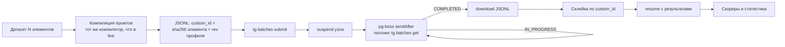

# 11. Провайдеры, каталог моделей и маршрутизация

> Статус: draft
> Зависит от: [05. Система типов](05-type-system.md), [07. Компилятор](07-compiler.md), [10. Рантайм](10-runtime.md), [12. Наблюдаемость](12-observability.md), [16. Модель данных](16-data-model.md), [17. Джобы и расписания](17-jobs-and-scheduling.md)
> Источники: research/provider-catalog.md, research/ai-sdk-decision.md, research/structured-output.md, спека §7.7, §8.4, §10

## Зачем этот слой

Все вызовы моделей в платформе проходят через один пакет `@wf/llm`. Он решает четыре задачи, которые
спека §7.7 ставит, но не расписывает: как жить с конфликтом мажорных версий AI SDK, где взять
достоверные данные о модели (окно, цена, возможности), как не дать узлу со строгим JSON-выходом
уехать на провайдера без `structured_outputs`, и как посчитать фактическую стоимость прогона.
Без этого слоя гарантии типизации из §8.4 не держатся, а бюджеты считаются по выдуманным ценам.

## Решения

| Решение | Что берём | Версия | Лицензия | Почему |
|---|---|---|---|---|
| LLM SDK | `ai` | 6.0.280 | Apache-2.0 | `@voltagent/core@2.10.0` объявляет peer `ai: ^6.0.0`; с ai@7 установка падает по ERESOLVE |
| Ось провайдеров | `@ai-sdk/provider` + `@ai-sdk/provider-utils` | 3.0.16 / 4.0.51 | Apache-2.0 | единая версия спецификации провайдера на всё дерево |
| OpenRouter | `@openrouter/ai-sdk-provider` | 2.10.0 | Apache-2.0 | линия 2.x объявляет peer `ai: ^6.0.0`; 3.0.0 требует `ai: ^7.0.0` |
| Together | `@ai-sdk/togetherai` | 2.0.81 | Apache-2.0 | родной провайдер, batch-инференс через отдельный HTTP-клиент |
| Реестр моделей | `createProviderRegistry` из `ai` | 6.0.280 | Apache-2.0 | штатный Registry, свой не пишем |
| Middleware-цепочка | `wrapLanguageModel` из `ai` | 6.0.280 | Apache-2.0 | точка врезки кассет, бюджетов, PII, телеметрии |
| Каталог моделей | OpenRouter `/api/v1/models` + `/endpoints` | — | — | 443 модели, открытый эндпоинт, полный словарь возможностей |
| Второй источник каталога | models.dev `/api.json` | — | — | сверка, но не источник истины |
| Денежная арифметика | DECIMAL в БД, целые микроценты в коде | — | — | строки цен OpenRouter точнее double |

## 1. Ось версий: почему `ai@6` и как изолирован конфликт

### 1.1 Конфликт и его разрешение

Исследование затевалось из-за пары фактов: `@voltagent/core@2.10.0` объявляет peer
`ai: ^6.0.0` (установка с `ai@7` падает по ERESOLVE, проверено ведущим), а `@openrouter/ai-sdk-provider@3.0.0`
объявляет peer `ai: ^7.0.0`. Разрешение: **берём линию OpenRouter 2.x** — `@openrouter/ai-sdk-provider@2.10.0`
объявляет peer `ai: ^6.0.0`, то есть ровно то, что требует VoltAgent. Обе зависимости проверены
в одном дереве рядом с `ai@6.0.280`.

Второй, менее очевидный факт: **официальные пакеты `@ai-sdk/*` вообще не имеют peer-зависимости на `ai`**
(проверено чтением `package.json` в установленном дереве). Их единственный peer — `zod`.
Связь с рантаймом идёт через обычные зависимости `@ai-sdk/provider` и `@ai-sdk/provider-utils`.
Следствие практическое и неприятное: npm **молча** поставит `@ai-sdk/openai@4.x` (линия v7) рядом
с `ai@6`, вторая копия `@ai-sdk/provider@4.x` отдаст модель со `specificationVersion: 'v4'`, а
`ai@6` умеет только `'v3'` — ошибка вылезет в рантайме, а не при установке.

Защита — три слоя:

1. `overrides` в корневом `package.json` монорепы:
```json
{
  "overrides": {
    "ai": "6.0.280",
    "@ai-sdk/provider": "3.0.16",
    "@ai-sdk/provider-utils": "4.0.51"
  }
}
```
2. Явное объявление провайдеров нужного мажора в `packages/llm/package.json` — не полагаемся на
   транзитивный хойстинг из `@voltagent/core`, который тянет 20+ провайдеров прямыми зависимостями
   (и внутри `@ai-sdk/google-vertex@3.0.174` — вложенный недедуплицированный `@ai-sdk/openai-compatible@1.0.54`).
3. CI-гард `packages/llm/test/spec-version.test.ts`: для каждой зарегистрированной модели
   `model.specificationVersion === 'v3'` плюс проверка, что `@ai-sdk/provider` резолвится
   в единственный путь. Смоук уже прогонялся вручную и дал `v3` у всех четырёх провайдеров.

### 1.2 Таблица пакетов слоя моделей

| Пакет | Версия | peer | Лицензия | Роль |
|---|---|---|---|---|
| `ai` | 6.0.280 | `zod ^3.25.76 \|\| ^4.1.8` | Apache-2.0 | `generateObject`, `generateText`, `wrapLanguageModel`, `createProviderRegistry` |
| `@ai-sdk/provider` | 3.0.16 | — | Apache-2.0 | спецификация `LanguageModelV3` |
| `@ai-sdk/provider-utils` | 4.0.51 | `zod` | Apache-2.0 | `tool()`, транспорт |
| `@ai-sdk/openai` | 3.0.112 | `zod` | Apache-2.0 | прямой OpenAI (`openai.responses`) |
| `@ai-sdk/anthropic` | 3.0.117 | `zod` | Apache-2.0 | прямой Anthropic |
| `@ai-sdk/google` | 3.0.122 | `zod` | Apache-2.0 | прямой Gemini |
| `@ai-sdk/openai-compatible` | 2.0.75 | `zod` | Apache-2.0 | vLLM, SGLang, план Б для OpenRouter |
| `@ai-sdk/togetherai` | 2.0.81 | `zod` | Apache-2.0 | Together (обёртка над `openai-compatible@2.0.75`) |
| `@openrouter/ai-sdk-provider` | **2.10.0** | **`ai ^6.0.0`** | Apache-2.0 | OpenRouter + `providerOptions.openrouter` |
| `@voltagent/core` | 2.10.0 | `ai ^6.0.0`, `@ai-sdk/provider-utils 4.x` | MIT | задаёт мажор всей оси |

Правило совместимости выведено из точных пинов, а не из peer: на линии v6 мажоры провайдеров
разные — `openai/anthropic/google/xai/azure/groq/mistral/perplexity/cohere/bedrock/gateway` = **3.x**,
`openai-compatible/togetherai/cerebras/deepinfra/deepseek/vercel` = **2.x**. Смешивать с 4.x/3.x
из линии v7 нельзя.

### 1.3 Изоляция в `@wf/llm`

Единственный пакет монорепы, импортирующий `ai`, `@ai-sdk/*`, `@openrouter/*` — `@wf/llm`.
Остальным запрещено правилом `no-restricted-imports` (Biome) на эти три маски.
Наружу торчат только наши типы — Dependency Inversion на границе пакета.

```
packages/llm/src/
  ports.ts              LlmCallSpec, StructuredResult, ModelRef, Usage, Provenance, CapabilityFlag
  provider-registry.ts  createProviderRegistry → 'openrouter:openai/gpt-5.1'
  model-factory.ts      сборка LanguageModel + wrapLanguageModel(middleware)
  middleware/           cassette, budget, pii, telemetry, retry
  catalog/              sync, normalize, probe, pricing
  structured.ts         единственный generateObject в монорепе
  text.ts               единственный generateText/streamText
  index.ts              реэкспорт только наших типов
```

### 1.4 Триггер миграции на `ai@7`

Триггер ровно один: **выход `@voltagent/core` с peer `ai: ^7`**. Не «вышел ai@7» (он `latest`
с 7.0.97 уже сейчас) и не «вышел OpenRouter 3.0.0» (вышел 2026-08-14). До триггера — ничего не трогаем.

После триггера ось поднимается **одним коммитом**: `ai@7` + `@ai-sdk/provider@4` +
`@ai-sdk/provider-utils@5` + `@ai-sdk/openai@4` + `openai-compatible@3` + `togetherai@3` +
`@openrouter/ai-sdk-provider@3` + новый `@ai-sdk/otel`. Точечный diff внутри `packages/llm`:
`system` → `instructions`; `experimental_telemetry` → `telemetry` с выносом OTel в `@ai-sdk/otel`;
`include` для сырых тел request/response; пересчёт семантики `usage` (в v7 это сумма шагов);
`needsApproval` → `toolApproval`; `stepCountIs` → `isStepCount`; `ToolCallOptions` → `ToolExecutionOptions`.
Вне `packages/llm` — ноль правок. CI-гард меняет ожидание на `'v4'`.

Риск, за которым следим: `@openrouter/ai-sdk-provider@2.x` в maintenance с 2026-08-14. План Б —
`createOpenAICompatible({ name: 'openrouter', baseURL: 'https://openrouter.ai/api/v1', headers: { 'HTTP-Referer', 'X-Title' } })`.
Платим за него потерей OpenRouter-специфики в `providerOptions.openrouter`: `provider.order`,
`allow_fallbacks`, fallback-список `models: [...]`, `transforms`, reasoning-блок и usage/cost.

## 2. Слой моделей: реестр, фабрика, цепочка middleware

### 2.1 Реестр (паттерн Registry, штатный)

Свой реестр не пишем — берём `createProviderRegistry` из `ai@6`. Он даёт адресацию моделей
строкой `'<provider>:<modelId>'`, что совпадает с формой `ModelRef` в нашем IR.

```ts
import { createProviderRegistry } from 'ai';
import { createOpenRouter } from '@openrouter/ai-sdk-provider';
import { createTogetherAI } from '@ai-sdk/togetherai';
import { createOpenAI } from '@ai-sdk/openai';
import { createAnthropic } from '@ai-sdk/anthropic';
import { createGoogleGenerativeAI } from '@ai-sdk/google';
import { createOpenAICompatible } from '@ai-sdk/openai-compatible';

export const registry = createProviderRegistry({
  openrouter: createOpenRouter({ apiKey: secrets.OPENROUTER_API_KEY }),
  togetherai: createTogetherAI({ apiKey: secrets.TOGETHER_API_KEY }),
  openai: createOpenAI({ apiKey: secrets.OPENAI_API_KEY }),
  anthropic: createAnthropic({ apiKey: secrets.ANTHROPIC_API_KEY }),
  google: createGoogleGenerativeAI({ apiKey: secrets.GOOGLE_API_KEY }),
  vllm: createOpenAICompatible({ name: 'vllm', baseURL: env.VLLM_BASE_URL }),
  sglang: createOpenAICompatible({ name: 'sglang', baseURL: env.SGLANG_BASE_URL }),
});
```

Имена провайдеров в реестре — это же ключи `providerOptions`: для `createOpenAICompatible`
ключом служит поле `name`. Поэтому `name: 'vllm'` обязателен и не произволен: через
`providerOptions.vllm` уходит `extra_body.structured_outputs` (см. §6).

Ключи берутся из хранилища секретов отдельно по окружениям (спека §7.7). Имена переменных
окружения на провайдера берём из поля `env` в models.dev (§4.1) — это готовый маппинг,
не хардкодим.

### 2.2 Фабрика моделей и порядок middleware

`model-factory.ts` собирает эффективную модель из `ModelRef` и профиля узла. Все сквозные
механики врезаны как `LanguageModelMiddleware` через `wrapLanguageModel`, а не как обёртки над
`generateObject` — потому что VoltAgent-агенты вызывают модель мимо нашего фасада,
и обёртка над фасадом их бы не поймала.

```ts
import { wrapLanguageModel, defaultSettingsMiddleware } from 'ai';

export function buildModel(spec: LlmCallSpec): LanguageModel {
  return wrapLanguageModel({
    model: registry.languageModel(spec.modelRef),
    middleware: [
      telemetryMiddleware(spec.provenance),
      budgetMiddleware(spec.budget),
      cassetteMiddleware(spec.cassette),
      piiMiddleware(spec.piiPolicy),
      defaultSettingsMiddleware({ settings: spec.defaults }),
    ],
  });
}
```

**Порядок в массиве значим и выбран не произвольно.** `wrapLanguageModel` применяет middleware
так, что первый элемент массива — самый внешний: он видит запрос раньше всех и ответ позже всех.
Отсюда инварианты:

| Позиция | Middleware | Почему именно здесь |
|---|---|---|
| 1 (внешний) | `telemetry` | обязан видеть и попадание в кассету, и отказ бюджета — иначе в трассе провал; спан открывается до любого решения и закрывается после |
| 2 | `budget` | решение «вызов не состоится» принимается до кассеты, чтобы отказ по бюджету был одинаковым в live и replay |
| 3 | `cassette` | попадание в кассету коротит вызов и всё, что ниже; сеть не трогается, поэтому PII-редакция ниже неё не нужна на replay |
| 4 | `pii` | редактирует только то, что реально уходит в сеть; работает над уже сформированным запросом |
| 5 (внутренний) | `defaultSettings` | подставляет `temperature`/`maxOutputTokens`/`seed`/`providerOptions` последним, чтобы кассета хешировала уже полный набор параметров |

Ловушка, которую этот порядок закрывает: если поставить `defaultSettings` выше кассеты, ключ
кассеты считается от неполного запроса и два разных вызова схлопываются в одну запись.

Кассеты — content-addressed формат на уровне порта модели (DECISIONS, «Экспорт»), не HTTP-моки;
`cassetteMiddleware` — это и есть replay-кэш, закрывающий пробел «timeTravel переисполняет вызовы
моделей» из DECISIONS.

Телеметрия дублируется двумя каналами: наш middleware (спаны с провенансом) и штатный
`TelemetrySettings` AI SDK. Штатный **выключен по умолчанию** (`isEnabled` false, «Disabled by
default while experimental»), включаем явно; `recordInputs`/`recordOutputs` по умолчанию `true` —
в PII-режиме ставим оба в `false`. Дополнительно в v6 есть `registerTelemetryIntegration` —
глобальный подписчик на lifecycle генерации, используем его для сбора usage в водопад (§8).

Переопределение модели и инструкций на вызове VoltAgent не поддерживает (`model` и `instructions`
отсутствуют в `BaseGenerationOptions`, DECISIONS) — поэтому эффективная конфигурация уезжает
в контекст вызова, а динамические функции агента читают её оттуда и зовут `buildModel`.

## 3. Каталог моделей: схема записи

Каталог живёт в схеме `app`, три таблицы: модель (то, что не зависит от провайдера),
endpoint (пара модель×провайдер — именно там цена и возможности), проба (§5).
Разделение вынужденное: у OpenRouter `supported_parameters` **различаются между провайдерами
одной модели**. Для `anthropic/claude-fable-5.1` у Azure `structured_outputs` есть,
у `google-vertex/global` — нет.

### 3.1 Поля и их источники

| Поле | Тип | Источник | Замечание |
|---|---|---|---|
| `model_key` | text | наш | канонический ключ `<vendor>/<slug>`, не id провайдера |
| `provider` | text | наш | `openrouter`/`togetherai`/`openai`/`anthropic`/`google`/`vllm`/`sglang` |
| `provider_model_id` | text | OR `id`, TG `id` | строка, которую отдаём в SDK |
| `canonical_slug` | text | OR `canonical_slug` | |
| `alias_target` | jsonb null | OR `alias_target` | `{name, slug}`, есть у 16/443 — алиас на конкретный слаг |
| `context_length` | int | OR `context_length`, TG `context_length` | может отличаться от `top_provider.context_length` |
| `max_output_tokens` | int null | OR `top_provider.max_completion_tokens` | null у 6/443 |
| `max_prompt_tokens` | int null | OR endpoint `max_prompt_tokens` | отдельный лимит входа, ≠ `context_length` |
| `price` | jsonb | OR `pricing`, TG `pricing` | **нормализованный**, см. 3.2 |
| `price_overrides` | jsonb | OR `pricing.overrides` | 69/443, см. 3.3 |
| `declared_caps` | text[] | OR `supported_parameters` | закрытый enum из 26 значений, см. 3.4 |
| `tool_choice_modes` | jsonb | OR endpoint `supports_tool_choice` | `{none, auto, required, function}` — 4 булевых |
| `verified_caps` | jsonb | наша проба (§5) | `{strict_json, tool_call, long_context}` + версия пробы |
| `reasoning` | jsonb null | OR `reasoning` + models.dev `reasoning_options` | `{mandatory, default_enabled, supported_efforts[], default_effort, option_type}` |
| `modalities` | jsonb | OR `architecture.input_modalities/output_modalities` | парсим массивы, **не строку `modality`** |
| `tokenizer` | text | OR `architecture.tokenizer` | для оценки размера промта до вызова |
| `quantization` | text | OR endpoint `quantization` | `unknown` у закрытых; обязателен в провенансе |
| `license` | text null | TG `license` | только Together даёт лицензию open-weights |
| `model_type` | text null | TG `type` | `chat\|language\|code\|image\|embedding\|moderation\|rerank` |
| `supports_implicit_caching` | bool | OR endpoint | Gemini-стиль, без явных `cache_control` |
| `latency_p50_ms`, `throughput_tps` | numeric null | OR endpoint `latency_last_30m`/`throughput_last_30m` + наши прогоны | у OR много null |
| `uptime_1d` | numeric null | OR endpoint `uptime_last_1d` | |
| `released_at` | date null | models.dev `release_date`, OR `created` (unix seconds) | |
| `knowledge_cutoff` | text null | OR `knowledge_cutoff` (187/443), models.dev `knowledge` | `YYYY-MM-DD` / `YYYY-MM` |
| `deprecated_at` | date null | см. §4.3 | |
| `status` | text | models.dev `status` | `active\|beta\|deprecated` |
| `catalog_version` | int | наш | монотонный номер снапшота (§4.4) |

Поля, которые мы **не храним**, потому что они мёртвые в реальном дампе: `per_request_limits`
(null у всех 443), `supported_voices` (null у всех), `default_parameters` (непустой у 273, но
значения внутри почти всегда `null`), `benchmarks.design_arena` (пустые массивы).
`benchmarks.artificial_analysis` (`intelligence_index`, `coding_index`, `agentic_index`, 187 моделей)
храним как слабый сигнал для авто-подбора, но не как SLA и не как гейт.

### 3.2 Нормализация цен — главная ловушка

Единицы у трёх источников разные:

| Источник | Форма | Единица |
|---|---|---|
| OpenRouter `/models`, `/endpoints` | **строка** `"0.00001"` | USD за **1 токен** |
| Together `/v1/models` | **число** `0.3` | заявлено «per token», по порядку величины — USD за **1M токенов** |
| models.dev `cost` | число `5` | USD за **1M токенов** |

Ошибка в 10^6 здесь стоит бюджета. Каноническая единица каталога — **целые микроценты за 1M токенов**
(`bigint`), нормализация на входе синка, `decimal.js` на разборе строки. Причина отказа от `double`:
реальная строка из дампа `"0.0000000416666666666667"` имеет точность хуже double.

Ключи `price` после нормализации (частоты из 443 моделей OpenRouter):
`prompt` 443, `completion` 443, `input_cache_read` 273, `web_search` 165 (**USD за запрос, не за токен**),
`input_cache_write` 83, `audio` 34, `internal_reasoning` 32 (reasoning-токены тарифицируются отдельно),
`image` 31, `input_cache_write_1h` 31, `input_audio_cache` 29, `image_output` 9, `audio_output` 2.
Плюс `discount` — **только в endpoints API**, в `/models` его нет.
Плюс `base`/`finetune`/`hourly` у Together: там есть почасовые выделенные инстансы, модель
ценообразования «за час» каталог обязан уметь, а не только «за токен».

### 3.3 Цена — функция, а не константа

69/443 моделей имеют условный прайс `pricing.overrides`. Два типа условий:

1. **Long-context tier** — `min_prompt_tokens`. Пример: свыше 272k входных токенов `prompt`
   1e-5 → 2e-5, `completion` 5e-5 → 7.5e-5. Цена зависит от размера запроса.
2. **Off-peak окно** — `utc_days` + `utc_start`/`utc_end`. Пример: будни, `utc_start: 0`,
   `utc_end: 100`, `prompt` 1.5e-7.

Отсюда сигнатура оценки — не умножение на две константы:

```ts
type PriceQuery = { modelKey: string; provider: string; promptTokens: number;
                    completionTokens: number; cachedTokens: number; at: Date };

estimateCost(q: PriceQuery): Micros;
```

Правило выбора: применяем первый override, **все** условия которого выполнены; базовый прайс —
fallback. Незнакомое условие внутри override → override целиком игнорируется и пишется в
`catalog_sync_warnings` (§4.2), спека §7.7 прямо разрешает: «незнакомые условия синхронизатор пропускает».

### 3.4 `CapabilityFlag` — закрытый enum из 26 значений

Словарь берём ровно как `supported_parameters` OpenRouter (частоты из 443):
`max_tokens` 430, `response_format` 381, `tools` 377, `tool_choice` 369, `structured_outputs` 361,
`temperature` 353, `seed` 335, `top_p` 335, `reasoning` 312, `include_reasoning` 312, `stop` 310,
`frequency_penalty` 242, `presence_penalty` 235, `top_k` 218, `reasoning_effort` 172,
`repetition_penalty` 157, `logprobs` 155, `top_logprobs` 155, `logit_bias` 147, `min_p` 117,
`max_completion_tokens` 63, `verbosity` 21, `web_search_options` 19, `top_a` 12, `prediction` 12,
`parallel_tool_calls` 9.

Четыре флага несут валидацию IR (L1, спека §8): `structured_outputs`, `tools`, `seed`, `logprobs`
(последний — гейт для confidence-метрик и self-consistency).

Ловушки, которые компилятор обязан знать:
- `parallel_tool_calls` объявлен у **9 из 443** моделей — узел, полагающийся на параллельные
  тулколы, почти везде деградирует до последовательных.
- `reasoning_effort` есть у 172, а `reasoning` у 312: часть моделей умеет reasoning без градаций.
  Уровни не унифицированы (`high` 164, `low` 140, `medium` 129, `xhigh` 77, `max` 67, `none` 51,
  `minimal` 34) — наш enum `off|low|med|high` сопоставляется таблицей, а не пробросом строки.
- `reasoning.mandatory: true` у 104 моделей: reasoning нельзя выключить. Валидатор ругается
  на `reasoning_effort: "none"` для таких моделей.
- 22 модели с `pricing.prompt === "0"` (суффикс `:free`) — отдельная политика: жёсткие рейт-лимиты,
  `data_collection` часто не гарантирован.
- `max_completion_tokens` (OpenAI-стиль, 63 модели) и `max_tokens` (430) — разные параметры,
  не синонимы.

## 4. Синхронизация каталога

### 4.1 Источники и их роли

| Источник | Эндпоинт | Ключ | Объём | Роль |
|---|---|---|---|---|
| OpenRouter models | `GET https://openrouter.ai/api/v1/models` | **не нужен** | 443 модели, `links.next === null` (пагинации нет) | источник истины: окно, цены, `supported_parameters` |
| OpenRouter endpoints | `GET /api/v1/models/{author}/{slug}/endpoints` | не нужен | массив провайдеров на модель | источник истины по паре модель×провайдер: `tag`, `quantization`, `supports_tool_choice`, телеметрия, `discount` |
| Together | `GET https://api.together.ai/v1/models` | **`Authorization: Bearer` обязателен** | плоский массив, без конверта `{data}` | цены, `license`, `type` |
| models.dev | `GET https://models.dev/api.json` | не нужен | 4.6 MB, 213 провайдеров, 7717 моделей | депрекейты, `env`+`npm`, `temperature`, `reasoning_options.type`, `experimental.modes` |

Together требует ключ даже на список моделей — значит синк каталога это **задача с доступом
к секретам**, а не анонимный крон. Планировщик — pg-boss, джоба идёт от сервисной учётки
с правом читать секреты окружения `catalog-sync`.

models.dev — MIT, репозиторий `sst/models.dev` живой (последний push в день проверки 2026-09-11),
но данные **курируемые руками через PR**, не выгрузка из API. Отсюда правило: берём оттуда только
то, чего нет у провайдеров, и никогда — цену для биллинга и `context`/`output` при расхождении.

### 4.2 Расписание и незнакомые поля

| Джоба | Период | Что делает |
|---|---|---|
| `catalog_sync_openrouter_models` | 6 ч | полный список моделей, диффует против текущего снапшота |
| `catalog_sync_openrouter_endpoints` | 24 ч, плюс по требованию | только для моделей, на которые ссылается хотя бы один активный профиль — 443 запроса подряд не гоняем |
| `catalog_sync_together` | 24 ч | требует ключа |
| `catalog_sync_modelsdev` | 24 ч | 4.6 MB тянем и диффуем целиком, не на запрос |
| `catalog_probe` | при появлении модели и при смене `declared_caps` или `catalog_version` | §5 |

Незнакомые поля не роняют синк. Правило трёх корзин:

| Класс | Что делаем |
|---|---|
| Известное поле, известное значение | нормализуем в колонку |
| Известное поле, **новое значение** (например новый `supported_parameters` за пределами 26, новый `quantization`) | кладём в `raw` jsonb, пишем warning `unknown_enum_value`, **не** расширяем `CapabilityFlag` автоматически |
| Незнакомое поле верхнего уровня, незнакомое условие в `pricing.overrides` | целиком в `raw`, warning `unknown_field` / `unknown_price_condition`, override игнорируется |

`raw` jsonb хранит исходный объект целиком — без него нельзя задним числом восстановить, что
именно приехало в день сбоя.

### 4.3 Детект депрекейта и изменения цен

Депрекейт. Ни один источник не даёт его надёжно поодиночке, поэтому решение по трём сигналам:

| Сигнал | Покрытие | Вес |
|---|---|---|
| models.dev `status: "deprecated"` | 195 моделей | основной |
| OpenRouter `expiration_date` | не-null у **5/443**, встречаются заглушки `"2098-12-31"` (= не истекает) и реальные `"2026-09-30"` | вспомогательный, заглушки >2090 отбрасываем |
| Модель исчезла из ответа `/models` при успешном ответе на остальные | — | сильный, но только после двух подряд синков |

Состояния модели: `active → beta → deprecated → gone`. Переход в `deprecated` не отключает
профили, а поднимает `problems[]` в MCP-конверте и помечает профиль как требующий миграции.
Переход в `gone` блокирует компиляцию профиля (L1).

Изменение цен. На каждом синке считаем дельту по каждому ключу `price`:

| Условие | Реакция |
|---|---|
| дельта ≤ 1% | молча обновляем |
| 1% < дельта ≤ 20% | обновляем, событие `price_changed` в водопад и в панель «почему» |
| дельта > 20% или появился/исчез ключ (`input_cache_read`, `internal_reasoning`) | обновляем, **алерт**, все профили с этой моделью получают предупреждение на компиляции |
| появился новый `pricing.overrides` | алерт: статическая оценка стоимости (спека §7.7) перестаёт быть верхней границей |

Между синками страховкой работает `max_price` в routing-блоке OpenRouter (§7) —
единственный встроенный предохранитель от «модель подорожала».

### 4.4 Версионирование каталога

Каталог — **append-only снапшоты**, не таблица с UPDATE. Причина: прогон, сделанный вчера,
должен воспроизводиться по вчерашним ценам и вчерашним возможностям, иначе реплей и сверка
фактической стоимости (§8) врут.

```sql
CREATE TABLE app.model_catalog_versions (
  id            bigint GENERATED ALWAYS AS IDENTITY PRIMARY KEY,
  created_at    timestamptz NOT NULL DEFAULT now(),
  source_digest text NOT NULL,
  warnings      jsonb NOT NULL DEFAULT '[]'
);

CREATE TABLE app.model_endpoints (
  tenant_id          uuid NOT NULL,
  catalog_version    bigint NOT NULL REFERENCES app.model_catalog_versions(id),
  model_key          text NOT NULL,
  provider           text NOT NULL,
  provider_tag       text,
  provider_model_id  text NOT NULL,
  context_length     integer NOT NULL,
  max_output_tokens  integer,
  max_prompt_tokens  integer,
  price              jsonb NOT NULL,
  price_overrides    jsonb NOT NULL DEFAULT '[]',
  declared_caps      text[] NOT NULL,
  tool_choice_modes  jsonb,
  reasoning          jsonb,
  modalities         jsonb NOT NULL,
  tokenizer          text NOT NULL,
  quantization       text NOT NULL DEFAULT 'unknown',
  license            text,
  model_type         text,
  status             text NOT NULL DEFAULT 'active',
  released_at        date,
  knowledge_cutoff   text,
  deprecated_at      date,
  raw                jsonb NOT NULL,
  PRIMARY KEY (catalog_version, model_key, provider, coalesce(provider_tag, ''))
);
```

`source_digest` — sha256 по канонизированному (RFC 8785, `canonicalize@5.0.0`) объединению трёх
ответов. Совпал с предыдущим — новую версию не создаём. Профиль узла при компиляции пинится
на конкретный `catalog_version`; этот номер уезжает в провенанс прогона.

Идентификаторы моделей у источников пишутся по-разному (`claude-opus-5` в models.dev против
`anthropic/claude-opus-5` в OpenRouter) — склейка идёт через таблицу соответствий
`app.model_key_aliases`, строковую конкатенацию запрещаем. Для open-weights вспомогательный
ключ склейки — `hugging_face_id` (не-null у 316/443).

## 5. Проверенные возможности: capability probe

Заявленным флагам не верим. `structured_outputs` в `supported_parameters` — это объявление
OpenRouter, а не гарантия соблюдения схемы. Проба — отдельный артефакт, привязанный к тройке
(`model_key`, `provider_tag`, `quantization`): одна и та же модель на fp8 и bf16 даёт разные выходы.

### 5.1 Набор проб

Ровно три пробы из спеки §7.7, каждая — детерминированный вызов с фиксированным `seed`
(где `seed` в `declared_caps`) и фиксированным промтом из `packages/llm/catalog/probes/`.

| Проба | Что шлём | Критерий прохождения |
|---|---|---|
| `strict_json` | эталонная схема профиля `permissive` (§6): объект из 6 полей, вложенный объект, массив строк, строковый enum на 5 значений, nullable-поле, поле обоснования **перед** полем решения | 3 из 3 попыток: исход `ok` (не `refusal`, не `truncated`), `JSON.parse` без ремонта, Zod-валидация без ошибок, **порядок ключей совпадает со схемой**, значение enum совпадает с каноническим **без учёта регистра** |
| `tool_call` | один инструмент с обязательным вызовом (`tool_choice: required`), схема аргументов из 3 полей | 3 из 3: ровно один вызов, имя инструмента точное, аргументы проходят Zod |
| `long_context` | иголка в стоге на 80% от `context_length` модели, три позиции (начало, середина, конец) | 3 из 3 позиций: иголка найдена дословно |

Три отдельные строгости, которые проба обязана отличать от успеха:

1. **Исход `refusal`.** У Anthropic `stop_reason: "refusal"` — это 200 OK, токены тарифицируются,
   схема может не соблюдаться. У пробы это **не** провал `strict_json`, а отдельный статус
   `probe_inconclusive` с повтором на нейтральном промте.
2. **Исход `truncated`** (`stop_reason: "max_tokens"`) — провал прогона пробы, не модели;
   повтор с увеличенным лимитом вывода. Ремонт обрезанного ответа запрещён (DECISIONS):
   `jsonrepair` на обрезанном JSON молча дописывает `null`.
3. **Регистр enum.** Anthropic дословно не гарантирует капитализацию строковых `enum`/`const`:
   может прийти `"Conversation Topic 3"` вместо `"Conversation topic 3"`, без ошибки и без
   специального `stop_reason`. Поэтому сравнение в пробе и в рантайме — case-insensitive
   с нормализацией обратно к каноническому значению; наивный `ajv` на enum здесь даёт ложный fail.

### 5.2 Хранение результата

```sql
CREATE TABLE app.model_capability_probes (
  tenant_id       uuid NOT NULL,
  model_key       text NOT NULL,
  provider        text NOT NULL,
  provider_tag    text,
  quantization    text NOT NULL DEFAULT 'unknown',
  probe_suite_rev text NOT NULL,
  catalog_version bigint NOT NULL REFERENCES app.model_catalog_versions(id),
  strict_json     text NOT NULL,
  tool_call       text NOT NULL,
  long_context    text NOT NULL,
  attempts        jsonb NOT NULL,
  cost_micros     bigint NOT NULL,
  checked_at      timestamptz NOT NULL DEFAULT now(),
  PRIMARY KEY (model_key, provider, coalesce(provider_tag,''), quantization, probe_suite_rev, catalog_version)
);
```

Значения статусов: `pass` / `fail` / `inconclusive` / `not_declared` (флага нет в `declared_caps`,
пробу не гоняли). `attempts` хранит по каждой попытке исход, сырой ответ, usage и латентность —
из них же берётся начальная `latency_p50_ms` для моделей, у которых OpenRouter отдаёт null
в `latency_last_30m`.

`probe_suite_rev` — хеш содержимого набора проб. Смена набора обесценивает старые результаты
без удаления: строки остаются, но профиль пинится на текущий `probe_suite_rev`.

Перепрогон: при появлении модели, при смене `declared_caps`, при смене `probe_suite_rev`, и раз
в 30 дней для моделей, на которые ссылаются активные профили.

### 5.3 Правило компиляции (L1)

> Профиль с требованием `strict_json` компилируется **только** на паре (модель, провайдер),
> у которой `strict_json = 'pass'` при текущем `probe_suite_rev` и при `catalog_version`,
> на который пинится профиль.

Раскрытие правила по исходам:

| Состояние пробы | Компиляция профиля с `strict_json` |
|---|---|
| `pass` | разрешена |
| `fail` | **BLOCK**, с указанием прошедших альтернатив из того же семейства (`family` из models.dev) |
| `inconclusive` | BLOCK; предложение перепрогнать пробу |
| `not_declared` | BLOCK на уровне `declared_caps`, до пробы дело не доходит |
| проба есть, но `catalog_version` профиля старше | WARN + автоматический перепрогон пробы |

То же правило по той же схеме действует для `tools` (`tool_call`) и для узлов, объявляющих
входное окно больше 80% `context_length` (`long_context`).

## 6. Матрица structured output по провайдерам

Одной strict-схемы на всех провайдеров не существует (DECISIONS, опровержение 1): приём, делающий
схему валидной для OpenAI (всё `required` + `["T","null"]`), взрывает лимиты Anthropic.
Профиль схемы — свойство пары (IR-схема × провайдер). Кодирование ограничения — Strategy
`ConstraintEncoder` с реализациями `OpenAIStrict`, `AnthropicStrict`, `GeminiSchema`,
`VllmStructuredOutputs`, `SglangExtraBody`, `PromptOnly`.

| Провайдер | Механизм | Ограничения схемы | Что делаем |
|---|---|---|---|
| **OpenAI** | `response_format: {type:'json_schema', strict:true}` через `generateObject` | `oneOf` ❌, `anyOf` ✅ кроме корня, `allOf` ❌, опциональные поля ❌ (все `required`), `["T","null"]` ✅ штатно, рекурсия ✅ (`$ref:"#"`), `minimum`/`maximum` ✅, `minItems`/`maxItems` ✅, `pattern` ✅, `format: uri` ❌, корень-union ❌, enum до 1000 значений / 15k символов при >250 | профиль `openai-strict`: пост-обработка после `z.toJSONSchema` (`oneOf→anyOf`, `optional→required+nullable`, разворачивание union-корня); порядок ключей = порядок схемы |
| **Anthropic** | `output_config.format` (тип `json_schema`) — **вышло из беты**, beta-заголовок `structured-outputs-2025-11-13` не нужен; отдельно `strict: true` на инструменте | `anyOf` ✅ и `allOf` ✅ (без `$ref`), `$ref`/`$defs` ✅ внутренние, `default` ✅, `format: uri` ✅, `additionalProperties` только `false`; **рекурсия ❌**; `minimum`/`maximum`/`multipleOf`/`minLength`/`maxLength` ❌; `minItems` только 0 и 1; `pattern` частично (нет backreferences, lookahead/lookbehind, `\b`). Лимиты: **20** strict-тулов, **24** опциональных параметра, **16** union-типов (`anyOf` + `["T","null"]` считаются вместе) | профиль `anthropic-strict`: рекурсию разворачиваем на фиксированную глубину или запрещаем в IR; числовые и строковые ограничения **вырезаем из wire-схемы, дописываем в `description`, проверяем Zod на приёме** (приём копируем у их SDK); считаем бюджет union-типов до запроса |
| **Google Gemini** | `response_format: {type:'text', mime_type:'application/json', schema}` (Interactions API); прежняя линия — `generationConfig.responseSchema` + `propertyOrdering` | `anyOf` ✅, рекурсия ✅ через `{"$ref":"#"}`; точных лимитов Google не публикует («Very large or deeply nested schemas may be rejected») | профиль `gemini`: стартуем с `z.toJSONSchema(..., { target: 'openapi-3.0' })`, лимиты держим консервативными (см. открытый вопрос 2) |
| **OpenRouter** | прокси к провайдеру; флаг `structured_outputs` в `supported_parameters`, детализация — на endpoint-уровне | набор возможностей **различается между провайдерами одной модели**: у `anthropic/claude-fable-5.1` Azure даёт `structured_outputs`, `google-vertex/global` — нет | профиль берём по **фактическому** провайдеру; обязателен `provider.require_parameters: true` (§7), иначе роутер тихо уводит на провайдера без строгого режима |
| **Together** | OpenAI-совместимый `response_format` | `supported_parameters` Together **не отдаёт вообще** — словаря возможностей нет | возможности берём из models.dev (`togetherai`, 38 моделей) и из собственной пробы (§5); без пробы `strict_json` не компилируем |
| **vLLM** | `extra_body.structured_outputs` с ключами `choice` / `regex` / `json` / `grammar` / `structural_tag`; плюс штатный `response_format: {type:'json_schema'}` | старые `guided_json`/`guided_regex`/`guided_choice`/`guided_grammar` **переименованы** в единый `structured_outputs`; синтаксис regex зависит от бэкенда (xgrammar/guidance/outlines — Rust-style, lm-format-enforcer — Python `re`) | `providerOptions.vllm` → `extra_body`; regex в грамматику не отдаём (непереносим), гоним в post-hoc Zod; `choice` — родной механизм для больших allowed-set |
| **SGLang** | JSON Schema через `response_format`; `regex` и `ebnf` лежат **прямо в `extra_body`**, без вложенного объекта | бэкенд по умолчанию **XGrammar** (JSON Schema ✅, regex ✅, EBNF ✅, structural tag ✅); `--grammar-backend outlines` теряет EBNF и structural tag; `llguidance` теряет structural tag | `providerOptions.sglang` → плоский `extra_body`; целимся в возможности XGrammar как в общий знаменатель self-hosted |

Общее безопасное подмножество («permissive», проходит везде): объекты, строки/числа/bool,
строковые enum, массивы, `anyOf` не в корне, **все поля required**, опциональность через `null`,
`additionalProperties: false`, **без рекурсии**, **без числовых и строковых ограничений в схеме**.
Это же подмножество чинит расхождение в порядке ключей: OpenAI держит порядок схемы, Anthropic
выдаёт сначала `required`, потом опциональные — совпадают они только когда опциональных нет.
Порядок значим (поле обоснования идёт перед полем решения), компилятор ключи не сортирует.

Два дополнительных правила, которые падают из этой матрицы в компилятор:

- **Схема идёт и в грамматику, и в текст промта.** Совет из доков vLLM дословно: «normally it's
  better to indicate in the prompt the JSON schema and how the fields should be populated».
  Для L2 это обязательный элемент компиляции узла, а не опция.
- **Динамический allowed-set.** Потолок для UUID — около 416 значений, а не 1000 (лимиты OpenAI
  по числу значений и по суммарной длине строк действуют одновременно). Порог: ≤50 значений —
  enum прямо в схеме; выше — индексный выбор из пронумерованного списка в промте. У self-hosted
  этого налога нет: `structured_outputs.choice` компилируется в конечный автомат.
  Отдельный довод против больших динамических enum у Anthropic: схема кешируется до 24 часов,
  и в доках прямо сказано, что PHI в определениях схемы быть не должно — пользовательские данные
  в enum утекают в кеш схем.

## 7. Маршрутизация и фолбэки

### 7.1 Политика на профиль

Маршрутизация задаётся политикой на профиль (спека §7.7) и компилируется 1:1 в объект `provider`
тела запроса OpenRouter.

```ts
type RoutingPolicy = {
  order?: ProviderTag[];
  only?: ProviderTag[];
  ignore?: ProviderTag[];
  allow_fallbacks?: boolean;
  require_parameters?: boolean;
  data_collection?: 'allow' | 'deny';
  zdr?: boolean;
  quantizations?: string[];
  sort?: 'price' | 'throughput' | 'latency';
  preferred_min_throughput?: number | { p50?: number; p90?: number; p99?: number };
  preferred_max_latency?: number | { p50?: number; p90?: number; p99?: number };
  max_price?: { prompt?: number; completion?: number };
};
```

Слаг провайдера — это поле `tag` из endpoints API (`azure`, `anthropic`, `amazon-bedrock`,
`google-vertex/global`). Обратить внимание на составную форму: регион зашит в слаг.
`max_price` задаётся в **USD за 1M токенов**, в отличие от `pricing.*`, где цена за 1 токен —
нормализатор каталога обязан конвертировать, а не пробрасывать.

Что компилятор выставляет сам, не спрашивая автора:

| Условие на узле | Что ставится | Почему |
|---|---|---|
| узел требует `structured_outputs`, `tools` или `seed` | `require_parameters: true` | дефолт **`false`** — это тихая деградация типизации: роутер уведёт на провайдера без нужного параметра, и гарантия §8.4 не удержится |
| режим строгой воспроизводимости (кассеты, реплей) | `only: [tag]` + `quantizations: [...]` + `seed` + `allow_fallbacks: false` | детерминизм невозможен без фиксации провайдера И квантования; даже так это best effort, не гарантия |
| политика тенанта запрещает хранение данных | `data_collection: 'deny'`, при необходимости `zdr: true` | `zdr` работает как OR с аккаунт-уровневой настройкой: пер-реквестный флаг может ZDR только включить, не выключить |
| профиль требует лицензию open-weights | фильтр по `license` **до** запроса, на нашей стороне | ни OpenRouter, ни models.dev лицензию не дают; поле есть только у Together |

Поведение OpenRouter по умолчанию, которое политика переопределяет: price-based load balancing —
отсеиваются провайдеры со сбоями за последние 30 секунд, среди остальных вероятность выбора
обратно пропорциональна **квадрату** цены, прочие уходят в фолбэк. **Балансировка выключается,
как только задан `sort` или `order`** — фиксированный провайдер даёт предсказуемость, но повышает
шанс 429/5xx, поэтому вне режима воспроизводимости держим `allow_fallbacks: true`.

### 7.2 Совместимость возможностей у фолбэков

Фолбэк — не «любая другая модель», а модель, удовлетворяющая тому же набору требований узла.
Проверка на компиляции (L1), таблицей, без вложенных условий:

```ts
type NodeRequirements = {
  caps: CapabilityFlag[];
  verified: Array<'strict_json' | 'tool_call' | 'long_context'>;
  minContext: number;
  minOutput: number;
  schemaProfile: 'openai-strict' | 'anthropic-strict' | 'gemini' | 'permissive';
  modalities: Modality[];
  maxPricePerRun: Micros;
};
```

| Проверка фолбэка | Источник данных | Исход при провале |
|---|---|---|
| `caps ⊆ declared_caps` endpoint'а | каталог, endpoint-уровень | кандидат отброшен |
| все `verified` в состоянии `pass` | `model_capability_probes` | кандидат отброшен |
| `context_length ≥ minContext`, `max_output_tokens ≥ minOutput` | каталог | кандидат отброшен |
| схема компилируется в `schemaProfile` фолбэка **без потери ограничений** | компилятор схем (§6) | кандидат отброшен; потеря ограничения в `description` вместо грамматики допустима только если оно проверяется Zod на приёме |
| `tool_choice_modes.required === true`, если узел обязан вызвать тул | endpoint `supports_tool_choice` | кандидат отброшен |
| `reasoning.mandatory === false`, если узел рассчитывает на ответ без размышления | каталог | WARN: другая латентность и цена |
| оценка стоимости ≤ `maxPricePerRun` | §3.3 + §8 | кандидат отброшен |

Список фолбэков после фильтрации сортируется по `sort` профиля. Пустой список при непустом
списке требований — **BLOCK** на компиляции, а не молчаливый одиночный вариант.

### 7.3 Поведение при отказе провайдера

Порядок обработки (Chain of Responsibility, звенья объявлены таблицей в конфигурации узла,
не лестницей `if`):

| Звено | Условие срабатывания | Действие | Метка в трассе |
|---|---|---|---|
| `retry_same` | 429, 5xx, таймаут транспорта | до `k` попыток с экспоненциальной задержкой и джиттером, тот же провайдер | `retry` |
| `retry_repair` | исход `ok`, но Zod дал `Issue[]` | повтор с типизированным `Issue[]` в промте, не больше `k` раз | `repair` |
| `reject_truncated` | исход `truncated` | ремонт **запрещён**; повтор с увеличенным лимитом вывода, затем следующее звено | `truncated` |
| `fallback_provider` | провайдер исчерпал `retry_same` | следующий `tag` из `order` в пределах той же модели | `degraded` |
| `fallback_profile` | модель исчерпала провайдеров, либо исход `refusal` | следующий профиль из списка фолбэков (§7.2) | `degraded` |
| `escalate` | список фолбэков исчерпан | `suspend()` узла с эскалацией человеку | `escalated` |

Инварианты, закреплённые спекой §8 (пп. 33, 52, 53): молчаливый дефолт запрещён — узел не имеет
права вернуть подставленное значение вместо ответа; **любой сработавший фолбэк ставит статус
`degraded` в трассе**, и этот статус виден в панели «почему» вместе с тем, какое звено сработало.
Отказ (`refusal`) не лечится ретраем той же модели: это отдельный исход, а не ошибка транспорта.

Бюджет расходуется на каждой попытке, включая неудачные и включая `refusal` (токены
тарифицируются). `budgetMiddleware` стоит выше кассеты именно поэтому (§2.2).

## 8. Учёт стоимости

Три числа на узел, и их нельзя путать: **оценка до вызова**, **факт из ответа провайдера**,
**пересчёт по каталогу**. Спека §7.7 требует и статическую оценку для бюджетов, и учёт факта
со сверкой с каталогом.

| Величина | Откуда | Когда считается |
|---|---|---|
| `estimated_micros` | `estimateCost()` (§3.3) по `catalog_version` профиля; размер промта — `gpt-tokenizer` (o200k_base) × поправочный коэффициент профиля модели (DECISIONS), размер выхода — `max_output_tokens` узла как верхняя граница | на компиляции и перед вызовом |
| `reported_micros` | поле стоимости из ответа провайдера, если провайдер его отдаёт | после вызова |
| `recomputed_micros` | `estimateCost()` по фактическому `usage` из ответа и по тому же `catalog_version` | после вызова |

Источник фактического `usage` — результат вызова AI SDK: `structured.ts` отдаёт наружу
`{ value, usage, warnings, providerMetadata, raw }`. Провайдер-специфичные поля (в том числе
стоимость и детали кэша у OpenRouter) приходят в `providerMetadata` и доступны только при работе
через родной `@openrouter/ai-sdk-provider` — это ещё одна причина не уходить на
`@ai-sdk/openai-compatible` (§1.4). Второй канал сбора, работающий и для VoltAgent-агентов,
которые зовут модель мимо фасада, — `registerTelemetryIntegration` из `ai@6` плюс наш
`telemetryMiddleware` (§2.2).

**Семантика `usage` в `ai@6` — на один вызов.** В `ai@7` она меняется на сумму шагов;
пункт стоит в чек-листе миграции (§1.4), иначе после апгрейда все суммы удвоятся на многошаговых узлах.

Сверка. На каждом завершённом вызове считаем `drift = |reported - recomputed| / reported`:

| Условие | Реакция |
|---|---|
| провайдер не отдал стоимость | `reported_micros = null`, в водопад идёт `recomputed_micros`, флаг `cost_source = 'catalog'` |
| `drift ≤ 1%` | `cost_source = 'provider'`, расхождение не логируем |
| `1% < drift ≤ 10%` | событие `cost_drift` с обоими числами; вероятная причина — сработавший `pricing.overrides`, который мы не применили |
| `drift > 10%` | алерт и пометка `catalog_version` как подозрительного: либо цена поменялась между синками, либо роутер ушёл на другой endpoint с другой ценой |

Приоритет в биллинге и в бюджетах — `reported_micros`, когда он есть. `recomputed_micros` — только
когда провайдер молчит. Расхождение никогда не «усредняется».

Хранение: `run_nodes` (партиционируется помесячно по `started_at`, BRIN по времени — DECISIONS)
несёт `estimated_micros`, `reported_micros`, `recomputed_micros`, `cost_source`, `catalog_version`,
`usage` jsonb (входные, выходные, кэшированные, reasoning-токены отдельно — `internal_reasoning`
тарифицируется отдельно у 32 моделей), `provider_tag`, `quantization`. Всё — целые микроценты `bigint`.

Куда это попадает дальше:
- **Бюджеты.** `budgetMiddleware` (§2.2) держит остаток бюджета в `workflowState` VoltAgent
  (он переживает suspend/resume) и отказывает в вызове до обращения к провайдеру. Отказ по
  бюджету — такой же исход узла, как отказ провайдера, и идёт в ту же цепочку §7.3.
- **Водопад** стоимости и латентности (спека §11): ось X — время, полоса на узел, ширина полосы —
  латентность, цвет — `cost_source`, `degraded`-узлы помечены. Данные — прямо из `run_nodes`,
  без агрегирующего слоя.
- **Статический отчёт** по стоимости на визуальном ревью (спека §7, шаг 7) — сумма
  `estimated_micros` по всем узлам плана с разворачиванием циклов по `max_iter`.

## 9. Батч-инференс для evals

Батч — не оптимизация вызова, а **другой режим исполнения узла**: 24-часовое окно несовместимо
с синхронным шагом. Поэтому в IR это опция узла `execution: 'batch'`, валидируемая по каталогу,
а не глобальный флаг.

Что даёт Together (дословные цифры из документации):

| Параметр | Значение |
|---|---|
| Скидка | «Up to 50% off serverless rates» |
| Модели со скидкой | только отдельные; в доках названы `meta-llama/Llama-3.3-70B-Instruct-Turbo` и `openai/whisper-large-v3` |
| Запросов в батче | до 50 000 |
| Входной файл | до 100 MB |
| Строка файла | до 10 MB |
| Очередь | до 30B токенов на модель одновременно |
| Окно выполнения | по умолчанию `24h`, **изменить нельзя**, это best-effort цель |
| Эскалация | при статусе `IN_PROGRESS` ждать минимум 72 часа до обращения в саппорт |

Формат — JSONL, каждая строка это обычный запрос к `/v1/chat/completions`
(аудио — `/v1/audio/transcriptions`, `/v1/audio/translations`). CLI: `tg batches submit`,
`tg batches get`, `tg batches download`.

**Результаты возвращаются в произвольном порядке** — сверка только по `custom_id`. Это
жёсткое требование к нашему сборщику: индекс строки датасета в порядке файла ничего не значит.

Встраивание в прогон датасета (`@voltagent/evals` + `@voltagent/scorers`, DECISIONS):



Ложится ровно на `suspend`/`resume` VoltAgent: узел сабмитит батч и приостанавливается,
pg-boss `sendAfter` поллит статус (VoltAgent сам по таймауту не возобновляет — DECISIONS),
`resume` получает склеенные по `custom_id` результаты. `resumeSchema` шага описывает форму
этих результатов, `workflowState` переживает приостановку.

Ограничения, которые обязан проверять компилятор перед разрешением `execution: 'batch'`:
1. модель входит в белый список батч-скидки — иначе экономии нет, а 24-часовое окно остаётся;
2. `structured_outputs` у Anthropic совместим с batch (в их доках батч даёт −50% и с грамматикой),
   у Together словаря возможностей нет вообще — требуется пройденная проба `strict_json` (§5);
3. число элементов ≤ 50 000 и размер строки ≤ 10 MB; при превышении датасет режется на батчи,
   и `custom_id` остаётся глобально уникальным по всему прогону, а не по файлу;
4. батч-узел не может стоять внутри цикла с условием, зависящим от его же выхода — 24 часа
   на итерацию не имеют смысла.

Батчи у OpenAI и Anthropic дают тот же −50%, но их точные лимиты и API в исследовании
не проверялись — см. открытый вопрос 6.

## Открытые вопросы

1. **Единица `pricing.input`/`pricing.output` у Together.** OpenAPI подписывает их как «price per
   token», но значение `0.3` для 13B-модели по порядку величины — это $/1M токенов. Пока не закрыто,
   цены Together **не смешиваем** с OpenRouter в одной колонке без явного множителя.
   *Что сделать:* один реальный вызов с известным числом токенов, сверить со счётом в кабинете;
   зафиксировать множитель в `catalog/normalize/together.ts` и в тесте.
2. **Точные лимиты схемы у Gemini** (глубина, число свойств, размер enum). Google цифр не публикует,
   в доках только «Very large or deeply nested schemas may be rejected». Профиль `gemini` пока
   держим на консервативных значениях профиля `permissive`.
   *Что сделать:* эмпирический замер бинарным поиском по глубине и числу свойств, результат —
   в таблицу профилей компилятора схем.
3. **Единица `utc_start`/`utc_end` в `pricing.overrides`.** Значения 0..100 — это не часы;
   формат в документации OpenRouter не описан. Пока off-peak override **не применяем**:
   считаем по базовому прайсу, что даёт завышенную (безопасную) оценку.
   *Что сделать:* сопоставить документированное окно скидки конкретного провайдера с полями
   дампа, либо задать вопрос в поддержку OpenRouter.
4. **Поля стоимости и кэша в `providerMetadata`.** Раздел «Учёт фактической стоимости (usage
   у OpenAI/Anthropic/OpenRouter)» в заметках остался незаполненным — точные имена полей
   (`cost`, `cache_discount`, детализация кэш-токенов) не проверены. §8 описывает механику сверки,
   но не имена полей.
   *Что сделать:* прогнать по одному живому вызову на OpenAI, Anthropic и OpenRouter, записать
   фактическую форму `providerMetadata` в `packages/llm/test/fixtures/`, зафиксировать Zod-схемой.
5. **Сохранён ли в vLLM алиас `guided_json`** после переезда на `structured_outputs`. Если нет —
   поддержка старых инсталляций vLLM требует отдельной ветки в `VllmStructuredOutputs`.
   *Что сделать:* проверить на двух версиях сервера в testcontainers.
6. **Батч-API OpenAI и Anthropic.** Anthropic в доках structured outputs подтверждает совместимость
   батча (−50%), но лимиты, формат и поведение при ошибке не исследовались; OpenAI не исследовался
   вовсе. §9 описан только для Together.
   *Что сделать:* снять лимиты и формат обоих API, дополнить таблицу §9 и валидацию
   `execution: 'batch'` в компиляторе.
7. **Поддерживает ли OpenAI strict `minLength`/`maxLength`** для базовых (не fine-tuned) моделей —
   в списке поддерживаемых keyword'ов они явно не названы. Пока профиль `openai-strict` вырезает
   их в `description`, как и `anthropic-strict`; если поддержка есть, это потеря гарантии.
   *Что сделать:* проба с заведомо нарушающим длину ответом на базовой модели.
8. **Точность цитат по SGLang.** Матрица бэкендов (XGrammar / Outlines / Llguidance) и расположение
   `regex`/`ebnf` прямо в `extra_body` получены поиском, страница целиком не забиралась.
   *Что сделать:* забрать документацию SGLang целиком и сверить; до этого путь SGLang считаем
   экспериментальным и не допускаем в профили с `strict_json`.
9. **Время компиляции грамматики XGrammar на больших enum** (порядка 10k альтернатив) не замерялось.
   Это ключевой аргумент «self-hosted масштабируется лучше на allowed-set» (§6) — без замера он гипотеза.
   *Что сделать:* бенчмарк на локальном vLLM с enum 100/1k/10k, результат — в порог компилятора.
10. **Противоречие в заметках по OpenRouter, зафиксировано.** Заметка ведущего называет
    `@openrouter/ai-sdk-provider@3.0.0` (peer `ai: ^7.0.0`) «несовместимым с VoltAgent» и трактует
    это как конфликт; заметка по AI SDK показывает, что конфликта нет, потому что есть линия
    `2.10.0` с peer `ai: ^6.0.0`. Разрешено в пользу второй позиции (она же в DECISIONS): берём 2.10.0.
    Остаточный риск — 2.x в maintenance с 2026-08-14; план Б на `@ai-sdk/openai-compatible@2.0.75` (§1.4).
    *Что сделать:* ежемесячно проверять, выходят ли патчи 2.x; при заморозке — перевести план Б
    из описания в рабочий код за флагом.
11. **Имя пакета.** В заметке по AI SDK слой изоляции называется `@app/llm`. Конвенции монорепо
    требуют префикс `@wf/`, поэтому в этом документе он везде `@wf/llm`.
    *Что сделать:* при заведении пакета использовать `@wf/llm`, заметку не переименовывать.
12. **Таблица соответствий id моделей между источниками** (`claude-opus-5` в models.dev против
    `anthropic/claude-opus-5` в OpenRouter, плюс имена Together) не составлена; строковая склейка
    запрещена, а без таблицы данные models.dev не приклеиваются к каталогу.
    *Что сделать:* сгенерировать первую версию `app.model_key_aliases` полуавтоматически
    (по `hugging_face_id` для open-weights и по нормализованному суффиксу для остальных),
    ручную часть — ревью человеком.
