# 11. Провайдеры, каталог моделей и маршрутизация

> Статус: draft
> Зависит от: [ADR-0025. Движок на Python](adr/0025-python-engine.md), [ADR-0027. Динамическая форма входа и выхода](adr/0027-dynamic-io-shapes.md), [ADR-0029. Ядро доверия и качество на Python](adr/0029-trust-and-quality-python.md), [05. Система типов](05-type-system.md), [07. Компилятор](07-compiler.md), [10. Рантайм](10-runtime.md), [12. Наблюдаемость](12-observability.md), [16. Модель данных](16-data-model.md), [17. Джобы и расписания](17-jobs-and-scheduling.md), [23. API локальной студии](23-studio-api.md)
> Источники: research/provider-catalog.md, research/structured-output.md, research/py-stack-runtime.md §2, §3.1, §3.4, research/py-quality-layer.md §1, research/py-spec-as-code.md §13, спека §7.7, §8.4, §10

## Зачем этот слой

Все вызовы моделей в платформе проходят через один модуль `aqven_llm` (дистрибутив `aqven-llm`,
[ADR-0025](adr/0025-python-engine.md) §6). Он решает четыре задачи, которые спека §7.7 ставит, но не расписывает:
как держать ровно один слой транспортных ретраев поверх SDK провайдеров, которые ретраят сами, где взять
достоверные данные о модели (окно, цена, возможности), как не дать узлу со строгим JSON-выходом уехать на
провайдера без `structured_outputs`, и как посчитать фактическую стоимость прогона.
Без этого слоя гарантии типизации из §8.4 не держатся, а бюджеты считаются по выдуманным ценам.

## Решения

| Решение | Что берём | Версия | Лицензия | Почему |
|---|---|---|---|---|
| Вызов моделей | `pydantic-ai-slim[openai,anthropic,google]` | 2.43.0 | MIT | модель и инструкции на вызове, профили схем, `WrapperModel` ([ADR-0025](adr/0025-python-engine.md) §1) |
| SDK провайдеров | `openai` / `anthropic` / `google-genai` | 3.14.1 / 1.6.0 / 2.23.0 | Apache-2.0 / MIT / Apache-2.0 | клиенты создаёт только фабрика `aqven_llm`, с `max_retries=0` и `httpx2.AsyncClient` |
| OpenRouter, Together | `OpenRouterProvider`, `TogetherProvider` поверх `AsyncOpenAI` | pydantic-ai-slim 2.43.0 | MIT | тот же SDK openai, к нему применимо то же `max_retries=0` (проба §1.1) |
| Реестр моделей | Registry `PROVIDER_MODELS` в `aqven_llm` | — | — | готового реестра провайдеров с нашей цепочкой нет; фабрика строит `Model` из записи каталога ([ADR-0029](adr/0029-trust-and-quality-python.md) §1) |
| Цепочка гарантий | `WrapperModel` из pydantic-ai-slim | 2.43.0 | MIT | точка врезки гейта исходов, редакции, кассеты, лимитера и backoff; схема в ней ещё нейтральна |
| Транспортный ретрай | tenacity в нашем `BackoffModel` | 9.1.4 | Apache-2.0 | единственный слой ретраев; `pydantic_ai.retries` импортирует encode `httpx` |
| HTTP-клиент | `httpx2` | 2.13.0 | BSD-3-Clause | решение владельца, [ADR-0025](adr/0025-python-engine.md) §5 |
| Цены вызова в `RunUsage` | `genai-prices`, снимок пинится на версию каталога | 0.1.7 | MIT | по нему Pydantic AI считает стоимость и `cost_limit`; биллинг — наш каталог |
| Каталог моделей | OpenRouter `/api/v1/models` + `/endpoints` | — | — | 443 модели, открытый эндпоинт, полный словарь возможностей |
| Второй источник каталога | models.dev `/api.json` | — | — | сверка, но не источник истины |
| Дайджест снапшота каталога | `rfc8785` + `hashlib` sha256 | 0.1.4 | Apache-2.0 | та же канонизация, что у `spec_hash` и ключа кассеты |
| Денежная арифметика | DECIMAL в БД, целые микроценты в коде | — | — | строки цен OpenRouter точнее double |

## 1. Ось провайдеров: SDK, ретраи и изоляция в `aqven_llm`

Прежний раздел про ось `ai@6`, пины `@ai-sdk/*`, `overrides` npm и триггер миграции на `ai@7` снят вместе с
TS-движком ([ADR-0025](adr/0025-python-engine.md), заменяет [ADR-0002](adr/0002-ai-sdk-v6-axis.md)). Пакеты
Pydantic AI (`pydantic-ai-slim`, `pydantic-evals`, `pydantic-graph`) выходят одной версией 2.43.0, peer-оси нет;
пины точные (`==`), один `uv.lock` на workspace.

### 1.1 Скрытые ретраи SDK и как они выключены

| Факт | Источник | Следствие |
|---|---|---|
| openai 3.14.1 и anthropic 1.6.0: `DEFAULT_MAX_RETRIES = 2`, ответ 429 даёт 3 HTTP-вызова, затем `ModelHTTPError(status 429)` | `openai/_constants.py`, `anthropic/_constants.py`; проба research/py-quality-layer.md §1.5 | второй скрытый слой ретраев под нашим `BackoffModel` |
| SDK-клиент с `max_retries=0` и `http_client=httpx2.AsyncClient(...)` даёт 1 HTTP-вызов на 429 | та же проба | ровно один слой транспортного ретрая — `BackoffModel` ([ADR-0029](adr/0029-trust-and-quality-python.md) §1) |
| `OpenRouterProvider` и `TogetherProvider` над `AsyncOpenAI(max_retries=0)`: 429 → 1 HTTP-вызов на `https://openrouter.ai/api/v1/chat/completions` и `https://api.together.xyz/v1/chat/completions` | проба вне репозитория 2026-09-16: CPython 3.14.7, pydantic-ai-slim 2.43.0, openai 3.14.1, `httpx2.MockTransport` | OpenRouter и Together закрываются тем же правилом |
| google-genai 2.23.0: `HttpRetryOptions.attempts` — «If not specified, default to 5»; клиент не на httpx2 | `google/genai/types.py` | поведение при `retry_options=None` не проверено — [ADR-0025](adr/0025-python-engine.md) ОВ 5 |
| `Agent("openai:gpt-4o")` при заданном `OPENAI_API_KEY` создаёт модель без нашей фабрики, с ретраями SDK по умолчанию | запуск 3.14.7, ADR-0025 ОВ 14 | строковые идентификаторы моделей в движке запрещены; принуждение — ADR-0025 ОВ 14 |

Защита — три слоя:

1. Фабрика `aqven_llm` — единственное место, где создаются SDK-клиенты: `max_retries=0` и `httpx2.AsyncClient`
   ([ADR-0025](adr/0025-python-engine.md), обязанность 3).
2. Тест провайдерского построителя: ответ 429 через `httpx2.MockTransport` → ровно 1 HTTP-вызов; тест цепочки: число
   HTTP-вызовов равно числу попыток `BackoffModel` ([ADR-0029](adr/0029-trust-and-quality-python.md) «Проверка»).
3. ruff TID251 запрещает импорт провайдерских модулей вне `aqven_llm` (§1.3) и `pydantic_ai.retries` где угодно.

### 1.2 Таблица пакетов слоя моделей

| Пакет | Версия | Лицензия | Роль |
|---|---|---|---|
| `pydantic-ai-slim` | 2.43.0 | MIT | `Agent`, `WrapperModel`, `ModelProfile`, `ToolOutput`/`NativeOutput`/`PromptedOutput`, `UsageLimits`, `RunUsage` |
| `openai` | 3.14.1 | Apache-2.0 | клиент OpenAI Chat и Responses; OpenRouter, Together и OpenAI-совместимые self-hosted — через него |
| `anthropic` | 1.6.0 | MIT | клиент Anthropic; `transform_schema` для встроенного strict-трансформера |
| `google-genai` | 2.23.0 | Apache-2.0 | клиент Gemini; единственный допустимый транзитивный потребитель encode `httpx` 0.28.1 ([ADR-0025](adr/0025-python-engine.md) §5) |
| `httpx2` | 2.13.0 | BSD-3-Clause | HTTP-клиент SDK openai и anthropic; `MockTransport` для golden-снимков и проб |
| `tenacity` | 9.1.4 | Apache-2.0 | `BackoffModel`: экспонента с джиттером, пауза по `retry-after` |
| `genai-prices` | 0.1.7 | MIT | жёсткая зависимость pydantic-ai-slim; снимок цен для `RunUsage` и `cost_limit` |
| `tiktoken` | 0.14.0 | MIT | приходит с extra `openai`; токенизатором оценки не выбран ([ADR-0029](adr/0029-trust-and-quality-python.md) ОВ 4) |

Модули провайдеров Pydantic AI 2.43.0, которые нужны каталогу (исходник `pydantic_ai/providers/`,
`pydantic_ai/models/`): `OpenAIProvider` + `OpenAIChatModel`, `AnthropicProvider` + `AnthropicModel`,
`GoogleProvider` + `GoogleModel`, `OpenRouterProvider` + `OpenRouterModel` (подкласс `OpenAIChatModel`),
`TogetherProvider`, `VLLMProvider`. Отдельного провайдера SGLang нет.

Правило состава: extras `pydantic-ai-slim` — только `openai`, `anthropic`, `google`. SDK Mistral 2.10.1, Groq 1.7.0 и
Cohere 7.1.1 тянут encode `httpx` и в поставку не входят; добавление любого из них — правкой `ALLOWED_CONSUMERS` и
[ADR-0025](adr/0025-python-engine.md) §5.

### 1.3 Изоляция в `aqven_llm`

Импорт `openai`, `anthropic`, `google.genai`, `pydantic_ai.providers` и `pydantic_ai.models.{openai,anthropic,google}`
разрешён только модулю `aqven_llm`; остальной код получает `Model` из фабрики и берёт из Pydantic AI только нейтральное:
`Agent`, `WrapperModel`, типы сообщений ([ADR-0025](adr/0025-python-engine.md) §6). Принуждение — ruff TID251 в корне
workspace и вложенный `ruff.toml` в `aqven_llm` со своей таблицей `banned-api`, которая повторяет все общие запреты.
Наружу торчат только наши типы — Dependency Inversion на границе модуля. `pydantic_ai.models.openrouter` в списке
запретов ADR-0025 §6 нет (ОВ 14).

Раскладка модулей — набросок; имена дистрибутивов движка, кроме `aqven-llm`, не выбраны ([99](99-open-questions.md) B-02).

```
packages/aqven-llm/src/aqven_llm/
  ruff.toml             banned-api без провайдерских строк, общие запреты повторены
  ports.py              ModelRef, CatalogEntry, CallPolicy, CapabilityFlag, Micros, PriceQuery
  provider_models.py    Registry PROVIDER_MODELS: ProviderKind → построитель модели провайдера
  factory.py            build_model: цепочка WrapperModel над моделью провайдера
  wrappers/             outcome_gate, redaction, cassette, limiter, backoff
  schema_profiles.py    SCHEMA_PROFILES: id профиля схемы → ModelProfileSpec
  catalog/              sync, normalize, probe, pricing, genai_prices_snapshot
  __init__.py           наружу только порты и build_model
```

### 1.4 Триггеры пересмотра

Ось меняется только событием из таблицы; выход новой версии Pydantic AI сам по себе триггером не является.

| Событие | Что делаем |
|---|---|
| Pydantic AI 3.x: снятие `httpx.AsyncClient`, удаление `DBOSAgent`, изменения `WrapperModel`, `InstrumentationSettings`, `DBOSDurability` | пересмотр [ADR-0025](adr/0025-python-engine.md) §3, §5, §6 и цепочки [ADR-0029](adr/0029-trust-and-quality-python.md) §1; перегенерация golden-снимков wire-схем §6 с записью в ADR |
| Pydantic AI переносит трансформер схемы из `prepare_request` модели провайдера или меняет контракт `WrapperModel` (`request`, `request_stream`, `count_tokens`) | ключ кассеты перестаёт быть нейтральным, таблица ADR-0029 §1 пересобирается |
| Pydantic AI v3 убирает импорт encode `httpx` из `pydantic_ai.retries` | сравнение с `BackoffModel` (ADR-0029 «Пересмотр») |
| google-genai переходит на `httpx2` | исключение убирается из `ALLOWED_CONSUMERS` (ADR-0025 §5) |
| нужен провайдер, SDK которого тянет encode `httpx` | правка ADR-0025 §5 и `ALLOWED_CONSUMERS` |

## 2. Слой моделей: реестр, фабрика, цепочка гарантий

### 2.1 Реестр (паттерн Registry)

Реестр — `PROVIDER_MODELS: Mapping[ProviderKind, ProviderModelBuilder]`, построитель имеет сигнатуру
`(ModelRef, httpx2.AsyncClient, ModelProfileSpec) -> Model`. Канонический код с построителями `openai_chat` и
`anthropic_messages` — [ADR-0029](adr/0029-trust-and-quality-python.md) §1, `ProviderKind` и `ModelRef` —
[ADR-0025](adr/0025-python-engine.md) §6. Логическая ссылка на модель в IR — [04](04-ir-schema.md); фабрика переводит
запись каталога в `ModelRef` и не принимает строковых идентификаторов вида `"openai:gpt-4o"`.

Построители OpenRouter и Together ниже прошли pyright 1.1.414 strict и `ruff check` (`E`, `F`) и в пробе §1.1 дали
1 HTTP-вызов на 429 (CPython 3.14.7). `ProviderKind` в пробе расширен членами `OPENROUTER = "openrouter"` и
`TOGETHER = "togetherai"`; ADR-0025 §6 фиксирует только `openai` и `anthropic` (ОВ 14).

```python
OPENROUTER_BASE_URL = "https://openrouter.ai/api/v1"
TOGETHER_BASE_URL = "https://api.together.xyz/v1"


def sdk_client(ref: ModelRef, http: httpx2.AsyncClient, base_url: str) -> AsyncOpenAI:
    return AsyncOpenAI(
        api_key=ref.api_key, base_url=base_url, max_retries=0, http_client=http
    )


def openrouter_chat(
    ref: ModelRef, http: httpx2.AsyncClient, profile: ModelProfileSpec
) -> Model:
    client = sdk_client(ref, http, OPENROUTER_BASE_URL)
    provider = OpenRouterProvider(openai_client=client)
    return OpenRouterModel(ref.model_name, provider=provider, profile=profile)


def together_chat(
    ref: ModelRef, http: httpx2.AsyncClient, profile: ModelProfileSpec
) -> Model:
    client = sdk_client(ref, http, TOGETHER_BASE_URL)
    provider = TogetherProvider(openai_client=client)
    return OpenAIChatModel(ref.model_name, provider=provider, profile=profile)


PROVIDER_MODELS: Mapping[ProviderKind, ProviderModelBuilder] = {
    ProviderKind.OPENROUTER: openrouter_chat,
    ProviderKind.TOGETHER: together_chat,
}
```

Провайдер-специфичные параметры идут через настройки модели, а не через имя в реестре:

| Провайдер | Куда кладём | Статус |
|---|---|---|
| OpenRouter | `OpenRouterModelSettings`: `openrouter_provider` (политика маршрутизации §7), `openrouter_models` (серверный фолбэк моделей), `openrouter_transforms`, `openrouter_reasoning`, `openrouter_usage` | проба §1.1: `openrouter_provider` уходит в тело запроса полем `provider` без изменений, `openrouter_models` — полем `models`, `openrouter_usage` — полем `usage` |
| vLLM | `ModelSettings.extra_body` → `extra_body.structured_outputs` (§6) | `OpenAIChatModel` передаёт `extra_body` в SDK (исходник `models/openai.py`); тело запроса не перехватывалось — [ADR-0027](adr/0027-dynamic-io-shapes.md) ОВ 4 |
| SGLang | `ModelSettings.extra_body`, плоский (§6) | не проверялось |

Настройки, слитые с настройками обёрнутой модели, входят в ключ кассеты ([ADR-0029](adr/0029-trust-and-quality-python.md)
§1): смена политики маршрутизации даёт новый ключ.

Ключи берутся из хранилища секретов отдельно по окружениям (спека §7.7; [19](19-security-and-policies.md) §5). Имена
переменных окружения на провайдера берём из поля `env` в models.dev (§4.1) — это готовый маппинг, не хардкодим.

### 2.2 Фабрика моделей и порядок звеньев

`build_model` собирает эффективную модель из записи каталога и политики вызова: провайдерская модель, над ней
обёртки `WrapperModel` (Decorator), собранные в цепочку (Chain of Responsibility) единственной фабрикой (Builder).
Все вызовы — узлы `llm`, судьи pydantic-evals, reflection GEPA — получают модель из этой фабрики, поэтому второго
канала вызовов мимо цепочки нет. Код — [ADR-0029](adr/0029-trust-and-quality-python.md) §1; порядок фиксирован там же
и проверяется тестом с маркерами звеньев. Прежние три порядка (ADR-0003, этот раздел с `telemetry → budget → cassette
→ pii → defaultSettings`, [10](10-runtime.md) §5) сводятся к одному.

| # | Звено | Почему именно здесь |
|---|---|---|
| 0 (внешний спан) | capability `Instrumentation` | `chat`-спан вокруг вызова; звенья пишут в текущий спан `aqven.cassette.hit`, `aqven.cassette.key`, исход |
| 1 | `OutcomeGateModel` | исход `truncated`/`refusal` определяется по `finish_reason` и `provider_details` до разбора и до цикла `output`-ретраев; над кассетой, поэтому реплей записанного ответа даёт тот же исход |
| 2 | `RedactingModel` | ключ кассеты и провод не видят сырых PII ([19](19-security-and-policies.md) §4) |
| 3 | `CassetteModel` | ключ от нейтрального запроса; попадание коротит вызов и всё ниже; реплей бесплатен (usage обнулён) |
| 4 | `ConcurrencyLimitedModel` или RPM/TPM-бакет профиля | реплей не занимает слот и не тратит бакет |
| 5 | `BackoffModel` на tenacity | единственный транспортный ретрай; N попыток дают одну запись кассеты и держат один слот |
| 6 (внутренняя) | модель провайдера | SDK с `max_retries=0`; `profile=` из каталога; трансформер схемы в `prepare_request` |

Бюджет в цепочке звена не имеет: `request_limit` проверяется до запроса и растёт на реплее, токен-лимиты и
`cost_limit` — после ответа, реплей бесплатен решением кассеты (§8, ADR-0029 §4). Ловушка прежнего порядка
(`defaultSettings` выше кассеты схлопывал два разных вызова в одну запись) закрыта составом ключа: настройки в нём
слиты с настройками обёрнутой модели через `merge_model_settings`.

Кассеты — свой content-addressed формат на уровне модели, не HTTP-моки; запись одного провайдера проигрывается на
другом, потому что трансформер схемы работает ниже кассеты. `DBOS.fork_workflow(id, k)` повторяет шаги начиная с `k`,
кассета нужна именно им. Место DBOS относительно цепочки — один `DBOS.step` на узел или `agent.run()` с
`DBOSDurability` — [ADR-0025](adr/0025-python-engine.md) ОВ 4, ADR-0029 ОВ 2.

Спаны вызовов — `InstrumentationSettings(version=5)` на нашем `TracerProvider`; в PII-режиме `include_content=False`
([12](12-observability.md), ADR-0029 §2, §5). Модель и инструкции задаются прямо на вызове:
`Agent.run(model=..., instructions=...)` ([ADR-0025](adr/0025-python-engine.md) §3), обход через динамические функции
агента не нужен.

## 3. Каталог моделей: схема записи

Каталог живёт в схеме `app`, три таблицы: модель (то, что не зависит от провайдера),
endpoint (пара модель×провайдер — именно там цена и возможности), проба (§5).
Разделение вынужденное: у OpenRouter `supported_parameters` **различаются между провайдерами
одной модели**. Для `anthropic/claude-fable-5.1` у Azure `structured_outputs` есть,
у `google-vertex/global` — нет.

### 3.1 Поля и их источники

| Поле | Тип | Источник | Замечание |
|---|---|---|---|
| `model_key` | text | наш | канонический ключ `<vendor>/<slug>`, не id провайдера |
| `provider` | text | наш | `openrouter`/`togetherai`/`openai`/`anthropic`/`google`/`vllm`/`sglang` |
| `provider_model_id` | text | OR `id`, TG `id` | строка, которую отдаём в SDK |
| `canonical_slug` | text | OR `canonical_slug` | |
| `alias_target` | jsonb null | OR `alias_target` | `{name, slug}`, есть у 16/443 — алиас на конкретный слаг |
| `context_length` | int | OR `context_length`, TG `context_length` | может отличаться от `top_provider.context_length` |
| `max_output_tokens` | int null | OR `top_provider.max_completion_tokens` | null у 6/443 |
| `max_prompt_tokens` | int null | OR endpoint `max_prompt_tokens` | отдельный лимит входа, ≠ `context_length` |
| `price` | jsonb | OR `pricing`, TG `pricing` | **нормализованный**, см. 3.2 |
| `price_overrides` | jsonb | OR `pricing.overrides` | 69/443, см. 3.3 |
| `declared_caps` | text[] | OR `supported_parameters` | закрытый enum из 26 значений, см. 3.4 |
| `tool_choice_modes` | jsonb | OR endpoint `supports_tool_choice` | `{none, auto, required, function}` — 4 булевых |
| `verified_caps` | jsonb | наша проба (§5) | `{strict_json, tool_call, long_context}` + версия пробы |
| `reasoning` | jsonb null | OR `reasoning` + models.dev `reasoning_options` | `{mandatory, default_enabled, supported_efforts[], default_effort, option_type}` |
| `modalities` | jsonb | OR `architecture.input_modalities/output_modalities` | парсим массивы, **не строку `modality`** |
| `tokenizer` | text | OR `architecture.tokenizer` | для оценки размера промта до вызова |
| `quantization` | text | OR endpoint `quantization` | `unknown` у закрытых; обязателен в провенансе |
| `license` | text null | TG `license` | только Together даёт лицензию open-weights |
| `model_type` | text null | TG `type` | `chat\|language\|code\|image\|embedding\|moderation\|rerank` |
| `supports_implicit_caching` | bool | OR endpoint | Gemini-стиль, без явных `cache_control` |
| `latency_p50_ms`, `throughput_tps` | numeric null | OR endpoint `latency_last_30m`/`throughput_last_30m` + наши прогоны | у OR много null |
| `uptime_1d` | numeric null | OR endpoint `uptime_last_1d` | |
| `released_at` | date null | models.dev `release_date`, OR `created` (unix seconds) | |
| `knowledge_cutoff` | text null | OR `knowledge_cutoff` (187/443), models.dev `knowledge` | `YYYY-MM-DD` / `YYYY-MM` |
| `deprecated_at` | date null | см. §4.3 | |
| `status` | text | models.dev `status` | `active\|beta\|deprecated` |
| `catalog_version` | int | наш | монотонный номер снапшота (§4.4) |

Поля, которые мы **не храним**, потому что они мёртвые в реальном дампе: `per_request_limits`
(null у всех 443), `supported_voices` (null у всех), `default_parameters` (непустой у 273, но
значения внутри почти всегда `null`), `benchmarks.design_arena` (пустые массивы).
`benchmarks.artificial_analysis` (`intelligence_index`, `coding_index`, `agentic_index`, 187 моделей)
храним как слабый сигнал для авто-подбора, но не как SLA и не как гейт.

Профиль схемы модели (`CatalogEntry.schema_profile`, [ADR-0029](adr/0029-trust-and-quality-python.md) §1) и признак
поддержки нативного structured output ([ADR-0027](adr/0027-dynamic-io-shapes.md)) — поля записи каталога: по ним
фабрика ставит `profile=` и выбирает `ToolOutput` или `NativeOutput` (§6). Колонок для них в DDL §4.4 и в
[16](16-data-model.md) нет (ОВ 18).

### 3.2 Нормализация цен — главная ловушка

Единицы у трёх источников разные:

| Источник | Форма | Единица |
|---|---|---|
| OpenRouter `/models`, `/endpoints` | **строка** `"0.00001"` | USD за **1 токен** |
| Together `/v1/models` | **число** `0.3` | заявлено «per token», по порядку величины — USD за **1M токенов** |
| models.dev `cost` | число `5` | USD за **1M токенов** |

Ошибка в 10^6 здесь стоит бюджета. Каноническая единица каталога — **целые микроценты за 1M токенов**
(`bigint`), нормализация на входе синка, `decimal.Decimal` стандартной библиотеки на разборе строки. Причина отказа от
`float`: реальная строка из дампа `"0.0000000416666666666667"` имеет точность хуже double.

Ключи `price` после нормализации (частоты из 443 моделей OpenRouter):
`prompt` 443, `completion` 443, `input_cache_read` 273, `web_search` 165 (**USD за запрос, не за токен**),
`input_cache_write` 83, `audio` 34, `internal_reasoning` 32 (reasoning-токены тарифицируются отдельно),
`image` 31, `input_cache_write_1h` 31, `input_audio_cache` 29, `image_output` 9, `audio_output` 2.
Плюс `discount` — **только в endpoints API**, в `/models` его нет.
Плюс `base`/`finetune`/`hourly` у Together: там есть почасовые выделенные инстансы, модель
ценообразования «за час» каталог обязан уметь, а не только «за токен».

### 3.3 Цена — функция, а не константа

69/443 моделей имеют условный прайс `pricing.overrides`. Два типа условий:

1. **Long-context tier** — `min_prompt_tokens`. Пример: свыше 272k входных токенов `prompt`
   1e-5 → 2e-5, `completion` 5e-5 → 7.5e-5. Цена зависит от размера запроса.
2. **Off-peak окно** — `utc_days` + `utc_start`/`utc_end`. Пример: будни, `utc_start: 0`,
   `utc_end: 100`, `prompt` 1.5e-7.

Отсюда сигнатура оценки — не умножение на две константы. Порт (Port/Adapter) прошёл pyright 1.1.414 strict;
`ModelKey`, `ProviderTag` и `Micros` — `NewType` над `str` и `int` из `aqven_llm.ports`:

```python
@dataclass(frozen=True, slots=True)
class PriceQuery:
    model_key: ModelKey
    provider: ProviderTag
    prompt_tokens: int
    completion_tokens: int
    cached_tokens: int
    at: datetime


class PriceEstimator(Protocol):
    def estimate_cost(self, query: PriceQuery) -> Micros: ...
```

Правило выбора: применяем первый override, **все** условия которого выполнены; базовый прайс —
fallback. Незнакомое условие внутри override → override целиком игнорируется и пишется в
`catalog_sync_warnings` (§4.2), спека §7.7 прямо разрешает: «незнакомые условия синхронизатор пропускает».

### 3.4 `CapabilityFlag` — закрытый enum из 26 значений

Словарь берём ровно как `supported_parameters` OpenRouter (частоты из 443):
`max_tokens` 430, `response_format` 381, `tools` 377, `tool_choice` 369, `structured_outputs` 361,
`temperature` 353, `seed` 335, `top_p` 335, `reasoning` 312, `include_reasoning` 312, `stop` 310,
`frequency_penalty` 242, `presence_penalty` 235, `top_k` 218, `reasoning_effort` 172,
`repetition_penalty` 157, `logprobs` 155, `top_logprobs` 155, `logit_bias` 147, `min_p` 117,
`max_completion_tokens` 63, `verbosity` 21, `web_search_options` 19, `top_a` 12, `prediction` 12,
`parallel_tool_calls` 9.

В коде — `StrEnum` из `aqven_llm.ports`, неизвестное значение в enum не попадает (§4.2).

Четыре флага несут валидацию IR (L1, спека §8): `structured_outputs`, `tools`, `seed`, `logprobs`
(последний — гейт для confidence-метрик и self-consistency).

Ловушки, которые компилятор обязан знать:
- `parallel_tool_calls` объявлен у **9 из 443** моделей — узел, полагающийся на параллельные
  тулколы, почти везде деградирует до последовательных.
- `reasoning_effort` есть у 172, а `reasoning` у 312: часть моделей умеет reasoning без градаций.
  Уровни не унифицированы (`high` 164, `low` 140, `medium` 129, `xhigh` 77, `max` 67, `none` 51,
  `minimal` 34) — наш enum `off|low|med|high` сопоставляется таблицей, а не пробросом строки.
- `reasoning.mandatory: true` у 104 моделей: reasoning нельзя выключить. Валидатор ругается
  на `reasoning_effort: "none"` для таких моделей.
- 22 модели с `pricing.prompt === "0"` (суффикс `:free`) — отдельная политика: жёсткие рейт-лимиты,
  `data_collection` часто не гарантирован.
- `max_completion_tokens` (OpenAI-стиль, 63 модели) и `max_tokens` (430) — разные параметры,
  не синонимы.

## 4. Синхронизация каталога

### 4.1 Источники и их роли

| Источник | Эндпоинт | Ключ | Объём | Роль |
|---|---|---|---|---|
| OpenRouter models | `GET https://openrouter.ai/api/v1/models` | **не нужен** | 443 модели, `links.next === null` (пагинации нет) | источник истины: окно, цены, `supported_parameters` |
| OpenRouter endpoints | `GET /api/v1/models/{author}/{slug}/endpoints` | не нужен | массив провайдеров на модель | источник истины по паре модель×провайдер: `tag`, `quantization`, `supports_tool_choice`, телеметрия, `discount` |
| Together | `GET https://api.together.ai/v1/models` | **`Authorization: Bearer` обязателен** | плоский массив, без конверта `{data}` | цены, `license`, `type` |
| models.dev | `GET https://models.dev/api.json` | не нужен | 4.6 MB, 213 провайдеров, 7717 моделей | депрекейты, `env`, `temperature`, `reasoning_options.type`, `experimental.modes` |

Together требует ключ даже на список моделей — значит синк каталога это **задача с доступом
к секретам**, а не анонимный крон. Периодический запуск — расписания DBOS 2.31.1, конкурентность — очереди DBOS
([ADR-0025](adr/0025-python-engine.md) §4 п. 4); ни то, ни другое запуском не проверено (ADR-0025 ОВ 1). Джоба идёт от
сервисной учётки с правом читать секреты окружения `catalog-sync`. HTTP-запросы синка — `httpx2.AsyncClient`
([ADR-0025](adr/0025-python-engine.md) §5).

models.dev — MIT, репозиторий `sst/models.dev` живой (последний push в день проверки 2026-09-11),
но данные **курируемые руками через PR**, не выгрузка из API. Отсюда правило: берём оттуда только
то, чего нет у провайдеров, и никогда — цену для биллинга и `context`/`output` при расхождении.

### 4.2 Расписание и незнакомые поля

| Джоба | Период | Что делает |
|---|---|---|
| `catalog_sync_openrouter_models` | 6 ч | полный список моделей, диффует против текущего снапшота |
| `catalog_sync_openrouter_endpoints` | 24 ч, плюс по требованию | только для моделей, на которые ссылается хотя бы один активный профиль — 443 запроса подряд не гоняем |
| `catalog_sync_together` | 24 ч | требует ключа |
| `catalog_sync_modelsdev` | 24 ч | 4.6 MB тянем и диффуем целиком, не на запрос |
| `catalog_probe` | при появлении модели и при смене `declared_caps` или `catalog_version` | §5 |

Незнакомые поля не роняют синк. Правило трёх корзин:

| Класс | Что делаем |
|---|---|
| Известное поле, известное значение | нормализуем в колонку |
| Известное поле, **новое значение** (например новый `supported_parameters` за пределами 26, новый `quantization`) | кладём в `raw` jsonb, пишем warning `unknown_enum_value`, **не** расширяем `CapabilityFlag` автоматически |
| Незнакомое поле верхнего уровня, незнакомое условие в `pricing.overrides` | целиком в `raw`, warning `unknown_field` / `unknown_price_condition`, override игнорируется |

`raw` jsonb хранит исходный объект целиком — без него нельзя задним числом восстановить, что
именно приехало в день сбоя. Разбор ответа — модели Pydantic 2.13.5 с `extra="allow"` на уровне записи источника:
известные поля валидируются, незнакомые остаются в `model_extra` (проверено запуском на 3.14.7) и дают warning
`unknown_field`.

### 4.3 Детект депрекейта и изменения цен

Депрекейт. Ни один источник не даёт его надёжно поодиночке, поэтому решение по трём сигналам:

| Сигнал | Покрытие | Вес |
|---|---|---|
| models.dev `status: "deprecated"` | 195 моделей | основной |
| OpenRouter `expiration_date` | не-null у **5/443**, встречаются заглушки `"2098-12-31"` (= не истекает) и реальные `"2026-09-30"` | вспомогательный, заглушки >2090 отбрасываем |
| Модель исчезла из ответа `/models` при успешном ответе на остальные | — | сильный, но только после двух подряд синков |

Состояния модели: `active → beta → deprecated → gone`. Переход в `deprecated` не отключает
профили, а поднимает `problems[]` в конверте ответа ([23](23-studio-api.md) §1) и помечает профиль как требующий
миграции. Переход в `gone` блокирует компиляцию профиля (L1).

Изменение цен. На каждом синке считаем дельту по каждому ключу `price`:

| Условие | Реакция |
|---|---|
| дельта ≤ 1% | молча обновляем |
| 1% < дельта ≤ 20% | обновляем, событие `price_changed` в водопад и в панель «почему» |
| дельта > 20% или появился/исчез ключ (`input_cache_read`, `internal_reasoning`) | обновляем, **алерт**, все профили с этой моделью получают предупреждение на компиляции |
| появился новый `pricing.overrides` | алерт: статическая оценка стоимости (спека §7.7) перестаёт быть верхней границей |

Между синками страховкой работает `max_price` в routing-блоке OpenRouter (§7) —
единственный встроенный предохранитель от «модель подорожала».

### 4.4 Версионирование каталога

Каталог — **append-only снапшоты**, не таблица с UPDATE. Причина: прогон, сделанный вчера,
должен воспроизводиться по вчерашним ценам и вчерашним возможностям, иначе реплей и сверка
фактической стоимости (§8) врут.

```sql
CREATE TABLE app.model_catalog_versions (
  id            bigint GENERATED ALWAYS AS IDENTITY PRIMARY KEY,
  created_at    timestamptz NOT NULL DEFAULT now(),
  source_digest text NOT NULL,
  warnings      jsonb NOT NULL DEFAULT '[]'
);

CREATE TABLE app.model_endpoints (
  tenant_id          uuid NOT NULL,
  catalog_version    bigint NOT NULL REFERENCES app.model_catalog_versions(id),
  model_key          text NOT NULL,
  provider           text NOT NULL,
  provider_tag       text,
  provider_model_id  text NOT NULL,
  context_length     integer NOT NULL,
  max_output_tokens  integer,
  max_prompt_tokens  integer,
  price              jsonb NOT NULL,
  price_overrides    jsonb NOT NULL DEFAULT '[]',
  declared_caps      text[] NOT NULL,
  tool_choice_modes  jsonb,
  reasoning          jsonb,
  modalities         jsonb NOT NULL,
  tokenizer          text NOT NULL,
  quantization       text NOT NULL DEFAULT 'unknown',
  license            text,
  model_type         text,
  status             text NOT NULL DEFAULT 'active',
  released_at        date,
  knowledge_cutoff   text,
  deprecated_at      date,
  raw                jsonb NOT NULL,
  PRIMARY KEY (catalog_version, model_key, provider, coalesce(provider_tag, ''))
);
```

`source_digest` — sha256 (`hashlib`) по канонизированному `rfc8785` 0.1.4 (RFC 8785) объединению трёх ответов, с
доменной сепарацией и префиксом `sha256-`, как у остальных хешей ([DECISIONS](DECISIONS.md) «Экспорт: остались
канонизация и хеш»). Совпал с предыдущим — новую версию не создаём. Профиль узла при компиляции пинится
на конкретный `catalog_version`; этот номер уезжает в провенанс прогона. На ту же версию пинится снимок genai-prices
(§8).

Идентификаторы моделей у источников пишутся по-разному (`claude-opus-5` в models.dev против
`anthropic/claude-opus-5` в OpenRouter) — склейка идёт через таблицу соответствий
`app.model_key_aliases`, строковую конкатенацию запрещаем. Для open-weights вспомогательный
ключ склейки — `hugging_face_id` (не-null у 316/443).

## 5. Проверенные возможности: capability probe

Заявленным флагам не верим. `structured_outputs` в `supported_parameters` — это объявление
OpenRouter, а не гарантия соблюдения схемы. Проба — отдельный артефакт, привязанный к тройке
(`model_key`, `provider_tag`, `quantization`): одна и та же модель на fp8 и bf16 даёт разные выходы.

### 5.1 Набор проб

Ровно три пробы из спеки §7.7, каждая — детерминированный вызов с фиксированным `seed`
(где `seed` в `declared_caps`) и фиксированным промтом из `aqven_llm/catalog/probes/`. Модель пробы строит та же
фабрика (§2.2), поэтому гейт исходов и редакция работают как в живом вызове. Реплей из кассеты возможность модели не
доказывает, поэтому проба кассету не читает; режим кассеты пробы — ОВ 17.

| Проба | Что шлём | Критерий прохождения |
|---|---|---|
| `strict_json` | эталонная схема профиля `permissive` (§6): объект из 6 полей, вложенный объект, массив строк, строковый enum на 5 значений, nullable-поле, поле обоснования **перед** полем решения; `mode: strict` → `ToolOutput(M, strict=True)` или `NativeOutput(M, strict=True)` | 3 из 3 попыток: исход `ok` (гейт не бросил `RefusedOutput`/`TruncatedOutput`), `pydantic_core.from_json(allow_partial="off")` без ремонта (`retries={"output": 0}`), валидация Pydantic-моделью без ошибок, **порядок ключей совпадает со схемой**, значение enum совпадает с каноническим **без учёта регистра**, в теле запроса ушёл `strict: true` |
| `tool_call` | один инструмент с обязательным вызовом (`tool_choice="required"`), схема аргументов из 3 полей | 3 из 3: ровно один вызов, имя инструмента точное, аргументы проходят валидацию Pydantic |
| `long_context` | иголка в стоге на 80% от `context_length` модели, три позиции (начало, середина, конец) | 3 из 3 позиций: иголка найдена дословно |

Статический `tool_choice="required"` в цикле агента Pydantic AI 2.43.0 даёт `UserError`; для одиночного запроса
докстринг `ModelSettings.tool_choice` указывает `pydantic_ai.direct.model_request` (исходник, не запускалось — ОВ 17).

Три отдельные строгости, которые проба обязана отличать от успеха:

1. **Исход `refusal`.** У Anthropic `stop_reason: "refusal"` — это 200 OK, токены тарифицируются,
   схема может не соблюдаться; `OutcomeGateModel` даёт `RefusedOutput` ([ADR-0029](adr/0029-trust-and-quality-python.md)
   §7). У пробы это **не** провал `strict_json`, а отдельный статус `probe_inconclusive` с повтором на нейтральном
   промте.
2. **Исход `truncated`** (`finish_reason="length"`, у Anthropic `max_tokens`) — провал прогона пробы, не модели;
   повтор с увеличенным лимитом вывода. Ремонт обрезанного ответа запрещён ([ADR-0005](adr/0005-three-call-outcomes.md),
   DECISIONS «Структурированный вывод» п. 4): финальный разбор идёт с `allow_partial="off"`, JSON локально не чиним.
3. **Регистр enum.** Anthropic дословно не гарантирует капитализацию строковых `enum`/`const`:
   может прийти `"Conversation Topic 3"` вместо `"Conversation topic 3"`, без ошибки и без
   специального `stop_reason`. Поэтому сравнение в пробе и в рантайме — case-insensitive
   с нормализацией обратно к каноническому значению: `BeforeValidator` на поле сгенерированной модели до сравнения с
   `Literal` (ADR-0029 §7); `Literal` без нормализации даёт ложный fail.

Фактический `strict` в теле запроса снимается перехватом: `claude-3-7-sonnet-20250219` с `ToolOutput(M, strict=True)`
молча уходит без `strict` ([ADR-0027](adr/0027-dynamic-io-shapes.md) «Strict включается явно»); способ снимать
wire-схему в рантайме — ADR-0027 ОВ 5.

### 5.2 Хранение результата

```sql
CREATE TABLE app.model_capability_probes (
  tenant_id       uuid NOT NULL,
  model_key       text NOT NULL,
  provider        text NOT NULL,
  provider_tag    text,
  quantization    text NOT NULL DEFAULT 'unknown',
  probe_suite_rev text NOT NULL,
  catalog_version bigint NOT NULL REFERENCES app.model_catalog_versions(id),
  strict_json     text NOT NULL,
  tool_call       text NOT NULL,
  long_context    text NOT NULL,
  attempts        jsonb NOT NULL,
  cost_micros     bigint NOT NULL,
  checked_at      timestamptz NOT NULL DEFAULT now(),
  PRIMARY KEY (model_key, provider, coalesce(provider_tag,''), quantization, probe_suite_rev, catalog_version)
);
```

Значения статусов: `pass` / `fail` / `inconclusive` / `not_declared` (флага нет в `declared_caps`,
пробу не гоняли). `attempts` хранит по каждой попытке исход, сырой ответ, usage, фактический `strict` и латентность —
из них же берётся начальная `latency_p50_ms` для моделей, у которых OpenRouter отдаёт null
в `latency_last_30m`. `cost_micros` считается и по попыткам с исходом `refusal`/`truncated`: их usage в `RunUsage` не
попадает (§7.3, ОВ 15).

`probe_suite_rev` — хеш содержимого набора проб. Смена набора обесценивает старые результаты
без удаления: строки остаются, но профиль пинится на текущий `probe_suite_rev`.

Перепрогон: при появлении модели, при смене `declared_caps`, при смене `probe_suite_rev`, и раз
в 30 дней для моделей, на которые ссылаются активные профили.

### 5.3 Правило компиляции (L1)

> Профиль с требованием `strict_json` компилируется **только** на паре (модель, провайдер),
> у которой `strict_json = 'pass'` при текущем `probe_suite_rev` и при `catalog_version`,
> на который пинится профиль.

Раскрытие правила по исходам:

| Состояние пробы | Компиляция профиля с `strict_json` |
|---|---|
| `pass` | разрешена |
| `fail` | **BLOCK**, с указанием прошедших альтернатив из того же семейства (`family` из models.dev) |
| `inconclusive` | BLOCK; предложение перепрогнать пробу |
| `not_declared` | BLOCK на уровне `declared_caps`, до пробы дело не доходит |
| проба есть, но `catalog_version` профиля старше | WARN + автоматический перепрогон пробы |

То же правило по той же схеме действует для `tools` (`tool_call`) и для узлов, объявляющих
входное окно больше 80% `context_length` (`long_context`). `mode: strict` на модели, профиль которой strict не
поддерживает, — ошибка компиляции (R-D5, предложено, [ADR-0027](adr/0027-dynamic-io-shapes.md) ОВ 1).

## 6. Матрица structured output по провайдерам

Одной strict-схемы на всех провайдеров не существует (DECISIONS «Структурированный вывод», п. 1): приём, делающий
схему валидной для OpenAI (всё `required` + `["T","null"]`), взрывает лимиты Anthropic.
Профиль схемы — свойство пары (IR-схема × провайдер): `json_schema_transformer` в `ModelProfile`, id профиля — в
записи каталога, `profile=` ставит фабрика (Strategy, выбор через Registry `SCHEMA_PROFILES`;
[ADR-0029](adr/0029-trust-and-quality-python.md) §6). Нейтральная схема — `model_json_schema()` сгенерированной
Pydantic-модели; выход модели **всегда** валидируется этой моделью на приёме, потому что трансформеры уносят часть
ограничений в `description`.

**Strict включается явно** ([ADR-0027](adr/0027-dynamic-io-shapes.md)). При `strict=None` флаг strict у Pydantic AI
2.43.0 равен `is_strict_compatible` трансформера профиля: OpenAI (Chat, Responses, OpenRouter) получает `strict: true`
только без strict-несовместимых ключей, и добавленный `maxLength`, `default`, `oneOf` или необязательное поле молча
выключают strict; Anthropic и Bedrock без явного `True` strict не получают никогда. Поэтому `mode: strict` из IR
компилируется в `ToolOutput(M, strict=True)` или `NativeOutput(M, strict=True)`, объекты со `strict=None` фабрика
вывода не создаёт; `mode: json` — `PromptedOutput(M)` без параметра strict; `pydantic_ai.StructuredDict` запрещён
TID251: ответ не валидирует.

| Провайдер | Механизм в Pydantic AI 2.43.0 | Ограничения схемы у провайдера | Что делаем |
|---|---|---|---|
| **OpenAI** | `ToolOutput(M, strict=True)` → `tools[0].function.strict: true`; `NativeOutput(M, strict=True)` → `response_format.json_schema` (Chat) или `text.format` (Responses) со `strict: true`; трансформер `OpenAIJsonSchemaTransformer` | `oneOf` ❌, `anyOf` ✅ кроме корня, `allOf` ❌, опциональные поля ❌ (все `required`), `["T","null"]` ✅ штатно, рекурсия ✅ (`$ref:"#"`), `minimum`/`maximum` ✅, `minItems`/`maxItems` ✅, `pattern` ✅, `format: uri` ❌, корень-union ❌, enum до 1000 значений / 15k символов при >250 | профиль `openai-strict` — встроенный трансформер: `minLength`, `maxLength` и прочие `_STRICT_INCOMPATIBLE_KEYS`, `format` вне белого списка и `pattern` с lookaround переносит в `description`; удаляет `title`, `$schema`, `discriminator`, `default`; `oneOf` → `anyOf`; все свойства в `required`, `additionalProperties: false`; `minimum`, `maximum`, `minItems`, `maxItems` остаются на проводе. Порядок ключей = порядок полей модели. Fine-tuned модели без `minimum`/`maximum` — ADR-0029 ОВ 22 |
| **Anthropic** | `ToolOutput(M, strict=True)` → `strict: true` у инструмента, только при `supports_json_schema_output` профиля; `NativeOutput(M)` → `output_config.format` без флага, объекту вывода Pydantic AI сам ставит `strict=True`, `NativeOutput(M, strict=False)` → `UserError` | `anyOf` ✅ и `allOf` ✅ (без `$ref`), `$ref`/`$defs` ✅ внутренние, `default` ✅, `format: uri` ✅, `additionalProperties` только `false`; **рекурсия ❌**; `minimum`/`maximum`/`multipleOf`/`minLength`/`maxLength` ❌; `minItems` только 0 и 1; `pattern` частично (нет backreferences, lookahead/lookbehind, `\b`). Лимиты: **20** strict-тулов, **24** опциональных параметра, **16** union-типов (`anyOf` + `["T","null"]` считаются вместе) | профиль `anthropic-strict` — свой трансформер: все поля в `required` с `null` у опциональных, `minimum`, `maximum`, `maxLength`, `maxItems` в `description`, `additionalProperties: false`, `strict: true` (проверено на проводе, ADR-0029 §6). Встроенный `AnthropicJsonSchemaTransformer` (`transform_schema` из anthropic 1.6.0) оставляет опциональные поля вне `required` и стилю IR не подходит. Рекурсию разворачиваем на фиксированную глубину или запрещаем в IR; бюджет union-типов считаем до запроса. `claude-3-7-sonnet-20250219`: `ToolOutput(strict=True)` уходит без `strict` молча, `NativeOutput` → `UserError` на клиенте — компилятор сверяет модель с профилем, трасса пишет фактический `strict` |
| **Google Gemini** | флага `strict` нет; трансформер `GoogleJsonSchemaTransformer`; tool output — `functionDeclarations[0].parameters_json_schema` с `toolConfig.functionCallingConfig.mode: "ANY"`, `VALIDATED` — только при `ToolOutput \| str`; `NativeOutput` → `generationConfig.responseJsonSchema` | `anyOf` ✅, рекурсия ✅ через `{"$ref":"#"}`; точных лимитов Google не публикует («Very large or deeply nested schemas may be rejected»); действие `propertyOrdering` не проверено | профиль `gemini` держим на консервативных значениях `permissive` (ОВ 2); что гарантируют `ANY` и `VALIDATED` — ADR-0027 ОВ 3; клиент google-genai не на httpx2, его ретраи — ADR-0025 ОВ 5 |
| **OpenRouter** | `OpenRouterModel` над `OpenRouterProvider`; трансформер по модели: `openai/*` — `OpenAIJsonSchemaTransformer`, `google/*` — `_OpenRouterGoogleJsonSchemaTransformer`; `anthropic/claude-opus-4-6` в перехвате шёл через трансформер OpenAI; флаг strict — как у OpenAI Chat | прокси к провайдеру; флаг `structured_outputs` в `supported_parameters`, детализация — на endpoint-уровне; набор возможностей **различается между провайдерами одной модели**: у `anthropic/claude-fable-5.1` Azure даёт `structured_outputs`, `google-vertex/global` — нет | профиль берём по **фактическому** провайдеру; обязателен `require_parameters: true` в `openrouter_provider` (§7), иначе роутер тихо уводит на провайдера без строгого режима; как OpenRouter переводит `strict` OpenAI-формы для апстрима Anthropic — ОВ 13 |
| **Together** | `OpenAIChatModel` над `TogetherProvider` (SDK openai); профиль модели по умолчанию от провайдера не проверялся | `supported_parameters` Together **не отдаёт вообще** — словаря возможностей нет | возможности берём из models.dev (`togetherai`, 38 моделей) и из собственной пробы (§5); без пробы `strict_json` не компилируем |
| **vLLM** | `VLLMProvider` есть в 2.43.0; `extra_body` — поле `ModelSettings`, `OpenAIChatModel` передаёт его в SDK (исходник) | `extra_body.structured_outputs` с ключами `choice` / `regex` / `json` / `grammar` / `structural_tag`; плюс штатный `response_format: {type:'json_schema'}`; старые `guided_json`/`guided_regex`/`guided_choice`/`guided_grammar` **переименованы** в единый `structured_outputs`; синтаксис regex зависит от бэкенда (xgrammar/guidance/outlines — Rust-style, lm-format-enforcer — Python `re`) | `ModelSettings.extra_body` → `structured_outputs`; regex в грамматику не отдаём (непереносим), проверка — Pydantic на приёме; `choice` — родной механизм для больших allowed-set; режим `grammar` в ADR-0027 не сопоставлен, тело запроса не перехватывалось (ADR-0027 ОВ 4) |
| **SGLang** | отдельного провайдера нет; путь — `OpenAIChatModel` над `OpenAIProvider(openai_client=AsyncOpenAI(base_url=...))` с `ModelSettings.extra_body`, не проверялся | JSON Schema через `response_format`; `regex` и `ebnf` лежат **прямо в `extra_body`**, без вложенного объекта; бэкенд по умолчанию **XGrammar** (JSON Schema ✅, regex ✅, EBNF ✅, structural tag ✅); `--grammar-backend outlines` теряет EBNF и structural tag; `llguidance` теряет structural tag | плоский `extra_body`; целимся в возможности XGrammar как в общий знаменатель self-hosted; путь экспериментальный (ОВ 8) |

Enum доходит до провайдера **без изменений** во всех проверенных провайдерах и режимах, включая 450 UUID: клиент
размер набора не ограничивает, лимиты провайдера и бюджет схемы считает компилятор до вызова
(research/py-spec-as-code.md §13.1). Перехват Google, OpenRouter и enum на 60 и 450 значений шёл на CPython 3.12.4
([ADR-0027](adr/0027-dynamic-io-shapes.md) ОВ 12). Golden-снимки wire-схем по каждому профилю снимаются перехватом
через `httpx2.MockTransport`, а не вызовом трансформера напрямую; диф снимка без записи в ADR — красный CI.

Общее безопасное подмножество («permissive», проходит везде): объекты, строки/числа/bool,
строковые enum, массивы, `anyOf` не в корне, **все поля required** (в Pydantic — поля без значения по умолчанию),
опциональность через `null` (`T | None`), `additionalProperties: false` (`extra="forbid"`), **без рекурсии**,
**без числовых и строковых ограничений в схеме**. Правило «без ограничений в схеме» больше не общее: профиль
`openai-strict` оставляет на проводе `minimum`, `maximum`, `minItems`, `maxItems` (ADR-0029 §6).
Это же подмножество чинит расхождение в порядке ключей: OpenAI держит порядок схемы, Anthropic
выдаёт сначала `required`, потом опциональные — совпадают они только когда опциональных нет.
Порядок значим (поле обоснования идёт перед полем решения), компилятор ключи не сортирует.

Два дополнительных правила, которые падают из этой матрицы в компилятор:

- **Схема идёт и в грамматику, и в текст промта.** Совет из доков vLLM дословно: «normally it's
  better to indicate in the prompt the JSON schema and how the fields should be populated».
  Для L2 это обязательный элемент компиляции узла, а не опция.
- **Динамический allowed-set.** Потолок для UUID — около 416 значений, а не 1000 (лимиты OpenAI
  по числу значений и по суммарной длине строк действуют одновременно). Порог: ≤50 значений —
  enum прямо в схеме; выше — индексный выбор из пронумерованного списка в промте (поле `int` с
  `Field(ge=0, le=n - 1)`). Вхождение и подстановка реального ID — `@agent.output_validator` + `ModelRetry`
  ([ADR-0029](adr/0029-trust-and-quality-python.md) §7). У self-hosted этого налога нет:
  `structured_outputs.choice` компилируется в конечный автомат.
  Отдельный довод против больших динамических enum у Anthropic: схема кешируется до 24 часов,
  и в доках прямо сказано, что PHI в определениях схемы быть не должно — пользовательские данные
  в enum утекают в кеш схем (R-D7, предложено, [ADR-0027](adr/0027-dynamic-io-shapes.md)).

## 7. Маршрутизация и фолбэки

### 7.1 Политика на профиль

Маршрутизация задаётся политикой на профиль (спека §7.7) и компилируется 1:1 в объект `provider`
тела запроса OpenRouter. Носитель в Pydantic AI 2.43.0 — `OpenRouterModelSettings.openrouter_provider` типа
`OpenRouterProviderConfig` (TypedDict): ключи `order`, `only`, `ignore`, `allow_fallbacks`, `require_parameters`,
`data_collection`, `zdr`, `quantizations`, `sort`, `max_price`. Проба §1.1 подтвердила, что значение уходит в тело
запроса полем `provider` без изменений. Ключей `preferred_min_throughput` и `preferred_max_latency` в TypedDict нет,
а поля `max_price` типизированы `int` (ОВ 13).

Настройки строгой воспроизводимости — пример ниже прошёл pyright 1.1.414 strict и `ruff check`; `CatalogEndpoint`
с полем `quantization` типа `Literal["int4", "int8", "fp4", "fp6", "fp8", "fp16", "bf16", "fp32", "unknown"]` — из
`aqven_llm.ports`:

```python
def reproducible_routing(endpoint: CatalogEndpoint) -> OpenRouterProviderConfig:
    return {
        "only": [endpoint.provider_tag],
        "quantizations": [endpoint.quantization],
        "allow_fallbacks": False,
        "require_parameters": True,
    }


def replay_settings(endpoint: CatalogEndpoint, seed: int) -> OpenRouterModelSettings:
    return OpenRouterModelSettings(
        openrouter_provider=reproducible_routing(endpoint), seed=seed
    )
```

Слаг провайдера — это поле `tag` из endpoints API (`azure`, `anthropic`, `amazon-bedrock`,
`google-vertex/global`). Обратить внимание на составную форму: регион зашит в слаг.
`max_price` задаётся в **USD за 1M токенов**, в отличие от `pricing.*`, где цена за 1 токен —
нормализатор каталога обязан конвертировать, а не пробрасывать.

Что компилятор выставляет сам, не спрашивая автора:

| Условие на узле | Что ставится | Почему |
|---|---|---|
| узел требует `structured_outputs`, `tools` или `seed` | `require_parameters: true` | дефолт **`false`** — это тихая деградация типизации: роутер уведёт на провайдера без нужного параметра, и гарантия §8.4 не удержится |
| режим строгой воспроизводимости (кассеты, реплей) | `only: [tag]` + `quantizations: [...]` + `seed` + `allow_fallbacks: false` | детерминизм невозможен без фиксации провайдера И квантования; даже так это best effort, не гарантия |
| политика тенанта запрещает хранение данных | `data_collection: 'deny'`, при необходимости `zdr: true` | `zdr` работает как OR с аккаунт-уровневой настройкой: пер-реквестный флаг может ZDR только включить, не выключить |
| профиль требует лицензию open-weights | фильтр по `license` **до** запроса, на нашей стороне | ни OpenRouter, ни models.dev лицензию не дают; поле есть только у Together |

Поведение OpenRouter по умолчанию, которое политика переопределяет: price-based load balancing —
отсеиваются провайдеры со сбоями за последние 30 секунд, среди остальных вероятность выбора
обратно пропорциональна **квадрату** цены, прочие уходят в фолбэк. **Балансировка выключается,
как только задан `sort` или `order`** — фиксированный провайдер даёт предсказуемость, но повышает
шанс 429/5xx, поэтому вне режима воспроизводимости держим `allow_fallbacks: true`.

Серверный фолбэк OpenRouter (`allow_fallbacks`, `openrouter_models`) меняет провайдера или модель без нашего звена.
Фактический провайдер приходит в `provider_details["downstream_provider"]` ответа (проба §1.1 на мок-ответе); по нему
ставится `degraded` (§7.3) и выбирается профиль схемы.

### 7.2 Совместимость возможностей у фолбэков

Фолбэк — не «любая другая модель», а модель, удовлетворяющая тому же набору требований узла.
Проверка на компиляции (L1), таблицей, без вложенных условий. Тип прошёл pyright 1.1.414 strict; `CapabilityFlag` и
`Modality` — `StrEnum`, `Micros` — `NewType` из `aqven_llm.ports`:

```python
type VerifiedCapability = Literal["strict_json", "tool_call", "long_context"]
type SchemaProfileId = Literal[
    "openai-strict", "anthropic-strict", "gemini", "permissive"
]


@dataclass(frozen=True, slots=True)
class NodeRequirements:
    caps: frozenset[CapabilityFlag]
    verified: frozenset[VerifiedCapability]
    min_context: int
    min_output: int
    schema_profile: SchemaProfileId
    modalities: frozenset[Modality]
    max_price_per_run: Micros
```

| Проверка фолбэка | Источник данных | Исход при провале |
|---|---|---|
| `caps ⊆ declared_caps` endpoint'а | каталог, endpoint-уровень | кандидат отброшен |
| все `verified` в состоянии `pass` | `model_capability_probes` | кандидат отброшен |
| `context_length ≥ min_context`, `max_output_tokens ≥ min_output` | каталог | кандидат отброшен |
| схема компилируется в `schema_profile` фолбэка **без потери ограничений** | компилятор схем (§6) | кандидат отброшен; потеря ограничения в `description` вместо грамматики допустима только если оно проверяется моделью Pydantic на приёме |
| `tool_choice_modes.required` истинно, если узел обязан вызвать тул | endpoint `supports_tool_choice` | кандидат отброшен |
| `reasoning.mandatory` ложно, если узел рассчитывает на ответ без размышления | каталог | WARN: другая латентность и цена |
| оценка стоимости ≤ `max_price_per_run` | §3.3 + §8 | кандидат отброшен |

Список фолбэков после фильтрации сортируется по `sort` профиля. Пустой список при непустом
списке требований — **BLOCK** на компиляции, а не молчаливый одиночный вариант.

### 7.3 Поведение при отказе провайдера

Порядок обработки (Chain of Responsibility, звенья объявлены таблицей в конфигурации узла,
не лестницей `if`). Исключения вызова сопоставляются исходам таблицей `FAILURE_BY_EXCEPTION` по
`type(error).__mro__` ([ADR-0029](adr/0029-trust-and-quality-python.md) §3):

| Звено | Условие срабатывания | Действие | Метка в трассе |
|---|---|---|---|
| `retry_same` | 429, 5xx, `ModelAPIError` без статуса | `BackoffModel` внутри цепочки: до `k` попыток с экспоненциальной задержкой и джиттером, пауза по `retry-after` из `ModelHTTPError.headers`, тот же провайдер | `retry` |
| `retry_repair` | исход `ok`, но валидация Pydantic дала ошибки | `RetryPromptPart` с ошибками валидации, не больше `retries["output"]` раз; исчерпание → `UnexpectedModelBehavior` → `NodeQualityFailure` | `repair` |
| `reject_truncated` | `TruncatedOutput` от `OutcomeGateModel` | ремонт **запрещён**; одна ступень увеличения `max_tokens` из IR (новый ключ кассеты), затем фолбэк-профиль с большим окном; `provider_details.finish_reason="model_context_window_exceeded"` — сразу на фолбэк-профиль | `truncated` |
| `fallback_provider` | `ModelHTTPError`/`ModelAPIError` после исчерпания `BackoffModel` (`ProviderFailure`) | следующий `tag` из `order` в пределах той же модели | `degraded` |
| `fallback_profile` | модель исчерпала провайдеров, либо `RefusedOutput` | следующий профиль из списка фолбэков (§7.2) | `degraded` |
| `escalate` | список фолбэков исчерпан | эскалация человеку: ожидание на примитивах DBOS ([ADR-0025](adr/0025-python-engine.md) §9); вид ожидания для узла `llm` не определён (ОВ 16) | `escalated` |

Инварианты, закреплённые спекой §8 (пп. 33, 52, 53): молчаливый дефолт запрещён — узел не имеет
права вернуть подставленное значение вместо ответа; **любой сработавший фолбэк ставит статус
`degraded` в трассе**, и этот статус виден в панели «почему» вместе с тем, какое звено сработало.
Отказ (`refusal`) не лечится ретраем той же модели: это отдельный исход, а не ошибка транспорта.
`IncompleteToolCall` или `ContentFilterError` от графа агента означают обойдённый гейт — дефект сборки цепочки, он
пишется в трассу.

Бюджет расходуется на каждой попытке, включая неудачные и включая `refusal` (токены тарифицируются). Счётчик
`RunUsage` этого сам не видит: проба вне репозитория 2026-09-16 (CPython 3.14.7, pydantic-ai-slim 2.43.0,
`FunctionModel` с `finish_reason="length"` под обёрткой, бросающей исключение) оставила общий журнал пустым —
`RunUsage()` без токенов и без запроса. Usage такой попытки берётся из ответа, который несёт исключение гейта
(ОВ 15).

## 8. Учёт стоимости

Три числа на узел, и их нельзя путать: **оценка до вызова**, **факт из ответа провайдера**,
**пересчёт по каталогу**. Спека §7.7 требует и статическую оценку для бюджетов, и учёт факта
со сверкой с каталогом.

| Величина | Откуда | Когда считается |
|---|---|---|
| `estimated_micros` | `estimate_cost()` (§3.3) по `catalog_version` профиля; размер промта — токенизатор оценки не выбран ([ADR-0029](adr/0029-trust-and-quality-python.md) ОВ 4), либо `count_tokens` провайдера при `count_tokens_before_request=True` (OpenAI Responses, Anthropic, Google, Bedrock; у `OpenAIChatModel` — `NotImplementedError`); размер выхода — `max_tokens` последней ступени узла как верхняя граница | на компиляции и перед вызовом |
| `reported_micros` | стоимость из ответа провайдера, если провайдер её отдаёт: у OpenRouter — `provider_details["cost"]` в USD (проба на мок-ответе; запрос нёс `openrouter_usage={"include": True}`, нужен ли он реальному API — ОВ 4) | после вызова |
| `recomputed_micros` | `estimate_cost()` по фактическому usage ответа (`ModelResponse.usage`) и по тому же `catalog_version` | после вызова |

Четвёртое число живёт внутри Pydantic AI: стоимость в `RunUsage`, по которой работает `cost_limit`. Её считает граф
агента по снимку genai-prices 0.1.7 после возврата ответа из цепочки. Снимок пинится на версию каталога через
`genai_prices.data_snapshot.set_custom_snapshot`, `pydantic_ai.prices.update_in_background()` не вызывается никогда
(ADR-0029 §4). При снимке, собранном из того же `catalog_version`, она обязана совпадать с `recomputed_micros`;
сборка `DataSnapshot` из цен каталога не проверена (ADR-0029 ОВ 12). Источник цены для биллинга — наш каталог
(обязательство 6 [ADR-0012](adr/0012-langfuse-as-store.md)).

Второго канала сбора нет: узлы, судьи pydantic-evals и reflection GEPA получают модель из фабрики (§2.2), usage каждого
вызова проходит через один `RunUsage` прогона. Реплей из кассеты бесплатен: usage в выданном ответе обнулён, записанный
лежит в `metadata` ответа, реплей с `cost_limit=0.001` проходит при 0 HTTP-вызовов (ADR-0029 §4).

`RunUsage` — накопительный журнал: один на прогон, передаётся в каждый `agent.run(usage=...)` и обновляется на месте.
Поэтому usage узла — сумма `ModelResponse.usage` ответов его вызова, а не значение журнала (ОВ 4).

Сверка. На каждом завершённом вызове считаем `drift = |reported - recomputed| / reported`:

| Условие | Реакция |
|---|---|
| провайдер не отдал стоимость | `reported_micros = null`, в водопад идёт `recomputed_micros`, флаг `cost_source = 'catalog'` |
| `drift ≤ 1%` | `cost_source = 'provider'`, расхождение не логируем |
| `1% < drift ≤ 10%` | событие `cost_drift` с обоими числами; вероятная причина — сработавший `pricing.overrides`, который мы не применили |
| `drift > 10%` | алерт и пометка `catalog_version` как подозрительного: либо цена поменялась между синками, либо роутер ушёл на другой endpoint с другой ценой |

Приоритет в биллинге и в бюджетах — `reported_micros`, когда он есть. `recomputed_micros` — только
когда провайдер молчит. Расхождение никогда не «усредняется».

Хранение: `run_nodes` (партиционируется помесячно по `started_at`, BRIN по времени — DECISIONS)
несёт `estimated_micros`, `reported_micros`, `recomputed_micros`, `cost_source`, `catalog_version`,
`usage` jsonb (входные, выходные, кэшированные, reasoning-токены отдельно — `internal_reasoning`
тарифицируется отдельно у 32 моделей), `provider_tag`, `quantization`. Всё — целые микроценты `bigint`.

Куда это попадает дальше:
- **Бюджеты.** `UsageLimits` на вызов узла с порогом «потрачено по журналу + меньшее из остатков узла и прогона»
  (Strategy расчёта лимитов в исполнителе). `request_limit` проверяется до запроса; токен-лимиты и `cost_limit` —
  после ответа, перерасход не больше одного вызова. Верхняя оценка вызова узла сравнивается с остатком до
  `agent.run` нашим кодом: при превышении вызова нет. Отказ — `UsageLimitExceeded` → исход `BudgetExceeded`,
  остановка с сохранением состояния ([10](10-runtime.md) §9.1, ADR-0029 §3). Журнал живёт в памяти процесса; его
  восстановление после падения — ADR-0029 ОВ 2.
- **Водопад** стоимости и латентности (спека §11): ось X — время, полоса на узел, ширина полосы —
  латентность, цвет — `cost_source`, `degraded`-узлы помечены. Данные — прямо из `run_nodes`,
  без агрегирующего слоя.
- **Статический отчёт** по стоимости на визуальном ревью (спека §7, шаг 7) — сумма
  `estimated_micros` по всем узлам плана с разворачиванием циклов по `max_iter`; число вызовов узла `llm` —
  `(1 + retries.output + ступени_обрезки) × (1 + |fallback_chain|)` (ADR-0029 §4).

## 9. Батч-инференс для evals

Батч — не оптимизация вызова, а **другой режим исполнения узла**: 24-часовое окно несовместимо
с синхронным шагом. Поэтому в IR это опция узла `execution: 'batch'`, валидируемая по каталогу,
а не глобальный флаг.

Что даёт Together (дословные цифры из документации):

| Параметр | Значение |
|---|---|
| Скидка | «Up to 50% off serverless rates» |
| Модели со скидкой | только отдельные; в доках названы `meta-llama/Llama-3.3-70B-Instruct-Turbo` и `openai/whisper-large-v3` |
| Запросов в батче | до 50 000 |
| Входной файл | до 100 MB |
| Строка файла | до 10 MB |
| Очередь | до 30B токенов на модель одновременно |
| Окно выполнения | по умолчанию `24h`, **изменить нельзя**, это best-effort цель |
| Эскалация | при статусе `IN_PROGRESS` ждать минимум 72 часа до обращения в саппорт |

Формат — JSONL, каждая строка это обычный запрос к `/v1/chat/completions`
(аудио — `/v1/audio/transcriptions`, `/v1/audio/translations`). Операции в документации Together — через CLI:
`tg batches submit`, `tg batches get`, `tg batches download`. Python SDK Together в оси нет; HTTP API батчей через
`httpx2` не исследовался (ОВ 6).

**Результаты возвращаются в произвольном порядке** — сверка только по `custom_id`. Это
жёсткое требование к нашему сборщику: индекс строки датасета в порядке файла ничего не значит.

Встраивание в прогон датасета (pydantic-evals 2.43.0 — прогонщик, гейт наш, [ADR-0029](adr/0029-trust-and-quality-python.md) §9):

```mermaid
flowchart LR
  A[Датасет N элементов] --> B[Компиляция промтов<br/>тот же компилятор, что в live]
  B --> C[JSONL: custom_id = sha256 элемента + rev профиля]
  C --> D[DBOS-шаг: submit батча]
  D --> E[DBOS.sleep<br/>долговечная пауза workflow]
  E --> F[DBOS-шаг: статус батча]
  F -->|IN_PROGRESS| E
  F -->|COMPLETED| G[DBOS-шаг: download JSONL]
  G --> H[Склейка по custom_id<br/>валидация Pydantic]
  H --> I[Оценщики pydantic-evals]
  I --> J[Статистика гейта]
```



Ложится на примитивы DBOS: сабмит, опрос статуса и загрузка — шаги workflow, пауза между опросами — долговечный
`DBOS.sleep`, который переживает перезапуск процесса; внешний таймер не нужен ([ADR-0025](adr/0025-python-engine.md)
§4 п. 4). Прежний `pg-boss sendAfter` снят. Склеенные по `custom_id` результаты проверяются Pydantic-моделью выхода узла,
как живой ответ. Batch-прогоны eval на очередях DBOS запуском не проверены (ADR-0025 ОВ 1). Строки JSONL уходят мимо
`Model.request`, поэтому цепочка гарантий §2.2 — гейт исходов, редакция, кассета — к ним сама не применяется (ОВ 6).

Ограничения, которые обязан проверять компилятор перед разрешением `execution: 'batch'`:
1. модель входит в белый список батч-скидки — иначе экономии нет, а 24-часовое окно остаётся;
2. `structured_outputs` у Anthropic совместим с batch (в их доках батч даёт −50% и с грамматикой),
   у Together словаря возможностей нет вообще — требуется пройденная проба `strict_json` (§5);
3. число элементов ≤ 50 000 и размер строки ≤ 10 MB; при превышении датасет режется на батчи,
   и `custom_id` остаётся глобально уникальным по всему прогону, а не по файлу;
4. батч-узел не может стоять внутри цикла с условием, зависящим от его же выхода — 24 часа
   на итерацию не имеют смысла.

Батчи у OpenAI и Anthropic дают тот же −50%, но их точные лимиты и API в исследовании
не проверялись — см. открытый вопрос 6.

## Открытые вопросы

1. **Единица `pricing.input`/`pricing.output` у Together.** OpenAPI подписывает их как «price per
   token», но значение `0.3` для 13B-модели по порядку величины — это $/1M токенов. Пока не закрыто,
   цены Together **не смешиваем** с OpenRouter в одной колонке без явного множителя.
   *Что сделать:* один реальный вызов с известным числом токенов, сверить со счётом в кабинете;
   зафиксировать множитель в `aqven_llm/catalog/normalize/together.py` и в тесте.
2. **Точные лимиты схемы у Gemini** (глубина, число свойств, размер enum, действие `propertyOrdering`). Google цифр не
   публикует, в доках только «Very large or deeply nested schemas may be rejected». Профиль `gemini` пока
   держим на консервативных значениях профиля `permissive`; id профиля Google ADR-0029 §6 не называет (там
   `openai-strict`, `anthropic-strict`, `permissive`). Что гарантируют режимы `ANY` и `VALIDATED` — ADR-0027 ОВ 3.
   *Что сделать:* эмпирический замер бинарным поиском по глубине и числу свойств, результат —
   в таблицу профилей компилятора схем; id профиля — строкой в ADR-0029 §6.
3. **Единица `utc_start`/`utc_end` в `pricing.overrides`.** Значения 0..100 — это не часы;
   формат в документации OpenRouter не описан. Пока off-peak override **не применяем**:
   считаем по базовому прайсу, что даёт завышенную (безопасную) оценку.
   *Что сделать:* сопоставить документированное окно скидки конкретного провайдера с полями
   дампа, либо задать вопрос в поддержку OpenRouter.
4. **Поля usage, стоимости и кэша по провайдерам.** Какие поля `RequestUsage` (кэшированные и reasoning-токены) и
   `provider_details` приходят у OpenAI, Anthropic, Google и OpenRouter, не снято на живых ответах. Для OpenRouter
   по исходнику `models/openrouter.py` и пробе на мок-ответе в `provider_details` попадают `downstream_provider`,
   `cost`, `upstream_inference_cost`, но форма реального ответа OpenRouter и то, нужен ли для стоимости
   `openrouter_usage={"include": True}`, не проверены; сумма `ModelResponse.usage` ответов узла как usage узла при
   общем журнале не проверена.
   *Что сделать:* прогнать по одному живому вызову на OpenAI, Anthropic, Google и OpenRouter с записью кассет,
   зафиксировать форму `RequestUsage` и `provider_details` моделями Pydantic в фикстурах тестов `aqven_llm`; тест
   «usage узла = сумма ответов узла» на двух узлах с общим `RunUsage`.
5. **Сохранён ли в vLLM алиас `guided_json`** после переезда на `structured_outputs`. Если нет —
   поддержка старых инсталляций vLLM требует отдельной ветки в `VllmStructuredOutputs`.
   *Что сделать:* проверить на двух версиях сервера в контейнерах вместе с перехватом `extra_body` из ADR-0027 ОВ 4.
6. **Батч-API и цепочка гарантий.** Anthropic в доках structured outputs подтверждает совместимость
   батча (−50%), но лимиты, формат и поведение при ошибке не исследовались; OpenAI не исследовался
   вовсе; HTTP API батчей Together в обход CLI не изучен. Строки JSONL уходят мимо `Model.request`: редакция PII,
   гейт исходов по `finish_reason` строки результата, кассета и учёт usage для батча не спроектированы; как
   pydantic-evals получает готовый результат по `custom_id` вместо вызова задачи, не проверено.
   *Что сделать:* снять лимиты и формат трёх API; спроектировать адаптер батча в `aqven_llm`, который прогоняет
   запросы через редакцию и ключ кассеты до записи JSONL и через гейт исходов после загрузки; проба
   `Dataset.evaluate` с задачей, читающей результат по `custom_id`; дополнить таблицу §9 и валидацию
   `execution: 'batch'` в компиляторе.
7. **Поддерживает ли OpenAI strict `minLength`/`maxLength`.** Закрыт [ADR-0027](adr/0027-dynamic-io-shapes.md)
   «Strict включается явно»: `OpenAIJsonSchemaTransformer` переносит их в `description`, границы держит валидация
   Pydantic на приёме.
8. **Точность цитат по SGLang.** Матрица бэкендов (XGrammar / Outlines / Llguidance) и расположение
   `regex`/`ebnf` прямо в `extra_body` получены поиском, страница целиком не забиралась; путь через
   `OpenAIChatModel` с `extra_body` не перехватывался.
   *Что сделать:* забрать документацию SGLang целиком и сверить, перехватить тело запроса через
   `httpx2.MockTransport`; до этого путь SGLang считаем экспериментальным и не допускаем в профили с `strict_json`.
9. **Время компиляции грамматики XGrammar на больших enum** (порядка 10k альтернатив) не замерялось.
   Это ключевой аргумент «self-hosted масштабируется лучше на allowed-set» (§6) — без замера он гипотеза.
   *Что сделать:* бенчмарк на локальном vLLM с enum 100/1k/10k, результат — в порог компилятора.
10. **Противоречие в заметках по OpenRouter.** Закрыт [ADR-0025](adr/0025-python-engine.md) §1:
    `@openrouter/ai-sdk-provider` и ось `ai@6` сняты; OpenRouter — `OpenRouterProvider` поверх SDK openai с
    `max_retries=0`.
11. **Имя пакета.** Закрыт [ADR-0025](adr/0025-python-engine.md) §6: дистрибутив `aqven-llm`, модуль `aqven_llm`.
12. **Таблица соответствий id моделей между источниками** (`claude-opus-5` в models.dev против
    `anthropic/claude-opus-5` в OpenRouter, плюс имена Together) не составлена; строковая склейка
    запрещена, а без таблицы данные models.dev не приклеиваются к каталогу.
    *Что сделать:* сгенерировать первую версию `app.model_key_aliases` полуавтоматически
    (по `hugging_face_id` для open-weights и по нормализованному суффиксу для остальных),
    ручную часть — ревью человеком.
13. **Политика маршрутизации в `OpenRouterProviderConfig` 2.43.0.** В TypedDict нет ключей
    `preferred_min_throughput` и `preferred_max_latency`; поля `max_price` типизированы `int`, а цена в USD за 1M
    токенов бывает дробной (pyright strict не примет `0.15`). Для апстрима Anthropic OpenRouter получает схему после
    трансформера OpenAI со `strict: true`; как он переводит её для Anthropic и соблюдаются ли лимиты Anthropic, не
    проверено.
    *Что сделать:* перехват тела запроса с этими ключами через `extra_body` и с дробным `max_price`; решить, какие
    ключи политики поддерживаем; живой вызов `anthropic/*` через OpenRouter со схемой на границе лимитов Anthropic.
14. **Ключи реестра и запреты импорта для OpenRouter, Together, Google и self-hosted.** [ADR-0025](adr/0025-python-engine.md)
    §6 фиксирует `ProviderKind` только с `openai` и `anthropic`, а в `banned-api` нет `pydantic_ai.models.openrouter`:
    его можно импортировать вне `aqven_llm` и собрать модель мимо фабрики.
    *Что сделать:* правкой ADR-0025 §6 добавить члены `ProviderKind` для провайдеров каталога и строку
    `pydantic_ai.models.openrouter` в корневую таблицу `banned-api`; фикстура TID251 на этот импорт.
15. **Usage попыток с исходом `truncated` и `refusal`.** Гейт бросает исключение до того, как граф агента добавит ответ
    в `RunUsage`: проба (CPython 3.14.7, pydantic-ai-slim 2.43.0, `FunctionModel`) оставила журнал пустым. Бюджет,
    `cost_limit` и `recomputed_micros` не видят оплаченных токенов таких попыток.
    *Что сделать:* решить, кто добавляет usage — исполнитель исходов через `RunUsage.incr(response.usage)` из
    исключения гейта или сам гейт; на реплее из кассеты не добавлять; тест с `TruncatedOutput` и `RefusedOutput` в
    live и replay, сверка журнала и `request_limit`.
16. **Эскалация из узла `llm` человеку.** Звено `escalate` §7.3 требует ожидания человека, а в
    [23](23-studio-api.md) §6.6–§6.10 определены только ожидание узла `human` и `wait_kind: tool_approval`.
    *Что сделать:* решить, открывает ли исполнитель узла `llm` ожидание своего вида по адресу узла или граф обязан
    содержать отдельный узел `human` на пути эскалации; итог — в [10](10-runtime.md) и 23 §6.
17. **Реализация проб §5 на Pydantic AI.** Статический `tool_choice="required"` в цикле агента даёт `UserError`
    (докстринг `ModelSettings.tool_choice`); `pydantic_ai.direct.model_request` с моделью из фабрики не запускался.
    Для проб нужен режим кассеты `record` из `CASSETTE_MODES` (research/py-quality-layer.md §1.2: чтения нет, запись
    есть); три попытки одной пробы с одинаковым запросом дают один ключ, и поведение перезаписи на второй попытке не
    определено (ADR-0029 §1: перезапись кассет только явной командой).
    *Что сделать:* проба `tool_call` через `model_request` на `httpx2.MockTransport` с цепочкой фабрики; проверить,
    что `tool_choice` уходит в тело запроса; решить, различаются ли попытки пробы в ключе или проба идёт с
    выключенной кассетой (`off`) и хранит ответы в `attempts`.
18. **Колонки профиля схемы в каталоге.** `CatalogEntry.schema_profile` (ADR-0029 §1) и признак нативного structured
    output (ADR-0027) не имеют колонок в `app.model_endpoints` (§4.4, [16](16-data-model.md)).
    *Что сделать:* добавить колонки `schema_profile` и `supports_native_output` в DDL 16 и §4.4; правило заполнения —
    из пробы `strict_json` и профиля модели Pydantic AI (`supports_json_schema_output`).
