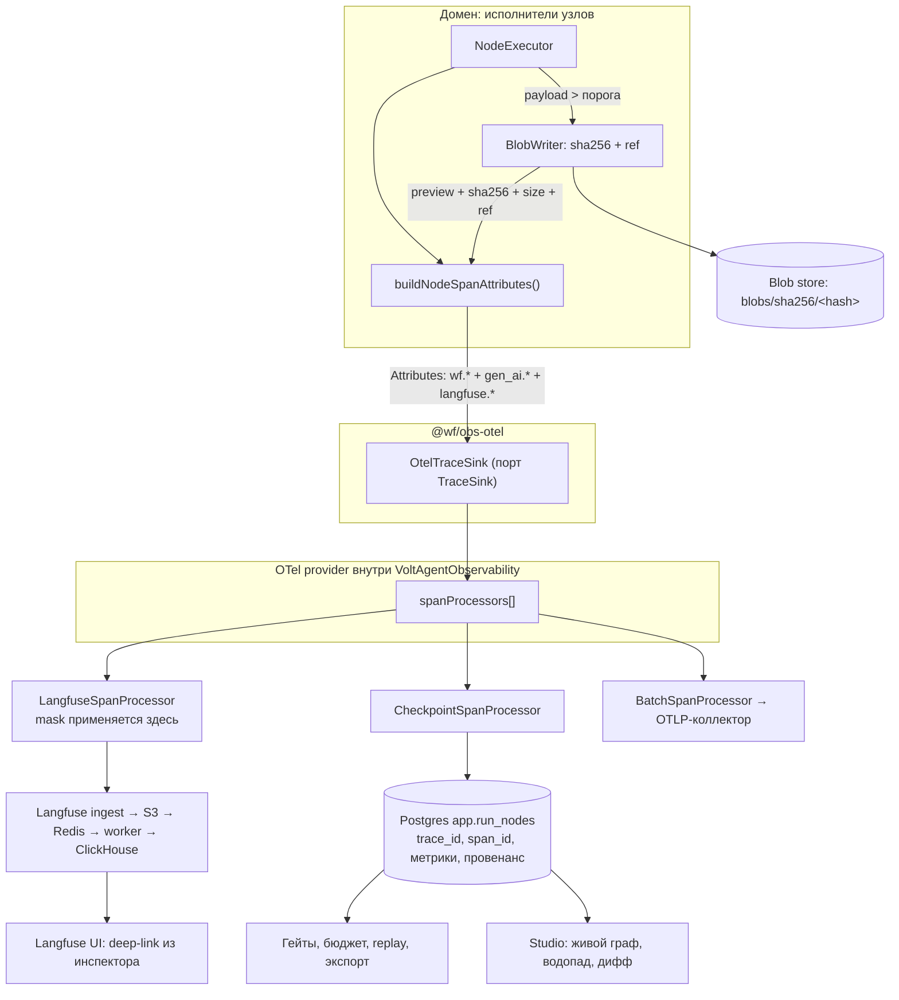

# 12. Наблюдаемость и отладка

> Статус: draft
> Зависит от: [02. Архитектура](02-architecture.md), [07. Компилятор](07-compiler.md), [10. Рантайм](10-runtime.md), [11. Провайдеры](11-providers.md), [13. Evals и гейты](13-evals-and-gates.md), [19. Безопасность и политики](19-security-and-policies.md)
> Источники: research/observability.md, research/volt-integrations.md, research/graph-canvas.md; спека §8.9, §8.10 (76), §8.11 (77), §11, §20

## Зачем этот слой

Каталог §8.9 перечисляет шесть провалов, которые не ловятся ни компилятором, ни рантайм-стражем:
не виден финальный промт (65), непонятно откуда кусок контекста (66), сбой невоспроизводим (67),
нельзя перезапустить один узел (68), нельзя сравнить два прогона (69), нет стоимости и латентности
по узлам (70). Все шесть закрываются одним механизмом — спаном на узел с нашей схемой атрибутов
`wf.*`, который одновременно уезжает в Langfuse (человек смотрит глазами) и в наш Postgres
(система принимает решения). Сюда же садится §8.11 (77) — lineage версий на каждом выходе.
Правило разделения: **в Postgres лежит всё, от чего зависит поведение; в бэкенде трасс — всё,
что нужно человеку для просмотра.** Отключение Langfuse не должно останавливать ни один гейт.

## Решения

| Решение | Что берём | Версия | Лицензия | Почему |
|---|---|---|---|---|
| Шина трасс | OpenTelemetry через `VoltAgentObservability({spanProcessors})` | @voltagent/core 2.10.0 | MIT | `spanProcessors` — массив, дублирующий экспорт штатен |
| Экспорт в Langfuse | `LangfuseSpanProcessor` из `@langfuse/otel` | 5.11.1 | MIT | OTel-native, тот же интерфейс `SpanProcessor` |
| Инструментация | `@langfuse/tracing` (`startObservation`, `propagateAttributes`, `createObservationAttributes`) | 5.11.1 | MIT | даёт Langfuse-совместимые атрибуты на ванильном OTel-спане |
| Датасеты, эксперименты, scores, разметка | `@langfuse/client` | 5.11.1 | MIT | весь evals-контур в OSS без лимитов |
| Адаптер VoltAgent→Langfuse | **НЕ берём** `@voltagent/langfuse-exporter` 2.0.3 | — | MIT | зависит от легаси `langfuse@3.38.x` (не OTel), отстаёт на два поколения SDK |
| Семантика `gen_ai.*` | `@opentelemetry/semantic-conventions/incubating` | 1.43.0, пин | Apache-2.0 | incubating: ломается в минорах, пишем дополнительно, контракт на нём не строим |
| Хранилище спанов для гейтов | наш Postgres 18, схема `app` | — | — | транзакционность, RLS, партиционирование |
| Блобы payload | content-addressed store по `sha256` | — | — | дедупликация system-промтов между прогонами |
| Запасной бэкенд трасс | Arize Phoenix (`@arizeai/phoenix-client` 7.11.0) | — | Apache-2.0 | полностью OSS, легче в эксплуатации, OTel-native |
| Водопад и таймлайн | свой компонент на CSS-позиционировании, `d3-scale` только под оси | 4.0.2 | ISC | готового waterfall с доменной иерархией на npm нет |

---

## 1. Архитектура трассировки

### 1.1 Единственная точка сборки

Провайдер трасс поднимает VoltAgent; мы не создаём свой `NodeTracerProvider`, а передаём процессоры
в `VoltAgentObservability`. Порядок в массиве не определяет порядок доставки — каждому процессору
приходит один и тот же `ReadableSpan`.

```ts
import { VoltAgent, VoltAgentObservability } from "@voltagent/core";
import { LangfuseSpanProcessor } from "@langfuse/otel";
import { BatchSpanProcessor } from "@opentelemetry/sdk-trace-base";

export const observability = new VoltAgentObservability({
  serviceName: "wf-runtime",
  serviceVersion: gitSha,
  resourceAttributes: { "wf.deployment": env.deployment },
  spanFilters: { enabled: true, instrumentationScopeNames: ["wf", "voltagent", "ai"] },
  flushOnFinishStrategy: "never",
  spanProcessors: [
    new LangfuseSpanProcessor({
      baseUrl: env.LANGFUSE_BASE_URL,
      environment: env.deployment,
      release: gitSha,
      exportMode: "batched",
      flushAt: 64,
      flushInterval: 2,
      mask: maskOutbound,
      shouldExportSpan: exportLangfuseSpan,
    }),
    new CheckpointSpanProcessor({ sink: postgresTraceSink }),
    new BatchSpanProcessor(otlpExporter),
  ],
});

new VoltAgent({ agents, workflows, observability });
```

Три жёстких правила этого массива:

1. **Процессор никогда не мутирует `span.attributes`.** Он читает. Мутация в одном процессоре
   меняет то, что увидит другой, и отладка такого расхождения стоит дни.
2. **`mask` действует только на путь в Langfuse.** Наш `CheckpointSpanProcessor` получает
   немаскированные данные. Значит маскирование PII для нашего Postgres — отдельный вызов,
   и он обязан произойти **до** записи атрибута (см. §2.7 и [19. Безопасность](19-security-and-policies.md)).
3. **`shouldExportSpan` полностью перекрывает дефолтный фильтр Langfuse.** Задавая его, мы теряем
   `isLangfuseSpan || isGenAISpan || isKnownLLMInstrumentor`, поэтому предикат обязан звать
   `isDefaultExportSpan` первым:

```ts
import { isDefaultExportSpan } from "@langfuse/otel";

export const exportLangfuseSpan: ShouldExportSpan = ({ otelSpan }) =>
  isDefaultExportSpan({ otelSpan }) || otelSpan.attributes["wf.schema_version"] !== undefined;
```

`shouldExportSpan` вызывается и на старте спана, и на конце; на старте атрибуты неполные,
побочных эффектов в предикате быть не должно.

### 1.2 Порт `TraceSink` и адаптеры

Домен (исполнители узлов, гейты, компилятор) не знает ни про Langfuse, ни про OTel. Он получает
порт. Это Port/Adapter плюс Composite на стороне реализации.

```ts
export type SpanKindWf = "workflow" | "node" | "llm" | "tool" | "guard" | "retriever" | "judge";

export interface NodeSpanDescriptor {
  readonly kind: SpanKindWf;
  readonly name: string;
  readonly identity: RunIdentity;
  readonly attributes: WfAttributes;
}

export interface TraceHandle {
  readonly traceId: TraceId;
  readonly spanId: SpanId;
  update(patch: Partial<WfAttributes>): void;
  fail(error: SpanFailure): void;
  end(): void;
}

export interface TraceSink {
  start(descriptor: NodeSpanDescriptor): TraceHandle;
  withRunScope<T>(scope: RunScope, fn: () => Promise<T>): Promise<T>;
}
```

| Реализация | Пакет | Роль |
|---|---|---|
| `OtelTraceSink` | `@wf/obs-otel` | единственное место, где живут `@opentelemetry/api` и `@langfuse/tracing` |
| `NullTraceSink` | `@wf/obs-otel` | тесты и `dry_run`, нулевая стоимость |
| `RecordingTraceSink` | `@wf/obs-otel` | снимает спаны в память для unit-тестов атрибутов |

`withRunScope` внутри `OtelTraceSink` — это `propagateAttributes` из `@langfuse/tracing`:
`traceName`, `userId`, `sessionId = wf.run_id`, `tags`, `version`, `environment`. Ограничение
`propagateAttributes.metadata` — плоская мапа `string → string` не длиннее 200 символов;
всё, что длиннее, молча дропается с предупреждением, поэтому наши payload туда не кладутся никогда.

Сторона экспорта — зеркальная пара портов:

```ts
export interface SpanExportTarget {
  readonly id: string;
  accepts(span: ReadableSpan): boolean;
  write(batch: readonly ReadableSpan[]): Promise<void>;
}
```

`CheckpointSpanProcessor` реализует `SpanProcessor` из `@opentelemetry/sdk-trace-base`
(`onStart`, `onEnd`, `forceFlush`, `shutdown`) и делегирует в `SpanExportTarget`. Это Adapter:
интерфейс OTel снаружи, наш порт внутри. Замена бэкенда трасс = замена одного элемента массива
`spanProcessors`, домен не меняется ни строкой.

### 1.3 Схема потока



Существенная деталь схемы: блоб пишется **до** закрытия спана, потому что в атрибут уходит `ref`.
Запись блоба — синхронная часть горячего пути узла, а не работа процессора. Процессор не имеет
права ходить в сеть за телом: `onEnd` обязан быть быстрым, иначе очередь `BatchSpanProcessor`
(`maxQueueSize` 2048) переполняется и спаны **дропаются молча**.

---

## 2. Схема спан-атрибутов `wf.*`

Значение OTel-атрибута — только `string | number | boolean | string[] | number[] | boolean[]`.
Вложенных объектов нет: либо плоский ключ, либо JSON-строка, подчиняющаяся правилу §3.
Все ключи — `snake_case`, ASCII, стабильные навсегда.

### 2.1 Идентификация, версии, lineage

| Ключ | Тип | Пример | Смысл |
|---|---|---|---|
| `wf.schema_version` | int | `1` | версия этой схемы атрибутов |
| `wf.tenant_id` | string | `01930b4c-...` | арендатор, ключ RLS |
| `wf.workflow_id` | string | `invoice_extract` | стабильный id воркфлоу |
| `wf.workflow_version` | int | `12` | версия спеки, давшая результат (§8.11 №77) |
| `wf.ir_hash` | string | `sha256-9f2c...` | хэш канонизированного IR (RFC 8785) |
| `wf.run_id` | string | `01930b4c-...` | == `session.id` в Langfuse |
| `wf.run_mode` | string | `live` | `live` \| `replay` \| `eval` \| `dry_run` |
| `wf.node_id` | string | `extract_totals` | стабильный id узла в графе |
| `wf.node_type` | string | `llm` | `llm` \| `tool` \| `router` \| `map` \| `gate` \| `subflow` \| `human` |
| `wf.node_attempt` | int | `2` | номер попытки, 1-based |
| `wf.parent_node_id` | string | `stage_parse` | родитель в доменном графе, не в дереве спанов |
| `wf.stage_id` | string | `parse` | стадия для матрицы стадий (§7) |
| `wf.loop_iteration` | int | `3` | итерация цикла, `-1` вне цикла |
| `wf.checkpoint_id` | string | `01930b4c-...` | строка в `app.run_nodes` |
| `wf.fork.parent_run_id` | string | `01930b4c-...` | из какого прогона форкнуто |
| `wf.fork.from_node_id` | string | `verify` | с какого узла форкнуто |

`wf.parent_node_id` и `wf.stage_id` нужны потому, что дерево OTel-спанов — это дерево вызовов,
а не наш граф. Langfuse рисует первое; Studio рисует второе, и восстанавливает его именно
из этих атрибутов, а не из `parentSpanId`.

### 2.2 Отрисованный промт (§8.9 №65)

| Ключ | Тип | Пример | Смысл |
|---|---|---|---|
| `wf.prompt.template_id` | string | `extract_totals@v7` | шаблон из реестра |
| `wf.prompt.template_version` | int | `7` | |
| `wf.prompt.template_sha256` | string | `sha256-1a0f...` | хэш **шаблона** |
| `wf.prompt.rendered_sha256` | string | `sha256-b731...` | хэш **отрендеренного текста** |
| `wf.prompt.system_sha256` | string | `sha256-44de...` | system-часть отдельно, дедуплицируется |
| `wf.prompt.rendered_preview` | string | `"Ты извлекаешь…[+18422 bytes]"` | ≤ 4096 символов |
| `wf.prompt.rendered_size` | int | `22518` | байт |
| `wf.prompt.rendered_truncated` | boolean | `true` | превью не полное |
| `wf.prompt.rendered_ref` | string | `blob://sha256/b731...` | полное тело |
| `wf.prompt.variables_json` | string | `{"invoice.total":"1 240,00 EUR"}` | мапа слот → превью значения |
| `wf.prompt.messages_count` | int | `4` | |
| `wf.prompt.cache_breakpoints` | int | `1` | число точек кэширования, см. [08. Промты](08-prompts.md) |
| `wf.prompt.estimated_tokens` | int | `5312` | gpt-tokenizer × коэффициент профиля |

Разделение `template_sha256` / `rendered_sha256` отвечает на вопрос «промт изменился или данные
изменились?» без диффа текстов: равные `template_sha256` при разных `rendered_sha256` — данные;
обратное — правка промта.

### 2.3 Провенанс слотов (§8.9 №66)

Один слот = один индекс во всех массивах. Массивы параллельны и обязаны быть одной длины
`wf.slot.count`.

| Ключ | Тип | Пример |
|---|---|---|
| `wf.slot.names` | string[] | `["invoice.total","customer.name"]` |
| `wf.slot.sources` | string[] | `["node:parse_pdf","input"]` |
| `wf.slot.origin_span_ids` | string[] | `["4bf92f3577b34da6",""]` |
| `wf.slot.confidences` | number[] | `[0.91,-1]` |
| `wf.slot.value_sha256` | string[] | `["sha256-0c1d...","sha256-77ab..."]` |
| `wf.slot.required` | boolean[] | `[true,true]` |
| `wf.slot.trust` | string[] | `["trusted","untrusted"]` |
| `wf.slot.missing` | string[] | `["customer.vat_id"]` |
| `wf.slot.count` | int | `2` |

Домен `sources`: `input` \| `node:<id>` \| `default` \| `const` \| `tool:<name>` \| `memory` \| `human`.
`confidences` = `-1`, если неприменимо; `origin_span_ids` = `""`, если источник не спан.
`wf.slot.trust` питает правило §8 №19 (инъекции) и политики видимости.

Массивы выбраны вместо одной JSON-строки потому, что бэкенды трасс умеют фильтровать по массивам
атрибутов, а по JSON-строке — нет. При `wf.slot.count > 64` фабрика переключается на
`wf.slot.provenance_json` + блоб, чтобы не упереться в `attributeCountLimit = 128`.
Полный провенанс без усечений всегда лежит в `app.run_nodes.provenance` — трасса здесь вторична.

### 2.4 Эффективная конфигурация (§8 №86)

| Ключ | Тип | Пример |
|---|---|---|
| `wf.config.hash` | string | `sha256-5e90...` |
| `wf.config.sources` | string[] | `["node_default","workflow_override","run_override","env"]` |
| `wf.config.preview` | string | `{"temperature":0.9,"tools":[]}` |
| `wf.config.ref` | string | `blob://sha256/5e90...` |
| `wf.config.model` | string | `anthropic/claude-opus-4` |
| `wf.config.model_alias` | string | `reasoning_default` |
| `wf.config.model_profile` | string | `anthropic_strict_v3` |
| `wf.config.temperature` | number | `0.9` |
| `wf.config.max_tokens` | int | `4096` |
| `wf.config.seed` | int | `7` |
| `wf.config.timeout_ms` | int | `120000` |
| `wf.config.retry_policy` | string | `exp_backoff:3` |
| `wf.config.cache_policy` | string | `read_write` |

`wf.config.hash` — ключ ответа на «почему два прогона разошлись»: равные хэши означают, что дело
в данных или в недетерминизме модели, а не в настройках. `wf.config.sources` сохраняет порядок
мержа, поэтому происхождение каждого поля восстанавливается разбором цепочки, а не догадкой.

### 2.5 Сработавшие правила и гварды

| Ключ | Тип | Пример |
|---|---|---|
| `wf.rules.evaluated_count` | int | `14` |
| `wf.rules.fired` | string[] | `["R-33","R-C4"]` |
| `wf.rules.fired_actions` | string[] | `["retry","redact"]` |
| `wf.rules.fired_severities` | string[] | `["warn","info"]` |
| `wf.rules.blocked` | boolean | `false` |
| `wf.rules.details_json` | string | превью деталей |
| `wf.guard.schema_valid` | boolean | `true` |
| `wf.guard.schema_errors` | string | превью ошибок zod |
| `wf.guard.repair_attempts` | int | `1` |
| `wf.guard.outcome` | string | `ok` \| `refusal` \| `truncated` |
| `wf.guard.degraded` | boolean | `true` при любом фолбэке (§8 №52) |

`wf.guard.outcome` — три исхода, а не два: `truncated` нельзя чинить ремонтом JSON (DECISIONS,
опровержение 3). Атрибут обязан отличать «починили» от «сфальсифицировали».

### 2.6 Бюджет, стоимость, usage, тайминги

| Ключ | Тип | Пример | Ключ | Тип | Пример |
|---|---|---|---|---|---|
| `wf.budget.scope` | string | `run` | `wf.cost.input_usd` | number | `0.0036` |
| `wf.budget.limit_usd` | number | `2.50` | `wf.cost.output_usd` | number | `0.0051` |
| `wf.budget.spent_usd` | number | `1.83` | `wf.cost.cache_read_usd` | number | `0.0002` |
| `wf.budget.remaining_usd` | number | `0.67` | `wf.cost.cache_write_usd` | number | `0.0009` |
| `wf.budget.limit_tokens` | int | `2000000` | `wf.cost.total_usd` | number | `0.0098` |
| `wf.budget.spent_tokens` | int | `1412903` | `wf.cost.pricing_version` | string | `2026-09-01` |
| `wf.budget.exceeded` | boolean | `false` | `wf.cost.estimated` | boolean | `false` |
| `wf.budget.action` | string | `none` | `wf.tokens.input` | int | `1200` |
| `wf.timing.queue_ms` | int | `41` | `wf.tokens.output` | int | `340` |
| `wf.timing.render_ms` | int | `7` | `wf.tokens.cache_read` | int | `900` |
| `wf.timing.provider_ms` | int | `3182` | `wf.tokens.cache_write` | int | `0` |
| `wf.timing.ttft_ms` | int | `612` | `wf.tokens.reasoning` | int | `1104` |
| `wf.timing.validate_ms` | int | `12` | `wf.result.status` | string | `ok` |
| `wf.cache.hit` | boolean | `false` | `wf.result.error_kind` | string | `schema` |
| `wf.cassette.id` | string | `cas_01930b...` | `wf.cassette.match` | string | `exact` |

Домен `wf.budget.action`: `none` \| `warn` \| `downgrade_model` \| `abort`.
Домен `wf.result.status`: `ok` \| `retried` \| `failed` \| `skipped` \| `blocked` \| `cached`.
Домен `wf.result.error_kind`: `provider` \| `timeout` \| `schema` \| `guard` \| `budget` \| `internal`.

`wf.cost.pricing_version` обязателен: стоимость должна быть пересчитываемой задним числом при
исправлении прайс-листа. Стандартного OTel-атрибута для стоимости не существует — это наша зона.

### 2.7 Правило версии схемы

```
wf.schema_version = 1
```

- Добавление ключа — **не** bump. Читатели обязаны игнорировать незнакомые `wf.*`.
- Удаление ключа, смена типа, смена смысла или домена значений — **bump на +1**.
- Значение пишется на **каждый** спан, не только на корневой: батчи спанов смешиваются между
  версиями кода при раскатке.
- Читатели (`CheckpointSpanProcessor`, Studio, гейты) имеют таблицу `Record<number, SpanReader>`
  (Strategy) и падают явной ошибкой на неизвестной версии, а не молча теряют поле.
- Единственное место формирования атрибутов — фабрика `buildNodeSpanAttributes(ctx): Attributes`
  (SRP). Россыпи `span.setAttribute` по коду запрещены: иначе версионировать нечего.
- Маскирование PII выполняется **внутри фабрики**, до возврата атрибутов, потому что `mask`
  Langfuse не защищает наш Postgres-процессор.

### 2.8 Почему `gen_ai.*` не контракт

Проверено по `@opentelemetry/semantic-conventions@1.43.0`: **все** `gen_ai.*` лежат в
`build/src/experimental_attributes.js` и доступны только через вход `/incubating`.
В стабильном `stable_attributes.js` нет ни одного `GEN_AI`. README пакета: incubating-вход
«_NOT_ subject to the restrictions of semantic versioning and _MAY_ contain breaking changes
in minor releases».

Следствия, зафиксированные:

1. Наши гейты, UI, дифф прогонов, бюджет и экспорт читают **только** `wf.*`.
2. `gen_ai.*` пишем дополнительно, для совместимости с чужими коллекторами: `gen_ai.operation.name`,
   `gen_ai.provider.name`, `gen_ai.request.model`, `gen_ai.response.model`, `gen_ai.response.id`,
   `gen_ai.request.temperature/.max_tokens/.top_p/.seed`, `gen_ai.usage.input_tokens/.output_tokens/
   .cache_read.input_tokens/.reasoning.output_tokens`, `gen_ai.response.finish_reasons`,
   `gen_ai.tool.name/.call.id`, `gen_ai.workflow.name`, `gen_ai.agent.name`.
3. Версия `@opentelemetry/semantic-conventions` **пинуется точно**, обновление — отдельный PR
   с прогоном контрактных тестов атрибутов.
4. Отдельно отмечено: в `gen_ai.*` нет атрибута стоимости и нет понятия провенанса слота.
   Двух главных для нас вещей там просто нет, поэтому вопрос «а не хватит ли стандарта» закрыт.
5. `langfuse.*` (`langfuse.observation.type/.input/.output/.usage_details/.cost_details/.level`,
   `user.id`, `session.id`) пишем через `createObservationAttributes` — это отрисовка в UI,
   тоже не контракт.

---

## 3. Большие payload: три уровня хранения

По умолчанию OTel **не усекает** значения атрибутов:
`DEFAULT_ATTRIBUTE_VALUE_LENGTH_LIMIT = Infinity` (проверено по
`@opentelemetry/sdk-trace-base/build/src/utility.js`). Отрендеренный промт на 200 КБ уедет в OTLP
как есть; батч из `maxExportBatchSize = 512` таких спанов — сотни мегабайт в одном HTTP-запросе,
таймаут экспортёра, 413 от коллектора, переполнение `maxQueueSize = 2048` и **тихая** потеря спанов.
gRPC-коллекторы дополнительно режут сообщение на 4 МБ.

### 3.1 Три уровня

| Уровень | Что лежит | Стоимость | Кто читает |
|---|---|---|---|
| Атрибут спана | превью + метаданные (`sha256`, `size_bytes`, `truncated`, `ref`) | дёшево, индексируется, ищется | Langfuse UI, фильтры, наш процессор |
| Blob store | полное тело по `blobs/sha256/<hash>` | дёшево, дедуплицировано, неизменяемо | инспектор узла по требованию, replay |
| Postgres | ссылки, провенанс, метрики для гейтов | дорого, транзакционно | гейты, бюджет, дифф, экспорт |

### 3.2 Алгоритм на каждый крупный payload

```ts
export interface PayloadRef {
  readonly preview: string;
  readonly sha256: Sha256;
  readonly sizeBytes: number;
  readonly truncated: boolean;
  readonly ref: BlobUri;
}

export interface BlobStore {
  put(body: Uint8Array, sha256: Sha256): Promise<BlobUri>;
  get(ref: BlobUri): Promise<Uint8Array>;
}

const PREVIEW_CHARS = 4096;
const PREVIEW_HARD_CAP = 8192;
const INLINE_JSONB_MAX = 8 * 1024;
const BLOB_TABLE_MAX = 1024 * 1024;
```

Шаги, в порядке исполнения:

1. Канонизировать тело (`canonicalize@5.0.0`, RFC 8785) — иначе два одинаковых по смыслу payload
   дадут разные хэши и дедупликация не сработает.
2. Посчитать `sha256` через `@noble/hashes` с доменной сепарацией, префикс `sha256-`.
3. Маскировать PII. **До** формирования превью, не после.
4. Превью = первые `PREVIEW_CHARS` символов + суффикс `…[+K bytes]`. Хард-кап `PREVIEW_HARD_CAP`.
5. Тело разложить по правилу трёх зон данных: `< 8 КБ` — inline `jsonb` в Postgres;
   `8 КБ – 1 МБ` — отдельная таблица блобов; `> 1 МБ` — объектное хранилище по `sha256`.
   В атрибут спана всегда уходит `ref`, независимо от зоны.
6. В спан записать четыре ключа плюс превью: `*.preview`, `*.sha256`, `*.size_bytes`,
   `*.truncated`, `*.ref`.

### 3.3 Предохранитель

```ts
spanLimits: { attributeValueLengthLimit: PREVIEW_HARD_CAP, attributeCountLimit: 128 }
```

Лимит режет строку **молча**, поэтому явные `*.truncated` и `*.sha256` обязательны: без них
усечённое превью неотличимо от полного тела, а это ровно тот класс тихих сбоев, который
запрещает §8 №52.

### 3.4 Что именно режем

| Payload | Превью | Полное тело | Примечание |
|---|---|---|---|
| Отрендеренный промт | 4096 симв. | blob | system-часть хэшируется отдельно, дедуплицируется на миллионы прогонов |
| Сырой ответ модели | 4096 симв. | blob | при `wf.guard.outcome = truncated` тело сохраняется как есть, без ремонта |
| Распарсенный выход узла | 4096 симв. | Postgres/blob по зонам | вход replay следующего узла |
| Вход узла | 4096 симв. | Postgres/blob по зонам | |
| Документы ретривера | по 512 симв. на документ, не более 10 документов | blob | остальные только `sha256` + счётчик |
| Определения тулов | не пишем | blob по `sha256` | меняются вместе с версией воркфлоу, пишем один раз на версию |
| Ошибки zod | 2048 симв. | blob | |
| Эффективная конфигурация | 4096 симв. | blob | |
| Трейс кассеты | не пишем | Postgres + blob | это фикстура, а не телеметрия |

Медиа (base64 data-URI) обрабатывает сам `LangfuseSpanProcessor` при `mediaUploadEnabled: true` —
детектит и выгружает в media-store, подставляя ссылку. Для JSON этого механизма нет, отсюда
собственный слой выше.

Альтернатива «класть тело в span events» отвергнута: `eventCountLimit = 128`,
`attributePerEventCountLimit = 128`, и большинство бэкендов трасс, включая Langfuse,
LLM-контент из событий не рисуют.

---

## 4. Граница данных: наш Postgres против Langfuse

Критерий один: **от чего зависит поведение — то у нас.** Следствие, действующее как инвариант:
бэкенд трасс **никогда** не читается на горячем пути. Ни один гейт, ни один retry, ни одно
решение о бюджете, ни один экспорт не делает запрос в Langfuse.

| Данные | Источник истины | В трассах | Почему |
|---|---|---|---|
| Чекпоинт узла (вход, выход, статус, попытка) | Postgres `app.run_nodes` | превью | resume, replay, гейты; обязан быть транзакционным |
| Полные payload | Blob store по `sha256` | только `ref` + превью | размер, дедупликация (§3) |
| Провенанс слотов | Postgres `app.run_nodes.provenance` | компактно, массивами | ядро доверия §8.9 №66 |
| Эффективная конфигурация | Postgres `app.runs.effective_config` | `wf.config.hash` + превью | воспроизводимость, §8 №86 |
| Кассеты replay | Postgres + blob | нет | тест-фикстура, не телеметрия |
| Node-level метрики для гейтов | Postgres `app.run_nodes` | да | гейт читает синхронно и транзакционно |
| Бюджет прогона | Postgres `app.runs` | снапшот | решение «остановить прогон» не может зависеть от внешнего SaaS |
| Сработавшие правила и гварды | Postgres `app.run_nodes.rule_firings` | да | аудит решений, экспорт |
| Версии воркфлоу, граф, определения узлов | Postgres | ссылкой `wf.workflow_version`, `wf.ir_hash` | наш домен |
| Артефакты экспорта | Postgres + blob | нет | детерминированный экспорт не зависит от внешнего API |
| Идемпотентность, очередь pg-boss | Postgres | нет | |
| Прайсинг моделей и расчёт стоимости | Postgres | `costDetails` зеркалом | биллинг не может зависеть от чужой таблицы цен |
| Дерево спанов, водопад, тайминги | Langfuse (ClickHouse) | — | это его работа |
| Sessions, users, tags, агрегаты | Langfuse | — | |
| Датасеты и dataset items | **Наш Postgres — источник, Langfuse — зеркало** | синхронизация | чтобы миграция стоила дёшево (§6) |
| Dataset runs, история экспериментов | Langfuse | — | допустимо потерять при миграции |
| Annotation queues, ручная разметка | Langfuse | — | продуктовый UI, который мы не пишем |
| Scores автоматические и ручные | Langfuse источник; агрегаты, влияющие на гейты, зеркалим в Postgres | обе стороны | score, управляющий гейтом, обязан быть у нас |
| Конфиги LLM-as-judge | Langfuse | — | OSS-фича, берём готовую |

### 4.1 Правило связывания

Каждая наша строка несёт `trace_id` (32 hex) и `span_id` (16 hex) — **те же самые**, что у OTel-спана
(`getActiveTraceId()` / `getActiveSpanId()` из `@langfuse/tracing`). Своей мапы идентификаторов нет.

```sql
ALTER TABLE app.run_nodes
  ADD COLUMN trace_id char(32) NOT NULL,
  ADD COLUMN span_id  char(16) NOT NULL;

CREATE INDEX run_nodes_trace_idx ON app.run_nodes (tenant_id, trace_id, span_id);
```

Обратный путь: в `langfuse.observation.metadata` кладём `wf.run_id` и `wf.node_id`, чтобы из UI
Langfuse вернуться в Studio. Переход дешёвый и однозначный в обе стороны.

### 4.2 Проверка границы тестом

Инвариант проверяется автоматически, а не дисциплиной: интеграционный тест поднимает прогон
с недоступным Langfuse (`baseUrl` в чёрную дыру) и требует, чтобы прогон завершился,
гейты отработали, бюджет посчитался, экспорт собрался. Падение этого теста означает, что кто-то
протащил чтение из трасс на горячий путь.

---

## 5. Langfuse: линейка SDK, подключение, что используем, лицензия

### 5.1 Какую линейку берём

| Пакет | Версия | Лицензия | Берём | Роль |
|---|---|---|---|---|
| `langfuse` (unscoped) | 3.38.20 | MIT | **нет** | легаси v3: собственный HTTP-ingestion, не OTel |
| `langfuse-core` | legacy | MIT | **нет** | ядро v3 |
| `@langfuse/tracing` | 5.11.1 | MIT | **да** | `startObservation`, `observe`, `propagateAttributes`, `createObservationAttributes` |
| `@langfuse/otel` | 5.11.1 | MIT | **да** | `LangfuseSpanProcessor`, `isDefaultExportSpan` |
| `@langfuse/client` | 5.11.1 | MIT | **да** | prompts, datasets, experiments, scores, media, полный REST `langfuse.api` |
| `@langfuse/core` | 5.11.1 | MIT | транзитивно | `LangfuseOtelSpanAttributes`, `LangfuseAPIClient` |
| `@voltagent/langfuse-exporter` | 2.0.3 | MIT | **нет** | см. 5.2 |

`engines.node >= 20`, `type: module` + CJS-совместимый `dist/index.cjs`,
peer `@opentelemetry/api ^1.9.0` (у `@langfuse/otel` дополнительно `@opentelemetry/core ^2.0.1`
и `@opentelemetry/sdk-trace-base`).

Поколения: v4 — перелом на OTel-native (span processor + OTLP вместо собственного батчера),
tracing отделён от client. v5 — текущее: типы observation `agent`/`tool`/`chain`/`retriever`/
`evaluator`/`guardrail`/`embedding`, `propagateAttributes`, атрибуты экспериментов.

### 5.2 Почему не `@voltagent/langfuse-exporter`

Факт (`npm view`, 2026-09-11): версия 2.0.3, `dependencies = { "langfuse": "^3.38.6", ... }`.
То есть адаптер конвертирует OTel-спаны **обратно** в v3-ingestion-формат и шлёт своим HTTP-клиентом.
Он отстаёт от `@langfuse/*` 5.11.1 на два поколения SDK. Последствия:

- не доедут типы observation v5 (`agent`, `tool`, `retriever`, `guardrail`, `evaluator`),
  `propagateAttributes`, атрибуты экспериментов, media-upload из процессора и `costDetails`
  по произвольным ключам — а `costDetails` нам нужен под наш прайсинг;
- две HTTP-цепочки и два набора env в одном процессе, если рядом используется `@langfuse/client`;
- мэппинг спанов становится чужой чёрной коробкой в продукте, который продаёт провенанс.

`LangfuseSpanProcessor` реализует ровно тот же интерфейс `SpanProcessor`, что и возвращаемый
адаптером `BatchSpanProcessor`. Промежуточный пакет не нужен ни для чего.

### 5.3 Что именно используем

| Возможность | API | Где применяем |
|---|---|---|
| Трассы | `LangfuseSpanProcessor` + `createObservationAttributes` | просмотр прогона глазами, deep-link из инспектора |
| Группировка прогона | `propagateAttributes({ sessionId: runId, userId, tags, version })` | `wf.run_id` == `session.id` |
| Типы observation | `asType: "generation" \| "tool" \| "agent" \| "retriever" \| "guardrail" \| "evaluator" \| "chain"` | бесплатная семантика для UI: наш `wf.node_type` мапится сюда таблицей |
| Стоимость | `costDetails: { input, output, cache_read, cache_write, total }` | наши числа, наш прайсинг; Langfuse ничего не считает |
| Usage | `usageDetails: { input, output, cache_read_input_tokens, total }` | агрегаты по sessions и users |
| Линковка промта | `prompt: { name, version, isFallback }` | связь спана с версией шаблона |
| TTFT | `completionStartTime: Date` | дублирует `wf.timing.ttft_ms` |
| Scores | `langfuse.score.create({ traceId, observationId, name, value })` | оценки узлов и прогонов |
| Датасеты | `langfuse.dataset.get(name)`, `dataset.runExperiment({ task, evaluators })` | [13. Evals и гейты](13-evals-and-gates.md) |
| Разметка | `langfuse.api.annotationQueues.*` | очереди ручной разметки, §12 спеки |
| Чтение для своего UI | `langfuse.api.trace.get`, `langfuse.api.observations.getMany`, `langfuse.api.sessions.get` | Studio рисует свой граф поверх этих данных |
| Deep-link | `langfuse.getTraceUrl(traceId)` | кнопка «Открыть в Langfuse» в инспекторе узла |

Scores флашатся **отдельно** от спанов: `await langfuse.flush()` после `score.create`.
Забыть это — значит потерять оценки на завершении процесса.

### 5.4 Лицензионные границы: OSS против EE

Код репозитория — **MIT**. Дословно из документации: «All core Langfuse features and APIs are
available in Langfuse OSS (MIT licensed) without any limits».

Закрытый список фич, требующих `LANGFUSE_EE_LICENSE_KEY`:

1. Project-level RBAC Roles
2. Protected Prompt Labels
3. Data Retention Policies
4. Audit Logs
5. Server-Side Data Masking
6. UI Customization
7. Organization Creators
8. Org Management API + SCIM
9. Instance Management API

Что это значит по нашим позициям:

| Фича | Статус | Наш вывод |
|---|---|---|
| Датасеты, dataset items | OSS | берём |
| Эксперименты, dataset runs | OSS | берём |
| Annotation queues | OSS | берём, свой UI разметки не пишем |
| Scores (numeric, categorical, boolean, text) + score configs | OSS | берём |
| LLM-as-a-judge evaluators, evaluation rules | OSS | берём |
| Prompt management (версии, лейблы, компиляция) | OSS | зеркало, источник истины — наш реестр |
| Playground | OSS | берём |
| Базовый SSO (Google, GitHub, Azure AD, Okta, Auth0, Cognito, Keycloak, JumpCloud) | OSS | достаточно на старте |
| Принуждение SSO для организации, SAML/SCIM | **EE** | отложенная покупка |
| RBAC на уровне организации | OSS | |
| RBAC на уровне проекта | **EE** | отложенная покупка |
| Audit logs | **EE** | наш собственный аудит решений лежит в Postgres и от этого не зависит |
| Data retention policies | **EE** | до покупки — ретеншен руками на уровне ClickHouse |
| Server-side data masking | **EE** | нам не нужно: маскируем клиентски в фабрике атрибутов и в `mask` процессора, это бесплатно |

Вывод для build-vs-buy: **весь evals-контур §12 спеки лежит в OSS под MIT без лимитов.**
Главный аргумент «писать своё» снимается. EE понадобится только при приходе корпоративных
клиентов и не требует переписывания — тот же образ плюс переменная окружения.

### 5.5 Self-host: состав и требования

Пять обязательных компонентов, ужать нельзя:

| Компонент | Роль |
|---|---|
| `langfuse-web` | UI + API + приём ingestion-батчей |
| `langfuse-worker` | асинхронная обработка событий, запись в ClickHouse |
| PostgreSQL | проекты, пользователи, промты, датасеты, конфиги |
| ClickHouse | traces, observations, scores — основное хранилище трасс |
| Redis/Valkey | очередь ingestion и кэш |
| S3 / blob store | все входящие события, мультимодальные входы, крупные экспорты |

Поток ingestion: `web` принимает батч → сразу пишет тело в S3 → в Redis кладёт только ссылку →
`worker` забирает из S3 → пишет в ClickHouse. **S3 не опция, а часть горячего пути.**

Ресурсы: прод — не меньше 2 CPU и 4 ГБ RAM на каждый контейнер, не меньше двух инстансов
`langfuse-web` для HA, добавлять при CPU > 50%. Всё-в-одном через Docker Compose — от 4 ядер
и 16 ГиБ. Redis — около 1 ГБ памяти на каждые ~100 000 событий в минуту. ClickHouse — отдельная
эксплуатационная дисциплина: мержи, диски, бэкапы; это главная скрытая стоимость решения.

Честная оценка: минимальный вменяемый прод — четыре контейнера плюс управляемые Postgres,
ClickHouse, Redis и S3. Для маленькой команды это заметная операционная нагрузка. Реалистичный
старт — Langfuse Cloud, self-host как путь отхода: код MIT, данные вывозятся через REST и
blob-экспорт. Своя БД и свой blob store при этом не зависят от выбора.

---

## 6. Запасной бэкенд и цена миграции

### 6.1 Альтернативы, честно

| Продукт | npm-пакет | Версия | Лицензия SDK | Вердикт |
|---|---|---|---|---|
| Langfuse | `@langfuse/tracing` | 5.11.1 | MIT | **основной** |
| Arize Phoenix | `@arizeai/phoenix-client` | 7.11.0 | Apache-2.0 | **запасной**: чистый OTel-native, self-host легче (без обязательных ClickHouse/Redis/S3); слабее prompt management и annotation |
| Comet Opik | `opik` | 2.2.59 | Apache-2.0 | живой, широкий охват, но часть ценности в экосистеме Comet; self-host тяжелее Phoenix |
| Braintrust | `braintrust` | 3.32.0 | MIT (SDK) | платформа SaaS/проприетарная; берём отдельно только скореры `autoevals` (MIT) |
| Laminar | `@lmnr-ai/lmnr` | 0.8.45 | Apache-2.0 | версия 0.x, маленькая команда — ядро продукта на этом не строим |
| Helicone | `@helicone/helpers` | 1.8.3 | Apache-2.0 | gateway/proxy-first, ценность в логе HTTP-вызовов, а не в структуре графа; SDK без релизов ~10 месяцев — **отбрасываем** |
| Чистый OTel + ClickHouse + свой UI | — | — | — | пришлось бы писать датасеты, разметку, scores, LLM-judge — месяцы; **отбрасываем** |

### 6.2 Что делает миграцию дешёвой

Архитектурное правило (DIP), проверяемое автоматически:

```jsonc
{
  "linter": {
    "rules": {
      "nursery": {
        "noRestrictedImports": {
          "level": "error",
          "options": {
            "paths": {
              "@langfuse/tracing": "Только @wf/obs-otel",
              "@langfuse/otel": "Только @wf/obs-otel",
              "@langfuse/client": "Только @wf/obs-langfuse",
              "@opentelemetry/api": "Только @wf/obs-otel"
            }
          }
        }
      }
    }
  }
}
```

| Что делаем | Эффект при смене бэкенда |
|---|---|
| Спаны пишем в ванильный OTel, Langfuse — один `SpanProcessor` из массива | замена одного элемента массива, дни работы |
| Домен ходит через порты `TraceSink`, `EvalStore`, `CassetteStore` | ноль изменений в домене |
| `wf.*` атрибуты и наш Postgres от бэкенда не зависят | гейты, кассеты, провенанс и экспорт продолжают работать при полностью отключённом Langfuse |
| Определения датасетов и наборы кассет — источник истины в нашем Postgres | датасеты переносятся выгрузкой, а не воссоздаются руками |
| `langfuse.api.*` — полный REST | история трасс и scores выгружается перед отключением |

Что реально теряется при миграции: история dataset runs и накопленные в Langfuse scores/разметка.
Митигация трёхслойная: (а) выгрузка через `langfuse.api.*`; (б) периодический blob-storage export;
(в) правило «датасеты и кассеты — у нас, Langfuse — зеркало». Тогда потеря сводится к истории
прогонов, а не к рабочим артефактам.

### 6.3 Критерий переключения на Phoenix

Переключаемся, если выполняется хотя бы одно: эксплуатация ClickHouse съедает больше одного
человеко-дня в месяц; p99 задержки ingestion превышает 60 секунд на нашем объёме; стоимость
инфраструктуры Langfuse превышает стоимость Phoenix более чем вдвое. Решение оформляется ADR,
сам переезд — замена процессора и адаптера `EvalStore`.

---

## 7. Отладчик (§11): возможность → источник данных → механизм

Общий принцип: **UI наш, хранилище чужое.** Langfuse рисует дерево OTel-спанов; у него нет
понятий цикла, стадии, свёрнутого повтора, ширины параллелизма и провенанса слота. Поэтому
путь «deep-link вместо своего UI» закрывает ноль пунктов из списка ниже и остаётся только
страховкой в инспекторе узла.

| # | Возможность | Источник данных | Механизм |
|---|---|---|---|
| 1 | Живой граф прогона, статусы узлов | `WorkflowStreamEvent` (`from`, `stepIndex`, `stepType`, `input`, `output`, `status`) по SSE из `@voltagent/server-hono` | статусы кладутся в отдельный zustand-store и читаются внутри компонента узла через `useStore(selector)`; **через `node.data` не прокидываются** — ссылочное неравенство `data` ререндерит весь канвас |
| 2 | Агрегированный вид: повторы свёрнуты, циклы нарисованы циклами | `wf.node_id`, `wf.loop_iteration`, `wf.node_attempt` | группировка спанов по `wf.node_id`: агрегированный режим схлопывает все `loop_iteration` и `node_attempt` в один узел со счётчиком и суммой стоимости; развёрнутый режим даёт узел на вызов |
| 3 | Группировка по стадиям | `wf.stage_id` | ELK-группы (`elk.hierarchyHandling: INCLUDE_CHILDREN`); родитель обязан идти в массиве `nodes` раньше детей |
| 4 | Инспектор узла: вход с провенансом, клик ведёт к источнику | `app.run_nodes.provenance` + `wf.slot.*` | каждая строка слота несёт `origin_span_id`; клик = переход на узел, у которого `span_id` равен этому значению; для `source = input` переход на вход прогона |
| 5 | Отрисованный промт с подсветкой слотов | `wf.prompt.rendered_ref` (тело из blob) + карта диапазонов подстановки | рендерер промтов возвращает `SlotRange[] = {slot, offset, length}` вместе с текстом; это контракт [08. Промты](08-prompts.md), восстанавливать подсветку поиском подстроки запрещено — значение может встретиться несколько раз |
| 6 | Сырой ответ и распарсенный выход | blob по `wf.response.raw_ref` и чекпоинт `app.run_nodes.output` | два таба; при `wf.guard.outcome = truncated` таб «распарсенный» показывает отказ разбора, а не починенный JSON |
| 7 | Результаты проверок, ретраи, фолбэки | `app.run_nodes.rule_firings`, `wf.rules.*`, `wf.guard.*`, `wf.node_attempt` | список попыток узла с исходом каждой; `wf.guard.degraded = true` красит попытку как деградацию (§8 №52) |
| 8 | Стоимость и латентность узла | `wf.cost.*`, `wf.tokens.*`, `wf.timing.*` | значения считаются нами по `wf.cost.pricing_version`, а не берутся из Langfuse |
| 9 | Replay узла с правкой входа | `getStepData(stepId) → {input, output}` + `workflow.timeTravel({executionId, stepId, inputData})` | см. §8 |
| 10 | Заморозка выходов верхних узлов | `workflowStateOverride` в `timeTravel` + replay-кэш в режиме `read` | состояние верхних узлов подставляется из чекпоинтов, кэш отдаёт их ответы моделей без обращения к провайдеру |
| 11 | Fork с узла k | `timeTravel` + **наша** таблица `app.run_lineage` | VoltAgent не сохраняет `replayedFromExecutionId` / `replayFromStepId` в типизированные поля ни в `@voltagent/postgres@2.1.3`, ни в libsql — линию форков ведём сами; в спанах это `wf.fork.parent_run_id` и `wf.fork.from_node_id` |
| 12 | Дифф двух прогонов или версий по узлам | `app.run_nodes` обоих прогонов | соединение по `wf.node_id`; на каждый узел сравниваются пять хэшей и метрики: `config.hash`, `prompt.template_sha256`, `prompt.rendered_sha256`, `output_sha256`, `wf.result.status`, дельты `cost` и `latency`. Первый несовпавший хэш в этом порядке и есть причина расхождения — диффа текстов не требуется |
| 13 | Точки останова перед узлом или при провале проверки | `suspend()` + `suspendSchema` / `resumeSchema` на шаге | обёртка шага читает список брейкпоинтов из `workflowState` и зовёт `suspend({reason:"breakpoint", nodeId})` до вызова модели либо после `wf.guard.schema_valid = false`; продолжение — штатный `resume` с типизированным `resumeData`, возможно с правленым входом |
| 14 | Панель «почему» | `app.run_nodes.rule_firings`, `wf.rules.fired[]` / `fired_actions[]` / `fired_severities[]`, `wf.config.sources[]`, `wf.budget.action` | панель отвечает тремя блоками: какое правило сработало и с каким действием; откуда взялось каждое поле эффективной конфигурации (порядок мержа из `config.sources`); что сделал бюджет |
| 15 | Водопад стоимости и латентности | `app.run_nodes` (`started_at`, `ended_at`, `wf.cost.total_usd`) | не чарт, а виртуализированная таблица: строка = спан, отступ = глубина, позиция полосы = проценты от окна прогона; `d3-scale@4.0.2` подключаем только если понадобятся оси или log-шкала |
| 16 | Ширина параллелизма | те же `started_at` / `ended_at` | sweep-line по отсортированным событиям start/end, счётчик активных спанов → step-график-спарклайн над водопадом |
| 17 | Кластеризация провалов по узлам и правилам | `app.run_nodes` + `app.run_nodes.rule_firings` | агрегат `GROUP BY (workflow_version, node_id, result_status, error_kind)` и `GROUP BY (node_id, rule_id)`; сортировка по числу прогонов и суммарной стоимости потерянных попыток |
| 18 | Матрица стадий: элементы датасета × стадии | `wf.stage_id` + scores прогонов датасета | ячейка = агрегат исходов проверок стадии по элементу; источник scores — Langfuse, агрегаты, влияющие на гейт, зеркалятся в Postgres (§4) |
| 19 | Lineage значения по стадиям и промтам | `app.run_nodes.provenance` | рекурсивный обход `origin_span_id` вверх до `source = input`, вниз — поиск всех слотов, чей `value_sha256` совпал; «в каких промтах использовалось» = список узлов, где значение встретилось в `wf.prompt.variables_json` |
| 20 | Таймлайн цикла | `wf.loop_iteration` | тот же компонент, что и водопад, с другим группирующим ключом: swimlane, строка = итерация |
| 21 | Согласие панели судей | scores в Langfuse по имени судьи + разметка человека | на элемент — таблица «судья × оценка»; агрегаты weighted kappa и Krippendorff alpha считаем сами, пороги допуска судьи к гейтингу — `kappa ≥ 0.7` и `alpha ≥ 0.8` (см. [13. Evals и гейты](13-evals-and-gates.md)) |

Blame через подстановку эталона (спека §12.3) реализуется контуром evals и описан в
[13. Evals и гейты](13-evals-and-gates.md): механизм тот же timeTravel с подменой выхода узла,
а метрика — дельта сквозного скора.

### 7.1 Запрос лежащих данных для UI

Studio читает **наш** Postgres, а не Langfuse, по двум причинам: RLS и мультитенантность уже там,
и UI обязан работать при отключённом бэкенде трасс. Langfuse-API (`langfuse.api.trace.get`,
`langfuse.api.observations.getMany`) используется только для двух вещей: сырые вложенные спаны
чужих инструментаций и кнопка `getTraceUrl(traceId)`.

```sql
SELECT node_id, stage_id, node_attempt, loop_iteration,
       started_at, ended_at, result_status, error_kind,
       cost_total_usd, tokens_input, tokens_output,
       config_hash, prompt_rendered_sha256, output_sha256,
       trace_id, span_id
FROM app.run_nodes
WHERE tenant_id = $1 AND run_id = $2
ORDER BY started_at;
```

Таблица партиционирована помесячно `PARTITION BY RANGE (started_at)` с BRIN по времени, поэтому
запрос прогона попадает ровно в одну партицию.

---

## 8. Как устроен replay

### 8.1 Два слоя

`workflow.timeTravel({executionId, stepId, inputData?, resumeData?, workflowStateOverride?, metadata?})`
перезапускает воркфлоу с указанного шага — но **переисполняет вызовы моделей**. Сам по себе он даёт
воспроизведение маршрута, а не воспроизведение результата. Детерминизм добавляет наш слой:
кэш ответов моделей как `LanguageModelMiddleware`, подключаемый через `wrapLanguageModel`
внутри `@wf/llm` — единственного пакета, которому разрешено импортировать `ai` и `@ai-sdk/*`.

```ts
export interface Cassette {
  readonly id: CassetteId;
  readonly requestHash: Sha256;
  readonly responseRef: BlobUri;
  readonly recordedAt: Date;
  readonly providerModelId: string;
}

export interface CassetteStore {
  lookup(requestHash: Sha256): Promise<Cassette | undefined>;
  record(requestHash: Sha256, body: Uint8Array, providerModelId: string): Promise<Cassette>;
}

export type CassetteMissPolicy = "fail" | "record" | "passthrough";
```

Ключ кэша — `sha256` канонизированного запроса. В канонизацию входят: идентификатор модели
провайдера, все параметры вызова (`temperature`, `max_tokens`, `top_p`, `seed`, `stop`),
полный список сообщений после рендера, определения тулов, скомпилированная под профиль JSON-схема
вывода, режим structured output. Не входит ничего, что меняется между прогонами само:
идентификаторы прогона, отметки времени, заголовки транспорта.

Режимы по `wf.run_mode`:

| Режим | `CassetteMissPolicy` | Поведение |
|---|---|---|
| `live` | `record` | вызываем провайдера, пишем кассету, `wf.cache.hit = false` |
| `replay` | `fail` | промах кассеты — ошибка `CassetteMiss` с `requestHash`, молчаливый вызов провайдера запрещён |
| `eval` | `passthrough` | кассеты читаются, промах идёт к провайдеру, факт отмечается `wf.cassette.match = miss` |
| `dry_run` | `fail` | без сети вообще |

`wf.cassette.match` принимает `exact` \| `miss`; значение `fuzzy` зарезервировано, но в v1
не используется: приблизительное совпадение запроса ломает сам смысл детерминированного реплея.

### 8.2 Что гарантируется побитово

При `run_mode = replay` и полном покрытии кассетами:

| Артефакт | Гарантия | Основание |
|---|---|---|
| Тело ответа модели | побитово | отдаётся из блоба по `requestHash` |
| Распарсенный выход узла | побитово | тот же вход парсера, парсер детерминирован |
| Отрисованный промт (`wf.prompt.rendered_sha256`) | побитово | тот же шаблон и те же значения слотов |
| Эффективная конфигурация (`wf.config.hash`) | побитово | канонизация RFC 8785 |
| Провенанс слотов | побитово | производная от входов |
| Маршрут по графу | совпадает | предикаты ветвления детерминированы по IR |
| Результат гейтов и правил | совпадает | вход гейта совпадает побитово |

### 8.3 Что не гарантируется

| Что | Почему |
|---|---|
| `wf.timing.*`, `ttft`, латентность, водопад | физическое время не воспроизводится и не должно |
| Идентификаторы: `trace_id`, `span_id`, `execution_id`, `run_id` | новый прогон — новые идентификаторы; связь через `wf.fork.parent_run_id` |
| Границы стриминговых чанков | кассета хранит собранный ответ, а не поток |
| Побочные эффекты тулов | воспроизводимы только там, где кассета стоит **на порту тула**, а не на HTTP; тулы с записью во внешние системы в `replay` обязаны быть в режиме `deny` или иметь кассету |
| `now()`, `random()`, локаль и часовой пояс внутри шаблонов | воспроизводимы только если взяты из `run.context`, который сам является входом прогона (правило §8 №20) |
| Порядок слияния параллельных веток при промахе кэша | `andAll` мержит результаты в один объект; порядок завершения веток при реальных вызовах не детерминирован |
| Поведение при смене версии провайдера на промахе | промах в `replay` запрещён политикой `fail` именно поэтому |
| Стоимость при пересчёте старым прайсом | восстанавливается по `wf.cost.pricing_version`, но новый прогон посчитает текущим прайсом |

### 8.4 Replay одного узла

Последовательность, без прогона всего пайплайна:

1. Из `app.run_nodes` берём чекпоинт узла и чекпоинты всех его предков.
2. `workflowStateOverride` заполняем выходами предков — это и есть «заморозка выходов верхних узлов».
3. `inputData` — вход узла, при необходимости отредактированный пользователем.
4. `timeTravel({executionId, stepId, inputData, workflowStateOverride})` с `run_mode = replay`
   для предков и `live` либо `eval` для самого узла, если вход изменён: правка входа меняет
   `requestHash`, и кассеты для него по определению нет.
5. Результат пишется как новый прогон с `wf.fork.parent_run_id` и `wf.fork.from_node_id`,
   исходный прогон остаётся неизменным.

Пункт 4 — главная развилка, которую нельзя замалчивать в UI: **правка входа означает реальный
вызов модели и реальные деньги.** Кнопка должна показывать оценку стоимости до подтверждения,
считанную по `wf.prompt.estimated_tokens` и текущему прайсу.

---

## 9. Логи и метрики эксплуатации

### 9.1 Логи

Логи идут тем же каналом OTel, что и спаны: `ObservabilityConfig.logProcessors: LogRecordProcessor[]`.
Правила те же, что для атрибутов: структурные поля вместо строковой интерполяции, ни одного PII
в теле записи, обязательные `trace_id` и `span_id` для сшивки с прогоном. Тело больше 4 КБ
в лог не пишется — только `sha256` и `ref`.

Уровни: `error` — сорванный прогон, недоступность провайдера, промах кассеты в `replay`,
`GATE_UNAVAILABLE`; `warn` — деградация (`wf.guard.degraded`), ретрай, срабатывание бюджета;
`info` — жизненный цикл прогона; `debug` — только по флагу арендатора и с TTL.

### 9.2 Что мониторим: L4 из каталога §8

L4 означает «ошибка ловится статистически в проде» — это не алерт на одном прогоне,
а метрика на окне. Все четыре позиции каталога считаются агрегатами по **нашему** Postgres.

| Позиция каталога | Метрика | Как считаем | Реакция |
|---|---|---|---|
| №56 одинаковые дивергенты, «горячий» экстрактор | разнообразие выходов узла `diverge` | доля уникальных `output_sha256` среди дивергентов одного прогона; отдельно доля прогонов, где все дивергенты совпали | падение доли уникальных ниже порога → узел помечается в Studio, правило §8 требует явного источника разнообразия |
| №73 смещённый судья | согласие судьи с человеком | weighted kappa и Krippendorff alpha на пересечении разметки человека и оценок судьи, окно — последние N размеченных элементов | `kappa < 0.7` или `alpha < 0.8` → судья снимается с гейтинга автоматически, гейт переходит в `GATE_UNAVAILABLE` |
| №76 сдвиг распределения в проде | дрейф входов и исходов | доли `wf.result.status`, `wf.guard.outcome`, `wf.rules.fired` по версии воркфлоу, неделя к неделе; плюс семплирование прода в очередь разметки Langfuse | значимое расхождение → элементы уходят в `annotationQueues`, пополняя датасет |
| №12 выпуск: shadow и canary | дельты canary к baseline | сравнение по `workflow_version`: pass rate скореров, `cost_total_usd` на прогон, p95 латентности, доля `failed`/`blocked` | превышение порога → откат версии одной операцией, см. [13. Evals и гейты](13-evals-and-gates.md) |

Статистика сравнений — парный бутстрап BCa (`B = 10000`, фиксированный seed), McNemar для бинарных
метрик, Wilcoxon signed-rank для порядковых, Holm для primary-семьи и BH для secondary;
обязателен A/A-прогон до сравнения A/B; блокирующий гейт требует минимум 200 элементов.

### 9.3 Эксплуатационные метрики платформы

| Метрика | Источник | Зачем |
|---|---|---|
| `spans_dropped_total` | `BatchSpanProcessor` при переполнении `maxQueueSize = 2048` | тихая потеря телеметрии — самый опасный отказ этого слоя |
| `span_export_latency_p95`, `span_export_errors_total` | экспортёры Langfuse и OTLP | 413 и таймауты означают, что где-то забыли превью |
| `attribute_truncated_total` | счётчик в `buildNodeSpanAttributes` | рост означает новый крупный payload без правила §3 |
| `blob_put_bytes`, `blob_dedup_ratio` | `BlobStore` | падение дедупликации = system-промт стал динамическим |
| `run_cost_usd`, `budget_exceeded_total`, `budget_action_total{action}` | `app.runs` | деньги |
| `node_failed_total{node_id,error_kind}` | `app.run_nodes` | кластеризация провалов (§7 п.17) |
| `guard_degraded_total{node_id}` | `wf.guard.degraded` | каждая деградация — скрытая потеря качества |
| `cassette_miss_total{run_mode}` | `CassetteStore` | промах в `replay` — сорванная воспроизводимость |
| `gate_outcome_total{PASS,WARN,BLOCK,GATE_UNAVAILABLE}` | контур гейтов | `GATE_UNAVAILABLE` не должен становиться нормой |
| `suspended_runs_age_p95` | `app.run_nodes` + pg-boss | человек в цикле не возобновляется VoltAgent сам, таймаут наш |
| `pgboss_queue_depth`, `pgboss_job_failed_total` | pg-boss | |
| `langfuse_ingest_lag` | Langfuse worker | лаг ClickHouse-конвейера, не влияет на гейты по построению |

### 9.4 Алерты

Пороги ниже — стартовые, подлежат калибровке после двух недель реального трафика.

| Алерт | Условие | Severity | Действие |
|---|---|---|---|
| Потеря телеметрии | `spans_dropped_total` растёт за 5 минут | critical | проверить размер атрибутов и `maxQueueSize`; телеметрия не должна теряться молча |
| Экспорт трасс сломан | `span_export_errors_total` > 0 за 15 минут | warning | прогон продолжается, деградация только просмотра |
| Бюджет арендатора | `budget_exceeded_total` > 0 | warning | уведомление владельца, `wf.budget.action` уже применён автоматически |
| Промах кассеты в replay | `cassette_miss_total{run_mode="replay"}` > 0 | critical | воспроизводимость сорвана; чинится записью кассеты, а не отключением проверки |
| Гейт недоступен | `gate_outcome_total{GATE_UNAVAILABLE}` > 5% за час | critical | выпуск блокируется, чинится источник скоров |
| Рост деградаций | `guard_degraded_total` на узел удвоился неделя к неделе | warning | разбор в кластеризации провалов |
| Судья потерял согласие | `kappa < 0.7` или `alpha < 0.8` | critical | автоматический снятие судьи с гейтинга |
| Зависшие человеческие задачи | `suspended_runs_age_p95` выше SLA арендатора | warning | сверяющий cron pg-boss, эскалация |
| Дрейф прода | сдвиг долей `wf.result.status` неделя к неделе значим | info | пополнение очереди разметки |

Алерты о состоянии Langfuse (лаг ingest, диски ClickHouse) отделены от алертов продукта:
недоступность бэкенда трасс не является инцидентом исполнения по инварианту §4.2.

---

## Открытые вопросы

1. **OTLP-endpoint Langfuse.** Путь `/api/public/otel/v1/traces` взят из описания, а не из кода
   SDK. *Закрыть:* поднять self-host, отправить один спан через `LangfuseSpanProcessor`, снять
   фактический запрос (прокси или лог `langfuse-web`), зафиксировать в конфиге.
2. **Лицензионный статус `blobStorageIntegrations`.** В закрытом EE-списке отсутствует, но явного
   подтверждения «OSS» нет. Это наш путь резервного вывоза трасс (§6.2). *Закрыть:* поднять OSS
   без `LANGFUSE_EE_LICENSE_KEY` и попытаться создать интеграцию через `langfuse.api`.
3. **Форма ответа `langfuse.api.trace.get`.** Проверено только наличие метода в `.d.ts`; поля
   `observations`, `usage`, `cost` не подтверждены. Влияет на кнопку «сырые спаны» в инспекторе.
   *Закрыть:* контрактный тест против self-host в CI.
4. **Провенанс слотов: параллельные массивы против `wf.slot.provenance_json`.** Массивы выбраны
   ради фильтрации на стороне бэкенда трасс, но это предположение. *Закрыть:* на прототипе
   проверить, умеет ли Langfuse фильтровать по элементу массива атрибутов; если нет — перейти
   на JSON-строку и bump `wf.schema_version`.
5. **Live-скоринг на уровне узла воркфлоу.** Конфиг `eval: { scorers }` есть только у `Agent`;
   у `Workflow` и шага аналога в типах нет. Гипотеза «`WorkflowHooks.onStepEnd` + `runLocalScorers()`»
   не проверена. *Закрыть:* прототип адаптера, иначе матрица стадий (§7 п.18) остаётся офлайновой.
6. **Противоречие в заметках исследования.** `research/volt-integrations.md` §4 рекомендует
   `@voltagent/langfuse-exporter` («семантика LLM-спанов уже сделана за нас», «риска заброшено нет»);
   `research/observability.md` §3.5 доказывает по `npm view`, что пакет зависит от легаси
   `langfuse@3.38.x`, и запрещает его. Решение принято в пользу второй позиции (§5.2) и закреплено
   в DECISIONS. *Остаточный риск:* мы теряем готовый мэппинг VoltAgent-специфичных спанов и пишем
   его сами. *Закрыть:* прогнать один воркфлоу обоими путями и сравнить, что видно в UI, до того
   как выкидывать пакет из рассмотрения окончательно.
7. **Двойной учёт usage и cost** при одновременном экспорте в несколько бэкендов (VoltOps + Langfuse).
   Конфликт маловероятен — бэкенды независимы, — но не проверен. *Закрыть:* один прогон с обоими
   процессорами, сверка сумм токенов и стоимости.
8. **Сэмплирование трасс в проде.** По умолчанию `OTEL_TRACES_SAMPLER = parentbased_always_on`,
   то есть 100%. С нашими превью на 4 КБ и объёмами это может сделать ClickHouse неподъёмным.
   *Закрыть:* замерить байты на прогон на пилоте, выбрать стратегию (всегда писать `failed`
   и `degraded`, семплировать `ok`).
9. **Ретеншен трасс без EE.** Data Retention Policies — EE-фича. *Закрыть:* либо TTL на таблицах
   ClickHouse своими руками, либо решение о покупке EE; до этого — явный лимит объёма.
10. **Карта диапазонов слотов `SlotRange[]`.** Контракт рендерера промтов, от которого зависит
    подсветка слотов (§7 п.5), в заметках не описан. *Закрыть:* зафиксировать сигнатуру
    в [08. Промты](08-prompts.md) и покрыть тестом на повторяющееся значение слота.
11. **Кассеты на порту тула.** Список тулов с побочными эффектами и их политика в `run_mode = replay`
    не определены. *Закрыть:* флаг `side_effect` в реестре тулов ([06. Реестры](06-registries.md))
    и правило компилятора, запрещающее `replay` воркфлоу с тулом без кассеты и без `deny`.
12. **`@voltagent/cli`** нужен для CI-гейта evals, но его версия и лицензия не проверены.
    *Закрыть:* `npm view`, установка, прогон `eval run` с `--dry-run`.
13. **Сборка канваса живого графа.** Не проверена связка Next 16.3 + Turbopack с
    `new Worker(new URL('elkjs/lib/elk-worker.min.js', import.meta.url))`. Фолбэк — файл в `public/` —
    рабочий. *Закрыть:* сборка пилотной страницы Studio.
14. **Лицензия elkjs — EPL-2.0 OR GPL-3.0-or-later**, единственная не-MIT зависимость канваса,
    на котором рисуется живой граф прогона. Использование немодифицированной npm-зависимости
    в проприетарном продукте допустимо, но это юридическое решение. *Закрыть:* подтверждение
    заказчика до начала работ по канвасу; замены с вложенностью и портами на MIT нет.
15. **Пороги алертов §9.4** не откалиброваны. *Закрыть:* две недели наблюдения на реальном
    трафике, затем пересмотр порогов отдельным PR.
