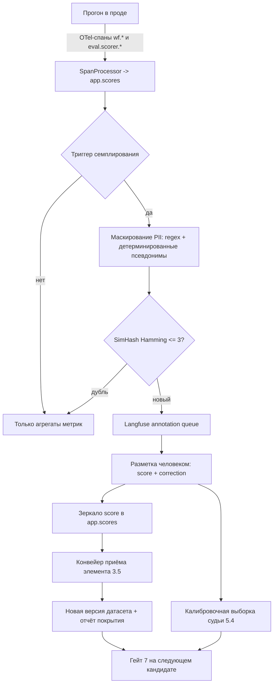

# 13. Evals, датасеты и гейты выпуска

> Статус: draft
> Зависит от: [07. Компилятор](07-compiler.md), [10. Рантайм](10-runtime.md), [12. Наблюдаемость и отладка](12-observability.md), [13. Evals и гейты](13-evals-and-gates.md), [14. MCP-контракт](14-mcp-contract.md)
> Источники: `research/evals-tooling.md`, `research/statistics-gates.md`, `research/observability.md`, `research/00-verified-by-lead.md`, спека §8.10, §6.8, §7.5, §12, §12.1, §12.2, §12.3

## Зачем этот слой

Закрывает §8.10 целиком: нет эталонов (71), есть только сквозная метрика (72), смещённый судья (73),
оптимизатор переобучает промты (74), регрессия после безобидной правки (75), сдвиг распределения в
проде (76). Механика одна: датасет с версиями и сплитами → скореры трёх уровней → эксперимент на
паре версий → статистический гейт с четырьмя исходами → неизменяемый отчёт, на который ссылается
выпуск. Всё, что влияет на решение «выпускать или нет», живёт в нашем Postgres; Langfuse — зеркало и
UI разметки.

## Решения

| Решение | Что берём | Версия | Лицензия | Почему |
|---|---|---|---|---|
| Контракт эксперимента и раннер | `@voltagent/evals` | 2.0.5 | MIT | готовый `createExperiment/runExperiment`, реестр датасетов, per-item scores |
| Каталог скореров | `@voltagent/scorers` | 2.1.0 | MIT | внутри уже `autoevals ^0.0.131`, отдельно ставить не надо |
| Формат спеки LLM-судьи | `autoevals` (`ModelGradedSpec`, `LLMClassifierFromSpec`, `Battle`) | 0.3.0 | MIT | судья как данные, один в один ложится в редактор Studio |
| Движок матрицы моделей | `promptfoo` — изолированный воркер | 0.123.0 | MIT | `providers × prompts × tests`, 100+ ассершенов, `trajectory:*`, `tool-call-f1` |
| Парный Wilcoxon | `@stdlib/stats-wilcoxon` | 0.2.3 | Apache-2.0 | единственная живая парная реализация в TS |
| Парный t-тест + CI | `@stdlib/stats-ttest` | 0.2.3 | Apache-2.0 | сверка с бутстрапом |
| Exact binomial (ядро McNemar) + Clopper-Pearson | `@stdlib/stats-binomial-test` | 0.2.3 | Apache-2.0 | точный вариант при малом числе дискордантов |
| chi2 CDF, normal quantile | `@stdlib/stats-base-dists-chisquare-cdf`, `@stdlib/stats-base-dists-normal-quantile` | 0.3.1 | Apache-2.0 | McNemar при `n_disc >= 25`, расчёт MDE |
| Квантили, ресемплинг, корреляции | `simple-statistics` | 7.12.0 | ISC | `quantile`, `sampleWithReplacement`, `sampleRankCorrelation`, `probit` |
| Датасеты (зеркало), annotation queues, scores, dataset runs | Langfuse OSS self-host | 5.11.1 (SDK) | MIT | весь evals/annotation-контур в OSS без лимитов |
| Достижимость по DAG для blame | `graphology-dag`, `graphology-traversal` | — | MIT | `downstream(v)` без своего обхода |
| Канонизация и хеши (дедуп, кассеты) | `canonicalize` + `@noble/hashes` | 5.0.0 / 2.4.0 | MIT | RFC 8785, тот же примитив, что в экспорте |
| HTTP-моки | `msw` | 2.15.0 | MIT | только юнит-тесты интеграций, не evals |

Отклонены: `viteval@0.5.9` (сами доки VoltAgent помечают как third-party, offline-only, свой формат
датасетов), `evalite@0.19.0` (лицензия не заявлена в npm-метаданных, ~7 мес без релиза),
`@pollyjs/core@6.0.6` (3 года без релиза), `minhash`/`simhash`/`talisman` (мертвы с 2022),
`jstat@1.9.6` (3.8 года без релиза, пустое поле license, нет типов и нет `@types`).

## 1. Граница «готовое / своё»

### 1.1. Что закрывает готовое

| Возможность | Чем | Как используем |
|---|---|---|
| Определение эксперимента, прогон, per-item скоры | `@voltagent/evals.createExperiment/runExperiment` | наш `runner` вызывает узел или воркфлоу; `concurrency`, `onProgress`, `onItem`, `signal` пробрасываем в UI |
| Резолв датасета | `ExperimentDatasetDescriptor` вариант `{resolver}` | резолвер читает наш Postgres, не файлы `.voltagent/datasets` |
| Детерминированные скореры | реэкспорт autoevals: `ExactMatch`, `JSONDiff`, `Levenshtein`, `ListContains`, `NumericDiff` | прямо, без обёрток |
| Скореры-судьи | `createFactualityScorer`, `createSummaryScorer`, `createModerationScorer`, RAG-набор (`createAnswerCorrectnessScorer`, `createAnswerRelevancyScorer`, `createContextPrecisionScorer`, `createContextRecallScorer`, `createContextRelevancyScorer`), `createToolCallAccuracyScorerCode` | через нашу панель судей, не поштучно |
| Свой скорер | `buildScorer` из `@voltagent/core`: `.prepare → .analyze → .score → .reason` | score всегда 0..1 — это инвариант всей платформы |
| Матрица моделей | `promptfoo.evaluate(testSuite, options)` | наш воркфлоу подключается как `ApiProvider` (`id()`, `callApi`) — без YAML |
| Ассершены траектории | `tool-call-f1`, `skill-used`, `trajectory:goal-success`, `trajectory:tool-sequence`, `trajectory:tool-args-match`, `trajectory:step-count`, `trace-span-count`, `trace-error-spans` | только внутри матрицы моделей |
| Датасеты-зеркало, очереди разметки, scores, dataset runs | Langfuse OSS | UI разметки не пишем |

### 1.2. Чего в готовом нет — семь дыр

1. **`passCriteria` только глобальные.** `MeanScoreCriteria`/`PassRateCriteria` считаются по всему
   прогону; `scorerId` сужает до скорера, но не до узла. Гейт «узел `extract` держит F1 ≥ 0.9» не
   выражается.
2. **Нет понятия узла.** `runner` возвращает один `output` на item; `scores` — плоский
   `Record<string, ExperimentScore>`.
3. **Нет сравнения прогонов.** Ни diff «run A vs run B», ни «регрессия относительно last-green».
4. **Нет статистики значимости.** Только `meanScore`/`minScore`/`maxScore`/`passRate` — без CI.
5. **Нет cost/latency в критериях.** `durationMs` есть в item, в `passCriteria` не попадает.
6. **Нет повторов и flake-детекции.** Один item = один результат.
7. **Нет детерминизма.** `runExperiment` всегда бьёт в живую модель.

Плюс восьмая, продуктовая: live-скореры VoltAgent (`new Agent({ eval: { triggerSource: "production",
sampling, scorers } })`) пишут результат в OTLP-атрибуты `eval.scorer.*` и **не персистятся в Eval
Runs**, не связываются с датасетами. Цикл «прод → датасет» (§11) строим сами поверх наших спанов.

### 1.3. Пакеты, которые пишем

| Пакет | Ответственность | Зависимости |
|---|---|---|
| `@wf/stats` | чистая статистика: бутстрап BCa, McNemar, Holm, BH, power/MDE, ICC, kappa, alpha, tau-b | ноль зависимостей от VoltAgent, Langfuse и БД |
| `@wf/datasets` | модель датасета, сплиты, версии, дедуп, покрытие, PII-маскирование | `canonicalize`, `@noble/hashes`, drizzle |
| `@wf/scorers` | реестр скореров, адаптеры к `@voltagent/scorers`, панель судей, калибровка | `@voltagent/scorers`, `autoevals` |
| `@wf/evals` | эксперимент, node-level агрегация, гейт, отчёты | `@voltagent/evals`, `@wf/stats`, `@wf/datasets` |
| `@wf/model-matrix` | адаптер promptfoo, отдельный процесс, Node ≥ 22.22.0 | `promptfoo` |
| `@wf/blame` | single-node patch, ddmin, ранжирование вклада | `graphology-dag`, `graphology-traversal` |

Паттерны: `ScorerPort`/`DatasetStore`/`EvalStore` — Port/Adapter (домен не импортирует
`@langfuse/*` и `promptfoo`); реестр скореров — Registry; выбор теста по `kind` — Strategy через
таблицу `Record<MetricKind, TestStrategy>`, не switch-лестницу; фазы гейта — Chain of Responsibility
с ранним возвратом.

### 1.4. Изоляция promptfoo — жёсткие правила

`promptfoo` — не библиотека, а приложение: 80 прямых зависимостей (`express`, `socket.io`,
`winston`, `drizzle-orm`, `@libsql/client`, `nunjucks`, `python-shell`, `posthog-node`, `openai`,
`@anthropic-ai/sdk`, `ai`), ~490 пакетов в дереве, собственная SQLite в `~/.promptfoo`,
`engines: { node: ">=22.22.0" }`.

1. Отдельный пакет `@wf/model-matrix`, отдельный процесс-воркер, отдельный образ. В рантайм-образ
   воркфлоу `promptfoo` не попадает.
2. Класс `Eval`, который возвращает `evaluate`, — внутренний контракт. Завязываемся только на
   `EvaluateSummaryV3` / `EvaluateResult` / `GradingResult`, за фасадом `ModelMatrixRunner`.
3. Результат немедленно перекладывается в наш Postgres; `~/.promptfoo` — эфемерный том.
4. `PROMPTFOO_DISABLE_REDTEAM_REMOTE_GENERATION=1` обязателен: иначе генерация состязательных
   кейсов уходит на их API вместе с нашими данными.
5. Ассершены `python` и `ruby` запрещены политикой в managed-режиме (поверхность исполнения кода).
6. `sharing` выключен; `outputPath` пишем во временный каталог воркера.

## 2. Датасеты: модель данных, сплиты, версии

### 2.1. Принцип

Источник истины — наш Postgres (схема `app`). Langfuse — зеркало, синхронизируемое в одну сторону:
мы пушим `datasets`/`datasetItems` через `langfuse.api.*`, обратно читаем только ручную разметку из
annotation queues. Цена миграции с Langfuse тогда — потеря истории прогонов, а не датасетов.
Версионирование датасетов **наше**: у `@voltagent/evals` локальных версий нет вообще (версии живут
только на стороне VoltOps SaaS), поэтому датасет подаётся в эксперимент дескриптором `{resolver}`,
который читает конкретную иммутабельную версию из нашей БД.

### 2.2. DDL

```sql
create table app.datasets (
  id            uuid primary key default uuidv7(),
  tenant_id     uuid not null,
  name          text not null,
  scope         text not null check (scope in ('node', 'workflow')),
  workflow_id   uuid not null,
  node_id       text,
  description   text,
  created_at    timestamptz not null default now(),
  unique (tenant_id, workflow_id, name)
);

create table app.datasets (
  id              uuid primary key default uuidv7(),
  tenant_id       uuid not null,
  dataset_id      uuid not null references app.datasets(id),
  version         int  not null,
  content_hash    text not null,
  item_count      int  not null,
  split_counts    jsonb not null,
  coverage_report jsonb,
  frozen_at       timestamptz not null default now(),
  created_by      text not null,
  unique (dataset_id, version),
  unique (dataset_id, content_hash)
);

create table app.dataset_items (
  id                 uuid primary key default uuidv7(),
  tenant_id          uuid not null,
  dataset_version_id uuid not null references app.datasets(id),
  item_key           text not null,
  split              text not null check (split in ('train', 'dev', 'test')),
  input              jsonb not null,
  expected           jsonb,
  extra              jsonb not null default '{}'::jsonb,
  origin             text not null check (origin in ('run', 'generated', 'production', 'manual', 'perturbation')),
  source_run_id      uuid,
  source_node_id     text,
  synthetic          boolean not null default false,
  label_confidence   real,
  label_source       text check (label_source in ('model', 'human', 'consensus')),
  labeler_model      text,
  pii_masked         boolean not null default false,
  simhash64          bigint not null,
  canonical_sha256   text not null,
  coverage_targets   text[] not null default '{}',
  unique (dataset_version_id, item_key)
);

create index on app.dataset_items (dataset_version_id, split);
create index on app.dataset_items (dataset_version_id, canonical_sha256);
```

`item_key` — стабильный ключ элемента, переживающий версии датасета: `sha256` канонизированного
`input` по RFC 8785 (`canonicalize@5.0.0` + `@noble/hashes`). Он же — единица спаривания `case_id` в
статистике (§7). `content_hash` версии = Merkle-корень отсортированных `item_key`.

Версии иммутабельны: правка элемента создаёт новую версию. Три зоны блобов из общего правила
действуют и здесь: `input`/`expected` больше 8 КБ уезжают в blob-таблицу, в `jsonb` остаётся
`{ ref, preview, sha256, size }`.

### 2.3. Сплиты

Сплит детерминирован и не зависит от порядка добавления:

```ts
const SPLIT_BANDS: ReadonlyArray<readonly [number, DatasetSplit]> = [
  [70, 'train'],
  [85, 'dev'],
  [100, 'test'],
];

export function assignSplit(itemKey: ItemKey, salt: DatasetSaltHex): DatasetSplit {
  const bucket = Number(BigInt('0x' + sha256Hex(salt + itemKey).slice(0, 8)) % 100n);
  const band = SPLIT_BANDS.find(([upper]) => bucket < upper);
  if (!band) throw new Error('split_bands_incomplete');
  return band[1];
}
```

`salt` фиксируется при создании датасета и хранится в `app.datasets`. Добавление элементов не
перемешивает уже назначенные сплиты, поэтому `test` не может «перетечь» в `train`.

**Недоступность `test` оптимизатору** — не соглашение, а тип и права:

```ts
type OptimizerDatasetView = { readonly splits: readonly ['train', 'dev'] };
type GateDatasetView      = { readonly splits: readonly ['test'] };

interface DatasetStore {
  readForOptimizer(ref: DatasetVersionRef): Promise<DatasetItem[]>;
  readForGate(ref: DatasetVersionRef, token: GateScopeToken): Promise<DatasetItem[]>;
}
```

Реализация `readForOptimizer` добавляет `where split <> 'test'` на уровне SQL. Каждое чтение
`test`-сплита пишет строку в `app.journal (dataset_version_id, split, actor, purpose,
at)`. Гейт в фазе 0 проверяет журнал: если `test` читался актором с `purpose = 'optimize'`, это
`GATE_UNAVAILABLE('test_split_contaminated')` (§8.10 п.74, спека §12).

### 2.4. Создание датасета из прогона одним действием

MCP-тул `dataset_add_from_run` (спека §12 «создаются из прогона одним действием»; точка из §13.1
переименована по конвенции имён):

```ts
dataset_add_from_run({
  run_id: RunId;
  scope: 'node' | 'workflow';
  node_id?: NodeId;
  dataset?: DatasetName;
  items?: 'all' | 'failed' | 'sampled';
  sample_rate?: number;
  mask_pii?: boolean;
}) -> { dataset_version: DatasetVersionRef; added: number; deduplicated: number; coverage: CoverageReport }
```

Механика: читаем `app.run_nodes` прогона, для каждого узла берём `input`/`output` из чекпоинта,
`input` становится `input` элемента, `output` — кандидатом в `expected` с
`label_source = 'model'`, `label_confidence` из метрик узла и `synthetic = false`. Для
`scope = 'workflow'` берётся вход первого и выход последнего узла, а выходы промежуточных узлов
кладутся в `extra.gold_by_node` — это будущие эталоны для blame (§10). Дальше конвейер §3.5:
маскирование PII → дедуп → назначение сплита → отчёт покрытия.

## 3. Генерация датасетов (§12.1)

### 3.1. Стратегии

| Стратегия | Источник входов | Что даёт | Флаги элемента |
|---|---|---|---|
| `from_types` | Zod-схема входа узла: `z.enum` → полный список, `z.union` → дискриминанты, `z.literal`, `optional/nullable` → `{present, absent}`, числовые `.min/.max` → границы | покрытие значений enum и границ | `synthetic = true`, `origin = 'generated'` |
| `from_brief` | сценарии и крайние случаи из брифа | реалистичные кейсы домена | `synthetic = true` |
| `adversarial` | каталог §3.3 | устойчивость к мусору и инъекциям | `synthetic = true`, `extra.adversarial_class` |
| `from_production` | семплы трасс (§11) | реальное распределение | `synthetic = false`, `pii_masked = true` |
| `perturbation` | перефразы и шум поверх существующих элементов | чувствительность к формулировке | `extra.derived_from = item_key` |

Комбинаторика значений — **pairwise (IPOG), не декартово произведение**. Для 8 параметров по 4
значения декарт даёт 65 536 кейсов, all-pairs — 20–30 при 100% покрытии всех пар. Живых TS-библиотек
IPOG нет, алгоритм пишем сами (~150 строк) в `@wf/datasets`.

Тул: `dataset_generate({ dataset, strategy, targets?, count?, seed })`. Генерирует Claude,
платформа контролирует покрытие и качество: результат генерации проходит те же фильтры §3.5, что и
элементы из прогона, и отвергнутые кейсы возвращаются с причиной, а не молча пропадают.

### 3.2. Цели покрытия

Это структурное покрытие графа, прямой аналог branch coverage, а не текстовая метрика. Каждая цель
имеет стабильный идентификатор и попадает в `dataset_items.coverage_targets[]`.

| Класс цели | Идентификатор | Как считается покрытой |
|---|---|---|
| значение enum на входе | `enum:<node_id>:<field>:<value>` | элемент содержит это значение |
| ветка `switch` | `branch:<node_id>:<case>` | в прогоне элемента сработала эта ветка |
| причина выхода из цикла | `loop_exit:<node_id>:<success\|max_iter\|stagnation\|budget>` | спан цикла закрылся с этой причиной |
| политика ошибок | `error_policy:<node_id>:<policy>` | политика фактически применена |
| контекст | `context:<node_id>:<hit\|miss\|stale>` | результат поиска соответствует |

Первый класс проверяется статически по элементу, остальные четыре — **только по фактическому
прогону**: источник истины — наши спан-атрибуты `wf.node_id`, `wf.node_type`, плюс
`wf.loop.exit_reason` и `wf.context.result` в том же неймспейсе. Поэтому отчёт покрытия обновляется
после прогона датасета, а не после генерации.

```ts
type CoverageReport = {
  datasetVersionId: DatasetVersionId;
  totals: { targets: number; covered: number; ratio: number };
  byClass: Record<CoverageClass, { targets: number; covered: number }>;
  gaps: Array<{ target: CoverageTargetId; kind: CoverageClass; hint: string }>;
  measuredFromRunIds: RunId[];
};
```

В Studio это таблица «цель → покрыта → сколько элементов» и кнопка «добрать»: список `gaps`
передаётся в `dataset_generate` как задание. Гейт покрытием **не блокирует** — блокирует только
размер `test`-сплита (§7) и условия §8; непокрытые цели дают `WARN` в отчёте эксперимента.

### 3.3. Состязательный каталог

Пропуски обязательных полей и `null` в optional; противоречия между полями (дата окончания раньше
начала); длина входа у верхней границы контекста и за ней; смешение языков и скриптов, эмодзи, RTL,
zero-width; prompt injection в данных (инструкции в пользовательском поле, фейковые системные
маркеры, попытка вызвать tool); числовые крайности (0, отрицательные, очень большие, NaN-строки);
отравленный контекст (релевантный-но-устаревший документ, дубликат, полностью нерелевантный) — он же
источник целей `context:*:stale` и `context:*:miss`.

Redteam-плагины promptfoo генерируют часть этого набора (jailbreak, PII-leak, harmful), но только
при `PROMPTFOO_DISABLE_REDTEAM_REMOTE_GENERATION=1` — иначе данные уходят на их API. Профиль
инъекций генерируем локально по шаблонам.

### 3.4. Дедупликация: алгоритмы и пороги

Живой библиотеки нет (`minhash@0.0.9`, `simhash@0.1.0`, `talisman@1.1.4` — последние публикации
2022, `datasketch` и `minhash-js` в npm отсутствуют). Пишем сами, ~120 строк.

| Уровень | Алгоритм | Порог | Действие |
|---|---|---|---|
| точный дубль | `canonicalize` (RFC 8785) + sha256 | равенство `canonical_sha256` | элемент отвергается |
| near-dup, короткий текст | SimHash-64 по 3-граммам слов, бакетирование 4 полосы × 16 бит | Hamming ≤ 3 | отвергается, в отчёт `deduplicated` |
| near-dup, длинный документ | MinHash + LSH, 128 перестановок, banding b=32 / r=4 | Jaccard ≥ 0.85 | отвергается |
| пересечение с few-shot узла | тот же SimHash-индекс по корпусу few-shot | Hamming ≤ 6 | помечается `extra.fewshot_overlap = true` и **не попадает в `test`** |

Последняя строка — прямое требование спеки §12.1 «отсутствие пересечений с few-shot примерами»:
элемент не выбрасывается (в `train` он полезен), но не имеет права участвовать в гейте.

Канонизация и sha256 здесь — тот же примитив, что в кассетах реплея и в экспорте: одна реализация на
три задачи.

### 3.5. Конвейер приёма элемента

Chain of Responsibility, ранний возврат, без вложенных условий:

```ts
const INTAKE: ReadonlyArray<IntakeStage> = [
  maskPii,
  validateAgainstNodeSchema,
  rejectExactDuplicate,
  rejectNearDuplicate,
  flagFewShotOverlap,
  assignSplitStage,
  attachCoverageTargets,
];

export async function intake(item: RawItem, ctx: IntakeContext): Promise<IntakeOutcome> {
  let current: IntakeOutcome = { status: 'accepted', item };
  for (const stage of INTAKE) {
    current = await stage(current, ctx);
    if (current.status === 'rejected') return current;
  }
  return current;
}
```

### 3.6. Разнообразие

| Метрика | Как считаем | Порог по умолчанию |
|---|---|---|
| distinct-1 / distinct-2 / distinct-3 | доля уникальных n-грамм по корпусу датасета | distinct-2 ≥ 0.6 |
| self-BLEU | попарный BLEU внутри датасета (ассершен `bleu` у promptfoo либо своя реализация) | среднее ≤ 0.4 |
| дисперсия эмбеддингов | средний косинус к центроиду (`compute-cosine-similarity` внутри autoevals) | ≤ 0.85 |
| покрытие кластеров | k-means по эмбеддингам, требование «в каждом кластере ≥ k элементов» | k ≥ 5 |

Нарушение порога — `WARN` в отчёте датасета и подсказка в Studio, не отказ: низкое разнообразие
допустимо для узкого узла.

### 3.7. Маскирование PII

Прямого аналога presidio в TS нет (`@microsoft/presidio-node` не существует). Два слоя:

1. **Обязательный, TS, синхронный** — regex-детекторы структурных PII: email, телефон (E.164 и
   локальные форматы), карты с проверкой Луна, IBAN, ИНН/СНИЛС/паспорт РФ, IP, JWT и ключи по
   префиксам (`sk-`, `ghp_`, `AKIA`), URL с токенами.
2. **Опциональный, вне TS** — Presidio как HTTP-сервис (имена, адреса, организации), либо
   `compromise@14.17.0` (MIT, живой) с тегами `#Person`, `#Place`, `#Organization` для английского.
   `redact-pii@3.4.0` помечаем как риск: последняя публикация 2024-11.

Замена — **детерминированный псевдоним, а не `***`**: `<EMAIL_a3f9>`, где суффикс =
`hmac(tenant_secret, value).slice(0, 4)`. Один и тот же человек получает один и тот же псевдоним во
всех узлах и во всех элементах тенанта — иначе ломается lineage (§10) и датасет теряет смысл.
Маскирование выполняется **до** записи в датасет, на границе «семпл трассы → dataset item», там же
выставляются `synthetic = false` и `pii_masked = true`.

## 4. Скореры: три уровня

Порядок из спеки §12 — сначала детерминированные, затем судьи, затем люди — это не пожелание, а
права в гейте:

| Уровень | Кто | Право в гейте | Стоимость |
|---|---|---|---|
| L1 детерминированный | схема, множества, инварианты, опора на вход, cost, latency | блокирует без ограничений | ~0 |
| L2 LLM-судья | панель судей по рубрике | блокирует только после калибровки (§5) | вызовы моделей × K судей × R повторов |
| L3 человек | annotation queue в Langfuse | источник истины для калибровки L2; сам гейтом не является | время человека |

Общий контракт: score ∈ [0, 1] (инвариант `buildScorer` из `@voltagent/core`, распространяем на все
свои скореры), плюс `kind: 'binary' | 'ordinal' | 'continuous'` — он определяет, какой
статистический тест применится в §7. Рубрика 1..5 нормируется в [0, 1] для хранения, но
`kind = 'ordinal'` сохраняется, и тест берётся по `kind`, а не по диапазону.

```ts
type ScorerDescriptor = {
  id: ScorerId;
  level: 'deterministic' | 'judge' | 'human';
  kind: MetricKind;
  appliesTo: readonly NodeArchetype[];
  gateRole: 'primary' | 'secondary' | 'safety';
  impl: LocalScorerDefinition<ScorerPayload, ScorerParams>;
};

const SCORER_REGISTRY: ReadonlyMap<ScorerId, ScorerDescriptor> = buildRegistry([...]);
```

`gateRole` объявляется в реестре — это и есть механизм «семья тестов объявлена до прогона» (§7.3).

### 4.1. Таблица скореров по архетипам узлов

| Архетип | L1 детерминированные | L2 судьи | L3 человек |
|---|---|---|---|
| `extractor` | валидность схемы; заполненность обязательных полей; `JSONDiff` против эталона; опора на цитату из входа (подстрока найдена); доля полей «нет данных» | `createFactualityScorer` на спорных полях | выборка 10–20% при расхождении с эталоном |
| `classifier` | принадлежность enum; `ExactMatch` против эталона; матрица ошибок по классам | — | разметка спорных классов |
| `scorer` | диапазон шкалы; непустое обоснование; порядок «обоснование → оценка» | согласие с эталонной оценкой (`kind: ordinal`) | калибровочная выборка |
| `generator` | валидность схемы; язык выхода; длина в границах; отсутствие запрещённых шаблонов | `createSummaryScorer`, рубрика качества панелью | приёмка стиля |
| `judge` | согласованность при перестановке позиций (swap-стабильность); детерминированность формата вердикта | `Battle` (autoevals) для попарного сравнения судей | эталонная разметка — обязательна (§5) |
| `aggregator` | потери элементов (вход ⊇ выход по ключу дедупликации); отсутствие дублей; сохранение порядка | — | — |
| `critic_reviser` | монотонность роста оценки по итерациям; соблюдение лимита итераций | рубрика качества финальной версии | — |
| `summarizer` | длина; отсутствие новых сущностей (факты выхода ⊆ факты входа по NER/списку сущностей) | `createFactualityScorer`, `createAnswerCorrectnessScorer` | выборка на галлюцинации |
| `planner` | выход — список задач известного типа; отсутствие циклов в плане; покрытие входных требований | рубрика полноты плана | — |
| `router` | принадлежность enum; полнота вариантов; согласие с эталонной веткой | — | спорные маршруты |
| `bounded_agent` | соблюдение лимитов (шаги, токены, бюджет); итог по схеме; `createToolCallAccuracyScorerCode`; `tool-call-f1` и `trajectory:*` в матрице моделей | `trajectory:goal-success` как судья цели | разбор провалов траектории |
| `consensus_extractor` | доля согласия между N экстракциями; доля эскалаций; схема итога | судья на эскалациях | разметка эскалаций |
| RAG-узлы (контекст) | попадание/промах поиска по эталонному набору документов | `createContextPrecisionScorer`, `createContextRecallScorer`, `createContextRelevancyScorer`, `createAnswerRelevancyScorer` | релевантность документов |

Любой узел дополнительно получает `safety`-скореры платформы: `schema_valid` (binary),
`cost_usd` (continuous), `latency_p95_ms` (continuous), `retry_count` (continuous). Они участвуют в
non-inferiority-семье на **всех** узлах, а не только на изменённых (§7.3).

### 4.2. Свой скорер

```ts
export const quoteGrounding = buildScorer<GroundingPayload, GroundingParams>('quote_grounding')
  .prepare(({ payload }) => ({ claims: splitClaims(payload.output), source: payload.input.text }))
  .analyze(({ prepared }) => ({ hits: prepared.claims.filter((c) => prepared.source.includes(c.quote)) }))
  .score(({ prepared, analysis }) => ({
    score: prepared.claims.length === 0 ? 1 : analysis.hits.length / prepared.claims.length,
    metadata: { total: prepared.claims.length, grounded: analysis.hits.length },
  }))
  .reason(({ metadata }) => `${metadata.grounded} of ${metadata.total} claims found verbatim in input`);
```

### 4.3. Люди: очередь разметки

Annotation queues и scores берём у Langfuse OSS (MIT, без лимитов). Запись —
`langfuse.score.create({ traceId, observationId?, name, value, dataType, comment })`, флашится
отдельно от спанов. Типы score: numeric / categorical / boolean / text / correction; шкалы задаются
через `scoreConfigs`.

Правило границы данных: score, который влияет на гейт, обязан быть зеркалирован в наш Postgres
(`app.scores`). Гейт не делает ни одного синхронного запроса в Langfuse.

## 5. Судьи и калибровка

### 5.1. Дефолт — панель, а не один большой судья

В исследовании PoLL (Verga et al., arXiv:2404.18796) панель из нескольких мелких моделей разных
семейств коррелирует с человеком выше, чем один GPT-4, при стоимости в 7–8 раз ниже; GPT-4 в
одиночку оказался одним из слабых оценщиков на single-hop QA. Пулинг по разным семействам снижает
внутримодельный и позиционный bias. Поэтому дефолтная конфигурация судьи в платформе — `judge_panel`
из трёх моделей разных вендоров с медианой по критериям (§6.8 спеки), а не одна модель.

Второй ограничитель — потолок качества. G-Eval (Liu et al., EMNLP 2023, arXiv:2303.16634) на
SummEval: Spearman 0.514 суммарно (coherence 0.582, consistency 0.507, fluency 0.455,
relevance 0.547). Это был SOTA, и это всего лишь умеренное согласие. Вывод, который надо держать в
голове при проектировании гейта: **LLM-судья на свободном тексте по умолчанию не даёт качества,
достаточного для жёсткого блокирующего гейта**, и допуск к BLOCK — исключение, которое надо
заработать.

### 5.2. Метрики согласия

Живых npm-пакетов нет ни для одной (`@stdlib/stats-kappa-cohen`, `cohens-kappa`, `ckappa`,
`krippendorff-alpha`, `inter-rater-agreement`, `kendall-correlation` — все E404). Пишем в
`@wf/stats`.

| Метрика | Формула | Когда применяем | Почему именно она |
|---|---|---|---|
| quadratic weighted kappa | `k = 1 - Σ w_ij O_ij / Σ w_ij E_ij`, `w_ij = (i-j)^2/(K-1)^2` | рубрика 1..5, полная матрица «судья × человек» | плоская kappa считает ошибку 1↔5 такой же, как 1↔2 — для порядковой шкалы это неверно |
| Krippendorff alpha | `alpha = 1 - Do/De`, метрика расхождения по типу шкалы (nominal / ordinal / interval) | человек разметил **подвыборку**, матрица разреженная | kappa требует полного пересечения, alpha — нет; это главный аргумент в нашем сценарии |
| Kendall tau-b | по инверсиям, O(n log n) через merge-sort, с поправкой на связки | ранжирование кандидатов, pairwise-судья | LLM-судьи выдают массу одинаковых баллов; на связках tau-b устойчивее Spearman |
| Fleiss kappa | стандартная | >2 судей, номинальные вердикты | согласие внутри панели |
| swap-стабильность | доля элементов, где вердикт не меняется при перестановке позиций | pairwise-режим | прямой замер позиционного bias |

Интерпретация kappa — Landis & Koch (1977): `<0` poor, `0.01–0.20` slight, `0.21–0.40` fair,
`0.41–0.60` moderate, `0.61–0.80` substantial, `0.81–1.00` almost perfect. Krippendorff (2004):
alpha ≥ 0.800 — можно опираться на выводы, 0.667 — минимум для предварительных выводов, ниже —
данные непригодны.

### 5.3. Трёхуровневая политика допуска

| Уровень | Условия | Право судьи |
|---|---|---|
| **BLOCK** | quadratic weighted kappa ≥ **0.70** И Krippendorff alpha ≥ **0.80** на калибровочной выборке ≥ **100** размеченных человеком примеров с балансом классов; swap-стабильность ≥ **0.90**; test-retest: `repeat = 5`, доля сменивших вердикт < **5%**; судья — панель (≥ 2 семейства моделей) | может остановить выпуск |
| **WARN** | kappa 0.40–0.70 **или** alpha 0.667–0.80 | показывается в Studio, требует аппрува человека, но не блокирует |
| **OFF** | kappa < 0.40 **или** alpha < 0.667 | только наблюдение; на pass/fail не влияет вообще |

Детерминированные скореры (схема, множества, инварианты, `tool-call-f1`, latency, cost) гейтят без
ограничений — у них нет проблемы согласия.

Дополнительно к порогу: гейт валит сборку только если **верхняя граница** бутстрап-CI по оценке
судьи ниже порога, а не точечная оценка — иначе решения флакают на границе.

### 5.4. Привязка калибровки к версии судьи

```ts
type JudgeVersion = {
  hash: JudgeVersionHash;
  models: readonly ModelRef[];
  promptHash: Sha256;
  rubricHash: Sha256;
  params: { temperature: number; maxOutputTokens: number; mode: 'pointwise' | 'pairwise' | 'ranking' };
};

const judgeVersionHash = (v: Omit<JudgeVersion, 'hash'>): JudgeVersionHash =>
  sha256Hex('wf.judge.v1|' + canonicalize(v));
```

```sql
create table app.judge_calibrations (
  id                 uuid primary key default uuidv7(),
  tenant_id          uuid not null,
  judge_version_hash text not null,
  dataset_version_id uuid not null references app.datasets(id),
  n_labeled          int  not null,
  weighted_kappa     real not null,
  krippendorff_alpha real not null,
  kendall_tau_b      real,
  swap_stability     real not null,
  test_retest_flip   real not null,
  level              text not null check (level in ('BLOCK', 'WARN', 'OFF')),
  calibrated_at      timestamptz not null default now(),
  stale_at           timestamptz not null,
  unique (judge_version_hash, dataset_version_id)
);
```

Смена модели судьи, версии его промта, рубрики или параметров меняет `judge_version_hash` →
калибровка отсутствует → уровень падает до `OFF`, гейт отдаёт
`GATE_UNAVAILABLE('judge_not_calibrated')`. Это исполнение контракта **R-J6** («судья гейтит
выпуски только после калибровки с согласием не ниже порога»). `stale_at` закрывает дрейф
провайдера: калибровка старше окна считается просроченной.

### 5.5. Контроль смещений

| Смещение | Свидетельство | Механика в платформе | Контракт |
|---|---|---|---|
| позиционное | перестановка порядка ответов в pairwise-оценке кода сдвигает accuracy более чем на 10 п.п. (ACL/IJCNLP 2025, aclanthology.org/2025.ijcnlp-long.18) | `swap_positions: true` — каждый pairwise-вызов идёт дважды (A/B и B/A), вердикты усредняются, расхождение пишется как `swap_disagreement` | **R-J4** |
| self-preference | судья завышает выходы с низкой собственной перплексией (arXiv:2410.21819) | `R-J2`: семейство судьи ≠ семейство генератора; в панели ≥ 2 семейства; компилятор проверяет при каждом использовании `judge_panel` | **R-J2** |
| verbosity | снизилось относительно 2023, но не исчезло | длина ответа логируется как ковариата `judge.candidate_len`; при корреляции длины и оценки > 0.3 — `WARN` | — |
| эффект метки | — | `blind_labels: true` — кандидаты подаются как `candidate_1/candidate_2`, без имён моделей и версий | **R-J4** |
| порядок элементов | — | `shuffle: true` — порядок элементов датасета перемешивается seeded-генератором, seed пишется в отчёт | — |
| рационализация оценки | — | обоснование в схеме вердикта стоит **до** оценки | **R-J3** |
| разногласие панели | — | `disagreement: { metric: spread, threshold: 1.5, on_exceed: tie_break \| human }`; доля эскалаций — метрика качества панели | **R-J5** |

Рубрика типизирована (критерии, веса, шкалы, описания уровней) — **R-J1**; формат спеки судьи берём
у autoevals (`ModelGradedSpec`: prompt + `choice_scores` + `use_cot`, схема `modelGradedSpecSchema`),
он ложится в редактор судьи в Studio один в один и валидируется до сохранения.

## 6. Эксперименты

### 6.1. Модель данных

Эксперимент = (версия спеки × версия датасета × набор скореров × конфигурация прогона). Прогон
эксперимента = одна из версий спеки, прогнанная R раз. Сравнение (гейт) — над двумя прогонами одного
эксперимента.

```sql
create table app.experiments (
  id                 uuid primary key default uuidv7(),
  tenant_id          uuid not null,
  workflow_id        uuid not null,
  scope              text not null check (scope in ('node', 'workflow')),
  node_id            text,
  dataset_version_id uuid not null references app.datasets(id),
  scorers_version    text not null,
  families           jsonb not null,
  gate_config_hash   text not null,
  created_at         timestamptz not null default now()
);

create table app.experiments (
  id                uuid primary key default uuidv7(),
  tenant_id         uuid not null,
  experiment_id     uuid not null references app.experiments(id),
  spec_version_hash text not null,
  label             text not null check (label in ('A', 'A_prime', 'B')),
  seeds             bigint[] not null,
  repeats           int not null,
  provider_snapshot jsonb not null,
  run_mode          text not null check (run_mode in ('live', 'replay', 'eval')),
  status            text not null,
  started_at        timestamptz not null default now(),
  finished_at       timestamptz,
  cost_usd          numeric(12, 6),
  trace_id          text
);

create table app.experiment_items (
  id                uuid primary key default uuidv7(),
  tenant_id         uuid not null,
  experiment_run_id uuid not null references app.experiments(id),
  case_id           text not null,
  node_id           text not null,
  scorer_id         text not null,
  run_idx           int  not null,
  value             double precision not null,
  kind              text not null check (kind in ('binary', 'ordinal', 'continuous')),
  passed            boolean,
  error             text,
  span_id           text,
  unique (experiment_run_id, case_id, node_id, scorer_id, run_idx)
);

create index on app.experiment_items (experiment_run_id, node_id, scorer_id);
create index on app.experiment_items (case_id);
```

`case_id` = `dataset_items.item_key`. Это единица спаривания в статистике: никаких индексов
массивов, никакой зависимости от порядка.

### 6.2. Прогон

`@voltagent/evals` даёт контракт, но не знает про узлы: `runner` возвращает один `output`, а
`scores` — плоский `Record<string, ExperimentScore>` на item. Пер-узловые оценки протаскиваем через
`metadata` и разбираем на своей стороне:

```ts
const experiment = createExperiment({
  id: experimentId,
  dataset: { resolver: ({ limit, signal }) => datasetStore.streamForGate(datasetVersionRef, limit, signal) },
  runner: async ({ item, signal }) => {
    const execution = await runtime.execute(specVersion, item.input, { signal, runMode: 'eval', seeds });
    return { output: execution.output, metadata: { nodeOutputs: execution.nodeOutputs, usage: execution.usage }, traceIds: execution.traceIds };
  },
  scorers: scorerRegistry.resolveFor(specVersion),
});

const result = await runExperiment(experiment, { concurrency, onProgress, onItem, signal });
```

Дальше `ExperimentResult.items[]` раскладывается в `app.experiment_items` по
`metadata.nodeOutputs` — по строке на (`case_id`, `node_id`, `scorer_id`, `run_idx`).

**`passCriteria` из `@voltagent/evals` в гейте не используются.** `meanScore`/`passRate` глобальны по
прогону и не выражают требование к узлу; они остаются только как быстрый индикатор «прогон вообще
удался» в UI.

### 6.3. Хранение и сравнение

Ключ сопоставимости двух прогонов: `(dataset_version_id, scorers_version, gate_config_hash,
provider_snapshot)`. Различие в любом из четырёх — прогоны несопоставимы, гейт отдаёт
`GATE_UNAVAILABLE('provider_drift')` либо `('config_mismatch')`. A и B обязаны идти в одном окне —
иначе «прирост» окажется дрейфом модели у провайдера.

MCP-поверхность (`snake_case`, точки из §13.1 спеки переименованы):

```ts
experiment_run({ spec_id, dataset_id, scorers, scope, node_id?, families?, repeats?, concurrency? }) -> { experiment_id, status, progress_url }
experiment_compare({ experiment_id_a, experiment_id_b, view }) -> GateReport
experiment_model_matrix({ spec_id, node_id, models, dataset_id }) -> ModelMatrixReport
```

`experiment_compare` — это и есть гейт §7: он всегда возвращает полный `GateReport` с решением, а не
голые числа.

## 7. Статистика гейта

### 7.1. Единица спаривания и инвариант

Датасет один и тот же, значит наблюдения **спарены по `case_id`**. Непарные тесты
(Mann-Whitney / `wilcoxonRankSum`, two-sample t) запрещены: они выбрасывают корреляцию между A и B
на одном элементе и раздувают дисперсию в 2–5 раз на реальных eval-данных. Это главная причина
эффекта «на глаз улучшение видно, а тест не значим».

Перед любым тестом — свёртка повторов: `s_V(node, case) = mean_r value(V, node, case, r)`. Для
бинарных метрик это доля успехов по R прогонам, что делает метрику непрерывной на [0, 1] и повышает
мощность. Затем `d_i = s_B(i) - s_A(i)`.

**Инвариант:** множества `case_id` у A и B идентичны. Любой пропуск (падение прогона, таймаут) —
либо чинится, либо элемент выбрасывается из **обеих** версий и попадает в `dropped_cases`. Тихая
непарность ломает всю статистику молча, поэтому это проверка, а не соглашение.

### 7.2. Три семейства метрик — три процедуры

| Метрика узла | `kind` | Тест | Оценка эффекта |
|---|---|---|---|
| схема валидна, инвариант держится, вердикт судьи pass/fail | `binary` | McNemar (exact при `b + c < 25`, иначе chi2 с поправкой Йейтса) | `(c - b) / n` + парный бутстрап CI |
| рубрика судьи 1..5, similarity 0..1, ранг | `ordinal` | Wilcoxon signed-rank, `zeroMethod: 'pratt'`, `exact: n <= 50` | бутстрап CI на медиану разницы + win-rate |
| стоимость, токены, латентность, усреднённая по R accuracy | `continuous` | парный бутстрап CI на среднюю разницу, парный t как сверка | mean diff + CI, Cohen's `d_z` |

Выбор — таблицей, не switch-лестницей:

```ts
const TEST_BY_KIND: Record<MetricKind, TestStrategy> = {
  binary: mcnemarStrategy,
  ordinal: wilcoxonStrategy,
  continuous: bootstrapMeanStrategy,
};
```

Подводные камни, каждый проверен и каждый ломает решение молча:

- **McNemar информативен только на дискордантных парах `b + c`.** Датасет на 500 кейсов, где версии
  расходятся на 6 элементах, даёт мощность как n = 6. Размер датасета сам по себе не гарантирует
  ничего.
- **Wilcoxon по умолчанию (`zeroMethod: 'wilcox'`) выбрасывает пары с нулевой разницей.** На
  рубриках судьи ничьих 50–70% — эффективный n падает втрое незаметно. Ставим `'pratt'` и логируем
  `n_ties`.
- **Wilcoxon проверяет симметрию распределения разниц вокруг нуля**, а не «медиана = 0». На усечённой
  шкале 1..5 симметрии нет. Поэтому Wilcoxon у нас — сопутствующий p-value, решающая величина —
  бутстрап-CI и win-rate.
- **`@stdlib/stats-ttest(x, y)` даёт CI для `mean(x) - mean(y)`, то есть для A − B.** Наружу из
  обёртки торчит только `delta = B - A`; это покрыто юнит-тестом.

### 7.3. Семьи тестов и поправки на множественность

15+ узлов × 3–5 скореров = 45–75 тестов. При alpha = 0.05 и 60 тестах ожидаемо 3 ложных «значимых»
результата, даже когда B идентична A. Состав семей фиксируется в `app.experiments.families` **до
прогона** — иначе это p-hacking.

| Семья | Состав | Что контролируем | Метод | Уровень |
|---|---|---|---|---|
| `primary` (m = 1..3) | целевая метрика каждого изменённого узла + сквозная метрика воркфлоу | FWER | **Holm-Bonferroni** | alpha = 0.05 |
| `secondary` (m = 40..70) | остальные пары (узел × скорер) | FDR | **Benjamini-Hochberg** | q = 0.10 |
| `safety` | детерминированные скореры на **всех** узлах + cost + latency_p95 | мощность обнаружения вреда | **без поправки**, решение по границе CI | alpha = 0.05 |

Почему Holm, а не голый Bonferroni: тот же FWER, но равномерно мощнее. Почему BH для secondary: цена
ложного открытия — человек посмотрел на узел и увидел, что эффекта нет; цена пропуска — не заметили,
что правка узла 3 сломала узел 11.

**Почему safety без поправки — и это не ошибка.** В non-inferiority отвержение H0 означает «вреда
нет», то есть поправка на множественность делает выпуск **легче**, а обнаружение регрессии —
труднее. Двигаться надо в консервативную сторону: каждый safety-тест держим на нетронутом
alpha = 0.05 и решаем по границе CI, а не по p. Это надо писать явно, иначе ревьюер «исправит» на BH
и снимет защиту.

Зависимость тестов: они сильно положительно коррелированы (те же кейсы, тот же датасет, сквозная
ошибка по графу). BH валиден при PRDS, положительная корреляция сюда попадает.
Benjamini-Yekutieli (делитель `Σ 1/i`, ~4.5× при m = 60) — избыточный консерватизм, оставляем
флагом `gate.fdr_method: 'BH' | 'BY'`.

Ключевая деталь BH, которую часто ломают: ищется **наибольшее** k с `p_(k) <= k/m*q`, и отвергаются
все гипотезы с 1 по k, включая те, чей собственный p порог не прошёл. Наивная реализация «отвергай
каждую, чья `p <= k/m*q`» неверна.

### 7.4. Два разных вопроса: улучшение и отсутствие регрессии

- **Superiority** (изменённый узел, целевая метрика): H0: `delta <= 0`. Гейт: нижняя граница
  одностороннего 95% CI > 0.
- **Non-inferiority** (все остальные узлы и метрики): H0: `delta <= -margin`. Гейт: нижняя граница
  95% CI > `-margin`, где `margin` объявлен заранее (по умолчанию 0.02 абсолютных для долей).

«p > 0.05, значит регрессии нет» — логическая ошибка: отсутствие доказательства вреда не есть
доказательство отсутствия вреда. На n = 30 так проезжает любая регрессия, то есть **чем хуже данные,
тем легче выпуск**. Проверяем именно границу CI.

### 7.5. Минимальные размеры выборки

Таблицы посчитаны Monte-Carlo симуляцией (4000 итераций на клетку, seeded xorshift), не взяты из
учебника. Мощность McNemar при двустороннем alpha = 0.05 и требовании направления; `pd` — доля
дискордантных пар, `delta` — истинный прирост доли успеха в процентных пунктах.

**pd = 0.10 (точечная правка промта):**

| delta | n=30 | 50 | 100 | 200 | 300 | 500 | 1000 |
|---|---|---|---|---|---|---|---|
| +2pp | 0.00 | 0.01 | 0.05 | 0.10 | 0.14 | 0.24 | 0.49 |
| +3pp | 0.00 | 0.02 | 0.09 | 0.21 | 0.31 | 0.52 | 0.83 |
| +5pp | 0.01 | 0.06 | 0.25 | 0.55 | 0.74 | 0.94 | 1.00 |
| +8pp | 0.03 | 0.20 | 0.67 | 0.97 | 1.00 | 1.00 | 1.00 |
| +10pp | 0.07 | 0.38 | 0.94 | 1.00 | 1.00 | 1.00 | 1.00 |

**pd = 0.20 (заметная переделка узла):**

| delta | n=30 | 50 | 100 | 200 | 300 | 500 | 1000 |
|---|---|---|---|---|---|---|---|
| +3pp | 0.02 | 0.03 | 0.07 | 0.12 | 0.17 | 0.28 | 0.55 |
| +5pp | 0.03 | 0.07 | 0.14 | 0.29 | 0.45 | 0.68 | 0.94 |
| +8pp | 0.06 | 0.15 | 0.34 | 0.68 | 0.85 | 0.98 | 1.00 |
| +10pp | 0.09 | 0.23 | 0.54 | 0.87 | 0.97 | 1.00 | 1.00 |
| +15pp | 0.26 | 0.58 | 0.93 | 1.00 | 1.00 | 1.00 | 1.00 |

**pd = 0.30 (смена модели или семейства):**

| delta | n=30 | 50 | 100 | 200 | 300 | 500 | 1000 |
|---|---|---|---|---|---|---|---|
| +5pp | 0.03 | 0.06 | 0.10 | 0.21 | 0.31 | 0.51 | 0.81 |
| +8pp | 0.06 | 0.12 | 0.25 | 0.50 | 0.69 | 0.90 | 1.00 |
| +10pp | 0.09 | 0.18 | 0.38 | 0.70 | 0.87 | 0.98 | 1.00 |
| +15pp | 0.21 | 0.41 | 0.75 | 0.97 | 1.00 | 1.00 | 1.00 |

Три вывода, которые обязаны быть видны пользователю в Studio прямым текстом:

1. **n = 30–50 не годится ни для чего.** Мощность 0.01–0.20 на реалистичных эффектах; ловит только
   катастрофы от +20pp.
2. **Больше расхождений — нужен больший n при том же delta.** При pd = 0.10 и +5pp нужно ~500, при
   pd = 0.30 и +5pp — ~1000. Тот же нетто-прирост, размазанный по большему числу дискордантных пар,
   шумнее. «Переписали промт целиком» доказать труднее, чем «поправили формулировку».
3. **Минимум для гейта: n ≥ 200 при целевом эффекте от +8pp; n ≥ 500 при целевом +5pp.** Меньше
   +3pp на бинарной метрике на разумных n не доказывается — такие правки копим в пачку либо
   переводим метрику в непрерывную.

Планирование без знания `pd` — через число дискордантных пар. `psi = c / (b + c)`, power 0.80,
двусторонний alpha = 0.05: `n_disc = (1.96 + 0.8416)^2 * 4*psi*(1-psi) / (2*psi - 1)^2`.

| psi | нужно дискордантных пар |
|---|---|
| 0.60 | 189 |
| 0.65 | 80 |
| 0.70 | 42 |
| 0.75 | 24 |
| 0.80 | 14 |
| 0.90 | 5 |

Это самый полезный операционный критерий: `n_disc = b + c` виден сразу после прогона. Studio
показывает «дискордантных пар: 11 из нужных ~42», и человек понимает, что делать, не дожидаясь
p-value. Переход к n: `n = n_disc / pd`.

Непрерывные и усреднённые метрики, `dz = mean(d) / sd(d)`, односторонний alpha = 0.05:

| dz | n=30 | 50 | 100 | 200 | 300 | 500 | 1000 |
|---|---|---|---|---|---|---|---|
| 0.10 | 0.13 | 0.16 | 0.25 | 0.40 | 0.53 | 0.72 | 0.93 |
| 0.15 | 0.20 | 0.26 | 0.43 | 0.68 | 0.82 | 0.95 | 1.00 |
| 0.20 | 0.28 | 0.39 | 0.63 | 0.87 | 0.96 | 1.00 | 1.00 |
| 0.30 | 0.48 | 0.67 | 0.90 | 0.99 | 1.00 | 1.00 | 1.00 |
| 0.50 | 0.85 | 0.96 | 1.00 | 1.00 | 1.00 | 1.00 | 1.00 |

n для power 0.80, двусторонний alpha = 0.05: `n = 7.85 / dz^2` → dz 0.10 → 785, 0.15 → 349,
0.20 → 197, 0.30 → 88, 0.50 → 32.

Для рубрики 1..5 с типичным `sd(d) ≈ 0.6` прирост +0.15 балла даёт `dz = 0.25` → ~125 кейсов; при
нестабильном судье (`sd(d) ≈ 1.2`) тот же прирост даёт `dz = 0.125` → ~500. Отсюда практический
вывод: повторы (§7.6) режут `sd(d)`, не двигая эффект, и потому сокращают нужный датасет в разы.

```ts
const MIN_DATASET_SIZE = {
  smoke: 30,
  gate: 200,
  strict: 500,
} as const;
```

`smoke` гейтить нельзя ни при каких условиях — это статус проверки «не сломалось совсем».

### 7.6. Повторы R и отделение эффекта от шума LLM

LLM не детерминированы даже при `temperature = 0` (батчинг, роутинг MoE, апдейты у провайдера).
Наблюдаемое `d_i` содержит и эффект правки, и run-to-run шум. Модель дисперсии:
`Var(s_V(i)) = sigma2_item + sigma2_run / R`. Повторы бьют только `sigma2_run`; если основной шум
межкейсовый, растить R бесполезно — надо растить n. Платформа обязана оценивать обе компоненты и
советовать конкретное действие.

```
ESTIMATE_NOISE(values[case][repeat]):
  sigma2_run  = mean over cases of var over repeats of values[case][*]
  sigma2_item = max(0, var over cases of (mean over repeats) - sigma2_run / R)
  icc         = sigma2_item / (sigma2_item + sigma2_run)
  return { sigma2_run, sigma2_item, icc }
```

`ICC < 0.5` означает, что метрика шумнее сигнала: сначала стабилизируй скорер или судью, потом гейти.
Такая метрика может давать только WARN, но не BLOCK.

| Тип узла или скорера | R |
|---|---|
| детерминированный скорер над стохастическим выходом | 3 |
| LLM-судья по рубрике | 3–5 |
| панель из K судей | 2 (усреднение уже даёт панель) |
| `temperature = 0`, экстрактор со строгой схемой | 2 |

Все R прогонов идут с разными явными seed, и seed-ы у A и B **одинаковые** — это дополнительный
слой спаривания, он режет дисперсию ещё раз.

### 7.7. Размеры эффекта и порог практической значимости

| Величина | Формула | Где используется |
|---|---|---|
| delta в единицах метрики | `mean(s_B) - mean(s_A)` | главная цифра в UI, всегда |
| win / loss / tie | `#{s_B > s_A}` / `#{s_B < s_A}` / `#{s_B = s_A}`, CI — Clopper-Pearson на `wins` из `wins + losses` | самая понятная человеку цифра |
| Cohen's `d_z` | `mean(d) / sd(d)` | только вход в расчёт мощности |
| Cohen's `d_av` | `mean(d) / sd_pooled(s_A, s_B)` | сравнение эффектов между узлами |

`d_z` растёт при росте корреляции A и B, поэтому шкалы Коэна (0.2 / 0.5 / 0.8), откалиброванные на
независимых выборках, к нему неприменимы. В UI как «важность эффекта» он не показывается — иначе
гейт начнёт выпускать косметические правки с красивым `d_z`.

Порог практической значимости объявляется в спеке узла до эксперимента:

```ts
type NodeGatePolicy = {
  nodeId: NodeId;
  primaryMetric: ScorerId;
  mpe: number;
  niMargin: number;
  minDataset: 200 | 500;
  mode: 'normal' | 'strict';
};
```

- **normal:** `ci_lo > 0` И `delta >= mpe`. Не пускает «значимые» +0.3pp, которые ничего не меняют.
- **strict:** `ci_lo > mpe`. Доказывает, что эффект не меньше порога; требует примерно вчетверо
  большего датасета. Включается для смены модели или провайдера и для узлов с `criticality: high`.

`normal` **не доказывает** `delta >= mpe`, а только `delta > 0` при точечной оценке выше порога —
это надо понимать при чтении отчёта.

### 7.8. A/A-прогон — обязательная калибровка нуля

До сравнения A vs B прогоняется A vs A': та же версия спеки, другой набор seed, тот же датасет, те же
скореры, тот же пайплайн гейта. Истинный эффект там ровно 0, поэтому:

- отвержение в семье `primary` на A/A означает, что сломан пайплайн или нестабильна метрика — гейт по
  B не запускается вообще;
- доля отвержений в `secondary` должна быть около q (0.10 при BH q = 0.10); заметно больше — либо
  зависимость сильнее предполагаемой, либо ошибка спаривания (перепутаны `case_id`);
- половина ширины CI на A/A — эмпирический **пол шума**. Эффект B уже этого значения неотличим от
  шума, каким бы ни был p-value. Это число показывается в Studio рядом с delta.

A/A стоит ещё одного полного прогона датасета, поэтому кешируется по ключу
`(spec_version_A, dataset_version, scorers_version, R)` и переиспользуется для всех кандидатов B
против той же базы.

### 7.9. Пороги по умолчанию

```ts
const GATE_DEFAULTS = {
  alphaPrimary: 0.05,
  qSecondary: 0.10,
  alphaSafety: 0.05,
  bootstrapB: 10_000,
  bootstrapMethod: 'BCa',
  minDataset: 200,
  minDiscordant: 25,
  minRepeats: 3,
  mpeProportion: 0.02,
  mpeRubric1to5: 0.10,
  mpeCost: -0.05,
  niMargin: 0.02,
  minIcc: 0.50,
  judgeWeightedKappa: 0.70,
  judgeAlpha: 0.80,
  maxDroppedRatio: 0.05,
  mode: 'normal',
} as const;
```

`B = 10 000` для гейта, 2000 — только для интерактивного превью в Studio: ниже 2000 хвостовые
квантили шумят настолько, что граница CI гуляет на уровне самого эффекта. Метод — **BCa**, а не
percentile: на ограниченных и скошенных метриках (accuracy у потолка 0.95+, стоимость с тяжёлым
хвостом) percentile смещён, разница на n = 100 и accuracy 0.9 реально достигает 1–2 pp на границе CI.
Seed фиксирован и сохраняется в отчёте: бутстрап случаен, без seed один и тот же эксперимент даёт
разные решения на границе, и это невозможно отладить.

Стратификация: если датасет размечен на срезы (`slice_id`), ресемплим внутри страт, иначе дисперсия
включает шум состава датасета, которого в реальности нет. Кластеры: если из одного исходного
документа нарезано несколько `case_id`, единица ресемплинга — документ, а не кейс, иначе CI занижен и
гейт пропускает шум.

### 7.10. Алгоритм гейта

```
PAIRED_BOOTSTRAP_BCA(pairs, stat, B, alpha, seed):
  rng = seededRng(seed)
  theta_hat = stat(pairs)
  replicates = []
  repeat B times:
      idx = sampleWithReplacement(indices(pairs), rng, stratifyBy = pairs.stratum)
      replicates.push(stat(select(pairs, idx)))
  z0 = probit(count(replicates < theta_hat) / B)
  jack = [ stat(pairs without i) for i in indices(pairs) ]
  jack_mean = mean(jack)
  a = sum((jack_mean - jack)^3) / (6 * (sum((jack_mean - jack)^2))^1.5)
  z_lo = probit(alpha / 2)
  z_hi = probit(1 - alpha / 2)
  p_lo = normalCdf(z0 + (z0 + z_lo) / (1 - a * (z0 + z_lo)))
  p_hi = normalCdf(z0 + (z0 + z_hi) / (1 - a * (z0 + z_hi)))
  return [ quantile(replicates, p_lo), quantile(replicates, p_hi) ]

MCNEMAR(b, c, n):
  n_disc = b + c
  if n_disc == 0: return { p: 1.0, note: 'no_discordant_pairs', effect: 0 }
  if n_disc < 25: p = binomTest(min(b, c), n_disc, { p: 0.5 }).pValue
  else:           p = 1 - chi2Cdf((abs(b - c) - 1)^2 / n_disc, 1)
  return { p, effect: (c - b) / n, n_disc }

HOLM(pvalues, alpha):
  order = argsortAscending(pvalues)
  m = length(pvalues)
  rejected = {}
  for k in 1..m:
      if pvalues[order[k]] > alpha / (m - k + 1): break
      rejected.add(order[k])
  padj = cummax over k of min(1, pvalues[order[k]] * (m - k + 1))
  return { rejected, padj }

BH(pvalues, q):
  order = argsortAscending(pvalues)
  m = length(pvalues)
  k_max = 0
  for k in 1..m:
      if pvalues[order[k]] <= (k / m) * q: k_max = k
  rejected = { order[1..k_max] }
  qadj_prev = INFINITY
  for k in m down to 1:
      qadj[order[k]] = min(qadj_prev, pvalues[order[k]] * m / k)
      qadj_prev = qadj[order[k]]
  return { rejected, qadj }

NOISE_FLOOR(spec_A, dataset, scorers, R, seeds1, seeds2, B, seed):
  run1 = execute(spec_A, dataset, seeds1)
  run2 = execute(spec_A, dataset, seeds2)
  for each (node, scorer):
      ci = PAIRED_BOOTSTRAP_BCA(pairs(run1, run2, node, scorer), meanDiff, B, 0.05, seed)
      floor[node][scorer] = (ci.hi - ci.lo) / 2
  primaryTests = testsOf(families.primary, run1, run2)
  return { floor, rejectionsInPrimary: HOLM(pvalues(primaryTests), 0.05).rejected,
           fdrRateSecondary: rate(BH(pvalues(testsOf(families.secondary, run1, run2)), 0.10).rejected) }

GATE(spec_A, spec_B, dataset, scorers, policy):

  changed = diffNodes(spec_A, spec_B)
  for node in changed:
      if dataset.sizeFor(node) < policy.minDataset:
          return GATE_UNAVAILABLE('dataset_too_small', node, have, need)
  if dataset.split != 'test' or accessLog.seenByOptimizer(dataset.version):
      return GATE_UNAVAILABLE('test_split_contaminated')
  for judge in scorers.judges:
      cal = calibrationOf(judge.versionHash, dataset.version)
      if cal is null or cal.level == 'OFF' or cal.staleAt < now():
          return GATE_UNAVAILABLE('judge_not_calibrated', judge)
  if providerSnapshot(spec_A) != providerSnapshot(spec_B):
      return GATE_UNAVAILABLE('provider_drift')

  aa = cachedOrRun(NOISE_FLOOR, key = (spec_A.hash, dataset.version, scorers.version, policy.minRepeats))
  if size(aa.rejectionsInPrimary) > 0:
      return GATE_UNAVAILABLE('pipeline_unstable', aa.rejectionsInPrimary)
  if aa.fdrRateSecondary > 2 * policy.qSecondary:
      return GATE_UNAVAILABLE('dependence_underestimated')

  seeds = deriveSeeds(experiment_id, policy.minRepeats)
  runsA = execute(spec_A, dataset, seeds)
  runsB = execute(spec_B, dataset, seeds)
  cases = intersect(runsA.caseIds, runsB.caseIds)
  dropped = symmetricDifference(runsA.caseIds, runsB.caseIds)
  if size(dropped) / size(dataset) > policy.maxDroppedRatio:
      return GATE_UNAVAILABLE('too_many_dropped', size(dropped))

  for each (node, scorer):
      s_A = meanOverRepeats(runsA, node, scorer)
      s_B = meanOverRepeats(runsB, node, scorer)
      noise = ESTIMATE_NOISE(valuesOf(runsB, node, scorer))
      reliable[node][scorer] = noise.icc >= policy.minIcc

  tests = families.primary + families.secondary + families.safety
  for t in tests:
      pairs = [ (s_A(t.node, t.scorer, i), s_B(t.node, t.scorer, i)) for i in cases ]
      if t.kind == 'binary':
          b = count(i where s_A(i) == 1 and s_B(i) == 0)
          c = count(i where s_A(i) == 0 and s_B(i) == 1)
          if b + c < policy.minDiscordant and t.family == 'primary':
              return GATE_UNAVAILABLE('insufficient_discordant', t, b + c, policy.minDiscordant)
          t.p = MCNEMAR(b, c, size(cases)).p
          t.ci = PAIRED_BOOTSTRAP_BCA(pairs, meanDiff, policy.bootstrapB, 0.05, seed)
          t.nDiscordant = b + c
      if t.kind == 'ordinal':
          t.p = wilcoxon(column(pairs, 0), column(pairs, 1),
                         { zeroMethod: 'pratt', exact: size(cases) <= 50 }).pValue
          t.ci = PAIRED_BOOTSTRAP_BCA(pairs, medianDiff, policy.bootstrapB, 0.05, seed)
          t.winRate = clopperPearson(wins(pairs), wins(pairs) + losses(pairs))
          t.nTies = ties(pairs)
      if t.kind == 'continuous':
          t.ci = PAIRED_BOOTSTRAP_BCA(pairs, meanDiff, policy.bootstrapB, 0.05, seed)
          t.p = ttest(column(pairs, 0), column(pairs, 1)).pValue
          if widthDelta(t.ci, ttestCi(pairs)) > 0.30: t.flags.add('distribution_warning')
      t.delta = mean(column(pairs, 1)) - mean(column(pairs, 0))
      t.dz = mean(diffs(pairs)) / sd(diffs(pairs))

  families.primary.padj = HOLM(pvalues(families.primary), policy.alphaPrimary)
  families.secondary.qadj = BH(pvalues(families.secondary), policy.qSecondary)

  for t in families.safety:
      if t.ci.lo < -policy.niMargin:            return BLOCK('regression_on_safety_metric', t)
  for t in families.safety where t.scorer in { cost_usd, latency_p95_ms }:
      if t.ci.lo < -budgetMargin(t.scorer):     return BLOCK('budget_exceeded', t)
  for t in families.primary:
      improved = policy.mode == 'strict' ? (t.ci.lo > t.mpe) : (t.ci.lo > 0 and t.delta >= t.mpe)
      if not improved:                          return BLOCK('no_significant_improvement', t)
      if t.delta <= aa.floor[t.node][t.scorer]: return BLOCK('within_noise_floor', t)

  warnings = []
  for t in families.secondary where t in families.secondary.qadj.rejected and t.delta < 0:
      warnings.push(WARN('side_regression', t))
  for t in tests where not reliable[t.node][t.scorer] or 'distribution_warning' in t.flags:
      warnings.push(WARN('unreliable_metric', t))
  for t in families.primary where achievedPower(t.delta, size(cases), t.kind) < 0.80:
      warnings.push(WARN('underpowered', t))
  for target in coverageGaps(dataset.version):
      warnings.push(WARN('coverage_gap', target))

  report = persistGateReport(decision = warnings.empty ? PASS : WARN, ...)
  return report
```

### 7.11. Что реально есть в TS и что пишем

| Нужно гейту | Пакет | Статус |
|---|---|---|
| парный Wilcoxon signed-rank | `@stdlib/stats-wilcoxon@0.2.3` | есть, проверено запуском |
| парный t-тест + CI | `@stdlib/stats-ttest@0.2.3` | есть, проверено |
| exact binomial + Clopper-Pearson | `@stdlib/stats-binomial-test@0.2.3` | есть, проверено |
| chi2 CDF | `@stdlib/stats-base-dists-chisquare-cdf@0.3.1` | есть |
| probit / normal quantile | `@stdlib/stats-base-dists-normal-quantile@0.3.1`, `simple-statistics.probit` | есть |
| квантили, ресемплинг | `simple-statistics@7.12.0` | есть |
| McNemar как таковой | — | **нет нигде**, ~25 строк поверх двух пакетов выше |
| парный бутстрап (percentile) | — | **нет нигде**, ~30 строк |
| BCa (z0 + jackknife acceleration) | — | **нет нигде**, ~70 строк |
| Holm, BH | — | **нет нигде**, ~20 строк каждый |
| power / MDE | — | **нет нигде**, закрытая форма через normal quantile плюс MC-симулятор |
| weighted kappa, Krippendorff alpha, Kendall tau-b | — | **нет нигде** (§5.2) |

Ни один тест `simple-statistics` не является парным (`tTest` — одновыборочный и возвращает только
t-статистику без p; `wilcoxonRankSum` — это Mann-Whitney; `permutationTest` — непарный). Берём его
как набор числовых утилит, тесты — из stdlib.

Python-сайдкар со scipy для гейта в описанном виде **не нужен**: всё закрывается тремя пакетами
stdlib плюс ~150 строками своего кода. Проверка корректности — golden-фикстуры, сгенерированные
один раз оффлайн (`scipy.stats.wilcoxon`, `statsmodels.stats.contingency_tables.mcnemar`,
`statsmodels.stats.multitest.multipletests`, `scipy.stats.bootstrap`), закоммиченные в репозиторий и
прогоняемые против наших реализаций в vitest с допуском 1e-9. Python остаётся инструментом
разработки, а не зависимостью рантайма. Если когда-нибудь понадобятся смешанные модели
(`statsmodels.MixedLM`) или байесовская формулировка — только stateless HTTP-сайдкар, вызываемый
исключительно воркером evals, и при его недоступности гейт отдаёт `GATE_UNAVAILABLE`, а не `PASS`.
Запуск Python через `child_process` из монорепы Node запрещён.

## 8. Исходы гейта

Исходов четыре, а не два. Самая частая ошибка проектирования гейтов — трактовать «не смогли
проверить» как «проверка пройдена».

| Исход | Что означает | Что происходит дальше |
|---|---|---|
| `PASS` | все primary-тесты показали значимый и практически значимый прирост, ни одной доказанной регрессии, предупреждений нет | версия помечается выпускаемой; `GateReport` привязывается к релизу; A/A-кеш остаётся валидным для следующего кандидата |
| `WARN` | решение принято, но есть побочная деградация вторичной метрики, ненадёжная метрика (`ICC < 0.5`), расхождение t-теста и бутстрапа, недостаточная достигнутая мощность или пробелы покрытия | выпуск возможен **только с явным аппрувом человека**; аппрув пишется в `GateReport.approvals[]` вместе с actor и причиной; без аппрува релиз не создаётся |
| `BLOCK` | доказанная регрессия на safety-метрике, выход за бюджет стоимости или латентности, отсутствие значимого прироста на целевой метрике, либо прирост внутри пола шума A/A | выпуск невозможен; в Studio показывается конкретная строка теста с delta, CI, `n_disc` и полом шума; следующий шаг — правка спеки или расширение датасета, гейт перезапускается |
| `GATE_UNAVAILABLE` | данных не хватает для решения: датасет меньше минимума, дискордантов меньше 25, `test`-сплит загрязнён оптимизатором, судья не откалиброван или калибровка просрочена, дрейф провайдера, A/A дал отвержение в primary, выброшено больше 5% кейсов | **не деградирует в `PASS` ни при каких условиях** — ни по таймауту, ни при падении зависимости, ни при пустом датасете; отдаётся причина и конкретное действие («добавь кейсов: есть 120, нужно 200», «откалибруй судью `pitch_quality`») |

Сводка условий:

| Условие | Исход |
|---|---|
| датасет < 200 / дискордантов < 25 / загрязнён `test` / судья не откалиброван / дрейф провайдера / > 5% dropped | `GATE_UNAVAILABLE` |
| A/A даёт отвержение в primary или доля отвержений в secondary > 2q | `GATE_UNAVAILABLE` |
| `ci_lo < -ni_margin` на детерминированном скорере | `BLOCK` |
| выход за бюджет стоимости или латентности | `BLOCK` |
| нет значимого прироста на целевой метрике изменённого узла | `BLOCK` |
| прирост не больше пола шума A/A | `BLOCK` |
| BH-значимая деградация вторичной метрики | `WARN` + аппрув |
| `ICC < 0.5` либо `distribution_warning` | `WARN` |
| достигнутая мощность < 0.80 на primary-тесте | `WARN` |
| непокрытые цели покрытия | `WARN` |
| всё выше пройдено | `PASS` |

### 8.1. Неизменяемый отчёт

```sql
create table app.experiments (
  id                   uuid primary key default uuidv7(),
  tenant_id            uuid not null,
  experiment_id        uuid not null references app.experiments(id),
  baseline_run_id      uuid not null references app.experiments(id),
  candidate_run_id     uuid not null references app.experiments(id),
  decision             text not null check (decision in ('PASS', 'WARN', 'BLOCK', 'GATE_UNAVAILABLE')),
  reason_code          text,
  spec_a_hash          text not null,
  spec_b_hash          text not null,
  dataset_version_id   uuid not null,
  scorers_version      text not null,
  gate_config_hash     text not null,
  provider_snapshot    jsonb not null,
  seeds                bigint[] not null,
  repeats              int not null,
  bootstrap_b          int not null,
  bootstrap_method     text not null,
  families             jsonb not null,
  per_test             jsonb not null,
  noise_floor          jsonb not null,
  dropped_cases        text[] not null default '{}',
  judge_calibration_ids uuid[] not null default '{}',
  approvals            jsonb not null default '[]'::jsonb,
  content_hash         text not null,
  started_at           timestamptz not null,
  finished_at          timestamptz not null
);
```

`per_test` содержит по строке на тест: `node_id`, `scorer_id`, `family`, `n`, `n_discordant` или
`n_ties`, `delta`, `ci_lo`, `ci_hi`, `p_raw`, `p_adj` или `q_adj`, `method`, `dz`, `win/loss/tie`,
`noise_floor`, `verdict`. Без явного `m` и состава семьи отчёт не воспроизводим и не проверяем.
`content_hash` — sha256 канонизированного отчёта; релиз ссылается на отчёт по хешу, отчёт не
редактируется никогда.

### 8.2. Одна строка на узел в Studio

```
node_extract_entities · judge_rubric
  B - A = +0.18 балла   CI95 [+0.04, +0.31]   q=0.03   n=240  R=3
  win/loss/tie = 71/29/140      noise floor ±0.06      power 0.84      PASS
```

Число дискордантных пар и пол шума в UI важнее p-value: они объясняют, **почему** решение такое и
что делать дальше — добрать кейсов, добавить повторов или стабилизировать судью.

### 8.3. Пять правил, без которых гейт — театр

1. Семья тестов и пороги объявлены **до** прогона. Подбор метрики после того, как увидели цифры, —
   p-hacking; при 60 метриках всегда найдётся «значимая».
2. `test`-сплит не виден оптимизатору. Иначе гейт валидирует ровно то, подо что оптимизировали.
3. Seed зафиксирован и сохранён в отчёте.
4. `GATE_UNAVAILABLE` никогда не деградирует в `PASS`.
5. Non-inferiority проверяется границей CI, а не `p > 0.05`.

## 9. Тест узла в изоляции и матрица моделей (§12.2)

### 9.1. Изоляция

Узел запускается на своём датасете: входы берутся из `dataset_items.input`, верхние узлы не
исполняются вообще. Механически это прогон в `run_mode = 'eval'`, где граф сведён к одному узлу, а
контекст вызова собран из элемента датасета, а не из `workflowState` предшественников.

```ts
experiment_run({
  scope: 'node';
  node_id: NodeId;
  dataset_version: DatasetVersionRef;
  variants: ReadonlyArray<{ label: string; promptVersion?: PromptVersionRef; model?: ModelRef }>;
  repeats?: number;
}) -> { run_ids: RunId[]; summary: NodeTestSummary }
```

Варианты шаблона и модели сравниваются **в одном эксперименте**: тот же `dataset_version_id`, тот же
набор скореров, те же seed — иначе сравнение вариантов превращается в сравнение условий.

### 9.2. Матрица моделей

Движок — `promptfoo` в изолированном воркере (§1.4). Наш узел подключается как `ApiProvider`:

```ts
const nodeProvider = (model: ModelRef): ApiProvider => ({
  id: () => `wf:${nodeId}:${model.id}`,
  callApi: async (prompt, ctx) => {
    const result = await runtime.executeNode(nodeId, ctx.vars, { model, runMode: 'eval' });
    return { output: result.output, tokenUsage: result.usage, cost: result.costUsd, cached: result.cached };
  },
});

const summary = await evaluate(
  { prompts, providers: models.map(nodeProvider), tests, defaultTest },
  { cache: true, repeat: repeats, maxConcurrency, abortSignal, progressCallback },
);
```

`EvaluateOptions.cache` даёт кеш ответов провайдера из коробки — для матрицы этого достаточно
(тайминг чанков здесь не нужен, нужна экономия). `repeat` даёт дисперсию по повторам бесплатно.
`derivedMetrics` и `assert-set` с весами дают взвешенную композицию скореров, которой у
`@voltagent/evals` нет.

Результат немедленно перекладывается из `EvaluateSummaryV3` в наш Postgres и агрегируется:

```ts
type ModelMatrixCell = {
  modelId: ModelRef;
  promptVersion: PromptVersionRef;
  quality: number;
  qualityCi: readonly [number, number];
  costUsdPerItem: number;
  latencyP50Ms: number;
  latencyP95Ms: number;
  failureRate: number;
  repeats: number;
};
```

`quality` — взвешенная композиция скореров узла, нормированная в [0, 1]; CI — тот же парный бутстрап
BCa, что в §7.10, только против референсной ячейки матрицы.

### 9.3. Граница Парето

Оптимизируем три цели: качество (максимум), стоимость (минимум), латентность p95 (минимум).
Доминирование — строгое по Парето, с порогом безразличия по качеству, равным полу шума: иначе в
границу попадают модели, отличающиеся на уровне погрешности.

```
PARETO(cells, epsilon):
  frontier = []
  for a in cells:
      dominated = false
      for b in cells where b != a:
          betterQuality = b.quality >= a.quality + epsilon
          notWorseCost  = b.costUsdPerItem <= a.costUsdPerItem
          notWorseLat   = b.latencyP95Ms <= a.latencyP95Ms
          strictlyBetterElsewhere = b.costUsdPerItem < a.costUsdPerItem or b.latencyP95Ms < a.latencyP95Ms
          if betterQuality and notWorseCost and notWorseLat: dominated = true
          if b.quality >= a.quality - epsilon and notWorseCost and notWorseLat and strictlyBetterElsewhere:
              dominated = true
      if not dominated: frontier.push(a)
  return sortBy(frontier, cell => cell.costUsdPerItem)
```

`epsilon` = пол шума по метрике качества из A/A-прогона (§7.8). В Studio граница рисуется как
scatter «качество × стоимость» с размером точки по латентности; ячейки вне границы серые.

### 9.4. Как решение фиксируется

Платформа **предлагает** модель на роль, но не меняет ничего сама. Фиксация — правка профиля модели
в реестре (спека §7.2), то есть изменение спеки, а значит новая версия. Эта версия проходит гейт §7
на общих основаниях, и для смены модели или провайдера включаются ужесточённые параметры:

| Параметр | Обычная правка | Смена модели/провайдера |
|---|---|---|
| `mode` | `normal` | `strict` (`ci_lo > mpe`) |
| `minDataset` | 200 | 500 |
| ожидаемое `pd` | 0.10–0.20 | 0.30 |

Причина ужесточения — третья таблица §7.5: при `pd = 0.30` и +5pp нужна тысяча кейсов, то есть
смена модели статистически труднее доказуема, чем точечная правка формулировки.

### 9.5. Разбор ошибок

Попарный дифф ответов по элементам (`case_id` × две ячейки матрицы) плюс кластеризация провалов:
эмбеддинги входов провалившихся элементов, k-means, для каждого кластера — представитель, размер,
доля провалов и пересечение с классами покрытия (§3.2). Кластер, целиком попадающий в один
`coverage_target`, — прямой сигнал «модель не тянет эту ветку», и он идёт в `dataset_generate` как
задание добрать похожие кейсы.

## 10. Тест воркфлоу и blame (§12.3)

### 10.1. Матрица стадий

Полный прогон на датасете воркфлоу даёт двумерную таблицу «элементы × стадии»; в ячейке — прошла ли
проверка стадии. Стадия = узел IR; проверка стадии = набор скореров с `gateRole` для этого узла.

```ts
type StageMatrix = {
  runId: RunId;
  datasetVersionId: DatasetVersionId;
  stages: readonly NodeId[];
  cells: ReadonlyArray<{
    caseId: CaseId;
    nodeId: NodeId;
    status: 'pass' | 'fail' | 'skipped' | 'error' | 'pinned';
    scores: Readonly<Record<ScorerId, number>>;
    spanId: string;
  }>;
};
```

Источник — `app.experiment_items` плюс `app.run_nodes` прогона; `spanId` даёт переход в
Langfuse одним кликом. `skipped` (ветка не сработала) и `error` (узел упал) — разные статусы:
смешивать их значит терять причину провала. Тул: `run_stages({ run_id })`.

### 10.2. Lineage

Для любого элемента видно, как значение преобразовывалось по стадиям и в каких промтах
использовалось. Это не отдельная подсистема: провенанс слотов уже пишется в `app.run_nodes.provenance`
(каждое значение → откуда пришло) и дублируется компактно в спаны. `run_lineage({ run_id, case_id,
slot? })` собирает цепочку «узел-источник → слот → узлы-потребители → позиции в отрисованных
промтах» из этих двух источников. Для маскированных полей цепочка сохраняется благодаря
детерминированным псевдонимам (§3.7): один и тот же человек имеет один и тот же псевдоним на всех
стадиях.

### 10.3. Blame через подстановку эталона

Термин из литературы для этой механики — **interchange intervention** (causal abstraction, Geiger et
al.), прямой родственник causal tracing / activation patching (Meng et al., ROME, arXiv:2202.05262):
промежуточное состояние подменяется «чистым», и проверяется, восстанавливается ли правильный выход.
Минимизация множества подмен — это ddmin (Zeller, delta debugging). Готовой реализации
автоматического blame с минимизацией мы не нашли.

**Как подставляем.** Подмена — на границе узла, не внутри промта:

- `gold[v]` валидируется Zod-схемой выхода узла `v` перед подстановкой; невалидный эталон → отказ,
  иначе blame недостоверен;
- узел `v` помечается `mode: 'pinned'`; рантайм не вызывает модель, а возвращает `gold[v]` и пишет
  спан с `wf.node.pinned = true`;
- **upstream не переигрывается вообще** — выходы узлов до `v` берутся из исходного прогона;
- переигрывается строго `downstream(v)` — все узлы, достижимые из `v`; для графов с циклами и
  ретраями downstream берётся по развёрнутому графу исполнения, а не по статическому определению.

```
BLAME(run, item, gold, budget):
  if run.status != 'FAIL': return { verdict: 'not_failing' }
  candidates = [ v in nodesOf(run) where gold[v] exists ]
  if empty(candidates): return { verdict: 'no_gold_available' }

  ordered = sortAscending(candidates, v => size(downstream(run, v)))
  suspects = []
  spent = 0
  for v in ordered:
      if spent >= budget.maxRuns or costSoFar() >= budget.maxCostUsd:
          return { verdict: 'partial', suspects, spent }
      replayed = replay(run, patch = { v: gold[v] }, from = v, cassetteMode = 'auto')
      spent = spent + 1
      if passes(replayed.output): suspects.push(v)

  if size(suspects) == 1:
      return { verdict: 'single_node', primary: suspects[0], evidence: [replayed.runId] }

  if empty(suspects):
      full = replay(run, patch = goldFor(candidates), from = earliest(candidates), cassetteMode = 'auto')
      if not passes(full.output):
          return { verdict: 'not_a_node', note: 'scorer_or_gold_or_unpinned_node' }
      minimal = DDMIN(candidates, T => passes(replay(run, patch = goldFor(T), cassetteMode = 'auto').output))
      return { verdict: 'interaction', minimalSet: minimal }

  for v in suspects:
      score[v] = count(x in failingItems where passes(replay(runOf(x), patch = { v: gold[v] }).output))
                 / size(failingItems)
      scoreCi[v] = PAIRED_BOOTSTRAP_BCA(indicatorPairs(v), meanDiff, 2000, 0.05, seed)
  if size(failingItems) < 10:
      return { verdict: 'insufficient_evidence', suspects, score }
  return { verdict: 'ranked', primary: argmax(score), suspects, score, scoreCi }
```

Четыре исхода, и ни один не молчит:

| Исход | Что показываем |
|---|---|
| `single_node` | «подмена выхода узла X эталоном делает прогон успешным на N из M элементов» |
| `interaction` | минимальное множество `S_min`: ни один узел сам по себе не виноват, нужны оба; показываем группой |
| `ranked` | частотное распределение вклада по узлам с бутстрап-CI на `score[v]` |
| `not_a_node` | виноват не узел, а итоговый скорер, эталон или узел без gold (в том числе финальный) — отдаём это как отдельный вердикт, а не пустоту |

`run_blame({ run_id, case_id?, nodes?, budget? }) -> { verdict, primary?, suspects[], minimal_set[],
score, evidence[], cost_usd }`.

### 10.4. Стыковка с replay-кэшем

Кассета адресуется ключом `sha256(canonical({ provider, modelId, params, messages, tools,
responseFormat, seed }))` и живёт на уровне AI SDK middleware (`wrapLanguageModel`), а не HTTP.
Отсюда три следствия для blame:

1. **Upstream — чистый replay.** Узлы до `v` берут ответы из кассет по неизменённому ключу: ноль
   токенов, ноль недетерминизма.
2. **Downstream промахнётся гарантированно** — мы намеренно подменили вход, значит
   `canonical(request)` другой. Это ожидаемо, поэтому blame-прогон идёт в режиме `auto` (промах →
   живой вызов + дозапись). Именно downstream и стоит денег; `|downstream(v)|` определяет цену
   blame.
3. **Отсюда порядок перебора — с конца графа к началу**, по возрастанию размера downstream: самые
   дешёвые гипотезы проверяются первыми, и при раннем попадании длинный хвост не оплачивается.

Кассеты blame-прогонов складываются с тегами `{ blameOf: runId, pinnedNode: v }`: повторный blame
того же элемента бесплатен, и отчёт остаётся воспроизводимым спустя месяц. Бюджет обязателен:
шаг 1 — максимум `|candidates|` прогонов downstream, ddmin — `O(n log n)` в худшем случае; при
исчерпании `maxBlameRuns` или `maxBlameCostUsd` отдаётся `verdict: 'partial'` с тем, что успели.

HTTP-моки (`nock`, `msw`, `undici.MockAgent`) для этого принципиально не годятся: сопоставление идёт
по URL и body, а мы меняем именно body; плюс один логический шаг агента — это N HTTP-запросов без
понятия «итерация». `msw@2.15.0` остаётся только для юнит-тестов HTTP-интеграций.

## 11. Цикл прода: семплирование → разметка → датасет

### 11.1. Почему это наш код

Live-скореры VoltAgent задаются на агенте
(`new Agent({ eval: { triggerSource: 'production', environment, sampling: { type: 'ratio', rate },
scorers } })`), но их результаты пишутся в OTLP-спаны как атрибуты `eval.scorer.*` и **не
персистятся в Eval Runs**, не связываются с датасетами и экспериментами. Значит связку
«live-score → датасет → регрессия» строим сами: свой `SpanProcessor` читает те же спаны и пишет в
наш Postgres.

### 11.2. Политика семплирования

Сплошное семплирование прода не нужно и дорого. Отбираем по триггерам, стратифицированно:

| Триггер | Доля | Зачем |
|---|---|---|
| базовая ставка | 1–5% всех прогонов | контроль сдвига распределения |
| low score | 100% прогонов с live-score ниже порога узла | материал для разметки |
| сработал гвард или правило | 100% | проверка политик |
| человек переопределил результат | 100% | самый ценный сигнал — готовый эталон |
| ошибка узла или выход из цикла по `max_iter` | 100% | цели покрытия `loop_exit`, `error_policy` |
| выброс по стоимости или латентности (p99) | 100% | safety-метрики |

Дедупликация на входе в очередь — тот же SimHash-индекс (§3.4): повторяющиеся однотипные прогоны не
засоряют очередь разметки.

### 11.3. Конвейер



Важные детали механики:

- маскирование выполняется **до** попадания в очередь: в Langfuse не должно попасть сырых PII;
- correction, который человек вписал в annotation queue, становится `expected` элемента с
  `label_source = 'human'` и `label_confidence = 1.0`; это самый дешёвый источник эталонов;
- тот же поток человеческих оценок питает калибровку судьи (§5.4) — отдельную разметку под
  калибровку заводить не нужно, нужна только требуемая численность (≥ 100 примеров с балансом
  классов);
- семейство модели-разметчика обязано отличаться от семейства судей (спека §12.1) — проверка стоит в
  конвейере приёма и валит элемент, а не предупреждает.

### 11.4. Мониторинг сдвига распределения

Отдельно от гейта: средний косинус эмбеддингов прод-входов к центроиду `test`-сплита, скользящее
окно 7 дней. Рост дистанции выше порога означает, что датасет перестал представлять прод, и гейт
формально проходит, проверяя не то. Это `WARN` на уровне воркфлоу с предложением
`dataset_add_from_run({ items: 'sampled' })`.

## 12. Открытые вопросы

1. **Стабильность интроспекции Zod 4.6.2** (`._zod.def` / `.def`) для извлечения доменов enum,
   union-дискриминантов и числовых границ в стратегии `from_types`. Что сделать: написать
   характеризующий тест на пине 4.6.2 в probe, спрятать доступ за адаптером `SchemaDomainReader`,
   чтобы смена API стоила один файл.
2. **Точное имя переменной окружения для отключения телеметрии promptfoo** (`posthog-node` в
   зависимостях). В заметках зафиксировано только требование «глушить явно». Что сделать: прочитать
   README пакета 0.123.0 и закрепить переменную в манифесте воркера до первого прогона.
3. **Версия Node в монорепе.** `promptfoo@0.123.0` требует `engines: node >= 22.22.0`, в сквозных
   решениях версия Node не зафиксирована. Что сделать: закрепить Node 22.x для всей монорепы либо
   собирать `@wf/model-matrix` отдельным образом со своей версией; решение оформить ADR.
4. **Две версии autoevals в дереве.** `@voltagent/scorers@2.1.0` тянет `autoevals ^0.0.131`
   транзитивно; явная установка `autoevals@0.3.0` ради `LLMClassifierFromSpec`, `ModelGradedSpec` и
   `Battle` даст дубликат. Что сделать: проверить, есть ли эти сущности в реэкспорте VoltAgent; если
   нет — ставить 0.3.0 явно и зафиксировать дубль как осознанный.
5. **Поддержка не-OpenAI провайдеров в autoevals 0.3.0** не проверена: пакет исторически прибит к
   OpenAI-клиенту (`init({ client })`). Что сделать: прогнать `Factuality` через наш провайдерный
   слой на Anthropic-модели и зафиксировать результат.
6. **Производительность BCa**: 60 тестов × 10 000 реплик × n = 500 на Node не замерены. Что сделать:
   бенчмарк в `@wf/stats`; при времени больше 30 с — выносить в воркер с прогрессом и кешировать
   jackknife между тестами одного узла.
7. **Порог согласия судьи 0.70 назначен по аналогии** (Landis & Koch), на наших данных не
   проверялся; в заметках по статистике он фигурирует как плоская Cohen's kappa, в сквозных решениях
   — как quadratic weighted kappa ≥ 0.7 вместе с Krippendorff alpha ≥ 0.8. Документ следует сквозным
   решениям. Что сделать: после первых 100 размеченных примеров посчитать обе величины и
   пересмотреть порог отдельным ADR.
8. **Метрики у потолка.** При accuracy 0.98 абсолютный MPE в процентных пунктах бессмыслен: нужен
   относительный порог по доле оставшихся ошибок (error reduction). Что сделать: спроектировать
   второй режим MPE `relative_error_reduction` и правило выбора между режимами.
9. **Достаточность API Langfuse experiments** для вытаскивания парных наблюдений по `case_id` не
   проверена. Текущее проектное решение — считать гейт по своим таблицам, Langfuse держать для трасс
   и разметки. Что сделать: подтвердить, что зеркалирование scores покрывает калибровку судьи, и
   зафиксировать, что обратное чтение из Langfuse на горячем пути гейта запрещено.
10. **`blobStorageIntegrations` (batch-экспорт трасс в S3) — OSS или EE**, не подтверждено. Что
    сделать: проверить до релиза; если EE — запасной путь получить сырьё трасс это второй
    SpanProcessor, он у нас и так есть.
11. **Расхождение по библиотеке канонизации.** Заметки исследования предлагают
    `json-canonicalize@3.0.1` / `fast-json-stable-stringify@2.1.0`, сквозные решения предписывают
    `canonicalize@5.0.0` (RFC 8785). Документ следует сквозным решениям. Что сделать: убедиться, что
    ключи кассет, `canonical_sha256` элементов датасета и хеши экспорта считаются одной и той же
    функцией с одной доменной сепарацией, и покрыть это тестом на совпадение байтов.
12. **Версионирование датасетов и поля VoltOps.** У `@voltagent/evals` локальных версий нет — они
    существуют только на стороне VoltOps SaaS, поэтому мы подаём датасет дескриптором `{resolver}`, а
    поля `datasetId` / `datasetVersionId` в `ExperimentItemResult` останутся пустыми. Что сделать:
    проверить, что пустые поля не ломают агрегаты `ExperimentSummary`, и при необходимости заполнять
    их своими идентификаторами.
13. **Тип middleware в ai@6** для кассет (`wrapLanguageModel`) назван в заметках предположительно
    (`LanguageModelV3Middleware`). Что сделать: свериться с документом по слою `@wf/llm` и
    зафиксировать точное имя типа в одном месте.
14. **Prior art по автоматическому blame**: не проверено, появилась ли минимизация множества подмен
    в свежих версиях LangSmith или Braintrust. Что сделать: разовая проверка перед реализацией
    `@wf/blame`, чтобы не писать то, что уже есть.
15. **Бюджет живых судей в проде** (доля прогонов под live-скорерами, потолок расходов) в спеке и
    заметках не задан. Что сделать: определить вместе с моделью бюджетов воркфлоу и вынести в
    политику тенанта.
16. **TS-реализация собственных значений** для Vendi-подобной метрики разнообразия (нужно
    eigen-разложение матрицы сходства). Свежесть `ml-matrix` не проверялась. Что сделать: либо
    проверить пакет, либо ограничиться distinct-n, self-BLEU и дисперсией эмбеддингов — их для
    отчёта достаточно.
