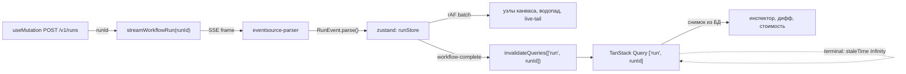

# 15. Studio: фронтенд

> Статус: draft
> Зависит от: [02. Архитектура](02-architecture.md), [10. Рантайм](10-runtime.md), [09. Модель контекста](09-context-model.md), [08. Промты](08-prompts.md), [19. Безопасность и политики](19-security-and-policies.md), [ADR-0017](adr/0017-files-as-source-of-truth.md), [ADR-0024](adr/0024-studio-on-vite.md)
> Источники: `research/nextjs-shell.md`, `research/design-system.md`, `research/graph-canvas.md`, `research/api-layer.md`, `research/00-verified-by-lead.md`; спека §11, §12, §14, §15

## Зачем этот слой

Studio — единственная поверхность, где человек видит то же, что видит агент: граф, прогон, провенанс
каждого значения, диффы версий. Он закрывает пробел «непрозрачность исполнения» из §8: без экрана,
на котором виден вход узла с источником, отрисованный промт и сработавшее правило, доверие к
воркфлоу не проверяемо, а только декларируется. Фронтенд не владеет ни одной бизнес-операцией:
любая правка идёт теми же операциями контракта, что и правка от агента (спека §14.1).

## Решения

| Решение | Что берём | Версия | Лицензия | Почему |
|---|---|---|---|---|
| Модель приложения | SPA; статический бандл `apps/studio/dist` и `/api` отдаёт `aqven dev` с одного порта | — | — | [ADR-0024](adr/0024-studio-on-vite.md): локальному инструменту RSC, Server Actions и `proxy.ts` ничего не дают; `next` 16.3.4 отвергнут |
| Сборка | `vite` + `@vitejs/plugin-react` + `@rolldown/plugin-babel` с `reactCompilerPreset` | 8.3.0 / 6.1.1 / 0.2.4 | MIT | React Compiler без Next; Vitest 5 и Studio на одном Vite-конфиге |
| Маршруты | `@tanstack/react-router` + `@tanstack/router-plugin`, файловые маршруты | 1.170.36 / 1.168.38 | MIT | типизированные `params` и search-параметры; `autoCodeSplitting` режет бандл по маршрутам |
| UI-рантайм | `react` | 19.3.0 | MIT | DECISIONS; `<Activity>` и View Transitions нужны инспектору |
| Стили | `tailwindcss` + `@tailwindcss/vite` (CSS-first, без `tailwind.config.js`) | 4.3.3 | MIT | семантические токены как CSS-переменные — единственный источник истины для CSS, канваса и чартов |
| Компоненты | shadcn/ui через CLI `shadcn`, стиль `radix-nova` | 4.21.0 | MIT | код в репозитории, а не зависимость; свой namespace-реестр для доменных компонентов |
| Серверный кэш | `@tanstack/react-query` | 5.102.8 | MIT | единственный владелец серверных данных на клиенте |
| Таблицы | `@tanstack/react-table` + `@tanstack/react-virtual` | 9.2.4 / 3.14.12 | MIT | DECISIONS; v9 — другой API, см. §2 |
| Локальное состояние | `zustand` | 5.0.15 | MIT | высокочастотное и «моё личное» состояние вида |
| Состояние в URL | search-параметры `@tanstack/react-router` через `validateSearch` | 1.170.36 | MIT | ссылка на срез/узел/вкладку обязана работать; типы параметров выводятся из схемы, `nuqs` не нужен |
| Локализация | `use-intl`, локали `en`, `ru` | 4.14.5 | MIT | ICU-сообщения и API next-intl без привязки к фреймворку |
| Чат | `@assistant-ui/react` + `@assistant-ui/react-markdown`, `useLocalRuntime` | 0.15.20 / 0.14.15 | MIT | готовые примитивы треда; `ai` и `@ai-sdk/*` в Studio не импортируются |
| Канвас | `@xyflow/react` | 12.11.6 | MIT | React-компоненты внутри узлов = продуктовый UI на тех же токенах |
| Раскладка | `elkjs` в web worker | 0.12.0 | **EPL-2.0 OR GPL-3.0-or-later** | единственный, кто умеет вложенность И порты; лицензия — открытый вопрос ОВ-1 |
| Клиент API | `openapi-fetch` поверх `openapi-typescript` | 0.17.0 / 7.13.0 | MIT | контракт = OpenAPI 3.1 control plane, не TS-типы по проводу |
| Стриминг прогона | `eventsource-parser` + свой `fetch`-обёртка | 4.1.0 | MIT | нативный `EventSource` — GET-only и без заголовков |
| Редактор | CodeMirror 6 (`@codemirror/*`), своя обёртка | state 6.7.4 / view 6.43.11 | MIT | TS language service Monaco не нужен, диагностика приходит от компилятора; противоречие заметок — ОВ-2 |
| Рантайм-формы | `@rjsf/core` + `@rjsf/validator-ajv8` + `@rjsf/shadcn` | 6.10.0 | Apache-2.0 | единственный живой генератор UI из JSON Schema |
| Статические формы | `react-hook-form` + `zod` | 7.87.0 / 4.6.2 | MIT | схема известна на сборке — генератор не нужен |
| Тема | класс `.dark` на `<html>`, inline-скрипт в `index.html`, свой провайдер | — | — | в SPA нет гидрации серверного HTML; `next-themes` 0.4.6 не ставим, см. §8.4 |
| Шрифты | `@fontsource-variable/geist` + `@fontsource-variable/geist-mono` | 5.3.0 | OFL-1.1 | самохостинг импортом в CSS, без `next/font` |

## 1. Архитектура приложения: SPA на Vite

### 1.1. Правило границы

**У каждой поверхности ровно один владелец данных на клиенте: TanStack Query (REST/SSE к API `aqven dev`)
либо локальный стор. Смешивать владение на одних и тех же данных запрещено.**

Серверного рендера нет ([ADR-0024](adr/0024-studio-on-vite.md)). `aqven dev` отдаёт статический бандл
`apps/studio/dist` и `/api` с одного порта, любой путь вне `/api` получает `index.html`. В разработке
UI Vite dev-сервер проксирует `/api` на `aqven dev`.

Граница проходит по частоте изменения и по тому, кто инициирует изменение:

| Признак поверхности | Владелец | Транспорт чтения | Транспорт записи |
|---|---|---|---|
| Меняется только по действию человека, живёт долго (реестры, версии, датасеты) | TanStack Query | `loader` маршрута → `queryClient.ensureQueryData`, дальше `useQuery` | `useMutation` → `await invalidateQueries` до закрытия формы (read-your-writes) |
| Меняется сама, без участия вкладки (прогон, очередь, шина событий) | TanStack Query | `useQuery` + SSE-дельты | `useMutation` → `invalidateQueries` |
| Меняется чаще ~10 раз/сек (вьюпорт, drag, hover, набор в редакторе) | клиент, вне React-дерева данных | внутренний стор библиотеки / zustand | — |

Обоснование «SPA, а не RSC»:

- RSC-heavy не годится для §11: отладчик меняется несколько раз в секунду, каждый ре-рендер — сетевой
  round-trip; канвас — 60 fps pointer-события и раскладка в воркере, серверу там делать нечего.
  Главный козырь RSC (готовый HTML без JS для анонима) не монетизируется: Studio — внутренний
  инструмент без SEO.
- Прежние возражения против SPA сняты: разбиение пяти тяжёлых подсистем (канвас, ELK-воркер, редактор,
  таблицы, чарты) по маршрутам даёт `autoCodeSplitting` плагина роутера, предзагрузку —
  `defaultPreload: 'intent'`, мутации идут одним путём — типизированным HTTP. Проверка прав живёт в
  хендлерах API ([19. Безопасность](19-security-and-policies.md) §7), UI отражает `403` как состояние
  экрана; проверка до отрисовки нужна только размещённому мультитенантному режиму, который вне
  приоритета.

### 1.2. Карта маршрутов

Файловые маршруты `@tanstack/router-plugin` в `apps/studio/src/routes/`; дерево `routeTree.gen.ts`
генерирует плагин.

| Маршрут | Что делает | Владелец данных |
|---|---|---|
| `__root.tsx` | провайдеры: `QueryClientProvider`, `IntlProvider` (`use-intl`), `TooltipProvider`, тема; ничего не фетчит | — |
| `$workspaceId/route.tsx` | layout: навигация, флаги; `loader` → `ensureQueryData(['ws', id])` | Query |
| `.../workflows` | список; фильтры в `validateSearch` → ключ Query | Query |
| `.../workflows/$id` | `loader` кладёт IR в кэш один раз; канвас — ленивый чанк | Query → zustand-документ |
| `.../runs` | фильтры в `validateSearch` → ключ Query | Query |
| `.../runs/$runId` | **снимок** — Query, дельты — SSE. Терминальный прогон `staleTime: Infinity`, живой — `staleTime: 0` | Query + `runStore` |
| `.../prompts/$templateId` | `loader` грузит шаблон и фикстуры; редактор — ленивый чанк | Query |
| `.../registry/$kind` (`types\|models\|agents\|tools`) | правка — `useMutation` + `invalidateQueries(['registry', kind])` | Query |
| `.../evals/*` | списки и виртуализованные таблицы результатов | Query |
| `.../tasks/$taskId` | JSON Schema + контекст; сабмит — `useMutation` → resume воркфлоу | Query |
| `.../versions/compare` | пара версий в search-параметре `?diff=` | Query |

`proxy.ts` и `app/api/[...path]` исчезли вместе с Next: `/api` отдаёт тот же процесс, что и статику,
поэтому клиент ходит в API с того же origin без прокси-слоя; в `vite dev` эту роль играет
`server.proxy` в `vite.config.ts`.

Ленивые чанки — `React.lazy(() => import(...))` под `<Suspense fallback={<Skeleton />}>`: канвас, модуль
ELK-раскладки, CodeMirror, водопад, виртуализованные таблицы, live-tail логов. Suspense здесь ждёт
загрузку чанка, а не данных.

### 1.3. Дерево Suspense-границ

Правила:

1. Одна граница на один независимо загружающийся регион, не одна на страницу.
2. Граница ставится **выше** ленивого чанка или `useSuspenseQuery`. Ожидание `loader` — это
   `pendingComponent` маршрута с `pendingMs`, а не граница вокруг всей страницы.
3. `fallback` — скелет, а не спиннер: при `defaultPreload: 'intent'` загрузка обычно заканчивается до
   клика, а когда не успела, скелет держит геометрию региона. Спиннер в fallback = прыжок раскладки.

Нарезка `/runs/$runId`: шапка прогона (id, статус, версия спеки) в layout без границы;
далее четыре независимые границы — граф прогона (скелет = серая сетка узлов), инспектор узла
(каркас вкладок), водопад, лог/трасса.

### 1.4. Сборка

| Настройка | Где | Почему | Что заменила в Next |
|---|---|---|---|
| `babel({ presets: [reactCompilerPreset()] })` | `vite.config.ts` | канвас, таблицы и отладчик иначе обмазываются `memo`/`useMemo` руками; Rust-порт (`react({ compiler: true })` + `oxc-transform-react`) помечен experimental — не берём | `reactCompiler: true`, `turbopackRustReactCompiler` |
| `tanstackRouter({ target: 'react', autoCodeSplitting: true })` **перед** `react()` | `vite.config.ts` | файловые маршруты и разбиение по маршрутам; при обратном порядке генерация и разбиение молча не работают | App Router, route-level splitting |
| `defaultPreload: 'intent'` | `createRouter` | чанк и `loader` маршрута грузятся по наведению на ссылку | `partialPrefetching` |
| `server.proxy['/api']` → `aqven dev` | `vite.config.ts` | один origin в разработке, без CORS | `app/api/[...path]` |
| `@tailwindcss/vite` | `vite.config.ts` | Tailwind v4 без PostCSS-конфига | `@tailwindcss/postcss` |

Что заложить в скелет сразу: `declare module '@tanstack/react-router' { interface Register { router: typeof router } }` —
без него `Link`, `useSearch` и `useParams` теряют типы; `routeTree.gen.ts` исключён из линта
(`globalIgnores`); `react-refresh/only-export-components` выключен для `src/routes/**` и
`src/components/ui/**`, иначе файлы маршрутов с экспортом `Route` ломают правило. Флагов
`cacheComponents` и `useOffline` в SPA нет.

## 2. Стек: версии и лицензии

Все версии проверены `npm view` на 2026-09-11; строки сборки, маршрутов, локализации, чата, шрифтов,
линта, `cn` и `lucide-react` — на 2026-09-16 ([ADR-0024](adr/0024-studio-on-vite.md)). Пин точный,
диапазоны не используем.

| Пакет | Версия | Лицензия | Роль | Примечание |
|---|---|---|---|---|
| `vite` | 8.3.0 | MIT | сборка и dev-сервер | Node `^20.19.0 \|\| >=22.12.0`; `server.proxy['/api']` на `aqven dev` |
| `@vitejs/plugin-react` | 6.1.1 | MIT | JSX, Fast Refresh, `reactCompilerPreset` | peer `vite ^8` |
| `@rolldown/plugin-babel` + `babel-plugin-react-compiler` | 0.2.4 / 1.0.0 | MIT | React Compiler через Babel | peer `@babel/core ^7.29.0 \|\| ^8.0.0-rc.1` |
| `react` / `react-dom` | 19.3.0 | MIT | рантайм | `<Activity>`, View Transitions |
| `@tanstack/react-router` | 1.170.36 | MIT | маршруты, search-параметры | `validateSearch` принимает Standard Schema — схема zod 4 без адаптера |
| `@tanstack/router-plugin` | 1.168.38 | MIT | файловые маршруты, `routeTree.gen.ts`, `autoCodeSplitting` | peer `@tanstack/react-router ^1.170.36`; в `plugins` строго перед `react()` |
| `use-intl` | 4.14.5 | MIT | локализация `en`, `ru` | ядро next-intl без Next |
| `@assistant-ui/react` / `@assistant-ui/react-markdown` | 0.15.20 / 0.14.15 | MIT | чат-панель | `useLocalRuntime` с адаптером модели; модельный SDK не импортируется |
| `remark-gfm` / `tw-shimmer` | 4.0.1 / 0.4.13 | MIT | GFM в сообщениях чата, класс `shimmer` у активных блоков reasoning и тулов | зависимости компонентов assistant-ui |
| `tailwindcss` + `@tailwindcss/vite` | 4.3.3 | MIT | стили | конфиг в CSS, `tailwind.config` отсутствует; Vite-плагин вместо PostCSS |
| `shadcn` (CLI) | 4.21.0 | MIT | генерация компонентов | `style: radix-nova`, `baseColor: neutral`, `cssVariables: true`, `rsc: false` |
| `radix-ui` (единый пакет) | 1.6.7 | MIT | примитивы под shadcn | заменил россыпь `@radix-ui/react-*` |
| `cn` | 0.3.0 | MIT | склейка классов | **заменяет `clsx` + `tailwind-merge`**, их не ставим |
| `class-variance-authority` | 0.7.1 | **Apache-2.0** | варианты компонентов shadcn | |
| `tw-animate-css` | 1.4.0 | MIT | CSS-анимации компонентов shadcn | импорт в `src/index.css` |
| `lucide-react` | 1.46.0 | ISC | иконки | мажор v1 |
| `@fontsource-variable/geist` / `@fontsource-variable/geist-mono` | 5.3.0 | OFL-1.1 | шрифты | импорт в `src/index.css`, без сети на старте |
| `@tanstack/react-query` | 5.102.8 | MIT | серверный кэш | |
| `@tanstack/react-table` | 9.2.4 | MIT | таблицы | **v9, не v8**: `useTable`, `features`, `table.FlexRender` |
| `@tanstack/react-virtual` | 3.14.12 | MIT | виртуализация | 1D и 2D, динамические высоты |
| `zustand` | 5.0.15 | MIT | локальное состояние | `persist` для настроек вида |
| `@xyflow/react` | 12.11.6 | MIT | канвас | целиком MIT, Pro — только примеры и поддержка |
| `elkjs` | 0.12.0 | **EPL-2.0 OR GPL-3.0-or-later** | раскладка | единственная не-MIT зависимость фронта, ОВ-1 |
| `openapi-fetch` | 0.17.0 | MIT | клиент API | ~2 КБ, без кодогена в рантайме |
| `openapi-typescript` | 7.13.0 | MIT | генерация типов в CI | понимает OpenAPI 3.0 и 3.1 |
| `eventsource-parser` | 4.1.0 | MIT | парсер SSE-фрейминга | фолбэк — `@microsoft/fetch-event-source@2.0.1` |
| `@codemirror/state` / `view` / `language` / `autocomplete` / `lint` / `commands` / `search` | 6.7.4 / 6.43.11 / 6.12.4 / 6.20.3 / 6.9.7 | MIT | редактор | без `@uiw/react-codemirror` |
| `@codemirror/lang-json` | 6.0.2 | MIT | JSON/IR | + `jsonParseLinter` |
| `@rjsf/core` / `@rjsf/utils` / `@rjsf/validator-ajv8` / `@rjsf/shadcn` | 6.10.0 | Apache-2.0 | формы из JSON Schema | релиз 2026-09-09 |
| `react-hook-form` | 7.87.0 | MIT | статические формы | |
| `@hookform/resolvers` | 5.9.1 | MIT | резолверы | `standard-schema` для zod 4, `ajv` для JSON Schema |
| `ajv` | 8.20.0 | MIT | валидация на границе | по DECISIONS ajv — только границы, zod — горячий путь |
| `recharts` | **3.8.0 (пин из `shadcn/chart`)** | MIT | чарты | latest 3.10.1 **не ставить руками** |
| `@visx/heatmap` / `@visx/scale` / `@visx/group` | 4.0.0 | MIT | хитмап согласия судей | Recharts heatmap не умеет |
| `react-diff-viewer-continued` | 4.4.0 | MIT | текстовый side-by-side дифф | поддерживаемый форк мёртвого `react-diff-viewer` |
| `jsondiffpatch` | 0.7.6 | MIT | структурный дифф JSON/YAML | форматтеры — суб-экспорты `jsondiffpatch/formatters/*` |
| `rfc6902` | 5.3.0 | MIT | генерация JSON-Patch на запись | |
| `json-edit-react` | 1.30.2 | MIT | просмотр и правка JSON с аннотациями | `customNodeDefinitions`, без MUI |
| `react-resizable-panels` | 4.12.4 | MIT | сплиты панелей | shadcn `resizable` уже на `^4`, есть `autoSaveId` |
| `react-hotkeys-hook` | 5.3.3 | MIT | хоткеи | `HotkeysProvider` + scopes |
| `cmdk` | 1.1.1 | MIT | командная палитра | тишина ~12.5 мес — риск под наблюдением |
| `sonner` | 2.0.8 | MIT | тосты | `toast`/`use-toast` из реестра удалены |
| `graphology` + `graphology-dag` + `graphology-traversal` | 0.26.0 / 0.4.1 / 0.3.1 | MIT | графовые алгоритмы | помечаем `unmaintained-but-stable`; ~300 строк используемого кода |
| `@playwright/test` | 1.63 | Apache-2.0 | e2e | DECISIONS |
| `vitest` | 5.0.0 | MIT | unit | DECISIONS |
| `fast-check` | — | MIT | property-based | DECISIONS |
| `eslint` + `typescript-eslint` + `eslint-plugin-react-hooks` + `eslint-plugin-react-refresh` | 10.10.0 / 8.70.0 / 7.1.1 / 0.5.7 | MIT | линт `apps/studio` | без `eslint-config-next`; `no-restricted-imports` на `next`, `ai`, `@ai-sdk/*`, `@openrouter/*` |

**Не берём и почему:** `next` 16.3.4, `nuqs` 2.10.1, `next-themes` 0.4.6 ([ADR-0024](adr/0024-studio-on-vite.md):
SPA на Vite; состояние в URL — `validateSearch`, тема — §8.4),
`@monaco-editor/react` (CDN-загрузка по умолчанию, TS language service не нужен — §11.1),
`@textea/json-viewer` (тянет MUI — вторая дизайн-система), `@autoform/*` (генерирует из zod, а тема
shadcn мертва с 2024-10), `@nivo/*` (15 мес тишины), `diff2html` (HTML-строка вне токен-системы),
`drawer`/`vaul` кроме реально мобильных шторок (релиз 2024-12), `clsx` и `tailwind-merge` (их заменил `cn`),
`zod-to-json-schema` (встроен `z.toJSONSchema`), ECharts в v1 (+1 МБ и вторая система тем; держим за
фича-флагом для scatter > 5k точек и boxplot).

**Чего в реестре `@shadcn` нет — не планировать фичи на этих именах:** `data-table` (есть только
example-рецепт под TanStack Table v8), `tree`, `timeline`, `stepper`, `code-block`, `json-viewer`,
`diff`, `multi-select`, `date-range-picker`, `typography`, `toast`, `questionnaire`.

## 3. Разделение состояния: три правила

Правила применяются по порядку, первый сработавший выигрывает.

1. **Можно дать ссылку коллеге, и он увидит то же самое?** → URL, search-параметры маршрута
   (`validateSearch` у `@tanstack/react-router`).
2. **Обновляется чаще ~10 раз/сек или это «мои настройки вида»?** → `zustand` (+ `persist` для настроек).
3. **Источник истины на сервере и может измениться без меня?** → TanStack Query.

**Данные не дублируются между хранилищами.** Дублирование даёт рассинхрон, который в отладчике
выглядит как баг платформы, а не как баг UI.

### 3.1. Что где

| Состояние | Хранилище | Ключ / параметр | Примечание |
|---|---|---|---|
| Вьюпорт канваса (`x,y,zoom`), drag, рамка выделения, hover, рисуемое соединение | внутренний стор React Flow | — | доступ снаружи только через `useReactFlow()` / `useStore(selector)` |
| Первичный выделенный узел | search-параметр | `?node=<nodeId>` | `navigate({ search: (prev) => ({ ...prev, node }), replace: true })`; без этого ссылка «посмотри этот узел» не работает |
| Мультивыделение, локальные раскрытия подворкфлоу, режим канваса до фиксации | zustand | — | слишком волатильно для URL |
| Режим просмотра графа прогона | search-параметр | `?view=aggregated\|expanded` | поле `view: z.enum(['aggregated','expanded']).catch('aggregated')` в схеме `validateSearch` |
| Группировка по стадиям | search-параметр | `?group=stage` | часть «что я показываю» |
| Результат ELK-раскладки | не состояние | — | derived data: worker → мемоизация по хешу IR → `useRef` |
| Снимок прогона и результаты узлов | Query | `['run', runId]` | терминальный: `staleTime: Infinity`; живой: `staleTime: 0` **без polling** |
| Дельты живого прогона | Query через `setQueryData` | `['run', runId]` | применяются из SSE, см. §4.3 |
| Точки останова | Query + мутация | `['run', runId, 'breakpoints']` | это **серверное** состояние рантайма; в zustand нельзя — после релоада прогон встанет не там, где показывает UI |
| Черновик правки входа для replay | `react-hook-form` | — | на сервер только при сабмите |
| Заморозка выходов верхних узлов | zustand | `frozen: Set<nodeId>` | до сабмита replay |
| Открытая вкладка инспектора | search-параметр | `?tab=prompt\|raw\|checks\|cost` | |
| Раскрытые строки водопада, высоты панелей, «показывать свёрнутые повторы» | zustand + `persist` | localStorage | личная настройка рабочего места |
| Фильтры, сортировка, курсор пагинации всех таблиц | search-параметры | `status`, `node`, `q`, `cursor` | `q` — дебаунс 300 мс до `navigate({ replace: true })`; в `loaderDeps` только параметры, от которых зависит `loader`, иначе каждый символ `q` перезапускает загрузку маршрута |
| Ключ запроса таблицы | Query, **выводится** из `useSearch()` | `['runs', filters]` | зеркалировать фильтры в zustand запрещено |
| Выделенные строки для батч-действий | zustand | эфемерно | |
| Открытость/размеры панелей | zustand + `persist`, `autoSaveId` у `react-resizable-panels` | per-screen | |
| Открытость инспектора | **выводится** из наличия `?node=` | — | отдельный флаг = два источника истины и мигание |
| Шаримые модалки (дифф версий) | search-параметр | `?diff=v12..v15` | не `useState` |

### 3.2. Данные прогона и узлы канваса

Отдельное правило, нарушение которого убивает производительность мгновенно: **статус, стоимость и
латентность узла не прокидываются через `node.data`.** React Flow ре-рендерит узел по ссылочному
неравенству `data`, а эти поля обновляются стримом. Они живут в отдельном zustand-сторе прогона,
компонент узла читает их через `useStore(selector, shallow)` или `useNodesData(nodeId)`.

## 4. Данные и стриминг

### 4.1. Клиент из OpenAPI

Источник истины — `@aqven/contracts` (zod-схемы домена). Control plane объявляет операции через
`createRoute` из `@hono/zod-openapi@1.6.3` и отдаёт OpenAPI 3.1 (`app.doc31`). В CI генерируем типы и
коммитим их; расхождение сгенерированного файла с коммитом — красный билд, это и есть гейт на дрейф
контракта.

```
@aqven/contracts ──> createRoute() ──> GET /openapi.json (3.1)
              └─> z.toJSONSchema() ─> MCP tool inputSchema
GET /openapi.json ──openapi-typescript@7.13.0 (CI)──> @aqven/api-types/schema.d.ts
Studio ──openapi-fetch createClient<paths>()──> типизированный fetch
```

```ts
import createClient from "openapi-fetch";
import type { paths } from "@aqven/api-types";

export const api = createClient<paths>({ baseUrl: "/api" });
```

Браузер ходит в `/api` того же origin: статику и API отдаёт один процесс `aqven dev`
([ADR-0024](adr/0024-studio-on-vite.md)), прокси-слоя между ними нет; в `vite dev` запрос проксирует
`server.proxy`. Локальный `aqven dev` слушает только `127.0.0.1`. Прежний BFF `app/api/[...path]`, который
читал сессию better-auth из HttpOnly-cookie и подставлял `Authorization: Bearer`, исчез вместе с Next;
чем его заменить в режиме `hosted` — ОВ-18.

Мутации, которых **нет** в MCP-контракте (переименовать вкладку, сохранить раскладку панелей), и сабмит
human-задач идут тем же типизированным HTTP; второго транспорта (прежде — Server Actions) нет. Всё, что
должен уметь агент, доступно единственным способом.

### 4.2. SSE прогона: почему не нативный `EventSource`

Канал прогона — `POST /workflows/:id/stream` у `@voltagent/server-hono@2.0.14` на том же origin, что
и Studio. Нативный `EventSource` не годится по двум причинам сразу: он GET-only (а запуск прогона
несёт тело), и он не умеет заголовков, то есть не может передать `Authorization`. Берём
`eventsource-parser@4.1.0` — парсер только SSE-фрейминга — и тонкую обёртку на `fetch` +
`ReadableStream`. Фолбэк, если не захочется писать reconnect самим, — `@microsoft/fetch-event-source@2.0.1`
(POST, заголовки, retry, `Last-Event-ID` из коробки).

WebSocket-эндпоинты VoltAgent (`/ws`, `/ws/logs`, `/ws/observability`) **наружу не выставляем**:
документация пакета прямо говорит, что они не аутентифицированы. Живые логи в фазе 0 берём из того же
SSE-потока плюс REST-поллинг observability; свой WS-прокси с проверкой сессии — отдельное решение фазы 1.

Каждое SSE-событие парсится zod-схемой `RunEvent` **на клиенте**: поток приходит из чужого рантайма и
это реальная граница доверия. Тип события VoltAgent (`WorkflowStreamEvent`): `type` ∈ `workflow-start`,
`step-start`, `step-complete`, `step-error`, `step-suspend`, `workflow-suspended`, `workflow-complete`,
`workflow-cancelled`, `workflow-error`, `custom`; поля `executionId`, `from`, `stepIndex`, `stepType`,
`input`, `output`, `status`, `timestamp`, `metadata`, `error`. HTTP-стрим дополнительно шлёт финальный
`workflow-result`.

### 4.3. Как события уживаются с кэшем запросов



Разделение ответственности между стором и кэшем:

| Что | Куда | Почему |
|---|---|---|
| Поток событий шагов (сотни за прогон) | zustand `runStore`, батч по `requestAnimationFrame` | ре-рендер всего кэша на каждое событие затопит React; прогон на 50 узлов иначе неиграбелен |
| Производные для узлов канваса (статус, стоимость, длительность) | селекторы над `runStore` | см. §3.2 |
| Канонический результат прогона | Query `['run', runId]` | единственный источник истины — сервер, а не стрим |
| Точечные дельты, которые не хочется ждать до конца прогона | `queryClient.setQueryData(['run', runId], applyDelta)` | без polling: события и так идут |

Поллинг живого прогона запрещён: рефетч полного снимка на каждое событие бьёт и по клиенту, и по
бэкенду, а события идемпотентны по `(executionId, seq)`.

Реконнект: повтор запроса с `Last-Event-ID`. Если сервер не поддержал возобновление — читаем срез
состояния `GET /v1/runs/:id` и продолжаем; идемпотентность событий делает это безопасным.
`@voltagent/resumable-streams` уже зависимость `server-hono`, его точный API — ОВ-9.

### 4.4. Инвалидация после мутаций

| Мутация | Действие |
|---|---|
| Правка реестра (типы, модели, агенты, тулы) | `useMutation` → `await invalidateQueries(['registry', kind])` до закрытия формы — read-your-writes: человек видит своё изменение сразу |
| Запуск прогона | `useMutation` → `invalidateQueries(['runs', 'active'])` освежает только счётчик активных прогонов в шапке, снимки завершённых прогонов не трогает |
| Replay узла / fork с узла k | `useMutation` → при успехе либо `invalidateQueries(['run'])`, либо навигация на новый `runId` |
| Патч документа воркфлоу (`flow_patch` с `base_rev`) | оптимистичное применение в zustand-документе, при `409 conflict` — откат и показ серверной ревизии |
| Публикация версии, аппрув, откат | `invalidateQueries(['flow', id])` |

## 5. Карта экранов (§14)

Имена в строках «shadcn» проверены по реестру `@shadcn` на 2026-09-11 и существуют. Строка «своё» —
то, чего в реестре нет; эти компоненты уезжают в наш namespace-реестр `@aqven` (§9).

### 5.1. Канвас (§14.1)

- **Назначение:** стадии и свёрнутые подворкфлоу, типизированные порты, линии привязок, ошибки
  компиляции прямо на узлах. Правка идёт теми же операциями, что у агента.
- **Взаимодействия:** пан/зум, выбор узла (`?node=`), раскрытие компонента, перекладка ELK по изменению
  IR, палитра «добавить узел» (⌘K), протяжка связи с локальной валидацией порта, контекстное меню узла,
  переход «узел → инспектор» через View Transition.
- **shadcn:** `resizable`, `sidebar`, `button-group`, `toggle-group`, `tooltip`, `context-menu`,
  `hover-card`, `popover`, `badge`, `command`, `kbd`, `separator`, `empty`, `alert`.
- **Внешнее:** `@xyflow/react`, `elkjs` (worker), `graphology-dag` (`willCreateCycle`).
- **Своё:** `StageNode`, `SubworkflowNode`, `TypedPort`, `BindingEdge`, `CompileErrorOverlay`, `MiniMapLegend`.
- **Данные:** `loader` маршрута кладёт IR и диагностику компилятора в кэш Query один раз; далее документ
  живёт в zustand, патчи — `flow_patch` с `base_rev`.

### 5.2. Отладчик прогона (§14.2, §11)

Устройство разобрано отдельно в §7.

- **shadcn:** `resizable`, `tabs`, `scroll-area`, `accordion`, `collapsible`, `badge`, `progress`,
  `spinner`, `alert`, `separator`, `tooltip`, `button-group`, `kbd`, `empty`, `skeleton`.
- **Внешнее:** `@tanstack/react-virtual`, `json-edit-react`, `react-diff-viewer-continued`, `@xyflow/react`.
- **Своё:** `RunTimeline`, `StepStatusDot`, `TokenCostMeter`, `RetryLadder`, `BreakpointGutter`, `StreamTail`.
- **Данные:** снимок — Query `['run', runId]`; дельты — SSE; трассы — `langfuse.api.trace.get` /
  `api.observations.getMany` через control plane.

### 5.3. Реестр типов (§14.3)

- **Назначение:** поиск использования типа и анализ влияния правки.
- **Взаимодействия:** поиск, переход к использованию, «кто сломается, если изменить поле».
- **shadcn:** `table`, `input-group`, `command`, `item` + `item-group`, `badge`, `hover-card`, `tabs`,
  `sheet`, `empty`, `pagination`.
- **Внешнее:** `@tanstack/react-table@9` + `@tanstack/react-virtual`.
- **Своё:** `TypeSchemaView`, `UsageList`, `ImpactTree`.
- **Данные:** Query `['registry', 'types']`; правки — `useMutation` + `invalidateQueries`.

### 5.4. Реестр моделей (§14.3)

- **Назначение:** профили, возможности, лимиты, цепочки фолбэков, стоимость.
- **Взаимодействия:** правка профиля, включение возможности, перестановка цепочки фолбэков,
  подтверждение опасной правки.
- **shadcn:** `table`, `card`, `field` + `field-group`, `switch`, `native-select`, `badge`, `tooltip`,
  `dialog`, `alert-dialog`.
- **Своё:** `CapabilityMatrixCell`, `FallbackChain`, `PriceTierBadge`.
- **Данные:** Query `['registry', 'models']` + `useMutation`.

### 5.5. Реестры агентов и тулов (§14.3)

- **Назначение:** агенты — инструкции, параметры, привязанные тулы; тулы — закреплённые MCP-схемы и
  расхождение закреплённой схемы с живой.
- **Взаимодействия:** правка агента, просмотр JSON Schema тула, дифф `pinned` ↔ `live`, перезакрепление.
- **shadcn:** `item`, `card`, `tabs`, `form` + `field`, `textarea`, `select`, `slider`, `badge`,
  `accordion`, `collapsible`, `alert`, `hover-card`, `dialog`.
- **Внешнее:** `json-edit-react` (схема), `jsondiffpatch` (дрейф схемы).
- **Своё:** `AgentCard`, `ToolBindingList`, `McpSchemaPin`, `SchemaDriftBanner`.
- **Данные:** Query + `useMutation`; форма правки агента — RJSF, потому что набор полей задаётся схемой
  профиля модели в рантайме (§10).

### 5.6. Evals: датасеты (§14.4)

- **Назначение:** датасеты на узел и на воркфлоу, версии, сплиты `train/dev/test`.
- **Взаимодействия:** создать датасет из прогона одним действием, фильтрация, выбор строк, просмотр
  строки, назначение сплита.
- **shadcn:** `table`, `input-group`, `checkbox`, `dropdown-menu`, `sheet`, `progress`, `empty`, `pagination`.
- **Внешнее:** `@tanstack/react-table@9` + virtual (10k+ строк).
- **Своё:** `DatasetRowPreview`, `SplitBadge`.
- **Данные:** Query, курсорная пагинация, фильтры из search-параметров маршрута.

### 5.7. Evals: сравнение экспериментов, очередь разметки, калибровка судей (§14.4)

- **Назначение:** дельты по узлам с доверительными интервалами; ручная разметка; согласие судей.
- **Взаимодействия:** выбор пары экспериментов, переключение метрики, хоткеи вердикта `1/2/3` в очереди
  разметки, просмотр матрицы согласия, порог блокировки выпуска.
- **shadcn:** `chart` (+ блоки `chart-bar-multiple`, `chart-line-multiple`, `chart-tooltip-advanced`),
  `table`, `tabs`, `toggle-group`, `card`, `badge`, `radio-group`, `field-choice-card`, `textarea`,
  `button-group`, `kbd`, `progress`, `separator`, `alert-dialog`, `slider`, `tooltip`, `alert`.
- **Внешнее:** Recharts через `shadcn/chart`; `@visx/heatmap` + `@visx/scale` для хитмапа согласия
  (Recharts heatmap не умеет — это дисквалификация, а не неудобство); `react-hotkeys-hook` со scopes.
- **Своё:** `ExperimentDiffTable`, `WinLossTieBar`, `SignificanceBadge`, `AnnotationTask`,
  `SideBySideVerdict`, `QueueProgressRail`, `AgreementHeatmap`, `JudgeDriftChart`, `ConfusionCell`.
- **Данные:** Query; пороги гейта (weighted kappa ≥ 0.7, Krippendorff alpha ≥ 0.8) приходят с сервера
  вместе с результатом, на клиенте не пересчитываются.

### 5.8. Версии и семантический дифф (§14.5)

- **Назначение:** семантический дифф версий, доказательства, аппрув, откат, lineage.
- **Взаимодействия:** выбор пары версий (`?diff=v12..v15`), развернуть изменение до поля, посмотреть
  провенанс поля, аппрув с подтверждением, откат одной операцией, переход по lineage.
- **shadcn:** `tabs`, `resizable`, `card`, `badge`, `alert-dialog`, `avatar`, `separator`,
  `scroll-area`, `hover-card`.
- **Внешнее:** `jsondiffpatch` (delta), `rfc6902` (патч на запись), `react-diff-viewer-continued`
  (текстовые поля), `@xyflow/react` в read-only для lineage.
- **Своё:** `SemanticDiffTree`, `EvidencePanel`, `ApprovalGate`, `LineageGraph`, `VersionRail`.
- **Данные:** Query по паре версий из search-параметра `?diff=`.
- **Важно:** delta от `jsondiffpatch` рендерим **своим** React-компонентом, а не их HTML-форматтером —
  иначе дифф выпадает из токен-системы и не умеет показывать провенанс поля.

### 5.9. Журнал решений (§14.6)

- **Назначение:** какие решения приняты, кем, на каком основании.
- **Взаимодействия:** фильтр по дате/автору/типу, разворот обоснования, переход к версии.
- **shadcn:** `table`, `item`, `accordion`, `input-group`, `badge`, `calendar` + `popover`, `select`,
  `scroll-area`, `empty`.
- **Внешнее:** `@tanstack/react-table@9` + virtual.
- **Своё:** `DecisionEntry`, `DecisionFilterBar`, `RationaleExcerpt`.
- **Данные:** Query, курсор в search-параметрах.

### 5.10. Редактор шаблонов промтов (§14.7)

Устройство разобрано в §11.

- **shadcn:** `resizable` (три панели), `tabs`, `select`, `field`, `alert`, `badge`, `tooltip`, `button-group`.
- **Внешнее:** CodeMirror 6, `react-diff-viewer-continued`.
- **Своё:** `SlotDecorator`, `RenderPreview`, `FixturePicker`, `RenderDiffPane`.
- **Данные:** `loader` маршрута грузит шаблон и фикстуры в Query; отрисовка и диагностика — по HTTP к компилятору.

### 5.11. Граф контекста (§14.8)

- **Назначение:** потребности и источники, окрашенные по видам — статика, данные, база знаний,
  генерация, человек; главный сигнал экрана — непокрытая потребность.
- **Взаимодействия:** фильтр по виду источника и по стадии (по умолчанию не «весь граф сразу»),
  подсветка 1-hop соседей при hover с затемнением остального, переход к узлу-потребителю.
- **shadcn:** `sidebar`, `resizable`, `badge`, `tooltip`, `toggle-group`, `hover-card`.
- **Внешнее:** `@xyflow/react` + `elkjs` — тот же пакет `@aqven/graph-view`, другой пресет раскладки.
- **Своё:** `ContextKindLegend`, `NeedNode`, `SourceNode`, `UnsatisfiedNeedBadge`.
- **Кодировка:** форма + иконка + цвет одновременно (пять цветов на графе неразличимы, плюс дальтонизм):

| Вид | Форма | Иконка | Токен |
|---|---|---|---|
| статика | прямоугольник, сплошная рамка | `Lock` | `--color-ctx-static` |
| данные (БД/API) | прямоугольник со скошенным углом | `Database` | `--color-ctx-data` |
| база знаний (RAG) | скруглённый | `BookOpen` | `--color-ctx-knowledge` |
| генерация (LLM) | скруглённый, двойная рамка | `Sparkles` | `--color-ctx-generated` |
| человек | пунктирная рамка | `User` | `--color-ctx-human` |

Непокрытая потребность — красная пунктирная рамка и бейдж. Толщина ребра — частота использования;
пунктир — источник опциональный; двойное ребро — несколько источников (конфликт).

### 5.12. Карта промтов (§14.9)

- **Назначение:** какие шаблоны и фрагменты какими узлами используются, какие выходы в какие промты
  приходят, как собирается каждый промт.
- **Взаимодействия:** две проекции на одном экране — слева граф «фрагмент → шаблон → узел», справа
  панель сборки конкретного промта с подсвеченными слотами; клик по слоту ведёт к источнику.
- **shadcn:** `resizable`, `accordion`, `collapsible`, `item`, `badge`, `scroll-area`, `hover-card`, `breadcrumb`.
- **Внешнее:** `@aqven/graph-view` (пресет `elk.direction: 'DOWN'` — «сборка сверху вниз» читается лучше);
  для длинных списков использований — `@tanstack/react-virtual`.
- **Своё:** `PromptAssemblyTrace`, `FragmentUsageList`, `OutputToPromptEdge`.
- **Сквозное требование:** цвет слота = вид источника из §5.11. Две разные кодировки на двух экранах —
  это два языка, пользователь не свяжет их.

### 5.13. Матрица моделей (§14.10)

- **Назначение:** качество × цена × латентность по узлу, граница Парето.
- **Взаимодействия:** выбор осей, переключение узла, hover по точке конфигурации, выделение подмножества.
- **shadcn:** `chart`, `table`, `toggle-group`, `select`, `card`, `tooltip`, `badge`, `switch`.
- **Внешнее:** Recharts `ScatterChart` до ~1.5k точек; линия фронта — отдельный `Line`/`ReferenceLine`
  по вычисленному фронту. Lasso/brush-выделение конфигураций Recharts не умеет — это и есть триггер
  включить ECharts за фича-флагом.
- **Своё:** `ParetoFrontier`, `AxisPicker`, `ConfigScatterPoint`, `TradeoffCallout`.

### 5.14. Покрытие датасетов и таймлайны циклов (§14.11)

- **Назначение:** матрица «кейс × ветка/узел» с признаком покрытия; таймлайн итераций цикла.
- **Взаимодействия:** прокрутка матрицы по обеим осям, клик по ячейке → прогон, зум таймлайна,
  раскрытие итерации.
- **shadcn:** `table`, `progress`, `tooltip`, `badge`, `tabs`, `scroll-area`, `hover-card`,
  `toggle-group`, `slider`.
- **Внешнее:** `@tanstack/react-table@9` + **две** виртуализации (`useVirtualizer` по вертикали и
  `{ horizontal: true }` по горизонтали — колонок больше ~50).
- **Своё:** `CoverageMatrix`, `CoverageCell`, `UncoveredPathList`, `CycleTimeline`, `IterationLane`,
  `SpanBar`, `TimeAxis`.
- **Важно:** таймлайн пишем на CSS Grid и абсолютном позиционировании, а не чарт-библиотекой — см. §7.2.

### 5.15. Раскрытие компонентов до примитивов (§14.12)

- **Назначение:** любой компонент разворачивается до примитивов ядра прямо на канвасе.
- **Взаимодействия:** «развернуть/свернуть» из контекстного меню, breadcrumb глубины раскрытия,
  граница компонента как визуальный контейнер, перераскладка после раскрытия.
- **shadcn:** `context-menu`, `collapsible`, `breadcrumb`, `button-group`, `tooltip`.
- **Своё:** `ExpandToPrimitives`, `DepthBreadcrumb`, `CollapseBoundary`.
- **Механика:** см. §6.3 — это не UI-мелочь, а reducer над `{nodes, edges}` с перецепкой внешних рёбер.

### 5.16. Эффективная конфигурация вызова (§14.13)

- **Назначение:** итоговые настройки агента, происхождение каждого поля, дифф с определением агента.
- **Взаимодействия:** hover по полю → источник (`default → agent → node → run`), переключение
  «эффективная / определение», дифф.
- **shadcn:** `table` (мелкая статичная таблица — здесь нативный `<table>` уместен), `accordion`,
  `hover-card`, `badge`, `tabs`, `alert`.
- **Внешнее:** `json-edit-react` + `jsondiffpatch`.
- **Своё:** `EffectiveConfigView`, `ProvenanceBadge`, `OverrideChain`.
- **Связь с рантаймом:** `model` и `instructions` нельзя передать в опциях вызова VoltAgent, поэтому
  «эффективная конфигурация» — это то, что вернули динамические функции агента, прочитав контекст
  вызова (DECISIONS). Экран показывает именно результат их работы, а не гипотетический merge.

### 5.17. Экспорт (§14.14)

- **Назначение:** выбор цели экспорта, отчёт потерь, прогон конформанс-набора против воссозданной
  реализации.
- **Взаимодействия:** выбор цели, запуск экспорта с прогрессом, разворот отчёта потерь по пунктам,
  скачивание бандла, просмотр результата конформанс-прогона.
- **shadcn:** `dialog`, `radio-group`, `field-choice-card`, `alert`, `progress`, `table`, `badge`,
  `accordion`, `sonner`, `empty`.
- **Своё:** `ExportTargetPicker`, `LossReport`, `ConformanceRunReport`.
- **Данные:** запуск — мутация, прогресс — SSE того же формата, что прогон; ссылка на бандл —
  HTTP-эндпоинт API, отдающий поток.

### 5.18. Шелл (все экраны)

- **shadcn:** `sidebar` (за основу — блок `sidebar-15`: левая навигация + правая панель),
  `breadcrumb`, `command` + `command-dialog` (⌘K), `sonner`, `tooltip` (**один** `TooltipProvider`
  на корень с `delayDuration={200} skipDelayDuration={300}` — плотный UI), `dropdown-menu`, `avatar`,
  `kbd`, `separator`, `skeleton`, `spinner`.
- **Внешнее:** `react-hotkeys-hook` c `HotkeysProvider` и **scopes** — обязательны, иначе хоткеи
  канваса (`Del`, `⌘D`) стреляют внутри редактора шаблонов.
- **Своё:** `AppShell`, `GlobalCommandPalette`, `RunStatusIndicator`.

## 6. Канвас

### 6.1. Типизированные порты

Порт — это **данные**, а не разметка: тип порта нужен одновременно валидации соединения, раскладке ELK
и подсветке при протяжке. Узлы — дискриминированный union `Node<Data, TypeLiteral>`.

```ts
type PortKind = "data" | "control" | "error";
type Port = { id: string; kind: PortKind; schemaId: string; label: string };

export type LlmNode = Node<{ title: string; model: string; inputs: Port[]; outputs: Port[] }, "llm">;
export type ToolNode = Node<{ title: string; toolName: string; inputs: Port[]; outputs: Port[] }, "tool">;
export type GroupNode = Node<{ title: string; collapsed: boolean }, "group">;
export type AppNode = LlmNode | ToolNode | GroupNode;
```

Валидация соединения — два независимых уровня, оба есть в типах `@xyflow/react`:
проп `isValidConnection` на `<ReactFlow>` (глобальные правила — ацикличность) и проп
`isValidConnection` на самом `<Handle>` (совместимость конкретного порта). Логика совместимости живёт
рядом с портом, а не в одном большом предикате.

```ts
const canConnect: IsValidConnection = (c) => {
  const src = portIndex.get(handleKey(c.source, c.sourceHandle));
  const dst = portIndex.get(handleKey(c.target, c.targetHandle));
  if (!src || !dst) return false;
  if (src.kind !== dst.kind) return false;
  if (willCreateCycle(graph, c.source, c.target)) return false;
  return schemaCompatibility.get(pairKey(src.schemaId, dst.schemaId)) === true;
};
```

`isValidConnection` вызывается на **каждом** движении мыши при протяжке — она обязана быть синхронной и
чистой: схемы предрассчитаны в `Map`, zod внутрь не зовём. Ацикличность даёт готовый
`graphology-dag.willCreateCycle(source, target)` за O(V+E) — свой обход писать не нужно. Визуальная
обратная связь: React Flow сам ставит классы `.connecting`/`.valid` на handle, дополнительно
`useConnection()` даёт `{ inProgress, fromHandle, toHandle }` для подсветки совместимых портов.

### 6.2. Раскладка ELK

Раскладка — чистое преобразование `IR → ElkGraph → {nodes, edges}`, вынесенное из React (это же делает
её тестируемой без DOM, §12).

Опции корня (проверены запуском на реальных графах):

```ts
const rootLayoutOptions = {
  "elk.algorithm": "layered",
  "elk.direction": "RIGHT",
  "elk.layered.layering.strategy": "NETWORK_SIMPLEX",
  "elk.layered.nodePlacement.strategy": "BRANDES_KOEPF",
  "elk.layered.nodePlacement.bk.fixedAlignment": "BALANCED",
  "elk.edgeRouting": "ORTHOGONAL",
  "elk.hierarchyHandling": "INCLUDE_CHILDREN",
  "elk.layered.considerModelOrder.strategy": "NODES_AND_EDGES",
  "elk.layered.crossingMinimization.forceNodeModelOrder": "true",
  "elk.spacing.nodeNode": "60",
  "elk.layered.spacing.nodeNodeBetweenLayers": "90",
  "elk.spacing.edgeNode": "30",
  "elk.padding": "[top=48,left=24,bottom=24,right=24]",
  "elk.portConstraints": "FIXED_ORDER",
};

const groupLayoutOptions = {
  "elk.algorithm": "layered",
  "elk.hierarchyHandling": "INHERIT",
  "elk.padding": "[top=44,left=20,bottom=20,right=20]",
};
```

Почему именно так: `INCLUDE_CHILDREN` — единственный режим, при котором рёбра проходят сквозь границу
компонента (раскрытие §14.12 без него не работает); `ORTHOGONAL` совпадает геометрией со
`SmoothStepEdge`; `considerModelOrder` + `forceNodeModelOrder` дают стабильность между перекладками —
без них узлы «прыгают» при любой правке; `elk.padding.top` больше остальных — под заголовок группы.

Порты задаются как дети узла со стороной и индексом; индекс на стороне EAST идёт сверху вниз (0, 1, 2):

```ts
{ id: "a", width: 180, height: 56,
  layoutOptions: { "elk.portConstraints": "FIXED_ORDER" },
  ports: [
    { id: "a.in",  width: 8, height: 8, layoutOptions: { "elk.port.side": "WEST" } },
    { id: "a.err", width: 8, height: 8, layoutOptions: { "elk.port.side": "EAST", "elk.port.index": "0" } },
    { id: "a.ok",  width: 8, height: 8, layoutOptions: { "elk.port.side": "EAST", "elk.port.index": "1" } },
  ] }
```

**Маппинг результата.** Координаты детей ELK относительны родителю — это ровно модель React Flow
(`parentId` + относительный `position`), маппинг узлов 1:1 без пересчёта. Единственное реальное
несовпадение: рёбра внутри группы лежат в `group.edges` и их `sections` тоже относительны группе,
а React Flow держит рёбра плоским массивом в абсолютных координатах. Если рисуем кастомное ребро по
`sections`, нужно прибавить абсолютный оффсет цепочки предков. Не заметить это на плоском графе и
словить на первом раскрытии компонента — типовой сценарий.

**Worker.** elkjs даёт воркер из коробки, свой скрипт писать не надо:

```ts
import ELK from "elkjs/lib/elk-api";

const elk = new ELK({
  workerFactory: () =>
    new Worker(new URL("elkjs/lib/elk-worker.min.js", import.meta.url), { type: "classic" }),
});
```

`type: "classic"` обязателен — `elk-worker.min.js` не ESM. Модуль тянет ~1.4 МБ, поэтому весь модуль
раскладки грузится динамическим `import()` за `React.lazy` (§1.2), иначе попадает в initial bundle.
Отмены раскладки нет: дебаунс ~150 мс плюс generation-счётчик, устаревший результат игнорируется.
Измеренная стоимость (node, цепочки со скип-рёбрами и вложенными группами): 60 узлов — 81 мс,
200 — 76 мс, 500 — 146 мс, 1000 — 180 мс. ELK не узкое место; воркер нужен не ради этих чисел, а ради
плотных графов, где crossing minimization растёт нелинейно.

### 6.3. Вложенные узлы и раскрытие компонентов

Механика сворачивания компонента — чистый reducer над `{nodes, edges}`:

1. детям проставляется `hidden: true`, внутренним рёбрам — тоже;
2. габариты группы подменяются на свёрнутые;
3. рёбра, идущие наружу, **перецепляются на сам group-узел** — иначе они просто исчезают. Оригинальные
   концы хранятся в `edge.data.originalSource`/`originalTarget` и восстанавливаются при раскрытии;
4. после изменения числа или позиции `Handle` обязателен `useUpdateNodeInternals(id)` — иначе рёбра
   цепляются к старым координатам (частый баг именно при раскрытии);
5. в массиве `nodes` родитель обязан идти раньше детей, иначе React Flow бросает ошибку. После
   раскладки сортируем: сначала группы, потом дети.

`extent: 'parent'` запирает ребёнка внутри границы компонента — включаем в режиме редактирования и
выключаем на время раскладки.

### 6.4. Производительность

| Приём | Эффект |
|---|---|
| `nodeTypes`/`edgeTypes` объявлены **вне** компонента | новый объект на рендер = полный ремаунт всех узлов; это ошибка №1 в React Flow |
| Данные прогона не в `node.data`, а в zustand + `useStore(selector, shallow)` | узел ререндерится по ссылочному неравенству `data` |
| `React.memo` на каждом компоненте узла | — |
| `onlyRenderVisibleElements` | главный рычаг выше ~150 узлов; ниже — не включать (видны «доезжающие» узлы при пане) |
| `useNodesData(nodeId)` | подписка на данные одного узла без ререндера остальных |
| Отключить `animated: true` на рёбрах | CSS-анимация на каждом `path` |
| LOD: при `zoom < 0.5` прятать содержимое узла, оставлять прямоугольник | нужен только в диапазоне 500–1500 узлов |

Пороги: < 150 узлов — без ухищрений; 150–500 — приёмы выше; 500–1500 — плюс LOD и агрессивное
сворачивание; > 2000 одновременно видимых — уходить с DOM-рендера (кандидат — Cytoscape.js 3.34.3,
ценой отказа от React-компонентов внутри узлов). Для нашего продукта порог практически недостижим:
воркфлоу с 500 узлами в одном раскрытом виде — провал продуктового дизайна, а не технический предел.
Сигнал к миграции — не размер документа, а число одновременно видимых узлов после всех сворачиваний.

### 6.5. Режим только для чтения (фаза 0)

Спека §14: «в фазе 0 только просмотр и отладка; правка на канвасе — в фазе 3». Один набор пропов:

```tsx
<ReactFlow
  nodesDraggable={false}
  nodesConnectable={false}
  elementsSelectable={true}
  edgesFocusable={false}
  zoomOnDoubleClick={false}
  deleteKeyCode={null}
/>
```

`elementsSelectable` остаётся `true` — иначе нельзя кликнуть по узлу и открыть его спан, а это основной
сценарий фазы 0. Централизованный запрет изменений — через
`experimental_useOnNodesChangeMiddleware` / `experimental_useOnEdgesChangeMiddleware` (перехват
`NodeChange[]` до применения) вместо расстановки флагов по каждому узлу.

Контролируемый режим (`nodes` + `edges` + `onNodesChange`) включается уже в фазе 0, несмотря на
read-only: документ правит и человек, и агент через MCP, значит нужен единый source of truth,
undo/redo и оптимистичные апдейты. Uncontrolled (`defaultNodes`) не берём, чтобы не переписывать канвас
в фазе 3.

### 6.6. Переиспользование канваса

`@aqven/graph-view` — один пакет с пропами `{ nodes, edges, nodeTypes, layoutPreset }`. Три экрана
(канвас воркфлоу §5.1, граф контекста §5.11, карта промтов §5.12) — три пресета раскладки и три набора
`nodeTypes`. Ядро не трогается при добавлении нового вида графа: Open-Closed по пресетам.

Графовые алгоритмы живут в изоморфном `@aqven/graph-algos` и используются и сервером (валидация), и UI
(подсветка): топосорт, детект цикла и `willCreateCycle` — из `graphology-dag`; доминаторы
(Cooper-Harvey-Kennedy, ~40 строк), ancestor-check «B гарантированно до A» (~20 строк) и критический
путь поверх топосорта (~25 строк) — свои. Пакет `dominators@1.1.2` существует, но 4 года без релиза;
40 строк своего кода дешевле, чем зависимость в ядре доверия — это тот случай, когда правило
«не изобретать велосипед» не применяется.

## 7. Отладчик прогона

### 7.1. Устройство экрана

Четыре региона в `resizable`-сплитах, каждый под своей Suspense-границей (§1.3):

```
┌───────────────────────────────────────────────────────────┐
│ шапка: runId, статус, версия спеки, кнопки replay/fork     │  layout, без границы
├──────────────────────────────┬────────────────────────────┤
│ граф прогона (React Flow)    │ инспектор узла             │  границы #1 и #2
│ агрегированный / развёрнутый │ вкладки prompt/raw/checks/ │
│                              │ cost, провенанс входа      │
├──────────────────────────────┴────────────────────────────┤
│ водопад стоимости и латентности + ширина параллелизма      │  граница #3
├───────────────────────────────────────────────────────────┤
│ лог / трасса (live-tail, виртуализация, прилипание к низу) │  граница #4
└───────────────────────────────────────────────────────────┘
```

Выделение одно на весь экран и живёт в URL (`?node=`): клик по узлу графа, по строке водопада и по
строке лога подсвечивает одно и то же. Два независимых выделения — главный способ сделать отладчик
непонятным.

Два режима графа (спека §11): **агрегированный** — повторы свёрнуты, циклы нарисованы циклами
(back-edge, ELK раскладывает корректно); **развёрнутый** — каждый вызов отдельным узлом. Развёрнутый
режим обязан быть виртуализован: цикл на 200 итераций × 8 узлов — это 1600 элементов, плюс
`onlyRenderVisibleElements` на самом канвасе.

### 7.2. Водопад

**Водопад спанов — не чарт, а таблица с позиционированными полосками.** Нужны sticky-заголовки,
виртуализация на 1000+ спанов, раскрытие поддеревьев и синхронное выделение с канвасом — любая
чарт-библиотека здесь мешает. Пишем свой компонент: строка = узел, отступ = глубина, две полоски
(латентность и стоимость), позиционирование в процентах от окна прогона.

```ts
const left = ((span.start - run.startedAt) / runDuration) * 100;
const width = ((span.end - span.start) / runDuration) * 100;
```

`d3-scale@4.0.2` (ISC) берём только когда понадобятся тики, оси или log-шкала; до этого проценты
считаются тремя строками. Ширина параллелизма — sweep-line по отсортированным событиям `start`/`end`:
число активных спанов как step-график-спарклайн над водопадом, ~20 строк, библиотека не нужна.

Это сознательное расхождение с заметкой по дизайн-системе, где водопад предлагался как stacked
`BarChart` в Recharts — см. ОВ-3.

### 7.3. Инспектор узла с провенансом

Вкладки: вход с провенансом, отрисованный промт с подсветкой слотов, сырой ответ и распарсенный выход,
результаты проверок с ретраями и фолбэками, стоимость и латентность. Скрытые вкладки заворачиваем в
React `<Activity>`: DOM остаётся, эффекты чистятся, скролл и выделение в редакторе сохраняются — это
лучше и размонтирования, и ручного `display: none`.

Провенанс — боковая карта `JSONPointer → { kind, sourceStepId, ... }`, где `kind` ∈
`static | data | knowledge | generated | human`. Рендерим через `customNodeDefinitions` у
`json-edit-react`: собираем путь из `nodeData.path`, переводим в JSON Pointer, ищем в карте и рисуем
значение с бейджем семантического цвета (§8).

```tsx
customNodeDefinitions={[{
  condition: ({ path }) => provenance.has(toPointer(path)),
  element: ProvenanceValue,
  showOnView: true,
  showOnEdit: false,
  customNodeProps: { provenance },
}]}
```

Требование спеки «клик ведёт к источнику» реализуется как навигация `?node=<sourceStepId>&tab=raw` —
то есть провенанс работает и как ссылка, которую можно переслать.

Кнопка «Открыть в Langfuse» (`langfuse.getTraceUrl(traceId)`) — дешёвая страховка: всё, что мы не
отрисовали (сырые payload'ы, вложенные вызовы), доступно в один клик. Langfuse для нас — хранилище и
бэкенд чтения (`api.trace.get`, `api.observations.getMany`), UI — наш, потому что у Langfuse нет
понятий «цикл», «стадия», «свёрнутый повтор», «ширина параллелизма» и «провенанс значения».

### 7.4. Replay, заморозка, точки останова

| Действие | Механика |
|---|---|
| Replay узла с правкой входа | форма правки — RHF; сабмит — мутация, которая внутри зовёт `workflow.timeTravel({ executionId, stepId, inputData })` |
| Заморозка выходов верхних узлов | `frozen: Set<nodeId>` в zustand, уходит в запрос как часть `workflowStateOverride` |
| Replay всего прогона из записи | детерминизм обеспечивает replay-кэш как `LanguageModelMiddleware` (DECISIONS), не фронт |
| Fork с узла k | `timeTravelStream` → новый `executionId`, навигация на новый `runId`; lineage форка читается из нашей таблицы, в типизированных полях VoltAgent он не сохраняется |
| Точки останова | серверное состояние (§3.1), мутация + инвалидация; в UI — `BreakpointGutter` слева от строки водопада и маркер на узле |

### 7.5. Дифф двух прогонов

Дифф по узлам: слева и справа — один и тот же граф, окраска по «совпало / разошлось / есть только
здесь». Для каждого узла: структурный дифф выхода через `jsondiffpatch` delta, текстовый дифф
отрисованного промта и сырого ответа через `react-diff-viewer-continued` (split, word-level).
Дифф рендерим своим компонентом поверх delta — HTML-форматтер `jsondiffpatch` не попадает в токены и
не умеет показывать провенанс поля.

### 7.6. Таймлайн цикла

Swimlane: строка на итерацию, внутри — спаны. Модель данных та же, что у водопада, отличается только
группирующий ключ, поэтому это **один компонент с двумя режимами**, а не два компонента. Дорожек может
быть много — `@tanstack/react-virtual` по вертикали. Рядом — счётчики из workflow state, по которым
компилятор строит условие выхода (`max_iter`, бюджет, стагнация, best-of): у `andDoWhile`/`andDoUntil`
своего лимита итераций нет, и UI показывает именно наши счётчики, а не мифический лимит рантайма.

## 8. Дизайн-токены

### 8.1. Механика Tailwind v4

Tailwind v4 — CSS-first, `tailwind.config.js` не существует, всё живёт в `apps/studio/src/index.css`.
`@theme` объявляет токены, из которых генерируются утилиты (`--color-ctx-data` → `bg-ctx-data`,
`text-ctx-data`, `border-ctx-data`). Содержимое `@theme` статично, поэтому переключаемые по теме
значения задаются связкой: сырые переменные в `:root` / `.dark`, а `@theme **inline**` только ссылается
на них. Без `inline` Tailwind заинлайнит значение на момент компиляции и тёмная тема не переключится —
это самая частая ошибка на v4.

```css
@import "tailwindcss";
@custom-variant dark (&:where(.dark, .dark *));

:root {
  --ctx-static:     oklch(0.55 0.02 250);
  --ctx-data:       oklch(0.62 0.16 250);
  --ctx-knowledge:  oklch(0.62 0.14 165);
  --ctx-generated:  oklch(0.63 0.17 300);
  --ctx-human:      oklch(0.70 0.15 70);
  --ctx-static-fg:    oklch(0.98 0 0);
  --ctx-data-fg:      oklch(0.98 0 0);
  --ctx-knowledge-fg: oklch(0.98 0 0);
  --ctx-generated-fg: oklch(0.98 0 0);
  --ctx-human-fg:     oklch(0.20 0 0);

  --run-pending:   oklch(0.60 0.01 250);
  --run-running:   oklch(0.65 0.15 230);
  --run-succeeded: oklch(0.62 0.15 150);
  --run-failed:    oklch(0.58 0.20 25);
  --run-skipped:   oklch(0.68 0.02 250);
  --run-cancelled: oklch(0.55 0.03 300);
  --run-retrying:  oklch(0.70 0.15 70);
  --run-cached:    oklch(0.66 0.10 195);

  --diff-added:   oklch(0.62 0.15 150);
  --diff-removed: oklch(0.58 0.20 25);
  --diff-changed: oklch(0.70 0.15 70);
  --diff-moved:   oklch(0.63 0.17 300);
}

.dark {
  --ctx-static:    oklch(0.68 0.02 250);
  --ctx-data:      oklch(0.72 0.15 250);
  --ctx-knowledge: oklch(0.74 0.13 165);
  --ctx-generated: oklch(0.74 0.15 300);
  --ctx-human:     oklch(0.80 0.14 70);
  --run-running:   oklch(0.74 0.14 230);
  --run-succeeded: oklch(0.72 0.14 150);
  --run-failed:    oklch(0.68 0.19 25);
}

@theme inline {
  --color-ctx-static:    var(--ctx-static);
  --color-ctx-data:      var(--ctx-data);
  --color-ctx-knowledge: var(--ctx-knowledge);
  --color-ctx-generated: var(--ctx-generated);
  --color-ctx-human:     var(--ctx-human);
  --color-ctx-static-foreground:    var(--ctx-static-fg);
  --color-ctx-data-foreground:      var(--ctx-data-fg);
  --color-ctx-knowledge-foreground: var(--ctx-knowledge-fg);
  --color-ctx-generated-foreground: var(--ctx-generated-fg);
  --color-ctx-human-foreground:     var(--ctx-human-fg);

  --color-run-pending:   var(--run-pending);
  --color-run-running:   var(--run-running);
  --color-run-succeeded: var(--run-succeeded);
  --color-run-failed:    var(--run-failed);
  --color-run-skipped:   var(--run-skipped);
  --color-run-cancelled: var(--run-cancelled);
  --color-run-retrying:  var(--run-retrying);
  --color-run-cached:    var(--run-cached);

  --color-diff-added:   var(--diff-added);
  --color-diff-removed: var(--diff-removed);
  --color-diff-changed: var(--diff-changed);
  --color-diff-moved:   var(--diff-moved);

  --color-chart-1: var(--ctx-data);
  --color-chart-2: var(--ctx-knowledge);
  --color-chart-3: var(--ctx-generated);
  --color-chart-4: var(--ctx-human);
  --color-chart-5: var(--ctx-static);

  --font-sans: "Geist Variable", system-ui, sans-serif;
  --font-mono: "Geist Mono Variable", ui-monospace, monospace;
}
```

`@custom-variant dark (&:where(.dark, .dark *))` — замена `darkMode: 'class'` в v4. OKLCH — потому что
shadcn `baseColor: neutral` в 2026 уже в OKLCH; смешивать hsl и oklch в одной палитре нельзя.
`--color-chart-N` именованы именно так, потому что shadcn `chart` читает эти имена.

### 8.2. Семантические роли

| Роль | Токен | Где применяется |
|---|---|---|
| статика | `ctx-static` | литералы шаблона, граф контекста, провенанс |
| данные | `ctx-data` | вход прогона и переменные |
| база знаний | `ctx-knowledge` | RAG и retrieval |
| генерация | `ctx-generated` | выход предыдущего LLM-шага |
| человек | `ctx-human` | правка человеком, HITL |
| статусы прогона | `run-pending`, `run-running`, `run-succeeded`, `run-failed`, `run-skipped`, `run-cancelled`, `run-retrying`, `run-cached` | узлы графа прогона, водопад, журнал, таймлайн |
| дифф | `diff-added`, `diff-removed`, `diff-changed`, `diff-moved` | семантический дифф версий, дифф конфигов |

`run-cached` отделён от `run-succeeded` намеренно: «прошло» и «взято из кэша» — разные факты для того,
кто оценивает стоимость прогона.

### 8.3. Цвет никогда не единственный носитель смысла

Вид контекста дублируется иконкой lucide (`static=Lock`/`Type`, `data=Database`, `knowledge=BookOpen`,
`generated=Sparkles`, `human=User`) и формой на графах; статус прогона — иконкой и текстом в `<Badge>`.
Иначе экран проваливается по доступности, а пара `failed`/`succeeded` — красный/зелёный — неразличима
для дальтоников.

### 8.4. Тема и токены в JS

Тема — класс `.dark` на `<html>`. Блокирующий inline-скрипт в `apps/studio/index.html` до загрузки
бандла читает выбор из `localStorage` и `matchMedia('(prefers-color-scheme: dark)')` и ставит класс —
иначе первый кадр мигает светлой темой. Провайдер в `__root.tsx` хранит выбор и переключает класс.
Плюс `color-scheme: light dark` — во внутреннем инструменте с плотным UI нативные скроллбары, поля и
`<select>` заметны.

Отдельная проблема: канвас и чарты рисуются в JS, а токены живут в CSS.
**Единственный источник истины — CSS-переменные.** В React Flow и чарты цвета прокидываются хуком,
который читает `getComputedStyle(document.documentElement).getPropertyValue('--...')` и переподписывается
на смену темы через хук провайдера темы. Дублировать палитру в TypeScript запрещено — это гарантированный
рассинхрон светлой и тёмной темы.

`next-themes@0.4.6` не ставим ([ADR-0024](adr/0024-studio-on-vite.md)): в SPA нет серверного HTML и
гидрации, с которыми он согласует класс, а всё его содержимое (класс на `<html>`, `localStorage`,
анти-FOUC скрипт, `matchMedia`) — это провайдер выше, прежде записанный планом Б. Зависимость с
последним релизом 2025-03-11 ради ~300 строк не окупается.

## 9. Внутренний UI-кит

### 9.1. Что кладём в реестр

В свой namespace-реестр `@aqven` уезжает только то, чего нет в `@shadcn` и что используется больше чем на
одном экране:

| Компонент | Почему свой |
|---|---|
| `VirtualDataTable` | `data-table` в реестре нет, а доступная документация написана под TanStack Table **v8**; одна обёртка на v9 обслуживает все таблицы |
| `StageNode`, `SubworkflowNode`, `TypedPort`, `BindingEdge` | доменные узлы канваса |
| `RunTimeline`, `CycleTimeline`, `SpanBar` | Gantt на CSS Grid; готового «водопада с доменной иерархией» на npm нет |
| `SemanticDiffTree`, `ProvenanceBadge`, `EffectiveConfigView` | ядро доверия, по требованию заказчика пишем сами |
| `AgreementHeatmap` | на visx; Recharts heatmap не умеет |
| `ParetoFrontier`, `CoverageMatrix` | вычисление фронта и 2D-виртуализация |

Всё остальное берём готовым. Список компонентов реестра, которые Studio **не** ставит, чтобы не тащить
лишнего: `carousel`, `input-otp`, `aspect-ratio`, `menubar`, `navigation-menu`, `drawer` (риск `vaul`),
AI-чат примитивы `attachment`/`bubble`/`marker`/`message`/`message-scroller` — чат-панель собрана на
`@assistant-ui/react` ([ADR-0024](adr/0024-studio-on-vite.md)), его компоненты лежат в
`src/components/assistant-ui/`, второго чата не заводим.

### 9.2. Как ставится

```bash
npx shadcn@latest init

npx shadcn@latest add button button-group input input-group field form label \
  select native-select checkbox switch radio-group slider textarea \
  table tabs card badge item separator scroll-area skeleton spinner empty \
  dialog alert-dialog sheet popover hover-card tooltip dropdown-menu context-menu \
  command accordion collapsible progress alert breadcrumb pagination avatar \
  resizable sidebar sonner kbd toggle toggle-group calendar combobox chart

npx shadcn@latest add @shadcn/sidebar-15
```

Шрифты — не из реестра, а пакетами `@fontsource-variable/geist` и `@fontsource-variable/geist-mono`
импортом в `src/index.css`: `next/font` в Vite нет.

Свой реестр публикуется приватным GitHub-репозиторием и адресуется namespace-синтаксисом: кто может
читать репозиторий, тот может ставить из него.

```jsonc
{
  "registries": { "@aqven": "https://raw.githubusercontent.com/<org>/<repo>/main/registry/{name}.json" }
}
```

```bash
npx shadcn@latest add @aqven/virtual-data-table
npx shadcn@latest build
```

`components.json` для Tailwind v4: `tailwind.config` — **пустая строка** (файла конфига нет),
`tailwind.css: "src/index.css"`, `style: "radix-nova"`, `baseColor: "neutral"`, `cssVariables: true`,
`iconLibrary: "lucide"`, `rsc: false` (серверных компонентов нет, CLI не добавляет `'use client'`).

Два подводных камня установки: `shadcn/chart` пинит `recharts@3.8.0` — вручную recharts не обновляем
без визуальных тестов; `cn` теперь отдельный npm-пакет (`cn@0.3.0`). Компоненты импортируют `cn` через
алиас `@/lib/utils`, а он — только реэкспорт `export { cn } from "cn"`: своей реализации склейки
классов в репозитории нет.

### 9.3. Таблицы на TanStack Table v9

Главный подводный камень фронта: `@tanstack/react-table@9.2.4` — не v8. `useReactTable` →
`useTable(options, selector?)`; row-models из опций → явная регистрация `features` (tree-shaking);
`flexRender(def, ctx)` → `<table.FlexRender cell={cell} />`; вместо ре-рендера на любой смене состояния —
точечные подписки `table.atoms.<slice>` и `<table.Subscribe selector={...}>`.

Виртуализируем **только тело**, шапка sticky вне скроллера; `overflow-anchor: none` на контейнере
обязателен, иначе браузер дёргает скролл. Абсолютно позиционированные `<tr>` ломают нативный layout,
поэтому `table-fixed` и явные ширины колонок (`columnSizingFeature`); альтернатива без хаков — grid из
div-ов с `role="grid"`. Динамическая высота строки (развёрнутый JSON в ячейке) — только через
`rowVirtualizer.measureElement` как `ref`, `estimateSize` — первое приближение.

shadcn `<Table>` остаётся для мелких статичных таблиц (свойства узла, эффективная конфигурация вызова):
виртуализировать нативный `<table>` корректно нельзя.

Виртуализация обязательна: развёрнутый вид графа прогона, матрица стадий (**2D** — `useVirtualizer`
дважды), таблицы датасетов и результатов экспериментов, live-tail логов (плюс прилипание к низу),
карта промтов и lineage значения, очередь разметки, покрытие датасетов (горизонтальная — колонок > 50).
Сырой ответ модели виртуализировать не нужно: CodeMirror сам рендерит только видимую часть документа.

## 10. Формы из JSON Schema в рантайме

### 10.1. Граница между двумя движками

**Схему знает компилятор на этапе сборки → `react-hook-form`. Схему знает только рантайм → RJSF.**
Два движка форм в одном приложении — сознательное решение, а не недосмотр. Смешивать их внутри одной
формы запрещено.

| Случай | Движок | Валидация |
|---|---|---|
| Логин, настройки workspace, форма запуска прогона, правка входа для replay, фильтры | `react-hook-form@7.87.0` + shadcn `form`/`field` | `@hookform/resolvers/standard-schema` поверх zod 4 |
| Human-задача (resume-форма из `suspendSchema`/`resumeSchema`) | `@rjsf/core@6` | `@rjsf/validator-ajv8@6` |
| Редакторы реестров (типы, профили моделей, тулы с закреплёнными MCP-схемами) | `@rjsf/core@6` | то же |
| Форма входа опубликованного воркфлоу как тула (спека §15) | `@rjsf/core@6` | то же |
| Параметры скореров | `@rjsf/core@6` | то же |

Почему RJSF, а не альтернативы: AutoForm генерирует из zod, значит в рантайме пришлось бы гонять
JSON Schema → zod через `json-schema-to-zod`, а он выдаёт **строку кода**, которую надо `eval`-ить —
прямой запрет; плюс его shadcn-тема мертва с 2024-10. `@tanstack/react-form` — отличный типизированный
движок, но UI из схемы не строит: пришлось бы писать собственный резолвер «JSON Schema → дерево
виджетов», то есть ровно тот велосипед, который запрещено изобретать.

### 10.2. Точки расширения RJSF, которые нам нужны

| Точка | Наше применение |
|---|---|
| `widgets` / `fields` / `templates` | секретные поля «только по ссылке» (спека §15), PII-метки, выбор из реестра моделей вместо свободной строки |
| `uiSchema` | приходит **с сервера** вместе со схемой: порядок полей, группировка, подсказки |
| `customValidate` / `extraErrors` | сюда кладутся ошибки нашего компилятора и серверные проверки, в том числе пришедшие после сабмита |
| `formContext` | провенанс и контекст прогона прокидываются в виджеты |

Обратное направление (наш IR-тип → схема для формы) — встроенный `z.toJSONSchema()` из zod 4,
отдельный пакет не нужен. Грабли, воспроизведённые запуском: `io` по умолчанию `"output"`, из-за чего
поле с `.default()` попадает в `required` — для входных схем всегда `io: "input"`; `.meta({ id })` на
корне выносит схему в `$defs` и ссылается `$ref`, что плохо переваривают часть потребителей —
для форм и MCP-тулов корень не метим.

### 10.3. Сабмит human-задачи

Форма рендерится из JSON Schema, которую `loader` маршрута `/tasks/$taskId` кладёт в Query; сабмит —
`useMutation` к операции resume воркфлоу. `suspendSchema`/`resumeSchema` задаются **на каждом шаге** и шаговая
схема переопределяет воркфлоу-схему, поэтому UI не угадывает форму по типу узла, а всегда берёт схему
конкретного приостановленного шага. Таймаут задачи возобновляет не VoltAgent, а наш планировщик
(pg-boss `sendAfter` + сверяющий cron) — UI показывает дедлайн, но не отвечает за него.

## 11. Редактор шаблонов промтов

### 11.1. Выбор: CodeMirror 6

Собираем своими руками на `@codemirror/{state,view,language,autocomplete,lint,commands,search}`,
**без** `@uiw/react-codemirror`: обёртка тянет `@babel/runtime`, навязывает свой набор расширений и тему
`one-dark` и лишает контроля над жизненным циклом `EditorView`, а нам нужен императивный
`dispatch(setDiagnostics(...))` из стрима. Своя обёртка на `useRef` + `useEffect` — около 80 строк и
ноль зависимостей. Компонент грузится через `React.lazy(() => import('./Editor'))`.

Monaco отклонён по трём причинам в порядке важности: (1) главная фича Monaco — TypeScript language
service — нам не нужна: наша диагностика приходит **от нашего компилятора** по сети; (2) вес и
глобальная (а не по-инстансная) регистрация Monarch-грамматики, которая ломается при HMR и нескольких
редакторах на странице; (3) `@monaco-editor/react` по умолчанию грузит Monaco с CDN, что неприемлемо за
корпоративным периметром. Прежний первый довод — у Turbopack нет плагина для воркеров Monaco — снят
[ADR-0024](adr/0024-studio-on-vite.md): Vite 8.3.0 собирает воркеры сам (`new Worker(new URL(...))`,
импорт `?worker`).

Цена решения — отсутствие готового `DiffEditor`; дифф отрисовки закрываем
`react-diff-viewer-continued@4.4.0`, который всё равно нужен для §5.8 и §7.5. Это же снимает Monaco
из зависимостей проекта целиком. Противоречие заметок зафиксировано в ОВ-2.

### 11.2. Подсветка слотов

Самый дешёвый рабочий путь — `MatchDecorator` (класс есть в `@codemirror/view`) внутри `ViewPlugin`:
подсветка `{{slot}}` и директив Liquid укладывается в 40–60 строк без грамматики вообще. Если
понадобится полноценный язык — `StreamLanguage.define(spec: StreamParser<State>)` из
`@codemirror/language` (построчный токенайзер) либо Lezer-грамматика, когда понадобится дерево разбора.
Цвет слота берётся по виду источника из §8 — та же кодировка, что в графе контекста и карте промтов.

Для IR в JSON/YAML — `@codemirror/lang-json` + `jsonParseLinter` (и `@codemirror/lang-yaml`).

### 11.3. Автодополнение слотов

Источник дополнений — асинхронная функция, которая ходит в наш реестр типов и провенанса:

```ts
const slotSource: CompletionSource = async (context) => {
  const token = context.matchBefore(/\{\{\s*[\w.]*$/);
  if (!token) return null;
  const options = await fetchSlotCompletions(templateId, token.text);
  return { from: token.from, options, validFor: /^[\w.]*$/ };
};

const extensions = [autocompletion({ override: [slotSource] })];
```

`validFor` гасит лишние запросы при дальнейшем наборе: пока набранное подходит под предикат, CodeMirror
фильтрует уже полученный список, а не ходит в сеть.

### 11.4. Диагностика компилятора

Нужны оба режима, и они не взаимозаменяемы:

```ts
const pull = linter(async (view) => toDiagnostics(await compile(view.state.doc.toString())));
const push = (view: EditorView, diags: readonly Diagnostic[]) =>
  view.dispatch(setDiagnostics(view.state, diags));
```

`linter(...)` — «сходи и проверь сам» по паузе в наборе; `setDiagnostics` — «компилятор прислал
диагностику сам» (после сохранения версии, по SSE). `lintGutter()` рисует маркеры в жёлобе.
`Diagnostic.actions` даёт quick-fix прямо из сообщения об ошибке — «создать слот», «привязать к выходу
узла N»; это тот же список, что приходит в `ErrorDetail.candidates[]` единого формата ошибки, включая
готовый `patch`. Один формат ошибки — два UI: кнопка «Починить» у человека и применяемый патч у агента.

### 11.5. Три панели

`resizable`: слева редактор, в центре превью отрисовки на выбранной фикстуре (`FixturePicker` →
`select`), справа дифф отрисовки между версиями. Отрисовка выполняется на сервере тем же liquidjs, что
в рантайме — второй реализации рендера на клиенте нет и быть не должно, иначе превью врёт.

## 12. Тестирование UI

### 12.1. Пирамида

| Уровень | Инструмент | Доля | Что покрывает |
|---|---|---|---|
| Чистые функции | `vitest@5.0.0` (+ `fast-check`) | ~80% | маппинг `IR → ElkGraph` и `ElkResult → {nodes, edges}`; `isValidConnection` таблицей случаев; графовые алгоритмы (property-based: «топосорт согласован с рёбрами», «доминирование транзитивно»); reducer collapse/expand; применение SSE-дельт к снимку прогона; парсинг `RunEvent` |
| Компоненты | `vitest` + Testing Library | — | формы (RHF и RJSF), инспектор, бейджи провенанса |
| e2e | `playwright@1.63`, реальный Chromium | ~10 сценариев | открыть воркфлоу → раскладка готова → развернуть компонент → узлы появились; протянуть валидную и невалидную связь; открыть прогон → узлы окрашены по статусу → клик по узлу → инспектор с нужным спаном; водопад синхронизирован с канвасом; human-задача: форма из схемы → сабмит → прогон продолжился |

**React Flow в jsdom не работает нормально:** нет `ResizeObserver`, нет измерений, узлы получают
нулевые размеры, рёбра не считаются. Мокать `ResizeObserver` и `getBoundingClientRect` — значит
тестировать фикцию. Поэтому вся содержательная логика выносится из React, и на Playwright остаётся
десяток сценариев, а не сотня.

### 12.2. Рецепты Playwright для канваса

- Селекторы: React Flow сам ставит `data-id` на обёртку узла; свои атрибуты добавляем официальным
  escape-hatch `domAttributes: { 'data-testid': 'node-llm-summary' }` (поле есть в типе `Node`).
- Drag: `dragTo()` часто не срабатывает — React Flow слушает pointer-события с промежуточными move.
  Рабочая последовательность: `mouse.move(x,y); mouse.down(); mouse.move(x2,y2,{ steps: 10 }); mouse.up();`
  **`steps` обязателен.**
- Соединение портов — то же самое от `.react-flow__handle[data-handleid="out"]` к целевому handle.
- Ожидание раскладки: после завершения ELK ставим на контейнер `data-layout="ready"` и ждём его. Без
  этого флейк стопроцентный.

### 12.3. Чего не делаем

**Visual regression на канвас целиком — запрещено.** ELK возвращает субпиксельные координаты
(в замерах `y: 89.33333333333334`), плюс CSS-transform вьюпорта и разный рендер шрифтов на CI и
локально. Скриншоты — только отдельный узел или панель (`locator('[data-id=x]').screenshot()`) с
`maxDiffPixelRatio`.

### 12.4. Галерея состояний

Нужна стабильная поверхность для визуальной проверки всех состояний узла
(`idle / running / ok / failed / skipped / cached / retrying / needs-approval`), инспектора и водопада
на фикстуре прогона. Базовый вариант — Storybook; связка `@storybook/react-vite` + Vite 8 + Tailwind v4
на нашем конфиге не проверена (ОВ-7). Дешёвая замена, которую закладываем как запасную: страница
`/dev/gallery` в самом приложении — все состояния на одной странице, без лишней зависимости и без
второй сборки.

### 12.5. Производительность как тест

Регрессии скорости навигации закрываются e2e-замером Playwright: время от клика до появления скелета
и до готовности региона. Предзагрузка чанка и `loader` по наведению (`defaultPreload: 'intent'`) — то,
что замер защищает от регрессии.

## Открытые вопросы

1. **ОВ-1. Лицензия `elkjs` — EPL-2.0 OR GPL-3.0-or-later, а не MIT.** Заметка по канвасу проверила это
   первоисточником; сводная таблица в `DECISIONS.md` в строке «Канвас» указывает для пары
   `@xyflow/react` + `elkjs` лицензию MIT — это расхождение надо развести. EPL-2.0 — weak copyleft на
   уровне файла: использование немодифицированной npm-зависимости в проприетарном продукте допустимо,
   модификации самого elkjs подлежат открытию. Замены с тем же функционалом (вложенность **и** порты)
   под MIT нет: `@dagrejs/dagre` игнорирует вложенность и не умеет портов, `d3-dag` не умеет ни того,
   ни другого и падает на циклах. *Закрыть:* юридическое заключение по EPL-2.0 до начала работ над
   канвасом + правка строки в `DECISIONS.md` через ADR.
2. **ОВ-2. Противоречие заметок по редактору шаблонов.** `research/nextjs-shell.md` даёт вердикт
   CodeMirror 6 и явный отказ от Monaco (нет плагина воркеров под Turbopack, CDN-загрузка по умолчанию,
   не нужен TS language service). `research/design-system.md` в инвентаре экрана §14.7 и в разделе
   диффов назначает `@monaco-editor/react@4.7.0` (ради встроенного `DiffEditor`). Документ выбрал
   CodeMirror 6 + `react-diff-viewer-continued`, потому что TS language service не нужен, а `DiffEditor`
   закрывается уже имеющейся зависимостью; аргумент про Turbopack снят
   [ADR-0024](adr/0024-studio-on-vite.md). *Закрыть:* спайк — CodeMirror 6 в Vite-сборке Studio с нашей
   подсветкой слотов, автодополнением и `setDiagnostics`; при провале спайка — обратный ADR с Monaco.
3. **ОВ-3. Противоречие по водопаду.** Заметка по дизайн-системе предлагает Recharts stacked `BarChart`
   с прозрачной базой; заметка по канвасу — свой компонент на CSS-позиционировании, потому что нужны
   sticky-заголовки, виртуализация 1000+ спанов, раскрытие поддеревьев и синхронное выделение с канвасом.
   Документ выбрал свой компонент. *Закрыть:* прототип водопада на фикстуре прогона с 1000 спанов;
   если виртуализация и раскрытие не понадобятся (прогон всегда < 100 спанов) — вернуться к Recharts.
4. **ОВ-4. `@rjsf/shadcn@6.10.0` под Tailwind v4.** Не проверено. *Закрыть:* спайк на одной сложной
   схеме — `oneOf` + массив объектов + `$ref`; проверить темизацию нашими токенами и подмену виджета
   секретного поля.
5. **ОВ-5. `z.toJSONSchema()` (zod 4.6.2) на наших discriminated unions.** Не проверено; при этом
   DECISIONS фиксирует, что zod 4 из коробки даёт невалидный для OpenAI strict вывод именно на
   `z.discriminatedUnion`. Вопрос фронта — переваривает ли RJSF полученный `oneOf`. *Закрыть:* тест
   «IR-тип → JSON Schema → форма RJSF → валидный экземпляр» на трёх реальных типах реестра.
6. **ОВ-6. Сборка Vite 8.3.0 с `new Worker(new URL('elkjs/lib/elk-worker.min.js', import.meta.url), { type: 'classic' })`.**
   Не проверена на реальной сборке: воркер не ESM и лежит в `node_modules`. Фолбэк, который точно
   работает: положить `elk-worker.min.js` в `public/` и `new Worker('/elk-worker.min.js')`.
   *Закрыть:* прогнать `pnpm --filter @aqven/studio build` на скелете.
7. **ОВ-7. Storybook + Vite 8 + Tailwind v4.** Совместимость по peer подтверждена
   ([frontend/mocks.md](frontend/mocks.md) §6), сборка с нашим `vite.config.ts` не проверена.
   *Закрыть:* полдня на установку; при дороговизне — страница `/dev/gallery` (§12.4).
8. **ОВ-8. Снят [ADR-0024](adr/0024-studio-on-vite.md).** `experimental.useOffline` — флаг Next, в SPA
   его нет; обрыв сети посреди прогона закрывает реконнект SSE по `Last-Event-ID` (§4.3).
9. **ОВ-9. API `@voltagent/resumable-streams@2.0.1`.** Пакет уже зависимость `server-hono`, но README в
   `node_modules` пуст; возобновление SSE по `Last-Event-ID` после релоада вкладки не подтверждено.
   *Закрыть:* прочитать `dist/*.d.ts`, поставить e2e-сценарий «релоад вкладки посреди прогона».
10. **ОВ-10. Живые логи и трассы.** WebSocket-эндпоинты VoltAgent (`/ws/logs`, `/ws/observability`) по
    документации пакета не аутентифицированы, при этом другая страница той же документации предлагает
    `?key=`/`?token=`. В фазе 0 логи тянем из SSE + REST-поллинг observability. *Закрыть:* решение по
    своему WS-прокси с проверкой сессии в фазе 1 либо отказ от realtime-логов.
11. **ОВ-11. Точные поля `nodeData` в `json-edit-react@1.30.x`.** Паттерн `customNodeDefinitions`
    подтверждён, имена полей внутри `nodeData` — нет. *Закрыть:* сверить `.d.ts` перед реализацией
    `ProvenanceBadge`.
12. **ОВ-12. `@tanstack/table-core/experimental-worker-plugin`.** Уносит сортировку/фильтрацию журнала
    прогонов в воркер — ровно наш кейс на 10k+ строк, но помечен experimental. *Закрыть:* не класть в
    критический путь v1; замерить журнал без воркера и вернуться к вопросу по факту.
13. **ОВ-13. Бенчмарки, которых нет.** Не измерены: рендер React Flow на 200–500 узлах (цифры §6.4 —
    из практики сообщества, не свои); ELK на плотном графе `|E| ≈ 4|V|`, где crossing minimization
    растёт нелинейно; итоговый вес CodeMirror после минификации `vite build` (оценка 130–150 КБ gzip
    получена пересчётом из неминифицированных 249 КБ). *Закрыть:* три замера на скелете приложения до
    начала работ над каждым из этих экранов.
14. **ОВ-14. Адаптер по умолчанию в shadcn `form`.** Реестр раздаёт четыре семейства примеров
    (`form-rhf-*`, `form-tanstack-*`, `form-formisch-*`, `form-next-*`); какой адаптер стоит в самом
    компоненте `form` в стиле `radix-nova` — не проверено. *Закрыть:* `npx shadcn@latest view @shadcn/form`
    перед первой формой.
15. **ОВ-15. Форма ответа `langfuse.api.trace.get`.** Подтверждено только наличие метода в `.d.ts`;
    состав полей (observations, usage, cost) не проверен, а от него зависит, сколько данных водопада мы
    берём из Langfuse, а сколько из своей БД. *Закрыть:* один живой вызов на тестовом трейсе.
16. **ОВ-16. Снят [ADR-0024](adr/0024-studio-on-vite.md).** `cacheComponents` — флаг Next; в SPA
    сессия на сервере до отрисовки не читается, миграции нет.
17. **ОВ-17. React Flow Pro.** Технического блокера нет, библиотека MIT целиком. Единственный аргумент
    «за» — готовый темплейт «AI workflow editor» как референс за разовые $169. *Закрыть:* решение
    заказчика.
18. **ОВ-18. Studio в режиме `hosted`: раздача бандла и сессия человека без BFF.** До
    [ADR-0024](adr/0024-studio-on-vite.md) cookie-сессию better-auth в `Authorization: Bearer` переводил
    route handler `app/api/[...path]` ([19. Безопасность](19-security-and-policies.md) §7, контур
    «Человек»). Локальный `aqven dev` на `127.0.0.1` отдаёт `dist` и API сам и авторизации не требует. Для
    `hosted` не выбраны ни процесс, отдающий `dist` (`ROLE=api` или отдельная статика,
    [02. Архитектура](02-architecture.md) §2), ни замена BFF: control plane сам принимает cookie-сессию с
    того же origin либо SPA получает короткоживущий Bearer. *Закрыть:* решение вместе с вводом режима
    `hosted`, правка контура в 19 §7 через ADR.
