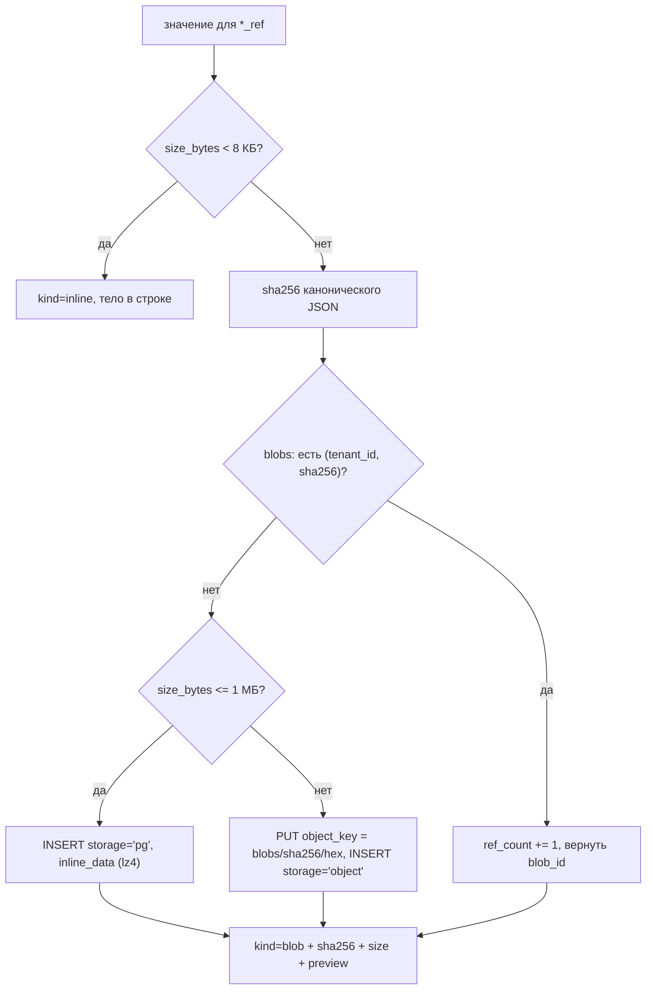

# 16. Модель данных

> Статус: draft
> Зависит от: [07. Компилятор](07-compiler.md), [12. Наблюдаемость и отладка](12-observability.md), [18. Экспорт и конформанс](18-export-and-conformance.md), [17. Фоновые задачи и таймеры](17-jobs-and-scheduling.md)
> Источники: research/persistence.md, research/observability.md, research/determinism-export.md, спека §3, §7.4, §12, §13.1, §15.1, «Хранилище»

## Зачем этот слой

Ядро доверия из §8 требует, чтобы про любой выход прогона можно было ответить «откуда это взялось»,
повторить прогон байт-в-байт и доказать, что новая версия лучше старой. Всё это — свойства данных,
а не кода: провенанс, неизменяемые версии, контентная адресация, lineage форков, идемпотентность
побочных эффектов. Слой хранения обязан гарантировать их структурой (ключи, ограничения, RLS),
а не дисциплиной разработчика, потому что часть запросов и патчей генерирует LLM.

## Решения

| Решение | Что берём | Версия | Лицензия | Почему |
|---|---|---|---|---|
| СУБД | PostgreSQL 18 в образе `pgvector/pgvector:0.8.6-pg18` | PG 18 / pgvector 0.8.6 | PostgreSQL / PostgreSQL | встроенный `uuidv7()` + расширение `vector` одним образом |
| ORM и миграции | drizzle-orm + drizzle-kit, драйвер `pg` | 0.45.2 / 0.31.10 / 8.23.0 | Apache-2.0 / MIT / MIT | HNSW, BRIN, GIN с opclass и `pgPolicy`/`pgRole` выражаются прямо в TS-схеме |
| Мост схема ↔ Zod | drizzle-zod | 0.8.3 | Apache-2.0 | одно описание формы строки вместо двух |
| Векторный поиск | pgvector, только HNSW | 0.8.6 | PostgreSQL | транзакционность вектора вместе с источником; ANN без второй базы |
| Объектное хранилище | `@aws-sdk/client-s3` + `s3-request-presigner`, бэкенд включается конфигом | 3.1130.0 | Apache-2.0 | S3-совместимость без привязки к конкретному серверу |
| Тесты БД | testcontainers + `@testcontainers/postgresql` | 12.1.0 | MIT | `snapshot()`/`restoreSnapshot()` переживает DDL и несколько соединений |
| Партиции | собственный SQL-джоб на v1 | — | — | pg_partman в базовом образе не подтверждён (см. открытый вопрос 3) |

Отклонено с обоснованием: **Prisma 7** — второй DSL схемы и слабый контроль pg-специфичного DDL,
которого у нас много; в npm `latest` уже `prisma@8.0.0-rc.13`. **Kysely 0.29** — нет декларативной
схемы, миграции целиком руками; остаётся кандидатом на аналитические запросы, но на v1 второй
библиотеки не берём. **Postgres Large Objects** — вне MVCC-логики таблиц, требуют явного
`lo_unlink`, не переживают логическую репликацию. **Встроенное векторное хранилище
`@voltagent/postgres`** — колонка `vector BYTEA`, полный скан и косинус в JS-процессе, ANN нет.
**MinIO** — репозиторий архивирован 2026-02-12, образы не публикуются с 2025-10.

---

## 1. Общие правила

| Правило | Как именно |
|---|---|
| Первичный ключ | `uuid PRIMARY KEY DEFAULT uuidv7()`. PG 18 даёт `uuidv7()` встроенным; локальность вставки в B-tree и корреляция со временем, без которой BRIN бесполезен |
| Схемы | ровно три: `app` — истина рантайма под миграциями drizzle-kit, `idx` — производная проекция файлов (§2.4, миграций нет, пересобирается целиком), `voltagent` — рантайм-DDL адаптера (§6). Четвёртой не заводим |
| Граница схем | определения — файлы, `app` хранит события и снимки, `idx` отвечает на «где используется». `app.*` не ссылается на `idx.*` внешними ключами, `DROP SCHEMA idx CASCADE` не теряет ничего |
| Время | `timestamptz`, всегда UTC. Совпадает с `timezone('utc', now())` у `@voltagent/postgres` |
| Деньги | `numeric(18,8)` для стоимости, `numeric(18,10)` для цены за токен. Никакого `double precision` для денег |
| Токены | `integer` в строке узла, `bigint` в агрегатах прогона |
| Контентная адресация | `bytea` ровно 32 байта (sha256), не hex-текст: вдвое компактнее, индекс меньше. В API отдаём `encode(hash,'hex')` с префиксом `sha256-` |
| Мультитенантность | `tenant_id uuid NOT NULL` в каждой таблице, даже пока тенант один. Добавить колонку позже — самая дорогая миграция из возможных |
| RLS | включена с первой миграции, `ENABLE` + **`FORCE ROW LEVEL SECURITY`** (§7) |
| Enum-подобные поля | `text` + `CHECK (x IN (...))`, не `CREATE TYPE ... AS ENUM`: значение добавляется обычной миграцией, снятие значения не требует пересборки типа |
| Неизменяемость | `spec_versions`, `cassette_entries`, `journal`, `access_log`, `blobs` — `REVOKE UPDATE, DELETE` для роли `app_user` (миграцией, Drizzle это не выражает) |
| Типизация JSONB | `jsonb(...).$type<T>()` — **чистый compile-time каст без рантайм-валидации**. Форму JSON проверяет Zod 4 в слое домена; БД её не проверяет |
| Миграции | forward-only, expand/contract, без down. drizzle-kit down-миграций не умеет в принципе |
| Что пишем в `--custom` миграциях | партиции, `ENABLE/FORCE ROW LEVEL SECURITY`, `CREATE EXTENSION`, `SET COMPRESSION lz4`, `REVOKE`/`GRANT`, генерируемые колонки на выражениях |

**GIN: `jsonb_path_ops` по умолчанию.** Индекс в 2–3 раза меньше и быстрее, но поддерживает только
`@>`. Для запросов «найти все воркфлоу, где есть узел типа X» этого достаточно. `jsonb_ops` ставим
точечно, там где нужны `?`, `?|`, `?&`.

**BRIN честен только на append-only.** BRIN выигрывает от физической корреляции значения со
страницей и ломается на UPDATE. Отсюда жёсткое правило для горячих таблиц: **одна строка пишется
после завершения шага**, а не `INSERT` на старте плюс `UPDATE` на финише. Состояние «сейчас
выполняется» живёт в памяти воркера и в `voltagent.*_workflow_states`, а не в нашей таблице.

---

## 2. DDL основных таблиц

Весь DDL ниже — схема `app`, кроме §2.4: там схема `idx`, которая под миграции не попадает вовсе.
Порядок разделов совпадает с порядком применения миграций, ссылочная целостность строится сверху вниз,
отложенных ссылок нет.

### 2.1. Тенанты и проекты

```sql
CREATE TABLE app.tenants (
  id          uuid PRIMARY KEY DEFAULT uuidv7(),
  slug        text NOT NULL UNIQUE,
  title       text NOT NULL,
  status      text NOT NULL DEFAULT 'active',
  settings    jsonb NOT NULL DEFAULT '{}',
  created_at  timestamptz NOT NULL DEFAULT now(),
  CONSTRAINT tenants_status_ck CHECK (status IN ('active','suspended','archived'))
);

CREATE TABLE app.projects (
  id          uuid PRIMARY KEY DEFAULT uuidv7(),
  tenant_id   uuid NOT NULL REFERENCES app.tenants(id),
  slug        text NOT NULL,
  title       text NOT NULL,
  settings    jsonb NOT NULL DEFAULT '{}',
  created_at  timestamptz NOT NULL DEFAULT now(),
  archived_at timestamptz,
  UNIQUE (tenant_id, slug)
);
CREATE UNIQUE INDEX projects_id_tenant_uidx ON app.projects (id, tenant_id);
```

`projects_id_tenant_uidx` существует не ради уникальности (она и так есть по PK), а чтобы горячие
таблицы могли держать составной FK `(project_id, tenant_id) REFERENCES app.projects (id, tenant_id)`.
Это делает денормализацию `tenant_id` в горячие таблицы безопасной: БД не даст записать строку
с `tenant_id`, не совпадающим с проектом, а RLS-предикат остаётся односложным сравнением по
индексируемому столбцу (§7).

### 2.2. Снимки планов для прогонов

Определения живут в файлах ([ADR-0017](adr/0017-files-as-source-of-truth.md)), поэтому `app.spec_versions`
перестаёт быть редактируемой версией и становится **материализованным снимком плана**: старт прогона
компилирует дерево в память и кладёт результат сюда, дальше прогон читает только базу и файлы не
трогает вовсе.

```sql
CREATE TABLE app.spec_versions (
  id           uuid PRIMARY KEY DEFAULT uuidv7(),
  tenant_id    uuid NOT NULL,
  project_id   uuid NOT NULL,
  root_path    text NOT NULL,
  origin       text NOT NULL,
  content_hash bytea NOT NULL,
  release_hash bytea,
  git_commit   text,
  ir           jsonb NOT NULL,
  compiled     jsonb,
  diagnostics  jsonb NOT NULL DEFAULT '[]',
  sources      jsonb NOT NULL,
  created_at   timestamptz NOT NULL DEFAULT now(),
  UNIQUE (project_id, root_path, content_hash),
  CONSTRAINT spec_versions_origin_ck CHECK (origin IN ('working_copy','release')),
  CONSTRAINT spec_versions_release_ck CHECK (origin <> 'release' OR release_hash IS NOT NULL),
  CONSTRAINT spec_versions_hash_len_ck CHECK (octet_length(content_hash) = 32),
  CONSTRAINT spec_versions_project_fk FOREIGN KEY (project_id, tenant_id)
    REFERENCES app.projects (id, tenant_id) ON DELETE CASCADE
);
CREATE INDEX spec_versions_hash_idx ON app.spec_versions USING hash (content_hash);
CREATE INDEX spec_versions_root_idx ON app.spec_versions (tenant_id, project_id, root_path, created_at DESC);
ALTER TABLE app.spec_versions ALTER COLUMN ir SET COMPRESSION lz4;
ALTER TABLE app.spec_versions ALTER COLUMN compiled SET COMPRESSION lz4;
```

| Колонка | Смысл |
|---|---|
| `root_path` | путь корня определения в дереве (`flows/hotel_pitch/`), он же идентичность: поля `id` в файлах нет |
| `origin` | `working_copy` — снимок незакоммиченного дерева; `release` — снимок опубликованного релиза |
| `content_hash` | sha256 канонического JSON по RFC 8785 (`canonicalize@5.0.0`) с доменной сепарацией — идентичность снимка |
| `release_hash` | пин релиза для `origin = 'release'`, он же ключ в `aqven.lock.yaml` |
| `git_commit` | справочная привязка к истории; **не** идентичность: один контент живёт в разных коммитах |
| `sources` | карта `путь → sha256 байтов файла` по всем файлам, вошедшим в снимок; по ней видно, разошлось ли дерево |

Публикация снимка — не транзакционный счётчик, а `UPSERT` по `(project_id, root_path, content_hash)`
с `ON CONFLICT DO NOTHING`: одинаковое содержимое переиспользует строку. Колонок `version`,
`parent_id`, `author`, `message` больше нет — номер версии никто не выдаёт, а родителя, автора
и сообщение даёт git.

Запуск из рабочей копии с битым файлом запрещён, из опубликованного релиза разрешён всегда.
Ретенция: снимки `working_copy` живут 30 дней после завершения прогона, но не дольше ретенции
самого прогона; на что ссылается релиз или датасет — не удаляется никогда.

### 2.3. Синхронизация дерева, карантин и дедуп ретраев

`base_rev` из базы заменён на compare-and-swap по sha256 **байтов файла**: клиент присылает
`expects[{path, file_hash}]`, `file_hash: null` означает «файла быть не должно». Коды отказа —
`STALE_FILE`, `FILE_VANISHED`, `FILE_EXISTS`, `LOCK_BUSY`, `TREE_DIRTY`. Счётчика ревизий база
не ведёт: транзакцией на N файлов владеет staging `.aqven/txn/<ulid>` с `intent.json` и серией
атомарных `rename(2)`, межпроцессная блокировка — `.aqven/lock`.

```sql
CREATE TABLE app.spec_fs_sync (
  tenant_id    uuid NOT NULL,
  project_id   uuid NOT NULL,
  path         text NOT NULL,
  file_hash    bytea NOT NULL,
  size_bytes   integer NOT NULL,
  mtime_ns     bigint NOT NULL,
  state        text NOT NULL,
  last_good_id uuid REFERENCES app.spec_versions(id),
  problems     jsonb NOT NULL DEFAULT '[]',
  synced_at    timestamptz NOT NULL DEFAULT now(),
  PRIMARY KEY (tenant_id, project_id, path),
  CONSTRAINT spec_fs_sync_state_ck CHECK (state IN ('ok','quarantined','unreadable')),
  CONSTRAINT spec_fs_sync_hash_len_ck CHECK (octet_length(file_hash) = 32)
);
CREATE INDEX spec_fs_sync_quarantine_idx ON app.spec_fs_sync (tenant_id, project_id)
  WHERE state <> 'ok';

CREATE TABLE app.write_intents (
  client_op_id text PRIMARY KEY,
  tenant_id    uuid NOT NULL,
  project_id   uuid NOT NULL,
  paths        text[] NOT NULL,
  hash_before  jsonb NOT NULL,
  hash_after   jsonb NOT NULL,
  actor        text NOT NULL,
  created_at   timestamptz NOT NULL DEFAULT now(),
  expires_at   timestamptz NOT NULL
);
CREATE INDEX write_intents_expiry_idx ON app.write_intents (expires_at);
```

Почему `spec_fs_sync` в `app`, а не в `idx`: `last_good` — последний скомпилированный снимок файла,
который **сейчас** сломан, и вывести его из дерева нельзя. Битый файл уходит в карантин
(`state = 'quarantined'`, `problems[]` с позицией), соседние файлы работают, запуск на `last_good`
возможен только с явного согласия. Ссылка на снимок и есть причина, по которой строка живёт рядом
с `app.spec_versions`, а не в перестраиваемой схеме.

`write_intents` — исключительно дедуп ретраев MCP: повтор с тем же `client_op_id` возвращает прежний
результат вместо второй записи. Это не журнал операций, истории в ней нет, строки чистятся по TTL.

### 2.4. Индекс определений: схема `idx`

`idx` — производная проекция файлов, целиком описанная в [files-first/index.md](files-first/index.md).
Пишет в неё только индексатор; валидатор и компилятор читают файлы, а не индекс.

```sql
CREATE SCHEMA idx;

CREATE TABLE idx.state (
  tenant_id uuid NOT NULL, project_id uuid PRIMARY KEY,
  generation bigint NOT NULL DEFAULT 1, head_commit text,
  builder_version text NOT NULL, built_at timestamptz NOT NULL DEFAULT now(),
  status text NOT NULL CHECK (status IN ('ready','building','degraded'))
);

CREATE TABLE idx.files (
  tenant_id uuid NOT NULL, project_id uuid NOT NULL, path text NOT NULL,
  content_hash bytea NOT NULL CHECK (octet_length(content_hash) = 32),
  size_bytes integer NOT NULL, mtime_ns bigint NOT NULL, kind text NOT NULL,
  parse_status text NOT NULL CHECK (parse_status IN ('ok','invalid','unreadable')),
  parse_error jsonb, indexed_at timestamptz NOT NULL DEFAULT now(),
  PRIMARY KEY (tenant_id, project_id, path)
);

CREATE TABLE idx.objects (
  tenant_id uuid NOT NULL, project_id uuid NOT NULL,
  kind text NOT NULL CHECK (kind IN ('workflow','component','type','model_profile',
    'agent','tool','prompt','fragment','dataset')),
  key text NOT NULL, path text NOT NULL, content_hash bytea NOT NULL,
  status text NOT NULL, summary jsonb NOT NULL DEFAULT '{}',
  PRIMARY KEY (tenant_id, project_id, kind, key)
);
CREATE INDEX objects_path_idx ON idx.objects (tenant_id, project_id, path);
CREATE INDEX objects_summary_gin ON idx.objects USING gin (summary jsonb_path_ops);

CREATE TABLE idx.refs (
  tenant_id uuid NOT NULL, project_id uuid NOT NULL,
  src_kind text NOT NULL, src_key text NOT NULL, src_path text NOT NULL,
  dst_kind text NOT NULL, dst_key text NOT NULL, dst_value text,
  usage_kind text NOT NULL, ref_path text NOT NULL,
  line integer, depth integer NOT NULL DEFAULT 1
);
CREATE UNIQUE INDEX refs_uidx ON idx.refs
  (tenant_id, project_id, src_kind, src_key, ref_path, dst_kind, dst_key, coalesce(dst_value,''));
CREATE INDEX refs_reverse_idx ON idx.refs
  (tenant_id, project_id, dst_kind, dst_key, dst_value, usage_kind);
CREATE INDEX refs_src_path_idx ON idx.refs (tenant_id, project_id, src_path);

CREATE TABLE idx.search (
  tenant_id uuid NOT NULL, project_id uuid NOT NULL,
  kind text NOT NULL, key text NOT NULL, path text NOT NULL,
  ref_path text NOT NULL, snippet text NOT NULL,
  tsv tsvector GENERATED ALWAYS AS (to_tsvector('simple', snippet)) STORED,
  PRIMARY KEY (tenant_id, project_id, kind, key, ref_path)
);
CREATE INDEX search_tsv_idx  ON idx.search USING gin (tsv);
CREATE INDEX search_trgm_idx ON idx.search USING gin (snippet gin_trgm_ops);
```

**Свойство выводимости.** `DROP SCHEMA idx CASCADE` с последующей пересборкой обязан давать
побайтово ту же картину при том же дереве и той же `builder_version`. Отсюда четыре следствия,
обязательные к соблюдению: `idx.*` не бэкапится и не реплицируется логически, миграций у неё нет
(смена версии индексатора = полная пересборка), `app.*` не ссылается на `idx.*` внешними ключами,
и ни одна колонка `idx.*` не содержит того, чего нет в файлах. Тест конформанса — пересобрать
индекс дважды и сравнить отсортированный дамп.

### 2.5. Рёбра использования вместо карт включений

Все связи определений живут в одной таблице `idx.refs`: «какие шаблоны включают фрагмент»,
«какие узлы сидят на профиле модели», «где используется тип» — один и тот же вопрос «кто на кого
ссылается». Таблицы `app.prompt_fragment_uses` и `app.context_needs` упразднены: это были те же
обратные индексы, только заполняемые на публикации версии.

| Запрос продукта | Как считается по `idx.refs` |
|---|---|
| Где используется тип (R14) | `dst_kind = 'type'`, скан обратного индекса |
| Где используется значение enum | то же плюс равенство по `dst_value`, `usage_kind ∈ {switch_branch, template_case, template_text, dataset_row, judge_rubric}` |
| Какие шаблоны перекомпилировать после правки фрагмента | `dst_kind = 'fragment'`, транзитивность через `depth > 1` |
| Какие узлы затронет смена профиля модели | `dst_kind = 'model_profile'`, `ref_path` — путь до узла |
| Обратные ссылки компонента, можно ли его удалить | `dst_kind = 'component'`, `usage_kind = 'component_call'` |
| На чём держится решение узла (потребности контекста) | `src_path` = путь узла, `usage_kind = 'context_need'`, вид источника в `dst_kind` |
| Что сломает изменение | множество затронутых файлов из `idx.refs`; вердикт PASS/WARN/BLOCK даёт компилятор, перечитав **эти файлы** |
| Битые ссылки | `idx.refs LEFT JOIN idx.objects` без пары — фоновый отчёт, запись не блокирует |

Индекс отвечает на «где», «сколько» и «что затронуто». На вопрос «что именно написано» он не
отвечает никогда: содержимое читается из файла, поэтому устаревший индекс не может дать неверный
ответ по существу.

### 2.6. Реестры, компоненты и промты как проекция файла

Типы, профили моделей, агенты, тулы, компоненты и промты — файлы (`types/`, `models/`, `agents/`,
`tools/`, `components/`, `prompts/`). В индексе они лежат строками `idx.objects` с
дискриминатором `kind`; жизненный цикл, аппрув и версия живут **в файле** и попадают в
`status` и `summary`.

| Вид | Что в `summary` | Кто проверяет инвариант |
|---|---|---|
| `type` | `jsonSchema`, `views`, `schemaProfileHints` | валидатор до записи |
| `model_profile` | `candidates[]`, `params`, `tokenizerFactor`, `schemaProfile`, `limits` | валидатор до записи |
| `agent` | `instructionsRef`, `outputTypeKey`, `toolAllowlist[]`, `limits` | валидатор до записи |
| `tool` | `inputSchema`, `outputSchema`, `effectClass`, `timeoutMs`, `idempotencyKeyTemplate` | компилятор: эффект без ключа идемпотентности не компилируется |
| `component` | контракт входа/выхода, `order`, `uses`, число узлов | валидатор + компилятор |
| `prompt`, `fragment` | `slots`, `cache_points`, ключи включений | компилятор промтов |

Аппрув — свойство определения, а не строки в базе: `status` и `approved_by` правятся диффом
и ревьюятся в PR, индекс их только отражает, а факт аппрува пишется в `app.access_log` (§2.16).
Резолв активной записи идёт по `idx.objects` с `status = 'approved'`, пин версии — по `aqven.lock.yaml`
и `release_hash`, а не по `max(version)`.

Разобранный AST промта, план компиляции и развёрнутый вид держит `.aqven/cache/`, а не база:
это производное от файла, восстанавливаемое за те же миллисекунды, что и чтение строки.

### 2.7. Прогоны

```sql
CREATE TABLE app.runs (
  id                  uuid PRIMARY KEY DEFAULT uuidv7(),
  tenant_id           uuid NOT NULL,
  project_id          uuid NOT NULL,
  spec_version_id     uuid NOT NULL REFERENCES app.spec_versions(id),
  execution_id        text NOT NULL,
  mode                text NOT NULL,
  status              text NOT NULL,
  input               jsonb NOT NULL,
  output              jsonb,
  error               jsonb,
  seed                bigint,
  cassette_id         uuid,
  catalog_snapshot_at timestamptz,
  effective_config    jsonb NOT NULL DEFAULT '{}',
  config_hash         bytea NOT NULL,
  budget              jsonb NOT NULL DEFAULT '{}',
  cost_usd            numeric(18,8) NOT NULL DEFAULT 0,
  tokens_in           bigint NOT NULL DEFAULT 0,
  tokens_out          bigint NOT NULL DEFAULT 0,
  trace_id            text,
  started_at          timestamptz NOT NULL DEFAULT now(),
  finished_at         timestamptz,
  CONSTRAINT runs_mode_ck CHECK (mode IN ('live','replay','experiment','dryrun')),
  CONSTRAINT runs_status_ck
    CHECK (status IN ('queued','running','suspended','completed','failed','cancelled')),
  CONSTRAINT runs_trace_ck CHECK (trace_id IS NULL OR trace_id ~ '^[0-9a-f]{32}$'),
  CONSTRAINT runs_project_fk FOREIGN KEY (project_id, tenant_id)
    REFERENCES app.projects (id, tenant_id) ON DELETE CASCADE
);
CREATE UNIQUE INDEX runs_execution_uidx ON app.runs (execution_id);
CREATE INDEX runs_project_started_idx ON app.runs (tenant_id, project_id, started_at DESC);
CREATE INDEX runs_active_idx ON app.runs (tenant_id, status, started_at)
  WHERE status IN ('queued','running','suspended');
```

`effective_config` + `config_hash` — конфигурация после слияния дефолтов и переопределений; именно
её сравнивают два прогона, и именно `config_hash` уезжает в спан-атрибут, а не всё тело.
`catalog_snapshot_at` пришпиливает прогон к срезу каталога моделей (§2.14): воспроизводимость
требует знать, какие цены и лимиты действовали на момент прогона.
`trace_id` — тот же 32-hex OTel trace id, что у корневого спана; это единственная связка
«строка в нашей БД → спан в бэкенде трасс», отдельной мапы идентификаторов нет.

### 2.8. run_nodes — партиционированная горячая таблица

```sql
CREATE TABLE app.run_nodes (
  id           uuid NOT NULL DEFAULT uuidv7(),
  tenant_id    uuid NOT NULL,
  run_id       uuid NOT NULL,
  node_id      text NOT NULL,
  attempt      integer NOT NULL DEFAULT 0,
  iteration    integer NOT NULL DEFAULT 0,
  status       text NOT NULL,
  input_ref    jsonb NOT NULL,
  output_ref   jsonb,
  provenance   jsonb NOT NULL DEFAULT '{}',
  rule_firings jsonb NOT NULL DEFAULT '[]',
  model        text,
  profile      text,
  tokens_in    integer,
  tokens_out   integer,
  cost_usd     numeric(18,8),
  latency_ms   integer,
  error        jsonb,
  trace_id     text,
  span_id      text,
  started_at   timestamptz NOT NULL,
  finished_at  timestamptz NOT NULL DEFAULT now(),
  PRIMARY KEY (started_at, id),
  CONSTRAINT run_nodes_status_ck
    CHECK (status IN ('ok','failed','skipped','suspended','cancelled'))
) PARTITION BY RANGE (started_at);

CREATE INDEX run_nodes_time_brin ON app.run_nodes USING brin (started_at)
  WITH (pages_per_range = 32, autosummarize = on);
CREATE INDEX run_nodes_run_idx ON app.run_nodes (run_id, node_id, iteration, attempt);
ALTER TABLE app.run_nodes ALTER COLUMN input_ref SET COMPRESSION lz4;
ALTER TABLE app.run_nodes ALTER COLUMN output_ref SET COMPRESSION lz4;
ALTER TABLE app.run_nodes ALTER COLUMN provenance SET COMPRESSION lz4;
```

Ключ партиционирования обязан входить в PK — отсюда `(started_at, id)`. FK на `runs` нет намеренно:
FK с партиционированной таблицы-потомка удорожает `DETACH`, а целостность здесь и так обеспечивается
тем, что строку пишет тот же процесс, что создал прогон. Удаление прогона чистит `run_nodes`
отдельным шагом ретеншна, а не каскадом.

`finished_at NOT NULL` и отсутствие `UPDATE` — не стилистика, а условие честности BRIN: **строка
пишется один раз, после завершения шага**. Частичное состояние шага живёт в
`voltagent.*_workflow_states`.

Запись батчами: `onStepEnd` кладёт строку в очередь в памяти, flush идёт многострочным
`INSERT ... VALUES (...), (...)` пачкой 50–200 строк по таймеру 100–250 мс или по размеру.
`COPY FROM STDIN` вводим только по результатам нагрузочного теста, а не заранее.

`provenance` — происхождение каждого поля входа: `{"<slotPath>": {"from": "<nodeId>.out.<path>",
"needId": "...", "kind": "generated|data|static|knowledge|human|run"}}`. Это то, из чего Studio
строит ответ «почему такое значение».

### 2.9. checkpoints и run_lineage

`checkpoints` — **не дубликат** чекпоинтов VoltAgent. Running-чекпоинт после каждого шага и снимок
на `suspend` пишет сам адаптер в `voltagent.*_workflow_states`; наша таблица хранит снимки,
адресуемые для time-travel и реплея, вместе с хешем состояния.

```sql
CREATE TABLE app.checkpoints (
  id         uuid PRIMARY KEY DEFAULT uuidv7(),
  tenant_id  uuid NOT NULL,
  run_id     uuid NOT NULL REFERENCES app.runs(id) ON DELETE CASCADE,
  seq        integer NOT NULL,
  node_id    text NOT NULL,
  kind       text NOT NULL,
  state      jsonb NOT NULL,
  state_hash bytea NOT NULL,
  repeats    integer NOT NULL DEFAULT 1,
  created_at timestamptz NOT NULL DEFAULT now(),
  UNIQUE (run_id, seq),
  CONSTRAINT checkpoints_kind_ck CHECK (kind IN ('step','suspend','manual'))
);
CREATE INDEX checkpoints_time_brin ON app.checkpoints USING brin (created_at);
ALTER TABLE app.checkpoints ALTER COLUMN state SET COMPRESSION lz4;
```

Дедупликация — по `state_hash` между соседними снимками: совпал — инкрементим `repeats`, новой
строки нет. Дельты (JSON Patch) на v1 **не делаем**: единственная очевидная библиотека
(`fast-json-patch@3.1.1`) без релизов с 2022 года, а выигрыш не измерен. Полный снимок плюс
дедуп плюс lz4 — достаточно до первого замера.

VoltAgent не сохраняет `replayedFromExecutionId`/`replayFromStepId` в типизированные поля
(проверено в `@voltagent/postgres@2.1.3` и в libsql-адаптере), поэтому родословная форков — наша.

```sql
CREATE TABLE app.run_lineage (
  run_id              uuid PRIMARY KEY REFERENCES app.runs(id) ON DELETE CASCADE,
  tenant_id           uuid NOT NULL,
  root_run_id         uuid NOT NULL REFERENCES app.runs(id),
  parent_run_id       uuid REFERENCES app.runs(id),
  parent_execution_id text,
  replay_from_node_id text,
  replay_from_step_id text,
  relation            text NOT NULL,
  overrides           jsonb NOT NULL DEFAULT '{}',
  depth               integer NOT NULL DEFAULT 0,
  created_at          timestamptz NOT NULL DEFAULT now(),
  CONSTRAINT run_lineage_relation_ck
    CHECK (relation IN ('root','replay','fork','retry','experiment_cell')),
  CONSTRAINT run_lineage_root_ck
    CHECK ((relation = 'root') = (parent_run_id IS NULL))
);
CREATE INDEX run_lineage_root_idx ON app.run_lineage (root_run_id, depth);
CREATE INDEX run_lineage_parent_idx ON app.run_lineage (parent_run_id);
```

`root_run_id` и `depth` денормализованы сознательно: «все потомки прогона» — один индексный скан
вместо рекурсивного CTE, а дерево форков в Studio рисуется одним запросом.

### 2.10. tool_effects — идемпотентность побочных эффектов

Спека §7.4: тул с эффектом `write`/`external` обязан иметь шаблон ключа идемпотентности.
Таблица — единственное место, где ретрай узла отличается от повторного побочного эффекта.

```sql
CREATE TABLE app.tool_effects (
  id              uuid PRIMARY KEY DEFAULT uuidv7(),
  tenant_id       uuid NOT NULL,
  project_id      uuid NOT NULL,
  tool_key        text NOT NULL,
  idempotency_key text NOT NULL,
  effect_class    text NOT NULL,
  request_hash    bytea NOT NULL,
  state           text NOT NULL,
  run_id          uuid,
  node_id         text,
  attempt         integer NOT NULL DEFAULT 0,
  result_ref      jsonb,
  error           jsonb,
  lease_until     timestamptz NOT NULL,
  created_at      timestamptz NOT NULL DEFAULT now(),
  committed_at    timestamptz,
  UNIQUE (tenant_id, tool_key, idempotency_key),
  CONSTRAINT tool_effects_class_ck CHECK (effect_class IN ('write','external')),
  CONSTRAINT tool_effects_state_ck CHECK (state IN ('reserved','committed','failed')),
  CONSTRAINT tool_effects_committed_ck
    CHECK ((state = 'committed') = (committed_at IS NOT NULL))
);
CREATE INDEX tool_effects_run_idx ON app.tool_effects (run_id, node_id);
CREATE INDEX tool_effects_lease_idx ON app.tool_effects (lease_until) WHERE state = 'reserved';
```

Протокол вызова тула с эффектом — три шага, без вложенных ветвлений:

```sql
INSERT INTO app.tool_effects (tenant_id, project_id, tool_key, idempotency_key, effect_class,
                              request_hash, state, run_id, node_id, attempt, lease_until)
VALUES ($1, $2, $3, $4, $5, $6, 'reserved', $7, $8, $9, now() + $10::interval)
ON CONFLICT (tenant_id, tool_key, idempotency_key) DO UPDATE
  SET lease_until = excluded.lease_until,
      attempt     = app.tool_effects.attempt + 1
  WHERE app.tool_effects.state = 'reserved' AND app.tool_effects.lease_until < now()
RETURNING id, state, result_ref, request_hash;
```

Таблица исходов, которую реализует вызывающий код (Chain of Responsibility на результате запроса,
без `if/else`-лестницы):

| Результат запроса | Что делаем |
|---|---|
| строка вернулась, `state = 'reserved'`, наш `id` | лизинг взят — исполняем эффект, затем `UPDATE ... SET state='committed', result_ref=$, committed_at=now()` |
| строка не вернулась | ключ занят живым лизингом — узел ждёт и повторяет по политике ретрая |
| строка вернулась, `state = 'committed'` | эффект уже применён — возвращаем `result_ref`, тул **не вызываем** |
| строка вернулась, `state = 'committed'`, `request_hash <> $6` | тот же ключ на другой запрос — ошибка `IDEMPOTENCY_KEY_COLLISION`, узел падает |
| строка вернулась, `state = 'failed'` | применяем политику ошибок узла |

Тулы класса `read` в эту таблицу не пишут вовсе — у них нет эффекта, и лишняя запись убила бы
горячий путь ретривера.

### 2.11. human_tasks

`suspend()`/`resumeData` VoltAgent даёт механику остановки, но не даёт очереди задач, сроков и
назначений. Таблица — проекция приостановленных узлов `human`/`gate` в рабочую очередь человека.
Отдельных операций `human_task_*` в контракте нет: «что ждёт меня» — это `run_list({status:
'suspended'})`, ответ — `run_resume`, форма — `form_schema` из `run_get_node`.

```sql
CREATE TABLE app.human_tasks (
  id             uuid PRIMARY KEY DEFAULT uuidv7(),
  tenant_id      uuid NOT NULL,
  project_id     uuid NOT NULL,
  run_id         uuid NOT NULL REFERENCES app.runs(id) ON DELETE CASCADE,
  execution_id   text NOT NULL,
  node_id        text NOT NULL,
  step_id        text NOT NULL,
  kind           text NOT NULL,
  form_schema    jsonb NOT NULL,
  suspend_data   jsonb NOT NULL DEFAULT '{}',
  resume_data    jsonb,
  status         text NOT NULL DEFAULT 'open',
  assignee       text,
  claimed_at     timestamptz,
  due_at         timestamptz,
  timeout_job_id text,
  on_timeout     text NOT NULL DEFAULT 'fail',
  resolved_by    text,
  resolved_at    timestamptz,
  created_at     timestamptz NOT NULL DEFAULT now(),
  CONSTRAINT human_tasks_kind_ck CHECK (kind IN ('approve','edit','clarify','label')),
  CONSTRAINT human_tasks_status_ck
    CHECK (status IN ('open','claimed','resolved','expired','cancelled')),
  CONSTRAINT human_tasks_timeout_ck CHECK (on_timeout IN ('fail','default','escalate'))
);
CREATE UNIQUE INDEX human_tasks_open_uidx ON app.human_tasks (run_id, node_id, step_id)
  WHERE status IN ('open','claimed');
CREATE INDEX human_tasks_queue_idx ON app.human_tasks (tenant_id, status, due_at)
  WHERE status IN ('open','claimed');
```

`form_schema` — JSON Schema, полученная из `suspendSchema`/`resumeSchema` шага; форма в Studio
рисуется по ней, а не по захардкоженному компоненту. `timeout_job_id` — идентификатор задачи
pg-boss, поставленной через `sendAfter`: VoltAgent сам по таймауту не возобновляет, поэтому срок
живёт в очереди, а сверяющий cron ищет расхождения по `human_tasks_queue_idx`.
Частичный уникальный индекс запрещает две открытые задачи на один приостановленный шаг —
это защита от двойного резюма при гонке воркеров.

### 2.12. Датасеты, эксперименты, оценки, калибровки судей

Метаданные набора (`name`, схема, сплиты, политика происхождения) — файл `datasets/<name>.yaml`,
`app.datasets` держит их проекцию и `source_path`. Строки остаются истиной в базе: их порождают
прогоны, их тысячи, и растут они **во время** прогона. Исключение — golden-наборы
`storage: rows_in_file` до 500 строк рядом с метаданными: их дифф в PR и есть главная ценность.

```sql
CREATE TABLE app.datasets (
  id          uuid PRIMARY KEY DEFAULT uuidv7(),
  tenant_id   uuid NOT NULL,
  project_id  uuid NOT NULL,
  name        text NOT NULL,
  version     integer NOT NULL,
  node_id     text,
  schema      jsonb NOT NULL,
  source_path text NOT NULL,
  created_at  timestamptz NOT NULL DEFAULT now(),
  UNIQUE (project_id, name, version),
  CONSTRAINT datasets_project_fk FOREIGN KEY (project_id, tenant_id)
    REFERENCES app.projects (id, tenant_id) ON DELETE CASCADE
);

CREATE TABLE app.dataset_items (
  id            uuid PRIMARY KEY DEFAULT uuidv7(),
  tenant_id     uuid NOT NULL,
  dataset_id    uuid NOT NULL REFERENCES app.datasets(id) ON DELETE CASCADE,
  split         text NOT NULL DEFAULT 'train',
  input         jsonb NOT NULL,
  expected      jsonb,
  labels        jsonb NOT NULL DEFAULT '{}',
  source_run_id uuid,
  content_hash  bytea NOT NULL,
  created_at    timestamptz NOT NULL DEFAULT now(),
  UNIQUE (dataset_id, content_hash),
  CONSTRAINT dataset_items_split_ck CHECK (split IN ('train','dev','test'))
);
CREATE INDEX dataset_items_split_idx ON app.dataset_items (dataset_id, split);

CREATE TABLE app.experiments (
  id              uuid PRIMARY KEY DEFAULT uuidv7(),
  tenant_id       uuid NOT NULL,
  project_id      uuid NOT NULL,
  dataset_id      uuid NOT NULL REFERENCES app.datasets(id),
  spec_version_id uuid NOT NULL REFERENCES app.spec_versions(id),
  baseline_id     uuid REFERENCES app.experiments(id),
  node_id         text,
  matrix          jsonb NOT NULL,
  seed            bigint NOT NULL,
  status          text NOT NULL,
  summary         jsonb,
  verdict         text,
  created_at      timestamptz NOT NULL DEFAULT now(),
  finished_at     timestamptz,
  CONSTRAINT experiments_status_ck
    CHECK (status IN ('queued','running','completed','failed','cancelled')),
  CONSTRAINT experiments_verdict_ck
    CHECK (verdict IS NULL OR verdict IN ('PASS','WARN','BLOCK','GATE_UNAVAILABLE'))
);

CREATE TABLE app.experiment_items (
  id              uuid PRIMARY KEY DEFAULT uuidv7(),
  tenant_id       uuid NOT NULL,
  experiment_id   uuid NOT NULL REFERENCES app.experiments(id) ON DELETE CASCADE,
  dataset_item_id uuid NOT NULL REFERENCES app.dataset_items(id),
  cell_key        text NOT NULL,
  cell            jsonb NOT NULL,
  arm             text NOT NULL,
  run_id          uuid REFERENCES app.runs(id),
  status          text NOT NULL,
  output_ref      jsonb,
  error           jsonb,
  cost_usd        numeric(18,8) NOT NULL DEFAULT 0,
  latency_ms      integer,
  started_at      timestamptz,
  finished_at     timestamptz,
  UNIQUE (experiment_id, dataset_item_id, cell_key, arm),
  CONSTRAINT experiment_items_arm_ck CHECK (arm IN ('a','b')),
  CONSTRAINT experiment_items_status_ck
    CHECK (status IN ('queued','running','ok','failed','skipped'))
);
CREATE INDEX experiment_items_pair_idx
  ON app.experiment_items (experiment_id, cell_key, dataset_item_id, arm);
```

`UNIQUE (experiment_id, dataset_item_id, cell_key, arm)` — не формальность: вся статистика из
решений по качеству парная (бутстрап BCa, McNemar, Wilcoxon signed-rank), и пара определяется
именно ключом `(cell_key, dataset_item_id)`. Индекс `experiment_items_pair_idx` отдаёт обе руки
пары соседними строками, поэтому выборка для бутстрапа — один упорядоченный скан.
`seed` на уровне эксперимента фиксирован: A/A-прогон и повторный A/B обязаны дать те же пары.

```sql
CREATE TABLE app.scores (
  id                 uuid PRIMARY KEY DEFAULT uuidv7(),
  tenant_id          uuid NOT NULL,
  experiment_item_id uuid REFERENCES app.experiment_items(id) ON DELETE CASCADE,
  run_id             uuid REFERENCES app.runs(id) ON DELETE CASCADE,
  node_id            text,
  scorer             text NOT NULL,
  scorer_version     integer NOT NULL DEFAULT 1,
  source             text NOT NULL,
  value              double precision,
  passed             boolean,
  detail             jsonb,
  cost_usd           numeric(18,8),
  created_at         timestamptz NOT NULL DEFAULT now(),
  CONSTRAINT scores_source_ck CHECK (source IN ('auto','judge','human','mirror')),
  CONSTRAINT scores_subject_ck CHECK (num_nonnulls(experiment_item_id, run_id) >= 1)
);
CREATE INDEX scores_item_idx ON app.scores (experiment_item_id, scorer, scorer_version);
CREATE INDEX scores_run_idx ON app.scores (run_id, node_id, scorer);
```

`source = 'mirror'` — оценка, зеркалированная из бэкенда трасс. Правило границы данных: если
оценка управляет гейтом, её копия обязана быть здесь, потому что **ни один гейт не делает запрос
во внешний SaaS на горячем пути**.

```sql
CREATE TABLE app.judge_calibrations (
  id                  uuid PRIMARY KEY DEFAULT uuidv7(),
  tenant_id           uuid NOT NULL,
  project_id          uuid NOT NULL,
  judge_key           text NOT NULL,
  judge_version       integer NOT NULL,
  dataset_id          uuid NOT NULL REFERENCES app.datasets(id),
  n_items             integer NOT NULL,
  kappa_weighted      double precision NOT NULL,
  krippendorff_alpha  double precision NOT NULL,
  confusion           jsonb NOT NULL DEFAULT '{}',
  passed              boolean GENERATED ALWAYS AS
                        (kappa_weighted >= 0.7 AND krippendorff_alpha >= 0.8) STORED,
  valid_until         timestamptz,
  created_at          timestamptz NOT NULL DEFAULT now(),
  UNIQUE (project_id, judge_key, judge_version, dataset_id, created_at)
);
CREATE INDEX judge_calibrations_active_idx
  ON app.judge_calibrations (project_id, judge_key, judge_version, created_at DESC)
  WHERE passed;
```

Пороги 0.7 и 0.8 зашиты в генерируемую колонку намеренно: смена порога допуска судьи — это
решение уровня выпуска, и оно обязано проходить через миграцию и ревью, а не через правку конфига.
Гейт выпуска читает `judge_calibrations_active_idx`; пустой результат означает не `BLOCK`,
а `GATE_UNAVAILABLE` — это разные исходы.

### 2.13. Кассеты

```sql
CREATE TABLE app.cassettes (
  id            uuid PRIMARY KEY DEFAULT uuidv7(),
  tenant_id     uuid NOT NULL,
  project_id    uuid NOT NULL,
  name          text NOT NULL,
  version       integer NOT NULL,
  source_run_id uuid,
  strict        boolean NOT NULL DEFAULT true,
  meta          jsonb NOT NULL DEFAULT '{}',
  created_at    timestamptz NOT NULL DEFAULT now(),
  UNIQUE (project_id, name, version),
  CONSTRAINT cassettes_project_fk FOREIGN KEY (project_id, tenant_id)
    REFERENCES app.projects (id, tenant_id) ON DELETE CASCADE
);

CREATE TABLE app.cassette_entries (
  cassette_id   uuid NOT NULL REFERENCES app.cassettes(id) ON DELETE CASCADE,
  request_hash  bytea NOT NULL,
  seq           integer NOT NULL,
  kind          text NOT NULL,
  node_id       text,
  call_index    integer,
  request       jsonb NOT NULL,
  response_ref  jsonb NOT NULL,
  recorded_at   timestamptz NOT NULL,
  PRIMARY KEY (cassette_id, request_hash, seq),
  CONSTRAINT cassette_entries_kind_ck CHECK (kind IN ('model','tool','human','env'))
);
CREATE INDEX cassette_entries_fallback_idx
  ON app.cassette_entries (cassette_id, node_id, call_index);
ALTER TABLE app.cassette_entries ALTER COLUMN request SET COMPRESSION lz4;
```

`request_hash` — sha256 нормализованного запроса на уровне **порта модели/тула**, не HTTP:
`modelProfile` (логический профиль, не `gpt-4o-2024-11-20`), сообщения, хеши схем тулов и схемы
выхода, параметры. Не входят: ключи, базовые URL, идентификаторы запросов, метаданные трассировки,
время. Благодаря этому кассета, записанная на одном провайдере, проигрывается на другом.

`cassette_entries_fallback_idx` обслуживает вторичный ключ `(node_id, call_index)` — «N-й вызов
этого узла» — разрешённый только при `strict = false`; kill-критерий воспроизводимости
засчитывается исключительно в strict-режиме.

### 2.14. Каталог моделей и зонды возможностей

```sql
CREATE TABLE app.model_catalog (
  id             uuid PRIMARY KEY DEFAULT uuidv7(),
  snapshot_at    timestamptz NOT NULL,
  provider       text NOT NULL,
  model_id       text NOT NULL,
  display_name   text,
  context_length integer,
  max_output     integer,
  modalities     jsonb NOT NULL DEFAULT '{}',
  capabilities   jsonb NOT NULL DEFAULT '{}',
  price_in       numeric(18,10),
  price_out      numeric(18,10),
  price_cache_r  numeric(18,10),
  price_cache_w  numeric(18,10),
  raw            jsonb NOT NULL,
  UNIQUE (snapshot_at, provider, model_id)
);
CREATE INDEX model_catalog_lookup ON app.model_catalog (provider, model_id, snapshot_at DESC);

CREATE TABLE app.capability_probes (
  id                  uuid PRIMARY KEY DEFAULT uuidv7(),
  provider            text NOT NULL,
  model_id            text NOT NULL,
  capability          text NOT NULL,
  probe_version       integer NOT NULL,
  result              text NOT NULL,
  evidence            jsonb NOT NULL DEFAULT '{}',
  catalog_snapshot_at timestamptz,
  latency_ms          integer,
  cost_usd            numeric(18,8),
  probed_at           timestamptz NOT NULL DEFAULT now(),
  CONSTRAINT capability_probes_result_ck
    CHECK (result IN ('supported','unsupported','degraded','error'))
);
CREATE INDEX capability_probes_lookup
  ON app.capability_probes (provider, model_id, capability, probe_version, probed_at DESC);
```

`model_catalog` держим **срезами во времени**, а не «текущим состоянием»: `runs.catalog_snapshot_at`
пришпиливает прогон к конкретному срезу, иначе пересчёт стоимости задним числом даст другие цифры.
Таблица глобальная, без `tenant_id`: это справочник провайдеров, а не данные тенанта (следствие
для RLS — §7).

`capability_probes` отделён от `model_catalog.capabilities` потому, что объявленная провайдером
возможность и фактически работающая — разные вещи: профиль строгой схемы у OpenAI и у Anthropic
взаимно противоречив, и «поддерживает structured output» ничего не говорит о том, пройдёт ли
конкретная схема. `evidence` хранит минимальный воспроизводящий запрос и ответ, `probe_version` —
версию самого зонда, чтобы старые результаты не смешивались с новыми при смене методики.

### 2.15. Журнал решений

```sql
CREATE TABLE app.journal (
  id         uuid PRIMARY KEY DEFAULT uuidv7(),
  tenant_id  uuid NOT NULL,
  project_id uuid NOT NULL,
  kind       text NOT NULL,
  title      text NOT NULL,
  body       text NOT NULL,
  refs       jsonb NOT NULL DEFAULT '[]',
  author     text NOT NULL,
  created_at timestamptz NOT NULL DEFAULT now(),
  CONSTRAINT journal_kind_ck CHECK (kind IN ('decision','approval','incident','note')),
  CONSTRAINT journal_project_fk FOREIGN KEY (project_id, tenant_id)
    REFERENCES app.projects (id, tenant_id) ON DELETE CASCADE
);
CREATE INDEX journal_fts ON app.journal
  USING gin (to_tsvector('simple', title || ' ' || body));
CREATE INDEX journal_time_brin ON app.journal USING brin (created_at);
```

Конфигурация FTS — `'simple'`, без стемминга: записи двуязычные, а стеммер одного языка портит
второй. Смысловой поиск по журналу идёт через `app.embeddings` (§5), лексический — через этот GIN.

### 2.16. Аудит доступа и политики провайдеров

Две таблицы слоя безопасности ([19. Безопасность и политики](19-security-and-policies.md) §4 и §10).
Ни одна не сводится к `app.journal`: журнал фиксирует **решения** продукта, а здесь лежат факты
выдачи прав и нормативный справочник обращения провайдера с данными.

`app.access_log` — append-only лента слоя аутентификации: выдача, обновление и отзыв токенов, смена
скоупов, вход в консоль VoltOps, каждое обращение под `BYPASSRLS`-ролью через `withoutTenant(reason)`
(§7).

```sql
CREATE TABLE app.access_log (
  id               uuid PRIMARY KEY DEFAULT uuidv7(),
  tenant_id        uuid,
  project_id       uuid,
  kind             text NOT NULL,
  actor_kind       text NOT NULL,
  actor_id         uuid,
  on_behalf_of     uuid,
  subject_token_id uuid,
  db_role          text,
  scopes_before    text[],
  scopes_after     text[],
  outcome          text NOT NULL,
  reason           text,
  client_ip        inet,
  user_agent       text,
  expires_at       timestamptz,
  created_at       timestamptz NOT NULL DEFAULT now(),
  CONSTRAINT access_log_kind_ck CHECK (kind IN
    ('token_issued','token_refreshed','token_revoked','scopes_changed','console_login','rls_bypass')),
  CONSTRAINT access_log_actor_ck CHECK (actor_kind IN ('human','agent','system')),
  CONSTRAINT access_log_outcome_ck CHECK (outcome IN ('granted','denied')),
  CONSTRAINT access_log_tenant_ck CHECK (tenant_id IS NOT NULL OR kind = 'rls_bypass'),
  CONSTRAINT access_log_bypass_ck
    CHECK (kind <> 'rls_bypass' OR (db_role IS NOT NULL AND reason IS NOT NULL)),
  CONSTRAINT access_log_scopes_ck
    CHECK (kind <> 'scopes_changed' OR (scopes_before IS NOT NULL AND scopes_after IS NOT NULL)),
  CONSTRAINT access_log_project_fk FOREIGN KEY (project_id, tenant_id)
    REFERENCES app.projects (id, tenant_id) ON DELETE SET NULL
);
CREATE INDEX access_log_tenant_time_idx ON app.access_log (tenant_id, created_at DESC);
CREATE INDEX access_log_token_idx ON app.access_log (tenant_id, subject_token_id)
  WHERE subject_token_id IS NOT NULL;
CREATE INDEX access_log_bypass_idx ON app.access_log (created_at DESC) WHERE kind = 'rls_bypass';
CREATE INDEX access_log_time_brin ON app.access_log USING brin (created_at);

ALTER TABLE app.access_log ENABLE ROW LEVEL SECURITY;
ALTER TABLE app.access_log FORCE ROW LEVEL SECURITY;
CREATE POLICY access_log_tenant_isolation ON app.access_log
  AS PERMISSIVE FOR ALL TO app_user
  USING      (tenant_id = current_setting('app.tenant_id', true)::uuid)
  WITH CHECK (tenant_id = current_setting('app.tenant_id', true)::uuid);
REVOKE UPDATE, DELETE ON app.access_log FROM app_user;
```

`tenant_id` нулевой ровно у одного вида записей — `rls_bypass`: кросс-тенантное обслуживание не
принадлежит тенанту. Политика сравнивает `tenant_id` с `app.tenant_id`, `NULL` даёт `NULL`, поэтому
такие строки не видны ни одному тенанту и читаются только ролью `app_maintenance`. Составной FK на
проект имеет семантику `MATCH SIMPLE`: при `NULL` в любой из двух колонок он не проверяется, что и
нужно для записей без проекта. `scopes_before`/`scopes_after` хранят полный набор, а не дельту:
восстановление прав на момент времени не должно требовать проигрывания всей ленты.

`app.provider_data_policies` — allowlist провайдеров по PII, источник истины для `R-S12`, `R-S14`,
`R-S15` (19 §4). Справочник тенантский: у разных тенантов разные DPA с одним и тем же провайдером.

```sql
CREATE TABLE app.provider_data_policies (
  id                  uuid PRIMARY KEY DEFAULT uuidv7(),
  tenant_id           uuid NOT NULL,
  provider            text NOT NULL,
  allows_pii          boolean NOT NULL DEFAULT false,
  allows_sensitive    boolean NOT NULL DEFAULT false,
  retention           text NOT NULL DEFAULT 'unknown',
  evidence_url        text NOT NULL,
  evidence_checked_at timestamptz NOT NULL DEFAULT now(),
  approved_by         uuid NOT NULL,
  created_at          timestamptz NOT NULL DEFAULT now(),
  updated_at          timestamptz NOT NULL DEFAULT now(),
  UNIQUE (tenant_id, provider),
  CONSTRAINT provider_data_policies_retention_ck CHECK (retention IN ('zero','logged','unknown')),
  CONSTRAINT provider_data_policies_unknown_ck
    CHECK (retention <> 'unknown' OR (allows_pii = false AND allows_sensitive = false)),
  CONSTRAINT provider_data_policies_sensitive_ck
    CHECK (allows_sensitive = false OR allows_pii = true),
  CONSTRAINT provider_data_policies_evidence_ck CHECK (length(evidence_url) > 0)
);
CREATE INDEX provider_data_policies_allowlist_idx ON app.provider_data_policies (tenant_id)
  WHERE allows_pii;

ALTER TABLE app.provider_data_policies ENABLE ROW LEVEL SECURITY;
ALTER TABLE app.provider_data_policies FORCE ROW LEVEL SECURITY;
CREATE POLICY provider_data_policies_tenant_isolation ON app.provider_data_policies
  AS PERMISSIVE FOR ALL TO app_user
  USING      (tenant_id = current_setting('app.tenant_id', true)::uuid)
  WITH CHECK (tenant_id = current_setting('app.tenant_id', true)::uuid);
```

Три `CHECK` переносят правила 19 §4 из кода в схему: `retention = 'unknown'` запрещает и `pii`, и
`sensitive` (по умолчанию запрещено), `allows_sensitive` без `allows_pii` невозможен, пустая
`evidence_url` не принимается — поле существует именно для того, чтобы разрешение опиралось на DPA,
а не на память автора. Уникальность `(tenant_id, provider)` — и ключ резолва при проверке `R-S12`,
и защита от двух противоречащих строк на одного провайдера. Изменение строки — операция со скоупом
`policy:write` и записью в `app.journal`; `approved_by` держит того, кто её подтвердил.

### 2.17. Сводка индексной стратегии

Индексы делятся на две группы с разной ценой ошибки: над проекцией файлов их можно пересоздать
пересборкой индекса, над событиями — только миграцией.

**Над проекцией файлов (схема `idx`, пересобирается):**

| Таблица | Основной доступ | Индексы |
|---|---|---|
| `idx.objects` | список воркфлоу и реестров, резолв активной записи | PK `(tenant_id, project_id, kind, key)`, btree `(path)`, GIN `summary jsonb_path_ops` |
| `idx.refs` | «где используется», «кого перекомпилировать» | unique по ребру, btree `(dst_kind, dst_key, dst_value, usage_kind)`, btree `(src_path)` |
| `idx.files` | сверка хешей перед действием | PK `(tenant_id, project_id, path)` |
| `idx.search` | глобальный поиск | GIN по `tsv`, GIN `gin_trgm_ops` по `snippet` |

**Над событиями (схема `app`, меняется миграцией):**

| Таблица | Основной доступ | Индексы |
|---|---|---|
| `spec_versions` | снимок по хешу и по корню определения | hash `(content_hash)`, btree `(tenant_id, project_id, root_path, created_at DESC)` |
| `spec_fs_sync` | список файлов в карантине | PK `(tenant_id, project_id, path)`, partial btree `WHERE state <> 'ok'` |
| `runs` | лента проекта, активные | btree `(tenant_id, project_id, started_at DESC)`, partial по активным, unique `(execution_id)` |
| `run_nodes` | все узлы прогона, окно времени | btree `(run_id, node_id, iteration, attempt)`, **BRIN `(started_at)`**, партиции по месяцам |
| `checkpoints` | по порядку | unique `(run_id, seq)`, BRIN `(created_at)` |
| `tool_effects` | резолв ключа, сбор протухших лизингов | unique `(tenant_id, tool_key, idempotency_key)`, partial по `lease_until` |
| `human_tasks` | очередь и защита от двойного резюма | partial unique по открытым, btree `(tenant_id, status, due_at)` |
| `experiment_items` | пары для парной статистики | btree `(experiment_id, cell_key, dataset_item_id, arm)` |
| `cassette_entries` | точный и вторичный ключ | PK `(cassette_id, request_hash, seq)`, btree `(cassette_id, node_id, call_index)` |
| `journal` | FTS + окно времени | GIN FTS, BRIN `(created_at)` |
| `access_log` | лента тенанта, история одного токена, разбор обходов RLS | btree `(tenant_id, created_at DESC)`, partial btree `(tenant_id, subject_token_id)`, partial по `kind='rls_bypass'`, BRIN `(created_at)` |
| `provider_data_policies` | резолв политики провайдера при `R-S12` | unique `(tenant_id, provider)`, partial btree `(tenant_id) WHERE allows_pii` |
| `embeddings` | ANN с фильтром | HNSW на партицию (§5) |

---

## 3. Партиционирование и ретеншн

Партиционируем ровно две таблицы, по двум разным причинам.

| Таблица | Стратегия | Ключ | Причина |
|---|---|---|---|
| `run_nodes` | `RANGE`, помесячно | `started_at` | дешёвое удаление через `DROP TABLE` вместо `DELETE` + VACUUM; autovacuum работает по частям |
| `embeddings` | `LIST` + партиция по умолчанию | `tenant_id` | отсечение партиций до ANN-поиска: HNSW с фильтром по тенанту иначе даёт мусор (§5) |

Порог, при котором партиционирование `run_nodes` начинает окупаться по производительности, —
около 50–100 млн строк; до него BRIN и btree справляются. Вводим его **сразу**, потому что
ретрофит партиционирования живой таблицы дороже, чем начальная настройка.

### Создание партиций

`pg_partman` в базовом образе `pgvector/pgvector` не подтверждён, поэтому на v1 — собственная
функция и джоб pg-boss, вызывающий её ежесуточно. Функция идемпотентна: повторный вызов ничего
не делает.

```sql
CREATE OR REPLACE FUNCTION app.ensure_run_nodes_partitions(months_ahead integer DEFAULT 3)
RETURNS void LANGUAGE plpgsql AS $$
DECLARE
  month_start date;
  part_name   text;
BEGIN
  FOR month_start IN
    SELECT generate_series(date_trunc('month', now()),
                           date_trunc('month', now()) + make_interval(months => months_ahead),
                           interval '1 month')::date
  LOOP
    part_name := format('run_nodes_%s', to_char(month_start, 'YYYYMM'));
    EXECUTE format(
      'CREATE TABLE IF NOT EXISTS app.%I PARTITION OF app.run_nodes FOR VALUES FROM (%L) TO (%L)',
      part_name, month_start, month_start + interval '1 month');
    EXECUTE format('ALTER TABLE app.%I ENABLE ROW LEVEL SECURITY', part_name);
    EXECUTE format('ALTER TABLE app.%I FORCE ROW LEVEL SECURITY', part_name);
  END LOOP;
END;
$$;
```

Две строки с RLS в цикле — не лишние: политики наследуются от родителя, но флаги
`ENABLE`/`FORCE` на новых партициях нужно выставлять явно. Забытая строка здесь — тихая дыра
в изоляции ровно на один месяц.

Партиция по умолчанию для `run_nodes` **не создаётся намеренно**: строка с датой вне диапазона
должна падать с ошибкой, а не проваливаться в общий мешок, из которого её потом не отцепить.
Падение означает, что джоб создания партиций не отработал, и это надо чинить, а не прятать.

### Ретеншн

```sql
CREATE TABLE app.retention_policies (
  scope       text PRIMARY KEY,
  hot_days    integer NOT NULL,
  archive     boolean NOT NULL DEFAULT false,
  purge_days  integer,
  CONSTRAINT retention_purge_ck CHECK (purge_days IS NULL OR purge_days >= hot_days)
);
```

Значения по умолчанию (конфиг тенанта переопределяет строку, не код):

| scope | hot_days | archive | purge_days | Механика |
|---|---|---|---|---|
| `run_nodes` | 90 | да | 400 | `DETACH PARTITION CONCURRENTLY` → выгрузка в объектное хранилище JSONL-ом → `DROP TABLE` |
| `checkpoints` | 30 | нет | 180 | `DELETE` пачками по `run_id` вместе с удалением прогона |
| `runs` | — | — | — | не удаляются автоматически: это ссылочная вершина lineage |
| `blobs` (zone `external`) | — | — | 30 после обнуления `ref_count` | sweep-джоб, §4 |
| `cassettes` | — | — | никогда | артефакт конформанса, входит в бандл экспорта |
| `spec_versions` (`origin = 'working_copy'`) | — | — | 30 дней после завершения прогона | не раньше ретенции самого прогона; на что ссылается релиз или датасет — никогда |
| `spec_versions` (`origin = 'release'`), `journal`, `access_log` | — | — | никогда | неизменяемая история; `REVOKE DELETE` физически запрещает |
| `write_intents` | — | — | по `expires_at` | дедуп ретраев, не история: историю держит git |
| `capability_probes` | 180 | нет | 365 | справочная телеметрия, не влияет на воспроизведение |

Три правила, которые важнее конкретных чисел:

1. **Ничто, что входит в экспортный бандл или в цепочку lineage, не удаляется по расписанию.**
   Удаление такого объекта — явная операция с журнальной записью `kind = 'decision'`.
2. **Отцепление партиции идёт `DETACH PARTITION CONCURRENTLY`**, иначе на время операции берётся
   `ACCESS EXCLUSIVE` на всю партиционированную таблицу и запись прогонов встаёт.
3. **Архив — те же строки в том же формате.** Выгружаем `jsonb_agg` строк партиции построчным
   JSONL в объектное хранилище по ключу `archive/run_nodes/<YYYYMM>.jsonl.zst`, с sha256 в
   `app.blobs`. Восстановление — `COPY` обратно во временную таблицу, не отдельный формат.

---

## 4. Правило трёх зон для блобов

Матчасть, из которой берутся пороги, а не из потолка: страница Postgres — 8 КБ, порог выноса
кортежа в TOAST — около 2 КБ, `jsonb` по умолчанию `EXTENDED` (сжатие, затем вынос чанками).
Главная цена — **TOAST не умеет частичного чтения jsonb**: любое обращение к полю (`->>`, `@>`)
де-TOAST'ит и распаковывает значение целиком. Чтение одного поля из 5-мегабайтного `jsonb` стоит
как чтение 5 МБ. Второй эффект — WAL-амплификация: каждая версия строки пишется в WAL целиком.

| Зона | Размер | Куда | Как выглядит в колонке |
|---|---|---|---|
| 1 | < 8 КБ | тело в самой строке | `{"kind":"inline","value": <json>}` |
| 2 | 8 КБ – 1 МБ | `app.blobs`, `storage='pg'`, `inline_data jsonb` с `COMPRESSION lz4` | `{"kind":"blob", ...}` |
| 3 | > 1 МБ | объектное хранилище по sha256 | `{"kind":"blob", ...}`, `storage='object'` |



```sql
CREATE TABLE app.blobs (
  id                  uuid PRIMARY KEY DEFAULT uuidv7(),
  tenant_id           uuid NOT NULL,
  project_id          uuid NOT NULL,
  sha256              bytea NOT NULL,
  size_bytes          integer NOT NULL,
  media_type          text NOT NULL,
  storage             text NOT NULL,
  inline_data         jsonb,
  object_key          text,
  ref_count           integer NOT NULL DEFAULT 0,
  unreferenced_since  timestamptz,
  created_at          timestamptz NOT NULL DEFAULT now(),
  UNIQUE (project_id, sha256),
  CONSTRAINT blobs_hash_len_ck CHECK (octet_length(sha256) = 32),
  CONSTRAINT blobs_storage_ck CHECK (storage IN ('pg','object')),
  CONSTRAINT blobs_body_ck CHECK (
    (storage = 'pg'     AND inline_data IS NOT NULL AND object_key IS NULL) OR
    (storage = 'object' AND inline_data IS NULL     AND object_key IS NOT NULL)),
  CONSTRAINT blobs_refcount_ck CHECK (
    (ref_count = 0) = (unreferenced_since IS NOT NULL))
);
ALTER TABLE app.blobs ALTER COLUMN inline_data SET COMPRESSION lz4;
CREATE INDEX blobs_sweep_idx ON app.blobs (unreferenced_since) WHERE ref_count = 0;
```

### Адресация

Единственный разрешённый формат значения в колонках `*_ref` (`input_ref`, `output_ref`,
`response_ref`, `result_ref`) — размеченное объединение из двух вариантов:

```ts
type ValueRef =
  | { kind: 'inline'; value: JsonValue }
  | { kind: 'blob'; id: BlobId; sha256: string; sizeBytes: number;
      mediaType: string; preview: string; truncated: boolean };
```

`sha256` в ссылке дублирует `blobs.sha256` намеренно: проверка целостности и сверка экспорта
не должны требовать join. `preview` — не более 4096 символов, жёсткий предел 8192, с суффиксом
`…[+K bytes]`; это тот же текст, что уходит в спан-атрибут, поэтому превью считается один раз.
`truncated` обязателен, потому что экспортёр трасс режет длинные атрибуты молча.

Ключ объекта — `blobs/sha256/<hex>`, без даты и без идентификатора прогона: контентная адресация
даёт дедупликацию бесплатно. В матрице моделей один и тот же отрисованный промт уходит в N моделей
и хранится один раз; при тысяче прогонов один системный промт лежит в единственном экземпляре.

### Порог — конфиг, не константа

`BLOB_INLINE_MAX_BYTES` (8192) и `BLOB_OBJECT_MIN_BYTES` (1048576) — переменные окружения.
Единственное место в коде, которое их знает, — адаптер `BlobStore` (§8). Ни один вызывающий код
не выбирает зону сам, он вызывает `put(bytes, meta)` и получает `ValueRef`.

На v1 объектный бэкенд можно не включать вовсе: типичные размеры — отрисованные промты 2–50 КБ,
ответы моделей 1–100 КБ, то есть зона 2. Зона 3 нужна кассетам целого прогона и мультимодальным
вложениям. Путь при этом реализован и протестирован, чтобы включение было переменной окружения,
а не миграцией.

### Уборка

`ref_count` ведёт `BlobStore`: `+1` при создании ссылки, `-1` при удалении владельца (каскад
`run_nodes` при отцеплении партиции, удаление эксперимента, удаление прогона). Обнуление
проставляет `unreferenced_since = now()`. Sweep-джоб раз в сутки:

```sql
DELETE FROM app.blobs
WHERE ref_count = 0
  AND unreferenced_since < now() - interval '30 days'
RETURNING id, storage, object_key;
```

Удаление объекта в хранилище идёт **после** коммита транзакции, по возвращённому списку: обратный
порядок оставил бы битые ссылки при откате. Тридцатидневная отсрочка — страховка от расхождения
счётчика: ошибка в `ref_count` даёт лишний мусор, а не потерю данных. Сверка счётчика с реальными
ссылками — отдельный аудит-запрос по перечисленным выше колонкам `*_ref`, запускается вручную.

**Чего не делаем:** Postgres Large Objects (`lo_*`). Они вне MVCC-логики таблиц, требуют явного
`lo_unlink` (иначе утечка), не переносятся логической репликацией и плохо ложатся на ORM.

---

## 5. Векторные данные

```sql
CREATE EXTENSION IF NOT EXISTS vector;

CREATE TABLE app.embeddings (
  id          uuid NOT NULL DEFAULT uuidv7(),
  tenant_id   uuid NOT NULL,
  project_id  uuid NOT NULL,
  kind        text NOT NULL,
  ref_id      uuid,
  ref_key     text,
  chunk_index integer NOT NULL DEFAULT 0,
  content     text NOT NULL,
  content_hash bytea NOT NULL,
  source_uri  text,
  model       text NOT NULL,
  embedding   vector(1536) NOT NULL,
  created_at  timestamptz NOT NULL DEFAULT now(),
  PRIMARY KEY (tenant_id, id),
  CONSTRAINT embeddings_kind_ck
    CHECK (kind IN ('component','journal','dataset_item','knowledge','prompt'))
) PARTITION BY LIST (tenant_id);

CREATE TABLE app.embeddings_default PARTITION OF app.embeddings DEFAULT;
```

Партиция на тенанта создаётся при заведении тенанта, вместе с локальными индексами:

```sql
CREATE OR REPLACE FUNCTION app.ensure_tenant_embeddings(p_tenant uuid)
RETURNS void LANGUAGE plpgsql AS $$
DECLARE
  part_name text := format('embeddings_%s', replace(p_tenant::text, '-', ''));
BEGIN
  EXECUTE format(
    'CREATE TABLE IF NOT EXISTS app.%I PARTITION OF app.embeddings FOR VALUES IN (%L)',
    part_name, p_tenant);
  EXECUTE format(
    'CREATE INDEX IF NOT EXISTS %I ON app.%I USING hnsw (embedding vector_cosine_ops)
     WITH (m = 16, ef_construction = 64)', part_name || '_hnsw', part_name);
  EXECUTE format(
    'CREATE INDEX IF NOT EXISTS %I ON app.%I (project_id, kind, ref_id)',
    part_name || '_scope', part_name);
  EXECUTE format('ALTER TABLE app.%I ENABLE ROW LEVEL SECURITY', part_name);
  EXECUTE format('ALTER TABLE app.%I FORCE ROW LEVEL SECURITY', part_name);
END;
$$;
```

### Почему HNSW и только HNSW

| | HNSW | IVFFlat |
|---|---|---|
| Построение | без данных, инкрементально | требует уже загруженных данных, иначе плохие центроиды |
| Дозапись | деградирует мягко | нужен `REINDEX` после роста |
| Тюнинг сборки | `m`, `ef_construction` | `lists` |
| Тюнинг запроса | `hnsw.ef_search` | `ivfflat.probes` |

У нас данные добавляются непрерывно — каждая запись журнала, каждый компонент, каждый кейс
датасета. «Сначала загрузи, потом индексируй» операционно неприемлемо. IVFFlat имел бы смысл при
десятках миллионов векторов и дефиците RAM — это не наш профиль.

Старт: `m = 16, ef_construction = 64`. На запросе `SET LOCAL hnsw.ef_search = 40..100`,
подбирается по recall на фиксированном наборе запросов.

### Фильтрация плюс ANN — главная ловушка

Запрос `WHERE project_id = $1 ORDER BY embedding <=> $2 LIMIT 10` с обычным HNSW сначала берёт
top-k по вектору, потом фильтрует — и возвращает меньше десяти строк или мусор. Лечим двумя
средствами сразу: партиционированием по `tenant_id` (отсечение партиций происходит **до** обхода
графа) и итеративными сканами, появившимися в pgvector 0.8.0.

```sql
SET LOCAL hnsw.iterative_scan = 'relaxed_order';
SET LOCAL hnsw.ef_search = 64;
SELECT id, content, source_uri, 1 - (embedding <=> $2) AS score
FROM app.embeddings
WHERE tenant_id = $1 AND project_id = $3 AND kind = 'knowledge'
ORDER BY embedding <=> $2
LIMIT $4;
```

`strict_order` нужен, когда порядок обязан быть точным (например, при отборе кандидатов для
скоринга); `relaxed_order` быстрее и годится для ретривера с последующим rerank.

### Индексация фрагментов базы знаний

Пишущая сторона — одна транзакция на документ, потому что вектор и его источник обязаны попасть
в базу вместе или не попасть вовсе:

1. Нормализовать текст (NFC, `\r\n` → `\n`, trim по строкам) и нарезать на чанки.
2. Посчитать `content_hash` каждого чанка.
3. `DELETE FROM app.embeddings WHERE tenant_id = $1 AND kind = $2 AND ref_id = $3` — переиндексация
   документа заменяет его целиком, а не докладывает.
4. Посчитать эмбеддинги пачкой через `embedMany` (AI SDK v6).
5. Один многострочный `INSERT`.

Каждый чанк несёт `source_uri` и `ref_id`: требование R-C4 — фрагменты возвращаются с
идентификатором источника, а архетипы с опорой на вход требуют цитат. Ретривер обязан отдавать
`source_uri` вместе с текстом, иначе цитату не на что сослаться.

### Что не берём

**Встроенное векторное хранилище `@voltagent/postgres` для нашего поиска не годится:** колонка
`vector BYTEA`, поиск — `SELECT` всех строк и косинус в JS-процессе, ANN нет. Для памяти агента
(короткий контекст разговора) этого достаточно, для поиска по компонентам, журналу и базе знаний —
нет. Ретривер поверх `app.embeddings` пишем свой.

**Отдельная векторная база (Qdrant и подобные) не нужна.** Оценка объёма: 10 тыс. компонентов ×
10 чанков = 100 тыс. векторов; pgvector комфортно держит миллионы. Транзакционность вектора вместе
с бизнес-данными у нас обязательна, а отдельная база — второй источник правды.
Критерий выхода записан явно: **> 5 млн векторов на инстанс или p95 поиска > 150 мс при корректно
настроенном HNSW** — тогда пересматриваем.

**Ограничение, которое нужно помнить:** размерность у колонки `vector` фиксирована. Вторая модель
эмбеддингов с другой размерностью требует отдельной колонки или отдельной таблицы; колонка `model`
позволяет хранить несколько моделей одной размерности в одной таблице, но не разных.

---

## 6. Сосуществование с таблицами @voltagent/postgres

`@voltagent/postgres@2.1.3` выполняет `CREATE TABLE IF NOT EXISTS` **в рантайме**, при старте
приложения. drizzle-kit при `generate` считает любые незнакомые таблицы лишними и предлагает их
снести. Два владельца схемы в одной схеме несовместимы, поэтому граница проводится по схемам.

| | Наши таблицы | Таблицы VoltAgent |
|---|---|---|
| Схема | `app` | `voltagent` |
| Кто создаёт | drizzle-kit, версионированные миграции | адаптер, рантайм-DDL |
| Настройка | `schemaFilter: ['app']` в `drizzle.config.ts` | `schema: 'voltagent'` в опциях адаптера |
| Кто меняет | мы | никто, кроме апгрейда пакета |

```ts
const memory = new PostgresMemoryAdapter({
  connection: process.env.DATABASE_URL,
  schema: 'voltagent',
  tablePrefix: 'voltagent_memory',
  maxConnections: 10,
});
```

Шесть таблиц, которые создаёт адаптер: `*_users`, `*_conversations`, `*_messages`,
`*_workflow_states`, `*_steps` и таблица векторов с префиксом `voltagent_vector`.
Схему `voltagent` адаптер умеет создавать сам (в `dist` есть ровно один
`CREATE SCHEMA IF NOT EXISTS`), но мы создаём её первой миграцией и выдаём рантайм-роли только
`USAGE` и права на таблицы: чем меньше прав у роли приложения, тем меньше поверхность ошибки.

### Связка execution_id ↔ прогон

```
app.runs.execution_id  (text, UNIQUE)  ==  voltagent.voltagent_memory_workflow_states.id
```

**Настоящего FK через границу схемы нет и не будет.** FK сцепил бы наши миграции с рантайм-DDL
чужого пакета: при апгрейде `@voltagent/postgres` порядок создания объектов не под нашим контролем,
и миграция упала бы на ровном месте. Целостность здесь логическая, её держит уникальный индекс
`runs_execution_uidx` и то, что обе строки создаёт один и тот же код.

Разделение ответственности, без дублирования:

| Данные | Источник истины | Почему |
|---|---|---|
| Статус исполнения, `workflowState`, `suspension` | `voltagent.*_workflow_states` | их пишет рантайм, мы только читаем |
| Чекпоинт для resume после suspend | `voltagent.*_workflow_states` | это механика фреймворка |
| История шагов для наблюдаемости и гейтов | `app.run_nodes` | транзакционно, партиционировано, наше |
| Снимок для time-travel и реплея | `app.checkpoints` | наш формат, с `state_hash` |
| Родословная форков и реплеев | `app.run_lineage` | VoltAgent её не сохраняет |
| Стоимость, бюджет, эффективная конфигурация | `app.runs` | решение «остановить прогон» не может зависеть от чужой таблицы |
| Память агента, сообщения диалога | `voltagent.*_messages` | берём готовым |

Практическое следствие: потеря хвоста `run_nodes` при падении процесса не ломает исполнение —
источник истины о состоянии прогона лежит в `workflow_states`, а `run_nodes` это наблюдаемость.
Обратное неверно: потеря `tool_effects` ломает идемпотентность, поэтому туда пишем синхронно,
до вызова эффекта.

Ещё одно следствие, которое легко упустить: `WorkflowRegistry` — глобальный синглтон
(`globalThis.___voltagent_workflow_registry`). Идентификаторы зарегистрированных воркфлоу обязаны
включать тенанта и версию, иначе два тенанта с одноимённым воркфлоу перетрут друг друга в реестре
процесса, и никакая RLS этого не поймает — конфликт происходит в памяти, а не в БД.

---

## 7. RLS

RLS здесь — не архитектура, а страховка. Она почти ничего не стоит в разработке и снимает целый
класс инцидентов «забыли `WHERE tenant_id`». Для нашего продукта довод решающий: часть запросов и
патчей формируют LLM-инструменты, то есть вероятность такой ошибки выше обычной.

### Роли

| Роль | Права | RLS | Кто под ней ходит |
|---|---|---|---|
| `app_migrator` | владелец схемы `app`, DDL | обходит (владелец) | только шаг деплоя «миграции» |
| `app_user` | DML на таблицах `app` | **применяется, `FORCE`** | API, MCP-сервер, воркеры прогонов |
| `app_maintenance` | DML + `BYPASSRLS` | обходит | партиции, ретеншн, sweep блобов, кросс-тенантная аналитика |
| `wf_indexer` | DDL и DML на схеме `idx`, `SELECT` на `app` | **применяется, `FORCE`** | индексатор: единственный, кто пишет проекцию файлов |

```sql
CREATE ROLE app_user NOLOGIN;
CREATE ROLE app_maintenance NOLOGIN BYPASSRLS;
CREATE ROLE wf_indexer NOLOGIN;
GRANT USAGE ON SCHEMA app, voltagent TO app_user, app_maintenance;
GRANT USAGE ON SCHEMA idx TO app_user, app_maintenance, wf_indexer;
GRANT SELECT ON ALL TABLES IN SCHEMA idx TO app_user;
```

На схеме `idx` у `app_user` только `SELECT`: право править определение даёт файловая система и git,
а не RLS. Пересборку индекса делает `wf_indexer`, поэтому «устаревший индекс» никогда не становится
каналом записи. Изоляция тенантов на `idx.*` та же — `tenant_id` первым столбцом каждого ключа
и та же политика по `current_setting('app.tenant_id')`.

### Политики

```sql
ALTER TABLE app.runs ENABLE ROW LEVEL SECURITY;
ALTER TABLE app.runs FORCE ROW LEVEL SECURITY;

CREATE POLICY runs_tenant_isolation ON app.runs
  AS PERMISSIVE FOR ALL TO app_user
  USING      (tenant_id = current_setting('app.tenant_id', true)::uuid)
  WITH CHECK (tenant_id = current_setting('app.tenant_id', true)::uuid);
```

`FORCE` обязателен. Типичная ошибка: политики написаны, приложение ходит под владельцем схемы,
RLS молча не применяется, и все довольны до первого инцидента. Второй аргумент за `FORCE`:
без него тест на изоляцию проходит, потому что тестовое соединение тоже под владельцем.

В Drizzle это же выражается декларативно, и drizzle-kit кладёт политику в миграцию:

```ts
export const appUser = pgRole('app_user').existing();

export const runs = appSchema.table('runs', runsColumns, (t) => [
  uniqueIndex('runs_execution_uidx').on(t.executionId),
  index('runs_project_started_idx').on(t.tenantId, t.projectId, t.startedAt.desc()),
  pgPolicy('runs_tenant_isolation', {
    as: 'permissive',
    for: 'all',
    to: appUser,
    using: sql`${t.tenantId} = current_setting('app.tenant_id', true)::uuid`,
    withCheck: sql`${t.tenantId} = current_setting('app.tenant_id', true)::uuid`,
  }),
]);
```

Флаги `ENABLE`/`FORCE` Drizzle не выражает — они идут отдельной custom-миграцией, как и включение
RLS на новых партициях (§3).

**Правило индексов под RLS:** политика — дополнительный предикат в каждом плане. Чтобы он был
бесплатным, `tenant_id` обязан быть **первым столбцом** составного индекса в каждой таблице
с политикой. Именно поэтому `runs_project_started_idx` начинается с `tenant_id`, а не с
`project_id`, и именно поэтому `tenant_id` денормализован в горячие таблицы вместо подзапроса
`project_id IN (SELECT ...)` в политике: подзапрос в политике выполняется на каждую строку и
его план непредсказуем.

Таблицы-справочники без тенанта (`model_catalog`, `capability_probes`) RLS не включают: в них нет
данных тенанта. Запись в них разрешена только `app_maintenance`, чтение — всем.

### Установка контекста сессии

Только `SET LOCAL` внутри транзакции, и только через `set_config(..., true)`:

```ts
export async function withTenant<T>(
  db: Database,
  tenantId: TenantId,
  fn: (tx: Transaction) => Promise<T>,
): Promise<T> {
  return db.transaction(async (tx) => {
    await tx.execute(sql`SELECT set_config('app.tenant_id', ${tenantId}, true)`);
    return fn(tx);
  });
}
```

Третий аргумент `true` означает `SET LOCAL` — действие до конца транзакции. Это единственный
корректный вариант при пулере в режиме transaction pooling: сессионный `SET` там протечёт в чужой
запрос следующего тенанта. Правило жёсткое: **сессионного `SET` в коде нет нигде, включая тесты.**

`withTenant` — единственная точка входа в БД для прикладного кода. Отсутствие обёртки означает
отсутствие `app.tenant_id`, а `current_setting('app.tenant_id', true)` вернёт `NULL`, предикат
даст `NULL`, и выборка окажется пустой. Это сознательное поведение: забытый контекст даёт ноль
строк, а не чужие строки.

### Фоновый воркер

Фоновые задачи делятся на два класса, и путать их нельзя.

| Класс | Примеры | Как ходит в БД |
|---|---|---|
| Привязанные к тенанту | исполнение прогона, таймаут human-задачи, индексация базы знаний, эксперимент | роль `app_user`, `tenant_id` берётся из payload задачи pg-boss и ставится через `withTenant`; RLS работает как в API |
| Кросс-тенантные обслуживающие | создание партиций, ретеншн, sweep блобов, снимок каталога моделей | роль `app_maintenance` с `BYPASSRLS`, обёртка `withoutTenant(reason)`, каждый вызов логируется |

`withoutTenant` принимает обязательный строковый повод и пишет его в лог — это делает обход RLS
заметным в код-ревью и в трассах. Задача pg-boss без `tenant_id` в payload не имеет права
выполняться под `app_user`: воркер отклоняет её до обращения к БД.

Тест на изоляцию, который обязан быть в наборе: отдельное соединение под `app_user` без
установленного `app.tenant_id` видит ноль строк во всех таблицах с политикой. Под владельцем схемы
этот тест проходит всегда и ничего не доказывает — поэтому соединение именно под `app_user`.

---

## 8. Доступ к данным

### Организация по пакетам

| Пакет | Содержимое | Кому виден |
|---|---|---|
| `@aqven/ir` + `@aqven/types` + `@aqven/ports` | сущности, branded-типы идентификаторов, Zod-схемы, **порты репозиториев** | всем |
| `@aqven/db` | таблицы Drizzle, миграции, `drizzle.config.ts`, пул соединений, `withTenant`, **адаптеры репозиториев**, `BlobStore` | только слою композиции |
| `@aqven/fs` | `FileSpecStore` (рабочее дерево, CAS по хешу байтов, `.aqven/txn`, `.aqven/lock`), `GitPort`, `FileWatcher` | только слою композиции |
| `@aqven/index` | `IndexProjector`: разбор файлов и запись схемы `idx` | только слою композиции |
| `apps/api`, `@aqven/mcp-server`, `@aqven/runtime-volt` | прикладной код | зависят от `@aqven/ir`/`@aqven/ports`, получают адаптеры инъекцией |

Схема таблиц разложена по файлам предметных областей — `schema/spec_versions.ts`, `schema/runs.ts`,
`schema/evals.ts`, `schema/blobs.ts`, `schema/vectors.ts` — и собирается в `schema/index.ts`,
на который указывает `drizzle.config.ts`. Дробление не косметическое: drizzle-kit читает один
барельный экспорт, а разработчик читает один файл на область.

**Запрет импорта `drizzle-orm` вне `@aqven/db`** — правилом `no-restricted-imports` в Biome, тем же
механизмом, которым `ai` и `@ai-sdk/*` заперты в `@aqven/llm`. Сырой SQL через `db.execute`
разрешён **только** внутри `@aqven/db` и только в трёх местах: миграции, аналитические запросы,
установка `SET LOCAL`. В прикладном коде сырого SQL нет, потому что он не проходит через порт,
а значит не проходит через `withTenant` и обходит RLS.

### Порт и адаптер

Порт живёт в домене и не знает ни про SQL, ни про файловую систему. Перенос определений в файлы
менял только реализацию: `SpecStore` остался тем же интерфейсом, за которым вместо таблиц теперь
рабочее дерево и git.

```ts
export interface SpecStore {
  read(path: SpecPath): Promise<SpecFile | null>;
  write(edit: SpecEdit, expects: readonly FileExpectation[]): Promise<WriteResult>;
  materialize(root: SpecPath, origin: SnapshotOrigin): Promise<SpecVersion>;
}
```

`FileSpecStore` выполняет `write` транзакцией из [files-first/write-model.md](files-first/write-model.md)
и отдаёт `STALE_FILE` на несовпадение `expects`; `materialize` компилирует дерево и кладёт снимок
в `app.spec_versions` (§2.2). `IndexProjector` реализует отдельный порт и в `SpecStore` не входит:
чтение множеств и запись определения — разные обязанности, и смешивать их означало бы дать индексу
право отказать в записи.

```ts
export interface RunRepository {
  create(input: NewRun): Promise<Run>;
  byId(id: RunId): Promise<Run | null>;
  byExecutionId(executionId: ExecutionId): Promise<Run | null>;
  appendNodes(nodes: readonly NewRunNode[]): Promise<void>;
  finish(id: RunId, outcome: RunOutcome): Promise<void>;
}

export interface UnitOfWork {
  run<T>(fn: (repos: Repositories) => Promise<T>, options?: TxOptions): Promise<T>;
}
```

Адаптер в `@aqven/db` реализует порт поверх транзакции и не создаёт её сам — транзакцией владеет
`UnitOfWork`. Это убирает вопрос «а не начнётся ли вложенная транзакция в репозитории».

```ts
export class DrizzleRunRepository implements RunRepository {
  constructor(private readonly tx: Transaction) {}

  async byExecutionId(executionId: ExecutionId): Promise<Run | null> {
    const rows = await this.tx.select().from(runs).where(eq(runs.executionId, executionId)).limit(1);
    return rows[0] ? toRun(rows[0]) : null;
  }

  async appendNodes(nodes: readonly NewRunNode[]): Promise<void> {
    if (nodes.length === 0) return;
    await this.tx.insert(runNodes).values(nodes.map(toRunNodeRow));
  }
}
```

Ранний возврат вместо ветвления, маппинг строки в доменный объект отдельной функцией — строка БД
и доменная сущность не одно и то же, и `Run` не должен таскать по коду форму таблицы.

`BlobStore` — тот же паттерн Port/Adapter с двумя реализациями и выбором по размеру в фабрике:

```ts
export interface BlobStore {
  put(payload: Uint8Array, meta: BlobMeta): Promise<ValueRef>;
  get(ref: ValueRef): Promise<Uint8Array>;
  release(ref: ValueRef): Promise<void>;
}
```

Реализации `PgBlobStore` и `ObjectBlobStore` не знают друг о друге; `ZonedBlobStore` — Strategy,
выбирающая по `size_bytes` и порогам из конфига. Смена объектного хранилища затрагивает один класс.

### Транзакции

| Операция | Уровень изоляции | Почему |
|---|---|---|
| Материализация снимка плана | `read committed` | дедуп ловит `UNIQUE (project_id, root_path, content_hash)` и `ON CONFLICT DO NOTHING`; счётчиков нет |
| Применение `flow_patch` | `read committed` | конфликт ловит CAS по хешу байтов файла и `.aqven/lock`, а не база |
| Инкрементальный шаг индексатора | `read committed` | `DELETE` рёбер по `src_path` и `COPY` новых в одной транзакции |
| Резервирование ключа идемпотентности | `read committed` | конфликт ловит уникальный индекс и `ON CONFLICT` |
| Захват следующего прогона из очереди | `read committed` + `FOR UPDATE SKIP LOCKED` | очередь на pg-boss, блокировки без ожидания |
| Индексация документа в `embeddings` | `read committed` | удаление старых чанков и вставка новых атомарно |
| Батч `run_nodes` | автокоммит одной вставкой | горячий путь, лишние round-trip дороже гарантии |

Конфигурация задаётся типизированно, а не строкой: `db.transaction(fn, { isolationLevel:
'serializable' })`. Ретрай на `40001` (serialization failure) и `40P01` (deadlock) — обязанность
`UnitOfWork`, а не вызывающего кода: экспоненциальная задержка, максимум три попытки, дальше ошибка
наверх.

Prepared statements (`.prepare('name')` плюс `sql.placeholder(...)`) применяем только на трёх
горячих путях: вставка `run_nodes`, чтение чекпоинта по `(run_id, seq)`, резолв записи реестра
по `idx.objects`. Везде остальное — лишняя сложность без измеренного выигрыша.

### Чего адаптер не делает

Валидация формы JSONB — не его задача. `.$type<WorkflowIR>()` это compile-time каст; БД не проверит
ничего. Валидация IR и конфигов — Zod 4 в домене на записи и ajv на границах ввода документов.
Мост между таблицей и Zod-схемой даёт `drizzle-zod@0.8.3`, чтобы форма строки не описывалась дважды.

---

## 9. Локальная разработка

Локальная установка — это два артефакта рядом: **каталог проекта** с определениями и **база**
с прогонами и индексом. Первый клонируется, второй поднимается пустым и наполняется индексацией.

### Каталог проекта

```
project/
  project.yaml
  aqven.lock.yaml
  .gitattributes
  types/
  flows/<flow_id>/flow.yaml
  flows/<flow_id>/nodes/<node_id>.yaml
  flows/<flow_id>/nodes/<node_id>.prompt.md
  components/<name>/component.yaml
  prompts/<key>.md
  models/ agents/ tools/ context/ datasets/
  .aqven/cache/
  .aqven/drafts/
  .aqven/txn/
  .aqven/lock
```

| Путь | Что внутри | Отношение к базе |
|---|---|---|
| `flows/`, `components/`, `types/`, `prompts/`, `models/`, `agents/`, `tools/` | определения, источник истины | индексируются в `idx`, снимок в `app.spec_versions` на старте прогона |
| `project.yaml` | `project_id`, `ir_version`, политики, журнал `renames` | `project_id` связывает дерево со строкой `app.projects` |
| `aqven.lock.yaml` | пины `uses` по `content_hash` | материализуются в `sources` снимка |
| `.aqven/cache/`, `.aqven/drafts/`, `.aqven/txn/`, `.aqven/lock` | производное, черновики промтов, staging транзакции, блокировка | в `.gitignore`, в базу не попадают |
| `datasets/<name>.yaml` | метаданные набора | строки — в `app.dataset_items`, кроме golden-наборов `storage: rows_in_file` |

Полная раскладка и правила именования — [files-first/layout.md](files-first/layout.md).

### docker-compose.dev.yml

```yaml
services:
  postgres:
    image: pgvector/pgvector:0.8.6-pg18
    environment:
      POSTGRES_PASSWORD: dev
      POSTGRES_DB: awa
    command:
      - postgres
      - -c
      - shared_preload_libraries=pg_stat_statements
      - -c
      - default_toast_compression=lz4
      - -c
      - max_connections=100
    ports: ["5432:5432"]
    volumes: ["pgdata:/var/lib/postgresql/data"]
    healthcheck:
      test: ["CMD-SHELL", "pg_isready -U postgres -d awa"]
      interval: 2s
      timeout: 3s
      retries: 30

volumes: { pgdata: {} }
```

Образ `pgvector/pgvector:0.8.6-pg18` берём вместо официального `postgres:18` по одной причине:
он даёт сразу и PG 18 (нужен `uuidv7()`), и расширение `vector` — один образ вместо сборки своего.

### Объектное хранилище: чего в compose нет

**MinIO не кладём.** Репозиторий `minio/minio` архивирован 12.02.2026 с пометкой
«THIS REPOSITORY IS NO LONGER MAINTAINED», публикация Docker-образов прекращена в октябре 2025,
последний тег — `RELEASE.2025-09-07T16-13-09Z`. Готовых бинарников community-версии нет.

Что вместо, в порядке предпочтения:

1. **Ничего.** `BlobStore` с бэкендом `pg` покрывает зоны 1 и 2, а это все реальные размеры на v1.
   Самый честный ответ: пока блобы меньше мегабайта, объектное хранилище не нужно.
2. **SeaweedFS** (`chrislusf/seaweedfs`, Apache-2.0) — живой, S3 API, один контейнер.
3. **Garage** (`dxflrs/garage`, AGPL-3.0) — специально для одноузловых сценариев; лицензия требует
   проверки юристом, если продукт распространяется.
4. **LocalStack** — если он уже поднят ради другого сервиса AWS.

Точные теги SeaweedFS и Garage не проверены (открытый вопрос 5), поэтому в compose они закомментированы
не будут — строка появится вместе с проверенным пином.

### Порядок миграций

1. `0000_bootstrap.sql` (custom, руками): `CREATE SCHEMA app`, `CREATE SCHEMA voltagent`,
   `CREATE EXTENSION vector`, `CREATE EXTENSION pg_trgm`, `CREATE EXTENSION pg_stat_statements`,
   роли `app_user`, `app_migrator`, `app_maintenance`, `wf_indexer`, `GRANT USAGE`.
2. `drizzle-kit generate` из `src/schema/index.ts` → SQL в `drizzle/`; файлы **и снапшоты**
   `drizzle/meta/` коммитятся в git.
3. Custom-миграции для того, что Drizzle не выражает: партиции и функции `ensure_*`,
   `ENABLE/FORCE ROW LEVEL SECURITY`, `SET COMPRESSION lz4`, `REVOKE UPDATE, DELETE` на
   неизменяемых таблицах, генерируемая колонка `judge_calibrations.passed`.
4. `drizzle-kit migrate` — **отдельный шаг деплоя**, не старт приложения и не N реплик разом.
5. Схема `idx` в этот конвейер не входит вовсе: её DDL применяет индексатор при старте, а смена
   `builder_version` даёт `DROP SCHEMA idx CASCADE` и полную пересборку. `schemaFilter: ['app']`
   в конфиге ниже — именно про это: drizzle-kit не должен видеть индекс и предлагать его миграцию.

```ts
export default defineConfig({
  dialect: 'postgresql',
  schema: './src/schema/index.ts',
  out: './drizzle',
  schemaFilter: ['app'],
  casing: 'snake_case',
  entities: { roles: { include: ['app_user'] } },
  migrations: { table: '__drizzle_migrations', schema: 'app' },
  dbCredentials: { url: process.env.DATABASE_URL! },
});
```

Три правила по drizzle-kit, каждое стоило бы инцидента:

- `push` **запрещён вне локальной разработки** — он синхронизирует схему напрямую и теряет данные.
- Миграции генерируются **только локально**: диффер не понимает переименований и в интерактиве
  спрашивает «renamed or created?»; в CI без tty это поведение непредсказуемо. В CI — `check` и `migrate`.
- Журнал `drizzle/meta/_journal.json` конфликтует при слиянии веток и чинится руками — значит
  генерация миграции в ветке должна быть последним коммитом перед мержем.

### Сиды

Определения сидами больше не вставляются: они лежат в `fixtures/demo_project/` обычным деревом
файлов, и локальный старт — это `aqven index fixtures/demo_project`. Сид на TypeScript остаётся для
всего, что деревом быть не может, и вызывает те же репозитории, что и продакшен-код. Набор `dev`:

| Что | Зачем |
|---|---|
| тенант `dev`, проект `demo`, роли | без них не работает `withTenant` |
| `fixtures/demo_project/` с двумя воркфлоу и общим фрагментом промта | Studio без данных не отлаживается; `git log` фикстуры даёт историю правок |
| партиции `run_nodes` на три месяца и партиция `embeddings` для тенанта `dev` | `ensure_*` функции, иначе вставка падает |
| срез `model_catalog` с фиксированной `snapshot_at` | воспроизводимая стоимость в тестах |
| датасет на 20 кейсов и один завершённый эксперимент | гейты и графики |
| одна кассета для прогона в режиме `replay` | проверка детерминизма без обращений к провайдеру |

### Тесты

`testcontainers` и `@testcontainers/postgresql` 12.1.0 (MIT). Точная сигнатура: образ передаётся
**в конструктор**, `withImage()` не нужен.

```ts
const container = await new PostgreSqlContainer('pgvector/pgvector:0.8.6-pg18')
  .withDatabase('awa')
  .withUsername('test')
  .withPassword('test')
  .start();

await migrate(drizzle(pool), { migrationsFolder: './drizzle' });
await container.snapshot();
```

Стратегия изоляции важнее самого контейнера: один контейнер на прогон vitest, миграции один раз,
`await container.snapshot()` после них, и `await container.restoreSnapshot()` перед каждым
тест-файлом. Снимок — это template-база, поэтому он переживает **DDL и несколько соединений**,
чего откат транзакции не умеет. Значит через него тестируются и партиции, и RLS под разными ролями.
Транзакционный откат остаётся быстрым путём для юнит-уровня внутри одного файла.

В CI при недоступном Docker-in-Docker — service-container на том же образе. `pg-mem` не годится:
нет операторов jsonb и нет pgvector, то есть половина нашей схемы там не запустится.

---

## Открытые вопросы

1. **Противоречие в заметках: сколько ответов лежит под одним ключом кассеты.**
   research/persistence.md задаёт `PRIMARY KEY (cassette_id, request_hash, seq)` и объясняет:
   один и тот же промт в цикле-ревизоре вызывается несколько раз с разными ответами, реплей обязан
   отдавать их по порядку. research/determinism-export.md утверждает обратное: «один ключ = один
   ответ», а совпадение промтов в цикле — баг спеки, кассета обязана падать с `AMBIGUOUS_REPLAY`,
   иначе маскируется бесконечный цикл. DDL в §2.13 сохраняет `seq`, то есть физически допускает
   оба режима. *Закрыть:* решить на уровне нормативной семантики, входит ли номер итерации в
   нормализованный запрос. Если входит — `seq` всегда 0 и включаем `AMBIGUOUS_REPLAY`;
   если нет — `seq` рабочий, и тогда нужен отдельный аргумент против маскировки циклов.
2. **Сроки ретеншна в §3 — заглушки, а не решение.** 90/400 дней для `run_nodes` и 30/180 для
   чекпоинтов взяты как разумные значения, в заметках исследования их нет. *Закрыть:* продуктовое
   решение плюс оценка объёма после первого месяца реальной нагрузки; до тех пор
   `retention_policies` заполняется, но джоб удаления не включается.
3. **pg_partman: версия и наличие в образе не проверены.** В §3 поэтому собственная функция
   `ensure_run_nodes_partitions`. *Закрыть:* проверить наличие расширения в
   `pgvector/pgvector:0.8.6-pg18` и его версию; если есть — заменить функцию на `pg_partman`
   с `DETACH CONCURRENTLY`, наш код удалить.
4. **`hnsw.iterative_scan` на 0.8.6 руками не воспроизводился** — поведение взято из описания
   релиза 0.8.0. *Закрыть:* тест на 100 тыс. векторов с селективным фильтром: сравнить число
   возвращённых строк и recall при `off`, `relaxed_order`, `strict_order`.
5. **Теги SeaweedFS и Garage не проверены.** *Закрыть:* проверить даты публикации образов и
   пин-теги перед тем, как объектное хранилище появится в compose.
6. **Берёт ли `drizzle-kit migrate` advisory lock — не проверено.** *Закрыть:* прочитать исходник
   команды; если не берёт — обернуть применение миграций в `SELECT pg_advisory_lock(<const>)`
   самим, иначе одновременный старт двух реплик даст гонку.
7. **Каталог возможностей для `capability_probes` не определён.** В заметках есть только перечень
   расхождений профилей строгой схемы между провайдерами; сам список зондируемых возможностей,
   периодичность зондирования и бюджет на него не описаны нигде. *Закрыть:* вывести список из
   документа о структурированном выводе и профилях моделей, зафиксировать `probe_version = 1`.
8. **Модель эмбеддингов и размерность вектора не выбраны.** В §5 стоит `vector(1536)` как пример
   из заметок. Колонка `vector` не допускает разных размерностей, поэтому смена модели — миграция
   с полной переиндексацией. *Закрыть:* выбрать модель вместе со слоем `@aqven/llm`, проверить
   сигнатуру `embedMany` в `ai@6` (не проверялась) и решить, нужен ли `halfvec` ради памяти.
9. **План RLS-политики через подзапрос по `projects` не измерялся.** §7 обходит вопрос
   денормализацией `tenant_id` в горячие таблицы, но составной FK `(project_id, tenant_id)`
   добавляет проверку на каждой вставке. *Закрыть:* `EXPLAIN (ANALYZE, BUFFERS)` на вставке
   пачки `run_nodes` и на чтении ленты прогонов под `app_user` с включённой RLS.
10. **Интерфейс ретривера `@voltagent/core@2.10` не читался.** §5 предполагает, что свой ретривер
    поверх `app.embeddings` можно подключить к агенту. *Закрыть:* найти `Retriever`/`BaseRetriever`
    в `dist/index.d.ts` и подтвердить сигнатуру; если интерфейса нет — ретривер вызывается как
    обычный тул класса `read`.
11. **Сверка `blobs.ref_count` с реальными ссылками — ручной аудит без расписания.** Запрос
    перебирает перечисленные в §4 колонки `*_ref`, и при добавлении новой такой колонки его надо
    править. *Закрыть:* либо вести реестр ссылающихся колонок в коде и генерировать аудит-запрос
    из него, либо завести таблицу `blob_refs` и отказаться от счётчика.
12. **Один индекс на рабочую копию или на проект — не решено.** `git worktree` даёт два дерева
    одного `project_id` одновременно, и ключи `idx.*` их не различают. Кандидат из
    [files-first/index.md](files-first/index.md) — `workspace_id` = хеш абсолютного пути рабочей
    копии первым столбцом каждого ключа. *Закрыть:* до первой реализации индексатора, иначе
    добавление столбца в ключ означает пересборку всех индексов.
13. **Журнал решений (§2.15) — база или файл `journal/`.** Это документ, который ревьюят, но пишет
    его агент в ходе работы, а такие записи не должны требовать коммита. *Закрыть:* решить вместе
    с политикой коммитов на эпизод правки; до тех пор остаётся в базе.
14. **Relations v2 (`defineRelations`) в drizzle-orm 0.45.2 отсутствует** — доступен только v1 API
    `relations()`. Анонсирован в ветке 1.0. *Закрыть:* при обновлении мажора оценить миграцию
    описаний связей; на v1 планировать только на `relations()`.
