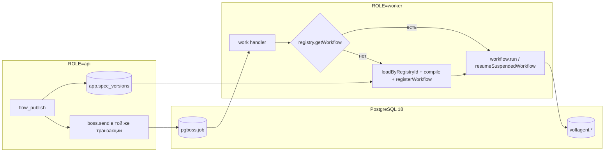

# 17. Фоновые задачи, таймеры и идемпотентность

> Статус: draft
> Зависит от: [07. Компилятор](07-compiler.md), [10. Рантайм](10-runtime.md), [16. Модель данных](16-data-model.md), [12. Наблюдаемость и отладка](12-observability.md)
> Источники: research/jobs-scheduler.md, research/volt-durability.md, scratchpad/research/00-verified-by-lead.md, спека §6.2 (`human`, `tool`), §7.7, §8 (риски 48, 51, 78), §12, §20.4

## Зачем этот слой

VoltAgent даёт durable execution (чекпоинты, `suspend/resume`, `restart`, `timeTravel`), но не даёт ни одного таймера: приостановленный воркфлоу возобновляется **только явным внешним вызовом**. Отсюда риск 51 спеки («долгие ожидания людей и событий») закрывается не рантаймом, а отдельным планировщиком. Тот же планировщик обслуживает всё, что происходит вне прогона: синк каталога моделей (§7.7), батчи evals, shadow/canary при выпуске (риск 78), сверки и ретеншн. Вторая половина документа — про то, что любая очередь даёт at-least-once, а значит узлы с внешним эффектом обязаны быть идемпотентными (риск 48, и прямая оговорка доков VoltAgent про restart).

## Решения

| Решение | Что берём | Версия | Лицензия | Почему |
|---|---|---|---|---|
| Очередь, таймеры, cron | `pg-boss` | 12.31.0 (пин по [DECISIONS](DECISIONS.md): 12.x) | MIT | Наш Postgres уже есть; транзакционный enqueue через `options.db`; отложенный запуск, RRULE, dead-letter и дедуп — штатным API |
| Транзакционный enqueue | `fromDrizzle` из `pg-boss` | — | MIT | Заменяет собственную таблицу outbox |
| Канонизация входа тула | `canonicalize` (RFC 8785 JCS) | 5.0.0 | Apache-2.0 | Уже зафиксирована в DECISIONS для экспорта — одна реализация JCS на продукт |
| Хеш ключа идемпотентности | `@noble/hashes` sha256 с доменной сепарацией | — | MIT | Та же библиотека, что в экспорте; префикс домена другой |
| Запасная очередь | `graphile-worker` | 0.18.0 | MIT | Легче по нагрузке на БД; dead-letter и throttle придётся писать руками |
| Не берём | BullMQ 6.3.4 / Inngest 4.20.0 / Trigger.dev 4.5.16 / Temporal TS SDK 1.23.0 | — | — | См. §2 |

## 1. Каталог фоновых задач

Типы: **timer** — одноразовый отложенный job (`sendAfter`); **cron** — расписание (`schedule`); **batch** — пакетная постановка (`insert`/`flow`); **event** — постановка по факту доменного события внутри транзакции.

| Задача (очередь) | Тип | Частота / триггер | Критичность |
|---|---|---|---|
| `human.deadline` | timer | один job на каждый `suspend` узла `human`, срабатывание в `deadline_at` | критично: без него прогон висит вечно (риск 51) |
| `human.reconcile` | cron | `*/5 * * * *` | критично: страховочный контур для `human.deadline` |
| `gate.deadline` | timer | один job на каждый `suspend` узла `gate` (ожидание события) | критично: та же механика, что у `human` |
| `catalog.sync` | cron | `0 */6 * * *`, отдельный `key` на источник (`openrouter`, `models_dev`) | важно: устаревший каталог ломает расчёт бюджета и выбор модели (§7.7) |
| `cost.reconcile` | cron | `17 3 * * *` | важно: сверка фактической стоимости из ответов провайдеров с каталогом (спека §7.7) |
| `eval.case` | batch | по требованию из Studio/MCP, `insert(name, jobs[])` | важно: блокирует гейт выпуска, но не прод-трафик |
| `eval.report` | event | `flow([...eval.case, {ref:'report', dependsOn:[...]}])` | важно: без отчёта батч бесполезен |
| `workflow.shadow` | event | на каждый прод-прогон версии, помеченной как shadow-источник; `priority: -10` | фоновое: не влияет на прод, отставание допустимо |
| `workflow.canary` | event | на долю трафика по проценту канареечной версии | важно: результат влияет на решение об откате |
| `effects.reconcile` | cron | `*/10 * * * *` | критично: добивает записи `tool_effects` в статусе `in_flight` после падения воркера |
| `retention.partitions` | cron | `40 2 * * *` | фоновое: отцепление старых помесячных партиций `run_nodes` |
| `retention.blobs` | cron | `55 2 * * *` | фоновое: удаление блобов зоны 2/3, на которые нет ссылок |
| `trace.export.retry` | cron | `*/15 * * * *` | фоновое: повторная отправка трасс, не принятых Langfuse |

Не задача планировщика: восстановление после падения процесса. Оно делается на bootstrap одним вызовом `WorkflowRegistry.getInstance().restartAllActiveWorkflowRuns()` — это штатный механизм VoltAgent, cron для него не нужен. Планировщик к моменту этого вызова уже должен быть запущен, потому что перезапущенные шаги могут ставить свои таймеры.

Очереди именуются `<домен>.<действие>` с точкой. Запрет точек из [конвенций](CONVENTIONS.md) относится только к именам MCP-тулов (ограничение Messages API) и на имена очередей не распространяется.

## 2. Выбор pg-boss

Версии и лицензии сняты `npm view` 2026-09-11. Ни один кандидат не заброшен: у всех релиз за последние две недели.

| Критерий | pg-boss 12.31.0 | graphile-worker 0.18.0 | BullMQ 6.3.4 | Inngest 4.20.0 | Trigger.dev 4.5.16 | Temporal TS 1.23.0 |
|---|---|---|---|---|---|---|
| Лицензия | MIT | MIT | MIT | Apache-2.0 | MIT (SDK) | MIT |
| Хранилище | Postgres (`pg ^8.23`) | Postgres (`pg ^8.11`) | Redis | сервер Inngest | Postgres+Redis+ClickHouse | кластер Temporal |
| Новая инфраструктура | нет | нет | Redis | внешний сервис + публичный webhook | тяжёлый стек | кластер |
| Отложенный запуск | `sendAfter(name,data,opts,Date\|string\|seconds)` | `addJob(..., {runAt})` | `delay` | `step.sleep` | `wait.for()` | durable `sleep()` |
| Cron / RRULE | `schedule()`, cron **или** RFC 5545 RRULE, `tz`, `key`, `missed` | crontab-файл | `upsertJobScheduler` | `{cron}` | `schedules.create` | Schedules API |
| Транзакционный enqueue в нашу БД | **да**, `options.db` + `fromDrizzle` | да, через свой `pgClient` | нет | нет | нет | нет |
| Дедуп | `singletonKey`+`singletonSeconds`, `sendThrottled`, `sendDebounced`, политики очереди | `jobKey`+`jobKeyMode` | `jobId` | `idempotency` | `idempotencyKey` | `WorkflowId` + reuse policy |
| Dead-letter | `deadLetter` + `redrive()` | нет из коробки | нет | — | — | — |
| Риск для нас | схема pg-boss в нашей БД, нагрузка на PG | скромнее по фичам | лишний Redis | vendor lock в критическом пути | vendor lock + стек | **дублирует VoltAgent** |

Решающие аргументы за pg-boss:

1. Нулевая новая инфраструктура: Postgres 18 уже наш (там же `@voltagent/postgres@2.1.3`), задачи, трассы и бизнес-данные попадают в один бэкап.
2. Все тринадцать задач из §1 закрываются штатным API без самописных обвязок: `sendAfter` — дедлайны, `schedule` — cron/RRULE, `insert`/`flow` — батчи evals с финальным отчётом, `singletonKey` и политики очередей — дедуп shadow/canary, `deadLetter`+`redrive` — разбор падений.
3. `options.db` + `fromDrizzle` делает бизнес-запись и постановку задачи одной транзакцией. Это и есть outbox, только без своего релея (§4).

Почему не durable-execution платформы. Inngest, Trigger.dev и Temporal решают ту же задачу, что уже решает `@voltagent/core@2.10.0`: чекпоинты, возобновление, ретраи шагов. Взять любую из них — значит держать в одном продукте две модели исполнения, два формата трасс и две семантики ретраев, а решение «где живёт шаг воркфлоу» придётся принимать на каждом узле IR. Нам нужен не второй движок, а таймер, планировщик и надёжный enqueue.

Почему не BullMQ. Бизнес-запись в Postgres и enqueue в Redis атомарными не сделать — пришлось бы писать таблицу outbox и релей к ней. Плюс Redis как новая точка отказа и новый бэкап. У `bullmq@6.3.4` появился опциональный peer `pg >= 8.0.0`, то есть Postgres-бэкенд, но его зрелость не проверялась (см. «Открытые вопросы»).

**Запасной вариант и триггер перехода.** Уходим на `graphile-worker@0.18` (MIT), если нагрузочный прогон покажет, что pg-boss деградирует нашу основную БД. Конкретные триггеры: устойчивый рост `xmin_horizon`/`index_bloat` в warning-событиях pg-boss; `slow_query` чаще одного раза в минуту на рабочем профиле; доля времени БД, потраченного на схему `pgboss`, выше 15% по `pg_stat_statements`. Цена перехода — своими руками dead-letter, `sendThrottled`/`sendDebounced` и батч-хендлеры; отложенный запуск (`runAt`), cron и транзакционный enqueue у graphile-worker есть. Второй, менее вероятный триггер: нужен строгий durable-execution с человеко-годами ожидания и версионированием истории — тогда пересмотру подлежит не очередь, а весь §2, и это отдельный ADR.

## 3. Модель процессов: один образ, две роли

Один Docker-образ, один Composition Root, роль выбирается переменной окружения `ROLE`. Роль определяет только набор поднимаемых адаптеров — ни компилятор, ни реестр воркфлоу, ни доступ к БД от роли не зависят.

| | `ROLE=api` | `ROLE=worker` |
|---|---|---|
| VoltAgent | да | да |
| `@voltagent/server-hono` | да (execute/stream/suspend/resume/cancel + `configureApp`) | нет |
| `WorkflowRegistry` | да, ленивое наполнение | да, ленивое наполнение |
| Компилятор IR → VoltAgent | да | да |
| pg-boss | producer: `send`, `sendAfter`, `insert`, `flow`, `upsert` | producer + consumer: те же плюс `work()` на всех очередях |
| `ConstructorOptions.schedule` | `false` | `true` |
| `restartAllActiveWorkflowRuns()` на bootstrap | нет | да |
| Масштабирование | по HTTP-нагрузке | по глубине очередей |

Почему обе роли держат реестр и компилятор. `resumeSuspendedWorkflow` исполняет воркфлоу **в том процессе, который его вызвал**, значит воркер обязан иметь зарегистрированное определение. `WorkflowRegistry.getInstance()` — синглтон на `globalThis` (`___voltagent_workflow_registry`), разнести один реестр между процессами нельзя, его можно только продублировать. Поскольку оба процесса строят реестр из одного источника — таблицы определений IR плюс компилятор, — дублирование получается автоматически, а не двумя руками поддерживаемыми списками.

### Общая БД, три схемы

| Схема | Кто владеет | Миграции |
|---|---|---|
| `app` | наш код | drizzle-kit, forward-only, expand/contract |
| `voltagent` | `@voltagent/postgres@2.1.3` | `CREATE TABLE IF NOT EXISTS` в рантайме, не трогаем |
| `pgboss` | pg-boss | **не рантайм**: в проде `migrate:false`, `createSchema:false`, DDL прогоняется отдельным шагом деплоя через `getMigrationPlans(schema, version)`; рантайм-роль не имеет DDL-прав |

`detectSchemaDrift()` и `schemaVersion()` включаются в health-чек обеих ролей: расхождение версии схемы pg-boss с версией образа — повод не пускать процесс в ротацию.

### Как новая версия воркфлоу доезжает до воркера

Идентификатор в реестре — версионный: `registryId = ${workflowId}@${rev}`. Публикация новой версии не подменяет определение, а добавляет новое, поэтому приостановленное исполнение всегда возобновляется той же версией, под которой начиналось, а `unregisterWorkflow` старой ревизии безопасен ровно тогда, когда по ней нет suspended-исполнений.

Основной механизм — **ленивая компиляция по требованию** (паттерн Registry + ленивая инициализация). Воркер не подписан на события публикации и не обязан ничего знать заранее: получив job, он резолвит `registryId` и компилирует определение из БД, если его ещё нет в реестре.

```ts
interface WorkflowProvider {
  resolve(registryId: RegistryId): Promise<RegisteredWorkflow>
}

class LazyWorkflowProvider implements WorkflowProvider {
  constructor(
    private readonly registry: WorkflowRegistry,
    private readonly specs: SpecStore,
    private readonly compiler: IrCompiler,
  ) {}

  async resolve(registryId: RegistryId): Promise<RegisteredWorkflow> {
    const cached = this.registry.getWorkflow(registryId)
    if (cached) return cached

    const definition = await this.definitions.loadByRegistryId(registryId)
    this.registry.registerWorkflow(this.compiler.compile(definition))

    const registered = this.registry.getWorkflow(registryId)
    if (!registered) throw new WorkflowRegistrationFailed(registryId)
    return registered
  }
}
```

Каждый обработчик очереди, который трогает воркфлоу (`human.deadline`, `gate.deadline`, `workflow.shadow`, `workflow.canary`, `eval.case`), начинается с `await provider.resolve(job.data.registryId)`. Свойства этого решения: воркер холодного старта работоспособен сразу, ни одно событие публикации потерять нельзя, а порядок «опубликовали и тут же поставили задачу» не создаёт гонки.

Pub/sub-уведомление (`boss.publish('workflow.published', {registryId})` → `subscribe` → предварительная компиляция) — **оптимизация задержки первого прогона, а не механизм корректности**. Включаем после того, как измерим время компиляции; отказ pub/sub не должен ломать ничего.

Вытеснение: реестр — глобальный синглтон и растёт без ограничений, поэтому на воркере держим LRU по `registryId` с вызовом `unregisterWorkflow` для вытесненных ревизий, у которых нет активных и приостановленных исполнений. Проверка «нет исполнений» делается по `getSuspendedWorkflowStates(workflowId)` и `registry.activeExecutions`, а не по догадке.



Дополнительные свойства топологии: несколько реплик воркера безопасны (`SKIP LOCKED` внутри pg-boss), а `schedule()` идемпотентен по паре `(name, key)` — поэтому объявление расписаний выполняется на старте **каждой** реплики, а не отдельной миграцией.

## 4. Транзакционная постановка задач

Классическая проблема «записали бизнес-факт, но не поставили задачу» (или наоборот) у нас не возникает: очередь живёт в том же Postgres, а `SendOptions` принимает поле `db`, через которое pg-boss выполняет свой INSERT нашим соединением. Адаптер для Drizzle входит в пакет:

```ts
fromDrizzle(tx: DrizzleTransactionLike, sql: DrizzleSqlTagLike): IDatabase
```

Рядом поставляются `fromKysely`, `fromKnex`, `fromPrisma`, `fromPglite`, `fromBunSql`. Импорт именованный, default-экспорта у pg-boss 12 нет:

```ts
import { sql } from 'drizzle-orm'
import { PgBoss, fromDrizzle } from 'pg-boss'
```

Точный сниппет постановки. Публикация версии воркфлоу и постановка shadow-прогона — одна атомарная единица:

```ts
async function publishRevision(input: PublishInput): Promise<PublishResult> {
  return db.transaction(async (tx) => {
    const [revision] = await tx
      .insert(workflowRevisions)
      .values({ tenantId: input.tenantId, workflowId: input.workflowId, ir: input.ir })
      .returning()

    const jobId = await boss.send(
      'workflow.shadow',
      { tenantId: input.tenantId, registryId: toRegistryId(revision) },
      { priority: -10, singletonKey: toRegistryId(revision), db: fromDrizzle(tx, sql) },
    )

    return { revision, shadowJobId: jobId }
  })
}
```

Три правила, которые здесь зашиты:

1. **`send` внутри транзакции — единственный разрешённый способ ставить задачу, порождённую изменением наших данных.** Постановка вне транзакции допустима только для задач, не связанных с записью (ручной перезапуск из Studio, `human.reconcile`, разовый `catalog.sync` по кнопке).
2. **`send()` возвращает `null`, когда задача отброшена политикой очереди или дедупом.** Это не ошибка и не успех — это «дубликат». Возврат обязан проверяться; молча игнорировать `null` запрещено, иначе дедуп работает, а код считает, что таймер поставлен. В типах это `Promise<string | null>`, `strictNullChecks` заставит обработать.
3. **В транзакции нет сетевых вызовов.** LLM-вызов, HTTP-тул и чтение внешнего каталога выносятся до или после; транзакция держит только записи в `app.*` и INSERT pg-boss.

### Почему свой outbox не нужен

Transactional outbox нужен ровно тогда, когда бизнес-запись и очередь лежат в разных хранилищах: тогда пишут строку в таблицу-аутбокс в той же транзакции, а отдельный релей вычитывает её и публикует в брокер. У нас брокер **и есть** таблица в той же БД, поэтому `fromDrizzle(tx, sql)` схлопывает две записи в одну транзакцию, а релей вырождается — его роль исполняет сам воркер pg-boss, читающий `pgboss.job` с `SKIP LOCKED`. Своя таблица outbox добавила бы третье состояние («опубликовано в outbox, но не в очередь») и собственный демон-релей, то есть ровно ту сложность, которую outbox и призван устранять.

`pg-transactional-outbox@0.6.5` (MIT) рассматривался как готовая реализация outbox через логическую репликацию. Для v1 не берём: сценарий полностью покрыт `options.db`, а пакет pre-1.0 и без релизов с 2026-01-24 — брать зависимость с таким профилем ради функции, которой у нас нет, нельзя.

Оговорка по инфраструктуре: `useListenNotify` держит отдельное соединение и не работает через PgBouncer в transaction pooling; при сбое pg-boss деградирует на поллинг и выдаёт `warning` типа `listen_notify_unavailable`. Транзакционный enqueue от этого не зависит — он идёт нашим соединением из пула Drizzle.

## 5. Идемпотентность эффектов

Честная формулировка, которую надо держать в голове всем: **exactly-once доставки не существует. Есть at-least-once доставка плюс idempotent receiver, что даёт effectively-once эффект.** README pg-boss говорит про «exactly-once job delivery» — это утверждение про то, что два воркера не возьмут один job одновременно (`SKIP LOCKED` + атомарный коммит), и оно **не** отменяет повторной выдачи job после истечения `expireInSeconds` или потери heartbeat. Тот же вывод независимо приходит со стороны VoltAgent: доки `restart` прямо предупреждают, что «external side effects may have already occurred before a crash», а гранулярность восстановления — граница шага.

### Ключ идемпотентности

```
idempotency_key = "sha256-" + hex(sha256(
  "aqven:tool-effect:v1" || 0x00 ||
  tenant_id || 0x00 || workflow_id || 0x00 || execution_id || 0x00 ||
  node_id || 0x00 || attempt_scope || 0x00 || jcs(tool_input)
))
```

| Компонент | Откуда берётся | Зачем |
|---|---|---|
| `"aqven:tool-effect:v1"` | константа | доменная сепарация: хеши эффектов не должны сталкиваться с хешами экспорта и кассет |
| `tenant_id` | контекст вызова | изоляция арендаторов; ключ одного тенанта не может «попасть» в журнал другого |
| `workflow_id`, `execution_id`, `node_id` | контекст шага VoltAgent | пара `execution_id + node_id` уже уникальна в рамках прогона — этого достаточно для ретрая одного и того же шага |
| `attempt_scope` | номер итерации из `workflowState` для узлов внутри `andDoWhile`/`andDoUntil`/`andForEach`, иначе `"0"` | в цикле один и тот же `node_id` выполняется N раз, и это N **разных** эффектов, а не дубликаты |
| `jcs(tool_input)` | `canonicalize@5.0.0` | защита от «шаг тот же, вход поменялся» |

Канонизация обязательна: `{a:1,b:2}` и `{b:2,a:1}` должны давать один ключ. Берём `canonicalize@5.0.0` (RFC 8785 JCS) — ту же реализацию, что зафиксирована в DECISIONS для экспорта, чтобы в продукте была ровно одна канонизация JSON. Хеш — `@noble/hashes` sha256, префикс `sha256-`. `object-hash@3.0.0` не используем: последний релиз 2023-01.

Перед канонизацией вход прогоняется через нормализатор: из него вырезаются поля, помеченные в IR как `volatile` (метки времени, идентификаторы попытки, `requestId`). Иначе ключ будет разным на каждой попытке и журнал станет бесполезным.

### Таблица `app.tool_effects`

```sql
create table app.tool_effects (
  idempotency_key text        primary key,
  tenant_id       uuid        not null,
  workflow_id     text        not null,
  execution_id    text        not null,
  node_id         text        not null,
  attempt_scope   text        not null,
  tool_name       text        not null,
  effect_class    text        not null,
  status          text        not null,
  request_hash    text        not null,
  response        jsonb,
  provider_ref    text,
  error           jsonb,
  created_at      timestamptz not null default now(),
  updated_at      timestamptz not null default now(),
  constraint tool_effects_status_ck
    check (status in ('in_flight', 'succeeded', 'failed')),
  constraint tool_effects_effect_class_ck
    check (effect_class in ('write', 'external'))
);

create index tool_effects_execution_idx on app.tool_effects (tenant_id, execution_id, node_id);
create index tool_effects_stuck_idx     on app.tool_effects (status, updated_at) where status = 'in_flight';

alter table app.tool_effects enable row level security;

create policy tool_effects_tenant_isolation on app.tool_effects
  using (tenant_id = current_setting('app.tenant_id')::uuid)
  with check (tenant_id = current_setting('app.tenant_id')::uuid);
```

`effect_class` повторяет классификацию узла `tool` из спеки §6.2 (`read | write | external`); в журнал попадают только `write` и `external` — у `read` эффекта нет, ему нужен кэш и кассета, а не журнал.

### Claim и исходы

Claim — одна атомарная вставка, а не «проверить и вставить»:

```sql
insert into app.tool_effects (idempotency_key, tenant_id, workflow_id, execution_id,
                              node_id, attempt_scope, tool_name, effect_class, status, request_hash)
values ($1, $2, $3, $4, $5, $6, $7, $8, 'in_flight', $9)
on conflict (idempotency_key) do nothing
returning idempotency_key;
```

Пустой `returning` означает, что строку уже создал кто-то другой: читаем её и решаем по статусу.

| Состояние строки | Что делает декоратор |
|---|---|
| вставка прошла | вызывает провайдера, затем пишет `succeeded`/`failed` с `response` и `provider_ref` |
| `succeeded` | возвращает сохранённый `response`. Повторного вызова провайдера **нет** |
| `failed` | возвращает сохранённую ошибку; повторная попытка разрешена только политикой узла `on_error`, и тогда она идёт с новым `attempt_scope` |
| `in_flight` | конкурент или оборванная попытка: job падает с retryable-ошибкой и уходит в backoff. Сознательный выбор: лучше задержка, чем дубль |

Строки в `in_flight` старше `expireInSeconds` очереди добивает `effects.reconcile` (§1): для каждой зависшей записи он пытается подтвердить исход у провайдера по `provider_ref`, а при невозможности — переводит в `failed` с пометкой `indeterminate`, которая в Studio показывается отдельным значком и требует ручного разбора. Автоматически «домысливать» успех запрещено.

Типы исходов и декоратор (паттерн Decorator; ядро тула про журнал не знает — Single Responsibility и Open/Closed):

```ts
type EffectClaim =
  | { readonly kind: 'claimed' }
  | { readonly kind: 'replayed'; readonly response: unknown }
  | { readonly kind: 'failed'; readonly error: ToolError }
  | { readonly kind: 'in_flight' }

const CLAIM_HANDLERS: Record<EffectClaim['kind'], ClaimHandler> = {
  claimed: runAndRecord,
  replayed: returnRecorded,
  failed: rethrowRecorded,
  in_flight: throwRetryable,
}

class IdempotentTool implements Tool {
  constructor(
    private readonly inner: Tool,
    private readonly effects: ToolEffectJournal,
    private readonly keys: IdempotencyKeyFactory,
  ) {}

  async execute(input: ToolInput, ctx: ToolContext): Promise<ToolOutput> {
    const key = this.keys.build(this.inner.name, input, ctx)
    const claim = await this.effects.claim(key, this.inner, input, ctx)
    return CLAIM_HANDLERS[claim.kind]({ claim, key, tool: this.inner, input, ctx })
  }
}
```

Таблица `CLAIM_HANDLERS` вместо `switch` — прямое следствие правила о плоском коде: добавление нового исхода не трогает `execute`.

### Правила уровня IR и компилятора

- Узел `tool` обязан декларировать `effect_class` и `idempotency: 'key' | 'natural' | 'none'`. Компилятор оборачивает в `IdempotentTool` только `write` и `external` — журналировать всё дороже и бессмысленно.
- `idempotency: 'natural'` (PUT по стабильному идентификатору на стороне провайдера) предпочтительнее журнала и используется всегда, когда провайдер это позволяет; журнал в этом случае ведётся только для аудита и провенанса.
- Ключ прокидывается в собственный механизм идемпотентности провайдера, если он есть (`Idempotency-Key` у Stripe-подобных API). У Telegram Bot API своего механизма нет — дедуп целиком на нашей стороне.
- `idempotency: 'none'` при `effect_class` `write`/`external` — ошибка компиляции, а не предупреждение (правило валидации IR, каталог рисков §8, риск 48).
- Ретраи живут **на очереди** (`retryLimit`, `retryBackoff`), а не на туле. Два конкурирующих механизма ретрая — источник неотлаживаемых дублей.

## 6. Таймауты человеческих задач

Опорный факт: VoltAgent приостанавливает шаг через `suspend(reason, suspendData)` и возобновляет **только явным вызовом** `resumeSuspendedWorkflow`. Таймера у него нет. Поля `deadline`/`expiresAt` в `WorkflowStateEntry.suspension` тоже нет, а `getSuspendedWorkflows()` отдаёт только `suspendedAt` — то есть «покажи просроченные» пришлось бы делать полным сканом всех приостановленных исполнений. Как основной механизм это не годится.

Дедлайн поэтому хранится **намеренно в двух местах**: `app.human_tasks` — источник истины для UI, аудита и сверки; отложенный job pg-boss — исполнительный механизм. Расхождение между ними ловит reconciler.

### Таблица `app.human_tasks`

```sql
create table app.human_tasks (
  id             uuid        primary key default uuidv7(),
  tenant_id      uuid        not null,
  execution_id   text        not null,
  registry_id    text        not null,
  step_id        text        not null,
  assignee       text,
  form_kind      text        not null,
  deadline_at    timestamptz not null,
  timeout_policy text        not null,
  status         text        not null,
  resolved_by    text,
  resolution     jsonb,
  created_at     timestamptz not null default now(),
  updated_at     timestamptz not null default now(),
  constraint human_tasks_status_ck
    check (status in ('pending', 'answered', 'timed_out', 'cancelled')),
  constraint human_tasks_policy_ck
    check (timeout_policy in ('fail', 'default_value', 'escalate', 'continue_without')),
  constraint human_tasks_step_uq unique (execution_id, step_id)
);

create index human_tasks_due_idx on app.human_tasks (deadline_at)
  where status = 'pending';

alter table app.human_tasks enable row level security;

create policy human_tasks_tenant_isolation on app.human_tasks
  using (tenant_id = current_setting('app.tenant_id')::uuid)
  with check (tenant_id = current_setting('app.tenant_id')::uuid);
```

### Постановка отложенной задачи в момент suspend

```ts
execute: async ({ data, suspend, resumeData, workflowState, executionId }) => {
  if (resumeData) return applyHumanDecision(data, resumeData)

  const deadlineAt = addSeconds(new Date(), node.timeoutSeconds)
  const singletonKey = `${executionId}:${node.id}`

  await db.transaction(async (tx) => {
    await tx.insert(humanTasks).values({
      tenantId, executionId, registryId, stepId: node.id,
      assignee: node.assignee, formKind: node.form.kind,
      deadlineAt, timeoutPolicy: node.timeoutPolicy, status: 'pending',
    })

    await boss.sendAfter(
      'human.deadline',
      { tenantId, executionId, registryId, stepId: node.id, deadlineAt: deadlineAt.toISOString() },
      { singletonKey, db: fromDrizzle(tx, sql) },
      deadlineAt,
    )
  })

  await suspend('human_input_required', { deadlineAt, assignee: node.assignee, formKind: node.form.kind })
}
```

Что здесь важно:

- `sendAfter(name, data, options, date: Date)` — штатная перегрузка отложенного запуска; собственного поллинга и `setTimeout` нет нигде. Отложенный job лежит в Postgres и переживает рестарт процесса — ровно то свойство, ради которого таймеры вынесены из памяти.
- `singletonKey = '<executionId>:<stepId>'` плюс политика очереди `stately` даёт **ровно один живой таймер на задачу**: повторное исполнение шага после `restart` вернёт из `send` значение `null` и не наплодит дублей.
- Запись `human_tasks` и постановка таймера — одна транзакция (§4). Состояний «задача есть, таймера нет» и «таймер есть, задачи нет» не существует.
- `suspendData` (второй аргумент `suspend`) несёт дедлайн и форму — этого достаточно, чтобы Studio отрисовал карточку задачи из данных VoltAgent, не обращаясь к нашей таблице.
- Продление дедлайна («человек попросил ещё день») — `boss.upsert('human.deadline', data, { singletonKey, startAfter: newDeadline })`. `upsert` перезаписывает существующий pre-active job по ключу, что закрывает гонку `deleteJob` + `send`. `JobMatchStrategy` оставляем `'newest'`.

### Очередь и обработчик

```ts
await boss.createQueue('human.deadline', {
  policy: 'stately',
  retryLimit: 5,
  retryBackoff: true,
  retryDelayMax: 300,
  deadLetter: 'human.deadline.dlq',
  expireInSeconds: 120,
  heartbeatSeconds: 30,
})

await boss.work<DeadlinePayload>(
  'human.deadline',
  { batchSize: 20, perJobResults: true },
  async (jobs) => toJobResults(
    await Promise.allSettled(jobs.map((job) => expireHumanTask(job.data, job.signal))),
  ),
)

async function expireHumanTask(payload: DeadlinePayload, signal: AbortSignal): Promise<void> {
  const claimed = await claimTimeout(payload)
  if (!claimed) return

  const workflow = await provider.resolve(payload.registryId)
  const resumed = await WorkflowRegistry.getInstance().resumeSuspendedWorkflow(
    payload.registryId,
    payload.executionId,
    { kind: 'timeout', policy: claimed.timeoutPolicy, deadlineAt: payload.deadlineAt },
    payload.stepId,
  )
  if (!resumed) throw new SuspendedExecutionNotFound(payload)
}
```

`perJobResults: true` заставляет хендлер вернуть `JobResult[]` со статусом на каждый элемент батча; **job, не упомянутый в результате, считается failed** — поэтому `toJobResults` обязан отображать все элементы один в один. `job.signal` пробрасывается во все внешние вызовы, иначе остановка воркера и истечение `expireInSeconds` не отменяют работу.

### Гонка «ответил ровно на дедлайне»

Решается не в коде воркера, а условным UPDATE — выигрывает ровно один участник:

```sql
update app.human_tasks
   set status = 'timed_out', updated_at = now()
 where execution_id = $1 and step_id = $2 and status = 'pending'
returning timeout_policy, deadline_at;
```

Тот же приём в обратную сторону: HTTP-эндпоинт ответа человека делает

```sql
update app.human_tasks
   set status = 'answered', resolved_by = $3, resolution = $4, updated_at = now()
 where execution_id = $1 and step_id = $2 and status = 'pending'
returning id;
```

и вызывает `resumeSuspendedWorkflow` **только при непустом `returning`**. Пустой результат — ответ «задача уже закрыта», HTTP 409 с текущим статусом. Ни блокировок, ни распределённых локов, ни сравнения времён в приложении: единственный арбитр — строка в БД.

После успешного ответа человека таймер не нужен — эндпоинт делает `boss.deleteJob('human.deadline', jobId)` или просто оставляет его, потому что `claimTimeout` вернёт пусто и обработчик выйдет ранним возвратом. Удаление — оптимизация; корректность обеспечена условным UPDATE.

### Требование к компилятору

`resumeData` проходит валидацию `resumeSchema` шага. Значит **схема резюма обязана допускать вариант таймаута**, иначе возобновление по дедлайну упадёт на валидации, и задача зависнет навсегда именно в тот момент, когда механизм должен был сработать. Компилятор генерирует для каждого узла `human` и `gate` дискриминированный union:

```ts
const resumeSchema = z.discriminatedUnion('kind', [
  z.object({ kind: z.literal('human'), decision: formSchema, actor: z.string() }),
  z.object({ kind: z.literal('timeout'),
             policy: z.enum(['fail', 'default_value', 'escalate', 'continue_without']),
             deadlineAt: z.string() }),
])
```

Правило валидации IR: узел `human`/`gate` с `timeoutSeconds`, чья `resumeSchema` не содержит ветку `kind: 'timeout'`, не компилируется. Это тот же класс проверки, что полнота `switch` и лимиты циклов (спека §8, пункт «проверка управляющих конструкций»).

Политика таймаута **не зашита в воркер**. Воркер читает `timeout_policy` из claim'а и кладёт её в `resumeData`; решение — `fail`, подстановка значения по умолчанию, эскалация на другого исполнителя или продолжение без ответа — принимает сам шаг. Воркер остаётся тупым (Single Responsibility): он умеет только «наступил дедлайн, вот политика».

### Страховочный сверяющий cron

Отложенный job теряется: чистка по `retentionSeconds`, ручное вмешательство в БД, миграция схемы pg-boss, наш баг. Поэтому второй контур обязателен.

```ts
await boss.schedule('human.reconcile', '*/5 * * * *', {}, { tz: 'UTC', missed: 'once' })
```

Обработчик делает два прохода в разные стороны:

| Проход | Запрос | Действие | Метрика |
|---|---|---|---|
| Просроченные без таймера | `select ... from app.human_tasks where status='pending' and deadline_at < now() - interval '1 minute'` | пере-поставить `human.deadline` с тем же `singletonKey`; дубликат отсечётся политикой `stately` | `human_deadline_missed_total` |
| Приостановленные без задачи | `registry.getSuspendedWorkflows()` минус строки `app.human_tasks` | алерт «повисшее исполнение», автоматика не трогает | `suspended_without_task_total` |

Ненулевой `human_deadline_missed_total` — сигнал о баге в основном пути, а не нормальная работа. Он выводится на дашборд и алертится по порогу.

### Порядок действий на старте воркера

1. Поднять `WorkflowProvider` (реестр пуст, компиляция ленивая).
2. `boss.start()`.
3. `boss.createQueue(...)` для всех очередей и `boss.schedule(...)` для всех расписаний — оба идемпотентны.
4. `WorkflowRegistry.getInstance().restartAllActiveWorkflowRuns()` — восстановление исполнений, прерванных падением.
5. Один немедленный прогон `human.reconcile`, не дожидаясь первого срабатывания cron.

На `SIGTERM`: `suspendAllActiveWorkflows(reason)`, затем `offWork` на всех очередях, затем `boss.stop()`.

### Та же механика на остальных сценариях

| Сценарий | Очередь / постановка | Дедуп |
|---|---|---|
| Дедлайн `human` | `human.deadline`, `sendAfter(date)` | `singletonKey = execId:stepId`, policy `stately` |
| Дедлайн `gate` (ожидание события) | `gate.deadline`, `sendAfter(date)` | то же |
| Синк каталога моделей | `catalog.sync`, `schedule` с `key` на источник | `key` расписания + policy `singleton` |
| Батч evals | `eval.case` через `insert(name, jobs[])`, отчёт — `flow` с `dependsOn` | `singletonKey = suiteId:caseId:variantId` |
| Shadow / canary | `workflow.shadow`, `priority: -10`, `groupConcurrency` на тенанта | `singletonKey = sourceExecId:registryId` |

## 7. Расписания, политики очередей, приоритеты, дедупликация

### cron и RRULE

```ts
schedule(name: string, cron: string, data?: object | null, options?: ScheduleOptions): Promise<void>
unschedule(name: string, key?: string): Promise<void>
getSchedules(name?: string, key?: string): Promise<Schedule[]>
previewSchedule(cron: string, options?: PreviewScheduleOptions): Date[]

type ScheduleOptions = SendOptions & { tz?: string; key?: string; missed?: 'skip' | 'once' }
```

Второй аргумент — cron-выражение **или** RFC 5545 RRULE (`FREQ=MONTHLY;BYDAY=-1FR;BYHOUR=17`). Внутри — `cron-parser@^5.10` и `rrule-temporal@^2.2`, отдельной зависимости нам не нужно. Правило выбора: пять полей cron покрывают всё регулярное («каждые шесть часов»), RRULE берём только там, где календарная семантика не выражается cron'ом — «последняя пятница месяца», «второй рабочий день квартала». Такие расписания появляются у отчётности по стоимости и у пользовательских триггеров воркфлоу.

`previewSchedule` синхронный — Studio показывает пользователю ближайшие срабатывания прямо в форме, без обращения к воркеру.

`missed` определяет, что произойдёт с сработками, пропущенными за время деплоя или простоя: `'skip'` (по умолчанию) не шлёт ничего, `'once'` шлёт одну задачу за самое свежее пропущенное окно.

| Расписание | Выражение | `tz` | `key` | `missed` | Почему так |
|---|---|---|---|---|---|
| `catalog.sync` (OpenRouter) | `0 */6 * * *` | `UTC` | `openrouter` | `once` | Пропущенный синк нужно догнать один раз; десять догоняющих синков подряд бессмысленны |
| `catalog.sync` (models.dev) | `20 */6 * * *` | `UTC` | `models_dev` | `once` | Тот же приём; смещение на 20 минут разводит два источника по времени |
| `human.reconcile` | `*/5 * * * *` | `UTC` | — | `once` | Догнать обязательно: пропуск означает просроченные задачи |
| `effects.reconcile` | `*/10 * * * *` | `UTC` | — | `once` | То же |
| `cost.reconcile` | `17 3 * * *` | `UTC` | — | `once` | Ночное окно, нечётная минута — чтобы не совпасть с бэкапом |
| `retention.partitions` | `40 2 * * *` | `UTC` | — | `skip` | Пропуск безвреден, следующая ночь доделает |
| `retention.blobs` | `55 2 * * *` | `UTC` | — | `skip` | То же |

Все `tz` — `UTC`. Локальные часовые пояса допускаются только в пользовательских расписаниях воркфлоу, где `tz` задаёт сам автор; системные задачи от перевода часов зависеть не должны.

Один `key` на источник позволяет держать несколько расписаний на одной очереди — поэтому `catalog.sync` не размножается в `catalog.sync.openrouter`, `catalog.sync.models_dev` и так далее.

### Политики очередей

`QueuePolicy` применяется **в разрезе `singletonKey`**, а не ко всей очереди — все политики, кроме `standard`, «расширяются ключом». Это и есть механизм «одна активная human-задача на ключ», «один синк каталога на источник».

| Политика | Семантика | Где применяем |
|---|---|---|
| `standard` | без ограничений | `eval.case`, `trace.export.retry` |
| `short` | 1 job в очереди, active неограниченно | — |
| `singleton` | 1 active, queued неограниченно | `catalog.sync`, `cost.reconcile` |
| `stately` | 1 job на состояние (queued и/или active) | `human.deadline`, `gate.deadline` |
| `exclusive` | 1 job queued **или** active | `retention.partitions`, `retention.blobs`, `human.reconcile`, `effects.reconcile` |
| `key_strict_fifo` | строгий FIFO внутри `singletonKey`; приоритет внутри ключа не переупорядочивает; отложенный job встраивается в порядок по наступлении `startAfter` | `workflow.canary` — прогоны одной канареечной версии должны идти в порядке поступления |

### Приоритеты и параллелизм

`priority: number` на job'е, `minPriority`/`maxPriority` у воркера. Шкала фиксируется один раз, чтобы числа не расползлись:

| Приоритет | Задачи |
|---|---|
| `+20` | `human.deadline`, `gate.deadline` — человек уже ждёт дольше положенного |
| `+10` | `workflow.canary` — результат нужен для решения об откате |
| `0` | `catalog.sync`, `eval.case`, `effects.reconcile`, `human.reconcile` |
| `-10` | `workflow.shadow` — фон, не конкурирует с прод-трафиком |
| `-20` | `retention.*`, `trace.export.retry` |

Выделенный «быстрый» воркер поднимается как `work(name, { minPriority: 10, ... })`, «тяжёлый» — как `work(name, { maxPriority: 0, batchSize: ... })`. Так дедлайн человека не встаёт в очередь за eval-батчем на три часа.

Поля `priority` и `orderByCreatedOn` внутри `JobFetchOptions` помечены `@deprecated` с 12.30.0 и игнорируются — не использовать.

Мультитенантность: `group: { id: tenantId, tier }` на job'е плюс `groupConcurrency` у воркера ограничивает параллелизм **на тенанта через БД**, то есть согласованно между всеми репликами. `localGroupConcurrency` — тот же лимит в пределах одного процесса. Один арендатор с батчем на десять тысяч evals не должен выедать весь пул воркеров.

### Дедупликация

| Инструмент | Сигнатура | Когда |
|---|---|---|
| `singletonKey` | поле `JobOptions` | основной ключ уникальности, всегда детерминированный из домена |
| `singletonSeconds` | поле `JobOptions` | окно throttle: не чаще одного раза за N секунд на ключ |
| `singletonNextSlot` | поле `JobOptions` | вместо отбрасывания перенести в следующий слот |
| `sendThrottled(name, data, opts, seconds, key?)` | метод | «не чаще, чем раз в N» — ручной пересинк каталога по кнопке |
| `sendDebounced(name, data, opts, seconds, key?)` | метод | «подождать, пока правки утихнут» — переиндексация после серии `flow_patch` |
| `upsert(name, data, opts)` | метод | перенос дедлайна, обновление payload существующего pre-active job'а без гонки delete+insert |
| `getBlockedKeys(name)` | метод | диагностика: какие ключи сейчас глушат постановку |

Правило формирования ключа: `singletonKey` строится только из доменных идентификаторов (`executionId`, `stepId`, `registryId`, `suiteId:caseId:variantId`) и никогда — из времени, случайных чисел или счётчика попыток. Ключ, зависящий от попытки, отключает дедуп молча.

И ещё раз, потому что это самая частая ошибка интеграции: **любой `send`/`sendAfter`/`sendThrottled`/`sendDebounced` возвращает `null`, если задача отброшена дедупом**. Возврат проверяется всегда.

## 8. Наблюдаемость задач

### Что кладём в payload и в лог

Каждый job несёт минимальный конверт, одинаковый для всех очередей:

```ts
interface JobEnvelope {
  readonly tenantId: TenantId
  readonly traceparent: string
  readonly cause: JobCause
}

type JobCause =
  | { readonly kind: 'schedule'; readonly scheduleKey: string }
  | { readonly kind: 'execution'; readonly executionId: ExecutionId; readonly stepId: string }
  | { readonly kind: 'user'; readonly actor: string }
  | { readonly kind: 'reconcile'; readonly source: string }
```

`traceparent` — W3C-контекст того запроса или прогона, который задачу породил. Обработчик восстанавливает из него родителя спана, поэтому в Langfuse фоновая работа видна как продолжение исходной трассы, а не как отдельный сирота. `cause` отвечает на вопрос «почему эта задача вообще появилась» — без него разбор дедлеттера превращается в археологию.

Структурированный лог на каждый job: `queue`, `jobId`, `tenantId`, `cause.kind`, `retryCount`, `durationMs`, `outcome` (`completed | failed | deadletter | duplicate`). `outcome: 'duplicate'` пишется на стороне producer'а, когда `send` вернул `null` — иначе дедуп невидим.

### Метрики

| Метрика | Источник | Порог алерта |
|---|---|---|
| `queue_ready_depth{queue}` | `getQueueStats(name).readyCount` | `human.deadline` > 0 дольше 2 минут; остальные — по очереди |
| `queue_deadletter_depth{queue}` | `getQueueStats` по `*.dlq` | > 0 — всегда тикет |
| `job_duration_seconds{queue}` | замер в обработчике | p99 против `expireInSeconds` очереди |
| `human_deadline_missed_total` | reconciler (§6) | > 0 — баг основного пути |
| `suspended_without_task_total` | reconciler (§6) | > 0 — повисшее исполнение |
| `effects_in_flight_stuck_total` | `effects.reconcile` (§5) | > 0 дольше 30 минут |
| `pgboss_warning_total{type}` | событие `warning` | см. таблицу ниже |

**Метрика бэклога — только `readyCount`** (`queuedCount - deferredCount`). `queuedCount` включает отложенные задачи, а у нас очередь `human.deadline` по определению забита таймерами на дни вперёд — по `queuedCount` она всегда выглядит аварийной.

### Warning-события pg-boss

`boss.on('error', handler)` подписывается **всегда**: неподписанный EventEmitter уронит процесс. `boss.on('warning', handler)` раскладывается по `WarningType`:

| Тип | Что значит для нас | Реакция |
|---|---|---|
| `clock_skew` | разъехались часы узлов — таймеры дедлайнов поехали | страница дежурного немедленно |
| `invalid_schedule` | расписание не разбирается, задачи не ставятся | страница дежурного немедленно |
| `queue_backlog` | глубина очереди выше `warningQueueSize` | алерт по очереди |
| `listen_notify_unavailable` | деградация на поллинг (типично PgBouncer в transaction pooling) | тикет, работа продолжается |
| `slow_query`, `index_bloat`, `xmin_horizon`, `autovacuum_disabled`, `monitor_backoff` | давление на БД | дашборд; устойчивый рост — триггер перехода на graphile-worker (§2) |

`warningQueueSize` задаётся на очереди при `createQueue`, отдельно для каждой: у `human.deadline` он бессмысленно велик из-за отложенных, у `eval.case` — рабочий инструмент.

### Страница задач в Studio

Готового UI уровня Bull Board для pg-boss 12 у нас нет (см. «Открытые вопросы»), поэтому страница пишется своя поверх штатных методов чтения — это несколько таблиц, а не отдельный продукт:

| Экран | API |
|---|---|
| Список очередей с глубиной и состоянием | `getQueues()`, `getQueueStats(name)` |
| Задачи очереди с фильтрами | `findJobs(name, { id?, key?, data?, queued? })` |
| Карточка задачи | `JobWithMetadata`: `state`, `retryCount`, `startAfter`, `startedOn`, `singletonKey`, `output`, `blocked`/`blocking`/`pendingDependencies` |
| Живое состояние воркеров процесса | `getWipData()` |
| Расписания с предпросмотром | `getSchedules()`, `previewSchedule()` |
| Дедлеттер | `findJobs` по `*.dlq`; в метаданных `sourceName`, `sourceId`, `sourceCreatedOn`, `sourceRetryCount` |
| Действия | `retry`, `cancel`, `resume`, `deleteJob`, `redrive(name, { destination?, sourceName?, limit? })` |

`getJobById` помечен `@deprecated` — используем `findJobs`.

Из карточки задачи есть переход в трассу Langfuse по `traceparent` и в карточку прогона по `cause.executionId`. Обратный переход тоже обязателен: карточка приостановленного прогона показывает свой живой таймер (`findJobs('human.deadline', { key: '<execId>:<stepId>' })`) — «когда именно эта задача протухнет» должно читаться с экрана, а не выводиться из головы.

### Мёртвые задачи

Дедлеттер объявляется **для каждой очереди**, имя — `<queue>.dlq`, и сам дедлеттер объявляется как обычная очередь с политикой `standard` и `retryLimit: 0`.

| Очередь | `retryLimit` | Что делаем с дедлеттером |
|---|---|---|
| `human.deadline`, `gate.deadline` | 5, `retryBackoff`, `retryDelayMax: 300` | тикет с P1: прогон висит. Разбор ручной, `redrive` после устранения причины |
| `catalog.sync`, `cost.reconcile` | 3 | тикет с P3, следующее срабатывание cron скорее всего починит само |
| `eval.case` | 2 (дефолт pg-boss) | помечаем прогон набора как частичный; `perJobResults` уже вернул `deadletter` на конкретный кейс |
| `workflow.shadow` | 1 | дропаем: shadow не влияет ни на что, кроме статистики |
| `retention.*`, `trace.export.retry` | 3 | дашборд, без алерта |

Правила разбора:

1. Из дедлеттера **никогда не редрайвим вслепую**. Сначала выясняется, дошёл ли эффект: для задач, трогавших тулы, ответ лежит в `app.tool_effects` по ключу идемпотентности. Именно ради этого журнал содержит `provider_ref`.
2. `redrive` возвращает задачи пачкой (по умолчанию `limit: 1000`) и поддерживает `destination` — можно вернуть не в исходную очередь, а в ремонтную, где обработчик мягче.
3. Задачи, пролежавшие в дедлеттере дольше `retentionSeconds` очереди, исчезают. Поэтому факт попадания в дедлеттер фиксируется нашим логом и метрикой в момент события, а не восстанавливается потом из `pgboss.job`.

Дефолты обслуживания pg-boss, которые надо знать при разборе инцидента: `expireInSeconds` 900, `retentionSeconds` 14 дней, `deleteAfterSeconds` 7 дней, `retryLimit` 2, `retryDelay` 0. Для наших долгих LLM-прогонов вместо раздувания `expireInSeconds` используется `heartbeatSeconds` (минимум 10) на очереди плюс `heartbeatRefreshSeconds` у воркера: монитор добивает job, от которого перестал приходить heartbeat, а живой длинный job не перезапускается по таймеру.

### Тестирование планировщика

`new PgBoss({ backend: 'pglite' })` поднимает встроенный WASM-Postgres — весь планировщик внутри процесса теста, без docker и без testcontainers. `__test__enableSpies: true` плюс `getSpy<T>(name)`/`clearSpies()` дают детерминированную проверку переходов состояний job'а (в проде выключено: добавляет оверхед). Обязательный набор тестов: гонка «ответ на дедлайне» (параллельный HTTP-ответ и срабатывание таймера — ровно один выигрывает), потеря таймера (job удалён руками — reconciler восстанавливает), повторная выдача job после `expireInSeconds` (эффект не удваивается), `send` вернул `null` (дубликат обработан как дубликат, а не как успех).

## Открытые вопросы

1. **PgBouncer в transaction pooling при выключенном LISTEN/NOTIFY.** Заявлено, что ломается только LISTEN/NOTIFY, а поллинг работает. Не проверено на нашем пуле. Что сделать: поднять стенд с PgBouncer в `transaction` pooling, `useListenNotify: false`, прогнать `sendAfter` на 10 минут вперёд и убедиться, что job срабатывает с задержкой не больше интервала поллинга; зафиксировать результат в DECISIONS.
2. **Нагрузка pg-boss 12 на нашу БД.** Поведение при `partition: true` и объёме eval-батчей не измерялось. Что сделать: нагрузочный прогон на реальном профиле (10k задач `eval.case` + активные `human.deadline`), снять `pg_stat_statements` по схеме `pgboss`, autovacuum, рост индексов; полученные числа подставить в триггеры перехода на graphile-worker (§2), сейчас они выставлены оценочно.
3. **Зрелость Postgres-бэкенда BullMQ 6.** У `bullmq@6.3.4` появился опциональный peer `pg >= 8.0.0`. Если бэкенд production-ready и поддерживает enqueue в чужой транзакции, сравнение §2 придётся пересматривать. Что сделать: прочитать changelog и код бэкенда, проверить наличие API постановки через переданное соединение.
4. **Поведение `resumeSuspendedWorkflow` при незарегистрированном `workflowId`.** Предполагается `null`, по коду не проверено. От этого зависит §6: если метод бросает, а не возвращает `null`, обработчик `human.deadline` надо переписать с `throw` на разбор исключения. Что сделать: прогнать сценарий на стенде против `@voltagent/core@2.10.0`.
5. **Версионный `registryId` и возобновление.** Решение регистрировать воркфлоу под `${workflowId}@${rev}` (§3) опирается на то, что `resumeSuspendedWorkflow` ищет исполнение по паре (`workflowId`, `executionId`), где `workflowId` — ровно та строка, под которой воркфлоу зарегистрирован. Что сделать: проверить на стенде, что исполнение, приостановленное под `wf_a@3`, возобновляется при наличии в реестре только `wf_a@3`, и что присутствие `wf_a@4` ничего не ломает.
6. **Готовый UI для pg-boss 12.** Аналог Bull Board не найден. §8 исходит из того, что страницу пишем сами. Что сделать: поиск по npm и GitHub на актуальную дату; если UI есть и живой — сравнить трудозатраты со своей страницей.
7. **Источник `attempt_scope` для ключа идемпотентности.** Номер итерации для узлов внутри `andDoWhile`/`andDoUntil`/`andForEach` должен попадать в контекст тула. Механизм — счётчики в `workflowState`, которые и так генерирует компилятор для лимитов циклов, но контракт «как счётчик доезжает до `ToolContext`» пока не зафиксирован. Что сделать: описать это поле в документе о компиляторе и сослаться отсюда.
8. **DST и RRULE.** `schedule` с `tz`, отличным от `UTC`, на переводе часов: поведение `rrule-temporal@^2.2` в паре с pg-boss не проверялось. Актуально только для пользовательских расписаний воркфлоу (системные — все в `UTC`). Что сделать: тест на `pglite` с расписанием в зоне с переводом часов вокруг даты перехода.
9. **`group.tier` в `JobOptions`.** Поле есть, семантика в наших заметках не раскрыта, а мультитенантное ограничение параллелизма (§7) на нём потенциально строится тоньше, чем сейчас описано. Что сделать: прочитать `types.d.ts` и поведение `groupConcurrency` относительно `tier`.
10. **Взаимодействие `flow` и `perJobResults`.** Батч evals описан как `insert` + `flow` с финальным «свести отчёт» (§1, §6), но не проверено, как ведёт себя зависимый job, когда часть родителей ушла в `deadletter`: запускается ли отчёт вообще и что видит в `getDependencies`. Что сделать: тест на `pglite`.
11. **Числа ретеншна.** Сроки хранения партиций `run_nodes`, блобов зон 2 и 3 и записей `app.tool_effects` в спеке не заданы; задачи `retention.*` описаны механически, без порогов. Что сделать: согласовать сроки с требованиями аудита и внести в документ о данных, отсюда — только ссылка.
12. **`notify: true` на очереди `human.deadline`.** Даёт мгновенное срабатывание вместо ожидания поллинга, но зависит от LISTEN/NOTIFY, который у нас под вопросом (пункт 1). Что сделать: решать после пункта 1; по умолчанию оставляем выключенным, точность дедлайна в пределах интервала поллинга нас устраивает.
