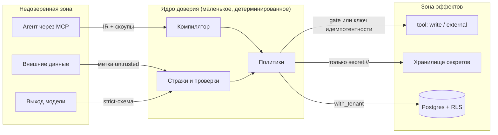
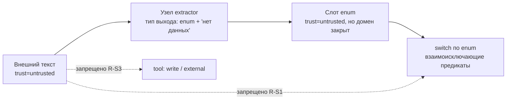

# 19. Безопасность и политики

> Статус: draft
> Зависит от: [ADR-0025. Движок на Python](adr/0025-python-engine.md), [ADR-0026. Описание воркфлоу](adr/0026-yaml-spec-and-code-refs.md), [ADR-0027. Динамическая форма](adr/0027-dynamic-io-shapes.md), [ADR-0028. API локальной студии](adr/0028-studio-api-contract.md), [ADR-0029. Ядро доверия и качество на Python](adr/0029-trust-and-quality-python.md), [02. Архитектура](02-architecture.md), [05. Система типов](05-type-system.md), [09. Модель контекста](09-context-model.md), [10. Рантайм](10-runtime.md), [11. Провайдеры](11-providers.md), [16. Модель данных](16-data-model.md), [23. API локальной студии](23-studio-api.md)
> Источники: research/api-layer.md, research/persistence.md, research/observability.md, research/py-quality-layer.md §1.6, §2, research/py-stack-runtime.md §5.5, §7, §11, research/studio-api-inventory.md §2.8, спека §8, §12, §13, §17

## Зачем этот слой

Платформа исполняет недетерминированный код (модель), который читает недоверенные данные и дёргает
инструменты с побочными эффектами, в мультитенантной базе. Этот слой закрывает строки каталога §8:
18 (PII к провайдеру и в логи), 19 (prompt injection), 49 (ретраи дублируют эффекты),
60 (агент уходит в сторону), 64 (эффекты без согласия), 80 (секреты в промтах), 81 (нет аудита).
Меры раскладываются по тем же уровням гарантии L0–L4 из спеки §8, что и везде в комплекте: **L0** —
конструкция не позволяет записать ошибку, **L1** — компилятор не пропускает, **L2** — рантайм-страж
ловит по явной политике, **L3** — гейт выпуска, **L4** — мониторинг в проде. Этот слой закрывается
на L0–L2; L3 и L4 для него — [13. Evals и гейты](13-evals-and-gates.md) и
[12. Наблюдаемость](12-observability.md).
Правило приоритета: если меру можно поднять с L2 на L1, поднимаем; если с L1 на L0 — поднимаем.

## Решения

| Решение | Что берём | Версия | Лицензия | Почему |
|---|---|---|---|---|
| Изоляция тенантов в БД | PostgreSQL RLS + `FORCE ROW LEVEL SECURITY`, политики — DDL миграций | PostgreSQL 18 | PostgreSQL License | `tenant_id` нужен при любом варианте; RLS снимает класс «забыли WHERE»; ORM и мигратор схемы `app` не выбраны ([ADR-0025](adr/0025-python-engine.md) ОВ 11) |
| Граница локального процесса | `TrustedHostMiddleware` на всём приложении, `TransportSecuritySettings` у `/mcp` | starlette 1.6.0 / mcp 2.2.0 | BSD-3-Clause / MIT | `aqven dev` слушает `127.0.0.1` без авторизации; чужой `Host` → 400 (проверено запуском), MCP принимает только localhost ([ADR-0028](adr/0028-studio-api-contract.md) §3, [23](23-studio-api.md) «Решения») |
| Аутентификация людей и агентов вне loopback | не выбрана; у `MCPServer` есть `token_verifier` и `auth: AuthSettings`, не проверены | mcp 2.2.0 | MIT | better-auth и `jwtAuth` VoltAgent сняты вместе с TS-движком; механизм — ОВ 8 |
| Редакция PII на каждом вызове модели | `RedactingModel` (наш `WrapperModel`) + редакция записи кассеты + `InstrumentationSettings(include_content=False)` | pydantic-ai-slim 2.43.0 | MIT | единственная точка, через которую идут все вызовы, включая судей и reflection GEPA ([ADR-0029](adr/0029-trust-and-quality-python.md) §1, §5) |
| Проверки инъекций и текстовые детекторы PII | готовое в Python-стеке не выбрано; свои проверки R-S8…R-S11 | — | — | гардрейлы VoltAgent сняты, Python-аналоги не исследовались (ОВ 6, ОВ 13) |
| Одобрение и запрет вызова тула | отложенные тулы Pydantic AI: `requires_approval=True` / `ApprovalRequired`, `DeferredToolRequests`, `DeferredToolResults`; `prepare` у тула | pydantic-ai-slim 2.43.0 | MIT | человек в цикле без своего слоя; ожидание — DBOS ([ADR-0025](adr/0025-python-engine.md) §9, H6; [23](23-studio-api.md) §6.10) |
| Песочница встроенных агентов | не выбрана | — | — | `Workspace`/`LocalSandbox` VoltAgent сняты, Monty не берём (ОВ 2) |
| Трассы наружу | маскирование до записи атрибута нашей фабрикой; экспорт простым OTLP/HTTP в Langfuse | opentelemetry-sdk + opentelemetry-exporter-otlp-proto-http 1.44.0 | Apache-2.0 | Python SDK langfuse не берём: мутирует атрибуты спанов, требует encode `httpx` ([ADR-0025](adr/0025-python-engine.md) §8) |
| Канонизация и хеш (ключи идемпотентности, журнал) | `rfc8785` + `hashlib` sha256 | 0.1.4 | Apache-2.0 | та же схема, что у `spec_hash` и ключа кассеты ([ADR-0022](adr/0022-hash-as-version.md)) |
| Секреты | ссылки `secret://<env>/<project>/<name>`, значения — во внешнем хранилище | — | — | спека §7.4: «секреты только по ссылке» |

## 1. Модель угроз

Пять источников недоверия. Для каждого — что именно считаем враждебным и где стоит граница.

| # | Источник | Что он может | Граница (кто ловит) |
|---|---|---|---|
| T1 | **Недоверенный агент** (Claude/Codex через MCP, встроенный архитектор) | предлагать IR, компилировать, запускать, генерировать шаблоны | компилятор (L1) + скоупы токена: агент не выпускает версии, не меняет реестры и политики, не читает секреты (спека §13.2); нативную правку файлов агентом ловит хук `flow_check` на `PostToolUse` и `aqven check` |
| T2 | **Недоверенные внешние данные** (веб, файлы клиента, ответы чужих API, MCP-ресурсы) | нести инструкции для модели, ложные факты, PII, гигантские полезные нагрузки | метка `untrusted` на значении (L0 на ветвление) + проверки входа R-S8, R-S9 (L2) + лимиты длины |
| T3 | **Недоверенный выход модели** | вернуть текст вместо структуры, «согласиться» на инъекцию, вернуть обрезанный JSON, выдумать идентификатор | strict-схема + три исхода вызова `ok/refusal/truncated` от `OutcomeGateModel` (DECISIONS «Структурированный вывод» п. 4), запрет ремонта обрезанного ответа, валидация Pydantic на приёме, проверка выхода R-S11 |
| T4 | **Мультитенантность** | чтение чужого прогона, чужой истории агента, чужого блоба, чужого ключа провайдера | `tenant_id` + RLS с `FORCE` (L0 на уровне БД); системная схема `dbos` вне RLS (§6) |
| T5 | **Секреты** | утечь в промт, в трассу, в кассету, в логи, во входы и выходы шагов DBOS | lint-правило на IR (L1) + отсутствие значений в процессе шаблонизации (L0) + ключи провайдеров только внутри фабрики `aqven_llm` (§5) |

Явно **вне** модели угроз v1: враждебный оператор-владелец тенанта, атаки на сам Postgres,
supply-chain на PyPI и npm, side-channel по времени ответа моделей, локальные процессы того же пользователя ОС
против `aqven dev` на `127.0.0.1` (API локально без авторизации, [ADR-0028](adr/0028-studio-api-contract.md) §3).
Это строки в «Открытые вопросы».



## 2. Уровни доверия данных

### Метка едет вместе со значением

Каждое значение в рантайме — это не голый JSON, а слот с провенансом (спека §5). Метка доверия —
поле провенанса, а не отдельный реестр. Значения пересекают границу DBOS-шага JSON-совместимыми
(`model_dump(mode="json")`, [ADR-0025](adr/0025-python-engine.md) §4), поэтому слот и провенанс — модели Pydantic.
Пример прошёл pyright 1.1.414 strict и `ruff check` на CPython 3.14.7, `Slot[str]` сериализуется в JSON:

```python
NodeId = NewType("NodeId", str)
SpecHash = NewType("SpecHash", str)


class TrustLevel(StrEnum):
    TRUSTED = "trusted"
    UNTRUSTED = "untrusted"


class PiiClass(StrEnum):
    NONE = "none"
    PII = "pii"
    SENSITIVE = "sensitive"


class Provenance(BaseModel):
    model_config = ConfigDict(extra="forbid", frozen=True)
    node_id: NodeId
    path: str
    spec_hash: SpecHash
    trust: TrustLevel
    pii: PiiClass
    produced_at: datetime


class Slot[T](BaseModel):
    model_config = ConfigDict(extra="forbid", frozen=True)
    value: T
    provenance: Provenance
```

### Откуда берётся исходная метка

| Источник значения | `trust` | Кто ставит |
|---|---|---|
| Константа в IR, литерал шаблона | `trusted` | компилятор |
| Выход `code`-узла над `trusted`-входами | `trusted` | исполнитель узла `code` (правило слияния) |
| `data`-узел из нашей БД по типизированному `load` | `trusted`, если источник помечен как внутренний | реестр источников |
| Веб-страница, загруженный файл, ответ чужого API, ресурс чужого MCP | `untrusted` | адаптер порта тула |
| Текст пользователя, поле формы `human`-узла | `untrusted` | исполнитель узла `human` |
| Любой выход LLM-узла | `untrusted` | исполнитель узла `llm` |
| Выход `extractor` с типом-enum над `untrusted` | `untrusted`, но **enum-типизированный** | исполнитель узла `extractor` |

### Правило слияния (монотонное, без исключений)

Метка распространяется по решётке: `untrusted` поглощает `trusted`, `sensitive` поглощает `pii`
поглощает `none`. Слияние — чистая функция от списка входных провенансов, реализация — свёртка по таблице
порядка, не дерево условий:

```python
TRUST_ORDER: Mapping[TrustLevel, int] = {TrustLevel.TRUSTED: 0, TrustLevel.UNTRUSTED: 1}
PII_ORDER: Mapping[PiiClass, int] = {
    PiiClass.NONE: 0,
    PiiClass.PII: 1,
    PiiClass.SENSITIVE: 2,
}


def join_trust(levels: Iterable[TrustLevel]) -> TrustLevel:
    return max(levels, key=TRUST_ORDER.__getitem__, default=TrustLevel.TRUSTED)


def join_pii(classes: Iterable[PiiClass]) -> PiiClass:
    return max(classes, key=PII_ORDER.__getitem__, default=PiiClass.NONE)
```

Понижение метки возможно **только** через явный узел-даунгрейдер, и их ровно два вида:
`extractor` с enum-типом (см. ниже) и `gate`-узел с человеческим аппрувом, который пишет в журнал
кто и что понизил. Никаких «доверяю, потому что прошло валидацию» — валидация схемы не меняет
доверие, она меняет только типизированность.

### Принцип CaMeL: что физически запрещено

CaMeL в нашей реализации — это не «инструкции игнорируются моделью», а **структурное отсутствие
пути** от `untrusted`-значения к управляющему решению и к эффекту. Проверки — правила компилятора,
семейство `R-S*` (новое, см. «Открытые вопросы» п. 1):

| Код | Правило | Уровень |
|---|---|---|
| R-S1 | Предикат ветвления (`switch`, `branch`, условие цикла) читает только слоты с `trust = trusted` **или** слоты типа-enum, произведённые узлом `extractor`. Любой другой `untrusted`-слот в предикате — ошибка компиляции | L1 |
| R-S2 | Значение с `trust = untrusted` не может попасть в поля эффективной конфигурации вызова: `model`, `instructions`, `tools`, `temperature`, лимиты, `max_iter` | L1 |
| R-S3 | Значение с `trust = untrusted` не может быть аргументом тула класса `write` или `external` иначе как через поле, объявленное в схеме тула с `accepts_untrusted: true` | L1 |
| R-S4 | `untrusted`-значение не может быть именем тула, идентификатором узла, ключом идемпотентности, ссылкой `secret://`, URL для последующего вызова | L1 |
| R-S5 | В шаблоне промта `untrusted`-значение рендерится только внутри блока `…` — обёртка с разделителями и фиксированной преамбулой; вне блока — ошибка компиляции | L1 |
| R-S6 | `untrusted`-значение не участвует в вычислении точки кэширования промта (иначе злоумышленник управляет кэш-ключом) | L1 |
| R-S7 | Выход узла-`extractor`, используемый в предикате, обязан иметь тип `enum` с закрытым множеством значений и вариантом «нет данных»; открытая строка в предикате — ошибка | L1 |

Эффективная конфигурация уходит прямо в `Agent.run(model=..., instructions=...)`
([ADR-0025](adr/0025-python-engine.md) §3), поэтому R-S2 проверяет именно аргументы этого вызова и
`ModelSettings`, собранные исполнителем.

R-S5 опирается на python-liquid 2.3.1 ([ADR-0029](adr/0029-trust-and-quality-python.md) §8): блочный тег
`untrusted` регистрируется через `Environment.add_tag`, как тег `message`, а наш Visitor уже обходит дерево от
`BoundTemplate.nodes` через `node.children(...)` — проверка «в каком блоке оказалась переменная» идёт тем же обходом,
отдельного парсера не нужно. Тега `untrusted` нет в белом списке тегов ADR-0029 §8, запуском он не проверялся (ОВ 18).
Разделители блока генерируются с nonce-меткой прогона, чтобы содержимое не могло «закрыть» блок своим текстом.

### Единственная легальная дорога untrusted → ветвление



Ключевая мысль: закрытый enum ограничивает **мощность влияния** недоверенных данных числом веток,
которые автор графа сам и написал. Инъекция может выбрать ветку — она не может создать новую,
изменить модель, вызвать другой тул или дописать инструкцию.

## 3. Prompt injection

### Что есть готовым в Python-стеке

Гардрейлы VoltAgent (`createPromptInjectionGuardrail`, `createHTMLSanitizerInputGuardrail`,
`createInputLengthGuardrail`, шаг `andGuardrail`) сняты вместе с TS-движком ([ADR-0025](adr/0025-python-engine.md)).
Python-аналоги не искали (research/py-stack-runtime.md, открытый вопрос 7). Pydantic AI 2.43.0 даёт проверенные
точки, в которые встают наши проверки:

| Точка | Что даёт | Проверено | Вердикт |
|---|---|---|---|
| звено `WrapperModel` в цепочке фабрики | видит нейтральные сообщения каждого вызова модели до провайдера, включая судей и reflection GEPA | запуск 3.12.4 ([ADR-0029](adr/0029-trust-and-quality-python.md) §1) | точка для проверки входа вызова; новое звено — только правкой таблицы ADR-0029 §1 (ОВ 13) |
| `Hooks.before_model_request` | переписывает историю сообщений агента | запуск 3.12.4 (ADR-0029 §2) | свойство агента, а не модели: гарантия зависела бы от того, что каждый агент собран с хуком; опорой не берём (ADR-0029 «Альтернативы») |
| `@agent.output_validator` + `ModelRetry` | проверка выхода с ремонтом моделью, тратит `output`-бюджет | запуск 3.12.4 (ADR-0029 §2) | для проверок, где повтор уместен; не для R-S11, там блок |
| capability `RaiseContentFilterError` | `ContentFilterError` на отказе провайдера | запуск 3.12.4 (research/py-quality-layer.md §1.4) | фильтр провайдера, а не детектор инъекций; исход `refusal` даёт `OutcomeGateModel` |
| `prepare` у тула | тул не предлагается модели, если функция вернула `None` | проба §8 | запрет тула — §8 |

Вида узла `guard` в закрытом наборе видов узлов ([ADR-0026](adr/0026-yaml-spec-and-code-refs.md) §1, DECISIONS
«Описание воркфлоу») нет: прежнее отображение `guard` → `andGuardrail` снято (ОВ 13). Срабатывание проверки пишется в
трассу и событием прогона в поток `run_events` ([23](23-studio-api.md) §11.4) — это источник данных для UI «почему узел
встал»; имя и форма события не определены (ОВ 13).

### Где включаются

| Точка | Что вешаем | Обязательность |
|---|---|---|
| Порт тула, возвращающего внешние данные | очистка HTML + лимит длины + простановка `trust=untrusted` | всегда, зашито в адаптер; библиотека очистки HTML не выбрана (ОВ 13) |
| Вход LLM-узла, в промте которого есть `untrusted`-слот | структурный детектор R-S8 + классификатор R-S9 | всегда, генерируется компилятором |
| Вход LLM-узла без `untrusted`-слотов | ничего | — |
| Выход LLM-узла | strict-схема + валидация Pydantic + редакция PII по меткам типа (§4) + канарейка R-S11 | всегда |
| Шаг `code` автора с проверкой | то, что написал автор | по графу |

Компилятор сам добавляет проверку входа перед вызовом модели узла, если в его эффективном промте есть хотя
бы один слот с `trust = untrusted`. Автор графа не может это отключить — только ужесточить. Исполняется она звеном
цепочки или шагом исполнителя узла — ОВ 13.

### Чего текстовые проверки НЕ покрывают

1. Список фраз не ловит перефразировки, другой язык, base64, ASCII-art, инструкции в разметке таблицы. Против целевой
   атаки бесполезен.
2. Текстовые проверки не знают ничего про наши метки доверия: они смотрят на текст, а не на провенанс.
3. Проверка входа не блокирует **последствия** — это фильтр на границе вызова, а не политика эффектов.
4. Скорер остановить исполнение не может: онлайн-оценка pydantic-evals (`OnlineEvaluation`) работает после ответа и не
   запускалась ([ADR-0029](adr/0029-trust-and-quality-python.md) ОВ 19), поэтому «не прошёл порог — прервать» делает
   исполнитель узла, а не evals.

### Наши дополнительные проверки

| Код | Проверка | Где живёт | Действие по умолчанию |
|---|---|---|---|
| R-S8 | Структурный детектор: доля императивов, наличие разделителей ролей (`system:`, `<\|im_start\|>`), попытка «забудь предыдущее» в N языках, base64-блоки длиннее 256 символов | наша чистая функция проверки входа | `severity: "warning"`, метка в трассе, не блок |
| R-S9 | LLM-классификатор инъекции на дешёвой модели, вход — только подозрительный фрагмент, выход — enum `{clean, suspicious, injection}` | наша проверка входа; модель — из каталога через фабрику `aqven_llm`, вызов проходит кассету, бюджет и редакцию (правило судьи, ADR-0029 §9); вне горячего пути там, где допустим async | `injection` → блок |
| R-S10 | Сверка эффектов: если после узла с `untrusted`-входом в этом же шаге вызывается тул класса `write`/`external` без `gate` — прогон останавливается стражем | исполнитель узла, рантайм | блок, запись в журнал |
| R-S11 | Канареечная строка: в системную часть промта подмешивается nonce прогона; если он появился в выходе модели — считаем, что модель пересказывает системный текст | проверка выхода в исполнителе узла до записи слота | блок |

R-S9 не блокирует выпуск и не является гейтом качества: это рантайм-страж уровня L2. Порог и
модель классификатора — поля политики проекта, а не константы в коде.

## 4. PII

### Метка — свойство типа, а не поля значения

`pii` объявляется в реестре типов и наследуется всеми слотами этого типа (см. `PiiClass` в §2).
Компилятор знает класс PII статически, поэтому проверки — L1, а не L2:

| Код | Правило | Уровень |
|---|---|---|
| R-S12 | Слот с `pii ≠ none` рендерится в промт только если эффективная модель вызова принадлежит провайдеру из allowlist профиля | L1 |
| R-S13 | Слот с `pii = sensitive` не попадает в инлайн-превью трассы, в дифф версий и в датасет — только по ссылке на блоб | L1 |
| R-S14 | Тул класса `external` получает `pii`-аргумент только если в его контракте объявлено `pii_sink: true` и провайдер тула в allowlist | L1 |
| R-S15 | Переопределением модели (`R-O*`) нельзя вывести вызов за allowlist: после применения переопределения R-S12 перепроверяется | L1 |

Расширение R-S12 на схему вызова — источник с меткой `pii` в `allowed_sets.from` или `schema_from` при провайдере вне
allowlist: R-D7, предложено ([ADR-0027](adr/0027-dynamic-io-shapes.md) ОВ 1). Прежний запрет попадания `sensitive` в
экспортируемый бандл снят: экспорт отменён решением владельца от 2026-09-16 ([ADR-0025](adr/0025-python-engine.md) §7).

### Allowlist провайдеров

Хранится в реестре профилей (спека §«Маршрутизация задаётся политикой на профиль» — «требования к
обращению с данными»), не в коде. Форма — таблица `app.provider_data_policies`, DDL с RLS, индексами
и `CHECK`-ограничениями — [16. Модель данных](16-data-model.md) §2.16:

| Колонка | Тип | Смысл |
|---|---|---|
| `tenant_id` | uuid | RLS-ключ |
| `provider` | text | `openrouter`, `togetherai`, `anthropic`, … |
| `allows_pii` | boolean | можно ли отправлять `pii` |
| `allows_sensitive` | boolean | можно ли отправлять `sensitive` |
| `retention` | text | `zero` / `logged` / `unknown` — со стороны провайдера |
| `evidence_url` | text | ссылка на DPA/страницу политики, чтобы поле не было выдумкой |

`retention = unknown` трактуется как `allows_pii = false` — по умолчанию запрещено. У OpenRouter политика
провайдера дополняется маршрутизацией `data_collection: 'deny'` и `zdr: true` ([11](11-providers.md) §7.1).

### Маскирование в трассах и логах

Ключевая ловушка: capability `Instrumentation` Pydantic AI пишет `gen_ai.input.messages` и `gen_ai.output.messages` из
контекста запроса **до** цепочки обёрток. Даже при `RedactingModel` в спане `chat` остаются сырые PII; с
`include_content=False` их нет (проба research/py-quality-layer.md §1.6). С `include_content=False` из спанов уходят
`gen_ai.system_instructions`, `final_result`, аргументы и результаты инструментов; `model_request_parameters` и
`gen_ai.tool.definitions` со схемой выхода остаются — поэтому в enum схемы уходят коды, а не сырые ID
([ADR-0006](adr/0006-dynamic-allowed-sets.md)).

Экспорт — простой OTLP/HTTP в Langfuse без Python SDK langfuse ([ADR-0025](adr/0025-python-engine.md) §8), `mask` у
процессора Langfuse здесь нет. Маскирование делается **до** записи атрибута (обязательство 7
[ADR-0012](adr/0012-langfuse-as-store.md)), и наш процессор в Postgres получает те же уже маскированные атрибуты. Пример
прошёл pyright 1.1.414 strict и `ruff check`:

```python
@dataclass(frozen=True, slots=True)
class LangfuseTarget:
    base_url: str
    public_key: str
    secret_key: str


def langfuse_tracer_provider(target: LangfuseTarget) -> TracerProvider:
    token = f"{target.public_key}:{target.secret_key}".encode()
    exporter = OTLPSpanExporter(
        endpoint=f"{target.base_url}/api/public/otel/v1/traces",
        headers={
            "Authorization": "Basic " + base64.b64encode(token).decode(),
            "x-langfuse-ingestion-version": "4",
        },
    )
    limits = SpanLimits(max_span_attribute_length=8192, max_attributes=128)
    provider = TracerProvider(span_limits=limits)
    provider.add_span_processor(BatchSpanProcessor(exporter))
    return provider


def pii_mode_instrumentation(provider: TracerProvider) -> InstrumentationSettings:
    return InstrumentationSettings(
        tracer_provider=provider, include_content=False, version=5
    )
```

Дисциплина (из §7.10 заметок по обзёрвабилити и обязательств 7, 8, 10 ADR-0012, здесь — как жёсткое правило):

1. Единственное место формирования атрибутов спана со значениями слотов — фабрика `build_node_span_attributes(ctx)`.
   Звенья цепочки пишут в текущий спан только служебные атрибуты без значений: `aqven.cassette.hit`,
   `aqven.cassette.key`, исход ([ADR-0029](adr/0029-trust-and-quality-python.md) §1). Вызовы `set_attribute` россыпью
   запрещены; ruff TID251 запрещает импорты, а не вызовы методов, поэтому механизм принуждения — ОВ 14.
2. Фабрика получает слоты вместе с провенансом и сама решает, что писать инлайн, а что заменить на
   `{blob_id}`. Ни одного `pii`-значения в инлайн-превью. Атрибутов на спан не больше 128: при превышении
   opentelemetry-sdk 1.44.0 молча вытесняет **самые старые** (research/py-quality-layer.md §2.2).
3. Порядок процессоров не гарантирует порядок доставки, `on_end` получает один и тот же `ReadableSpan` — **мутировать
   атрибуты спана в процессоре запрещено**, только читать. Python SDK langfuse 4.15.3 это нарушает в `on_start`,
   поэтому его не берём.
4. Логи: логгер операции получает уже редактированные значения; сырые значения в логи не попадают никогда, даже на
   `DEBUG`.

### Детекторы PII и их границы

Готовых PII-гардрейлов в стеке нет (§3). Редакцию делает `RedactingModel` по `RedactionPolicy`
([ADR-0029](adr/0029-trust-and-quality-python.md) §1): копии исходящих сообщений с плейсхолдерами через
`dataclasses.replace`, история агента не мутируется (проверено: на проводе плейсхолдер, сырых PII нет).

**Границы текстовых детекторов:** регулярные выражения по латинице и общим форматам (e-mail, телефоны, длинные числа)
полноты не дают. Не покрыты российские паспорта и СНИЛС, ИНН, адреса, ФИО, номера полисов, IBAN, кириллические форматы,
PII внутри base64 и внутри структурированного JSON-выхода; детектор для русскоязычных форматов не выбран (ОВ 6). Наш
основной механизм — структурная редакция по схеме: поля редактируются по метке типа, а не по регулярке по всему тексту.
Это единственный способ, дающий полноту: метка есть в типе, значит поле известно статически.

В PII-режиме наверх уходит отредактированная копия ответа, иначе запись и реплей дают разные выходы узла; значения,
которые модель эхом вернула, заменяются плейсхолдерами и в живом прогоне. Это выбор ADR-0029, а не решение владельца
(ADR-0029 ОВ 21). Редакция частичных ответов стрима для студии не спроектирована (ОВ 19).

### Редакция в кассетах и датасетах

Кассета — свой content-addressed формат на уровне модели: `CassetteModel` над `WrapperModel`
([ADR-0029](adr/0029-trust-and-quality-python.md) §1). `RedactingModel` стоит **выше** кассеты, поэтому ключ
считается по нормализованному запросу **после** редакции — иначе одна и та же запись не найдётся при воспроизведении.
Кассета получает от фабрики тот же `RedactionPolicy` и пишет отредактированный ответ: без этого файл кассеты хранит
сырой ответ модели (проверено, ADR-0029 §5). PII-режим = `RedactingModel` + редакция записи кассеты +
`include_content=False`; одно без другого PII-режимом не считается (обязательство 4 ADR-0029).

| Артефакт | Что хранится | Правило |
|---|---|---|
| Кассета вызова модели | ключ `sha256("aqven.cassette.v1\0" + канонический JSON)` нейтрального отредактированного запроса, отредактированный ответ | `pii`-поля заменены на стабильный плейсхолдер `«[pii:<type_id>:<n>]»`, нумерация детерминированная в пределах кассеты |
| Спаны вызова | атрибуты `gen_ai.*` | в PII-режиме `include_content=False` |
| Датасет из прода | семплы трасс | редакция обязательна; элемент без пройденной редакции в датасет не принимается (проверка на входе `dataset_generate`) |
| Reflective dataset GEPA | записи `{Inputs, Generated Outputs, Feedback}` из `ReportCase` | редакция в `make_reflective_dataset`: шаблон reflection GEPA по умолчанию копирует записи дословно (ADR-0029 §5, §11) |
| Wheel модуля | YAML, промты, `code/`, IR | `pii`-значений не бывает по построению: в wheel едет спека, а не данные прогона ([ADR-0026](adr/0026-yaml-spec-and-code-refs.md) §10) |
| Экспортируемый бандл | — | отменено решением владельца от 2026-09-16 ([ADR-0025](adr/0025-python-engine.md) §7) |
| Системная БД DBOS | входы и выходы шагов, сообщения `send` (ответы форм человека), события `set_event` (`suspend_data` со входами узла), поток `run_events`; по умолчанию pickle | вне RLS и вне редакции; что хранить для `sensitive`-слотов и срок хранения — ОВ 15 |
| Блобы | `app.blobs` | хранятся как есть под RLS; наружу отдаются только через операцию, проверяющую право на прогон |

Плейсхолдер стабилен, поэтому детерминизм реплея сохраняется: та же трасса даёт тот же
ключ кассеты.

## 5. Секреты

### Только ссылка, никогда значение

В IR, в шаблоне промта, в конфигурации узла и в файлах описания секрет представлен
ссылкой фиксированного вида:

```
secret://<environment>/<project_slug>/<name>
```

Тип ссылки — `NewType`, чтобы её нельзя было спутать со строкой. Порт прошёл pyright 1.1.414 strict:

```python
SecretRef = NewType("SecretRef", str)


@dataclass(frozen=True, slots=True)
class ResolutionContext:
    tenant_id: TenantId
    environment: Environment
    project_slug: ProjectSlug


class SecretResolver(Protocol):
    async def resolve(self, ref: SecretRef, ctx: ResolutionContext) -> str: ...
```

`SecretResolver` — Port; адаптеры: `EnvSecretResolver` (dev), `FileSecretResolver` (self-hosted),
внешний менеджер секретов (prod). Выбор адаптера — свойство окружения, не проекта. `ResolutionContext` строит
контекст операции, а не вызывающий код.

### Где значение физически появляется

Значение секрета существует ровно в двух местах и нигде больше:

1. В фабрике `aqven_llm` — при создании SDK-клиента (`AsyncOpenAI(api_key=...)`, `AsyncAnthropic(api_key=...)`,
   [11](11-providers.md) §2.1).
2. В адаптере тула — в момент формирования запроса к внешнему API.

Шаблонизатор промтов **не имеет доступа** к `SecretResolver`: он получает только слоты значений.
Это L0: нет пути — нет утечки в промт. Заголовки авторизации SDK формирует ниже кассеты, поэтому в ключ и тело
кассеты они не попадают; в ключ идут только перечисленные поля запроса (ADR-0029 §1), а не «всё кроме».
Настройки вызова входят в ключ целиком, и `ModelSettings.extra_headers` в Pydantic AI 2.43.0 может нести заголовки —
секрет в нём попал бы в ключ и в запись кассеты (ОВ 16).

`ModelRef.api_key` ([ADR-0025](adr/0025-python-engine.md) §6) несёт значение ключа. `ModelRef` строится и живёт только
внутри фабрики и не передаётся во вход DBOS-шага, в трассу и в кассету: DBOS по умолчанию пишет входы и выходы шагов
в системную БД pickle ([ADR-0025](adr/0025-python-engine.md) §4). Во вход шага узла исполнитель передаёт хеш IR, id узла
и значения слотов (ADR-0025 §3); что попадает во входы шагов `<имя агента>__model.request` при `DBOSDurability`, не
проверено (ОВ 16).

### Lint-правило R-S16

| Код | Правило | Уровень | Реализация |
|---|---|---|---|
| R-S16 | Ни одно строковое поле IR, кроме полей типа `SecretRef`, не похоже на секрет | L1 | валидация IR моделью Pydantic + детектор энтропии |

Детектор (запускается на всех строковых литералах IR и на всех литералах шаблонов):

| Признак | Порог |
|---|---|
| Префиксы известных ключей | `sk-`, `sk_live_`, `pk_`, `ghp_`, `AKIA`, `xoxb-`, `-----BEGIN` |
| Shannon-энтропия строки | ≥ 4.0 бит/символ при длине ≥ 24 |
| Base64/hex-строка | длина ≥ 32 и алфавит однородный |
| Имя поля | совпадает с `/(secret|token|api[_-]?key|password|passwd|credential)/i` и значение не `SecretRef` |

Срабатывание — ошибка компиляции, а не предупреждение. Ложное срабатывание закрывается явной
аннотацией поля в файле описания (`literal_kind: "opaque"`), которая попадает в журнал решений.

Второй контур — pre-commit и CI на репозитории (линтер + сканер секретов) — не отменяет R-S16:
секрет может приехать через MCP-тул от агента, минуя git, или нативной правкой файла агентом — её ловит хук
`flow_check` на `PostToolUse` и `aqven check` (DECISIONS «Хранение определений»).

### Разделение по окружениям и проектам

Ключи провайдеров хранятся отдельно по окружениям (спека §«Ключи»). Модель разделения:

| Ось | Что разделяет | Как |
|---|---|---|
| Окружение | `dev` / `stage` / `prod` | отдельное пространство имён в хранилище; адаптер окружения не видит чужое |
| Тенант | ключи разных клиентов | префикс пространства имён `tenant/<tenant_id>/`, разрешение только внутри `with_tenant` |
| Проект | ключи разных проектов одного тенанта | сегмент `<project_slug>` в ссылке |
| Назначение | ключ провайдера vs ключ тула vs ключ трасс | разные имена, разные права на чтение |

Агент (человеку это тоже относится в режиме MCP) **не может читать секреты** — операции
разрешения ссылок в MCP-контракте нет вообще. Он может только проверить, что ссылка разрешается:
операция возвращает `{ resolvable: true|false }`, без значения. API студии секреты не отдаёт никогда: поля с
`secret_ref` редактируются до отдачи при любом `include_payloads` ([23](23-studio-api.md) §1).

## 6. Мультитенантность

### tenant_id + RLS

`tenant_id` есть во всех таблицах схемы `app`. Политика — DDL миграции; ORM и инструмент миграций схемы `app` не
выбраны (drizzle снят, [ADR-0025](adr/0025-python-engine.md) ОВ 11), поэтому политика записана SQL:

```sql
CREATE POLICY runs_tenant_isolation ON app.runs
  AS PERMISSIVE
  FOR ALL
  TO app_user
  USING (tenant_id = current_setting('app.tenant_id', true)::uuid)
  WITH CHECK (tenant_id = current_setting('app.tenant_id', true)::uuid);

ALTER TABLE app.runs ENABLE ROW LEVEL SECURITY;
ALTER TABLE app.runs FORCE ROW LEVEL SECURITY;
```

`FORCE` обязателен: без него владелец таблицы обходит собственные политики, и приложение,
ходящее под владельцем схемы, тихо видит всё.

Контекст тенанта ставится **только** `SET LOCAL` внутри транзакции:

```sql
BEGIN;
SELECT set_config('app.tenant_id', '0190f3a2-6c1e-7d4b-9a57-2f1c8e4b6d10', true);
SELECT id, status FROM app.runs WHERE project_id = '0190f3a2-7a00-7c3e-8b21-5d9e0c1a2b34';
COMMIT;
```

`set_config(..., true)` = `SET LOCAL`, действует до конца транзакции. Сессионный `SET` при
transaction pooling (PgBouncer/pgcat) протечёт в чужой запрос — это жёсткий запрет.
Функция `with_tenant` оборачивает use-case в такую транзакцию и остаётся единственной точкой входа в БД для
прикладного кода; её реализация зависит от выбора драйвера и ORM (ADR-0025 ОВ 11). Фоновые джобы, миграции и
аналитика ходят под ролями `app_migrator` / `app_analytics` (`BYPASSRLS`) и помечены явно. Системная схема `dbos` —
DDL делает `dbos migrate` отдельным шагом деплоя, рантайм работает с `run_migrations = False`
([ADR-0025](adr/0025-python-engine.md) §4); права ролей на неё — [16](16-data-model.md) §7 после ADR-0025 ОВ 9.

Правило индексов: везде, где есть RLS-политика по `tenant_id`, этот столбец первый в составном
индексе — иначе политика становится лишним предикатом на полном скане.

### Изоляция памяти агентов

Опасный дефолт VoltAgent снят: там `Agent` без `memory` получал встроенное in-memory хранилище, и два прогона разных
тенантов с совпавшим `conversationId` видели общую историю. В Pydantic AI 2.43.0 история сообщений передаётся вызову
явно — `Agent.run(..., message_history=...)` (исходник `agent/abstract.py`; так продолжался прогон в пробе одобрения
тула, research/py-stack-runtime.md §5.5). Неявного хранилища истории между вызовами в пробах не встречалось, отдельно
это не проверялось (ОВ 17). Риск утечки переносится в наш код: историю, которую исполнитель подставляет в
`message_history`, он обязан брать из хранилища прогона с `tenant_id`.

Наши правила:

| Случай | Что ставим | Почему |
|---|---|---|
| LLM-узел воркфлоу (`llm`, `extractor`, `judge`, `classifier`) | `message_history` между вызовами узла **не передаётся**; повтор выхода внутри одного `agent.run` историей не считается | узел чистый; вход — слоты, выходы — значения DBOS-workflow |
| `bounded_agent` внутри узла | история в нашей БД по ключу `(tenant_id, run_id, адрес исполнения)`, `user_id = tenant:<tenant_id>:user:<user_id>` | память живёт ровно один прогон |
| Продолжение после одобрения тула | `message_history` того же прогона и того же адреса исполнения ([23](23-studio-api.md) §6.10) | история не выходит за прогон |
| Встроенный архитектор (диалог в Studio) | история в нашей БД, scope `user` | это настоящий диалог |

Компилятор проверяет:

| Код | Правило | Уровень |
|---|---|---|
| R-S17 | У узла-агента либо нет истории между вызовами, либо явно заданное хранилище истории с обязательными `user_id` и `conversation_id`. Отсутствие того и другого — ошибка компиляции | L1 |
| R-S18 | Scope памяти не расширяется (`run → user → tenant`) без политики аппрува — это R-O5 из §7, здесь фиксируется его реализация: расширение скоупа требует `gate`-узла с аппрувом | L1 |

Реестра воркфлоу по имени нет: одна функция DBOS-workflow исполняет план IR по хешу
([ADR-0025](adr/0025-python-engine.md) §3), поэтому коллизии имён графов между тенантами нет. Одинаковый IR двух
тенантов даёт один `spec_hash`, поэтому план по хешу не содержит данных и разрешённых секретов тенанта: тенант, ключи и
данные берутся из контекста прогона (DECISIONS «Escape hatch»: данные пользователя не попадают в фазу сборки).
Изоляция тенантов в одном процессе DBOS не проверена ([99](99-open-questions.md) B-07).

Системная схема `dbos` наших политик не имеет. Следствие: **прикладной код не читает таблицы `dbos.*` SQL-запросами**;
историю шагов и поток `run_events` он читает через `DBOSClient` внутри use-case, который уже проверил право на прогон
по таблице схемы `app` под RLS ([23](23-studio-api.md) §11.4). Всё, что показываем пользователю из индекса прогонов,
пишется в `app` со своим `tenant_id`.

### Изоляция ключей провайдеров, файлов и блобов

| Ресурс | Механизм изоляции |
|---|---|
| Ключи провайдеров | пространство имён `tenant/<tenant_id>/` в хранилище секретов; резолвер получает `tenant_id` из контекста операции (`ResolutionContext`), а не из аргумента вызова |
| Блобы | `app.blobs` под RLS; `UNIQUE (project_id, sha256)` — дедуп **внутри проекта**, не глобальный, иначе контентная адресация становится оракулом «у кого ещё есть этот файл» |
| Объектное хранилище (>1 МБ) | ключ объекта с префиксом `<tenant_id>/<project_id>/<sha256>`, отдача только через подписанную ссылку с TTL, выданную после проверки прав |
| Файлы песочницы | каталог на прогон, уничтожается вместе с прогоном (см. §9) |
| Векторный индекс pgvector | таблицы в схеме `app`, те же политики по `tenant_id` |

## 7. Аутентификация и авторизация

### Три контура

```
Человек (Studio)   aqven dev: браузер -> http://127.0.0.1:<порт> -> FastAPI без авторизации,
                              TrustedHostMiddleware отсекает чужой Host
                   hosted:    механизм сессии и токена не выбран
Агент (MCP)        aqven dev: claude mcp add --transport http aqven http://127.0.0.1:5180/mcp/
                              -> тот же use-case, что у REST
                   aqven serve вне loopback: credential, привязанный к (user, tenant, scopes),
                              механизм не выбран
Управление DBOS    DBOS Conductor — отдельный контур управления прогонами, если его берём
```

Студия — SPA на Vite, её раздаёт `aqven dev` с того же порта, что API и MCP ([ADR-0028](adr/0028-studio-api-contract.md)
§3); прежний BFF на route handler Next удалён ([ADR-0024](adr/0024-studio-on-vite.md)). Локальный `aqven dev` слушает
`127.0.0.1` и авторизации не использует. Режим `hosted` и `aqven serve` вне loopback — ОВ 8; DBOS Conductor — ADR-0025
ОВ 16.

Стык авторизации — порт с заменяемым поставщиком (Strategy: поставщик меняется без изменения операций). Порт прошёл
pyright 1.1.414 strict:

```python
class ActorKind(StrEnum):
    HUMAN = "human"
    AGENT = "agent"


@dataclass(frozen=True, slots=True)
class Principal:
    actor_kind: ActorKind
    actor_id: ActorId
    tenant_id: TenantId
    on_behalf_of: UserId | None
    scopes: frozenset[Scope]


class AccessTokenVerifier(Protocol):
    async def verify(self, token: str) -> Principal | None: ...
```

Проверка токена превращает его в `Principal` с `tenant_id`, который подаётся в `with_tenant`; токен без `tenant_id`
в `Principal` не превращается. Проверки роли и прав — в use-case, а не в поставщике. Вне loopback всё закрыто по
умолчанию. Каким механизмом маршруты FastAPI и `MCPServer` (`token_verifier`, `auth: AuthSettings` в `mcp` 2.2.0)
вызывают этот порт, не проверено ([ADR-0028](adr/0028-studio-api-contract.md) ОВ 7).

### Подводные камни, закрываемые явными тестами

| Риск | Мера | Тест |
|---|---|---|
| DNS rebinding на `127.0.0.1` | `TrustedHostMiddleware` на всём приложении | e2e: `Host: evil.example` → 400 `Invalid host header` (проверено запуском, research/studio-api-inventory.md §2.8) |
| MCP-запрос с чужим `Host` | `TransportSecuritySettings` у `/mcp` | e2e: не-localhost `Host` → 421 (документация `mcp` 2.2.0, запуском не проверялось) |
| Неизвестный `/api/*` отдаёт `index.html` студии | свой обработчик 404 `ApiError` | e2e: `GET /api/unknown` → 404 `ApiError` ([ADR-0028](adr/0028-studio-api-contract.md) §3) |
| WebSocket без авторизации | WebSocket не используем, все каналы — SSE `GET` ([ADR-0028](adr/0028-studio-api-contract.md) «Альтернативы») | e2e: апгрейд до WebSocket не принимается |
| SSE-каналы `GET` без заголовков авторизации ([23](23-studio-api.md) §11) вне loopback | вне loopback каналы закрыты до решения ОВ 8 | конфиг-тест `aqven serve` |
| `aqven dev` слушает не loopback | адрес привязки — `127.0.0.1` ([ADR-0028](adr/0028-studio-api-contract.md) §3) | конфиг-тест |
| Токен без `tenant_id` | `AccessTokenVerifier` не возвращает `Principal`; запрос до БД не доходит | unit |

### Скоупы

Скоуп — строка `<группа>:<действие>`, проверяется в use-case, не в роуте (роут знает про HTTP,
use-case — про право). Таблица прав повторяет спеку §13.2:

| Скоуп | Человек-владелец | Человек-редактор | Агент по MCP |
|---|---|---|---|
| `flow:read`, `run:read`, `journal:read` | да | да | да |
| `flow:write` (черновики, шаблоны, свои компоненты) | да | да | да |
| `run:execute` (в dev-окружении) | да | да | да |
| `dataset:write`, `experiment:run` | да | да | да |
| `version:propose` | да | да | да |
| `version:release` | да | нет | **нет** |
| `library:publish` (компонент в общую библиотеку) | да | нет | **нет** |
| `registry:write` (типы, профили, агенты) | да | нет | **нет**, только `registry_propose_*` |
| `policy:write` (allowlist, PII, доверие, эффекты) | да | нет | **нет** |
| `secret:read` | **нет ни у кого** — операции не существует | — | — |
| `run:execute` в `prod` | да | по политике проекта | **нет** |
| `effect:approve` (аппрув побочного эффекта) | да | по политике | **нет** |

Разница «агент против человека» сводится к одному предложению: **агент предлагает, человек
выпускает**. Всё, что меняет то, по чему потом судят (версии, реестры, политики, общая
библиотека), закрыто аппрувом.

### Выдача и обновление агентского токена

Плагины better-auth (`jwt`, `bearer`, `device-authorization`, `one-time-token`, `organization`) сняты вместе с
TS-движком. Требования к токену остаются: он несёт `tenant_id`, `project_id` (опционально, сужает область), список
скоупов и `exp`; выдача агенту — сценарий CLI (device flow или одноразовый токен); отзыв — отзыв сессии. Механизм
выпуска, хранения и отзыва — ОВ 8.

## 8. Побочные эффекты

### Классы эффектов

Контракт тула (спека §7.4): схема входа и выхода, класс эффекта, таймаут, шаблон ключа
идемпотентности.

| Класс | Что значит | Требование компилятора |
|---|---|---|
| `read` | не меняет состояние вне прогона | ничего сверх схемы и таймаута |
| `write` | меняет наше состояние (БД, файл в нашем хранилище) | **gate** или ключ идемпотентности |
| `external` | меняет чужое состояние (письмо, платёж, пост, вызов чужого API) | **gate** или ключ идемпотентности; плюс одобрение вызова в `prod` по умолчанию |

| Код | Правило | Уровень |
|---|---|---|
| R-S19 | Тул класса `write`/`external` без `gate`-узла перед ним и без шаблона ключа идемпотентности не компилируется | L1 |
| R-S20 | Шаблон ключа идемпотентности не содержит `untrusted`-слотов (иначе ключ управляется атакующим — это R-S4) | L1 |
| R-S21 | Шаблон ключа идемпотентности детерминирован в пределах прогона: только `run_id`, адрес исполнения `{node_id, branch_key, iteration, item_index}` ([ADR-0028](adr/0028-studio-api-contract.md) §5) и `trusted`-слоты. Ни текущего времени, ни случайности | L1 |
| R-S22 | Ретрай тула `write`/`external` выполняется только с тем же ключом идемпотентности; смена ключа при ретрае — ошибка рантайма | L2 |

Ключ идемпотентности — sha256 (`hashlib`) канонического JSON (`rfc8785` 0.1.4) от `{run_id, address, args}` с доменной
сепарацией — та же схема хеширования, что у `spec_hash` и ключа кассеты, префикс `idem-`. Прерванный падением шаг DBOS
выполняется заново целиком (проверено запуском, [ADR-0025](adr/0025-python-engine.md) §3): одинаковый вход шага даёт
тот же ключ, и внешний API отклоняет повтор. `iteration: null` и `iteration: 0` дают разные ключи. Пример прошёл
pyright 1.1.414 strict; на CPython 3.14.7 перестановка ключей адреса и аргументов ключ не меняет, смена `iteration` с
`0` на `null` — меняет:

```python
IDEMPOTENCY_DOMAIN = b"aqven.idem.v1\x00"


def idempotency_key(
    run_id: RunId, address: dict[str, JsonValue], args: dict[str, JsonValue]
) -> IdempotencyKey:
    canonical = rfc8785.dumps({"run_id": run_id, "address": address, "args": args})
    digest = hashlib.sha256(IDEMPOTENCY_DOMAIN + canonical).hexdigest()
    return IdempotencyKey("idem-sha256-" + digest)
```

### Одобрение и запрет тула

Одобрение берём готовым — отложенные тулы Pydantic AI 2.43.0 под capability `DBOSDurability`, свой слой не пишем
(решение владельца от 2026-09-16, [ADR-0025](adr/0025-python-engine.md) §9, H6). Ожидание решения — ожидание с
`wait_kind: tool_approval` по адресу узла `llm` ([23](23-studio-api.md) §6.10). Условное одобрение по аргументам —
исключение `ApprovalRequired`, пока `ctx.tool_call_approved` ложно; запрет — `prepare`, который не предлагает тул
модели. Пример прошёл pyright 1.1.414 strict и `ruff check`:

```python
class InvoiceGateway(Protocol):
    async def send(self, request: InvoiceRequest) -> InvoiceReceipt: ...


@dataclass(frozen=True, slots=True)
class EffectPolicy:
    environment: Environment
    allowed_tools: frozenset[str]
    gateway: InvoiceGateway


APPROVAL_THRESHOLD: Mapping[Environment, Decimal] = {
    Environment.DEV: Decimal("1000000"),
    Environment.PROD: Decimal("0"),
}


async def offer_if_allowed(
    ctx: RunContext[EffectPolicy], tool: ToolDefinition
) -> ToolDefinition | None:
    return tool if tool.name in ctx.deps.allowed_tools else None


async def send_invoice(
    ctx: RunContext[EffectPolicy], request: InvoiceRequest
) -> InvoiceReceipt:
    threshold = APPROVAL_THRESHOLD[ctx.deps.environment]
    if request.amount > threshold and not ctx.tool_call_approved:
        raise ApprovalRequired()
    return await ctx.deps.gateway.send(request)


SEND_INVOICE: Tool[EffectPolicy] = Tool(send_invoice, prepare=offer_if_allowed)
```

Проба вне репозитория 2026-09-16 (CPython 3.14.7, pydantic-ai-slim 2.43.0, `FunctionModel`, агент с
`output_type=[str, DeferredToolRequests]`): в `prod` первый прогон вернул `DeferredToolRequests` без эффекта,
продолжение с `DeferredToolResults(approvals={"call-1": True})` выполнило эффект один раз; в `dev` эффект выполнился
сразу; при пустом `allowed_tools` модель тула не получила. Порог одобрения — таблица политик по окружению, без
вложенных условий. Функции-тулы DBOS не оборачивает: побочный эффект выносится в `@DBOS.step`
(research/py-stack-runtime.md §5.5).

Отображение наших политик на механизмы:

| Политика | Механизм | Когда | Проверено |
|---|---|---|---|
| Тул не в allowlist узла | `prepare` возвращает `None`: тул не предлагается модели | всегда | проба выше |
| Эффект без одобрения в `prod` | `ApprovalRequired` → `DeferredToolRequests` → ожидание `tool_approval` → `DeferredToolResults` | класс `external`, окружение `prod` | проба выше; под `DBOSDurability` с падением процесса — [23](23-studio-api.md) §6.10 |
| Отказ человека | `ToolDenied(message)` в `DeferredToolResults.approvals` | решение в форме одобрения | исходник (research/py-stack-runtime.md §5.5) |
| Исчерпан бюджет узла или прогона | `UsageLimits(tool_calls_limit=...)` на общем `RunUsage` → `UsageLimitExceeded` → исход `BudgetExceeded` | счётчик журнала прогона | `tool_calls_limit` не замерялся (research/py-quality-layer.md §1.3) |
| Провайдер тула вне allowlist для `pii`-аргумента | R-S14 на компиляции; в рантайме — `prepare` | R-S14 | — |

Выход тула проверяется моделью с `revalidate_instances="always"` (DECISIONS «Описание воркфлоу») и редактируется по
меткам типа до того, как значение попадёт в слот и в трассу. Спан `execute_tool` пишет `gen_ai.tool.call.arguments` и
`gen_ai.tool.call.result`; в PII-режиме их убирает `include_content=False`.

### Аудит эффекта

Каждый вызов тула класса `write`/`external` пишет строку в `app.tool_effects` (append-only, см. §10):
`tenant_id`, `run_id`, `node_id`, `tool_name`, `effect_class`, `idempotency_key`,
`approval_id` (если был `gate`), `actor` (человек или агент), `status`, `started_at`,
`finished_at`, `request_ref`, `response_ref`. Строка пишется **до** вызова со статусом `pending` и
обновляется по результату — иначе упавший процесс оставит эффект без следа.

## 9. Песочница для встроенных агентов

### Что берём

Механизм не выбран (ОВ 2). `Workspace` + `LocalSandbox` из `@voltagent/core@2.10.0` и провайдеры
`@voltagent/sandbox-*` (Blaxel, Daytona, E2B) сняты вместе с TS-движком ([ADR-0025](adr/0025-python-engine.md)).
Monty (pydantic-monty 0.0.23, MIT) не берём решением владельца от 2026-09-16: он исполняет подмножество Python, а не
агента с файловыми и исполняющими тулами (research/py-stack-runtime.md §11). Шаг `code` исполняется в процессе модуля
без изоляции ([ADR-0026](adr/0026-yaml-spec-and-code-refs.md) §5), его детерминированность и чистота —
[99](99-open-questions.md) F-71.

Требования к будущему механизму остаются из прежнего выбора: изоляция на уровне ОС (`sandbox-exec` на macOS, `bwrap` на
Linux или эквивалент); если изоляция недоступна, исполнение **падает**, а не идёт без неё; наш код ходит в песочницу
только через фасад с собственным интерфейсом (Adapter), чтобы замена стоила один модуль. До выбора механизма
встроенные агенты с файловыми и исполняющими тулами выключены.

### Политики тулов

Агент может только ужесточить политику песочницы: дефолты профиля запрещающие, настройки агента мержатся поверх них.

Профиль v1 (`workspace.strict`):

| Требование | Значение | Почему |
|---|---|---|
| Запись в файловую систему | только каталог прогона, остальное — только чтение | агент не правит проект, он предлагает патч |
| Одобрение записи | обязательно (`requires_approval=True`, §8) | запись — событие с аппрувом |
| Чтение до записи | обязательно; при изменении файла после чтения тул требует перечитать | защита от гонок |
| Таймаут операции | 30 000 мс на тулкит, 5 000 мс на файловые операции | бюджет узла |
| Сеть | запрещена | сеть — только через наши тулы с классами эффектов |
| Поиск по файлам | не обходит политику файловой системы | иначе поиск читает то, что запрещено читать |
| env процесса | не наследуется целиком, передаётся явный allowlist переменных | иначе в песочницу утекают ключи из окружения воркера |
| skills | allowlist каталогов `references/`, `scripts/`, `assets/` | `SKILL.md` — это исполняемая инструкция, приехавшая извне |

### Что запрещено в v1

1. Сеть из песочницы — без исключений.
2. Удалённые провайдеры песочниц — не подключаем, чтобы не выносить код клиента за периметр до появления DPA.
3. Поиск с эмбеддингами и автоиндексацией путей — за флагом, по умолчанию выключено.
4. Skills как несущая конструкция — только как эксперимент: `SKILL.md` подмешивается прямо в промт, то есть это канал
   инъекции.
5. Долгоживущая песочница между прогонами: каталог прогона удаляется при завершении прогона.
6. Любой доступ песочницы к хранилищу секретов.

## 10. Аудит и журнал решений

### Что пишем

Три append-only таблицы, разные назначения, одна дисциплина:

| Таблица | Что фиксирует | Кто пишет |
|---|---|---|
| `app.journal` | решения: предложенная версия, аппрув, отказ, изменение политики, изменение реестра, понижение метки доверия, ложное срабатывание R-S16 | use-case через `journal_append` |
| `app.tool_effects` | каждый вызов тула класса `write`/`external` (§8) | обёртка порта тула |
| `app.access_log` | выдача и отзыв токенов, смена скоупов, вход в консоль управления, обращения под `BYPASSRLS`-ролями | слой аутентификации |

DDL всех трёх — [16. Модель данных](16-data-model.md): `app.journal` в §2.15, `app.access_log` в §2.16,
`app.tool_effects` в §2.10.

Поля `app.journal`:

| Колонка | Тип | Смысл |
|---|---|---|
| `id` | uuid (uuidv7) | PK, время встроено |
| `tenant_id` | uuid | RLS |
| `project_id` | uuid | область |
| `kind` | text | `version_proposed`, `version_released`, `policy_changed`, `registry_changed`, `trust_downgraded`, `effect_approved`, `lint_override` |
| `actor_kind` | text | `human` / `agent` |
| `actor_id` | uuid | пользователь или токен агента |
| `on_behalf_of` | uuid, null | пользователь, от чьего имени работал агент |
| `reason` | text | обязательное, непустое |
| `evidence_ref` | jsonb | ссылка на эксперимент, датасет, прогон |
| `version_from` / `version_to` | text, null | связь с версиями |
| `payload_ref` | jsonb | значение или `{blob_id}` |
| `prev_hash` | bytea | sha256 предыдущей записи цепочки тенанта |
| `entry_hash` | bytea | sha256 канонического JSON записи + `prev_hash`, доменная сепарация |

### Неизменяемость

Неизменяемость не декларативная, а на уровне прав и триггеров:

```sql
REVOKE UPDATE, DELETE ON app.journal FROM app_user;
CREATE TRIGGER journal_entries_immutable
  BEFORE UPDATE OR DELETE ON app.journal
  FOR EACH ROW EXECUTE FUNCTION app.raise_immutable();
```

Плюс хеш-цепочка: `entry_hash = sha256("aqven/journal/v1" || rfc8785(entry) || prev_hash)`,
канонизация — `rfc8785` 0.1.4 (RFC 8785), хеш — `hashlib`, префикс `sha256-` в текстовом представлении. Разрыв
цепочки обнаруживается периодическим сверяющим заданием на расписаниях DBOS (запуском не проверены,
[ADR-0025](adr/0025-python-engine.md) ОВ 1) и поднимает инцидент. Прежней сверки таймаутов человеческих задач больше
нет: срок узла `human` исполняет сам workflow (ADR-0025 §9). Это делает не-невозможным, но обнаруживаемым
вмешательство даже под `BYPASSRLS`-ролью.

### Кто автор изменения

`actor_kind` + `actor_id` + `on_behalf_of` закрывают главный вопрос: когда Claude через MCP
предлагает версию, автором записи является **токен агента**, а от чьего имени — пользователь,
выдавший токен. Выпуск версии всегда записывается с `actor_kind = human`: у агента нет скоупа
`version:release` (§7), значит запись с `actor_kind = agent` и `kind = version_released`
невозможна по построению и является сигналом компрометации.

### Связь с версиями

Версии неизменяемы; спека, скомпилированные промты и профили моделей фиксируются вместе, у
каждого выхода прогона есть lineage. Журнал — то, что соединяет версии в историю: у каждой версии
есть запись `version_proposed` с `evidence_ref` на эксперимент и запись `version_released` с
`actor_id` человека. Обратная связь читается операцией `journal_read` с фильтром по
`version_from`/`version_to`; это и есть ответ на риск 81 «нет аудита изменений» (L0 —
выпуск без записи в журнал невозможен, потому что release и append идут одной транзакцией).

## Открытые вопросы

1. **Код семейства правил.** Введено новое семейство `R-S1..R-S22` (security). В каталоге §8 такого
   семейства нет — есть `R-T*`, `R-C*`, `R-L*`, `R-O*`, `R-J*`.
   *Что сделать:* утвердить префикс у ведущего и внести семейство в сквозной каталог кодов, либо
   переразметить правила по существующим семействам.
2. **Механизм песочницы для встроенных агентов.** Прежний вопрос «работает ли `Workspace` VoltAgent без агента» снят
   [ADR-0025](adr/0025-python-engine.md). Python-механизма нет: `Workspace`/`LocalSandbox` сняты, Monty не берём,
   удалённые песочницы (Blaxel, Daytona, E2B) в Python не исследовались.
   *Что сделать:* исследование кандидатов с критериями — изоляция ОС на macOS и Linux, отказ без изоляции, запрет сети,
   файловая политика §9, лицензия и свежесть; проба с агентом Pydantic AI и файловыми тулами под `requires_approval`;
   итог — ADR.
3. **План RLS-политики через подзапрос.** Для горячих таблиц предложена политика вида
   `project_id IN (SELECT id FROM app.projects WHERE tenant_id = current_setting(...))`. План такого
   подзапроса в политике не измерялся (UNVERIFIED в заметках).
   *Что сделать:* `EXPLAIN (ANALYZE, BUFFERS)` на таблице `run_nodes` с реалистичным объёмом; при
   плохом плане денормализовать `tenant_id` в горячие таблицы и поставить его первым в индексе.
4. **Противоречие в доках VoltAgent про WebSocket.** Закрыт [ADR-0028](adr/0028-studio-api-contract.md)
   «Альтернативы»: WebSocket не используем, все каналы — SSE `GET`.
5. **Хранилище секретов для prod не выбрано.** Есть контракт `SecretResolver` и адаптеры env/file;
   конкретный менеджер (Vault, SOPS+age, облачный KMS) в заметках не исследован.
   *Что сделать:* отдельное исследование с критериями: self-hosted, ротация, аудит доступа,
   лицензия; результат — строка в DECISIONS.
6. **Детектор PII для русскоязычных форматов.** Гардрейлы VoltAgent сняты; детектор нужен `RedactingModel` и редакции
   записи кассеты (ADR-0029 §1, §5). СНИЛС, ИНН, паспорт, полис, IBAN, ФИО, адреса не покрыты; Python-библиотеки не
   исследовались.
   *Что сделать:* обзор двух-трёх библиотек с оценкой лицензий и замер precision/recall на своём наборе; до тех пор
   опираться на типовую разметку `pii` и структурную редакцию по схеме, а не на текстовые детекторы.
7. **Модель и порог классификатора инъекций (R-S9).** В заметках нет ни модели, ни измеренного
   качества.
   *Что сделать:* собрать состязательный датасет (спека §«состязательные — … попытки инъекций»),
   померить precision/recall на трёх дешёвых моделях через фабрику `aqven_llm` с записью кассет, зафиксировать порог
   как поле политики.
8. **Аутентификация и авторизация вне loopback.** better-auth и `jwtAuth` VoltAgent сняты. Для `aqven serve` и режима
   `hosted` не выбраны: механизм токена для REST и `/mcp/`, сессия студии, выдача токена агенту (device flow или
   одноразовый токен) и отзыв; у `MCPServer` в `mcp` 2.2.0 есть `token_verifier` и `auth: AuthSettings`, поведение не
   проверено; SSE-каналы `GET` идут без заголовков авторизации, а браузерный `EventSource` своих заголовков не шлёт.
   *Что сделать:* отдельный ADR ([ADR-0028](adr/0028-studio-api-contract.md) ОВ 7, [23](23-studio-api.md) ОВ 14):
   подмножество эндпоинтов `aqven serve`, механизм токена, доставка `Principal` в use-case и в фильтр тулов MCP,
   способ авторизации SSE; проба `token_verifier` на двух клиентах `mcp`.
9. **Расхождение по экспортёру трасс.** Закрыт [ADR-0025](adr/0025-python-engine.md) §8: `InstrumentationSettings`
   Pydantic AI и простой OTLP/HTTP в Langfuse, Python SDK langfuse не берём; маскирование — до записи атрибута (§4).
10. **Аудит под `BYPASSRLS`.** Роли `app_migrator` и `app_analytics` обходят RLS; хеш-цепочка делает
    вмешательство обнаруживаемым, но не предотвращает его.
    *Что сделать:* решить, нужен ли внешний неизменяемый приёмник журнала (WORM-бакет, внешний
    лог-сервис) для энтерпрайз-тенантов, или достаточно цепочки и сверяющего задания.
11. **Дедуп блобов внутри проекта против экономии.** `UNIQUE (project_id, sha256)` закрывает оракул
    межтенантного дедупа, но теряет экономию на одинаковых промтах разных проектов одного тенанта.
    *Что сделать:* измерить долю повторов между проектами одного тенанта; при значимой экономии
    рассмотреть ключ `(tenant_id, sha256)` — межтенантный дедуп остаётся запрещённым в любом случае.
12. **Проверка `NODE_ENV=production` на старте.** Закрыт [ADR-0025](adr/0025-python-engine.md),
    [ADR-0028](adr/0028-studio-api-contract.md) §3 (неприменим): `@voltagent/server-core` и dev-байпас по заголовку
    сняты; локальный процесс защищён привязкой к `127.0.0.1` и `TrustedHostMiddleware`.
13. **Проверки входа и выхода в Python-стеке.** Не решено, где исполняются R-S8, R-S9 и R-S11: новым звеном цепочки
    (требует строки в таблице ADR-0029 §1) или шагом исполнителя узла `llm`. Вида узла `guard` в закрытом наборе
    ADR-0026 нет. Библиотека очистки HTML для портов тулов и готовые Python-библиотеки проверок инъекций не выбраны
    (research/py-stack-runtime.md ОВ 7). Имя и форма события срабатывания проверки в `run_events` не определены.
    *Что сделать:* обзор живых библиотек (лицензия, свежесть, зависимости без encode `httpx`); решение о месте
    проверок с правкой ADR-0029 §1 или [10](10-runtime.md); строка события в реестре событий [23](23-studio-api.md) §11.
14. **Принуждение единственной фабрики атрибутов спана.** ruff TID251 запрещает импорты, а не вызовы
    `Span.set_attribute`; механизм, который ловит атрибуты со значениями слотов вне `build_node_span_attributes`, не
    выбран.
    *Что сделать:* выбрать между архитектурным тестом по AST пакета движка и тестом на экспортированных спанах
    (нет атрибутов вне белого списка ключей); закрепить в CI.
15. **Данные в системной БД DBOS.** Входы и выходы шагов, сообщения `send` (ответы форм человека), события `set_event`
    (`suspend_data` со входами узла) и поток `run_events` DBOS хранит в схеме `dbos` вне RLS и вне редакции, по
    умолчанию pickle ([ADR-0025](adr/0025-python-engine.md) ОВ 7, ОВ 24); неразобранные сообщения остаются навсегда
    (ADR-0025 ОВ 22). R-S13 не пускает `sensitive` в инлайн-превью, но не говорит о выходах шагов.
    *Что сделать:* решить, передаёт ли исполнитель через границу шага значения `sensitive`-слотов или `ValueRef` на
    блоб; политика хранения и уборки для `dbos` с учётом PII; тест, что образцы PII из фикстуры не находятся в
    системной БД после прогона в PII-режиме.
16. **Секреты в ключе кассеты и во входах шагов DBOS.** Настройки вызова входят в ключ кассеты целиком, а
    `ModelSettings.extra_headers` может нести заголовки; `ModelRef.api_key` ([ADR-0025](adr/0025-python-engine.md) §6)
    несёт значение ключа; что сериализуется во вход шага `<имя агента>__model.request` при `DBOSDurability`, не
    проверено (ADR-0025 ОВ 4).
    *Что сделать:* исключить `extra_headers` из ключа и записи кассеты или запретить заголовки авторизации в настройках;
    тест, что значения тестовых ключей не находятся в файле кассеты, спанах и `list_workflow_steps(load_output=True)`
    в обоих вариантах ADR-0025 ОВ 4.
17. **Неявная история агента в Pydantic AI 2.43.0.** Не проверено, что один экземпляр `Agent`, общий для прогонов
    разных тенантов в одном процессе, не переносит историю между вызовами `run` без `message_history`.
    *Что сделать:* тест: два последовательных и два параллельных `agent.run` на одном экземпляре с `FunctionModel`,
    сверка сообщений, которые видит модель; связать с [99](99-open-questions.md) B-07.
18. **Тег `` на python-liquid.** R-S5 требует блочного тега, которого нет в белом списке тегов
    [ADR-0029](adr/0029-trust-and-quality-python.md) §8; регистрация через `Environment.add_tag` проверена только для
    `message`.
    *Что сделать:* добавить `untrusted` в белый список правкой ADR-0029 §8 и [08](08-prompts.md) §2; проба: тег с
    nonce-разделителями, обход дерева находит переменную внутри и вне блока, R-S5 ловит нарушителя.
19. **Редакция стрима для студии.** Прежняя потоковая редакция VoltAgent снята; гейт исходов и кассета проверены только
    на `request`, не на `request_stream` (ADR-0029 ОВ 9), редакция частичных ответов стрима не спроектирована.
    *Что сделать:* спроектировать редакцию частей стрима в `RedactingModel.request_stream` и проверить, что частичные
    объекты в канале UI не несут сырых PII, тестом на `run_stream` с `httpx2.MockTransport`.
