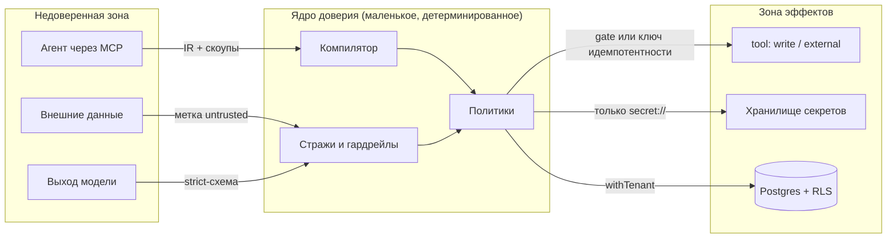
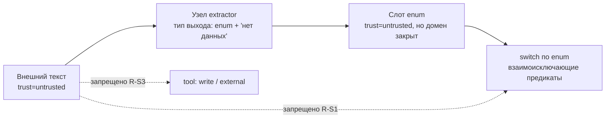

# 19. Безопасность и политики

> Статус: draft
> Зависит от: [02. Архитектура](02-architecture.md), [05. Система типов](05-type-system.md), [09. Модель контекста](09-context-model.md), [10. Рантайм](10-runtime.md)
> Источники: research/api-layer.md, research/persistence.md, research/volt-integrations.md, research/observability.md, спека §8, §12, §13, §17

## Зачем этот слой

Платформа исполняет недетерминированный код (модель), который читает недоверенные данные и дёргает
инструменты с побочными эффектами, в мультитенантной базе. Этот слой закрывает строки каталога §8:
18 (PII к провайдеру и в логи), 19 (prompt injection), 49 (ретраи дублируют эффекты),
60 (агент уходит в сторону), 64 (эффекты без согласия), 80 (секреты в промтах), 81 (нет аудита).
Меры раскладываются по тем же уровням гарантии L0–L4 из спеки §8, что и везде в комплекте: **L0** —
конструкция не позволяет записать ошибку, **L1** — компилятор не пропускает, **L2** — рантайм-страж
ловит по явной политике, **L3** — гейт выпуска, **L4** — мониторинг в проде. Этот слой закрывается
на L0–L2; L3 и L4 для него — [13. Evals и гейты](13-evals-and-gates.md) и
[12. Наблюдаемость](12-observability.md).
Правило приоритета: если меру можно поднять с L2 на L1, поднимаем; если с L1 на L0 — поднимаем.

## Решения

| Решение | Что берём | Версия | Лицензия | Почему |
|---|---|---|---|---|
| Изоляция тенантов в БД | PostgreSQL RLS + `FORCE ROW LEVEL SECURITY`, политики через `pgPolicy` drizzle | pg 18, drizzle-orm 0.45.2 | — / Apache-2.0 | `tenant_id` нужен при любом варианте; RLS снимает класс «забыли WHERE» |
| Аутентификация людей | better-auth + плагины `jwt`, `bearer`, `organization` | 1.7.4 | MIT | живой, выдаёт JWKS, официальный рецепт в доках VoltAgent |
| Проверка токена на границе | `AuthProvider` / `jwtAuth` из `@voltagent/server-core`, режим `authNext` | server-hono 2.0.14 | MIT | всё закрыто по умолчанию, `mapUser` прокидывает `tenantId` |
| Гардрейлы PII и инъекций | `createPIIInputGuardrail`, `createDefaultPIIGuardrails`, `createPromptInjectionGuardrail`, шаг `andGuardrail` | @voltagent/core 2.10.0 | MIT | готовый контракт `allow/modify/block` + стриминговая редакция |
| Аппрув на эффекты | `needsApproval` в `ToolOptions`, `ToolDeniedError` из `onToolStart` | @voltagent/core 2.10.0 | MIT | human-in-the-loop и запрет тула без своего слоя |
| Песочница встроенных агентов | `Workspace` + `LocalSandbox` с `isolation` | @voltagent/core 2.10.0 (EXPERIMENTAL) | MIT | реальная OS-изоляция `sandbox-exec`/`bwrap`, за нашим фасадом |
| Маскирование в трассах наружу | `mask` у `LangfuseSpanProcessor` | @langfuse/otel 5.11.1 | MIT | редакция на пути в SaaS; у нас в Postgres остаётся полный слепок |
| Секреты | ссылки `secret://<env>/<project>/<name>`, значения — во внешнем хранилище | — | — | спека §7.4: «секреты только по ссылке» |

## 1. Модель угроз

Пять источников недоверия. Для каждого — что именно считаем враждебным и где стоит граница.

| # | Источник | Что он может | Граница (кто ловит) |
|---|---|---|---|
| T1 | **Недоверенный агент** (Claude/Codex через MCP, встроенный архитектор) | предлагать IR, компилировать, запускать, генерировать шаблоны | компилятор (L1) + скоупы MCP-токена: агент не выпускает версии, не меняет реестры и политики, не читает секреты (спека §13.2) |
| T2 | **Недоверенные внешние данные** (веб, файлы клиента, ответы чужих API, MCP-ресурсы) | нести инструкции для модели, ложные факты, PII, гигантские полезные нагрузки | метка `untrusted` на значении (L0 на ветвление) + гардрейлы (L2) + лимиты длины |
| T3 | **Недоверенный выход модели** | вернуть текст вместо структуры, «согласиться» на инъекцию, вернуть обрезанный JSON, выдумать идентификатор | strict-схема + три исхода вызова `ok/refusal/truncated` (DECISIONS §«Структурированный вывод»), запрет ремонта обрезанного ответа, output-гардрейлы |
| T4 | **Мультитенантность** | чтение чужого прогона, чужой памяти агента, чужого блоба, чужого ключа провайдера | `tenant_id` + RLS с `FORCE` (L0 на уровне БД) |
| T5 | **Секреты** | утечь в промт, в трассу, в экспортируемый бандл, в логи | lint-правило на IR (L1) + отсутствие значений в процессе шаблонизации (L0) |

Явно **вне** модели угроз v1: враждебный оператор-владелец тенанта, атаки на сам Postgres,
supply-chain на npm, side-channel по времени ответа моделей. Это строки в «Открытые вопросы».



## 2. Уровни доверия данных

### Метка едет вместе со значением

Каждое значение в рантайме — это не голый JSON, а слот с провенансом (спека §5). Метка доверия —
поле провенанса, а не отдельный реестр:

```ts
export type TrustLevel = "trusted" | "untrusted";
export type PiiClass = "none" | "pii" | "sensitive";

export interface Provenance {
  readonly nodeId: NodeId;
  readonly path: string;
  readonly versionRef: VersionRef;
  readonly trust: TrustLevel;
  readonly pii: PiiClass;
  readonly producedAt: string;
}

export interface Slot<T> {
  readonly value: T;
  readonly provenance: Provenance;
}
```

### Откуда берётся исходная метка

| Источник значения | `trust` | Кто ставит |
|---|---|---|
| Константа в IR, литерал шаблона | `trusted` | компилятор |
| Выход `code`-узла над `trusted`-входами | `trusted` | интерпретатор (правило слияния) |
| `data`-узел из нашей БД по типизированному `load` | `trusted`, если источник помечен как внутренний | реестр источников |
| Веб-страница, загруженный файл, ответ чужого API, ресурс чужого MCP | `untrusted` | адаптер порта тула |
| Текст пользователя, поле формы `human`-узла | `untrusted` | исполнитель узла `human` |
| Любой выход LLM-узла | `untrusted` | исполнитель узла `llm` |
| Выход `extractor` с типом-enum над `untrusted` | `untrusted`, но **enum-типизированный** | исполнитель узла `extractor` |

### Правило слияния (монотонное, без исключений)

Метка распространяется по решётке: `untrusted` поглощает `trusted`, `sensitive` поглощает `pii`
поглощает `none`. Слияние — чистая функция от списка входных провенансов, реализация — редьюсер,
не дерево условий:

```ts
const TRUST_ORDER: Record<TrustLevel, number> = { trusted: 0, untrusted: 1 };
const PII_ORDER: Record<PiiClass, number> = { none: 0, pii: 1, sensitive: 2 };

export const joinTrust = (levels: readonly TrustLevel[]): TrustLevel =>
  levels.reduce((a, b) => (TRUST_ORDER[b] > TRUST_ORDER[a] ? b : a), "trusted");

export const joinPii = (classes: readonly PiiClass[]): PiiClass =>
  classes.reduce((a, b) => (PII_ORDER[b] > PII_ORDER[a] ? b : a), "none");
```

Понижение метки возможно **только** через явный узел-даунгрейдер, и их ровно два вида:
`extractor` с enum-типом (см. ниже) и `gate`-узел с человеческим аппрувом, который пишет в журнал
кто и что понизил. Никаких «доверяю, потому что прошло валидацию» — валидация схемы не меняет
доверие, она меняет только типизированность.

### Принцип CaMeL: что физически запрещено

CaMeL в нашей реализации — это не «инструкции игнорируются моделью», а **структурное отсутствие
пути** от `untrusted`-значения к управляющему решению и к эффекту. Проверки — правила компилятора,
семейство `R-S*` (новое, см. «Открытые вопросы» п. 1):

| Код | Правило | Уровень |
|---|---|---|
| R-S1 | Предикат ветвления (`switch`, `branch`, условие цикла) читает только слоты с `trust = trusted` **или** слоты типа-enum, произведённые узлом `extractor`. Любой другой `untrusted`-слот в предикате — ошибка компиляции | L1 |
| R-S2 | Значение с `trust = untrusted` не может попасть в поля эффективной конфигурации вызова: `model`, `instructions`, `tools`, `temperature`, лимиты, `max_iter` | L1 |
| R-S3 | Значение с `trust = untrusted` не может быть аргументом тула класса `write` или `external` иначе как через поле, объявленное в схеме тула с `acceptsUntrusted: true` | L1 |
| R-S4 | `untrusted`-значение не может быть именем тула, идентификатором узла, ключом идемпотентности, ссылкой `secret://`, URL для последующего вызова | L1 |
| R-S5 | В шаблоне промта `untrusted`-значение рендерится только внутри блока `…` — обёртка с разделителями и фиксированной преамбулой; вне блока — ошибка компиляции | L1 |
| R-S6 | `untrusted`-значение не участвует в вычислении точки кэширования промта (иначе злоумышленник управляет кэш-ключом) | L1 |
| R-S7 | Выход узла-`extractor`, используемый в предикате, обязан иметь тип `enum` с закрытым множеством значений и вариантом «нет данных»; открытая строка в предикате — ошибка | L1 |

R-S5 опирается на liquidjs: наш визитор по типизированному AST (DECISIONS §«Промты») уже обходит
дерево тегов, добавить проверку «в каком блоке оказалась переменная» — тот же обход, отдельного
парсера не нужно. Разделители блока генерируются с nonce-меткой прогона, чтобы содержимое не
могло «закрыть» блок своим текстом.

### Единственная легальная дорога untrusted → ветвление



Ключевая мысль: закрытый enum ограничивает **мощность влияния** недоверенных данных числом веток,
которые автор графа сам и написал. Инъекция может выбрать ветку — она не может создать новую,
изменить модель, вызвать другой тул или дописать инструкцию.

## 3. Prompt injection

### Что VoltAgent даёт готовым

Контракт гардрейлов (`@voltagent/core@2.10.0`, `dist/index.d.ts:8174-8305, 12758-12871`):

```ts
type GuardrailSeverity = "info" | "warning" | "critical";
type GuardrailAction = "allow" | "modify" | "block";

interface GuardrailBaseResult {
  pass: boolean;
  action?: GuardrailAction;
  message?: string;
  metadata?: Record<string, unknown>;
}
interface InputGuardrailResult extends GuardrailBaseResult { modifiedInput?: string | UIMessage[] | BaseMessage[]; }
interface OutputGuardrailResult<T> extends GuardrailBaseResult { modifiedOutput?: T; }
```

Готовые фабрики, относящиеся к инъекциям и общей безопасности входа:

| Фабрика | Что делает | Наш вердикт |
|---|---|---|
| `createPromptInjectionGuardrail({ phrases })` | blocklist по списку фраз | берём как первый барьер, но это **эвристика, а не классификатор** |
| `createHTMLSanitizerInputGuardrail({ allowBasicFormatting })` | вычищает HTML из входа | берём для всех web-источников |
| `createInputLengthGuardrail({ maxCharacters, mode })` | режет/блокирует длинный вход | берём, порог — из бюджета узла |
| `createDefaultInputSafetyGuardrails()` | бандл входных гардрейлов | берём как базу профиля `strict` |
| `createInputGuardrail(...)` / `createOutputGuardrail(...)` | свой гардрейл с `handler`, `streamHandler`, `execution`, `streamPolicy` | точка расширения для наших проверок |

В воркфлоу гардрейл — штатный шаг (`d.ts:11588`), доступен и как метод чейна:

```ts
chain.andGuardrail({
  id: "guard_untrusted_input",
  inputGuardrails: [htmlSanitizer, injectionBlocklist, lengthLimit],
  outputGuardrails: [piiRedactors],
});
```

Узел IR типа `guard` маппится на `andGuardrail` один-в-один — свой исполнитель не пишем.
Состояние гардрейлов наблюдаемо снаружи: `AgentGuardrailState` / `AgentGuardrailStateGroup` с
полями `node_id`, `direction`, `severity`, `tags`; блокировка стрима приезжает событием
`InputGuardrailBlockedEventData` / `InputGuardrailBlockedStreamPart` — это и есть источник
данных для UI «почему узел встал».

### Где включаются

| Точка | Что вешаем | Обязательность |
|---|---|---|
| Порт тула, возвращающего внешние данные | HTML-санитайзер + лимит длины + простановка `trust=untrusted` | всегда, зашито в адаптер |
| Вход LLM-узла, в промте которого есть `untrusted`-слот | injection-blocklist + наш детектор (ниже) | всегда, генерируется компилятором |
| Вход LLM-узла без `untrusted`-слотов | ничего | — |
| Выход LLM-узла | strict-схема + output-гардрейлы PII | всегда |
| Узел IR `guard` | то, что написал автор | по графу |

Компилятор сам добавляет `andGuardrail` перед LLM-узлом, если в его эффективном промте есть хотя
бы один слот с `trust = untrusted`. Автор графа не может это отключить — только ужесточить.

### Чего встроенное НЕ покрывает

1. `createPromptInjectionGuardrail` — **список фраз**. Он не ловит перефразировки, другой язык,
   base64, ASCII-art, инструкции в разметке таблицы. Против целевой атаки бесполезен.
2. Гардрейлы не знают ничего про наши метки доверия: они смотрят на текст, а не на провенанс.
3. Гардрейлы не блокируют **последствия** — это фильтр на границе агента, а не политика эффектов.
4. Скорер остановить исполнение не может (live-скореры принципиально async-after-the-fact),
   поэтому «не прошёл порог — прервать» делает наша обёртка шага, а не evals.

### Наши дополнительные проверки

| Код | Проверка | Где живёт | Действие по умолчанию |
|---|---|---|---|
| R-S8 | Структурный детектор: доля императивов, наличие разделителей ролей (`system:`, `<\|im_start\|>`), попытка «забудь предыдущее» в N языках, base64-блоки длиннее 256 символов | наш `createInputGuardrail`, чистая функция | `severity: "warning"`, метка в трассе, не блок |
| R-S9 | LLM-классификатор инъекции на дешёвой модели, вход — только подозрительный фрагмент, выход — enum `{clean, suspicious, injection}` | наш `createInputGuardrail` с `execution` вне горячего пути там, где допустим async | `injection` → `action: "block"` |
| R-S10 | Сверка эффектов: если после узла с `untrusted`-входом в этом же шаге вызывается тул класса `write`/`external` без `gate` — прогон останавливается стражем | обёртка шага, рантайм | `block`, запись в журнал |
| R-S11 | Канареечная строка: в системную часть промта подмешивается nonce прогона; если он появился в выходе модели — считаем, что модель пересказывает системный текст | output-гардрейл | `block` |

R-S9 не блокирует выпуск и не является гейтом качества: это рантайм-страж уровня L2. Порог и
модель классификатора — поля политики проекта, а не константы в коде.

## 4. PII

### Метка — свойство типа, а не поля значения

`pii` объявляется в реестре типов и наследуется всеми слотами этого типа (см. `PiiClass` в §2).
Компилятор знает класс PII статически, поэтому проверки — L1, а не L2:

| Код | Правило | Уровень |
|---|---|---|
| R-S12 | Слот с `pii ≠ none` рендерится в промт только если эффективная модель вызова принадлежит провайдеру из allowlist профиля | L1 |
| R-S13 | Слот с `pii = sensitive` не попадает в инлайн-превью трассы, в дифф версий, в экспортируемый бандл и в датасет — только по ссылке на блоб | L1 |
| R-S14 | Тул класса `external` получает `pii`-аргумент только если в его контракте объявлено `piiSink: true` и провайдер тула в allowlist | L1 |
| R-S15 | Переопределением модели (`R-O*`) нельзя вывести вызов за allowlist: после применения переопределения R-S12 перепроверяется | L1 |

### Allowlist провайдеров

Хранится в реестре профилей (спека §«Маршрутизация задаётся политикой на профиль» — «требования к
обращению с данными»), не в коде. Форма — таблица `app.provider_data_policies`, DDL с RLS, индексами
и `CHECK`-ограничениями — [16. Модель данных](16-data-model.md) §2.16:

| Колонка | Тип | Смысл |
|---|---|---|
| `tenant_id` | uuid | RLS-ключ |
| `provider` | text | `openrouter`, `togetherai`, `anthropic`, … |
| `allows_pii` | boolean | можно ли отправлять `pii` |
| `allows_sensitive` | boolean | можно ли отправлять `sensitive` |
| `retention` | text | `zero` / `logged` / `unknown` — со стороны провайдера |
| `evidence_url` | text | ссылка на DPA/страницу политики, чтобы поле не было выдумкой |

`retention = unknown` трактуется как `allows_pii = false` — по умолчанию запрещено.

### Маскирование в трассах и логах

Ключевая ловушка: `mask` у `LangfuseSpanProcessor` применяется **только на пути в Langfuse**, наш
собственный Postgres-процессор получает немаскированные данные. Поэтому маскирование делается
**до** записи атрибута, а `mask` остаётся вторым рубежом:

```ts
const langfuseSpanProcessor = new LangfuseSpanProcessor({
  publicKey, secretKey, baseUrl,
  environment: deployEnvironment,
  release: gitSha,
  mask: ({ data }) => redactOutbound(data),
});

const provider = new NodeTracerProvider({
  spanProcessors: [langfuseSpanProcessor, ourPostgresSpanProcessor],
  spanLimits: { attributeValueLengthLimit: 8192 },
});
```

Дисциплина (из §7.10 заметок по обзёрвабилити, здесь — как жёсткое правило):

1. Единственное место формирования атрибутов спана — фабрика `buildNodeSpanAttributes(ctx)`.
   `span.setAttribute` россыпью по коду запрещён линт-правилом.
2. Фабрика получает слоты вместе с провенансом и сама решает, что писать инлайн, а что заменить на
   `{blob_id}`. Ни одного `pii`-значения в инлайн-превью.
3. Порядок процессоров в массиве не гарантирует порядок доставки, `onEnd` получает один и тот же
   `ReadableSpan` — **мутировать `span.attributes` запрещено**, только читать.
4. Логи: логгер операции (`options.logger`) получает уже редактированные значения; сырые значения
   в логи не попадают никогда, даже на `debug`.

### Готовые PII-гардрейлы и их границы

| Фабрика | Направление | Что покрывает |
|---|---|---|
| `createPIIInputGuardrail({ replacement, maskEmails, maskPhones })` | вход | e-mail, телефоны |
| `createEmailRedactorGuardrail({ replacement })` | выход | e-mail |
| `createPhoneNumberGuardrail({ replacement })` | выход | телефоны |
| `createSensitiveNumberGuardrail({ minimumDigits = 4, replacement = "[redacted]" })` | выход | длинные числовые последовательности (карты, счета) |
| `createDefaultPIIGuardrails({ sensitiveNumber, email, phone })` | выход | бандл трёх выше |

Output-гардрейл умеет работать по стриму: `streamHandler({ part, streamParts, state, abort })`
возвращает изменённый `VoltAgentTextStreamPart` или `null` — то есть редакция идёт в реальном
времени, не дожидаясь полного ответа. Это то, что нужно для Studio.

**Границы встроенного:** это регулярные выражения по латинице и общим форматам. Не покрыты
российские паспорта и СНИЛС, ИНН, адреса, ФИО, номера полисов, IBAN, кириллические форматы,
PII внутри base64 и внутри структурированного JSON-выхода (гардрейлы бандла типизированы как
`OutputGuardrail<string>`). Наш слой: `createOutputGuardrail` с обходом JSON по схеме — редактируем
поля по метке типа, а не по регулярке по всему тексту. Это единственный способ, дающий полноту:
метка есть в типе, значит поле известно статически.

### Редакция в кассетах и датасетах

Кассеты — свой content-addressed формат на уровне порта модели и тула (DECISIONS §«Экспорт»),
поэтому редакция применяется **при записи кассеты**, а не при чтении: в кассете физически нет
исходного PII. Ключ кассеты считается по нормализованному запросу **после** редакции — иначе одна
и та же запись не найдётся при воспроизведении.

| Артефакт | Что хранится | Правило |
|---|---|---|
| Кассета вызова модели | `request_hash` (sha256 нормализованного и редактированного запроса), `response_ref` | `pii`-поля заменены на стабильный плейсхолдер `«[pii:<type_id>:<n>]»`, нумерация детерминированная в пределах кассеты |
| Датасет из прода | семплы трасс | редакция обязательна; элемент без пройденной редакции в датасет не принимается (проверка на входе `dataset_generate`) |
| Экспортируемый бандл | IR + скомпилированные промты | `pii`-значений не бывает по построению: в бандл едет спека, а не данные прогона |
| Блобы | `app.blobs` | хранятся как есть под RLS; наружу отдаются только через операцию, проверяющую право на прогон |

Плейсхолдер стабилен, поэтому детерминизм реплея сохраняется: та же трасса даёт тот же
`request_hash`.

## 5. Секреты

### Только ссылка, никогда значение

В IR, в шаблоне промта, в конфигурации узла и в экспортируемом бандле секрет представлен
ссылкой фиксированного вида:

```
secret://<environment>/<project_slug>/<name>
```

Тип ссылки — branded, чтобы её нельзя было спутать со строкой:

```ts
export type SecretRef = string & { readonly __brand: "SecretRef" };

export interface SecretResolver {
  resolve(ref: SecretRef, ctx: ResolutionContext): Promise<string>;
}
```

`SecretResolver` — Port; адаптеры: `EnvSecretResolver` (dev), `FileSecretResolver` (self-hosted),
внешний менеджер секретов (prod). Выбор адаптера — свойство окружения, не проекта.

### Где значение физически появляется

Значение секрета существует ровно в двух местах и нигде больше:

1. В процессе адаптера провайдера (`@wf/llm`) — в момент формирования HTTP-заголовка.
2. В процессе адаптера тула — в момент формирования запроса к внешнему API.

Шаблонизатор промтов **не имеет доступа** к `SecretResolver`: он получает только слоты значений.
Это L0: нет пути — нет утечки в промт. Кассеты пишутся на уровне порта, то есть **после** того, как
заголовок сформирован, и заголовки авторизации в кассету не попадают по allowlist полей запроса
(в хеш и в тело кассеты идут только перечисленные поля, а не «всё кроме»).

### Lint-правило R-S16

| Код | Правило | Уровень | Реализация |
|---|---|---|---|
| R-S16 | Ни одно строковое поле IR, кроме полей типа `SecretRef`, не похоже на секрет | L1 | ajv-валидация IR-документа + детектор энтропии |

Детектор (запускается на всех строковых литералах IR и на всех литералах шаблонов):

| Признак | Порог |
|---|---|
| Префиксы известных ключей | `sk-`, `sk_live_`, `pk_`, `ghp_`, `AKIA`, `xoxb-`, `-----BEGIN` |
| Shannon-энтропия строки | ≥ 4.0 бит/символ при длине ≥ 24 |
| Base64/hex-строка | длина ≥ 32 и алфавит однородный |
| Имя поля | совпадает с `/(secret|token|api[_-]?key|password|passwd|credential)/i` и значение не `SecretRef` |

Срабатывание — ошибка компиляции, а не предупреждение. Ложное срабатывание закрывается явной
аннотацией поля в IR (`"literalKind": "opaque"`), которая попадает в журнал решений.

Второй контур — pre-commit и CI на репозитории (Biome + сканер секретов) — не отменяет R-S16:
секрет может приехать через MCP-тул от агента, минуя git.

### Разделение по окружениям и проектам

Ключи провайдеров хранятся отдельно по окружениям (спека §«Ключи»). Модель разделения:

| Ось | Что разделяет | Как |
|---|---|---|
| Окружение | `dev` / `stage` / `prod` | отдельное пространство имён в хранилище; адаптер окружения не видит чужое |
| Тенант | ключи разных клиентов | префикс пространства имён `tenant/<tenant_id>/`, разрешение только внутри `withTenant` |
| Проект | ключи разных проектов одного тенанта | сегмент `<project_slug>` в ссылке |
| Назначение | ключ провайдера vs ключ тула vs ключ трасс | разные имена, разные права на чтение |

Агент (человеку это тоже относится в режиме MCP) **не может читать секреты** — операции
разрешения ссылок в MCP-контракте нет вообще. Он может только проверить, что ссылка разрешается:
операция возвращает `{ resolvable: true|false }`, без значения.

## 6. Мультитенантность

### tenant_id + RLS

`tenant_id` есть во всех таблицах схемы `app`. Политика пишется декларативно в схеме drizzle:

```ts
export const appRole = pgRole("app_user").existing();

export const runs = appSchema.table("runs", runsColumns, (t) => [
  pgPolicy("runs_tenant_isolation", {
    as: "permissive",
    for: "all",
    to: appRole,
    using: sql`${t.tenantId} = current_setting('app.tenant_id', true)::uuid`,
    withCheck: sql`${t.tenantId} = current_setting('app.tenant_id', true)::uuid`,
  }),
]);
```

Custom-миграция включает RLS:

```sql
ALTER TABLE app.runs ENABLE ROW LEVEL SECURITY;
ALTER TABLE app.runs FORCE ROW LEVEL SECURITY;
```

`FORCE` обязателен: без него владелец таблицы обходит собственные политики, и приложение,
ходящее под владельцем схемы, тихо видит всё.

Контекст тенанта ставится **только** `SET LOCAL` внутри транзакции:

```ts
export const withTenant = <T>(tenantId: TenantId, fn: (tx: Tx) => Promise<T>): Promise<T> =>
  db.transaction(async (tx) => {
    await tx.execute(sql`SELECT set_config('app.tenant_id', ${tenantId}, true)`);
    return fn(tx);
  });
```

`set_config(..., true)` = `SET LOCAL`, действует до конца транзакции. Сессионный `SET` при
transaction pooling (PgBouncer/pgcat) протечёт в чужой запрос — это жёсткий запрет.
`withTenant` — единственная точка входа в БД для прикладного кода; фоновые джобы, миграции и
аналитика ходят под ролями `app_migrator` / `app_analytics` (`BYPASSRLS`) и помечены явно.

Правило индексов: везде, где есть RLS-политика по `tenant_id`, этот столбец первый в составном
индексе — иначе политика становится лишним предикатом на полном скане.

### Изоляция памяти агентов

**Опасный дефолт:** если у `Agent` не указано `memory`, VoltAgent подключает встроенное in-memory
хранилище — агент **не** stateless по умолчанию. Для платформы, где один процесс обслуживает
много тенантов, это прямой канал утечки: два прогона разных тенантов с совпавшим
`conversationId` увидят общую историю.

Наши правила:

| Случай | Что ставим | Почему |
|---|---|---|
| LLM-узел воркфлоу (`llm`, `extractor`, `judge`, `classifier`) | `memory: false` **явно** | узел чистый; вся история — в `workflowState`, а не в памяти агента |
| `bounded_agent` внутри узла | адаптер памяти поверх нашей БД, `conversationId = runId`, `userId = tenant:<tenant_id>:user:<user_id>` | память живёт ровно один прогон |
| Встроенный архитектор (диалог в Studio) | адаптер памяти поверх нашей БД, scope `user` | это настоящий диалог |

Компилятор проверяет:

| Код | Правило | Уровень |
|---|---|---|
| R-S17 | У узла-агента либо `memory: false`, либо явно заданный адаптер памяти с обязательными `userId` и `conversationId`. Отсутствие того и другого — ошибка компиляции | L1 |
| R-S18 | Scope памяти не расширяется (`run → user → tenant`) без политики аппрува — это R-O5 из §7, здесь фиксируется его реализация: расширение скоупа требует `gate`-узла с аппрувом | L1 |

`WorkflowRegistry` — глобальный синглтон (`globalThis.___voltagent_workflow_registry`), поэтому
идентификатор зарегистрированного воркфлоу обязан включать `tenant_id` и версию:
`wf:<tenant_id>:<project_slug>:<flow_slug>@<version>`. Коллизия имён между тенантами иначе
приведёт к исполнению чужого графа.

Схема `voltagent` (6 таблиц, создаются рантаймом `CREATE TABLE IF NOT EXISTS`) наших политик не
имеет. Следствие: **прикладной код никогда не читает `voltagent.*` напрямую**; всё, что нужно
показать пользователю, читается из наших таблиц схемы `app`, куда мы пишем со своим `tenant_id`
в хуках `onStepEnd`/`onFinish`.

### Изоляция ключей провайдеров, файлов и блобов

| Ресурс | Механизм изоляции |
|---|---|
| Ключи провайдеров | пространство имён `tenant/<tenant_id>/` в хранилище секретов; резолвер получает `tenantId` из контекста операции, а не из аргумента вызова |
| Блобы | `app.blobs` под RLS; `UNIQUE (project_id, sha256)` — дедуп **внутри проекта**, не глобальный, иначе контентная адресация становится оракулом «у кого ещё есть этот файл» |
| Объектное хранилище (>1 МБ) | ключ объекта с префиксом `<tenant_id>/<project_id>/<sha256>`, отдача только через подписанную ссылку с TTL, выданную после проверки прав |
| Файлы песочницы | `rootDir` на прогон, уничтожается вместе с прогоном (см. §9) |
| Векторный индекс pgvector | таблицы в схеме `app`, те же политики по `tenant_id` |

## 7. Аутентификация и авторизация

### Три контура

```
Человек (Studio)   браузер -> better-auth session cookie (HttpOnly) на домене Studio
                           -> BFF Next.js -> Bearer JWT (RS256) -> control plane
Агент (MCP)        долгоживущий credential, привязанный к (user, tenant, scopes)
                           -> Authorization: Bearer <token> на каждом вызове тула
                           -> тот же verifyToken -> тот же user-объект -> те же проверки прав
Консоль VoltOps    отдельный контур: x-console-access-key / ?key= против VOLTAGENT_CONSOLE_ACCESS_KEY
```

Стык с VoltAgent — через `AuthProvider` (Strategy: поставщик заменяем без изменения операций):

```ts
interface AuthProvider<TRequest = unknown> {
  type: string;
  verifyToken(token: string, request?: TRequest): Promise<unknown>;
  extractToken?(request: TRequest): string | undefined;
  publicRoutes?: string[];
  defaultPrivate?: boolean;
}
```

Режим `authNext`: **всё закрыто по умолчанию**, порядок разрешения — public routes → console
routes → user routes. `jwtAuth({ secret, mapUser, verifyOptions })` умеет
`mapUser: (payload) => ({ id, email, tenantId, role })`, то есть `tenantId` приезжает сразу и
подаётся в `withTenant`. Проверки роли и прав — в наших хендлерах (дока VoltAgent прямо это
предписывает), а не в провайдере.

### Подводные камни, закрываемые явными тестами

| Риск | Мера | Тест |
|---|---|---|
| Dev-байпас: обход auth при заголовке `x-voltagent-dev: true` и `NODE_ENV !== "production"` | в prod-сборке `NODE_ENV=production` проверяется на старте, иначе процесс не поднимается | e2e: запрос с dev-заголовком в prod-конфиге → 401 |
| WebSocket: доки VoltAgent противоречат сами себе — `api/streaming.md` говорит «WebSockets are currently unauthenticated», `api/authentication.md` предлагает `?token=` | `/ws/*` наружу не выставляем; стрим наружу — SSE через наш роут с `Authorization` | e2e: прямой коннект к `/ws/*` снаружи периметра недоступен |
| Console Access Key — отдельный контур от пользовательской аутентификации | в prod консоль выключена или закрыта сетью | конфиг-тест |
| Токен без `tenantId` | `mapUser` бросает; запрос без `tenantId` до БД не доходит | unit |

### Скоупы

Скоуп — строка `<группа>:<действие>`, проверяется в use-case, не в роуте (роут знает про HTTP,
use-case — про право). Таблица прав повторяет спеку §13.2:

| Скоуп | Человек-владелец | Человек-редактор | Агент по MCP |
|---|---|---|---|
| `flow:read`, `run:read`, `journal:read` | да | да | да |
| `flow:write` (черновики, шаблоны, свои компоненты) | да | да | да |
| `run:execute` (в dev-окружении) | да | да | да |
| `dataset:write`, `experiment:run` | да | да | да |
| `version:propose` | да | да | да |
| `version:release` | да | нет | **нет** |
| `library:publish` (компонент в общую библиотеку) | да | нет | **нет** |
| `registry:write` (типы, профили, агенты) | да | нет | **нет**, только `registry_propose_*` |
| `policy:write` (allowlist, PII, доверие, эффекты) | да | нет | **нет** |
| `secret:read` | **нет ни у кого** — операции не существует | — | — |
| `run:execute` в `prod` | да | по политике проекта | **нет** |
| `effect:approve` (аппрув побочного эффекта) | да | по политике | **нет** |

Разница «агент против человека» сводится к одному предложению: **агент предлагает, человек
выпускает**. Всё, что меняет то, по чему потом судят (версии, реестры, политики, общая
библиотека), закрыто аппрувом.

### Выдача и обновление агентского токена

`better-auth` плагины `jwt` (короткоживущий RS256 + JWKS) и `bearer`; обновление — через
`device-authorization` (OAuth device flow — ровно сценарий CLI/агента) либо `one-time-token`.
Плагин `organization` даёт тенанты и членство. Токен несёт `tenant_id`, `project_id` (опционально,
сужает область), список скоупов и `exp`. Отзыв — отзыв сессии в better-auth.

## 8. Побочные эффекты

### Классы эффектов

Контракт тула (спека §7.4): схема входа и выхода, класс эффекта, таймаут, шаблон ключа
идемпотентности.

| Класс | Что значит | Требование компилятора |
|---|---|---|
| `read` | не меняет состояние вне прогона | ничего сверх схемы и таймаута |
| `write` | меняет наше состояние (БД, файл в нашем хранилище) | **gate** или ключ идемпотентности |
| `external` | меняет чужое состояние (письмо, платёж, пост, вызов чужого API) | **gate** или ключ идемпотентности; плюс `needsApproval` в `prod` по умолчанию |

| Код | Правило | Уровень |
|---|---|---|
| R-S19 | Тул класса `write`/`external` без `gate`-узла перед ним и без шаблона ключа идемпотентности не компилируется | L1 |
| R-S20 | Шаблон ключа идемпотентности не содержит `untrusted`-слотов (иначе ключ управляется атакующим — это R-S4) | L1 |
| R-S21 | Шаблон ключа идемпотентности детерминирован в пределах прогона: только `run_id`, `node_id`, индекс итерации и `trusted`-слоты. Ни `now()`, ни случайности | L1 |
| R-S22 | Ретрай тула `write`/`external` выполняется только с тем же ключом идемпотентности; смена ключа при ретрае — ошибка рантайма | L2 |

Ключ идемпотентности вычисляется как `sha256` канонического JSON (RFC 8785, `canonicalize@5.0.0`)
от объекта `{ runId, nodeId, iteration, args }` с доменной сепарацией — та же схема хеширования,
что и в экспорте, префикс `idem-`.

### needsApproval и запрет тула

Аппрув берём готовым, свой слой не пишем:

```ts
createTool({
  name: "send_invoice",
  parameters: sendInvoiceInput,
  outputSchema: sendInvoiceOutput,
  tags: ["effect:external", "pii:sink"],
  needsApproval: (args, options) => requiresApproval(options, args.amount),
  hooks: toolPolicyHooks,
});
```

`needsApproval: boolean | ToolNeedsApprovalFunction` — динамическое решение по аргументам.
Функция `requiresApproval` плоская: таблица политик по окружению и порогу, без вложенных условий.

Запрет тула — `ToolDeniedError`, брошенная из хука `onToolStart`. Она **останавливает всю операцию
агента**, что нам и нужно. Коды: `TOOL_ERROR`, `TOOL_FORBIDDEN`, `TOOL_PLAN_REQUIRED`,
`TOOL_QUOTA_EXCEEDED` плюс кастомные, есть `httpStatus`; ловится `isToolDeniedError(err)`.
Отображение наших политик на коды:

| Политика | Код | Когда |
|---|---|---|
| Тул не в allowlist узла | `TOOL_FORBIDDEN` | всегда |
| Эффект без аппрува в `prod` | `TOOL_PLAN_REQUIRED` | класс `external`, окружение `prod` |
| Исчерпан бюджет узла или прогона | `TOOL_QUOTA_EXCEEDED` | счётчик в `workflowState` |
| Провайдер тула вне allowlist для `pii`-аргумента | `TOOL_FORBIDDEN` | R-S14 |

`ToolHooks.onEnd` может подменить `output` — там же стоит редакция PII на уровне тула, до того как
значение попадёт в слот и в трассу.

### Аудит эффекта

Каждый вызов тула класса `write`/`external` пишет строку в `app.tool_effects` (append-only, см. §10):
`tenant_id`, `run_id`, `node_id`, `tool_name`, `effect_class`, `idempotency_key`,
`approval_id` (если был `gate`), `actor` (человек или агент), `status`, `started_at`,
`finished_at`, `request_ref`, `response_ref`. Строка пишется **до** вызова со статусом `pending` и
обновляется по результату — иначе упавший процесс оставит эффект без следа.

## 9. Песочница для встроенных агентов

### Что берём

`Workspace` + `LocalSandbox` из `@voltagent/core@2.10.0`. Изоляция реальная, на уровне ОС:

```ts
const sandbox = new LocalSandbox({
  rootDir: runScratchDir,
  isolation: { provider: "sandbox-exec", allowNetwork: false, readWritePaths: [runScratchDir] },
});
```

`provider` — `sandbox-exec` на macOS, `bwrap` (bubblewrap) на Linux. Доступность определяется
`LocalSandbox.detectIsolation()` (также экспортируется `detectLocalSandboxIsolation()`). **Если
провайдер недоступен или ОС не поддержана — `execute` бросает исключение, а не тихо выполняет код
без изоляции.** Это ровно то поведение, которое нужно: наш стартовый чек падает, если изоляция не
детектируется, и встроенные агенты просто выключаются.

Удалённые песочницы (когда упрёмся в производительность или понадобится сеть):

| Провайдер | Пакет | Версия | Лицензия |
|---|---|---|---|
| Blaxel | `@voltagent/sandbox-blaxel` | 2.1.1 | MIT |
| Daytona | `@voltagent/sandbox-daytona` | 2.0.3 | MIT |
| E2B | `@voltagent/sandbox-e2b` | 2.0.3 | MIT |
| Local | `LocalSandbox` в core | — | MIT |

Мультитенантность — свой класс, реализующий `WorkspaceSandbox` (`name`, `status`, `getInfo()`,
`execute(options)`, `destroy()`), с маршрутизацией по
`options.operationContext.context.get("tenantId")`.

**Весь API воркспейса объявлен EXPERIMENTAL** (`:::warning Experimental — Expect iteration and
possible breaking changes` стоит в каждом файле доки: `overview`, `sandbox`, `skills`, `security`,
`filesystem`, `search`). Поэтому наш код ходит в него только через фасад `@wf/sandbox` с
собственным интерфейсом — Adapter, чтобы ломающее изменение стоило один файл.

### Политики тулов

```ts
const workspace = new Workspace({
  toolConfig: {
    filesystem: {
      defaults: { needsApproval: true },
      tools: { write_file: { enabled: false } },
    },
  },
});
```

Типы: `WorkspaceToolConfig`, `WorkspaceToolPolicies`, `WorkspaceToolPolicy`,
`WorkspaceToolPolicyGroup`, `WorkspaceFilesystemToolPolicy`. Агентские `workspaceToolkits`
мержатся поверх воркспейсных дефолтов, то есть агент может только ужесточить, если мы задали
дефолт запрещающим.

Профиль v1 (`workspace.strict`):

| Настройка | Значение | Почему |
|---|---|---|
| `filesystem.readOnly` | `true` для всех путей, кроме `runScratchDir` | агент не правит проект, он предлагает патч |
| `filesystem.defaults.needsApproval` | `true` | запись — событие с аппрувом |
| `requireReadBeforeWrite` | `true` | агент обязан `read_file` до модификации; при изменении файла после чтения тул требует перечитать — защита от гонок |
| `operationTimeoutMs` | 30 000 на тулкит, 5 000 на файловые операции | бюджет узла |
| `isolation.allowNetwork` | `false` | сеть — только через наши тулы с классами эффектов |
| `search.allowDirectAccess` | `false` | иначе поиск обходит политику файловой системы |
| env процесса | не наследуется целиком, передаётся явный allowlist переменных | иначе в песочницу утекают ключи из окружения воркера |
| skills | allowlist каталогов `references/`, `scripts/`, `assets/` | `SKILL.md` — это исполняемая инструкция, приехавшая извне |

### Что запрещено в v1

1. Сеть из песочницы (`allowNetwork: false`) — без исключений.
2. Удалённые провайдеры песочниц (Blaxel/Daytona/E2B) — не подключаем, чтобы не выносить код
   клиента за периметр до появления DPA.
3. `WorkspaceSearch` с эмбеддингами и `autoIndexPaths` — за флагом, по умолчанию выключено.
4. Skills как несущая конструкция — только как эксперимент: API экспериментальный,
   `SKILL.md` подмешивается прямо в промт, то есть это канал инъекции.
5. Долгоживущая песочница между прогонами: `destroy()` вызывается в `onFinish`, `rootDir` удаляется.
6. Любой доступ песочницы к хранилищу секретов.

## 10. Аудит и журнал решений

### Что пишем

Три append-only таблицы, разные назначения, одна дисциплина:

| Таблица | Что фиксирует | Кто пишет |
|---|---|---|
| `app.journal` | решения: предложенная версия, аппрув, отказ, изменение политики, изменение реестра, понижение метки доверия, ложное срабатывание R-S16 | use-case через `journal_append` |
| `app.tool_effects` | каждый вызов тула класса `write`/`external` (§8) | обёртка порта тула |
| `app.access_log` | выдача и отзыв токенов, смена скоупов, вход в консоль, обращения под `BYPASSRLS`-ролями | слой аутентификации |

DDL всех трёх — [16. Модель данных](16-data-model.md): `app.journal` в §2.15, `app.access_log` в §2.16,
`app.tool_effects` в §2.10.

Поля `app.journal`:

| Колонка | Тип | Смысл |
|---|---|---|
| `id` | uuid (uuidv7) | PK, время встроено |
| `tenant_id` | uuid | RLS |
| `project_id` | uuid | область |
| `kind` | text | `version_proposed`, `version_released`, `policy_changed`, `registry_changed`, `trust_downgraded`, `effect_approved`, `lint_override` |
| `actor_kind` | text | `human` / `agent` |
| `actor_id` | uuid | пользователь или токен агента |
| `on_behalf_of` | uuid, null | пользователь, от чьего имени работал агент |
| `reason` | text | обязательное, непустое |
| `evidence_ref` | jsonb | ссылка на эксперимент, датасет, прогон |
| `version_from` / `version_to` | text, null | связь с версиями |
| `payload_ref` | jsonb | значение или `{blob_id}` |
| `prev_hash` | bytea | sha256 предыдущей записи цепочки тенанта |
| `entry_hash` | bytea | sha256 канонического JSON записи + `prev_hash`, доменная сепарация |

### Неизменяемость

Неизменяемость не декларативная, а на уровне прав и триггеров:

```sql
REVOKE UPDATE, DELETE ON app.journal FROM app_user;
CREATE TRIGGER journal_entries_immutable
  BEFORE UPDATE OR DELETE ON app.journal
  FOR EACH ROW EXECUTE FUNCTION app.raise_immutable();
```

Плюс хеш-цепочка: `entry_hash = sha256("wf/journal/v1" || canonicalize(entry) || prev_hash)`,
канонизация — `canonicalize@5.0.0` (RFC 8785), хеш — `@noble/hashes`, префикс `sha256-` в
текстовом представлении. Разрыв цепочки обнаруживается сверяющим заданием (то же расписание
pg-boss, что и у сверки таймаутов) и поднимает инцидент. Это делает не-невозможным, но
обнаруживаемым вмешательство даже под `BYPASSRLS`-ролью.

### Кто автор изменения

`actor_kind` + `actor_id` + `on_behalf_of` закрывают главный вопрос: когда Claude через MCP
предлагает версию, автором записи является **токен агента**, а от чьего имени — пользователь,
выдавший токен. Выпуск версии всегда записывается с `actor_kind = human`: у агента нет скоупа
`version:release` (§7), значит запись с `actor_kind = agent` и `kind = version_released`
невозможна по построению и является сигналом компрометации.

### Связь с версиями

Версии неизменяемы; спека, скомпилированные промты и профили моделей фиксируются вместе, у
каждого выхода прогона есть lineage. Журнал — то, что соединяет версии в историю: у каждой версии
есть запись `version_proposed` с `evidence_ref` на эксперимент и запись `version_released` с
`actor_id` человека. Обратная связь читается операцией `journal_read` с фильтром по
`version_from`/`version_to`; это и есть ответ на риск 81 «нет аудита изменений» (L0 —
выпуск без записи в журнал невозможен, потому что release и append идут одной транзакцией).

## Открытые вопросы

1. **Код семейства правил.** Введено новое семейство `R-S1..R-S22` (security). В каталоге §8 такого
   семейства нет — есть `R-T*`, `R-C*`, `R-L*`, `R-O*`, `R-J*`.
   *Что сделать:* утвердить префикс у ведущего и внести семейство в сквозной каталог кодов, либо
   переразметить правила по существующим семействам.
2. **Работает ли `Workspace` без агента.** В заметках помечено UNVERIFIED: `Workspace` привязан к
   `Agent`, сработает ли он для шага воркфлоу без агента — по типам не видно.
   *Что сделать:* прототип: шаг воркфлоу с `LocalSandbox` без `Agent`; если не работает —
   встроенные агенты остаются единственными потребителями песочницы, а `code`-узлы получают
   собственный механизм изоляции (отдельное решение).
3. **План RLS-политики через подзапрос.** Для горячих таблиц предложена политика вида
   `project_id IN (SELECT id FROM app.projects WHERE tenant_id = current_setting(...))`. План такого
   подзапроса в политике не измерялся (UNVERIFIED в заметках).
   *Что сделать:* `EXPLAIN (ANALYZE, BUFFERS)` на таблице `run_nodes` с реалистичным объёмом; при
   плохом плане денормализовать `tenant_id` в горячие таблицы и поставить его первым в индексе.
4. **Противоречие в доках VoltAgent про WebSocket.** `api/streaming.md` — «WebSockets are currently
   unauthenticated»; `api/authentication.md` — «используйте `?key=` (console) / `?token=` (user)».
   Принято консервативное решение: `/ws/*` наружу не выставляем.
   *Что сделать:* проверить на собранном сервере, применяется ли `authNext` к `/ws/*`; результат
   зафиксировать ADR.
5. **Хранилище секретов для prod не выбрано.** Есть контракт `SecretResolver` и адаптеры env/file;
   конкретный менеджер (Vault, SOPS+age, облачный KMS) в заметках не исследован.
   *Что сделать:* отдельное исследование с критериями: self-hosted, ротация, аудит доступа,
   лицензия; результат — строка в DECISIONS.
6. **Детектор PII для русскоязычных форматов.** Встроенные гардрейлы покрывают e-mail, телефоны и
   длинные числа; СНИЛС, ИНН, паспорт, полис, IBAN, ФИО, адреса — нет. Библиотека не выбрана.
   *Что сделать:* исследовать готовые решения (и оценить их лицензии); до тех пор опираться на
   типовую разметку `pii` и структурную редакцию по схеме, а не на текстовые детекторы.
7. **Модель и порог классификатора инъекций (R-S9).** В заметках нет ни модели, ни измеренного
   качества.
   *Что сделать:* собрать состязательный датасет (спека §«состязательные — … попытки инъекций»),
   померить precision/recall на трёх дешёвых моделях, зафиксировать порог как поле политики.
8. **OAuth-provider better-auth для MCP.** В заметках прямо сказано: не подтверждено, что
   `mcp`-плагин better-auth годится как OAuth-provider для MCP, закладываться нельзя.
   *Что сделать:* проверить версию 1.7.4 на живом MCP-клиенте; до подтверждения — долгоживущий
   API-токен (таблица + `AuthProvider.verifyToken`).
9. **Расхождение по экспортёру трасс.** `research/volt-integrations.md` описывает путь через
   `@voltagent/langfuse-exporter@2.0.3`, `research/observability.md` фиксирует, что этот пакет сидит
   на легаси-SDK, и рекомендует `@langfuse/otel` напрямую. DECISIONS закрепляет `@langfuse/*` 5.11.1.
   Для этого документа расхождение значимо тем, что `mask` есть у `LangfuseSpanProcessor` из
   `@langfuse/otel`; наличие эквивалента у `@voltagent/langfuse-exporter` не проверялось.
   *Что сделать:* ничего, кроме фиксации: берём путь DECISIONS. Если кто-то вернёт адаптер —
   проверить наличие `mask` до включения.
10. **Аудит под `BYPASSRLS`.** Роли `app_migrator` и `app_analytics` обходят RLS; хеш-цепочка делает
    вмешательство обнаруживаемым, но не предотвращает его.
    *Что сделать:* решить, нужен ли внешний неизменяемый приёмник журнала (WORM-бакет, внешний
    лог-сервис) для энтерпрайз-тенантов, или достаточно цепочки и сверяющего задания.
11. **Дедуп блобов внутри проекта против экономии.** `UNIQUE (project_id, sha256)` закрывает оракул
    межтенантного дедупа, но теряет экономию на одинаковых промтах разных проектов одного тенанта.
    *Что сделать:* измерить долю повторов между проектами одного тенанта; при значимой экономии
    рассмотреть ключ `(tenant_id, sha256)` — межтенантный дедуп остаётся запрещённым в любом случае.
12. **Проверка `NODE_ENV=production` на старте.** Механизм предложен, но в заметках нет
    подтверждения, что `isDevRequest` читает именно `process.env.NODE_ENV` в момент запроса, а не на
    старте процесса.
    *Что сделать:* прочитать реализацию `isDevRequest` в `@voltagent/server-core@2.1.20` и
    закрыть e2e-тестом независимо от результата.
