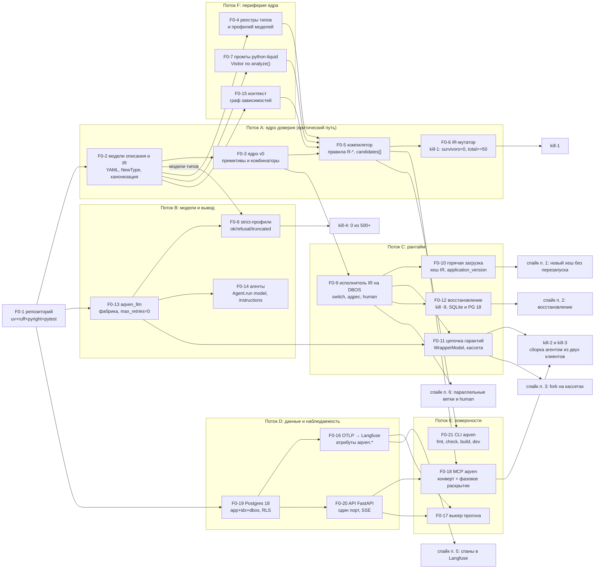

# 21. Дорожная карта и критерии остановки

> Статус: draft
> Зависит от: [01. Продукт и требования](01-product-and-requirements.md), [02. Архитектура](02-architecture.md), [03. Ядро языка](03-core-language.md), [05. Система типов](05-type-system.md), [07. Компилятор](07-compiler.md), [08. Промты](08-prompts.md), [09. Контекстная модель](09-context-model.md), [10. Рантайм](10-runtime.md), [23. API локальной студии](23-studio-api.md), [ADR-0025](adr/0025-python-engine.md), [ADR-0026](adr/0026-yaml-spec-and-code-refs.md), [ADR-0027](adr/0027-dynamic-io-shapes.md), [ADR-0028](adr/0028-studio-api-contract.md), [ADR-0029](adr/0029-trust-and-quality-python.md)
> Источники: [research/py-stack-runtime.md](research/py-stack-runtime.md), [research/py-quality-layer.md](research/py-quality-layer.md), [research/py-spec-as-code.md](research/py-spec-as-code.md), [research/studio-api-inventory.md](research/studio-api-inventory.md), research/evals-tooling.md; спека §17, §18, §19, §20.4, §20.6 (§20 заменён [ADR-0025](adr/0025-python-engine.md))

## Зачем этот слой

Спека §17 задаёт четыре фазы, §18 — пятнадцать kill-критериев, §19 — таблицу рисков. Ни то, ни другое
не является планом работ: нет привязки к артефактам, нет измерителей, нет порогов, часть предпосылок
опровергнута исследованием, а решения владельца от 2026-09-16 перенесли движок на Python и отменили экспорт
([ADR-0025](adr/0025-python-engine.md) §7). Этот документ превращает фазы в очередь задач с зависимостями,
kill-критерии — в измеримые гейты с конкретными данными и порогами, а риски — в актуальный на 2026-09-16 список.
Документ отвечает на два вопроса: «что делаем следующим» и «по какому числу останавливаемся».

## Решения

| Решение | Что берём | Версия | Лицензия | Почему |
|---|---|---|---|---|
| Стек спайка | CPython, pydantic-ai-slim, dbos | 3.14 / 2.43.0 / 2.31.1 | PSF-2.0 / MIT / MIT | [ADR-0025](adr/0025-python-engine.md); полная ось — DECISIONS |
| Kill-критерий 1 (мутанты) | собственный доменный IR-мутатор в пакете движка (имя — ADR-0026 ОВ 1) | — | наш | мутационный тест кода мутирует наш код, спека требует мутировать IR |
| Гигиена тест-сьюта ядра | мутационное тестирование Python-кода: mutmut или cosmic-ray, не выбрано (ADR-0025 ОВ 12) | 3.8.0 / 8.7.0 | BSD-3-Clause / MIT | nightly, только пакеты компилятора и IR, не PR-гейт |
| Workspace движка и гейты фазы | uv + uv_build; гейты — джобы CI на pytest и CLI `aqven` | 0.12.15; pytest 9.1.1 | MIT OR Apache-2.0; MIT | один `uv.lock`, пины `==` (ADR-0025 §1); turborepo 2.10.12 остаётся только у `apps/studio` |
| Версия формата описания | `apiVersion: aqven/v1` + цепочка конвертеров `aqven fmt` | — | наш | [ADR-0026](adr/0026-yaml-spec-and-code-refs.md) §1; `formatVersion` бандла и `@changesets/cli` отменены вместе с бандлом (ADR-0025 §7) |
| Прогонщик экспериментов | pydantic-evals | 2.43.0 | MIT | [ADR-0029](adr/0029-trust-and-quality-python.md) §9; статистики и оценок узла в нём нет |
| Статистика гейтов | scipy + statsmodels + numpy; доменная политика (BCa B=10000 с фиксированным seed, McNemar, Wilcoxon, Holm/BH, A/A) — наша | 1.18.1 / 0.15.0 / 2.5.3 | BSD / BSD-3-Clause / BSD-3-Clause AND 0BSD AND MIT AND Zlib AND CC0-1.0 | [ADR-0029](adr/0029-trust-and-quality-python.md) §10, DECISIONS «Качество» |
| Порог судьи | weighted kappa ≥ 0.7 и Krippendorff alpha ≥ 0.8 | — | наш | research/evals-tooling §4 |
| Исходы гейта | PASS / WARN / BLOCK / GATE_UNAVAILABLE | — | наш | отсутствие данных ≠ успех |

## 1. Принцип фазирования

Фаза — это одна гипотеза и один машинно проверяемый артефакт, который её подтверждает. Фаза закрыта,
когда артефакт зелёный в CI на `main`, а не когда «всё сделано».

| Фаза | Доказываемая гипотеза | Чем доказывается (артефакт) | Kill-критерии |
|---|---|---|---|
| 0 | Ядро доверия ловит типовые ошибки агента до запуска, и агент способен собрать воркфлоу без ручной правки промтов | отчёт мутантов `conformance-report.json` (survivors=0, total≥50) + лог сессии сборки из двух MCP-клиентов + отчёт строгого вывода на 500+ вызовов + бинарные проверки [ADR-0025](adr/0025-python-engine.md) «Проверка» п. 7 | 1–4 |
| 1 | Цикл «сбой → воспроизведение → датасет → эксперимент → гейт» замкнут и даёт воспроизводимый ответ | `replay-diff.json` (пусто), `coverage-report.json` (100% enum и веток), `blame-report.json`, `gate-report.json` | 5–7, плюс 9 и 11 как ранние |
| 2 | Воркфлоу живёт в проде: бюджеты, таймауты, выпуск, откат; модуль вызывается по HTTP и MCP | первый воркфлоу на проде + замер времени от ТЗ до прогона против базовой линии | 8, 10 |
| 3 | Это продукт: чужие архитектуры собираются без правки платформы | лог композиции без изменений платформы | 12 |

Kill-критерии 14 «Воссоздание 1:1» и 15 «Экспорт в VoltAgent» отменены решением владельца от 2026-09-16
([ADR-0025](adr/0025-python-engine.md) §7). Фаза kill-критерия 13 определяется вместе с его формулировкой без
бандла (ADR-0025 ОВ 15).

Три правила, действующие на все фазы.

1. **Порог и базовая линия фиксируются до прогона** и хранятся в репозитории (`gates/*.json`), а не
   подбираются после. Изменение порога — отдельный PR с обоснованием.
2. **Нет данных — не PASS.** Гейт с недостаточной выборкой отдаёт `GATE_UNAVAILABLE`; это отдельный
   исход, он не равен ни PASS, ни BLOCK и требует ручного решения релиз-инженера.
3. **Каждый пропуск на гейте порождает правило или баг.** Выживший мутант, промах blame, невалидный
   строгий вывод — это строка в бэклоге ядра, а не «известное поведение».

## 2. Фаза 0 — спайк ядра доверия

### 2.1 Состав работ

Колонка «Объём» — порядок величины кода нашего слоя, не оценка в днях. Для задач, переписанных под Python-стек
([ADR-0025](adr/0025-python-engine.md)…[ADR-0029](adr/0029-trust-and-quality-python.md)), объём не пересчитывался и
стоит «—».

| ID | Задача | Документ комплекта | Входит | НЕ входит | Объём |
|---|---|---|---|---|---|
| F0-1 | Репозиторий: uv 0.12.15 workspace `packages/*` + uv_build, CPython 3.14, ruff 0.16.7, pyright 1.1.414 strict, pytest 9.1.1 + pytest-asyncio 1.4.0; студия — pnpm + turborepo 2.10.12, TypeScript 6.0.3, vitest 5.0.0 | [20. Репозиторий](20-repo-and-tooling.md), [ADR-0025](adr/0025-python-engine.md) §1, §5–§6 | один `uv.lock` с пинами `==`, проверка `uv.lock` на потребителей `httpx` и `requests`, фикстуры TID251 и синхронность вложенных `ruff.toml`, `ALLOW_MODEL_REQUESTS = False` в conftest | `fastapi[standard]`, `starlette[full]`, extras `retries` и `logfire`; мутационное тестирование Python-кода в PR-гейте | конфиги |
| F0-2 | Модели описания и IR: Pydantic-модели видов `Project`, `Type`, `Flow`, `Node`, `Dataset` с `extra="forbid"`, строгий предпроход ruamel.yaml 0.19.1, канонический писатель, IR и `spec_hash` | ядро языка, система типов, [ADR-0026](adr/0026-yaml-spec-and-code-refs.md) §1–§2, §9 | шапка `apiVersion`/`kind`, `E_UNKNOWN_KEY`, `E_API_VERSION`, `E_KIND_PATH_MISMATCH`, фикспойнт `aqven fmt`, `NewType` для идентификаторов, `rfc8785` 0.1.4 + `hashlib` sha256 с доменной сепарацией, IR в `.aqven/cache/` | Python-билдер `flow.py` (открытый вопрос 18), конвертеры версий формата, бандл и Merkle — отменены (ADR-0025 §7) | ~2–3k строк |
| F0-3 | Ядро v0: примитивы `llm`/`tool`/`code`/`const`, комбинаторы `map`/`parallel`/`switch`/`loop`/`try`, компоненты с дженериками и контрактами | ядро языка | раскрытие компонента до примитивов, контракты входа и выхода | рекурсия, изменяемые замыкания | ~2k строк |
| F0-4 | Реестр типов и реестр профилей моделей | система типов, реестры | дедупликация типов, профили под strict-совместимость и модальности | реестр агентов и тулов (фаза 1) | ~1k строк |
| F0-5 | Компилятор: правила категорий §8.1–8.5, шаблонов §7.6, контекста §6.7; диагностика с `candidates[]` | компилятор | коды `R-*`, исчерпываемость `switch` по enum, полнота веток, бюджеты циклов; `E_CODE_REF_UNRESOLVED`, `E_CODE_SIGNATURE_MISMATCH`, `E_MODALITY_UNSUPPORTED`, `E_DOCSTRING` ([ADR-0026](adr/0026-yaml-spec-and-code-refs.md) §5–§6), pyright strict по `code/` | автофиксы в IDE, инкрементальная компиляция | ~3–4k строк |
| F0-6 | **IR-мутатор и раннер мутантов** — он же kill-критерий 1 | компилятор, evals | 20 классов мутаций, seeded RNG, `conformance-report.json`, три уровня проверки | мутационное тестирование Python-кода (nightly, инструмент — ADR-0025 ОВ 12) | ~600–900 строк |
| F0-7 | Промты: python-liquid 2.3.1, тег `` через `Environment.add_tag`, Visitor по дереву узлов (`ContentNode`, `OutputNode`, `IfNode`, `CaseNode`, `ForNode`, `MessageNode`), уровни промта 1–3 | промты, [ADR-0029](adr/0029-trust-and-quality-python.md) §8, [ADR-0026](adr/0026-yaml-spec-and-code-refs.md) §4 | статический анализ `analyze()` без рендера, `StrictUndefined`, белые списки тегов и фильтров, точки кэширования, запрет сырой интерполяции | GEPA, автоподбор few-shot; оценка размера промта в токенах — токенизатор не выбран (ADR-0029 ОВ 4) | визитор ~400–600 строк |
| F0-8 | Структурированный вывод: нейтральная схема `model_json_schema()` сгенерированной модели, профиль схемы — `json_schema_transformer` в `ModelProfile` (`openai-strict`, `anthropic-strict`, `permissive`), strict явно на профиле через `ToolOutput(M, strict=True)` / `NativeOutput(M, strict=True)`, три исхода вызова | структурированный вывод, [ADR-0029](adr/0029-trust-and-quality-python.md) §6–§7, [ADR-0027](adr/0027-dynamic-io-shapes.md) | `ok`/`refusal`/`truncated` от `OutcomeGateModel`, ремонт моделью (`RetryPromptPart`, `retries["output"]`) только на `ok`, JSON локально не чиним (`allow_partial="off"`), пороги allowed-set (≤50 — enum, выше — индексный выбор), вхождение — `output_validator` + `ModelRetry`, golden-снимки wire-схем через `httpx2.MockTransport` | «одна strict-схема на всех» — опровергнуто; динамическая форма случаев 4–5 | ~1.5k строк |
| F0-9 | Исполнитель IR на DBOS: одна функция `@DBOS.workflow` обходит план скомпилированного IR (Interpreter), исполнение узла — `@DBOS.step(retries_allowed=False)`, исполнители узлов — таблица по виду (Strategy) | рантайм, [ADR-0025](adr/0025-python-engine.md) §3, §9 | `switch` с first-match, связь шага с адресом исполнения `{node_id, branch_key, iteration, item_index}`, счётчики циклов, JSON-совместимые значения на границе шага, узел `human` на `set_event`/`recv_async`/`DBOS.sleep` с политиками `on_timeout`, харнесс `ScriptedHuman`, спайк параллельных веток (ADR-0025 ОВ 1) | `quorum(k)`, мультитенантный рантайм, pydantic-graph (запрещён TID251) | — |
| F0-10 | Горячая загрузка версий: новый хеш IR исполняется без перезапуска процесса, прогон под старым хешем восстанавливается | рантайм, [ADR-0025](adr/0025-python-engine.md) §9, H2 | снимок IR на прогон по хешу, `application_version` — явная версия протокола исполнителя, `DBOS.launch` только в `aqven dev` и `aqven serve`, спайк переноса ждущих прогонов (ADR-0025 ОВ 6) | воркер на проект с перезагрузкой при выпуске — **не нужен**, см. §2.2 | — |
| F0-11 | Цепочка гарантий вызова модели: `OutcomeGateModel` → `RedactingModel` → `CassetteModel` → лимитер → `BackoffModel` → модель провайдера | рантайм, детерминизм, [ADR-0029](adr/0029-trust-and-quality-python.md) §1 | ключ кассеты от нейтрального запроса (`aqven.cassette.v1`), режимы записи и `replay_strict`, `AMBIGUOUS_REPLAY`, обнулённый usage на реплее, тест порядка звеньев, спайк места `DBOSDurability` относительно цепочки (ADR-0025 ОВ 4) | HTTP-моки вне тестов фабрики и golden-снимков | — |
| F0-12 | Восстановление после краха на DBOS | рантайм, [ADR-0025](adr/0025-python-engine.md) §4 | `kill -9` посреди прогона и `DBOS.launch()` без повтора завершённых шагов; SQLite с `use_listen_notify = False` и PostgreSQL 18 (ADR-0025 ОВ 9); сериализатор шагов (ОВ 7); ретраи шагов и исключения цепочки (ОВ 3); цена записи шага на цепочке дешёвых узлов (F-45 в [99](99-open-questions.md)) | свой слой чекпоинтов — **исключено**, см. §2.2 | — |
| F0-13 | Провайдеры: `aqven-llm` (модуль `aqven_llm`) — единственный импортёр `openai`, `anthropic`, `google.genai`, `pydantic_ai.providers` и `pydantic_ai.models.{openai,anthropic,google}`; фабрика `build_model` и Registry `PROVIDER_MODELS`; синхронизация каталога с пробами возможностей | провайдеры, [ADR-0025](adr/0025-python-engine.md) §5–§6 | ruff TID251 на остальные пакеты, SDK с `max_retries=0` и `httpx2.AsyncClient`, тест 429 → 1 HTTP-вызов, OpenRouter через `OpenRouterProvider`, пробы strict/tools/reasoning, снимок genai-prices 0.1.7 на версию каталога, ретраи google-genai (ADR-0025 ОВ 5), обход изоляции строковым идентификатором модели (ОВ 14) | Together AI, batch — фаза 1 | — |
| F0-14 | Агенты: определения и эффективная конфигурация вызова | агенты | `Agent.run(model=..., instructions=...)` с эффективной конфигурацией, `UsageLimits` + общий `RunUsage` на прогон, `retries={"output": k}` | обход через динамические функции агента — **не нужен** ([ADR-0025](adr/0025-python-engine.md) «Последствия») | — |
| F0-15 | Контекст: потребности, источники, граф зависимостей | контекстная модель | статическая проверка покрытия потребностей источниками | векторный поиск и pgvector-индексы — фаза 1 | ~1k строк |
| F0-16 | Трассы: `InstrumentationSettings(version=5)` Pydantic AI на своём `TracerProvider`, экспорт OTLP/HTTP (opentelemetry-exporter-otlp-proto-http 1.44.0) в Langfuse без SDK langfuse | наблюдаемость, [ADR-0025](adr/0025-python-engine.md) §8 | свои атрибуты `aqven.*` ([12. Наблюдаемость](12-observability.md) §3), атрибуты для подсчёта покрытия, `include_content=False` в PII-режиме | дашборды, алерты | — |
| F0-17 | Минимальный вьюер прогона | Studio, [23. API локальной студии](23-studio-api.md) §14 | список прогонов, дерево шагов, вход/выход узла, диагностика компилятора | правка на канвасе, граф контекста, матрица моделей | SPA на Vite 8.3.0 ([ADR-0024](adr/0024-studio-on-vite.md)), 5–8 экранов |
| F0-18 | MCP-сервер `aqven`: `mcp` 2.2.0 `MCPServer` на порту FastAPI (streamable HTTP в `/mcp/`), тулы `catalog_*`, `flow_*` (включая `flow_compile`), `run_*`, `run_replay_node`, `context_*` из каталога операций `Operation` | MCP, [ADR-0028](adr/0028-studio-api-contract.md) | конверт `Envelope` с `problems`/`candidates`/`apply`, фазовое раскрытие (механизм — ADR-0025 ОВ 18), проверка длины `mcp__aqven__<tool>` ≤ 128 | sampling, resources как опора | — |
| F0-19 | Хранилище: PostgreSQL 18, схемы `app`, `idx` и `dbos` (DDL — `dbos migrate`, рантайм с `run_migrations = False`), RLS с первого дня | данные | forward-only миграции, `uuidv7()` как PK, партиционирование `run_nodes`, спайк ORM и миграций на одной таблице с RLS и партициями (ADR-0025 ОВ 11) | pgvector-поиск, объектное хранилище >1 МБ | DDL; остальное — |
| F0-20 | API студии: FastAPI 0.141.1 + uvicorn 0.53.0, один процесс и один порт на `127.0.0.1` с `TrustedHostMiddleware`, OpenAPI → openapi-typescript 7.13.0 | API, [ADR-0028](adr/0028-studio-api-contract.md), [23. API локальной студии](23-studio-api.md) | эндпоинты первого спайка [23](23-studio-api.md) §14, run-канал SSE из потока DBOS `run_events`, 404 `ApiError` на неизвестный путь | авторизация `aqven serve` (ADR-0028 ОВ 7), RBAC — фаза 2 | — |
| F0-21 | CLI `aqven`: `fmt`, `check`, `build`, `dev` | [ADR-0026](adr/0026-yaml-spec-and-code-refs.md) §10 | `aqven check` без сети, wheel через uv_build 0.12.15 с YAML, промтами, `code/` и IR без служебных файлов `.aqven/` (ADR-0026 ОВ 19), `aqven dev` с watchfiles 1.2.0 и пересборкой на сохранение | `aqven plan` — статус гейтов появляется с F1-6; `aqven serve` в проде — F2-9 | — |

### 2.2 Что убрано из §17 находками исследования

| Было в спеке | Статус | Основание |
|---|---|---|
| §20 «Бэкенд на VoltAgent» и спайк §20.6 | **заменено** | Python-движок на Pydantic AI и DBOS ([ADR-0025](adr/0025-python-engine.md)); бинарные проверки — §3 |
| §17 «Экспорт в цели»: codegen в VoltAgent, скилл воссоздания, частичные цели; §17 фаза 1 «Экспорт: бандл … импорт с гарантией round-trip» | **отменено** решением владельца от 2026-09-16 | [ADR-0025](adr/0025-python-engine.md) §7 |
| «Регистрация воркфлоу в рантайме не подтверждена; запасной вариант — воркер на проект с перезагрузкой при выпуске» (§20.4) | **снято в форме регистрации, открыто как проверка** | IR — данные со снимком на прогон, DBOS версионирует только код исполнителя, `application_version` — явная версия протокола (ADR-0025 §9, H2). Экономия прежняя: не нужен супервизор процессов, роутинг по воркерам и протокол горячей перезагрузки. Исполнение нового хеша без перезапуска и перенос ждущих прогонов — проверка №1 спайка (ADR-0025 ОВ 6) |
| Собственный слой fork и чекпоинтов | **снято** | `@DBOS.step` записывает результат каждого шага, `DBOS.fork_workflow(workflow_id, start_step)` повторяет шаги с `start_step` (проверено на SQLite, ADR-0025 «Проверка» п. 5). Остаются выбор точки в UI, правка входа при форке (параметра нового входа нет — ADR-0025 ОВ 8), сравнение двух исполнений |
| Собственная таблица lineage форков | **сведено к полю DBOS** | `WorkflowStatus.forked_from` и `list_workflows(forked_from=...)`; нужна ли своя таблица со шагом и правками — ADR-0025 ОВ 8 |
| Свой мини-парсер шаблонов промтов | **снято** | python-liquid 2.3.1 даёт `analyze()` и дерево узлов без рендера; наш код — Visitor ~400–600 строк |
| Тег `` из §7.6 | **снято** | в Liquid это встроенный `/` |
| «Одна strict-схема на всех провайдеров» | **опровергнуто** | требования OpenAI и Anthropic взаимно противоречивы; профиль схемы — свойство пары (IR-схема × провайдер), `json_schema_transformer` в `ModelProfile`. Добавляет работу F0-8, а не убирает |
| Точки в именах MCP-тулов (§13.1) | **переименовано** | ограничение имени тула в Messages API; только `snake_case`, `run.node` → `run_replay_node` |
| Встроенное векторное хранилище `@voltagent/postgres` | **неприменимо** | снято вместе с VoltAgent; векторный поиск — pgvector 0.8.6 HNSW в нашей схеме |

Добавлено в фазу 0 сверх §17: F0-6 (IR-мутатор как отдельный продукт, а не тест), F0-8 в полном объёме
(три исхода вызова вместо двух: дефолты Pydantic AI повторяют обрезанный tool call с тем же `max_tokens` и
принимают полный JSON с `finish_reason=length` как ok — [ADR-0029](adr/0029-trust-and-quality-python.md), контекст
п. 2), F0-11 (fork DBOS заново исполняет шаги с `start_step`, без кассеты вызовы моделей в них идут живыми; SDK
провайдеров по умолчанию ретраят сами), F0-12 (восстановление и fork проверены только на двухшаговом примере на
SQLite), F0-20, F0-21.

### 2.3 Что НЕ входит в фазу 0

Правка на канвасе, мультитенантный UI, Together AI и batch-прогоны, GEPA, датасеты и эксперименты, панели судей,
Python-билдер `flow.py`, мутационное тестирование Python-кода в блокирующем гейте, RBAC, canary и откат. Всё это —
фазы 1–3. Codegen в VoltAgent, экспорт-бандл и конформанс чужих реализаций отменены решением владельца от
2026-09-16 ([ADR-0025](adr/0025-python-engine.md) §7) и ни в одну фазу не входят.

## 3. Бинарные проверки спайка — обновлённый список

§20 спеки заменён [ADR-0025](adr/0025-python-engine.md); проверки 1–6 — его раздел «Проверка» п. 7. Блокеры фазы 0
по ADR-0025 «Последствия» — горячая загрузка версий (проверка 1), `DBOSDurability` внутри исполнителя узла с
цепочкой гарантий (проверка 3, F0-11) и параллельные ветки (проверка 6).

| № | Проверка | Была в §20.6 | Статус на 2026-09-16 | Чем закрыт / что осталось |
|---|---|---|---|---|
| 1 | Правка файлов → новый хеш IR исполняется без перезапуска процесса, прогон под старым хешем восстанавливается | п. 1: цепочка собирается из IR и регистрируется без перезапуска | **открыт, блокер** | Политика решена (ADR-0025 §9, H2): с хешем исходников по умолчанию правка кода оставила ждущие прогоны без восстановления, поэтому `application_version` явный. На живом коде: прогон под хешем A, правка файлов (хеш B), убийство процесса, восстановление; перенос ждущего прогона `fork_workflow(application_version=...)` (ADR-0025 ОВ 6) |
| 2 | Восстановление после убийства процесса на исполнителе IR | п. 2: `restart` после убийства процесса | **механика проверена, живой прогон нужен** | На двухшаговом примере на SQLite `DBOS.launch()` восстановил прогон без повтора шага 1 (ADR-0025 «Проверка» п. 5). Проверить на исполнителе IR и на PostgreSQL 18 (ОВ 9), с выбранным сериализатором (ОВ 7) и исключениями цепочки внутри шага (ОВ 3) |
| 3 | Fork с шага k на кассетах даёт побайтово равные выходы узлов | п. 3: time travel с replay-кэшем даёт побитово тот же прогон | **открыт, блокер** | `fork_workflow(id, k)` повторяет только шаги с k (проверено) → без F0-11 детерминизма нет. Открыто место `DBOSDurability` относительно цепочки `OutcomeGate → Redaction → Cassette → Limiter → Backoff` (ОВ 4), правка входа при форке и перевод адреса исполнения в `start_step` (ОВ 8) |
| 4 | `Agent.run(model=..., instructions=...)` применяет эффективную конфигурацию вызова | п. 4: динамический агент применяет конфигурацию вызова | **механизм подтверждён исходником и докой** | На живом коде: при двух разных конфигурациях один агент даёт два разных вызванных профиля модели, фактическая модель и `strict` видны в трассе |
| 5 | Спаны с атрибутами `aqven.*` доходят до Langfuse по OTLP | п. 5: OTel-спаны с нашими атрибутами доходят до Langfuse | **открыт** | Проверено только на локальном сервере-приёмнике, не на Langfuse. Сквозняком: атрибуты `aqven.node_id`, `aqven.loop.exit_reason`, `aqven.node.pinned` видны в Langfuse и по ним считается покрытие |
| 6 | Параллельные ветки и ожидание человека переживают падение процесса | — | **ожидание человека — выполнено в пробе; параллельные ветки — открыт, блокер** | Ожидание в `recv` с дедлайном, параллельные ожидания дочерними workflow и 8 сценариев `ScriptedHuman` прошли вне репозитория на SQLite (ADR-0025 §9). Параллельные ветки: N параллельных шагов, убийство процесса, порядок в `list_workflow_steps`, `fork_workflow` внутри параллельной секции (ОВ 1); `ScriptedHuman` — на исполнителе IR |

Проверка §20.6 п. 6 «Сгенерированный codegen-проект проходит конформанс-набор» отменена вместе с экспортом
([ADR-0025](adr/0025-python-engine.md) §7).

Новые бинарные проверки, которых в §20.6 не было, а по итогам исследования они обязаны быть в спайке.

| № | Проверка | Почему появилась |
|---|---|---|
| 7 | На 500+ вызовах по каждому профилю провайдера нет ни одного ответа с исходом `ok`, невалидного против Pydantic-модели выхода узла | strict-трансформеры Pydantic AI переносят ограничения в `description`, наборы у OpenAI и Anthropic разные; при `strict=None` флаг strict зависит от содержимого схемы (DECISIONS «Структурированный вывод» п. 2–3) |
| 8 | Обрезанный ответ детектируется `OutcomeGateModel` как `truncated` до разбора и до цикла `output`-ретраев и не ремонтируется | дефолты Pydantic AI: обрезанный tool call повторяется с тем же `max_tokens`, полный JSON с `finish_reason=length` принимается как ok, отказ Anthropic с текстом повторяется ([ADR-0029](adr/0029-trust-and-quality-python.md), контекст п. 2) |
| 9 | Динамический allowed-set: при >50 значений схема переключается на индексный выбор, и на ~416 значениях UUID вызов не падает по лимитам | потолок ~416, а не 1000: лимиты OpenAI (число значений и суммарная длина строк) действуют одновременно; клиент Pydantic AI размер набора не ограничивает, лимит проверяет наш код до вызова |
| 10 | Ноль вызовов провайдеров в CI: `ALLOW_MODEL_REQUESTS = False`, реплей из кассеты — 0 HTTP-вызовов; SDK с `max_retries=0`: ответ 429 через `httpx2.MockTransport` → 1 HTTP-вызов | SDK openai и anthropic по умолчанию ретраят дважды (429 → 3 HTTP-вызова); проверено на CPython 3.12.4, повтор на 3.14.7 — ADR-0025 ОВ 20 |
| 11 | `flow_patch` с устаревшим `expects[{path, file_hash}]` отвергается 412 `STALE_FILE` без потери правок второго клиента; повтор с тем же `client_op_id` возвращает первый результат | server-authoritative конкурентность вместо CRDT, CAS по sha256 байтов файла ([ADR-0017](adr/0017-files-as-source-of-truth.md), [ADR-0028](adr/0028-studio-api-contract.md) §6) |

## 4. Фазы 1, 2, 3

### Фаза 1 — отладка и evals

| ID | Задача | Выходной критерий |
|---|---|---|
| F1-1 | Replay, fork, diff, заморозка выходов поверх `DBOS.fork_workflow` и кассет; связь форка — `WorkflowStatus.forked_from`; правка входа и шаг форка — ADR-0025 ОВ 8 | прод-сбой воспроизводится без расхождений (kill-5) |
| F1-2 | Операции `run_replay_node`, `run_fork`, `run_resume`, `run_cancel` в каталоге `Operation`: маршрут REST ([23](23-studio-api.md) §6.4) и тул MCP вызывают один use-case ([ADR-0028](adr/0028-studio-api-contract.md)) | `run_replay_node` работает из двух MCP-клиентов |
| F1-3 | Датасеты: файлы `datasets/<name>.yaml` в структуре `Dataset` pydantic-evals, генерация, дедупликация SimHash-64 (Hamming ≤ 3) и MinHash+LSH (Jaccard ≥ 0.85), детерминированный сплит `sha256(item_key) mod 100`, изоляция `test` отдельным scope | `test` физически недоступен оптимизатору |
| F1-4 | Покрытие: домены из JSON Schema сгенерированных Pydantic-моделей (F-52 в [99](99-open-questions.md)), комбинаторика IPOG (pairwise), подсчёт покрытия по OTel-спанам | kill-9 зелёный |
| F1-5 | Скореры и эксперименты: pydantic-evals 2.43.0 как прогонщик (`Dataset`, `Case`, `Evaluator`, span-based оценка), повторы — `Case` на `(item_key, run_idx)` с seed в metadata, спаривание по `item_key`, оценки по узлам через дерево спанов, выпавшие кейсы | гейт на уровне узла выражается (в pydantic-evals нет ни статистики, ни оценок узла) |
| F1-6 | Гейт выпуска: математика — scipy 1.18.1 и statsmodels 0.15.0, доменная политика наша (семьи, пороги, обязательный A/A-прогон, выпавшие кейсы, цепочка четырёх исходов), Krippendorff alpha и ICC на numpy; статус гейтов в `aqven plan` | `gate-report.json` с четырьмя исходами |
| F1-7 | Калибровка судей: weighted kappa (`cohens_kappa`, quadratic), Krippendorff alpha, swap-стабильность, test-retest, `judge_version_hash` | kill-7 зелёный, судья допущен к BLOCK |
| F1-8 | Blame: single-node patch → ddmin → ранжирование вкладом; режим узла `pinned`, обход графа от конца к началу | kill-11 ≥ 90% |
| F1-9 | Реестры агентов и тулов; библиотека паттернов, панелей судей, циклов как компонентов на ядре | kill-6 зелёный на реальной правке enum |
| F1-10 | Экспорт: бандл, эталонный интерпретатор, конформанс-набор, импорт с round-trip — отменено решением владельца от 2026-09-16 ([ADR-0025](adr/0025-python-engine.md) §7) | — ; kill-13 — ADR-0025 ОВ 15 |
| F1-11 | Интеграция с Claude: скилл и импорт из `agentic-process-spec` | сценарий сборки повторяется из скилла |
| F1-12 | Together AI через `TogetherProvider`, batch-прогоны экспериментов на очередях DBOS (не проверены — ADR-0025 ОВ 1) | стоимость эксперимента падает на порядок |
| F1-13 | Studio: граф контекста, карта промтов, матрица моделей, покрытие | kill-10 виден в интерфейсе |

Выход из фазы 1: kill-критерии 5, 6, 7 плюс 9 и 11.

### Фаза 2 — прод

| ID | Задача | Выходной критерий |
|---|---|---|
| F2-1 | Человек в цикле в проде: узел `human` из F0-9 на PostgreSQL 18 — индекс `suspended` (атрибуты workflow или своя таблица, ADR-0025 ОВ 21), уборка неразобранных сообщений (ОВ 22), задержка с `use_listen_notify = True` (ОВ 23); внешнего планировщика нет, срок исполняет сам workflow | ожидание с дедлайном закрывается политикой `on_timeout` на PostgreSQL 18, в том числе после рестарта процесса |
| F2-2 | Ключи идемпотентности для узлов с внешними эффектами: прерванный падением DBOS-шаг выполняется заново целиком (проверено запуском, ADR-0025 §3) | повторная доставка эффекта отсутствует на тесте с `kill -9` |
| F2-3 | Бюджеты прогона и узла (`UsageLimits` + общий `RunUsage`, оценка до вызова — [ADR-0029](adr/0029-trust-and-quality-python.md) §4), политики PII (`RedactingModel`, `include_content=False` — ADR-0029 §5; детектор — F-47 в [99](99-open-questions.md)) и доверия (гейт CaMeL, [09](09-context-model.md) §5; замена гардрейлов инъекций VoltAgent — открытый вопрос 19) | превышение бюджета останавливает прогон, а не кошелёк |
| F2-4 | Мультитенантный рантайм: `tenant_id` в контексте, RLS, ключи провайдеров на проект, авторизация `aqven serve` (ADR-0028 ОВ 7), изоляция тенантов в одном процессе DBOS (B-07 в [99](99-open-questions.md)) | тенант A не видит прогонов тенанта B в тесте |
| F2-5 | Выпуск: версии, canary, откат; горячая загрузка версии по хешу IR (F0-10); shadow и canary с лимитом параллелизма — на очередях DBOS (не проверены — ADR-0025 §4 п. 4) | откат за один вызов, активные прогоны старой версии доживают |
| F2-6 | Оптимизация GEPA: gepa 0.1.4 за `PromptOptimizerPort`, `TemplateUnitsAdapter`, `AdmissibleReflection` ([ADR-0029](adr/0029-trust-and-quality-python.md) §11) | улучшение на отложенной выборке, а не на train |
| F2-7 | Codegen в VoltAgent — отменено решением владельца от 2026-09-16 ([ADR-0025](adr/0025-python-engine.md) §7) | — |
| F2-8 | Частичные цели экспорта и отчёт потерь — отменено решением владельца от 2026-09-16 ([ADR-0025](adr/0025-python-engine.md) §7) | — |
| F2-9 | Модуль в проде: `aqven build` → wheel, `aqven serve` (FastAPI и `MCPServer` на одном порту, [ADR-0026](adr/0026-yaml-spec-and-code-refs.md) §10); состав тулов и версия в пути — ADR-0028 ОВ 7 | модуль-wheel в чистом venv на CPython 3.14 запускается с `FunctionModel` без сети и читает промт и IR из пакета; воркфлоу вызывается по HTTP и MCP из чужого процесса |

Выход из фазы 2: первый воркфлоу в проде, kill-8, kill-10.

### Фаза 3 — продукт

| ID | Задача | Выходной критерий |
|---|---|---|
| F3-1 | Правка на канвасе: `@xyflow/react` 12.11.6 + elkjs 0.12.0, раскрытие компонента до примитивов; жест → `flow_patch` по YAML с CAS, кодмода нет; воркфлоу на билдере `flow.py` — только чтение ([ADR-0026](adr/0026-yaml-spec-and-code-refs.md) §8) | правка графа даёт валидные YAML и IR без ручного редактирования файлов |
| F3-2 | Библиотека архетипов как компонентов ядра | kill-12: архитектура вне библиотеки собирается без правки платформы |
| F3-3 | Воссоздание 1:1 в Mastra и LangGraph — отменено решением владельца от 2026-09-16 ([ADR-0025](adr/0025-python-engine.md) §7) | — |
| F3-4 | Встроенные архитектор и улучшатель — клиенты того же MCP-контракта с одобрением записи (отложенные тулы Pydantic AI `requires_approval=True`, ADR-0025 §9, H6); песочница исполнения — открытый вопрос 10 в [01](01-product-and-requirements.md) | агент правит воркфлоу только через аппрув |
| F3-5 | Решение об open source ядра, монетизация | ADR |

## 5. Kill-критерии: измерители и пороги

### 5.1 Общая машинерия гейтов

Всё, что ниже, опирается на один набор правил, чтобы пороги не расползались по критериям.

| Параметр | Значение | Основание |
|---|---|---|
| Минимальный размер датасета для **блокирующего** гейта | 200 элементов; меньше — исход `GATE_UNAVAILABLE` | DECISIONS §Качество |
| Минимальная калибровочная выборка для судьи | 100 размеченных человеком примеров с балансом классов | research/evals-tooling §4 |
| Минимум для вывода blame по одному узлу | 10 failing-элементов; меньше — «недостаточно данных» | research/evals-tooling §7 |
| Доверительный интервал | парный бутстрап BCa по массиву разниц `d = b - a`, B = 10000, фиксированный seed в `gates/seed.json` (`np.random.default_rng(seed)`); NaN-интервал → `GATE_UNAVAILABLE` | DECISIONS §Качество, [ADR-0029](adr/0029-trust-and-quality-python.md) §10 |
| Бинарные метрики | McNemar; порядковые — Wilcoxon signed-rank, `method="exact"` запрещён | DECISIONS §Качество |
| Поправки на множественность | Holm для primary-семьи, BH для secondary; `multipletests` только с явным `method` | DECISIONS §Качество |
| Обязательная предпосылка сравнения | A/A-прогон до A/B; ложноположительная доля A/A выше номинала блокирует сам гейт | DECISIONS §Качество |
| Выпавшие кейсы | сбой оценщика или задачи — выпавший кейс в обеих версиях; больше 5% выпавших → `GATE_UNAVAILABLE` | DECISIONS §Качество |
| Исходы гейта | PASS / WARN / BLOCK / GATE_UNAVAILABLE | DECISIONS §Качество |
| Правило срабатывания | BLOCK только когда **верхняя граница** CI ниже порога; иначе WARN (защита от флаков) | research/evals-tooling §4 |

«Кто считает» ниже: **CI** — джоба в `ci.yml` на каждом PR (pytest и CLI `aqven` для движка; тесты без сети,
кассеты в `replay_strict`); **nightly** — расписание; **релиз-гейт** — джоба в `environment: evals` с required
reviewers (трата бюджета изолирована от PR-прогонов форков); **человек** — ручная разметка или фиксация базовой
линии.

### 5.2 Критерии 1–8

| № | Критерий | Как измеряем | На каких данных | Кто считает | Порог | При провале |
|---|---|---|---|---|---|---|
| 1 | Мутационный тест компилятора | IR-мутатор: `mutate(ir, seeded_rng(SEED))` → `compile_ir(mutant.ir)`. Мутант считается убитым только при выполнении **трёх** условий: `outcome.ok is False`, среди диагностик есть **ожидаемое** правило `mutant.expect_rule`, и у этой диагностики `len(candidates) > 0` | golden-фикстуры IR × 20 классов мутаций (L0/L1): структурные, контрактные, управляющие, промтовые, версионные | CI, блокирующий | `len(survivors) == 0` **и** `total >= 50` | Каждый выживший → GitHub-annotation с готовым шаблоном issue: либо новое правило `R-*`, либо баг компилятора. Релиз не выпускается |
| 2 | Сборка агентом эталонного воркфлоу | Лог MCP-сессии: Claude собирает эталонный 15-шаговый воркфлоу с нуля до `compile: ok` и зелёного прогона. Считаем число итераций «правка → компиляция» и число ручных правок промтов | Эталонное ТЗ в `fixtures/reference-flow/brief.md`, каталог и реестры фазы 0 | человек фиксирует N до прогона, CI проигрывает записанную сессию по кассетам | Ручных правок промтов — 0; итераций ≤ N (N фиксируется до теста, см. открытый вопрос 1) | Разбор: какая диагностика не дала кандидата или дала неверного. Правка формата ошибки в §9-контракте, а не подсказка агенту |
| 3 | Агностичность клиента | Тот же сценарий из второго MCP-клиента (Claude Code и второй клиент), сравнение итогового IR по каноническому хешу | Тот же эталонный бриф | CI | Канонические хеши IR совпадают; правок серверного кода под клиент — 0 | Всё, что потребовалось «под клиент», переезжает в конверт ответа и фазовое раскрытие тулов |
| 4 | Строгий вывод | Доля вызовов с исходом `ok`, чей распарсенный ответ не проходит Pydantic-модель выхода узла. `refusal` и `truncated` считаются **отдельными** метриками и в знаменатель невалидности не входят | ≥ 500 LLM-вызовов на каждый профиль провайдера (OpenRouter + прямые), покрывая дискриминированные объединения, enum, вложенность | nightly + релиз-гейт | 0 невалидных из 500+. Доля `truncated` — отдельный порог, не задан (открытый вопрос 2) | Правка профиля схемы (`json_schema_transformer`), не правка промта. Профиль провайдера помечается как несовместимый и исключается из каталога |
| 5 | Воспроизводимость прод-сбоя | `DBOS.fork_workflow(workflow_id, start_step)` в режиме кассет `replay_strict` + diff выходов узлов по каноническому хешу | Реальный прод-сбой с сохранёнными кассетами прогона | CI на регресс-наборе сбоев | `replay-diff.json` пуст (0 расходящихся узлов) | Расхождение означает недетерминированный узел: найти источник (время, случайность, внешний вызов мимо порта) и закрыть его портом. Узел без порта не допускается к прод-выпуску |
| 6 | Enum: одна правка → полный список мест | Добавляем значение в enum реестра типов → компилятор возвращает список всех затронутых `switch`, панелей, датасетов; после исправлений всё зелёное | Эталонный воркфлоу + библиотека компонентов | CI | Пропущенных мест 0 (сверяется с эталонным списком фикстуры); повторная компиляция зелёная | Непойманное место — новый класс мутации `non-exhaustive-branch` в F0-6 и правило в компиляторе |
| 7 | Судья допущен к гейтингу | На калибровочной выборке считаем weighted kappa (Cohen, квадратичные веса, `statsmodels` `cohens_kappa` по полной шкале), Krippendorff alpha (своя реализация на numpy), swap-стабильность (доля неизменных вердиктов при перестановке кандидатов), test-retest при `repeat: 5`. Привязка к `judge_version_hash = hash(model + prompt + rubric + params)` | ≥ 100 примеров, размеченных человеком, с балансом классов | релиз-гейт; разметка — человек | **BLOCK разрешён** при kappa ≥ 0.7 **и** alpha ≥ 0.8 **и** swap-стабильность ≥ 0.9 **и** доля изменивших вердикт при test-retest < 5% **и** судья — панель (PoLL), не одна модель. **WARN** при kappa 0.4–0.7 или alpha 0.667–0.8. **OFF** при kappa < 0.4 или alpha < 0.667 | Судья понижается до WARN/OFF автоматически и перестаёт влиять на pass/fail. Гейтинг переходит на детерминированные скореры (exact match, JSON-schema, tool-call F1, latency, cost) — им порог согласия не нужен |
| 8 | Скорость от ТЗ до воркфлоу | Замер сквозного времени от брифа до зелёного прогона на проде | Базовая линия — ручная сборка прошлого воркфлоу, замеренная до старта фазы 0 | человек фиксирует базовую линию; CI хранит замеры | Медиана по ≥ 3 воркфлоу ниже базовой линии | Разбор по стадиям (сборка / компиляция / отладка / evals): узкое место становится задачей фазы, а не поводом снизить порог |

### 5.3 Критерии 9–15

| № | Критерий | Как измеряем | На каких данных | Кто считает | Порог | При провале |
|---|---|---|---|---|---|---|
| 9 | Покрытие датасета | Структурное покрытие графа, не текстовые метрики. Домены берём из JSON Schema сгенерированных Pydantic-моделей (`model_json_schema()`: `enum` → список, дискриминатор union → варианты, `T?` → {present, absent}, `minimum`/`maximum` → границы; F-52 в [99](99-open-questions.md)), комбинируем **pairwise (IPOG)**, а не декартово произведение. Факт покрытия считаем по OTel-спанам прогона: атрибуты `aqven.node_id`, `aqven.node_type`, `aqven.loop.exit_reason` ([13. Evals и гейты](13-evals-and-gates.md)) | Датасет, сгенерированный Claude, прогнанный по эталонному воркфлоу | CI | 100% значений enum на входах и 100% веток `switch`. Для циклов — все три причины выхода `{success, max_iter, stagnation}` | Непокрытые цели уходят в `dataset_generate` как задание списком; гейт остаётся BLOCK до добора |
| 10 | Матрица моделей | Для узла перебираем кандидатов провайдера/модели; качество сравниваем парным бутстрапом BCa на общем датасете, стоимость — по каталогу токенов | ≥ 200 элементов датасета узла (иначе `GATE_UNAVAILABLE`) | релиз-гейт | Найден кандидат дешевле базового не менее чем на X% при **неинфериорности**: нижняя граница BCa-CI разницы качества ≥ −ε. X и ε фиксируются до теста (открытый вопрос 3) | Узел остаётся на базовой модели; результат фиксируется как «дешёвой альтернативы нет», а не как провал платформы |
| 11 | Blame | Подсаживаем неисправность в один узел (испорченный промт, сдвинутая схема, ослабленная модель). Алгоритм: single-node patch эталоном с переигрыванием только `downstream(v)` → при неоднозначности ddmin по множеству узлов → ранжирование вкладом `score[v]`. Узел в режиме `pinned` не вызывает модель и помечается спаном `aqven.node.pinned = true` | ≥ 10 failing-элементов на каждую подсадку; серия подсадок по всем узлам эталонного воркфлоу | CI (кассеты делают повторный blame бесплатным) | `primary` совпадает с подсаженным узлом ≥ 90% случаев. Бюджет обязателен: `max_blame_runs`, `max_blame_cost_usd`; при исчерпании отдаётся частичный результат, а не пустой | Разбор по типу подсадки. Если ни один патч не чинит — вердикт «виноват скорер или узел без gold», это отдельный исход, а не пустой ответ |
| 12 | Композиция | Собираем архитектуру, которой нет в библиотеке (дивергентный судья с каскадом), считаем diff платформы за время сборки | Эталонное задание фазы 3 | человек + CI (diff по `packages/*`) | Изменений в пакетах ядра, компилятора и исполнителя IR — 0 (имена пакетов — ADR-0026 ОВ 1). Допустимы только новые компоненты и записи реестров | Недостающий примитив — это ADR на расширение ядра, с явной оценкой, что он ломает в kill-1 |
| 13 | Round-trip бандла | Бандловая формулировка («экспорт → импорт → экспорт даёт идентичный бандл») отменена вместе с бандлом ([ADR-0025](adr/0025-python-engine.md) §7); переформулировать как детерминизм сборки или отменить — ADR-0025 ОВ 15 | — | — | — | — |
| 14 | Воссоздание 1:1 в чужом фреймворке | Отменён решением владельца от 2026-09-16 ([ADR-0025](adr/0025-python-engine.md) §7) | — | — | — | — |
| 15 | Экспорт в VoltAgent | Отменён решением владельца от 2026-09-16 ([ADR-0025](adr/0025-python-engine.md) §7) | — | — | — | — |

## 6. Порядок работ внутри фазы 0

### 6.1 Критический путь

`F0-1 → F0-2 → F0-3 → F0-5 → F0-6`. Это цепь, определяющая срок фазы: без моделей описания и IR нет ядра, без ядра
нет правил компилятора, без правил нечего проверять мутантом, а мутант — единственный выход из фазы 0
по kill-критерию 1. Всё остальное либо параллельно ей, либо висит на ней одним ребром.

Узкие места вне этой цепи, которые обязаны стартовать рано, потому что могут потребовать
переделки чужих решений:

- **F0-8 (профили strict-схем)** — если окажется, что профиль провайдера требует другой формы IR-схемы,
  правка уедет в F0-2. Поэтому спайк профиля на одной нетривиальной схеме (дискриминированное
  объединение + enum + вложенность) делается сразу после первой версии моделей типов из F0-2, а не в конце.
- **F0-11 (цепочка гарантий и кассеты)** — от неё зависят почти все измерители kill-критериев (2, 3, 5, 11 гоняются
  по кассетам). Без неё каждый прогон гейта стоит денег и недетерминирован; от места `DBOSDurability` (ADR-0025 ОВ 4)
  зависит, идёт ли цепочка внутри шага узла.
- **F0-9 и F0-10 (параллельные ветки и горячая загрузка на DBOS)** — блокеры фазы 0 по ADR-0025 «Последствия».
  Провал спайка параллельных веток — триггер пересмотра слоя надёжного исполнения (Temporal через
  `pydantic_ai/durable_exec/temporal`, ADR-0025 «Пересмотр»).

### 6.2 Что делается параллельно

| Поток | Задачи | Стартует после |
|---|---|---|
| A. Ядро доверия (критический путь) | F0-2, F0-3, F0-5, F0-6 | F0-1 |
| B. Модели и вывод | F0-13, F0-8, F0-14 | F0-1, для F0-8 нужны модели типов из F0-2 |
| C. Рантайм | F0-9, F0-10, F0-11, F0-12 | F0-3 (нужны примитивы и комбинаторы) |
| D. Данные и наблюдаемость | F0-19, F0-16, F0-20 | F0-1, независимо от A |
| E. Поверхности | F0-18 (MCP), F0-17 (вьюер), F0-21 (CLI) | F0-18 — после F0-5 и F0-20 (тот же порт); F0-17 — после F0-16 и F0-20; F0-21 — после F0-5 |
| F. Периферия ядра | F0-4, F0-7, F0-15 | F0-2 |

Потоки D и F не блокируют никого, кроме E, — их можно двигать любым свободным ресурсом.
Поток B блокируется потоком A только на одном ребре (`F0-2 → F0-8`), дальше идёт независимо.

### 6.3 Граф зависимостей

Читается так: выход из фазы 0 — четыре зелёных узла `kill-*` плюс закрытые пункты спайка.
`F0-17` (вьюер) не блокирует ни один kill-критерий — при нехватке времени он режется первым.

## 7. Риски — обновление таблицы §19

### 7.1 Снятые и переформулированные

| Риск §19 / §20.4 | Что с ним стало | Обоснование |
|---|---|---|
| Регистрация воркфлоу в рантайме не подтверждена; запасной вариант — воркер на проект с перезагрузкой | **снят в форме регистрации, открыт как горячая загрузка** | IR — данные со снимком на прогон, DBOS версионирует только код исполнителя, `application_version` явный (ADR-0025 §9, H2). Вместо риска — задача F0-10 и проверка №1 спайка (ADR-0025 ОВ 6) |
| Time travel заново исполняет вызовы моделей | **снят как риск, стал задачей** | `fork_workflow` повторяет шаги с `start_step`; детерминизм даёт `CassetteModel` в цепочке `WrapperModel` (F0-11) |
| Human-задачи не возобновляются по таймауту | **снят решением владельца от 2026-09-16** | Таймаут исполняет сам workflow: `recv_async` с таймаутом, дедлайн — выход шага `DBOS.sleep`, переживает SIGKILL ([ADR-0025](adr/0025-python-engine.md) §9); остаток на PostgreSQL 18 — F2-1 |
| Нет `quorum`, `any`, политик ошибок у параллели и map | **снят как риск, стал задачей** | Слой семантики исполнителя IR (DECISIONS «Наш слой»); параллельные шаги внутри DBOS-workflow не проверены — ADR-0025 ОВ 1, блокер фазы 0 |
| Strict-режимы поддерживают лишь подмножество JSON Schema | **переформулирован и усилен** | Дело не в подмножестве, а в **взаимной противоречивости** требований OpenAI и Anthropic. Профиль схемы — свойство пары (IR-схема × провайдер). Плюс: strict-трансформеры Pydantic AI переносят ограничения в `description` по-разному у OpenAI и Anthropic, а при `strict=None` флаг зависит от содержимого схемы — выход всегда валидируется Pydantic на приёме, strict задаётся явно |
| Объём UI | **подтверждён, смягчён** | В фазе 0 только вьюер (F0-17), и он единственный не блокирует ни один kill-критерий — режется первым |
| Баги в ядре доверия | **подтверждён, измеритель задан** | IR-мутатор (F0-6), 20 классов, гейт `survivors == 0` при `total >= 50` |
| Ненадёжные судьи | **подтверждён, пороги заданы** | kappa ≥ 0.7, alpha ≥ 0.8, swap ≥ 0.9, test-retest < 5%, панель вместо одной модели |
| Переобучение оптимизатора | **подтверждён, механика задана** | Детерминированный сплит `sha256(item_key) mod 100`, `test` — отдельный scope API, физически недоступный оптимизатору и не передаваемый в GEPA; минимум 200 элементов для блокирующего гейта |
| Workflows VoltAgent в статусе Preview | **снят вместе с VoltAgent** | [ADR-0025](adr/0025-python-engine.md); зависимость от DBOS и Pydantic AI — §7.2 |
| Потери при экспорте | **снят** | Экспорт отменён решением владельца от 2026-09-16 ([ADR-0025](adr/0025-python-engine.md) §7) |
| Гарантии съедают выразительность; объём UI; конкуренты; дженерики | **без изменений** | Исследование их не затрагивало |

### 7.2 Новые риски, обнаруженные исследованием

| Риск | Проявление | Что делаем |
|---|---|---|
| **Комбинаторика профилей схем** | Матрица совместимости растёт как (число форм IR-схем × число провайдеров); каждая новая модель может потребовать нового трансформера | Профили — данные, не код: Registry `SCHEMA_PROFILES` из `json_schema_transformer` в `ModelProfile` (Strategy). Пробы возможностей при синхронизации каталога (F0-13) автоматически ставят модели профиль. Несовместимая модель исключается из каталога, а не чинится вручную |
| **Потолок динамического allowed-set ~416 значений UUID** | Справочник крупнее не помещается: лимиты OpenAI на число значений enum и на суммарную длину строк действуют одновременно; клиент Pydantic AI размер набора не ограничивает | Порог зашит в компилятор: ≤ 50 — enum в схеме; выше — индексный выбор из пронумерованного списка. Компилятор обязан отвергать узел, где allowed-set строится динамически без ограничения размера; лимит проверяется до вызова |
| **Дефолты Pydantic AI нарушают три исхода** | Обрезанный tool call повторяется с тем же `max_tokens`, полный JSON с `finish_reason=length` принимается как ok, отказ Anthropic с текстом повторяется и может вернуть ok ([ADR-0029](adr/0029-trust-and-quality-python.md), контекст п. 2) | `OutcomeGateModel` над кассетой до разбора и цикла `output`-ретраев. Ремонт моделью применим **только** к `ok`, JSON локально не чиним (jsonrepair удалён, ADR-0029 §7). `truncated` — отдельная метрика и отдельная ветка политики. Проверка №8 в спайке |
| **Скрытые ретраи и обход изоляции провайдеров** | SDK openai и anthropic по умолчанию ретраят дважды (429 → 3 HTTP-вызова); у google-genai `HttpRetryOptions.attempts` по умолчанию 5; `Agent("openai:...")` создаёт модель без импорта провайдера, и TID251 этого не видит | SDK создаются только фабрикой `aqven_llm` с `max_retries=0`, единственный транспортный ретрай — `BackoffModel`; тест 429 → 1 HTTP-вызов (проверка №10); ADR-0025 ОВ 5, ОВ 14 |
| **Потолок TypeScript 6.0.3 в студии** | Касается только `apps/studio`: `typescript-eslint@8.70.0` имеет peer `typescript >=4.8.4 <6.1.0`; openapi-typescript 7.13.0 объявляет peer `typescript@^5.x` — npm падает с ERESOLVE, pnpm предупреждает | TS 6.0.3 — источник истины студии, TS 7 — неблокирующая джоба в CI; генерация `schema.d.ts` и `tsc --noEmit` на 6.0.3 закреплены в CI (ADR-0025 ОВ 13) |
| **Потолок CPython `<3.15`** | psycopg-binary 3.3.5 без колёс cp315 (обязательная зависимость dbos) и `requires-python` у gepa 0.1.4; пробы Pydantic AI, гарантий и pydantic-evals шли на 3.12.4 | Пин 3.14, подъём — отдельным изменением по ADR-0025 «Пересмотр»; пробы повторить на 3.14.7 в спайке (ADR-0025 ОВ 20) |
| **Цена чекпоинта шага** | Каждое исполнение узла — DBOS-шаг с записью результата; DBOS по умолчанию пишет вход и выход шага pickle | Замер на 100 дешёвых шагах на SQLite и PostgreSQL 18 (F-45 в [99](99-open-questions.md)); выбор сериализатора — ADR-0025 ОВ 7; телеметрия опирается на OTel-спаны |
| **Точка форка — шаг DBOS, а не адрес узла** | `list_workflow_steps` отдаёт имя функции шага (`execute_node`), у `fork_workflow` нет параметра нового входа | Таблица «адрес исполнения → `function_id` первого шага узла» в исполнителе; Studio показывает, с каких узлов форк доступен, до того как пользователь нажмёт; ADR-0025 ОВ 8 |
| **Индекс ожидающих прогонов** | Прогон в `recv` DBOS показывает как `PENDING`; фильтр `list_workflows(attributes=...)` на SQLite бросает исключение, на PostgreSQL не запускался; обновление заменяет все атрибуты, fork копирует их устаревшими | Индекс `suspended` — наш; атрибуты workflow или своя таблица — ADR-0025 ОВ 21 (F-109 в [99](99-open-questions.md)) |
| **Лишние и поздние ответы человека** | DBOS молча буферизует лишние сообщения, при восстановлении принимает ответ, отправленный после дедлайна; неразобранные сообщения остаются навсегда | Защита резюма и проверка дедлайна и payload в API и в workflow (ADR-0025 §9, H2); уборка — ADR-0025 ОВ 22 (L-35 в [99](99-open-questions.md)) |
| **Авторизация `aqven serve`** | Локальный API слушает только `127.0.0.1` с `TrustedHostMiddleware`; при выходе в сеть механизма токена нет | Отдельный ADR до появления второго тенанта (ADR-0028 ОВ 7, F2-4) |
| **Второй исполнитель на системной БД** | Второй `DBOS.launch` с тем же executor id перезапустил ждущие workflow (проверено) | `DBOS.launch` только в `aqven dev` и `aqven serve`, остальные процессы — `DBOSClient` (ADR-0025, обязательство 11) |
| **pydantic-evals не покрывает наши гейты** | Статистики нет; сбой оценщика молча выкидывает оценку; `repeat` не передаёт задаче индекс и seed; спаривание — только по имени кейса | Свои повторы `Case` на `(item_key, run_idx)`, спаривание по `item_key`, выпавшие кейсы и правило 5%, статистика на scipy и statsmodels ([ADR-0029](adr/0029-trust-and-quality-python.md) §9–§10) |
| **Дедупликация датасетов** | npm-пакеты дедупликации сняты вместе с TS-движком; готовые Python-библиотеки SimHash и MinHash+LSH не проверялись | До проверки — свой код ~120 строк: SHA-256 по канонизированному виду для точных дублей, SimHash-64 на 3-граммах для коротких, MinHash+LSH для длинных (открытый вопрос 20). Та же утилита даёт content-addressed ключ |
| **Утечка PII через трассы, кассеты и reflection GEPA** | Capability `Instrumentation` пишет `gen_ai.input.messages` до обёртки, кассета без редакции хранит сырой ответ, шаблон reflection GEPA копирует записи дословно | `RedactingModel` выше кассеты, `include_content=False` в PII-режиме, редакция в `make_reflective_dataset` ([ADR-0029](adr/0029-trust-and-quality-python.md) §5) |
| **Лицензия psycopg** | dbos 2.31.1 всегда ставит `psycopg[binary]` 3.3.5 под LGPL-3.0-only, в том числе при SQLite; модуль собирается в wheel для чужих проектов | Наш код psycopg не импортирует; юридическая оценка — ADR-0025 ОВ 10 |
| **Стоимость blame** | Upstream берётся из кассет бесплатно, а `downstream(v)` гарантированно промахивается мимо кассет — это живые вызовы | Перебор от конца графа к началу (сначала гипотезы с коротким хвостом), жёсткие `max_blame_runs` и `max_blame_cost_usd`, кассеты blame-прогонов с тегом `{blame_of, pinned_node}` делают повтор бесплатным |
| **Секреты в кэше CI** | Задача, читающая ключи провайдеров, но помеченная кэшируемой, даст кэш-хит от прогона с другим ключом | Тесты и PR-джобы без сети (`ALLOW_MODEL_REQUESTS = False`, кассеты `replay_strict`); evals — джоба без кэша в `environment: evals` с required reviewers; remote cache Turbo с `"signature": true` — только у `apps/studio` |

## 8. Метрики продукта

Три метрики отвечают на вопрос «платформа работает или мы просто написали много кода». Считаются
автоматически, показываются в Studio, хранятся историей.

| Метрика | Определение и формула | Источник данных | Как читаем |
|---|---|---|---|
| **Время от ТЗ до работающего воркфлоу** | Медиана по последним ≥ 3 воркфлоу времени от первого сообщения брифа до первого зелёного прод-прогона. Разбивается по стадиям: сборка агентом / компиляция / отладка / evals / выпуск | Таймстемпы MCP-сессии и записей `runs` | Сравнение с базовой линией ручной сборки (kill-8). Растущая доля стадии «отладка» — сигнал, что диагностика компилятора слаба |
| **Доля логики вне архетипов** | `code_nodes / total_nodes` по IR всех активных воркфлоу, плюс вторая форма — доля строк функций шагов `code` (`code/*.py`) от общего объёма определения. Считается по версии воркфлоу, не по прогону | IR, построенный из файлов описания, и индекс `idx` | Прямая метрика компромисса CaMeL из §19: чем выше, тем больше логики ушло из-под гарантий ядра. Рост — заявка на новый архетип в библиотеку, а не повод расширять ядро |
| **Доля прогонов с деградацией** | Доля прогонов, где хотя бы один узел завершился не по основной ветке: исход `truncated` или `refusal`, фолбэк на другой профиль модели, выход из цикла по `max_iter` или стагнации вместо `success`, срабатывание `on_item_error`, ошибка ветки, поглощённая политикой | OTel-спаны (`aqven.loop.exit_reason`, исход вызова, факт фолбэка) | Метрика скрытого качества: прогон формально «успешен», но результат получен через деградацию. Рост доли при неизменной доле провалов означает, что качество падает незаметно для гейтов |

Вспомогательные метрики, поддерживающие три основные.

| Метрика | Зачем |
|---|---|
| Доля диагностик компилятора с непустым `candidates[]` | По §9 диагностика без кандидатов — брак. Целевое значение — 100%, падение ниже сразу видно в kill-1 |
| Число итераций «правка → компиляция» до чистой сборки, медиана | Прямой измеритель kill-2 в динамике, а не разово |
| Доля прогонов, воспроизводимых по кассетам без расхождений | Здоровье детерминизма; падение предвещает провал kill-5 |
| Доля релизных гейтов с исходом `GATE_UNAVAILABLE` | Показывает, что датасеты не дотягивают до 200 элементов и гейты фактически не работают |
| Стоимость прогона и стоимость гейта в USD | Ограничитель blame и матрицы моделей; без него бюджеты задаются на глаз |

## Открытые вопросы

1. **N итераций для kill-критерия 2 не задан.** Спека говорит «не больше N», значение не названо, у нас
   базовой линии нет. Закрыть: провести три пилотные сборки эталонного воркфлоу через MCP на ядре фазы 0,
   взять медиану + 50% как N, зафиксировать в `gates/kill-2.json` до начала зачётного прогона.
2. **Порог допустимой доли `truncated`.** Kill-4 требует 0 невалидных, но `truncated` — отдельный исход,
   и его порог наши решения не задают. Закрыть: замерить долю на 500-вызовном прогоне по каждому профилю,
   задать порог как «не выше замеренного базового + запас», зафиксировать до релизного гейта.
3. **X% экономии и ε неинфериорности для kill-критерия 10.** Спека оставляет оба параметра открытыми.
   Закрыть: зафиксировать ε как минимальную практически значимую разницу качества для конкретного узла
   (определяется владельцем воркфлоу), X — как порог, ниже которого смена модели не окупает риск.
4. **Базовая линия времени ручной сборки (kill-8) не замерена.** Закрыть: до старта фазы 0 восстановить
   по истории прошлого воркфлоу время по стадиям и записать в `gates/kill-8.json`; замер задним числом
   после запуска платформы недостоверен.
5. **Эталонный 15-шаговый воркфлоу не определён.** От него зависят kill-критерии 2, 3, 6, 9, 11 и 13, если его
   сохранят (ADR-0025 ОВ 15). Закрыть: выбрать домен, написать бриф `fixtures/reference-flow/brief.md` и собрать
   YAML-проект по раскладке [ADR-0026](adr/0026-yaml-spec-and-code-refs.md) §2 с требованием покрыть `switch` по
   enum, цикл с бюджетом, панель судей, контекстный источник и узел `human` (B-19 в [99](99-open-questions.md)).
6. **Второй MCP-клиент для kill-критерия 3 не выбран.** Известно, что Claude Code не поддерживает MCP
   sampling, а resources и prompts не опора. Закрыть: выбрать клиент и проверить, что конверт ответа и
   фазовое раскрытие тулов на `mcp` 2.2.0 (ADR-0025 ОВ 18) в нём работают, до того как контракт застынет.
7. **Извлечение доменов из JSON Schema Pydantic-моделей не проверено** — от него зависит покрытие (kill-9);
   `._zod.def` снят вместе с Zod. Закрыть: характеризующий тест `model_json_schema()` pydantic 2.13.5 на наборе
   схем (`enum`, дискриминированный union, `T?`, числовые границы) и адаптер `SchemaDomainReader`, чтобы смена
   мажора ловилась одним тестом (F-52 в [99](99-open-questions.md)).
8. **`tsdown` 0.23 с `isolatedDeclarations` на реэкспортах `z.infer`.** Закрыт: TS-пакетов движка и Zod-схем IR нет
   ([ADR-0025](adr/0025-python-engine.md), [ADR-0026](adr/0026-yaml-spec-and-code-refs.md); B-06 в
   [99](99-open-questions.md)).
9. **Инструмент мутационного тестирования Python-кода не выбран** (Stryker снят вместе с TS-движком). Закрыть:
   прогнать mutmut 3.8.0 и cosmic-ray 8.7.0 на пакете компилятора на CPython 3.14.7, сравнить время и совместимость
   с pytest 9.1.1, записать выбор в [20](20-repo-and-tooling.md) (ADR-0025 ОВ 12).
10. **Дата выхода TypeScript 7.1 со стабильным программным API неизвестна** — касается только `apps/studio`, от неё
    зависит план ухода с потолка 6.0.3. Закрыть: держать неблокирующую джобу на tsgo, пересматривать ежеквартально.
11. **Версия pnpm и экшен установки не сверены.** DECISIONS — «pnpm 12 workspaces», корневой `package.json` —
    `pnpm@10.33.0`; `pnpm/setup@v1` упоминается как замена `pnpm/action-setup` (ADR-0025 ОВ 17, F-63 в
    [99](99-open-questions.md)). Закрыть: сверить с `npm view pnpm` и README репозитория `pnpm/action-setup`,
    выбрать версию до первого CI-прогона студии.
12. **Метрика разнообразия датасета уровня Vendi Score.** Разложение — `numpy.linalg.eigh`, numpy 2.5.3 уже в стеке
    (L-24 в [99](99-open-questions.md)); не решено, нужна ли метрика сверх distinct-1/2/3 и среднего косинуса к
    центроиду. Закрыть: до фазы 1 сравнить обе на первом сгенерированном датасете и выбрать.
13. **Не проверено, нет ли автоматического blame с минимизацией в свежих LangSmith/Braintrust.** Если есть —
    часть F1-8 можно не писать. Закрыть: разбор их документации перед стартом F1-8.
14. **Противоречие внутри заметок о lineage VoltAgent.** Закрыт: VoltAgent снят ([ADR-0025](adr/0025-python-engine.md));
    связь форка — `WorkflowStatus.forked_from` DBOS, своя таблица со шагом и правками — ADR-0025 ОВ 8 (L-03, F-90 в
    [99](99-open-questions.md)).
15. **Кто исполняет kill-критерий 14.** Закрыт: kill-критерий 14 отменён решением владельца от 2026-09-16
    ([ADR-0025](adr/0025-python-engine.md) §7).
16. **Целевой порог метрики «доля логики вне архетипов» не задан** — метрика есть, порога нет.
    Закрыть: замерить на первых трёх реальных воркфлоу, задать порог как «не выше замеренного», рост выше
    порога обязывает к ADR на новый архетип.
17. **Порядок фаз 2 и 3 для kill-критерия 12 (композиция) под вопросом.** Спека относит библиотеку
    архетипов к фазе 3, но kill-12 проверяет именно способность обойтись без правки платформы — это
    свойство ядра фазы 0. Закрыть: решить, проверяем ли kill-12 ранней версией в конце фазы 1.
18. **Фаза Python-билдера `flow.py`.** [ADR-0026](adr/0026-yaml-spec-and-code-refs.md) §8 делает билдер опциональным и
    оставляет открытыми принуждение чистоты (ОВ 5) и то, что коммитится (ОВ 18); в §2.1 он вынесен из фазы 0, но
    фаза не назначена. Закрыть: назначить фазу после первых YAML-воркфлоу эталонного набора, вместе с ADR-0026 ОВ 5
    и ОВ 18; до решения эталонные воркфлоу пишутся только на YAML.
19. **Замена гардрейлов инъекций VoltAgent (F2-3).** `createPromptInjectionGuardrail` и `createHTMLSanitizerInputGuardrail`
    сняты вместе с VoltAgent; в ADR-0025…ADR-0029 первый барьер входа от инъекций (blocklist, санитайзер HTML, лимит
    длины) не выбран, аналог в Python-стеке не искали (research/py-stack-runtime.md ОВ 7), модель LLM-классификатора
    инъекций открыта отдельно (F-48 в [99](99-open-questions.md)).
    Закрыть: при чистке [19. Безопасность и политики](19-security-and-policies.md) выбрать готовую библиотеку или
    записать свой код с обоснованием «готового нет», проверить на состязательном датасете до фазы 2.
20. **Python-библиотеки дедупликации не проверялись.** Свой код SimHash-64 и MinHash+LSH в §7.2 обоснован мёртвой
    npm-экосистемой, которая к Python-движку не относится. Закрыть: до F1-3 проверить живые Python-пакеты MinHash+LSH
    и SimHash (версия, лицензия, свежесть релиза, совместимость с CPython 3.14) и взять готовый, если он проходит;
    итог — в [98. Аудит версий](98-version-audit.md) и [13. Evals и гейты](13-evals-and-gates.md).
