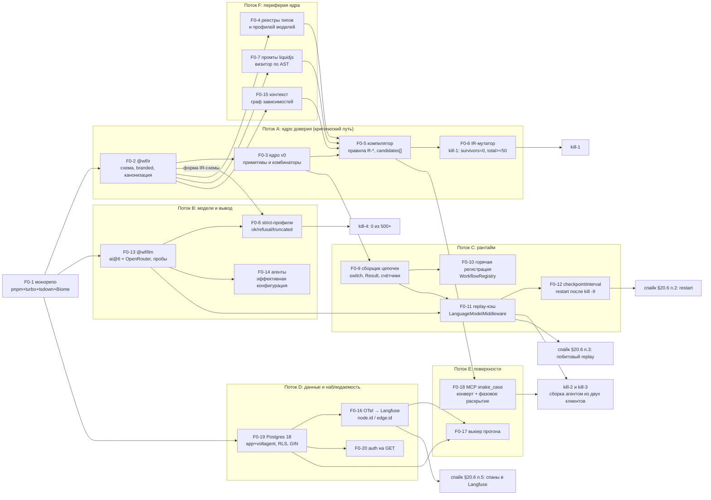

# 21. Дорожная карта и критерии остановки

> Статус: draft
> Зависит от: [01. Продукт и требования](01-product-and-requirements.md), [02. Архитектура](02-architecture.md), [03. Ядро языка](03-core-language.md), [05. Система типов](05-type-system.md), [07. Компилятор](07-compiler.md), [08. Промты](08-prompts.md), [09. Контекстная модель](09-context-model.md), [10. Рантайм](10-runtime.md)
> Источники: research/00-verified-by-lead.md, research/monorepo-quality.md, research/volt-durability.md, research/evals-tooling.md; спека §17, §18, §19, §20.4, §20.6

## Зачем этот слой

Спека §17 задаёт четыре фазы, §18 — пятнадцать kill-критериев, §19 — таблицу рисков. Ни то, ни другое
не является планом работ: нет привязки к артефактам, нет измерителей, нет порогов, часть предпосылок
опровергнута исследованием. Этот документ превращает фазы в очередь задач с зависимостями, kill-критерии —
в измеримые гейты с конкретными данными и порогами, а риски — в актуальный на 2026-09-11 список.
Документ отвечает на два вопроса: «что делаем следующим» и «по какому числу останавливаемся».

## Решения

| Решение | Что берём | Версия | Лицензия | Почему |
|---|---|---|---|---|
| Kill-критерий 1 (мутанты) | собственный доменный IR-мутатор в `packages/conformance` | — | наш | Stryker мутирует наш код, спека требует мутировать IR |
| Гигиена тест-сьюта ядра | `@stryker-mutator/core` + `@stryker-mutator/vitest-runner` + `typescript-checker` | 10.0.0 | Apache-2.0 | nightly, только `@wf/compiler` и `@wf/ir`, не PR-гейт |
| Оркестрация задач фазы | turborepo | 2.10.12 | MIT | гейты фазы — это задачи turbo с кэшем |
| Версия формата бандла | `@changesets/cli`, `linked: [@wf/ir, @wf/compiler, @wf/export]` | 3.0.2 | MIT | техническая реализация kill-критерия 13 |
| Статистика гейтов | парный бутстрап BCa (B=10000, фиксированный seed), McNemar, Wilcoxon, Holm/BH | — | наш | DECISIONS §Качество |
| Порог судьи | weighted kappa ≥ 0.7 и Krippendorff alpha ≥ 0.8 | — | наш | research/evals-tooling §4 |
| Исходы гейта | PASS / WARN / BLOCK / GATE_UNAVAILABLE | — | наш | отсутствие данных ≠ успех |

## 1. Принцип фазирования

Фаза — это одна гипотеза и один машинно проверяемый артефакт, который её подтверждает. Фаза закрыта,
когда артефакт зелёный в CI на `main`, а не когда «всё сделано».

| Фаза | Доказываемая гипотеза | Чем доказывается (артефакт) | Kill-критерии |
|---|---|---|---|
| 0 | Ядро доверия ловит типовые ошибки агента до запуска, и агент способен собрать воркфлоу без ручной правки промтов | `conformance-report.json` (survivors=0, total≥50) + лог сессии сборки из двух MCP-клиентов + отчёт строгого вывода на 500+ вызовов | 1–4 |
| 1 | Цикл «сбой → воспроизведение → датасет → эксперимент → гейт» замкнут и даёт воспроизводимый ответ | `replay-diff.json` (пусто), `coverage-report.json` (100% enum и веток), `blame-report.json`, `gate-report.json` | 5–7, плюс 9 и 11 как ранние |
| 2 | Воркфлоу живёт в проде: бюджеты, таймауты, выпуск, откат, экспорт в цель | первый воркфлоу на проде + замер времени от ТЗ до прогона против базовой линии | 8, 10, 15 |
| 3 | Это продукт: чужие архитектуры собираются без правки платформы, бандл переносим | лог композиции без изменений платформы + идентичный round-trip-бандл + конформанс чужой реализации | 12–14 |

Три правила, действующие на все фазы.

1. **Порог и базовая линия фиксируются до прогона** и хранятся в репозитории (`gates/*.json`), а не
   подбираются после. Изменение порога — отдельный PR с обоснованием.
2. **Нет данных — не PASS.** Гейт с недостаточной выборкой отдаёт `GATE_UNAVAILABLE`; это отдельный
   исход, он не равен ни PASS, ни BLOCK и требует ручного решения релиз-инженера.
3. **Каждый пропуск на гейте порождает правило или баг.** Выживший мутант, промах blame, невалидный
   строгий вывод — это строка в бэклоге ядра, а не «известное поведение».

## 2. Фаза 0 — спайк ядра доверия

### 2.1 Состав работ

Колонка «Объём» — порядок величины кода нашего слоя, не оценка в днях.

| ID | Задача | Документ комплекта | Входит | НЕ входит | Объём |
|---|---|---|---|---|---|
| F0-1 | Монорепо: pnpm 12 workspaces, turbo 2.10.12, tsdown 0.23, Biome 2.5.13, TS 6.0.3, vitest 5 | монорепо и качество | `catalog:` для версий ядра, `onlyBuiltDependencies`, `tasks` в turbo.json, remote cache с `signature: true` | Nx, ESLint вне `apps/studio`, Stryker в PR-гейте | конфиги |
| F0-2 | `@wf/ir`: схема IR-документа, branded types, ajv на границе, канонизация и хеш | ядро языка, система типов | `Ir.parse`, `formatVersion` как целое, `canonicalize@5.0.0` + `@noble/hashes` sha256 с доменной сепарацией | YAML-транспорт, бандл, Merkle | ~2–3k строк |
| F0-3 | Ядро v0: примитивы `llm`/`tool`/`code`/`const`, комбинаторы `map`/`parallel`/`switch`/`loop`/`try`, компоненты с дженериками и контрактами | ядро языка | раскрытие компонента до примитивов, контракты входа и выхода | рекурсия, изменяемые замыкания | ~2k строк |
| F0-4 | Реестр типов и реестр профилей моделей | система типов, реестры | дедупликация типов, профили под strict-совместимость | реестр агентов и тулов (фаза 1) | ~1k строк |
| F0-5 | Компилятор: правила категорий §8.1–8.5, шаблонов §7.6, контекста §6.7; диагностика с `candidates[]` | компилятор | коды `R-*`, исчерпываемость `switch` по enum, полнота веток, бюджеты циклов | автофиксы в IDE, инкрементальная компиляция | ~3–4k строк |
| F0-6 | **IR-мутатор и конформанс-раннер** — он же kill-критерий 1 | компилятор, evals | 20 классов мутаций, seeded RNG, `conformance-report.json`, три уровня проверки | Stryker (nightly, отдельно) | ~600–900 строк |
| F0-7 | Промты: liquidjs 10.29.0, тег ``, визитор по AST, оценка размера gpt-tokenizer | промты | статический анализ шаблона, точки кэширования, запрет сырой интерполяции | GEPA, автоподбор few-shot | визитор ~400–600 строк |
| F0-8 | Структурированный вывод: компиляция Zod 4 → JSON Schema под профиль провайдера, пост-обработка, три исхода вызова | структурированный вывод | `ok`/`refusal`/`truncated`, ремонт `jsonrepair` только на `ok`, пороги allowed-set (≤50 — enum, выше — индексный выбор) | «одна strict-схема на всех» — опровергнуто | ~1.5k строк |
| F0-9 | Сборщик цепочек VoltAgent из IR + исполнители узлов | рантайм | `andBranch` со взаимоисключающими предикатами и шагом сведения, обёртки веток и элементов в Result, счётчики циклов в `workflowState` | `quorum(k)` поверх `andRace`, мультитенантный рантайм | ~2k строк |
| F0-10 | Горячая регистрация версий через `WorkflowRegistry.registerWorkflow/unregisterWorkflow` | рантайм | регистрация и снятие по выпуску версии, учёт глобального синглтона реестра | воркер на проект с перезагрузкой — **исключено**, см. §2.2 | ~300 строк |
| F0-11 | Replay-кэш ответов моделей как `LanguageModelMiddleware` через `wrapLanguageModel` | рантайм, детерминизм | content-addressed кассеты на уровне порта модели, режимы `replay`/`auto`/`record` | HTTP-моки (nock/msw) вне юнит-тестов | ~800 строк |
| F0-12 | Политика `checkpointInterval` и восстановление после краха | рантайм | профили «дешёвый шаг» / «дорогой шаг», `restart(executionId)`, мерж `metadata` без перезатирания | свой слой чекпоинтов — **исключено**, см. §2.2 | ~300 строк |
| F0-13 | Провайдеры: `@wf/llm` как единственный импортёр `ai@6.0.280`, OpenRouter 2.10.0, синхронизация каталога с пробами возможностей | провайдеры | `no-restricted-imports` на остальные пакеты, пробы strict/tools/reasoning | Together AI, batch — фаза 1 | ~1.5k строк |
| F0-14 | Агенты: определения и эффективная конфигурация вызова | агенты | динамические функции агента, читающие конфигурацию из контекста вызова | передача `model`/`instructions` в опциях вызова — **невозможна**, см. §3 | ~600 строк |
| F0-15 | Контекст: потребности, источники, граф зависимостей | контекстная модель | статическая проверка покрытия потребностей источниками | векторный поиск и pgvector-индексы — фаза 1 | ~1k строк |
| F0-16 | Трассы: `VoltAgentObservability({spanProcessors})` → Langfuse 5.11.1, свои атрибуты `workflow.node.id` / `workflow.edge.id` | наблюдаемость | дублирующий экспорт, атрибуты для подсчёта покрытия | дашборды, алерты | ~500 строк |
| F0-17 | Минимальный вьюер прогона | Studio | список прогонов, дерево шагов, вход/выход узла, диагностика компилятора | правка на канвасе, граф контекста, матрица моделей | Next 16.3.4, 5–8 экранов |
| F0-18 | MCP-сервер: `catalog_*`, `flow_*`, `compile_*`, `run_*`, `run_replay_node`, `context_*` | MCP | конверт ответа с `problems`/`candidates`/`apply`, фазовое раскрытие через `enable()/disable()` | sampling, resources как опора | ~1.5k строк |
| F0-19 | Хранилище: схемы `app` и `voltagent`, drizzle 0.45.2, RLS с первого дня, GIN-индекс по `metadata` | данные | forward-only миграции, `uuidv7()` как PK, партиционирование `run_nodes` | pgvector-поиск, объектное хранилище >1 МБ | DDL + ~800 строк |
| F0-20 | Auth-middleware на публичные по умолчанию GET-эндпоинты VoltAgent | API | `/workflows`, `/workflows/:id`, `/workflows/executions`, `/workflows/:id/executions/:id/state` | полноценный RBAC — фаза 2 | ~200 строк |

### 2.2 Что убрано из §17 находками исследования

| Было в спеке | Статус | Основание |
|---|---|---|
| «Регистрация воркфлоу в рантайме не подтверждена; запасной вариант — воркер на проект с перезагрузкой при выпуске» (§20.4) | **снято целиком** | `WorkflowRegistry.registerWorkflow/unregisterWorkflow` + `VoltAgent.registerWorkflows` подтверждены в `dist/index.d.ts`. Экономия: не нужен супервизор процессов, роутинг по воркерам и протокол горячей перезагрузки |
| Собственный слой fork и чекпоинтов | **снято** | `timeTravel({executionId, stepId, inputData, resumeData, workflowStateOverride})` и `timeTravelStream` штатные; running-чекпоинт пишется после каждого завершённого шага. Остаётся выбор точки в UI, причина форка в `workflowStateOverride`, сравнение двух исполнений |
| Собственная таблица lineage форков | **сведено к индексу** | core кладёт `replayedFromExecutionId`/`replayFromStepId`/`replayedAt` в `metadata`, а адаптер postgres сохраняет колонку `metadata JSONB`. Нужен только свой GIN-индекс `USING GIN (metadata jsonb_path_ops)` — в пакете его нет |
| Свой мини-парсер шаблонов промтов | **снято** | liquidjs даёт типизированный AST и статический анализ; наш код — визитор ~400–600 строк |
| Тег `` из §7.6 | **снято** | в Liquid это встроенный `/` |
| «Одна strict-схема на всех провайдеров» | **опровергнуто** | требования OpenAI и Anthropic взаимно противоречивы; профиль схемы — свойство пары (IR-схема × провайдер). Добавляет работу F0-8, а не убирает |
| Точки в именах MCP-тулов (§13.1) | **переименовано** | ограничение имени тула в Messages API; только `snake_case`, `run.node` → `run_replay_node` |
| Встроенное векторное хранилище `@voltagent/postgres` | **не берём** | BYTEA + полный перебор, без pgvector |

Добавлено в фазу 0 сверх §17: F0-6 (IR-мутатор как отдельный продукт, а не тест), F0-8 в полном объёме
(три исхода вызова вместо двух — `jsonrepair` на обрезанном ответе молча фальсифицирует данные),
F0-11 (без replay-кэша `timeTravel` переисполняет вызовы моделей и детерминизма не даёт),
F0-12 (гранулярность точек форка — прямое следствие `checkpointInterval`), F0-20.

### 2.3 Что НЕ входит в фазу 0

Правка на канвасе, мультитенантный UI, Together AI и batch-прогоны, GEPA, codegen в VoltAgent,
экспорт-бандл и конформанс-набор чужих реализаций, датасеты и эксперименты, панели судей,
Stryker в блокирующем гейте, RBAC, canary и откат. Всё это — фазы 1–3.

## 3. Бинарные проверки спайка (§20.6) — обновлённый список

| № | Формулировка §20.6 | Статус после исследования | Чем закрыт / что осталось |
|---|---|---|---|
| 1 | Цепочка собирается из IR в рантайме и регистрируется без перезапуска процесса | **половина закрыта документально** | Регистрация подтверждена в `dist/index.d.ts` (`registerWorkflow`/`unregisterWorkflow`). На живом коде остаётся: сборка цепочки из нашего IR, снятие версии при активных прогонах, поведение глобального синглтона `globalThis.___voltagent_workflow_registry` при нескольких тенантах в одном процессе |
| 2 | `restart` после убийства процесса восстанавливает состояние и продолжает с чекпоинта | **механика найдена, живой прогон нужен** | Найдено в `dist/index.js`: `persistRunningCheckpoint` пишет после каждого завершённого шага (`checkpointInterval` по умолчанию 1) в `metadata.__voltagent_restart_checkpoint`; resume читает `stepData` оттуда. Проверить: `kill -9` посередине, `restartAllActiveWorkflowRuns()`, сохранность **наших** ключей в `metadata` (мерж, не перезапись) |
| 3 | Time travel вместе с replay-кэшем даёт побитово тот же прогон | **открыт, это главный риск фазы 0** | Подтверждено: `timeTravel` переисполняет вызовы моделей → без F0-11 детерминизма нет. Дополнительно проверить каскад резолва входа `inputData ?? sourceTargetStepInput ?? previousStepOutput ?? …` и ошибку `missing historical input data` при увеличенном `checkpointInterval` |
| 4 | Динамический агент применяет эффективную конфигурацию вызова: модель, тулы, параметры | **переформулирован** | Опровергнуто: `model` и `instructions` **нельзя** передать в опциях вызова (их нет в `BaseGenerationOptions`). Новая формулировка проверки: динамические функции агента читают эффективную конфигурацию из контекста вызова, и при двух разных контекстах один агент даёт два разных вызванных профиля модели |
| 5 | OTel-спаны с нашими атрибутами доходят до Langfuse | **открыт** | Подтверждено только, что `VoltAgentObservability({spanProcessors: […]})` принимает массив, то есть дублирующий экспорт штатен. Проверить сквозняком: атрибуты `workflow.node.id`, `workflow.edge.id`, `workflow.node.pinned` видны в Langfuse 5.11.1 и по ним считается покрытие |
| 6 | Сгенерированный codegen-проект проходит конформанс-набор | **перенесён в фазу 2** | В фазе 0 от него остаётся только предпосылка: `formatVersion` в бандле и фикстуры конформанса начинают жить с первого дня, иначе kill-критерии 13–15 не на чем проверять |

Новые бинарные проверки, которых в §20.6 не было, а по итогам исследования они обязаны быть в спайке.

| № | Проверка | Почему появилась |
|---|---|---|
| 7 | На 500+ вызовах по каждому профилю провайдера нет ни одного ответа, невалидного против Zod-схемы узла | «Zod 4 из коробки даёт невалидный для OpenAI strict вывод» — проверено запуском на `z.discriminatedUnion` |
| 8 | Обрезанный ответ детектируется как `truncated` и **не** передаётся в `jsonrepair` | `jsonrepair` молча фальсифицирует обрезанный JSON — проверено запуском |
| 9 | Динамический allowed-set: при >50 значений схема переключается на индексный выбор, и на ~416 значениях UUID вызов не падает по лимитам | потолок ~416, а не 1000: лимиты OpenAI (число значений и суммарная длина строк) действуют одновременно |
| 10 | `tsdown` с `isolatedDeclarations` генерирует `.d.ts` для пакета, реэкспортирующего `z.infer<typeof X>` из Zod 4 | исторический конфликт isolated declarations с инференсом Zod; ломает сборку всех публикуемых пакетов |
| 11 | Один `flow_patch` с устаревшим `base_rev` отвергается сервером и возвращает актуальный `rev` без потери правок второго клиента | server-authoritative конкурентность вместо CRDT |

## 4. Фазы 1, 2, 3

### Фаза 1 — отладка и evals

| ID | Задача | Выходной критерий |
|---|---|---|
| F1-1 | Replay, fork, diff, заморозка выходов поверх `timeTravel`; чтение lineage из `metadata`, а не из top-level полей | прод-сбой воспроизводится без расхождений (kill-5) |
| F1-2 | REST/MCP-обёртка над `restart` и `timeTravel` — встроенных эндпоинтов нет | `run_replay_node` работает из двух MCP-клиентов |
| F1-3 | Датасеты: генерация, дедупликация SimHash-64 (Hamming ≤ 3) и MinHash+LSH (Jaccard ≥ 0.85), детерминированный сплит `sha256(itemId) mod 100`, изоляция `test` отдельным scope | `test` физически недоступен оптимизатору |
| F1-4 | Покрытие: домены из Zod-схем, комбинаторика IPOG (pairwise), подсчёт покрытия по OTel-спанам | kill-9 зелёный |
| F1-5 | Скореры и эксперименты: `@voltagent/evals` + `@voltagent/scorers` как раннер, свой агрегатор поверх `ExperimentResult.items[].scores` с группировкой по `metadata.nodeId` | гейт на уровне узла выражается (в SDK — только глобальный) |
| F1-6 | Свой слой статистики: BCa-бутстрап, McNemar, Wilcoxon, Holm/BH, обязательный A/A-прогон | `gate-report.json` с четырьмя исходами |
| F1-7 | Калибровка судей: kappa, Krippendorff alpha, swap-стабильность, test-retest, `judgeVersionHash` | kill-7 зелёный, судья допущен к BLOCK |
| F1-8 | Blame: single-node patch → ddmin → ранжирование вкладом; режим узла `pinned`, обход графа от конца к началу | kill-11 ≥ 90% |
| F1-9 | Реестры агентов и тулов; библиотека паттернов, панелей судей, циклов как компонентов на ядре | kill-6 зелёный на реальной правке enum |
| F1-10 | Экспорт: детерминированный бандл (`tar-stream`, Merkle с путём в листе), эталонный интерпретатор, конформанс-набор, импорт с round-trip | kill-13 зелёный |
| F1-11 | Интеграция с Claude: скилл и импорт из `agentic-process-spec` | сценарий сборки повторяется из скилла |
| F1-12 | Together AI, batch-прогоны экспериментов | стоимость эксперимента падает на порядок |
| F1-13 | Studio: граф контекста, карта промтов, матрица моделей, покрытие | kill-10 виден в интерфейсе |

Выход из фазы 1: kill-критерии 5, 6, 7 плюс 9 и 11.

### Фаза 2 — прод

| ID | Задача | Выходной критерий |
|---|---|---|
| F2-1 | Планировщик дедлайнов на pg-boss `sendAfter` + сверяющий cron: VoltAgent сам suspended-прогон по таймауту не будит | человеческая задача с дедлайном закрывается автоматически |
| F2-2 | Ключи идемпотентности для узлов с внешними эффектами: шаг после resume/restart переисполняется целиком | повторная доставка эффекта отсутствует на тесте с `kill -9` |
| F2-3 | Бюджеты прогона и узла, политики PII (`createPIIInputGuardrail`) и доверия (`createPromptInjectionGuardrail`) | превышение бюджета останавливает прогон, а не кошелёк |
| F2-4 | Мультитенантный рантайм: `tenant_id` в контексте, RLS, ключи провайдеров на проект, auth на GET-эндпоинты | тенант A не видит прогонов тенанта B в тесте |
| F2-5 | Выпуск: версии, canary, откат; горячая регистрация и снятие версии | откат за один вызов, активные прогоны старой версии доживают |
| F2-6 | Оптимизация GEPA | улучшение на отложенной выборке, а не на train |
| F2-7 | Codegen в VoltAgent: таблица эмиттеров `Record<kind, Emitter>`, шаблонные строки + prettier | kill-15 зелёный |
| F2-8 | Частичные цели экспорта (Langfuse), отчёт потерь | потери перечислены явно, а не молча |

Выход из фазы 2: первый воркфлоу в проде, kill-8, kill-10, kill-15.

### Фаза 3 — продукт

| ID | Задача | Выходной критерий |
|---|---|---|
| F3-1 | Правка на канвасе: `@xyflow/react` 12.11.6 + elkjs 0.12.0, раскрытие компонента до примитивов | правка графа даёт валидный IR без ручного редактирования JSON |
| F3-2 | Библиотека архетипов как компонентов ядра | kill-12: архитектура вне библиотеки собирается без правки платформы |
| F3-3 | Воссоздание 1:1 в Mastra (основная цель) и стресс-тест семантики в LangGraph | kill-14 на 100% кейсов конформанса |
| F3-4 | Встроенные архитектор и улучшатель в Workspace с песочницей и аппрувом на запись | агент правит воркфлоу только через аппрув |
| F3-5 | Решение об open source ядра, монетизация | ADR |

## 5. Kill-критерии: измерители и пороги

### 5.1 Общая машинерия гейтов

Всё, что ниже, опирается на один набор правил, чтобы пороги не расползались по критериям.

| Параметр | Значение | Основание |
|---|---|---|
| Минимальный размер датасета для **блокирующего** гейта | 200 элементов; меньше — исход `GATE_UNAVAILABLE` | DECISIONS §Качество |
| Минимальная калибровочная выборка для судьи | 100 размеченных человеком примеров с балансом классов | research/evals-tooling §4 |
| Минимум для вывода blame по одному узлу | 10 failing-элементов; меньше — «недостаточно данных» | research/evals-tooling §7 |
| Доверительный интервал | парный бутстрап BCa, B = 10000, фиксированный seed в `gates/seed.json` | DECISIONS §Качество |
| Бинарные метрики | McNemar; порядковые — Wilcoxon signed-rank | DECISIONS §Качество |
| Поправки на множественность | Holm для primary-семьи, BH для secondary | DECISIONS §Качество |
| Обязательная предпосылка сравнения | A/A-прогон до A/B; ложноположительная доля A/A выше номинала блокирует сам гейт | DECISIONS §Качество |
| Исходы гейта | PASS / WARN / BLOCK / GATE_UNAVAILABLE | DECISIONS §Качество |
| Правило срабатывания | BLOCK только когда **верхняя граница** CI ниже порога; иначе WARN (защита от флаков) | research/evals-tooling §4 |

«Кто считает» ниже: **CI** — задача turbo в `ci.yml` на каждом PR; **nightly** — расписание;
**релиз-гейт** — задача в `environment: evals` с required reviewers (трата бюджета изолирована
от PR-прогонов форков); **человек** — ручная разметка или фиксация базовой линии.

### 5.2 Критерии 1–8

| № | Критерий | Как измеряем | На каких данных | Кто считает | Порог | При провале |
|---|---|---|---|---|---|---|
| 1 | Мутационный тест компилятора | `packages/conformance`: `mutate(ir, seededRng(SEED))` → `compile(mutant.ir)`. Мутант считается убитым только при выполнении **трёх** условий: `outcome.ok === false`, среди диагностик есть **ожидаемое** правило `mutant.expectRule`, и у этой диагностики `candidates.length > 0` | golden-фикстуры IR × 20 классов мутаций (L0/L1): структурные, контрактные, управляющие, промтовые, версионные | CI, блокирующий | `survivors.length === 0` **и** `total ≥ 50` | Каждый выживший → GitHub-annotation с готовым шаблоном issue: либо новое правило `R-*`, либо баг компилятора. Релиз не выпускается |
| 2 | Сборка агентом эталонного воркфлоу | Лог MCP-сессии: Claude собирает эталонный 15-шаговый воркфлоу с нуля до `compile: ok` и зелёного прогона. Считаем число итераций «правка → компиляция» и число ручных правок промтов | Эталонное ТЗ в `fixtures/reference-flow/brief.md`, каталог и реестры фазы 0 | человек фиксирует N до прогона, CI проигрывает записанную сессию по кассетам | Ручных правок промтов — 0; итераций ≤ N (N фиксируется до теста, см. открытый вопрос 1) | Разбор: какая диагностика не дала кандидата или дала неверного. Правка формата ошибки в §9-контракте, а не подсказка агенту |
| 3 | Агностичность клиента | Тот же сценарий из второго MCP-клиента (Claude Code и второй клиент), сравнение итогового IR по каноническому хешу | Тот же эталонный бриф | CI | Канонические хеши IR совпадают; правок серверного кода под клиент — 0 | Всё, что потребовалось «под клиент», переезжает в конверт ответа и фазовое раскрытие тулов |
| 4 | Строгий вывод | Доля вызовов с исходом `ok`, чей распарсенный ответ не проходит Zod-схему узла. `refusal` и `truncated` считаются **отдельными** метриками и в знаменатель невалидности не входят | ≥ 500 LLM-вызовов на каждый профиль провайдера (OpenRouter + прямые), покрывая дискриминированные объединения, enum, вложенность | nightly + релиз-гейт | 0 невалидных из 500+. Доля `truncated` — отдельный порог, не задан (открытый вопрос 2) | Правка компилятора схем под профиль, не правка промта. Профиль провайдера помечается как несовместимый и исключается из каталога |
| 5 | Воспроизводимость прод-сбоя | `timeTravel({executionId, stepId})` в режиме кассет `replay` + diff выходов узлов по каноническому хешу | Реальный прод-сбой с сохранёнными кассетами прогона | CI на регресс-наборе сбоев | `replay-diff.json` пуст (0 расходящихся узлов) | Расхождение означает недетерминированный узел: найти источник (время, случайность, внешний вызов мимо порта) и закрыть его портом. Узел без порта не допускается к прод-выпуску |
| 6 | Enum: одна правка → полный список мест | Добавляем значение в enum реестра типов → компилятор возвращает список всех затронутых `switch`, панелей, датасетов; после исправлений всё зелёное | Эталонный воркфлоу + библиотека компонентов | CI | Пропущенных мест 0 (сверяется с эталонным списком фикстуры); повторная компиляция зелёная | Непойманное место — новый класс мутации `non-exhaustive-branch` в F0-6 и правило в компиляторе |
| 7 | Судья допущен к гейтингу | На калибровочной выборке считаем weighted kappa (Cohen, квадратичные веса), Krippendorff alpha, swap-стабильность (доля неизменных вердиктов при перестановке кандидатов), test-retest при `repeat: 5`. Привязка к `judgeVersionHash = hash(model + prompt + rubric + params)` | ≥ 100 примеров, размеченных человеком, с балансом классов | релиз-гейт; разметка — человек | **BLOCK разрешён** при kappa ≥ 0.7 **и** alpha ≥ 0.8 **и** swap-стабильность ≥ 0.9 **и** доля изменивших вердикт при test-retest < 5% **и** судья — панель (PoLL), не одна модель. **WARN** при kappa 0.4–0.7 или alpha 0.667–0.8. **OFF** при kappa < 0.4 или alpha < 0.667 | Судья понижается до WARN/OFF автоматически и перестаёт влиять на pass/fail. Гейтинг переходит на детерминированные скореры (exact match, JSON-schema, tool-call F1, latency, cost) — им порог согласия не нужен |
| 8 | Скорость от ТЗ до воркфлоу | Замер сквозного времени от брифа до зелёного прогона на проде | Базовая линия — ручная сборка прошлого воркфлоу, замеренная до старта фазы 0 | человек фиксирует базовую линию; CI хранит замеры | Медиана по ≥ 3 воркфлоу ниже базовой линии | Разбор по стадиям (сборка / компиляция / отладка / evals): узкое место становится задачей фазы, а не поводом снизить порог |

### 5.3 Критерии 9–15

| № | Критерий | Как измеряем | На каких данных | Кто считает | Порог | При провале |
|---|---|---|---|---|---|---|
| 9 | Покрытие датасета | Структурное покрытие графа, не текстовые метрики. Домены берём интроспекцией Zod-схем (`z.enum` → список, `z.union` → дискриминанты, `z.optional/nullable` → {present, absent}, числовые `.min/.max` → границы), комбинируем **pairwise (IPOG)**, а не декартово произведение. Факт покрытия считаем по OTel-спанам прогона: атрибуты `workflow.node.id`, `workflow.edge.id`, `loop.exit.reason` | Датасет, сгенерированный Claude, прогнанный по эталонному воркфлоу | CI | 100% значений enum на входах и 100% веток `switch`. Для циклов — все три причины выхода `{success, max_iter, stagnation}` | Непокрытые цели уходят в `dataset_generate` как задание списком; гейт остаётся BLOCK до добора |
| 10 | Матрица моделей | Для узла перебираем кандидатов провайдера/модели; качество сравниваем парным бутстрапом BCa на общем датасете, стоимость — по каталогу токенов | ≥ 200 элементов датасета узла (иначе `GATE_UNAVAILABLE`) | релиз-гейт | Найден кандидат дешевле базового не менее чем на X% при **неинфериорности**: нижняя граница BCa-CI разницы качества ≥ −ε. X и ε фиксируются до теста (открытый вопрос 3) | Узел остаётся на базовой модели; результат фиксируется как «дешёвой альтернативы нет», а не как провал платформы |
| 11 | Blame | Подсаживаем неисправность в один узел (испорченный промт, сдвинутая схема, ослабленная модель). Алгоритм: single-node patch эталоном с переигрыванием только `downstream(v)` → при неоднозначности ddmin по множеству узлов → ранжирование вкладом `score[v]`. Узел в режиме `pinned` не вызывает модель и помечается спаном `workflow.node.pinned = true` | ≥ 10 failing-элементов на каждую подсадку; серия подсадок по всем узлам эталонного воркфлоу | CI (кассеты делают повторный blame бесплатным) | `primary` совпадает с подсаженным узлом ≥ 90% случаев. Бюджет обязателен: `maxBlameRuns`, `maxBlameCostUsd`; при исчерпании отдаётся частичный результат, а не пустой | Разбор по типу подсадки. Если ни один патч не чинит — вердикт «виноват скорер или узел без gold», это отдельный исход, а не пустой ответ |
| 12 | Композиция | Собираем архитектуру, которой нет в библиотеке (дивергентный судья с каскадом), считаем diff платформы за время сборки | Эталонное задание фазы 3 | человек + CI (diff по `packages/*`) | Изменений в `packages/core`, `packages/compiler`, `packages/runtime` — 0. Допустимы только новые компоненты и записи реестров | Недостающий примитив — это ADR на расширение ядра, с явной оценкой, что он ломает в kill-1 и kill-14 |
| 13 | Round-trip бандла | Экспорт → импорт → экспорт; сравнение по хешу детерминированного tar и по Merkle-корню (путь входит в лист). Канонизация RFC 8785, sha256 с доменной сепарацией, префикс `sha256-` | Эталонный воркфлоу + фикстуры каждого `formatVersion` из `packages/conformance/fixtures` | CI | Побайтовое совпадение бандлов. Плюс тест обратной совместимости: каждый исторический `formatVersion` читается текущим кодом | Ищем источник недетерминизма (порядок ключей, mtime в tar, локаль). `linked`-версионирование `@wf/ir`+`@wf/compiler`+`@wf/export` гарантирует, что бандл версии X читается связкой версии X |
| 14 | Воссоздание 1:1 в чужом фреймворке | LLM по бандлу (семантика ядра + эталонный интерпретатор + конформанс-набор) пишет реализацию в **Mastra** — основная цель; **LangGraph** — стресс-тест семантики | Конформанс-набор эталонного воркфлоу | релиз-гейт | 100% кейсов конформанса зелёные, ручных правок реализации 0 | Провалившийся кейс означает дыру в описании семантики ядра: дописываем в бандл, а не чиним реализацию руками |
| 15 | Экспорт в VoltAgent | `codegen` собирает TS-проект; запускаем `pnpm build` + конформанс-набор + живой прогон | Эталонный воркфлоу | CI | Сборка без ошибок, конформанс 100%, ручных правок 0 | Расхождение маппинга «рантайм vs codegen» — баг: маппинг один, режимы два |

## 6. Порядок работ внутри фазы 0

### 6.1 Критический путь

`F0-1 → F0-2 → F0-3 → F0-5 → F0-6`. Это цепь, определяющая срок фазы: без схемы IR нет ядра, без ядра
нет правил компилятора, без правил нечего проверять мутантом, а мутант — единственный выход из фазы 0
по kill-критерию 1. Всё остальное либо параллельно ей, либо висит на ней одним ребром.

Два узких места вне этой цепи, которые обязаны стартовать рано, потому что могут потребовать
переделки чужих решений:

- **F0-8 (профили strict-схем)** — если окажется, что профиль провайдера требует другой формы IR-схемы,
  правка уедет в F0-2. Поэтому спайк профиля на одной нетривиальной схеме (дискриминированное
  объединение + enum + вложенность) делается сразу после первой версии `Ir.parse`, а не в конце.
- **F0-11 (replay-кэш)** — от него зависят почти все измерители kill-критериев (2, 3, 5, 11 гоняются
  по кассетам). Без него каждый прогон гейта стоит денег и недетерминирован.

### 6.2 Что делается параллельно

| Поток | Задачи | Стартует после |
|---|---|---|
| A. Ядро доверия (критический путь) | F0-2, F0-3, F0-5, F0-6 | F0-1 |
| B. Модели и вывод | F0-13, F0-8, F0-14 | F0-1, для F0-8 нужен `Ir.parse` из F0-2 |
| C. Рантайм | F0-9, F0-10, F0-11, F0-12 | F0-3 (нужны примитивы и комбинаторы) |
| D. Данные и наблюдаемость | F0-19, F0-16, F0-20 | F0-1, независимо от A |
| E. Поверхности | F0-18 (MCP), F0-17 (вьюер) | F0-18 — после F0-5; F0-17 — после F0-16 и F0-19 |
| F. Периферия ядра | F0-4, F0-7, F0-15 | F0-2 |

Потоки D и F не блокируют никого, кроме E, — их можно двигать любым свободным ресурсом.
Поток B блокируется потоком A только на одном ребре (`F0-2 → F0-8`), дальше идёт независимо.

### 6.3 Граф зависимостей

Читается так: выход из фазы 0 — четыре зелёных узла `kill-*` плюс закрытые пункты спайка.
`F0-17` (вьюер) не блокирует ни один kill-критерий — при нехватке времени он режется первым.

## 7. Риски — обновление таблицы §19

### 7.1 Снятые и переформулированные

| Риск §19 / §20.4 | Что с ним стало | Обоснование |
|---|---|---|
| Регистрация воркфлоу в рантайме не подтверждена; запасной вариант — воркер на проект с перезагрузкой | **снят** | `WorkflowRegistry.registerWorkflow/unregisterWorkflow` и `VoltAgent.registerWorkflows` в `dist/index.d.ts`. Вместо риска — задача F0-10 на 300 строк |
| Time travel заново исполняет вызовы моделей | **снят как риск, стал задачей** | Механизм известен, лечится `LanguageModelMiddleware` через `wrapLanguageModel` (F0-11) |
| Human-задачи не возобновляются по таймауту | **снят как риск, стал задачей** | pg-boss `sendAfter` + сверяющий cron (F2-1) |
| Нет `quorum`, `any`, политик ошибок у параллели и map | **снят как риск, стал задачей** | Обёртки в Result + шаг сведения; ограничение `andAll` (merge в один объект) известно и лечится явными ключами веток |
| Strict-режимы поддерживают лишь подмножество JSON Schema | **переформулирован и усилен** | Дело не в подмножестве, а в **взаимной противоречивости** требований OpenAI и Anthropic. Профиль схемы — свойство пары (IR-схема × провайдер). Плюс: Zod 4 из коробки даёт невалидный для OpenAI strict вывод |
| Объём UI | **подтверждён, смягчён** | В фазе 0 только вьюер (F0-17), и он единственный не блокирует ни один kill-критерий — режется первым |
| Баги в ядре доверия | **подтверждён, измеритель задан** | IR-мутатор (F0-6), 20 классов, гейт `survivors === 0` при `total ≥ 50` |
| Ненадёжные судьи | **подтверждён, пороги заданы** | kappa ≥ 0.7, alpha ≥ 0.8, swap ≥ 0.9, test-retest < 5%, панель вместо одной модели |
| Переобучение оптимизатора | **подтверждён, механика задана** | Детерминированный сплит `sha256(itemId) mod 100`, `test` — отдельный scope API, физически недоступный оптимизатору; минимум 200 элементов для блокирующего гейта |
| Workflows VoltAgent в статусе Preview | **подтверждён** | Пин `@voltagent/core@2.10.0`, адаптер изолирует, конформанс-набор на каждом обновлении |
| Гарантии съедают выразительность; объём UI; конкуренты; дженерики; потери при экспорте | **без изменений** | Исследование их не затрагивало |

### 7.2 Новые риски, обнаруженные исследованием

| Риск | Проявление | Что делаем |
|---|---|---|
| **Комбинаторика профилей схем** | Матрица совместимости растёт как (число форм IR-схем × число провайдеров); каждая новая модель может потребовать новой пост-обработки | Профили — данные, не код: таблица `Record<profileId, SchemaTransform>` (Strategy). Пробы возможностей при синхронизации каталога (F0-13) автоматически ставят модели профиль. Несовместимая модель исключается из каталога, а не чинится вручную |
| **Потолок динамического allowed-set ~416 значений UUID** | Справочник крупнее не помещается: лимиты OpenAI на число значений enum и на суммарную длину строк действуют одновременно | Порог зашит в компилятор: ≤ 50 — enum в схеме; выше — индексный выбор из пронумерованного списка. Компилятор обязан отвергать узел, где allowed-set строится динамически без ограничения размера |
| **`jsonrepair` фальсифицирует обрезанные ответы** | Обрезанный JSON «чинится» в валидный, но смысл теряется молча — в датасет попадают выдуманные значения | Три исхода вызова вместо двух. Ремонт применим **только** к `ok`. `truncated` — отдельная метрика и отдельная ветка политики. Проверка №8 в спайке |
| **Застряли на `ai@6.0.280`** | `@voltagent/core@2.10.0` объявляет peer `ai: ^6.0.0`, установка с `ai@7` падает по ERESOLVE; линия `@openrouter/ai-sdk-provider@3.x` требует `ai@^7` и недоступна | `@wf/llm` — единственный импортёр `ai`/`@ai-sdk/*`/`@openrouter/*`, остальное запрещено `no-restricted-imports`. Миграция на `ai@7` — один коммит после выхода core с peer `^7` |
| **Потолок TypeScript 6.0.3** | `typescript-eslint@8.70.0` имеет peer `typescript >=4.8.4 <6.1.0`; `@stryker-mutator/typescript-checker` использует программный API TS | TS 6.0.3 — источник истины, TS 7 (tsgo) — non-blocking job в CI. Biome 2 делает type-aware линт без `ts.Program` и потолка не ставит — это одна из причин выбора Biome |
| **`isolatedDeclarations` × Zod 4** | Генератор dts `oxc` может не переварить реэкспорт `z.infer<typeof X>`; ломает сборку всех публикуемых пакетов | Спайк на одном пакете до массового включения (проверка №10). Запасной путь — генератор dts через tsc для пакетов с Zod-инференсом |
| **Write-amplification истории исполнения** | Состояние прогона — **одна строка**, перезаписываемая целиком (включая весь `events` JSONB) после каждого шага. Цикл `andDoWhile` на сотни итераций даёт сотни UPSERT растущего документа | Профили `checkpointInterval` по классу воркфлоу (F0-12). Телеметрия опирается на OTel-спаны, а не на `events`. `disableCheckpointing` — только для дешёвых идемпотентных прогонов |
| **`checkpointInterval` режет точки форка** | Вход целевого шага резолвится каскадом; если он не попал в чекпоинт — `Cannot time travel from step '<stepId>': missing historical input data` | Политика: узлы, объявленные точками отладки, повышают частоту чекпоинта. Studio показывает, с каких шагов форк доступен, а с каких нет — до того, как пользователь нажмёт |
| **Lineage читается не оттуда, где обещают доки** | Доки VoltAgent обещают персистентность `replayedFromExecutionId`; адаптер postgres@2.1.3 этих колонок не имеет (0 вхождений в dist). Код, написанный по докам, молча вернёт `undefined` после рестарта | Читаем только `state.metadata.replayedFromExecutionId` / `.replayFromStepId` / `.replayedAt`. Свой GIN-индекс `USING GIN (metadata jsonb_path_ops)`. Лишняя таблица не нужна. Зафиксировано правилом линтера на запрет доступа к top-level полям |
| **Наследование `metadata` форком** | Реплей копирует metadata источника (минус `__voltagent_restart_checkpoint`) → устаревшие ключи тянутся по цепочке форков | Наши ключи версионируем и чистим при форке явным списком; зарезервированный `__voltagent_*` не трогаем, metadata только мержим |
| **Публичные по умолчанию GET-эндпоинты** | `/workflows`, `/workflows/:id`, `/workflows/executions`, `/…/state` не требуют auth — при мультитенантности это утечка | F0-20: middleware с первого дня, до появления второго тенанта |
| **Глобальный синглтон реестра** | `globalThis.___voltagent_workflow_registry` — один на процесс; тесты и тенанты делят его | `reset()` между тестами; тенант — часть идентификатора воркфлоу, а не отдельный реестр |
| **`@voltagent/evals` не покрывает наши гейты** | `passCriteria` только глобальные (нет понятия узла), нет baseline-сравнения прогонов, нет статистики значимости, нет cost/latency в критериях, live-скореры **не персистятся** в Eval Runs | Свой агрегатор поверх `items[].scores` с группировкой по `metadata.nodeId`, своя таблица прогонов и компаратор (ключ `datasetVersionId + workflowVersion + modelId`), свой слой статистики, свой sink для live-скоров |
| **Мёртвая экосистема дедупликации** | `minhash@0.0.9` (2022), `simhash`, `node-simhash`, `talisman` — все без публикаций 3–4 года; `datasketch`, `minhash-js` в npm отсутствуют | Пишем сами ~120 строк: SHA-256 по канонизированному виду для точных дублей, SimHash-64 на 3-граммах для коротких, MinHash+LSH для длинных. Та же утилита даёт content-addressed ключ для кассет |
| **Утечка данных через redteam-генерацию promptfoo** | Генерация по умолчанию идёт через их remote API | `PROMPTFOO_DISABLE_REDTEAM_REMOTE_GENERATION=1`; профиль инъекций генерируем локально по шаблонам |
| **Стоимость blame** | Upstream берётся из кассет бесплатно, а `downstream(v)` гарантированно промахивается мимо кассет — это живые вызовы | Перебор от конца графа к началу (сначала гипотезы с коротким хвостом), жёсткие `maxBlameRuns` и `maxBlameCostUsd`, кассеты blame-прогонов с тегом `{blameOf, pinnedNode}` делают повтор бесплатным |
| **Секреты в кэше Turbo** | Задача, читающая ключи провайдеров, но помеченная кэшируемой, даст кэш-хит от прогона с другим ключом | Задачи evals — `"cache": false` и `environment: evals` с required reviewers; remote cache с `"signature": true` |

## 8. Метрики продукта

Три метрики отвечают на вопрос «платформа работает или мы просто написали много кода». Считаются
автоматически, показываются в Studio, хранятся историей.

| Метрика | Определение и формула | Источник данных | Как читаем |
|---|---|---|---|
| **Время от ТЗ до работающего воркфлоу** | Медиана по последним ≥ 3 воркфлоу времени от первого сообщения брифа до первого зелёного прод-прогона. Разбивается по стадиям: сборка агентом / компиляция / отладка / evals / выпуск | Таймстемпы MCP-сессии и записей `runs` | Сравнение с базовой линией ручной сборки (kill-8). Растущая доля стадии «отладка» — сигнал, что диагностика компилятора слаба |
| **Доля логики вне архетипов** | `codeNodes / totalNodes` по IR всех активных воркфлоу, плюс вторая форма — доля строк кода в `code`-узлах от общего объёма определения. Считается по версии воркфлоу, не по прогону | IR в БД | Прямая метрика компромисса CaMeL из §19: чем выше, тем больше логики ушло из-под гарантий ядра. Рост — заявка на новый архетип в библиотеку, а не повод расширять ядро |
| **Доля прогонов с деградацией** | Доля прогонов, где хотя бы один узел завершился не по основной ветке: исход `truncated` или `refusal`, фолбэк на другой профиль модели, выход из цикла по `max_iter` или стагнации вместо `success`, срабатывание `on_item_error`, ошибка ветки, поглощённая политикой | OTel-спаны (`loop.exit.reason`, исход вызова, факт фолбэка) | Метрика скрытого качества: прогон формально «успешен», но результат получен через деградацию. Рост доли при неизменной доле провалов означает, что качество падает незаметно для гейтов |

Вспомогательные метрики, поддерживающие три основные.

| Метрика | Зачем |
|---|---|
| Доля диагностик компилятора с непустым `candidates[]` | По §9 диагностика без кандидатов — брак. Целевое значение — 100%, падение ниже сразу видно в kill-1 |
| Число итераций «правка → компиляция» до чистой сборки, медиана | Прямой измеритель kill-2 в динамике, а не разово |
| Доля прогонов, воспроизводимых по кассетам без расхождений | Здоровье детерминизма; падение предвещает провал kill-5 |
| Доля релизных гейтов с исходом `GATE_UNAVAILABLE` | Показывает, что датасеты не дотягивают до 200 элементов и гейты фактически не работают |
| Стоимость прогона и стоимость гейта в USD | Ограничитель blame и матрицы моделей; без него бюджеты задаются на глаз |

## Открытые вопросы

1. **N итераций для kill-критерия 2 не задан.** Спека говорит «не больше N», значение не названо, у нас
   базовой линии нет. Закрыть: провести три пилотные сборки эталонного воркфлоу через MCP на ядре фазы 0,
   взять медиану + 50% как N, зафиксировать в `gates/kill-2.json` до начала зачётного прогона.
2. **Порог допустимой доли `truncated`.** Kill-4 требует 0 невалидных, но `truncated` — отдельный исход,
   и его порог наши решения не задают. Закрыть: замерить долю на 500-вызовном прогоне по каждому профилю,
   задать порог как «не выше замеренного базового + запас», зафиксировать до релизного гейта.
3. **X% экономии и ε неинфериорности для kill-критерия 10.** Спека оставляет оба параметра открытыми.
   Закрыть: зафиксировать ε как минимальную практически значимую разницу качества для конкретного узла
   (определяется владельцем воркфлоу), X — как порог, ниже которого смена модели не окупает риск.
4. **Базовая линия времени ручной сборки (kill-8) не замерена.** Закрыть: до старта фазы 0 восстановить
   по истории прошлого воркфлоу время по стадиям и записать в `gates/kill-8.json`; замер задним числом
   после запуска платформы недостоверен.
5. **Эталонный 15-шаговый воркфлоу не определён.** От него зависят kill-критерии 2, 3, 6, 9, 11, 13, 14, 15.
   Закрыть: выбрать домен и написать бриф `fixtures/reference-flow/brief.md` с требованием покрыть
   `switch` по enum, цикл с бюджетом, панель судей, контекстный источник и человеческий шаг.
6. **Второй MCP-клиент для kill-критерия 3 не выбран.** Известно, что Claude Code не поддерживает MCP
   sampling, а resources и prompts не опора. Закрыть: выбрать клиент и проверить, что конверт ответа и
   фазовое раскрытие тулов в нём работают, до того как контракт застынет.
7. **Стабильность интроспекции Zod 4.6.2 не проверена** (`._zod.def` / `.def`) — от неё зависит извлечение
   доменов для покрытия (kill-9). Закрыть: спайк на наборе схем (`enum`, `discriminatedUnion`, `optional`,
   числовые границы), при нестабильности — собственный реестр доменов рядом со схемой.
8. **`tsdown` 0.23 с `isolatedDeclarations` на реэкспортах `z.infer` не проверен вживую.** Закрыть:
   проверка №10 спайка на одном публикуемом пакете до включения `isolatedDeclarations` во всех.
9. **`@stryker-mutator/typescript-checker@10` на `isolatedDeclarations` + `erasableSyntaxOnly` не проверен** —
   возможны ложные «не компилируется». Закрыть: nightly-прогон на `@wf/compiler`, при ложных срабатываниях
   отключить checker и принять рост числа мутантов.
10. **Дата выхода TypeScript 7.1 со стабильным программным API неизвестна** — от неё зависит план ухода
    с потолка 6.0.3. Закрыть: держать non-blocking job на tsgo, пересматривать ежеквартально.
11. **Точное имя и версия GitHub-экшена для pnpm 12 не подтверждены** (`pnpm/setup@v1` упоминается как
    замена `pnpm/action-setup`). Закрыть: сверить README репозитория `pnpm/action-setup` перед первым CI-прогоном.
12. **Метрика разнообразия датасета уровня Vendi Score требует eigen-разложения в TS**, наличие живой
    реализации (`ml-matrix`) не проверено. Закрыть: до фазы 1 либо подтвердить библиотеку, либо ограничиться
    distinct-1/2/3 и средним косинусом к центроиду.
13. **Не проверено, нет ли автоматического blame с минимизацией в свежих LangSmith/Braintrust.** Если есть —
    часть F1-8 можно не писать. Закрыть: разбор их документации перед стартом F1-8.
14. **Противоречие внутри заметок о lineage.** research/volt-durability §5 сначала утверждает, что
    postgres-адаптер теряет lineage (в DDL нет колонок, 0 вхождений в dist), затем — что lineage всё-таки
    переживает рестарт через `metadata`. Обе позиции верны для разных полей: top-level поля теряются,
    `metadata.*` сохраняется. Закрыть: проверка на живом коде в спайке (форк → рестарт процесса → чтение
    обоих путей) и фиксация результата как правила линтера.
15. **Кто исполняет kill-критерий 14 (воссоздание 1:1) не определён**: какая модель, с каким доступом к
    бандлу, сколько попыток. Закрыть: описать протокол прогона (модель, температура, число попыток, что
    подаётся на вход) до фазы 3, иначе критерий неповторим.
16. **Целевой порог метрики «доля логики вне архетипов» не задан** — метрика есть, порога нет.
    Закрыть: замерить на первых трёх реальных воркфлоу, задать порог как «не выше замеренного», рост выше
    порога обязывает к ADR на новый архетип.
17. **Порядок фаз 2 и 3 для kill-критерия 12 (композиция) под вопросом.** Спека относит библиотеку
    архетипов к фазе 3, но kill-12 проверяет именно способность обойтись без правки платформы — это
    свойство ядра фазы 0. Закрыть: решить, проверяем ли kill-12 ранней версией в конце фазы 1.
