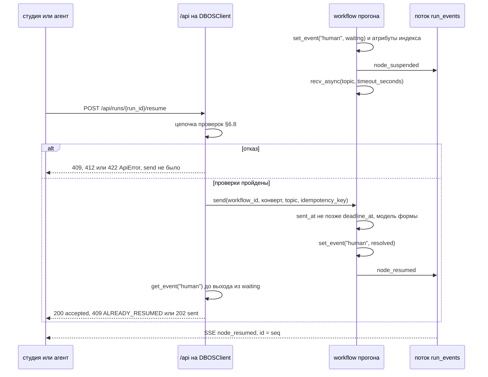
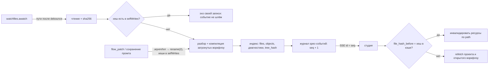
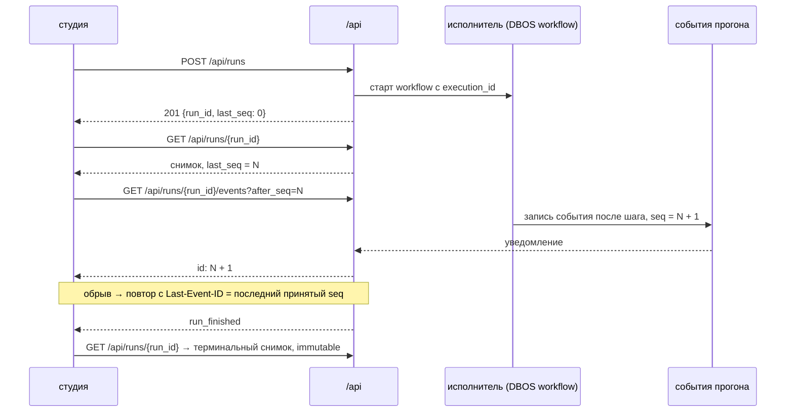

# 23. API локальной студии

> Статус: draft; правка 2026-09-18 по реализации движка — §2 (реестр событий), §3 (`spec-schemas`),
> §4.1–§4.2 (ключи контекста флоу), §6.1 и §6.4 (`context`, `CONTEXT_MISSING`, `warnings[]`), §6.5 и §6.7
> (фильтры, сортировки и `me`), §8.1 (настройки и секреты), §9.1 (эвалы и датасеты), §11 (документ схем
> против потоков), §12.5 (`CHAT_STATE_CONFLICT`), §13.3, §14, новый §15 (чат) и открытые вопросы 33, 34.
> Записка Studio — [studio-api-integration.md](studio-api-integration.md), ответ на неё —
> [studio-api-integration-response.md](studio-api-integration-response.md)
> Зависит от: [ADR-0028](adr/0028-studio-api-contract.md), [ADR-0017](adr/0017-files-as-source-of-truth.md), [ADR-0024](adr/0024-studio-on-vite.md), [ADR-0025](adr/0025-python-engine.md), [ADR-0026](adr/0026-yaml-spec-and-code-refs.md), [ADR-0027](adr/0027-dynamic-io-shapes.md), [ADR-0029](adr/0029-trust-and-quality-python.md), [ADR-0030](adr/0030-local-browser-backend.md), [14. MCP-контракт для агентов](14-mcp-contract.md), [15. Studio: фронтенд](15-studio-frontend.md), [16. Модель данных](16-data-model.md), [31. Редактирование канваса](31-canvas-editing.md), [files-first/contract.md](files-first/contract.md), [files-first/write-model.md](files-first/write-model.md)
> Источники: [research/studio-api-inventory.md](research/studio-api-inventory.md), [research/py-stack-runtime.md](research/py-stack-runtime.md), спека §8.9, §11, §13, §14

## Зачем этот слой

Студия — плейграунд, в котором человек проходит по всему, что видит движок: файлы проекта,
разобранное описание, IR, диагностики, JSON Schema, промты, прогоны, датасеты, эксперименты. Слой
закрывает проблемы спеки §8.9 (№65 не виден финальный промт, №66 непонятно, откуда кусок контекста,
№68 нельзя перезапустить один узел, №69 нельзя сравнить прогоны, №70 нет стоимости и латентности
по узлам): без API, который отдаёт эти данные машинно, экрану отладчика нечего показывать. Текущий
TS-сервер `aqven dev` отдаёт 7 маршрутов под `/api`, скачивание блоба и один общий SSE-канал, теряет
рендер итерации 0 цикла, игнорирует `Range`, не отдаёт JSON Schema входа, промты и дерево файлов
([research/studio-api-inventory.md](research/studio-api-inventory.md)).
Документ фиксирует контракт, который Python-движок отдаёт `apps/studio`, и его соответствие
MCP-поверхности того же процесса.

## Решения

| Решение | Что берём | Версия | Лицензия | Почему |
|---|---|---|---|---|
| Источник контракта | модели Pydantic → FastAPI → OpenAPI 3.1 | pydantic 2.13.5, fastapi 0.141.1 | MIT, MIT | одна точка правды для REST, MCP `inputSchema`/`outputSchema` и TS-типов ([ADR-0028](adr/0028-studio-api-contract.md)); ставим `fastapi` без extras: `fastapi[standard]` тянет encode `httpx` |
| ASGI-сервер | `uvicorn.Server(uvicorn.Config(...))` в процессе `aqven dev` | 0.53.0 | BSD-3-Clause | проверено: обслуживает FastAPI и смонтированный MCP на одном порту ([research/py-stack-runtime.md](research/py-stack-runtime.md) §7, §9.6) |
| SSE | `fastapi.sse.EventSourceResponse` + `ServerSentEvent` | fastapi 0.141.1 | MIT | поля `event`, `id`, `retry`; комментарий `: ping` каждые 15 с простоя (`KEEPALIVE_COMMENT` и `_PING_INTERVAL = 15.0` в `fastapi/sse.py`); `sse-starlette` для наших маршрутов не нужен |
| Типы событий в TS | реестр событий `GET /api/schemas/events` → компоненты OpenAPI | — | — | openapi-typescript 7.13.0 превращает поток в `unknown`; компоненты из реестра генерируются как union с дискриминатором `type` (проверено запуском, [ADR-0028](adr/0028-studio-api-contract.md) «Проверка», п. 2) |
| TS-клиент | `openapi-typescript` + `openapi-fetch` | 7.13.0 / 0.17.0 | MIT | как в [15](15-studio-frontend.md) §4.1; peer `typescript@^5` при нашем 6.0.3 — pnpm предупреждает, генерация и `tsc` 6.0.3 работают |
| MCP на том же порту | `mcp.server.MCPServer.streamable_http_app`, монтирование в `/mcp/` | mcp 2.2.0 | MIT | `FastMCP` в 2.x переименован; lifespan хоста входит в `session_manager.run()` |
| Медиа с перемоткой | `starlette.responses.FileResponse` | starlette 1.6.0 | BSD-3-Clause | `Range: bytes=` → 206 и `Content-Range`, вне файла → 416 (проверено запуском, [research/studio-api-inventory.md](research/studio-api-inventory.md) §2.8) |
| Загрузка медиа | FastAPI `UploadFile` поверх `python-multipart` | 0.0.32 | Apache-2.0 | уже транзитивно от `mcp` 2.2.0 (`Requires-Dist: python-multipart>=0.0.9`), новой зависимости нет; загрузка `multipart/form-data` проверена запуском (там же §2.8) |
| Защита от DNS rebinding | `TrustedHostMiddleware` на всё приложение; у `/mcp` дополнительно `TransportSecuritySettings` | starlette 1.6.0 / mcp 2.2.0 | BSD-3-Clause / MIT | чужой `Host` → 400 (проверено, там же §2.8); MCP по умолчанию принимает только localhost, иначе 421 (документация `mcp`, [research/py-stack-runtime.md](research/py-stack-runtime.md) §7) |
| Наблюдение за файлами | `watchfiles.awatch` | 1.2.0 | MIT | источник spec-канала; `debounce` задаём явно (по умолчанию 1600 мс) |
| Надёжное исполнение прогонов | DBOS: workflow на прогон, шаг на узел | 2.31.1 | MIT | `fork_workflow`, `cancel_workflow`, `list_workflow_steps`, восстановление после падения |
| Ожидание человека и поток событий прогона | DBOS `set_event`, `recv_async(topic, timeout_seconds)`, `send(..., idempotency_key)`, `write_stream_async` / `DBOSClient.read_stream_async`; одобрение тула — отложенные тулы Pydantic AI под `DBOSDurability` | dbos 2.31.1, pydantic-ai-slim 2.43.0 | MIT, MIT | решение владельца от 2026-09-16 ([ADR-0025](adr/0025-python-engine.md) §9): срок исполняет сам workflow, внешнего планировщика и своей outbox-таблицы нет; контракт — §6.6–§6.10, §11.4 |
| Анализ шаблонов | `liquid.parse(...)` → `BoundTemplate.analyze()` | python-liquid 2.3.1 | MIT | переменные, фильтры и теги шаблона без рендера |
| Идентификатор прогона | `uuid.uuid7()` | CPython 3.14 | PSF-2.0 | упорядочен по времени, как `uuidv7()` в DDL [16](16-data-model.md) §2.7 |
| CAS записи | `expects[{path, file_hash}]` + `client_op_id` | — | — | закон ([ADR-0017](adr/0017-files-as-source-of-truth.md), CLAUDE.md); `If-Match` для многофайловой правки не используется |
| Адрес исполнения узла | структура `{node_id, branch_key, iteration, item_index}` | — | — | строковые ключи `nodeId#branch`/`nodeId@iter` склеивали итерацию 0 с уровнем узла |

Не берём: WebSocket (SSE хватает на оба канала, [15](15-studio-frontend.md) §4.2), `sse-starlette` для своих
маршрутов (ставится транзитивно от `mcp`, но не используется), `fastapi[standard]` и `starlette[full]`
(тянут encode `httpx`), экспорт в целевые фреймворки (отменён решением владельца от 2026-09-16,
[ADR-0025](adr/0025-python-engine.md) §7; см. §13.3).

Пробы. «Проверено запуском» в этом документе — пробы вне репозитория 2026-09-16 на CPython 3.14.7 с
fastapi 0.141.1, starlette 1.6.0, mcp 2.2.0, pydantic 2.13.5, uvicorn 0.53.0, pyright 1.1.414 strict,
openapi-typescript 7.13.0 (pnpm 10.33.0) и `tsc` 6.0.3. Результаты про монтирование MCP, SSE FastAPI и uvicorn
приведены в [research/py-stack-runtime.md](research/py-stack-runtime.md) §7, §8, §9.6, про DBOS — там же §5.1; про
`Range`, `HEAD`, `TrustedHostMiddleware`, `UploadFile` и `uuid.uuid7()` — в
[research/studio-api-inventory.md](research/studio-api-inventory.md) §2.8; реестр событий как union и `TS1360` —
в [ADR-0028](adr/0028-studio-api-contract.md) «Проверка», п. 2. Тело 404 FastAPI по умолчанию, `reportDeprecated` у
lifespan, корневой `$ref` рекурсивной модели и проверка каркаса §2 в research пока не записаны — открытый вопрос 21.
Пробы ожидания человека выполнялись вне репозитория 2026-09-16 на CPython 3.14.7 с dbos 2.31.1 (системная БД SQLite) и
pydantic-ai-slim 2.43.0 без вызовов провайдеров; владелец принял их без независимой перепроверки, результаты — в
[research/py-stack-runtime.md](research/py-stack-runtime.md) §5.5. Фрагмент резюма §6.8 проверен pyright 1.1.414 strict на
типах dbos 2.31.1 и прогоном use-case на подделках портов.

## 1. Общие правила

### 1.1. Процесс и адресация

| Что | Правило |
|---|---|
| Запуск | `aqven dev <путь>`: студия + API + наблюдение за файлами; корень проекта — ближайший вверх каталог с `aqven.yaml` |
| Адрес | `127.0.0.1`, порт `--port`, по умолчанию 5180: `apps/studio/vite.config.ts` уже проксирует `/api` на `http://127.0.0.1:5180` |
| REST | `/api/*`; OpenAPI — `/api/openapi.json` (`FastAPI(openapi_url=...)`), Swagger UI выключен |
| MCP | `/mcp/` со слешем: без слеша каждый запрос стоит редиректа 307; в OpenAPI не попадает |
| Статика | любой другой `GET` — файл из бандла студии, иначе `index.html`; [ADR-0024](adr/0024-studio-on-vite.md) отдаёт `index.html` на любой путь вне `/api`, здесь исключается и `/mcp/`, потому что MCP живёт на том же порту |
| Неизвестный `/api/*` | 404 с телом `ApiError`, никогда `index.html` (баг текущего сервера); FastAPI 0.141.1 по умолчанию отвечает `{"detail":"Not Found"}` (проверено), поэтому нужен свой обработчик 404 |
| Аутентификация | нет: слушаем только loopback; `Host` проверяется, CORS не включается (один origin, в `vite dev` — прокси) |
| `aqven serve` | не студия: запуск воркфлоу по HTTP и MCP; его поверхность — подмножество §6 и §13, состав — открытый вопрос 14 |

### 1.2. Форматы

| Что | Правило | Основание |
|---|---|---|
| Имена полей JSON | `snake_case` | как в [14](14-mcp-contract.md) |
| `flow_id` | имя каталога `flows/<flow_id>/`; поля `id` в файле нет | CLAUDE.md, [ADR-0017](adr/0017-files-as-source-of-truth.md) |
| `node_id` | имя файла `flows/<flow_id>/nodes/<node_id>.yaml` без расширения | CLAUDE.md |
| `type_id` | PascalCase, имя типа из `type_ref` [04](04-ir-schema.md) §2.1 (`^[A-Z][A-Za-z0-9_]{0,62}`); встроенные: скалярные `Text`, `Int`, `Float`, `Bool`, `Date`, `DateTime`; контекст прогона `TimeZone`, `Locale`, `TenantId`; медиа `Image`, `Audio`, `Video`, `Document`; динамическая форма `Dynamic`, `FieldSpec` | [ADR-0026](adr/0026-yaml-spec-and-code-refs.md) §1 «Нотация типов», [ADR-0027](adr/0027-dynamic-io-shapes.md), [04](04-ir-schema.md) §3.3 |
| `run_id` | UUIDv7 строкой | §Решения |
| Путь файла | POSIX, относительно корня проекта; `..`, абсолютный путь, выход симлинка за корень → 404 `NOT_FOUND`; `.aqven/` и `.git/` не отдаются | CLAUDE.md: служебные пути не трогаем; корень и каталог `.aqven/` — [ADR-0026](adr/0026-yaml-spec-and-code-refs.md) §1 «Корень проекта» |
| Хеши | строка `sha256-<64 hex>`: `file_hash` — байты файла; `tree_hash` — отсортированный список `path → file_hash`; `content_hash` — канонический IR | [files-first/write-model.md](files-first/write-model.md) §2, [16](16-data-model.md) §2.2, [12](12-observability.md) §3.2 |
| Время | ISO 8601 в UTC: `2026-09-16T10:00:00Z` | сериализация Pydantic 2.13.5 `datetime` с зоной |
| Деньги | `cost_usd` десятичной строкой: `"0.00012345"` | Pydantic `Decimal` → строка; `numeric(18,8)` в [16](16-data-model.md) §2.7 |
| Листинги | `Page{items, next_cursor, total_estimate}`, `limit` 20 по умолчанию, максимум 200, курсор непрозрачный | [14](14-mcp-contract.md) §4.3 |
| Payload | `ValueRef`: `{kind: "inline", value}` до 8 КБ, иначе `{kind: "blob", blob_id, sha256, size_bytes, media_type, preview, truncated}`; глубину задаёт `include_payloads=none\|truncated\|full` | [16](16-data-model.md) §4, [14](14-mcp-contract.md) §4.2 |
| Ответ чтения | ресурс без конверта | типы `openapi-fetch` без распаковки |
| Ответ записи в файлы проекта | `Envelope` из [14](14-mcp-contract.md) §3.1: `ok`, `op`, `version`, `focus`, `problems[]`, `candidates[]`, `next[]`, `refs[]`, `ui_url`, `truncated`; так отвечают `flow_patch`, создание и импорт воркфлоу, привязки контекста, сохранение промта, а также аппрув и отказ заявки и откат релиза | один формат для REST и MCP ([ADR-0028](adr/0028-studio-api-contract.md) §2, правило 4) |
| Ответ прочей записи | свой ресурс без конверта: запуск, отмена, резюм, реплей и форк прогона, датасеты, эксперименты, новая заявка, коммит и revert отдают модель, указанную в таблицах §6–§10 | в `Envelope` нет поля результата; расхождение с правилом 4 — открытый вопрос 22 |
| Ошибка | `ApiError` и HTTP-код по таблице §12.5 | — |
| Долгая операция | `202 Accepted` + ресурс `{id, status, progress}` + SSE `.../events` у ресурса | эксперимент, blame, матрица моделей |
| Секреты | не отдаются никогда; поля с `secret_ref` редактируются до отдачи при любом `include_payloads` | [14](14-mcp-contract.md) §6.2 |

### 1.3. Классы свежести

| Класс | Ресурсы | Как клиент узнаёт об изменении | Кэш |
|---|---|---|---|
| Статично | OpenAPI, реестр событий, коды проблем, JSON Schema моделей описания, срез каталога моделей | не меняется за жизнь процесса; `GET /api/project` отдаёт `engine_version` | бессрочно в сессии вкладки |
| Статично, неизменно по идентичности | блоб по `blob_id`, IR по `content_hash`, снимок терминального прогона, отчёт гейта по `content_hash`, версия датасета | никогда | `ETag` + `Cache-Control: private, max-age=31536000, immutable`; в студии `staleTime: Infinity` ([15](15-studio-frontend.md) §1.2) |
| По изменению файлов | проект, дерево, исходники, спека, IR рабочей копии, схемы, узлы, промты, черновики, типы, профили моделей, диагностики, история | spec-канал §11.1: событие с путями и хешами; в спайке — опрос `tree_hash` | `ETag` по хешам входящих файлов, `If-None-Match` → 304; инвалидация по паре `path` + `file_hash` ([14](14-mcp-contract.md) §9.4) |
| Живое | список прогонов, снимок нетерминального прогона, исполнения узлов, очередь приостановленных, прогресс экспериментов, состояние индекса, локи | run-канал §11.2, лента прогонов §11.3 | снимок + дельты по `seq`; поллинг живого прогона запрещён ([15](15-studio-frontend.md) §4.3) |

## 2. Источник контракта и клиент

Модели Pydantic движка дают FastAPI маршруты и `GET /api/openapi.json` (3.1), а `MCPServer` — `inputSchema` и
`outputSchema` тулов; openapi-typescript 7.13.0 в CI строит из `openapi.json` `@aqven/api-types/schema.d.ts`,
`apps/studio` вызывает API через `openapi-fetch` `createClient<paths>()`. Схема цепочки — диаграмма в
[ADR-0028](adr/0028-studio-api-contract.md) «Решение».

Правила:

1. Сгенерированные `openapi.json` и `schema.d.ts` коммитятся; расхождение с генерацией в CI — красный
   билд. Это тот же гейт на дрейф, что в [15](15-studio-frontend.md) §4.1, с Pydantic вместо zod.
2. Один слой use-case'ов, два адаптера: роутер FastAPI и тул MCP (Port/Adapter). Доменная ошибка
   переводится в `ApiError` одним транслятором, HTTP-код берётся из таблицы, а не из цепочки условий.
3. Поток событий типизируется отдельно. Проверено запуском на FastAPI 0.141.1: эндпоинт,
   отдающий модели Pydantic, публикует в OpenAPI `itemSchema` с `oneOf` и дискриминатором, но не
   пишет `id:` в кадр; эндпоинт, отдающий `ServerSentEvent(id=...)`, пишет `id:` и `event:`, но
   теряет схему `data`. openapi-typescript 7.13.0 в обоих случаях даёт `"text/event-stream": unknown`.
   Поэтому SSE-эндпоинты отдают `ServerSentEvent(data=model, event=model.type, id=str(seq))`, а все
   union событий регистрируются в ответе `GET /api/schemas/events`:
   `EventCatalog{spec[], run[], chat[], schemas}`. Массивы `spec`, `run` и `chat` пусты всегда — они
   только якорь, который заводит union в `components.schemas`: генератор выводит `EventCatalog.run`
   как union компонентов `NodeFinished | RunFinished | ...` (проверено), и студия берёт тип элемента
   оттуда. Содержимое — в `schemas`: `EventSchemas{dialect, spec{тип: JSON Schema},
   run{...}, chat{...}}`, по самодостаточному документу на каждый тип события (`$schema` —
   2020-12, `type` в схеме зафиксирован `const`). Каналов три, потому что union событий три:
   spec-канал §11.1, run-канал §11.2, чат §15; ленты прогонов и прогресса эксперимента (§11.3)
   в реестре нет — они в фазе «позже», своего union пока не имеют.

Каркас SSE и монтирования: run-канал, реестр событий, lifespan и MCP на том же порту. Каталог операций,
`ApiError`, транслятор ошибок и регистрация тулов через `ToolCall` — [ADR-0028](adr/0028-studio-api-contract.md) §2:
MCP-сервер приходит сюда готовым из `build_mcp_server(catalog)`, а `ExecutionAddress` совпадает с моделью адреса
([ADR-0028](adr/0028-studio-api-contract.md) §5). Проверено запуском вместе с модулем пробы ADR-0028: pyright 1.1.414
strict без ошибок на обоих модулях; `Last-Event-ID: 1` отдаёт только кадр `seq: 2`; оба маршрута несут
`x-aqven-rest-only`; чужой `Host` → 400; под uvicorn 0.53.0 `mcp.Client` на `/mcp/` видит тул `run_get_node`, а
доменная ошибка приходит `ApiError` в `structuredContent`.

```python
from collections.abc import AsyncGenerator, AsyncIterable, AsyncIterator
from contextlib import asynccontextmanager
from typing import Annotated, Literal, Protocol

from fastapi import APIRouter, FastAPI, Header
from fastapi.sse import EventSourceResponse, ServerSentEvent
from mcp.server import MCPServer
from pydantic import BaseModel, ConfigDict, Field
from starlette.middleware.trustedhost import TrustedHostMiddleware


class ExecutionAddress(BaseModel):
    model_config = ConfigDict(extra="forbid")
    node_id: str
    branch_key: str | None
    iteration: Annotated[int, Field(ge=0)] | None
    item_index: Annotated[int, Field(ge=0)] | None


class NodeFinished(BaseModel):
    type: Literal["node_finished"]
    seq: int
    address: ExecutionAddress
    status: Literal["ok", "failed", "skipped", "cancelled"]


class RunFinished(BaseModel):
    type: Literal["run_finished"]
    seq: int
    status: Literal["completed", "failed", "cancelled"]


RunEvent = Annotated[NodeFinished | RunFinished, Field(discriminator="type")]


class EventCatalog(BaseModel):
    run: list[RunEvent]


class RunEventLog(Protocol):
    def follow(self, run_id: str, after_seq: int) -> AsyncIterator[NodeFinished | RunFinished]: ...


def build_events_router(events: RunEventLog) -> APIRouter:
    router = APIRouter(prefix="/api")

    @router.get(
        "/runs/{run_id}/events",
        response_class=EventSourceResponse,
        operation_id="run_events",
        openapi_extra={"x-aqven-rest-only": "sse transport"},
    )
    async def run_events(
        run_id: str,
        last_event_id: Annotated[int | None, Header()] = None,
        after_seq: int = 0,
    ) -> AsyncIterable[ServerSentEvent]:
        start = after_seq if last_event_id is None else last_event_id
        async for event in events.follow(run_id, start):
            yield ServerSentEvent(data=event, event=event.type, id=str(event.seq))

    @router.get(
        "/schemas/events",
        operation_id="event_catalog",
        openapi_extra={"x-aqven-rest-only": "event schemas"},
    )
    async def event_catalog() -> EventCatalog:
        return EventCatalog(run=[])

    return router


def create_app(events: RunEventLog, mcp_server: MCPServer, allowed_hosts: list[str]) -> FastAPI:
    @asynccontextmanager
    async def lifespan(app: FastAPI) -> AsyncGenerator[None]:
        async with mcp_server.session_manager.run():
            yield

    app = FastAPI(lifespan=lifespan, openapi_url="/api/openapi.json", docs_url=None, redoc_url=None)
    app.add_middleware(TrustedHostMiddleware, allowed_hosts=allowed_hosts)
    app.include_router(build_events_router(events))
    app.mount("/mcp", mcp_server.streamable_http_app(streamable_http_path="/"))
    return app
```

`RunEventLog` — порт журнала событий прогона, `build_events_router` — REST-адаптер над ним, `create_app` получает
порт и MCP-сервер через параметры (Port/Adapter, внедрение через фабрику). Фрагмент сокращён: обработчиков
`DomainError`, `RequestValidationError` и 404 для неизвестного `/api/*` в нём нет ([ADR-0028](adr/0028-studio-api-contract.md)
§2, правило 5; коды и HTTP — §12.5), spec-канала тоже. Под pyright 1.1.414 на Python 3.14 аннотация
`-> AsyncIterator[None]` у `@asynccontextmanager` помечена deprecated (`reportDeprecated`), поэтому lifespan
возвращает `AsyncGenerator[None]`.

Приём события в студии: тип из компонентов, проверка дискриминатора на границе, исчерпанность
набора типов проверяет компилятор. Проверено `tsc` 6.0.3 `--strict` на сгенерированном
`schema.d.ts`: пропуск варианта в таблице даёт `TS1360`.

```ts
import type { components } from "@aqven/api-types";

type RunEvent = components["schemas"]["EventCatalog"]["run"][number];
type RunEventType = RunEvent["type"];

const RUN_EVENT_TYPES = {
  node_finished: true,
  run_finished: true,
} satisfies Record<RunEventType, true>;

export const isRunEvent = (value: unknown): value is RunEvent =>
  typeof value === "object" &&
  value !== null &&
  "type" in value &&
  typeof value.type === "string" &&
  Object.hasOwn(RUN_EVENT_TYPES, value.type);

export const parseRunEvent = (data: string): RunEvent | null => {
  const value: unknown = JSON.parse(data);
  return isRunEvent(value) ? value : null;
};
```

## 3. Проект и файлы

| Метод и путь | Отдаёт | Тул MCP | Свежесть | Фаза |
|---|---|---|---|---|
| `GET /api/project` | `ProjectInfo` | — | по файлам | спайк |
| `GET /api/files?prefix=&kind=&state=&cursor=&limit=` | `Page<FileEntry>` | — | по файлам | спайк |
| `GET /api/files/{path:path}` | `FileDetail`: `FileEntry` + `problems[]` | — | по файлам | спайк |
| `GET /api/raw/{path:path}` | байты файла, `ETag: "<file_hash>"`, `Content-Type` по расширению | — | по файлам | спайк |
| `GET /api/spec-schemas` | `SpecSchemaCatalog{dialect, schemas[SpecSchema]}` — по записи на каждый `SpecKind` | — | статично | спайк |
| `GET /api/spec-schemas/{kind}` | один `SpecSchema{kind, path, json_schema, variants}`; неизвестный `kind` не проходит модель параметра пути → 422 `REQUEST_INVALID` с `problems[0].path = ["path", "kind"]`, а не 404 | — | статично | спайк |
| `GET /api/repo` | `{branch, head_commit, dirty, dirty_paths[], ahead, behind}` | `repo_status` (нет в реестре 14) | по файлам | позже |
| `GET /api/external-changes?cursor=` | что приехало из `fs`/`git`, что в карантине | `external_changes_list` (нет в реестре 14) | по файлам | позже |
| `POST /api/index/rebuild` | `202` + состояние индекса | нет: `index_rebuild` только REST ([files-first/contract.md](files-first/contract.md) §6) | живое | позже |

`ProjectInfo`: `root`, `engine_version`, `tree_hash`, `project_file{path: "aqven.yaml", file_hash}`,
`lock_file{path: "aqven.lock.yaml", file_hash} | null`, `index{status: ready|building|degraded,
generation, indexed_at, pending_files}`, `quarantined_files`, `spec_seq` (последний `seq` spec-канала),
`mcp_url`.

`FileEntry`: `path`, `kind`, `file_hash`, `size_bytes`, `mtime_ns`, `parse_status: ok|invalid|unreadable`,
`sync_state: ok|quarantined|unreadable`, `problems_count`, `last_good_content_hash | null`. `kind` —
значение `kind` из заголовка YAML-файла (`Project`, `Flow`, `Node`, `Type`, `Dataset`), `prompt` для
`*.prompt.md`, `code` для `*.py`, `lock` для `aqven.lock.yaml`, `other` для прочего. Поля повторяют
`idx.files` и `app.spec_fs_sync` ([16](16-data-model.md) §2.3–2.4).

`SpecSchema`: `kind` — значение `SpecKind` (`Project`, `Type`, `Flow`, `Node`, `Dataset`, `Eval`,
`Inference`, `Agent`, `Tool`, `McpServer`; enum уезжает в OpenAPI, поэтому список видов студия получает
из типов, а не из документа); `path` — файл `.aqven/schema/<kind>.schema.json`, который пишет
`aqven schema`, и по нему же редактор связывает схемы с файлами глобами `yaml.schemas` без
modeline-комментариев ([ADR-0026](adr/0026-yaml-spec-and-code-refs.md) §11 «Схемы редактора»);
`json_schema` — документ вида целиком, байт в байт тот же, что в файле; `variants` — документ на каждый
вариант для видов-объединений: `Node` — по одному на каждый `NodeKind`, `Type` — `record`, `enum`,
`union`, `id`, `value`; у остальных видов `variants` пуст. Схемы статичны на жизнь процесса (§1.3).
Расхождение с [ADR-0026](adr/0026-yaml-spec-and-code-refs.md) §11 и [ADR-0029](adr/0029-trust-and-quality-python.md):
для `Dataset` отдаётся схема нашей модели файла датасета, а не `Dataset.model_json_schema_with_evaluators()`
pydantic-evals 2.43.0 — так уже пишет `aqven schema`, HTTP лишь показал это; выбор нужно закрыть решением.

## 4. Воркфлоу, узлы, типы, схемы

### 4.1. Эндпоинты

| Метод и путь | Отдаёт | Тул MCP | Свежесть | Фаза |
|---|---|---|---|---|
| `GET /api/flows?status=&cursor=` | `Page<FlowSummary>` | `flow_list` (нет в реестре 14) | по файлам | спайк |
| `POST /api/flows` | создание каталога воркфлоу из архетипа или пустого → `Envelope` | `flow_create` | по файлам | позже |
| `POST /api/flow-imports` | импорт `agent_workflow_spec` в файлы рабочего дерева → `Envelope`; другого `source.kind` нет, источник-бандл отменён вместе с экспортом | `flow_import` | по файлам | позже |
| `GET /api/flows/{flow_id}` | `FlowDetail` | `flow_get` | по файлам | спайк |
| `GET /api/flows/{flow_id}/spec` | разобранные модели описания: `flow`, `nodes{node_id: NodeSpec}` | `flow_get(view='raw')` | по файлам | спайк |
| `GET /api/flows/{flow_id}/ir?at=working` | `{content_hash, ir}`, `ETag: "<content_hash>"`; IR — производный артефакт `aqven check`/`aqven build`, в дереве проекта его нет ([ADR-0026](adr/0026-yaml-spec-and-code-refs.md) §9) | `flow_get` | по файлам | спайк |
| `GET /api/flows/{flow_id}/ir/expanded` | IR с раскрытыми компонентами | `component_expand` | по файлам | позже |
| `GET /api/flows/{flow_id}/schemas` | `{input, output, context, nodes{node_id: {in, out, form}}}`; `context` — тот же список ключей `RunContextKey`, что в `FlowSummary.context`, а не JSON Schema | `catalog_get` | по файлам | спайк |
| `GET /api/flows/{flow_id}/nodes` | `NodeSummary[]` в топологическом порядке | `flow_get` | по файлам | спайк |
| `GET /api/flows/{flow_id}/nodes/{node_id}` | `NodeDetail` | `flow_get(node_id)` | по файлам | спайк |
| `GET /api/flows/{flow_id}/diagnostics` | `{tree_hash, compiled_at, problems[], candidates[]}` | `flow_compile` | по файлам | позже |
| `POST /api/flows/{flow_id}/compile` | `{report, problems[], candidates[]}`; `at?: working\|<commit>` | `flow_compile` | по файлам | позже |
| `GET /api/flows/{flow_id}/graph` | рёбра, топологический порядок, группы | — | по файлам | позже |
| `GET /api/flows/{flow_id}/nodes/{node_id}/effective-config` | `{config, provenance[]}` | `agent_effective_config` | по файлам | позже |
| `GET /api/flows/{flow_id}/context/plan`, `.../context/graph` | потребности и граф контекста с нарушениями `R-C1..R-C8` | `context_plan`, `context_graph` | по файлам | позже |
| `POST /api/flows/{flow_id}/context/bindings` | привязка источников к потребностям → `Envelope` | `context_bind` | по файлам | позже |
| `GET /api/types?cursor=` | `Page<TypeSummary{type_id, path, kind, usage_count, status}>` | `catalog_list(kind='type')` | по файлам | позже |
| `GET /api/types/{type_id}` | `{type_id, path, file_hash, spec, json_schema, enum_values[{value, description}]}` | `catalog_get(kind='type')` | по файлам | позже |
| `GET /api/types/{type_id}/usages?cursor=` | `Page<{flow_id, node_id, path, kind}>` | `type_usages` (нет в реестре 14) | по файлам | позже |
| `POST /api/types/{type_id}/impact` | `{breaks[], candidates[], verdict}` | `type_impact` (нет в реестре 14) | по файлам | позже |
| `GET /api/components`, `/{component_id}`, `/{component_id}/expand?depth=` | листинг, сигнатура, граф до примитивов | `component_list`, `component_get`, `component_expand` | по файлам | позже |
| `GET /api/agents/{agent_id}` | определение агента | `agent_get` | по файлам | позже |

### 4.2. Состав ресурсов

| Модель | Поля |
|---|---|
| `FlowSummary` | `flow_id`, `root_path`, `compile_status: ok\|not_runnable\|invalid\|unreadable`, `problems{error, warning, info}`, `first_problem \| null`, `node_count`, `input_type`, `output_type`, `context[]` (ключи контекста прогона: объявленные в `flow.yaml` и выведенные компилятором из привязок `$run.context.*`, включая узлы вызываемых флоу), `content_hash \| null`, `last_run{run_id, status, started_at} \| null`, `lock \| null` |
| `FlowDetail` | `FlowSummary` + `files[{path, file_hash}]`, `tree_hash`, `problems[]`, `layout_rev \| null` |
| `NodeSummary` | `node_id`, `kind`, `path`, `file_hash`, `model_profile \| null`, `prompt_level: 1\|2\|3 \| null`, `code_ref \| null`, `problems_count`, `upstream[]`, `downstream[]` |
| `NodeDetail` | `NodeSummary` + `spec` (модель описания узла), `ir_node`, `in_schema`, `out_schema`, `form_schema \| null`, `bindings[{slot, ref, type_id}]`, `prompt{level, path \| null, builder_ref \| null}`, `code{ref, declared_in, declared_out, signature_schema} \| null`, `dynamic_slots[]`, `problems[]` |

`compile_status`: `invalid` — блокирующая диагностика или разбор не прошёл; `not_runnable` — только
advisory-диагностики, запуск и сборка отказывают ([files-first/write-model.md](files-first/write-model.md) §4).

`code.signature_schema` — схема аргументов функции `run: pkg.mod:function`, которую движок строит
`TypeAdapter(fn).json_schema()`; рядом объявленные `in`/`out` узла, чтобы студия показала расхождение,
которое ловит `aqven check`.

`context[]` — ключи контекста прогона, которые нужны этому флоу; порядок — как в `RunContextKey`
(`date`, `time_zone`, `locale`, `tenant_id`). Список выводит компилятор, а не автор файла:

| Правило | Как |
|---|---|
| Откуда берутся ключи | объединение объявленных в `flow.yaml` `context:` и всех привязок `$run.context.<ключ>` на любом месте связывания (`in`/`out` узла, `returns` флоу, `on` и `bind` ветки `switch`, `over` у `map`, `from` у `narrow`, `init` у `loop`) |
| Вызовы | замыкание по графу вызовов: флоу с узлом `call` публикует и ключи вызываемых флоу — контекст у прогона один на всё дерево |
| Объявление необязательно | привязка `$run.context.date` работает без строки в `flow.yaml`; прежнее статическое правило «ключ не объявлен в контексте флоу» снято, единственный источник списка — компилятор |
| Объявлено, но не связано | предупреждение `W_CONTEXT_KEY_UNUSED` с адресом `context[i]` в `flow.yaml`; ключ остаётся в `context[]` и потому остаётся обязательным при запуске — подсказка предлагает удалить строку |
| Ключ вне словаря | `$run.context.weather` — ошибка разбора ссылки `E_REF_SYNTAX`, как и раньше |

Для студии это значит: форма запуска строится ровно по `FlowSummary.context`, все ключи обязательны
(§6.4), а `date` форма подставляет сегодняшним днём сама — движок значений не выдумывает.

### 4.3. Правила JSON Schema

| Правило | Как |
|---|---|
| Самодостаточность | каждая схема несёт свои `$defs`, внешних ссылок нет; корень — сам объект, а у рекурсивного типа — `$ref` на `#/$defs/<Name>` (так отдаёт `model_json_schema` Pydantic 2.13.5, оба случая проверены запуском) |
| Входы и выходы | `in_schema`/`out_schema` узла, `input`/`output` воркфлоу — схемы режима validation, по ним проверяется вход прогона и `payload` резюма |
| Медиатипы | поле типа `Image`, `Audio`, `Video`, `Document` описано как `MediaValue` (§7) с ограничением `media_type` |
| Форма человека | `form_schema` — JSON Schema модели единственного типа `form` узла `human` ([ADR-0026](adr/0026-yaml-spec-and-code-refs.md) §13: один тип вместо пары `form`/`resume`); ею же проверяется `payload` резюма (§6.8); в исполнении ожидающего узла приходит та же схема шага ([14](14-mcp-contract.md) §2.5) |
| Динамическая форма | статическая часть — в схеме, динамическая — непрозрачный объект плюс запись `dynamic_slots[{path, schema_from, limits}]`; фактически отправленная модели схема — в исполнении, `prompt.output_schema_sent` ([ADR-0027](adr/0027-dynamic-io-shapes.md)) |

## 5. Промты

Уровни промта ([ADR-0026](adr/0026-yaml-spec-and-code-refs.md)): промт никогда не строка в YAML.

| Уровень | Источник | Что отдаёт API |
|---|---|---|
| 1 | `<node_id>.prompt.md` с одной инструкцией без переменных; входы, выходы и формат вывода дописывает адаптер | текст инструкции, `file_hash`, дописанный адаптером блок — только в рендере |
| 2 | Liquid-шаблон `<node_id>.prompt.md` со слотами | текст, `file_hash`, анализ шаблона, слоты и неиспользованные входы |
| 3 | `prompt: pkg.mod:build` | `builder_ref`, типы входа и выхода; исходника и черновика нет, помечается в студии |

| Метод и путь | Отдаёт | Тул MCP | Свежесть | Фаза |
|---|---|---|---|---|
| `GET /api/prompts?flow_id=&level=&cursor=` | `Page<PromptSummary{flow_id, node_id, level, path \| null, file_hash \| null, builder_ref \| null, has_draft, draft_stale, problems_count}>` | — | по файлам | спайк |
| `GET /api/flows/{flow_id}/nodes/{node_id}/prompt` | `PromptDetail` | `run_get_node(prompt)` для прогона; для определения тула нет | по файлам | спайк |
| `POST /api/flows/{flow_id}/nodes/{node_id}/prompt/render` | `RenderedPrompt` | `template_render` (нет в реестре 14) | по запросу | позже |
| `GET\|PUT\|DELETE /api/flows/{flow_id}/nodes/{node_id}/prompt/draft` | черновик | только человек | по файлам | позже |
| `POST /api/flows/{flow_id}/nodes/{node_id}/prompt/save` | `Envelope` | только человек | по файлам | позже |
| `GET /api/prompt-map?flow_id=` | граф фрагмент → шаблон → узел, счётчики использования | `prompt_map` (нет в реестре 14) | по файлам | позже |

`PromptDetail`: `level`, `path | null`, `source{text, file_hash} | null`, `builder_ref | null`,
`analysis{variables[], globals[], filters[], tags[]} | null` (python-liquid 2.3.1 `BoundTemplate.analyze()`
для уровня 2), `slots[{name, type_id, used}]`, `unused_inputs[]`, `problems[]`,
`draft{text, base_file_hash, updated_at, actor, stale} | null`.

Рендер только на сервере, тем же кодом, что в рантайме; клиентского рендерера нет ([15](15-studio-frontend.md) §11).
Тело запроса рендера: `source: disk|draft`, ровно одно из `input` (объект по `in_schema`),
`dataset_item_id`, `execution{run_id, address}`; `model_profile?`. `RenderedPrompt`:
`messages[{role, parts[{kind: text|image|audio|video|document, text | media}]}]`,
`slot_ranges[{slot, message_index, part_index, offset, length}]`, `cache_prefix_end | null`,
`output_format`, `output_schema_sent`, `token_estimate | null`, `template_sha256`, `rendered_sha256`,
`provenance{slot: {from, need_id, kind}}`. Диапазоны слотов считает рендерер, а не поиск подстроки
([12](12-observability.md) §7, строка 5).

## 6. Прогоны

### 6.1. Эндпоинты

| Метод и путь | Отдаёт | Тул MCP | Свежесть | Фаза |
|---|---|---|---|---|
| `POST /api/runs` | `201 {run_id, status, content_hash, spec_version_id, last_seq, ui_url, warnings[]}` | `run_start` | живое | спайк |
| `GET /api/runs?flow_id=&status=&mode=&assignee=&deadline_before=&overdue=&since=&until=&parent_run_id=&sort=&cursor=&limit=` | `Page<RunSummary>` | `run_list` | живое | спайк, все фильтры и обе сортировки (§6.7) |
| `GET /api/runs/{run_id}` | `RunSnapshot` | `run_get` | живое; терминальный — неизменно | спайк |
| `GET /api/runs/{run_id}/events` | SSE run-канала §11.2 | транспорт | живое | спайк |
| `GET /api/runs/{run_id}/events/log?after_seq=&limit=` | `Page<RunEvent>` в порядке `seq` | — | живое | спайк |
| `GET /api/runs/{run_id}/executions?node_id=&status=` | `NodeExecution[]` | `run_get` | живое | спайк |
| `GET /api/runs/{run_id}/executions/detail?node_id=&branch_key=&iteration=&item_index=&include_payloads=` | `ExecutionDetail` | `run_get_node` | живое; терминальное — неизменно | спайк |
| `GET /api/runs/{run_id}/trace?node_id=&cursor=` | строки водопада: адрес, статус, время, стоимость, токены, хеши, `trace_id`/`span_id` | `run_get_trace` | живое | позже |
| `POST /api/runs/{run_id}/cancel` | `{status}` | `run_cancel` | живое | позже |
| `POST /api/runs/{run_id}/resume` | `ResumeResult` (§6.8): 200, без подтверждения — 202 | `run_resume` | живое | позже |
| `POST /api/runs/{run_id}/replay` | `201 {run_id, diff, problems[]}` | `run_replay_node` | живое | позже |
| `POST /api/runs/{run_id}/fork` | `201 {run_id, lineage_parent}` | `run_fork` | живое | позже |
| `POST /api/runs/estimate` | предварительная оценка стоимости и числа вызовов по узлам | — | по файлам | позже |
| `GET /api/runs/{run_id}/lineage?depth=` | дерево `run_lineage` | `run_lineage` | живое | позже |
| `GET /api/run-diffs?a=&b=` | `deltas[]` по адресам исполнения | `run_diff` | неизменно для пары терминальных | позже |
| `GET /api/runs/{run_id}/stages?cursor=` | матрица элементы датасета × стадии | `run_stages` | живое | позже |
| `POST /api/runs/{run_id}/blames` | `202` + ресурс blame с прогрессом | `run_blame` | живое | позже |
| `GET /api/runs/events` | SSE ленты прогонов §11.3 | транспорт | живое | позже |

### 6.2. Адрес исполнения

Адрес — структура, строковая склейка запрещена:

| Поле | Тип | Когда не `null` |
|---|---|---|
| `node_id` | строка | всегда |
| `branch_key` | строка \| null | исполнение внутри ветки `parallel` или ячейки `switch` с ключом ветки |
| `iteration` | целое ≥ 0 \| null | проход тела `loop`; итерация 0 — это `0`, уровень узла — `null` |
| `item_index` | целое ≥ 0 \| null | элемент `map` |

В query-параметрах отсутствующий параметр означает `null`, `iteration=0` — ровно нулевую итерацию.
Итоговый результат узла-цикла — исполнение с `iteration: null`, проходы — отдельные исполнения с
`iteration: 0..n`. Элементы `map` получают собственные исполнения, а не только события прогресса.
Попытки (`attempt`, с 1, как `aqven.node_attempt` в [12](12-observability.md) §2) — не часть адреса,
а список внутри исполнения. Строки, которые нужны DBOS (топик ожидания и id дочернего workflow), выводит из адреса один
кодировщик внутри адаптера DBOS ([ADR-0025](adr/0025-python-engine.md) §9; §6.6 этого документа); в API, событиях и хранилище они не
появляются и обратно в адрес не разбираются.

### 6.3. Состав ресурсов

| Модель | Поля |
|---|---|
| `RunSummary` | `run_id`, `flow_id`, `status`, `mode`, `started_at`, `finished_at \| null`, `cost_usd`, `tokens_in`, `tokens_out`, `node_counts{pending, running, ok, failed, skipped, suspended, cancelled}`, `content_hash`, `definition_changed`, `waits[HumanWait]` — открытые ожидания человека, пусто вне `suspended` (§6.7), `lineage{relation, parent_run_id} \| null` |
| `RunSnapshot` | `RunSummary` + `execution_id`, `spec_version{id, content_hash, release_hash, git_commit, origin, sources{path: file_hash}}`, `input_ref`, `output_ref \| null`, `error \| null`, `seed`, `cassette_id`, `catalog_snapshot_at`, `effective_config`, `config_hash`, `budget`, `trace_id`, `order[]`, `executions: NodeExecution[]`, `human_answers[{address, attempt, consumed}]` (§6.9), `last_seq` |
| `NodeExecution` | `address`, `kind`, `status`, `attempts_count`, `started_at`, `finished_at \| null`, `latency_ms`, `model`, `profile`, `cost_usd`, `tokens_in`, `tokens_out`, `cache_hit`, `degraded`, `summary`, `input_ref`, `output_ref \| null`, `trace_id`, `span_id` |
| `ExecutionDetail` | `NodeExecution` + `provenance{slot_path: {from, need_id, kind}}`, `input_schema`, `output_schema`, `schema_source: run\|current\|unavailable`, `allowed_sets[{type_id, source, labels_from, members[{value, label}]}]` из записанного нормализованного входа и плана версии прогона, `prompt{level, template_sha256, rendered_sha256, rendered_ref, messages[], slot_ranges[], output_schema_sent} \| null`, `response{outcome: ok\|refusal\|truncated, raw_ref, parsed_ref \| null} \| null`, `attempts[]`, `checks[{name, ok, message}]`, `rule_firings[]`, `error \| null`, `human: HumanWaitDetail \| null` (§6.7). `prompt.output_schema_sent` — фактическая схема выхода вызова, включая enum из `allowed_set`, если набор помещён в схему. |
| `Attempt` | `attempt`, `cause{kind: rate_limited\|schema_invalid\|truncated\|refusal\|provider_error\|budget_exceeded\|cassette_miss, message, schema_errors[{path, code, message}]} \| null`, `action: retry\|repair\|fallback\|none`, `model`, `latency_ms`, `cost_usd`, `tokens_in`, `tokens_out`, `prompt_ref`, `response_ref` |

`RunSummary.waits[]` заменил одиночный объект `suspended`, а `run_status_changed.waits[]` в ленте §11.3 — поле
`suspended`: параллельные ожидания веток (§6.6) в один объект не помещаются. Это несовместимая правка контракта для
клиента `apps/studio`.

`definition_changed` — хотя бы один путь из `spec_version.sources` сейчас имеет другой `file_hash`
(«определение изменилось после старта», [files-first/contract.md](files-first/contract.md), крайние
случаи). `outcome` — три исхода вызова модели ([ADR-0005](adr/0005-three-call-outcomes.md)).
`cause.kind` сопоставлен с исключениями исполнителя [ADR-0029](adr/0029-trust-and-quality-python.md) §3:
`truncated` — `TruncatedOutput` и `IncompleteToolCall`, `refusal` — `RefusedOutput` и `ContentFilterError`,
`schema_invalid` — выход не прошёл проверку Pydantic (повтор с `RetryPromptPart`, после исчерпания — `UnexpectedModelBehavior`),
`rate_limited` — `ModelHTTPError` со статусом 429, `provider_error` — прочие `ModelHTTPError` и `ModelAPIError`,
`budget_exceeded` — `UsageLimitExceeded`, `cassette_miss` — `CassetteMiss`.
`include_payloads` задаёт глубину ([14](14-mcp-contract.md) §4.2): `none` — поля `*_ref` равны `null`,
`truncated` (по умолчанию) — `ValueRef` с превью, `full` — тело целиком и только для одного исполнения,
иначе `VIEW_TOO_BROAD` (в [14](14-mcp-contract.md) §4.2 этот код отклоняет `view='raw'` без сужения,
здесь то же правило распространено на `include_payloads=full`).

Статусы: прогон — `queued|running|suspended|completed|failed|cancelled` ([16](16-data-model.md) §2.7);
исполнение — `pending|running` (только в живом состоянии) и `ok|failed|skipped|suspended|cancelled`
([16](16-data-model.md) §2.8); `cache_hit` и `degraded` — флаги, а не статусы; режим —
`live|replay|experiment|dryrun`.

### 6.4. Запуск и операции над прогоном

| Операция | Тело | Правила |
|---|---|---|
| Запуск | `flow_id`, `at: working\|<commit>` (в спайке только `working`), `mode`, ровно одно из `input` или `dataset_item_id`, `context?` (ключи контекста прогона: `date`, `time_zone`, `locale`, `tenant_id`), `selected_nodes?`, `cassette_id?`, `human_answers?` (сценарные ответы, §6.9) | вход проверяется `input`-схемой до создания прогона: 422 `INPUT_INVALID` с путями полей; `dataset_item_id` вида `<dataset_id>/<case_name>` берёт полный вход и контекст из flow dataset; не переданы ключи из `FlowSummary.context` → 422 `CONTEXT_MISSING`, в `problems[]` по записи `{path: ["context", <ключ>], code: "CONTEXT_KEY_MISSING"}` на каждый недостающий ключ: движок не подставляет значения сам; `selected_nodes` запускает эти корневые ноды и их зависимости, а частичный результат — словарь выходов выбранных нод ([ADR-0033](adr/0033-flow-datasets-and-scoped-runs.md)); рабочая копия с диагностиками или карантином → 409 `NOT_RUNNABLE`; снимок плана пишется в `spec_versions` до старта |

`POST /api/flows/{flow_id}/run-scope` принимает `{selected_nodes: string[] | null}` и возвращает
фактический `order` запуска. Studio использует его перед запуском, чтобы показать добавленные зависимости.
| Отмена | `reason` | терминальный `cancelled` → 200 с текущим статусом; `completed`/`failed` → 409 `RUN_STATE_CONFLICT` |
| Резюм | `address`, `attempt`, `payload`, `client_op_id` | `payload` проверяется моделью формы (`form_schema` шага) до `send`; ошибка → 422 `INPUT_INVALID`, прогон остаётся `suspended`; тот же `client_op_id` → первый результат; другой `client_op_id` после ответа → 409 `ALREADY_RESUMED`; по адресу нет открытого ожидания → 409 `NOT_WAITING`; эскалация сменила попытку → 412 `WAIT_ATTEMPT_STALE`; срок истёк → 409 `RUN_TIMED_OUT` с исходом `on_timeout`; порядок проверок и подтверждение — §6.8 |
| Реплей узла | `address`, `overrides{input?, model_profile?, prompt_source?: disk\|draft}`, `at: original\|working` | по умолчанию исходная версия прогона; результат — новый прогон с `relation: replay` |
| Форк | `from: address`, `overrides?`, `at: original\|working` | результат — новый прогон с `relation: fork`; шаги до `from` копируются; `from` на узле `human` переспрашивает человека (§6.9) |

`RunStarted.warnings[]` — предупреждения, которые не мешают старту, но которые человек должен увидеть
сразу: по записи `Problem{path: ["secrets", <ENV_VAR>], code: "SECRET_MISSING"}` на каждый объявленный
проектом и не заданный секрет (§8.1). Прогон при этом запускается: движок не знает заранее, дойдёт ли
исполнение до узла, которому нужен этот секрет. Полный список с источниками — `GET /api/settings/secrets`.

Сопоставление с DBOS 2.31.1:

| API | DBOS | Статус проверки |
|---|---|---|
| `execution_id` прогона | идентификатор workflow (`SetWorkflowID`) | проверено на SQLite |
| исполнение узла | шаг `@DBOS.step()`; `list_workflow_steps` отдаёт `function_id`, имя, выход | проверено |
| продолжение после падения процесса | автоматическое восстановление при `DBOS.launch()`, завершённые шаги не повторяются | проверено |
| форк | `DBOS.fork_workflow(workflow_id, start_step)`: новый id, шаги до `start_step` скопированы; связь с исходным прогоном — `WorkflowStatus.forked_from` | проверено ([research/py-stack-runtime.md](research/py-stack-runtime.md) §5.1); перевод `address` → `start_step` при `parallel`/`map` не проверен |
| отмена | `DBOS.cancel_workflow` | по документации DBOS |
| ожидание человека, срок, резюм | `set_event` + `recv_async(topic, timeout_seconds)` + `send`; срок — выход шага `DBOS.sleep` (§6.6) | проверено на SQLite ([research/py-stack-runtime.md](research/py-stack-runtime.md) §5.5) |

### 6.5. Приостановленные прогоны и формы

«Что ждёт меня» — `GET /api/runs?status=suspended&assignee=me&sort=deadline_at`, сужение — `flow_id` и
`deadline_before`, просроченные — `overdue=true`; сущности «задача» нет ([files-first/contract.md](files-first/contract.md) §3). Локально
`me` сервер разворачивает в имя локального пользователя до планирования запроса, одинаково для REST, MCP
и библиотеки (§6.7, §8.1). Форма — `ExecutionDetail.human` по адресу из
`RunSummary.waits[]`: `form_schema`, `suspend_data` с провенансом, `deadline_at`, `on_timeout`.
Отправка — резюм §6.4. Смена статуса по сроку приходит в ленту прогонов §11.3. Механизм на DBOS — §6.6, входящие и
форма — §6.7, резюм — §6.8, тестовый режим и форк — §6.9, одобрение тула — §6.10.

### 6.6. Ожидание человека на DBOS

Решение владельца от 2026-09-16 ([ADR-0025](adr/0025-python-engine.md) §9): узел `human` — наш исполнитель поверх
примитивов DBOS 2.31.1, без внешнего планировщика и своей outbox-таблицы. Пробы выполнялись вне репозитория 2026-09-16
([research/py-stack-runtime.md](research/py-stack-runtime.md) §5.5, «Чего DBOS не даёт»).

| Что видит API | Механизм | Почему так |
|---|---|---|
| Открытое ожидание | первый шаг узла фиксирует время; затем `DBOS.set_event("human", {address, form_schema, suspend_data, assignee, waiting_since, deadline_at, attempt, on_timeout, topic})`, индекс в атрибутах workflow (`update_workflow_attributes_async`, пишется шагом) и `node_suspended` в поток `run_events` | API читает событие через `DBOSClient.get_event_async(workflow_id, "human", timeout_seconds=0)`, индекс — входящими §6.7 |
| Ожидание и срок | `DBOS.recv_async(topic, timeout_seconds)` пишет шаги `DBOS.recv` (выход — конверт ответа или `None`) и `DBOS.sleep` (выход — абсолютный срок) | после SIGKILL таймаут сработал через 0,028 с после исходного срока, а не через полный интервал от рестарта |
| Топик | `"human:" + address_key + ":" + attempt`, где `address_key` — JSON адреса по RFC 8785 (`rfc8785` 0.1.4); уникален для адреса исполнения и попытки | лишнее сообщение DBOS молча буферизует, и следующий `recv` на том же топике его забрал бы; топик — внутренняя строка адаптера DBOS, в API адрес остаётся структурой §6.2 |
| Статус `suspended` | выводится из нашего индекса ожиданий | прогон в `recv` DBOS показывает `PENDING`, как любой работающий, восстановленный — кратко `ENQUEUED`; где живёт индекс — открытый вопрос 23 |
| `on_timeout` | `recv` вернул `None` → таблица обработчиков `fail`, `default`, `escalate` внутри workflow (Strategy); `escalate` открывает попытку 2 для нового `assignee` на новом топике | срок исполняет сам workflow: pg-boss и `human_tasks.timeout_job_id` ([16](16-data-model.md) §2.11) не нужны |
| Параллельные ожидания | ветка с человеком — дочерний workflow с id `parent_run_id + "::" + address_key`, своим событием, атрибутами и топиком | ветки отвечают в любом порядке и переживают SIGKILL; API переводит `run_id` и адрес в id дочернего workflow |
| Ответ | `send` конверта `{payload, idempotency_key, sent_at}` с `idempotency_key` = `client_op_id`; ответ — выход шага `DBOS.recv`, виден в `list_workflow_steps` | `HumanWaitDetail.answer_ref` читается оттуда же |
| Поздний или неверный ответ | workflow отбрасывает конверт с `sent_at` позже `deadline_at` или с payload, не прошедшим модель формы, и пишет `node_answer_ignored` | иначе ответ, отправленный после срока при лежащем исполнителе, принимается при восстановлении: `recv` находит буферизованное сообщение раньше, чем сверяет остаток времени |
| Версия приложения | `application_version` — явная версия протокола исполнителя, растёт только при несовместимой правке исполнителя | IR — данные со снимком на прогон; хеш исходников workflow по умолчанию после правки кода оставил ждущие прогоны без восстановления |
| Один исполнитель | `DBOS.launch` один раз на системную БД — в процессе `aqven dev` или `aqven serve`; прочие процессы — `DBOSClient` | второй `DBOS.launch` с тем же executor id перезапустил ждущие workflow |



### 6.7. Входящие и форма ожидающего узла

Своей сущности и операций у ожидания нет (DECISIONS «Human-in-the-loop»): входящие — фильтр листинга прогонов, форма —
деталь исполнения, ответ — резюм прогона.

| Что | Эндпоинт | Тул MCP |
|---|---|---|
| Входящие | `GET /api/runs?status=suspended&flow_id=&assignee=&deadline_before=&overdue=&sort=deadline_at&cursor=&limit=` → `Page<RunSummary>` с `waits[]` | `run_list` |
| Форма | `GET /api/runs/{run_id}/executions/detail?node_id=&branch_key=&iteration=&item_index=` → `ExecutionDetail.human` | `run_get_node` |
| Ответ | `POST /api/runs/{run_id}/resume` → `ResumeResult` (§6.8) | `run_resume` |
| Тестовый запуск | `POST /api/runs` с `human_answers[]` (§6.9) | `run_start` |
| Повторный вопрос | `POST /api/runs/{run_id}/fork` с `from` = адрес узла `human` (§6.9) | `run_fork` |
| Живые изменения | `GET /api/runs/{run_id}/events` (§11.2, §11.4), `GET /api/runs/events` (§11.3) | транспорт |

Фильтры входящих применяются к открытым ожиданиям: прогон попадает в страницу, если подходит хотя бы одно.

| Параметр | Правило |
|---|---|
| `status=suspended` | в индексе у прогона есть ожидание в состоянии `waiting` |
| `flow_id` | точное совпадение |
| `assignee` | точное совпадение с `assignee` текущей попытки; `me` сервер заменяет на локального пользователя: настройка `user.assignee` области `project`, иначе имя пользователя ОС; разрешённое значение отдаёт `GET /api/settings/user` `{assignee, source: setting\|os_user, setting_key}`; роли вне loopback — открытый вопрос 14 |
| `deadline_before` | `deadline_at` текущей попытки раньше момента ISO 8601 UTC |
| `overdue=true` | `deadline_at` в прошлом, а ожидание всё ещё `waiting`: исполнитель лежит, политика применится после восстановления |
| `overdue=false` | у прогона есть открытое ожидание, срок которого ещё не наступил |
| `since`, `until` | окно по `started_at` прогона, границы включительно |
| `sort=deadline_at` | по ближайшему сроку среди подходящих ожиданий прогона, затем по `run_id`; порядок задаёт индекс ожиданий целиком, а не страница |
| `sort=started_at` | значение по умолчанию: новые прогоны первыми |

`HumanWait` — элемент `RunSummary.waits[]`:

| Поле | Тип | Смысл |
|---|---|---|
| `address` | `ExecutionAddress` | узел `human` или узел `llm`, ждущий одобрения тула |
| `wait_kind` | `form \| tool_approval` | ответ на форму или одобрение вызовов тула (§6.10) |
| `attempt` | целое ≥ 1 | номер попытки; `escalate` открывает следующую |
| `state` | `waiting \| resolved \| timed_out` | в `RunSummary.waits[]` только `waiting` |
| `assignee` | строка | роль или очередь текущей попытки |
| `waiting_since`, `deadline_at` | время | срок — выход шага `DBOS.sleep`, рестарт его не сдвигает |
| `on_timeout` | `fail \| default \| escalate` | политика текущей попытки |
| `form_type_id` | `type_id` | тип модели формы |

`HumanWaitDetail` = `HumanWait` + `form_schema` (§4.3), `suspend_data` (`ValueRef` с провенансом, глубина — `include_payloads`),
`attempts[{attempt, assignee, waiting_since, deadline_at, state, resolved_at | null}]`, `resolved_by | null` (`client_op_id`
принятого ответа), `answer_ref | null` (`payload` из выхода шага `DBOS.recv`), `ignored_answers[{client_op_id, sent_at, problems[]}]`.
Студия рисует форму из `form_schema` (RJSF, [15](15-studio-frontend.md) §10), `problems[].path` ответа 422 ложится на поля
формы. Ожидание в дочернем workflow ветки отдаётся по адресу прогона: id дочернего workflow наружу не выходит.

### 6.8. Резюм

Тело `ResumeRequest` (`extra="forbid"`): `address` (§6.2), `attempt`, `payload`, `client_op_id` (ULID, обязателен).
`attempt` — попытка, для которой рисовалась форма, и он обязателен: эскалация меняет назначенного, и ответ, подготовленный
для попытки 1, не должен закрыть попытку 2 другого человека. `client_op_id` уходит в DBOS как `idempotency_key` у `send` и в
конверт ответа ([ADR-0025](adr/0025-python-engine.md) §9).

Проверки идут цепочкой до `send` (Chain of Responsibility): первый отказ прерывает цепочку, `send` не выполняется, прогон не
тронут.

| # | Проверка | Итог при несовпадении | HTTP |
|---|---|---|---|
| 1 | прогон есть, узел `address.node_id` есть в IR прогона | `NOT_FOUND` | 404 |
| 2 | ожидание по адресу разрешено этим же `client_op_id` (`resolved_by`) | не отказ: первый результат с `outcome: replayed` | 200 |
| 3 | по адресу есть ожидание в индексе | `NOT_WAITING`: узел не дошёл до ожидания, прогон терминален или узел не ждёт человека | 409 |
| 4 | ожидание ещё `waiting` | `ALREADY_RESUMED` при `resolved` другим ключом, `RUN_TIMED_OUT` при `timed_out` | 409 |
| 5 | `attempt` равен текущей попытке | `WAIT_ATTEMPT_STALE` | 412 |
| 6 | часы API не позже `deadline_at` | `RUN_TIMED_OUT`; политику применит сам workflow | 409 |
| 7 | `payload` проходит модель формы Pydantic | `INPUT_INVALID`, `problems[{path, code, message}]` из `ValidationError.errors()` | 422 |

После проверок API отправляет конверт в топик ожидания (для ветки — в дочерний workflow) и ждёт, пока событие `human` выйдет
из `waiting` (подтверждённый резюм): без подтверждения в пробе второй ключ, отправленный сразу за первым, получил
`202 accepted`.

| Итог подтверждения | Ответ |
|---|---|
| `resolved`, `resolved_by` = `client_op_id` | 200 `ResumeResult{outcome: accepted}` |
| `resolved` другим ключом: два резюма прошли проверки одновременно, workflow забрал старший | 409 `ALREADY_RESUMED`; в пробе ровно один принят в 5 из 5 повторов |
| `timed_out` или попытка сменилась | 409 `RUN_TIMED_OUT` |
| окно подтверждения истекло | 202 `ResumeResult{outcome: sent}`; итог приходит в run-канал: `node_resumed`, `node_answer_ignored` или `node_wait_timed_out` |

Окно подтверждения — 5 с, как в пробе (открытый вопрос 25). На SQLite `POST` → продолжение workflow заняло 208–228 мс при
опросе уведомлений 1,0 с и 27–72 мс при 0,05 с. Повтор с тем же `client_op_id` после 202 безопасен: DBOS хранит сообщение
под `message_uuid = "<key>::<workflow_id>"` с `ON CONFLICT DO NOTHING`, второго ответа не появится.
`ResumeResult`: `outcome: accepted|replayed|sent`, `status` (статус прогона на момент ответа), `address`, `attempt`.

```python
from collections.abc import Callable
from dataclasses import dataclass
from datetime import datetime
from typing import Annotated, Literal, Protocol

from dbos import DBOSClient
from pydantic import BaseModel, ConfigDict, Field, JsonValue, ValidationError

type RunStatus = Literal["queued", "running", "suspended", "completed", "failed", "cancelled"]
type WaitState = Literal["waiting", "resolved", "timed_out"]
type RejectionCode = Literal["NOT_WAITING", "ALREADY_RESUMED", "RUN_TIMED_OUT", "WAIT_ATTEMPT_STALE", "INPUT_INVALID"]


class Problem(BaseModel):
    path: list[str | int]
    code: str
    message: str


class ResumeRequest(BaseModel):
    model_config = ConfigDict(extra="forbid")
    address: ExecutionAddress
    attempt: Annotated[int, Field(ge=1)]
    payload: JsonValue
    client_op_id: str


class ResumeResult(BaseModel):
    outcome: Literal["accepted", "replayed", "sent"]
    status: RunStatus
    address: ExecutionAddress
    attempt: int


class AnswerEnvelope(BaseModel):
    payload: JsonValue
    idempotency_key: str
    sent_at: datetime


@dataclass(frozen=True, slots=True)
class WaitRecord:
    workflow_id: str
    topic: str
    attempt: int
    state: WaitState
    deadline_at: datetime
    form_model: type[BaseModel]


@dataclass(frozen=True, slots=True)
class Rejection:
    code: RejectionCode
    problems: tuple[Problem, ...] = ()


class ResumeRejected(Exception):
    def __init__(self, rejection: Rejection) -> None:
        super().__init__(rejection.code)
        self.rejection = rejection


class WaitIndex(Protocol):
    async def find(self, run_id: str, address: ExecutionAddress) -> WaitRecord | None: ...


class AnswerLog(Protocol):
    async def first_result(self, run_id: str, request: ResumeRequest) -> ResumeResult | None: ...
    async def confirm(self, run_id: str, wait: WaitRecord, request: ResumeRequest) -> ResumeResult: ...


class AnswerSender(Protocol):
    async def send(self, wait: WaitRecord, envelope: AnswerEnvelope) -> None: ...


type ResumeGuard = Callable[[ResumeRequest, WaitRecord, datetime], Rejection | None]

SETTLED_WAITS: dict[WaitState, Rejection] = {
    "resolved": Rejection("ALREADY_RESUMED"),
    "timed_out": Rejection("RUN_TIMED_OUT"),
}


def reject_settled(request: ResumeRequest, wait: WaitRecord, now: datetime) -> Rejection | None:
    return SETTLED_WAITS.get(wait.state)


def reject_stale_attempt(request: ResumeRequest, wait: WaitRecord, now: datetime) -> Rejection | None:
    return None if request.attempt == wait.attempt else Rejection("WAIT_ATTEMPT_STALE")


def reject_past_deadline(request: ResumeRequest, wait: WaitRecord, now: datetime) -> Rejection | None:
    return None if now <= wait.deadline_at else Rejection("RUN_TIMED_OUT")


def reject_invalid_payload(request: ResumeRequest, wait: WaitRecord, now: datetime) -> Rejection | None:
    try:
        wait.form_model.model_validate(request.payload)
    except ValidationError as error:
        problems = tuple(Problem(path=list(item["loc"]), code=item["type"], message=item["msg"]) for item in error.errors())
        return Rejection("INPUT_INVALID", problems)
    return None


RESUME_GUARDS: tuple[ResumeGuard, ...] = (reject_settled, reject_stale_attempt, reject_past_deadline, reject_invalid_payload)


def first_rejection(request: ResumeRequest, wait: WaitRecord, now: datetime) -> Rejection | None:
    rejections = (guard(request, wait, now) for guard in RESUME_GUARDS)
    return next((rejection for rejection in rejections if rejection is not None), None)


@dataclass(frozen=True, slots=True)
class ResumeRun:
    waits: WaitIndex
    answers: AnswerLog
    sender: AnswerSender
    clock: Callable[[], datetime]

    async def __call__(self, run_id: str, request: ResumeRequest) -> ResumeResult:
        replayed = await self.answers.first_result(run_id, request)
        if replayed is not None:
            return replayed
        wait = await self.waits.find(run_id, request.address)
        if wait is None:
            raise ResumeRejected(Rejection("NOT_WAITING"))
        now = self.clock()
        rejection = first_rejection(request, wait, now)
        if rejection is not None:
            raise ResumeRejected(rejection)
        envelope = AnswerEnvelope(payload=request.payload, idempotency_key=request.client_op_id, sent_at=now)
        await self.sender.send(wait, envelope)
        return await self.answers.confirm(run_id, wait, request)


@dataclass(frozen=True, slots=True)
class DbosAnswerSender:
    client: DBOSClient

    async def send(self, wait: WaitRecord, envelope: AnswerEnvelope) -> None:
        message = envelope.model_dump(mode="json")
        await self.client.send_async(wait.workflow_id, message, wait.topic, envelope.idempotency_key)
```

`ExecutionAddress` — модель из §2. `RESUME_GUARDS` — Chain of Responsibility проверок 4–7, `SETTLED_WAITS` — таблица отказов
по состоянию (Strategy), `WaitIndex`, `AnswerLog` и `AnswerSender` — порты, `DbosAnswerSender` — Adapter на `DBOSClient`,
`ResumeRun` получает порты полями (внедрение через конструктор). Проверка 1 выполняется загрузкой прогона до use-case.
Адаптеры `WaitIndex` (индекс, открытый вопрос 23) и `AnswerLog` не показаны: `first_result` сверяет `resolved_by` ожидания
по адресу, `confirm` опрашивает `DBOSClient.get_event_async(workflow_id, "human", timeout_seconds=0)` в окне подтверждения.
`WaitRecord` — внутренняя запись с id workflow, топиком и моделью формы; наружу отдаётся `HumanWait` §6.7. Проверено:
pyright 1.1.414 strict без ошибок на типах dbos 2.31.1; на подделках портов ответ принят с одним `send`, повтор ключа дал
`replayed`, а порядок отказов — `NOT_WAITING`, `ALREADY_RESUMED`, `RUN_TIMED_OUT` у истёкшего ожидания раньше
`WAIT_ATTEMPT_STALE`, `WAIT_ATTEMPT_STALE` раньше срока и модели, срок раньше модели, `INPUT_INVALID` с кодами
`literal_error` и `extra_forbidden`; во всех отказах `send` не вызывался.

### 6.9. Тестовый режим и форк на шаге человека

Требование владельца — ответы человека разрешаются и тестируются в студии (решение владельца от 2026-09-16,
[ADR-0025](adr/0025-python-engine.md) §9).

Сценарные ответы. `POST /api/runs` принимает `human_answers[{address, attempt, payload}]`, `attempt` по умолчанию 1:

| Правило | Как |
|---|---|
| Проверка до старта | `address.node_id` — узел `human` или узел `llm` с одобряемыми тулами в IR запуска, `payload` проходит модель формы; ошибка → 422 `INPUT_INVALID` с путём `human_answers.<i>.payload.<поле>`, прогон не создан; повтор пары `address` + `attempt` → 422 `REQUEST_INVALID` |
| Доставка | после старта workflow движок отправляет каждый ответ `send` в детерминированный топик ожидания (`address_key` и `attempt`, §6.6) с `idempotency_key` = `scripted:<i>`; ранний ответ DBOS буферизует, и поздний `recv` забирает его сразу (ответ, отправленный за 3003 мс до `recv`, получен за 5,4 мс) |
| Ветка с человеком | дочерний workflow ветки появляется только при её старте, а `send` в несуществующий workflow бросает `DBOSNonExistentWorkflowError`; ответ ветке отправляется сразу после старта дочернего workflow — не проверено, открытый вопрос 29 |
| Проверка в workflow | сценарный ответ проходит те же проверки, что ответ человека: срок по `sent_at` и модель формы |
| Смешанный прогон | ожидание без сценарного ответа ждёт человека как обычно |
| Видимость | `RunSnapshot.human_answers[{address, attempt, consumed}]`; `resolved_by` сценарного ответа — `scripted:<i>`; ответ, до которого прогон не дошёл, остаётся `consumed: false` |

Проверку политики `on_timeout` из студии держит срок узла; поля укороченного срока в запуске нет — открытый вопрос 32.
Тот же механизм засева использует харнесс CI: pytest `ScriptedHuman` покрывает одобрение, отказ, неверный payload, таймаут с
`default`, таймаут с `fail`, эскалацию, заранее положенный ответ и неверное сырое сообщение, 8 тестов прошли без сети
([research/py-stack-runtime.md](research/py-stack-runtime.md) §5.5, «Автотесты со скриптованным человеком»).

Форк на шаге человека. `POST /api/runs/{run_id}/fork` переводит `from` в `start_step` DBOS первого шага узла:

| `from` | Что получает новый прогон |
|---|---|
| адрес узла `human` | первый шаг узла выполняется заново: новое событие `human`, новый срок, попытка 1; ответ — обычный резюм по новому `run_id` |
| адрес узла после `human` | записанный ответ воспроизводится из выхода `DBOS.recv` без ожидания; у ожидания, истёкшего по сроку, воспроизводится `None`, и политика срабатывает без нового ожидания |

Шаг внутри узла API не принимает: форк со шага `DBOS.recv` ждал бы со скопированным старым событием и сроком, атрибуты
говорили бы `resolved`, а таймаут `recv` начался бы заново на полную длину (проверено, [research/py-stack-runtime.md](research/py-stack-runtime.md)
§5.5, «Fork на шаге человека»). Форк копирует шаги, события и потоки до `start_step`, поэтому run-канал нового прогона
начинается с истории исходного; копирует и атрибуты, поэтому индекс ожиданий не показывает скопированное ожидание, пока форк
не опубликовал своё (открытый вопрос 23). Форк встаёт во внутреннюю очередь DBOS: `ENQUEUED`, подхват до ~1 с. Связь —
`WorkflowStatus.forked_from`, в API `lineage{relation: fork, parent_run_id}`. Перевод адреса в `start_step` требует записанного
`function_id` начала каждого узла — открытый вопрос 28.

### 6.10. Одобрение вызова тула внутри `llm`

Одобрение — ожидание с `wait_kind: tool_approval` по адресу узла `llm` (решение владельца от 2026-09-16,
[ADR-0025](adr/0025-python-engine.md) §9). Тул объявлен с `requires_approval=True`; `agent.run()` под capability
`DBOSDurability` возвращает `DeferredToolRequests`; исполнитель открывает ожидание; ответ превращается в
`agent.run(..., deferred_tool_results=DeferredToolResults(approvals={...}))` (pydantic-ai-slim 2.43.0).

| Что | Правило |
|---|---|
| `suspend_data` | вызовы, ждущие решения: `calls[{tool_call_id, tool_name, args}]` |
| `form_schema` | модель формы одобрения; решение по `tool_call_id` переводится в `bool`, `ToolApproved(override_args)` или `ToolDenied(message)`; поля модели фиксирует [10](10-runtime.md) при переписывании |
| Входящие, резюм, сценарные ответы | как у узла `human`, §6.7–§6.9 |
| Падение во время ожидания | после SIGKILL и рестарта первый запрос модели воспроизведён из шага `<имя агента>__model.request`, одобренный тул выполнен один раз (проверено с `FunctionModel`) |
| Другое решение | форк со старта ожидания одобрения с отказом изменил выход без повторного запроса модели (проверено); адресация такого форка — открытый вопрос 30 |
| Побочный эффект тула | функции-тулы DBOS не оборачивает, эффект выносится в `@DBOS.step` |

Обе формы — остановка прогона и обработчик `HandleDeferredToolCalls` внутри прогона — прошли пробу; внутри прогона проверен
один вызов (открытый вопрос 30).

## 7. Медиа и блобы

| Метод и путь | Отдаёт | Свежесть | Фаза |
|---|---|---|---|
| `GET\|HEAD /api/blobs/{blob_id}` | байты; `Content-Type` = `media_type`; `ETag: "<blob_id>"`; `Accept-Ranges: bytes`; `Range` → 206, вне размера → 416 | неизменно | спайк |
| `GET /api/blobs/{blob_id}/meta` | `{blob_id, sha256, size_bytes, media_type, name, created_at}` | неизменно | позже |
| `POST /api/blobs` | `multipart/form-data`, часть `file` → `201 {blob_id, sha256, size_bytes, media_type}` | — | позже |

`blob_id` — `sha256-<hex>` байтов: адрес по содержимому, повторная загрузка тех же байтов возвращает
тот же id. Внутренний `app.blobs.id` наружу не выходит. Маршрут скачивания объявляется
`api_route(..., methods=["GET", "HEAD"])`: на FastAPI 0.141.1 `@router.get` отвечает на `HEAD` 405, а
`FileResponse` на `HEAD` отдаёт 200 с `Content-Length` и `Accept-Ranges: bytes` без тела (проверено запуском,
[research/studio-api-inventory.md](research/studio-api-inventory.md) §2.8).

Значение поля медиатипа во входах, выходах и событиях:

```json
{
  "$media": "image/png",
  "blob_id": "sha256-3cf68620a1b2c3d4e5f60718293a4b5c6d7e8f90a1b2c3d4e5f60718293a4b5c",
  "size_bytes": 38412,
  "name": "thumbnail.png",
  "url": "/api/blobs/sha256-3cf68620a1b2c3d4e5f60718293a4b5c6d7e8f90a1b2c3d4e5f60718293a4b5c",
  "poster_blob_id": null,
  "note": null
}
```

Ключ `$media` сохранён из конверта текущего TS-сервера, который распознавал удалённый плейграунд. Медиа во входе
прогона: сначала `POST /api/blobs`, затем `MediaValue` с `blob_id` во `input`; сервер проверяет, что
блоб существует и `media_type` допустим для объявленного типа. `ValueRef` (§1.2) и `MediaValue` —
разные вещи: первый переносит большой payload любого типа, второй — значение поля медиатипа.

## 8. Модели, реестры, заявки

| Метод и путь | Отдаёт | Тул MCP | Свежесть | Фаза |
|---|---|---|---|---|
| `GET /api/models?provider=&capability=&modality_in=&modality_out=&cursor=` | `Page<ModelEntry>` | `provider_models` | статично (срез каталога) | позже |
| `POST /api/models/{provider}/{model_id}/probes` | `202` + результат зонда | `provider_probe` | живое | позже |
| `GET /api/model-profiles` | `ModelProfile[]` из `aqven.yaml` | `catalog_list(kind='profile')` | по файлам | позже |
| `GET /api/catalog/{kind}?cursor=`, `GET /api/catalog/{kind}/{id}` | архетипы, паттерны, тулы | `catalog_list`, `catalog_get` | статично / по файлам | позже |
| `GET /api/tools` | тулы с закреплённой и живой схемой, `schema_hash`, сервер, дата пина | — | живое | позже |
| `GET /api/kb-indexes` | состояние индексов базы знаний | `kb_indexes` | живое | позже |
| `GET /api/proposals?kind=&status=&cursor=` | `Page<Proposal>` | — | живое | позже |
| `POST /api/proposals` | `kind: type\|profile\|agent\|component\|version` → `{proposal_id, status: pending_approval, gate \| null}` | `registry_propose`, `component_propose_to_library`, `version_propose` | живое | позже |
| `GET /api/proposals/{proposal_id}` | статус, гейт, `blockers[]` | `version_status` | живое | позже |
| `POST /api/proposals/{proposal_id}/approve`, `.../reject` | `Envelope` с причиной | только человек | живое | позже |
| `GET /api/help/codes` | коды проблем с описанием | `help_contract` | статично | позже |

`ModelEntry`: `provider`, `model_id`, `display_name`, `context_length`, `max_output`,
`modalities{in[], out[]}`, `capabilities{declared{}, probed{capability: {result: supported|unsupported|degraded|error, probed_at}}}`,
`price{in, out, cache_read, cache_write}`, `snapshot_at` ([16](16-data-model.md) §2.14).
`ModelProfile`: `profile`, `candidates[]`, `params`, `schema_profile`, `strict_output`,
`media{in[], out[]}` (что профиль принимает и отдаёт по матрице провайдера), `used_by[{flow_id, node_id}]`.

### 8.1. Настройки, ключи провайдеров и секреты

| Метод и путь | Отдаёт | Тул MCP | Свежесть | Фаза |
|---|---|---|---|---|
| `GET /api/settings/providers` | `ProviderKeyStatus[]`: `provider`, `setting_key`, `env_var`, `declared`, `source: environment\|dotenv \| null`, `masked \| null` | — | живое | спайк |
| `GET /api/settings/secrets` | `SecretStatus[]`: все секреты, которые объявляет проект | — | живое | спайк |
| `GET /api/settings/user` | `{assignee, source: setting\|os_user, setting_key}` — кого сервер подставляет вместо `me` | — | живое | спайк |
| `GET /api/settings/{scope}` | `SettingView[]` области | — | живое | спайк |
| `GET\|PUT\|DELETE /api/settings/{scope}/{key}` | `SettingView`, при удалении `{scope, key, deleted}` | — | живое | спайк |

Секреты вне MCP ([14](14-mcp-contract.md) §6.2): у всех маршрутов раздела стоит `x-aqven-rest-only`.

`SecretStatus`: `name` (имя секрета в описании), `env_var`, `declared_by` (id тула, агента, провайдера
или MCP-сервера), `scope: provider|tool|mcp_server`, `declared_in` (путь файла с объявлением),
`setting_key`, `source: environment|dotenv | null`, `masked | null` (`••••0860`), `set`. Значение не
отдаётся никогда и ни при каком параметре — только маска последних символов (§1.2 «Секреты»,
[ADR-0030](adr/0030-local-browser-backend.md) `A3`). Источник разрешается в том же порядке, что в движке:
переменная процесса, затем запись `.env` проекта.

Что попадает в список: ключи провайдеров из `aqven.yaml` и провайдеров, на которые ссылаются модели
агентов; `secrets[]` тулов; ссылки на секреты в заголовках MCP-серверов. Это тот же список, что
печатает `aqven secrets [путь] [--format json]` без сервера, и тот же, из которого собираются
`RunStarted.warnings[]` (§6.4): экран настроек показывает нехватку до запуска, а не после сожжённых токенов.

## 9. Датасеты, эксперименты, гейты

### 9.1. Эвалы, датасеты и прогоны эвалов

Файловая часть: `Eval` — `evals/<flow_id>/<eval_id>.yaml`, `Dataset` — файл с кейсами рядом
([ADR-0026](adr/0026-yaml-spec-and-code-refs.md)). Версий датасета в базе нет, сплит читается из
`metadata.split` кейса, поэтому маршруты — файловые двойники того, что §9.2 описывает как
`/api/experiments*`: имена другие, потому что сущность здесь — эвал из файлов, а не эксперимент в базе.

| Метод и путь | Отдаёт | Тул MCP | Свежесть | Фаза |
|---|---|---|---|---|
| `GET /api/evals?cursor=&limit=` | `Page<EvalSummary>` | нет | по файлам | спайк |
| `GET /api/evals/{eval_id}` | `EvalSummary` | нет | по файлам | спайк |
| `GET /api/datasets?cursor=&limit=` | `Page<DatasetSummary>` | нет | по файлам | спайк |
| `GET /api/datasets/{dataset_id}` | `DatasetSummary` | `dataset_get` — тула ещё нет | по файлам | спайк |
| `GET /api/datasets/{dataset_id}/cases?cursor=&limit=` | `Page<DatasetCase>` с полным входом и контекстом кейса | нет | по файлам | спайк |
| `POST /api/datasets/draft` | `DatasetFile` с редактируемым примером входа; тело `{flow_id}` | нет | по схеме flow | спайк |
| `POST /api/datasets` | `DatasetSummary`; тело `{dataset_id, flow_id, cases[]}`, запись `datasets/<dataset_id>.yaml` после валидации | нет | запись в файлы | спайк |
| `POST /api/eval-runs` | `202 EvalRunAccepted{eval_run_id, eval_id, status, poll}`; тело — `{eval_id, dataset_id?, baseline_run_id?, repeats?}` | `experiment_run` — тула ещё нет | живое | спайк |
| `GET /api/eval-runs?eval_id=&status=&cursor=&limit=` | `Page<EvalRunRecord>` | нет | живое | спайк |
| `GET /api/eval-runs/{eval_run_id}` | `EvalRunRecord` | нет | живое; терминальный — неизменно | спайк |
| `GET /api/eval-runs/{eval_run_id}/cases?cursor=&limit=` | `Page<CaseRecord>` | нет | живое | спайк |
| `GET /api/eval-runs/{eval_run_id}/gate` | `GateReport`; прогон без `baseline_run_id` → 404 `NOT_FOUND` | `experiment_compare` — тула ещё нет | неизменно после расчёта | спайк |

| Модель | Поля |
|---|---|
| `EvalSummary` | `eval_id`, `path`, `file_hash`, `description`, `inference`, `agent`, `dataset`, `scorers[]`, `has_gate`, `has_optimization` |
| `DatasetSummary` | `dataset_id`, `flow_id?`, `path`, `file_hash`, `cases`, `splits{имя: число}` (`unassigned` — кейсы без `metadata.split`), `used_by[eval_id]` |
| `EvalRunRecord` | `eval_run_id`, `eval_id`, `dataset_id`, `inference`, `agent`, `status: running\|completed\|failed`, `spec_hash` (IR оцениваемого флоу), `started_at`, `finished_at \| null`, `repeats`, `seeds[]`, `cases_total`, `cases_ok`, `cases_failed`, `dropped_cases[]`, `cost_usd`, `tokens_in`, `tokens_out`, `scorers[ScorerSummary]`, `baseline_run_id \| null`, `deltas[ScorerDelta]`, `gate \| null`, `notes[]`, `error \| null` |
| `CaseRecord` | `case_name`, `run_index`, `seed`, `status: ok\|failed`, `run_id \| null` (обычный прогон движка — открывается вьюером §6), `output`, `error \| null`, `cost_usd`, `tokens_in`, `tokens_out`, `latency_ms`, `scores[ScoreRecord{scorer_id, kind, value, passed, reason, cost_usd}]` |
| `ScorerSummary` | `scorer_id`, `kind`, `n`, `mean`, `pass_rate \| null`, `minimum`, `maximum` |
| `ScorerDelta` | `scorer_id`, `kind`, `n`, `baseline_mean`, `candidate_mean`, `delta`, `wins`, `losses`, `ties` |

Правила:

- Прогресса и отмены у прогона эвала пока нет: `202` + опрос `poll` (он же `GET /api/eval-runs/{id}`).
  SSE-канала эксперимента (§11.3) для него не заведено.
- Каждый кейс исполняется обычным движком как синтетический одноузловой флоу, поэтому у кейса есть
  `run_id` и полная трасса §6: повторы, гарды выхода, стоимость и события — те же, что у боевого прогона.
- Повторы разворачиваются нами, а не `repeat` pydantic-evals: кейс при `repeats: N` даёт N записей
  `CaseRecord` с разными `seed` и `run_index` ([ADR-0029](adr/0029-trust-and-quality-python.md) §9).
  По умолчанию `repeats` берётся из `gate.repeats` эвала, поле запроса и `--repeats` его переопределяют.
- То же самое без сервера — `aqven eval [путь] --eval <id> [--dataset <id>] [--baseline <eval_run_id>]
  [--repeats N] [--json]`; история одна и та же, она лежит в `.aqven/aqven.sqlite` проекта.
- `GateReport.decision = GATE_UNAVAILABLE` с `reason_code: statistics_unavailable`, пока в окружении нет
  `numpy`, `scipy` и `statsmodels` ([ADR-0029](adr/0029-trust-and-quality-python.md) §10): статистика не
  выдумывается, а отсутствие пинов называется в `notes[]` записи прогона. Пины и группа зависимостей — открытый вопрос 33,
  имена маршрутов и три недостающих тула MCP — открытый вопрос 34.

### 9.2. Эксперименты, версии датасетов и разметка — позже

Строки `GET /api/datasets` и `GET /api/datasets/{name}` этой таблицы заменены реализацией §9.1: датасет —
файл, версий и хранения строк в базе нет. `/api/experiments*` и `GET /api/gate-reports/{content_hash}`
остаются описанием будущего слоя экспериментов; их локальные двойники — `/api/eval-runs*` (открытый вопрос 34).

| Метод и путь | Отдаёт | Тул MCP | Свежесть | Фаза |
|---|---|---|---|---|
| `GET /api/datasets?cursor=` | `Page<{name, path, file_hash, storage: rows_in_db\|rows_in_file, node_id, latest_version, splits{train, dev, test}}>` | — | по файлам + живое | позже |
| `GET /api/datasets/{name}` | метаданные, схема, версии | `dataset_get` | по файлам | позже |
| `GET /api/datasets/{name}/versions/{version}/items?split=&cursor=` | `Page<{item_id, split, input_ref, expected_ref, labels, source_run_id, content_hash}>` | `dataset_get` | неизменно | позже |
| `POST /api/datasets/{name}/items/from-run` | `{dataset_version, added, deduplicated, rejected[]}` | `dataset_add_from_run` | живое | позже |
| `POST /api/datasets/{name}/generate` | `202` + ресурс генерации | `dataset_generate` | живое | позже |
| `GET /api/datasets/{name}/coverage?flow_id=` | `CoverageReport` | `dataset_coverage` | по файлам + живое | позже |
| `GET /api/scorers`, `POST /api/scorers` | скореры | `scorer_create` | по файлам | позже |
| `GET /api/experiments?flow_id=&status=&cursor=` | `Page<ExperimentSummary>` | — | живое | позже |
| `POST /api/experiments` | `202 {experiment_id, status}` | `experiment_run` | живое | позже |
| `GET /api/experiments/{experiment_id}` | сводка, `verdict`, `summary` | — | живое; терминальный — неизменно | позже |
| `GET /api/experiments/{experiment_id}/items?cursor=` | `experiment_items` со `scores[]` | — | живое | позже |
| `GET /api/experiments/{experiment_id}/events` | SSE прогресса §11.3 | транспорт | живое | позже |
| `GET /api/experiments/{experiment_id}/compare/{baseline_id}` | `GateReport` | `experiment_compare` | неизменно после расчёта | позже |
| `POST /api/model-matrices` | `202` + `{pareto[], items[]}` | `experiment_model_matrix` | живое | позже |
| `GET /api/gate-reports/{content_hash}` | `GateReport` | — | неизменно | позже |
| `GET /api/judge-calibrations?judge_key=` | калибровки судей | — | живое | позже |
| `GET /api/feedback?cursor=`, `POST /api/feedback` | разметка; запись — только человек | `feedback_list` | живое | позже |

`GateReport` повторяет все поля неизменяемого отчёта [13](13-evals-and-gates.md) §8.1, среди них
`decision: PASS|WARN|BLOCK|GATE_UNAVAILABLE`, `reason_code`, `spec_a_hash`, `spec_b_hash`,
`dataset_version_id`, `gate_config_hash`, `seeds`, `repeats`, `bootstrap_method`, `families`,
`per_test[]`, `noise_floor`, `dropped_cases[]`, `judge_calibration_ids[]`, `approvals[]`, `content_hash`.
Статистика считается только на сервере.

## 10. История, версии, журнал

| Метод и путь | Отдаёт | Тул MCP | Свежесть | Фаза |
|---|---|---|---|---|
| `GET /api/history?path=&flow_id=&since=&until=&actor_kind=&cursor=` | `Page<{commit, parent, actor_kind, actor_id, at, message, intent, files[{path, status}], summary}>` | `flow_history` | по файлам | позже |
| `GET /api/diff?from=&to=&path=&scope=semantic\|text` | `{deltas[{path, node_id, kind, before, after}], layout_changed, problems[]}` | `flow_diff` | неизменно для пары коммитов | позже |
| `POST /api/commits` | `{commit, files[{path, file_hash, status}], compile{ok, problems[]}}` | `flow_commit` | по файлам | позже |
| `POST /api/reverts` | `{commit, reverted[], compile, conflicts[]}` | `flow_revert` | по файлам | позже |
| `GET /api/releases?flow_id=&cursor=` | снимки `spec_versions` с `origin = release` | — | живое | позже |
| `POST /api/releases/{release_hash}/rollback` | `Envelope` | только человек | живое | позже |
| `GET /api/journal?since=&kind=&cursor=`, `POST /api/journal` | записи журнала решений | `journal_read`, `journal_append` | по файлам | позже |
| `GET /api/brief`, `PUT /api/brief` | бриф и пробелы | `brief_get`, `brief_submit` | по файлам | позже |
| `GET /api/architectures?features=`, `/{id}`, `POST /{id}/instantiate` | паттерны и их развёртывание | `architecture_search`, `architecture_get`, `architecture_instantiate` | статично | позже |

## 11. Каналы событий

Все каналы — `GET` с `text/event-stream`. Кадр: `event: <type>`, `data: <JSON модели>`, `id: <seq>`.
Возобновление — заголовок `Last-Event-ID` (его шлёт `EventSource` при переподключении) либо
параметр `after_seq` для первого подключения; сервер отдаёт события строго после указанного `seq`.
При простое канала FastAPI шлёт keepalive `: ping` раз в 15 с. Клиент может взять нативный
`EventSource` либо `eventsource-parser` 4.1.0. [15](15-studio-frontend.md) §4.2 отказывался от
нативного `EventSource`, потому что канал прогона VoltAgent был `POST` с заголовками; здесь все каналы
`GET` и локально без заголовков авторизации, так что причина отпадает, а выбор остаётся за студией.
Все модели событий — в `GET /api/schemas/events`: это документ схем, а не поток. Он отдаёт
`EventCatalog.schemas{dialect, spec, run, chat}` — по JSON Schema на каждый тип события трёх каналов
(§2, правило 3). Потоки живут по своим адресам: `GET /api/events/spec`, `GET /api/runs/{run_id}/events`,
`GET /api/chat/sessions/{session_id}/events`; обычный запрос к ним не завершается — это `text/event-stream`,
и в OpenAPI у каждого это написано в описании операции.

### 11.1. Spec-канал `GET /api/events/spec`

`seq` — монотонный счётчик индексатора на процесс, не хеш ([31](31-canvas-editing.md)). Каждое событие
несёт `seq`, `at`, `tree_hash`.

| `type` | Поля | Что делает студия |
|---|---|---|
| `files_changed` | `changes[{path, change: added\|modified\|deleted, file_hash_before \| null, file_hash_after \| null}]`, `actor{kind: human\|agent\|fs\|git\|system, id}`, `client_op_id \| null`, `ops[] \| null`, `summary` | если `file_hash_before` совпадает с кэшем — инвалидирует ресурсы этих путей; иначе полный refetch проекта и открытого воркфлоу |
| `diagnostics_changed` | `flow_id`, `compile_status`, `problems{error, warning, info}` | refetch диагностик и `FlowSummary` |
| `file_quarantined` | `path`, `problems[]`, `last_good_content_hash \| null` | плашка карантина, соседние воркфлоу работают |
| `file_restored` | `path`, `file_hash` | снять плашку |
| `index_state_changed` | `status`, `generation`, `pending_files` | индикатор «индексируется: N файлов» |
| `draft_stale` | `path`, `base_file_hash`, `file_hash` | пометить черновик устаревшим |
| `lock_changed` | `flow_id`, `lock \| null`, `evicted \| null` | полоса присутствия |
| `layout_changed` | `flow_id`, `layout_rev`, `entries[]`, `actor` | применить LWW-раскладку |
| `exclusive_began`, `exclusive_ended` | `actor`, `flow_id` | канвас на время эксклюзивной операции только для чтения |
| `resync` | `reason: window_exceeded\|watcher_restarted\|git_batch` | полный refetch |

Git-операция приходит одним `files_changed` с `actor.kind = git`, а не событием на файл; батч больше
200 операций либо 10 коммитов отдаётся как `resync` ([31](31-canvas-editing.md) §Одновременность).

Реализованы три типа из таблицы: `files_changed`, `diagnostics_changed` и `resync` (`reason:
window_exceeded|watcher_restarted|git_batch`). Остальные строки — фаза «позже»; сверять состав канала
надо не с этой таблицей, а с `GET /api/schemas/events` → `schemas.spec`, где лежит по JSON Schema на
каждый фактический тип.



### 11.2. Run-канал `GET /api/runs/{run_id}/events`

`seq` — монотонный счётчик прогона с 1, события хранятся в потоке DBOS `run_events` прогона (§11.4), поэтому переподключение
с любым `seq` отдаёт хвост без пропусков. События идемпотентны по `(run_id, seq)`. Каждое событие
несёт `seq`, `at`, `run_id`.

| `type` | Поля |
|---|---|
| `run_started` | `flow_id`, `content_hash`, `mode`, `order[]`, `input_ref` |
| `node_started` | `address`, `kind`, `attempt`, `queued_ms` |
| `node_attempt_failed` | `address`, `attempt`, `cause`, `action` (модель `Attempt`, §6.3) |
| `node_progress` | `address`, `done`, `total` |
| `node_suspended` | `address`, `wait_kind: form\|tool_approval`, `attempt`, `form_type_id`, `assignee`, `waiting_since`, `deadline_at`, `on_timeout` |
| `node_resumed` | `address`, `attempt`, `resolved_by` (`client_op_id` принятого ответа), `answer_ref` |
| `node_answer_ignored` | `address`, `attempt`, `client_op_id`, `sent_at`, `problems[]`: `late_answer` при `sent_at` позже `deadline_at`, иначе коды модели формы; ожидание продолжается |
| `node_wait_timed_out` | `address`, `attempt`, `on_timeout`, `default_ref \| null` |
| `node_wait_escalated` | `address`, `from_attempt`, `attempt`, `assignee`, `deadline_at`; за ним идёт `node_suspended` новой попытки |
| `node_finished` | `address`, `status`, `attempt`, `output_ref`, `cost_usd`, `tokens_in`, `tokens_out`, `latency_ms`, `model`, `cache_hit`, `degraded`, `checks_failed` |
| `loop_iteration_finished` | `address` (узел цикла с `iteration`), `score \| null`, `stop_reason \| null` |
| `loop_exited` | `address` (узел цикла, `iteration: null`), `reason`, `selected_iteration \| null` |
| `run_suspended`, `run_resumed` | `address` |
| `run_finished` | `status: completed\|failed\|cancelled`, `output_ref \| null`, `error \| null`, `cost_usd`, `tokens_in`, `tokens_out` |

`run_finished` отправляется при любом терминальном исходе, включая падение исполнителя: текущий
сервер шлёт `run_fail` без завершающего события, и клиент не видит конца прогона. Кадр на проводе:

```
event: node_finished
data: {"type":"node_finished","seq":42,"at":"2026-09-16T10:00:03Z","run_id":"01a0aa21-b9a7-74fb-b1f3-f735bf7d04bd","address":{"node_id":"resolve","branch_key":null,"iteration":0,"item_index":null},"status":"ok","attempt":2,"output_ref":{"kind":"inline","value":{"decision":"refund"}},"cost_usd":"0.00123400","tokens_in":812,"tokens_out":133,"latency_ms":1840,"model":"openai/gpt-5.2","cache_hit":false,"degraded":false,"checks_failed":0}
id: 42
```



Снимок отдаёт `last_seq`, поток открывается с него: ни одно событие между снимком и подпиской не
теряется и не дублируется.

### 11.3. Лента прогонов и прогресс

| Канал | `type` | Поля |
|---|---|---|
| `GET /api/runs/events` | `run_status_changed` | `run_id`, `flow_id`, `status`, `waits[HumanWait]` (§6.7) |
| `GET /api/runs/events` | `resync` | `reason` |
| `GET /api/experiments/{experiment_id}/events` | `experiment_progress` | `done`, `total`, `cost_usd`, `errors` |
| `GET /api/experiments/{experiment_id}/events` | `experiment_finished` | `status`, `verdict \| null` |

### 11.4. Поток DBOS и события ожидания человека

Хранилище run-канала — поток DBOS `run_events` прогона (решение владельца от 2026-09-16,
[ADR-0025](adr/0025-python-engine.md) §9); своей outbox-таблицы нет. Пробы выполнялись вне репозитория 2026-09-16
([research/py-stack-runtime.md](research/py-stack-runtime.md) §5.5, «Живые обновления студии»).

| Звено | Как | Проверка |
|---|---|---|
| Запись | исполнитель узла пишет событие `DBOS.write_stream_async("run_events", event)` (Observer над исполнителем); запись exactly-once, `seq` = смещение в потоке + 1 | проверено |
| Чтение | порт `RunEventLog` §2 — Adapter над `DBOSClient.read_stream_async(run_id, "run_events", offset=<последний seq>, polling_interval_sec=...)`; `k`-й элемент от смещения получает `seq` = смещение + `k` | переподключение с `Last-Event-ID: 3` отдало только `id: 4` и `id: 5` |
| Лента §11.3 | опрос `DBOSClient.list_workflows_async(load_input=False, load_output=False)`, сравнение статуса и состояния ожиданий с прошлым опросом | проверено на SQLite; цена на тысячах прогонов — открытый вопрос 25 |
| Задержка | на SQLite push нет: звено ждёт опроса `notification_listener_polling_interval_sec` (по умолчанию 1,0 с) или `polling_interval_sec` у `read_stream` | таблица ниже |

| Переход (мин–макс, 6 прогонов) | опрос 1,0 с | опрос 0,05 с |
|---|---|---|
| запись `node_suspended` → кадр SSE | 896–948 мс | 9–41 мс |
| запись `node_resumed` → кадр SSE | 372–392 мс | 18–52 мс |
| `POST` резюма → workflow продолжен | 208–228 мс | 27–72 мс |
| `POST` резюма → кадр `node_resumed` | ~600 мс | 63–119 мс |
| отставание ленты прогонов | 866–929 мс | 9–41 мс |

При опросе 1,0 с значения совпали с циклом опроса: каждый переход ограничен интервалом, а не DBOS. Интервал для `aqven dev`
не выбран, PostgreSQL с `use_listen_notify=True` не замерялся — открытый вопрос 25.

| Сценарий по адресу | События run-канала |
|---|---|
| ответ | `node_suspended{attempt: 1}` → `node_resumed{attempt: 1}` → `node_finished` |
| отброшенный конверт | `node_suspended` → `node_answer_ignored` → ожидание продолжается до ответа или срока |
| `on_timeout: default` | `node_suspended` → `node_wait_timed_out{on_timeout: default, default_ref}` → `node_finished` |
| `on_timeout: fail` | `node_suspended` → `node_wait_timed_out{on_timeout: fail}` → `node_finished{status: failed}` → `run_finished{status: failed}` |
| `on_timeout: escalate` | `node_suspended{attempt: 1}` → `node_wait_timed_out{on_timeout: escalate}` → `node_wait_escalated{from_attempt: 1, attempt: 2}` → `node_suspended{attempt: 2}` |

`run_suspended` приходит, когда у прогона открылось первое ожидание, `run_resumed` — когда закрылось последнее. События
ожидания в дочернем workflow ветки пишутся в его собственный поток; как они попадают в run-канал родителя с единым `seq` —
открытый вопрос 29.

## 12. Запись и ошибки

### 12.1. Правка структуры: `PATCH /api/flows/{flow_id}`

Тот же use-case, что `flow_patch` в MCP. Тело:

| Поле | Тип | Правило |
|---|---|---|
| `expects` | `[{path, file_hash \| null}]`, минимум 1 | CAS по каждому затрагиваемому пути; `null` — файла быть не должно |
| `ops` | 1..50 операций `add_node`, `remove`, `set`, `bind` | состав — [31](31-canvas-editing.md) §Жесты; переименование узла дописывает журнал `renames` в `aqven.yaml`, поэтому `aqven.yaml` входит в `expects` |
| `client_op_id` | ULID, обязателен | повтор с тем же значением возвращает первый результат (`app.write_intents`, [16](16-data-model.md) §2.3) |
| `intent` | строка \| null | уходит в ленту и в трейлер коммита |
| `expect_lock` | bool | `true` — отказ, если advisory-лок держит другой актор |
| `exclusive` | bool | операция объявляется эксклюзивной, в spec-канал уходят `exclusive_began`/`exclusive_ended` |
| `dry_run` | bool | тот же конвейер до фазы CAS, диск не трогается |

Конвейер записи — [files-first/write-model.md](files-first/write-model.md) §3–4: `.aqven/lock` → сверка
`expects` → применение `ops` к дереву в памяти → валидатор → `.aqven/txn/<ulid>` → `intent.json` →
`rename(2)` → переиндексация → событие spec-канала. Ответ — `Envelope` с `version{files[{path,
file_hash}], dirty, actor, client_op_id}`, `changed_paths[]`, `applied_ops[]`, `focus`, `problems[]`
(advisory), `candidates[]`. Коммита нет, фиксация — `POST /api/commits`.

### 12.2. Черновик и сохранение промта

| Операция | Правило |
|---|---|
| `PUT .../prompt/draft` | `{text, base_file_hash}` → `.aqven/drafts/<path>.draft` и `.meta.json{base_file_hash, updated_at, actor}`; LWW, без компилятора, advisory-диагностики в ответе |
| `GET .../prompt/draft` | черновик и `stale` (диск ушёл от `base_file_hash`) |
| `DELETE .../prompt/draft` | отбросить черновик |
| `POST .../prompt/save` | `{expects: [{path, file_hash: base_file_hash}], client_op_id}` → тот же конвейер записи; черновик удаляется в последней фазе транзакции |
| Уровень 3 | черновика и сохранения нет → 409 `PROMPT_IS_CODE` |

При `STALE_FILE` тело конфликта несёт три текста: черновик, база черновика, диск; автослияния нет
([files-first/write-model.md](files-first/write-model.md) §5). У агента черновиков нет: он правит файл
нативными Read/Edit/Write.

### 12.3. Раскладка и лок

| Операция | Правило |
|---|---|
| `GET /api/flows/{flow_id}/layout` | `{layout{nodes{}, groups{}}, layout_rev}` |
| `PATCH /api/flows/{flow_id}/layout` | `{layout_rev, entries[{path, value{x, y, origin: manual\|auto}, at}]}` → `{layout_rev, dropped[]}`; LWW по серверному `updated_at`, без CAS и без 409 ([31](31-canvas-editing.md) §Два канала записи) |
| `GET /api/flows/{flow_id}/lock` | `lock{holder, holder_kind, reason, expires_at, takeover_allowed} \| null` |
| `PUT /api/flows/{flow_id}/lock` | `{ttl_s, reason, release}`; сессия структурной правки человека — `ttl_s: 60`, heartbeat 20 с |
| `POST /api/flows/{flow_id}/lock/takeover` | `{reason}` → `{lock, evicted}`; только человек, в MCP отсутствует |

### 12.4. Конверт ошибки

`ApiError`: `ok: false`, `op`, `code`, `message`, `problems[]`, `candidates[]`, `conflict | null`,
`retry_after_ms | null`. Стектрейс не отдаётся никогда ([14](14-mcp-contract.md) §1, П5).

```json
{
  "ok": false,
  "op": "flow_patch",
  "code": "STALE_FILE",
  "message": "flows/resolve_refund/nodes/resolve.yaml изменён после чтения",
  "problems": [],
  "candidates": [],
  "conflict": {
    "path": "flows/resolve_refund/nodes/resolve.yaml",
    "your_hash": "sha256-7b40de0c1f2a3b4c5d6e7f8091a2b3c4d5e6f708192a3b4c5d6e7f8091a2b3c4",
    "current_hash": "sha256-9f1c2b3a4d5e6f708192a3b4c5d6e7f8091a2b3c4d5e6f708192a3b4c5d6e7f8",
    "ops_since": [],
    "rebase": "manual",
    "rebased_ops": []
  },
  "retry_after_ms": null
}
```

### 12.5. Коды и HTTP

| `code` | HTTP | Условие | Что в теле |
|---|---|---|---|
| `NOT_FOUND` | 404 | нет ресурса, пути, адреса исполнения; неизвестный `/api/*` | — |
| `REQUEST_INVALID` | 422 | тело или параметры не прошли модель запроса | `problems[]` с путями полей |
| `INPUT_INVALID` | 422 | вход прогона, `payload` резюма или сценарного ответа не прошёл схему типа | `problems[]` с путями полей |
| `CONTEXT_MISSING` | 422 | запуск без ключей контекста прогона, которые флоу читает через `$run.context.*` (список — `FlowSummary.context`) | `problems[]` с `path: ["context", <ключ>]` и кодом `CONTEXT_KEY_MISSING` |
| `BLOCKING_PROBLEMS` | 422 | `flow_patch` нарушает межфайловый инвариант; диск не тронут | `problems[]`, `candidates[]` |
| `VIEW_TOO_BROAD` | 422 | `include_payloads=full` без сужения до одного исполнения | кандидат с сужением |
| `STALE_FILE` | 412 | хеш на диске ≠ `expects[].file_hash` | `conflict` |
| `FILE_VANISHED` | 412 | ожидали хеш, файла нет | `conflict` |
| `FILE_EXISTS` | 412 | ожидали `null`, файл есть | `conflict`, `candidates[]` с именами |
| `WAIT_ATTEMPT_STALE` | 412 | `attempt` резюма ≠ текущей попытке ожидания: эскалация открыла следующую | текущее ожидание `HumanWait` |
| `TREE_DIRTY` | 409 | `tree_hash` разъехался с прочитанным клиентом | — |
| `INDEX_STALE` | 409 | переиндексация затронутых путей не сошлась после повтора | пути |
| `NOT_RUNNABLE` | 409 | запуск из рабочей копии с диагностиками или карантином | `problems[]` |
| `DIRTY_WORKTREE` | 409 | заявка на выпуск при незакоммиченных путях | пути |
| `ALREADY_RESUMED` | 409 | резюм с другим `client_op_id` после ответа, в том числе проигравший гонку одновременных резюмов | текущий статус, `resolved_by` |
| `NOT_WAITING` | 409 | по адресу нет открытого ожидания: узел не дошёл до ожидания, прогон терминален или узел не ждёт человека | текущий статус, `waits[]` |
| `RUN_TIMED_OUT` | 409 | резюм после срока: часы API позже `deadline_at` или политика `on_timeout` уже применена | `on_timeout` и исход, если применён |
| `RUN_STATE_CONFLICT` | 409 | операция недопустима в текущем статусе прогона | текущий статус |
| `CHAT_STATE_CONFLICT` | 409 | операция недопустима в текущем состоянии чат-сессии: сообщение в закрытую сессию, ход поверх незавершённого (§15) | сообщение с текущим состоянием |
| `PROMPT_IS_CODE` | 409 | черновик или сохранение промта уровня 3 | `builder_ref` |
| `LOCK_BUSY` | 423 | `.aqven/lock` держит другой процесс | `retry_after_ms` |
| `FORBIDDEN` | 403 | действие запрещено актору | `next[]` без обхода прав |
| `INTERNAL` | 500 | непредвиденная ошибка | без стектрейса |

Коды, которые вводит этот документ: `NOT_FOUND`, `REQUEST_INVALID`, `INPUT_INVALID`, `CONTEXT_MISSING`, `CHAT_STATE_CONFLICT`,
`BLOCKING_PROBLEMS`, `NOT_RUNNABLE`, `RUN_STATE_CONFLICT`, `PROMPT_IS_CODE`, `NOT_WAITING`, `WAIT_ATTEMPT_STALE`; `INTERNAL` — верхний
регистр `internal` из [14](14-mcp-contract.md) §1 П5; остальные взяты из
[files-first/write-model.md](files-first/write-model.md) §2, [files-first/contract.md](files-first/contract.md),
[files-first/index.md](files-first/index.md) §5 и [14](14-mcp-contract.md). 412 — не выполнено условие,
которое прислал клиент; 409 — состояние проекта или прогона противоречит операции; 423 — занят
межпроцессный лок. Ответы не из приложения идут не конвертом: чужой `Host` — 400 текстом
(`TrustedHostMiddleware`), неудовлетворимый `Range` — 416 текстом с `Content-Range: bytes */<size>`
(`FileResponse`).

## 13. MCP `aqven` на том же порту

### 13.1. Монтирование

`MCPServer("aqven")` (имя сервера и схема `aqven://` — [ADR-0025](adr/0025-python-engine.md) §8) монтируется в `/mcp`
с `streamable_http_path="/"`, lifespan приложения входит в `session_manager.run()` (§2). Регистрация
у клиента: `claude mcp add --transport http aqven http://127.0.0.1:5180/mcp/`. Тулы вызывают те же
use-case'ы, что REST, и регистрируются из каталога операций ([ADR-0028](adr/0028-studio-api-contract.md) §2);
вход и выход тула — те же модели Pydantic. Запись в файлы отвечает `Envelope` ([14](14-mcp-contract.md) §3),
прочие ответы — по §1.2 (открытый вопрос 22); где лежит результат чтения в конверте — открытый вопрос 1
[ADR-0028](adr/0028-studio-api-contract.md). Фазовое раскрытие [14](14-mcp-contract.md) §5.4 опиралось на
`RegisteredTool.enable()/disable()` TS SDK; в `mcp` 2.2.0 есть `add_tool`, `remove_tool` и
`send_tool_list_changed`, поштучного включения нет — открытый вопрос 12.

### 13.2. Соответствие тулов и ресурсов

Поверхность MCP — 18 тулов действий ([14](14-mcp-contract.md) §2,
[ADR-0042](adr/0042-mcp-is-the-action-surface.md)). Тул и его маршрут зовут один и тот же use-case из
`server/views/`, а не два похожих; разметку несёт сам маршрут: `operation("<имя тула>")` у тех, у кого тул
есть, `rest_only("<причина>")` у остальных, и тест контракта требует ровно одну из двух на каждой операции
OpenAPI.

| Тул | REST | Общий use-case |
|---|---|---|
| `aqven_check` | нет: проверка запускается подпроцессом `aqven check` | — |
| `pyright_check`, `pytest_run` | нет: те же подпроцессы | — |
| `prompt_preview` | `POST /api/flows/{flow_id}/nodes/{node_id}/prompt/preview` | `preview_prompt` |
| `flow_patch` | нет: `PATCH /api/flows/{flow_id}` (§12.1) не реализован | `WriteService.patch_flow` |
| `run_start` | `POST /api/runs` | `RunStartService.start` |
| `run_get` | `GET /api/runs/{run_id}` | `EngineFacade.get_run` |
| `run_list` | `GET /api/runs` | `EngineFacade.list_runs` |
| `run_get_node` | `GET /api/runs/{run_id}/executions/detail` | `EngineFacade.get_execution` |
| `run_events` | `GET /api/runs/{run_id}/events/log`; поток — SSE `.../events` | `EngineFacade.event_log` |
| `run_resume` | `POST /api/runs/{run_id}/resume` | `EngineFacade.resume` |
| `run_fork` | `POST /api/runs/{run_id}/fork` | `EngineFacade.fork` |
| `run_cancel` | `POST /api/runs/{run_id}/cancel` | `EngineFacade.cancel` |
| `dataset_batch_start` | `POST /api/dataset-batches` | `DatasetBatchJobs.start` |
| `dataset_batch_get` | `GET /api/dataset-batches/{batch_id}` | `DatasetBatchJobs.get` |
| `eval_run_start` | `POST /api/eval-runs` | `EvalJobs.start` |
| `eval_run_get` | `GET /api/eval-runs/{eval_run_id}` | `EvalJobs.run` |
| `eval_gate` | `GET /api/eval-runs/{eval_run_id}/gate` | `EvalJobs.gate` |

`EvalJobs` и `DatasetBatchJobs` держат хранилище SQLite и множество фоновых задач, поэтому экземпляр у
маршрута и у тула **один**: держатель `StudioServices` собирается в `assemble_app` до сборки частей и
передаётся и в роутеры, и в `McpPorts`. Иначе батч, запущенный по MCP, был бы не виден маршруту опроса.

Тулы, спроектированные в [14](14-mcp-contract.md) §2 и не реализованные (`catalog_*`, `brief_*`,
`journal_*`, `architecture_*`, `context_*`, `component_*`, `registry_*`, `version_*`, отладочные `run_*`),
перечислены с причинами в [14](14-mcp-contract.md) §2.6. Читающие `flow_list`, `flow_get`, `catalog_list`,
`catalog_get` убраны с поверхности: определения — файлы, и агент читает их своими Read, Grep и Glob;
соответствующие маршруты студии остаются и помечены
`rest_only("project files: the agent reads them directly")`.

### 13.3. Только REST

| Операция | Почему не MCP |
|---|---|
| Дерево файлов и сырые байты (`/api/files`, `/api/raw`) | у агента нативные Read/Grep; `file_read` в MCP не заводим ([14](14-mcp-contract.md) §2.8) |
| Черновик и сохранение промта | у агента черновиков нет ([files-first/write-model.md](files-first/write-model.md) §5) |
| Раскладка канваса | агент не читает и не пишет позиции ([31](31-canvas-editing.md)) |
| Перехват лока | выселение человека недоступно автоматике ([31](31-canvas-editing.md)) |
| Аппрув и отказ заявок, откат релиза | переход в `approved` — только человек ([14](14-mcp-contract.md) §6.2) |
| Отправка разметки, перестройка индекса | решение человека |
| Загрузка блобов | медиа во входе прогона собирает студия |
| SSE-каналы, OpenAPI, реестр событий | транспорт и метаданные, а не операции |
| Настройки, ключи провайдеров, секреты и локальный пользователь (§8.1) | секреты вне MCP ([14](14-mcp-contract.md) §6.2); бюджеты — позже |
| Чат студии (§15) | агент и есть собеседник: чат — поверхность человека, а не операция над проектом |
| Эвалы, датасеты и прогоны эвалов (§9.1) | тулов `dataset_get`, `experiment_run`, `experiment_compare` в `aqven/server/mcp` ещё нет — открытый вопрос 34, а не решение «только REST» |

REST-ресурсы, у которых в таблицах §3–5 названо имя тула, отсутствующего в реестре [14](14-mcp-contract.md):
`flow_list` (новый тул в [31](31-canvas-editing.md) §Изменения контракта), `type_usages`, `type_impact`,
`repo_status`, `external_changes_list` (недостающие операции [files-first/contract.md](files-first/contract.md)
§6), `template_render`, `prompt_map` (пробелы документов фронтенда,
[research/studio-api-inventory.md](research/studio-api-inventory.md)). Выходят ли они на MCP-поверхность,
решается при пересборке реестра 14; до этого они доступны только по REST.

Экспорт отменён решением владельца от 2026-09-16 ([ADR-0025](adr/0025-python-engine.md) §7): экран
«Экспорт», бандл, отчёт потерь и конформанс против воссозданной реализации в API не входят. Остаются
канонический IR с `content_hash` (`GET /api/flows/{flow_id}/ir`) и сборка модуля командой `aqven build`;
судьба экспорта IR в `agent_workflow_spec` — открытый вопрос 13.

### 13.4. Человек в цикле в MCP

Агент работает с ожиданиями теми же use-case'ами, что студия (§6.6–§6.10); подсистемы задач и тулов `human_task_*` нет
([14](14-mcp-contract.md) §2.5). Сигнатуры реестра 14 сводятся к моделям этого документа при его пересборке.

| Тул ([14](14-mcp-contract.md) §2.5) | Вход 14 → вход операции | Выход 14 → выход операции |
|---|---|---|
| `run_list` | `status: 'suspended'` без изменений; `assignee` без изменений, `me` — как §6.7; `spec_id` → `flow_id` (открытый вопрос 8); `overdue` без изменений; новое `deadline_before`; новое `sort` | `items[{run_id, spec_id, node_id, status, assignee, waiting_since, deadline_at, title}]` → `Page<RunSummary>`: `node_id` → `waits[].address`, срок и назначенный — в `waits[]`; `title` не заводится, источника нет |
| `run_get_node` | `node_id` → поля адреса §6.2 | `form_schema?`, `suspend_data?` → `human.form_schema`, `human.suspend_data`; плюс `attempt`, `deadline_at`, `on_timeout`, `attempts[]` из `HumanWaitDetail` |
| `run_resume` | `node_id` → `address`; новое обязательное `attempt`; `idempotency_key?` → обязательный `client_op_id` (открытый вопрос 9) | `status`, `next_node_id?`, `problems[]` → `ResumeResult{outcome, status, address, attempt}`; `problems[]` приходят в `ApiError` с `INPUT_INVALID`; следующий узел — событиями run-канала, `next_node_id` не заводится |
| `run_start` | новое `human_answers?` (§6.9) | без изменений |
| `run_fork` | `from_node_id` → `from: address`; на узле `human` — повторный вопрос (§6.9) | без изменений |

Ошибки резюма у тула — `ApiError` в `structuredContent` с кодами §12.5 (`NOT_WAITING`, `ALREADY_RESUMED`,
`WAIT_ATTEMPT_STALE`, `RUN_TIMED_OUT`, `INPUT_INVALID`). Фраза [14](14-mcp-contract.md) §2.5 «таймаут исполняется
планировщиком» устарела: срок исполняет сам workflow (§6.6).

## 14. Первый спайк

Чтение проекта плюс запуск прогона; правки файлов проекта по HTTP в спайке нет — записывают только
настройки, прогоны, прогоны эвалов и чат:

| # | Эндпоинт |
|---|---|
| 1 | `GET /api/openapi.json`, `GET /api/schemas/events` |
| 2 | `GET /api/project` |
| 3 | `GET /api/files`, `GET /api/files/{path}`, `GET /api/raw/{path}` |
| 4 | `GET /api/flows`, `GET /api/flows/{flow_id}`, `.../spec`, `.../ir`, `.../schemas` |
| 5 | `GET /api/flows/{flow_id}/nodes`, `GET /api/flows/{flow_id}/nodes/{node_id}` |
| 6 | `GET /api/prompts`, `GET /api/flows/{flow_id}/nodes/{node_id}/prompt` |
| 7 | `POST /api/runs` (только `at: working`, `mode: live`) |
| 8 | `GET /api/runs` (фильтры и сортировка §6.7), `GET /api/runs/{run_id}` |
| 9 | `GET /api/runs/{run_id}/events`, `GET /api/runs/{run_id}/events/log` |
| 10 | `GET /api/runs/{run_id}/executions`, `GET /api/runs/{run_id}/executions/detail` |
| 11 | `GET /api/blobs/{blob_id}`: payload больше 8 КБ и медиа в исполнениях без него не прочитать |
| 12 | `GET /api/spec-schemas`, `GET /api/spec-schemas/{kind}` (§3) |
| 13 | `GET /api/settings/providers`, `/secrets`, `/user` и `GET\|PUT\|DELETE /api/settings/{scope}/{key}` (§8.1) |
| 14 | `GET /api/evals`, `GET /api/datasets`, `POST /api/eval-runs`, `GET /api/eval-runs*` (§9.1) |
| 15 | `/api/chat/*` (§15) |

Свежесть по файлам в спайке — опрос `tree_hash` из `GET /api/project`; spec-канал — позже.

Критерии приёмки:

1. `openapi.json` → openapi-typescript 7.13.0 → `tsc` 6.0.3 `--strict` без ошибок; union событий
   исчерпан в студии через `satisfies Record<RunEventType, true>`.
2. Цикл из трёх проходов даёт исполнения с `iteration` 0, 1, 2 и отдельное исполнение узла с
   `iteration: null`; `map` на N элементов — N исполнений с `item_index`.
3. Переподключение с `Last-Event-ID: k` отдаёт ровно события `k+1..n`, без дублей и пропусков.
4. `run_finished` приходит при любом терминальном исходе, включая исключение исполнителя.
5. Убийство процесса посреди прогона и рестарт `aqven dev`: прогон продолжается с незавершённого шага,
   `GET /api/runs/{run_id}` показывает завершённые узлы без повторного вызова модели.
6. `POST /api/runs` с входом, не прошедшим `input`-схему, → 422 `INPUT_INVALID` с путями, прогон не создан.
7. Неизвестный `GET /api/x` → 404 JSON `ApiError`; запрос с `Host: evil.example` → 400.
8. `Range: bytes=0-9` на блоб → 206 и `Content-Range: bytes 0-9/<size>`; за пределами → 416.
9. Правка файла внешним редактором меняет `tree_hash` в `GET /api/project` и `file_hash` в `GET /api/files`.
10. `GET /api/runs` отдаёт `node_counts` в строке: студия не делает запрос на прогон ради счётчиков.
11. `POST /api/runs` на флоу с непустым `FlowSummary.context` без `context` → 422 `CONTEXT_MISSING`
    с записью `problems[]` на каждый недостающий ключ, прогон не создан; тот же запрос с ключами стартует.

## 15. Чат студии

Бэкенд выбирается между Claude Code и Codex CLI ([ADR-0034](adr/0034-codex-and-project-chat-threads.md)).
Ключ API не нужен при входе по подписке; запреты на `.env` действуют для обоих агентов. Треды видят один проект и
его MCP §13, но хранят отдельные транскрипты. Выбор влияет только на новые треды.
Раздел целиком `x-aqven-rest-only`: в MCP чат не выходит.

| Метод и путь | Отдаёт | Свежесть | Фаза |
|---|---|---|---|
| `GET /api/chat/status` | `LoginStatus{backend, state: logged_in\|logged_out\|unknown, method: subscription\|api_key \| null, account, detail}` | живое | спайк |
| `GET /api/chat/backend` | `{backend: claude\|codex}`; проектное значение, по умолчанию `claude` | живое | спайк |
| `PUT /api/chat/backend` | тело и ответ `{backend: claude\|codex}`; меняет только новые треды | живое | спайк |
| `GET /api/chat/sessions?flow_id=` | `Page<ChatSession>`; `flow_id` фильтрует на сервере, `next_cursor` всегда `null` — журнал локальный и небольшой | живое | спайк |
| `POST /api/chat/sessions` | `201 ChatSession`; тело — `{flow_id?, model?, permission_mode: default\|accept_edits\|plan, resume_session_id?}` | живое | спайк |
| `GET /api/chat/sessions/{session_id}` | `ChatSession` | живое | спайк |
| `DELETE /api/chat/sessions/{session_id}` | `ChatSession` закрытой сессии | живое | спайк |
| `POST /api/chat/sessions/{session_id}/messages` | `202 {session_id, turn_id}`; тело — `{text, client_op_id}` | живое | спайк |
| `GET /api/chat/sessions/{session_id}/events` | SSE чат-канала: `after_seq` или `Last-Event-ID`, кадр `ServerSentEvent(data=событие, event=type, id=seq)` | живое | спайк |
| `POST /api/chat/sessions/{session_id}/approvals/{approval_id}` | `ChatSession`; тело — `{decision: allow\|deny, message?}` | живое | спайк |
| `POST /api/chat/sessions/{session_id}/interrupt` | `ChatSession`; незакрытое одобрение разрешается как `("deny", "interrupt")`, ход завершается `interrupted` | живое | спайк |

`ChatSession`: `session_id`, `backend: claude | codex`, `project_root`, `flow_id | null`, `model | null`,
`permission_mode`, `created_at`, `last_seq`.

Область сессии — решение владельца от 2026-09-18: **сессия принадлежит проекту**, а `flow_id` — только
ярлык, по которому студия группирует и фильтрует сессии. Следствия:

- сессия с ярлыком видит весь проект, а не один флоу; ограничения доступа из ярлыка не следует;
- ярлык не проверяется по индексу проекта: опечатка даёт пустую выборку фильтра, а не 422;
- `resume_session_id` открывает сохранённую сессию с её исходным ярлыком; операции перевесить ярлык нет;
- `resume_session_id` использует сохранённый `backend`, а не текущее значение `chat.backend`;
- журнал `chat_sessions` в `.aqven/aqven.sqlite` получает колонку `flow_id` при первом открытии старой базы;
  старые записи ходов дописываются значениями `backend: claude`, `model: null`. Обратной совместимости нет:
  база, открытая новой сборкой, не читается старой.

Ход подписан бэкендом и моделью: `chat_turn_started` и `chat_turn_finished` несут `backend` и `model`.
В начале хода `model` — запрошенная (`null`, если сессия создана без модели). В конце Claude возвращает
фактическую модель из `system/init` и `model_usage`; Codex сохраняет запрошенную модель, а если выбор был
делегирован CLI, оставляет `null`, не придумывая значение.

События канала (union `ChatEvent`, схемы — `GET /api/schemas/events` → `schemas.chat`):
`chat_turn_started`, `chat_text_delta`, `chat_reasoning_delta`, `chat_tool_call_started`,
`chat_tool_call_args_delta`, `chat_tool_call_finished`, `chat_file_edit`, `chat_command`,
`chat_approval_requested`, `chat_approval_resolved`, `chat_status`, `chat_usage`, `chat_error`,
`chat_turn_finished`.

Ошибки — конверт §12.4 с кодами §12.5: неизвестная сессия — 404 `NOT_FOUND`, операция не по состоянию —
409 `CHAT_STATE_CONFLICT`, ответ на одобрение, которого нет или которое уже разрешено, — 409 `NOT_WAITING`.

## Открытые вопросы

1. **Хранилище событий прогона и его имя.** Закрыт решением владельца от 2026-09-16
   ([ADR-0025](adr/0025-python-engine.md) §9): поток DBOS `run_events` прогона, своей таблицы событий нет (§11.4).
   Остаются ретеншн потока (вопрос 24) и события дочерних workflow веток (вопрос 29). *Что сделать:* при чистке 16 не
   заводить таблицу событий прогона и сослаться на §11.4.
2. **Приостановка до ответа человека и сроки.** Закрыт решением владельца от 2026-09-16
   ([ADR-0025](adr/0025-python-engine.md) §9) по пробам вне репозитория 2026-09-16
   ([research/py-stack-runtime.md](research/py-stack-runtime.md) §5.5): ожидание, срок, резюм, параллельные ожидания и
   одобрение тула — §6.6–§6.10. Параллельные ветки без человека остаются открытыми в ADR-0025. *Что сделать:* при чистке
   16 убрать `human_tasks.timeout_job_id` из §2.11 (pg-boss не нужен) и решить судьбу таблицы по вопросу 23; остаток — вопросы 23–30 и 32 (вопрос 31 закрыт ADR-0026 §13).
3. **Форк и реплей с правкой.** `DBOS.fork_workflow` копирует входы и шаги до выбранного; правка входа
   узла, замороженный набор верхних узлов и смена модели этим не покрыты, перевод адреса §6.2 в
   `start_step` при `parallel`/`map` не проверен. *Что сделать:* прототип `replay`/`fork` на DBOS с
   `overrides`, решить, делается ли правка через новый workflow с кассетой замороженных выходов.
4. **`app.run_nodes` не выражает адрес §6.2.** Колонка `iteration integer NOT NULL DEFAULT 0`, нет
   `branch_key` и `item_index`, `attempt DEFAULT 0` при нумерации попыток с 1 в [12](12-observability.md).
   *Что сделать:* при чистке 16 привести DDL к адресу (nullable `iteration`, `branch_key`,
   `item_index`, `attempt` с 1) и индексу `(run_id, node_id, branch_key, iteration, item_index, attempt)`.
5. **Окно воспроизведения spec-канала.** `seq` монотонен на процесс; сколько событий хранить для
   `Last-Event-ID` и где (память или таблица) — не решено. *Что сделать:* задать размер окна замером на
   `git checkout` большой ветки; старше окна — `resync`.
6. **`Range` для блобов вне файловой системы.** 206/416 проверены только у `FileResponse`
   ([research/studio-api-inventory.md](research/studio-api-inventory.md) §2.8); блоб в
   таблице (`app.blobs.storage = 'pg'`, [16](16-data-model.md) §4) так не отдаётся. *Что сделать:* решить,
   хранит ли локальный режим блобы файлами по `sha256`, либо написать отдачу диапазона для строки БД.
7. **Расхождения REST-контракта в существующих документах.** [31](31-canvas-editing.md) и
   [frontend/edit-contract.md](frontend/edit-contract.md): `PATCH /api/specs/:id` с `If-Match` и
   событиями `spec_patched`/`rev`; [14](14-mcp-contract.md) §2.3, §9.2, §9.4: `base{commit,
   files[{path, sha256}]}`, `idempotency_key` и `If-Match`; [15](15-studio-frontend.md) §4.2–4.4:
   `POST /workflows/:id/stream`, события VoltAgent, `GET /v1/runs/:id`, `base_rev` и 409;
   [playground/shell.md](playground/shell.md): `GET /api/events` и строковые ключи рендеров; кадр
   [31](31-canvas-editing.md) `blob_before`/`blob_after` против `file_hash_before`/`file_hash_after` здесь.
   *Что сделать:* на этапе чистки привести документы к §11–12 этого документа.
8. **`spec_id` против `flow_id`.** Тулы [14](14-mcp-contract.md) принимают `spec_id`, раскладка и
   CLAUDE.md называют идентичность `flow_id`. *Что сделать:* при пересборке реестра 14 переименовать
   аргумент в `flow_id`.
9. **Словари статусов и режимов.** `run_list` в [files-first/contract.md](files-first/contract.md) §3
   фильтрует `running|suspended|failed|done`;
   `aqven.result.status` в [12](12-observability.md) — `ok|retried|failed|skipped|blocked|cached`;
   режимы `experiment|dryrun` в 16 против `eval|dry_run` в `aqven.run_mode` 12 §2.1; коды П5 в 14
   строчными (`unauthorized`, `forbidden`, `internal`) против верхнего регистра здесь; `ValueRef` в 16 §4
   и `PayloadRef` в 12 §3.2 в camelCase против `snake_case` здесь; `provenance` с `needId` в 16 §2.8
   против `need_id` здесь; `content_hash` канонического IR в 16 против `spec_hash` в
   [files-first/write-model.md](files-first/write-model.md) §2, а `idx.files.content_hash` в 16 §2.4 —
   хеш байтов файла, который здесь называется `file_hash`; `idempotency_key?` у `run_resume` в
   [14](14-mcp-contract.md) §2.5 против `client_op_id` здесь (имя решено, [ADR-0028](adr/0028-studio-api-contract.md) ОВ 6).
   *Что сделать:* на этапе чистки свести к словарям §1.2, §6.3, §12.5.
10. **Датасеты и журнал.** DDL датасетов и экспериментов в [13](13-evals-and-gates.md) §2.2, §6.1, §8.1
    расходится с [16](16-data-model.md) §2.12, сигнатуры `dataset_add_from_run` и `dataset_generate` в
    13 и 14 разные; журнал — файлы `journal/*.md` в [files-first/contract.md](files-first/contract.md)
    против таблицы `app.journal` в 16 §2.15. Форма ресурсов §9–10 зависит от выбора. *Что сделать:*
    решить до реализации эндпоинтов фазы «позже» и зафиксировать в 16.
11. **Местоположение ошибки в диагностиках.** `Problem.at{node_id, path, line}` в [14](14-mcp-contract.md)
    §3.1 против `at{row, col, file}` у диагностик шаблона в [08](08-prompts.md) §7; python-liquid 2.3.1
    отдаёт у переменной `span` со смещением в символах, а не строку и колонку. *Что сделать:* выбрать
    один формат `at` для API и перевод смещения в строку и колонку на сервере.
12. **Фазовое раскрытие тулов на `mcp` 2.2.0.** Поштучного `enable/disable` нет, ответ
    `TOOL_PHASE_DISABLED` ([14](14-mcp-contract.md) §5.5) придётся строить на `add_tool`/`remove_tool`
    или обёртке вызова; поведение Claude Code на `list_changed` по-прежнему не проверено. *Что сделать:*
    прототип на `MCPServer` с живым Claude Code.
13. **Экспорт IR в `agent_workflow_spec`.** Решение владельца от 2026-09-16 ([ADR-0025](adr/0025-python-engine.md)
    §7) отменяет экспорт, а с ним `project_import`, `project_conformance` и `project_verify_migration`. Отменяется
    ли и `project_export` с целью `agent_workflow_spec`, не решено: эта цель бандла не требует и восстанавливает
    документ скилла из IR ([14](14-mcp-contract.md) §10.4). `flow_import` из [14](14-mcp-contract.md) §2.3
    сохраняет только `source.kind: agent_workflow_spec`, источник-бандл отменён. Тот же вопрос —
    [ADR-0025](adr/0025-python-engine.md) ОВ 19. *Что сделать:* спросить владельца; если цель остаётся — добавить
    ресурс в §4.1 и строку в §13.2, иначе отметить `project_export` отменённым.
14. **Поверхность `aqven serve` и авторизация вне loopback.** Авторизация [14](14-mcp-contract.md) §7
    построена на TS SDK и better-auth; для Python не выбрано ничего. *Что сделать:* в
    [ADR-0028](adr/0028-studio-api-contract.md) или отдельном ADR определить подмножество эндпоинтов
    `aqven serve` и механизм токена, проверить `TransportSecuritySettings` и `token_verifier` у `MCPServer`.
15. **Где лежит бандл студии для `aqven dev`.** uv_build 0.12.15 кладёт в wheel все файлы под корнем
    модуля; копировать ли `apps/studio/dist` в пакет сервера на сборке или искать рядом с репозиторием —
    не решено. *Что сделать:* решить вместе со структурой пакетов в [20](20-repo-and-tooling.md).
16. **Предикаты графа для канваса.** [15](15-studio-frontend.md) §6.6 делил `@aqven/graph-algos` между
    сервером и UI, а жесты проверяли совместимость портов синхронно на клиенте; с Python-компилятором
    общей библиотеки нет. *Что сделать:* решить, отдаёт ли `GET /api/flows/{flow_id}/graph` готовую карту
    совместимости портов и доминирование, или студия держит упрощённую копию правил.
17. **Правка произвольного YAML из студии.** Контракт записи есть для структуры (`flow_patch`) и промтов
    (черновик и сохранение); запись текста YAML-файла узла или типа из редактора студии не описана, а
    [14](14-mcp-contract.md) §2.8 отвергает `file_write`. *Что сделать:* решить, нужен ли
    `PUT /api/raw/{path}` с `expects` через тот же конвейер или правка текста остаётся внешнему редактору.
18. **Задержка наблюдателя и git.** Документы задают debounce 250, 80 и 50 мс, `watchfiles.awatch` по
    умолчанию 1600 мс; `DefaultFilter` игнорирует `.git`, поэтому признак git-операции по `.git/HEAD` и
    `ORIG_HEAD` требует своего фильтра. *Что сделать:* выбрать значение замером и написать фильтр.
19. **Точки останова, оценка перед запуском, продление срока.** Спека §11 требует точек останова, для
    них нет операции (`run_breakpoint`) и механизма в DBOS; `POST /api/runs/estimate` не имеет алгоритма;
    `run_extend_deadline` открыт в [files-first/contract.md](files-first/contract.md). *Что сделать:*
    спроектировать после вопроса 2.
20. **`openapi-fetch` 0.17.0 со спецификацией FastAPI не проверен**, и `openapi-typescript` 7.13.0
    объявляет peer `typescript@^5` при нашем 6.0.3 (npm отказывает, pnpm предупреждает). *Что сделать:*
    в спайке собрать клиент студии на сгенерированных типах и следить за апстрим-задачей #2723
    «Add support for TypeScript 6».
21. **Часть результатов проб не записана в research.** Тело 404 FastAPI `{"detail":"Not Found"}`,
    `reportDeprecated` у `-> AsyncIterator[None]`, корневой `$ref` у рекурсивной модели в `model_json_schema` и
    проверка каркаса §2 (возобновление по `Last-Event-ID`, `x-aqven-rest-only`, MCP на том же порту с каталогом
    ADR-0028) выполнены пробами вне репозитория 2026-09-16 на CPython 3.14.7, но в research их нет. *Что сделать:*
    дописать их в [research/studio-api-inventory.md](research/studio-api-inventory.md) §2.8 или
    [research/py-stack-runtime.md](research/py-stack-runtime.md) §8 и сослаться на раздел отсюда.
22. **Конверт у записи вне файлов.** [ADR-0028](adr/0028-studio-api-contract.md) §2 правило 4 требует `Envelope`
    у любой записи в обоих каналах, а §1.2 здесь отдаёт у запуска, отмены, резюма, реплея и форка прогона, у
    датасетов, экспериментов, новой заявки, коммита и revert свой ресурс: в `Envelope`
    ([14](14-mcp-contract.md) §3.1) нет поля результата. *Что сделать:* решить вместе с открытым вопросом 1
    [ADR-0028](adr/0028-studio-api-contract.md): либо `Envelope[T]` с полем результата у всех ответов записи,
    либо правило 4 сужается до записи в файлы проекта, как здесь.
23. **Индекс ожиданий: атрибуты DBOS или своя таблица.** Входящие §6.7, статус `suspended` и лента §11.3 читают индекс,
    которого DBOS не даёт. Атрибуты workflow приходят одним `list_workflows`, но на SQLite фильтр `attributes=` бросает
    `DBOSException`, и фильтры `assignee`, `deadline_before`, сортировка по сроку и курсор считаются в Python; GIN-фильтр
    `@>` на PostgreSQL не запускался; каждое обновление заменяет все атрибуты; форк копирует атрибуты исходного прогона
    устаревшими, и входящие показали бы чужое ожидание. В реестре [99](99-open-questions.md) — F-109. *Что сделать:* спайк
    на PostgreSQL 18: фильтр по GIN, курсор по `deadline_at`, форк ожидающего прогона и сброс его атрибутов; выбор — в ADR
    и [16](16-data-model.md) §2.11.
24. **Ретеншн непотреблённых сообщений и потока событий.** Проигравший гонку резюм, ответ после срока и сценарный ответ, до
    которого прогон не дошёл, остаются в таблице уведомлений DBOS с `consumed = 0` навсегда, API очистки не найден; срок
    жизни потока `run_events` не изучался. На прогон это не влияет: топик уникален для адреса и попытки. В реестре — L-35,
    PR-04. *Что сделать:* поискать очистку в dbos 2.31.1 и Conductor; своя очистка таблиц DBOS — только через ADR.
25. **Задержка, окно подтверждения и цена опроса.** На SQLite каждое звено ждёт опроса (`notification_listener_polling_interval_sec`,
    по умолчанию 1,0 с), каждое открытое SSE-соединение опрашивает поток; интервал для `aqven dev` не выбран, окно
    подтверждения резюма 5 с взято из пробы; задержка `use_listen_notify=True` на PostgreSQL и цена опроса `list_workflows`
    лентой §11.3 на тысячах прогонов не замерялись. В реестре — F-91, F-109. *Что сделать:* замер на PostgreSQL 18 и на SQLite
    с N открытыми SSE; по замеру выбрать интервал опроса `aqven dev` и окно подтверждения.
26. **Сериализация сообщений, событий и потоков.** DBOS по умолчанию пишет конверт ответа, событие `human` и поток
    `run_events` как `py_pickle`; писателю или читателю не на Python нужен `portable_json` — не запускалось. В реестре —
    F-89, ADR-0025 ОВ 7. *Что сделать:* прогнать ожидание, резюм и чтение `run_events` с `portable_json`, выбор закрепить в
    [10](10-runtime.md).
27. **Один ответ исходному прогону и его форкам.** `send_to_forks=True` у `DBOS.send` прочитан в исходнике dbos 2.31.1, не
    запускался; для серии тестовых форков студии он дал бы параметр резюма «ответить и форкам». В реестре — F-90.
    *Что сделать:* прогон на двух форках ожидающего прогона; решить, выходит ли параметр в `ResumeRequest`.
28. **Адрес → `start_step`.** Форк §6.9 стартует с первого шага узла, а DBOS знает только
    `function_id`; запись `адрес → function_id` начала каждого узла не спроектирована, в том числе внутри `map` и в
    дочернем workflow ветки. Запись адреса в id дочернего workflow и топик решена ([ADR-0025](adr/0025-python-engine.md)
    §9; §6.6 этого документа). Связан с вопросом 3. В реестре — F-90. *Что сделать:* писать `function_id` начала узла в
    исполнение и проверить форк с него внутри `map` и в дочернем workflow.
29. **Дочерние workflow веток: run-канал и засев ответов.** У ожидания ветки свои событие `human` и поток `run_events`, а
    run-канал §11.2 обещает один `seq` на прогон; сценарный ответ ветке можно отправить только после старта дочернего
    workflow (`send` в несуществующий → `DBOSNonExistentWorkflowError`, проверено). Ни слияние потоков, ни засев ответа
    ветке не проверены. *Что сделать:* проба `parallel` с двумя ожиданиями: родитель переписывает события детей в свой
    поток либо `RunEventLog` сливает потоки; засев сразу после старта ребёнка; итог — §6.9, §11.4.
30. **Одобрение тулов: раунды, параллельные вызовы, адрес форка.** Проверен один вызов; несколько вызовов в одном
    `DeferredToolRequests`, повторные раунды одобрения в одном исполнении `llm` (номер ожидания — `attempt` или свой
    счётчик), падение посреди ожидания внутри прогона (`HandleDeferredToolCalls`) не проверены; поля модели формы
    одобрения не зафиксированы. Форк с другим решением шёл со старта ожидания, а адрес §6.2 указывает на узел `llm`
    целиком, и форк с первого шага узла повторил бы запрос модели. *Что сделать:* проба с двумя вызовами и двумя раундами
    и падением внутри прогона; модель формы — в [10](10-runtime.md); решить, как `from` форка указывает ожидание внутри узла.
31. **`form` и `resume` у узла `human`.** Закрыт [ADR-0026](adr/0026-yaml-spec-and-code-refs.md) §13: у узла один тип
    `form` — тип ответа, его модель даёт `form_schema` и `form_type_id`, данные для человека — `in` узла (`suspend_data`).
    *Что сделать:* при чистке [03](03-core-language.md) §2.5 и [04](04-ir-schema.md) §2.5 убрать пару `form`/`resume`.
32. **Короткий срок в тестовом режиме.** Проверить политику `on_timeout` из студии можно только со сроком в секундах, а срок
    объявлен в узле; поля переопределения срока в запуске нет, харнесс CI задаёт его конфигурацией узла. *Что сделать:*
    решить, принимает ли запуск переопределение срока по адресу вместе с `human_answers` или политика проверяется только в CI.
33. **Зависимости статистики для гейта.** `numpy`, `scipy` и `statsmodels` с пинами
    [ADR-0029](adr/0029-trust-and-quality-python.md) §10 в окружении не стоят, поэтому `GateReport` приходит
    `GATE_UNAVAILABLE` с `reason_code: statistics_unavailable` (§9.1). Порт `Statistics` написан, адаптера нет.
    *Что сделать:* решить, заводить ли extra `stats` в `packages/aqven/pyproject.toml` с пересборкой `uv.lock`
    и записью в [98](98-version-audit.md), и кто пишет адаптер с золотыми фикстурами ADR-0029 §11.
34. **Имена и MCP-поверхность эвалов.** Реализованы `/api/evals`, `/api/datasets`, `/api/eval-runs*` (§9.1), а §9.2
    обещает `/api/experiments*` и тулы `dataset_get`, `experiment_run`, `experiment_compare`, которых в MCP нет:
    маршруты помечены `x-aqven-rest-only` с причиной «тула ещё нет». *Что сделать:* при пересборке [14](14-mcp-contract.md)
    решить, переименовываются ли маршруты или реестр принимает файловые имена, и регистрируются ли три тула.
