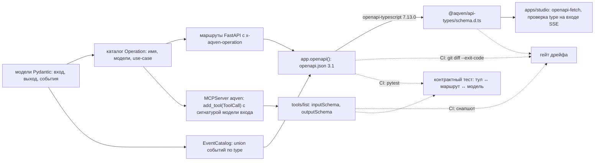

# ADR-0028. API локальной студии: FastAPI → OpenAPI → TypeScript, SSE, MCP на том же порту

> Статус: **частично изменено [ADR-0030](0030-local-browser-backend.md)** (2026-09-17)
> Дата: 2026-09-16
>
> ADR-0030 §3: сервер защищён токеном на запуск (Bearer, обмен `access_token` на cookie `HttpOnly; SameSite=Strict`), проверками `Host` и `Origin`; `/mcp/` принимает только Bearer; `TrustedHostMiddleware` больше не единственная защита. Открытый вопрос 7 сужается до состава каталога `aqven serve` и версии в пути, вопрос 8 закрыт мостом `aqven mcp` (ADR-0030 §4). Остальное в силе.
> Зависит от: [ADR-0017](0017-files-as-source-of-truth.md), [ADR-0024](0024-studio-on-vite.md), [ADR-0025](0025-python-engine.md), [ADR-0026](0026-yaml-spec-and-code-refs.md), [ADR-0008](0008-mcp-tool-naming-and-phasing.md)
> Заменяет: [ADR-0007](0007-single-operation-contract.md)
> Изменяет в части обоснования моков и SPA-фолбэка: [ADR-0024](0024-studio-on-vite.md)
> Меняет: [DECISIONS.md](../DECISIONS.md) — строки «Схемы» и «API» раздела «Ось версий», раздел «MCP-контракт»; [14. MCP-контракт](../14-mcp-contract.md) «Решения», §1 П1, §2.3, §3, §4.3, §5.4, §7, §9.2, §9.4; [15. Studio](../15-studio-frontend.md) «Решения», §4, §10.1; [20. Репозиторий](../20-repo-and-tooling.md) §1; [30. План фронтенда](../30-frontend-plan.md) — фаза Ф3, «Критерий перехода к бэкенду», «Ключевое решение по мокам»; [31. Редактирование канваса](../31-canvas-editing.md) «Решения», «Два канала записи», «Одновременность», «Изменения контракта»; [frontend/edit-contract.md](../frontend/edit-contract.md) «Решения», §1–§3; [frontend/mocks.md](../frontend/mocks.md) «Что проверяем прототипом», §1–§4, §7, §8, «Открытые вопросы к заказчику» п. 2; [playground/shell.md](../playground/shell.md) §2
> Исследование: [research/studio-api-inventory.md](../research/studio-api-inventory.md) §1, §2.7, §3; [research/py-stack-runtime.md](../research/py-stack-runtime.md) §6.3, §7–§8; нормативный контракт — [23. API локальной студии](../23-studio-api.md). Пробы выполнялись вне репозитория 2026-09-16 на CPython 3.14.7 (fastapi 0.141.1, starlette 1.6.0, mcp 2.2.0, pydantic 2.13.5, pyright 1.1.414, pytest 9.1.1, openapi-typescript 7.13.0, typescript 6.0.3, pnpm 10.33.0), результаты приведены в research/py-stack-runtime.md §7–§8 и в разделе «Проверка»; пробы research/studio-api-inventory.md §2.7 шли на CPython 3.12.4, их перепроверка на 3.14.7 — открытый вопрос 1 того же документа

## Контекст

[ADR-0007](0007-single-operation-contract.md) дал один контракт двум потребителям: агент вызывает операции
MCP-тулами, студия — по HTTP. Источником были zod-схемы `@aqven/contracts` (маршруты `@hono/zod-openapi`,
`inputSchema` через `z.toJSONSchema`, типы клиента), решающие факты — про TypeScript: `@voltagent/server-hono@2.0.14`
вендорит `@hono/zod-openapi`, `@modelcontextprotocol/sdk@1.30.0` принимает zod. [ADR-0025](0025-python-engine.md)
переносит движок на Python и уходит с VoltAgent: доводы ADR-0007 исчезают, требование «одна операция — одна
реализация» остаётся. Решения владельца от 2026-09-16 добавляют два условия: студия получает через API все данные
(схемы, входы и выходы, файлы, промты, прогоны; [23](../23-studio-api.md) «Зачем этот слой»), воркфлоу запускаются
по HTTP и MCP ([ADR-0025](0025-python-engine.md) §7).

Текущий TS-сервер `aqven dev` (hono 4.13.7) отдаёт 7 маршрутов под `/api` и общий SSE `GET /api/events` без `event:`,
`id:` и воспроизведения; OpenAPI нет, `apps/studio` его не вызывает; дефекты D1 (рендер итерации 0 цикла затирается
рендером уровня узла) и D3 (неизвестный `GET /api/*` → `200 text/html`) —
[research/studio-api-inventory.md](../research/studio-api-inventory.md) §1.1–§1.11. Словари записи в документах
расходятся: CAS, ключ идемпотентности, курсор канала изменений (там же §3, строки 1–2; сведение — §6). Python-стек
проверен запуском: FastAPI 0.141.1 и Pydantic 2.13.5 — [studio-api-inventory](../research/studio-api-inventory.md)
§2.7; SSE и openapi-typescript 7.13.0 — [py-stack-runtime](../research/py-stack-runtime.md) §6.3, §8; `mcp` 2.2.0 на
порту FastAPI — там же §7. Факты, которых в исследовании нет, ниже помечены «проверено» — это пробы 2026-09-16.

## Решение

Источник контракта — модели Pydantic в движке. Операция объявляется один раз в каталоге. FastAPI публикует её
маршруты в OpenAPI 3.1, `MCPServer("aqven")` на том же порту — тул с `inputSchema` и `outputSchema` из тех же
моделей, openapi-typescript 7.13.0 — типы `apps/studio`. Второй реализации операции нет: маршрут и тул вызывают
один use-case (Port/Adapter). Перечень ресурсов, событий и кодов нормативно задаёт [23](../23-studio-api.md);
этот ADR фиксирует механизм и правила.



### 1. Что берём

| Решение | Что берём | Версия | Лицензия | Почему |
|---|---|---|---|---|
| Модели контракта | `pydantic` | 2.13.5 | MIT | одна точка правды для тела и параметров запроса, `inputSchema` тула и типов студии; та же валидация, что в движке |
| HTTP и OpenAPI | `fastapi` без extras | 0.141.1 | MIT | `openapi: 3.1.0` из аннотаций маршрутов; `fastapi[standard]` тянет encode `httpx` ([ADR-0025](0025-python-engine.md) §1, §5) |
| ASGI-сервер | `uvicorn` | 0.53.0 | BSD-3-Clause | REST, SSE и MCP одним процессом ([py-stack-runtime](../research/py-stack-runtime.md) §9.6) |
| MCP | `mcp.server.MCPServer("aqven")`, streamable HTTP в `/mcp/` | 2.2.0 | MIT | тот же порт и те же модели; имя сервера и схема `aqven://` — [ADR-0025](0025-python-engine.md) §8, строка ADR-0008 |
| SSE | `fastapi.sse.EventSourceResponse` + `ServerSentEvent` | fastapi 0.141.1 | MIT | поля `event`, `id`, `retry`; `: ping` каждые 15 с простоя (`fastapi.sse._PING_INTERVAL`) |
| Типы событий | реестр `GET /api/schemas/events` → компоненты OpenAPI | — | — | генератор не типизирует поток (§4) |
| Типы клиента | `openapi-typescript`, генерация в CI, результат коммитится | 7.13.0 | MIT | `paths`, `operations`, `components` из `openapi.json`; peer `typescript@^5.x` — риск |
| Клиент студии | `openapi-fetch` | 0.17.0 | MIT | как в [15](../15-studio-frontend.md) §4.1; со спецификацией FastAPI не проверен (открытый вопрос 4) |
| Разбор SSE в студии | нативный `EventSource` или `eventsource-parser` | 4.1.0 ([15](../15-studio-frontend.md) §2; на 2026-09-16 последняя 4.1.1) | MIT | все каналы `GET` без заголовков авторизации ([23](../23-studio-api.md) §11) |

### 2. Каталог операций и два адаптера

Операция — запись `Operation[I, O]` (Registry): имя тула в форме [ADR-0008](0008-mcp-tool-naming-and-phasing.md),
описание, модели входа и выхода, поверхность, use-case. MCP-адаптер строится из записи. REST-маршруты пишутся явно:
раскладка полей по path, query и body и число маршрутов на операцию — решения REST-дизайна (`flow_get` отдают пять
маршрутов, `run_get` — два, [23](../23-studio-api.md) §13.2); связь маршрута с операцией — расширение
`x-aqven-operation`, полноту связи проверяет контрактный тест («Проверка», п. 3). Каталог отдаёт операции кортежем
`ToolRegistration` (Protocol: `name`, `surface`, `input_model`, `register_tool`), `build_mcp_server` регистрирует каждую.

```python
import inspect
from collections.abc import Awaitable, Callable
from dataclasses import dataclass
from typing import Annotated, Literal

from mcp.server import MCPServer
from mcp_types import CallToolResult, TextContent
from pydantic import BaseModel

type Surface = Literal["rest_and_mcp", "mcp_only"]


class DomainError(Exception):
    def __init__(self, error: ApiError) -> None:
        super().__init__(error.message)
        self.error = error


def tool_result(model: BaseModel, is_error: bool) -> CallToolResult:
    text = TextContent(type="text", text=model.model_dump_json())
    return CallToolResult(content=[text], structured_content=model.model_dump(mode="json"), is_error=is_error)


@dataclass(frozen=True, slots=True)
class ToolCall[I: BaseModel, O: BaseModel]:
    operation: Operation[I, O]

    @property
    def __name__(self) -> str:
        return self.operation.name

    @property
    def __signature__(self) -> inspect.Signature:
        returns = Annotated[CallToolResult, self.operation.output_model]
        return inspect.signature(self.operation.input_model).replace(return_annotation=returns)

    async def __call__(self, **arguments: object) -> CallToolResult:
        try:
            output = await self.operation.invoke(arguments)
        except DomainError as failure:
            return tool_result(failure.error, is_error=True)
        return tool_result(output, is_error=False)


@dataclass(frozen=True, slots=True)
class Operation[I: BaseModel, O: BaseModel]:
    name: str
    description: str
    input_model: type[I]
    output_model: type[O]
    surface: Surface
    use_case: Callable[[I], Awaitable[O]]

    async def invoke(self, arguments: dict[str, object]) -> O:
        return await self.use_case(self.input_model.model_validate(arguments))

    def register_tool(self, server: MCPServer) -> None:
        server.add_tool(ToolCall(self), name=self.name, description=self.description, structured_output=True)
```

Код — выдержка из модуля пробы; в модуле также `ApiError` (часть кодов и полей [23](../23-studio-api.md)
§12.4–§12.5), модели адреса, use-case `GetExecution`, `Catalog` и маршрут; результаты — «Проверка», п. 3, 5, 6.

Механика:

- `ToolCall` — Adapter операции к `MCPServer.add_tool`. `func_metadata` читает `inspect.signature(fn)`, поэтому
  `__signature__` отдаёт сигнатуру, которую Pydantic строит для модели входа, и SDK выводит из неё ту же схему;
  `__name__` нужен, потому что SDK называет модель аргументов `f"{fn.__name__}Arguments"`; `description` передаётся
  явно, иначе описанием станет `__doc__` класса (`Tool.from_function`). Аннотация `Annotated[CallToolResult, O]`
  публикует `outputSchema` модели `O` и позволяет вернуть ошибку: при `is_error` SDK не сверяет `structuredContent`
  со схемой выхода (`FuncMetadata.convert_result`).
- Маршрут FastAPI — второй Adapter над тем же `invoke`. У `run_get_node` `run_id` в path, остальное — query-модель
  `ExecutionQuery` (`extra="forbid"`), от которой наследуется `RunGetNodeInput`; обработчик с
  `operation_id="run_executions_detail"` и `openapi_extra={"x-aqven-operation": "run_get_node"}` принимает
  `query: Annotated[ExecutionQuery, Query()]` и вызывает `invoke({"run_id": run_id, **query.model_dump()})`.
- `Catalog` собирает фабрика `build_catalog` из портов (`ExecutionStore`); оба адаптера получают один экземпляр
  (внедрение через конструктор).

Правила:

1. Имя операции = имя тула = значение `x-aqven-operation` у каждого маршрута операции. `operationId` маршрута —
   уникальное snake_case имя маршрута; из него openapi-typescript строит `operations["..."]` (проверено).
2. У каждого маршрута ровно одно из расширений: `x-aqven-operation: <имя>` или `x-aqven-rest-only: <причина>`
   (перечень — [23](../23-studio-api.md) §13.3). Операция без маршрута объявляется в каталоге с `surface="mcp_only"`
   (`mode_set`, `studio_open`, [23](../23-studio-api.md) §13.2).
3. Поля маршрута (path, query, body) — подмножество полей модели входа операции; модели входа —
   `ConfigDict(extra="forbid")`.
4. Ответ чтения по REST — модель выхода без конверта; ответ записи в обоих каналах — `Envelope`
   ([14](../14-mcp-contract.md) §3, [23](../23-studio-api.md) §1.2). Где модель выхода у тулов чтения при конверте —
   открытый вопрос 1.
5. Ошибки — один транслятор `DomainError → ApiError`. REST: обработчики `DomainError` и `RequestValidationError`
   отдают `ApiError` с HTTP-кодом из таблицы [23](../23-studio-api.md) §12.5; роутер объявляет `responses` с моделью
   `ApiError` для 4xx, в документе это заменяет `HTTPValidationError` FastAPI (проверено), и `openapi-fetch` получает
   типизированную ошибку. MCP: `CallToolResult(is_error=True)` с `ApiError` в `structuredContent`.
6. Совместимость: префикс `/api` без номера мажора ([23](../23-studio-api.md) §1.1). Разрешено добавить необязательное
   поле запроса и новое поле ответа; сузить enum, сменить тип, удалить поле или сделать поле обязательным — ломающее
   изменение. Любое изменение контракта видно в диффе коммитнутых `openapi.json` и снапшота `tools/list`;
   автоматическое отличие ломающего изменения от добавляющего не выбрано — открытый вопрос 10.
7. JSON Schema строит Pydantic в режиме validation. Постпроцессор ADR-0007 (`io: "input"`, снятие
   `maximum: 9007199254740991`) не нужен: `int` с `ge=0` даёт `minimum: 0` без `maximum` (проверено). Инлайн `$defs`
   во `inputSchema` — открытый вопрос 3.
8. Контрактный тест и снапшот строят MCP-сервер из полного каталога, а не из текущей фазы раскрытия тулов (механизм
   фаз на `mcp` 2.2.0 — открытый вопрос 18 [ADR-0025](0025-python-engine.md)).

### 3. Процесс и порт

| Путь | Что | Правило |
|---|---|---|
| `/api/*` | роутеры FastAPI | неизвестный путь → 404 `ApiError`; FastAPI 0.141.1 по умолчанию отвечает `{"detail":"Not Found"}`, нужен свой обработчик ([23](../23-studio-api.md) §1.1) |
| `/api/openapi.json` | `FastAPI(openapi_url="/api/openapi.json", docs_url=None, redoc_url=None)` | в CI документ пишется вызовом `app.openapi()`, сервер не запускается |
| `/api/schemas/events` | роутер | `EventCatalog{spec[], run[], runs[], experiment[]}` (§4) |
| `/mcp/` | `MCPServer("aqven").streamable_http_app(streamable_http_path="/")` | lifespan FastAPI входит в `session_manager.run()`; путь без слеша стоит 307 на каждый запрос; в OpenAPI маунт не попадает |
| прочие `GET` | статика `apps/studio/dist` | `index.html` на путь вне `/api` и `/mcp/`; [ADR-0024](0024-studio-on-vite.md) «Проверка» исключала только `/api`, `/mcp/` добавляется, потому что MCP живёт на том же порту |

Приложение слушает `127.0.0.1`; `TrustedHostMiddleware` стоит на всём приложении, у `/mcp` ещё
`TransportSecuritySettings` ([23](../23-studio-api.md) «Решения»). `aqven dev` и `aqven serve` ([ADR-0026](0026-yaml-spec-and-code-refs.md))
собирают приложение из одного каталога; состав `aqven serve` и авторизация — открытый вопрос 7.

### 4. События: SSE и типы

1. Кадр — `ServerSentEvent(data=model, event=model.type, id=str(model.seq))` на маршруте с
   `response_class=EventSourceResponse`. Маршрут, отдающий модели, публикует `itemSchema` (ключ OpenAPI 3.2), но не
   пишет `id:`, без которого нет возобновления; `ServerSentEvent` пишет `id:` и `event:`, но схему `data` теряет
   (проверено); openapi-typescript 7.13.0 в обоих случаях даёт `"text/event-stream": unknown`.
2. Схемы событий — компоненты OpenAPI через ответ `GET /api/schemas/events`: каждое объединение
   `Annotated[A | B | ..., Field(discriminator="type")]` (в OpenAPI — `oneOf` + `discriminator`) — поле модели
   `EventCatalog`. openapi-typescript 7.13.0 выводит `EventCatalog["run"]` как union компонентов (проверено).
3. Студия берёт тип `components["schemas"]["EventCatalog"]["run"][number]`, разбирает `data` и принимает кадр, только
   если `type` входит в набор `satisfies Record<RunEventType, true>`; пропуск варианта — `TS1360` (проверено `tsc`
   6.0.3, фрагмент — [23](../23-studio-api.md) §2). Это граница доверия вместо `RunEvent.parse()` на zod
   ([15](../15-studio-frontend.md) §4.2); полной проверки кадра схемой нет, сервер отдаёт только модели Pydantic.
4. Возобновление: `id` = `seq`, браузер сам шлёт его в `Last-Event-ID` при переподключении (`ServerSentEvent.id` в
   `fastapi.sse`); первое подключение после снимка — `after_seq` = `last_seq` снимка; сервер отдаёт события строго после
   указанного `seq`. В run-канале `seq` идёт с 1 на прогон и хранится в потоке DBOS `run_events` прогона,
   `seq` = смещение + 1; своей таблицы событий нет ([ADR-0025](0025-python-engine.md) §9, [23](../23-studio-api.md) §11.4);
   в spec-канале монотонен на процесс, окно — [23](../23-studio-api.md) ОВ 5.
5. `sse-starlette` 3.4.11 приходит транзитивно от `mcp`; наши маршруты его не используют.
6. Все каналы — `GET`. Довод [15](../15-studio-frontend.md) §4.2 против нативного `EventSource` (канал VoltAgent был
   `POST` с заголовками) отпал.

### 5. Адрес исполнения

Адрес исполнения узла — структура `ExecutionAddress{node_id, branch_key: str | null, iteration: int ≥ 0 | null,
item_index: int ≥ 0 | null}` (поля и случаи — [23](../23-studio-api.md) §6.2). Строковая склейка адреса запрещена в
API, событиях и хранилище прогонов (исключение — строки топика и id дочернего workflow внутри адаптера DBOS, их выводит единый кодировщик и обратно не разбирает, [ADR-0025](0025-python-engine.md) §9): значение по умолчанию `0` вместо `null` и строка вместо структуры дали «итерации 0»
и «уровню узла» один ключ (дефект D1, [research/studio-api-inventory.md](../research/studio-api-inventory.md) §1.10).

| Правило | Как |
|---|---|
| Уровень узла и проход различимы | итог узла-цикла — `iteration: null`, проходы — `0..n`; элемент `map` — своё исполнение с `item_index` |
| Query-параметры | отсутствующий параметр — `null`, `iteration=0` — нулевая итерация (проверено на FastAPI 0.141.1); openapi-typescript генерирует `iteration?: number \| null`, студия `null` в query не передаёт, а опускает параметр |
| Попытка | не часть адреса, список внутри исполнения ([23](../23-studio-api.md) §6.2) |
| Хранилище | `app.run_nodes` ([16](../16-data-model.md) §2.8) адрес не выражает (`iteration NOT NULL DEFAULT 0`, нет `branch_key` и `item_index`) — правка при чистке ([23](../23-studio-api.md) ОВ 4) |

### 6. Запись: CAS и идемпотентность

Закон — [ADR-0017](0017-files-as-source-of-truth.md) и CLAUDE.md; к нему сводятся словари [14](../14-mcp-contract.md),
[15](../15-studio-frontend.md), [31](../31-canvas-editing.md), [frontend/edit-contract.md](../frontend/edit-contract.md).

| Что | В контракте | Не используем | Основание |
|---|---|---|---|
| CAS многофайловой правки | `expects[{path, file_hash \| null}]`, минимум 1 элемент; `null` — файла быть не должно | `base{commit, files[{path, sha256}]}` ([14](../14-mcp-contract.md) §2.3, §9.2), `If-Match` ([14](../14-mcp-contract.md) §9.4, [31](../31-canvas-editing.md)), `base_rev` ([15](../15-studio-frontend.md) §4.4), `base_blob` (DECISIONS) | [ADR-0017](0017-files-as-source-of-truth.md), [files-first/write-model.md](../files-first/write-model.md) §2, CLAUDE.md |
| Идемпотентность записи в файлы | `client_op_id` (ULID, обязателен); повтор возвращает первый результат (`app.write_intents`) | `idempotency_key` у `flow_patch` ([14](../14-mcp-contract.md) §2.3, §9.2; пример [files-first/write-model.md](../files-first/write-model.md) §2) | [31](../31-canvas-editing.md) «Решения», [16](../16-data-model.md) §2.3, [23](../23-studio-api.md) §12.1 |
| Хеш | строка `sha256-<64 hex>`; `file_hash` — байты файла | поля `sha256`, `blob`, `etag` в теле | [23](../23-studio-api.md) §1.2 |
| Конфликт | 412 `STALE_FILE`, `FILE_VANISHED`, `FILE_EXISTS` с `conflict{path, your_hash, current_hash, ops_since[], rebase, rebased_ops[]}`; клиент перечитывает файл и переигрывает намерение, силовой перезаписи нет | 409 на расхождение хеша | CLAUDE.md, [23](../23-studio-api.md) §12.4–§12.5 |
| События файлов | spec-канал: `seq` монотонен на процесс, `Last-Event-ID` = `seq`, `files_changed{changes[{path, change, file_hash_before, file_hash_after}]}` | `rev` и `spec_patched` ([frontend/edit-contract.md](../frontend/edit-contract.md) §3), `blob_before`/`blob_after` ([31](../31-canvas-editing.md)) | [23](../23-studio-api.md) §11.1 |
| Кэш чтения | `ETag` по хешам, `If-None-Match` → 304 | — | [23](../23-studio-api.md) §1.3 |
| Статусы прогона | `queued\|running\|suspended\|completed\|failed\|cancelled` | `ok\|error` (TS-сервер), `running\|suspended\|failed\|done` ([files-first/contract.md](../files-first/contract.md) §3) | [16](../16-data-model.md) §2.7 |

Остальные расхождения словарей (режимы прогона, статусы в [12](../12-observability.md), регистр кодов П5) сводятся
при чистке по [23](../23-studio-api.md) ОВ 9.

### 7. Что остаётся от ADR-0007

| Пункт ADR-0007 | Судьба | Как теперь |
|---|---|---|
| Один контракт на REST, MCP и клиент UI; второй реализации операции нет | сохраняется | каталог §2 |
| Источник — zod `@aqven/contracts`, маршруты `@hono/zod-openapi` 1.6.3, `app.doc31()` | заменён | pydantic 2.13.5 → fastapi 0.141.1 → `openapi: 3.1.0` |
| Правило 1: `operationId` = имя тула | заменено | `x-aqven-operation`: у тула может быть несколько маршрутов |
| Правило 2: префикс `/v1`, аддитивность внутри мажора | префикс заменён, аддитивность сохраняется | `/api`, §2 правило 6 |
| Положительное: `deprecated: true` из `createRoute` доходит до OpenAPI и описания тула | не перенесено | открытый вопрос 10 |
| Правила 3 и 4: `io: "input"`; без `.meta({ id })` на корне схемы тула | отпадают | поле с default у Pydantic не входит в `required`; корень схемы Pydantic — объект, `$defs` — открытый вопрос 3 |
| Правило 5: Server Actions для UI-состояния | уже заменено [ADR-0024](0024-studio-on-vite.md) | — |
| Правило 6: единый `ApiError`, один транслятор, `structuredContent` при `isError` | сохраняется | §2 правило 5 |
| Альтернативы: tRPC, GraphQL, MCP-схемы руками отдельно от HTTP отвергнуты | сохраняется | tRPC и GraphQL — «Альтернативы»; схему тула строит каталог §2 из модели входа |
| Альтернативы: Next Server Actions, `hono-openapi` 1.3.2 | отпадают | Next снят [ADR-0024](0024-studio-on-vite.md), Hono нет |
| Обязанности: коммитить `openapi.json` и `schema.d.ts`, дрейф — красный билд; объявлять ошибки схемой `ApiError` | сохраняются | `@aqven/api-types/schema.d.ts`; `responses` роутера |
| Обязанности: изоляция `@aqven/contracts`, свой `OpenAPIHono`, постпроцессор JSON Schema | отпадают | пакета и Hono нет |
| Проверка: равенство множеств `operationId` и тулов | заменена | контрактный тест «тул ↔ маршрут ↔ модель» |
| Проверка: дифф-гейт ломающих изменений внутри `/v1` | сохраняется как цель | инструмент — открытый вопрос 10 |
| Проверка: снапшот `z.toJSONSchema(input)` | заменена | снапшот `tools/list` |
| Проверки: изоляция пакета схем правилом линтера; совместимость zod 4 с вендорным слоем | отпадают | пакета `@aqven/contracts` и вендорного слоя нет |
| Kill-критерий: операция не выражается в OpenAPI 3.1 без потери нужного тулу | сохраняется | «Пересмотр» |

## Альтернативы

| Вариант | Почему отвергнут | Когда вернёмся |
|---|---|---|
| TS control plane на Hono (hono 4.13.8, `@hono/zod-openapi` 1.6.3, MIT) перед Python-движком | Второй серверный процесс и Node у каждого, кто запускает модуль через `aqven serve`, хотя модуль — Python-пакет. Контракт описывается дважды (zod и Pydantic) или проксируется без схемы; тул идёт в use-case через лишний сетевой переход. Довод ADR-0007 «Hono уже внутри VoltAgent» ушёл вместе с VoltAgent ([ADR-0025](0025-python-engine.md)) | движок снова на TypeScript |
| GraphQL (strawberry-graphql 0.327.7, MIT) | Операции командные (`flow_patch`, `run_start`), а не граф выборок; MCP-тулу нужна JSON Schema на операцию, GraphQL-схема — второй язык схем; поток событий — отдельный транспорт подписок | появится потребитель с произвольными выборками по графу данных |
| RPC с TS-типами по проводу в духе tRPC (`@trpc/server` 11.18.0, MIT, peer `typescript >=5.7.2`) | Требует сервер на TypeScript, то есть первый вариант; машиночитаемой схемы для MCP-тула нет | — |
| Рукописные TS-типы в студии | Два источника расходятся молча, дрейф ничем не ловится | никогда |
| WebSocket вместо SSE (uvicorn 0.53.0; `websockets` 17.1, BSD-3-Clause, уже в стеке транзитивно от dbos) | Каналы однонаправленные: сервер → студия, запись идёт REST. WebSocket-маршрут в OpenAPI не попадает (проверено), типы кадров пришлось бы вести отдельно; возобновление — свой протокол, у SSE это `id` и `Last-Event-ID` | студии понадобится двунаправленный поток |
| Тул с одним параметром-моделью `request: RunGetNodeInput` | `inputSchema` становится `{properties: {request: {$ref}}}` (проверено): аргументы вложены на уровень глубже плоских сигнатур [14](../14-mcp-contract.md) §2 и расходятся с полями REST | — |
| Подмена `parameters` тула через `MCPServer._tool_manager` | Приватный API SDK. Конструктор `MCPServer(tools=[...])` принимает готовые `Tool`, но SDK называет класс внутренним (docstring «Internal tool registration info» у `Tool` в `mcp.server.mcpserver.tools.base`), и `Tool` всё равно требует `FuncMetadata` | в `mcp` появится публичная регистрация тула с готовой моделью или JSON Schema |

## Последствия

**Положительные.**
- Операция добавляется в одном месте: модели и запись каталога; схема тула, OpenAPI и типы студии следуют.
- REST, MCP, вход прогона и движок валидируют одной моделью Pydantic; агент и человек получают один `ApiError`.
- `aqven dev` и `aqven serve` — один Python-процесс; Node в рантайме не нужен (в репозитории — для сборки студии и
  обёртки pyright, [ADR-0025](0025-python-engine.md) §2).
- Отрицательные пункты ADR-0007 уходят: типы zod v3 во вендорном слое `server-hono`, шумный `maximum` у целых.
- Итерация 0 и уровень узла различимы по контракту, а не по соглашению о строке.

**Отрицательные.**
- Студия не импортирует схемы: проверка кадра SSE на входе — дискриминатор, а не вся схема.
- Типы событий идут через реестр `GET /api/schemas/events`, а не из маршрута потока: обход, пока openapi-typescript не
  поддерживает `itemSchema` (PR #2683).
- openapi-typescript 7.13.0 объявляет peer `typescript@^5.x` при нашем 6.0.3: npm не ставит, pnpm предупреждает
  (issue #2723).
- MCP-адаптер опирается на то, что `func_metadata` читает `__signature__` через `inspect.signature` и берёт
  `__name__`: это наблюдаемое поведение `mcp` 2.2.0, а не документированный контракт SDK. Контрактный тест обязателен.
- Лишний аргумент тула тихо отбрасывается (REST на тот же параметр отвечает 422), ошибка валидации аргументов приходит
  текстом SDK без `structuredContent`, а не `ApiError` (`MCPServer._handle_call_tool`, проверено; открытый вопрос 2).
- Моки студии теряют общие с бэкендом маршруты (`createRoute` на `OpenAPIHono`): мок не валидирует запросы тем же
  кодом, что сервер. Источник моков — `openapi.json` и `schema.d.ts`.

**Обязаны делать.**
1. Каждая операция — одна запись каталога; use-case: модель входа → модель выхода; в адаптерах нет логики.
2. Каждый маршрут — явный `operation_id` и ровно одно из `x-aqven-operation`, `x-aqven-rest-only` в `openapi_extra`.
3. Модели входа — `extra="forbid"`; 4xx объявлены моделью `ApiError` на роутере; есть обработчики `DomainError`,
   `RequestValidationError` и 404 для неизвестного `/api/*`.
4. SSE — только `ServerSentEvent(data=model, event=model.type, id=str(model.seq))`; каждое объединение событий
   зарегистрировано в `EventCatalog`.
5. `openapi.json`, `@aqven/api-types/schema.d.ts` и снапшот `tools/list` коммитятся; CI регенерирует их и падает на
   `git diff --exit-code`.
6. В `apps/studio` нет рукописных типов ответов API и контрактных zod-схем; zod — только для схем UI (search-параметры,
   статические формы, [15](../15-studio-frontend.md) §2).
7. `fastapi` без extras ([ADR-0025](0025-python-engine.md) §5); `openapi-typescript` ставится через pnpm.
8. Строковые ключи адреса (`nodeId#branch`, `nodeId@iteration`) не появляются в API, событиях и хранилище; внутренние строки адаптера DBOS выводит только единый кодировщик ([ADR-0025](0025-python-engine.md) §9).

### Документы, которые становятся неверными

| Документ | Раздел | Что неверно | Чем заменяется |
|---|---|---|---|
| [DECISIONS.md](../DECISIONS.md) | «Ось версий», строки «Схемы», «API» | zod 4.6.2 как схемы домена; `Hono + @hono/zod-openapi 1.6.3 → openapi-typescript 7.13.0 + openapi-fetch` | pydantic 2.13.5; fastapi 0.141.1 → openapi-typescript 7.13.0 + openapi-fetch 0.17.0; zod только в студии |
| [DECISIONS.md](../DECISIONS.md) | «MCP-контракт» | конверт с `version{blob,etag}`, `flow_patch` с `base_blob`; фазовое раскрытие через `RegisteredTool.enable()/disable()`; имя сервера `volt` | `expects[{path, file_hash}]` и `client_op_id` (§6); механизм фаз — [ADR-0025](0025-python-engine.md) ОВ 18; имя `aqven` |
| [14](../14-mcp-contract.md) | «Решения»: «SDK сервера», «Схемы входа/выхода», «Локальный транспорт», «Удалённый транспорт», «Авторизация», «Токен агента», «Формат ошибки» | `@modelcontextprotocol/sdk` 1.30.0 и zod raw shape, stdio и `WebStandardStreamableHTTPServerTransport` из TS SDK, better-auth, `ApiError` из `@aqven/contracts` | `mcp` 2.2.0 `MCPServer`, модели Pydantic, `/mcp/` в FastAPI (§3), `ApiError` из движка; stdio и авторизация — открытые вопросы 7, 8 |
| [14](../14-mcp-contract.md) | §3 вступление | «`McpServer` сам валидирует `structuredContent` на выходе» | `MCPServer` 2.2.0 сверяет `structuredContent` со схемой выхода, кроме `is_error` (`FuncMetadata.convert_result`) |
| [14](../14-mcp-contract.md) | §3.1, §3.4, §4.3 | конверт и `Page` на zod; `server.registerTool(...)`; `Version{spec_id, commit, files[{path, sha256}]}` | модели Pydantic; `Operation.register_tool` через `ToolCall` с `CallToolResult`; `files[{path, file_hash}]` |
| [14](../14-mcp-contract.md) | §5.4 | `RegisteredTool.enable()/disable()` | механизм фаз на `mcp` 2.2.0 — [ADR-0025](0025-python-engine.md) ОВ 18, [23](../23-studio-api.md) ОВ 12 |
| [14](../14-mcp-contract.md) | §7.1–§7.3 | `npx -y @aqven/mcp-server`, TS-транспорт с `PgEventStore`, `mcpAuthMetadataRouter`, имя `volt` | `claude mcp add --transport http aqven http://127.0.0.1:5180/mcp/` ([23](../23-studio-api.md) §13.1); stdio и авторизация — открытые вопросы 7, 8 |
| [14](../14-mcp-contract.md) | §1 П1, §2.3, §9.2, §9.4 | `base{commit, files[]}`, `idempotency_key`, `PATCH /api/specs/:id` с `If-Match` | §6; `PATCH /api/flows/{flow_id}` ([23](../23-studio-api.md) §12.1) |
| [15](../15-studio-frontend.md) | «Решения», строки «Клиент API», «Стриминг прогона» | «контракт = OpenAPI 3.1 control plane»; «нативный `EventSource` — GET-only и без заголовков» | источник — FastAPI; все каналы `GET`, парсер выбирает студия |
| [15](../15-studio-frontend.md) | §4.1 | `@aqven/contracts`, `createRoute`, `app.doc31`, `z.toJSONSchema` → MCP | §2 этого ADR |
| [15](../15-studio-frontend.md) | §4.2–§4.3 | `POST /workflows/:id/stream`, WebSocket VoltAgent, `WorkflowStreamEvent`, `RunEvent.parse()`, `(executionId, seq)`, `GET /v1/runs/:id`, `@voltagent/resumable-streams` | run-канал [23](../23-studio-api.md) §11.2, §4 этого ADR |
| [15](../15-studio-frontend.md) | §4.4 | `flow_patch` с `base_rev`, откат по 409 | `expects` и 412 `STALE_FILE` (§6) |
| [15](../15-studio-frontend.md) | §10.1 | форма запуска и правка входа при реплее — статические формы на zod | схема входа известна только в рантайме: JSON Schema из `GET /api/flows/{flow_id}/schemas` |
| [20](../20-repo-and-tooling.md) | §1 | `apps/api` на Hono + `@hono/zod-openapi`, `packages/contracts` на zod, `mcp-server` на `@modelcontextprotocol/sdk`, `api-types` «из схемы `apps/api`», зависимость `apps/studio` от `@aqven/contracts` | модели контракта в Python-пакете движка; `@aqven/api-types` из `/api/openapi.json`; раскладка пакетов — при чистке 20 |
| [30](../30-frontend-plan.md) | фаза Ф3, «Критерий перехода к бэкенду» п. 3, «Ключевое решение по мокам» | схемы zod в `@aqven/contracts` пишутся раньше UI и бэкенда | раньше подключения студии пишутся модели Pydantic и коммитится `openapi.json` |
| [31](../31-canvas-editing.md) | «Решения», «Два канала записи»; «Одновременность», «Изменения контракта» | `PATCH /api/specs/:id` с `If-Match`; кадр `{seq, blob_before, blob_after, ...}`, `app.write_intents(... blob_before, blob_after ...)` | `PATCH /api/flows/{flow_id}` с `expects` ([23](../23-studio-api.md) §12.1); `file_hash_before`/`file_hash_after` ([23](../23-studio-api.md) §11.1) |
| [frontend/edit-contract.md](../frontend/edit-contract.md) | «Решения», §1–§3 | `PATCH /api/specs/:id` с `If-Match`; `rev`, `base_rev`, `spec_patched`, `Last-Event-ID` = `rev` | `expects`, `seq`, `files_changed` |
| [frontend/mocks.md](../frontend/mocks.md) | «Что проверяем прототипом», §1–§4, §7, §8, «Открытые вопросы к заказчику» п. 2 | «непроверенная точка ADR-0007»; `@aqven/mock-server` на `OpenAPIHono` + MSW; `@aqven/contracts`; `zocker` из zod-схем; кадры `WorkflowStreamEvent`; `base_rev` и 409, `idempotency_key`, дедупликация по `(executionId, seq)`; канал `POST /workflows/:id/stream` | моки типизируются из `schema.d.ts`; запись по §6; события по `(run_id, seq)`; инструмент — открытый вопрос 9 |
| [ADR-0024](0024-studio-on-vite.md) | «Последствия», последний пункт; «Проверка» | целевой слой моков `@aqven/mock-server` на `OpenAPIHono` + MSW, который [frontend/mocks.md](../frontend/mocks.md) §1 обосновывает общим с бэкендом `createRoute`; `index.html` для любого пути вне `/api` | порты и HTTP-адаптер остаются, источник моков — OpenAPI от FastAPI; `index.html` вне `/api` и `/mcp/` (§3) |
| [playground/shell.md](../playground/shell.md) | §2 | `GET /api/events`, `ServerEvent{t}`, строковые ключи рендеров | [23](../23-studio-api.md) §6, §11 |

## Проверка

| # | Что проверяем | Как | Статус на 2026-09-16 |
|---|---|---|---|
| 1 | Генерация OpenAPI | CI вызывает `app.openapi()`, пишет `openapi.json`, `git diff --exit-code`; в документе `openapi: 3.1.0` и `x-aqven-operation` на маршрутах | генерация и расширение проверены пробой; шаг CI — завести |
| 2 | Типы студии компилируются | pnpm + openapi-typescript 7.13.0 → `schema.d.ts` → `tsc` 6.0.3 `--strict --noEmit`; query с `iteration: 0` принимается типом `operations["run_executions_detail"]`; пропуск варианта события в `satisfies Record<RunEventType, true>` → `TS1360` | проверено пробой 2026-09-16; шаг CI — завести |
| 3 | У каждого тула есть REST-двойник или пометка MCP-only | pytest, четыре теста над полным каталогом: у маршрута из `app.openapi()` нет ровно одного из `x-aqven-operation`, `x-aqven-rest-only`; поле маршрута (параметры и свойства тела) вне модели входа; тул из `tools/list` (`mcp.Client` в процессе) без маршрута и без `mcp_only`; `inputSchema` ≠ `model_json_schema()` по `properties`, `required`, `$defs` | 4 теста проходят на pytest 9.1.1 (плагин anyio) над модулем пробы с `ToolCall`; мутации «тул без маршрута» и «лишний query-параметр» роняют нужный тест; pyright 1.1.414 strict без ошибок |
| 4 | Переподключение с `Last-Event-ID` отдаёт пропущенные события | (а) TestClient: `Last-Event-ID: 1` → только кадр `seq: 2`; (б) на настоящем журнале событий прогона: обрыв после `k`, переподключение → ровно `k+1..n` без дублей и пропусков ([23](../23-studio-api.md) §14, критерий 3); (в) Playwright: нативный `EventSource` после разрыва сам шлёт `Last-Event-ID` | (а) проверено пробой 2026-09-16 на фейковом источнике событий; (б), (в) — спайк |
| 5 | Один формат ошибки | REST: тело или query не по модели → 422 `ApiError{code: REQUEST_INVALID, problems[]}` (лишний параметр — `extra_forbidden`), у ответа 422 в OpenAPI схема `ApiError`; MCP: доменная ошибка → `isError: true`, `ApiError` в `structuredContent` | проверено пробой; аргументы тула не по схеме — текст SDK (открытый вопрос 2) |
| 6 | Адрес исполнения | REST `iteration=0` → `address.iteration == 0`, без параметра → `null`; исполнитель: цикл из трёх проходов → исполнения с `iteration` 0, 1, 2 и отдельное с `null` ([23](../23-studio-api.md) §14, критерий 2) | REST проверен пробой; исполнитель — спайк |
| 7 | MCP на том же порту | `mcp.Client("http://127.0.0.1:<port>/mcp/")` получает тулы со схемами входа и выхода, `call_tool` возвращает `structured_content` | проверено запуском под uvicorn 0.53.0 ([research/py-stack-runtime.md](../research/py-stack-runtime.md) §7) |

## Пересмотр

- openapi-typescript поддерживает TypeScript 6 (issue #2723) → снять риск peer; поддерживает `itemSchema` (PR #2683)
  → брать типы потока из маршрута и пересмотреть реестр `GET /api/schemas/events`.
- openapi-typescript не ставится на наших pnpm или TypeScript → другой генератор по тому же `openapi.json`; кандидат
  `@hey-api/openapi-ts` 0.99.0 (MIT, peer `typescript >=5.5.3 || >=6.0.0 || 6.0.1-rc`), не проверен.
- `mcp` 3.x: `FuncMetadata.call_fn_with_arg_validation` уже помечен `@deprecated` с удалением в 3.0. Любое изменение
  построения схемы из сигнатуры роняет контрактный тест → `ToolCall` переписывается; появится публичная регистрация
  тула с готовой моделью → переход на неё.
- FastAPI начинает писать `id:` при отдаче моделей из SSE-маршрута или меняет `fastapi.sse` → упростить кадр §4.
- Появляется потребитель вне loopback (`aqven serve` в сети) → версия в пути и авторизация отдельным ADR.
- Операцию нельзя выразить в OpenAPI 3.1 и JSON Schema тула без потери информации → пересматривается решение, а не обход.

## Открытые вопросы

1. **Конверт у тулов чтения.** [14](../14-mcp-contract.md) §3 требует `Envelope` у каждого тула, но поля для результата
   чтения в нём нет; каркас [23](../23-studio-api.md) §2 отдаёт из тула модель без конверта. *Что сделать:* прототип
   `Envelope[T]` на `mcp` 2.2.0 и FastAPI 0.141.1 (схема в `tools/list` и OpenAPI), итог — в [14](../14-mcp-contract.md) §3.1.
2. **Лишние и неверные аргументы тула.** `inputSchema` в `mcp` 2.2.0 без `additionalProperties: false`: лишний аргумент
   тихо отбрасывается, ошибка валидации приходит текстом SDK, а не `ApiError` с `REQUEST_INVALID`. *Что сделать:*
   проверить, доступны ли адаптеру сырые аргументы (`MCPServer._handle_call_tool` кладёт `input_params` в `Context`) и
   переводится ли ошибка в `ApiError` без приватного API; проверить Claude Code с `additionalProperties: false`.
3. **`$defs` и `$ref` во `inputSchema`.** Pydantic выносит вложенные модели в `$defs` (проверено на `ExecutionAddress`);
   ADR-0007 инлайнил `$defs`, потому что часть MCP-клиентов плохо разбирает `$ref`. Для Claude Code не проверено.
   *Что сделать:* живой вызов тула с вложенной моделью из Claude Code; при сбое — инлайн `$defs` в адаптере и в снапшоте.
4. **openapi-fetch 0.17.0 со спецификацией FastAPI не проверен**, как и сериализация `null` в query. *Что сделать:* в
   спайке собрать клиент студии на сгенерированных типах; проверить, что опущенный `iteration` не попадает в URL, а
   `null` не превращается в строку `"null"`.
5. **Peer `typescript@^5.x` у openapi-typescript 7.13.0.** *Что сделать:* следить за issue #2723; при переходе студии
   на TypeScript 7 или при строгой проверке peer в pnpm прогнать `@hey-api/openapi-ts` 0.99.0 на том же `openapi.json`
   с `tsc --strict`.
6. **Имя ключа идемпотентности вне записи файлов.** Закрыт для резюма решением владельца от 2026-09-16: поле API —
   обязательный `client_op_id`, как у записи файлов (§6); в DBOS он уходит параметром `idempotency_key` у `send`, наружу
   это имя не выходит ([23](../23-studio-api.md) §6.4, §6.8, §13.4; [ADR-0025](0025-python-engine.md) §9). Остаётся
   чистка: `idempotency_key?` у `run_resume` в [14](../14-mcp-contract.md) §2.5 и у `flow_patch` в §2.3, §9.2. *Что сделать:*
   при пересборке реестра 14 заменить его на `client_op_id`.
7. **`aqven serve`: состав, версия в пути, авторизация.** [14](../14-mcp-contract.md) §7.3 строился на better-auth и TS
   SDK; у конструктора `MCPServer` в `mcp` 2.2.0 есть `token_verifier` и `auth: AuthSettings`, поведение не проверено.
   *Что сделать:* отдельный ADR: подмножество каталога, префикс с мажором или без, механизм токена для REST и `/mcp/`
   (связан с [23](../23-studio-api.md) ОВ 14).
8. **stdio-вход для Claude Code** ([14](../14-mcp-contract.md) §7.1). `MCPServer.run(transport="stdio")` есть;
   совместимость с запуском DBOS и наблюдателем файлов в том же процессе не проверена. *Что сделать:* решить, нужен
   ли stdio при HTTP-входе `aqven dev`, и если нужен — проверить команду запуска.
9. **Инструмент моков студии.** Кандидат `openapi-msw` 2.0.0 (MIT, peer `msw ^2.10.5`, последнее изменение в npm
   2025-08-14) не проверен. *Что сделать:* при чистке [frontend/mocks.md](../frontend/mocks.md) собрать мок одного
   экрана на `schema.d.ts` и выбрать инструмент.
10. **Гейт совместимости и устаревание операций.** `git diff --exit-code` ловит дрейф генерации, но не отличает
    добавленное необязательное поле от сужения enum, а ADR-0007 требовал именно классификацию. Маршрут FastAPI
    принимает `deprecated` (`APIRouter.get`), у `MCPServer.add_tool` такого параметра нет. *Что сделать:* выбрать и
    проверить на `openapi: 3.1.0` от FastAPI 0.141.1 сравнение `openapi.json` с базовой веткой по правилу 6 §2 и ту же
    проверку для снапшота `tools/list`; решить, где в `Operation` живёт признак устаревания и как он попадает в
    `description` тула.
