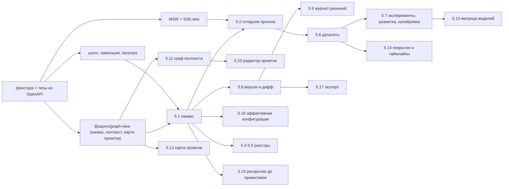

# Слой валидации: как прототип доказывает, что мы строим тот продукт

> Охват: все 18 экранов 15-studio-frontend.md §5, но как процесс проверки, а не как экраны.
> Приоритет кластера: P0 — это гейт перед реализацией ядра доверия.

## 1. Гипотезы продукта

Каждая формулируется так, чтобы её можно было убить. «Убито» — тоже результат прототипа.

| # | Утверждение | Критерий проверки | Где проверяется | Что значит «убито» |
|---|---|---|---|---|
| H1 | Человек понимает, что сделал агент, за 30 с и без чтения диффа IR | На экране версий по паре `v12..v15` испытуемый вслух называет суть правки и её обоснование, не открывая JSON-панель | `SemanticDiffTree` + журнал | нужен не дифф, а нарратив изменения — переделываем 5.8 в «сводку правки» |
| H2 | Провенанс поля отвечает на «почему так» без похода в код | Для 5 случайных полей `agent_effective_config` источник (`default→agent→node→run`) называется правильно за ≤10 с | 5.16 | цепочка переопределений непонятна — нужен явный лог применения, а не hover |
| H3 | Непокрытая потребность контекста видна раньше, чем компилятор её назовёт | На графе контекста испытуемый находит все 3 непокрытые потребности за ≤20 с без фильтров | 5.11 | визуальная кодировка не работает — заменяем граф списком проблем |
| H4 | Один канвас закрывает и чтение, и отладку прогона | 80% шагов сценария «прогон упал → виновный узел» проходят без ухода с канваса | 5.1 + 5.2 | канвас — витрина, а отладка живёт в таблице; расщепляем экраны |
| H5 | Отладчик даёт виновный узел быстрее, чем ручной перебор водопада | `run_blame` названный виновник совпадает с выбором человека в ≥4 из 5 кейсов | 5.2 | blame не доверяют — фича уходит из P0 ядра |
| H6 | Правка промта без прогона всего воркфлоу — достаточный цикл итерации | Испытуемый делает ≥3 итерации промта подряд, ни разу не запросив полный прогон | 5.10 | предпросмотр на фикстуре неубедителен — нужен дешёвый частичный прогон в ядре |
| H7 | Порядок «контекст до текста» (этапы 2–3 перед 5) выдерживается сам, без запрета | В сквозняке испытуемый не пытается писать шаблон до привязки источников | 5.11 → 5.10 | порядок приходится принуждать компилятором и UI-блокировкой |
| H8 | Решение о выпуске принимается по доказательствам, а не по «зелёному» | Перед аппрувом испытуемый открывает `EvidencePanel` и называет хотя бы одно доказательство | 5.8 | гейт вырождается в кнопку — доказательства надо ставить перед кнопкой, а не рядом |
| H9 | Матрица моделей меняет решение о модели | В ≥1 из 3 кейсов выбор модели после просмотра фронта Парето отличается от выбора до | 5.13 | экран декоративен — уходит в P2 |
| H10 | Разметка 30 примеров хоткеями быстрее 10 минут и не выматывает | Медиана на пример ≤12 с, отказов от продолжения нет | 5.7 очередь | очередь разметки не масштабируется руками — нужен только судья+калибровка |
| H11 | Единая поверхность операций (UI = агент) не мешает человеку | Ни один шаг сценария не требует операции вне реестра 14-mcp-contract §2 | сквозняк | находки списываются в «недостающие операции» и меняют контракт, а не UI |
| H12 | 18 экранов — не 18, а 6 нужных | По итогам сквозняка ≥5 экранов ни разу не открыты по своей воле | шелл, телеметрия кликов | режем карту экранов до фактически использованных перед реализацией бэкенда |

## 2. Фазы прототипа

Одна фикстура на все три фазы: один воркфлоу «разбор входящей заявки» — 14 узлов, 2 подворкфлоу,
1 цикл с судьёй, 3 непокрытые потребности контекста, 2 прогона (один упавший), 2 версии, 1 эксперимент.

### Ф1. Клик-прототип — статика, один сценарий сквозняком (3–5 дней)

| | |
|---|---|
| Делаем | 7 экранов P0 на захардкоженном JSON: шелл, канвас (read-only, §6.5), отладчик (снимок без стрима), граф контекста, редактор промтов (без диагностики), версии+дифф, журнал. Навигация между ними — реальная, по URL |
| Не делаем | zustand-документ, SSE, ELK в воркере (раскладка предпосчитана и лежит в фикстуре), виртуализацию, формы, любые мутации |
| Выходной критерий | испытуемый проходит этапы 0→7 сквозного сценария §5 PRD, ни разу не спросив «а что тут» и не упершись в тупик навигации; H1, H3, H7, H12 получают первый вердикт |

### Ф2. Интерактив на моках — состояния, стриминг, ошибки (2–3 недели)

| | |
|---|---|
| Делаем | MSW поверх клиента из OpenAPI; SSE-мок прогона с реальным темпом и обрывом на 40% ; `flow_patch` с оптимистичной блокировкой и синтетическим конфликтом `base_rev`; все пять состояний каждого экрана (пусто/загрузка/ошибка/деградация/нет прав); ELK в воркере; виртуализация таблиц; вторая «рука» — скрипт, который дёргает те же моки «как агент», чтобы человек видел чужие правки |
| Не делаем | настоящий компилятор (диагностика промтов — заранее записанные ответы на 5 фикстур), настоящие эмбеддинги и RAG, настоящие модели, аутентификацию, мультипользовательскую синхронизацию |
| Выходной критерий | все спайки §4 пройдены по своим порогам; H2, H4, H5, H6, H8, H10 получили вердикт; список недостающих операций закрыт — контракт §2 либо покрывает сценарий, либо дополнен |

### Ф3. Подключение к бэкенду (по готовности ядра, не раньше гейта §3)

| | |
|---|---|
| Делаем | замена MSW на реальный транспорт по тому же OpenAPI; SSE вместо мок-стрима; поочерёдно по группам операций — `flow`, `run`, `eval`, `version` |
| Не делаем | правку UI под неудобства бэкенда: расхождение фикстуры и реального ответа — дефект контракта, а не экрана |
| Выходной критерий | сквозняк §5 PRD на реальном ядре без единого мока; фикстуры Ф2 остаются как контрактные тесты фронта |

## 3. Гейт «поняли, что строим»

Переход к реализации ядра доверия открыт, когда **все** пункты верны. Каждый проверяется фактом, не мнением.

| # | Условие | Как подтверждается |
|---|---|---|
| G1 | Сквозной сценарий §5 PRD (этапы 0–13) проходится на моках целиком, без «здесь бы ещё экран» | запись прохода, список пауз >30 с пуст |
| G2 | Из 12 гипотез ≥9 имеют вердикт (подтверждена/убита), и ни одна убитая не требует переписывать больше одного экрана | таблица §1 заполнена колонкой «вердикт» |
| G3 | Карта экранов сокращена: зафиксирован список экранов, которые реально открывались, остальные помечены P2 | обновлённый §5 15-studio-frontend.md |
| G4 | Ни один экран не требует операции вне реестра §2 14-mcp-contract — либо реестр дополнен и число тулов пересчитано с учётом лимита 25 одновременно включённых (§5.5) | дифф 14-mcp-contract.md |
| G5 | Форма ответа (конверт §3: `problems[]`, `candidates[]`, `focus`, `version`) хватает UI без дополнительных полей — или дополнена один раз | список правок схемы конверта закрыт |
| G6 | Все спайки §4 зелёные либо имеют принятый обходной путь | таблица §4 с измеренными числами |
| G7 | Человек различает «это сделал агент» и «это сделал я» на каждом экране, где есть правки | H1 подтверждена + провенанс автора в журнале и на диффе |
| G8 | Оценка объёма ядра под подтверждённые экраны сделана и укладывается в бюджет | оценка в 21-roadmap.md |

Провал G1 или G4 — прототип продолжается. Провал только G3 или G8 — гейт открывается с урезанным охватом.

## 4. Спайки UI-рисков

Каждый — отдельная страница `/spike/*`, живёт вне продуктового кода, меряется на целевой машине
в продовой сборке, Chrome, 6× CPU throttling. Порог — не «чтобы работало», а «чтобы не мешало думать».

| Риск | Спайк | Метрика | Порог | Если не взлетает |
|---|---|---|---|---|
| Канвас на 200 узлов | 200 `StageNode` c портами, пан+зум 10 с | медиана FPS пана; p95 времени кадра | ≥50 FPS, p95 ≤20 мс | включаем `onlyRenderVisibleElements` и LOD (§6.4) раньше порога 150 |
| ELK на вложенных компонентах в воркере | 200 узлов, 3 уровня вложенности, `layered` | время раскладки в воркере; блокировка main-thread | ≤800 мс; main-thread не заблокирован >16 мс | предпосчёт раскладки на сервере, клиент только инкремент |
| Стрим сотен событий | SSE-мок, 500 событий за 20 с в водопад и `StreamTail` | дропнутые кадры; рост heap за прогон | 0 дропов при батчинге по rAF; heap ≤+50 МБ | буфер+коалесценция дельт, водопад обновляется по таймеру 250 мс |
| Таблица 10k строк | датасет 10k, сортировка+фильтр | время до первого кадра; FPS скролла | ≤300 мс; ≥55 FPS | серверная пагинация вместо клиентской, отказ от клиентской сортировки |
| Двойная виртуализация матрицы покрытия | 2000 кейсов × 120 колонок | FPS диагонального скролла | ≥50 FPS | схлопывание колонок в группы, drill-down вместо полной матрицы |
| Редактор промта с диагностикой | CodeMirror, шаблон 400 строк, 60 декораций слотов, ввод 5 симв/с | задержка ввод→кадр | ≤50 мс | диагностика по debounce 400 мс, декорации только во вьюпорте |
| Дифф больших спек | `jsondiffpatch` на IR ~3 МБ, свой рендер дерева | время delta; время первого кадра дерева | ≤500 мс; ≤400 мс | delta на сервере, клиент получает готовое дерево |
| Хоткеи в плотном UI | 4 scope одновременно (канвас, редактор, очередь, палитра) | число ложных срабатываний на 50 нажатий | 0 | scopes жёстко по маршруту, а не по фокусу |

## 5. Что мы узнаем только от бэкенда

Честный список: на моках эти вопросы получают ответ-выдумку, и относиться к нему как к сигналу нельзя.

| Вопрос | Почему мок не отвечает | Когда узнаем |
|---|---|---|
| Сколько реально ждать компиляции и прогона | темп стрима в моке выбран нами; терпимость к ожиданию проверяется только на честной латентности | Ф3, группа `flow`+`run` |
| Достаточно ли `problems[]` для объяснения ошибки | тексты проблем в фикстуре написаны под экран, а не компилятором | Ф3, первый реальный `flow_compile` |
| Сходятся ли `run_blame` с интуицией на настоящих падениях | в фикстуре виновник заранее известен и подсвечен | Ф3, ≥20 реальных прогонов |
| Не разъезжается ли документ при параллельной правке человеком и агентом | конфликт `base_rev` в Ф2 синтетический, один | Ф3 + реальная MCP-сессия Claude |
| Реальный объём IR и диффа | 3 МБ в спайке — оценка, а не замер | Ф3, первый большой воркфлоу |
| Работают ли пороги калибровки судей (kappa ≥ 0.7, alpha ≥ 0.8) | считаются на сервере, в моке это константы | Ф3, группа `eval` |
| Живёт ли `ui_url` из конверта как способ агента позвать человека | требует настоящей MCP-сессии и elicitation | Ф3 + `studio_open` вживую |
| Стоимость и бюджет прогона | цены и токены в фикстуре выдуманы | Ф3, реальные провайдеры |

## 6. Порядок работ

Критический путь Ф1: фикстура → шелл → graph-view → канвас → отладчик → дифф. Параллельно и без
блокировок: реестры (5.3–5.5), журнал (5.9), экспорт (5.17). Матрица моделей (5.13) и покрытие (5.14)
делаются последними — они проверяют H9 и не нужны для сквозняка.

## 7. Как измеряем на одном пользователе

Пользователь один и он же автор продукта — статистики не будет. Значит меряем не «сколько людей»,
а «сколько раз повторилось» и «что человек сделал руками вопреки замыслу».

| Считаем сигналом | Считаем шумом |
|---|---|
| Пауза >30 с перед действием — экран не отвечает на свой вопрос | единичная опечатка или промах мышью |
| Возврат на тот же экран ≥3 раз за проход — информация не там, где нужна | возврат по навигации в первые 10 минут знакомства |
| Обход UI: человек лезет в JSON-панель/консоль/файл, чтобы ответить на вопрос экрана | использование JSON-панели как справки после того, как ответ уже получен |
| Вопрос «а что это значит» о названии, повторённый на втором проходе | тот же вопрос на первом проходе |
| Экран, ни разу не открытый по своей воле за 3 прохода | экран, не открытый в одном проходе |
| Ручное действие, которое человек делает одинаково ≥3 раз — кандидат в операцию | разовая ручная правка |
| Отказ от фичи вслух с обоснованием («blame я всё равно перепроверяю») | оценка «красиво/некрасиво» |

Процедура: 3 прохода сквозняка с интервалом ≥1 день (борьба с эффектом «я только что это сделал»),
запись экрана + думать вслух, фиксация по таблице выше сразу после прохода. Третий проход — на
изменённой фикстуре (другой воркфлоу, другое падение), иначе меряется память, а не понятность.

## 8. Находки: операции, которых нет в реестре 14-mcp-contract §2

Экран, которому нужна операция вне 57, — дефект контракта. Каждая строка требует решения ДО Ф3,
с оглядкой на лимит 25 одновременно включённых тулов (§5.5): часть закрывается параметром существующего тула.

| Нужна экрану | Предлагаемая операция | Чем закрыть дешевле |
|---|---|---|
| 5.18 шелл: список воркфлоу | `flow_list` | новый тул, группа `flow`, фаза `core` |
| 5.18 шелл, 5.2: список прогонов | `run_list` | новый тул, группа `run`, фаза `core` |
| 5.6: список датасетов | `dataset_list` | `kind` в `catalog_list` |
| 5.7: выбор пары экспериментов | `experiment_list` | `kind` в `catalog_list` |
| 5.6: назначить сплит train/dev/test строкам | `dataset_set_split` | новый тул, группа `eval` |
| 5.7: отправить вердикт разметки | `feedback_submit` | новый тул, группа `eval`; `feedback_list` только читает |
| 5.7: матрица согласия и дрейф судей | `judge_calibration` | новый тул, группа `eval`, фаза `evaluate` |
| 5.8: дифф двух версий спеки | `version_diff` | `run_diff` диффит прогоны, не ревизии IR |
| 5.8: список версий для рейла и lineage | `version_list` | новый тул, группа `version` |
| 5.8: откат версии | `version_rollback` | человеческая операция; допустимо оставить только в UI |
| 5.3: «кто сломается, если изменить поле» | `registry_impact` | новый тул, группа `registry` |
| 5.5: дрейф `pinned` ↔ `live` схемы тула и перезакрепление | `tool_schema_drift`, `tool_repin` | новый тул, группа `registry` |
| 5.10: рендер шаблона на фикстуре + диагностика | `prompt_render` | сейчас HTTP к компилятору мимо MCP — агент теряет ту же возможность |
| 5.12: граф «фрагмент → шаблон → узел» | `prompt_map` | проекция `flow_get` с `view='prompt_map'` |
| 5.2: точки останова и заморозка прогона | `run_breakpoint` | новый тул, группа `run`, фаза `debug` |

## 9. Чего в прототипе НЕ будет

| Отложено | Почему | Когда вернём |
|---|---|---|
| Правка на канвасе (drag, протяжка связи) | спека: фаза 0 — только просмотр и отладка (§6.5); проверяем понимание, а не редактирование | фаза 3 продукта |
| Аутентификация и роли | пользователь один; «нет прав» рисуем состоянием, а не системой | Ф3, вместе с §19 |
| Реальные модели и деньги | стоимость прогона нельзя проверить моком (§5) | Ф3 |
| Мультипользовательская синхронизация | второй «пользователь» — агент, его правки эмулирует скрипт | после гейта |
| Мобильная и планшетная раскладка | инструмент клавиатурный, десктопный | не вернём в v1 |
| ECharts, lasso-выделение на матрице моделей | триггер — подтверждённая H9, а не желание | после H9 |
| Тёмная/светлая тема как выбор | токены есть, переключатель не проверяет гипотез | Ф3 |
| Формы из JSON Schema (RJSF, §10) кроме одной — правки агента | формы дороги и не отвечают ни на одну гипотезу | Ф2, только если H2 потребует |

## 10. Открытые вопросы к заказчику

1. Гейт §3 — блокирующий или советующий? Если бэкенд начинают писать параллельно Ф2, критерии G3/G8 теряют смысл, и §1 надо резать до 6 гипотез про понятность.
2. Кто испытуемый на 3 проходах? Автор продукта знает ответы заранее — это потолок валидности. Нужен ли второй инженер хотя бы на один проход, и есть ли он.
3. Правка на канвасе действительно ждёт фазы 3? H4 и H6 проверяются слабее, если весь прототип read-only: часть «понимания» рождается только при попытке изменить.
4. Недостающие операции §8 — дополняем реестр сейчас (растёт поверхность агента, упирается в лимит 25) или фиксируем как «только UI» и сознательно ломаем принцип «UI вызывает те же операции»?
5. Какой воркфлоу берём фикстурой? Нужен реальный, а не выдуманный: на выдуманном H3, H5 и H12 дают ложный ответ.
