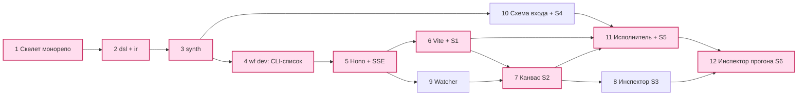

# Плейграунд: порядок работ

Срез 3. План от пустого репозитория до работающей дебаг-панели: шесть дней по два полудня. Опора —
рабочий код пробы (`dsl.ts`, `flow.ts`, `synth.ts`) и шесть экранов из `scope.md`. Версии — `npm view` 2026-09-14.

## 1. Шаги по полдня

| # | Полдня | Делаем | На выходе | Проверка | Объём |
|---|---|---|---|---|---|
| 1 | Д1-а | Скелет монорепо: pnpm workspaces + `catalog:`, turbo 2.10.12, `tsconfig.base.json`, Biome, vitest 5.0.0 | Пустые `packages/*` собираются | `pnpm -w build && pnpm -w test` зелёные на нуле тестов | 8 файлов конфигов |
| 2 | Д1-б | `@wf/dsl`: перенос `dsl.ts` пробы дословно + `@wf/ir` с zod-схемой IR | Фабрики `tool/llm/code/call/map/branch/loop/human`, `defineFlow` | `tsc --noEmit` на `hotel_pitch.flow.ts` без ошибок; негативные фикстуры из `probe-dsl/neg` падают | ~60 + ~120 строк |
| 3 | Д2-а | `@wf/synth`: `synth(flow): { ir, diagnostics }` — чистая функция из `synth.ts` пробы | IR без побочных эффектов, диагностики вместо `throw` | Golden-тест: `synth(hotel_pitch)` байт-в-байт равен `probe-dsl/ir.json` | ~90 строк |
| 4 | Д2-б | `@wf/cli`: bin `wf`, команда `wf dev`, скан `**/*.flow.ts`, загрузка через jiti 2.7.0, печать таблицы | **Первый работающий результат** (§3) | `wf dev --once` печатает 1 строку `hotel_pitch v7 OK 9 nodes`; битый файл — строку `FAIL` с путём и строкой | ~110 строк |
| 5 | Д3-а | Сервер: Hono 4.13.7 + `@hono/node-server` 2.1.1 внутри `wf dev`. `GET /api/flows`, `GET /api/flows/:id`, `GET /api/events` (SSE) | Те же данные, что печатал CLI, по HTTP | `curl localhost:4000/api/flows \| jq '.[0].nodes \| length'` → 9 | ~80 строк |
| 6 | Д3-б | `apps/playground`: Vite 8.3.0 + React 19.3.0 + TanStack Router 1.170.36. Экран S1 | Список воркфлоу в браузере, вердикт синтеза, путь к файлу | Открыть `localhost:4000`, увидеть `hotel_pitch`, кликнуть — пустой `/flow/hotel_pitch` | ~120 строк |
| 7 | Д4-а | `@wf/graph-algos` (рёбра из лексических ссылок, топосорт) + `@wf/graph-view` (`@xyflow/react` 12.11.6, elkjs 0.12.0). Экран S2 | Канвас: 9 узлов, рёбра, раскрытие `call`/`map` | Ребро `$in.hotels[*]` внутри `pitch_gen` не теряется; `render` достижим из `load_hotels` | ~160 строк |
| 8 | Д4-б | Экран S3: панель узла — `kind`, `description`, слоты входа со ссылкой-источником, `outputContract`, бюджет, «открыть в файле». Полоса ошибок синтеза | Инспектор статики | Клик по `pitches` показывает `component: diverge`, слот `hotels ← $top3.out`; кнопка открывает `flow.ts:57` | ~130 строк |
| 9 | Д5-а | Watcher: chokidar 5.0.0 → повторный синтез → SSE → перерисовка канваса | Правка файла видна без F5 | Поменять `version: 7` на `8` — шапка меняется за <1 с; синтаксическая ошибка даёт полосу, а не белый экран | ~70 строк |
| 10 | Д5-б | JSON Schema входного типа (`ts-json-schema-generator` 2.9.0) + экран S4: форма по схеме, пресеты из `examples/` | Запуск без ручного JSON | Форма для `TourRequest` даёт поля `filters.city`, `filters.nights`, `budget`; пресет заполняет их | ~120 строк |
| 11 | Д6-а | Исполнитель-заглушка: топосорт IR, моки `llm`/`tool`, события в SQLite (drizzle-orm 0.45.2 + better-sqlite3 13.0.3). Экран S5 | Статусы узлов на канвасе, потраченный бюджет | `wf dev` → Запустить → 9 узлов из `running` в `ok`; прогон остаётся в списке после перезапуска процесса | ~180 строк |
| 12 | Д6-б | Экран S6: вход с провенансом до узла-источника, отрендеренный промт, ответ мока, ошибка. Чек-лист §6 | Тройка «промт + вход + выход» | Узел `score` показывает вход `$item` со ссылкой на `load_hotels`, текст промта и мок-ответ | ~140 строк |

## 2. Критический путь

Критический путь — 1→2→3→4→5→6→7→11→12, девять полудней. Шаги 8, 9, 10 параллельны и откладываются
без вреда. Риск один — шаг 3: всё после него читает IR, поэтому golden-тест ставится до любого UI.

## 3. Первый работающий результат

**`wf dev --once` печатает список воркфлоу из настоящего каталога** — конец шага 4, второй день.

Почему именно он:

- Он проходит весь путь чтения целиком: скан каталога → загрузка `.flow.ts` → синтез → IR → вывод.
  Всё дальнейшее — только разные отрисовки этого же результата. Если список верен, верны и данные
  канваса, и данные инспектора.
- Он сразу даёт честный ответ на вопрос «файлы или фикстуры»: строка в выводе появляется только
  потому, что в каталоге лежит настоящий файл. Подменить это моком нельзя.
- Он же контракт экрана S1. К шагу 6 UI получает готовый и проверенный JSON, а не изобретает форму.
- Он даёт негативный сценарий бесплатно: битый файл — строка `FAIL` с путём и строкой, и это та же
  диагностика, что потом ляжет в полосу над канвасом.

Ориентир вывода — `hotel_pitch v7 OK 9 nodes 1 component src/flows/hotel_pitch.flow.ts`.

## 4. Пакеты монорепо

Из дерева `20-repo-and-tooling.md` на этом этапе появляются восемь позиций. Правило именования и
правило зависимостей (L0 не знает про L1+) сохраняются полностью.

| Пакет | Слой | Что внутри сейчас | Зависимости |
|---|---|---|---|
| `@wf/ir` | L0 | zod 4.6.5-схема IR: `nodes`, `components`, `input`/`output`, `budget`, `policies`, `defaults`; branded `NodeId`/`FlowName` | `zod` |
| `@wf/dsl` | L0 | `dsl.ts` пробы: `Ref`-прокси, `NODE`/`REF`, фабрики узлов, `defineFlow`, `defineComponent`, `$const`, `root` | нет |
| `@wf/synth` | L1 | `loadFlowFile(path)` через jiti, `synth(flow)` → `{ ir, diagnostics }`, резолв ссылок в пути `$node.path` | `@wf/dsl`, `@wf/ir`, `jiti` |
| `@wf/graph-algos` | L1 | рёбра из лексических ссылок, топосорт, достижимость, раскрытие `call`/`map` в подграф | `@wf/ir` |
| `@wf/db` | L2 | drizzle-схема двух таблиц — `runs` и `run_events`; миграции drizzle-kit 0.31.10; файл `.wf/playground.sqlite` | `drizzle-orm`, `better-sqlite3` |
| `@wf/graph-view` | L3 | канвас на `@xyflow/react`, раскладка elkjs, узлы по `kind`, оверлей статусов прогона | `@xyflow/react`, `elkjs`, `@wf/ir` |
| `@wf/cli` | L3 | bin `wf`, единственная команда `dev` (флаги `--port`, `--once`), скан каталога, поднятие Hono | `@wf/synth`, `@wf/db`, `commander` |
| `apps/playground` | L3 | Vite-SPA: два маршрута — `/` и `/flow/[id]`; панели S3/S6 внутри второго | `@wf/graph-view`, `react`, `@tanstack/react-router` |

Не появляются: `@wf/compiler`, `@wf/prompts`, `@wf/registries`, `@wf/runtime-volt`, `@wf/llm`,
`@wf/tools`, `@wf/store`, `@wf/index`, `@wf/blob`, `@wf/queue`, `@wf/trace`, `@wf/evals`,
`@wf/export`, `@wf/conformance`, `@wf/mcp-server`, `@wf/sdk`, `@wf/api-types`, `apps/api`, `apps/worker`,
`apps/studio`. `@wf/db` здесь на SQLite, а не на pg — осознанное отклонение от `20-repo-and-tooling.md`.

## 5. Что берём из пробы как есть

Перенос без правок:

- `probe-dsl/src/dsl.ts` (54 строки) → `packages/dsl/src/index.ts`. Работает, типизирован, покрыт
  негативными фикстурами. Менять только импорт `.js` → точки входа пакета.
- `probe-dsl/src/types.ts` → `examples/hotel-pitch/types.ts`. Это пример пользовательского кода, не
  библиотека; в пакет не уезжает.
- `probe-dsl/src/flow.ts` → `examples/hotel-pitch/hotel_pitch.flow.ts`. Это тот самый настоящий файл,
  который `wf dev` находит в каталоге на шаге 4.
- `probe-dsl/ir.json` → `packages/synth/test/golden/hotel_pitch.ir.json`. Эталон шага 3.
- `probe-dsl/neg/*` → негативные фикстуры `@wf/dsl`: каждая должна давать ошибку компиляции.

Переписывается `probe-dsl/src/synth.ts` (52 строки), причины конкретные:

- модуль исполняется при импорте и печатает в `stdout` — нужна функция, возвращающая значение;
- `const ids = new Map()` и `const comps = [...]` — модульные глобалы, второй воркфлоу в том же
  процессе их затрёт; всё состояние уходит в замыкание одного вызова;
- `throw new Error("unregistered node")` убивает весь синтез из-за одной битой ссылки — вместо
  этого накапливаем `{ code, nodeId, slot, file, line }` и отдаём частичный IR с полосой ошибок;
- `import flow from "./flow.js"` жёстко зашит — путь становится аргументом, загрузка идёт через jiti.

Выбрасывается целиком: `bench/`, `cm.mjs`, `cm2.mjs`, `p1..p5`, `t1.mjs`, `t7.mjs`, `gen.mjs`,
`fmt.mjs`, `run.mjs`, `src-ref/`, `src-str/`, `slice3/`, `ir2..ir4.json`, `dist/`. Это замеры и
черновики вариантов, они своё отработали.

## 6. Чек-лист готовности

1. `pnpm i && pnpm -w build` в чистом клоне проходит без ручных шагов.
2. `npx wf dev` в каталоге с `examples/hotel-pitch` поднимает порт 4000 и открывает браузер.
3. `curl :4000/api/flows | jq '.[0] | [.name,.version,(.nodes|length)]'` → `["hotel_pitch",7,9]`.
4. `synth(hotel_pitch)` равен golden-IR побайтово после канонизации ключей.
5. Удаление узла `top3` из `nodes` даёт диагностику `unregistered node` с путём и строкой, а не стек.
6. Битый файл даёт `FAIL` в S1 и полосу над канвасом; остальные воркфлоу продолжают открываться.
7. На канвасе 9 верхнеуровневых узлов; раскрытие `pitches` показывает узел `gen` компонента `pitch_gen`.
8. Ребро `$in.hotels[*].features[*].id` из `allowedSets` нарисовано, а не проглочено.
9. Правка `description` любого узла отражается на канвасе за <1 с без перезагрузки страницы.
10. Форма S4 строится из `TourRequest` и не принимает отправку с незаполненным `filters.city`.
11. Прогон записывает 9 событий в SQLite; после `Ctrl+C` и повторного `wf dev` прогон виден в списке.
12. S6 для `score` показывает разом вход со ссылкой на `$load_hotels.out`, текст промта и мок-ответ.
13. Ни один файл плейграунда не обращается к сети, кроме `localhost`.

## 7. Чего НЕ делать

| Соблазн | Почему нет |
|---|---|
| Правка графа мышью, кодмод из ADR-0018 | Решение заказчика №3. Кодмод — принятое решение на будущее, но в этот этап не входит |
| Next.js, SSR, RSC | Решение №1. Локальная панель без авторизации не окупает ни сборки, ни серверных компонентов |
| Postgres, Docker, pg-boss, RLS | Решение №2. Одна таблица прогонов и одна событий живут в SQLite-файле |
| Настоящие вызовы моделей «на попробовать» | Плейграунд должен быть детерминированным и бесплатным; моки на `llm`/`tool` — граница §5 `data.md` |
| Авторизация, пользователи, роли | Cube делает то же самое и прямо называет это dev-only; порт слушает `127.0.0.1` |
| Мок-фикстуры IR для ускорения UI | Главная ценность — что граф построен из настоящего файла; фикстура убивает смысл проверки |
| Реестры, версии, экспорт, evals, датасеты, лента агента | Явно вне среза; каждый тянет за собой пакет L2 и БД-схему |
| Универсальный executor «почти как рантайм» | На этом этапе нужен обход IR топосортом на ~180 строк, а не `@wf/runtime-volt` |
