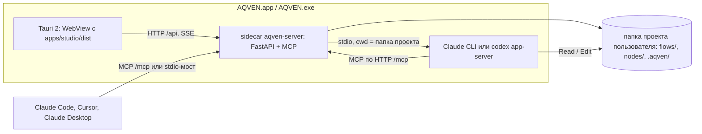

# Настольное приложение AQVEN и чат-агент через Claude и Codex

> Статус: предложение, не решение. До реализации нужен ADR.
> Решено [ADR-0030](../adr/0030-local-browser-backend.md) (2026-09-17): настольного приложения пока нет, Tauri, PyInstaller
> и sidecar отклонены — AQVEN работает в браузере из пакета `aqven` в окружении проекта; чат — только Claude через
> `claude-agent-sdk`, Codex и ACP не берём. §4–§5 о MCP и чате остаются доказательной базой.
> Дата: 2026-09-17. Версии и факты проверены в этот день: `npm view`, PyPI JSON, `gh api`, официальная документация,
> запуск кода на macOS arm64. Скрипты проверки были во временной папке сессии, результаты перенесены сюда.

## Зачем этот слой

Владелец хочет запускать Studio и Python-бэкенд как обычное приложение для macOS и Windows, без установки Node и Python.
Папку проекта пользователь выбирает сам. Внешние агенты (Claude, Codex, Cursor) подключаются к AQVEN по MCP. Внутри
Studio есть чат-агент, который работает через Claude или Codex, правит код проекта и пользуется MCP-тулами AQVEN.

## Решения

| Решение | Что берём | Версия | Лицензия | Почему |
|---|---|---|---|---|
| Оболочка приложения | Tauri 2 (`@tauri-apps/cli`) | 2.11.4 | Apache-2.0 OR MIT | Системный WebView вместо встроенного Chromium, документированный запуск бинарников-спутников (sidecar) |
| Бэкенд внутри приложения | PyInstaller, один бинарник на ОС | 6.22.3 | GPL-2.0-or-later с исключением для собранных программ | Поддерживает Python 3.14; Tauri прямо называет PyInstaller-серверы типичным sidecar |
| Хранилище прогонов | DBOS на SQLite | 2.31.1 | MIT | Уже решено в [ADR-0025](../adr/0025-python-engine.md): SQLite локально, Postgres в проде |
| Выбор папки проекта | `@tauri-apps/plugin-dialog` | 2.7.3 | MIT OR Apache-2.0 | Системный диалог выбора папки |
| Обновления | `@tauri-apps/plugin-updater` + `@tauri-apps/plugin-process`, сборка `tauri-action` | 2.11.0 / 2.3.1 / action-v1.0.0 | MIT OR Apache-2.0 | `latest.json` в GitHub Releases, релизы по git-тегу |
| MCP для внешних агентов | MCP на том же порту, что API | `mcp` 2.2.0 | MIT | Уже решено в [ADR-0028](../adr/0028-studio-api-contract.md) |
| Чат-агент Claude | `claude-agent-sdk` (Python) | 0.2.154, внутри CLI 2.1.274 | MIT (CLI — коммерческие условия Anthropic) | Работает без Node, проверено запуском |
| Чат-агент Codex | `codex app-server` из `@openai/codex` | 0.154.0 | Apache-2.0 | Нативный бинарник, JSON-RPC по stdio, проверено запуском |

## 1. Как устроено приложение



- Tauri открывает собранную Studio в системном WebView: WKWebView на macOS, WebView2 на Windows.
- `aqven-server` подключён через `externalBin` в `tauri.conf.json` с суффиксом целевой платформы в имени. Приложение
  запускает его при старте и останавливает при выходе.
- Бэкенд слушает `127.0.0.1` на постоянном порту: внешним MCP-клиентам нужен стабильный адрес.
- Моки MSW в приложение не попадают, Studio ходит в настоящий API.
- В репозитории добавляется папка `desktop/` с Tauri-проектом. Она собирает `apps/studio/dist` и бинарник бэкенда.

## 2. Папка проекта

- При первом запуске приложение просит выбрать папку проекта и запоминает список недавних.
- Бэкенд запускается с `--root <папка>`. Определения, промты и `.aqven/` лежат в проекте пользователя, как требует
  [ADR-0017](../adr/0017-files-as-source-of-truth.md).
- Смена проекта перезапускает sidecar с новым `--root`: один процесс работает с одним проектом.
- Чат-агент получает ту же папку как рабочую (`cwd`), внешние MCP-клиенты видят открытый проект.

## 3. Обновления через GitHub Releases

```
git tag vX.Y.Z → GitHub Actions, матрица macOS arm64 / macOS x64 / Windows
  1. сборка apps/studio → dist
  2. PyInstaller → aqven-server-<target-triple>
  3. tauri-action → установщики, подписи .sig, latest.json
  4. загрузка в GitHub Release

Приложение: check() → https://github.com/lastonoga/AQVEN/releases/latest/download/latest.json
           → downloadAndInstall() → relaunch()
```

- Репозиторий `lastonoga/AQVEN` публичный, поэтому приложение скачивает `latest.json` и установщики без токена.
- Studio, бэкенд и оболочка лежат в одном установщике и обновляются вместе, версии API и Studio не расходятся.
  Версия берётся из git-тега, CI проверяет совпадение с `tauri.conf.json` и `pyproject.toml`.
- `releases/latest` не видит pre-release: для бета-канала нужен отдельный `latest.json`.
- PyInstaller собирает только под ОС, на которой запущен, поэтому матрица CI обязательна.

Подписи двух видов:

| Подпись | Зачем | Что будет без неё |
|---|---|---|
| Ключ обновлений Tauri (`tauri signer generate`, секрет `TAURI_SIGNING_PRIVATE_KEY`) | Приложение проверяет, что обновление настоящее; отключить нельзя | Обновления не ставятся. Потеря ключа навсегда отрезает уже установленные копии |
| Подпись ОС: Apple Developer ID с нотаризацией, сертификат подписи Windows | Запуск без блокировок | macOS не запустит приложение, Windows покажет SmartScreen. Бинарник бэкенда тоже подписываем |

## 4. Подключение внешних агентов по MCP

| Клиент | Как подключить |
|---|---|
| Claude Code, Cursor и другие HTTP-клиенты | `claude mcp add --transport http aqven http://127.0.0.1:<порт>/mcp`, приложение должно быть запущено |
| Claude Desktop | Локальные серверы подключаются через stdio: кнопка «Подключить к Claude» дописывает запись в конфиг Claude Desktop, или приложение поставляется пакетом `.mcpb` (`@anthropic-ai/mcpb` 2.1.2) |

Команда stdio для Claude Desktop — тот же бинарник в режиме `aqven-server mcp`. Он пересылает вызовы запущенному
приложению, чтобы два процесса не писали в одну SQLite.

## 5. Чат-агент в Studio через Claude и Codex

Агентом владеет бэкенд. Studio показывает поток событий, одобрения и кнопку остановки. На бэкенде порт `AgentBackend`
с адаптером на каждого агента (Strategy):

| Путь | Как работает | Node | Проверка |
|---|---|---|---|
| **Claude: `claude-agent-sdk`** | `ClaudeSDKClient(options)`: `cwd`, `mcp_servers={"aqven": {"type": "http", "url": ...}}`, `can_use_tool` для одобрений, `interrupt()` | не нужен, CLI внутри колеса (91–104 MB) | ✅ |
| **Codex: `codex app-server`** | JSON-RPC по stdio: `initialize` → `thread/start {cwd, sandbox, approvalPolicy}` → `turn/start` → уведомления `item/*`, `turn/completed`; остановка `turn/interrupt` | не нужен, нативный бинарник | ✅, режим помечен `[experimental]` |
| ACP: `agent-client-protocol` 0.12.1 + адаптеры `claude-agent-acp` 0.78.0, `codex-acp` 1.12.0 | Один протокол на всех агентов: `initialize`, `session/new {cwd, mcpServers}`, `session/prompt`, `session/request_permission` | **нужен**, оба адаптера на JS (`dist/index.js`) | ✅ |

### 5.0. Вход: подписка на машине, без API-ключа

Требование владельца (2026-09-17): чат-агент работает через подписку пользователя на его машине, API-ключ не нужен.
Проверка запуском это подтверждает: Claude работал через вход Claude Code из связки ключей macOS, Codex — через вход
ChatGPT (`account/read` → `type: chatgpt`).

Условия Anthropic ([Legal and compliance](https://code.claude.com/docs/en/legal-and-compliance)):

| Разрешено | Запрещено |
|---|---|
| Запускать в своём продукте неизменённый Claude Code; каждый пользователь входит «with their own Anthropic API key, Claude subscription plan credentials» | Изменять бинарник или отключать встроенные способы входа |
| «an end user signing in to the unmodified Claude Code binary with their own Claude subscription» | «offer Claude.ai login into their own applications», то есть своя кнопка «Войти через Claude» |
| Расход списывается с подписки самого пользователя | «route requests through Free, Pro, or Max plan credentials on behalf of their users», платить за пользователя или перепродавать |
| | «collect, store, or intermediate Claude.ai credentials or session tokens»; вход — только «through Anthropic's own flow» |

Страница Agent SDK строже: «Unless previously approved, Anthropic does not allow third party developers to offer
claude.ai login or rate limits for their products, including agents built on the Claude Agent SDK». Лимиты Pro и Max
рассчитаны на «ordinary, individual usage of Claude Code and the Agent SDK».

Как делаем, чтобы уложиться в условия:
- Приложение не показывает свою кнопку входа, не читает и не хранит токены. Оно только проверяет, выполнен ли вход.
- Если входа нет, приложение просит пользователя войти в самом агенте: в Claude Code — `claude`, затем `/login`, в Codex —
  `codex login` или вход OpenAI, который запускает сам `app-server` (`account/login/start`).
- Запускаем неизменённый CLI. Надёжнее всего — установленный у пользователя `claude` (`cli_path` в SDK), а не копию из
  нашего установщика.
- Расход идёт с подписки пользователя, мы его не оплачиваем и не перепродаём.
- Название в интерфейсе — «Claude Agent», не «Claude Code».

Остаётся риск: мы строим продукт на Agent SDK, а его страница требует одобрения Anthropic для входа через claude.ai.
Для публичного распространения это нужно подтвердить у Anthropic. Для Codex OpenAI пишет, что `app-server` сделан
для «deep integration inside your own product», но явного правила про вход через ChatGPT в сторонних приложениях мы
не нашли.

Подписка покрывает только чат-агента. Узлы воркфлоу AQVEN вызывают модели напрямую через Pydantic AI
([ADR-0025](../adr/0025-python-engine.md)); OAuth-вход подписки Anthropic предназначен для Claude Code и собственных
приложений Anthropic, поэтому узлам нужны ключи провайдеров.

**Вывод:** для приложения без установок берём прямые пути Claude и Codex. ACP нужен, только если понадобятся ещё агенты
(например Gemini CLI) и мы готовы везти Node.

### 5.1. Что показала проверка запуском

Игрушечный MCP-сервер AQVEN по HTTP (`mcp` 2.2.0) с тулом `aqven_ping`, временная папка проекта, вход через
существующие подписки пользователя.

| Проверка | Claude | Codex | ACP |
|---|---|---|---|
| Рабочая папка | `cwd` проекта в `system/init` | `cwd` в ответе `thread/start` | передан в `session/new` |
| MCP по HTTP | `aqven: connected`, тул `mcp__aqven__aqven_ping` | `mcpServerStatus/list`: `connected` | адаптеры объявили `mcpCapabilities.http = true` |
| Вызов тула | через `can_use_tool`, результат `pong from AQVEN for hotel_pitch` | через запрос `mcpServer/elicitation/request` | через `session/request_permission` у Claude |
| Поток ответа | 26 событий, haiku, $0.0044, 3.2 s | дельты `item/agentMessage/delta` | Claude 10 s, Codex 38 s |
| Остановка | `interrupt()` за 0.8 s, процессов CLI не осталось | `turn/interrupt` → `status=interrupted` | не проверялась |

Имена тулов у агентов разные: `mcp__aqven__aqven_ping` у Claude, `mcp.aqven.aqven_ping` у Codex через ACP. Карточкам тулов
в Studio нужен нормализатор под каждый адаптер.

### 5.2. Агент пишет код проекта

Проверено на копии `lumen/support_case/case_form/code.py`. Задача: добавить в `INTENT_FIELDS` вид обращения `return`.
В корне проекта лежали правила (`CLAUDE.md`, `AGENTS.md`: без комментариев, после правки вызвать `aqven_check`) и
MCP-тул `aqven_check` (компиляция и запрет комментариев).

| | Claude (haiku) | Codex |
|---|---|---|
| Шаги | Read → Edit → `aqven_check` | shell-осмотр папки → правка файла → `aqven_check` |
| Одобрения | правка и вызов тула прошли через `can_use_tool`, текст правки виден до применения | вызов тула через `elicitation`; правка в `workspace-write` прошла без вопроса |
| Время и стоимость | 18 s, $0.026 | 62 s, подписка ChatGPT |
| Итог | корректный блок `"return"`, независимая проверка `OK` | такой же блок, проверка `OK` |

Знания агент берёт из файла правил проекта и из MCP-тулов. Оба агента пропустили настоящую ошибку: `"return"` нужно
добавить и в тип `CaseIntent`, а игрушечная проверка этого не ловит. Поэтому через MCP агенту нужно отдавать настоящие
`aqven check`, pyright и pytest.

Границы прав:
- Точечные правки кода и промтов агент делает своими инструментами (Edit, apply_patch).
- Структурные изменения идут только через MCP-операцию `flow_patch`, как требует CLAUDE.md репозитория. Это задаётся
  набором разрешённых тулов.
- Чтобы Codex спрашивал перед каждой правкой файла, нужен `approvalPolicy: "untrusted"` или песочница `read-only` с
  отдельным разрешением на запись.

### 5.3. События агента для чата

Оба агента отдают все шаги потоком. Проверено на задаче с правкой кода: у Claude 21 вид событий, у Codex 22.

| Что показать в чате | Claude (`claude-agent-sdk`) | Codex (`app-server`) | Часть сообщения assistant-ui |
|---|---|---|---|
| Ответ по мере набора | `StreamEvent` `text_delta` | `item/agentMessage/delta` | `text` |
| Рассуждения | `thinking_delta`, `ThinkingBlock` | `item/reasoning/summaryTextDelta` | `reasoning` |
| Вызов тула и его аргументы | `tool_use` + `input_json_delta`, затем `ToolResultBlock` | `item/started` / `item/completed` типа `mcpToolCall` (`server`, `tool`, `arguments`, `result`) | `tool-call` |
| Команда в терминале | тул `Bash` | `commandExecution`: `command`, `cwd`, `exitCode`, потоковый вывод `item/commandExecution/outputDelta` | `tool-call` с карточкой команды |
| Правка файла | тулы `Edit` / `Write` с `old_string` / `new_string` | `fileChange` с `diff` и общий дифф хода `turn/diff/updated` | `tool-call` с карточкой диффа |
| Запрос одобрения | колбэк `can_use_tool` | запросы сервера `item/commandExecution/requestApproval`, `item/fileChange/requestApproval`, `mcpServer/elicitation/request` | `tool-call` со статусом `requires-action` |
| Статус, токены, стоимость | `SystemMessage` `status` / `thinking_tokens`, `ResultMessage` (`total_cost_usd`, `usage`) | `thread/status/changed`, `thread/tokenUsage/updated`, `account/rateLimits/updated` | метаданные сообщения |

Текст рассуждений по умолчанию пустой: у Claude `thinking: ""` с подписью, у Codex `summary: []`. Его нужно явно
включить:
- Claude: `thinking={"type": "enabled", "budget_tokens": N, "display": "summarized"}` — приходит полный пересказ хода мысли.
- Codex: `summary: "detailed"` в `turn/start` — приходят короткие заголовки шагов («Calculating time addition result»).

AG-UI:
- Протокол подходит: `@assistant-ui/react-ag-ui` 0.0.59, Python-типы `ag-ui-protocol` 0.1.22, готовый Python-мост для
  Claude `ag-ui-claude-sdk` 0.1.5 с событиями рассуждений, тулов и прерыванием.
- Моста для Codex в `ag-ui-protocol/ag-ui/integrations` нет.
- По заметке от 2026-09-16 AG-UI runtime в assistant-ui отвечает на одобрения только после `RUN_FINISHED`, а оба агента
  ждут ответа, не завершая ход.

Поэтому предлагаем свой маленький журнал событий: нормализатор под каждого агента (Strategy) на бэкенде, SSE в браузер,
`useExternalStoreRuntime` в Studio.

### 5.4. Состояние проектов на GitHub

| Репозиторий | ★ | Открытых issues | Последний релиз |
|---|---|---|---|
| `anthropics/claude-agent-sdk-python` | 8.1k | 457 | v0.2.154, 2026-09-17 |
| `openai/codex` | 125k | 17.5k | rust-v0.154.0, 2026-09-09 |
| `agentclientprotocol/python-sdk` | 324 | 4 | 0.12.1, 2026-08-16 |
| `agentclientprotocol/claude-agent-acp` | 2.5k | 174 | v0.78.0, 2026-09-15 |
| `agentclientprotocol/codex-acp` | 383 | 118 | v1.12.0, 2026-09-15 |

Среди открытых issues `openai/codex` есть падения app-server, например
[#44315](https://github.com/openai/codex/issues/44315) на Windows.

## 6. Ограничения

| Ограничение | Что это значит |
|---|---|
| Вход через подписку | Разрешён при условиях из §5.0: неизменённый CLI, вход только через собственный поток Anthropic или OpenAI, приложение не трогает токены. Для публичного распространения на Agent SDK нужно подтверждение Anthropic |
| Встраивание Claude Code CLI в установщик | Предустановка Claude Code в продукте требует Commercial Terms и неизменённого бинарника. Проще использовать установленный у пользователя `claude` |
| Изоляция от настроек пользователя | Claude изолируется опциями SDK (`setting_sources=[]`, `strict_mcp_config=True`). Codex подхватил глобальные MCP-серверы и skills пользователя, а `-c mcp_servers=...` дополнил конфиг, а не заменил. Свой `CODEX_HOME` у приложения изолирует настройки, но пользователю придётся один раз войти в Codex заново через поток OpenAI |
| Вес установщика | Около 100 MB за встроенный Claude CLI плюс бинарник Codex |

## Открытые вопросы

1. Какие агенты нужны с первого дня: Claude, Codex или оба. Закрыть: решение владельца.
2. Встраиваем CLI агентов в установщик или используем установленные у пользователя. Закрыть: решение владельца и
   проверка условий распространения Claude Code CLI.
3. Подтверждает ли Anthropic вход через подписку для продукта на Agent SDK, который запускает неизменённый Claude Code
   без своей кнопки входа. Закрыть: запрос в Anthropic (contact sales) до публичного распространения; для собственного
   использования условий §5.0 достаточно.
4. Есть ли у OpenAI правила для сторонних приложений, которые используют вход ChatGPT через `codex app-server`.
   Закрыть: найти условия OpenAI или спросить OpenAI.
5. Работает ли Web Speech API (диктовка в чате) в WKWebView и WebView2. Закрыть: запустить Studio в Tauri на обеих ОС;
   если нет — распознавание через бэкенд за тем же `chatBackend.dictation()`.
6. ADR на настольное приложение: `desktop/`, sidecar, папка проекта, обновления, MCP-мост, `AgentBackend`. Закрыть:
   написать ADR и обновить [20. Репозиторий](../20-repo-and-tooling.md).
