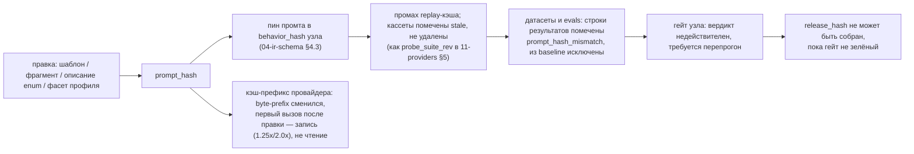

# Модель зависимостей промта

> Вопрос среза: от чего ровно зависит собранный промт и что обязано произойти при изменении каждой зависимости.

## Что нашли

| Факт | Источник |
|---|---|
| Bazel: герметичность = «те же объявленные входы → тот же выход»; неявная зависимость на хост ломает её; таймстемпы и build-id — классический ломатель | [bazel.build/basics/hermeticity](https://bazel.build/basics/hermeticity) |
| Bazel: две сущности кэша — Action Cache (`/ac/<sha256>`: хеш действия → метаданные результата) и CAS (`/cas/<sha256>`: байты выходов). Дайджест действия считается от объявленных входов, имён выходов, командной строки и переменных окружения, **но только тех, что явно внесены в whitelist через `--action_env`** | [bazel.build/remote/caching](https://bazel.build/remote/caching) |
| Nx: в хеш задачи входят файлы проекта **и файлы зависимостей**, конфиг воркспейса, версии внешних зависимостей, runtime-значения (ОС, архитектура), аргументы CLI ([how-caching-works](https://nx.dev/concepts/how-caching-works)); входы типизированы — fileset (с исключениями `!`), `{json, fields/excludeFields}` (часть файла!), `{env}`, `{runtime: "node --version"}`, `{externalDependencies}`, `{dependentTasksOutputFiles, transitive}`. Префикс `^` = «тот же именованный вход, но у зависимостей» | [nx.dev/reference/inputs](https://nx.dev/reference/inputs) |
| Turborepo: **два** хеша — глобальный (корневой `turbo.json`, лок-файл, `globalDependencies`, значения `globalEnv`, флаги, меняющие поведение) и хеш задачи (её `turbo.json`, её `package.json`, срез лок-файла, файлы пакета по `inputs`). Смена глобального — промах у всех задач | [turborepo.dev/docs/.../caching](https://turborepo.dev/docs/crafting-your-repository/caching) |
| React: массив зависимостей сравнивается по `Object.is` (объекты — по ссылке), обязан быть исчерпывающим, **статической длины и записанным на месте**; при этом React «may throw away the cached value» — семантической гарантии `useMemo` не даёт | [react.dev/reference/react/useMemo](https://react.dev/reference/react/useMemo) |
| RSC: рендерятся заранее (build time или request time) в отдельной среде, на клиент уходит **только сериализованный результат**; код, тяжёлые библиотеки и секреты в бандл не попадают | [react.dev/reference/rsc/server-components](https://react.dev/reference/rsc/server-components) |

## 1. Полный список входов компиляции

Класс влияния: **T** — текст; **M** — структура сообщений и кэш-метки; **V** — только валидация и грамматика; **D** — данные прогона, в хеш не входят.

| Вход | Класс | Читается на | Входит в |
|---|---|---|---|
| `body` шаблона (байты), `lang` записи | T,M | компиляции | `prompt_hash` |
| фрагменты ``, транзитивно | T,M | компиляции | `prompt_hash` через замыкание |
| `in:` — список слотов и их `TypeRef.view(...)` | T,V | компиляции | `prompt_hash` |
| **состав полей view** (порядок, имена, типы) | T,V | компиляции | `prompt_hash` (фасет типа) |
| **описания полей и значений enum** из реестра | T | компиляции, §6.1 п.4 | `prompt_hash` (фасет типа) |
| `out:` тип выхода + его выходной view | T,V | компиляции | `prompt_hash` |
| профиль схемы провайдера (ADR-0004) | T,V | компиляции `output_format` | `prompt_hash` (фасет профиля) |
| few-shot `examples` статический / из ретривера | T,M / D | компиляции / прогона | `prompt_hash` / — (динамический снимает `cache: system+examples`) |
| `cache: none\|system\|system+examples` | M | компиляции | `prompt_hash` |
| `cache_min_tokens`, `cache_max_breakpoints`, `cache_style` профиля модели | M | рендера | `prompt_hash` (фасет профиля) |
| провайдерские обязательные фразы (слово «JSON» для `json_object`, фраза Qwen, prefill/форс тула Anthropic) | T,M | рендера | `prompt_hash` (фасет профиля) |
| `verified_caps` из `model_capability_probes` (`probe_suite_rev`) | V,M | выбора профиля | `global_hash` + пин профиля |
| политики видимости узла (R-T10), `archetype` | V | компиляции | `global_hash`, влияет через диагностику |
| `run.date`, `tz`, `locale` пользователя | D | рендера | **никогда** (R-T13 запрещает их в кэш-префиксе) |
| значения слотов | D | рендера | — |
| версия liquidjs, версия эмиттера, `rules_rev`, версия токенизатора | T,M | компиляции | `global_hash` |

Неочевидны три строки. **Описание значения enum — полноценный вход класса T**: §6.1 п.4 льёт его в
текст, правка описания = новый промт. **`run.date` — данные, не зависимость**: иначе `prompt_hash`
менялся бы ежедневно и кассеты жили бы сутки — ровно тот «таймстемп», что Bazel зовёт ломателем
герметичности. **В хеш входит фасет профиля, а не профиль целиком** — иначе правка цены или лимита
RPM инвалидирует все промты; дословно `--action_env` whitelist Bazel и `{json, fields}` Nx.

## 2. `prompt_hash`: состав и цепочка инвалидации

Предлагаем два уровня, как у Turborepo, и ровно по той же причине — разная гранулярность промаха.

```
global_hash  = H('aqven/prompt-global/v1', {liquidjs_version, emitter_rev, rules_rev,
                 tokenizer_rev, schema_profile_rev, probe_suite_rev})
type_facet   = H('aqven/type-facet/v1', {используемые поля view: имя, тип, description,
                 значения enum с расшифровками, ограничения; порядок — из IR, не сортируется})
profile_facet= H('aqven/profile-facet/v1', {schema_profile, cache_style, cache_min_tokens,
                 cache_max_breakpoints, json_mode_word_required, prefill_supported,
                 tool_choice_forcing, required_phrases[]})
prompt_hash  = H('aqven/prompt/v1', {global_hash, template_bytes, lang, cache_mode, profile_facet,
                 fragments: [{ref, version, bytes_hash}] в порядке включения, examples_hash,
                 slots: [{name, type_ref, type_facet}], out: {type_ref, type_facet}, output_format_bytes})
```

`output_format_bytes` включаем целиком, хотя он выводим из тройки (тип, профиль, язык): дешёвая
страховка от расхождения эмиттера, совпадает с кэшем §6.1 п.6. Не входят: `description` записи,
`unused:`, метаданные владельца, координаты диагностик.

`prompt_hash` — хеш **артефакта компиляции**; `render_hash = H(prompt_hash, canonical(slot_values))` —
хеш отрисовки. Первый инвалидирует кассеты, второй — ключ одной записи в кассете. Смешивать нельзя:
с `run.date` внутри `prompt_hash` после полуночи не было бы ни одного попадания в replay.

**Цепочка при смене `prompt_hash`** — каждая стрелка обязана быть реализована, иначе система тихо
врёт зелёными прогонами на устаревших кассетах:



Отсюда правило: **кассету и результат eval при смене хеша не удаляем, а помечаем**. Удаление ломает
сравнение «до/после», ради которого оптимизация промтов (§10, GEPA) существует. Модель та же, что у
`model_capability_probes`.

## 3. Что прямо применимо из систем сборки

| Механизм | Где | Как ложится на нас |
|---|---|---|
| Разделение global/task hash | Turborepo | `global_hash` (версия движка, эмиттера, правил, проб) против `prompt_hash`. Смена движка = перекомпиляция всего; правка фрагмента = только его потребители |
| Whitelist переменных окружения в дайджесте | Bazel `--action_env` | `profile_facet`: явный список полей профиля, влияющих на промт. Всё остальное в профиле (цена, лимиты, теги) не инвалидирует ничего |
| Частичный вход по полям файла | Nx `{json, fields}` | `type_facet` берёт только используемые view-поля и их описания, а не файл типа целиком |
| `^` — вход зависимостей | Nx | замыкание фрагментов и типов: хеш зависимости входит в хеш потребителя, транзитивно (`idx.refs.depth > 1`) |
| Герметичность: таймстемп ломает кэш | Bazel | R-T13 — герметичность, выраженная правилом компиляции: «системный слот в кэшируемом сообщении» ровно об этом |
| Remote cache | все трое | replay-кэш и кассеты общие на проект; ключ — контент, не путь, поэтому переименование промта не теряет историю |

Чего у них нет: у Bazel и Nx выход детерминирован, у нас вероятностный. Промах кэша у них — «пересчитать»,
у нас — «заплатить и получить другой ответ». Ложный промах дороже по деньгам, ложное попадание — по
корректности, поэтому хеш обязан быть **консервативным**: лучше лишняя перекомпиляция, чем зелёный
гейт на устаревшей кассете.

## 4. React как аналогия: что берём и что нет

| Из React | Вердикт | Почему |
|---|---|---|
| Композиция и `props` как контракт | **берём** | уже есть: `in:` — типизированная сигнатура, фрагменты — переиспользуемые узлы |
| Exhaustive deps + «массив статической длины, записан на месте» | **берём как закон** | R-T1/R-T2 — буквально exhaustive-deps (разность множеств «объявлено»/«использовано»); у нас сильнее: зависимости выводятся из AST, а не пишутся рукой, и разойтись не могут |
| RSC: рендер заранее, наружу — только результат; секреты не покидают сервер | **берём как метафору** | компиляция/рендер разнесены так же; R-T10 — это «`use client` наоборот» |
| Сравнение зависимостей по `Object.is` (ссылочная идентичность) | **отвергаем** | нам нужна контент-адресация: два одинаковых по содержанию фрагмента обязаны дать один хеш. Ссылочное равенство даёт ложные промахи, а после сериализации — ложные попадания |
| Рантайм-реконсиляция, дерево пересобирается на каждый рендер | **отвергаем** | у нас всё, что зависит не от данных, обязано быть посчитано **до** прогона. Рантайм-пересборка убивает byte-prefix стабильность, от которой зависит кэш OpenAI |
| «React may throw away the cached value» — кэш без семантической гарантии | **отвергаем категорически** | у нас кассета — инструмент воспроизводимости и конформанса, а не оптимизация. Право молча выбросить запись ломает критерий 1:1 |
| Скрытые перерисовки от родителя, автомемоизация компилятором | **отвергаем** | нам нужен явный, читаемый человеком ответ «почему промт пересобрался». Неявная инвалидация — это ровно то, за что React-приложения отлаживают неделями |

Итог: **аналогия полезна как язык описания (композиция, props, границы) и вредна как модель
исполнения.** Честный аналог задачи — не `useMemo`, а Bazel с типизированными входами. Заказчику
говорим прямо: из «формата React» берём декларативную композицию с явными входами, но не реконсиляцию.

## 5. Гранулярность: множество затронутых по `idx.refs`

Правка описания значения enum обязана перекомпилировать всё, где это значение попадает в текст.
Считается одним рекурсивным запросом по обратному индексу (`refs_reverse_idx`, 16-data-model §2.4–2.5):

```sql
WITH RECURSIVE hit(src_kind, src_key, src_path, depth) AS (
  SELECT src_kind, src_key, src_path, 1 FROM idx.refs
   WHERE tenant_id = $1 AND project_id = $2
     AND dst_kind = 'type' AND dst_key = $3 AND dst_value = $4
     AND usage_kind IN ('template_text','template_case','switch_branch','dataset_row','judge_rubric')
  UNION
  SELECT r.src_kind, r.src_key, r.src_path, h.depth + 1 FROM idx.refs r JOIN hit h
    ON r.dst_kind = h.src_kind AND r.dst_key = h.src_key
   WHERE r.tenant_id = $1 AND r.project_id = $2 AND h.depth < 8)
SELECT * FROM hit;
```

Первый шаг даёт прямых потребителей, рекурсия поднимает их по цепочке `фрагмент → промт → узел →
воркфлоу`. `dst_value` — ключ, отличающий «изменился тип» от «изменилось одно значение»; без него
гранулярность падает до типа целиком. Для фрагмента стартовая ветка та же с `dst_kind='fragment'`.
Индекс отвечает только «кто затронут»; `prompt_hash` и вердикт PASS/WARN/BLOCK даёт компилятор,
**перечитав эти файлы**, — выводимость `idx.*` не нарушается.

## 6. Что показывать человеку

Экран правки показывает «затронуто» **до** сохранения, на препросмотре diff. Числа — из запроса выше, агрегированного по `src_kind`:

| Строка в UI | Источник числа |
|---|---|
| «7 промтов в 3 воркфлоу» | `count(distinct src_key) filter (where src_kind='prompt')`; воркфлоу — подъём рекурсии до `src_kind='workflow'` |
| «4 датасета требуют перепрогона» | те же `hit` ∩ `usage_kind='dataset_row'`, плюс датасеты, привязанные к затронутым узлам |
| «12 кассет устареют» | `count` по кассетам с `behavior_hash`, содержащим старые пины затронутых узлов |
| «2 узла потеряют вердикт гейта», «+340 токенов к префиксу, порог 1024» | зелёные гейты на старом `behavior_hash`; пересчёт `upperBound` против `cache_min_tokens` фасета |

Каждое число — ссылка на список, элемент списка — на файл и строку (`ref_path`, `line` уже в `idx.refs`).
«Что сломает изменение» без возможности ткнуть в строку бесполезно.

## Вывод для нас

1. **Берём двухуровневый хеш** (`global_hash` + `prompt_hash`) и **фасеты** (`type_facet`,
   `profile_facet`) — это единственный способ не перекомпилировать весь проект от правки цены модели
   и одновременно перекомпилировать 7 промтов от правки одного описания enum.
2. **Проектируем `prompt_hash` по формуле §2**, отдельно от `render_hash`. `run.date`, `tz` и значения
   слотов — данные, не зависимости; R-T13 повышаем из правила кэша до правила герметичности.
3. **Достраиваем цепочку §2 целиком**: пин → `behavior_hash` → replay → кассеты → датасеты → гейт →
   `release_hash`. Кассеты и результаты evals при смене хеша **помечаем, не удаляем**.
4. **Не берём из React ничего исполняемого.** Аналогия остаётся в языке описания; реализация —
   контент-адресуемый граф в духе Bazel/Nx, где зависимости выводятся из AST, а не объявляются рукой.
5. **Открытое**: класть ли `prompt_hash` в атрибуты спана и в `PromptContent.metadata` (UNVERIFIED,
   сверить с полями VoltAgent); порог, после которого «затронуто N промтов» становится BLOCK.
