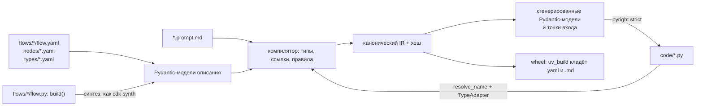

# Исследование: описание как код

> Дата: 2026-09-16
> Для: [ADR-0026](../adr/0026-yaml-spec-and-code-refs.md), [ADR-0027](../adr/0027-dynamic-io-shapes.md)
> Метод: запуск в изолированных venv (dspy 3.3.1, pydantic-ai-slim 2.43.0, pydantic 2.13.5), чтение исходников
> установленных пакетов с указанием модуля и символа, официальная документация, PyPI JSON, `gh api`. Пробы выполнялись
> вне репозитория 2026-09-16 на CPython 3.12.4, а [ADR-0025](../adr/0025-python-engine.md) §1 фиксирует 3.14 (повтор
> на 3.14.7 — открытый вопрос 2). Результаты приведены в этом документе, файлы проб названы по имени, без каталогов.

Здесь собраны доказательства, а не нормы. Формат описания задаёт ADR-0026, динамическую форму — ADR-0027.

## Вывод

- Форма узла `llm` из DSPy переносится без зависимости от DSPy: сигнатура DSPy 3.3.1 — это Pydantic-модель, а
  промт из неё собирает адаптер. У нас та же тройка «вход, выход, инструкция» живёт в YAML узла и в `.prompt.md`
  ([ADR-0026](../adr/0026-yaml-spec-and-code-refs.md) §3–§4), модели описания — Pydantic.
- Готового формата, который можно взять целиком, нет. AgentSpec описывает одного агента и не проверяет выход.
  Dagster Components — образец раскладки «YAML + класс по ссылке». Декларативные воркфлоу Microsoft завязаны на
  Power Fx и CPython 3.14 не поддерживают. Open Agent Spec отвергнут как нативный формат (ADR-0026, «Альтернативы»);
  экспорт отменён решением владельца от 2026-09-16 ([ADR-0025](../adr/0025-python-engine.md) §7), интеграция идёт
  через HTTP и MCP. Годится ли Open Agent Spec как источник импорта — открытый вопрос 6. Из dotprompt берём только
  форму файла промта.
- Практики IaC ложатся на платформу почти один к одному: `apiVersion`/`kind` как у CRD, `aqven check` → `aqven plan`
  как `validate` → `plan` у Terraform, журнал `renames` как `moved`, `aqven build` как `cdk synth`.
- Динамическая форма собирается через `pydantic.create_model` и `agent.run(..., output_type=...)`: ответ проверяется,
  при ошибке идёт повтор (проверено). `StructuredDict` ответ не проверяет (проверено), `output_schema` у AgentSpec
  превращается именно в `StructuredDict`.
- Allowed-set из данных прогона доходит до провайдера без изменений, включая 450 UUID. Флаг `strict` при
  `strict=None` зависит от содержимого схемы: у OpenAI Chat, OpenAI Responses и OpenRouter добавление `maxLength`
  молча выключает strict. Значит, strict задаётся явно ([ADR-0027](../adr/0027-dynamic-io-shapes.md) «Strict включается
  явно»), а границы держит проверка Pydantic на приёме.

## 1. DSPy 3.3.1: сигнатура и адаптеры

`dspy` 3.3.1, MIT, релиз 2026-08-21, stanfordnlp/dspy 38063★. Для нас это образец, а не зависимость (ADR-0026,
таблица решений).

### 1.1. Что проверено запуском

| Факт | Проба |
|---|---|
| `issubclass(ExtractEvent, pydantic.BaseModel) == True`; `model_json_schema()` содержит и входы, и выходы | `sig.py` |
| docstring класса → `instructions`; без docstring инструкция по умолчанию: ``Given the fields `email`, produce the fields `event_name`, `date`, `attendees`.`` | `sig.py`, `ex1.py` |
| `desc` поля хранится в `json_schema_extra` (`{'desc': 'ISO 8601', '__dspy_field_type': 'output', 'prefix': 'Date:'}`) и попадает в промт | `sig.py` |
| `Signature.with_instructions(text)` возвращает новую сигнатуру, исходная не меняется | `sig.py`, `ex1.py` |
| Создать экземпляр сигнатуры с неполными полями нельзя: `ValidationError` | `sig.py` |
| `dspy.ChainOfThought(sig)`: выходы `['reasoning', 'event_name', 'date', 'attendees']`, поле `reasoning` первое | `sig.py` |
| Медиатипы: `dspy.Image`, `dspy.Audio`, `dspy.File` есть, `dspy.Video` в 3.3.1 нет | `mm.py` |
| `ChatAdapter` с входами `Image` и `Audio` делает user-сообщение из частей `text, image_url, text, input_audio, text` | `mm.py` |

Инструкция в docstring — это комментарий, а он запрещён (ADR-0026 §8). Поэтому в примере класс без docstring, а
инструкция читается из файла:

```python
from pathlib import Path
from typing import Literal

import dspy
import pydantic


class Attendee(pydantic.BaseModel):
    name: str
    role: Literal["host", "guest"]


class ExtractEventFields(dspy.Signature):
    email: str = dspy.InputField()
    event_name: str = dspy.OutputField()
    date: str = dspy.OutputField(desc="ISO 8601")
    attendees: list[Attendee] = dspy.OutputField()


ExtractEvent = ExtractEventFields.with_instructions(Path("extract_event.prompt.md").read_text())
messages = dspy.ChatAdapter().format(ExtractEvent, demos=[], inputs={"email": "Demo on 12 October"})
```

### 1.2. Что `ChatAdapter` собирает из сигнатуры

Вывод `ChatAdapter().format(...)` для сигнатуры из `sig.py`: входы `email: str`, `locale: Literal['ru', 'en']`
(desc «язык письма»), выходы `event_name`, `date` (desc «ISO 8601»), `attendees: list[Attendee]`. Текст приведён
дословно:

```text
--- system
Your input fields are:
1. `email` (str): 
2. `locale` (Literal['ru', 'en']): язык письма
Your output fields are:
1. `event_name` (str): 
2. `date` (str): ISO 8601
3. `attendees` (list[Attendee]):
All interactions will be structured in the following way, with the appropriate values filled in.

[[ ## email ## ]]
{email}

[[ ## locale ## ]]
{locale}

[[ ## event_name ## ]]
{event_name}

[[ ## date ## ]]
{date}

[[ ## attendees ## ]]
{attendees}        # note: the value you produce must adhere to the JSON schema: {"type": "array", "$defs": {"Attendee": {"type": "object", "properties": {"name": {"type": "string", "title": "Name"}, "role": {"type": "string", "enum": ["host", "guest"], "title": "Role"}}, "required": ["name", "role"], "title": "Attendee"}}, "items": {"$ref": "#/$defs/Attendee"}}

[[ ## completed ## ]]
In adhering to this structure, your objective is: 
        Extract event details from an email.
--- user
[[ ## email ## ]]
Приглашаем на демо 12 октября

[[ ## locale ## ]]
ru

Respond with the corresponding output fields, starting with the field `[[ ## event_name ## ]]`, then `[[ ## date ## ]]`, then `[[ ## attendees ## ]]` (must be formatted as a valid Python list[Attendee]), and then ending with the marker for `[[ ## completed ## ]]`.
```

Строка `# note: ...` — часть текста, который DSPy отправляет модели, а не комментарий в коде.

`JSONAdapter` даёт тот же список входов и выходов, но выход описывает JSON-объектом
`{"event_name": "{event_name}", ...}` и просит «Respond with a JSON object in the following order of fields». Разница
между адаптерами — только в формате вывода, то есть это Strategy над одной сигнатурой.

### 1.3. Формат сохранения

`dspy.Predict(ExtractEvent).save(path)` пишет JSON с ключами `traces, train, demos, signature, lm, metadata`.
`signature` = `instructions` + `fields[{prefix, description}]`; у поля без `desc` вместо описания стоит
плейсхолдер `${email}`. Типов, ролей вход/выход и схемы в файле нет, в `metadata.dependency_versions` лежат
`python`, `dspy`, `cloudpickle`. Структура сигнатуры существует только в коде, из сохранённого состояния узел не
восстановить. У нас структура живёт в YAML и в IR с хешем ([ADR-0022](../adr/0022-hash-as-version.md)), а
оптимизированная инструкция — в `.prompt.md`.

### 1.4. Сигнатуры в рантайме

Проверено в `dyn.py`: `dspy.Signature("email -> event_name", "Extract.")` строит сигнатуру из строки;
`.append("date", dspy.OutputField(desc="ISO"), type_=str)` даёт выходы `['event_name', 'date']`;
`dspy.make_signature({"doc": (str, dspy.InputField()), "total": (float, dspy.OutputField())}, "Pull totals.")` —
входы `['doc']`, выходы `['total']`. Механизм тот же, что у `pydantic.create_model` (§12), своя обёртка не нужна.

### 1.5. Что переносим в узел `llm`

| DSPy | У нас |
|---|---|
| Класс `dspy.Signature` (Pydantic-модель) | `in`/`out` в YAML узла → Pydantic-модели описания; Python-билдер на аннотациях Pydantic компилируется в ту же модель (ADR-0026 §1, §8) |
| Поля сигнатуры как атрибуты класса | `in`/`out` — списки `{name, type, description, <ограничения>}`: порядок полей задаёт текст промта и порядок полей structured output (ADR-0026 §1) |
| docstring → `instructions` | `prompt: "./<node>.prompt.md"`; ключа `instructions:` в YAML нет (ADR-0026 §3–§4) |
| `desc` поля | `description` у каждого входа и выхода, обязателен (ADR-0026 §1), попадает в промт уровня 1 |
| `ChatAdapter` / `JSONAdapter` | Адаптер уровня 1 сам дописывает список входов, выходов и формат вывода (ADR-0026 §4) |
| Разбор текстового вывода по маркерам `[[ ## field ## ]]` | Выход идёт через режимы вывода Pydantic AI (`ToolOutput`, `NativeOutput`, `PromptedOutput`) и проверку Pydantic с повтором ([research/py-stack-runtime.md](py-stack-runtime.md) §3.5, ADR-0026 §7) |
| `Predict.save()` без структуры | Структура — YAML и IR с хешем; история — git ([ADR-0017](../adr/0017-files-as-source-of-truth.md)) |
| `make_signature`, `append` | Случай 5 динамической формы через `create_model` (§12) |
| `dspy.Image`, `dspy.Audio`, `dspy.File` | Медиатипы `Image`, `Audio`, `Video`, `Document` (ADR-0026 §1); совместимость с моделью по профилю проверяет компилятор (ADR-0026 §6) |

Эквивалент сигнатуры в YAML, в каноническом виде ADR-0026 (`node` — подвид файла `kind: Node`, строки в двойных
кавычках):

```yaml
apiVersion: "aqven/v1"
kind: "Node"
node: "llm"
description: "Извлекает событие из письма"
model_role: "extractor"
prompt: "./extract_event.prompt.md"
in:
- name: "email"
  type: "Text"
  description: "Текст письма"
  from: "$input"
- name: "attachment"
  type: "Image?"
  description: "Вложение письма"
  from: "$load_attachment.out.image"
out:
- name: "event_name"
  type: "Text"
  description: "Название события"
  maxLength: 120
- name: "date"
  type: "Date"
  description: "Дата события"
- name: "attendees"
  type: "Attendee[]"
  description: "Участники"
  maxItems: 20
```

## 2. Pydantic AI 2.43.0: `AgentSpec` и его пределы

`pydantic-ai-slim` 2.43.0, MIT, релиз 2026-09-12, pydantic/pydantic-ai 19978★.

| Факт | Источник |
|---|---|
| Поля `AgentSpec`: `$schema` (alias), `model`, `name`, `description`, `instructions`, `deps_schema`, `output_schema`, `model_settings`, `retries`, `end_strategy`, `tool_timeout`, `metadata`, `capabilities` | `pydantic_ai/agent/spec.py`, класс `AgentSpec` |
| В документации в списке полей есть ещё `instrument`; в классе `AgentSpec` 2.43.0 его нет ([research/py-stack-runtime.md](py-stack-runtime.md) §3.3) | [agent-spec](https://pydantic.dev/docs/ai/core-concepts/agent-spec/) |
| Шаблоны `{{var}}` в `instructions` и `description` берут значения из полей `deps`; «When a `deps_type` (or `deps_schema`) is provided, template variable names are validated at construction time» | agent-spec |
| `output_schema` превращается в `StructuredDict(validated_spec.output_schema)` | `pydantic_ai/agent/__init__.py`, `Agent.from_spec` |
| `StructuredDict` ответ не проверяет: core schema `dict_schema(str, any)`; в пробе принял `invoice_no: 42`, `total: -5` и лишнее поле за 1 вызов модели | `pydantic_ai/output.py`, `StructuredDict`; проба `dyn.py` |
| Документация: «The model's response is not validated against the schema's `properties` or `required` fields -- it is accepted as a plain dict. The schema serves as an instruction to the model, not a runtime validation constraint.» | agent-spec |
| Встроенные capabilities с несериализуемыми аргументами (callables, toolset-объекты) «can only be used in Python code» | agent-spec |
| `AgentSpec.to_file` пишет рядом `./{stem}_schema.json` и строку `# yaml-language-server: $schema=` | `spec.py`: `DEFAULT_SCHEMA_PATH_TEMPLATE`, `_YAML_SCHEMA_LINE_PREFIX` |
| YAML требует extra: `pip install "pydantic-ai-slim[spec]"` | `spec.py`, `AgentSpec.from_text` |
| У `Agent.run` нет типизированного входа: данные идут через `deps`, медиа — только в `user_prompt`. Параметры `Agent.run`, включая `instructions`, `deps`, `usage`, `usage_limits`, `retries`, — [research/py-stack-runtime.md](py-stack-runtime.md) §3.2 | проба `mm.py`; `pydantic_ai/agent/abstract.py`, `AbstractAgent.run` |

Где AgentSpec не дотягивает до нашего описания:

| Нужно нам | В AgentSpec |
|---|---|
| Граф узлов, комбинаторы `map`, `switch`, `loop` | Один агент, графа нет |
| Типизированный вход узла | Вход — `user_prompt` и `deps` |
| Проверка выхода по схеме из файла | `output_schema` → `StructuredDict`, проверки нет |
| Код по ссылке `module:function` | Callables в спеку не записываются |
| Промт отдельным файлом | `instructions` — строка внутри спеки |

Берём приём, а не формат: JSON Schema для редактора генерируется из закрытой Pydantic-модели описания, как у
`AgentSpec.to_file` и `pydantic-evals` `Dataset.to_file` (доки AgentSpec и pydantic-evals, см. «Источники»). Для
файлов датасетов схему без записи файла даёт `Dataset.model_json_schema_with_evaluators()`
([research/py-quality-layer.md](py-quality-layer.md) §6.5). Схемы сопоставляются файлам по глобам настройкой
`yaml.schemas` редактора, которую пишет инструментарий aqven; modeline-комментарий `# yaml-language-server` и ключ
`$schema` в файлах описания не используются: канонический YAML запрещает комментарии
([ADR-0026](../adr/0026-yaml-spec-and-code-refs.md) §11). Запуском в VS Code сопоставление не проверено — открытый
вопрос 5.

## 3. Dagster Components: `defs.yaml`

`dagster` 1.13.22, Apache-2.0, релиз 2026-09-11, dagster-io/dagster 16159★. Образец, не зависимость.

Фрагмент `defs.yaml` из документации Dagster:

```yaml
type: dagster_fivetran.FivetranAccountComponent
attributes:
  workspace:
    account_id: test_account
    api_key: "{{ env.FIVETRAN_API_KEY }}"
    api_secret: "{{ env.FIVETRAN_API_SECRET }}"
  connector_selector:
    by_name:
      - salesforce_warehouse_sync
```

| Механизм Dagster | Что заимствуем |
|---|---|
| `type: пакет.Класс` — ссылка на Python-класс компонента | `run: "support_refunds.code.refunds:check_refs"` — ссылка на функцию (ADR-0026 §2, §5) |
| `attributes` проверяются моделью, выведенной из класса; «The attribute schema is customized by overriding the `get_model_cls` method» | Вход и выход шага `code` сверяются со схемой функции (§11) |
| Шаблоны Jinja `{{ env.X }}` | Не берём: встроенные выражения — закрытая грамматика проекций и `switch` (ADR-0026 §7) |
| `dg scaffold defs <component> <path>`; `--format python` пишет `component.py` вместо `defs.yaml` | Один IR из двух входов: `flow.yaml` или `flow.py`, ровно один на воркфлоу (решение владельца от 2026-09-16, ADR-0026 §2, §8) |
| `dg list components`, `dg dev` | `aqven dev <путь>` — студия, API и наблюдение за файлами (ADR-0026 §10) |

## 4. Microsoft Agent Framework: декларативные воркфлоу 1.0

`agent-framework-declarative` 1.0.4, MIT, релиз 2026-09-10, microsoft/agent-framework 13547★.

Python-структура файла: `name` и `actions` обязательны, `description` и `inputs` (`type`, `description`) — нет.
Загрузка: `WorkflowFactory().register_tool("get_weather", get_weather).create_workflow_from_yaml_path(path)`, запуск —
`await workflow.run({...})`. Чекпоинты и resume есть (learn.microsoft.com, см. «Источники»).

Все 19 действий из «Actions Quick Reference»:

| Категория | `kind` | Ближайшее в ядре [03](../03-core-language.md) |
|---|---|---|
| Variable | `SetVariable`, `SetMultipleVariables`, `ResetVariable` | Проекции в привязках ([04 §3.2](../04-ir-schema.md)), `const` |
| Control Flow | `If`, `ConditionGroup` | `switch` |
| Control Flow | `Foreach` | `map` |
| Control Flow | `BreakLoop`, `ContinueLoop` | `loop` |
| Control Flow | `GotoAction` | нет в списке примитивов и комбинаторов 03 §1 |
| Output | `SendActivity` | — |
| Agent | `InvokeAzureAgent` | `llm` |
| Tool | `InvokeFunctionTool` | `code` |
| Tool | `InvokeMcpTool` | `tool` |
| HTTP | `HttpRequestAction` | `tool` |
| Human-in-the-Loop | `Question`, `RequestExternalInput` | `human` |
| Workflow Control | `EndWorkflow`, `EndConversation`, `CreateConversation` | — |

Выражения — Power Fx: значение с префиксом `=` вычисляется (`value: =Concat("Hello, ", Workflow.Inputs.name)`), без
префикса это литерал. Пространства имён: `Local.*` и `Workflow.Outputs.*` (чтение и запись), `Workflow.Inputs.*`,
`System.*`, `Agent.*` (только чтение).

Почему только образец:

| Факт | Источник | Конфликт с нашим решением |
|---|---|---|
| `requires_dist`: `httpx<1,>=0.27` | PyPI JSON 1.0.4 | Наш код импортирует только `httpx2` (ruff TID251); транзитивный encode `httpx` допустим только от `google-genai`, это проверяет CI по `uv.lock` (решение владельца от 2026-09-16, [ADR-0025](../adr/0025-python-engine.md) §5) |
| `requires_dist`: `powerfx<0.0.35,>=0.0.32; python_version < "3.14"` | PyPI JSON 1.0.4 | На CPython 3.14 ([ADR-0025](../adr/0025-python-engine.md) §1) Power Fx не ставится |
| «Python 3.10 - 3.13 (Python 3.14 is not yet supported due to PowerFx compatibility)» | learn.microsoft.com | То же |
| Выражения Power Fx в YAML | learn.microsoft.com | Встроенные выражения — только закрытая грамматика проекций и `switch` (ADR-0026 §7) |

Полезное: их таблица «When to Use Declarative vs. Programmatic Workflows» (§9) и регистрация функции по имени
(`register_tool`). У нас функция резолвится по пути `module:function` и проверяется на сборке, реестр в рантайме не
нужен.

## 5. Open Agent Spec

`pyagentspec` 26.3.1, лицензия `Apache-2.0 OR UPL-1.0`, релиз 2026-09-11; oracle/agent-spec 420★, Apache-2.0,
последний push 2026-09-13, не архивирован.

| Факт | Источник |
|---|---|
| «a portable, platform-agnostic configuration language»; два исполняемых вида: Agents и Flows | README, oracle.github.io/agent-spec/26.1.2 |
| Входы — `Property(json_schema={...})`, в `system_prompt` плейсхолдеры `{{domain_of_expertise}}` | README |
| Узлы в ветке main (`pyagentspec/src/pyagentspec/flows/nodes/`): `agentnode, apinode, branchingnode, catchexceptionnode, endnode, flownode, inputmessagenode, llmnode, mapnode, outputmessagenode, parallelflownode, parallelmapnode, startnode, toolnode` | `gh api` 2026-09-16 |
| Поле версии `agentspec_version` (устаревшее — `air_version`); в main `AgentSpecVersionEnum` доходит до `26.4.0` | `pyagentspec/versioning.py` |
| Адаптеры в main (`pyagentspec/adapters/`): `agent_framework, autogen, crewai, langgraph, openaiagents, wayflow`; адаптера Pydantic AI нет | `gh api` 2026-09-16 |
| Эталонный рантайм — WayFlow | README |

Как нативный формат отвергнут в [ADR-0026](../adr/0026-yaml-spec-and-code-refs.md) («Альтернативы»). Как формат
экспорта не нужен: экспорт отменён решением владельца от 2026-09-16 ([ADR-0025](../adr/0025-python-engine.md) §7),
интеграция с другими системами — вызов воркфлоу по HTTP и MCP (`aqven serve`). Может ли он быть источником импорта
через `flow_import` ([14. MCP-контракт](../14-mcp-contract.md)), — открытый вопрос 6: семантику узлов Flow против
наших примитивов и комбинаторов мы не сверяли.

## 6. dotprompt

google/dotprompt 563★, Apache-2.0, последний push 2026-09-10; Python-пакет `dotpromptz` 0.1.5, Apache-2.0, релиз
2026-01-30.

Поля frontmatter: `name` (по умолчанию из имени файла), `variant`, `model`, `tools`, `config`,
`input{default, schema}`, `output{format, schema}`, `metadata`. Поля с точкой в имени собираются в `ext`. Схемы
пишутся на Picoschema, например `language?: string` и `greeting: string, the greeting to provide to the guest`, и
компилируются в JSON Schema. Тело шаблона — Handlebars (README репозитория).

| Что есть в dotprompt | У нас |
|---|---|
| Файл промта рядом с описанием | `<node>.prompt.md` (ADR-0026 §4) |
| `input.schema` / `output.schema` во frontmatter | `in`/`out` живут в YAML узла (ADR-0026 §3); дублировать их в промте не нужно |
| Picoschema `field?` | Наша нотация `T?`, `T[]`, PascalCase TypeId (ADR-0026 §1) |
| Handlebars | Liquid, `python-liquid` 2.3.1 (MIT, 2026-08-08) |

## 7. Берём, заимствуем, отвергаем

| Пакет | Версия | Лицензия | Последний релиз | Активность | Роль |
|---|---|---|---|---|---|
| `pydantic-ai-slim` | 2.43.0 | MIT | 2026-09-12 | 19978★ | **Берём** — движок (решение владельца от 2026-09-16, [ADR-0025](../adr/0025-python-engine.md)); `AgentSpec` только как образец (§2) |
| `pydantic` | 2.13.5 | MIT | — | зависимость Pydantic AI | **Берём** — модели описания, `create_model`, `TypeAdapter`, `validate_call` |
| `python-liquid` | 2.3.1 | MIT | 2026-08-08 | — | **Берём** — промт уровня 2, `analyze()` без рендера ([ADR-0029](../adr/0029-trust-and-quality-python.md) §8) |
| `gepa` | 0.1.4 | MIT | 2026-07-15 | 6600★ | **Берём** — оптимизация текстов уровней 1–2 (ADR-0029 §11) |
| `dspy` | 3.3.1 | MIT | 2026-08-21 | 38063★ | **Заимствуем** форму сигнатуры и адаптера (§1) |
| `dagster` | 1.13.22 | Apache-2.0 | 2026-09-11 | 16159★ | **Заимствуем** раскладку `type` + атрибуты, YAML и Python к одному результату (§3) |
| `agent-framework-declarative` | 1.0.4 | MIT | 2026-09-10 | 13547★ | **Заимствуем** словарь действий; как зависимость не подходит: `httpx<1`, Power Fx не ставится на 3.14 (§4) |
| `pyagentspec` | 26.3.1 | Apache-2.0 OR UPL-1.0 | 2026-09-11 | 420★ | **Не берём**: отвергнут как нативный формат (ADR-0026, «Альтернативы»), экспорт отменён (ADR-0025 §7); источник импорта — открытый вопрос 6 (§5) |
| `dotpromptz` | 0.1.5 | Apache-2.0 | 2026-01-30 | репозиторий 563★ | **Заимствуем** только форму файла промта (§6) |
| `baml-py` | 0.226.2 | MIT | 2026-09-01 | — | **Заимствуем** идею `@@dynamic` (§12.4); не берём: ядро на Rust, отдельный DSL (ADR-0026, «Альтернативы») |
| `pydantic-monty` | 0.0.23 | MIT | 2026-09-05 | — | **Отвергаем** (решение владельца от 2026-09-16, ADR-0025, «Альтернативы») |
| `libcst` | 1.9.0 | MIT | 2026-07-29 | — | **Не нужен**: описание в YAML, правка кода кодмодом не требуется |
| `langgraph` | 1.2.11 | MIT | 2026-08-11 | — | Источник миграции, не зависимость |
| `poml` | 0.0.8 | MIT | 2025-08-25 | релизов больше года нет | **Отвергаем**: заброшен |
| `serverlessworkflow-sdk` (py) | 1.0.0 | Apache-2.0 | 2022-04-12 | релизов четыре года нет | **Отвергаем**: мёртв |

## 8. Практики «инфраструктура как код» на платформе



| Практика | Источник | На платформе |
|---|---|---|
| Declarative | OpenGitOps v1.0.0 | YAML на Pydantic-моделях с закрытым набором ключей (решение владельца от 2026-09-16, ADR-0026 §1) |
| Versioned and Immutable | OpenGitOps | История — git ([ADR-0017](../adr/0017-files-as-source-of-truth.md)), версия содержимого — хеш ([ADR-0022](../adr/0022-hash-as-version.md)), граница релиза — git ([ADR-0016](../adr/0016-git-as-release-boundary.md)) |
| Pulled Automatically | OpenGitOps | Прямого аналога нет: модуль — wheel, ставится как зависимость или запускается `aqven serve` (открытый вопрос 3) |
| Continuously Reconciled | OpenGitOps | База — перестраиваемый индекс файлов (ADR-0017); `aqven dev` следит за файлами (watchfiles 1.2.0, MIT, ADR-0025 §1) |
| Раскладка файлов по назначению (`variables.tf`, `outputs.tf`, `main.tf`, модули в `./modules/<name>`) | Terraform style | `aqven.yaml`, `types/`, `flows/<id>/nodes/`, `code/`, `datasets/` (ADR-0026 §2) |
| `type` и `description` у каждой переменной и выхода | Terraform style | `description` обязателен у входов и выходов (ADR-0026 §1); он же попадает в промт уровня 1 (§1.5) |
| Пин версий, коммит `.terraform.lock.hcl` | Terraform style | `aqven.lock.yaml` коммитится (ADR-0026 §2) |
| `fmt` и `validate` до коммита | Terraform style | `aqven fmt` (канонический YAML, блочный стиль, ADR-0026 §1) и `aqven check` до коммита (ADR-0026 §10) |
| `plan` перед `apply` | Terraform | `aqven check` → `aqven plan` (семантический дифф IR + гейты) → релиз (ADR-0026 §10) |
| `moved { from, to }`; «Removing a moved block is a breaking change» | Terraform refactoring | Журнал `renames` в `aqven.yaml` (ADR-0026 §1), append-only: удаление записи — ломающее изменение (ADR-0026 §11) |
| `spec.versions[]` с `served` и `storage`, `conversion.strategy: None \| Webhook` | Kubernetes CRD | `apiVersion: aqven/v1` + `kind` — версия формата файла, а не содержимого; `aqven fmt` переписывает файл в версию хранения цепочкой конвертеров v1 → v2, неизвестная версия — `E_API_VERSION` (ADR-0026 §1) |
| `cdk synth` → cloud assembly в `cdk.out`; логические ID из пути конструкта + детерминированный хеш | AWS CDK | `aqven build`: проверка → канонический IR с хешем → модели → wheel (ADR-0026 §10); Python-билдер материализуется в тот же IR (ADR-0026 §8); идентичность — путь в ФС (ADR-0017); IR — производный артефакт `aqven check` и `aqven build`: кэш в `.aqven/`, входит в wheel и, как `cdk.out`, не коммитится (ADR-0026 §9); коммитить ли материализованный вид воркфлоу на билдере — открытый вопрос ADR-0026 |

## 9. Конфиг против кода

| Критерий | YAML на Pydantic-моделях описания | Python-билдер (синтез в IR) | Классы, исполняемые как рантайм (DSPy) |
|---|---|---|---|
| Что читают агент и студия | Файл — данные; правка Edit или `flow_patch`, канвас пишет обратно | Чтобы получить IR, код надо исполнить; в студии только чтение (ADR-0026 §8) | Структура есть только в коде, `save()` её не хранит (§1.3) |
| Исполнение при загрузке | Нет | `build()` исполняется при сборке один раз; сеть, время и случайность в нём запрещены (ADR-0026 §8, [ADR-0019](../adr/0019-escape-hatch-rules.md)) | Да |
| Подсказки редактора | JSON Schema из моделей описания + `yaml.schemas` (§2) | pyright 1.1.414 | pyright 1.1.414 |
| Межузловые типы | Проверяет компилятор | pyright не выразит проекции вида `$.item.pick([...])`: в Python нет mapped и conditional types, так что всё равно нужен компилятор | Проверки между модулями нет |
| Код пользователя | По ссылке `module:function`, сверка схем на сборке (§11) | Тот же | Внутри класса |
| Дифф и версия | Дифф канонического YAML; `spec_hash` — по IR, который вычисляет `aqven check` | Дифф `flow.py`; структурный дифф — по IR, заново вычисленному `aqven check` для каждой ревизии | Дифф Python-кода |
| Прецеденты | Dagster `defs.yaml`; MS «Declarative»: стандартные паттерны, частые изменения, правки не разработчиками | Dagster `--format python`; CDK synth; MS «Programmatic»: сложная логика, интеграция с кодом | DSPy, Pydantic AI в коде; AgentSpec: callables «can only be used in Python code» |

Решение владельца от 2026-09-16 ([ADR-0026](../adr/0026-yaml-spec-and-code-refs.md) §1, §8): основной формат — YAML,
код — по ссылке, Python-билдер необязателен и даёт тот же IR. Сложная логика уходит в шаг `code`, а не в выражения
внутри YAML (ADR-0026 §7).

## 10. Три уровня промта и генеративный промт

Промт никогда не строка в YAML (ADR-0026 §4). Формы ссылки `prompt` и правила уровней — ADR-0026 §4.

| Уровень | Где живёт | Что видит компилятор | Что оптимизирует GEPA | Студия |
|---|---|---|---|---|
| 1. Собран адаптером | `<node>.prompt.md` с одной инструкцией без переменных; адаптер дописывает входы, выходы и формат вывода, как `ChatAdapter` (§1.2) | Всё: поля, типы, описания, инструкцию | Инструкцию | Обычный узел |
| 2. Шаблон | `<node>.prompt.md` на Liquid со слотами, условиями и циклами по входу | Переменные, ветки и фильтры: `python-liquid` 2.3.1 `analyze()` отдаёт `globals`, `filters`, `tags` без рендера (ADR-0029 §8) | Текстовые куски шаблона | Обычный узел |
| 3. Генеративный | `prompt: pkg.mod:build` — функция в `.py` возвращает промт | Только типы входа и выхода | Ничего (ADR-0029 §11) | Узел помечается |

На уровне 3 действует [ADR-0019](../adr/0019-escape-hatch-rules.md) «код даёт значение, не форму»: функция строит
текст, но `in` и `out` узла остаются объявленными в YAML, и проверка выхода не меняется.

## 11. Шаг `code`: проверка сигнатуры

Шаг `code` ссылается на функцию (`run: pkg.mod:function`) и объявляет `in`, `out`, `determinism` (ADR-0026 §5).
`aqven check` сравнивает объявленные `in`/`out` со схемой, которую Pydantic строит из аннотаций функции.

| Факт | Проба |
|---|---|
| `pkgutil.resolve_name("json:dumps")` и `resolve_name("support_refunds.code.refunds:check_refs")` резолвят ссылку `module:attr` | `val.py`, `check.py` |
| `TypeAdapter(fn).json_schema()` строит схему аргументов с ограничениями: `limit` → `exclusiveMinimum: 0`, `maximum: 100`, `default: 10`; корень `additionalProperties: false`; модель аргумента уходит в `$defs` | `val.py`, `check.py` |
| `TypeAdapter(inspect.signature(fn).return_annotation).json_schema()` даёт схему выхода (`{'items': {'type': 'string'}, 'type': 'array'}`) | `check.py` |
| `validate_call(fn)(refunds=[], limit=500)` → `ValidationError`, `loc ('limit',)`, `type less_than_equal` | `val.py`, `check.py` |

```python
from typing import Annotated

from pydantic import BaseModel, Field


class Refund(BaseModel):
    item_id: str
    amount: Annotated[float, Field(ge=0)]


def check_refs(refunds: list[Refund], limit: Annotated[int, Field(gt=0, le=100)] = 10) -> list[str]:
    return [refund.item_id for refund in refunds[:limit]]
```

```python
import inspect
import pkgutil

from pydantic import TypeAdapter
from pydantic.json_schema import JsonSchemaValue


def signature_schemas(ref: str) -> tuple[JsonSchemaValue, JsonSchemaValue]:
    function = pkgutil.resolve_name(ref)
    arguments = TypeAdapter(function).json_schema()
    returned = TypeAdapter(inspect.signature(function).return_annotation).json_schema()
    return arguments, returned
```

На сборке сравниваются две схемы: схема функции (Adapter над аннотациями Python) и схема, которую компилятор
выводит из `in`/`out`. В рантайме границы держит проверка Pydantic на входе и выходе узла (ADR-0026 §7); для входа
функции готовый способ — `validate_call`. Код против сгенерированных моделей проверяет pyright strict
(ADR-0026 §5, §10).

## 12. Динамическая форма входа и выхода

### 12.1. Проверено запуском

| Факт | Проба |
|---|---|
| `create_model("Invoice", __config__={"extra": "forbid"}, **fields)` из списка полей + `agent.run(..., output_type=Invoice)`: модель получила схему с `maxLength: 20`, `minimum: 0`, `enum: ["RUB", "USD"]`, `additionalProperties: false`; ответ `total: -5, currency: "EUR"` отклонён, повтор, валидный ответ; 2 вызова | `dyn.py` |
| То же через `output_type=ToolOutput(Invoice, strict=True)`: `ToolDefinition.strict == True`, 2 вызова, валидный ответ | `ex3.py` |
| `StructuredDict(schema, name="Invoice")`: принял `invoice_no: 42`, `total: -5`, лишнее поле `extra`; 1 вызов, повтора нет | `dyn.py` |
| Разворот в строки `rows: Annotated[list[Row], Field(max_length=50)]` → `maxItems: 50` в схеме при любом наборе полей | `dyn.py` |
| `TypeAdapter(Annotated[Email \| Invoice, Field(discriminator="kind")])` выбирает `Invoice` по `kind`; схема — `oneOf` + `discriminator.mapping` | `dyn.py`, `union.py` |
| Ошибки валидации уходят модели в `RetryPromptPart` списком (`string_too_short`, `string_pattern_mismatch`, `literal_error`) | `val.py` |

### 12.2. Пять случаев

| # | Случай | Механизм | Прецедент |
|---|---|---|---|
| 1 | Меняются только значения (ID из прошлого шага) | Allowed-set, `enum` в схеме вызова ([ADR-0006](../adr/0006-dynamic-allowed-sets.md)) | §13: enum доходит до провайдера без изменений |
| 2 | Варианты известны заранее | Union с `discriminator` + `switch` | Pydantic `Field(discriminator=...)` |
| 3 | Набор полей задан конфигом | Разворот в строки `{key, value}[]` с allowed-set на `key`; схема стабильна | `rows` с `maxItems: 50` (§12.1) |
| 4 | Базовые поля + расширение из данных | Статические поля + одно поле `type: "Dynamic"`; к расширению применяются правила случая 5, к ядру — нет (ADR-0027) | BAML `@@dynamic` (§12.4) |
| 5 | Форма целиком из данных | `type: "Dynamic"`, `schema_from`, `limits`; схема на нашем языке типов, не произвольная JSON Schema; лимиты проверяются до вызова (R-42); результат непрозрачен до шага `narrow`; отправленная схема пишется в трассу | `create_model` + `run(output_type=...)` (§12.1) |

`StructuredDict` не используем ни в одном случае (ADR-0027, таблица решений).

### 12.3. Случай 5

```yaml
apiVersion: "aqven/v1"
kind: "Node"
node: "llm"
description: "Извлекает из документа поля, которые запросил шаг plan"
model_role: "extractor"
prompt: "./extract.prompt.md"
in:
- name: "document"
  type: "Document"
  description: "Исходный документ"
  from: "$input"
out:
- name: "record"
  type: "Dynamic"
  description: "Поля, которые запросил шаг plan"
  schema_from: "$plan.out.fields"
  limits:
    max_fields: 30
    max_depth: 2
    max_text_length: 500
    max_items: 20
```

Сборка модели из описания полей — Strategy: таблица «тип → построитель аннотации» вместо лестницы `if`. Пример
проверен с `FunctionModel` (`ex3.py`, `ex3_async.py`; вариант с `description` — `ex3_desc.py`: описания доходят до
схемы, 2 вызова, `strict: True`). `FieldSpec` здесь — форма пробы: три типа, `Enum` как тип поля. Нормативный
`FieldSpec` — в [ADR-0027](../adr/0027-dynamic-io-shapes.md) «Случай 5»: типа `Enum` в нём нет, `enum` — отдельный
ключ поля, `Dynamic` и медиатипы запрещены.

```python
from typing import Annotated, Callable, Literal

from pydantic import BaseModel, ConfigDict, Field, create_model
from pydantic_ai import Agent, ToolOutput


class FieldSpec(BaseModel):
    name: str
    type: Literal["Text", "Float", "Enum"]
    description: str
    maxLength: int | None = None
    minimum: float | None = None
    enum: list[str] = []


def text_annotation(spec: FieldSpec) -> object:
    return Annotated[str, Field(description=spec.description, max_length=spec.maxLength)]


def float_annotation(spec: FieldSpec) -> object:
    return Annotated[float, Field(description=spec.description, ge=spec.minimum)]


def enum_annotation(spec: FieldSpec) -> object:
    return Annotated[Literal[tuple(spec.enum)], Field(description=spec.description)]


ANNOTATION_BUILDERS: dict[str, Callable[[FieldSpec], object]] = {
    "Text": text_annotation,
    "Float": float_annotation,
    "Enum": enum_annotation,
}


def build_output_model(name: str, specs: list[FieldSpec]) -> type[BaseModel]:
    fields = {spec.name: (ANNOTATION_BUILDERS[spec.type](spec), ...) for spec in specs}
    return create_model(name, __config__=ConfigDict(extra="forbid"), **fields)


async def extract(agent: Agent[None, str], prompt: str, specs: list[FieldSpec]) -> BaseModel:
    output_model = build_output_model("Record", specs)
    result = await agent.run(prompt, output_type=ToolOutput(output_model, strict=True))
    return result.output
```

Модель из `create_model` pyright не видит, поэтому результат случая 5 до `narrow` непрозрачен и для компилятора, и
для тайпчекера (ADR-0027 «Случай 5»; §9 этого документа). Проверка `limits` до вызова в пример не входит, её
форма — ADR-0027.

### 12.4. BAML: `@@dynamic` и `TypeBuilder`

`@boundaryml/baml` / `baml-py` 0.226.2, MIT, релиз 2026-09-01. Класс или enum с `@@dynamic` дополняется в рантайме
через `TypeBuilder`: `tb.User.add_property('email', tb.string())`, `add_value(...)` у enum, `tb.add_class`,
`tb.add_enum`, `.optional()`, `tb.add_baml("""...""")`. Билдер передаётся в вызов вторым аргументом:
`b.DynamicCategorizer(..., {"tb": tb})`. Ограничение из доки: «Dynamic types are not yet supported when used via
OpenAPI». У нас это случай 4 (ADR-0027 «Случай 4»): базовая форма статична, расширение — поле `type: "Dynamic"` с
правилами случая 5.

## 13. Проба провайдеров: runtime enum и strict

> Пробы выполнялись вне репозитория 2026-09-16: перехват через MockTransport, без сети, с фальшивым ключом;
> pydantic-ai-slim 2.43.0 (MIT), openai 3.14.1 (Apache-2.0), anthropic 1.6.0 (MIT), google-genai 2.23.0 (Apache-2.0),
> httpx2 2.13.0 (BSD-3-Clause); интерпретатор — как в шапке. Независимую перепроверку владелец остановил как
> ненужную. Строки таблиц ниже сверены 2026-09-16 без повторного запуска: с кодом установленного пакета и с
> сохранёнными телами запросов (имена файлов захвата указаны).

Схема выхода: `Literal` на 5 кодов, 60 кодов и 450 UUID, плюс `maxLength`, `maxItems`, `ge`.

### 13.1. Enum

Enum доходит **без изменений** во всех провайдерах и режимах: OpenAI Chat, OpenAI Responses, Anthropic
(claude-opus-4-6, claude-sonnet-4-5), Google gemini-2.5-flash, OpenRouter (openai/gpt-5.2, anthropic/claude-opus-4-6).
Сохраняются и набор, и порядок. 450 UUID у OpenAI Chat — 450 значений, 16200 символов enum
(захват OpenAI Chat `enum_450_uuid__default__reason_maxLength_200.json`). Клиент размер набора не
ограничивает, лимиты провайдера из ADR-0006 (~416 UUID у OpenAI) остаются в силе.

### 13.2. Флаг `strict` и судьба ограничений

| Провайдер, модель | Режим Pydantic AI | Где схема | `strict` на проводе | `maxLength` / `maxItems` / `minimum` |
|---|---|---|---|---|
| OpenAI Chat, gpt-5.2 | по умолчанию (tool output) | `tools[0].function.parameters` | нет, если в схеме есть `maxLength`; `true`, если strict-несовместимых ключей нет (`enum_5__default__reason_unconstrained.json`) | сохраняются |
| | `ToolOutput(..., strict=True)` | то же | `true` | `maxLength` → `description` (`"maxLength=200"`); `maxItems`, `minimum` остаются в схеме |
| | `NativeOutput` | `response_format.json_schema.schema` | `false` при `maxLength`; `true` без несовместимых ключей (`enum_5__NativeOutput__reason_unconstrained.json`) | сохраняются |
| | `NativeOutput(..., strict=True)` | то же | `true` | как у `ToolOutput(strict=True)` |
| | `PromptedOutput` | текст system-сообщения, `response_format` = `json_object` | нет | текстом |
| OpenAI Responses, gpt-5.2 | по умолчанию | `tools[0].parameters` | `false` при `maxLength`; `true` без несовместимых ключей (`a_5_short__default__control_reason_without_maxLength.json`) | сохраняются |
| | `ToolOutput(strict=True)` / `NativeOutput(strict=True)` | `tools[0].parameters` / `text.format.schema` | `true` | `maxLength` → `description` (`"maxLength=200"`); `maxItems`, `minimum` остаются |
| | `NativeOutput` | `text.format.schema` | `false` при `maxLength`; `true` без несовместимых ключей (`a_5_short__NativeOutput__control_reason_without_maxLength.json`) | сохраняются |
| | `PromptedOutput` | `input[0]` (system), `text.format = json_object` | нет | текстом |
| Anthropic, claude-opus-4-6 и claude-sonnet-4-5 (тела идентичны с точностью до имени модели, отчёт пробы Anthropic `report.json`) | по умолчанию | `tools[0].input_schema` | нет | сохраняются, `additionalProperties` не добавляется |
| | `ToolOutput(strict=True)` | то же | `true` | все три → `description` (`"{maxItems: 10}"`, `"{minimum: 0}"`, `"{maxLength: 200}"`) |
| | `NativeOutput` | `output_config.format.schema` | нет: у `output_config.format` флага нет, объекту вывода Pydantic AI сам ставит `strict=True` (§13.3) | все три → `description` |
| | `PromptedOutput` | `system[0].text` | нет | сохраняются в тексте |
| Anthropic, claude-3-7-sonnet-20250219 | `NativeOutput` | — | — | `UserError: Native structured output is not supported by this model.`, 0 запросов |
| | `ToolOutput(strict=True)` | `tools[0].input_schema` | нет: профиль модели без `supports_json_schema_output` | все три → `description` |
| Google, gemini-2.5-flash | по умолчанию и `ToolOutput` / `NativeOutput` / `PromptedOutput` | `functionDeclarations[0].parameters_json_schema` / `generationConfig.responseJsonSchema` / текст | флага нет; для tool output `toolConfig.functionCallingConfig.mode` = `ANY` (`a_5_short__default.json`, `a_5_short__ToolOutput_strict_True.json`), `VALIDATED` — только при `ToolOutput \| str` (`a_5_short__ToolOutput_or_str_supplementary.json`), `AUTO` — при `ToolOutput(strict=False) \| str` | сохраняются; `title` удаляется, в `NativeOutput` остаётся корневой `title` |
| OpenRouter, openai/gpt-5.2 и anthropic/claude-opus-4-6 | как OpenAI Chat | `tools[0].function.parameters` / `response_format.json_schema.schema` | для схемы с `maxLength`: по умолчанию нет, `ToolOutput(strict=True)` → `true`, `NativeOutput` → `false`; без несовместимых ключей по умолчанию и в `NativeOutput` → `true` | как у OpenAI Chat, в том числе для anthropic/claude-opus-4-6: трансформер OpenAI (захваты `OpenAIChatModel__anthropic_claude-opus-4-6__*.json`) |

`title` трансформеры удаляют почти везде. `additionalProperties: false` добавляет трансформер OpenAI в любом
режиме и трансформер Anthropic только при strict; Google передаёт схему как есть. `PromptedOutput` параметра
`strict` не имеет.

### 13.3. Механизм по исходнику pydantic-ai-slim 2.43.0

| Место | Что делает |
|---|---|
| `models/__init__.py`: `_customize_tool_def`, `_customize_output_object` | При `strict=None` у инструмента или объекта вывода итоговый `strict` = `schema_transformer.is_strict_compatible` |
| `profiles/openai.py`: `_STRICT_INCOMPATIBLE_KEYS` | Strict-несовместимые ключи: `minLength, maxLength, patternProperties, unevaluatedProperties, propertyNames, minProperties, maxProperties, unevaluatedItems, contains, minContains, maxContains, uniqueItems`. `maxItems` и `minimum` в списке нет |
| `profiles/openai.py`: `OpenAIJsonSchemaTransformer.transform` | При `strict=True` несовместимые ключи удаляются и дописываются в `description`, все свойства становятся `required`, `oneOf` → `anyOf`, нетипизированный массив → `UserError`. При `strict=None` те же признаки, а также `default`, `oneOf` и необязательные свойства, помечают схему несовместимой, и strict не отправляется. `discriminator` удаляется всегда |
| `providers/anthropic.py`: `AnthropicJsonSchemaTransformer.walk`; `providers/bedrock.py`: `BedrockJsonSchemaTransformer.walk` | `is_strict_compatible = self.strict is True`: без явного `strict=True` Anthropic и Bedrock strict не получают; у Anthropic при `True` схема идёт через `anthropic.transform_schema` |
| `models/anthropic.py`: `AnthropicModel.prepare_request` | В режиме `native` объект вывода получает `strict=True`; `NativeOutput(..., strict=False)` → `UserError` |
| `models/anthropic.py`: `AnthropicModel._map_tool_definition`, `AnthropicModel._build_output_config` | Флаг `strict` у инструмента кладётся только при `supports_json_schema_output` профиля; `output_config.format` собирается как `{type: json_schema, schema}` без флага |
| `profiles/google.py`: `GoogleJsonSchemaTransformer.walk` | Трансформер Google всегда `is_strict_compatible = True`, флага `strict` на проводе нет |

### 13.4. Следствия для ADR-0027

1. `strict=None` делает флаг функцией содержимого схемы. Добавили `maxLength` к полю, сделали поле необязательным
   или ввели discriminated union — и OpenAI (Chat, Responses, OpenRouter) молча перестаёт получать strict. Без таких
   ключей OpenAI получает `strict: true` и без явного флага: OpenAI Chat (`enum_5__default__reason_unconstrained.json`),
   OpenAI Responses (`a_5_short__default__control_reason_without_maxLength.json`), OpenRouter
   (`OpenAIChatModel__openai_gpt-5.2__enum_5__default__control_reason_plain_str.json`). Anthropic и Bedrock при `None`
   strict не получают никогда (по исходнику, §13.3). Формулировка «strict по умолчанию выключен» без этой оговорки
   неточна. Поэтому strict задаётся явно на каждом `ToolOutput`/`NativeOutput`, `None` не допускается
   ([ADR-0027](../adr/0027-dynamic-io-shapes.md) «Strict включается явно»; перехват на схеме с `maxLength` и без —
   там же, «Проверка»).
2. В strict-режиме часть границ уходит из схемы в `description`: у OpenAI это ключи `_STRICT_INCOMPATIBLE_KEYS`, у
   Anthropic ещё и `maxItems`, `minimum`, `maximum`, `pattern` ([research/py-quality-layer.md](py-quality-layer.md)
   §1.7). Границы держит только проверка Pydantic на приёме, а R-42 ([DECISIONS](../DECISIONS.md)) по-прежнему
   требует объявлять их в типе.
3. При `strict=True` у OpenAI необязательное свойство становится `required`. Для `Image?` и других `T?` компилятор
   должен знать, как необязательность выглядит на проводе.
4. Discriminated union (случай 2) при `strict=None` выключает strict у OpenAI (`oneOf`), при `strict=True` уходит
   как `anyOf` без `discriminator`. Вариант выбирает проверка Pydantic на приёме.
5. Allowed-set любого размера до лимита провайдера клиент не трогает. Проверка размера набора остаётся на
   компиляторе и профиле (ADR-0006).

## Открытые вопросы

1. **Строгость Anthropic `output_config.format` без флага `strict`.** По исходнику Pydantic AI прогоняет схему через
   `anthropic.transform_schema` (`models/anthropic.py`, `AnthropicModel.prepare_request`), но в запросе флага нет
   (`AnthropicModel._build_output_config`). Применяет ли Anthropic эту схему как ограничение декодирования, из
   исходника не следует. Что сделать: прочитать доку Anthropic по structured outputs (`output_config.format`) и
   записать ответ в ADR-0027.
2. **Пробы шли на CPython 3.12.4, целевая версия — 3.14 ([ADR-0025](../adr/0025-python-engine.md) §1).** Что сделать: в
   спайке повторить `dyn.py`, `val.py`, `ex3.py`, `check.py` и один захват на провайдера на CPython 3.14.7 с `uv.lock`
   проекта.
3. **Аналог «Pulled Automatically» (OpenGitOps) для прода.** Модуль собирается в wheel; как прод-инстанс
   `aqven serve` получает новый релиз (pull по тегу или push при деплое), не решено. Что сделать: решить вместе с
   релизным процессом ([ADR-0016](../adr/0016-git-as-release-boundary.md), `aqven plan` из ADR-0026 §10) и описать в
   документе о развёртывании при чистке.
4. **Frontmatter в `.prompt.md`.** Dotprompt держит в нём `model`, `config`, схемы; у нас `in`/`out` и `model_role`
   живут в YAML узла (ADR-0026 §3), ADR-0026 §4 frontmatter не упоминает. Нужен ли он вообще (например, для
   `variant`), не решено. Что сделать: решить при чистке [08. Промты](../08-prompts.md); до решения примеры промтов без
   frontmatter.
5. **Сопоставление схем редактора через `yaml.schemas`.** Механизм описан в README redhat.vscode-yaml
   ([ADR-0026](../adr/0026-yaml-spec-and-code-refs.md), «Контекст»), но запуском в VS Code не проверен ни для
   одного вида файла, включая датасеты. Решение от этого не меняется: modeline-комментарий запрещён каноническим
   YAML. Что сделать: в спайке сгенерировать схемы всех видов (для датасетов —
   `Dataset.model_json_schema_with_evaluators()`) и `.vscode/settings.json` с глобами ADR-0026 §11, открыть проект
   в VS Code и проверить подсказки ключей и подчёркивание неизвестного ключа в файле каждого вида.
6. **Open Agent Spec как источник импорта.** Как нативный формат он отвергнут, экспорт отменён (§5); годится ли он
   как источник для `flow_import` ([14. MCP-контракт](../14-mcp-contract.md)), не решено. 14 узлов Flow из main
   pyagentspec (§5) с примитивами и комбинаторами [03](../03-core-language.md) §2–§3 не сверялись. Что сделать: при
   решении об импорте сопоставить узлы Flow с нашими видами узлов, выписать, что теряется (allowed-set, три исхода,
   классы детерминированности), и оформить решение в ADR.

## Источники

- DSPy: https://pypi.org/project/dspy/3.3.1/ , https://github.com/stanfordnlp/dspy ; пробы `sig.py`, `mm.py`, `val.py`, `dyn.py`
- Pydantic AI Agent: https://pydantic.dev/docs/ai/core-concepts/agent/
- Pydantic AI AgentSpec: https://pydantic.dev/docs/ai/core-concepts/agent-spec/
- Pydantic AI Output: https://pydantic.dev/docs/ai/core-concepts/output/
- Pydantic AI Input: https://pydantic.dev/docs/ai/core-concepts/input/
- Исходник pydantic-ai-slim 2.43.0: `pydantic_ai/agent/spec.py`, `agent/abstract.py`, `agent/__init__.py`, `output.py`, `models/__init__.py`, `models/anthropic.py`, `profiles/openai.py`, `profiles/google.py`, `providers/anthropic.py`, `providers/bedrock.py`
- pydantic-evals, `Dataset.to_file`: https://pydantic.dev/docs/ai/evals/how-to/dataset-management/
- redhat.vscode-yaml, `yaml.schemas`: https://github.com/redhat-developer/vscode-yaml/blob/main/README.md
- Dagster Components: https://docs.dagster.io/guides/build/components/building-pipelines-with-components/adding-component-definitions
- Microsoft Agent Framework Declarative Workflows: https://learn.microsoft.com/en-us/agent-framework/workflows/declarative
- agent-framework-declarative на PyPI: https://pypi.org/pypi/agent-framework-declarative/1.0.4/json
- Open Agent Spec: https://oracle.github.io/agent-spec/26.1.2/ , https://github.com/oracle/agent-spec , https://arxiv.org/abs/2510.04173
- pyagentspec на PyPI: https://pypi.org/project/pyagentspec/
- dotprompt frontmatter: https://google.github.io/dotprompt/reference/frontmatter/ , https://github.com/google/dotprompt
- BAML dynamic types: https://docs.boundaryml.com/guide/baml-advanced/dynamic-runtime-types
- BAML prompt optimization: https://docs.boundaryml.com/guide/baml-advanced/prompt-optimization
- GEPA: https://github.com/gepa-ai/gepa
- OpenGitOps: https://opengitops.dev/
- Terraform style: https://developer.hashicorp.com/terraform/language/style
- Terraform refactoring (`moved`): https://developer.hashicorp.com/terraform/language/modules/develop/refactoring
- Kubernetes CRD versioning: https://kubernetes.io/docs/tasks/extend-kubernetes/custom-resources/custom-resource-definition-versioning/
- AWS CDK synth: https://docs.aws.amazon.com/cdk/v2/guide/configure-synth.html
- Лицензии openai 3.14.1, anthropic 1.6.0, google-genai 2.23.0, watchfiles 1.2.0: PyPI JSON `https://pypi.org/pypi/<name>/<version>/json`
- Проба провайдеров: перехват тел запросов OpenAI Chat, OpenAI Responses, Anthropic, Google, OpenRouter; выполнялась вне репозитория 2026-09-16, имена файлов захвата — в §13
- Примеры этого документа: `ex1.py`, `ex3.py`, `ex3_async.py`, `ex3_desc.py`, `check.py`, `union.py`, `refunds.py` проекта `support_refunds`; выполнялись вне репозитория 2026-09-16
