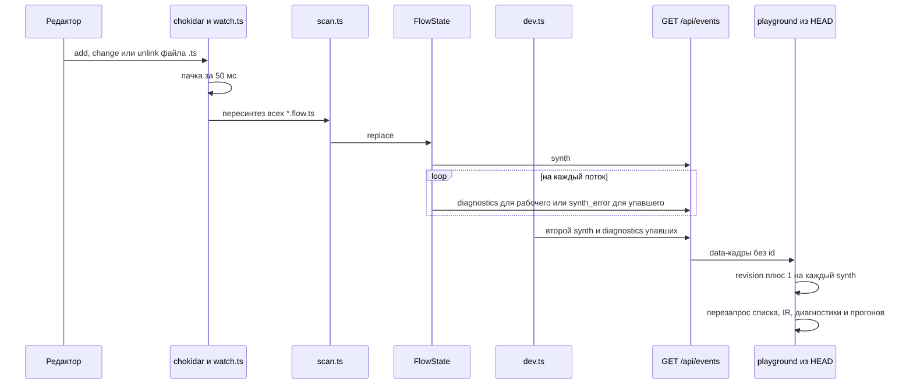

# Исследование: API текущего dev-сервера и потребности студии

> Дата: 2026-09-16
> Для: [23. API локальной студии](../23-studio-api.md), [ADR-0028](../adr/0028-studio-api-contract.md)

## Итог

- Текущий `aqven dev` — сервер на Hono, `127.0.0.1:5180`: 7 JSON-маршрутов, скачивание блоба и один глобальный
  SSE-канал. Нет авторизации, CORS, записи и OpenAPI.
- Новый `apps/studio` не вызывает ни одного маршрута. Все описанные ниже клиенты — удалённый playground из git HEAD.
- Запуском подтверждены три дефекта, которые нельзя переносить в Python-контракт:
  - рендер итерации 0 цикла затирается рендером узла;
  - `irHash` и `types` меняются между пересканами в одном процессе;
  - неизвестный `GET /api/*` отвечает `200 text/html`.
- Документы описывают 21 группу экранов, 63 MCP-тула, около 30 операций вне MCP и два SSE-канала с `Last-Event-ID`.
  Текущий сервер из этого покрывает только список воркфлоу, IR, диагностику, запуск и снимок прогона.
- §3 перечисляет 20 расхождений, которые влияют на контракт: документы между собой и документы против реализации.
  [ADR-0026](../adr/0026-yaml-spec-and-code-refs.md) §1, [ADR-0028](../adr/0028-studio-api-contract.md) §4–§6,
  [23](../23-studio-api.md) §6.3, решение владельца от 2026-09-16 об объёме студии и CLAUDE.md закрывают CAS, курсор
  SSE, словарь статусов прогона и узла, адрес исполнения, служебный каталог, фиксацию промта, транспорт прогона и
  объём студии. Остальное уходит в «Открытые вопросы».
- Экран «Экспорт», вся группа тулов экспорта (`project_export`, `project_import`, `project_conformance`,
  `project_verify_migration`) и поток бандла отменены решением владельца от 2026-09-16: «Экспорт не нужен, у нас
  будут HTTP-вызовы» ([ADR-0025](../adr/0025-python-engine.md) §7). Открыт только `project_export` с целью
  `agent_workflow_spec` (ОВ-26).
- Пробы на CPython 3.14.7 подтвердили для FastAPI 0.141.1 перемотку `Range` (206 и 416), `HEAD` через `api_route`,
  отказ `TrustedHostMiddleware` на чужой `Host` и загрузку через `UploadFile` (§2.8).

## Метод

| Метка | Значение |
|---|---|
| запуск | проверено на работающем сервере или запуском кода |
| код | прочитано в исходнике, `файл:строка` |
| док | прочитано в документации, `файл §раздел (строки)` |
| вывод | следует из фактов выше, отдельной проверки нет |

- **Сервер.** Node v24.21.0: репозиторий требует `>=24.21.0`, на v20.19.0 нет `node:sqlite`
  (`ERR_UNKNOWN_BUILTIN_MODULE`). Собранный `packages/cli/dist`, копия `examples/patterns` плюс поток `media_probe`,
  SQLite вне репозитория, 16 потоков. Репозиторий не менялся, сервер остановлен. Пробы выполнялись вне репозитория
  2026-09-16; сырые захваты (`flows.json`, `run_deep.json`, `sse.log`) в репозиторий не перенесены, результаты
  приведены в §1.
- **Python.** Изолированный venv: CPython 3.12.4, FastAPI 0.141.1 (MIT), Pydantic 2.13.5 (MIT). Клиент генерировался
  `npx openapi-typescript@7.13.0`. [ADR-0025](../adr/0025-python-engine.md) §1 фиксирует CPython 3.14, поэтому пробы
  §2.7 на 3.12.4 нужно повторить на 3.14.7 (ОВ-1). Пробы §2.8 выполнялись на CPython 3.14.7.
- **Версии.** У TS-сервера — из `package.json` установленных пакетов. У пакетов студии и Python-пакетов версии и
  лицензии проверены `npm view` и PyPI JSON 2026-09-16.

## 1. Текущий dev-сервер (TypeScript)

### 1.1 Стек и запуск

| Компонент | Версия | Лицензия | Роль | Источник |
|---|---|---|---|---|
| `hono` | 4.13.7 | MIT | маршрутизация, `streamSSE` | packages/cli/node_modules/hono/package.json:3 |
| `@hono/node-server` | 2.1.1 | MIT | HTTP-сервер, `serveStatic` | @hono/node-server/package.json:3 |
| `chokidar` | 5.0.0 | MIT | наблюдение за файлами | chokidar/package.json:4 |
| `jiti` | 2.7.0 | MIT | загрузка `*.flow.ts` | jiti/package.json:3 |
| `node:sqlite` | Node ≥22.5 | — | прогоны, события, рендеры, блобы | runs-db.ts:1 |

- Запуск `aqven dev [dir] [--port N]`, адрес `127.0.0.1`, порт `5180` (server.ts:21-22; bin.ts:57-75). [код]
- Авторизации нет. CORS-заголовков нет даже при `Origin: http://localhost:5173`. `OPTIONS /api/runs` → 404. [запуск]
- `/assets/*` и `*` отдаются из `apps/studio/dist` с фолбэком на `index.html`. Если dist нет, `GET /` → 503 text
  (server.ts:172-179). [код]
- Потоки сканируются дважды: сначала `bin.ts`, потом `createServer` (bin.ts:74-75; server.ts:209-211). Отсюда
  дефект D2. [код]

### 1.2 Маршруты

Полный список — packages/cli/src/server.ts:110-179. [код, запуск]

| Маршрут | Успех | Ошибки | Замечания |
|---|---|---|---|
| `GET /api/flows` | `FlowSummary[]` | — | без параметров и пагинации. У упавшего потока `id` — имя файла (`broken_probe.flow.ts`), `version: 0`, `nodes: 0`, `irHash` нет |
| `GET /api/flows/:id` | `{ir, synthMs}` | 404 `flow_not_found`; 422 `flow_not_synthesized{diagnostics}` | `synthMs` — время всего скана, а не потока. `expandedIr` считается, но не отдаётся (synth/src/index.ts:80-81; scan.ts:11-20) |
| `GET /api/flows/:id/diagnostics` | `Diagnostic[]` | 404 | 200 и для рабочего потока (`[]`), и для упавшего |
| `GET /api/flows/:id/input-schema` | `InputSchema` | 404; 422 | это не JSON Schema (§1.3) |
| `POST /api/runs` `{flow, input}` | 201 `{runId, run}`, `status: "running"` | 400 `bad_request`; 404; 422 | исполнение асинхронное. Вход по объявленному типу не проверяется, отсутствующий `input` сохраняется как `null` |
| `GET /api/runs` | `Run[]`, `ORDER BY started_at DESC` | — | жёсткий `LIMIT 50` (`RUNS_LIMIT`, server.ts:33,149), параметры игнорируются: `?limit=1&flow=media_probe` вернул 3 прогона, из них два `deep_composition` |
| `GET /api/runs/:runId` | `RunDetail` | 404 `run_not_found` | посреди прогона отдаёт частичный снимок: `status: running`, 35 событий, 16 рендеров |
| `GET /api/blobs/:id` | байты | 404 `blob_not_found{id}` | HEAD работает, `Range` игнорируется (§1.8) |
| `GET /api/events` | `text/event-stream` | — | один глобальный канал (§1.4) |
| `GET /assets/*`, `GET *` | статика, `index.html` | — | перехватывает и неизвестные `/api/*` (D3) |

Исполнитель — детерминированная заглушка без вызовов модели, тулов и кода (executor.ts:19-26,349-359,889-901;
metrics.ts:7-17):

- задержки 150–400 мс, конкурентность 4;
- `map` не больше 3 элементов, `loop` не больше 3 итераций;
- метрики и проверки оценочные.

### 1.3 Формы данных

Типы взяты из кода: events.ts:6-30; runs-db.ts:10-24; server.ts:24-31; executor.ts:33-47; synth/src/index.ts:5-10;
media.ts:15-24.

```ts
export type FlowSummary = { id: string; version: number; file: string; nodes: number; status: "ok" | "fail"; irHash?: string }
export type Diagnostic = { code: string; message: string; nodeId?: string; slot?: string }
export type InputField = { path: string; usedBy: { node: string; slot: string }[] }
export type InputSchema = { flow: string; type: string; root: string; freeform: true; fields: InputField[]; context: string[]; example: unknown; note: string }

export type RunStatus = "queued" | "running" | "ok" | "error"
export type Run = { id: string; flow: string; input: unknown; status: RunStatus; irHash?: string; startedAt: number; endedAt?: number }
export type RunEvent = { seq: number; at: number; type: string; nodeId?: string; payload?: unknown }
export type Render = { runId: string; nodeId: string; branchKey?: string; iteration?: number; input: unknown; output: unknown; prompt: string | null }
export type RunDetail = { run: Run; events: RunEvent[]; renders: Record<string, Render> }

export type ServerEvent =
  | { t: "synth"; flows: string[]; ms: number }
  | { t: "diagnostics"; flow: string; diagnostics: Diagnostic[] }
  | { t: "synth_error"; flow: string; file: string; message: string }
  | { t: "run"; runId: string; event: RunEvent }

export type MediaEnvelope = { $media: string; url: string | null; poster?: string; name: string; bytes: number; note?: string }
```

**`Ir`** (synth/src/index.ts:5-52). [код, запуск]

- Поля: `flow`, `version`, `input` (имя типа), `output{type, from}`, `context?`, `budget?`, `policies?`, `defaults?`,
  `components: Record<name, {name, out{type, from}, nodes}>`, `nodes: Record<nodeId, IrNode>`,
  `types: Record<name, IrType>`.
- `IrType = {name, kind: object|enum|id|scalar|array|unknown, declared, description?, example?, schema?,
  valueDescriptions?, source?, allowedSet?, codeFormat?}`.
- Ссылки внутри узлов — строки: `$input.topic`, `$gen.out.thumbnail`.

**`InputSchema`** (executor.ts:808-866). [код, запуск]

- Поля строятся из ссылок IR (`fields[].usedBy`), `example` — из `example` или `schema` типа.
- JSON Schema, которая уже лежит в `ir.types[ir.input].schema`, не отдаётся.
- Playground ждал поле `schema?` и включал форму только при нём, поэтому вход на практике задавался только JSON
  (HEAD:apps/playground/src/api/types.ts:112-122; components/InputForm.tsx:218-233; RunLauncher.tsx:41-43).

**Диагностика** (loader.ts:4-10,44-66; scan.ts:44-57). [код, запуск]

- Коды ошибок загрузки: `AQVEN_FLOW_COMPILE_ERROR`, `AQVEN_FLOW_IMPORT_FAILED`, `AQVEN_LOAD_FAILED`,
  `AQVEN_NO_DEFAULT_EXPORT`.
- `describeLoadFailure` достаёт файл, строку и колонку, но `scan` хранит только `code` и `message`. Строка и колонка
  остаются только внутри текста: `…/broken_probe.flow.ts:2:125 ParseError: Unexpected token`.
- Полей `severity` и `source` нет.

### 1.4 SSE `GET /api/events`

| Свойство | Значение |
|---|---|
| Кадр | `data: <ServerEvent JSON>`, без `event:` и без `id:` |
| Heartbeat | комментарий `: heartbeat` раз в 15 с (`HEARTBEAT_MS = 15_000`, events.ts:32,100) |
| Replay | нет `Last-Event-ID` и нет начального состояния при подключении |
| Каналы | один глобальный, без фильтра по прогону: каждый подписчик получает всё |
| Заголовки | `content-type: text/event-stream`, `cache-control: no-cache` |

Источники: events.ts:26-65,98-136; server.ts:170; захват `sse.log`, 497 строк. Playground открывал нативный
`EventSource` на каждый вызов `subscribe()`: один на события сервера и по одному на каждый открытый прогон
(HEAD:apps/playground/src/api/http-client.ts:22-36,99-111; run/use-run.ts:80-88). [код, запуск]

### 1.5 События прогона

`seq` — счётчик на прогон в памяти процесса (executor.ts:882,925-931).

| `type` | `nodeId` | Ключи `payload` |
|---|---|---|
| `run_start` | — | `flow, irHash, order[], input, concurrency, simplifications[]` |
| `node_start` | узел | `kind, description, slots` (сырой IR), `inputs` (разрешённые), `startedAt, queuedAt\|null, queuedMs` |
| `node_progress` | узел `map` | `index, total, source, output` |
| `node_finish` | узел | `kind, status:"ok", ms, startedAt, endedAt, queuedMs, summary, outputType, outputSource` (`example\|schema\|media\|name\|stub\|none`), `output, tokens{input,output,total}, costUsd, usdMicros, model\|null, provider\|null, attempt, checks[{name,ok,message}], raw, simplifications[]` |
| `node_fail` | узел | `kind, ms, startedAt, endedAt, message, raw, parseError` |
| `branch_start` | родитель `parallel` | `parentNodeId, branchKey, branchIndex, total, nodeId, model, params, startedAt, description` |
| `branch_finish` | родитель | ключи `branch_start` без `startedAt` и `description`, плюс `status: ok\|default, ms, endedAt, counted, output` |
| `iteration_start` | родитель `loop` | `parentNodeId, iter, total, carry` |
| `iteration_finish` | родитель | `parentNodeId, iter, total, score, stopReason\|null, selected:false, output` |
| `iteration_selected` | родитель | `parentNodeId, iter, score, selected:true` |
| `gate_wait` | узел `gate` | `parentNodeId, waitFor, assignee, role, timeoutMs, onTimeout` |
| `run_finish` | — | `status, ms, output, outputType, simplifications[]` |
| `run_fail` | — | `message` |

Источник: executor.ts:521,621-749,903-962,996-1122. `nodeId` событий `branch_*`, `iteration_*` и `gate_wait` — узел,
чей обработчик их порождает, `parentNodeId` в payload совпадает с ним (executor.ts:685,742,1015). [код, запуск]

- В `deep_composition` (87 событий) встретились все типы, кроме `node_fail` и `run_fail`.
- Прогон `media_probe` дал ровно шесть событий: `run_start`, `node_start gen`, `node_finish gen`,
  `node_start describe`, `node_finish describe`, `run_finish`.
- `run_fail` приходит только при падении исполнителя, и `run_finish` за ним не следует. Playground считал терминальным
  только `run_finish` (HEAD:apps/playground/src/run/use-run.ts:60). Прогон с `run_fail` в нём остался бы активным.

### 1.6 Как изменения файлов доходят до UI



- Наблюдатель смотрит на корень, игнорирует `node_modules`, `.git`, `.aqven`, `dist` и реагирует только на `.ts`
  (watch.ts:5-8,72-96).
- Любое изменение пересканирует все потоки (dev.ts:16-39; server.ts:52-87; scan.ts:84-97).
- В событиях нет номера ревизии, хеша файла, ETag и списка изменённых файлов.
- Промты `.md` и YAML не наблюдаются.
- Замер: одна правка дала `synth`, 16 `diagnostics` и ещё один `synth`. [код, запуск]
- Playground держал локальный счётчик `revision` и перезапрашивал по нему всё
  (HEAD:apps/playground/src/hooks/use-server-events.ts:14-16; screens/FlowListScreen.tsx:42-48;
  FlowGraphScreen.tsx:51,201; run-view/flow-runs.ts:38; App.tsx:93-102).

### 1.7 Рендеры

`renderKey` (runs-db.ts:179-185) строит ключ так:

- `nodeId#branchKey`, если ветка непустая;
- `nodeId@iteration`, если `iteration > 0`;
- `nodeId` во всех остальных случаях.

| Конструкция | Что сохраняется | Источник |
|---|---|---|
| `parallel` | рендер на каждую ветку; `input` ветки — разрешённые входы родителя | executor.ts:628 |
| `loop` | рендер на каждую итерацию | executor.ts:700 |
| любой узел | рендер уровня узла при завершении | executor.ts:1050 |
| `map` | рендеров элементов нет: их выходы есть только в `node_progress` | executor.ts:521 |

Ключи рендеров `deep_composition` [запуск]:

- `facets#analysis … facets#risks`;
- `opinions_fan#anthropic …`;
- `panel#cohere`, `panel#llama`, `panel#mistral`;
- `review`, `review@1`, `review@2`.

**Промты** (executor.ts:368-384,416-431,482-497). [код, запуск]

- `Render.prompt` — заглушка, собранная из слотов IR для узлов `llm` и `call`. Для остальных видов узлов — `null`.
- Эндпоинтов исходника промта, шаблона и отрендеренных сообщений нет.
- `GET /api/flows/:id/prompt/:node → RenderedPrompt{messages, slots, tokens, cachePrefixEnd}` и поле `layout` в ответе
  потока запланированы в docs/playground/shell.md:45-58, но не реализованы.

### 1.8 Блобы и медиаконверт

| Аспект | Факт | Источник |
|---|---|---|
| Заголовки | `Content-Type` — сохранённый mime; `Content-Length`; `Content-Disposition: inline; filename*=UTF-8''<name>`; `Cache-Control: public, max-age=31536000, immutable` | server.ts:158-168 |
| Идентификатор | hex8-хеш; постер видео — `<id>p` | media.ts:24-26,162-166 |
| Хранение | таблица `blobs` с привязкой к прогону и узлу; листинга по прогону нет | runs-db.ts:26-34,77-88,270-279 |
| `Range` | `Range: bytes=0-10` → 200 и полное тело, аудио и видео не перематываются | запуск |
| Загрузка | `POST` и `PUT /api/blobs` → 404; вход прогона — только JSON, медиа на вход не подать | запуск |
| Примеры | `3cf68620` image/svg+xml 384 Б; `045deff6p` image/svg+xml `video.svg`; `7cafd514` audio/wav 9644 Б; `b505eb48` text/plain | запуск |

Медиа встраивается в выходы, рендеры и события конвертом `MediaEnvelope` (media.ts:15-64,145-155,194-206):

- mime берётся из `contentMediaType` схемы типа или из основы имени поля:
  - `thumbnail`, `screenshot`, `picture`, `image`, `photo`, `avatar` → `image/png`;
  - `video` → `video/mp4`;
  - `audio`, `voice` → `audio/wav`;
  - `attachment` → `application/pdf`.
- Заглушка подставляет svg, wav или text и пишет подмену в `note`.

Playground (HEAD:apps/playground/src/values/detect.ts:91-157; components/MediaValue.tsx:145-156):

- распознавал `$media` с источником из `url|src|href|data|uri`;
- распознавал data URI, абсолютные URL, пути `/api/...` и base64 с подсказкой о медиа;
- рисовал image, video, audio, file и link.

### 1.9 Хранение

SQLite `<root>/.aqven/runs.db` в режиме WAL (runs-db.ts:48-89,202-216; executor.ts:882,889-898,925-931). [код, запуск]

- Таблицы: `runs`, `node_events` (PK `run_id, seq`), `renders` (PK `run_id, node_id, branch_key, iteration`), `blobs`
  (`body BLOB`).
- Событие сначала пишется в базу, потом публикуется в SSE.
- Сверки при рестарте нет: прогон в статусе `running` так и остаётся `running`.
- Статус `queued` не порождается.

### 1.10 Подтверждённые дефекты

| # | Дефект | Механизм | Воспроизведение | Следствие для контракта |
|---|---|---|---|---|
| D1 | Рендер итерации 0 цикла теряется | итерация 0 пишется с ключом `(run, node, '', 0)`, как и рендер уровня узла. `INSERT OR REPLACE` при завершении узла затирает её финальным выходом (runs-db.ts:67-76,179-185,261-268; executor.ts:700,1050) | `deep_composition`: ключи `review`, `review@1`, `review@2`, ключа `review@0` нет. У `review` `iteration = 0` и `score 0.85`, как в `node_finish`, хотя `iteration_finish` итерации 0 дал `0.55` | [ADR-0028](../adr/0028-studio-api-contract.md) §5: адрес исполнения — структура `{node_id, branch_key: str\|null, iteration: int\|null, item_index: int\|null}`, строковая склейка запрещена, итерация 0 не совпадает с уровнем узла. Playground искал `${nodeId}@0` и молча брал выход из `iteration_finish` (HEAD:apps/playground/src/components/run-tree.ts:130) |
| D2 | `irHash` и `types` нестабильны между пересканами | реестр типов глобален и ключуется по имени (packages/dsl/src/types.ts:84-87). Повторный скан в том же процессе меняет местами определения одноимённых типов разных потоков | два скана `packages/cli/dist/scan.js`: у 7 из 16 потоков сменился `irHash` (`cascade 02e10b10→88645405`, `diverge_merge`, `human_escalation`, `judge_panel`, `map_reduce`, `router_experts`, `verify_fix`). У `cascade` поменялись `Digest`, `Ticket`, `Ticket[]`: описание `Digest` в первом скане «Сводка по пакету обращений: выход воркфлоу map_reduce», во втором «Сводка по разобранной очереди обращений». Узлы совпадают. Сервер отдаёт данные второго скана | `GET /api/flows/:id` может отдать чужие `types`, а `run.irHash` не годится как идентичность. Хеш канонического IR ([ADR-0022](../adr/0022-hash-as-version.md)) надо считать без общего изменяемого состояния [вывод] |
| D3 | Неизвестный `GET /api/*` отвечает `200 text/html` | `app.get("*")` с фолбэком на `index.html` ловит и `/api/*` (server.ts:177-179) | `GET /api/unknown` и `GET /api/runs/abc/events` → 200 `text/html`. Не-GET запросы получают обычный 404 от Hono | пространство API должно отвечать JSON 404 раньше SPA-фолбэка. Playground обходил дефект проверкой `content-type` (HEAD:apps/playground/src/api/http-client.ts:17-20,64-68) |

Пробелы, которые не являются дефектами:

- в SSE нет `event:`, `id:` и replay;
- нет поддержки `Range` и загрузки блобов;
- `/api/runs` ограничен 50 прогонами и игнорирует фильтры; нет отмены, удаления и перезапуска;
- `input-schema` — не JSON Schema; нет исходников узлов и промтов, рендера промта, `layout`, `expandedIr`;
- нет записи, CAS и хешей файлов;
- после `run_fail` нет `run_finish`; зависшие `running` не сверяются;
- нет рендеров элементов `map`;
- у диагностики нет `severity`, строки и колонки.

### 1.11 Клиенты API

| Клиент | Что вызывает | Источник |
|---|---|---|
| `apps/studio` (новый, в git не отслеживается: `?? apps/`) | ничего. Один маршрут `/` с текстом `studio`. Нет API-клиента, портов и адаптеров, `fetch`, `EventSource`, хуков серверных данных. Единственный `fetch` — копирование картинки в assistant-ui. Vite проксирует `/api` на `http://127.0.0.1:5180`. В собранном dist 0 вхождений `/api` и `EventSource` | apps/studio/src/routes/index.tsx:3-5; routes/__root.tsx:4-14; components/assistant-ui/elements/image.tsx:114; vite.config.ts:19 |
| Установлено в `apps/studio` | `@tanstack/react-router` 1.170.36 (MIT), `zustand` 5.0.15 (MIT), `@assistant-ui/react` 0.15.20 (MIT) | apps/studio/package.json:14,18,32 |
| Запланировано, но не установлено | `@tanstack/react-query` 5.102.8, `openapi-fetch` 0.17.0, `openapi-typescript` 7.13.0, `eventsource-parser` 4.1.0 (все MIT; npm 2026-09-16: у `eventsource-parser` уже 4.1.1). Порты с fixture-адаптерами из ADR-0024 в `src` отсутствуют | 15 «Решения» (25, 33-34); adr/0024-studio-on-vite.md:39-41,62-64 |
| Удалённый playground (HEAD) | порт `ApiClient`: `listFlows`, `getFlow`, `getDiagnostics`, `getInputSchema` (`null` при не-OK или не-JSON), `startRun` → `runId`, `getRun`, `listRuns` (`null` → реестр в localStorage `wf.playground.runs`), `subscribe` → `EventSource /events`. База URL — `/api` или `VITE_WF_API_BASE`, источник — `VITE_WF_SOURCE = api\|fixture\|empty` | HEAD:apps/playground/src/api/client.ts:13-24; http-client.ts:47-111; index.ts:5-17; run/registry.ts:1-38 |

Как playground читал данные [код]:

- **Прогон** (`useRun`, use-run.ts:62-106): снимок → подписка → слияние событий по `seq` → повторный запрос снимка после
  `run_finish`, чтобы получить рендеры.
- **Список прогонов** (RunsListScreen.tsx:18-50): N+1 запросов (до 25 снимков) только ради подсчёта узлов.
- **Список потоков** (FlowListScreen.tsx:41-48): отдельный запрос диагностики на каждый упавший поток.
- **Шаги** (run-steps.ts:80-218): `summary`, `checks`, `tokens`, `costUsd`/`usdMicros`, `raw`, `prompt` читаются через
  множество псевдонимов ключей.

Расхождение типов клиента и сервера (HEAD:apps/playground/src/api/types.ts:12-17,66-73,85-93,112-122):

- в `Render` нет `branchKey` и `iteration`;
- `RunDetail.renders` необязателен;
- `RunEvent.simplifications` объявлен на верхнем уровне, а сервер кладёт его в `payload`;
- `InputSchema.schema` ожидается, но не приходит;
- `nodeId` и `slot` у ошибок загрузки никогда не заполняются.

План из playground/shell.md:45-58 тоже расходится с реализацией:

- `FlowSummary.status ok|diagnostics|broken`;
- `Diagnostic{severity, at, source{file,line}}`;
- `synth_error.line`;
- ответ потока `{id, ir, layout, synthMs}`.

## 2. Что нужно студии по документации

Основание — решение владельца от 2026-09-16: студия получает через API все данные
([ADR-0028](../adr/0028-studio-api-contract.md), Контекст). Состав ресурсов — [23](../23-studio-api.md) «Зачем этот слой».

### 2.1 Классы свежести

| Класс | Данные | Механизм по документам |
|---|---|---|
| Статические | каталог моделей, коды проблем `help_contract` | запрос по требованию [вывод] |
| По изменению файлов | дерево файлов, IR, диагностика, промты, история, лок, состояние индекса; раскладка — отдельный LWW-канал | SSE-канал спеки и перезапрос; после 3 неудач SSE — поллинг `flow_get` |
| Живые во время прогона | статусы узлов, стоимость, лог, приостановка, очередь «ждёт меня», прогресс эксперимента и blame, лента агента, индикатор | SSE прогона: при обрыве переподключение с `Last-Event-ID` или снимок, живой прогон не поллится; индикатор и лента при потере SSE опрашиваются (§2.6) |
| Неизменяемые | завершённый прогон, отчёт гейта с `content_hash`, версия датасета | `staleTime: Infinity` (15 §1.2) |

### 2.2 Экраны и данные

| # | Экран | Данные | Свежесть | Пробел в контракте | Источник |
|---|---|---|---|---|---|
| 1 | Оболочка, индикатор, палитра, инбокс, первый запуск | переключатель воркфлоу (имя, архетип, ревизия, статус компиляции); счётчики активных прогонов и аппрувов; индикатор: компиляция `idle\|compiling\|N ошибок`, прогоны (число и общий %), агент (держатель лока, фаза, TTL), бюджет (потрачено, лимит, доля); фаза из `mode_set`; палитра: поиск по воркфлоу, прогонам, датасетам, версиям и журналу, распознавание префикса id, объяснение кода через `help_contract`; инбокс: заявки с автором, обоснованием, доказательствами и вердиктом гейта, задачи человека; первый запуск: каталог архетипов, `flow_create`, `flow_import`, `brief_submit`, строка подключения MCP | живые; без SSE — опрос раз в 15 с и подпись «данные от HH:MM» | нет `search_global`, агрегата бюджета, `proposal_list`, `dataset_list` | frontend/shell.md (66-198); 15 §5.18 (547-555) |
| 2 | Дерево файлов и исходник | на каждый файл: `path`, `kind`, `file_hash` (sha256 байт), `size`, `mtime`, `parse_status ok\|invalid\|unreadable` или состояние синхронизации `ok\|quarantined\|unreadable\|missing`, `problems[]` со строкой и колонкой, `last_good`; сырые байты; корневой `aqven.yaml` с журналом `renames` ([ADR-0026](../adr/0026-yaml-spec-and-code-refs.md) §1; в документах — `project.yaml`); `aqven.lock.yaml`; счётчик карантина; индекс `ready\|building\|degraded`, generation, «индексируется N файлов»; `repo_status`; `external_changes_list`; схемы редактора `.aqven/schema/*.json` | по изменению файлов | у `repo_status`, `index_rebuild`, `external_changes_list` нет сигнатур | 32 §3.2 (156-171), §3.11; files-first/external-edits.md §2 (57-74), 127; files-first/index.md §2; 16 §2.3 `spec_fs_sync` (166-183) |
| 3 | Список воркфлоу | имя, версия IR, путь, вердикт (OK, FAIL с первой ошибкой или diagnostics), число узлов, последний прогон, архетип, держатель лока. FAIL не прячется: клик открывает канвас с раскрытой полосой ошибки и подсвеченным местом. Пустой каталог — отчёт скана (путь, маска, сколько просканировано, найдено 0) и «создать демо». Индекс отвечает из `idx.objects.summary` без чтения файлов | по изменению файлов; «Перечитать» форсирует скан | `flow_list` → `{spec_id, name, rev, head_version, lock, updated_at}` нет среди 63 тулов | playground/scope.md §1 S1, §3 (46-61); files-first/index.md §1; frontend/edit-contract.md §1 |
| 4 | Канвас воркфлоу | IR с видами и группами `seq\|parallel\|map\|switch\|loop\|race\|gate\|try\|call` и произвольной вложенностью; статический fan-out — N узлов, рантайм-fan-out — один узел ×N с источником N; порты `{id, kind data\|control\|error, schemaId, label}`; привязки лексическими ссылками; полоса стадий; модель и семейство на ветке; проблемы и кандидаты узла; раскладка `{x, y, origin manual\|auto, updated_at, actor}` и `layout_rev`; присутствие `holder, holder_kind, reason, TTL`; атрибуция по git-трейлерам или `write_intents`; слой диффа патча агента (`flow_diff`); рельс ревизий (`flow_history`); `flow_compile({at})` по коммиту; карта совместимости типов `Map<pairKey, boolean>` для синхронного `isValidConnection` | по изменению файлов и LWW-канал раскладки | как сервер отдаёт карту совместимости и порядок графа (§2.7) | 15 §5.1 (340-352), §6.1 (559-594); 32 §2.2, §3.6-3.8, §3.13; 31 (14-27, 59-78, 120-151); frontend/edit-gestures.md §4 (72-88) |
| 5 | Ошибки компиляции и кандидаты | `Problem{code, severity error\|warning\|info, at{node_id, path, line}, message, evidence}`, где `code` совпадает с `ErrorCode` компилятора; `Candidate{id, title, confidence 0..1, rationale, risk low\|medium\|high, affects[], apply{tool, arguments}}`; превью `dry_run`; объяснения `help_contract({topic:'codes'})`; возраст отчёта. Три класса: ошибка разбора и синтеза — граф не рисуется, IR-диагностика — граф рисуется, краснеет полоса. У шаблона своя диагностика `{rule, severity, at{row, col, file}, message, fix{op, range, text}}` | пуш после сохранения и запрос по требованию | — | 14 §3.1 (246-305); frontend/build.md (41-59); 32 §3.12; playground/data.md §1 (28-32); 08 §7 (462-469) |
| 6 | Статический инспектор узла | «Обзор»: вид, модель и семейство, эффективная конфигурация с происхождением `default→agent→node→run`. «Вход»: слот, тип, ссылка, вид происхождения. «Промт»: шаблон с диапазонами слотов и блоком output_format. «Выход»: JSON Schema. «Источник»: YAML как есть. Для каждого поля — последняя правка пути. Поля с несохранённой правкой не перезаписываются | по изменению файлов | — | 32 §3.11 (303-313); frontend/build.md (61-79); 15 §5.16 (522-533); frontend/edit-attribution.md §6-§7; 14 §2.6 |
| 7 | Редактор шаблона промта | уровень промта по [ADR-0026](../adr/0026-yaml-spec-and-code-refs.md) §4: `<node>.prompt.md` без переменных, Liquid-шаблон со слотами или `prompt: pkg.mod:build` (функция в `.py`, шаблона нет, помечается в студии); байты шаблона и `file_hash`; сигнатура шапки (in: слот→TypeView, unused, out, lang, cache `none\|system\|system+examples`); фрагменты; черновик `.aqven/drafts/<path>.draft` с meta; автодополнение слотов `fetchSlotCompletions(templateId, prefix)` из `context_plan` и реестра типов; превью — только серверный рендер на фикстуре: сообщения по ролям, граница кэш-префикса, блок output_format, оценка токенов (R-T9); дифф рендеров между ревизиями; фикстуры из `dataset_get`; диагностика запросом и пушем, quick-fix с патчем | запрос на паузе набора и по изменению файлов | `template_render`/`prompt_render` вне MCP; нет операций чтения и записи черновика | 15 §5.10 (446-453), §11.3-11.5 (1142-1180); frontend/build.md (100-118, 190-191); 08 §3, §5.1-5.2, §6, §8.3, §9; files-first/write-model.md §5 (119-131) |
| 8 | Линзы: граф контекста, карта промтов, раскрытие компонента | потребности и источники с видом `static\|data\|knowledge\|generated\|human`, непокрытые потребности, конфликты источников, нарушения R-C, состояние индексов базы знаний; граф фрагмент→шаблон→узел, число использований, трасса сборки с источниками слотов, фактический промт из `run_get_node` или шаблон; `component_expand({id, depth})`, `component_get`, `component_list` | по изменению файлов | нет `prompt_map`/`prompt_assembly` (опора — `idx.refs`) | 15 §5.11-5.12, §5.15; frontend/build.md (81-157); files-first/index.md §1; 16 §2.5 (281-290) |
| 9 | Запуск прогона | воркфлоу и ревизия (коммит или `working`) с вердиктом компиляции, при FAIL запуск заблокирован; режим `live`, replay из записи или датасет; JSON Schema входного типа → форма с ошибками до отправки; датасет из `dataset_get`; оценка стоимости, числа вызовов и лимита итераций по узлам; пресеты в URL; предупреждение о неполных кассетах. Прогон пинит `spec_versions` (`content_hash`, `release_hash`, `sources` path→sha256) | по изменению файлов | нет операции предварительной оценки | frontend/run.md (16-35); playground/scope.md S4; 14 §2.5 (149); 16 §2.2 (105-156) |
| 10 | Список прогонов и очередь приостановленных | `run_list` → `{run_id, spec_id, node_id, status, assignee, waiting_since, deadline_at, form_ref, title}`, фильтры `status`, `assignee`, `spec_id`, `overdue`, `since`, `cursor`; «ждёт меня» = `run_list({status:'suspended', assignee:'me'})`, сортировка по `deadline_at`; метка «определение изменилось после старта» | живые: статус меняется по таймеру | — | 14 §2.5 (152, 163-170); files-first/contract.md §3 (57-81); files-first/external-edits.md §4 (88-103) |
| 11 | Отладчик: шапка, граф прогона, lineage | runId, статус, ревизия, режим; lineage «форк от run#…, шаг X»; итоги $, время и токены против оценки; счётчик деградировавших узлов; `trace_id` для Langfuse. Строка прогона: `mode, status, input, output, error, seed, cassette_id, catalog_snapshot_at, effective_config, config_hash, budget, cost_usd, tokens_in/out, trace_id, started/finished`. Граф до 200 итераций × 8 узлов; каждому исполнению нужны `node_id, stage_id, parent_node_id, loop_iteration, node_attempt` и индекс элемента map. Статусы UI: `pending, running, succeeded, failed, skipped, cancelled, retrying, cached, degraded`. `run_lineage` → `{root_run_id, parent_run_id, relation root\|replay\|fork\|retry\|experiment_cell, replay_from_node_id, overrides, depth}` | живые; завершённый прогон неизменяем | — | 32 §4.2, §4.4, §4.7; 15 §1.2 (85), §7.1 (742-769); 12 §2.1 (199-222); 16 §2.7 (322-364), §2.9 (455-478); frontend/run.md (59-78) |
| 12 | Инспектор шага | «Вход»: дерево значений и карта происхождения JSONPointer→`{kind, sourceStepId\|origin_span_id}` (`run_nodes.provenance`). «Промт»: фактически отправленные сообщения, `SlotRange{slot, offset, length}` (восстанавливать поиском подстроки нельзя), переключатель шаблон↔рендер, кэш-префикс, `template_sha256` и `rendered_sha256`. «Ответ»: сырые байты, разобранный выход, исход `ok\|refusal\|truncated`. «Проверки»: лестница попыток (причина, действие `retry\|repair\|fallback`, латентность, стоимость, промт и ответ попытки), `rule_firings`, `schema_valid`, `schema_errors`, `repair_attempts`, `degraded`. «Стоимость»: модель провайдера, семейство, `pricing_version`, токены `in/out/cache_read/cache_write/reasoning`, латентность, TTFT, попадание в кассету. Транспорт: `PayloadRef{preview ≤4096, sha256, sizeBytes, truncated, ref}` и выдача по `ref`, `include_payloads none\|truncated\|full`, скрытие `secret_ref`, «payload удалён по сроку хранения» | живые, затем неизменяемые | нет эндпоинта выдачи payload по ref | 32 §4.9 (519-553); frontend/run.md (80-103); 12 §2.2-2.6, §3.2 (400-433); 16 §2.8 (418-420); 14 §2.5 (151), §4.2 (449-452), §6.2 |
| 13 | Водопад, спарклайн, хвост лога, панель цикла | строка водопада: `node_id`, глубина, имя, вид, итерация или индекс, статус, модель, сводки входа и выхода, начало и конец, `cost_total_usd`, токены, оценка против факта, `config_hash`, `prompt_rendered_sha256`, `output_sha256`, `trace_id/span_id`; потерянные сегменты трассы — явные разрывы; пагинация `run_get_trace`; спарклайн параллелизма; хвост лога с фильтром по узлу и уровню; дорожки итераций, счётчики выхода (текущее и порог: `max_iter`, бюджет, стагнация Δ, порог score, повтор хеша кандидата), кривая метрики, лучшая и незавершённая итерации | живые | — | 32 §4.5-4.6, §4.8; 12 §7 (732-737), §7.1 (751-760); frontend/run.md (105-160); 15 §7.2, §7.6 |
| 14 | Песочница шага и дифф прогонов | редактируемый вход с отметкой правок; редактируемый промт; набор замороженных узлов выше; смена модели; обязательная оценка стоимости до подтверждения; результат — всегда новый форк с родителем; структурный дифф выхода и текстовый дифф промта и ответа. `run_diff`: `same\|diverged\|only here`, причина — первый несовпавший хеш в порядке config→template→rendered prompt→output→status, баннер при разных ревизиях, пары по имени узла | по запросу | покрывает ли `overrides` набор замороженных узлов — открыто | 32 §4.10-4.11, ОВ-1 (754-758); 12 §8.4 (839-854), §7 (729); 15 §7.4-7.5; frontend/run.md (124-141) |
| 15 | Форма приостановленного узла | `form_schema` (JSON Schema из `form: TypeRef`) и uiSchema от сервера, всегда схема конкретного шага (`resumeSchema` шага важнее уровня воркфлоу; устарело: одна форма — тип `form` узла, [ADR-0026](../adr/0026-yaml-spec-and-code-refs.md) §13); `suspend_data` с происхождением и критериями; дедлайн с отсчётом и политикой `on_timeout`; состояние эскалации; гонка «уже решено» блокирует форму и показывает победивший ответ; ошибки валидации на полях. UI показывает дедлайн, но не исполняет его | живые | — | files-first/contract.md §3 (69-77); 14 §2.5; 15 §10.2-10.3 (1087-1108); 32 §4.13; frontend/run.md (162-181); 16 §2.11 (548-585) |
| 16 | Датасеты и покрытие | неизменяемые версии, соль сплита, размеры сплитов; строки 10k+ с курсором: `item_key`, input/expected (`PayloadRef` сверх 8 КБ), `origin run\|generated\|production\|manual\|perturbation`, `source_run_id/node`, `labels`, `label_source/confidence`, `pii_masked`, `coverage_targets`; отчёт дедупликации; баннер загрязнения теста; `CoverageReport{totals, byClass, gaps[{target, kind, hint}], measuredFromRunIds}`; матрица кейс × узел. Метаданные — `datasets/<name>.yaml`, строки — в базе; golden-наборы `rows_in_file` до 500 строк и 1 МБ | по изменению файлов и событиям | нет `dataset_list`, `dataset_item_patch` | frontend/quality.md (17-47); 13 §2.2-2.3, §3.2 (263-293); 16 §2.12; files-first/index.md §6 (142-144) |
| 17 | Эксперимент, матрица моделей, сравнение, отчёт гейта | узел, датасет и сплит, скореры с весами, повторы R, оценка стоимости; прогресс n/total, $, ошибки провайдера; оценки по элементам, разброс, p50/p95, ссылка на трассу; `ModelMatrixCell{modelId, promptVersion, quality, qualityCi, costUsdPerItem, latencyP50Ms, latencyP95Ms, failureRate, repeats}`, граница Парето и epsilon; `GateReport` с решением `PASS\|WARN\|BLOCK\|GATE_UNAVAILABLE`, `reason_code`, строками `per_test{node_id, scorer_id, family, n, n_discordant, delta, ci_lo, ci_hi, p_adj/q_adj, method, win/loss/tie, noise_floor, verdict}`, `approvals[]` и `content_hash`. Вся статистика считается на сервере | живые, отчёт неизменяем | нет `experiment_list`, `experiment_get`, `scorer_list`, `scorer_get` | frontend/quality.md (49-127, 164-174); 13 §5.3-5.4 (492-544), §6.1 (564-622), §8 (1139-1215) |
| 18 | Калибровка судьи и blame | взвешенная kappa, alpha, стабильность при перестановке, flip при повторе, уровень `BLOCK\|WARN\|OFF`, `n_labeled`, `stale_at`; `StageMatrix` с ячейками `{caseId, nodeId, status pass\|fail\|skipped\|error\|pinned, scores, spanId}`; вердикт `single_node\|interaction\|ranked\|not_a_node\|partial\|no_gold_available\|not_failing`; доказательства; стоимость; прогресс «4 из 11 кандидатов, $0.31» | живые | нет `feedback_submit`, `judge_calibration` | frontend/quality.md (129-174); 13 §9.2 (1273-1288), §10.1 (1343-1363), §10.3 |
| 19 | Реестры: типы, модели, агенты, тулы | типы: JSON Schema ревизии, представления, значения enum с описаниями, статус `draft\|pending\|approved`, `usage_count`, `type_usages{spec_id, node_id, path, kind}`, `type_impact{breaks, candidates, verdict}`, `stale_at`; модели: профили, возможности `declared\|probed\|refuted`, цепочка фолбэков, цена за 1M, контекст, узлы-пользователи; агенты: инструкции, параметры, allowlist тулов, эффективная конфигурация; тулы: дифф закреплённой и живой схемы, `schema_hash`, сервер, транспорт, дата пина, `piiSink`, internal/external, привязки, `unknown` при недоступном сервере | по изменению файлов | нет `type_usages`, `type_impact`, `agent_list`, `tool_schema_drift`, `tool_repin`, `mcp_server_list` | frontend/manage.md (18-114); 15 §5.3-5.5; 16 §2.6 (296-318) |
| 20 | Версии, журнал, экспорт | рельс коммитов с автором и гейтом, семантический дифф по узлу и полю, доказательства, `approve\|reject\|rollback`, граф lineage; записи журнала `{kind, title, body, refs, author human\|agent, time}` с фильтрами. Экспорт в документах: выбор цели, отчёт потерь, отчёт конформанса, поток бандла с корнем Меркла; экран «Экспорт» отменён ([ADR-0025](../adr/0025-python-engine.md) §7) | по изменению файлов | нет `version_list`, `version_approve`, `version_rollback`, `version_lineage`, `registry_approve` | frontend/manage.md (63-142); 16 §2.14-2.15 (777-852) |
| 21 | Настройки и кластер агента | провайдеры со статусом разрешения SecretRef, MCP-серверы, PII allowlist (retention `zero\|logged\|unknown`), сроки хранения, бюджеты; бриф с пробелами, чат, лента эпизодов (`live\|batched\|paused`, «показан X · на сервере Y»), экран заявки, кандидаты, очередь аппрувов, бюджет | лента и аппрувы — живые | для настроек нет ни одной MCP-операции | frontend/manage.md (144-157); frontend/agent.md (18-194); 15 §5.17 (535-545); 16 §2.16 (917-957) |

### 2.3 Операции записи

| Операция | Вход | Выход | Конкурентность | Ошибки и правила | Источник |
|---|---|---|---|---|---|
| `flow_patch` | `ops[1..50]`: `add_node{type, name, at?}`, `remove{kind: node\|binding}` с каскадом привязок, `set{path: nodes/<name>/<field>}` с каскадом переименований, `bind{target, source}`; `intent?`, `expect_lock?`, `exclusive?`, `dry_run` | `version{commit, files[]}`, `changed_paths[]`, `focus`, `problems[]`, `candidates[]`; по 31 также `applied_ops[]`, `files[{path, file_hash}]`, `conflict{current[], their_ops[], overlapping_paths[]}` | CAS по хешам файлов: `expects[{path, file_hash}]` + `client_op_id` ([ADR-0028](../adr/0028-studio-api-contract.md) §6); `file_hash: null` — «файла не должно быть». 14 §9.4 и 31 описывают REST `PATCH /api/specs/:id` с `If-Match: "<file_hash>"` и 412; в контракт это не входит: REST несёт тот же `expects[{path, file_hash}]` в теле `PATCH /api/flows/{flow_id}`, `If-Match` не используется (ADR-0028 §6) | `STALE_FILE`, `FILE_VANISHED`, `FILE_EXISTS`, `LOCK_BUSY`, `TREE_DIRTY`; `conflict{path, your_hash, current_hash, ops_since[], rebase auto\|manual, rebased_ops[]}`; блокирующие нарушения — ничего не пишется, advisory — пишется с пометкой `not_runnable`. Коммита нет; запись идёт через `.aqven/txn/<ulid>`, `intent.json` и `rename(2)` под `.aqven/lock` | 14 §2.3, §9.2 (910-944), §9.4 (973-978); files-first/write-model.md §2-§4; 31 (16-21, 207) |
| Отмена и повтор | новый `flow_patch` с обратными операциями поверх текущих хешей, личный стек | — | то же | применение кандидата — `apply.tool` с аргументами после превью `dry_run` | 31 (33-42); frontend/edit-gestures.md §1-§3 |
| `flow_commit` | `paths[]`, `message`, `intent?` | `commit`, `files[{path, sha256, status}]`, `compile{ok, problems[]}` | явный, автокоммита нет | эпизоды: ход агента или 30 с тишины у человека; трейлеры `Aqven-Actor`, `Aqven-Session` | 14 §9.3 (953-971); files-first/history.md §1-§4 (19-99) |
| `flow_revert` | `to: commit`, `paths?`, `message`, `base{commit}`, `dry_run` | `commit`, `reverted[]`, `compile{ok, problems, candidates}`, `conflicts[]` | всегда новый коммит | агент откатывает только свои коммиты, чужие — `FORBIDDEN` и `studio_open(elicit)`; восстановление «на вчера» — новый коммит с `Aqven-Restore-From` | 14 §9.3; files-first/contract.md §5; 31 (141-168) |
| Черновик и сохранение промта | черновик `.aqven/drafts/<path>.draft` и `.meta.json{base_file_hash, updated_at, actor}`, запись с дебаунсом 1 с; сохранение по ⌘S или кнопке → `expects[{path, file_hash: base_file_hash}]` | черновик удаляется в фазе 6 той же транзакции | черновик — LWW без компилятора; сохранение — CAS | при `STALE_FILE` — трёхпанельный дифф (черновик, база черновика, диск), автослияния нет; у MCP-агента черновиков нет; REST- и MCP-операций для черновиков не определено | files-first/write-model.md:16, §5 (119-131) |
| `flow_layout_get` / `flow_layout_set` | `spec_id`; `layout_rev`, `entries[{path, value, at}]` | `{layout{nodes, groups}, layout_rev}`; `{layout_rev, dropped[]}` | LWW по `(spec_id, node_id)` по серверному `updated_at`, без `If-Match`; вне git и `content_hash` | у агента доступа нет; новые узлы расставляет сервер | frontend/edit-contract.md §1 (24-32); frontend/edit-layout.md §4 (50-60); 31 (65-72) |
| `flow_lock`, `flow_lock_status`, `flow_lock_takeover` | `spec_id`, `ttl_s=300`, `reason?`, `release` | `lock{holder, holder_kind, expires_at, takeover_allowed}`; `{lock, evicted}` | advisory; человек держит лок на структурную правку с TTL 60 с и heartbeat 20 с | `flow_lock_status` и `flow_lock_takeover` — только REST и только человек | 14 §2.3 (126), §9.5 (984-991); 31 (18, 25, 107-111) |
| `run_start` | `spec_id`, `at?: commit\|'working'`, `mode`, `input?`, `dataset_id?` | `run_id`, `status`, `content_hash`, `ui_url` | компилирует и пинит `spec_versions`; сломанная рабочая копия отклоняется, релиз разрешён всегда | — | 14 §2.5 (149); files-first/contract.md §4 (96) |
| `run_resume` | `run_id`, `node_id`, `payload`, `idempotency_key?` (устарело: обязательный `client_op_id`, 23 §6.8; форма — тип `form`, ADR-0026 §13) | `status`, `next_node_id?`, `problems[]` | тот же ключ возвращает первый результат; другой ключ → `ALREADY_RESUMED` | `payload` проверяется по `resumeSchema`, при ошибке прогон остаётся `suspended`; после таймаута — `RUN_TIMED_OUT` | 14 §2.5; files-first/contract.md §3 (62-78) |
| `run_cancel` | `run_id`, `reason` | `status='cancelled'` | — | — | 14 §2.5 |
| `run_replay_node`, `run_fork` | `run_id`, `node_id` или `from_node_id`, `overrides?` | `run_id` форка, `diff`, `problems[]`; `lineage_parent` | по умолчанию исходная версия спеки; «на текущей» — отдельное явное действие | оценка стоимости до подтверждения обязательна | 14 §2.5; 15 §7.4 (820-828); frontend/run.md ОВ-3,4 (197-198) |
| Точки останова | — | — | серверное состояние прогона | операции нет, предложен `run_breakpoint` | 15 §3.1 (223), §4.4 (330-331); frontend/validation.md §8 (171) |
| `dataset_add_from_run` | 14: `{run_id, dataset_id, filter?}`; 13 §2.4: `{run_id, scope node\|workflow, node_id?, dataset?, items all\|failed\|sampled, sample_rate?, mask_pii?}` | 14: `{added, dataset_id}`; 13: `{dataset_version, added, deduplicated, coverage}` | правка порождает новую версию | конвейер: маскирование PII → проверка по схеме узла → дедупликация → сплит → покрытие; отклонённые элементы возвращаются с причиной | 14 §2.6 (176); 13 §2.3-2.4 (180-241) |
| `dataset_generate` | 14: `{spec_id, coverage_goals[], size}`; 13: `{dataset, strategy, targets?, count?, seed}` | `dataset_id`, `coverage` | — | — | 14 §2.6; 13 §3.1 (259) |
| `scorer_create`, `experiment_run` | `{kind, config}`; 14: `{spec_id, dataset_id, scorers[], scope}`, 13 добавляет `node_id, families, repeats, concurrency, variants` | `scorer_id`; `{experiment_id, status, progress_url}` | — | нет `feedback_submit`, `judge_calibrate`/`judge_calibration_get` | 14 §2.6; 13 §5-§6; frontend/quality.md (164-174) |
| `version_propose` | `spec_id`, `commit`, `evidence[]` | `proposal_id`, `gate{verdict}`, `status='pending_approval'` | грязное дерево → `DIRTY_WORKTREE` со списком путей; нужен успешный `flow_compile` | одобрение, отказ и откат — намеренно не MCP, а REST в сессии человека, но контракта нет; WARN требует одобрения человека с причиной в `GateReport.approvals[]`; `GATE_UNAVAILABLE` никогда не становится PASS | 14 §2.7 (196-202), §6.2 (673-678); 13 §8.1 (1193) |
| `registry_propose`, `component_propose_to_library` | `kind type\|profile\|agent, payload, rationale`; `id→path, evidence[]` | `proposal_id`, `pending_approval`, `ui_url` | — | нет `registry_approve` | 14 §2.6-2.7; files-first/contract.md §1 |
| `journal_append` | `decision`, `rationale`, `evidence[]` | `path`, `version` | коммитится вместе с правкой | форма хранения спорна (§3, п. 5) | 14 §2.2; files-first/contract.md:33 |
| `project_export`, `project_import`, `project_conformance`, `project_verify_migration` | `spec_id`, `commit`, `target`; `bundle_ref`; `endpoint`, `dataset_id` | `bundle_ref`, `losses[]`; `report`, `failures[]`; `verdict` | экспорт требует чистого дерева | по документам бандл отдаётся HTTP-потоком, а не через MCP. Все четыре тула отменены вместе с экспортом, конформансом против воссозданной реализации и экраном «Экспорт» ([ADR-0025](../adr/0025-python-engine.md) §7); бандл-tar не нужен: артефакт сборки — wheel и IR, интеграция — вызов по HTTP и MCP (там же). Открыт только `project_export` с целью `agent_workflow_spec` (IR → документ скилла, 14 §10.4) — ОВ-26 | 14 §2.7, §10.4; frontend/manage.md (142) |
| Настройки и UI-мутации | провайдеры, SecretRef, MCP-серверы, retention, бюджеты; раскладка панелей, переименование вкладки | — | — | только HTTP, MCP-операций нет | 15 §4.1 (271-273); frontend/manage.md (155) |

### 2.4 63 MCP-тула и экраны

По 14 §2 сервер называется `volt`, [ADR-0025](../adr/0025-python-engine.md) §8 переименовывает его в `aqven`.
Группа `core` включена всегда, остальные включает `mode_set`. Сумма по группам сверена с таблицами 14 §2.1–2.7:
3 + 9 + 10 + 6 + 13 + 15 + 7 = 63. [док]

| Группа (14 §) | Тулы | N | Экраны |
|---|---|---|---|
| Служебные §2.1 | `mode_set`, `help_contract`, `studio_open` | 3 | бейдж фазы (в v1 только чтение); палитра и коды ошибок; глубокие ссылки `ui_url` с подсветкой, `elicit` → инбокс |
| Каталог, бриф, журнал, архитектуры §2.2 | `catalog_list`, `catalog_get`, `brief_submit`, `brief_get`, `journal_read`, `journal_append`, `architecture_search`, `architecture_get`, `architecture_instantiate` | 9 | первый запуск, палитра, схема входа при запуске, реестр типов; бриф; журнал, лента, причина отказа в инбоксе, вывод диффа прогонов; палитра добавления узла |
| Спека и компиляция §2.3 | `flow_create`, `flow_get`, `flow_import`, `flow_patch`, `flow_commit`, `flow_history`, `flow_diff`, `flow_revert`, `flow_lock`, `flow_compile` | 10 | первый запуск; канвас и инспектор; жесты канваса, правка поля, применение кандидата, отмена; сохранение промта и эпизоды; рельс ревизий и лента агента; слой диффа и дифф версий; откат патча агента; полоса присутствия; панель ошибок, индикатор, вердикт запуска |
| Контекст и провайдеры §2.4 | `context_plan`, `context_bind`, `context_graph`, `kb_indexes`, `provider_models`, `provider_probe` | 6 | граф контекста, автодополнение слотов; реестр моделей, матрица моделей, цены для бюджета |
| Прогон §2.5 | `run_start`, `run_get`, `run_get_node`, `run_list`, `run_resume`, `run_cancel`, `run_get_trace`, `run_replay_node`, `run_fork`, `run_diff`, `run_stages`, `run_lineage`, `run_blame` | 13 | форма запуска; шапка отладчика и индикатор; инспектор шага, форма человека, карта промтов; список, очередь и инбокс; отправка формы; отмена; водопад и живой канвас; песочница и blame; дифф прогонов; покрытие, матрица blame, панель цикла; шапка и пара для диффа; blame |
| Evals, компоненты, агенты §2.6 | `dataset_add_from_run`, `dataset_get`, `dataset_generate`, `dataset_coverage`, `scorer_create`, `experiment_run`, `experiment_compare`, `experiment_model_matrix`, `feedback_list`, `component_list`, `component_get`, `component_expand`, `component_propose_to_library`, `agent_get`, `agent_effective_config` | 15 | датасеты и покрытие; эксперимент и калибровка; сравнение, отчёт гейта, матрица; очередь разметки; линза раскрытия и палитра; инбокс; реестр агентов и инспектор |
| Реестры, версии, экспорт §2.7 | `registry_propose`, `version_propose`, `version_status`, `project_export`, `project_import`, `project_conformance`, `project_verify_migration` | 7 | реестры и «применить к роли» из матрицы моделей; версии, отчёт гейта, инбокс; экспорт (отменён, ADR-0025 §7) |
| **Итого** | | **63** | |

- Отдельной таблицы соответствия REST и MCP в документах нет, есть только списки «Операции» на каждом экране
  (frontend/shell.md, build.md, run.md, quality.md, manage.md, agent.md).
- Ядро `core` по 14 §5.2 — 13 тулов из разных групп: `mode_set`, `help_contract`, `studio_open`, `catalog_list`,
  `catalog_get`, `journal_read`, `journal_append`, `flow_get`, `flow_history`, `run_get`, `run_list`, `run_get_node`,
  `run_get_trace`.
- Из группы §2.7 экран «Экспорт» обслуживали `project_export`, `project_import`, `project_conformance`,
  `project_verify_migration`. Все четыре отменены вместе с экспортом ([ADR-0025](../adr/0025-python-engine.md) §7),
  открыт только `project_export` с целью `agent_workflow_spec` (ОВ-26). Поэтому 63 — счёт документа 14, а не состав
  контракта студии.

### 2.5 Операции студии вне 63 тулов

| Категория | Операции | Состояние в документах | Источник |
|---|---|---|---|
| Названы, сигнатура есть | `flow_list`, `flow_layout_get`, `flow_layout_set`, `flow_lock_status`, `flow_lock_takeover` | сигнатуры в edit-contract и 31; `flow_lock_takeover` — только REST для человека | frontend/edit-contract.md §1 (22-34); 31 (197-216) |
| Названы, полной сигнатуры нет | `repo_status`, `index_rebuild`, `external_changes_list`, `type_usages`, `type_impact`, `search_global`, `ref_backlinks` | «новые операции»; у `type_usages` и `type_impact` описана только форма выхода на экране реестра типов (§2.2, строка 19) | files-first/contract.md §6 (122-148); files-first/external-edits.md; frontend/manage.md |
| Пробелы без контракта | `dataset_list`, `experiment_list`, `experiment_get`, `proposal_list`, `version_list`, `version_approve`, `version_rollback`, `version_lineage`, `registry_approve`, `feedback_submit`, `judge_calibration` (чтение и запуск), `scorer_list`, `scorer_get`, `dataset_set_split`/`dataset_item_patch`, `tool_schema_drift`/`tool_verify_pins`, `tool_repin`, `mcp_server_list`, `agent_list`, `template_render`/`prompt_render`, `prompt_map`/`prompt_assembly`, `run_breakpoint`, агрегат бюджета, `run_extend_deadline`, настройки, чтение и запись черновика промта, выдача blob/payload по ref, поток бандла (снят вместе с экспортом, ADR-0025 §7) | названы пробелами в документах фронтенда | 30-frontend-plan.md (19-44); frontend/validation.md §8 (151-172); frontend/quality.md (164-174); frontend/manage.md; frontend/agent.md (189-194); frontend/build.md (187-193); files-first/contract.md ОВ-2 (166) |
| Транспорты, а не операции | SSE событий спеки, SSE прогона | вне реестра тулов | 31 (22); 15 §4.2 |

### 2.6 Требования к живым обновлениям

| Канал | Требование | Источник |
|---|---|---|
| События спеки: транспорт | SSE `GET /api/specs/:id/events`. `Last-Event-ID` равен монотонному `seq` индексатора, а не хешу. Кадр `{seq, blob_before, blob_after, actor, client_op_id, ops[], summary}` совпадает с телом ответа-конфликта. Кроме него: `spec_layout{layout_rev, entries, actor}`, `spec_lock{lock, evicted?}`, `spec_exclusive{phase begin\|end, actor}`, heartbeat, флаг `truncated` | 31 (22, 85-118); frontend/edit-contract.md §3 (47-72) |
| События спеки: правила клиента | `blob_before` совпадает с локальным — fast-forward. Не совпадает или пришёл `truncated` — полный `flow_get`, `pendingIntents` сохраняются. Больше 200 операций или 10 коммитов — полный перезапрос и плашка «проект обновлён из git (47 файлов)». Пока зажата мышь, применение откладывается. После 3 неудач SSE — поллинг `flow_get` раз в 10 с и плашка | 31 (91-95, 116, 191); frontend/edit-concurrency.md §1 (18-43), §5 (107-110); files-first/external-edits.md:52 |
| События спеки: источники | наблюдатель ФС: дебаунс и сверка хеша, свои записи гасятся через `selfWrites` и ожидаемый хеш outbox. git-операции по `.git/HEAD`, `ORIG_HEAD`, `index` — одним батчем с актором `git:<sha>` (эксклюзивно). Сохранение в редакторе — актор `fs:<hash>`. Write/Edit из Claude Code и хук PostToolUse. Догонялка после простоя процесса (`getEventsSince`). Если наблюдатель умер — опрос хешей раз в 5 с и плашка деградации | files-first/external-edits.md (10-11), §1 (22-53), 161; files-first/write-model.md §6 (142-148) |
| События спеки: что ещё пушится | карантин и `last_good`, `MERGE_CONFLICT_MARKERS`, «файл удалён», дубликат `spec_id`; `generation` индекса, `stale{since, reason}`, «индексируется N файлов»; устаревший черновик при изменении диска | files-first/external-edits.md; files-first/index.md §3 (95-106), §5 (128) |
| Прогон | SSE поверх POST: нужны тело и заголовки, нативный `EventSource` не подходит. Клиент проверяет каждое событие на границе доверия, копит события в store и применяет их пачкой раз в `requestAnimationFrame`. Идемпотентность по `(executionId, seq)`. Переподключение с `Last-Event-ID`, а без resume — снимок `GET /v1/runs/:id` и продолжение. Живой прогон не поллится; по завершении — инвалидация и переход на снимок из БД. Первые 2 с граф из снимка уже нарисован, узлы `pending`, подпись «подключение». Индикатор `connected\|reconnecting\|finished\|cancelled` и ручной повтор | 15 §4.2-4.3 (275-323); 32 §4.12 (600-611); frontend/run.md (37-57); frontend/mocks.md §4 (85-115) |
| Приостановленные прогоны | пуш изменений списка: статус меняется по таймеру, когда планировщик применяет `on_timeout`; отсчёт дедлайна; гонка «решено по таймауту». Устарело: планировщика нет, `on_timeout` исполняет сам workflow ([ADR-0025](../adr/0025-python-engine.md) §9; [23](../23-studio-api.md) §6.6, §11.3) | files-first/contract.md §3 (73-75); frontend/run.md (162-181) |
| Прогресс | эксперимент (n/total, $, ошибки, частичные результаты), blame («4 из 11 кандидатов, $0.31»). Прогресс экспорта «в формате SSE как у прогона» отпадает вместе с экспортом (ADR-0025 §7) | frontend/quality.md (62, 159); frontend/manage.md (142) |
| Лента агента | SSE с троттлингом 1 с, режимы `live\|batched\|paused`, бейдж «показан X · на сервере Y»; без SSE — «обновление раз в 10 с» | frontend/agent.md (77-79) |
| Индикатор оболочки | компиляция, прогоны, TTL лока агента, бюджет; при потере SSE — опрос раз в 15 с | frontend/shell.md (87, 135) |
| Живые логи | эндпоинты VoltAgent `/ws*` без аутентификации, поэтому логи фазы 0 берутся из SSE прогона и REST-поллинга. С Python-движком это ограничение неактуально [вывод] | frontend/run.md (189); 15 §4.2 |

### 2.7 TS-допущения документов, которые меняются

| Допущение документов | Где | На Python | Что проверено |
|---|---|---|---|
| Control plane на `@voltagent/server-hono` 2.0.14 (MIT) с `OpenAPIHono` из `@hono/zod-openapi` 1.6.3 (MIT), `app.doc31()`; мок-сервер монтирует те же `createRoute` на OpenAPIHono и MSW | 15 §4.1 (244-263); ADR-0007 (29-50, 96-100); frontend/mocks.md §1-§2 (22-59) | FastAPI 0.141.1 (MIT) и модели Pydantic 2.13.5 (MIT); OpenAPI генерирует FastAPI; мок-сервер теряет общую валидацию маршрутов | запуск: `app.openapi()` отдаёт `openapi: 3.1.0`; ответ `412` описан рядом с `422`; дискриминированный union → `oneOf` и `discriminator{propertyName, mapping}`; заголовок `If-Match` в пробе становился параметром `('if-match','header')`, но в контракт `If-Match` не входит ([ADR-0028](../adr/0028-studio-api-contract.md) §6) |
| `@aqven/contracts` на zod 4.6.2 (MIT) — единый источник REST, MCP `inputSchema` (`z.toJSONSchema`) и типов клиента; студия импортирует пакет напрямую; CI сравнивает `openapi.json`, `schema.d.ts` и снимок `z.toJSONSchema` | 15 §4.1; 20-repo-and-tooling.md:139; ADR-0007 | студия потребляет только сгенерированные OpenAPI и JSON Schema, импортировать схемы нельзя | вывод |
| Клиент `openapi-fetch` 0.17.0 поверх `openapi-typescript` 7.13.0 (оба MIT) | 15 «Решения» (33), §2 (155-162) | без изменений | запуск (проба вне репозитория 2026-09-16): `openapi-typescript` 7.13.0 за 21,4 мс сгенерировал `schema.d.ts` из спеки FastAPI без ошибок: `ops` — `(SetOp \| RemoveOp)[]`, `"if-match"?: string \| null`, блок `412`, SSE-ответ `"text/event-stream": unknown`. По [ADR-0028](../adr/0028-studio-api-contract.md) §4 модели событий публикуются компонентами OpenAPI, клиент проверяет дискриминатор `type`; union компонентов и `TS1360` при пропуске варианта проверены `tsc` 6.0.3 (ADR-0028 «Проверка», п. 2). `openapi-typescript` 7.13.0 объявляет peer `typescript@^5` при нашем 6.0.3: pnpm только предупреждает, генерация и `tsc` 6.0.3 работают (ADR-0028 ОВ 5). `openapi-fetch` не запускался (ADR-0028 ОВ 4) |
| zod на клиенте: `RunEvent.parse()` на каждом кадре; `validateSearch`; статические формы на react-hook-form и zod, включая запуск и правку входа replay; `z.toJSONSchema()` для форм из типов IR; мок-слой проверяет фикстуры zod | 15 §2 (142, 167-169), §4.2 (288), §10.1 (1073-1079), §10.2 (1096-1100); frontend/mocks.md §2 (55-59) | тип входа известен только в рантайме, поэтому формы запуска и replay не могут собираться на zod при сборке. Варианты: `@rjsf/core` 6.10.0 (Apache-2.0) или react-hook-form и `ajv` 8.20.0 (MIT). zod остаётся для схем, принадлежащих UI | запуск: `model_json_schema(mode='validation')` кладёт вложенные модели в `$defs` (`items: {$ref: '#/$defs/Attendee'}`), `$schema` нет, корень — не `$ref`; поле со значением по умолчанию не попадает в `required` ни в одном режиме, так что ловушка zod с `io` здесь не возникает. Вопрос `$ref`/`$defs` для RJSF (15 ОВ-4/ОВ-5) открыт. npm: `zod` latest 4.6.5 при пине 4.6.2 |
| Поток прогона `POST /workflows/:id/stream` с `WorkflowStreamEvent` VoltAgent (workflow-start, step-start/complete/error/suspend, workflow-suspended/complete/cancelled/error, custom, workflow-result); resumable-streams (15 ОВ-9 не проверен) | 15 §4.2-4.3 (277-323), ОВ-9 (1269-1271) | словарь событий определяем сами; SSE — `fastapi.sse.EventSourceResponse` ([ADR-0028](../adr/0028-studio-api-contract.md) §4) | запуск: `EventSourceResponse` и `ServerSentEvent` есть, докстринг — «Works with any HTTP method (GET, POST, etc.)» (fastapi/sse.py:20-33). POST прочитал заголовок `Last-Event-ID: 4` и отдал `event: run` с `id: 5..7`; тип ответа в OpenAPI — `text/event-stream`. `sse-starlette` 3.4.11 (BSD-3-Clause) приходит зависимостью `mcp` 2.2.0 |
| Replay и fork через `workflow.timeTravel`/`timeTravelStream`; статусы из `getStepData`; точки останова через `suspend({reason:'breakpoint'})` с `suspendSchema`/`resumeSchema` | 15 §7.4 (820-828), §10.3; 12 §7 (726-730), §8.1 (771-791) | `DBOS.fork_workflow` из DBOS 2.31.1 (MIT) копирует входы и шаги до выбранного шага (документация DBOS); `list_workflow_steps` | `fork_workflow` и `list_workflow_steps` проверены запуском на SQLite ([ADR-0025](../adr/0025-python-engine.md) §4, «Проверка», п. 5; [research/py-stack-runtime.md](py-stack-runtime.md) §5.1). Правка входа и набор замороженных узлов описанием `fork_workflow` не покрыты [вывод] (ADR-0025 ОВ 8); точки останова в DBOS не проверялись |
| Дедлайны человека: pg-boss `sendAfter` и сверочный cron | 15 §10.3 (1107-1108); files-first/contract.md:14; 16 §2.11 `timeout_job_id` | DBOS, pg-boss уходит ([ADR-0025](../adr/0025-python-engine.md) §4) | закрыто [ADR-0025](../adr/0025-python-engine.md) §9 (решение владельца от 2026-09-16): срок — выход шага `DBOS.sleep` внутри `recv`, политики исполняет workflow; проверено запуском на SQLite ([research/py-stack-runtime.md](py-stack-runtime.md) §5.5) |
| Кассета через `wrapLanguageModel` из ai@6 | 12 §8.1 | `pydantic_ai.models.wrapper.WrapperModel` из pydantic-ai-slim 2.43.0 (MIT), Decorator; цепочка снаружи внутрь: Instrumentation (внешний спан) → OutcomeGate → Redaction → Cassette → Limiter → BackoffModel → модель провайдера (SDK `max_retries=0`), [ADR-0029](../adr/0029-trust-and-quality-python.md) §1 | запуск ([research/py-quality-layer.md](py-quality-layer.md) §1.2): кассета (запись при промахе, реплей при попадании) воспроизведена в другом процессе с 0 вызовов внутренней модели для FunctionModel, OpenAI и Anthropic; смена схемы даёт новый ключ и `CassetteMiss`; кассета обязана переопределять `count_tokens`; стоимость в ответе не хранится (`usage.cost: null`), её считает агент по закреплённому снимку genai-prices 0.1.7 (MIT) |
| Рендер и диагностика промтов на `liquidjs` 10.29.0 (MIT): `StaticAnalysis` с `Variable.location{row, col}`, отключение фильтров и тегов, `CaseTag.branches`, свой тег ``, оценка токенов `gpt-tokenizer` 4.0.0 (MIT); второй рендерер на клиенте запрещён | 08 (20-24), §2.2 (76-106), §2.5 (144-159), §5.1 (289-319), §8.1 (523-538); 15 §11.5 (1179-1180) | python-liquid 2.3.1 (MIT) | запуск: `liquid.Template(...)` — функция-фабрика, она возвращает `BoundTemplate`; `BoundTemplate.analyze().variables[...]` — объекты `Variable` с атрибутами `segments` и `span` (`Span(template_name='', index=9)` — смещение в символах, а не строка и колонка); `Environment(undefined=StrictUndefined)` бросает `UndefinedError` с позицией `3:12`. Свой блочный тег ``, белый список фильтров и `else` в `case` как `BlockNode` проверены позже ([ADR-0029](../adr/0029-trust-and-quality-python.md) §8). Токенизатор оценки не выбран (ADR-0029 ОВ 4). `SlotRange` не отдаёт ни один движок — это наш код (12 ОВ-10) |
| Наблюдение на `@parcel/watcher` 2.6.0 (MIT) ради `writeSnapshot`/`getEventsSince`, фолбэк `chokidar` 5.0.0 | files-first/index.md (16), §3 (106); files-first/external-edits.md (10), §1 (36) | `watchfiles` 1.2.0 (MIT), [ADR-0025](../adr/0025-python-engine.md) §1 | запуск: `__all__` = `watch, awatch, run_process, arun_process, Change, BaseFilter, DefaultFilter, PythonFilter, VERSION`. API «события с момента» нет, догонялка после простоя — скан stat и хешей. `awatch` по умолчанию: `debounce=1600`, `step=50`, `poll_delay_ms=300`, есть `force_polling`. `DefaultFilter` игнорирует `.git`, поэтому для детекции git-операций нужен свой фильтр |
| git на `isomorphic-git` 1.42.2 (MIT) за `GitPort` и `simple-git` 3.36.0 (MIT) | files-first/history.md (16), §6 (122-138) | `dulwich` 1.2.15 (Apache-2.0 OR GPL-2.0-or-later) за `GitPort`, Port/Adapter ([ADR-0025](../adr/0025-python-engine.md) §8); `pygit2` 1.20.1 (GPLv2 with linking exception) — возможная быстрая вторая реализация; `GitPython` 3.1.62 (BSD-3-Clause) отвергнут: нужен бинарник git, режим поддержки | запуск ([research/py-quality-layer.md](py-quality-layer.md) §4): dulwich — чистый Python без системного git, CAS ссылок через lock-файл, трейлеры, раздельные author и committer |
| MCP на `@modelcontextprotocol/sdk` 1.30.0 (MIT): `RegisteredTool.enable()/disable()` для фаз с `list_changed`, `WebStandardStreamableHTTPServerTransport` в Hono, `requireBearerAuth`, `mcpAuthMetadataRouter`, `better-auth` 1.7.4 (MIT), zod raw shapes для схем | 14 (21-26), §5.4 (537-578), §7.2-7.3 (723-793) | `mcp` 2.2.0 (MIT), `MCPServer` в FastAPI на том же порту ([ADR-0028](../adr/0028-studio-api-contract.md) §1, §3) | запуск: `mcp.server.fastmcp` бросает «FastMCP was renamed to MCPServer»; у `MCPServer` есть `add_tool`, `remove_tool`, `tool(... structured_output)`, `streamable_http_app`, `sse_app`, `custom_route`; есть `ServerSession.send_tool_list_changed()` (mcp/server/session.py:461). Включения и выключения отдельного тула поиском не найдено: фазы 14 §5.4 и ответ `TOOL_PHASE_DISABLED` придётся строить поверх add/remove или обёртки вызова [вывод] (ADR-0025 ОВ 18). Авторизация не проверялась (ADR-0028 ОВ 7). `requires_dist` включает `httpx2>=2.5.0` |
| Общий пакет `@aqven/graph-algos` на сервере и в UI: топосорт, `willCreateCycle` (graphology-dag), доминаторы, критический путь; карта совместимости портов на клиенте из `catalog_list{kind:'type'}` | 15 §6.1 (590-594), §6.6 (735-740); frontend/edit-gestures.md §4 (74-88) | компилятор на Python, и копия алгоритмов в UI станет второй расходящейся реализацией | вывод: сервер отдаёт готовые рёбра, топологический порядок, доминаторы и карту совместимости пар портов в ответах `flow_get` и каталога. Раскладка ELK/dagre остаётся в SPA, ADR-0024 не затронут |
| Данные на drizzle-orm, drizzle-zod, pg | 16 (17-25) | не выбрано; кандидаты — SQLAlchemy 2.0.54 (MIT, уже приходит от dbos) и Alembic 1.20.0 (MIT) ([ADR-0025](../adr/0025-python-engine.md) ОВ 11) | PyPI; против RLS-политик, партиций и ролей из 16 не проверены |
| Наблюдаемость: `VoltAgentObservability` и `@langfuse/otel` 5.11.1 (MIT) | 12 (20-31) | `InstrumentationSettings` Pydantic AI (формат 5) на своём `TracerProvider`, экспорт простым OTLP/HTTP в Langfuse; Python SDK langfuse 4.15.3 и Logfire 5.1.0 как платформа не берутся ([ADR-0025](../adr/0025-python-engine.md) §8), ADR-0012 остаётся | контракт студии не затронут: UI читает `app.run_nodes`, а не Langfuse (12 §7.1, 746-749). `trace_id` для ссылки в Langfuse остаётся полем прогона |
| Матрица моделей и статистика гейтов: изолированный воркер promptfoo (Node ≥22.22), `@stdlib` | 13 (23-28), §1.4 | pydantic-evals 2.43.0 (MIT) — прогонщик экспериментов и формат датасетов ([ADR-0029](../adr/0029-trust-and-quality-python.md) §9); scipy 1.18.1 (BSD) и statsmodels 0.15.0 (BSD-3-Clause) в процессе eval-воркера (ADR-0029 §10) | для студии: pydantic-evals статистики не считает и молча выкидывает оценку при сбое оценщика, поэтому `GateReport`, выпавшие кейсы и отчёт отдаёт наш код (ADR-0029 §9–§10) |
| Чат на `@assistant-ui/react` `useLocalRuntime` без `ai` и `@ai-sdk` в студии | 15 «Решения» (30) | UI-адаптеры Pydantic AI | в колесе pydantic-ai-slim 2.43.0 есть `pydantic_ai/ui/ag_ui` и `pydantic_ai/ui/vercel_ai`. `@assistant-ui/react-ag-ui` 0.0.59 (MIT) зависит от `@ag-ui/client` 0.0.59 (MIT), а тот — от `zod ^3.22.4` и `fast-json-patch ^3.1.1`: на клиенте появится второй мажор zod |
| Установка FastAPI с extras | — | только `fastapi` и `uvicorn` 0.53.0 (BSD-3-Clause), [ADR-0025](../adr/0025-python-engine.md) §5 | PyPI `requires_dist`: `fastapi[standard]`, `[standard-no-fastapi-cloud-cli]` и `[all]` требуют `httpx<1.0.0,>=0.23.0`; `starlette[full]` — и `httpx2>=2.0.0`, и `httpx<0.29.0,>=0.27.0`. Чистый `fastapi` поставил httpx2 2.13.0 без encode httpx |
| Имена VoltAgent: MCP-сервер `volt`, `volt://`, `VOLT_TOKEN`, `.volt/locks/` | 14 (84, 715-719); files-first/contract.md:17 | `aqven`, `aqven://` ([ADR-0025](../adr/0025-python-engine.md) §8); служебный каталог `.aqven/` ([ADR-0026](../adr/0026-yaml-spec-and-code-refs.md) §1) | — |
| Сервер playground: Node 24, Hono или `node:http`, синтез в дочернем процессе `tsx`, SQLite через `node:sqlite`/better-sqlite3 и drizzle, скан `*.flow.ts` | playground/shell.md §1-§4; playground/data.md §1 (6-26) | `aqven dev <путь>` на Python поверх YAML ([ADR-0026](../adr/0026-yaml-spec-and-code-refs.md) §10) | — |

### 2.8 Медиа, `HEAD` и `Host` на FastAPI

Пробы выполнялись вне репозитория 2026-09-16 через `fastapi.testclient.TestClient`: CPython 3.14.7, fastapi 0.141.1
(MIT), starlette 1.6.0 (BSD-3-Clause), python-multipart 0.0.32 (Apache-2.0), pydantic 2.13.5 (MIT), httpx2 2.13.0
(BSD-3-Clause), encode `httpx` в окружении не установлен. Блоб — файл 1024 байта,
`FileResponse(path, media_type="audio/wav")`. [запуск]

| Что проверяли | Запрос | Ответ |
|---|---|---|
| `FileResponse` на `@app.get` | `GET` без `Range` | 200, `Content-Length: 1024`, `Accept-Ranges: bytes` |
| Диапазон | `Range: bytes=0-9` | 206, `Content-Range: bytes 0-9/1024`, тело 10 байт |
| Диапазон-суффикс | `Range: bytes=-10` | 206, `Content-Range: bytes 1014-1023/1024`, тело 10 байт |
| Диапазон вне размера | `Range: bytes=5000-6000` | 416, `Content-Range: bytes */1024`, тело пустое |
| `HEAD` на маршрут `@app.get` | `HEAD` | 405 |
| `HEAD` на `@app.api_route(..., methods=["GET", "HEAD"])` | `HEAD` | 200, `Content-Length: 1024`, `Accept-Ranges: bytes`, тело пустое |
| `TrustedHostMiddleware(allowed_hosts=["127.0.0.1", "localhost", "testserver"])` на всём приложении | `GET` с `Host: evil.example` | 400 `text/plain`, тело `Invalid host header` |
| `UploadFile` через `File()` на `POST`-маршруте с `status_code=201` | `multipart/form-data`, часть `file`: `clip.wav`, `audio/wav`, 12 байт | 201; `filename`, `content_type`, размер и sha256 тела совпали с отправленными |
| `uuid.uuid7()` | — | UUID с `version == 7` |

- `python-multipart` в окружение приносит `mcp` 2.2.0 (`Requires-Dist: python-multipart>=0.0.9`); у `fastapi` 0.141.1
  он есть только в extras `standard`, `standard-no-fastapi-cloud-cli` и `all`, которые мы не ставим
  ([ADR-0025](../adr/0025-python-engine.md) §5).
- Для контракта: маршрут скачивания блоба объявляется через `api_route` с `GET` и `HEAD` ([23](../23-studio-api.md) §7).
  Проверена только отдача файла с диска. `Range` для блоба, который хранится строкой в БД, — ОВ-23.
- Ответ 421 у `/mcp` при чужом `Host` без `TransportSecuritySettings` взят из документации `mcp` и здесь не
  запускался ([research/py-stack-runtime.md](py-stack-runtime.md) §7).

## 3. Несогласованности документации

| # | Тема | Расхождение | Судьба |
|---|---|---|---|
| 1 | Имена CAS и идемпотентности | `base{commit, files[{path, sha256}]}` и `idempotency_key` (14 §2.3, §9.2 (910-944); files-first/contract.md:9,25) против `expects[{path, file_hash}]` (files-first/write-model.md:10,45-50; 31:16,65,207; 16 §2.3). Ключ идемпотентности `idempotency_key` (14; write-model.md:50) против обязательного ULID `client_op_id` (31:21,207; frontend/edit-contract.md:11). 14 ОВ-10 признаёт расхождение | **решено** [ADR-0028](../adr/0028-studio-api-contract.md) §6: `expects[{path, file_hash}]` и `client_op_id`, как в законе ADR-0017 и CLAUDE.md. REST несёт тот же `expects[{path, file_hash}]` в теле `PATCH /api/flows/{flow_id}`; `If-Match` из 31:16 и 14 §9.4 не используется (ADR-0028 §6) |
| 2 | Курсор SSE спеки | `Last-Event-ID = rev` и событие `spec_patched` на `/api/specs/:id/events` (frontend/edit-contract.md §3, 57-67); событие `spec_rev` на `/v1/specs/:id/events` с `id = rev` (frontend/edit-concurrency.md:11,20-37); `tree_hash` как SSE-курсор (files-first/write-model.md:38); кадры `{seq, blob_before, …}` с `Last-Event-ID = seq` (31:22,87) | **решено** [ADR-0028](../adr/0028-studio-api-contract.md) §4 п. 4 и §6: курсор — `seq` индексатора и `Last-Event-ID = seq`; хеш — тождество состояния, а не порядок. Имя события и префикс пути фиксирует [23](../23-studio-api.md) |
| 3 | Статусы и режимы прогона | `runs.status queued\|running\|suspended\|completed\|failed\|cancelled` (16:348); `run_nodes.status ok\|failed\|skipped\|suspended\|cancelled` (16:394); фильтр `run_list running\|suspended\|failed\|done` (files-first/contract.md:64); `aqven.result.status ok\|retried\|failed\|skipped\|blocked\|cached` (12:334); статусы UI от `pending` до `degraded` (32 §4.4; 15 §7.1); статусы экспериментов (16:642,666); `runs.mode live\|replay\|experiment\|dryrun` (16:346) против `aqven.run_mode live\|replay\|eval\|dry_run` (12:209); у TS-сервера `ok\|error` (events.ts:6); `form_ref` есть в `run_list` по files-first/contract.md:64 и отсутствует в 14 §2.5 | **решено** для `runs.status` ([ADR-0028](../adr/0028-studio-api-contract.md) §6) и статусов исполнения узла ([23](../23-studio-api.md) §6.3), источник — 16. Фильтр `run_list`, проекция в статусы UI, `aqven.result.status`, режимы и `form_ref` → ОВ-3 |
| 4 | DDL датасетов и экспериментов, сигнатуры | 13 §2.2 объявляет `create table app.datasets` дважды (13:118,130), `app.experiments` объявлен трижды (13:571,584,1170); в 16 §2.12 свои `app.datasets` (16:595) и `app.experiments` (16:626). Сигнатуры `dataset_add_from_run` и `dataset_generate` в 13 §2.4 и 14 §2.6 разные | DDL: источник истины по таблицам — 16 (таблица источников в CLAUDE.md), 13 подлежит чистке. Сигнатуры → ОВ-4 |
| 5 | Журнал | `journal_append` пишет `journal/*.md` и коммитится вместе с правкой (14 §2.2; files-first/contract.md:33) против таблицы `app.journal` (16:832) | решение владельца от 2026-09-16 об объёме студии ([ADR-0028](../adr/0028-studio-api-contract.md), Контекст) требует отдавать журнал на чтение, форму хранения не решает → ОВ-5 |
| 6 | Служебный каталог и корень проекта | `.aqven/{lock, txn, drafts}` (files-first/write-model.md:13,16,80-82; CLAUDE.md:28-30); advisory-lockfile `.volt/locks/<flow>.lock` с TTL 300 с (files-first/contract.md:17); `project.yaml` (CLAUDE.md:25; files-first) против `aqven.yaml` (playground/shell.md §1) | **решено** [ADR-0026](../adr/0026-yaml-spec-and-code-refs.md) §1: `aqven.yaml` с журналом `renames`, `aqven.lock.yaml`, каталог `.aqven/` (`lock`, `txn/`, `drafts/`). Путь advisory-лока `flow_lock` («lockfile в дереве», 14 §9.5, против `.volt/locks/`) ADR-0026 не называет → ОВ-6 |
| 7 | Вкладки инспектора прогона | `?tab=prompt\|raw\|checks\|cost` (15:226); `tab=prompt\|provenance\|checks\|cost` (frontend/shell.md:37); «вход · промт · ответ · проверки · стоимость» (32 §4.9, 32:378) | по решению владельца об объёме студии API отдаёт объединение: вход с происхождением, промт, сырой и разобранный ответ, проверки, стоимость. Набор вкладок — решение UI → ОВ-7 |
| 8 | Сворачивание групп | разрешено: 15 §5.15 (516), `GroupNode{collapsed}` (15:570), reducer сворачивания (15:672), frontend/build.md:34,92-93, свёрнутость в канале раскладки (frontend/edit-contract.md:12; frontend/edit-gestures.md:39). Запрещено: 32 §3.8 (266-268), playground/01-graph-rendering-rules.md §2 (30-32) | ОВ-8. На контракт влияет только поле свёрнутости в канале раскладки |
| 9 | Дебаунс и поллинг | дебаунс наблюдателя 50 мс (playground/shell.md:68; TS watch.ts:8), 80 мс (files-first/index.md:100), 250 мс (files-first/external-edits.md:10,27); по умолчанию у `watchfiles` 1.2.0 — 1600 мс. Поллинг при обрыве SSE 15 с (frontend/shell.md:87) против 10 с (31:95; frontend/agent.md:79) | ОВ-9 |
| 10 | Фиксация текста промта | `set` в `flow_patch` по blur или дебаунсу (frontend/edit-contract.md:13), фиксация по blur или Enter (frontend/edit-gestures.md §1) против явного сохранения с черновиком (files-first/write-model.md:16, §5; files-first/contract.md:15) | **решено законом**: CLAUDE.md «промт коммитится явно», путь черновика — [ADR-0026](../adr/0026-yaml-spec-and-code-refs.md) §1 (`.aqven/drafts/`), исходник, черновик и рендер отдаёт [23](../23-studio-api.md) §5. Правка промта в песочнице (черновик или ревизия, 32 ОВ-1) → ОВ-10 |
| 11 | Ручной сплит датасета | «сплит детерминирован хешем, ручного override нет нигде» (frontend/quality.md:169) против нового тула `dataset_set_split` (frontend/validation.md:162) | ОВ-11 |
| 12 | Объём playground | «Чего нет: … реестров, версий, экспорта, evals, датасетов, ленты агента» (playground/README.md:11-12) против решения владельца от 2026-09-16 | **решено** этим решением ([ADR-0028](../adr/0028-studio-api-contract.md), Контекст; [23](../23-studio-api.md) «Зачем этот слой»): студия — плейграунд «по всему», API отдаёт на чтение все ресурсы, запись идёт по документированным контрактам |
| 13 | Адрес исполнения узла | строковые ключи `nodeId#branch` и `nodeId@iteration` (TS-сервер, playground) и дефект D1 | **решено** [ADR-0028](../adr/0028-studio-api-contract.md) §5: структура `{node_id, branch_key, iteration, item_index}`, склейка строк запрещена |
| 14 | Число недостающих операций | 14 §2.7 (204-209): реестр 63 (57 минус `component_define` плюс семь операций файловой модели) и ещё 19 не внесённых, итого 82. files-first/contract.md §6 (122-148): реестр сокращается с 57 до 56, недостающих 40 вместо 56, из них 26 на MCP и 14 только REST, итого тоже 82. Счёт сходится, если семь операций, внесённых в 14, взяты из 26 [вывод]; построчного списка нет («Построчный список из 56 в комплекте не зафиксирован», files-first/contract.md:124). В 40 входит категория «экспорт, конформанс, фидбек, настройки», которую частично снимает отмена экспорта (ADR-0025 §7) | ОВ-12 |
| 15 | Откат патча агента | `flow_history({invert: true})` отдаёт инверсию (31:148), но в сигнатуре `flow_history` из 14 §2.3 параметра `invert` нет | ОВ-13 |
| 16 | Транспорт раскладки и префикс API | `PATCH /flows/{id}/layout` (frontend/edit-layout.md:57) против `PATCH /v1/specs/:id/ui` (frontend/edit-gestures.md:39); `/api/specs/:id` (14:975; 31:16) против `/v1/runs/:id` и `/v1/specs/:id/events` (15:322; frontend/edit-concurrency.md:11) | ОВ-14 |
| 17 | Политики таймаута | `fail \| default(value) \| escalate(role)` (03-core-language.md:172,300; 14:170; files-first/contract.md:75) против `fail, default_value, escalate, continue_without` (17-jobs-and-scheduling.md:368,488), обработчика `continue_without` (10-runtime.md:640) и `default / escalate / fail / continue_without` (32:617) | ОВ-15 |
| 18 | Библиотека формы запуска | статические формы на react-hook-form и zod (15 §10.1, 1073-1079) против «RHF + ajv» (frontend/run.md:29,176) | с Python zod при сборке невозможен (§2.7) → ОВ-16 |
| 19 | Поток прогона | VoltAgent `POST /workflows/:id/stream` и `GET /v1/runs/:id` (15:277,322) против реализованных `/api/runs` и глобального `/api/events` | снято [ADR-0028](../adr/0028-studio-api-contract.md) §4 и решением владельца об объёме студии: SSE на FastAPI, словарь событий свой; конкретные пути фиксирует [23](../23-studio-api.md) |
| 20 | План playground против реализации | `FlowSummary.status ok\|diagnostics\|broken`, `Diagnostic{severity, at, source{file,line}}`, `synth_error.line`, `{id, ir, layout, synthMs}`, `GET /api/flows/:id/prompt/:node` (playground/shell.md:45-58) против фактических форм (§1.3) | формы TS-сервера не переносятся, их заменяет контракт [23](../23-studio-api.md) |

## Открытые вопросы

1. **Пробы Python этой заметки из §2.7 запускались на CPython 3.12.4, а [ADR-0025](../adr/0025-python-engine.md) §1
   фиксирует 3.14.** Это OpenAPI и SSE на FastAPI 0.141.1, `model_json_schema`, python-liquid, watchfiles и `mcp`.
   Часть фактов другие пробы уже повторили на 3.14.7: `openapi: 3.1.0`, `oneOf` с `discriminator`, `$defs` и
   `required` у Pydantic ([ADR-0028](../adr/0028-studio-api-contract.md), Контекст), SSE на GET и POST и
   переименование `FastMCP` ([research/py-stack-runtime.md](py-stack-runtime.md) §7–§8). Пробы §2.8 выполнялись на
   3.14.7. Закрыть: в спайке перезапустить остальные пробы §2.7 на CPython 3.14.7 и сверить вывод.
2. **Словарь событий прогона описан в [23](../23-studio-api.md) §11.2; хранение и чтение событий решены** — поток DBOS
   `run_events`, `seq` = offset + 1, события ожидания человека проверены пробой ([ADR-0025](../adr/0025-python-engine.md) §9,
   23 §11.4). Остальной словарь на DBOS не прогонялся. Неизвестно и другое:
   покрывает ли `DBOS.fork_workflow` правку входа и набор замороженных узлов (см. ADR-0025 ОВ 8); как делать точки
   останова (см. 23 ОВ 19). Закрыть: в спайке проверить `fork_workflow` с изменённым входом и шагами выше точки
   форка, затем приостановку по точке останова, и сверить события с 23 §11.2.
3. **Остальные словари статусов.** Сюда входят фильтр `run_list` (`done`), проекция `runs.status`/`run_nodes.status`
   в статусы UI (`pending`, `retrying`, `cached`, `degraded`), `aqven.result.status`, режимы `experiment|dryrun`
   против `eval|dry_run`, поле `form_ref` в `run_list`. Закрыть: одна таблица соответствий в 16, остальные документы
   на неё ссылаются.
4. **Сигнатуры `dataset_add_from_run` и `dataset_generate` расходятся в 13 и 14.** Закрыть: выбрать одну в 14 и
   убрать дубли DDL из 13 со ссылкой на 16 §2.12.
5. **Где живёт журнал: файл `journal/*.md` или таблица `app.journal`.** Закрыть: решить, что источник истины — файл,
   а таблица — проекция индекса (как `app.human_tasks`), либо только таблица. Зафиксировать в files-first и 16.
6. **Путь advisory-лока `flow_lock`: «в дереве» или `.volt/locks/<flow>.lock`.** Закрыть: назвать путь внутри
   `.aqven/` и отделить его от транзакционного `.aqven/lock`.
7. **Набор вкладок инспектора прогона.** Закрыть: выбрать один набор в 32 и привести к нему 15 и frontend/shell.md.
8. **Сворачивание групп: разрешено или запрещено.** Закрыть: решение владельца, по нему вычистить 15 §6.3 и
   frontend/build.md либо 32 §3.8.
9. **Дебаунс наблюдателя (50, 80 или 250 мс) и поллинг при обрыве SSE (10 или 15 с).** По умолчанию у watchfiles
   1600 мс. Закрыть: замерить задержку «правка → событие» и шторм при `git pull` на спайке watchfiles, записать
   значения параметрами в [23](../23-studio-api.md).
10. **Правка промта в песочнице: черновик или ревизия** (32 ОВ-1). Закрыть: решение владельца, оно же определяет
    `overrides` у `run_replay_node`.
11. **Ручной сплит датасета: `dataset_set_split` или запрет override.** Закрыть: решение владельца; при запрете
    удалить тул из frontend/validation.md §8.
12. **Построчного списка недостающих операций нет.** Итог 82 сходится (63 + 19 и 56 + 26), но совпадение семи
    операций файловой модели с частью из 26 не проверено, а 14 REST-операций нигде не перечислены поимённо.
    Закрыть: построчная сверка (files-first/contract.md ОВ-1) с вычетом отменённого вместе с экспортом
    ([ADR-0025](../adr/0025-python-engine.md) §7), итог одной таблицей в [23](../23-studio-api.md).
13. **Параметр `invert` у `flow_history`.** Закрыть: внести в сигнатуру 14 §2.3 или заменить на `flow_revert` с
    `dry_run` в 31.
14. **Префикс API (`/api` или `/v1`) и путь канала раскладки.** Закрыть: зафиксировать в [23](../23-studio-api.md)
    и привести к нему frontend/edit-layout.md, frontend/edit-gestures.md, frontend/edit-concurrency.md, 15.
15. **Входит ли `continue_without` в политики `on_timeout`, и как пишется значение по умолчанию: `default(value)`
    или `default_value`.** Закрыт [ADR-0026](../adr/0026-yaml-spec-and-code-refs.md) §13: `on_timeout.policy` — `fail`, `default` с ключом `value` или `escalate`, `continue_without` не входит.
16. **Формы запуска и replay: RJSF 6.10.0 или react-hook-form с ajv 8.20.0; поддержка `$ref`/`$defs`** (15 ОВ-4/ОВ-5).
    Закрыть: отрендерить схему Pydantic с вложенными `$defs` в обоих вариантах и выбрать работающий.
17. **Таймеры человека и дедлайны в DBOS** (см. ADR-0025 ОВ 2). Документы 15 §10.3, files-first/contract.md:14 и
    16 §2.11 (`timeout_job_id`) всё ещё опираются на pg-boss. Закрыт [ADR-0025](../adr/0025-python-engine.md) §9; переписать эти разделы — по таблице «Документы, которые становятся неверными» ADR-0025.
18. **python-liquid 2.3.1: токенизатор и строка с колонкой.** Свой блочный тег ``, белые списки тегов и
    фильтров и ветки `case/when` проверены ([ADR-0029](../adr/0029-trust-and-quality-python.md) §8). Открыты два
    пункта: токенизатор для оценки токенов (см. ADR-0029 ОВ 4) и перевод смещения `Variable.span` в строку и колонку:
    по ADR-0029 §8 его считает наш код, формат `at` в API не выбран (см. 23 ОВ 11). Закрыть: по этим вопросам.
19. **watchfiles 1.2.0: догонялка после простоя и детекция git-операций.** Закрыть: в спайке проверить скан stat и
    хешей на старте и свой фильтр, пропускающий `.git/HEAD`, `ORIG_HEAD`, `index`.
20. **Фазы MCP в `mcp` 2.2.0 и авторизация на том же порту.** См. ADR-0025 ОВ 18; авторизация — ADR-0028 ОВ 7.
21. **Адаптер чата: AG-UI или Vercel AI.** AG-UI тянет `zod ^3.22.4`, то есть второй мажор zod на клиенте. Закрыть:
    решение в ADR студии после пробы обоих адаптеров `pydantic_ai/ui`.
22. **Объём предвычисленных данных графа в `flow_get`** (рёбра, топопорядок, доминаторы, карта совместимости портов).
    Закрыть: замерить размер ответа на графе 200 итераций × 8 узлов.
23. **`Range` для блоба, который хранится не файлом.** Отдача файла с диска (206, 416, `HEAD`) и загрузка через
    `UploadFile` проверены (§2.8). См. 23 ОВ 6.
24. **Курсор «непрочитанных правок агента» (`spec_read_marks`, `app.spec_cursors`) завязан на `rev`.** На коммиты он не
    перенесён. Закрыть: определить курсор через `seq` или коммит в 16.
25. **`openapi-fetch` 0.17.0 со спецификацией FastAPI.** Union событий из компонентов OpenAPI и `TS1360` при пропуске
    варианта проверены `tsc` 6.0.3 ([ADR-0028](../adr/0028-studio-api-contract.md) «Проверка», п. 2). См. ADR-0028 ОВ 4.
26. **Нужен ли `project_export` с целью `agent_workflow_spec` (IR → документ скилла, 14 §10.4).** `project_import`,
    `project_conformance` и `project_verify_migration` отменены вместе с экспортом
    ([ADR-0025](../adr/0025-python-engine.md) §7); восстановление документа скилла из IR там прямо не названо.
    Закрыть: вопрос владельцу; итог записать в ADR-0025 §7 и [23](../23-studio-api.md) §13.2.
