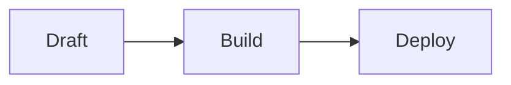

# AQVEN Docs Site Scaffold Implementation Plan

> **For agentic workers:** REQUIRED SUB-SKILL: Use superpowers:subagent-driven-development (recommended) or superpowers:executing-plans to implement this plan task-by-task. Steps use checkbox (`- [ ]`) syntax for tracking.

**Goal:** Stand up a working Astro + Starlight documentation site in `site/` — the existing aqvenstudio.com GitHub
Pages property — with the full navigation structure from the design spec as stub pages, deploying automatically on
push to `main`.

**Architecture:** `site/` joins the repo's existing pnpm workspace as `@aqven/site`. Astro's content-layer API
(`docsLoader`/`docsSchema`) backs a single `docs` content collection; Starlight supplies theme, search and
navigation; `astro-mermaid` adds diagram support. The GitHub Pages workflow gains a build step and now uploads
`site/dist/` instead of the raw `site/` source.

**Tech Stack:** Astro 7.3.3, @astrojs/starlight 0.42.1, astro-mermaid 2.1.0 + mermaid 12.0.0, TypeScript 7.0.2,
pnpm 10.33.0 (existing workspace), GitHub Actions + GitHub Pages.

**Out of scope for this plan** (see [the design spec](../specs/2026-09-18-docs-site-design.md) and separate plans
to follow): codegen bridges (CLI/API/config/diagnostics reference, §3 of the spec), real prose content for any
page beyond a one-line stub, the Ask AI widget, and the ADR-0026 §8 amendment. Every content page created here is
a deliberate placeholder — that is the correct, complete state for this plan, not an omission.

All package versions below were confirmed via `npm view <package> version` and `gh api repos/<org>/<repo>/releases/latest`
on 2026-09-18, not from memory.

---

### Task 1: Register `site` in the pnpm workspace

**Files:**
- Modify: `pnpm-workspace.yaml`
- Modify: `package.json` (root)
- Create: `site/package.json`
- Modify: `.gitignore` (root)

- [ ] **Step 1: Add `site` to the workspace**

Edit `pnpm-workspace.yaml` from:

```yaml
packages:
  - apps/*
  - packages/*
```

to:

```yaml
packages:
  - apps/*
  - packages/*
  - site
```

- [ ] **Step 2: Add the docs scripts to the root `package.json`**

Edit the `scripts` block of `package.json` (root) from:

```json
  "scripts": {
    "dev": "pnpm --filter @aqven/studio dev",
    "build": "pnpm --filter @aqven/studio build",
    "test": "pnpm --filter @aqven/studio test",
    "lint": "pnpm --filter @aqven/studio lint"
  }
```

to:

```json
  "scripts": {
    "dev": "pnpm --filter @aqven/studio dev",
    "build": "pnpm --filter @aqven/studio build",
    "test": "pnpm --filter @aqven/studio test",
    "lint": "pnpm --filter @aqven/studio lint",
    "docs:dev": "pnpm --filter @aqven/site dev",
    "docs:build": "pnpm --filter @aqven/site build"
  }
```

Leave `dev`/`build`/`test`/`lint` pointed at `@aqven/studio` unchanged — no existing script's meaning changes.

- [ ] **Step 3: Ignore Astro's cache directory**

Add one line to `.gitignore` (root), after `dist/`:

```
node_modules/
dist/
.astro/
.aqven/
*.tsbuildinfo
.DS_Store
```

- [ ] **Step 4: Create `site/package.json`**

Create `site/package.json`:

```json
{
  "name": "@aqven/site",
  "private": true,
  "version": "0.0.0",
  "type": "module",
  "engines": {
    "node": ">=24.21.0"
  },
  "scripts": {
    "dev": "astro dev",
    "build": "astro check && astro build",
    "preview": "astro preview",
    "check": "astro check"
  },
  "dependencies": {
    "@astrojs/starlight": "0.42.1",
    "astro": "7.3.3",
    "sharp": "0.35.4"
  },
  "devDependencies": {
    "@astrojs/check": "0.9.10",
    "typescript": "6.0.3"
  }
}
```

`@astrojs/check@0.9.10` peer-depends on `typescript@"^5.0.0 || ^6.0.0"` — 7.0.2 (the newest release) is not yet
supported, so this pins 6.0.3, matching `apps/studio`'s existing pin.

- [ ] **Step 5: Install and verify the workspace recognizes the new package**

Run from the repo root: `pnpm install`

Expected: pnpm resolves and installs `astro`, `@astrojs/starlight`, `sharp`, `@astrojs/check` and `typescript`
into `site/node_modules` (or the workspace's hoisted store), `pnpm-lock.yaml` is updated, and the command exits 0.
No Astro project files exist yet, so there is nothing to build — this step only proves the workspace wiring.

- [ ] **Step 6: Commit**

```bash
git add pnpm-workspace.yaml package.json site/package.json .gitignore pnpm-lock.yaml
git commit -m "$(cat <<'EOF'
Register the docs site as @aqven/site in the pnpm workspace

Empty package for now — the Astro/Starlight app itself is the next task.

Co-Authored-By: Claude Sonnet 5 <noreply@anthropic.com>
EOF
)"
```

---

### Task 2: Scaffold the Astro + Starlight app

**Files:**
- Create: `site/astro.config.mjs`
- Create: `site/tsconfig.json`
- Create: `site/src/content.config.ts`
- Create: `site/src/content/docs/index.mdx`
- Create: `site/public/CNAME`
- Modify: `site/public/favicon.svg` (move existing `site/favicon.svg` here)
- Delete: `site/favicon.svg`, `site/index.html` (superseded by the Astro project)

- [ ] **Step 1: Move the existing favicon into `public/`**

```bash
mkdir -p site/public
git mv site/favicon.svg site/public/favicon.svg
```

- [ ] **Step 2: Remove the static placeholder homepage**

```bash
git rm site/index.html
```

Its content (title, description, color tokens, canonical URL) is preserved in spirit by the config and CNAME
below — the placeholder markup itself is fully superseded by the real site being built in this plan.

- [ ] **Step 3: Add the CNAME for the custom domain**

Create `site/public/CNAME`:

```
aqvenstudio.com
```

This matches the canonical URL (`https://aqvenstudio.com/`) already declared in the placeholder page that Step 2
removed. Astro's `public/` directory is copied to the build output verbatim, so this lands at `site/dist/CNAME`,
which is what GitHub Pages looks for to serve a custom domain.

- [ ] **Step 4: Create the Starlight content collection**

Create `site/src/content.config.ts`:

```typescript
import { defineCollection } from "astro:content";
import { docsLoader } from "@astrojs/starlight/loaders";
import { docsSchema } from "@astrojs/starlight/schema";

export const collections = {
  docs: defineCollection({ loader: docsLoader(), schema: docsSchema() }),
};
```

- [ ] **Step 5: Create the TypeScript config**

Create `site/tsconfig.json`:

```json
{
  "extends": "astro/tsconfigs/strict",
  "include": [".astro/types.d.ts", "**/*"],
  "exclude": ["dist"]
}
```

- [ ] **Step 6: Create the Astro/Starlight config**

Create `site/astro.config.mjs`:

```javascript
import starlight from "@astrojs/starlight";
import { defineConfig } from "astro/config";

export default defineConfig({
  site: "https://aqvenstudio.com",
  integrations: [
    starlight({
      title: "AQVEN",
      description: "Engineer AI systems, not just prompts.",
      favicon: "/favicon.svg",
      social: [
        { icon: "github", label: "GitHub", href: "https://github.com/lastonoga/AQVEN" },
      ],
    }),
  ],
});
```

No `sidebar` key yet — Starlight auto-generates navigation from the content directory until Task 4 defines the
real structure.

- [ ] **Step 7: Create the index page**

Create `site/src/content/docs/index.mdx`:

```mdx
---
title: AQVEN
description: Engineer AI systems, not just prompts.
---

Documentation is under construction. Check back soon.
```

- [ ] **Step 8: Build and verify**

Run: `pnpm --filter @aqven/site build`

Expected: `astro check` reports no errors, `astro build` completes, exit code 0, and `site/dist/index.html` exists
and contains the string `AQVEN`.

Verify:

```bash
test -f site/dist/index.html && grep -q AQVEN site/dist/index.html && echo OK
```

Expected output: `OK`

- [ ] **Step 9: Commit**

```bash
git add site/
git commit -m "$(cat <<'EOF'
Scaffold the Astro + Starlight docs app

Replaces the static index.html placeholder with a real (if still
minimal) Starlight site: config, content collection, one stub page,
the CNAME for aqvenstudio.com.

Co-Authored-By: Claude Sonnet 5 <noreply@anthropic.com>
EOF
)"
```

---

### Task 3: Add mermaid diagram support

**Files:**
- Modify: `site/package.json`
- Modify: `site/astro.config.mjs`
- Modify: `site/src/content/docs/index.mdx`

- [ ] **Step 1: Add the dependencies**

Edit the `dependencies` block of `site/package.json` from:

```json
  "dependencies": {
    "@astrojs/starlight": "0.42.1",
    "astro": "7.3.3",
    "sharp": "0.35.4"
  },
```

to:

```json
  "dependencies": {
    "@astrojs/starlight": "0.42.1",
    "astro": "7.3.3",
    "astro-mermaid": "2.1.0",
    "mermaid": "11.17.2",
    "sharp": "0.35.4"
  },
```

`astro-mermaid@2.1.0` peer-depends on `mermaid@"^10.0.0 || ^11.0.0"` — 12.0.0 (the newest release) is not yet
supported, so this pins the latest 11.x instead.

- [ ] **Step 2: Install**

Run from the repo root: `pnpm install`

Expected: exit code 0, `pnpm-lock.yaml` updated with `astro-mermaid` and `mermaid` entries.

- [ ] **Step 3: Wire the integration**

Edit `site/astro.config.mjs` from:

```javascript
import starlight from "@astrojs/starlight";
import { defineConfig } from "astro/config";

export default defineConfig({
  site: "https://aqvenstudio.com",
  integrations: [
    starlight({
```

to:

```javascript
import mermaid from "astro-mermaid";
import starlight from "@astrojs/starlight";
import { defineConfig } from "astro/config";

export default defineConfig({
  site: "https://aqvenstudio.com",
  integrations: [
    mermaid({
      theme: "forest",
      autoTheme: true,
    }),
    starlight({
```

`astro-mermaid` must be listed before `starlight` in the `integrations` array — it processes markdown ahead of
Starlight's own pipeline.

- [ ] **Step 4: Add a smoke-test diagram to the index page**

Edit `site/src/content/docs/index.mdx` from:

```mdx
---
title: AQVEN
description: Engineer AI systems, not just prompts.
---

Documentation is under construction. Check back soon.
```

to:

```mdx
---
title: AQVEN
description: Engineer AI systems, not just prompts.
---

Documentation is under construction. Check back soon.


```

This is a real, working diagram (the docs site's own build pipeline), not throwaway test content — it can stay
until Task 4/a later content pass replaces the index page with real introduction text.

- [ ] **Step 5: Build and verify the diagram renders**

Run: `pnpm --filter @aqven/site build`

Expected: exit code 0.

Verify the mermaid markup made it into the build output:

```bash
grep -q 'mermaid' site/dist/index.html && echo OK
```

Expected output: `OK`

- [ ] **Step 6: Commit**

```bash
git add site/
git commit -m "$(cat <<'EOF'
Add mermaid diagram support to the docs site

astro-mermaid, client-side rendering, to avoid a Playwright/headless-
Chromium build dependency. Verified with a real diagram on the index
page rather than throwaway test content.

Co-Authored-By: Claude Sonnet 5 <noreply@anthropic.com>
EOF
)"
```

---

### Task 4: Build the full navigation structure with stub pages

**Files:**
- Modify: `site/astro.config.mjs`
- Create: `site/src/content/docs/getting-started.md`
- Create: `site/src/content/docs/core-concepts.md`
- Create: `site/src/content/docs/building-flows.md`
- Create: `site/src/content/docs/models-and-providers.md`
- Create: `site/src/content/docs/designing-reliable-workflows.md`
- Create: `site/src/content/docs/structured-output-and-types.md`
- Create: `site/src/content/docs/testing-and-evaluation.md`
- Create: `site/src/content/docs/reference/cli.md`
- Create: `site/src/content/docs/reference/python-api.md`
- Create: `site/src/content/docs/reference/http-api.md`
- Create: `site/src/content/docs/reference/configuration.md`
- Create: `site/src/content/docs/reference/diagnostics.md`
- Create: `site/src/content/docs/for-ai-agents.md`
- Create: `site/src/content/docs/examples.md`

Every stub below follows the same shape: real frontmatter (`title`, `description` taken directly from the design
spec's site-structure section) and a one-line body. This is the intentional final state for this plan — later
plans replace the body, not the frontmatter.

- [ ] **Step 1: Create the Guide section stub pages**

Create `site/src/content/docs/getting-started.md`:

```markdown
---
title: Getting Started
description: Install AQVEN, build your first flow, and run it.
---

This section is under construction.
```

Create `site/src/content/docs/core-concepts.md`:

```markdown
---
title: Core Concepts
description: Files as the source of truth, kinds, the step as the unit of layout, convention over configuration.
---

This section is under construction.
```

Create `site/src/content/docs/building-flows.md`:

```markdown
---
title: Building Flows
description: One page per node kind, each anchored to a real node from the Lumen example.
---

This section is under construction.
```

Create `site/src/content/docs/models-and-providers.md`:

```markdown
---
title: Models & Providers
description: Configuring providers, output modes, and which model class fits which job.
---

This section is under construction.
```

Create `site/src/content/docs/designing-reliable-workflows.md`:

```markdown
---
title: Designing Reliable Workflows
description: Decomposition heuristics, divergence and self-consistency, critic-loop rules, compounding error, gates.
---

This section is under construction.
```

Create `site/src/content/docs/structured-output-and-types.md`:

```markdown
---
title: Structured Output & Types
description: Field order, nesting limits, enum and union design, strict-mode tradeoffs.
---

This section is under construction.
```

Create `site/src/content/docs/testing-and-evaluation.md`:

```markdown
---
title: Testing & Evaluation
description: aqven check, cassettes, scenario tests, evals and gates.
---

This section is under construction.
```

- [ ] **Step 2: Create the Reference section stub pages**

Create `site/src/content/docs/reference/cli.md`:

```markdown
---
title: CLI Reference
description: Every aqven subcommand, generated from its own --help output.
---

This section is under construction.
```

Create `site/src/content/docs/reference/python-api.md`:

```markdown
---
title: Python API Reference
description: In-process usage — Project, RunOptions, create_local_app, create_mcp_server — generated from docstrings.
---

This section is under construction.
```

Create `site/src/content/docs/reference/http-api.md`:

```markdown
---
title: HTTP API Reference
description: The engine's own OpenAPI contract for any HTTP client.
---

This section is under construction.
```

Create `site/src/content/docs/reference/configuration.md`:

```markdown
---
title: Configuration Reference
description: Every YAML key, generated from the Pydantic schema of each kind.
---

This section is under construction.
```

Create `site/src/content/docs/reference/diagnostics.md`:

```markdown
---
title: Diagnostics Reference
description: Every E_ and W_ code aqven check can report, and how to fix it.
---

This section is under construction.
```

- [ ] **Step 3: Create the remaining top-level stub pages**

Create `site/src/content/docs/for-ai-agents.md`:

```markdown
---
title: For AI Coding Agents
description: How to read these docs as an agent, the MCP tool contract, and workflow/model/schema rules.
---

This section is under construction.
```

Create `site/src/content/docs/examples.md`:

```markdown
---
title: Examples
description: The full support_case flow from the Lumen showcase, walked end to end.
---

This section is under construction.
```

- [ ] **Step 4: Define the sidebar**

Edit `site/astro.config.mjs`, adding a `sidebar` key to the `starlight()` call. From:

```javascript
    starlight({
      title: "AQVEN",
      description: "Engineer AI systems, not just prompts.",
      favicon: "/favicon.svg",
      social: [
        { icon: "github", label: "GitHub", href: "https://github.com/lastonoga/AQVEN" },
      ],
    }),
```

to:

```javascript
    starlight({
      title: "AQVEN",
      description: "Engineer AI systems, not just prompts.",
      favicon: "/favicon.svg",
      social: [
        { icon: "github", label: "GitHub", href: "https://github.com/lastonoga/AQVEN" },
      ],
      sidebar: [
        {
          label: "Guide",
          items: [
            { slug: "getting-started" },
            { slug: "core-concepts" },
            { slug: "building-flows" },
            { slug: "models-and-providers" },
            { slug: "designing-reliable-workflows" },
            { slug: "structured-output-and-types" },
            { slug: "testing-and-evaluation" },
          ],
        },
        {
          label: "Reference",
          items: [
            { slug: "reference/cli" },
            { slug: "reference/python-api" },
            { slug: "reference/http-api" },
            { slug: "reference/configuration" },
            { slug: "reference/diagnostics" },
          ],
        },
        { slug: "for-ai-agents" },
        { slug: "examples" },
      ],
    }),
```

- [ ] **Step 5: Build and verify every sidebar link resolves to a real page**

Run: `pnpm --filter @aqven/site build`

Expected: exit code 0, no warnings about a sidebar entry with no matching content file.

Verify every stub was built:

```bash
for slug in getting-started core-concepts building-flows models-and-providers \
  designing-reliable-workflows structured-output-and-types testing-and-evaluation \
  reference/cli reference/python-api reference/http-api reference/configuration \
  reference/diagnostics for-ai-agents examples; do
  test -f "site/dist/$slug/index.html" || echo "MISSING: $slug"
done
echo done
```

Expected output: `done` with no `MISSING:` lines above it.

- [ ] **Step 6: Commit**

```bash
git add site/
git commit -m "$(cat <<'EOF'
Add the full site navigation with stub pages

All 15 sections from the design spec now exist as real pages with
real frontmatter and a one-line placeholder body, wired into the
sidebar in the planned Guide / Reference / top-level grouping.

Co-Authored-By: Claude Sonnet 5 <noreply@anthropic.com>
EOF
)"
```

---

### Task 5: Deploy the real site via GitHub Pages

**Files:**
- Modify: `.github/workflows/pages.yml`

- [ ] **Step 1: Update the workflow to build before uploading**

Replace the full contents of `.github/workflows/pages.yml`:

```yaml
name: Pages

on:
  push:
    branches: [main]
    paths:
      - site/**
      - .github/workflows/pages.yml
  workflow_dispatch:

permissions:
  contents: read

concurrency:
  group: pages
  cancel-in-progress: false

jobs:
  build:
    runs-on: ubuntu-latest
    steps:
      - uses: actions/checkout@v7.0.1
      - uses: pnpm/action-setup@v6.1.0
      - uses: actions/setup-node@v7.0.0
        with:
          node-version: "24"
          cache: pnpm
      - run: pnpm install --frozen-lockfile
      - run: pnpm --filter @aqven/site build
      - uses: actions/configure-pages@v6.0.0
      - uses: actions/upload-pages-artifact@v5.0.0
        with:
          path: site/dist

  deploy:
    needs: build
    runs-on: ubuntu-latest
    permissions:
      pages: write
      id-token: write
    environment:
      name: github-pages
      url: ${{ steps.deployment.outputs.page_url }}
    steps:
      - id: deployment
        uses: actions/deploy-pages@v5.0.1
```

The only changes from the existing workflow: `pnpm/action-setup`, `actions/setup-node` (with pnpm caching),
`pnpm install --frozen-lockfile` and `pnpm --filter @aqven/site build` are inserted before the existing
`configure-pages` step, and the uploaded `path` changes from `site` to `site/dist`. The trigger (`paths: site/**`)
already covers every file this plan adds.

- [ ] **Step 2: Verify the workflow is valid YAML and matches the existing job/permissions shape**

```bash
python3 -c "import yaml; yaml.safe_load(open('.github/workflows/pages.yml'))" && echo OK
```

Expected output: `OK`

- [ ] **Step 3: Commit**

```bash
git add .github/workflows/pages.yml
git commit -m "$(cat <<'EOF'
Build the Astro site before publishing it to GitHub Pages

The workflow now installs and builds @aqven/site and uploads
site/dist instead of uploading the site/ source directory verbatim.

Co-Authored-By: Claude Sonnet 5 <noreply@anthropic.com>
EOF
)"
```

- [ ] **Step 4: Push and confirm the live deploy**

```bash
git push origin main
```

After pushing, confirm the "Pages" workflow run succeeds in GitHub Actions and that `https://aqvenstudio.com/`
serves the new Starlight site (the deployed page's `<title>` should be "AQVEN", not the old placeholder). This
step needs the user present to confirm — do not push without their go-ahead, and do not consider the plan done
until the live URL is checked.

---

## Self-review notes

- **Spec coverage:** every "site scaffold + deploy" item from the design spec's Decisions table (§2) has a task —
  Astro Starlight (Task 2), `site/` as the real project location (Task 2), GitHub Pages deploy from `site/dist`
  (Task 5), mermaid via `astro-mermaid` (Task 3). Codegen bridges, content, the Ask AI widget and the ADR
  amendment are explicitly out of scope (see the plan header) and belong to the separate plans agreed with the
  user before this one was written.
- **Placeholder scan:** every step shows complete file contents or an exact command with expected output; no
  step says "similar to above" or leaves a TODO for the engineer to fill in. The site *content* itself is
  intentionally placeholder text ("This section is under construction") — that is the planned deliverable, not
  a plan-writing shortcut.
- **Type/name consistency:** the package is `@aqven/site` everywhere it's referenced (root scripts, workflow,
  `pnpm --filter`); the collection is `docs` everywhere (content.config.ts, file paths under `src/content/docs/`,
  Starlight's own convention); sidebar `slug` values match the file paths exactly (e.g. `reference/cli` →
  `site/src/content/docs/reference/cli.md`).
